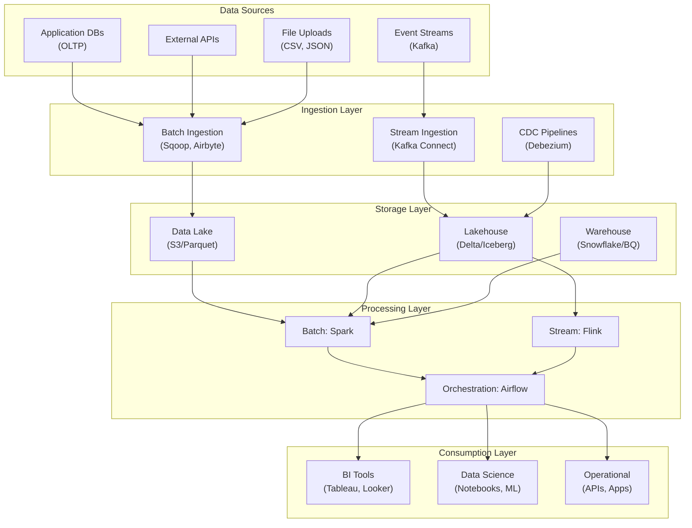

# 02 — Data Engineering

Data engineering is the practice of designing, building, and maintaining systems that collect, store, process, and analyze data at scale. It is the foundation upon which analytics, machine learning, and business intelligence are built—without reliable data pipelines, every downstream system fails.

## The Data Engineering Landscape



## Core Concepts

### The Data Pipeline Lifecycle

Every data engineering problem follows the same fundamental lifecycle, regardless of scale:

1. **Ingestion** — Getting data from source systems into your data platform. This may be batch (nightly exports, daily dumps) or streaming (event queues, CDC feeds). The key decisions are: batch vs streaming, schema-on-read vs schema-on-write, and how to handle schema evolution from source systems.

2. **Storage** — Choosing where and how to store data. The modern stack offers a spectrum: data lakes (cheap, flexible, no ACID), lakehouses (cheap + ACID + schema enforcement), and warehouses (expensive, performant, structured). The trend is toward lakehouses that combine the cost benefits of object storage with warehouse-grade reliability.

3. **Processing** — Transforming raw data into usable form. This ranges from simple SQL transformations to complex distributed computations. The processing paradigm (batch, micro-batch, or streaming) depends on latency requirements. The medallion architecture (bronze → silver → gold) is the dominant pattern.

4. **Orchestration** — Managing dependencies, scheduling, retries, and monitoring. Orchestrators like Airflow, Dagster, and Prefect turn individual processing steps into reliable, observable pipelines with SLAs and alerting.

5. **Consumption** — Serving processed data to downstream consumers: BI dashboards, ML models, operational applications, and ad-hoc analytics. The interface varies by consumer — SQL for analysts, feature vectors for ML, APIs for applications.

### Batch vs Stream: The Continuum

The traditional batch-vs-stream binary is misleading. In practice, most architectures use both:

- **Batch** (hours/days latency): Historical reporting, ML training data, backfills. Tools: Spark, dbt, Hive.
- **Micro-batch** (seconds/minutes): Structured Streaming, Spark Streaming. Good for near-real-time ETL.
- **True stream** (milliseconds): Flink, Kafka Streams. Required for fraud detection, real-time monitoring.
- **Lambda architecture**: Batch + stream layers with merging (largely replaced by Kappa architecture).
- **Kappa architecture**: Single streaming pipeline for all data, with batch treated as replay.

### The Medallion Architecture

```python
# Bronze → Silver → Gold pattern
class MedallionPipeline:
    """The dominant data lakehouse architecture pattern."""

    def __init__(self, spark_session, base_path: str):
        self.spark = spark_session
        self.base_path = base_path

    def bronze_layer(self, source_path: str, table_name: str) -> str:
        """Raw data as-is from source. Append-only, full history."""
        bronze_path = f"{self.base_path}/bronze/{table_name}"
        df = self.spark.read.format("parquet").load(source_path)
        df.write.format("delta") \
            .mode("append") \
            .save(bronze_path)
        print(f"Bronze: {df.count()} records ingested")
        return bronze_path

    def silver_layer(self, table_name: str) -> str:
        """Cleaned, validated, deduplicated data."""
        bronze_path = f"{self.base_path}/bronze/{table_name}"
        silver_path = f"{self.base_path}/silver/{table_name}"
        df = self.spark.read.format("delta").load(bronze_path)
        cleaned = (
            df
            .dropDuplicates(["event_id"])
            .filter("amount IS NOT NULL")
            .filter("amount > 0")
            .withColumn("ingestion_date", F.current_date())
        )
        cleaned.write.format("delta") \
            .mode("overwrite") \
            .option("mergeSchema", "true") \
            .save(silver_path)
        print(f"Silver: {cleaned.count()} records after cleaning")
        return silver_path

    def gold_layer(self, table_name: str) -> str:
        """Aggregated, business-ready data."""
        silver_path = f"{self.base_path}/silver/{table_name}"
        gold_path = f"{self.base_path}/gold/{table_name}"
        df = self.spark.read.format("delta").load(silver_path)
        aggregated = (
            df
            .groupBy("product_category", F.window("timestamp", "1 day"))
            .agg(
                F.sum("amount").alias("revenue"),
                F.count("event_id").alias("transactions"),
                F.avg("amount").alias("avg_order_value")
            )
            .withColumn("report_date", F.col("window.start"))
        )
        aggregated.write.format("delta") \
            .mode("overwrite") \
            .save(gold_path)
        print(f"Gold: {aggregated.count()} aggregated records")
        return gold_path
```

## Why Data Engineering Matters

Without data engineering, data science teams spend 60-80% of their time on data preparation rather than modeling. Without data engineering, dashboards show yesterday's data because pipelines broke. Without data engineering, ML models train on stale or incorrect data because no one tracked lineage.

The modern data engineer must understand:
- **Distributed systems** — how Spark partitions data, how Flink manages state, how Kafka guarantees ordering
- **Storage internals** — Parquet columnar layout, Delta transaction log, Iceberg manifest files, partition pruning
- **SQL deeply** — window functions, query optimization, execution plans, join strategies
- **Cloud infrastructure** — object storage, networking, IAM, auto-scaling, spot instances
- **Data modeling** — dimensional modeling, Data Vault, lakehouse design, schema evolution
- **Observability** — monitoring pipeline health, data quality checks, lineage tracking, SLA enforcement

## Table of Contents

- [Data Processing](#data-processing)
  - [Batch Processing](#batch-processing)
  - [Stream Processing](#stream-processing)
  - [Processing Frameworks](#processing-frameworks)
- [Orchestration](#orchestration)
  - [Workflow Orchestrators](#workflow-orchestrators)
  - [Data Pipeline Patterns](#data-pipeline-patterns)
  - [Scheduling & Dependency Management](#scheduling--dependency-management)
- [Storage Formats](#storage-formats)
  - [Columnar Formats](#columnar-formats)
  - [Row-based Formats](#row-based-formats)
  - [Serialization](#serialization)
  - [Schema Management](#schema-management)
- [Warehouse & Lakehouse](#warehouse--lakehouse)
  - [Cloud Data Warehouses](#cloud-data-warehouses)
  - [Data Lakehouses](#data-lakehouses)
  - [Data Lakes](#data-lakes)
  - [Catalog & Metastore](#catalog--metastore)
- [Streaming](#streaming)
  - [Streaming Concepts](#streaming-concepts)
  - [Stream Processing Frameworks](#stream-processing-frameworks)
  - [Exactly-Once Semantics](#exactly-once-semantics)
  - [Windowing & Time Handling](#windowing--time-handling)
- [Data Quality & Governance](#data-quality--governance)
  - [Data Quality Frameworks](#data-quality-frameworks)
  - [Data Governance](#data-governance)
  - [Data Lineage](#data-lineage)
  - [Data Cataloging](#data-cataloging)
  - [Privacy & Compliance](#privacy--compliance)
- [Learning Path](#learning-path)
- [Cross-References](#cross-references)

---

## Data Processing

### Batch Processing

Processing large volumes of data on a schedule. The dominant paradigm for ETL/ELT, reporting, and historical analysis.

- **ETL vs ELT** — extract-transform-load (legacy) vs extract-load-transform (modern cloud); tradeoffs, when each applies
- **MapReduce** — distributed computation model: map (shard, process) → shuffle (sort, group) → reduce (aggregate)
- **Distributed Processing** — data partitioning, task parallelism, fault tolerance via task retry, speculative execution
- **Optimization** — data skew handling, broadcast joins, bucketing, partitioning, compression codec selection

### Stream Processing

Processing data in real-time as it arrives. Required for low-latency analytics, monitoring, fraud detection.

- **Event Time vs Processing Time** — out-of-order handling, watermarks, late data, idle sources
- **Windowing** — tumbling, sliding, session; trigger policies, allowed lateness
- **State Management** — stateful operations, state backends (RocksDB, in-memory), checkpointing
- **Backpressure** — dynamic scaling, rate limiting, buffer management

### Processing Frameworks

| Framework | Type | Language | Key Strength |
|-----------|------|----------|--------------|
| **Apache Spark** | Batch + micro-batch | Scala, Python, SQL, R | Unified analytics, ML integration, mature ecosystem |
| **Apache Flink** | True streaming | Java, Python, SQL | Low-latency streaming, event-time semantics, state management |
| **Apache Beam** | Unified (batch + stream) | Java, Python, Go | Portable across runners (Flink, Spark, Dataflow) |
| **Apache Storm** | Stream | Java, Clojure | Low-latency (legacy, largely replaced by Flink) |
| **Pandas / Polars** | Single-node | Python | Data exploration, in-memory analytics |
| **Dask / Ray** | Distributed Python | Python | Parallelizing Python workloads, ML data prep |

---

## Orchestration

### Workflow Orchestrators

Orchestrators manage DAGs of tasks—handling dependencies, retries, scheduling, and monitoring.

- **Apache Airflow** — Python DAG definitions, rich operator ecosystem, scheduler + workers; widely adopted but has scaling limits and dynamic DAG challenges
- **Dagster** — asset-oriented orchestration, software-defined assets, typed inputs/outputs; strong testability, observability
- **Prefect** — Python-native, dynamic DAGs, automatic retries, hybrid execution model (local + cloud)
- **Apache Oozie** — Hadoop-native (legacy), XML definitions
- **Cloud Orchestrators** — AWS Step Functions, GCP Workflows, Azure Data Factory

### Data Pipeline Patterns

- **Medallion Architecture** — bronze (raw) → silver (cleaned/validated) → gold (aggregated/curated); Delta Lake native
- **Star Schema / Kimball** — dimensional modeling for data warehouses: fact tables + dimension tables
- **Data Vault** — hubs, links, satellites; auditable, scalable warehouse modeling
- **One Big Table (OBT)** — denormalized for analytics; trading storage for query simplicity
- **Incremental Processing** — watermark-based, CDC-based (change data capture), append-only; replacing full refreshes

### Scheduling & Dependency Management

- Cron-based scheduling, event-driven triggers, sensor-based waits
- Cross-DAG dependencies, dataset-driven scheduling (Dagster), data-aware scheduling (Airflow 2.x datasets)
- Task retry policies: exponential backoff, max retries, retry delay

---

## Storage Formats

### Columnar Formats

Optimized for analytical queries—read few columns, excellent compression.

- **Apache Parquet** — columnar, nested (structs, lists, maps), predicate pushdown, bloom filters, statistics in footer; *the* standard for data lakes and lakehouses
- **Apache ORC** — similar to Parquet, lighter footers, built-in indexes; Hive-native, used in ACID tables
- **Comparison** — Parquet vs ORC: compression ratios, read performance, ecosystem support; Parquet dominates outside Hive

### Row-based Formats

Optimized for OLTP—insert/update heavy, full-row access.

- **Apache Avro** — row-based, schema embedded in file (JSON), splittable, good for write-heavy logs and Kafka messages
- **CSV / JSON / JSONL** — human-readable, schema-less or external schema; inefficient for analytics, widely used for interchange

### Serialization

- **Protocol Buffers** (protobuf) — binary, strongly typed, schema evolution (field numbers), code generation; gRPC-native
- **Apache Thrift** — binary, code generation, wider language support than protobuf
- **Apache Arrow** — columnar in-memory format, zero-copy serialization; bridges processing frameworks

### Schema Management

- **Schema Registry** — Confluent Schema Registry (Avro/protobuf/JSON Schema), Karapace; manages schema evolution, compatibility checks (backward, forward, full, none)
- **Schema Evolution** — adding/removing fields, changing types; compatibility rules; protobuf field numbers; Avro aliases

---

## Warehouse & Lakehouse

### Cloud Data Warehouses

Massively parallel SQL analytics. Designed for structured/business data, ACID transactions, high concurrency.

- **Snowflake** — separation of storage and compute, virtual warehouses, automatic clustering, zero-copy cloning, time travel, data sharing (marketplace)
- **Google BigQuery** — serverless, columnar storage (Capacitor), Dremel execution engine, BI Engine, slot reservations, omni-region
- **Amazon Redshift** — columnar (blocks/zone maps), leader + compute nodes, RA3 nodes (managed storage), AQUA, Spectrum (external tables)
- **Azure Synapse** — (formerly SQL DW); dedicated + serverless pools, deep Azure integration

### Data Lakehouses

Combining data lake flexibility with warehouse ACID and performance.

- **Delta Lake** — open-source (Linux Foundation); ACID transactions on Parquet, time travel, schema enforcement, OPTIMIZE/ZORDER, Delta Sharing; *the most adopted lakehouse format*
- **Apache Iceberg** — open table format; catalog-backed (Hive, Nessie, JDBC, REST), hidden partitioning, partition evolution, branching/merging (experimental), row-level DELETE/UPDATE via merge-on-read or copy-on-write
- **Apache Hudi** — incremental processing focused; upsert/decrement support, mor (merge-on-read) / cow (copy-on-write), clustering, compaction
- **Comparison** — Delta vs Iceberg vs Hudi: catalog support, Spark/Trino/Flink integration, maturity, AWS/GCP/Databricks alignment

### Data Lakes

- Raw object storage (S3, GCS, ADLS) + metadata layer + processing engine
- Lakehouse models replace most traditional data lakes by adding ACID and structure
- Key concerns: small file problem, partitioning strategy, garbage collection, lifecycle policies

### Catalog & Metastore

- **Hive Metastore** — the classic; backed by RDBMS; tables, partitions, columns, SerDes; thrift API
- **AWS Glue Catalog** — managed Hive-compatible; crawlers for schema inference
- **Unity Catalog** (Databricks) — fine-grained access control, lineage, data discovery
- **Polaris** (Snowflake open-source catalog for Iceberg)

---

## Streaming

### Streaming Concepts

- **At-least-once** — duplicates possible, no data loss
- **At-most-once** — no duplicates, possible data loss
- **Exactly-once** — each record processed exactly once (requires idempotent sinks + transactional sources + checkpoint)
- **Event Time vs Ingestion Time vs Processing Time** — which timestamp governs the computation?
- **Watermarks** — threshold for determining event time completeness before emitting windows

### Stream Processing Frameworks

- **Apache Flink** — leader for stream processing; true streaming (not micro-batch), exactly-once, savepoints, complex event processing (CEP), SQL client
- **Apache Spark Streaming** — micro-batch (structured streaming); exactly-once via WAL; integration with Delta/Auto Loader; better for ETL than true streaming
- **Kafka Streams** — embeddable Java library (no cluster), exactly-once in Kafka, state stores (RocksDB), exactly-once semantics
- **Apache Samza** — YARN-based, Kafka/RockDB state; largely superseded by Flink/Kafka Streams
- **Cloud Managed** — Kinesis Data Analytics (Flink on AWS), Dataflow (Beam runner on GCP), Azure Stream Analytics

### Exactly-Once Semantics

Achieving end-to-end exactly-once requires coordination across source, processing engine, and sink:

- Source: Kafka transactional producer, idempotent source read (offset tracking)
- Processing: checkpointing (Flink savepoints, Spark streaming WAL)
- Sink: idempotent writes (database upserts, deduplication keys), transactional sinks (Kafka transactions, two-phase commit)

### Windowing & Time Handling

- **Tumbling Windows** — fixed-size, non-overlapping; simple aggregations
- **Sliding Windows** — fixed-size, overlapping; moving averages
- **Session Windows** — gap-based; user behavior analysis
- **Global Windows** — all records; full-table aggregations
- **Allowed Lateness** — how long to wait for late events before finalizing a window
- **Side Outputs** — capturing late events for separate processing/debugging

---

## Data Quality & Governance

### Data Quality Frameworks

- **Dimensions** — completeness, accuracy, timeliness, consistency, uniqueness, validity
- **Validation** — Great Expectations, dbt tests, Soda, Deequ (Spark-based)
- **Observability** — Monte Carlo, Bigeye, Sifflet, Datadog Data Monitoring; automated root cause analysis
- **SLA/SLO** — freshness, completeness, accuracy SLAs; data downtime

### Data Governance

- **Access Control** — RBAC, ABAC, column-level security, row-level filtering, data masking
- **Audit** — who accessed what, when; query logging, access patterns
- **Classification** — PII, sensitive, public, confidential; automatic classification (matching, ML-based)
- **Data Retention** — lifecycle policies, archival, deletion; hot/warm/cold tiering
- **GDPR/CCPA** — right to deletion (forget), data portability, consent management

### Data Lineage

- Tracking data from source → transformation → consumption
- Column-level lineage, transformation lineage (SQL parsing, Spark plan analysis)
- Tools: OpenLineage, Atlan, Collibra, Alation, Databricks Lineage, dbt artifacts

### Data Cataloging

- **Metadata Management** — table descriptions, column descriptions, tags, owners
- **Discovery** — search, browse, popularity scores, data preview
- **Tools** — DataHub (LinkedIn), Amundsen (Lyft), Apache Atlas, Collibra, Alation, Atlan

### Privacy & Compliance

- **Anonymization** — masking, generalization, perturbation, k-anonymity, l-diversity, differential privacy
- **Tokenization** — replacing sensitive values with tokens; reversible for analytics
- **Consent Management** — tracking data subject consent, processing purposes

---

## Learning Path

1. **Stage 1** — SQL proficiency, Python for data, bash/Unix fundamentals, Git
2. **Stage 2** — Data modeling (dimensional, Data Vault, lakehouse), storage formats (Parquet, Avro), file system (S3/GCS)
3. **Stage 3** — Batch processing (Spark, Spark SQL, DataFrames), orchestration (Airflow/Dagster)
4. **Stage 4** — Streaming (Kafka, Flink, Kafka Streams), streaming ETL patterns, exactly-once semantics
5. **Stage 5** — Lakehouse architecture (Delta/Iceberg), warehouse (Snowflake/BigQuery), catalog and governance
6. **Stage 6** — Data quality, observability, lineage, advanced governance, data platform design

---

## Cross-References

| Domain | Connection |
|--------|-----------|
| [01 — AI/ML](../01-ai-ml/) | Feature engineering, training data pipelines, model inference data preparation, feature stores |
| [03 — Backend](../03-backend/) | API design for data ingestion, backend data processing services, event-driven architectures |
| [05 — Cloud](../05-cloud/) | S3/GCS/ADLS object stores, managed warehouses (Redshift, BigQuery, Snowflake), EMR/Dataproc |
| [06 — DevOps](../06-devops/) | Infrastructure as code for data infrastructure, Airflow/Airbyte on K8s, data pipeline CI/CD |
| [07 — Kubernetes](../07-kubernetes/) | Running Spark/Flink on K8s, elastic scaling for data workloads, Spark Operator |
| [08 — Databases](../08-databases/) | OLTP vs OLAP boundaries, CDC sources, warehouse internals, query engine architecture |
| [09 — Distributed Systems](../09-distributed-systems/) | Distributed processing foundations, consensus for metadata, replication for fault tolerance |
| [10 — Messaging](../10-messaging/) | Event backbone for streaming, Kafka as data bus, message semantics |
| [11 — Networking](../11-networking/) | Data transfer optimization, network for shuffle, bandwidth limits in large-scale processing |

---

## Related

- [Databases](../../08-databases/) — Data storage and querying
- [Messaging](../../10-messaging/) — Event streaming (Kafka)
- [Cloud Platforms](../../05-cloud/) — Data warehousing (Redshift, BigQuery)
- [Backend](../../03-backend/) — Data service APIs
- [Distributed Systems](../../09-distributed-systems/) — Scale and consistency
