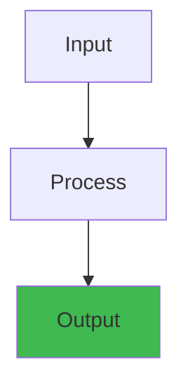

# Data Governance and Data Quality


## Overview




## Data Quality Dimensions

Data quality is measured across multiple dimensions. Each dimension addresses a different aspect of data fitness for use.

### The Six Core Dimensions

```
Completeness
  Are all required values present?
  +------------------------+------------------+
  | Column                 | Null Rate        |
  +------------------------+------------------+
  | customer_id            | 0.0%             |
  | email                  | 2.3%             |
  | phone                  | 34.5%            | <- Missing 1/3 of data
  | address                | 5.1%             |
  +------------------------+------------------+

Accuracy
  Do values reflect the real world?
  +------------------------+------------------+
  | Check                  | Error Rate       |
  +------------------------+------------------+
  | email format valid     | 0.5%             |
  | zip code in valid list | 1.2%             |
  | transaction < $1M      | 0.01%            |
  +------------------------+------------------+

Timeliness
  Is data available when needed?
  +------------------------+------------------+
  | Metric                 | Value            |
  +------------------------+------------------+
  | Ingestion latency (p50)| 2 seconds        |
  | Ingestion latency (p99)| 30 seconds       |
  | Batch delivery SLA     | 06:00 daily      |
  | Actual delivery time   | 05:45            |
  +------------------------+------------------+

Consistency
  Does data agree across systems?
  +------------------------+------------------+
  | Check                  | Discrepancy      |
  +------------------------+------------------+
  | orders vs payments     | 0.1% mismatch    |
  | CRM vs data warehouse  | 2.3% difference  |
  | daily vs hourly totals | 0.05% diff       |
  +------------------------+------------------+

Uniqueness
  No unintended duplicates?
  +------------------------+------------------+
  | Check                  | Duplicate Rate   |
  +------------------------+------------------+
  | customer_id duplicate  | 0.02%            |
  | order_id duplicate     | 0.001%           |
  | session dedup required | 5.0%             |
  +------------------------+------------------+

Validity
  Does data conform to business rules?
  +------------------------+------------------+
  | Rule                   | Violation Rate   |
  +------------------------+------------------+
  | age > 0 and age < 120 | 0.01%            |
  | transaction_date > 0  | 0.001%           |
  | status in [A,B,C]     | 0.5%             |
  +------------------------+------------------+
```

### Freshness SLAs

Data freshness SLAs define how current data must be:

```
Table                    Freshness SLA        Business Impact
+----------------------+--------------------+------------------+
| real-time dashboard  | < 1 second         | Operational      |
| streaming metrics    | < 1 minute         | Alerting         |
| hourly aggregations  | < 15 minutes       | Reporting        |
| daily batch reports  | < 1 hour           | Business review  |
| monthly financials   | < 1 day            | Compliance       |
| archival data        | < 1 week           | Analytics        |
+----------------------+--------------------+------------------+
```

## Data Quality Monitoring

### Great Expectations

Great Expectations is an open-source Python library for validating, documenting, and profiling data.

```python
import great_expectations as gx
from great_expectations.core.batch import RuntimeBatchRequest

# Create Data Context
context = gx.get_context()

# Define datasource
datasource = context.sources.add_spark(
    name="spark_datasource"
)

# Create Expectation Suite
suite = context.add_expectation_suite("sales_pipeline")

# Batch request
batch_request = RuntimeBatchRequest(
    datasource_name="spark_datasource",
    data_connector_name="default_runtime_data_connector_name",
    data_asset_name="sales_data",
    batch_identifiers={"default_identifier_name": "default_identifier"},
    runtime_parameters={"path": "s3://data-landing/sales/*.parquet"},
    batch_spec={
        "reader_method": "parquet",
    },
)

# Define expectations
validator = context.get_validator(
    batch_request=batch_request,
    expectation_suite=suite,
)

# Basic expectations
validator.expect_table_row_count_to_be_between(min_value=1000, max_value=10000000)
validator.expect_column_to_exist("order_id")
validator.expect_column_to_exist("customer_id")
validator.expect_column_to_exist("amount")

# Column-level expectations
validator.expect_column_values_to_not_be_null("order_id")
validator.expect_column_values_to_be_unique("order_id")
validator.expect_column_values_to_be_between("amount", min_value=0, max_value=1000000)
validator.expect_column_values_to_be_in_set("status", ["pending", "completed", "cancelled"])
validator.expect_column_mean_to_be_between("amount", min_value=10, max_value=500)

# Pattern matching
validator.expect_column_values_to_match_regex("email", r"^[a-zA-Z0-9._%+-]+@[a-zA-Z0-9.-]+\.[a-zA-Z]{2,}$")

# Custom expectations
@expectation(
    name="expect_column_skewness_to_be_between",
    column_types=["numeric"],
)
def expect_column_skewness_to_be_between(
    column,
    min_value=None,
    max_value=None,
):
    skew = column.skew()
    success = True
    if min_value is not None:
        success = success and (skew >= min_value)
    if max_value is not None:
        success = success and (skew <= max_value)
    return {
        "success": success,
        "result": {"observed_value": float(skew)},
    }

# Run validation
results = validator.validate()
print(f"Success: {results['success']}")
print(f"Statistics: {results['statistics']}")
# {
#   "evaluated_expectations": 15,
#   "successful_expectations": 14,
#   "unsuccessful_expectations": 1,
#   "success_percent": 93.3
# }

# Save suite
suite = validator.get_expectation_suite()
context.add_or_update_expectation_suite(expectation_suite=suite)
context.build_data_docs()
```

**Data Docs** (generated HTML documentation):

```
Great Expectations
  +-- Data Docs/
  |   +-- expectations/
  |   |   +-- sales_pipeline.html  (expectation suite)
  |   +-- validations/
  |   |   +-- 20240315T100000/
  |   |   |   +-- sales_data.html  (validation results)
  |   |   +-- 20240316T100000/
  |   |   |   +-- sales_data.html
  |   +-- index.html              (dashboard)
```

### dbt Tests

dbt (data build tool) provides built-in and custom data quality tests:

```yaml
# schema.yml
version: 2

models:
  - name: orders
    description: "Customer orders"
    columns:
      - name: order_id
        description: "Primary key"
        tests:
          - unique
          - not_null
      - name: customer_id
        tests:
          - not_null
          - relationships:
              to: ref('customers')
              field: customer_id
      - name: amount
        tests:
          - not_null
          - accepted_values:
              values: ['pending', 'completed', 'cancelled', 'refunded']
      - name: status
        tests:
          - accepted_values:
              values: ['pending', 'completed', 'cancelled']
      - name: created_at
        tests:
          - not_null
          - dbt_utils.expression_is_true:
              expression: "created_at <= CURRENT_TIMESTAMP"

    # Custom singular tests
    tests:
      - fresh_orders:
          freshness_threshold_hours: 24

    # Freshness (built-in)
    freshness:
      warn_after:
        count: 24
        period: hour
      error_after:
        count: 48
        period: hour
```

```sql
-- tests/fresh_orders.sql (custom test)

SELECT
    MAX(created_at) as max_timestamp,
    CURRENT_TIMESTAMP - INTERVAL '{{ freshness_threshold_hours }} hours' as threshold
FROM {{ model }}
HAVING MAX(created_at) < CURRENT_TIMESTAMP - INTERVAL '{{ freshness_threshold_hours }} hours'

```

```bash
# Run dbt tests
dbt test                        # Run all tests
dbt test --select orders        # Test specific model
dbt test --select source:raw.*  # Test raw sources
dbt test --store-failures       # Store failures in table
```

### Soda

Soda is an open-source data quality framework:

```yaml
# checks/sales_checks.yml
checks for orders:
  - row_count > 1000
  - duplicate_count(order_id) = 0
  - missing_count(customer_id) = 0
  - missing_count(email) < 100
  - max(amount) < 1000000
  - min(amount) >= 0
  - avg(amount) between 50 and 200
  - stddev(amount) < 500
  - freshness(created_at) < 24h
  - values in (status) must be in ('pending', 'completed', 'cancelled')
  - failed rows:
      name: Check for negative amounts
      fail condition: amount < 0

# Custom SQL check
checks for orders:
  - sql: |
      SELECT count(*) as validation_errors
      FROM orders o
      LEFT JOIN customers c ON o.customer_id = c.customer_id
      WHERE c.customer_id IS NULL
    name: Referential integrity

# Anomaly detection (requires Soda Cloud)
checks for orders:
  - anomaly_detection(row_count)
  - anomaly_detection(avg_amount)
  - anomaly_detection(missing_percent(email))
```

```bash
# Run Soda checks
soda scan -d my_datasource -c configuration.yml checks/sales_checks.yml
```

### Deequ

Deequ is a data quality library built on Apache Spark:

```scala
// Scala Deequ example
import com.amazon.deequ.{VerificationSuite, VerificationResult}
import com.amazon.deequ.checks.{Check, CheckLevel, CheckStatus}
import com.amazon.deequ.constraints.ConstraintStatus

val df = spark.read.parquet("s3://data/warehouse/orders")

val verificationResult = VerificationSuite()
  .onData(df)
  .addCheck(
    Check(CheckLevel.Error, "Orders quality check")
      .isComplete("order_id")
      .isUnique("order_id")
      .isComplete("customer_id")
      .isNonNegative("amount")
      .hasMin("amount", _ >= 0)
      .hasMax("amount", _ <= 1000000)
      .hasSize(_ >= 1000)
      .containsURL("email", _ == 0.0)  // No URLs in email field
      .hasDataType("amount", ConstrainableDataTypes.Numeric)
  )
  .addCheck(
    Check(CheckLevel.Warning, "Orders warning check")
      .hasCompleteness("email", _ >= 0.95)
      .hasDistinctness("status", _ >= 0.01)
      .hasCorrelation("amount", "tax", _ >= 0.8)
  )
  .run()

// Check results
if (verificationResult.status == CheckStatus.Success) {
  println("All quality checks passed!")
} else {
  verificationResult.checkResults.foreach { case (check, result) =>
    println(s"Check: ${check.description}")
    println(s"  Status: ${result.status}")
    result.constraintResults.foreach { constraint =>
      println(s"  Constraint: ${constraint.constraint}")
      println(s"    Status: ${constraint.status}")
      if (constraint.status != ConstraintStatus.Success) {
        println(s"    Message: ${constraint.message.getOrElse("")}")
      }
    }
  }
}
```

## Data Lineage

### OpenLineage

OpenLineage is an open standard for collecting data lineage metadata:

```
OpenLineage events flow:
  Spark Job -> OpenLineage Spark Listener -> Lineage API -> Database

Lineage graph:
  +--------+          +-----------+          +---------+
  | Source | -------> | Transform | -------> | Sink    |
  | (S3)   |          | (Spark    |          | (Delta) |
  | raw_   |          |  job)     |          | cleaned |
  | events |          |           |          | _events |
  +--------+          +-----------+          +---------+
       Dataset               Run               Dataset
```

```python
# OpenLineage in Spark (via spark-submit)
# --conf spark.extraListeners=io.openlineage.spark.agent.OpenLineageSparkListener
# --conf spark.openlineage.host=http://marquez:5000
# --conf spark.openlineage.namespace=my_namespace
# --conf spark.openlineage.jobName=etl_job

# To emit custom lineage events
from openlineage.client import OpenLineageClient
from openlineage.client.run import RunEvent, RunState, Run, Job

client = OpenLineageClient(url="http://marquez:5000")

# Emit lineage event
event = RunEvent(
    eventType=RunState.COMPLETE,
    eventTime=datetime.now().isoformat(),
    run=Run(runId=str(uuid.uuid4())),
    job=Job(namespace="data-pipeline", name="enrich-orders"),
    inputs=[{"namespace": "s3", "name": "raw/orders/*.parquet"}],
    outputs=[{"namespace": "s3", "name": "curated/enriched-orders/*.parquet"}],
)
client.emit(event)
```

### Marquez

Marquez is an open-source metadata service for data lineage:

```bash
# Start Marquez with docker
docker run -d -p 5000:5000 -p 5001:5001 marquezproject/marquez

# API - List datasets
curl http://localhost:5000/api/v1/datasets

# API - Get lineage for a dataset
curl http://localhost:5000/api/v1/lineage?nodeId=s3://data/warehouse/orders

# Response:
{
  "graph": [
    {
      "type": "DATASET",
      "name": "raw_orders",
      "namespace": "s3",
      "inputs": [],
      "outputs": ["etl_job"]
    },
    {
      "type": "JOB",
      "name": "etl_job",
      "namespace": "spark",
      "inputs": ["raw_orders"],
      "outputs": ["cleaned_orders"]
    },
    {
      "type": "DATASET",
      "name": "cleaned_orders",
      "namespace": "s3",
      "inputs": ["etl_job"],
      "outputs": []
    }
  ]
}
```

### DataHub

DataHub is a metadata platform for data discovery, lineage, and governance.

```python
# DataHub ingestion via Python SDK
from datahub.ingestion.run.pipeline import Pipeline

pipeline = Pipeline.create(
    config={
        "source": {
            "type": "snowflake",
            "config": {
                "account_id": "xyz123",
                "username": "${SNOWFLAKE_USER}",
                "password": "${SNOWFLAKE_PASS}",
                "database": "PROD",
                "warehouse": "COMPUTE_WH",
            },
        },
        "sink": {
            "type": "datahub-rest",
            "config": {"server": "http://datahub-gms:8080"},
        },
    }
)
pipeline.run()

# Query lineage via GraphQL
# {
#   dataset(urn: "urn:li:dataset:(urn:li:dataPlatform:snowflake,PROD.ORDERS,PROD)") {
#     name
#     upstream: lineage(inputs: {direction: UPSTREAM, start: 0, count: 10}) {
#       relationships {
#         type
#         entity { urn type }
#       }
#     }
#   }
# }
```

## Data Catalog

### Comparison

| Feature | DataHub | Amundsen | Atlan | Collibra |
|---------|---------|----------|-------|----------|
| Open source | Yes (Apache) | Yes (Apache) | No | No |
| Lineage | Rich column-level | Table-level | Column + transformation | Column-level |
| Discovery | Search + facets | Search + badges | AI-powered | Business glossary |
| Governance | Tags + domains | Owners + badges | Data contracts | Workflow-driven |
| ML integration | Feature store | Basic | ML model catalog | AI governance |
| Setup complexity | Moderate | High | SaaS | Enterprise |
| Popularity | Growing | Mature | Enterprise | Enterprise |

### DataHub Example

```yaml
# datahub ingestion recipe (snowflake_to_datahub.yml)
source:
  type: snowflake
  config:
    account_id: xyz123
    username: admin
    password: ${SNOWFLAKE_PASS}
    database: PROD
    schema: PUBLIC
    include_views: true
    profiling:
      enabled: true
      profile_table_level_only: false
      profile_table_row_limit: 100000

sink:
  type: datahub-rest
  config:
    server: http://datahub-gms:8080
```

## Schema Registry

### Confluent Schema Registry

Schema Registry provides centralized schema management for Kafka and other streaming systems.

```
Schema Registry API:
  POST   /subjects/{subject}/versions     Register new schema version
  GET    /subjects/{subject}/versions     List schema versions
  GET    /subjects/{subject}/versions/{version}  Get specific version
  POST   /compatibility/subjects/{subject}/versions  Check compatibility
  GET    /schemas/ids/{id}                Get schema by ID
  DELETE /subjects/{subject}              Delete subject
```

### Supported Serialization Formats

| Format | Schema Definition | Best For |
|--------|------------------|----------|
| Avro | JSON | Schema evolution, compact binary |
| Protobuf | .proto files | Strong typing, cross-language |
| JSON Schema | JSON | JSON-native systems, web APIs |

### Compatibility Modes

```bash
# Set compatibility globally
curl -X PUT -H "Content-Type: application/vnd.schemaregistry.v1+json" \
  --data '{"compatibility": "BACKWARD"}' \
  http://localhost:8081/config

# Set per-subject
curl -X PUT -H "Content-Type: application/vnd.schemaregistry.v1+json" \
  --data '{"compatibility": "FORWARD_TRANSITIVE"}' \
  http://localhost:8081/config/orders-value

# Available modes:
#   BACKWARD:         New schema reads old data (new fields must have defaults)
#   BACKWARD_TRANSITIVE:  Backward + must be compatible with ALL previous versions
#   FORWARD:          Old schema reads new data (removed fields work)
#   FORWARD_TRANSITIVE:   Forward + must be compatible with ALL previous versions
#   FULL:             Both backward and forward compatible
#   FULL_TRANSITIVE:  Full + all previous versions
#   NONE:             No compatibility checks
```

**Compatibility examples**:

```json
// v1 schema
{"name": "User", "type": "record", "fields": [
  {"name": "name", "type": "string"},
  {"name": "age", "type": "int"}
]}

// BACKWARD compatible: added field with default
{"name": "User", "fields": [
  {"name": "name", "type": "string"},
  {"name": "age", "type": "int"},
  {"name": "email", "type": ["null", "string"], "default": null}
]}

// BACKWARD INCOMPATIBLE: added field without default
{"name": "User", "fields": [
  {"name": "name", "type": "string"},
  {"name": "age", "type": "int"},
  {"name": "email", "type": "string"}  // No default -> BREAKS old data
]}

// FORWARD compatible: removed field (old reader ignores)
{"name": "User", "fields": [
  {"name": "name", "type": "string"}
  // age removed - old schema readers will use default (0)
]}

// FULL compatible: same fields, but type widened (int -> long)
{"name": "User", "fields": [
  {"name": "name", "type": "string"},
  {"name": "age", "type": "long"}  // int -> long: backward + forward ok
]}
```

## Data Contracts

### Producer/Consumer Contracts

A data contract defines the agreement between data producers and consumers:

```yaml
# data-contracts/orders-contract.yml
apiVersion: v1
kind: DataContract
metadata:
  name: orders
  domain: commerce
  owner: checkout-team
spec:
  schema:
    type: avro
    file: schemas/orders.avsc

  # Physical location
  location:
    type: kafka
    topic: commerce.orders
    partitionCount: 12
    retention: 7 days

  # Quality SLAs
  quality:
    - metric: completeness
      dimension: order_id
      threshold: 1.0
      severity: critical
    - metric: completeness
      dimension: customer_id
      threshold: 1.0
      severity: critical
    - metric: completeness
      dimension: email
      threshold: 0.95
      severity: warning
    - metric: freshness
      maxLatency: 60s
      severity: critical

  # Schema evolution rules
  schemaEvolution:
    compatibility: BACKWARD_TRANSITIVE
    maxVersions: 100
    breakingChanges: forbidden
    approvalRequired: true

  # Consumers
  consumers:
    - team: analytics
      useCase: Reporting and dashboards
      contact: analytics@company.com
    - team: ml-platform
      useCase: Recommendation models
      contact: ml@company.com

  # Lifecycle
  lifecycle:
    status: production
    created: 2024-01-15
    lastModified: 2024-03-01
    slaResponseTime: 1h
```

### Schema Evolution Governance

```python
# Breaking change detection
def check_schema_compatibility(old_schema: str, new_schema: str, mode: str) -> bool:
    """Check if schema evolution is compatible."""
    from confluent_kafka.schema_registry import SchemaRegistryClient
    from confluent_kafka.schema_registry.avro import AvroSchema

    client = SchemaRegistryClient({"url": "http://schema-registry:8081"})
    result = client.test_compatibility(
        subject="orders-value",
        schema=AvroSchema(new_schema),
        version="latest"
    )
    return result
```

## Privacy

### PII Detection

```python
# PII detection with custom classifiers
import re
import hashlib

# Common PII patterns
PII_PATTERNS = {
    "email": r"[a-zA-Z0-9._%+-]+@[a-zA-Z0-9.-]+\.[a-zA-Z]{2,}",
    "phone": r"\+?1?\d{10,15}",
    "ssn": r"\d{3}-\d{2}-\d{4}",
    "credit_card": r"\d{4}[-\s]?\d{4}[-\s]?\d{4}[-\s]?\d{4}",
    "ip_address": r"\d{1,3}\.\d{1,3}\.\d{1,3}\.\d{1,3}",
    "zip_code": r"\d{5}(-\d{4})?",
}

def detect_pii(text: str) -> dict:
    """Scan text for PII patterns."""
    findings = {}
    for pii_type, pattern in PII_PATTERNS.items():
        matches = re.findall(pattern, text)
        if matches:
            findings[pii_type] = len(matches)
    return findings

def mask_pii(text: str, mask_char: str = "*") -> str:
    """Mask detected PII in text."""
    for pii_type, pattern in PII_PATTERNS.items():
        text = re.sub(pattern, mask_char * 8, text)
    return text

def hash_pii(text: str, salt: str = None) -> str:
    """Deterministically hash PII for pseudonymization."""
    if salt:
        return hashlib.sha256(f"{text}{salt}".encode()).hexdigest()
    return hashlib.sha256(text.encode()).hexdigest()
```

### Data Masking

```python
# Dynamic data masking (DDM) strategies
from pyspark.sql import functions as F

def mask_column(df, column: str, strategy: str):
    """Apply masking to a column."""
    if strategy == "redact":
        return df.withColumn(column, F.lit("[REDACTED]"))

    elif strategy == "show_last_4":
        return df.withColumn(
            column,
            F.concat(F.lit("XXXX-XXXX-XXXX-"), F.substring(column, -4, 4))
        )

    elif strategy == "email":
        # user@domain.com -> u***@domain.com
        return df.withColumn(
            column,
            F.concat(
                F.substring(column, 0, 1),
                F.lit("***"),
                F.substring(
                    column,
                    F.instr(column, "@"),
                    F.length(column)
                )
            )
        )

    elif strategy == "hash":
        return df.withColumn(
            column,
            F.sha2(F.col(column).cast("string"), 256)
        )

    elif strategy == "truncate":
        return df.withColumn(
            column,
            F.when(F.length(column) > 10,
                   F.concat(F.substring(column, 0, 10), F.lit("...")))
             .otherwise(column)
        )

# Usage
df_pii = spark.read.parquet("s3://data/raw/customers")
df_masked = (df_pii
    .transform(lambda df: mask_column(df, "ssn", "show_last_4"))
    .transform(lambda df: mask_column(df, "email", "email"))
    .transform(lambda df: mask_column(df, "phone", "hash"))
)
df_masked.write.parquet("s3://data/masked/customers")
```

### GDPR/CCPA Compliance

```python
# Right to erasure (GDPR Article 17)
# Anonymize user data upon deletion request
def anonymize_user(spark, user_id: str, tables: list):
    """Anonymize a user across all tables (GDPR right to erasure)."""
    for table in tables:
        df = spark.table(table)
        anonymized = df.filter(F.col("user_id") == user_id) \
            .select([
                F.lit("[DELETED]").alias(c) if c in PII_FIELDS
                else F.col(c)
                for c in df.columns
            ])

        # Write back to remove original data
        # In practice: write anonymized version, delete original
        anonymized.write.mode("append").insertInto(f"{table}_anonymized")

        # Log for audit
        print(f"Anonymized user {user_id} in table {table}")

# Data retention policy
def enforce_retention(spark, table: str, retention_days: int):
    """Delete data older than retention period."""
    cutoff = datetime.now() - timedelta(days=retention_days)
    spark.sql(f"""
        DELETE FROM {table}
        WHERE event_timestamp < '{cutoff.isoformat()}'
    """)

# Access logs (for DSAR compliance)
def log_data_access(user: str, dataset: str, query: str, timestamp: datetime):
    """Log all data access for audit."""
    audit_entry = {
        "user": user,
        "dataset": dataset,
        "query": query,
        "timestamp": timestamp.isoformat(),
        "action": "read"
    }
    # Write to immutable audit log
    with open(f"audit_logs/{timestamp.date()}.jsonl", "a") as f:
        f.write(json.dumps(audit_entry) + "\n")
```

### Data Classification

```yaml
# Data classification framework
classification_levels:
  public:
    description: "Non-sensitive, can be shared freely"
    examples: ["product_catalog", "store_locations"]
    controls: []
    tags: ["public"]

  internal:
    description: "Internal business data, not for external sharing"
    examples: ["sales_aggregates", "employee_directory"]
    controls: ["access_control", "audit_logging"]
    tags: ["internal"]

  confidential:
    description: "Sensitive business data, limited access"
    examples: ["financial_reports", "customer_analytics"]
    controls: ["encryption_at_rest", "access_control", "audit_logging", "masking"]
    tags: ["confidential"]

  restricted:
    description: "Highly sensitive, strict access controls"
    examples: ["pii_data", "payment_transactions", "health_records"]
    controls: ["encryption_at_rest", "encryption_in_transit",
               "access_control", "audit_logging", "masking",
               "data_loss_prevention", "pii_detection"]
    tags: ["restricted", "pii", "phi"]
```

**Implementation**:
```python
# Tag tables with classification in DataHub
# Via ingestion recipe or API:

tag_config = {
    "dataset": "urn:li:dataset:(urn:li:dataPlatform:snowflake,PROD.CUSTOMERS,PROD)",
    "tags": ["restricted", "pii"]
}

# Enforce at query time
def check_access(user: str, dataset: str, classification: str) -> bool:
    """Check if user has access based on data classification."""
    if classification == "restricted":
        return user in RESTRICTED_ACCESS_LIST
    elif classification == "confidential":
        return user in CONFIDENTIAL_ACCESS_LIST
    elif classification == "internal":
        return user in INTERNAL_ACCESS_LIST
    else:  # public
        return True
```

---

## Related

- [Databases](../../08-databases/) — Data storage and querying
- [Messaging](../../10-messaging/) — Event streaming (Kafka)
- [Cloud Platforms](../../05-cloud/) — Data warehousing (Redshift, BigQuery)
- [Backend](../../03-backend/) — Data service APIs
- [Distributed Systems](../../09-distributed-systems/) — Scale and consistency
