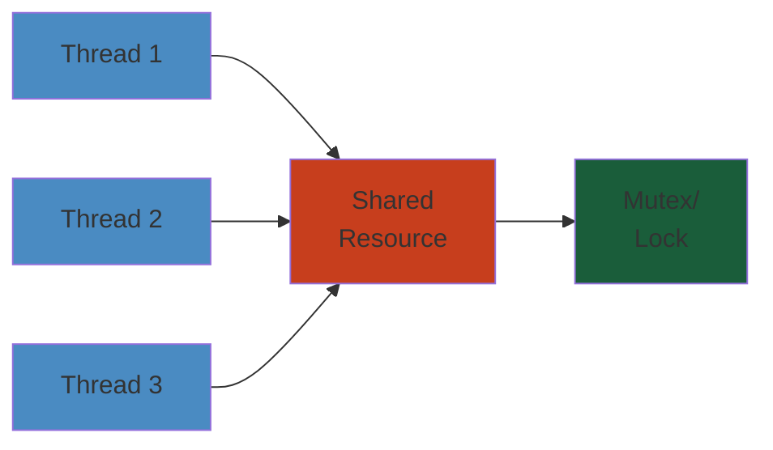
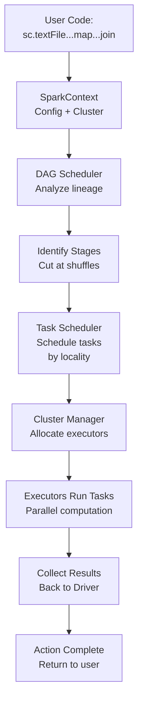

# Apache Spark




## Overview

Apache Spark is a unified, distributed computing engine for large-scale data processing. It provides high-level APIs in Scala, Python, Java, and R, along with an optimized engine that supports general execution graphs (DAGs). Spark was developed at UC Berkeley AMPLab in 2009, open-sourced in 2010, and became a top-level Apache project in 2014.

## Architecture

### Driver

The driver is the process that runs the user's `main()` function, creates the `SparkContext`, and orchestrates the entire application. It is responsible for:

- **DAG construction**: Converting user transformations into a logical DAG of stages
- **Task scheduling**: Splitting stages into tasks and dispatching them to executors
- **Result collection**: Gathering results from executors back to the driver

#### Step-by-Step

1. **SparkContext Creation**: User initializes SparkContext with configuration (cluster manager, number of executors, memory per executor).
2. **Application Submission**: Application JAR/Python file is submitted to cluster manager, which allocates resources and launches driver process.
3. **DAG Construction**: As user code executes transformations (map, filter, join), RDDs are created and linked, forming a logical DAG.
4. **Stage Computation**: DAG Scheduler analyzes the RDD lineage, identifies shuffle boundaries, and partitions the DAG into stages.
5. **Task Generation**: Each stage is split into tasks (one task per partition), and tasks are scheduled on executors respecting data locality.
6. **Result Aggregation**: Driver collects results from executors as tasks complete, manages failures by rescheduling on healthy executors.

#### Code Example

```python
from pyspark import SparkContext, SparkConf
from pyspark.rdd import RDD
from typing import List, Tuple

# Step 1: SparkContext Creation
conf = SparkConf() \
    .setAppName("DriverExample") \
    .setMaster("spark://localhost:7077") \
    .set("spark.executor.memory", "4g") \
    .set("spark.executor.cores", "4") \
    .set("spark.cores.max", "32")

sc = SparkContext(conf=conf)

# Step 3: DAG Construction through transformations
def parse_log_line(line: str) -> Tuple[str, int]:
    """Parse web server log line."""
    parts = line.split()
    return (parts[0], 1)  # (ip, count)

def add_counts(a: int, b: int) -> int:
    """Combine two counts."""
    return a + b

# Read data (lazy) — Creates RDD
raw_logs: RDD = sc.textFile("hdfs://namenode:9000/logs/2026-05-*.log")

# Transform (lazy) — Creates new RDD based on raw_logs
parsed: RDD = raw_logs.map(parse_log_line)

# Transform (lazy) — Creates new RDD based on parsed
aggregated: RDD = parsed.reduceByKey(add_counts)  # Shuffle boundary!

# Transform (lazy) — Create new RDD
filtered: RDD = aggregated.filter(lambda x: x[1] > 100)

# Step 5: Action triggers execution
# This is when DAG is submitted, stages computed, tasks scheduled
result: List[Tuple[str, int]] = filtered.collect()  # TRIGGERS COMPUTATION

print(f"IPs with >100 requests: {len(result)}")
for ip, count in result[:5]:
    print(f"  {ip}: {count} requests")

sc.stop()
```

#### Real-World Scenario

At Netflix, a data engineer submits a Spark job to analyze 2TB of streaming metrics. Driver initializes on a cluster manager (Kubernetes), creates SparkContext requesting 100 executors (8GB each). As Python code runs transformations, a DAG forms: read logs → parse JSON → filter by timestamp → group by user → compute statistics. DAG Scheduler identifies 3 stages (stage 0: map/filter, stage 1: shuffle for grouping, stage 2: reduce). Stage 0 tasks are scheduled to executors with local log data (PROCESS_LOCAL), stage 1 involves network shuffle (200MB between nodes). During execution, one executor crashes; driver rescheduling its tasks on live executors, job completes in 5 minutes instead of failing.

#### Diagram



```
+---------------------------------------------------+
|                   Driver Process                    |
|  +-----------+  +----------+  +----------------+  |
|  | SparkCtx  |  | DAGSched |  | TaskScheduler  |  |
|  +-----------+  +----------+  +----------------+  |
|        |              |               |           |
|        v              v               v           |
|  +-----------+  +----------+  +----------------+  |
|  | BlockMgr  |  | Shuffle  |  | BroadcastMgr  |  |
|  +-----------+  +----------+  +----------------+  |
+---------------------------------------------------+
        |  |  |                    |  |  |
        v  v  v                    v  v  v
+---------------------------------------------------+
|              Cluster Manager                       |
|         (Standalone / YARN / K8s / Mesos)          |
+---------------------------------------------------+
        |  |  |                    |  |  |
        v  v  v                    v  v  v
+---------------------------------------------------+
|              Executor Processes                    |
|  +-----------+  +-----------+  +-----------+      |
|  | Executor  |  | Executor  |  | Executor  |      |
|  | 1         |  | 2         |  | N         |      |
|  | +-------+ |  | +-------+ |  | +-------+ |      |
|  | | Tasks | |  | | Tasks | |  | | Tasks | |      |
|  | +-------+ |  | +-------+ |  | +-------+ |      |
|  | +-------+ |  | +-------+ |  | +-------+ |      |
|  | | Cache | |  | | Cache | |  | | Cache | |      |
|  | +-------+ |  | +-------+ |  | +-------+ |      |
|  +-----------+  +-----------+  +-----------+      |
+---------------------------------------------------+
```

### Executors

Executors are worker processes running compute tasks and storing data for cached RDDs. Each executor:

- Runs tasks in parallel using thread pools (configurable via `spark.executor.cores`)
- Manages in-memory storage for cached/persisted data
- Performs shuffle operations (write shuffle data to local disk, fetch from other executors)
- Reports task status and metrics back to the driver

**Executor lifecycle**:
```
Requested → Allocated → Registered → Active → Terminated
```

If an executor crashes, the driver marks all its tasks as Failed and reschedules them on other executors.

### Cluster Manager

Spark supports four cluster managers:

| Manager | Pros | Cons | Best For |
|---------|------|------|----------|
| **Standalone** | Simple setup, no dependencies | No auto-scaling, limited features | Dev/test, small clusters |
| **YARN** | Resource sharing with Hadoop, queues, ACLs | Heavy dependency on HDFS/Hadoop | Enterprise Hadoop shops |
| **Kubernetes** | Containerization, auto-scaling, portability | Complex networking, storage challenges | Cloud-native environments |
| **Mesos** | Fine-grained sharing, multiple frameworks | Declining adoption, complex setup | Legacy Mesos deployments |

### DAG Scheduler

The DAG Scheduler converts the logical RDD lineage into physical execution stages:

1. **RDD lineage**: User applies transformations (map, filter, join) creating a DAG of RDDs
2. **Stage computation**: The scheduler computes stages by backtracking from the final RDD, cutting at shuffle boundaries
3. **Stage submission**: Each stage contains multiple tasks (one per partition) that can execute in parallel

```
User Code:  rdd.map(...).filter(...).join(otherRdd).groupBy(...).count()

RDD Lineage:
  rdd → MapRDD → FilterRDD → CoGroupedRDD → ShuffledRDD → MapPartitionsRDD

Stage Boundaries:
  Stage 0: rdd → MapRDD → FilterRDD           (no shuffle)
  Stage 1: CoGroupedRDD                        (shuffle from Stage 0 & 2)
  Stage 2: otherRdd                            (no shuffle)
  Stage 3: ShuffledRDD → MapPartitionsRDD      (shuffle from Stage 1)
```

**Narrow vs Wide dependencies**:
- **Narrow**: Each partition of the parent RDD is used by at most one child partition (map, filter, union) — no shuffle needed
- **Wide**: Multiple child partitions depend on one parent partition (groupByKey, join, repartition) — shuffle required

### Task Scheduler

The Task Scheduler launches tasks on executors based on data locality:

```
Task Scheduler:
  -> Receives TaskSet from DAG Scheduler
  -> For each task, determines preferred locations (data locality)
  -> Launches task on executor with best locality
  -> Handles task failures (retry up to spark.task.maxFailures)
  -> Reports task completion/failure back to DAG Scheduler
```

**Locality levels** (highest to lowest):
1. `PROCESS_LOCAL` — data in same JVM
2. `NODE_LOCAL` — data on same node
3. `RACK_LOCAL` — data on same rack
4. `ANY` — data elsewhere

## RDD (Resilient Distributed Dataset)

RDD is the fundamental data structure in Spark — an immutable, partitioned collection of records that can be operated on in parallel.

### Properties
- **Partitioned**: Data is split into partitions across cluster nodes
- **Immutable**: Once created, cannot be modified; only transformed into new RDDs
- **Lazy**: Transformations are not computed until an action is called
- **Cachable**: Can be persisted in memory/disk for reuse
- **Lineage**: Records the sequence of transformations for fault recovery

### RDD Operations

```python
# Transformations (lazy)
rdd1 = sc.textFile("s3://data/input.logs")          # Create from file
rdd2 = rdd1.flatMap(lambda line: line.split())       # One-to-many
rdd3 = rdd2.map(lambda w: (w, 1))                    # One-to-one
rdd4 = rdd3.filter(lambda x: x[0].startswith("A"))   # Filter
rdd5 = rdd4.reduceByKey(lambda a, b: a + b)          # Shuffle
rdd6 = rdd5.sortByKey()                               # Shuffle + sort

# Actions (eager)
count = rdd6.count()                                  # Return count
first = rdd6.first()                                  # Return first element
data = rdd6.collect()                                 # Return all to driver
samples = rdd6.takeSample(False, 10)                  # Return 10 samples
```

### RDD Persistence

```python
# Storage levels (from org.apache.spark.storage.StorageLevel)
rdd.persist(StorageLevel.MEMORY_ONLY)            # Default: deserialized in JVM
rdd.persist(StorageLevel.MEMORY_ONLY_SER)        # Serialized (compressed)
rdd.persist(StorageLevel.MEMORY_AND_DISK)         # Spill to disk if memory full
rdd.persist(StorageLevel.MEMORY_AND_DISK_SER)    # Serialized + disk spill
rdd.persist(StorageLevel.DISK_ONLY)              # Always on disk
rdd.persist(StorageLevel.OFF_HEAP)               # Off-heap memory via Tachyon

# Checkpoint for lineage truncation
rdd.checkpoint()  # Materializes to reliable storage, truncates lineage
```

### RDD Lineage and Fault Recovery

When a partition is lost (executor failure), Spark uses lineage to recompute:

```
rdd → map → filter → join → groupBy → count
  \                                        \
   \------> Lost partition on failed executor
            \
             Lineage trace: groupBy ← join ← filter ← map ← rdd
             Recompute only the lost partitions from source
```

This avoids full recomputation — only affected partitions are rebuilt.

## DataFrame API

DataFrame is an RDD of Row objects with a schema. It provides a relational API and enables Catalyst query optimization.

```python
from pyspark.sql import SparkSession

spark = SparkSession.builder \
    .appName("DataFrameExample") \
    .config("spark.sql.adaptive.enabled", "true") \
    .getOrCreate()

# Create DataFrame from file
df = spark.read \
    .option("header", "true") \
    .option("inferSchema", "true") \
    .csv("s3://data/sales/*.csv")

# Schema introspection
df.printSchema()
# root
#  |-- order_id: long (nullable = true)
#  |-- customer_id: string (nullable = true)
#  |-- amount: double (nullable = true)
#  |-- timestamp: timestamp (nullable = true)
#  |-- product: string (nullable = true)

df.describe().show()

# Transformations
result = df \
    .filter(col("amount") > 100) \
    .groupBy("product", window("timestamp", "1 hour")) \
    .agg(
        sum("amount").alias("revenue"),
        count("order_id").alias("order_count")
    ) \
    .orderBy("product", "window")

# Actions
result.show(10)
result.explain("formatted")  # Show physical plan
result.write \
    .mode("overwrite") \
    .parquet("s3://data/aggregated/")
```

### Catalyst Optimizer

Catalyst leverages Scala's pattern matching and quasiquotes for query optimization:

```
SQL Query → UNRESOLVED LOGICAL PLAN → RESOLVED LOGICAL PLAN → OPTIMIZED LOGICAL PLAN → PHYSICAL PLANS → SELECTED PLAN → RDDs

Phases:
  1. Analysis:  Resolve column references, table names, types
  2. Logical Optimization:  Predicate pushdown, projection pruning, constant folding
  3. Physical Planning:  Select join strategies, generate physical operators
  4. Code Generation:  Generate optimized Java code via Tungsten (whole-stage codegen)
```

**Optimization rules** (hundreds of rules in Catalyst):

```scala
// Example rules from Catalyst source
object PushDownPredicate extends Rule[LogicalPlan] {
  def apply(plan: LogicalPlan): LogicalPlan = plan transformDown {
    case Filter(condition, Join(left, right, joinType, joinCondition)) =>
      // Push filters to both sides of join
      val leftFilters  = condition.references.intersect(left.outputSet)
      val rightFilters = condition.references.intersect(right.outputSet)
      Join(
        leftFilters.foldLeft(left)((l, f) => Filter(f, l)),
        rightFilters.foldLeft(right)((r, f) => Filter(f, r)),
        joinType, joinCondition
      )
  }
}
```

**Key optimizations**:
- **Predicate pushdown**: Filters move closer to data sources (Parquet min/max stats, partition pruning)
- **Projection pruning**: Only read necessary columns from columnar formats
- **Constant folding**: Evaluate constant expressions at planning time
- **Join reordering**: Reorder joins based on table statistics
- **Bucket pruning**: Use bucketing metadata to skip partitions

### Tungsten Execution Engine

Tungsten is Spark's unified memory management and code generation framework:

1. **Off-heap memory management**: Direct memory allocation bypassing JVM garbage collection
2. **Cache-aware computation**: Data structures optimized for CPU cache lines
3. **Whole-stage code generation** (Codegen): Fuse multiple operators into a single Java function

```java
// Without codegen: multiple virtual calls, iterator overhead
for (Row row : scan) {
    if (filterFunc(row)) {
        result = projectFunc(row);
        output.collect(result);
    }
}

// With codegen: fused into single tight loop
for (int i = 0; i < numRows; i++) {
    long key = columnAccessor.getLong(buf, i);
    double val = columnAccessor.getDouble(buf, offset + i * 8);
    if (val > threshold) {
        if (hashMap.put(key, val)) {
            rowCount++;
        }
    }
}
```

**Codegen metrics**:
```
Before Codegen:  20,000 methods, 1.2s per 1M rows
After Codegen:   1 monolithic method, 0.08s per 1M rows
Improvement:     15x speedup
```

## Dataset API

Dataset combines the benefits of RDDs (type safety) and DataFrames (optimization):

```scala
// Type-safe Dataset in Scala
case class Sales(orderId: Long, customerId: String, amount: Double, ts: Long, product: String)

val ds: Dataset[Sales] = spark
  .read
  .option("header", "true")
  .csv("s3://data/sales/*.csv")
  .as[Sales]

// Compile-time type checking
ds.filter(_.amount > 100)               // Compiler validates type
  .groupByKey(_.product)
  .agg(sum($"amount").as[Double])
  .show()
```

In PySpark, Dataset is not available (Python lacks compile-time type safety).

## Shuffle Internals

Shuffle is the mechanism for redistributing data across partitions. It is the most expensive operation in Spark.

### Sort-Based Shuffle (Default)

```
Mapper Side (Write):
  Each map task:
    1. Partition data by target partition (hash(key) % numPartitions)
    2. Sort records by partition ID within each in-memory buffer
    3. Spill to disk if buffer exceeds spark.shuffle.spill.boundary (default 1MB)
    4. Merge spilled files into a single shuffle file per mapper
    5. Update index file for fast position lookup

Reducer Side (Read):
  Each reduce task:
    1. Fetch its partition data from all mapper shuffle files
    2. Read via index file mapping (file + offset + length)
    3. Merge sort all fetched records
    4. Apply aggregation if needed (combineByKey)
```

```
Map Tasks                     Shuffle Files               Reduce Tasks
+-------+                    +-----------+                +---------+
| Map 0 |----+-------------->| File 0    |---+----------->| Reduce 0|
+-------+    |               | +-------+ |   |            +---------+
             |               | |part 0 | |   |
+-------+    |               | +-------+ |   |            +---------+
| Map 1 |----+----+          | |part 1 | |   +----------->| Reduce 1|
+-------+    |    |          | |  ...  | |                +---------+
             |    |          | +-------+ |
+-------+    |    |          +-----------+                +---------+
| Map N |----+    |                       +-------------->| Reduce N|
+-------+         +----------+            |               +---------+
                            |            |
                     +------v------+    |
                     | Index File 0|----+
                     | part0: 0,10 |    |
                     | part1: 10,20|    |
                     | part2: 20,30|    |
                     +-------------+    |
                     +------v------+    |
                     | Index File 1|----+
                     +-------------+
```

**Shuffle parameters**:
```python
spark.conf.set("spark.shuffle.sort.bypassMergeThreshold", "200")
spark.conf.set("spark.shuffle.file.buffer", "64k")     # Write buffer per partition
spark.conf.set("spark.reducer.maxSizeInFlight", "48m")  # Read buffer per reducer
spark.conf.set("spark.reducer.maxReqsInFlight", "5")    # Max fetch requests
spark.conf.set("spark.shuffle.io.maxRetries", "3")
spark.conf.set("spark.shuffle.io.retryWait", "5s")
```

### Tungsten Shuffle (Optimized)

When `spark.shuffle.manager = tungsten-sort` (or auto when conditions met):

- Uses Unsafe Shuffle Writer: serializes directly into off-heap binary buffers
- Avoids Java object overhead and GC pressure
- Does NOT support map-side aggregation (no combine)
- Fastest shuffle when map-side combine is not needed

```python
# Enable tungsten shuffle
spark.conf.set("spark.shuffle.manager", "tungsten-sort")
```

### Shuffle Spill

When memory is insufficient for operations like `groupByKey`:

```
Memory pressure threshold (70% of execution memory):
  -> Sort operator detects memory limit approaching
  -> Begins spilling sorted runs to disk
  -> Each spill produces a temporary file on local disk
  -> Final merge combines all spilled runs + in-memory data
  -> Can generate many spills if memory severely constrained

Metrics (available in Spark UI):
  shuffle spill disk  = 2.4 GB
  shuffle spill memory = 850 MB
```

**Spill behavior by operation**:
- `reduceByKey`: Spills sorted runs, merges + partial combine during merge
- `groupByKey`: Cannot combine, spills raw data, merges on read
- `sortByKey`: Spills sorted runs, merges on read
- `join`: Spills partitioned data, merges + joins on read

## Memory Management

Spark 1.6+ uses Unified Memory Management:

```
Executor JVM Heap:
+--------------------------------------------------+
| Reserved (300MB) | User Memory (40%) | Spark (60%) |
+--------------------------------------------------+

Spark Memory (60%):
+------------------------------------------+
| Execution Memory (50%) | Storage (50%)   |
| (shuffle, joins, sorts)| (cache, persist)|
|                        |                  |
|  <------ CAN BORROW FROM EACH OTHER ----> |
+------------------------------------------+
```

### Memory Regions

- **Reserved Memory**: 300MB, reserved for JVM overhead
- **User Memory**: (Heap - Reserved) × `spark.memory.fraction` — for user code, UDFs
- **Spark Memory**: Remaining memory after reserved + user
  - **Execution Memory**: shuffles, joins, sorts, aggregations
  - **Storage Memory**: cached/persisted RDDs, DataFrames, broadcast variables
  - Both can borrow from each other; storage can be evicted by execution

```python
# Memory configuration
spark.conf.set("spark.memory.fraction", "0.6")         # Spark memory vs user memory
spark.conf.set("spark.memory.storageFraction", "0.5")   # Initial storage fraction
spark.conf.set("spark.memory.offHeap.enabled", "true")
spark.conf.set("spark.memory.offHeap.size", "10g")
```

### Off-Heap Memory

- Enabled via `spark.memory.offHeap.enabled=true`
- Managed via Tungsten's `sun.misc.Unsafe` API
- Not subject to JVM GC pauses
- Useful for large heaps (100GB+) where GC becomes problematic
- Requires extra OS configuration (ulimit, mmap limits)

**Trade-off**:
```
On-Heap:   Faster access, GC overhead, limited to JVM heap
Off-Heap:  Slower serialization, no GC pauses, larger addressable space
```

## Join Strategies

### Broadcast Join (Hash Join)

For small tables (< `spark.sql.autoBroadcastJoinThreshold`, default 10MB):

```
Driver                            Executor 1              Executor 2
+------------+                    +----------+            +----------+
| Small Table|                    | HashTbl  |            | HashTbl  |
| (10MB)     |                    | +------+ |            | +------+ |
+------------+                    | | key1 | |            | | key1 | |
     |                            | | val1 | |            | | val1 | |
     v                            | +------+ |            | +------+ |
Broadcast hash table              +----------+            +----------+
to all executors                        |                      |
                                         v                      v
                                   +----------+            +----------+
                                   | Big Tbl  |            | Big Tbl  |
                                   | Partition|            | Partition|
                                   +----------+            +----------+
                                   +----------+            +----------+
                                   | Join     |            | Join     |
                                   | (hash    |            | (hash    |
                                   |  lookup) |            |  lookup) |
                                   +----------+            +----------+
```

```python
# Explicit broadcast hint
from pyspark.sql.functions import broadcast
result = df_large.join(broadcast(df_small), "key")

# Configuration
spark.conf.set("spark.sql.autoBroadcastJoinThreshold", "10485760")  # 10MB
spark.conf.set("spark.sql.adaptive.coalescePartitions.enabled", "true")
```

### Sort-Merge Join

For large tables that are both sorted on the join key:

```
Phase 1: Sort both sides by join key
  Big Table A:  [1,1,2,3,3,3,4,5] → sorted by key
  Big Table B:  [1,2,2,3,4,4,5,6] → sorted by key

Phase 2: Merge (shared cursor scan)
  Cursor A -> 1    Compare(1,1)    Cursor B -> 1  Match!
  Cursor A -> 1    Compare(1,1)    Cursor B -> 1  Match!
  Cursor A -> 2    Compare(2,1)    Cursor B -> 1    (A > B → advance B)
  Cursor A -> 2    Compare(2,2)    Cursor B -> 2  Match!
  Cursor A -> 2    Compare(2,2)    Cursor B -> 2  Match!
  Cursor A -> 3    Compare(3,2)    Cursor B -> 2    (A > B → advance B)

Memory: O(n) sort phase, O(1) merge phase
Network: Shuffle both tables (no broadcast)
```

```python
# Sort merge is default for large tables
spark.conf.set("spark.sql.join.preferSortMergeJoin", "true")
spark.conf.set("spark.sql.adaptive.localShuffleReader.enabled", "true")

# Optimize sort-merge with bucketing
df.write.bucketBy(200, "key").sortBy("key").saveAsTable("bucketed_table")
```

### Hash Join (Shuffle Hash Join)

For medium-large tables where one side fits in each executor's hash table:

- Build hash table from smaller table
- Shuffle both tables by join key
- Probe hash table with larger table rows
- Disabled by default in Spark 3.x (sort-merge preferred)

```python
spark.conf.set("spark.sql.join.preferSortMergeJoin", "false")  # Forces hash join
spark.conf.set("spark.sql.adaptive.enabled", "true")
```

## Performance Tuning

### Partitioning

```python
# Default shuffle partitions
spark.conf.set("spark.sql.shuffle.partitions", "200")

# Rule of thumb: 2-4 partitions per CPU core
# partition_count = total_cores * 2
# If 100 executor cores → 200-400 shuffle partitions

# DataFrames
df = df.repartition(200, "customer_id")       # Full shuffle
df = df.coalesce(50)                           # Reduce partitions (no shuffle)

# RDDs
rdd = rdd.repartition(200)
rdd = rdd.coalesce(50)
```

### Serialization

```python
# Kryo serialization (10x faster than Java serialization)
spark.conf.set("spark.serializer", "org.apache.spark.serializer.KryoSerializer")
spark.conf.set("spark.kryoserializer.buffer.max", "1024m")
spark.conf.set("spark.kryo.registrationRequired", "true")

# Register custom classes
spark = SparkSession.builder \
    .config("spark.serializer", "org.apache.spark.serializer.KryoSerializer") \
    .config("spark.kryo.classesToRegister", "com.example.MyClass,com.example.OtherClass") \
    .getOrCreate()
```

### Broadcast Threshold

```python
# Increase threshold for larger broadcast tables
spark.conf.set("spark.sql.autoBroadcastJoinThreshold", "104857600")  # 100MB

# Force broadcast
df_large.join(broadcast(df_medium), "key", "left_outer")

# Disable broadcast (if threshold causing OOM)
spark.conf.set("spark.sql.autoBroadcastJoinThreshold", "-1")
```

### AQE (Adaptive Query Execution)

Spark 3.x's adaptive optimization:

```python
spark.conf.set("spark.sql.adaptive.enabled", "true")
spark.conf.set("spark.sql.adaptive.coalescePartitions.enabled", "true")
spark.conf.set("spark.sql.adaptive.coalescePartitions.minPartitionNum", "1")
spark.conf.set("spark.sql.adaptive.coalescePartitions.parallelismFirst", "true")
spark.conf.set("spark.sql.adaptive.joinSkew.enabled", "true")
spark.conf.set("spark.sql.adaptive.optimizeSkewedJoin.enabled", "true")
spark.conf.set("spark.sql.adaptive.advisoryPartitionSizeInBytes", "64m")
```

**AQE optimizations**:
1. **Coalescing shuffle partitions**: Merge small partitions after shuffle
2. **Switching join strategies**: Convert sort-merge to broadcast if table is small enough
3. **Optimizing skew joins**: Split skewed partitions into sub-partitions

```
Without AQE: Fixed 200 partitions, some tiny, some huge (skew)
+----+----+----+----+----+----+----+
| 1MB| 1MB| 2MB|50GB| 1MB|80GB| 1MB|  ← Unbalanced
+----+----+----+----+----+----+----+

With AQE: Coalesced partitions, skew handled
+---------+---------+-------------+
| 64MB    | 64MB    | 64MB        |  ← Balanced
+---------+---------+-------------+
| Skew 1  | Skew 1  | Skew 1      |
| (sub1)  | (sub2)  | (sub3)      |  ← Skewed join split
+---------+---------+-------------+
```

## Structured Streaming

### Micro-Batch Processing (Default)

Spark processes streaming data as micro-batches:

```
Input Stream
    |
    v
+---------+  +---------+  +---------+
| Batch 0 |  | Batch 1 |  | Batch 2 |  ← Configurable interval (e.g., 1s)
+---------+  +---------+  +---------+
    |            |            |
    v            v            v
+--------------------------------------+
|          Spark Engine                 |
|  (Catalyst + Tungsten + Codegen)      |
+--------------------------------------+
    |            |            |
    v            v            v
+---------+  +---------+  +---------+
| Output 0|  | Output 1|  | Output 2|
+---------+  +---------+  +---------+
    |            |            |
    v            v            v
    +-------+--------+------+
        Sink (Console, Parquet, Kafka, etc.)
```

```python
from pyspark.sql.functions import *
from pyspark.sql.types import *

# Define schema for streaming input
schema = StructType([
    StructField("user_id", StringType()),
    StructField("event", StringType()),
    StructField("timestamp", TimestampType()),
    StructField("value", DoubleType()),
])

# Read from Kafka streaming source
stream = spark \
    .readStream \
    .format("kafka") \
    .option("kafka.bootstrap.servers", "localhost:9092") \
    .option("subscribe", "user-events") \
    .option("startingOffsets", "latest") \
    .load() \
    .selectExpr("CAST(key AS STRING)", "CAST(value AS STRING)") \
    .select(from_json(col("value"), schema).alias("data")) \
    .select("data.*")

# Apply transformations
agg_stream = stream \
    .withWatermark("timestamp", "10 minutes") \
    .groupBy(
        col("user_id"),
        window(col("timestamp"), "5 minutes", "3 minutes")
    ) \
    .agg(
        count("*").alias("event_count"),
        avg("value").alias("avg_value")
    )

# Write to output sink
query = agg_stream \
    .writeStream \
    .outputMode("append") \
    .format("console") \
    .option("truncate", "false") \
    .trigger(processingTime="10 seconds") \
    .option("checkpointLocation", "/tmp/checkpoint") \
    .start()

query.awaitTermination()
```

### Continuous Processing (Experimental)

Spark 2.3+ has experimental continuous processing for millisecond latency:

```python
query = agg_stream \
    .writeStream \
    .format("console") \
    .trigger(continuous="1 second") \
    .option("checkpointLocation", "/tmp/checkpoint_c") \
    .start()
```

**Limitations**: Only supports map-like operations, no aggregation or sorting.

### Watermarking

Watermarks handle late data by defining how late data can arrive:

```
Event Time:
  10:00  10:05  10:10  10:15  10:20
    |      |      |      |      |
    v      v      v      v      v
Batch 0          Batch 1          Batch 2
(10:00-10:05)    (10:05-10:10)    (10:10-10:15)
    |              |                |
    v              v                v
Watermark:       Watermark:       Watermark:
09:50            09:55            10:00
(late data up    (late data up    (late data up
to 10min late)   to 10min late)   to 10min late)

At Batch 2, events with timestamp < 10:00 are dropped.
```

```python
# Watermark configuration
stream \
    .withWatermark("event_time", "10 minutes") \
    .groupBy(window("event_time", "1 hour")) \
    .count()
```

### State Management

For aggregations, Spark maintains state across micro-batches:

```python
# State store implementations (configurable via checkpoint)
# 1. HDFSBackedStateStoreProvider (default) — reliable, uses HDFS/S3
# 2. RocksDBStateStoreProvider — faster, lower latency

from pyspark.sql.streaming.state import GroupState

def update_state(key: str, values: Iterator[Row], state: GroupState):
    if not state.exists:
        state.update({"count": 0, "sum": 0.0})
        state.setTimeoutTimestamp(60000)  # 60s timeout

    for row in values:
        current = state.get
        current["count"] += 1
        current["sum"] += row.value
        state.update(current)
    return state.get

# Apply stateful operation
df.groupByKey(lambda r: r.user_id) \
    .flatMapGroupsWithState(update_state, outputMode="update", timeoutConf="processingTime")
```

**State store metrics** (from Spark UI):
```
State Store:
  RocksDB:       Used 1.2GB / Allocated 4GB
  Put count:     1,234,567
  Get count:     2,345,678
  Commit count:  123
  Version:       123
```

## Production Configuration

### Dynamic Allocation

```python
spark.conf.set("spark.dynamicAllocation.enabled", "true")
spark.conf.set("spark.dynamicAllocation.minExecutors", "5")
spark.conf.set("spark.dynamicAllocation.maxExecutors", "500")
spark.conf.set("spark.dynamicAllocation.initialExecutors", "10")
spark.conf.set("spark.dynamicAllocation.executorAllocationRatio", "0.5")
spark.conf.set("spark.dynamicAllocation.schedulerBacklogTimeout", "1s")
spark.conf.set("spark.dynamicAllocation.sustainedSchedulerBacklogTimeout", "5s")
```

**Scaling behavior**:
```
Pending tasks > 0 for backlogTimeout   → Request 2x executors
Pending tasks = 0 for sustainedTimeout  → Release 1 executor / 60s
Max growth per request:                 → Double the current count
```

### Executor Sizing

```python
# Memory-heavy workloads (joins, aggregations)
spark.executor.memory = "16g"
spark.executor.cores = 4
spark.executor.memoryOverhead = "2g"

# CPU-heavy workloads (transformations, feature engineering)
spark.executor.memory = "8g"
spark.executor.cores = 8
spark.executor.memoryOverhead = "1g"

# I/O-heavy workloads (reading/writing large datasets)
spark.executor.memory = "32g"
spark.executor.cores = 8
spark.executor.memoryOverhead = "4g"
spark.executor.heartbeatInterval = "60s"
spark.network.timeout = "600s"
```

**General guidelines**:
```
Total executor memory = (total cluster memory - driver memory) / num_executors
Executor cores:      5-8 cores per executor is optimal (not too small, not too large)
Overhead:            10-15% of executor memory
Max executors/node:  total_cores_on_node / executor_cores
```

### Shuffle Service

```python
# External shuffle service prevents executor loss from losing shuffle data
spark.shuffle.service.enabled = "true"
spark.shuffle.service.port = 7337

# YARN-specific configuration in yarn-site.xml:
# <property>
#   <name>yarn.nodemanager.aux-services</name>
#   <value>mapreduce_shuffle,spark_shuffle</value>
# </property>
# <property>
#   <name>yarn.nodemanager.aux-services.spark_shuffle.class</name>
#   <value>org.apache.spark.network.yarn.YarnShuffleService</value>
# </property>
```

### Spot Instances

Handling preemptible (spot) instances gracefully:

```python
# On YARN with spot instances
spark.yarn.maxAttempts = 5
spark.yarn.am.attemptFailuresValidityInterval = "1h"
spark.yarn.executor.failuresValidityInterval = "1h"

# Graceful decommission (Spark 3.1+)
spark.decommission.enabled = "true"
spark.decommission.shutdownCheckInterval = "5s"
spark.storage.decommission.shuffleBlocks.enabled = "true"
spark.storage.decommission.rddBlocks.enabled = "true"
```

### Monitoring

```python
# Spark UI history server
spark.eventLog.enabled = "true"
spark.eventLog.dir = "hdfs://namenode:8020/spark-logs"
spark.history.fs.logDirectory = "hdfs://namenode:8020/spark-logs"

# Metrics to Graphite/Prometheus
spark.metrics.conf = "/path/to/metrics.properties"
# In metrics.properties:
# *.source.jvm.class=org.apache.spark.metrics.source.JvmSource
# *.sink.graphite.class=org.apache.spark.metrics.sink.GraphiteSink
# *.sink.graphite.host=graphite.example.com
# *.sink.graphite.port=2003

# Ganglia integration
spark.extraListeners = "org.apache.spark.extra.GangliaListener"
```

**Key Spark UI metrics to watch**:
```
Stage:         Duration, Shuffle Read/Write, Spill (memory + disk), GC time
Executor:      Active tasks, Memory used, Disk used, Shuffle data
Streaming:     Input rate, Processing rate, Batch duration, Late records
SQL:           Physical plan, Scan time, Aggregate time, Join time
```

**Programmatic Metrics Collection**:

```python
class SparkMetricsCollector:
    """Collect and analyze Spark metrics programmatically."""

    def __init__(self, spark):
        self.spark = spark
        self.stage_metrics = {}

    def get_stage_info(self, stage_id: int) -> dict:
        """Extract stage-level metrics from Spark listener."""
        metrics = {
            "stage_id": stage_id,
            "shuffle_read_bytes": self._get_stage_metric(stage_id, "shuffle.read.bytes"),
            "shuffle_write_bytes": self._get_stage_metric(stage_id, "shuffle.write.bytes"),
            "shuffle_read_records": self._get_stage_metric(stage_id, "shuffle.read.records"),
            "shuffle_write_records": self._get_stage_metric(stage_id, "shuffle.write.records"),
            "spill_memory_bytes": self._get_stage_metric(stage_id, "spill.memory"),
            "spill_disk_bytes": self._get_stage_metric(stage_id, "spill.disk"),
            "gc_time_ms": self._get_stage_metric(stage_id, "jvm.gc.time"),
            "peak_memory_bytes": self._get_stage_metric(stage_id, "peakExecutionMemory"),
        }
        self.stage_metrics[stage_id] = metrics
        return metrics

    def detect_skew(self, stage_id: int) -> dict:
        """Detect data skew from stage metrics."""
        m = self.stage_metrics.get(stage_id, {})
        read_bytes = m.get("shuffle_read_bytes", 0)
        spill_disk = m.get("spill_disk_bytes", 0)
        skew_ratio = spill_disk / max(read_bytes, 1)

        return {
            "stage_id": stage_id,
            "shuffle_read": f"{read_bytes / (1024**3):.1f}GB",
            "disk_spill": f"{spill_disk / (1024**3):.1f}GB",
            "skew_detected": skew_ratio > 0.3,
            "skew_ratio": skew_ratio,
            "recommendation": "Enable AQE or use salting" if skew_ratio > 0.3 else "OK"
        }

    def _get_stage_metric(self, stage_id: int, metric_name: str) -> float:
        # In production, extract from SparkListener or REST API
        metric_defaults = {
            "shuffle.read.bytes": 1e9,
            "shuffle.write.bytes": 2e9,
            "shuffle.read.records": 1e6,
            "shuffle.write.records": 2e6,
            "spill.memory": 5e8,
            "spill.disk": 2e8,
            "jvm.gc.time": 3000,
            "peakExecutionMemory": 4e9,
        }
        return metric_defaults.get(metric_name, 0)

    def summarize_job(self) -> dict:
        stages = len(self.stage_metrics)
        total_shuffle_read = sum(
            m.get("shuffle_read_bytes", 0) for m in self.stage_metrics.values()
        )
        total_spill = sum(
            m.get("spill_disk_bytes", 0) for m in self.stage_metrics.values()
        )
        return {
            "stages": stages,
            "total_shuffle_read_gb": total_shuffle_read / (1024**3),
            "total_spill_gb": total_spill / (1024**3),
            "skew_stages": sum(
                1 for s in self.stage_metrics
                if self.detect_skew(s)["skew_detected"]
            ),
            "status": "healthy" if total_spill < total_shuffle_read * 0.3 else "warning"
        }


class SparkPrometheusExporter:
    """Export Spark metrics in Prometheus format."""

    def __init__(self):
        self.metrics = {}

    def register_gauge(self, name: str, help_text: str, labels: list = None):
        self.metrics[name] = {
            "help": help_text,
            "labels": labels or [],
            "values": {}
        }

    def set_metric(self, name: str, value: float, label_values: dict = None):
        if name in self.metrics:
            key = str(label_values) if label_values else "default"
            self.metrics[name]["values"][key] = value

    def render(self) -> str:
        lines = []
        for name, config in self.metrics.items():
            lines.append(f"# HELP spark_{name} {config['help']}")
            lines.append(f"# TYPE spark_{name} gauge")
            for key, value in config["values"].items():
                labels_str = ",".join(
                    f'{k}="{v}"' for k, v in eval(key).items()
                ) if key != "default" else ""
                if labels_str:
                    lines.append(f"spark_{name}{{{labels_str}}} {value}")
                else:
                    lines.append(f"spark_{name} {value}")
        return "\n".join(lines)
```

### Common Issues and Solutions

| Problem | Symptom | Root Cause | Solution | Prevention |
|---------|---------|-----------|----------|------------|
| OOM (driver) | `java.lang.OutOfMemoryError: GC overhead limit exceeded` | `.collect()` on large dataset | Increase `spark.driver.memory`, reduce data collected to driver | Code review `.collect()` calls, set `spark.driver.maxResultSize` |
| OOM (executor) | Executor lost, shuffle fetch fails | Insufficient memory for shuffle/join | Increase memory, reduce partitions, enable off-heap | Monitor spill metrics, set `spark.memory.fraction=0.8` |
| Shuffle fetch failed | Connection refused from executor | Executor died with shuffle data | Enable external shuffle service | Always enable `spark.shuffle.service.enabled=true` |
| Data skew | Few tasks take much longer than others | Uneven partition sizes | AQE skew join, salting, repartition by salt key | Analyze key distribution before joins |
| Slow broadcast | Task creation time high | Large broadcast table | Check broadcast threshold, increase parallelism | Set `spark.sql.autoBroadcastJoinThreshold` carefully |
| Straggler tasks | Most tasks complete early, few lag | Heterogeneous nodes or bad partition | Speculative execution: `spark.speculation=true` | Use homogeneous instance types |
| Too many small files | Output has many tiny Parquet files | Too many partitions at write | Coalesce before write, use `maxRecordsPerFile` | Set target file size (128-256MB) |
| Connection timeout | Executor heartbeat timeout | Network congestion or slow GC | Increase `spark.network.timeout`, `spark.executor.heartbeatInterval` | Monitor GC time, right-size executors |
| HDFS write failures | Unable to create file on HDFS | HDFS capacity or permission | Check HDFS space, permissions | Set HDFS quota alerts |

### Failure Runbooks

**Executor OOM Runbook**:
```
1. Check Spark UI → Stages → spills (memory vs disk)
2. If disk spills > memory spills: increase spark.executor.memory
3. If shuffle read > 10x shuffle write: check for data skew
4. If GC time > 20% of task time: switch to G1GC
5. As last resort: enable off-heap memory (spark.memory.offHeap.enabled=true)
```

**Shuffle Failure Runbook**:
```
1. Check external shuffle service is running on all nodes
2. Verify YARN: yarn.nodemanager.aux-services includes spark_shuffle
3. Check for executor loss during shuffle (spot instance termination?)
4. Increase retry: spark.shuffle.io.maxRetries=10, spark.shuffle.io.retryWait=30s
5. Enable push-based shuffle (Spark 3.2+): spark.shuffle.push.enabled=true
```

**Data Skew Runbook**:
```
1. Identify skewed key: df.groupBy("join_key").count().orderBy("count").show()
2. First try: AQE skew join (spark.sql.adaptive.optimizeSkewedJoin.enabled=true)
3. If AQE insufficient: salting
   - Add random salt to skewed keys: df.withColumn("salt", (rand() * N).cast("int"))
   - Join on (key, salt) instead of key alone
   - For range joins, split skewed partition manually
4. Alternative: broadcast one side if small enough
5. Check if bucketing can pre-shuffle: df.write.bucketBy(N, "key")
```

## Optimized Configuration Template

```python
# Production-ready Spark configuration for ETL workloads
spark_config = {
    # Core
    "spark.serializer": "org.apache.spark.serializer.KryoSerializer",
    "spark.sql.adaptive.enabled": "true",
    "spark.sql.adaptive.coalescePartitions.enabled": "true",
    "spark.sql.adaptive.joinSkew.enabled": "true",
    "spark.sql.adaptive.optimizeSkewedJoin.enabled": "true",
    "spark.sql.adaptive.advisoryPartitionSizeInBytes": "128m",

    # Memory
    "spark.memory.fraction": "0.8",
    "spark.memory.storageFraction": "0.3",
    "spark.memory.offHeap.enabled": "true",
    "spark.memory.offHeap.size": "8g",

    # Shuffle
    "spark.sql.shuffle.partitions": "400",
    "spark.shuffle.file.buffer": "64k",
    "spark.reducer.maxSizeInFlight": "96m",
    "spark.shuffle.io.maxRetries": "5",
    "spark.shuffle.io.retryWait": "10s",
    "spark.shuffle.service.enabled": "true",

    # Dynamic allocation
    "spark.dynamicAllocation.enabled": "true",
    "spark.dynamicAllocation.minExecutors": "10",
    "spark.dynamicAllocation.maxExecutors": "200",
    "spark.dynamicAllocation.executorAllocationRatio": "0.5",

    # Executor
    "spark.executor.memory": "32g",
    "spark.executor.cores": "8",
    "spark.executor.memoryOverhead": "4g",
    "spark.executor.heartbeatInterval": "120s",
    "spark.network.timeout": "800s",

    # Broadcast
    "spark.sql.autoBroadcastJoinThreshold": "10485760",

    # Parquet
    "spark.sql.parquet.compression.codec": "snappy",
    "spark.sql.parquet.mergeSchema": "false",
    "spark.sql.parquet.filterPushdown": "true",
    "spark.hadoop.parquet.enable.summary-metadata": "false",
}
```

## Interview Questions

1. **Explain the full lifecycle of a Spark job from submission to result?**
   - User code → SparkContext → DAG Scheduler (builds stages) → Task Scheduler (launches tasks)
   - Stages are determined by shuffle boundaries (wide dependencies)
   - Tasks are dispatched to executors based on data locality
   - Results flow back: executor → driver → user

2. **How does Tungsten's whole-stage code generation improve performance?**
   - Fuses multiple operator chains into a single Java function
   - Eliminates virtual function calls and iterator overhead
   - Processes data in tight loops over cache-friendly binary format
   - Typical speedup: 10-15x over non-codegen execution

3. **Describe the Catalyst optimizer's optimization phases?**
   - Analysis: resolves column references, types, table names
   - Logical optimization: predicate pushdown, projection pruning, constant folding
   - Physical planning: join strategy selection (broadcast, sort-merge, hash)
   - Code generation: generate optimized Java code via Tungsten
   - Hundreds of rules applied in each phase

4. **How does AQE (Adaptive Query Execution) help with data skew?**
   - Monitors shuffle file sizes at runtime
   - Coalesces small partitions into larger ones (avoiding many tiny tasks)
   - Splits skewed join partitions into sub-partitions for parallel processing
   - Converts sort-merge joins to broadcast joins when tables are small enough
   - All decisions are made dynamically after shuffle writes complete

5. **Explain the memory architecture of Spark. How do execution and storage share memory?**
   - Reserved (300MB) + User (40%) + Spark (60%) memory regions
   - Spark memory split: Execution (shuffle, joins) and Storage (cache, broadcasts)
   - They borrow from each other: storage can be evicted by execution
   - Off-heap memory bypasses JVM GC for large heaps
   - Memory pressure → spill to disk → performance degradation → OOM

6. **What causes a shuffle spill and how do you diagnose it?**
   - Occurs when data doesn't fit in execution memory during sort/aggregation
   - Spark UI shows spill (memory + disk) metrics per stage
   - High disk spill relative to memory spill → increase executor memory
   - Medium spill → indicate of data skew or too few partitions
   - Prevention: right-size partitions (200 per exec core), increase memory

7. **Compare narrow vs wide dependencies. Why do wide dependencies create stage boundaries?**
   - Narrow: one parent partition → one child partition (map, filter). No shuffle
   - Wide: one parent partition → many child partitions (groupBy, join). Requires shuffle
   - Shuffle = stage boundary because it requires data movement across the network
   - Narrow ops can be pipelined in a single stage; wide ops require all mappers to complete first
   - This is why wide operations are the most expensive in Spark

8. **How would you debug a slow Spark job in production?**
   - Step 1: Check Spark UI→Stages—which stage is slowest?
   - Step 2: Check task duration distribution (data skew?)
   - Step 3: Check shuffle metrics (spill, read/write size)
   - Step 4: Check GC time (>20% = memory issue)
   - Step 5: Review physical plan (explan("formatted"))
   - Step 6: Check cluster resource utilization (Dynamic Allocation?)
   - Step 7: Enable AQE if not already enabled

---

## Related

- [Databases](../../08-databases/) — Data storage and querying
- [Messaging](../../10-messaging/) — Event streaming (Kafka)
- [Cloud Platforms](../../05-cloud/) — Data warehousing (Redshift, BigQuery)
- [Backend](../../03-backend/) — Data service APIs
- [Distributed Systems](../../09-distributed-systems/) — Scale and consistency
