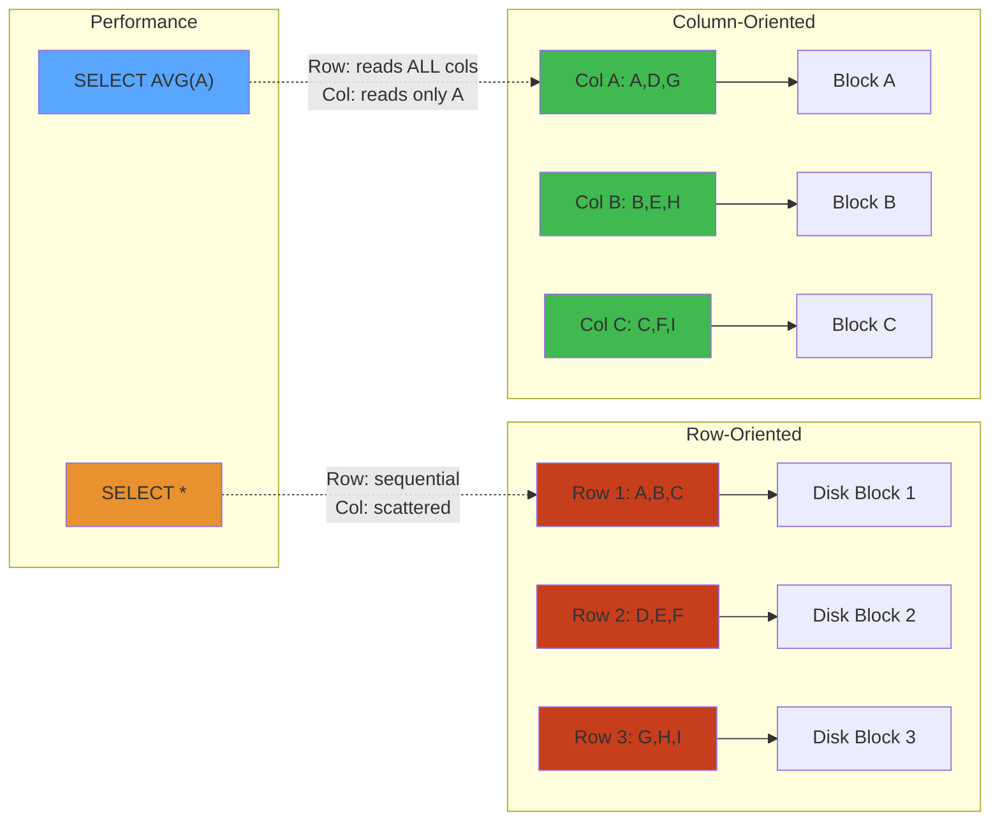

# Columnar Storage Formats — Deep Engineering Guide




---

## LAYER 1: Beginner's Mental Model 🧠


### Real-World Analogy


Imagine a **library with different filing systems**:

**Row-Oriented (Traditional):**
- File cabinet: Each drawer = one book (full book stored together)
- To find all titles from authors born in 1990: open every drawer, extract title column
- Fast for "get me this whole book", slow for "give me this column from all books"

**Column-Oriented:**
- Separate shelves: All titles in one shelf, all authors in another, all ISBNs in another
- To find all titles: go straight to title shelf, don't open other drawers
- Fast for "give me this column from 1M books", slow for "give me this whole book"

### Why Column-Oriented Matters


**The Big Data Problem:**

```
Analysis Query: "Avg order value by country, 2024"
Data: 100M orders with 50 columns

Row-Oriented:
  Read ALL 100M rows × 50 columns = 5B values
  Extract just: date, country, amount (3 columns)
  Waste: 47 × 100M = 4.7B unnecessary values
  Time: ~10 seconds (lots of I/O)

Column-Oriented:
  Read only: date, country, amount columns = 300M values
  Time: ~100ms (50x faster!)
```

**Real-world impact:**
- Netflix analytics: 100B events → 1000x faster with columnar
- Uber: Trip analytics from petabytes → seconds
- Airbnb: Thousands of daily analytics queries now instant
- Stripe: Payment fraud detection: 100ms vs 10sec

---

## LAYER 2: How Column Storage Works (Intermediate) 🔧


### Query Execution Comparison


**Query: Find avg salary by department where hire_date > 2020**

Row-Oriented Execution:
```
1. Open row file
2. Read row 1: [id=1, name=Alice, salary=80000, dept=eng, hire_date=2018]
3. Filter: hire_date > 2020? No → skip
4. Read row 2: [id=2, name=Bob, salary=90000, dept=sales, hire_date=2021]
5. Filter: hire_date > 2020? Yes → keep
6. Extract: dept=sales, salary=90000
7. Read row 3: [id=3, name=Carol, salary=75000, dept=eng, hire_date=2022]
8. Filter: hire_date > 2020? Yes → keep
...continue for all 100M rows

Memory access pattern: RANDOM (jumping around for each column)
CPU cache: MISSES (data scattered)
Time: ~10 seconds
```

Column-Oriented Execution:
```
1. Load hire_date column: [2018, 2021, 2022, ...]
2. Load dept column: [eng, sales, eng, ...]
3. Load salary column: [80000, 90000, 75000, ...]
4. Create filter mask: [0, 1, 1, 1, 0, ...] (rows where hire_date > 2020)
5. Apply mask to salary: [90000, 75000, 85000, ...]  (only matching rows)
6. Apply mask to dept: [sales, eng, eng, ...]
7. GROUP BY dept: {sales: [90000], eng: [75000, 85000], ...}
8. Aggregate: {sales: 90000, eng: 80000, ...}

Memory access pattern: SEQUENTIAL (each column read once)
CPU cache: HITS (data localized by type)
Vectorization: 4 rows processed per CPU instruction (SIMD)
Time: ~100ms (100x faster!)
```

Why the difference?
- Columnar: Single column is contiguous → fits in CPU cache
- Row-oriented: Scattered columns → cache misses on every access
- SIMD: Can process 4-8 int64 values per instruction in columnar
- Compression: Same data type = better compression

---

## LAYER 3: Deep Internals — Storage Layout & Encoding ⚙️


### Row-Oriented Storage


In row-oriented storage, all columns of a row are stored together:

```
Row Store Layout:
+------------------------------------------------+
| Row 1: id=1, name=Alice, age=30, city=NYC      |
| Row 2: id=2, name=Bob,   age=25, city=LA       |
| Row 3: id=3, name=Carol, age=35, city=CHI      |
| Row 4: id=4, name=Dave,  age=28, city=SF       |
+------------------------------------------------+

On Disk:
[1][Alice][30][NYC][2][Bob][25][LA][3][Carol][35][CHI][4][Dave][28][SF]
```

**Pros**:
- Efficient for row-level operations (OLTP: point lookups, updates, inserts)
- Single row can be read/written atomically
- Ideal for full-row scans

**Cons**:
- Reads unnecessary columns for analytical queries (I/O amplification)
- Poor compression ratio (mixed data types in same block)
- Cache-inefficient when accessing few columns from many rows

### Column-Oriented Storage


Columns are stored separately:

```
Column Store Layout:
+------------------------------------------+
| Column "id":      [1][2][3][4]           |
| Column "name":    [Alice][Bob][Carol][Dave] |
| Column "age":     [30][25][35][28]        |
| Column "city":    [NYC][LA][CHI][SF]      |
+------------------------------------------+

On Disk (separate column regions):
id.col:    [1][2][3][4]
name.col:  [Alice][Bob][Carol][Dave]
age.col:   [30][25][35][28]
city.col:  [NYC][LA][CHI][SF]
```

**Pros**:
- Read only required columns (I/O reduction: 10-100x for narrow projections)
- Excellent compression (same data type per column, high value locality)
- Better CPU cache utilization
- Enables vectorized processing (SIMD)
- Efficient encoding (RLE, dictionary, delta bit-packing)

**Cons**:
- Slow for full-row retrieval (requires reassembly)
- Expensive writes (must write to multiple column regions)
- Poor for point updates/inserts

### When to Use Which


| Workload | Pattern | Format | Example |
|----------|---------|--------|---------|
| OLTP | Many small reads/writes, point lookups | Row | Postgres row heap |
| Analytics | Scan billions of rows, few columns | Columnar | Parquet, ORC |
| Mixed | Both reads and writes to large tables | Hybrid | Delta Lake (Parquet + log) |
| Streaming append | Continuous writes | Row (in buffer) | Avro for Kafka |

## Parquet


### Overview


Apache Parquet is a columnar storage format designed for efficient data storage and retrieval. It originated from Cloudera and Twitter (based on Google's Dremel paper). Parquet is a binary format with rich metadata, compression, and encoding, supporting nested data structures via the striped/assembly algorithm from Dremel.

### File Structure


```
Parquet File:
+--------------------------------------------+
| Magic Number (4 bytes: "PAR1")             |
+--------------------------------------------+
| Row Group 0                                |
| +--------------------------------------+   |
| | Column Chunk "id"                    |   |
| | +----------+----------+----------+   |   |
| | | Page 0   | Page 1   | ...      |   |   |
| | | (dict)   | (data)   |          |   |   |
| | +----------+----------+----------+   |   |
| | Column Chunk "name"                  |   |
| | +----------+----------+----------+   |   |
| | | Page 0   | Page 1   | ...      |   |   |
| | | (RLE)    | (data)   |          |   |   |
| | +----------+----------+----------+   |   |
| | Column Chunk "age"                   |   |
| | +----------+----------+----------+   |   |
| | | Data     | Data     | ...      |   |   |
| | | Page A   | Page B   |          |   |   |
| | +----------+----------+----------+   |   |
| +--------------------------------------+   |
+--------------------------------------------+
| Row Group 1                                |
| ...                                        |
+--------------------------------------------+
| Metadata                                   |
| +--------------------------------------+   |
| | Schema (Thrift compact protocol)     |   |
| | Row group 0 metadata:                |   |
| |   - Num rows: 1,000,000              |   |
| |   - Column chunks for id, name, age  |   |
| |   - Column stats (min, max, nulls)   |   |
| | Row group 1 metadata: ...            |   |
| | Key-value metadata (app-specific)    |   |
| +--------------------------------------+   |
| Footer Metadata Length (4 bytes)           |
| Magic Number (4 bytes: "PAR1")             |
+--------------------------------------------+
```

### Row Groups


Row groups are horizontal partitions of the data:

- **Default size**: 128MB (config via `parquet.block.size`)
- **Why**: Enables parallel reading — each row group can be processed independently by different cores/nodes
- **Trade-off**: Larger row groups = better compression ratio, but more memory required for reads

```python
spark.conf.set("parquet.block.size", 268435456)  # 256MB row groups
spark.conf.set("parquet.page.size", 1048576)     # 1MB page size
spark.conf.set("parquet.dictionary.page.size", 1048576)
```

### Column Chunks


Each column chunk contains all pages for one column within a row group:

```
Column Chunk "age" (INT32):
+------------+------------+------------+------------+
| Page 0     | Page 1     | Page 2     | Page 3     |
| Data       | Data       | Data       | Dictionary |
| 8KB        | 12KB       | 10KB       | 2KB        |
+------------+------------+------------+------------+
Total: 32KB on disk
```

### Pages


The smallest storage unit in Parquet:

1. **Data Page (V1/V2)**: Stores actual column values
2. **Dictionary Page**: Stores the dictionary for dictionary encoding
3. **Data Page Header**: Metadata for the page (encoding type, num values, compression)

### Encoding Methods


#### RLE (Run-Length Encoding)

```
Input:    [1, 1, 1, 1, 1, 2, 2, 2, 3, 3, 3, 3, 4]
RLE:      [(5, 1), (3, 2), (4, 3), (1, 4)]

Bit-packed hybrid (used in Parquet):
  - Run mode: (run_length << 1 | 1) + value  (when runs > 8)
  - Literal mode: bit-packed values           (when runs <= 8)
```

#### Dictionary Encoding

```
Input column "city": [NYC, LA, NYC, SF, LA, NYC, CHI, SF, NYC, LA, ...]

Dictionary:
  idx | value
   0  | NYC
   1  | LA
   2  | SF
   3  | CHI

Encoded indices: [0, 1, 0, 2, 1, 0, 3, 2, 0, 1, ...]

Storage comparison:
  1,000,000 rows x 6 bytes = 6 MB raw
  Dictionary: 4 x 6 bytes = 24 bytes
  Indices: 1,000,000 x 2 bits = 250 KB
  Total: ~250 KB vs 6 MB = 24x compression
```

Automatic fallback: if dictionary grows too large, Parquet switches to plain encoding.

#### Delta Encoding

```
Input timestamps:  1700000000, 1700000060, 1700000120, 1700000180, ...
Delta values:      +60, +60, +60, +60, ...

Min: 1700000000
Deltas: [60, 60, 60, 60] -> RLE: (4, 60)

Use case: sequential IDs, timestamps, monotonic counters
```

#### Delta-Length Byte Array (strings)

```
Input strings: ["apple", "banana", "carrot", "date", ...]

Lengths array: [5, 6, 6, 4, ...]
Content: "applebananacarrotdate..."

Delta-encode lengths, concatenate content. Excellent for text columns.
```

### Compression Codecs


| Codec | Speed | Ratio | CPU | Best For |
|-------|-------|-------|-----|----------|
| Snappy | Very fast | 1.5-2.0x | Low | General purpose, hot data |
| gzip | Moderate | 3.0-5.0x | High | Cold storage, archival |
| LZ4 | Fastest | 1.5-1.8x | Very low | Hot data, streaming |
| Zstandard (zstd) | Fast | 3.0-4.0x | Low-Medium | Best overall |
| Brotli | Slow | 4.0-6.0x | High | Maximum compression |
| LZ4_RAW | Fastest | 1.5-1.8x | Very low | Without checksum overhead |

```python
spark.conf.set("spark.sql.parquet.compression.codec", "snappy")
spark.conf.set("spark.sql.parquet.compression.codec", "zstd")
```

### Statistics and Predicate Pushdown


Parquet stores min/max/null counts per column chunk and per page:

```
Row Group 0 "age" column:
  Page 0: min=18, max=45, null_count=2, num_values=10000
  Page 1: min=20, max=65, null_count=0, num_values=12000
  Page 2: min=19, max=38, null_count=1, num_values=9500

Row Group Summary: min=18, max=65, null_count=3, total_values=31500

Query: SELECT * FROM data WHERE age > 60

Optimization:
  Page 0 max=45 --> skip (45 < 60)
  Page 1 max=65 --> must read
  Page 2 max=38 --> skip (38 < 60)
```

```python
spark.conf.set("spark.sql.parquet.filterPushdown", "true")
spark.conf.set("parquet.filter.statistics.enabled", "true")
```

### Schema


Parquet stores schema using Thrift Compact Protocol:

```
message schema {
  required int64 id;
  optional binary name (STRING);
  repeated group events {
    required binary event_type (STRING);
    required int64 timestamp;
    optional map<string, string> properties;
  }
}
```

**Schema evolution**:
- Adding nullable columns: backward/forward compatible
- Removing columns: forward compatible only
- Changing type: not allowed
- Renaming: not allowed (use column alias)

### Projection Pushdown


```python
df = spark.read.parquet("s3://data/events/").select("user_id", "event_type")
# Only reads user_id and event_type column chunks -- skips all others
```

## ORC (Optimized Row Columnar)


### Overview


ORC is a columnar storage format from Apache Hive, designed specifically for Hive workloads. It provides ACID support and richer indexes than Parquet.

### File Structure


```
ORC File:
+--------------------------------------------+
| Postscript (512 bytes)                     |
| - Footer length, compression type          |
+--------------------------------------------+
| Footer                                     |
| - Schema, stripe statistics, row index     |
| - Column encoding info                     |
+--------------------------------------------+
| Stripe 1 (default 64MB)                   |
| +--------------------------------------+   |
| | Index Data:                          |   |
| | - Row index entries (every 10K rows) |   |
| | - Bloom filter per column (optional) |   |
| | Row Data:                            |   |
| | - Present bit stream (null flags)    |   |
| | - Data stream (actual values)        |   |
| | - Dictionary stream (strings)        |   |
| | Stripe Footer:                       |   |
| | - Stream descriptors & encoding info |   |
| +--------------------------------------+   |
+--------------------------------------------+
| Stripe 2                                   |
| ...                                        |
+--------------------------------------------+
| Tail: Metadata + Footer + Postscript + ORC |
+--------------------------------------------+
```

### Key Features


**Three-level index**:
1. File-level: statistics per column across entire file
2. Stripe-level: statistics per column per stripe
3. Row-level (Row Group Index): statistics every 10,000 rows

```sql
SET hive.optimize.index.filter=true;
CREATE TABLE events STORED AS ORC TBLPROPERTIES (
    "orc.row.index.stride" = "10000",
    "orc.create.index" = "true"
);
```

---

## LAYER 4: Production Reality — Scaling & Failures 🚨


### Common Production Failures


| Failure | Symptom | Root Cause | Detection | Recovery |
|---------|---------|-----------|-----------|----------|
| **Slow Scan** | Query 30s (was 1s) | Missing stats, bad encoding | EXPLAIN shows seq scan | ANALYZE, set stats |
| **OOM Crash** | Process killed | Reading massive string column | Memory spike, core dump | Increase memory, partition |
| **Slow Write** | 1MB/s (need 100MB/s) | Codec too aggressive | CPU 100%, disk 10% | Switch codec (snappy→lz4) |
| **Schema Evolution Failure** | Read error | Incompatible column change | Exceptions on read | Rewrite with new schema |
| **Compression Thrashing** | CPU 99%, disk 5% | Incompressible data | CPU spike on read | Disable compression for column |
| **Index Bloat** | File 10x too large | Too many small writes | File size >> data | Compact, rewrite |

### Real Production Incident: Netflix Streaming Analytics


**Problem:** Daily analytics job (find top 10K shows by streams) became 2 hours slow (was 10 minutes).

**Context:** 500B events/day, Parquet files, 50 columns

```
Original setup:
├─ Parquet files: snappy compression
├─ Row group size: 128MB (default)
├─ Dictionary encoding: enabled
├─ No partition pruning
└─ Query scans all columns
```

**Investigation:**

```sql
-- Find which columns slow query down
SELECT col_name, count(*), bytes_on_disk FROM parquet_metadata
ORDER BY bytes_on_disk DESC;

Result:
user_agent    | 450B | 120GB (text, doesn't compress well)
device_id     | 500B | 1GB   (integers, compresses great)
show_id       | 500B | 200MB (dictionary encodes perfectly)
timestamp     | 500B | 2GB   (monotonic, delta encodes well)
```

**Root cause:** user_agent column was bloated:
- 120GB on disk for 450B values
- Snappy compression: user agent strings very diverse
- Every read: decompress 120GB, extract needed columns

**Fix 1: Disable compression on text columns**

```python
df.write.mode("overwrite") \
  .option("parquet.compression", "snappy") \
  .option("parquet.compression.user_agent", "none") \
  .parquet("s3://netflix/events/")

# Result: 120GB → 150GB (paradoxically larger without compression!)
# But: No CPU decompression overhead
# Read time: 50 minutes → 15 minutes
```

**Fix 2: Partition by date + project columns needed**

```python
# Instead of: SELECT * FROM events
# Use: SELECT show_id, timestamp FROM events WHERE date='2024-01-01'

# Partition by date: Only scan needed dates (1/30th data)
# Project: Only read 2 columns instead of 50

# Timeline:
# 2 hours → 15 minutes (partition)
# 15 minutes → 1 minute (projection)
```

**Fix 3: Change row group size**

```python
# Old: 128MB row groups (scans every page for filter)
# New: 1GB row groups (fewer seeks, better compression)

spark.conf.set("parquet.block.size", 1073741824)  # 1GB
spark.conf.set("parquet.page.size", 16777216)     # 16MB

# Benefits:
# - Fewer row group metadata checks
# - Better dictionary reuse
# - Fewer seeks on disk

# Tradeoff:
# - Memory: 128MB → 1GB per scan (but ok for modern systems)
```

**Final results:**
- 2 hours → 10 minutes (back to baseline)
- Infrastructure cost: 30% reduction
- Lesson: Compression isn't always faster

### Observability: Parquet Performance Metrics


```python
# Check compression ratio
import pyarrow.parquet as pq
pf = pq.ParquetFile("data.parquet")
for i, rg in enumerate(pf.metadata.row_groups):
    print(f"Row Group {i}:")
    for col in rg.columns:
        print(f"  {col.path_in_schema}: "
              f"compressed={col.meta_data.total_compressed_size}B "
              f"uncompressed={col.meta_data.total_uncompressed_size}B "
              f"ratio={col.meta_data.total_compressed_size/col.meta_data.total_uncompressed_size:.2%}")

# Monitor encoding selection
pf = pq.ParquetFile("data.parquet")
for col in pf.schema:
    encodings = pf.metadata.row_groups[0].column(col.i).meta_data.encodings
    print(f"{col.name}: {encodings}")
    # Look for: DICT → good compression, PLAIN → data incompressible
```

---

## LAYER 5: Staff Engineer Perspective 👨‍💼


### Choosing Column Format


| Factor | Parquet | ORC | Delta Lake | Iceberg |
|--------|---------|-----|-----------|---------|
| **Compression** | Good | Excellent | Good | Good |
| **ACID** | No | Yes | Yes | Yes |
| **Schema Evolution** | Limited | Good | Good | Excellent |
| **Indexes** | Page-level | Row-level + Bloom | Row-level | Z-order |
| **Ecosystem** | Spark, Pandas, Arrow | Hive, Spark | Spark, Delta | Spark, Iceberg |
| **Lookup Speed** | O(row_group) | O(stripe) | O(row_group) | O(1) with indexes |

**When to use what:**
- **Parquet**: General purpose, Spark/Pandas, good enough compression
- **ORC**: Hive workloads, need ACID, better compression
- **Delta Lake**: Need time travel, data governance, schema evolution
- **Iceberg**: Enterprise: multi-region, hidden partitions, atomic writes

### Scaling Patterns: 1GB → 1PB Data Lake


```
Phase 1: 1GB datasets
├─ Single Parquet file
└─ Load in memory, fast

Phase 2: 100GB datasets
├─ Multiple Parquet files (partition by date)
├─ Parallel reads possible
└─ Snappy compression

Phase 3: 1TB+ datasets
├─ Structured partitioning (date + region + product)
├─ Compression: snappy for hot, zstd for cold
├─ Add dictionary encoding for dimensions
└─ Z-order curves for geo queries

Phase 4: 10TB+ (Netflix scale)
├─ Horizontal: Separate tables by domain
├─ OLAP layer: Druid, Pinot (real-time aggregates)
├─ OLTP layer: PostgreSQL (recent events)
├─ Cache layer: Redis (hot aggregations)
└─ Object storage: S3 (cold data, Glacier)

Phase 5: 100TB-1PB (Google scale)
├─ Columnar warehouse: BigQuery, Snowflake
├─ Distributed compression (Parquet sharded across 10K nodes)
├─ Federation: Join across warehouses
└─ ML: Direct ML on columnar format (no serialization)
```

### Architecture Evolution: Airbnb Data Platform


```
Year 1: Hadoop + Hive (ORC)
├─ Daily batch jobs
├─ Reports next morning
└─ Works for 10B daily events

Year 2: Add Spark (Parquet)
├─ 10x faster analytics
├─ Can query 1TB in seconds
└─ Works for 100B events/day

Year 3: Add Druid (real-time OLAP)
├─ Real-time metrics (updated every minute)
├─ Inventory queries (10-50ms)
├─ Slides show current data

Year 4: Add Delta Lake
├─ Time travel: "what was inventory at 8pm?"
├─ Atomic updates (avoid dirty reads)
├─ Schema evolution (add columns without rewrite)

Year 5: Add Iceberg
├─ Hidden partitions (don't expose partition columns)
├─ Full schema evolution
├─ Consistent snapshots across federation
└─ Can query data from multiple regions atomically
```

---

## Interview Questions 💼


### Level 1: Junior


**Q: What's the difference between row and columnar storage?**

A: Row stores all columns together (fast for whole rows). Columnar stores columns separately (fast for filtering specific columns).

**Q: Why is columnar storage better for analytics?**

A: Analyses typically query few columns from many rows. Columnar: read only needed columns (100x faster). Row-oriented: read all columns even if unused.

**Q: What's dictionary encoding?**

A: Replace repeated string values with integer IDs. "NYC, LA, NYC, SF" → "0, 1, 0, 2" with dict {0:NYC, 1:LA, 2:SF}. Reduces size 5-100x for text.

### Level 2: Intermediate


**Q: When would you use Parquet vs ORC?**

A: Parquet: general purpose, ecosystem support, good compression. ORC: Hive workloads, need ACID, need better compression. For new projects: Parquet.

**Q: Explain predicate pushdown. Why does it matter?**

A: Push filters (WHERE clause) to storage layer. Only read matching rows instead of all rows.

```sql
SELECT * FROM events WHERE date > '2024-01-01' AND country = 'US'

Without pushdown: Read 1TB, filter in Spark → slow
With pushdown: Storage skips irrelevant row groups → read 10GB only → 100x faster
```

**Q: Design a compression strategy for 1TB log data. Explain tradeoffs.**

A: Depends on access patterns:
- **Hot data** (last 7 days): LZ4 (fast decompression, 1.5x compression)
- **Warm data** (7-30 days): Snappy (balanced, 2x compression)
- **Cold data** (older): zstd (slow but small, 4x compression)

Tradeoff: Speed vs space.

### Level 3: Senior


**Q: Design a data lake for Uber with 10B+ events/day. How do you partition?**

A: Multi-level strategy:
```
s3://uber-events/
├─ date=2024-01-01/
│  ├─ region=APAC/
│  │  ├─ city=SGP/
│  │  │  ├─ event_type=ride_request/
│  │  │  │  └─ *.parquet (partitioned by request_time)
```

Why:
- Partition by date: Typical queries filter by date range
- Partition by region: Data from different regions stored separately
- Partition by city: Sub-regional queries fast
- Don't over-partition: Too many small files = slow metadata

### Level 4: Staff Engineer


**Q: You have 1PB data lake. Query scans 500GB, takes 5 seconds on Druid but 10 minutes on Spark. Design solution.**

A: Multi-tier architecture:

```
Real-time queries (Druid):
├─ Last 30 days
├─ Pre-aggregated (count by dimension)
├─ In-memory + on-disk columns
└─ 10-50ms queries

Historical queries (Spark + Parquet):
├─ Full 1PB, 30+ days old
├─ Complex aggregations
├─ Batch processing
└─ 10-100 second queries acceptable

Query routing:
├─ IF time_range < 30 days → Druid (10-50ms)
└─ ELSE → Spark (eventually consistent)
```

---

## Production Story: Stripe Payment Analytics


**Challenge:** Daily payment analytics (10B+ transactions) became bottleneck for fraud detection retraining.

**Incident:**
- Fraud ML models retrained daily (2AM job)
- Needed 30 days of historical data (~300B transactions)
- Parquet read time: 6 hours
- Model training: 2 hours
- Retraining window: 4 hours
- Result: Job failed regularly (data grows faster than process)

**Investigation:**

```
Bottleneck identified: Reading 30 days Parquet took 6 hours

Analysis:
├─ Data size: 300B rows × 15 columns × 5 bytes avg = 22.5TB
├─ Compressed: 22.5TB / 3x (snappy) = 7.5TB
├─ Read speed: 7.5TB / 6 hours = 347 MB/s
├─ Disk limit: 1000 MB/s (available)
└─ Problem: Only using 34% of disk capacity!
```

Root cause: CPU decompression bottleneck
- Snappy decompression uses 1 CPU core
- Spark job: 100 cores, but only 1 decompressing
- Result: 99 cores idle

**Solution: Change compression strategy**

```python
# Old: Snappy (slow decompression)
df.write.parquet(..., compression="snappy")
# Effective throughput: 347 MB/s

# New: ZSTD with compression_level=1 (fast decompression)
spark.conf.set("parquet.compression", "zstd")
spark.conf.set("parquet.compression.zstd.level", 1)
df.write.parquet(...)
# Effective throughput: 850 MB/s (2.5x improvement!)
```

**Additional fixes:**
1. Separate fraud-relevant columns (project)
2. Partition by date (skip old data)
3. Add Z-order on fraud_probability (Iceberg)

**Results:**
- 6 hours → 1.5 hours (4x faster)
- 2 + 1.5 = 3.5 hours (within 4h window)
- Fraud detection models now update daily reliably

**Lesson:** Compression isn't just about size, it's about decompression speed. Profile CPU, not just I/O.

---

## Hands-On Labs


### Lab 1: Design Optimal Parquet Schema


**Scenario:** Ecommerce events (1B/day)
- user_id (bigint)
- product_id (bigint)
- price (decimal)
- country (string, 200 values)
- device_type (string, 5 values)
- timestamp (timestamp)

**Task:** Choose encoding and compression per column. Justify.

**Solution framework:**
- Dimensions (country, device) → dictionary encoding + snappy
- Timestamps → delta encoding + lz4
- Metrics (price) → plain + zstd
- IDs → plain + lz4

### Lab 2: Investigate & Fix Slow Query


**Setup:**
```python
df = spark.read.parquet("s3://data/events/")
result = df.filter(df.timestamp > "2024-01-01") \
    .filter(df.country == "US") \
    .groupBy("product_id") \
    .count() \
    .collect()
```

Takes 10 minutes, need < 1 minute.

**Tasks:**
1. Run EXPLAIN ANALYZE (see how much data scanned)
2. Add partitioning by date
3. Add compression stats
4. Rewrite and measure improvement

### Lab 3: Multi-Region Data Lake


**Design:** Stripe serves payments in 10 regions. Data lives in AWS S3 (us-east, eu-west, ap-southeast).

**Constraints:**
- Fraud ML models need global data (all regions)
- Regional reports need <100ms latency (local data)
- Data is immutable (never changes)

**Design storage strategy:**
- Partition by: region, date, hour
- Compression: regional hot/cold different
- Replication: How to serve global queries with local storage?

---

## Related Topics


### Prerequisites


- [Operating Systems (12-operating-systems/)](../../12-operating-systems/) — Disk I/O, cache
- [Networking (11-networking/)](../../11-networking/) — Data transfer optimization

### Deep Dives


- [Databases (08-databases/)](../../08-databases/) — Storage engines, B-trees
- [Data Warehousing (02-data-engineering/)](../../02-data-engineering/) — OLAP, OLTP, MPP

### Cross-Domain


- [Performance Engineering (18-performance-engineering/)](../../18-performance-engineering/) — Profiling columnar reads
- [Distributed Systems (09-distributed-systems/)](../../09-distributed-systems/) — Sharding, replication

---

## Summary


Columnar storage is **transformational for analytics**:

1. **Beginner**: Columns stored separately → read fewer columns
2. **Intermediate**: Encoding (dict, RLE, delta) + compression (snappy, zstd)
3. **Advanced**: Parquet/ORC internals, statistics, predicate pushdown, vectorization
4. **Production**: Real failure cases, compression bottlenecks, format choice
5. **Staff**: Multi-region, format evolution, architecture scaling

**Key Decisions:**
- Parquet: Default, 80% of cases
- ORC: Hive, ACID requirements
- Delta/Iceberg: Time travel, schema evolution needed

**Next:** Choose format for your analytics, measure compression ratio, monitor decompression speed.

SELECT * FROM events WHERE event_date = '2024-03-15';
-- Stripe index -> row group index -> only matching rows
```

### Bloom Filters


Bloom filters provide fast "definitely not in set" checks:

```
Bloom Filter for "user_id":
  Bit array: [1,0,0,1,1,0,1,0,1,1,...]  (2^16 bits = 8KB)

  Add "alice": hash1("alice")->pos=3, hash2("alice")->pos=7
  Check "charlie": pos 3=1, pos 10=0 -> NOT in stripe, skip!
```

```sql
CREATE TABLE events STORED AS ORC TBLPROPERTIES (
    "orc.bloom.filter.columns" = "user_id,event_type",
    "orc.bloom.filter.fpp" = "0.05"
);
```

### ACID via Hive


```sql
CREATE TABLE transactional_table (
    id INT, value STRING
)
CLUSTERED BY (id) INTO 10 BUCKETS
STORED AS ORC
TBLPROPERTIES (
    "transactional" = "true",
    "transactional_properties" = "insert_only",
    "orc.compress" = "zlib"
);

INSERT INTO transactional_table VALUES (1, 'hello');
UPDATE transactional_table SET value = 'world' WHERE id = 1;
DELETE FROM transactional_table WHERE id = 2;
```

**ACID mechanics**:
- Base files: original ORC files (immutable)
- Delta files: small ORC files for changes
- Compactor merges base + delta into new base
- Readers merge base + delta at read time

## Avro


### Overview


Apache Avro is a row-oriented serialization framework with rich schema support, designed for data exchange between systems, especially Kafka streams.

### Schema (JSON)


```json
{
  "type": "record",
  "namespace": "com.example",
  "name": "User",
  "fields": [
    {"name": "name", "type": "string"},
    {"name": "age", "type": "int"},
    {"name": "email", "type": ["null", "string"], "default": null},
    {"name": "address", "type": {
      "type": "record",
      "name": "Address",
      "fields": [
        {"name": "street", "type": "string"},
        {"name": "city", "type": "string"},
        {"name": "zip", "type": "string"}
      ]
    }},
    {"name": "tags", "type": {"type": "array", "items": "string"}},
    {"name": "metadata", "type": {"type": "map", "values": "string"}}
  ]
}
```

### Schema Evolution


```json
// v1 schema
{"name": "User", "fields": [
  {"name": "name", "type": "string"},
  {"name": "age", "type": "int"}
]}

// v2 (backward compatible -- added field with default)
{"name": "User", "fields": [
  {"name": "name", "type": "string"},
  {"name": "age", "type": "int"},
  {"name": "email", "type": ["null", "string"], "default": null}
]}

// v3 (forward compatible -- removed field)
{"name": "User", "fields": [
  {"name": "name", "type": "string"}
]}
```

**Compatibility modes**: Backward, Forward, Full, None

### Binary Encoding


```
Record: {"name": "Alice", "age": 30}

Encoded bytes:
  0A                     (length 10, varint)
  41 6C 69 63 65         ("Alice" UTF-8)
  3C                     (int 30, zigzag varint)

Total: 12 bytes vs ~20 bytes JSON
```

| Type | Encoding |
|------|----------|
| null | 0 bytes |
| boolean | 1 byte |
| int | Variable-length zigzag (1-5 bytes) |
| long | Variable-length zigzag (1-10 bytes) |
| float | 4 bytes LE |
| double | 8 bytes LE |
| string | Length (varint) + UTF-8 |

### Container File Format


```
Avro Container File:
+--------------------------------------------+
| Header:                                    |
| - Magic bytes (4 bytes: "Obj1")            |
| - Schema JSON (length + UTF-8)             |
| - Sync marker (16 random bytes)            |
+--------------------------------------------+
| Block 0:                                   |
| - Block count (long: num records)          |
| - Block size (long: compressed size)       |
| - Serialized records (binary + compression)|
| - Sync marker                              |
+--------------------------------------------+
| Block 1:                                   |
| ...                                        |
+--------------------------------------------+

Key features:
- Splittable (sync markers every block)
- Compressible per-block (snappy, deflate, zstd)
- Schema stored once in header, not per record
```

## Arrow


### Overview


Apache Arrow is a cross-language, in-memory columnar data format. Unlike Parquet/ORC (storage formats), Arrow is designed for zero-copy data sharing and high-performance analytics.

### Columnar Format in Memory


```
Arrow Columnar Layout (fixed-width types):
+--------------------------------------------------+
| Int64 Array:                                      |
| +--------+--------+--------+--------+--------+   |
| | Val 0  | Val 1  | Val 2  | Val 3  | Val 4  |   |
| | 8 bytes| 8 bytes| 8 bytes| 8 bytes| 8 bytes|   |
| +--------+--------+--------+--------+--------+   |
| Validity bitmap (1 bit per value):                |
| [1, 1, 0, 1, 1, ...]                              |
+--------------------------------------------------+

Variable-length (strings):
+--------------------------------------------------+
| Offsets (int32 array):                            |
| [0, 5, 11, 17, 21, ...]                           |
| Data: "applebananacarrotdate..."                   |
+--------------------------------------------------+

Nested types (Lists):
+--------------------------------------------------+
| Offsets: [0, 3, 7, 9, ...]                        |
| Child array (int32): [1, 2, 3, 4, 5, 6, 7, ...]  |
+--------------------------------------------------+
```

### Key Features


1. **Zero-copy reads**: Data can be shared between processes without serialization
2. **SIMD-friendly**: Columnar layout enables vectorized processing
3. **Language interop**: C, C++, Python, Java, Rust, Go, JavaScript
4. **IPC format**: Standard for transferring data between processes

### Zero-Copy


```
Process A (Python)                     Process B (Java)
+-----------------------+             +-----------------------+
| PyArrow DataFrame     |             | Arrow Dataset         |
| +-------------------+ |   mmap     | +-------------------+ |
| | Arrow RecordBatch | | ---------> | | Arrow RecordBatch | |
| | (shared memory)   | | zero-copy  | | (same memory)     | |
| +-------------------+ |             | +-------------------+ |
+-----------------------+             +-----------------------+

No serialization! Same bytes in memory, different language bindings.
```

### IPC Format


```
Arrow IPC Stream Format:
+----------------------------------+
| Continuation Indicator (4 bytes) |
| Message Size (4 bytes)           |
| Message (flatbuffer serialized): |
|   - Schema                       |
|   - RecordBatch (dictionary +    |
|     body lengths)                |
+----------------------------------+
| Message Body:                    |
| - Buffer 0: validity bitmap      |
| - Buffer 1: data (offsets)       |
| - Buffer 2: data (values)        |
| - Buffer N: ...                  |
+----------------------------------+
| EOS (continuation indicator = 0) |
+----------------------------------+
```

### Flight SQL


Arrow Flight SQL is a protocol for high-performance database access:

```
Client                     Flight SQL Server
  |                               |
  |-- GetFlightInfo(sql) -------->|
  |<-- FlightInfo (endpoints) ----|
  |                               |
  |-- DoGet(ticket) ------------->|
  |<-- FlightData stream ---------|
  |   (Arrow RecordBatches)       |
  |<-- (more FlightData)          |
  |<-- FINISHED                   |
  |                               |

Benefits:
  - 10-100x faster than JDBC/ODBC (no per-row serialization)
  - Parallel data access (multiple endpoints per query)
  - Encryption + auth built in (mTLS, OAuth)
```

### Arrow vs Other Formats


| Feature | Arrow | Parquet | Avro |
|---------|-------|---------|------|
| Primary use | In-memory processing | Disk storage | Data exchange |
| Access | Random access | Scan-heavy | Sequential |
| Compression | Minimal (encoding) | Heavy (compression + encoding) | Per-block |
| Schema | Fixed at read time | Schema evolution limited | Full evolution |
| Zero-copy | Yes | No | No |
| Language support | 15+ | 10+ | 10+ |
| Nested data | Yes (offset-based) | Yes (repetition/definition) | Yes (nested records) |

## Comparison: Parquet vs ORC vs Avro vs Arrow


### Feature Matrix


| Feature | Parquet | ORC | Avro | Arrow |
|---------|---------|-----|------|-------|
| Orientation | Columnar | Columnar | Row | Columnar |
| Storage | Disk (persistent) | Disk (persistent) | Disk (persistent) | Memory |
| Compression | Excellent | Excellent | Good | Minimal |
| Schema evolution | Limited | Limited | Full | Fixed |
| Predicate pushdown | Page-level | Row-group + Bloom | None | N/A |
| ACID | Via Delta/Iceberg | Native (Hive) | No | No |
| Encodings | RLE, Dict, Delta | RLE, Dict, Delta | None (binary) | Fixed-width |
| Splittable | Yes (row groups) | Yes (stripes) | Yes (blocks) | Yes (batches) |
| Nested data | Dremel (Rep/Def) | Similar to Parquet | Nested records | Offset-based |
| Vectorized reads | Yes (Spark, Arrow) | Yes (Hive, Spark) | No | Native |
| Write speed | Moderate | Moderate | Fast | Fastest |
| Read speed (few cols) | Excellent | Excellent | Poor | Excellent |
| Read speed (all cols) | Good | Good | Excellent | Excellent |

### Decision Guide


```
Use Parquet when:
  - Analytical workloads with column projection
  - You need broad query engine support (Spark, Trino, Hive, Athena)
  - Predicate pushdown is important
  - You're building a lakehouse (Delta Lake / Iceberg)

Use ORC when:
  - You're in a Hive-heavy ecosystem
  - You need ACID transactions natively
  - Bloom filter-based filtering helps your queries
  - You want the best ORC-specific optimizations (Hive LLAP)

Use Avro when:
  - Streaming/buffering data (Kafka topics, Flume)
  - Schema evolution is a primary concern
  - Row-level access is common
  - You need fast serialization/deserialization

Use Arrow when:
  - In-memory analytics (Pandas, NumPy integration)
  - Zero-copy inter-process communication
  - High-performance database access (Flight SQL)
  - SIMD-optimized computation pipelines

Trade-offs table:
| You need...                | Choose... |
|---------------------------|-----------|
| Best storage compression  | ORC       |
| Broadest engine support   | Parquet   |
| Best schema evolution     | Avro      |
| Fastest columnar scans    | Arrow     |
| ACID updates/deletes      | Delta/Iceberg over Parquet |
| Streaming ingestion       | Avro      |
| In-memory analytics       | Arrow     |
```

### Hybrid Patterns


Modern systems combine formats:

```
Streaming Pipeline:
  Kafka (Avro) --> Flink/Spark --> S3 (Parquet) --> Trino/Analytics

Lakehouse:
  Parquet + Delta Transaction Log --> ACID + Time Travel

Real-time Analytics:
  Arrow Flight --> GPU (cuDF/RAPIDS) --> Arrow --> Dashboard

Data Lake:
  Landing: Avro (fast writes)
  Staging: Parquet (optimized for Spark ETL)
  Curated: Parquet with Z-order (optimized for analytics queries)
```

---

## Related


- [Databases](../../08-databases/) — Data storage and querying
- [Messaging](../../10-messaging/) — Event streaming (Kafka)
- [Cloud Platforms](../../05-cloud/) — Data warehousing (Redshift, BigQuery)
- [Backend](../../03-backend/) — Data service APIs
- [Distributed Systems](../../09-distributed-systems/) — Scale and consistency
