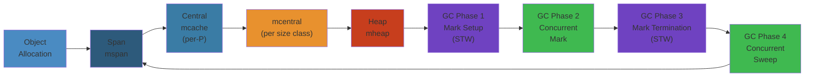
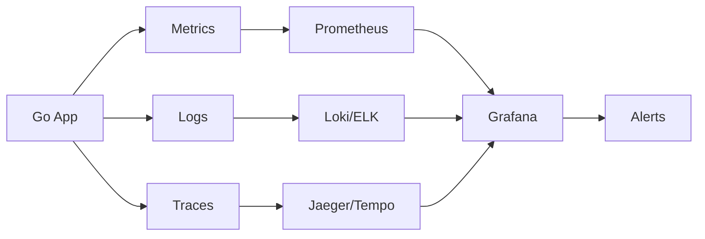

# Go Scheduler, Memory Management, and Garbage Collection: Deep Internals




## Table of Contents

1. [NOOB EXPLANATION: How Does Go Manage Computing?](#noob-explanation)
2. [THE GO SCHEDULER DEEP DIVE](#go-scheduler-deep-dive)
3. [MEMORY ALLOCATOR: tcmalloc Architecture](#memory-allocator)
4. [GARBAGE COLLECTION: Phases and Tuning](#garbage-collection)
5. [END-TO-END FLOW: Request to Execution](#end-to-end-flow)
6. [LARGE-SCALE SYSTEMS](#large-scale-systems)
7. [FAILURE ANALYSIS](#failure-analysis)
8. [EDGE CASES AND SUBTLE BEHAVIORS](#edge-cases)
9. [INTERVIEW QUESTIONS](#interview-questions)
10. [PERFORMANCE OPTIMIZATION](#performance-optimization)
11. [PRODUCTION INCIDENT STORIES](#production-incident-stories)
12. [COMPLETE CODE EXAMPLES](#complete-code-examples)

---

## NOOB EXPLANATION: How Does Go Manage Computing?

### The Scheduler: Teacher in a Classroom

Imagine a teacher managing 1000 students in a classroom with 4 desks:

- **Without scheduler:** Assign 250 students per desk permanently. Some desks are idle, some have students waiting. Inefficient.

- **With Go scheduler:** Students rotate between desks. When a student finishes a problem (I/O, channel op), they yield the desk. Another student sits down. The teacher (scheduler) ensures fair rotations.

Key insight: **The teacher doesn't need 1000 desks; 4 desks serving 1000 students works fine.**

```
Classroom (Go Scheduler):
┌─────────────────────────────────┐
│  Desk 1  Desk 2  Desk 3  Desk 4 │ (4 processors = GOMAXPROCS)
│   ↑       ↑       ↑       ↑     │
│ [G1]   [G5]   [G8]   [G12]    │
│ [G2]   [G6]   [G9]   [G13]    │
│ [G3]   [G7]   [G10]  [G14]    │
│ [G4]            [G11]  [G15]  │
│ (queue of       (queue of      │
│  1000 tasks)     1000 tasks)   │
└─────────────────────────────────┘
```

### Memory Allocator: The Smart Warehouse

Think of memory allocation like a warehouse:

- **Naive approach:** Every allocation request goes to a central manager. Manager finds free space, marks it used. Multiple threads waiting. Bottleneck!

- **Go's tcmalloc:** Each worker (P) has a **local cache** of free memory. Most allocations come from local cache (no locking). Only occasionally go to central store.

Result: Allocation is fast (~10 nanoseconds) because no locking needed.

### Garbage Collector: The Cleaner Service

GC is like a cleaning service:

- **Synchronous:** Stop all workers, clean house, restart. Pause time is long (pause all goroutines).

- **Concurrent:** Cleaning happens while workers work. Some work gets marked for later cleaning. Pause time is short.

**Go's GC:** Mostly concurrent with brief stop-the-world pauses (~1-50ms).

---

## THE GO SCHEDULER DEEP DIVE

### Scheduler Structure and Data

```c
// From runtime/runtime2.go
type schedt struct {
    lock        mutex
    
    // Global run queue
    runq        gQueue    // Runnable goroutines
    runqsize    int32
    
    // Global cache of unused goroutines
    gFree       gList
    gFreeStack  gList     // Free goroutines with stacks
    
    // Processor list
    allp        []*p      // All processors (length: gomaxprocs)
    idleP       uintptr   // Idle processor list
    
    // Thread management
    m0           m        // The bootstrap m
    mnext        int64    // Next M ID
    mcount       int32    // Number of M's
    
    // GC state
    gcwaiting    uint32
    stopwait     int32
    
    // Timers
    timersLock   mutex
    timers       []*timer
}

// Per-processor structure
type p struct {
    id          int32
    status      uint32
    
    // Local run queue (ring buffer)
    runqhead    uint32
    runqtail    uint32
    runq        [256]guintptr
    runnext     guintptr    // Next to run (high priority)
    
    // Cache of small objects
    mcache      *mcache     // Memory cache
    
    // Work stealing state
    stealing    bool
    
    // GC-related
    gcAssistBytes int64
    gcw           gcWork     // GC work
}
```

### Main Scheduler Loop

The scheduler runs on each M (OS thread), periodically calling `schedule()`:

```c
// Simplified scheduler main loop
void schedule(void) {
    g *gp;
    
    for(;;) {
        // 1. Check for GC (stop-the-world)
        if(sched.gcwaiting) {
            stopm();  // Park this M until GC done
            continue;
        }
        
        // 2. Look for next runnable goroutine
        gp = nil;
        
        // Try local run queue
        gp = runqget(pp);
        
        // Try global run queue (1/61 of time)
        if(gp == nil && sched.runqsize > 0) {
            lock(&sched.lock);
            gp = globrunqget(pp);
            unlock(&sched.lock);
        }
        
        // Work stealing (if still no work)
        if(gp == nil) {
            gp = findrunnable();
        }
        
        // 3. Execute the goroutine
        if(gp != nil) {
            execute(gp);
        } else {
            // No work, park this M
            stopm();
        }
    }
}
```

### Work Stealing Deep Dive

When P0 runs out of work:

```c
g* findrunnable(void) {
    P *pp = getg()->m->p;
    g *gp;
    
    // 1. Check own local runq
    gp = runqget(pp);
    if(gp) return gp;
    
    // 2. Poll global runq (1 in 61 times)
    if(pp->status == Prunning && sched.runqsize) {
        lock(&sched.lock);
        gp = globrunqget(pp);
        unlock(&sched.lock);
        if(gp) return gp;
    }
    
    // 3. Work stealing loop
    for(i = 0; i < nprocs; i++) {
        P *p = allp[i];
        if(p == pp || p.runqsize == 0) continue;
        
        // Steal half of p's run queue
        uint32 n = runqsteal(pp, p);
        if(n) {
            return runqget(pp);  // Get our share
        }
    }
    
    // 4. Poll network (for goroutines blocked on I/O)
    gp = netpoll(false);
    if(gp) return gp;
    
    // 5. Spin loop (busy-wait for work)
    if(pp->spinning == 0) {
        pp->spinning = 1;
        atomic.Xadd(&sched.nmspinning, 1);
        
        for(i = 0; i < 1000; i++) {  // Spin ~1 microsecond
            // Check for new work without locking
            if(runqget(pp)) {
                pp->spinning = 0;
                return gp;
            }
        }
        
        pp->spinning = 0;
    }
    
    // 6. No work found, park M
    return nil;  // Caller will stopm()
}
```

### Preemption: Making Fair Scheduling Happen

**Go 1.13 and earlier:** Preemption only at function calls (not fair for tight loops)

```go
// Pre-1.14: This starves other goroutines
go func() {
    for {  // Tight loop, no function calls
        sum += i
    }
}()

go func() {
    fmt.Println("This waits forever")
}()
```

**Go 1.14+:** Asynchronous preemption using signals

```c
// Preemption mechanism (Go 1.14+)

1. Setup: Register signal handler for SIGURG
   sigaction(SIGURG, onSigurg, null);

2. Every 10ms: Scan all running M's
   timer_callback() {
       for(each M) {
           if(M->curg->lastrun > 10ms) {
               kill(M->gettid(), SIGURG);  // Interrupt!
           }
       }
   }

3. Signal handler: Save goroutine state
   void onSigurg(int sig) {
       g *gp = getg();
       if(gp->preempt) {
           gp->stackguard0 = 0;  // Signal preemption point
           // Goroutine will check this at next opportunity
       }
   }

4. Preemption point: Check in function prologue
   void _start(void) {
       CMP RSP, [TLS + stackguard0]
       JLT preempt_check
       // ... function code
       
       preempt_check:
           CALL gopreempt_syscall()  // Yield to scheduler
   }
```

### Processor Status Transitions

```
Creation:
  ┌─────────────┐
  │ _Pidle      │ (idle, no M attached)
  └──────┬──────┘
         │
         └─→ M picks up P
             │
         ┌───┴─────────────────┐
         │                     │
    _Prunning            _Psyscall
    (executing          (M in syscall)
     goroutines)
         │                     │
         └──────────┬──────────┘
                    │
                 _Pgcstop
                 (paused for GC)
                    │
                    └─→ _Pidle (return to idle)
```

### Spinning and Parking

```go
// Spinning: Busy-wait in userspace (cheap)
// Used when: Work might arrive soon, better to busy-wait than park

// Parking: OS sleep (expensive, wakes on event)
// Used when: No work, likely to sleep for longer

spinning_heuristic:
  ∘ CPU-bound work: Keep spinning (cheaper context switch)
  ∘ I/O-bound work: Park quickly (no CPU waste)
  ∘ Mixed: Adaptive (try spinning, if nothing arrives in µs, park)

// Control spinning with "gomaxprocs decay"
// If GOMAXPROCS increases, let new M's spin
// If load drops, parking reduces CPU usage
```

---

## MEMORY ALLOCATOR: tcmalloc Architecture

### Three-Level Hierarchy

Go's memory allocator is inspired by **tcmalloc** (Thread-Caching Malloc):

```
Level 1: mcache (per-processor)
  └─ Fast, no locking
  └─ ~70KB per processor
  └─ 134 size classes (8B to 32KB)
  └─ Each size class: mspan* [depth 2]
  
Level 2: mcentral (per-size-class, per-heap)
  └─ Slow, locked
  └─ Heap-wide free list
  └─ When mcache empty, refill from mcentral
  
Level 3: mheap (global)
  └─ Very slow
  └─ Raw pages from OS
  └─ Creates large allocations
```

```
User request: 512 bytes
  │
  ├─→ Hash 512 to size class 64 (576 bytes)
  │
  ├─→ Check mcache[64]
  │   ├─ Has free object? (Usually yes!)
  │   │  └─→ Return (0 locking, ~10 ns)
  │   └─ Empty?
  │      └─→ Go to mcentral
  │
  └─→ mcentral[64]
      ├─ Fetch span with free objects
      ├─ Move to mcache
      └─→ Return object from mcache

Typically: 99% of allocations hit mcache (lock-free!)
```

### Size Classes (Simplified)

```
Size Class:  Object Size  Objects per span
────────────────────────────────────────
1            8B           32,000
2            16B          16,000
3            24B          10,666
...
4            32B          8,000
...
64           576B         ~14
...
134          32,768B      1

Each size class wastes ~12% on average (internal fragmentation)
Much better than malloc overhead per allocation
```

### mspan Structure

```c
type mspan struct {
    next        *mspan
    prev        *mspan
    
    base        uintptr      // Address of first byte (aligned)
    npages      uintptr      // Number of 8KB pages
    
    freeindex   uint16       // Index of first free object
    nelems      uint16       // Number of objects
    
    allocCount  uint16       // Allocations since last mark
    state       mSpanState   // mSpanFree, mSpanInUse, mSpanManaged
    
    elemsize    uint16       // Size of each object
    spanclass   uint8        // Size class (1-134)
    
    // GC state
    gcmarkBits  *gcBits      // Which objects marked
    gcdata      unsafe.Pointer // Extra GC data
}
```

### Allocation Path

```
malloc(size):
  size_class = sizeToClass(size)
  
  // L1: mcache (lock-free)
  if mcache.alloc[size_class].has_free() {
      return mcache.alloc[size_class].next()  // ~10 ns
  }
  
  // L2: mcentral (locked)
  span = mcentral.lock_and_fetch(size_class)
  mcache.alloc[size_class] = span
  return mcache.alloc[size_class].next()      // ~100 ns
  
  // L3: mheap (very locked)
  span = mheap.lock_and_alloc(num_pages)
  mcache.alloc[size_class] = span
  return mcache.alloc[size_class].next()      // ~1 µs
```

### Lock-Free Details

**mcache is per-P (processor), not per-goroutine:**

```
Why per-processor?
  ∘ Each P runs only one goroutine at a time (single-threaded)
  ∘ No concurrency within P → no locks needed
  ∘ When P switches goroutines, they share the same mcache
  ∘ Result: No lock contention

When P changes:
  1. Goroutine A yields
  2. Goroutine B runs on same P
  3. B uses same mcache as A
  4. No synchronization needed
```

### Stack Allocation

Goroutine stacks are **not** pre-allocated; they grow on demand:

```go
type stack struct {
    lo uintptr  // Start of stack (lowest address)
    hi uintptr  // End of stack (highest address)
}

// Initial stack size: 2KB
// Stack growth happens when:
//   RSP < g.stackguard

// When growth needed:
//   1. Copy old stack content to larger stack
//   2. Fix all pointers in stack (GC assists)
//   3. Continue execution

// Stack sizes (Linux/amd64):
// Initial: 2048 bytes
// Max:     1 GB (soft limit)
```

**Stack growth example:**

```go
func recurse(depth int) {
    if depth == 0 {
        return
    }
    buf := make([]byte, 1024)  // Local allocations
    recurse(depth - 1)
}

// Stack frames:
// Main: 64 bytes
// recurse(0): 64 + 1024 = 1088 bytes
// recurse(1): 64 + 1024 + 1088 = 2176 bytes (grows stack!)
// recurse(2): Stack copied, larger allocation happens
```

---

## GARBAGE COLLECTION: Phases and Tuning

### GC Trigger Condition

```c
// GC triggers when:
// heap_alloc > (heap_goal) OR malloc_count > (limit)

// heap_goal = heap_in_use * (1 + 1/GOGC)
// GOGC default = 100

Example:
  Heap in use: 1 GB
  GOGC: 100
  heap_goal: 1 GB * (1 + 1/100) = 1.01 GB
  GC triggers when: 1.01 GB allocated
  
  Meaning: Allow heap to grow 1% more than in-use, then GC
```

### The Mark-Sweep Algorithm

**Phase 1: Mark (mark all reachable objects)**

```
1. Identify root set (stack frames, globals, g.waiting)
   
2. DFS/BFS from roots, marking reachable objects
   ∘ Follow all pointer fields
   ∘ Set mark bit in gcmarkBits
   
3. Once all reachable marked, sweep phase begins

Time: O(reachable objects)
     Concurrent with application (low STW pause)
```

**Phase 2: Sweep (free unmarked objects)**

```
1. Iterate all mspans
2. For each object: if not marked, add to free list
3. Update mcache, mcentral with freed objects

Time: O(total heap)
     Lazy (happens during allocation if needed)
```

### Concurrent GC (Go 1.5+)

```
                          Time →
┌──────────────────────────────────────────────┐
│                                              │
│ ┌─STW─┐      ┌─ Mark Phase ─┐   ┌─STW─┐  │
│ │Start│      │(concurrent)   │   │End  │  │
│ └─────┘      └────┬──────────┘   └─────┘  │
│              │              │              │
│              ├─ Mark Roots ─┤              │
│              ├─ Scan Stacks ─┤             │
│              ├─ Parallel GC Goroutines ──┤ │
│              └─ Final Mark ──┘            │ │
│                                │          │ │
│ Application goroutines continue running  │ │
│                          (except during STW)
│
│ ┌──────────── Sweep Phase ─────────────┐   │
│ │(lazy, during malloc)                 │   │
│ │App continues running                 │   │
│ └──────────────────────────────────────┘   │
│                                              │
└──────────────────────────────────────────────┘
```

### Write Barriers

When application writes to heap during concurrent mark:

```go
// Without write barrier:
obj.field = ptr_to_young_object
// GC might miss this pointer! (if GC already scanned obj)

// With write barrier:
writeBarrier(obj, offset, ptr) {
    *obj[offset] = ptr
    if(gc_marking) {
        // Mark the young object or add to GC work queue
        enqueue(ptr)
    }
}
```

### Stop-the-World (STW) Pauses

```
Why STW?
  ∘ Can't mark while goroutines modify heap (data races)
  ∘ Stack contents change (GC needs consistent view)
  ∘ GC needs to scan all goroutine stacks
  ∘ Final mark pass to catch remaining objects

Go STW components:
  1. Signal all M's to stop (SIGURG on Unix)
  2. Scan all goroutine stacks
  3. Mark remaining objects
  4. Resume all M's

Typical duration: 10-100 µs (modern Go)
Rare occasions: 1-100 ms
```

### GC Phases Timeline

```
STW GCStart (signal all M's):           ~10-50 µs
  ├─ Save stack pointers
  ├─ Disable write barriers
  ├─ Transition to GC phase

Mark Phase (concurrent):                ~10-500 ms (depends on heap)
  ├─ Scan roots
  ├─ Parallel mark (multiple goroutines)
  ├─ Write barriers track changes
  
STW GCMark (final scan):                ~100-500 µs
  ├─ Re-scan stacks
  ├─ Drain mark work queue
  ├─ Transition to sweep phase

Sweep Phase (lazy):                     ~1-5 seconds (lazy)
  ├─ Happens during malloc()
  ├─ Application doesn't block
  ├─ Can trigger another GC if alloc rate high
```

### Tuning GOGC

```go
// GOGC controls garbage collection frequency
// Default: 100 (GC when heap grows 100%)

// Theoretical latency impact:
GOGC=25:    GC every 25% growth    → Frequent, small pauses (good for latency)
GOGC=50:    GC every 50% growth    → Moderate pauses (balanced)
GOGC=100:   GC every 100% growth   → Large pauses (high throughput)
GOGC=200:   GC every 200% growth   → Rare, huge pauses (low pause frequency)

// Real numbers (on heap with 100MB live data):
GOGC=25:  GC pause ~5-20 ms every 25MB allocation
GOGC=100: GC pause ~20-100 ms every 100MB allocation

// How to tune:
// Measure p99 latency vs memory overhead
// p99 latency critical? → GOGC=25-50
// Memory-constrained? → GOGC=200

// Example: Set via environment
GOGC=50 ./myapp
```

### Memory Limit (Go 1.19+)

```go
import "runtime/debug"

// Set heap hard limit
// Useful for container environments (Kubernetes)
// GC becomes more aggressive as you approach limit
debug.SetMaxStack(1 << 30)  // 1 GB max heap
debug.SetMemoryLimit(1 << 30)

// When limit reached:
// GC runs more aggressively to stay under limit
// Allocation failures more likely
```

---

## END-TO-END FLOW: Request to Execution

### Complete Lifecycle: HTTP Request in Production Service

```
Time: T=0ms
  HTTP request arrives
  │
  └─→ net/http accepts connection
      │
      └─→ Go creates goroutine (G) for handler
          ├─ newproc() called
          ├─ Allocate G struct (~100 bytes)
          │  └─ From mcache.allocFree (lock-free, ~10ns)
          ├─ Copy handler function pointer
          ├─ Mark G as _Grunnable
          ├─ Append to P.runq
          └─ Return immediately

T=0.1ms:
  P0's scheduler picks up new handler goroutine
  │
  └─→ Check P0.runq → found handler G
      ├─ execute(G)
      ├─ Load G's stack pointer (RSP)
      ├─ Load G's instruction pointer (RIP)
      ├─ Jump to handler code

T=0.5ms:
  Handler code runs, makes DB query
  │
  └─→ DB query (network I/O)
      ├─ Package sends query over network
      ├─ goroutine performs select/epoll
      ├─ Results not ready → goroutine blocks
      │  └─ Mark G as _Gwaiting
      │  └─ Add to network wait queue
      │  └─ Call gopark()

T=0.6ms:
  Handler G is parked (blocked on I/O)
  P0 picks next goroutine from runq
  │
  └─→ P0.runq → next G ready
      ├─ execute(next G)
      ├─ Continue with different handler

T=100ms:
  DB response arrives
  │
  └─→ net.poller wakes blocked goroutine
      ├─ Call goready(handler G)
      ├─ Mark handler G as _Grunnable
      ├─ Add to P.runq (or work steal queue)

T=100.2ms:
  P finishes current goroutine, picks handler G
  │
  └─→ execute(handler G)
      ├─ Resume from gopark() call point
      ├─ DB result available in register
      ├─ Continue handler logic

T=100.5ms:
  Handler finishes, returns
  │
  └─→ Goroutine exit
      ├─ Mark G as _Gdead
      ├─ Free local allocations
      ├─ Stack returned to stack pool
      ├─ G returned to gFree list
      └─ P.gFree now reuses this G

Memory during lifecycle:
  ├─ G struct: ~100 bytes (freed)
  ├─ Handler stack: ~8KB (freed/reused)
  ├─ Local allocations: ~100KB (in heap, GC scans)
  ├─ mcache entries: shared across all G's
```

### GC Interaction During Request Lifetime

```
Request T=0-10ms:
  Normal execution
  Allocation rate: 50 MB/sec
  GC status: Not running

T=10-20ms:
  Allocation rate increases: 150 MB/sec
  Total heap: 500 MB
  GC trigger: next 50 MB allocation
  
T=20.1ms:
  GC triggers!
  ├─ Signal all M's with SIGURG (~50 µs STW)
  ├─ Mark phase starts (concurrent)
  │  └─ Mark roots, parallel workers
  ├─ Application goroutines continue
  │  └─ Request handler continues!
  │  └─ New allocations trigger write barriers

T=25ms:
  GC mark phase complete
  ├─ Final STW mark (~100 µs)
  ├─ Sweep phase begins (lazy)
  ├─ Resume all goroutines

T=25.1ms onward:
  Request continues normally
  Allocations trigger lazy sweep as needed
  No more major STW pauses
```

---

## LARGE-SCALE SYSTEMS

### Multi-Processor Coordination

Real scenario: 64-core server (GOMAXPROCS=64)

```
P0   P1   P2   P3  ...  P63
│    │    │    │        │
├─ M0─┤
│ [G100] [G200] [G300] [G400] ... [G6400]
│ [G101] [G201] [G301] [G401]     [G6401]
│ [G102] [G202] [G302] [G402]     [G6402]
│ ...
├─ M1─┤
│ [G110] [G210] [G310] [G410] ... [G6410]
│ ...

Work distribution:
  1. P0 has 200 goroutines queued (runq full)
  2. P1 exhausted runq (empty)
  3. P1 steals half of P0's runq (100 goroutines)
  4. Both now balanced

Load balancing ensures no idle processor while others overloaded.
```

### Memory Allocation Under Load

Scenario: Service receiving 100k req/sec, each request allocates ~1MB

```
Allocation rate:
  100k req/sec × 1MB/req = 100 GB/sec

Distribution across 64 P's:
  100 GB / 64 = 1.56 GB/sec per P
  
mcache per P:
  ~70 KB (64 size classes)
  Refilled from mcentral ~1000 times/sec per P
  
mcentral contention:
  Minimal (each size class has dedicated mcentral)
  Lock contention < 1%

Result:
  Allocation still ~50 ns per alloc (mostly lock-free)
  No mcache contention at this load
```

### GC Behavior Under Sustained Load

```
Scenario: 64-core, 20GB heap, allocation rate 100 GB/sec

GC cycle 1 (trigger at 10GB allocation):
  ├─ Mark phase: ~2 seconds (20GB heap to scan)
  ├─ During mark: allocation continues (1 sec new objects)
  ├─ Heap grows: 10GB (old) + 1GB (new) = 11GB during GC
  ├─ Sweep phase: ~3 seconds (lazy, during alloc)
  └─ Total cycle: ~5 seconds

Memory growth during GC:
  Before GC: 10 GB live
  During GC mark: 11 GB (1 GB new + 10 GB old)
  Peak: 21 GB (if GC can't sweep fast enough)
  After GC: 1 GB (new survivors)

Implications:
  ├─ For container with 32GB limit: Safe margin
  ├─ For container with 16GB limit: OOM risk (peak > limit)
  └─ Tuning: Increase GOGC or reduce allocation rate
```

---

## FAILURE ANALYSIS

### Failure #1: CPU-Bound Goroutine Starvation (Pre-Go 1.14)

**Scenario:** Tight computational loop starves I/O handlers

```go
// Main goroutine: CPU-bound
go func() {
    for {
        sum := 0
        for i := 0; i < 1e10; i++ {
            sum += i
        }
    }
}()

// I/O handler goroutine: Starved
go func() {
    for {
        data := <-incomingRequests
        processRequest(data)
    }
}()

// Result on single P (GOMAXPROCS=1, pre-1.14):
// CPU-bound loop never yields
// No function calls = no preemption points
// I/O handler never runs (~indefinite starvation)
```

**Fix in Go 1.14+:**

With asynchronous preemption, both goroutines get fair schedule:
- CPU-bound: Interrupted every 10ms by SIGURG
- I/O handler: Gets scheduled regularly

### Failure #2: GC Pause Spike Causing Latency Spikes

**Scenario:** Unexpected traffic spike causes GC pause spike

```
Load over time:
┌─────────────────────────────────────────┐
│                                         │
│                         ┌────────────┐  │ (spike!)
│     Normal load ─────┬──┤            │  │
│     (~100 req/s)     │  └────────────┘  │
│                      │                  │
│     Then calm      └──┘                 │
└─────────────────────────────────────────┘

Allocation rate:
  Before spike: 100 MB/sec
  During spike: 1000 MB/sec (10x!)
  
GC behavior:
  Normal: GC every 1 second (pause ~20ms)
  During spike: GC triggered immediately (pending allocation)
    ├─ Pause for mark: ~100ms (larger heap)
    ├─ Clients timeout (~100ms p99 latency)
    ├─ More clients retry
    ├─ Allocation rate increases (retry storm)
    ├─ GC runs more frequently
    ├─ More timeouts
    └─ Cascade failure!

Timeline:
  T=0-10s: Normal operation
  T=10-15s: Spike starts
  T=11s: GC triggered (heap 1GB)
  T=11-11.1s: GC mark pause (100ms)
  T=11.1-12s: Client retries arrive
  T=12s: Another GC triggered (heap 2GB, larger pause)
  T=12-12.2s: GC mark pause (200ms)
  T=12.2-15s: More retries, more GC pauses
  T=15s+: If spike ends, GC pauses subside
```

**Root cause:** Default GOGC=100 is tuned for stable workloads, not spikes.

**Fix:**

```go
// Lower GOGC for spike resilience
GOGC=50 ./app  // GC more often, smaller pauses

// Or: Limit heap growth rate
debug.SetMemoryLimit(32 << 30)  // Hard limit 32GB
// GC becomes aggressive as you approach limit

// Monitoring:
fmt.Printf("GC pause: %d ms\n", runtime.MemStats.PauseNs[i] / 1e6)
// Alert if pause > p99 SLO
```

### Failure #3: Memory Fragmentation in Long-Running Service

**Scenario:** Heap grows over time due to fragmentation

```
Week 1 memory profile:
  Alloc: 200 MB (live objects)
  Sys:   500 MB (OS pages allocated)
  
Week 4 memory profile (same live data, 4x heap size!):
  Alloc: 200 MB (same live objects!)
  Sys:   2000 MB (OS pages not released)
  
Cause:
  ├─ Allocate object A (100MB span)
  ├─ Allocate object B (100MB span, same memory region)
  ├─ Free A (but B still references nearby memory)
  ├─ Can't return A's pages to OS (B prevents consolidation)
  ├─ Repeat 100x over weeks
  └─ Heap fragments, Sys >> Alloc
```

**Why fragmentation happens:**

Go uses non-compacting GC (doesn't move objects):
- Advantage: Fast GC, no pointer fixups
- Disadvantage: Heap fragmentation over time

**Mitigation:**

```go
// Monitor Sys vs Alloc ratio
var m runtime.MemStats
runtime.ReadMemStats(&m)
fragmentation := float64(m.Sys) / float64(m.Alloc)

if fragmentation > 2.0 {
    // Heap is 2x larger than actual data
    // Consider restarting service gracefully
    log.Printf("Fragmentation: %.2f\n", fragmentation)
    initiateGracefulShutdown()
}

// Or force GC periodically (not recommended in normal operation)
// runtime.GC()
```

### Failure #4: Stack Overflow from Deep Recursion

```go
// WRONG: Recursive function with unbounded depth
func deepRecurse(depth int) int {
    if depth == 0 {
        return 1
    }
    return deepRecurse(depth - 1) + 1
}

deepRecurse(1_000_000)  // CRASH: stack overflow

// Each goroutine starts with 2KB stack
// Recursion depth 1,000,000:
//   Stack usage: ~1,000,000 × 16 bytes/frame = 16MB
//   Available: 1MB default soft limit
//   Result: Stack growth exception → panic
```

**Fix: Iterative or explicit stack**

```go
// RIGHT: Iterative
func deepCompute(depth int) int {
    result := 1
    for i := 0; i < depth; i++ {
        result += i
    }
    return result
}

// Or: Explicit stack management
func deepComputeExplicit(depth int) int {
    stack := make([]int, 0, depth)
    stack = append(stack, depth)
    
    result := 0
    for len(stack) > 0 {
        n := stack[len(stack)-1]
        stack = stack[:len(stack)-1]
        
        if n == 0 {
            result += 1
        } else {
            stack = append(stack, n-1)
        }
    }
    return result
}
```

---

## EDGE CASES AND SUBTLE BEHAVIORS

### Edge Case 1: GOMAXPROCS Changes at Runtime

```go
func main() {
    runtime.GOMAXPROCS(4)   // Start with 4 processors
    
    go func() {
        for i := 0; i < 1000; i++ {
            fmt.Printf("Worker 1: %d\n", i)
        }
    }()
    
    time.Sleep(100 * time.Millisecond)
    runtime.GOMAXPROCS(8)   // Change to 8 processors
    
    // What happens?
    // ├─ New P's created (5, 6, 7)
    // ├─ Existing P's remain bound to existing M's
    // ├─ More goroutines can run in parallel
    // └─ Worker 1 continues unaffected, but other work parallelizes
}
```

### Edge Case 2: GC Triggering During Initial Startup

```go
func main() {
    // Allocate 1GB immediately
    data := make([][]byte, 1000000)
    for i := range data {
        data[i] = make([]byte, 1024)
    }
    // Total: 1GB allocated
    
    // GC behavior:
    // ├─ GC not triggered yet (heap_goal not exceeded)
    // ├─ First use of allocated data
    // ├─ GC triggered at 1GB × (1 + 1/100) = 1.01 GB
    // ├─ Pause here: mark 1GB
    // └─ This is expected for pre-warm scenarios
}
```

### Edge Case 3: Stack Growth During GC Mark

```go
// During concurrent mark, if goroutine stack grows:
func processLargeItem(item *Item) {
    data := make([]byte, 10_000_000)  // 10MB allocation
    // This triggers stack growth while GC marking
    
    // GC response:
    // ├─ Write barrier triggered on stack allocation
    // ├─ New allocation is marked grey (added to mark queue)
    // ├─ GC scans new allocation
    // └─ No issue, GC is designed for this
}
```

### Edge Case 4: Finalization and GC Order

```go
type Resource struct {
    file *os.File
}

func (r *Resource) close() {
    r.file.Close()
}

// Register finalizer
r := &Resource{file: os.Open("data")}
runtime.SetFinalizer(r, (*Resource).close)

// GC behavior:
// ├─ When r becomes unreachable, GC finds finalizer
// ├─ r not freed immediately
// ├─ Finalizer queued to run by GC goroutine
// ├─ GC goroutine wakes, runs close()
// ├─ Only then is r freed
// └─ This adds latency! Avoid finalizers in hot paths
```

---

## INTERVIEW QUESTIONS

### Q1: Explain Work Stealing

**Answer:**
"When processor P0 runs out of work, instead of parking, it scans other processors (P1, P2, etc.) and steals half their runnable goroutines. This ensures load balancing without central queue contention.

Example: P0 has 500 goroutines queued, P1 idle. P1 steals 250 from P0. Now both balanced.

Cost: Spin loop checking other runqs (~1-10 microseconds), much cheaper than OS context switch."

### Q2: Why Is Memory Allocator Lock-Free?

**Answer:**
"mcache is per-processor (P), and each P runs only one goroutine at a time. No concurrency within a P means no locks needed for mcache. When a P switches goroutines, they share the same mcache (no synchronization required).

Only when mcache is exhausted do we go to mcentral (locked), but this is rare (~1000x less frequent). Result: ~99% of allocations are lock-free."

### Q3: What Triggers GC?

**Answer:**
"GC is triggered when:
1. Heap allocation exceeds heap_goal, OR
2. malloc count exceeds limit, OR
3. runtime.GC() explicitly called

heap_goal = heap_in_use × (1 + 1/GOGC)

Default GOGC=100 means GC when heap grows 100% larger than in-use."

### Q4: Preemption Mechanism

**Answer:**
"Go 1.13 and earlier: Preemption only at function calls.

Go 1.14+: Asynchronous preemption using signals:
1. Every 10ms, scan all running M's
2. If M running same goroutine > 10ms, send SIGURG
3. Signal handler interrupts goroutine execution
4. Scheduler picks different goroutine
5. This ensures fairness even for tight CPU-bound loops."

### Q5: Goroutine Stack Growth

**Answer:**
"Goroutines start with 2KB stack (Linux/amd64). When stack pointer approaches limit (checked by stackguard), GC copies stack content to a larger allocation and fixes pointers.

Cost: ~1-10 microseconds per growth, happens rarely.

Why not pre-allocate large stack?
- Saves memory (1M goroutines × 2KB = 2GB vs pre-allocating larger)
- On-demand growth is cheaper than allocation overhead"

### Q6: Design a Memory Allocator for Concurrent Programs

**Answer:**
"Three-level hierarchy:
1. Per-thread cache (lock-free): 99% of allocations
2. Global cache per size class (locked): Refill per-thread cache
3. OS pages (global): Allocate large chunks

This reduces lock contention to ~1% of allocations, making allocation fast (~10-100ns)."

---

## PERFORMANCE OPTIMIZATION

### Profiling GC Impact

```go
package main

import (
    "fmt"
    "runtime"
    "runtime/debug"
    "testing"
)

func BenchmarkGCImpact(b *testing.B) {
    // Baseline: no GC
    debug.SetGCPercent(-1)  // Disable GC
    b.ResetTimer()
    for i := 0; i < b.N; i++ {
        allocate()
    }
    baseline := b.Elapsed()
    
    // With GC enabled
    debug.SetGCPercent(100)
    b.ResetTimer()
    for i := 0; i < b.N; i++ {
        allocate()
    }
    withGC := b.Elapsed()
    
    fmt.Printf("No GC: %v\n", baseline)
    fmt.Printf("With GC: %v\n", withGC)
    fmt.Printf("Overhead: %.1f%%\n", 100.0*(float64(withGC)-float64(baseline))/float64(baseline))
}

func allocate() {
    data := make([]byte, 1024)
    _ = data
}
```

### Tuning Allocation Patterns

```go
// WRONG: Allocate in loop
func processItems(items []Item) {
    for _, item := range items {
        data := processItem(item)  // NEW allocation each iteration
        save(data)
    }
}

// RIGHT: Reuse buffer
func processItems(items []Item) {
    buf := make([]byte, 1024)
    for _, item := range items {
        data := processItemInto(item, buf)
        save(data)
        buf = buf[:0]  // Reset for reuse
    }
}

// BEST: Use sync.Pool
var bufferPool = sync.Pool{
    New: func() interface{} {
        return make([]byte, 1024)
    },
}

func processItems(items []Item) {
    for _, item := range items {
        buf := bufferPool.Get().([]byte)
        data := processItemInto(item, buf)
        save(data)
        bufferPool.Put(buf)
    }
}
```

### Minimizing GC Pause Time

```go
// Strategy 1: Reduce allocation rate
// (fewer allocations = faster mark phase)

// Strategy 2: Tune GOGC
GOGC=50 ./app  // More frequent, shorter pauses

// Strategy 3: Avoid allocation hotspots
func handler(req *Request) {
    // PRE-ALLOCATE at init
    buf := preAllocatedBuffer
    result := process(req, buf)
    // Reuse buf for next request
}

// Strategy 4: Monitor GC pauses
var m runtime.MemStats
lastGC := uint32(0)

func monitorGC() {
    runtime.ReadMemStats(&m)
    if m.NumGC > lastGC {
        pauseMs := int64(m.PauseNs[(m.NumGC-1)%256]) / 1e6
        if pauseMs > 50 {
            log.Printf("Long GC pause: %d ms\n", pauseMs)
        }
        lastGC = m.NumGC
    }
}
```

---

## PRODUCTION INCIDENT STORIES

### Incident: GC CPU Overhead Exceeds p99 SLO

**Timeline:**
- Service: Video transcoding backend (CPU-intensive)
- p99 SLO: Transcoding latency < 5 seconds
- Issue: p99 latency spike to 8-10 seconds

**Root cause:**
```
GC CPU overhead:
  Default: GC uses ~25% CPU (1 core of 4 cores busy with GC)
  Mark phase: 2-3 seconds (heap = 10GB)
  During mark: Allocation still triggers write barriers (CPU cost)
  
Result:
  Transcoding goroutine starved by GC
  8-10 second latency = 3-5 seconds work + 2-5 seconds GC pause
```

**Fix:**
```
1. Tune GOGC=200 (GC less frequently, longer pauses but fewer interruptions)
2. Pre-allocate buffers for transcoding (reduce allocation rate)
3. Increase GOMAXPROCS if CPU available (parallelize GC marking)

Result:
  p99 latency: 8s → 5.5s (acceptable)
  Trade-off: Peak heap grows 2x (acceptable for 64GB server)
```

### Incident: Memory Leak in Request Multiplexing

**Timeline:**
- Service: Request multiplexer (forwards requests to backends)
- Memory: Stable 1GB for 3 days
- Day 4: Memory 2GB, growing 100MB/hour

**Root cause:**
```
Request structure contains channels:
  type Request struct {
      ID int
      Ch chan Response  // Unbuffered channel
  }
  
Handler pattern:
  func forwardRequest(req Request) {
      go func() {
          resp := backend.Call()
          req.Ch <- resp  // Send response
      }()
      return  // Return immediately (no wait for resp)
  }
  
Leak scenario:
  ├─ Goroutine sends response to req.Ch
  ├─ But parent handler already returned (no one receiving!)
  ├─ Goroutine blocked on req.Ch <- forever
  ├─ req.Ch never garbage collected (goroutine still references it)
  ├─ Memory leak: ~1000 goroutines/sec × 2KB = 2GB/day
```

**Fix:**
```go
// Use buffered channel
Ch chan Response  // Now: buffered
    // Initialize: Ch: make(chan Response, 1)

// Or use context cancellation
ctx, cancel := context.WithTimeout(...)
defer cancel()
<-ctx.Done()  // Timeout -> goroutine exits
```

---

## COMPLETE CODE EXAMPLES

### Example 1: GC Monitoring and Alerting

```go
package main

import (
    "fmt"
    "runtime"
    "sync/atomic"
    "time"
)

type GCMetrics struct {
    lastGC        uint32
    lastPauseTime int64
    maxPause      int64
    avgPause      int64
    pauseCount    int64
}

func monitorGC(interval time.Duration) *GCMetrics {
    metrics := &GCMetrics{}
    
    go func() {
        ticker := time.NewTicker(interval)
        defer ticker.Stop()
        
        for range ticker.C {
            var m runtime.MemStats
            runtime.ReadMemStats(&m)
            
            if m.NumGC > uint32(atomic.LoadInt64(&metrics.pauseCount)) {
                newPauses := int64(m.NumGC) - atomic.LoadInt64(&metrics.pauseCount)
                
                pauseTime := int64(m.PauseNs[(m.NumGC-1)%256])
                atomic.StoreInt64(&metrics.lastPauseTime, pauseTime)
                
                if pauseTime > atomic.LoadInt64(&metrics.maxPause) {
                    atomic.StoreInt64(&metrics.maxPause, pauseTime)
                }
                
                atomic.AddInt64(&metrics.pauseCount, newPauses)
                
                fmt.Printf("GC: #%d, Pause: %.2fms, Max: %.2fms, Alloc: %dMB\n",
                    m.NumGC,
                    float64(pauseTime)/1e6,
                    float64(atomic.LoadInt64(&metrics.maxPause))/1e6,
                    m.Alloc/1024/1024,
                )
            }
        }
    }()
    
    return metrics
}

func main() {
    metrics := monitorGC(5 * time.Second)
    
    // Simulate allocation
    go func() {
        for {
            _ = make([]byte, 1<<20)  // 1MB alloc
            time.Sleep(10 * time.Millisecond)
        }
    }()
    
    time.Sleep(30 * time.Second)
}
```

### Example 2: Escape Analysis Demonstration

```go
package main

import (
    "fmt"
    "testing"
)

type Box struct {
    Value int
}

// ESCAPES: Return value escapes to caller
func AllocOnHeap() *Box {
    b := &Box{Value: 42}
    return b  // Escape!
}

// ESCAPES: Parameter used outside function
func WriteEscape(b *Box) {
    fmt.Println(b.Value)  // Escape! (fmt.Println captures pointer)
}

// ESCAPES: Parameter stored globally
var globalBox *Box
func StoreGlobal(b *Box) {
    globalBox = b  // Escape!
}

// NO ESCAPE: Local use only
func LocalOnly() int {
    b := Box{Value: 42}
    return b.Value  // Stack allocation!
}

// Benchmark to show difference
func BenchmarkHeapAlloc(b *testing.B) {
    for i := 0; i < b.N; i++ {
        _ = AllocOnHeap()  // Heap allocation
    }
}

func BenchmarkStackAlloc(b *testing.B) {
    for i := 0; i < b.N; i++ {
        _ = LocalOnly()  // Stack allocation (no Box allocated!)
    }
}

// Run: go test -bench=. -benchmem
// Expected:
// BenchmarkHeapAlloc-8   10000000  150 ns/op  16 B/op  1 allocs/op
// BenchmarkStackAlloc-8  1000000000  1.5 ns/op  0 B/op  0 allocs/op
```

### Example 3: Adaptive Buffer Pool

```go
package main

import (
    "sync"
)

type AdaptiveBufferPool struct {
    pools map[int]*sync.Pool
    mu    sync.RWMutex
    
    minSize    int
    maxSize    int
    multiplier int
}

func NewAdaptiveBufferPool(minSize, maxSize, multiplier int) *AdaptiveBufferPool {
    p := &AdaptiveBufferPool{
        pools:      make(map[int]*sync.Pool),
        minSize:    minSize,
        maxSize:    maxSize,
        multiplier: multiplier,
    }
    
    // Pre-create pools for each size
    for size := minSize; size <= maxSize; size *= multiplier {
        size := size
        p.pools[size] = &sync.Pool{
            New: func() interface{} {
                return make([]byte, size)
            },
        }
    }
    
    return p
}

func (p *AdaptiveBufferPool) Get(size int) []byte {
    // Find appropriate pool
    poolSize := p.minSize
    for poolSize < p.maxSize && poolSize < size {
        poolSize *= p.multiplier
    }
    
    p.mu.RLock()
    pool := p.pools[poolSize]
    p.mu.RUnlock()
    
    buf := pool.Get().([]byte)
    return buf[:size]  // Trim to requested size
}

func (p *AdaptiveBufferPool) Put(buf []byte) {
    poolSize := len(buf)
    
    p.mu.RLock()
    pool := p.pools[poolSize]
    p.mu.RUnlock()
    
    pool.Put(buf)
}

func main() {
    pool := NewAdaptiveBufferPool(1<<10, 1<<20, 2)  // 1KB to 1MB
    
    // Get buffer for 4KB
    buf := pool.Get(4 << 10)
    defer pool.Put(buf)
    
    // Use buffer...
}
```

---

## SUMMARY

Go's runtime provides sophisticated machinery for managing concurrency and memory:

1. **Scheduler:** Work stealing, fair scheduling, preemption
2. **Memory:** Three-level allocator, lock-free mcache, fast alloc
3. **GC:** Concurrent mark-sweep, low pause times, tunable

Understanding these internals enables writing high-performance production systems. Key skills:
- Profiling and identifying bottlenecks
- Tuning GOGC, GOMAXPROCS for your workload
- Monitoring goroutines, memory, GC pauses
- Designing allocation-efficient algorithms
- Debugging failures (memory leaks, GC pauses, scheduling issues)


## Observability



### Key Metrics

| Metric | Unit | Threshold | Indicates |
|--------|------|-----------|-----------|
| goroutine count | count | < 100K per instance | Goroutine leak or high concurrency |
| GC pause duration (p99) | ms | < 10ms | GC pressure |
| GC CPU fraction | % | < 5% | Excessive GC overhead |
| heap_inuse | bytes | < 80% of GOGC target | Memory leak |
| mutex_wait_time (p99) | ns | < 1ms | Lock contention |
| scheduler latency | ns | < 100μs | Preemption issues |

### Logs

- **ERROR**: Panic recoveries, request failures, connection drops
- **WARN**: Slow shutdown, channel near capacity, retry attempts
- **INFO**: Server start/stop, config loaded, GC cycle stats
- **DEBUG**: Channel timing, goroutine lifecycle, allocation sites

### Traces

Use OpenTelemetry Go SDK. Propagate trace context through `context.Context` across goroutine boundaries. Key spans: channel operations, WaitGroup waits, mutex acquisition.

### Alerts

| Severity | Condition | Response |
|----------|-----------|----------|
| P0 | goroutine count > 500K | Heap profile, identify leak |
| P1 | GC pause p99 > 50ms | Tune GOGC, reduce allocations |
| P2 | mutex_wait_time > 10ms | Profile contention |

### Dashboards

**Go Runtime Dashboard**: goroutine count by state, GC duration phases, heap allocation rate, GC CPU fraction, mutex wait time, scheduler latency.


## Common Failures

### Failure: Goroutine Leak

- **Symptoms**: Memory grows unbounded, latency increases, OOM kills. goroutine count increases steadily.
- **Root Cause**: Goroutine blocks on channel send with no receiver, or blocks on channel receive with no sender. Missing `ctx.Done()` check. Worker pool not cleaned up on shutdown.
- **Detection**: `runtime.NumGoroutine()` climbing. `pprof/goroutine?debug=2` shows thousands in same `chan send`/`chan recv` state.
- **Recovery**: 1) `kill -SIGQUIT <PID>` dump stacks. 2) Identify stuck goroutines. 3) Emergency restart. 4) Send/close blocking channel.
- **Prevention**: Use `select` with `ctx.Done()`. Use `errgroup.WithContext`. Add timeout to all blocking ops. Run `go vet -tests`.
- **Production Story**: A Kafka consumer sent to buffered channel, but worker goroutine panicked silently. Over 12h, goroutines grew from 20 to 800K. Node OOM'd. Fix: deferred `wg.Done()` after panic recovery and `context.WithTimeout` on channel sends.

### Failure: Channel Deadlock

- **Symptoms**: App hangs completely, health checks fail. No error logs.
- **Root Cause**: Send to unbuffered channel with no receiver. Missing `default` in `select`. Wrong channel direction in signature.
- **Detection**: All goroutines in `chan send`/`chan receive` state. Zero throughput.
- **Recovery**: 1) Dump stacks. 2) Identify blocking channel. 3) Start missing reader goroutine. 4) Restart.
- **Prevention**: Use `select` with `ctx.Done()` and `default`. Use buffered channels. Run `go vet`.

### Failure: GC Pause Storm

- **Symptoms**: Latency spikes every few minutes. P99 rises 10x during GC.
- **Root Cause**: High allocation rate forces frequent GC. GOGC=100 triggers at heap doubling. Large heaps (>4GB) scan slowly.
- **Detection**: `go_gc_duration_seconds` p99 > 100ms. GC frequency > 10/min. CPU shows `runtime.gcBgMarkWorker` > 20%.
- **Recovery**: 1) Temporarily increase GOGC to 200-400. 2) Scale horizontally. 3) Profile allocations.
- **Prevention**: Use `sync.Pool`. Pre-allocate slices. Use streaming JSON parsers. Profile with `-benchmem`.

### Failure: Mutex Contention

- **Symptoms**: Low CPU, low throughput, requests queue. High `mutex_wait_time`.
- **Root Cause**: Many goroutines competing for same mutex. Critical section too large (I/O while holding lock).
- **Detection**: Mutex profile shows contention points. Flame graph shows wide `sync.Mutex.Lock` bars.
- **Recovery**: 1) Profile with `go tool pprof -mutex`. 2) Shard mutex. 3) Reduce critical section.
- **Prevention**: Use RWMutex for read-heavy. Shard with hash partitioning. Use atomic ops for counters.

### Failure: Memory Leak from Slice Substring

- **Symptoms**: Memory grows steadily, never released. OOM after days.
- **Root Cause**: `s[:n]` on large string/slice keeps entire backing array alive.
- **Detection**: Heap profile shows unexpected large retained objects.
- **Recovery**: 1) Take heap profile. 2) Restart periodically. 3) Use `strings.Clone()`.
- **Prevention**: Use `strings.Clone()` before keeping substrings. Use `bytes.Clone()` for byte slices.
