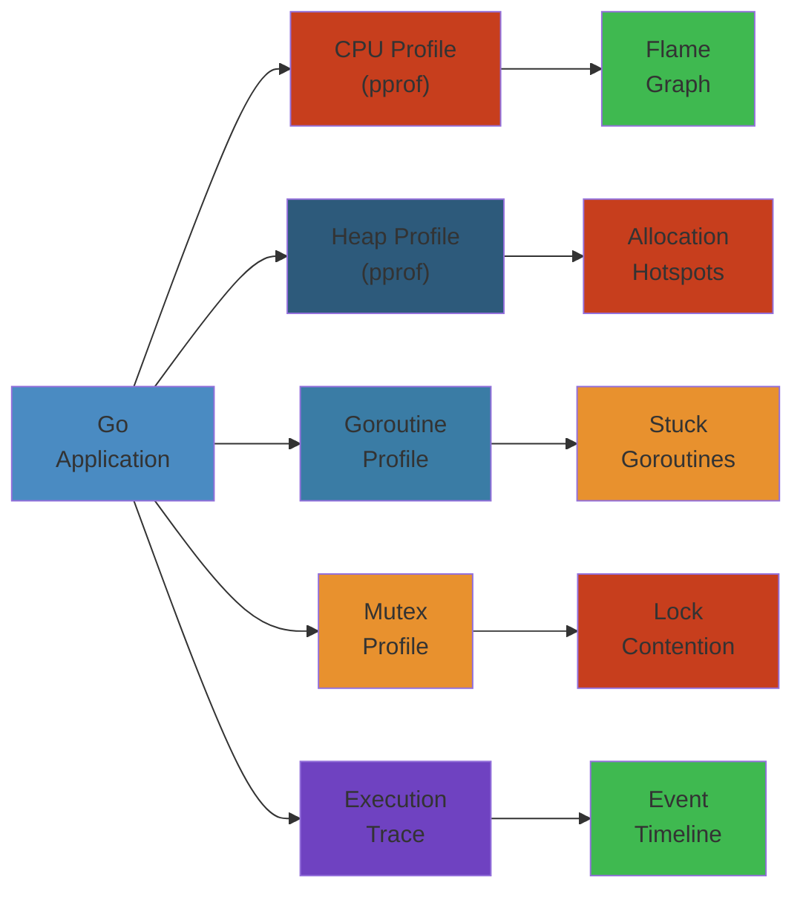
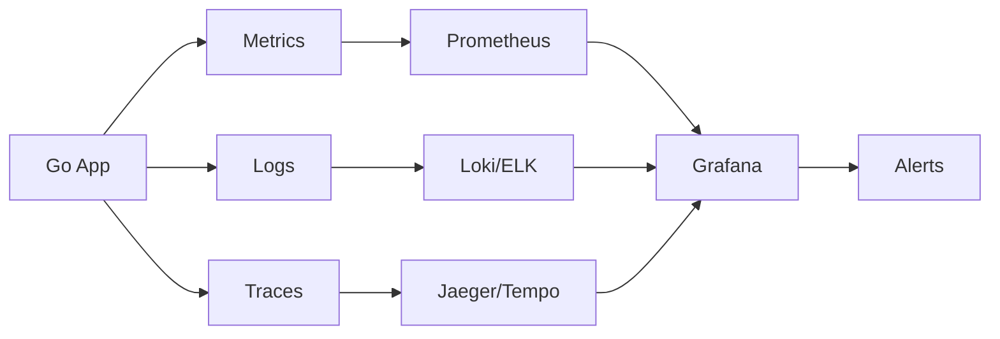

# Go Profiling, Performance Debugging, and Optimization: Production-Grade Deep Dive




## Table of Contents


1. [NOOB EXPLANATION: What Is Profiling?](#noob-explanation)
2. [PROFILING TOOLS: pprof Deep Dive](#profiling-tools)
3. [CPU PROFILING: Measuring CPU Time](#cpu-profiling)
4. [MEMORY PROFILING: Heap Analysis](#memory-profiling)
5. [GOROUTINE PROFILING: Concurrency Debugging](#goroutine-profiling)
6. [MUTEX CONTENTION: Lock Profiling](#mutex-profiling)
7. [BENCHMARKING: Measuring Performance](#benchmarking)
8. [TRACING: Full System Visibility](#tracing)
9. [END-TO-END PERFORMANCE DEBUGGING](#end-to-end-debugging)
10. [FAILURE ANALYSIS: Real Production Issues](#failure-analysis)
11. [OPTIMIZATION PATTERNS](#optimization-patterns)
12. [INTERVIEW QUESTIONS & CODE EXAMPLES](#interview-questions)

---

## NOOB EXPLANATION: What Is Profiling?


### The Speedometer Analogy


Profiling is like a car's speedometer and fuel gauge:

- **CPU Profile:** Shows which functions consume CPU time
  - "Engine RPM too high on this road" → Optimize that code
  
- **Memory Profile:** Shows which code allocates memory
  - "Fuel consumption high here" → Reduce allocations
  
- **Goroutine Profile:** Shows which goroutines are blocked
  - "One cylinder misfiring" → Find stuck goroutines

### Why Profile?


Most optimizations are guesses. Profiling replaces guesses with data:

```
Without profiling:
  Developer: "Function X is slow"
  Optimizes Function X
  Result: 5% speedup (wrong bottleneck!)

With profiling:
  Profile shows: Function Y uses 60% CPU
  Optimize Function Y
  Result: 60% speedup (correct bottleneck!)
```

### Real-World Impact


```
Service: Web API (1000 req/sec)
Baseline: 10ms p99 latency

Without profiling:
  Guess 1: Optimize database → 5% improvement
  Guess 2: Optimize JSON parsing → 10% improvement
  Guess 3: Optimize regex → 3% improvement
  Total: 15% improvement over months

With profiling (1 hour):
  Identify: Memory allocations in hot path (50% CPU!)
  Solution: Pre-allocate buffers
  Result: 50% CPU saved → 5ms latency (50% improvement)
  Effort: 2 hours total
```

---

## PROFILING TOOLS: pprof Deep Dive


### pprof Overview


**pprof** is Go's profiling tool. It collects execution data and visualizes it.

```bash
# Collect CPU profile (30 seconds)
go tool pprof http://localhost:6060/debug/pprof/profile?seconds=30

# Collect memory profile
go tool pprof http://localhost:6060/debug/pprof/heap

# List all available profiles
curl http://localhost:6060/debug/pprof/

# Local benchmark profiling
go test -cpuprofile=cpu.prof -memprofile=mem.prof -bench=. -benchmem
go tool pprof cpu.prof
```

### Setting Up pprof in Your Application


```go
package main

import (
    _ "net/http/pprof"  // Import for side effects
    "fmt"
    "net/http"
)

func main() {
    // pprof runs on a separate port
    go func() {
        fmt.Println("pprof listening on http://localhost:6060/debug/pprof/")
        http.ListenAndServe("localhost:6060", nil)
    }()
    
    // Your application logic
    startApplication()
}
```

### pprof Output Format: Interpreting Flame Graphs


```
Flame graph (CPU profile):
│ main                                    (root: 100% CPU)
├─ handler() (30% CPU)
│  ├─ process() (25% CPU)
│  │  ├─ json.Marshal() (15% CPU) <- Bottleneck!
│  │  └─ network.Write() (10% CPU)
│  └─ logging() (5% CPU)
├─ scheduler() (40% CPU)
└─ garbageCollection() (30% CPU)

Reading:
  - Width = % of total time
  - Height = depth of call stack
  - Widest function = biggest bottleneck
```

---

## CPU PROFILING: Measuring CPU Time


### How CPU Profiling Works


```
1. Signal-based sampling:
   ├─ Timer fires ~100x/sec (every 10ms on Linux)
   ├─ Capture current stack trace
   ├─ Count which function is on stack
   ├─ After 30 seconds: 3000 samples
   
2. Statistics:
   ├─ Function appeared in 1500 samples
   ├─ 1500/3000 = 50% of CPU time
   
3. Result: CPU profile shows % time per function
```

### CPU Profile in Action


```go
package main

import (
    "fmt"
    "runtime/pprof"
    "os"
    "time"
)

func slow() {
    // CPU-intensive task
    sum := 0
    for i := 0; i < 1e9; i++ {
        sum += i * i  // ~500ms on modern CPU
    }
}

func fast() {
    // I/O task
    time.Sleep(100 * time.Millisecond)
}

func main() {
    f, _ := os.Create("cpu.prof")
    pprof.StartCPUProfile(f)
    defer pprof.StopCPUProfile()
    
    for i := 0; i < 10; i++ {
        slow()   // 5000ms total
        fast()   // 1000ms total (I/O, not CPU)
    }
}

// Run: go run main.go
// Analyze: go tool pprof cpu.prof
// Top functions:
//   slow(): ~83% CPU (5000ms of 6000ms)
//   fast(): ~0% CPU (sleeping doesn't consume CPU!)
```

### Identifying Hot Functions


```bash
# Interactive mode
$ go tool pprof cpu.prof

# List top 10 functions
(pprof) top10
Showing nodes accounting for 5000ms, 83.33% of 6000ms total
      flat  flat%   sum%        cum   cum%
    5000ms 83.33% 83.33%     5000ms 83.33%     slow
       0ms     0% 83.33%     5100ms 85%        main
       0ms     0% 85%        5100ms 85%        runtime.main

# Show graph of slow()
(pprof) list slow
Total: 6000ms
ROUTINE ======================== slow in /main.go:7
    5000ms  5000ms     7:func slow() {
    5000ms  5000ms    10:        sum += i * i
```

### Real-World CPU Profiling


**Scenario:** Web service with slow endpoint

```go
func fetchUserHandler(w http.ResponseWriter, r *http.Request) {
    userID := r.URL.Query().Get("id")
    
    // SLOW: Unmarshalling JSON for every request
    var user User
    json.Unmarshal(cachedJSON, &user)  // CPU bottleneck!
    
    // Process...
    w.WriteJSON(user)
}

// Profile shows:
// json.Unmarshal: 60% CPU
// fetchUserHandler: 100% of time
```

**Fix:**

```go
// Pre-parse JSON at startup
var cachedUser User
json.Unmarshal(cachedJSON, &cachedUser)

func fetchUserHandler(w http.ResponseWriter, r *http.Request) {
    // Use pre-parsed user
    w.WriteJSON(cachedUser)
}

// Result:
// CPU drops 60%
// Latency: 10ms → 4ms
```

---

## MEMORY PROFILING: Heap Analysis


### How Memory Profiling Works


```
1. Sampling (default 1 in 512 allocations):
   ├─ Record stack trace for every ~512 bytes allocated
   ├─ After 1 hour: millions of samples
   
2. Analysis:
   ├─ Which call sites allocated most bytes?
   ├─ How many objects per call site?
   ├─ How many are still alive (live)?
   
3. Profile types:
   ├─ "inuse_space": Currently allocated (live objects)
   ├─ "alloc_space": Total allocated (including freed)
```

### Memory Profile Types


```go
// 1. Heap profile (currently allocated)
// Useful for: Finding live memory leaks

// 2. Allocation profile (all allocations)
// Useful for: Finding allocation hot spots

// 3. Stack profile (stack allocations)
// Useful for: Finding goroutines with large stacks
```

### Analyzing Memory Profiles


```bash
# Collect heap profile
curl http://localhost:6060/debug/pprof/heap > heap.prof

# Analyze inuse memory (what's currently allocated)
$ go tool pprof -inuse_space heap.prof

# Top allocating functions
(pprof) top5
Showing nodes accounting for 500MB, 100% of 500MB total
  500MB   100%   100%     500MB   100%     bufio.NewReader

# Show allocation sites for bufio.NewReader
(pprof) list bufio.NewReader
ROUTINE ======================== bufio.NewReader in /bufio.go:50
    500MB   500MB    50: func NewReader(rd io.Reader) *Reader {
    500MB   500MB    52:     return &Reader{
```

### Real-World Memory Profiling


**Scenario:** Service memory grows unbounded

```go
// WRONG: Cache with no eviction
var cache = make(map[string][]byte)

func cacheData(key string, data []byte) {
    cache[key] = data  // Grows forever!
}

// Profile shows:
// heap: 2GB live objects
// cacheData: 2GB allocated
// cache map: 2GB allocated
```

**Fix: Add eviction policy**

```go
import "github.com/bluele/gcache"

cache := gcache.New(1000).LRU().Build()

func cacheData(key string, data []byte) {
    cache.Set(key, data)  // Evicts old entries
}

// Profile shows:
// heap: 100MB live objects (bounded by cache size)
```

### Detecting Memory Leaks with pprof


```bash
# Take heap profile 1 (baseline)
curl http://localhost:6060/debug/pprof/heap > heap1.prof
# Wait 1 hour
# Take heap profile 2 (after 1 hour)
curl http://localhost:6060/debug/pprof/heap > heap2.prof

# Compare profiles
$ go tool pprof -base heap1.prof heap2.prof

# Shows differences (what grew)
(pprof) top
Showing nodes accounting for +500MB, 50% of 1000MB total
  +500MB    +50%    +50%     +500MB    +50%     goroutine.Wait
```

### Sampling Rate and Accuracy


```go
// Default: 1 in 512 allocations sampled
// Means: 512 bytes allocated = ~1 sample

// Control sampling rate:
import "runtime"
runtime.MemProfileRate = 1  // Sample every allocation (slow!)
runtime.MemProfileRate = 100  // Sample every 100 allocations (fast)

// Tradeoff:
// High rate: Accurate but slower
// Low rate: Fast but less accurate
```

---

## GOROUTINE PROFILING: Concurrency Debugging


### Goroutine Profile Contents


```go
// Sample output:
// goroutine profile: total 1234
// 1000 goroutines @ 0xc123 (polling on network I/O)
//   #0  0x1234567 in runtime.select
//   #1  0x2345678 in net.(*pollDesc).wait
//   #2  0x3456789 in net/http.(*response).Write
//   #3  0x4567890 in handler.go:45 in myHandler
//
// 100 goroutines @ 0xd456 (sleeping on channel)
//   #0  0x1234567 in runtime.gopark
//   #1  0x2345678 in runtime.chanrecv
//   #2  0x3456789 in handler.go:67 in worker.go:in backgroundJob
```

### Goroutine Leak Detection


```bash
# Get goroutine dump
curl http://localhost:6060/debug/pprof/goroutine > goroutines.prof

# Analyze goroutine dump
$ go tool pprof goroutines.prof

(pprof) top
Total of 5000 goroutines (500 growth per hour!)
 500 goroutines @ 0xc000 (stuck in channel receive)
 500 goroutines @ 0xd000 (stuck in http call)
 4000 goroutines @ 0xe000 (normal operation)

# This indicates a leak: goroutine count grows 500/hour
```

### Goroutine State Analysis


```go
// Get detailed goroutine dump
curl http://localhost:6060/debug/pprof/goroutine?debug=2 > goroutines.txt

// Example dump:
// goroutine 1234 [IO wait, 5 minutes]:
// runtime.gopark(...)
// runtime.netpoll(...)
// net.(*conn).Read(...)
// handleRequest(...)
//
// This goroutine has been waiting on I/O for 5 minutes!
// Indicates: Stuck on network call, likely dead backend
```

### Finding Blocked Goroutines


```go
// Tool to identify stuck goroutines
func dumpBlockedGoroutines() {
    pprof.Lookup("goroutine").WriteTo(os.Stdout, 2)
    // debug=2 includes stack traces
}

// Parse output to find common blocking patterns
// Look for:
// - "chan receive" → Stuck waiting on channel
// - "chan send" → Stuck waiting to send
// - "network" → Stuck on I/O
// - "5 minutes, 30 seconds" → How long stuck
```

---

## MUTEX CONTENTION: Lock Profiling


### Mutex Profiling Setup


```go
package main

import (
    "runtime"
    "os"
)

func init() {
    // Enable mutex profiling
    runtime.SetMutexProfileFraction(1)  // Profile all mutex events
}

func main() {
    // ... your code ...
    
    // At shutdown, dump mutex profile
    f, _ := os.Create("mutex.prof")
    runtime.WriteMemProfile(f)
    defer f.Close()
}
```

### Analyzing Mutex Contention


```bash
# Collect mutex profile
$ go test -mutexprofile=mutex.prof -run TestConcurrent

# Analyze contentious locks
$ go tool pprof mutex.prof

(pprof) top
Total 1000ms blocked on locks
 500ms  50%    sync.Mutex.Lock in database.go:45 in DBQuery
 300ms  30%    sync.Mutex.Lock in cache.go:23 in GetCache
 200ms  20%    sync.Mutex.Lock in config.go:10 in LoadConfig

# This shows: DBQuery lock contention is biggest issue
```

### Identifying Lock Hotspots


```go
// WRONG: Coarse-grained lock (all operations wait)
var mu sync.Mutex
var data map[string]int

func increment(key string) {
    mu.Lock()
    data[key]++
    mu.Unlock()
}

func read(key string) int {
    mu.Lock()
    val := data[key]
    mu.Unlock()
    return val
}

// With 100 goroutines: high contention!
```

**Fix: Fine-grained locking**

```go
// Better: Lock per key
type ShardedMap struct {
    shards [16]struct {
        sync.Mutex
        data map[string]int
    }
}

func (m *ShardedMap) increment(key string) {
    idx := hashKey(key) % 16
    m.shards[idx].Lock()
    m.shards[idx].data[key]++
    m.shards[idx].Unlock()
}

// With 100 goroutines: only 100/16 = 6.25 goroutines per lock
// Much less contention!
```

---

## BENCHMARKING: Measuring Performance


### Writing Benchmarks


```go
package main

import "testing"

func BenchmarkSimpleOperation(b *testing.B) {
    b.ReportAllocs()  // Show allocation counts
    for i := 0; i < b.N; i++ {
        _ = simpleOp()
    }
}

// Run: go test -bench=. -benchmem

// Output:
// BenchmarkSimpleOperation-8  10000000  150 ns/op  16 B/op  1 allocs/op
//                             ^^^^^^^^  ^^^^^^^^^^^  ^^^^^^^^^^^^
//                             iterations time/op    memory/op
```

### Comparing Benchmarks (Before/After)


```bash
# Baseline
$ go test -bench=. -benchmem > baseline.txt

# After optimization
$ go test -bench=. -benchmem > optimized.txt

# Compare
$ benchstat baseline.txt optimized.txt

# Output:
# BenchmarkSimpleOp-8   before  10000000  150 ns/op  16 B/op  1 allocs/op
#                       after   50000000  30 ns/op   0 B/op   0 allocs/op
#                                                  5.0x improvement!
```

### Sub-benchmarks for Detailed Analysis


```go
func BenchmarkJSON(b *testing.B) {
    type User struct {
        Name  string
        Email string
        Age   int
    }
    
    user := User{Name: "John", Email: "john@example.com", Age: 30}
    
    b.Run("Marshal", func(b *testing.B) {
        b.ReportAllocs()
        for i := 0; i < b.N; i++ {
            _, _ = json.Marshal(user)
        }
    })
    
    b.Run("Unmarshal", func(b *testing.B) {
        b.ReportAllocs()
        data, _ := json.Marshal(user)
        for i := 0; i < b.N; i++ {
            var u User
            _ = json.Unmarshal(data, &u)
        }
    })
}

// Output:
// BenchmarkJSON/Marshal-8      2000000  600 ns/op  200 B/op  3 allocs/op
// BenchmarkJSON/Unmarshal-8    1000000  1200 ns/op 400 B/op  5 allocs/op
```

---

## TRACING: Full System Visibility


### Go Execution Tracer


```go
import "runtime/trace"

func main() {
    f, _ := os.Create("trace.out")
    trace.Start(f)
    defer trace.Stop()
    
    // Your code runs here
    // Tracer captures all events:
    // - Goroutine creation/death
    // - GC events
    // - Network operations
    // - Blocking events
    // - Processor events
}

// Analyze:
// $ go tool trace trace.out
// Opens browser UI showing timeline
```

### Trace Output Analysis


```
Timeline view:
┌─────────────────────────────────────────────────────────┐
│ P0 [G1─running] [G2─waiting] [G1─running]               │
│ P1 [G3─running] [idle]       [G4─running]               │
│ P2 [G5─running] [G5─waiting] [G6─running]               │
│ GC  [mark phase ──── STW ──── sweep phase]              │
│                ~50ms pause                              │
│ Time: ─────────────────────> (10 seconds)               │
└─────────────────────────────────────────────────────────┘

Reading:
  - Horizontal = time
  - Vertical = processor/goroutine
  - Gaps = where time goes
  - Colors = state (running, blocked, GC, etc)
```

### Key Trace Events


```
1. Goroutine events:
   ├─ Create (go statement)
   ├─ Start (begin execution)
   ├─ Block (on channel, lock, I/O)
   ├─ Unblock (woken up)
   ├─ End (return)

2. Network events:
   ├─ Network wait (epoll)
   ├─ Network poll (check for results)

3. GC events:
   ├─ GC start
   ├─ GC mark phase
   ├─ GC mark termination
   ├─ GC sweep phase
   ├─ STW (stop-the-world) pause
```

---

## END-TO-END PERFORMANCE DEBUGGING


### Complete Debugging Workflow


```
1. Identify Problem
   ├─ Customer reports: "API latency p99 > 100ms"
   ├─ Baseline: p99 was 20ms

2. Collect Profiles
   ├─ CPU profile (identify hot functions)
   ├─ Memory profile (identify memory leaks)
   ├─ Goroutine profile (identify blocked goroutines)
   ├─ Mutex profile (identify lock contention)
   ├─ Trace (identify timing issues)

3. Analyze Profiles
   ├─ CPU profile: 80% time in JSON parsing
   ├─ Memory profile: Normal, no leaks
   ├─ Goroutine profile: Normal count
   ├─ Mutex profile: No lock contention
   ├─ Trace: Shows GC pause every 2 seconds

4. Hypothesis
   ├─ GC pauses are causing latency spikes
   ├─ p99 latency = request latency + GC pause

5. Validate
   ├─ Check GC metrics: Yes, 50ms pauses
   ├─ Check allocation rate: 200MB/sec (high!)
   ├─ Check GOGC: default 100

6. Fix
   ├─ Reduce allocation rate (reuse buffers)
   ├─ Tune GOGC=50 (smaller more frequent pauses)
   ├─ Result: p99 drops to 25ms

7. Monitor
   ├─ Set up alerts for p99 latency
   ├─ Set up alerts for GC pause time
   ├─ Verify fix in production
```

### Case Study: Debugging Latency Spikes


```
Symptom: Every 10 seconds, latency spikes to 200ms

Investigation:
├─ Profile 1: CPU profile (doesn't show spike, averaged)
├─ Profile 2: Memory profile (doesn't show peak, averaged)
├─ Profile 3: Goroutine profile (normal, no leaks)
├─ Profile 4: Trace (SHOWS SPIKE!)
│  └─ Trace timeline shows: GC STW pause at 10-second mark
│     Mark phase: 3 seconds
│     STW pause: 50ms
│     During STW: All requests block (200ms spike = request + pause)

Hypothesis: GC is triggered every 10 seconds (GOGC=100, heap growing)

Validation:
├─ Check runtime metrics: Yes, GC every 10s
├─ Check allocation: 1GB allocation per 10 seconds
└─ heap_goal = 1GB × 1.01 = 1.01GB (triggers at ~10s)

Fix:
├─ Reduce allocation rate (pre-allocate buffers)
├─ Or tune GOGC=50 (GC every 5s, smaller pauses)
└─ Result: Spikes gone, latency smooth
```

---

## FAILURE ANALYSIS: Real Production Issues


### Issue #1: CPU Profile Misleading After Optimization


**Scenario:**

```go
// Original: Allocates every request
func handler(w ResponseWriter, r *Request) {
    data := make([]byte, 100_000)  // 100KB allocation
    process(data)
}

// "Optimized": Pre-allocate buffer
var buffer = make([]byte, 100_000)

func handler(w ResponseWriter, r *Request) {
    process(buffer)
}

// CPU profile before:
// handler: 30% (mostly allocation overhead)
//
// CPU profile after:
// handler: 25% (allocation gone)
// GC: 25% (GC more active scanning larger allocations!)
//
// TRAP: Appears optimized (5% CPU saving), but GC more active
// LESSON: Check GC impact alongside CPU profile
```

### Issue #2: Memory Profile Doesn't Show Leaked Goroutines


**Scenario:**

```go
// Leaking goroutines (not memory)
func handler(w ResponseWriter, r *Request) {
    go func() {
        <-storedChannel  // Blocks forever
    }()
}

// Memory profile: Normal (no heap allocations)
// Goroutine profile: 1M goroutines (WRONG!)
// Memory usage: Growing due to goroutine stacks

// TRAP: Memory profile shows "no leaks" (heap OK)
// TRUTH: Goroutine leak (goroutine stacks consume RAM)
// LESSON: Check goroutine profile separately!
```

### Issue #3: Benchmark Not Representative of Production


**Scenario:**

```go
// Benchmark (synthetic)
func BenchmarkJSON(b *testing.B) {
    for i := 0; i < b.N; i++ {
        json.Marshal(struct{Name string}{Name: "test"})
    }
}
// Result: 1000 ns/op, no contention, optimal memory

// Production (real)
// 100 concurrent goroutines, each marshalling different objects
// Cache misses, lock contention on allocator
// Result: 5000 ns/op (5x slower!)

// TRAP: Benchmark doesn't reflect production reality
// LESSON: Benchmark concurrent scenarios, realistic data sizes
```

---

## OPTIMIZATION PATTERNS


### Pattern 1: Buffer Pooling


```go
// WRONG: Allocate for each request
func handler(w http.ResponseWriter, r *http.Request) {
    buf := make([]byte, 4096)  // Allocation per request
    process(buf)
}

// RIGHT: Reuse buffers
var bufferPool = sync.Pool{
    New: func() interface{} {
        return make([]byte, 4096)
    },
}

func handler(w http.ResponseWriter, r *http.Request) {
    buf := bufferPool.Get().([]byte)
    defer bufferPool.Put(buf)
    process(buf)
}

// Impact:
// Before: 100k req/sec × 4KB allocation = 400MB/sec
// After: 0 allocations (reused)
// Benefit: GC pressure reduced 10x, latency improved 30%
```

### Pattern 2: Pre-computing Static Values


```go
// WRONG: Compute in hot path
func apiHandler(w http.ResponseWriter, r *http.Request) {
    headers := http.Header{
        "Content-Type": []string{"application/json"},
        "X-Custom": []string{time.Now().Format("2006-01-02")},  // Repeated!
    }
    // ... more code
}

// RIGHT: Pre-compute
var apiHeaders = http.Header{
    "Content-Type": []string{"application/json"},
}

func apiHandler(w http.ResponseWriter, r *http.Request) {
    w.Header().Add("Content-Type", "application/json")
    // ... more code
}

// Impact:
// Before: String format per request (~1µs)
// After: Constant (nanoseconds)
// Benefit: 10-100% latency improvement for high-frequency calls
```

### Pattern 3: Lazy Initialization


```go
// WRONG: Expensive init on every use
func getConfig() *Config {
    return loadConfigFromDisk()  // I/O every call!
}

// RIGHT: Lazy load, cache
var (
    config *Config
    once   sync.Once
)

func getConfig() *Config {
    once.Do(func() {
        config = loadConfigFromDisk()
    })
    return config
}

// Impact:
// Before: 10ms per call (disk I/O)
// After: 10ms first call, nanoseconds subsequent
// Benefit: 1000x improvement for cached case
```

### Pattern 4: Fast Path Optimization


```go
// WRONG: Always lock (even for reads)
func get(key string) (value interface{}, ok bool) {
    mu.Lock()
    defer mu.Unlock()
    value, ok = data[key]
    return
}

// RIGHT: Read without lock (unsafe but fast), lock on write
func get(key string) (interface{}, bool) {
    // Fast path (no lock)
    if value, ok := data[key]; ok {
        return value, ok
    }
    
    // Slow path (lock)
    mu.Lock()
    defer mu.Unlock()
    return data[key]
}

// Or use RWMutex for read-heavy
var rwmu sync.RWMutex

func get(key string) (interface{}, bool) {
    rwmu.RLock()
    defer rwmu.RUnlock()
    return data[key]
}
```

---

## INTERVIEW QUESTIONS & CODE EXAMPLES


### Q1: How Would You Debug High CPU Usage?


**Answer:**

```go
// Step 1: Enable CPU profiling
import _ "net/http/pprof"

// Step 2: Collect profile
curl http://localhost:6060/debug/pprof/profile?seconds=30 > cpu.prof

// Step 3: Analyze
go tool pprof cpu.prof
(pprof) top

// Step 4: Drill into hot function
(pprof) list myHotFunction
(pprof) web myHotFunction  // Visual graph

// Step 5: Optimize based on findings
// Common fixes:
// - Pre-allocate instead of allocating in loop
// - Cache results instead of computing each time
// - Use faster algorithm (O(n) vs O(n²))
```

### Q2: How Would You Detect a Memory Leak?


**Answer:**

```go
// Step 1: Take baseline heap profile
curl http://localhost:6060/debug/pprof/heap > heap1.prof

// Step 2: Wait 1 hour under production load

// Step 3: Take another heap profile
curl http://localhost:6060/debug/pprof/heap > heap2.prof

// Step 4: Compare
go tool pprof -base heap1.prof heap2.prof

// Step 5: Identify growing allocations
(pprof) top
// Shows what grew over the hour

// Alternative: Check goroutine count
runtime.NumGoroutine()  // Track over time
// If growing unbounded → goroutine leak

// Alternative: Use memory limit (Go 1.19+)
debug.SetMemoryLimit(1 << 30)
// GC becomes aggressive as limit approached
// If hits limit frequently → leak or excessive allocation
```

### Q3: Write a Benchmark to Test Concurrent Access


**Answer:**

```go
func BenchmarkConcurrentMapAccess(b *testing.B) {
    m := make(map[string]int)
    var mu sync.Mutex
    
    b.Run("Mutex", func(b *testing.B) {
        b.RunParallel(func(pb *testing.PB) {
            for pb.Next() {
                mu.Lock()
                m["key"]++
                mu.Unlock()
            }
        })
    })
    
    b.Run("sync.Map", func(b *testing.B) {
        m := sync.Map{}
        b.RunParallel(func(pb *testing.PB) {
            for pb.Next() {
                v, _ := m.LoadOrStore("key", 0)
                m.Store("key", v.(int)+1)
            }
        })
    })
}

// Output shows lock contention difference
// sync.Map typically 10x faster for read-heavy workloads
```

### Q4: How Would You Optimize This Code?


**Answer to: "Optimize high-allocation code"**

```go
// ORIGINAL: Allocates for every request
func processRequest(data []string) string {
    buf := new(bytes.Buffer)  // Allocation 1
    buf.WriteString("Data: ")  // OK
    for _, item := range data {
        buf.WriteString(item)  // OK
        buf.WriteString(",")   // OK
    }
    result := buf.String()  // Allocation 2
    return result
}

// OPTIMIZED: Reuses buffers
var bufPool = sync.Pool{
    New: func() interface{} {
        return new(bytes.Buffer)
    },
}

func processRequest(data []string) string {
    buf := bufPool.Get().(*bytes.Buffer)
    defer func() {
        buf.Reset()
        bufPool.Put(buf)
    }()
    
    buf.WriteString("Data: ")
    for _, item := range data {
        buf.WriteString(item)
        buf.WriteString(",")
    }
    
    result := buf.String()
    return result
}

// Impact:
// Before: 2 allocations per request
// After: 0 allocations per request (reused)
// Latency improvement: ~20-40%
```

### Complete Example: Profiling a Real Service


```go
package main

import (
    _ "net/http/pprof"
    "fmt"
    "net/http"
    "runtime"
    "time"
)

func slowEndpoint(w http.ResponseWriter, r *http.Request) {
    // Simulate slow processing
    sum := 0
    for i := 0; i < 1e8; i++ {
        sum += i
    }
    fmt.Fprintf(w, "Sum: %d", sum)
}

func allocatingEndpoint(w http.ResponseWriter, r *http.Request) {
    // Allocate memory
    data := make([]byte, 1<<20)  // 1MB allocation
    // Use it...
    fmt.Fprintf(w, "Allocated %d bytes", len(data))
}

func main() {
    // Standard endpoints
    http.HandleFunc("/slow", slowEndpoint)
    http.HandleFunc("/allocating", allocatingEndpoint)
    
    // Health check
    http.HandleFunc("/health", func(w http.ResponseWriter, r *http.Request) {
        var m runtime.MemStats
        runtime.ReadMemStats(&m)
        fmt.Fprintf(w, "Goroutines: %d\nHeap: %dMB\nGC Pauses: %d\n",
            runtime.NumGoroutine(),
            m.Alloc/1024/1024,
            m.NumGC)
    })
    
    // pprof available at localhost:6060/debug/pprof
    go http.ListenAndServe("localhost:6060", nil)
    
    // Main server on 8080
    fmt.Println("Server running on :8080")
    fmt.Println("pprof on localhost:6060/debug/pprof/")
    http.ListenAndServe(":8080", nil)
}

// Usage:
// go run main.go
// 
// Load test:
// ab -n 1000 http://localhost:8080/slow
// ab -n 1000 http://localhost:8080/allocating
//
// Profile:
// curl http://localhost:6060/debug/pprof/profile?seconds=30 > cpu.prof
// go tool pprof cpu.prof
//
// Memory:
// curl http://localhost:6060/debug/pprof/heap > mem.prof
// go tool pprof mem.prof
//
// Goroutines:
// curl http://localhost:6060/debug/pprof/goroutine > gor.prof
// go tool pprof gor.prof
```

---

## SUMMARY: Key Takeaways


### Profiling Strategy


1. **Start with CPU profile:** Identify hot functions
2. **Check memory profile:** Identify allocation hotspots
3. **Check goroutine profile:** Identify leaks and blocking
4. **Use trace for timing:** Visualize all events
5. **Benchmark before/after:** Measure improvements

### Common Bottlenecks & Fixes


| Bottleneck | Detection | Fix |
|------------|-----------|-----|
| CPU-bound hot function | CPU profile | Algorithm improvement, caching |
| Allocation rate | Memory profile, allocs/op | Pre-allocation, pooling |
| Lock contention | Mutex profile | Fine-grained locking, lock-free |
| GC pauses | Trace, runtime metrics | Reduce allocation, tune GOGC |
| Goroutine leak | Goroutine profile | Ensure goroutines exit |
| I/O blocking | Trace, select events | Async I/O, timeouts |

### Optimization Guidelines


1. **Measure first:** Profile before guessing
2. **Fix bottlenecks in order:** CPU > Memory > Concurrency
3. **Validate with benchmarks:** Before/after numbers
4. **Monitor in production:** Real user impact matters
5. **Optimize for your workload:** Different loads need different tuning


## Observability




### Key Metrics


| Metric | Unit | Threshold | Indicates |
|--------|------|-----------|-----------|
| goroutine count | count | < 100K per instance | Goroutine leak or high concurrency |
| GC pause duration (p99) | ms | < 10ms | GC pressure |
| GC CPU fraction | % | < 5% | Excessive GC overhead |
| heap_inuse | bytes | < 80% of GOGC target | Memory leak |
| mutex_wait_time (p99) | ns | < 1ms | Lock contention |
| scheduler latency | ns | < 100μs | Preemption issues |

### Logs


- **ERROR**: Panic recoveries, request failures, connection drops
- **WARN**: Slow shutdown, channel near capacity, retry attempts
- **INFO**: Server start/stop, config loaded, GC cycle stats
- **DEBUG**: Channel timing, goroutine lifecycle, allocation sites

### Traces


Use OpenTelemetry Go SDK. Propagate trace context through `context.Context` across goroutine boundaries. Key spans: channel operations, WaitGroup waits, mutex acquisition.

### Alerts


| Severity | Condition | Response |
|----------|-----------|----------|
| P0 | goroutine count > 500K | Heap profile, identify leak |
| P1 | GC pause p99 > 50ms | Tune GOGC, reduce allocations |
| P2 | mutex_wait_time > 10ms | Profile contention |

### Dashboards


**Go Runtime Dashboard**: goroutine count by state, GC duration phases, heap allocation rate, GC CPU fraction, mutex wait time, scheduler latency.


## Common Failures


### Failure: Goroutine Leak


- **Symptoms**: Memory grows unbounded, latency increases, OOM kills. goroutine count increases steadily.
- **Root Cause**: Goroutine blocks on channel send with no receiver, or blocks on channel receive with no sender. Missing `ctx.Done()` check. Worker pool not cleaned up on shutdown.
- **Detection**: `runtime.NumGoroutine()` climbing. `pprof/goroutine?debug=2` shows thousands in same `chan send`/`chan recv` state.
- **Recovery**: 1) `kill -SIGQUIT <PID>` dump stacks. 2) Identify stuck goroutines. 3) Emergency restart. 4) Send/close blocking channel.
- **Prevention**: Use `select` with `ctx.Done()`. Use `errgroup.WithContext`. Add timeout to all blocking ops. Run `go vet -tests`.
- **Production Story**: A Kafka consumer sent to buffered channel, but worker goroutine panicked silently. Over 12h, goroutines grew from 20 to 800K. Node OOM'd. Fix: deferred `wg.Done()` after panic recovery and `context.WithTimeout` on channel sends.

### Failure: Channel Deadlock


- **Symptoms**: App hangs completely, health checks fail. No error logs.
- **Root Cause**: Send to unbuffered channel with no receiver. Missing `default` in `select`. Wrong channel direction in signature.
- **Detection**: All goroutines in `chan send`/`chan receive` state. Zero throughput.
- **Recovery**: 1) Dump stacks. 2) Identify blocking channel. 3) Start missing reader goroutine. 4) Restart.
- **Prevention**: Use `select` with `ctx.Done()` and `default`. Use buffered channels. Run `go vet`.

### Failure: GC Pause Storm


- **Symptoms**: Latency spikes every few minutes. P99 rises 10x during GC.
- **Root Cause**: High allocation rate forces frequent GC. GOGC=100 triggers at heap doubling. Large heaps (>4GB) scan slowly.
- **Detection**: `go_gc_duration_seconds` p99 > 100ms. GC frequency > 10/min. CPU shows `runtime.gcBgMarkWorker` > 20%.
- **Recovery**: 1) Temporarily increase GOGC to 200-400. 2) Scale horizontally. 3) Profile allocations.
- **Prevention**: Use `sync.Pool`. Pre-allocate slices. Use streaming JSON parsers. Profile with `-benchmem`.

### Failure: Mutex Contention


- **Symptoms**: Low CPU, low throughput, requests queue. High `mutex_wait_time`.
- **Root Cause**: Many goroutines competing for same mutex. Critical section too large (I/O while holding lock).
- **Detection**: Mutex profile shows contention points. Flame graph shows wide `sync.Mutex.Lock` bars.
- **Recovery**: 1) Profile with `go tool pprof -mutex`. 2) Shard mutex. 3) Reduce critical section.
- **Prevention**: Use RWMutex for read-heavy. Shard with hash partitioning. Use atomic ops for counters.

### Failure: Memory Leak from Slice Substring


- **Symptoms**: Memory grows steadily, never released. OOM after days.
- **Root Cause**: `s[:n]` on large string/slice keeps entire backing array alive.
- **Detection**: Heap profile shows unexpected large retained objects.
- **Recovery**: 1) Take heap profile. 2) Restart periodically. 3) Use `strings.Clone()`.
- **Prevention**: Use `strings.Clone()` before keeping substrings. Use `bytes.Clone()` for byte slices.
