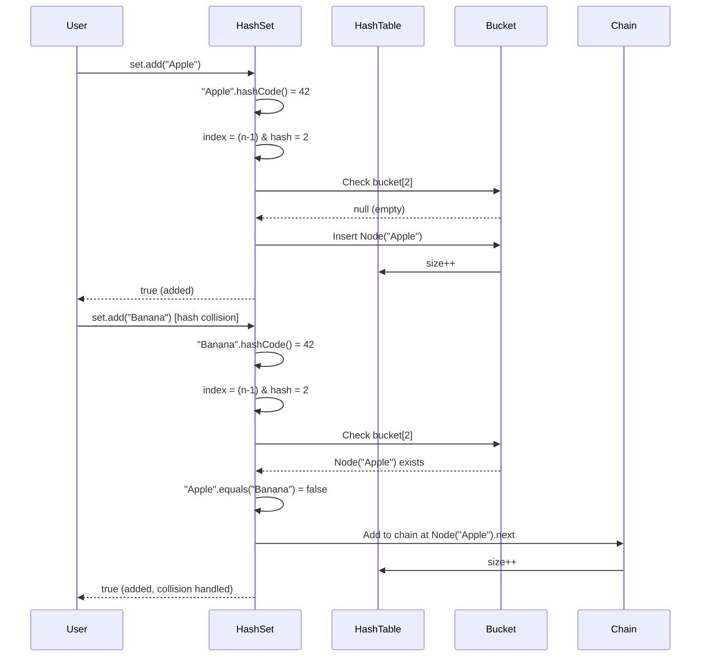
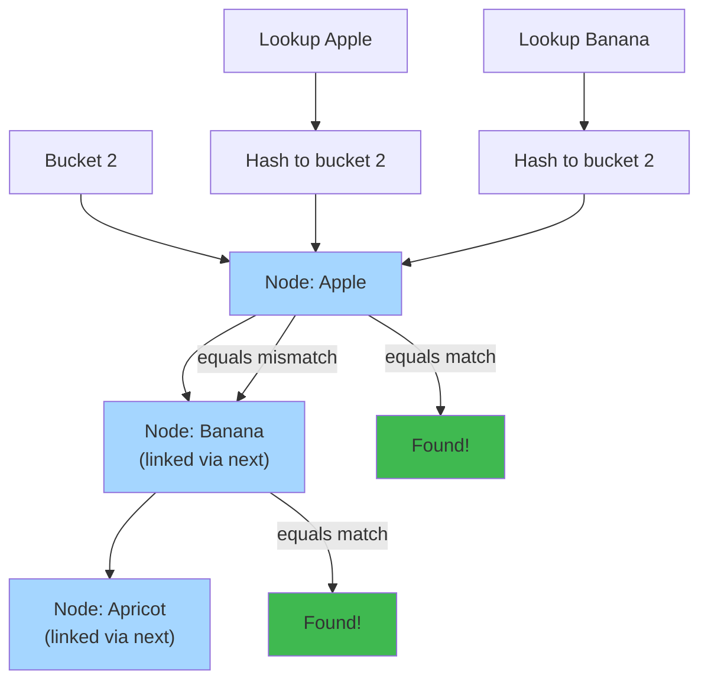

# 📚 Java Collections Framework — Complete Deep Dive

**Related**: [OOP Concepts](01-oop-concepts.md) · [Generics](08-generics.md) · [Streams & Lambda](07-streams-lambda.md) · [Exception Handling](03-exception-handling.md)

---

## Table of Contents


- [Collection Hierarchy](#-collection-hierarchy)
- [1. List Interface](#1-list-interface)
- [2. Set Interface](#2-set-interface)
- [3. Queue Interface](#3-queue-interface)
- [4. Map Interface](#4-map-interface)
- [5. Comparable vs Comparator](#5-comparable-vs-comparator)
- [6. Utility Methods (Collections & Arrays)](#6-utility-methods)
- [7. Synchronized vs Concurrent Collections](#7-synchronized-vs-concurrent-collections)
- [8. Immutable Collections](#8-immutable-collections)
- [9. Performance Comparison](#9-performance-comparison)
- [10. Internal Working Flows](#10-internal-working-flows)
- [Common Pitfalls](#-common-pitfalls)
- [Simplest Mental Model](#-simplest-mental-model)

---

## 🧭 Collection Hierarchy


```text
                    ┌────────────────────────────────┐
                    │     Iterable (interface)       │
                    └────────────┬───────────────────┘
                                 │
                    ┌────────────┴───────────────────┐
                    │     Collection (interface)     │
                    └──────┬─────────┬───────┬───────┘
                           │         │       │
              ┌────────────┘         │       └────────────┐
              ▼                      ▼                    ▼
      ┌──────────────┐      ┌──────────────┐     ┌──────────────┐
      │    List      │      │     Set      │     │    Queue     │
      │ (interface)  │      │ (interface)  │     │ (interface)  │
      ├──────────────┤      ├──────────────┤     ├──────────────┤
      │ ArrayList    │      │ HashSet      │     │ LinkedList   │
      │ LinkedList   │      │ LinkedHashSet│     │ PriorityQueue│
      │ Vector       │      │ TreeSet      │     │ ArrayDeque   │
      │ Stack        │      │ EnumSet      │     │              │
      └──────────────┘      └──────────────┘     └──────────────┘

                           ┌──────────────────┐
                           │   Map (interface) │ (separate hierarchy!)
                           ├──────────────────┤
                           │ HashMap          │
                           │ LinkedHashMap    │
                           │ TreeMap          │
                           │ ConcurrentHashMap│
                           │ EnumMap          │
                           │ IdentityHashMap  │
                           │ WeakHashMap      │
                           └──────────────────┘
```

```mermaid
mindmap
  root((Collections))
    List
      ArrayList
        Fast random access
        Backed by array
      LinkedList
        Fast insert/delete
        Doubly linked
    Set
      HashSet
        O(1) operations
        Hash table backed
      TreeSet
        Sorted order
        Red-Black tree
      LinkedHashSet
        Insertion order
        Hash + linked list
    Queue
      LinkedList
        FIFO queue
      PriorityQueue
        Min-heap
      ArrayDeque
        Resizable array
    Map
      HashMap
        O(1) get/put
      TreeMap
        Sorted keys
        Red-Black tree
      LinkedHashMap
        Insertion/access order
      ConcurrentHashMap
        Thread-safe
```

---

## 1. List Interface


**Definition**: Ordered collection (sequence). Allows duplicates. Index-based access.

### ArrayList


```java
// Internal: resizable array (Object[])
List<String> list = new ArrayList<>();

list.add("Apple");       // [Apple]
list.add("Banana");      // [Apple, Banana]
list.add(0, "Apricot");  // [Apricot, Apple, Banana]
String fruit = list.get(1);  // "Apple"
list.remove(0);          // [Apple, Banana]
list.contains("Apple");  // true
list.size();             // 2
```

### ArrayList Internal Working


```text
Initial: Object[] DEFAULTCAPACITY_EMPTY_ELEMENTDATA = {}
                                   │
         add("Apple")              │
                                   ▼
                    ┌─────────────────────┐
                    │ ensureCapacity()    │
                    │ size == 0, create   │
                    │ new Object[10]      │
                    └──────────┬──────────┘
                               │
                               ▼
                    ┌─────────────────────┐
                    │ elementData[0] =    │
                    │ "Apple"             │
                    │ size = 1            │
                    └─────────────────────┘

         add("Banana", "Cherry"... up to 10)
                                   │
         add("Date")  (11th element) │
                                   ▼
                    ┌─────────────────────┐
                    │ grow()              │
                    │ newCapacity = 10 +  │
                    │ 10 >> 1 = 15       │
                    │ new Object[15]      │
                    │ arraycopy(old, new) │
                    └──────────┬──────────┘
                               │
                               ▼
                    ┌─────────────────────┐
                    │ elementData[10] =   │
                    │ "Date"              │
                    │ size = 11           │
                    └─────────────────────┘
```

### LinkedList


```java
// Internal: doubly-linked list (Node objects)
List<String> list = new LinkedList<>();

list.add("First");
list.add("Last");
list.add(1, "Middle");
String first = list.getFirst();   // "First"
String last = list.getLast();     // "Last"
list.removeFirst();               // remove "First"
```

### LinkedList Node Structure


```text
LinkedList<String> list = new LinkedList<>();

add("A") →  [null ◄──► "A" ◄──► null]   ← first = last = nodeA

add("B") →  [null ◄──► "A" ◄──► "B" ◄──► null]
                         ↑ first    ↑ last

add("C") →  [null ◄──► "A" ◄──► "B" ◄──► "C" ◄──► null]
                         ↑ first             ↑ last

Node structure:
┌──────────────────────────────┐
│         Node<String>         │
├──────────────────────────────┤
│   Node prev                  │
│   String item                │
│   Node next                  │
└──────────────────────────────┘
```

### ArrayList vs LinkedList


| Operation | ArrayList | LinkedList |
|-----------|-----------|------------|
| `add(E)` at end | O(1)* amortized | O(1) |
| `add(i, E)` insert | O(n) shift | O(n) traverse + O(1) link |
| `get(i)` | O(1) random access | O(n) traverse |
| `remove(i)` | O(n) shift | O(n) traverse + O(1) unlink |
| `remove(0)` | O(n) shift | O(1) unlink first |
| Memory overhead | Low (array) | High (3 pointers per node) |
| Iterator.remove | O(n) shift | O(1) |
| Best for | Random access, read-heavy | Frequent insert/remove at head/tail |

---

## 2. Set Interface


**Definition**: Collection with no duplicates. At most one null.

### HashSet


```java
// Internal: backed by HashMap (uses PRESENT dummy value)
Set<String> set = new HashSet<>();

set.add("Apple");     // true
set.add("Banana");    // true
set.add("Apple");     // false (duplicate)
set.contains("Apple"); // true
set.size();           // 2
```

### HashSet Internal Flow




**HashSet Collision Handling:**



### TreeSet


```java
// Internal: Red-Black tree. Elements sorted by Comparator or natural order.
Set<Integer> set = new TreeSet<>();

set.add(5);
set.add(1);
set.add(3);

// Always sorted
System.out.println(set);  // [1, 3, 5]

// Navigation methods (NavigableSet)
TreeSet<Integer> tree = new TreeSet<>(Set.of(1, 3, 5, 7, 9));
tree.first();    // 1
tree.last();     // 9
tree.lower(5);   // 3 (greatest < 5)
tree.higher(5);  // 7 (least > 5)
tree.floor(4);   // 3 (greatest ≤ 4)
tree.ceiling(4); // 5 (least ≥ 4)
tree.subSet(3, 8);   // [3, 5, 7] (range view)
```

### LinkedHashSet


```java
// Hash table + linked list → insertion order preserved
Set<String> set = new LinkedHashSet<>();

set.add("Z");
set.add("A");
set.add("M");
System.out.println(set);  // [Z, A, M] — insertion order
```

### Set Comparison


| Set | Order | Null | Performance | Internal |
|-----|-------|------|-------------|----------|
| HashSet | None | One null | O(1) | HashMap |
| LinkedHashSet | Insertion | One null | O(1) | HashMap + LinkedList |
| TreeSet | Sorted (Comparable/Comparator) | No null | O(log n) | Red-Black Tree |
| EnumSet | Enum ordinal | No null | O(1) bit vector | Bit flags |

---

## 3. Queue Interface


### LinkedList (as Queue)


```java
Queue<String> queue = new LinkedList<>();

queue.offer("First");    // add to tail — [First]
queue.offer("Second");   // [First, Second]
queue.offer("Third");    // [First, Second, Third]

queue.peek();    // "First" (head, don't remove)
queue.poll();    // "First" (remove head) → [Second, Third]
queue.element(); // "Second" (throws if empty)
```

### PriorityQueue (Min-Heap)


```java
// Natural ordering (min-heap)
Queue<Integer> pq = new PriorityQueue<>();
pq.offer(5);
pq.offer(1);
pq.offer(3);

pq.peek();  // 1 (smallest)
pq.poll();  // 1 → [3, 5]
pq.poll();  // 3 → [5]

// Custom comparator (max-heap)
Queue<Integer> maxPq = new PriorityQueue<>(Comparator.reverseOrder());
```

### PriorityQueue Internal (Heap)


```text
Initial: empty array
             │
pq.add(5)    │
             ▼
        ┌─────────┐
        │    5    │  index 0
        └─────────┘

pq.add(1)
             │
             ▼
        ┌─────────┐
        │    5    │  index 0
        │    1    │  index 1
        └─────────┘
             │  siftUp(1): 1 < 5 → swap
             ▼
        ┌─────────┐
        │    1    │  index 0  ← min (root)
        │    5    │  index 1
        └─────────┘

pq.add(3)
             │
             ▼
        ┌─────────┐
        │    1    │  index 0
        │    5    │  index 1
        │    3    │  index 2
        └─────────┘
             │  siftUp(2): 3 < 5? yes, swap
             ▼
        ┌─────────┐
        │    1    │  index 0
        │    3    │  index 1
        │    5    │  index 2
        └─────────┘
```

### Deque (Double-Ended Queue)


```java
Deque<String> deque = new ArrayDeque<>();

deque.addFirst("First");
deque.addLast("Last");
deque.addFirst("NewFirst");

// [NewFirst, First, Last]
deque.getFirst();  // "NewFirst"
deque.getLast();   // "Last"
deque.removeFirst();  // "NewFirst"
deque.removeLast();   // "Last"

// Stack operations
deque.push("A");    // addFirst
deque.pop();        // removeFirst
```

### Queue Comparison


| Queue | Order | Thread-safe? | Structure |
|-------|-------|-------------|-----------|
| LinkedList (as Queue) | FIFO | No | Doubly-linked list |
| PriorityQueue | Priority (heap) | No | Object[] binary heap |
| ArrayDeque | FIFO / LIFO | No | Resizable array |
| ConcurrentLinkedQueue | FIFO | Yes (non-blocking) | Lock-free linked list |
| LinkedBlockingQueue | FIFO | Yes (blocking) | Linked list + locks |
| ArrayBlockingQueue | FIFO | Yes (blocking) | Circular array + locks |
| DelayQueue | delayed expiry | Yes | PriorityQueue + lock |
| SynchronousQueue | handoff | Yes | No capacity (rendezvous) |

---

## 4. Map Interface


### HashMap


```java
Map<String, Integer> map = new HashMap<>();

map.put("Apple", 10);
map.put("Banana", 5);
map.put("Apple", 15);  // overwrite → {Apple=15, Banana=5}

map.get("Apple");     // 15
map.getOrDefault("Cherry", 0);  // 0
map.containsKey("Banana");  // true
map.containsValue(5);       // true

// Iteration
for (Map.Entry<String, Integer> entry : map.entrySet()) {
    System.out.println(entry.getKey() + " → " + entry.getValue());
}

// Java 8+ useful methods
map.putIfAbsent("Date", 3);
map.computeIfAbsent("Elderberry", k -> k.length());
map.merge("Apple", 5, Integer::sum);  // Apple = 20
```

### HashMap Internal (Java 8+)


```text
                    ┌─────────────────────────┐
                    │  HashMap<K,V>           │
                    │  Node<K,V>[] table      │
                    │  (power of 2 size)      │
                    │  default: 16 buckets    │
                    └─────────────────────────┘

put("key", value) flow:
    │
    ▼
┌───────────────────────┐
│ hash = (h = key.hashCode()) ^ (h >>> 16)
│ → spread high bits    │
└──────────┬────────────┘
           │
           ▼
┌───────────────────────┐
│ index = (n - 1) & hash│
│ → bucket position     │
└──────────┬────────────┘
           │
           ▼
┌───────────────────────┐
│ table[index] == null? │
│   YES → new Node(hash,│
│          key, value,  │
│          null)        │
│   NO  → collision     │
│          │            │
│          ▼            │
│   ┌───────────────┐   │
│   │ equals check  │   │
│   │ on each node  │   │
│   │ in chain/tree │   │
│   └───────┬───────┘   │
│           │           │
│   found?  ├──YES→ overwrite value
│           │           │
│           └──NO → append node
│                   or tree node
└───────────────────────┘

Tree Thresholds:
  TREEIFY_THRESHOLD = 8   (convert list → tree)
  UNTREEIFY_THRESHOLD = 6 (convert tree → list)
  MIN_TREEIFY_CAPACITY = 64

Resizing:
  loadFactor = 0.75 (default)
  threshold = capacity * loadFactor
  When size > threshold:
    newCap = oldCap << 1  (double)
    redistribute nodes to new buckets
```

### LinkedHashMap


```java
// Insertion order (default)
Map<String, Integer> map = new LinkedHashMap<>();
map.put("Z", 1);
map.put("A", 2);
map.put("M", 3);
System.out.println(map);  // {Z=1, A=2, M=3}

// Access order (useful for LRU cache)
LinkedHashMap<String, Integer> lru = new LinkedHashMap<>(16, 0.75f, true) {
    @Override
    protected boolean removeEldestEntry(Map.Entry eldest) {
        return size() > 100;  // auto-evict oldest
    }
};
```

### TreeMap


```java
// Sorted map — Red-Black tree
TreeMap<String, Integer> map = new TreeMap<>();
map.put("Z", 1);
map.put("A", 2);
map.put("M", 3);

System.out.println(map);  // {A=2, M=3, Z=1}

// Navigation
map.firstKey();       // "A"
map.lastKey();        // "Z"
map.lowerKey("M");    // "A" (greatest < M)
map.higherKey("M");   // "Z" (least > M)
map.subMap("A", "Z"); // {A=2, M=3} (half-open)

// Custom comparator
TreeMap<Integer, String> custom = new TreeMap<>(Comparator.reverseOrder());
```

### Map Comparison


| Map | Order | Null keys | Null values | Performance | Internal |
|-----|-------|-----------|-------------|-------------|----------|
| HashMap | None | One | Many | O(1) avg | Node[] array |
| LinkedHashMap | Insertion/Access | One | Many | O(1) avg | HashMap + DLL |
| TreeMap | Sorted | No | Yes | O(log n) | Red-Black tree |
| ConcurrentHashMap | None | No | No | O(1) avg | CAS + synchronized |
| Hashtable | None | No | No | O(1) avg | Synchronized array |
| EnumMap | Enum ordinal | No | Yes | O(1) | Array |
| WeakHashMap | None | Yes | Yes | O(1) avg | WeakReference keys |
| IdentityHashMap | Identity (==) | Yes | Yes | O(1) avg | Linear probing |

---

## 5. Comparable vs Comparator


### Comparable (Natural Ordering)


```java
class Student implements Comparable<Student> {
    private String name;
    private int grade;

    public Student(String name, int grade) {
        this.name = name;
        this.grade = grade;
    }

    // Natural ordering by grade
    @Override
    public int compareTo(Student other) {
        return Integer.compare(this.grade, other.grade);
    }

    @Override
    public String toString() {
        return name + ":" + grade;
    }
}

// Usage
List<Student> students = Arrays.asList(
    new Student("Alice", 85),
    new Student("Bob", 92),
    new Student("Charlie", 78)
);

Collections.sort(students);  // sorted by grade: [Charlie:78, Alice:85, Bob:92]
```

### Comparator (Custom Ordering)


```java
// Multiple comparators for different sort criteria
class StudentComparators {
    // By name (ascending)
    static final Comparator<Student> BY_NAME =
        Comparator.comparing(Student::getName);

    // By grade (descending)
    static final Comparator<Student> BY_GRADE_DESC =
        Comparator.comparingInt(Student::getGrade).reversed();

    // By grade then by name
    static final Comparator<Student> BY_GRADE_THEN_NAME =
        Comparator.comparingInt(Student::getGrade)
                  .thenComparing(Student::getName);

    // Null-safe
    static final Comparator<Student> NULL_SAFE =
        Comparator.nullsLast(BY_NAME);
}

// Usage
students.sort(StudentComparators.BY_NAME);
students.sort(StudentComparators.BY_GRADE_THEN_NAME);
```

### Comparable vs Comparator


| Aspect | Comparable | Comparator |
|--------|------------|------------|
| Package | `java.lang` | `java.util` |
| Method | `compareTo(T o)` | `compare(T o1, T o2)` |
| Returns | `int` (negative, zero, positive) | Same |
| Modifying class | Requires changing the class | External — no class change |
| Single vs Multiple | Single natural order | Many custom orders |
| Functional interface | Yes | Yes |
| Common pattern | `implements Comparable<MyClass>` | Anonymous class / lambda |

---

## 6. Utility Methods


### Collections Class


```java
List<Integer> list = new ArrayList<>(Arrays.asList(3, 1, 4, 1, 5));

// Sorting
Collections.sort(list);                          // [1, 1, 3, 4, 5]
Collections.sort(list, Comparator.reverseOrder()); // [5, 4, 3, 1, 1]

// Searching (must be sorted first)
Collections.binarySearch(list, 3);  // index of 3

// Shuffle
Collections.shuffle(list);

// Reverse
Collections.reverse(list);

// Fill
Collections.fill(list, 0);  // [0, 0, 0, 0, 0]

// Copy
List<Integer> dest = new ArrayList<>(Collections.nCopies(5, 0));
Collections.copy(dest, source);  // source into dest

// Min/Max
Collections.min(list);
Collections.max(list);

// Frequency
Collections.frequency(list, 1);

// Disjoint (no common elements?)
Collections.disjoint(listA, listB);

// Unmodifiable wrappers
Collections.unmodifiableList(list);
Collections.unmodifiableSet(set);
Collections.unmodifiableMap(map);

// Synchronized wrappers
Collections.synchronizedList(new ArrayList<>());
Collections.synchronizedMap(new HashMap<>());
```

### Arrays Class


```java
int[] arr = {3, 1, 4, 1, 5};

// Sort
Arrays.sort(arr);  // [1, 1, 3, 4, 5]
Arrays.sort(arr, 0, 3);  // sort partial range

// Binary search (sorted array)
Arrays.binarySearch(arr, 3);

// Fill
Arrays.fill(arr, 0);

// Copy
int[] copy = Arrays.copyOf(arr, arr.length);
int[] range = Arrays.copyOfRange(arr, 1, 4);

// Compare
Arrays.equals(arr1, arr2);
Arrays.deepEquals(objArr1, objArr2);  // for nested arrays

// Convert to List (fixed-size)
List<Integer> list = Arrays.asList(1, 2, 3);

// Stream
Arrays.stream(arr).sum();

// Parallel prefix
Arrays.parallelPrefix(arr, Integer::sum);

// Set all in parallel
Arrays.parallelSetAll(arr, i -> i * i);
```

---

## 7. Synchronized vs Concurrent Collections


### Legacy Synchronized Wrappers


```java
// Collections.synchronized* — every method is synchronized
List<String> syncList = Collections.synchronizedList(new ArrayList<>());
Map<String, Integer> syncMap = Collections.synchronizedMap(new HashMap<>());

// Must manually synchronize iteration!
synchronized (syncList) {
    for (String s : syncList) {
        // safe iteration
    }
}
```

### Modern Concurrent Collections


```java
// ConcurrentHashMap — fine-grained locking (Java 8+: CAS + synchronized)
Map<String, Integer> concMap = new ConcurrentHashMap<>();
concMap.put("A", 1);
concMap.get("A");   // non-blocking reads
concMap.putIfAbsent("A", 2);  // atomic

// ConcurrentLinkedQueue — lock-free (CAS)
Queue<String> concQueue = new ConcurrentLinkedQueue<>();

// CopyOnWriteArrayList — snapshot iteration (best for read-heavy)
List<String> cowList = new CopyOnWriteArrayList<>();
cowList.add("A");  // creates new copy of array

// CopyOnWriteArraySet
Set<String> cowSet = new CopyOnWriteArraySet<>();

// BlockingQueue — producer-consumer
BlockingQueue<String> bq = new LinkedBlockingQueue<>(100);
bq.put("item");      // blocks if full
String item = bq.take();  // blocks if empty
```

### Synchronized vs Concurrent


| Aspect | Synchronized Wrapper | Concurrent Collection |
|--------|---------------------|----------------------|
| Lock | Coarse (whole collection) | Fine-grained / CAS |
| Read concurrency | Blocked | Non-blocking |
| Iteration | Fail-fast, needs external sync | Weakly consistent (no ConcurrentModificationException) |
| Throughput | Lower (contention) | Higher |
| `null` | Allowed | Not allowed (CQ, CHM, etc.) |
| Composite ops | Need external sync | `putIfAbsent`, `replace`, `compute` are atomic |
| Memory overhead | Low | Moderate |

---

## 8. Immutable Collections


### Java 9+ Factory Methods


```java
// Unmodifiable (immutable) collections
List<String> list = List.of("A", "B", "C");
Set<Integer> set = Set.of(1, 2, 3);
Map<String, Integer> map = Map.of("A", 1, "B", 2);
Map<String, Integer> entryMap = Map.ofEntries(
    Map.entry("A", 1),
    Map.entry("B", 2)
);

// Cannot modify — throws UnsupportedOperationException
list.add("D");  // ❌
```

### Immutable via Collections.unmodifiable*


```java
List<String> mutable = new ArrayList<>(Arrays.asList("A", "B"));
List<String> immutable = Collections.unmodifiableList(mutable);

// But original reference still mutable!
mutable.add("C");  // immutable also changes! (view)

// True immutability: copy first then wrap
List<String> trulyImmutable = Collections.unmodifiableList(
    new ArrayList<>(Arrays.asList("A", "B"))
);
```

### Immutable vs Unmodifiable


| Aspect | `List.of()` | `Collections.unmodifiableList()` |
|--------|-------------|----------------------------------|
| Mutability | Deeply immutable | View — changes if source changes |
| Null | ❌ NullPointerException | Allowed |
| Memory | Compact (field-based for small sizes) | Normal wrapper |
| Serialization | Preserves immutability | Wrapper serialized |
| Since | Java 9 | Java 1.2 |

---

## 9. Performance Comparison


### Big-O Complexity


| Collection | Add | Get | Contains | Next | Remove |
|------------|-----|-----|----------|------|--------|
| ArrayList | O(1)* | O(1) | O(n) | O(1) | O(n) |
| LinkedList | O(1) | O(n) | O(n) | O(1) | O(1) |
| CopyOnWriteArrayList | O(n) | O(1) | O(n) | O(1) | O(n) |
| HashSet | O(1)* | - | O(1)* | O(h/n) | O(1)* |
| LinkedHashSet | O(1)* | - | O(1)* | O(1) | O(1)* |
| TreeSet | O(log n) | - | O(log n) | O(log n) | O(log n) |
| PriorityQueue | O(log n) | O(1)* | O(n) | - | O(log n) |
| ArrayDeque | O(1) | O(1) | O(n) | O(1) | O(1) |
| HashMap | O(1)* | O(1)* | O(1)* | O(h/n) | O(1)* |
| TreeMap | O(log n) | O(log n) | O(log n) | O(log n) | O(log n) |
| ConcurrentHashMap | O(1)* | O(1)* | O(1)* | O(h/n) | O(1)* |

* * = with good hash distribution. Worst case O(n) for hash-based.

### Memory Footprint


| Collection | Per-Element Overhead | Notes |
|------------|---------------------|-------|
| ArrayList | 4 bytes (reference) | Underlying Object[] |
| LinkedList | ~24 bytes (prev + next + item) | Node objects |
| HashSet | ~32 bytes (HashMap.Node) | HashMap$Node |
| HashMap | ~32 bytes (Node) | hash + key + value + next |
| TreeSet/TreeMap | ~40 bytes (Entry) | parent + left + right + color |
| ConcurrentHashMap | ~40 bytes (Node) | hash + key + value + next (+ CAS) |
| ArrayDeque | 4 bytes (reference) | Circular Object[] |
| PriorityQueue | 4 bytes (reference) | Object[] backing |

---

## 10. Internal Working Flows


### HashMap Resize Flow


```text
HashMap: initial capacity = 16, loadFactor = 0.75
threshold = 16 * 0.75 = 12

put() 1..12 → no resize
put() 13   → threshold exceeded!
             │
             ▼
┌─────────────────────────────────┐
│ resize()                        │
│ newCap = oldCap << 1 = 32       │
│ newThr = oldThr << 1 = 24       │
│ Node<K,V>[] newTab = new Node[32]│
└────────────┬────────────────────┘
             │
             ▼
┌─────────────────────────────────┐
│ Rehash each node:               │
│                                 │
│ For each bucket:                │
│   (e.hash & oldCap) == 0?       │
│   → stays at same index         │
│   else → moves to index + oldCap│
│                                 │
│ Why? Since newCap = oldCap * 2, │
│ the bit we test is the new MSB  │
└─────────────────────────────────┘

Example:
  oldCap=16 (10000 binary)
  hash of key:    10101  (21)
  old index:      10101 & 01111 = 5
  new MSB test:   10101 & 10000 = 1 → move
  new index:      5 + 16 = 21
```

### ArrayList Growth Flow


```text
ArrayList list = new ArrayList();  // DEFAULTCAPACITY_EMPTY_ELEMENTDATA

add 1st element → ensureCapacityInternal(1)
    │
    ▼
┌─────────────────────┐
│ calculateCapacity   │
│ = Math.max(10, 1)  │
│ = 10               │
└──────────┬──────────┘
           │
           ▼
┌─────────────────────┐
│ ensureExplicitCapacity(10) │
│ modCount++          │
│ 10 > 0 → grow()    │
└──────────┬──────────┘
           │
           ▼
┌─────────────────────┐
│ grow()              │
│ oldCapacity = 0     │
│ newCapacity = 0 +   │
│ max(0 >> 1, minGrowth)│
│ = max(0, 10) = 10   │
│ new Object[10]      │
└─────────────────────┘

Add 11th element → grow()
    │
    ▼
┌─────────────────────┐
│ oldCapacity = 10    │
│ newCapacity = 10 +  │
│ (10 >> 1) = 15     │
│ new Object[15]      │
│ Arrays.copyOf()    │
└─────────────────────┘

Growth formula: new = old + (old >> 1) = 1.5x
```

### TreeMap Put Flow (Red-Black Tree)


```text
put(K key, V value)
    │
    ▼
┌─────────────────────────────┐
│ root == null?               │
│   YES → root = new Node()  │
│   NO  → compare key        │
└──────────┬──────────────────┘
           │
           ▼
┌─────────────────────────────┐
│ Traverse tree:              │
│ cmp < 0 → go left          │
│ cmp > 0 → go right         │
│ cmp == 0 → replace value   │
└──────────┬──────────────────┘
           │
           ▼ (inserted as leaf)
┌─────────────────────────────┐
│ fixAfterInsertion()         │
│ 1. Color new node RED       │
│ 2. While violations:        │
│    - Uncle RED? → recolor   │
│    - Uncle BLACK? → rotate  │
│ 3. Root always BLACK        │
└─────────────────────────────┘

Rotation Types:
  Left rotate    ──  Right rotate
  Left-Right     ──  Right-Left (double)
```

---

# 🏗️ Advanced: Deep Internals & Production Engineering

## HashMap Tree-ification (Java 8+)


### When Lists Become Trees


```
HashMap Bucket Evolution:

Java 7:
┌─ Bucket 5 ─────────┐
│ Entry (hash=5)     │
│   → next: Entry    │
│       → next: Entry│  O(n) worst case on collision
│           → null   │
└────────────────────┘

Java 8+: After 8 collisions in one bucket
┌─ Bucket 5 ─────────────────┐
│ TreeNode (hash=5)           │  O(log n) worst case
│   /    \                    │
│  /      \                   │  RED-BLACK tree
│ TN       TN                 │
│ / \     / \                 │
│...  ...  ... ...            │
└─────────────────────────────┘
```

**Threshold: When does tree-ification happen?**

```java
// HashMap source code constants
static final int TREEIFY_THRESHOLD = 8;      // 8 collisions
static final int UNTREEIFY_THRESHOLD = 6;    // 6 when shrinking
static final int MIN_TREEIFY_CAPACITY = 64;  // min table size

// Actual process:
hash("a") % 16 = 5
hash("b") % 16 = 5
...
hash("h") % 16 = 5   // 8th collision
hash("i") % 16 = 5   // TREE-IFY THIS BUCKET!

// Benefits:
// - Reduces worst-case from O(n) to O(log n)
// - Still O(1) average case
// - Adds red-black tree overhead for those buckets
```

**Tree-ification Trace:**

```
1. Put 8th item with same hash
2. Check: if (binCount >= TREEIFY_THRESHOLD)
3. TreeNode.treeify()
4. Create red-black tree from linked list
5. Still FIND by hash first, then tree search

Performance:
- Pathological hash function: [O(n) → O(log n)]
- Normal hash function: [O(1) → O(1)]
- No performance loss, just safety
```

### Why Red-Black Trees?


```
Properties:
1. Every node RED or BLACK
2. Root always BLACK
3. Every leaf (nil) is BLACK
4. If node RED → children BLACK
5. Path to leaf has same # BLACK nodes

Why these rules?
- Guarantees max height ≈ 2 * log(n)
- All operations O(log n)
- Self-balancing on insert/delete

Cost: Rotation operations, color flips
Benefit: Guaranteed performance
```

---

## ConcurrentHashMap: Lock-Striping


### Traditional synchronized HashMap Problem


```
HashMap<String, Integer> map = Collections.synchronizedMap(...);

Thread A                      Thread B
  lock entire map              waits for lock
  update bucket 0              ...
  update bucket 1              ...
  ...                          still waiting!
  release lock
                              finally gets lock
                              update bucket 15

Result: Single lock on 16 buckets = serialized!
```

### ConcurrentHashMap Solution: Segment/Bin Locking


```java
// Java 7 - Segment-based (segments = locked buckets)
ConcurrentHashMap<String, Integer> map = new ConcurrentHashMap<>(16);
// Internally: 16 segments, each with its own lock

Thread A                      Thread B
  lock segment 0              lock segment 8 (different!)
  update bucket 0             update bucket 15
  ...                         ...
  both run SIMULTANEOUSLY!

// Java 8+ - Node-level locking (even finer!)
// Lock only the specific bucket being modified
```

**Memory Layout Comparison:**

```
HashMap (not thread-safe):
┌─────────────────┐
│ Entry[] table   │  
│ size            │
│ threshold       │
│ loadFactor      │
└─────────────────┘

ConcurrentHashMap Java 7 (segment-based):
┌──────────────────────────┐
│ Segment[] segments (16)  │  Each segment:
│                          │  ┌─────────────┐
│  Segment 0 ──────────────┼─→│ Entry[] tab │
│  Segment 1               │  │ ReentrantLock
│  ...                     │  │ count       │
│  Segment 15              │  └─────────────┘
└──────────────────────────┘

ConcurrentHashMap Java 8+ (node-level):
┌──────────────────────────┐
│ Node[] table (array)     │
│ For each Node:           │  synchronized on Node
│  ┌──────────────────────┐│
│  │ hash, key, value     ││  CAS (Compare-And-Swap)
│  │ next pointer         ││  for simple ops
│  │ (implicit lock)      ││
│  └──────────────────────┘│
└──────────────────────────┘
```

**CAS vs Locking:**

```java
// Traditional Lock (pessimistic):
synchronized {
    value++;
}

// CAS (optimistic):
do {
    expect = atomicRef.get();
    update = expect + 1;
} while (!atomicRef.compareAndSet(expect, update));
// Retry if another thread changed it between read and write

// ConcurrentHashMap uses:
// - CAS for simple operations (get, basic put)
// - synchronized for complex operations (resize, tree operations)
```

---

## Memory Layout & Overhead


### Object Size Breakdown


```
New User object in HashMap:

┌─────────────────────────────────────┐
│ Object Header (16 bytes)            │
│ ┌─────────────────────────────────┐ │
│ │ Mark Word (8 bytes)             │ │
│ │ - Lock state (2 bits)           │ │
│ │ - Hash code (31 bits)           │ │
│ │ - GC age (4 bits)               │ │
│ │ - Biased lock ID (54 bits opt)  │ │
│ └─────────────────────────────────┘ │
│ ┌─────────────────────────────────┐ │
│ │ Klass Pointer (8 bytes)         │ │
│ │ - Points to User class metadata │ │
│ └─────────────────────────────────┘ │
├─────────────────────────────────────┤
│ Field Data                          │
│ ┌─────────────────────────────────┐ │
│ │ id (8 bytes - long)             │ │
│ │ name (8 bytes - reference)      │ │
│ │ email (8 bytes - reference)     │ │
│ └─────────────────────────────────┘ │
├─────────────────────────────────────┤
│ Total: 16 + 24 = 40 bytes           │
│ Aligned to 8-byte: 40 bytes         │
└─────────────────────────────────────┘

In HashMap Entry:

┌─────────────────────────────────────┐
│ Entry/Node Object (32 bytes)        │
│ - hash (4 bytes - int)              │
│ - key (8 bytes - reference)         │
│ - value (8 bytes - reference)       │
│ - next (8 bytes - reference) [Java7]│
│ Padding (4 bytes)                   │
├─────────────────────────────────────┤
│ User key (40 bytes)                 │
│ User value (40 bytes)               │
└─────────────────────────────────────┘

Total overhead per entry:
- Entry: 32 bytes
- Key: 40 bytes
- Value: 40 bytes
- Reference padding: 16 bytes (worst case)
Total: ~128 bytes per entry!

With 1,000,000 entries:
128 MB just for empty HashMap!
```

### Compression Technique: Compressed OOPs


```
Default: 64-bit JVM pointers (8 bytes each)

Entry field layout:
│ hash  │ key ptr │ val ptr │ next ptr │ padding │
│ 4 B   │ 8 B     │ 8 B     │ 8 B      │ 4 B     │ = 32 B

With Compressed OOPs (-XX:+UseCompressedOops):
│ hash  │ key ptr │ val ptr │ next ptr │ padding │
│ 4 B   │ 4 B     │ 4 B     │ 4 B      │ 0 B     │ = 20 B

Savings: 37.5% reduction!
Works for heaps ≤ 32GB (actually ≤ 64GB with scaling)

Trade-off:
- Faster dereference (smaller pointers)
- Less GC pressure (smaller objects)
- CPU instruction cache better (smaller objects)
```

---

## Production Incident: HashMap DOS Attack


```
Timeline: Peak traffic Tuesday 3 PM
Service: User Cache Retrieval
Symptom: 100% CPU, 50s response times, normal traffic

Root Cause: Hash Collision Attack
- Attacker sends user IDs: "1000", "1016", "1032", "1048", ...
- All hash to same bucket!
- Before Java 8: O(n) lookup
- With 1M users: 1M comparisons per lookup!

Cascading Failure:
1. Single "lookup" uses 100% CPU for 100ms
2. Thread pool exhausts (waiting on slow lookups)
3. Queue backs up
4. Entire system grinds

How Attack Works:
  hash("1000") % 16 = 8
  hash("1016") % 16 = 8  (same bucket!)
  hash("1032") % 16 = 8
  
Attack creates: user_id = base + 16*k for k=0,1,2,...

Mitigation:
1. Java 8: Tree-ification limits to O(log n)
2. Hash randomization: -XX:+AlwaysPreTouch seeds hashing
3. jdk.map.althashing.threshold=0 forces random hash

Impact:
- Java 8 deployment: O(n) → O(log n) = 100x faster
- Service recovered within minutes
```

---

## Debugging Walkthroughs


### Finding Memory Leaks in HashMap


```bash
# Symptom: Memory grows unboundedly despite small active dataset

# Step 1: Get heap dump
jmap -dump:live,format=b,file=heap.bin <pid>

# Step 2: Analyze in Memory Analyzer Tool (MAT)
# Load heap.bin
# Inspect largest objects
# Look for HashMaps with millions of entries

# Step 3: Check for key reference leaks
# Example: HashMap key holds reference to itself
map.put(cycle, cycle);  // Key holds reference back?

# Step 4: Verify values aren't accumulating
@Override
public String toString() {
    return map.values().stream().count() + " entries";
}

# Step 5: Check remove logic
if (someCondition) {
    map.remove(key);  // Is this ever called?
}

# Fix: Use weak references
WeakHashMap<String, Value> map = new WeakHashMap<>();
// Keys garbage collected when no other references exist
```

### Detecting Contention in ConcurrentHashMap


```java
// Symptom: Despite multi-threaded code, CPU not scaling linearly

// Step 1: Find contended buckets with JFR (Java Flight Recorder)
java -XX:+UnlockCommercialFeatures \
     -XX:+FlightRecorder \
     -XX:FlightRecorderOptions=defaultrecording=true,dumponexit=true \
     MyApp

// Step 2: Parse JFR output (look for lock contention)
// High "monitor enter" times = lock contention

// Step 3: Analyze with async-profiler
./profiler.sh -d 30 -f flamegraph.html <pid>
// Look for synchronized() in stack traces

// Step 4: Simulate with simple test
Map<String, Integer> map = new ConcurrentHashMap<>();

Thread[] threads = new Thread[8];
for (int t = 0; t < 8; t++) {
    threads[t] = new Thread(() -> {
        for (int i = 0; i < 1000000; i++) {
            map.merge(
                String.valueOf(i % 16),  // Only 16 unique keys!
                1,
                Integer::sum
            );
        }
    });
}

for (Thread t : threads) t.start();
for (Thread t : threads) t.join();
System.out.println(map);

// If all threads hit same 16 buckets:
// - Low bucket count = high contention
// - Solution: Increase bucket count
Map<String, Integer> map = 
    new ConcurrentHashMap<>(1024);  // More buckets
```

---

## Interview Questions: Collections Deep Dive


### Beginner Questions


**Q1: Why is HashMap faster than TreeMap for most use cases?**
```
A: HashMap = O(1) average, O(n) worst case
   TreeMap = O(log n) always
   
   O(1) < O(log n) when things go well!
   
   HashMap uses hashing to jump directly to bucket.
   TreeMap must walk red-black tree.
   
   Only when hash collisions are severe does TreeMap win.
   Java 8+ tree-ifies to prevent this.
```

**Q2: What's the difference between ArrayList and LinkedList insertion?**
```
A: ArrayList.add(0, item):       O(n) - shift all elements right
   LinkedList.add(0, item):      O(1) - just change pointers
   
   ArrayList.add(item):          O(1) amortized
   LinkedList.add(item):         O(1) if keeping tail pointer
   
   Use ArrayList for random access and appending.
   Use LinkedList for frequent insertions in middle.
```

**Q3: What is ConcurrentModificationException?**
```
A: Thrown when modifying collection while iterating.

   List<String> list = new ArrayList<>();
   list.add("a"); list.add("b");
   
   for (String s : list) {
       list.remove(s);  // ❌ Throws CME!
   }
   
   Fix:
   1. Use Iterator: iter.remove() is safe
   2. Use concurrent collection: CopyOnWriteArrayList
   3. Copy before iterating: new ArrayList<>(list)
   4. Collect changes, apply after iteration
```

### Intermediate Questions


**Q4: Explain HashMap capacity calculation and resizing**
```
A: Capacity: Power of 2 (16, 32, 64...)
   Load Factor: 0.75 (default)
   Threshold: capacity * loadFactor = 12 (for capacity=16)
   
   On put():
   if (++size > threshold) {
       resize();  // Double capacity
   }
   
   Why power of 2?
   - Hash reduction uses: hash % capacity
   - For powers of 2: % equals & (capacity - 1)
   - Bitwise & is faster than modulo!
   
   Why 0.75?
   - 0.5: Too sparse, wastes memory
   - 0.75: Good trade-off
   - 1.0: High collision risk
```

**Q5: What makes a good hash function?**
```
A: Requirements:
   1. Consistent: hashCode(obj) always same for same obj
   2. Distributed: spreads values across buckets
   3. Fast: O(1) to compute
   4. Unique (ideally): Different objects → different hash
   
   Bad example:
   public int hashCode() { return 5; }  // Always same!
   → All objects go to same bucket
   → HashMap becomes linked list
   → get() becomes O(n)
   
   Good example (String):
   s = "hello"
   h = 0
   for (char c : s.toCharArray()) {
       h = h * 31 + c;  // 31 is prime, distributes well
   }
```

**Q6: Why must equals() and hashCode() be consistent?**
```
A: Contract: if a.equals(b), then a.hashCode() == b.hashCode()

   Violation example:
   public class User {
       String name;
       int id;
       
       @Override
       public boolean equals(Object o) {
           return id == ((User) o).id;  // Only ID matters
       }
       
       @Override
       public int hashCode() {
           return name.hashCode();  // Only name!  WRONG!
       }
   }
   
   Result:
   User u1 = new User("alice", 1);
   User u2 = new User("bob", 1);
   
   u1.equals(u2) → true (same ID)
   u1.hashCode() == u2.hashCode() → false (different names)
   
   In HashMap:
   map.put(u1, "value1");
   map.get(u2) → null!  (Different buckets!)
   
   Fix: Both use same fields
```

### Senior Questions


**Q7: How does ConcurrentHashMap achieve thread-safety without locking entire map?**
```
A: Segment-based locking (Java 7) or node-level locking (Java 8+)

   Java 8 approach:
   1. Most operations use CAS (Compare-And-Swap)
      - Non-blocking, just retry on conflict
      - Cheaper than locking
   
   2. Complex operations use synchronized on node
      - Only that bucket is locked
      - Other threads can access other buckets
   
   3. Resize uses synchronized too
      - Pauses all operations temporarily
      - But resizes only one segment
   
   Code:
   public V put(K key, V value) {
       Node<K,V>[] tab = table;
       Node<K,V> f; int n, i, fh;
       
       // CAS to add new node
       if ((f = tabAt(tab, i = (n - 1) & hash(key))) == null) {
           if (casTabAt(tab, i, null, new Node<K,V>(hash, key, value)))
               break;  // Success
       }
       
       // If exists, lock and update
       synchronized(f) {
           // Update in this bucket
       }
   }
```

**Q8: Design a custom HashMap that's thread-safe but not using ConcurrentHashMap**
```
A: Simple segment-based approach:

   public class SegmentedHashMap<K, V> {
       final int segments = 16;
       final HashMap<K, V>[] maps = new HashMap[segments];
       final Object[] locks = new Object[segments];
       
       public SegmentedHashMap() {
           for (int i = 0; i < segments; i++) {
               maps[i] = new HashMap<>();
               locks[i] = new Object();
           }
       }
       
       private int segment(K key) {
           return Math.abs(key.hashCode() % segments);
       }
       
       public V put(K key, V value) {
           int seg = segment(key);
           synchronized(locks[seg]) {
               return maps[seg].put(key, value);
           }
       }
       
       public V get(K key) {
           int seg = segment(key);
           synchronized(locks[seg]) {
               return maps[seg].get(key);
           }
       }
   }
   
   Benefits over synchronized HashMap:
   - 16 locks instead of 1
   - 16x better parallel throughput
   - Still fully thread-safe
```

**Q9: Explain the fail-fast iterator and how to handle it**
```
A: Fail-fast = quickly detect concurrent modification

   Implementation:
   ArrayList uses modCount field:
   
   class ArrayList<E> {
       protected transient int modCount = 0;
       
       public void add(E e) {
           modCount++;
           // ... actual add
       }
       
       public Iterator<E> iterator() {
           return new Itr();
       }
       
       private class Itr implements Iterator<E> {
           int expectedModCount = modCount;
           
           public E next() {
               if (modCount != expectedModCount)
                   throw new ConcurrentModificationException();
               return list.get(nextIndex++);
           }
       }
   }
   
   When to use:
   ✓ Single-threaded code with concurrent collection check
   ✓ Not replacement for synchronization!
   
   Problem:
   for (String item : list) {
       if (shouldRemove(item))
           list.remove(item);  // Throws CME
   }
   
   Solutions:
   1. Iterator.remove(): 
      Iterator<String> it = list.iterator();
      while (it.hasNext()) {
          if (shouldRemove(it.next())) {
              it.remove();  // Safe!
          }
      }
   
   2. CopyOnWriteArrayList:
      List<String> list = new CopyOnWriteArrayList<>(oldList);
      // Copies on modification, iterators see snapshot
   
   3. Collect changes:
      List<String> toRemove = new ArrayList<>();
      for (String s : list) {
          if (shouldRemove(s)) toRemove.add(s);
      }
      list.removeAll(toRemove);
```

**Q10: Production scenario: Choose between HashMap, TreeMap, LinkedHashMap**
```
A: Choice depends on requirements:

   HashMap:
   - Need: fast lookup (O(1))
   - Don't care: order
   - Use: caches, frequency counters, ID→object maps
   
   TreeMap:
   - Need: sorted keys, range queries
   - Can tolerate: O(log n) lookup
   - Use: leaderboards (sorted by score), time windows, range API
   
   LinkedHashMap:
   - Need: insertion order OR access order
   - Use: LRU cache (access-order), reproducible iteration
   - Example:
     Map<String, User> cache = 
         new LinkedHashMap<String, User>(16, 0.75f, true) {
             protected boolean removeEldestEntry(Map.Entry eldest) {
                 return size() > MAX_SIZE;  // Auto-evict LRU
             }
         };
   
   WeakHashMap:
   - Need: Keys garbage collected when unreferenced
   - Use: caches that shouldn't prevent GC
   
   ConcurrentHashMap:
   - Need: thread-safe, concurrent reads
   - Use: shared caches, counters, configuration
   
   Example: User service cache
   Map<Long, User> userCache = 
       Collections.synchronizedMap(new LinkedHashMap<Long, User>(16, 0.75f, true) {
           protected boolean removeEldestEntry(Map.Entry eldest) {
               return size() > 10000;
           }
       });
   
   Wait! synchronized + LinkedHashMap is wrong!
   synchronized blocks entire structure during resize.
   
   Better: Use Caffeine or Guava LoadingCache
   LoadingCache<Long, User> cache = 
       CacheBuilder.newBuilder()
           .maximumSize(10000)
           .expireAfterWrite(1, TimeUnit.HOURS)
           .build(new CacheLoader<Long, User>() {
               public User load(Long userId) {
                   return userService.getUser(userId);
               }
           });
```

---

## ⚠️ Common Pitfalls


| Pitfall | Issue | Fix |
|---------|-------|-----|
| `==` on keys in HashMap | Wrong object used | Proper `equals()` + `hashCode()` |
| Modify during foreach | `ConcurrentModificationException` | Use Iterator or concurrent collection |
| Forgetting initial capacity | Frequent resize overhead | `new HashMap<>(expectedSize / 0.75f + 1)` |
| `ArrayList.toArray()` | Returns `Object[]` — cast fails | Use `toArray(new T[0])` |
| `Arrays.asList()` is fixed-size | `add()`/`remove()` throws | `new ArrayList<>(Arrays.asList(...))` |
| `List.of()` elements are immutable | `set()` throws | Use mutable list if needed |
| `Comparator` inconsistent with `equals` | TreeSet/TreeMap misbehavior | Ensure consistency |
| Mutable fields in `hashCode()` | Broken after map insertion | Use immutable keys |
| `null` in TreeSet/TreeMap | NPE | Check nulls first |
| Iterating synchronized collection without sync | Race condition | Synchronize on collection during iteration |

---

## 🧠 Simplest Mental Model


```text
ARRAYLIST      =  A filing cabinet. You can grab any file by its number instantly (O(1)).
                  But adding a new file at the front means shuffling everything (O(n)).

LINKEDLIST     =  A treasure hunt with clues. Each clue points to the next.
                  Adding in the middle is easy (just change a clue).
                  But finding item #100 means following 99 clues (O(n)).

HASHSET        =  Coat check room. You give them your coat, they give you a number.
                  When you return, you give the number, get the coat instantly.
                  No two people get the same number.

HASHMAP        =  Dictionary. Word (key) → Definition (value).
                  Hash function tells you which page to look at instantly.

TREESET/MAP    =  Library sorted by Dewey Decimal. Always in order.
                  Finding any book takes log(n) steps.
                  You can ask: what's the next book? what books are between X and Y?

PRIORITYQUEUE  =  Hospital ER triage. The most critical patient is treated first,
                  regardless of when they arrived.
```

---

**Next**: [Exception Handling](03-exception-handling.md) — try-catch-finally, checked/unchecked, best practices

## Related

- [Jvm Performance](18-performance-engineering/jvm-tuning/01-jvm-performance.md)
- [Cap Consistency](09-distributed-systems/01-cap-consistency.md)
- [Consensus Replication](09-distributed-systems/01-consensus-replication.md)
- [Consensus Raft](09-distributed-systems/02-consensus-raft.md)
- [Distributed Transactions](09-distributed-systems/02-distributed-transactions.md)
- [Distributed Caching](09-distributed-systems/03-distributed-caching.md)
