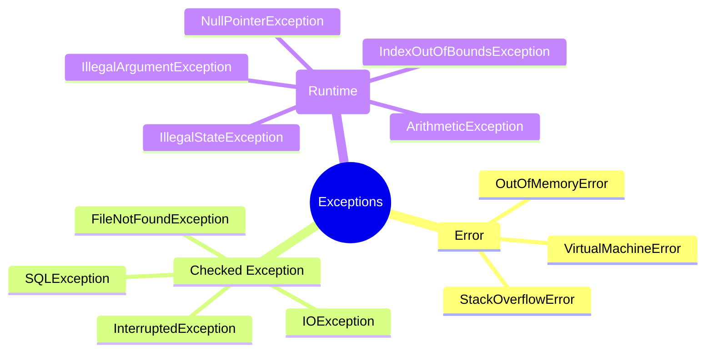

# ⚠️ Java Exception Handling — Complete Deep Dive

**Related**: [OOP Concepts](01-oop-concepts.md) · [Multithreading](04-multithreading.md) · [Streams & Lambda](07-streams-lambda.md)

---

## Table of Contents

- [Exception Hierarchy](#-exception-hierarchy)
- [1. Checked vs Unchecked](#1-checked-vs-unchecked)
- [2. try-catch-finally](#2-try-catch-finally)
- [3. try-with-resources](#3-try-with-resources)
- [4. throw vs throws](#4-throw-vs-throws)
- [5. Custom Exceptions](#5-custom-exceptions)
- [6. Exception Propagation](#6-exception-propagation)
- [7. Best Practices](#7-best-practices)
- [8. Common Anti-Patterns](#8-common-anti-patterns)
- [9. Advanced Patterns](#9-advanced-patterns)
- [Simplest Mental Model](#-simplest-mental-model)

---

## 🧭 Exception Hierarchy

```text
                    ┌─────────────────────────────────┐
                    │         Object                   │
                    └────────────┬────────────────────┘
                                 │
                    ┌────────────┴────────────────────┐
                    │         Throwable                │
                    └────────────┬────────────────────┘
                                 │
              ┌──────────────────┼──────────────────┐
              ▼                  ▼                  ▼
    ┌────────────────┐  ┌────────────────┐  ┌────────────────┐
    │     Error      │  │  Exception     │  │  (other)       │
    │ (JVM serious)  │  │ (app problem)  │  │                │
    ├────────────────┤  ├────────────────┤  └────────────────┘
    │ OutOfMemoryErr │  │ RuntimeException│
    │ StackOverflow  │  │ IOException     │
    │ NoClassDefFound│  │ SQLException    │
    └────────────────┘  └────────────────┘

                ┌──────────────────────┐
                │  RuntimeException    │  ← Unchecked
                │  (extends Exception) │
                ├──────────────────────┤
                │ NullPointerException │
                │ IllegalArgumentException│
                │ IndexOutOfBounds     │
                │ ArithmeticException  │
                │ IllegalStateException│
                │ ClassCastException   │
                │ NumberFormatException│
                └──────────────────────┘

                ┌──────────────────────┐
                │  Checked Exceptions  │  ← Must handle or declare
                ├──────────────────────┤
                │ IOException          │
                │ FileNotFoundException│
                │ SQLException         │
                │ ClassNotFoundException│
                │ InterruptedException │
                │ ParseException       │
                └──────────────────────┘
```



---

## 1. Checked vs Unchecked

### Checked Exceptions

**Must be handled or declared in method signature.**

```java
// ❌ WON'T COMPILE — IOException is checked
public void readFile() {
    Files.readString(Path.of("file.txt"));  // unhandled IOException
}

// ✅ Option 1: try-catch
public void readFile() {
    try {
        String content = Files.readString(Path.of("file.txt"));
        System.out.println(content);
    } catch (IOException e) {
        System.err.println("Failed to read file: " + e.getMessage());
    }
}

// ✅ Option 2: throws declaration
public void readFile() throws IOException {
    String content = Files.readString(Path.of("file.txt"));
    System.out.println(content);
}

// ✅ Option 3: propagate up the chain
public void processFile() throws IOException {
    readFile();  // caller must handle or declare
}
```

### Unchecked Exceptions (RuntimeException)

**Not required to handle or declare.**

```java
// These compile without any try-catch or throws
public int divide(int a, int b) {
    return a / b;  // may throw ArithmeticException (unchecked)
}

public String getName(Person p) {
    return p.getName();  // may throw NullPointerException (unchecked)
}

// But still good practice to handle when expected
public int divide(int a, int b) {
    try {
        return a / b;
    } catch (ArithmeticException e) {
        return 0;  // handle division by zero gracefully
    }
}
```

### Checked vs Unchecked

| Aspect | Checked | Unchecked |
|--------|---------|-----------|
| Extends | `Exception` (not RuntimeException) | `RuntimeException` |
| Required handling | ✅ Must catch or declare | ❌ Optional |
| When to use | Recoverable, expected failures | Programming errors |
| Examples | File not found, network down | Null pointer, invalid arg |
| Performance | Slight overhead (stack trace) | Same |
| Caller burden | High — must handle | None |
| Spring `@Transactional` | Triggers rollback | Does NOT rollback by default |

---

## 2. try-catch-finally

### Basic Structure

```java
try {
    // Code that may throw exceptions
    String data = readFromFile("config.txt");
    processData(data);
} catch (FileNotFoundException e) {
    // Handle specific exception
    System.err.println("Config file not found. Using defaults.");
    loadDefaults();
} catch (IOException e) {
    // Handle broader exception
    System.err.println("I/O error: " + e.getMessage());
} catch (Exception e) {
    // Catch-all (last resort)
    System.err.println("Unexpected error: " + e);
} finally {
    // ALWAYS executes (even if return in try/catch)
    System.out.println("Cleanup: closing resources");
    closeResources();
}
```

### Multi-catch (Java 7+)

```java
try {
    int result = riskyOperation();
    saveToDatabase(result);
    sendNotification(result);
} catch (IOException | SQLException e) {
    // Same handling for multiple exception types
    log.error("Operation failed: " + e.getMessage(), e);
    throw new BusinessException("Processing failed", e);
}
```

### finally Block Execution Guarantees

```java
// Case 1: normal execution
try { return 1; } finally { System.out.println("always"); }
// Output: "always" (then returns 1)

// Case 2: exception in try
try { throw new RuntimeException(); } finally { System.out.println("cleanup"); }
// Output: "cleanup" (then exception propagates)

// Case 3: return in finally overrides try's return!
try { return 1; } finally { return 2; }
// Returns 2! (finally return suppresses try return)

// Case 4: exception in finally
try { /* ok */ } finally { throw new RuntimeException(); }
// Original exception (if any) is suppressed!

// Case 5: exit during finally
try { /* ok */ } finally { System.exit(0); }
// finally executes partially, then JVM exits
```

### The finally Return Trap

```java
// ❌ BAD — finally return swallows exception
public int getValue() {
    try {
        throw new RuntimeException("error");
    } finally {
        return 42;  // suppresses the exception!
    }
}
// getValue() returns 42, exception lost!

// ✅ GOOD
public int getValue() {
    try {
        throw new RuntimeException("error");
    } catch (RuntimeException e) {
        log.error(e);
        return -1;  // explicit fallback
    }
}
```

---

## 3. try-with-resources (Java 7+)

### AutoCloseable Interface

```java
// Any class implementing AutoCloseable can be used in try-with-resources
public interface AutoCloseable {
    void close() throws Exception;
}

// Closeable extends AutoCloseable (close() throws IOException)
public interface Closeable extends AutoCloseable {
    void close() throws IOException;
}
```

### Basic Usage

```java
// ❌ OLD WAY — must close manually in finally
BufferedReader reader = null;
try {
    reader = new BufferedReader(new FileReader("file.txt"));
    return reader.readLine();
} catch (IOException e) {
    log.error(e);
} finally {
    if (reader != null) {
        try { reader.close(); } catch (IOException e) { /* ignore */ }
    }
}

// ✅ NEW WAY — try-with-resources
try (BufferedReader reader = new BufferedReader(new FileReader("file.txt"))) {
    return reader.readLine();
} catch (IOException e) {
    log.error(e);
}
// reader.close() called automatically (even if exception in try)
```

### Multiple Resources

```java
try (FileInputStream fis = new FileInputStream("source.bin");
     FileOutputStream fos = new FileOutputStream("dest.bin");
     BufferedInputStream bis = new BufferedInputStream(fis);
     BufferedOutputStream bos = new BufferedOutputStream(fos)) {

    byte[] buffer = new byte[8192];
    int bytesRead;
    while ((bytesRead = bis.read(buffer)) != -1) {
        bos.write(buffer, 0, bytesRead);
    }
}
// Resources closed in reverse order: bos → bis → fos → fis
```

### Suppressed Exceptions

```java
// When both try block AND close() throw exceptions:
public class MyResource implements AutoCloseable {
    public void work() { throw new RuntimeException("work failed"); }
    @Override public void close() { throw new RuntimeException("close failed"); }
}

try (MyResource r = new MyResource()) {
    r.work();  // throws RuntimeException("work failed")
}
// Primary: RuntimeException("work failed")
// Suppressed: RuntimeException("close failed")
// (close exception is added as suppressed to the primary)

// Access suppressed exceptions
catch (RuntimeException e) {
    Throwable[] suppressed = e.getSuppressed();
    for (Throwable s : suppressed) {
        System.err.println("Suppressed: " + s.getMessage());
    }
}
```

### Custom AutoCloseable

```java
class DatabaseConnection implements AutoCloseable {
    private boolean connected;

    public void connect() {
        connected = true;
        System.out.println("Connected to DB");
    }

    public void query(String sql) {
        if (!connected) throw new IllegalStateException("Not connected");
        System.out.println("Executing: " + sql);
    }

    @Override
    public void close() {
        connected = false;
        System.out.println("Closed DB connection");
    }
}

// Usage
try (DatabaseConnection db = new DatabaseConnection()) {
    db.connect();
    db.query("SELECT * FROM users");
}
// "Closed DB connection" printed automatically
```

---

## 4. throw vs throws

### throw — Explicitly throw an exception

```java
public void validateAge(int age) {
    if (age < 0) {
        throw new IllegalArgumentException("Age cannot be negative: " + age);
    }
    if (age > 150) {
        throw new IllegalArgumentException("Invalid age: " + age);
    }
}

public void transferMoney(Account from, Account to, double amount) {
    if (from == null || to == null) {
        throw new IllegalArgumentException("Accounts cannot be null");
    }
    if (amount <= 0) {
        throw new IllegalArgumentException("Amount must be positive");
    }
    if (from.getBalance() < amount) {
        throw new InsufficientFundsException("Balance: " + from.getBalance()
            + ", required: " + amount);
    }
    // ... transfer logic
}
```

### throws — Declare exceptions a method can throw

```java
// Method can throw multiple checked exceptions
public void processFile(String path) throws IOException, ParseException {
    String content = Files.readString(Path.of(path));  // IOException
    parseContent(content);  // ParseException
}

// Throwing unchecked is optional but documents intent
public int divide(int a, int b) throws ArithmeticException {
    return a / b;
}

// Override rules: can't throw broader checked exceptions
class Parent {
    void run() throws IOException { }
}

class Child extends Parent {
    @Override
    void run() throws FileNotFoundException { }   // ✅ narrower (subtype)
    // void run() throws Exception { }            // ❌ broader
    // void run() { }                             // ✅ no throws
}
```

### throw vs throws

| Aspect | throw | throws |
|--------|-------|--------|
| Purpose | Actually throw an exception | Declare possible exceptions |
| Location | Inside method body | Method signature |
| Count | Exactly one exception | Multiple exceptions possible |
| Keyword follows | Exception instance | Exception class names |
| Caller impact | Execution stops, propagates | Caller must handle/declare |
| Checked/Unchecked | Both | Usually checked (unchecked optional) |

---

## 5. Custom Exceptions

### Checked Custom Exception

```java
// Business exception — recoverable
public class InsufficientFundsException extends Exception {
    private final double balance;
    private final double requested;

    public InsufficientFundsException(double balance, double requested) {
        super(String.format("Insufficient funds: balance=%.2f, requested=%.2f",
            balance, requested));
        this.balance = balance;
        this.requested = requested;
    }

    public double getBalance() { return balance; }
    public double getShortfall() { return requested - balance; }
}

// Usage
public void withdraw(double amount) throws InsufficientFundsException {
    if (amount > this.balance) {
        throw new InsufficientFundsException(this.balance, amount);
    }
    this.balance -= amount;
}
```

### Unchecked Custom Exception

```java
// Programming error — not recoverable
public class ValidationException extends RuntimeException {
    private final List<String> errors;

    public ValidationException(String message) {
        super(message);
        this.errors = new ArrayList<>();
    }

    public ValidationException(List<String> errors) {
        super("Validation failed with " + errors.size() + " errors");
        this.errors = new ArrayList<>(errors);
    }

    public List<String> getErrors() { return errors; }
}

// Usage
public void validate(Order order) {
    List<String> errors = new ArrayList<>();
    if (order.getItems().isEmpty()) errors.add("Order must have items");
    if (order.getTotal() < 0) errors.add("Total cannot be negative");
    if (!errors.isEmpty()) throw new ValidationException(errors);
}
```

### Custom Exception Best Practices

```java
// ✅ GOOD — complete custom exception
public class PaymentProcessingException extends RuntimeException {
    private final String transactionId;
    private final PaymentErrorCode errorCode;

    public PaymentProcessingException(String transactionId,
                                      PaymentErrorCode errorCode,
                                      String message) {
        super(message);
        this.transactionId = transactionId;
        this.errorCode = errorCode;
    }

    public PaymentProcessingException(String transactionId,
                                      PaymentErrorCode errorCode,
                                      String message,
                                      Throwable cause) {
        super(message, cause);
        this.transactionId = transactionId;
        this.errorCode = errorCode;
    }

    // Getters for structured error responses
    public String getTransactionId() { return transactionId; }
    public PaymentErrorCode getErrorCode() { return errorCode; }
}

enum PaymentErrorCode {
    INSUFFICIENT_FUNDS,
    CARD_DECLINED,
    DUPLICATE_TRANSACTION,
    GATEWAY_TIMEOUT,
    FRAUD_DETECTED
}
```

---

## 6. Exception Propagation

### Call Stack Flow

```text
main()
  │
  ▼
┌─────────────────────────────┐
│ try {                        │
│   processOrder(order);       │  ← exception propagates here
│ } catch (BusinessException e)│
└─────────────────────────────┘
         ↑ exception
         │
         ▼
┌─────────────────────────────┐
│ processOrder(Order o)       │
│   validateOrder(o);         │  ← no catch → propagate up
└─────────────────────────────┘
         ↑ exception
         │
         ▼
┌─────────────────────────────┐
│ validateOrder(Order o)      │
│   try { validateItems(o); } │
│   catch (ValidationException)│
│   throw new BusinessException│  ← wrapped and re-thrown
└─────────────────────────────┘
         ↑ exception
         │
         ▼
┌─────────────────────────────┐
│ validateItems(Order o)      │
│   if (o.items.isEmpty())    │
│   throw ValidationException │  ← original exception
└─────────────────────────────┘
```

### Exception Chaining

```java
public void processOrder(Order order) throws BusinessException {
    try {
        validateOrder(order);
        saveOrder(order);
        chargeCustomer(order);
    } catch (SQLException e) {
        // Wrap with context, preserve original cause
        throw new BusinessException("Failed to process order: " + order.getId(),
            e);  // e becomes the "cause"
    } catch (PaymentGatewayException e) {
        throw new BusinessException("Payment failed for order: " + order.getId(),
            e);
    }
}

// Retrieving the cause
try {
    processOrder(order);
} catch (BusinessException e) {
    // e.getCause() → original SQLException
    // e.getSuppressed() → any suppressed exceptions
    Throwable rootCause = e.getCause();
    while (rootCause != null && rootCause.getCause() != null) {
        rootCause = rootCause.getCause();
    }
}
```

### Unchecked Exception Propagation

```java
// Unchecked exceptions propagate automatically without throws declarations
public void doSomething() {
    doSomethingElse();  // NPE can propagate without any throws
}

private void doSomethingElse() {
    String s = null;
    s.length();  // NullPointerException → propagates up
}
```

---

## 7. Best Practices

### 1. Catch Specific Exceptions

```java
// ❌ BAD
try {
    parseFile(path);
} catch (Exception e) {  // too broad — catches everything!
    log.error(e);
}

// ✅ GOOD
try {
    parseFile(path);
} catch (FileNotFoundException e) {
    log.warn("File not found, using default: {}", e.getMessage());
    useDefaults();
} catch (ParseException e) {
    log.error("Parse error at line {}: {}", e.getErrorOffset(), e.getMessage());
    throw new BusinessException("Invalid file format", e);
} catch (IOException e) {
    log.error("I/O error reading file: {}", e.getMessage());
    throw new SystemException("Failed to read file", e);
}
```

### 2. Never Swallow Exceptions

```java
// ❌ BAD — empty catch
try {
    riskyOperation();
} catch (Exception e) {
    // nothing — exception silently disappears!
}

// ❌ BAD — just printing
try {
    riskyOperation();
} catch (Exception e) {
    e.printStackTrace();  // better than nothing, but still swallows
}

// ✅ GOOD — at least log
try {
    riskyOperation();
} catch (Exception e) {
    log.error("Operation failed", e);
    throw e;  // or throw new WrappedException(e);
}

// ✅ GOOD — or rethrow as specific exception
try {
    riskyOperation();
} catch (IOException e) {
    throw new BusinessException("Operation failed", e);
}
```

### 3. Use Finally or try-with-resources for Cleanup

```java
// ✅ GOOD
try (Connection conn = dataSource.getConnection();
     PreparedStatement stmt = conn.prepareStatement(sql)) {
    stmt.setString(1, id);
    return stmt.executeQuery();
} catch (SQLException e) {
    throw new DataAccessException("Query failed: " + sql, e);
}
```

### 4. Throw Early, Catch Late

```java
// ✅ GOOD
public Order createOrder(String userId, List<Item> items) {
    // Throw early — validate immediately
    if (userId == null || userId.isBlank()) {
        throw new IllegalArgumentException("userId is required");
    }
    if (items == null || items.isEmpty()) {
        throw new IllegalArgumentException("Order must have items");
    }

    Order order = new Order(userId, items);

    try {
        orderRepository.save(order);
        paymentService.charge(userId, order.getTotal());
        notificationService.sendConfirmation(order);
        return order;
    } catch (PaymentException e) {
        // Catch late — at highest appropriate level
        orderRepository.markAsFailed(order.getId());
        throw new OrderCreationException("Payment failed", e);
    }
}
```

### 5. Document Exceptions with Javadoc

```java
/**
 * Transfers money between accounts.
 *
 * @param from   source account
 * @param to     destination account
 * @param amount amount to transfer
 * @throws IllegalArgumentException if any parameter is invalid
 * @throws InsufficientFundsException if source has insufficient balance
 * @throws AccountLockedException if either account is locked
 */
public void transfer(Account from, Account to, BigDecimal amount)
    throws InsufficientFundsException, AccountLockedException {
    // implementation
}
```

### 6. Use Custom Exceptions for Business Logic

```java
// ✅ GOOD — meaningful exception names
public class OrderNotFoundException extends RuntimeException {
    public OrderNotFoundException(String orderId) {
        super("Order not found: " + orderId);
    }
}

public class DuplicateOrderException extends RuntimeException {
    public DuplicateOrderException(String orderId) {
        super("Duplicate order detected: " + orderId);
    }
}

// Usage
Order order = orderRepository.findById(id)
    .orElseThrow(() -> new OrderNotFoundException(id));
```

---

## 8. Common Anti-Patterns

| Anti-Pattern | Example | Fix |
|-------------|---------|-----|
| Catch Exception | `catch (Exception e)` | Catch specific types |
| Swallow exception | Empty catch block | Log + rethrow or handle |
| Return in finally | `finally { return x; }` | Never return from finally |
| Log and throw | `log.error(e); throw e;` | Log OR throw, not both |
| Exception for flow control | `throw new Exception()` for expected states | Return optional/result |
| Catching Throwable | `catch (Throwable t)` | Catches Errors too (JVM fatal) |
| Overly broad throws | `throws Exception` | List specific exceptions |
| Ignoring InterruptedException | Empty catch | Restore interrupt flag |
| Exception swallowing in finally | `close()` called without catch | Use try-with-resources |
| Throwing unchecked for recoverable issues | RuntimeException for expected failure | Use checked exception |

### Restoring Interrupted Status

```java
// ❌ BAD — eating the interrupt
try {
    Thread.sleep(1000);
} catch (InterruptedException e) {
    // ignore — but interrupt flag is cleared!
}

// ✅ GOOD — restore interrupt status
try {
    Thread.sleep(1000);
} catch (InterruptedException e) {
    Thread.currentThread().interrupt();  // restore flag
    throw new RuntimeException("Thread interrupted", e);
    // or handle gracefully
}
```

---

## 9. Advanced Patterns

### Functional Exception Handling (Java 8+)

```java
// Lift a checked exception into a functional interface
@FunctionalInterface
interface ThrowingSupplier<T> {
    T get() throws Exception;
}

static <T> Supplier<T> unchecked(ThrowingSupplier<T> supplier) {
    return () -> {
        try {
            return supplier.get();
        } catch (RuntimeException e) {
            throw e;
        } catch (Exception e) {
            throw new RuntimeException(e);
        }
    };
}

// Usage
List<Path> paths = List.of(Paths.get("a.txt"), Paths.get("b.txt"));
paths.stream()
    .map(unchecked(Files::readString))  // checked→unchecked conversion
    .forEach(System.out::println);
```

### Result Pattern (No Exceptions for Expected Cases)

```java
public class Result<T, E extends Exception> {
    private final T value;
    private final E error;

    private Result(T value, E error) {
        this.value = value;
        this.error = error;
    }

    public static <T, E extends Exception> Result<T, E> success(T value) {
        return new Result<>(value, null);
    }

    public static <T, E extends Exception> Result<T, E> failure(E error) {
        return new Result<>(null, error);
    }

    public T orElseThrow() throws E {
        if (error != null) throw error;
        return value;
    }

    public T orElse(T defaultValue) {
        return value != null ? value : defaultValue;
    }

    public boolean isSuccess() { return error == null; }
    public E getError() { return error; }
}

// Usage
Result<User, ServiceException> result = userService.findById(id);
if (result.isSuccess()) {
    User user = result.orElseThrow();
    processUser(user);
} else {
    log.warn("User not found: {}", result.getError().getMessage());
}
```

---

## 🧠 Simplest Mental Model

```text
try      =  "I'm going to attempt something risky."

catch    =  "If it fails, here's my backup plan."

finally  =  "Whether it succeeds or fails, I MUST do this cleanup.
             Like locking the door when leaving — always."

throw    =  "I can't handle this. Someone higher up needs to deal with it."

throws   =  "Warning label: calling this method might cause these problems."

Checked  =  Seatbelt law. The compiler forces you to handle it.
            You MUST wear it (try-catch) or accept the risk (throws).

Unchecked = Jaywalking. You shouldn't do it (NPE, bad args), but the
            compiler won't force you to handle it at compile time.

TRY-WITH-RESOURCES = A butler who hands you a drink, then takes the
                     empty glass and washes it automatically.
```

---

**Next**: [Multithreading & Concurrency](04-multithreading.md) — Threads, synchronization, executors, locks
