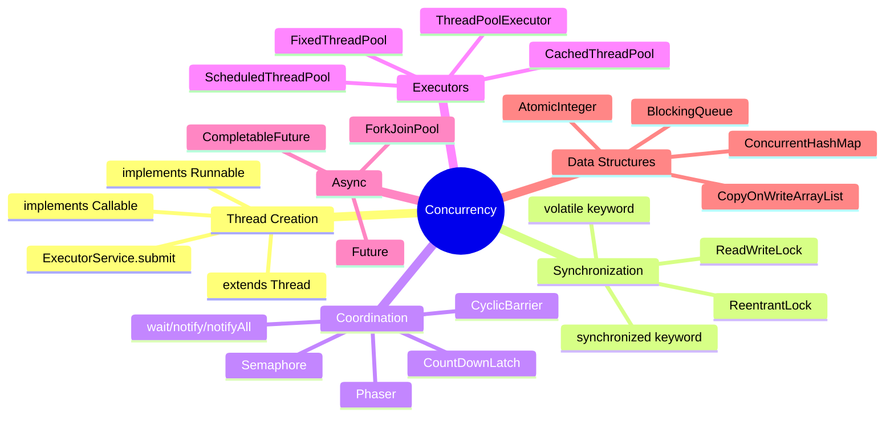
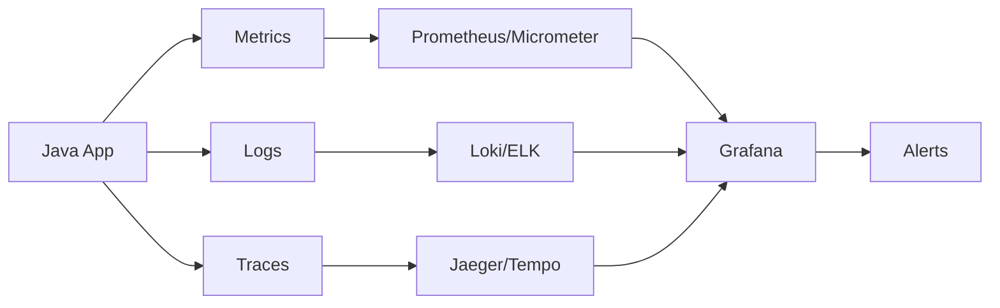

# 🧵 Java Multithreading & Concurrency — Complete Deep Dive

**Related**: [Java Memory Model & GC](06-java-memory-gc.md) · [OOP Concepts](01-oop-concepts.md) · [Collections Framework](02-collections-framework.md)

---

## Table of Contents


- [Core Concepts](#-core-concepts)
- [1. Creating Threads](#1-creating-threads)
- [2. Thread Lifecycle](#2-thread-lifecycle)
- [3. Synchronization](#3-synchronization)
- [4. Locks & Atomic Variables](#4-locks--atomic-variables)
- [5. Executor Framework](#5-executor-framework)
- [6. CompletableFuture](#6-completablefuture)
- [7. Fork/Join Framework](#7-forkjoin-framework)
- [8. Thread Safety Patterns](#8-thread-safety-patterns)
- [9. Common Concurrency Problems](#9-common-concurrency-problems)
- [Simplest Mental Model](#-simplest-mental-model)

---

## 🧭 Core Concepts


```text
                    ┌─────────────────────────────────┐
                    │        Concurrency              │
                    │  Multiple tasks making progress │
                    │  (may be interleaved)           │
                    └─────────────────────────────────┘
                                    │
            ┌───────────────────────┼───────────────────────┐
            ▼                       ▼                       ▼
┌─────────────────────┐  ┌─────────────────────┐  ┌─────────────────────┐
│    Parallelism      │  │   Synchronization   │  │  Thread Safety      │
│  Multiple tasks     │  │  Coordinate access  │  │  Correct behavior   │
│  running SIMULTANEOUSLY│ to shared data      │  │  under contention   │
└─────────────────────┘  └─────────────────────┘  └─────────────────────┘
```



---

## 1. Creating Threads


### Method 1: Extend Thread


```java
class DownloadTask extends Thread {
    private final String url;

    DownloadTask(String url) {
        super("Download-" + url);  // thread name
        this.url = url;
    }

    @Override
    public void run() {
        System.out.println(Thread.currentThread().getName()
            + " downloading: " + url);
        // download logic...
    }
}

// Usage
Thread t1 = new DownloadTask("https://example.com/file1.zip");
Thread t2 = new DownloadTask("https://example.com/file2.zip");
t1.start();  // DON'T call run() directly!
t2.start();
t1.join();   // wait for t1 to finish
t2.join();   // wait for t2 to finish
```

### Method 2: Implement Runnable


```java
class FileProcessor implements Runnable {
    private final String filename;

    FileProcessor(String filename) {
        this.filename = filename;
    }

    @Override
    public void run() {
        System.out.println("Processing: " + filename);
    }
}

// Usage
Thread t = new Thread(new FileProcessor("data.csv"));
t.start();

// Anonymous Runnable
new Thread(new Runnable() {
    @Override
    public void run() {
        System.out.println("Anonymous thread");
    }
}).start();

// Lambda (Java 8+)
new Thread(() -> System.out.println("Lambda thread")).start();
```

### Method 3: Implement Callable (with return value)


```java
class CalculationTask implements Callable<Integer> {
    private final int a;
    private final int b;

    CalculationTask(int a, int b) {
        this.a = a;
        this.b = b;
    }

    @Override
    public Integer call() throws Exception {
        return a + b;  // return value
    }
}

// Usage with ExecutorService
ExecutorService executor = Executors.newFixedThreadPool(2);
Future<Integer> future = executor.submit(new CalculationTask(5, 3));

// Get result (blocks until done)
Integer result = future.get();  // 8
```

### Thread vs Runnable vs Callable


| Aspect | Thread | Runnable | Callable |
|--------|--------|----------|----------|
| Extends | `Thread` | — | — |
| Implements | — | `Runnable` | `Callable<V>` |
| Method | `run()` | `run()` | `call()` |
| Return value | `void` | `void` | `V` |
| Exception | Any (catch inside) | Any (catch inside) | `throws Exception` |
| Reuse? | No (one-time) | Yes (submit multiple times) | Yes |
| Recommended? | ❌ (favor composition) | ✅ | ✅ for results |

---

## 2. Thread Lifecycle


### States


```text
                    ┌──────────────────────┐
                    │       NEW            │
                    │ (Thread created)     │
                    └──────────┬───────────┘
                               │ start()
                               ▼
                    ┌──────────────────────┐
                    │      RUNNABLE        │
                    │ (ready to run OR     │
                    │  actually running)   │
                    └──────────┬───────────┘
                              / \
                    ┌─────────   ─────────┐
                    ▼                     ▼
        ┌──────────────────┐   ┌──────────────────┐
        │    BLOCKED       │   │   WAITING        │
        │ (waiting for     │   │ (wait(), join(), │
        │  monitor lock)   │   │  park())         │
        └──────────────────┘   └────────┬─────────┘
                                        │
        ┌──────────────────┐            │
        │ TIMED_WAITING    │◄───────────┘
        │ (sleep(ms),      │
        │  wait(ms),       │
        │  join(ms))       │
        └──────────┬───────┘
                   │
                   ▼
        ┌──────────────────────┐
        │    TERMINATED        │
        │ (run() completed or  │
        │  uncaught exception) │
        └──────────────────────┘
```

### State Transitions


```java
Thread t = new Thread(() -> {
    System.out.println("Running");
    try {
        Thread.sleep(100);    // RUNNABLE → TIMED_WAITING
    } catch (InterruptedException e) {
        Thread.currentThread().interrupt();
    }
});

System.out.println(t.getState());  // NEW

t.start();
System.out.println(t.getState());  // RUNNABLE

t.join();  // caller: WAITING until t finishes
System.out.println(t.getState());  // TERMINATED
```

### Important Methods


```java
// Sleep — pause current thread
Thread.sleep(1000);          // milliseconds (throws InterruptedException)
Thread.sleep(500, 200_000);  // millis + nanos

// Join — wait for another thread to finish
Thread worker = new Thread(() -> { /* work */ });
worker.start();
worker.join();           // wait indefinitely
worker.join(1000);       // wait max 1 second

// Yield — hint to scheduler (rarely useful)
Thread.yield();  // current thread willing to yield CPU

// Interrupt — request interruption
worker.interrupt();
// Target thread should check:
while (!Thread.currentThread().isInterrupted()) {
    // keep working
}
```

### Daemon Threads


```java
// Daemon = background thread. JVM exits when only daemon threads remain.
Thread daemon = new Thread(() -> {
    while (true) {
        // background housekeeping
    }
});
daemon.setDaemon(true);  // MUST set before start()
daemon.start();

// User thread — JVM waits for it to finish
Thread user = new Thread(() -> {
    Thread.sleep(5000);
    System.out.println("Done");
});
user.start();  // JVM won't exit until this finishes
```

| Aspect | User Thread | Daemon Thread |
|--------|-------------|---------------|
| JVM exit | Waits for completion | Doesn't wait |
| Default | ✅ | ❌ |
| Set before start | — | `setDaemon(true)` |
| Typical | Main logic | Housekeeping, monitoring |
| Inherits from parent | Yes | Yes |

---

## 3. Synchronization


### The Problem — Race Condition


```java
class Counter {
    private int count = 0;

    public void increment() {
        count++;  // NOT atomic!
    }

    public int getCount() { return count; }
}

// What count++ actually does:
// 1. READ count from memory
// 2. ADD 1 to value
// 3. WRITE count back to memory

// With 2 threads:
// Thread A reads count (0)
// Thread B reads count (0)
// Thread A writes count (1)
// Thread B writes count (1)  ← lost update!
// Expected: 2, Actual: 1
```

### Solution 1: synchronized Method


```java
class SynchronizedCounter {
    private int count = 0;

    // Synchronized instance method — locks on 'this'
    public synchronized void increment() {
        count++;
    }

    public synchronized int getCount() {
        return count;
    }
}
```

### Solution 2: synchronized Block


```java
class SharedData {
    private final Object lock = new Object();  // dedicated lock object
    private int count = 0;

    public void increment() {
        synchronized (lock) {  // only this block is synchronized
            count++;
        }
    }

    // Can also use 'this' as lock
    public void decrement() {
        synchronized (this) {
            count--;
        }
    }
}
```

### Solution 3: Static synchronized


```java
class StaticCounter {
    private static int globalCount = 0;

    // Locks on Class object (StaticCounter.class)
    public static synchronized void incrementGlobal() {
        globalCount++;
    }

    // Equivalent:
    public static void incrementGlobal2() {
        synchronized (StaticCounter.class) {
            globalCount++;
        }
    }
}
```

### synchronized Internals


```text
                    ┌─────────────────────────┐
                    │      Object (lock)       │
                    ├─────────────────────────┤
                    │ Mark Word (contains)     │
                    │ ┌─────────────────────┐  │
                    │ │ Lock Information     │  │
                    │ │ Biased → Light→ Heavy│  │
                    │ │ Lock                 │  │
                    │ └─────────────────────┘  │
                    └─────────────────────────┘

Lock Evolution (Java 6+ optimization):
  1. Biased Locking: Thread acquires lock, marks header with thread ID.
     No CAS needed if same thread re-enters.
  2. Lightweight Locking: If contention detected, use CAS on mark word.
  3. Heavyweight Locking: If spin fails, thread suspended (OS mutex).

synchronized block bytecode:
  monitorenter  → acquire lock
  // critical section
  monitorexit   → release lock
  monitorexit   → (extra for exception unwind)
```

### wait() / notify() — Inter-Thread Communication


```java
class MessageQueue {
    private final Queue<String> queue = new LinkedList<>();
    private final int capacity;

    public MessageQueue(int capacity) {
        this.capacity = capacity;
    }

    public synchronized void produce(String msg) throws InterruptedException {
        while (queue.size() == capacity) {
            wait();  // release lock, wait for consumer
        }
        queue.add(msg);
        System.out.println("Produced: " + msg);
        notifyAll();  // wake up consumers
    }

    public synchronized String consume() throws InterruptedException {
        while (queue.isEmpty()) {
            wait();  // release lock, wait for producer
        }
        String msg = queue.poll();
        System.out.println("Consumed: " + msg);
        notifyAll();  // wake up producers
        return msg;
    }
}
```

### Wait/Notify Protocol


```text
Producer                          Consumer
    │                                │
    ▼                                ▼
┌───────────┐                   ┌───────────┐
│ acquire   │                   │ acquire   │
│ lock      │                   │ lock      │
└────┬──────┘                   └────┬──────┘
     │                               │
     ▼                               ▼
┌───────────┐  queue full?     ┌───────────┐
│ while(    │─────YES─────────►│ wait()    │
│ full) {   │                  │ (release  │
│ wait() }  │                  │  lock)    │
└────┬──────┘                  └────┬──────┘
     │ queue not full               │ woke up
     ▼                               ▼
┌───────────┐                   ┌───────────┐
│ add to    │                   │ while(    │
│ queue     │                   │ empty) {  │
│ notifyAll()│                  │ wait() }  │
└────┬──────┘                   └────┬──────┘
     │                               │ not empty
     ▼                               ▼
┌───────────┐                   ┌───────────┐
│ release   │                   │ remove    │
│ lock      │                   │ notifyAll │
└───────────┘                   └────┬──────┘
                                     │
                                     ▼
                              ┌───────────┐
                              │ release   │
                              │ lock      │
                              └───────────┘
```

### volatile — Visibility (Not Atomicity)


```java
class FlagExample {
    private volatile boolean running = true;
    // volatile guarantees:
    //  1. Reads see latest write (visibility)
    //  2. Prevents instruction reordering
    //  Does NOT guarantee atomicity!

    public void stop() {
        running = false;  // write visible to all threads immediately
    }

    public void run() {
        while (running) {  // reads always see latest
            // work
        }
    }
}

// ❌ WRONG — volatile doesn't help with compound operations
private volatile int count = 0;
public void increment() {
    count++;  // STILL a race condition!
}

// ✅ Use AtomicInteger instead
private final AtomicInteger count = new AtomicInteger(0);
public void increment() {
    count.incrementAndGet();
}
```

### synchronized vs volatile vs Atomic


| Aspect | synchronized | volatile | Atomic* |
|--------|-------------|----------|---------|
| Scope | Block/method | Field | Single variable |
| Mutual exclusion | ✅ | ❌ | ❌ (CAS does) |
| Visibility | ✅ | ✅ | ✅ |
| Atomicity | ✅ (for the block) | ❌ | ✅ (single op) |
| Performance | Heavier | Light (reads = normal) | Moderate (CAS loop) |
| Can compose ops | ✅ | ❌ | ❌ (single op only) |

---

## 4. Locks & Atomic Variables


### ReentrantLock


```java
class BankAccount {
    private final Lock lock = new ReentrantLock();
    private double balance;

    public void transfer(BankAccount to, double amount) {
        lock.lock();
        try {
            if (amount > balance) {
                throw new InsufficientFundsException();
            }
            this.balance -= amount;
            to.deposit(amount);
        } finally {
            lock.unlock();  // MUST unlock in finally!
        }
    }

    public void deposit(double amount) {
        lock.lock();
        try {
            balance += amount;
        } finally {
            lock.unlock();
        }
    }
}
```

### ReentrantLock vs synchronized


| Feature | synchronized | ReentrantLock |
|---------|-------------|---------------|
| Lock/unlock | Automatic | Manual (try/finally) |
| Try lock | ❌ | `tryLock()` — non-blocking attempt |
| Timeout | ❌ | `tryLock(1, TimeUnit.SECONDS)` |
| Interruptible | ❌ (until Java 5) | `lockInterruptibly()` |
| Fairness | ❌ (unfair) | ✅ `new ReentrantLock(true)` |
| Condition | `wait/notify` | `newCondition()` — multiple conditions |
| Performance | Better (biased locking) | Slightly heavier |

### ReadWriteLock


```java
class ThreadSafeCache<K, V> {
    private final ReadWriteLock rwLock = new ReentrantReadWriteLock();
    private final Lock readLock = rwLock.readLock();
    private final Lock writeLock = rwLock.writeLock();
    private final Map<K, V> cache = new HashMap<>();

    public V get(K key) {
        readLock.lock();  // multiple readers allowed
        try {
            return cache.get(key);
        } finally {
            readLock.unlock();
        }
    }

    public void put(K key, V value) {
        writeLock.lock();  // exclusive access
        try {
            cache.put(key, value);
        } finally {
            writeLock.unlock();
        }
    }

    public void clear() {
        writeLock.lock();
        try {
            cache.clear();
        } finally {
            writeLock.unlock();
        }
    }
}
```

### Atomic Classes (java.util.concurrent.atomic)


```java
// Basic atomic operations using CAS (Compare-And-Swap)
AtomicInteger counter = new AtomicInteger(0);
counter.incrementAndGet();   // ++counter
counter.getAndIncrement();   // counter++
counter.addAndGet(5);        // counter += 5
counter.getAndSet(10);       // set and return old
counter.compareAndSet(10, 20); // if 10 → set 20, returns boolean

// Other atomic classes
AtomicLong longCounter = new AtomicLong(0);
AtomicBoolean flag = new AtomicBoolean(false);
AtomicReference<String> ref = new AtomicReference<>("initial");

// Atomic arrays
AtomicIntegerArray intArr = new AtomicIntegerArray(10);
AtomicReferenceArray<String> refArr = new AtomicReferenceArray<>(10);

// Accumulators (Java 8+) — higher throughput for parallel updates
LongAdder adder = new LongAdder();    // striped counter
LongAccumulator accumulator = new LongAccumulator(Long::max, 0L);
```

### CAS (Compare-And-Swap) Internals


```text
AtomicInteger.incrementAndGet():

    ┌─────────────────────────────────────────┐
    │   while (true) {                        │
    │       int current = get();              │  READ
    │       int next = current + 1;           │  COMPUTE
    │       if (compareAndSet(current, next)) │  CAS
    │           return next;                  │  SUCCESS
    │       // else: loop again               │  FAIL → retry
    │   }                                      │
    └─────────────────────────────────────────┘

CAS Hardware:
  ┌──────────────────────────────────────┐
  │  CPU instruction: CMPXCHG (x86)      │
  │                                      │
  │  if (*ptr == expected) {             │
  │      *ptr = newValue;                │
  │      return true;                    │
  │  } else {                            │
  │      return false;                   │
  │  }                                   │
  │                                      │
  │  Atomic — no thread can interrupt    │
  │  between compare and swap.           │
  └──────────────────────────────────────┘
```

### Condition (Replaces wait/notify)


```java
class BoundedBuffer<T> {
    private final Lock lock = new ReentrantLock();
    private final Condition notFull = lock.newCondition();
    private final Condition notEmpty = lock.newCondition();
    private final Queue<T> queue = new LinkedList<>();
    private final int capacity;

    public BoundedBuffer(int capacity) {
        this.capacity = capacity;
    }

    public void put(T item) throws InterruptedException {
        lock.lock();
        try {
            while (queue.size() == capacity) {
                notFull.await();  // wait (releases lock)
            }
            queue.add(item);
            notEmpty.signal();   // wake one consumer
        } finally {
            lock.unlock();
        }
    }

    public T take() throws InterruptedException {
        lock.lock();
        try {
            while (queue.isEmpty()) {
                notEmpty.await();
            }
            T item = queue.poll();
            notFull.signal();
            return item;
        } finally {
            lock.unlock();
        }
    }
}
```

---

## 5. Executor Framework


### ThreadPoolExecutor


```java
ThreadPoolExecutor executor = new ThreadPoolExecutor(
    2,                    // corePoolSize
    4,                    // maximumPoolSize
    60, TimeUnit.SECONDS, // keepAliveTime (for threads > core)
    new LinkedBlockingQueue<>(100),  // work queue
    new ThreadPoolExecutor.CallerRunsPolicy()  // rejection policy
);
```

### Executors Factory Methods


```java
// Fixed thread pool — fixed number of threads
ExecutorService fixedPool = Executors.newFixedThreadPool(4);

// Cached thread pool — grows/shrinks dynamically
ExecutorService cachedPool = Executors.newCachedThreadPool();

// Single thread — executes tasks sequentially
ExecutorService singleThread = Executors.newSingleThreadExecutor();

// Scheduled thread pool
ScheduledExecutorService scheduler = Executors.newScheduledThreadPool(2);
```

### Submitting Tasks


```java
ExecutorService executor = Executors.newFixedThreadPool(4);

// execute — Runnable, no return
executor.execute(() -> System.out.println("Fire and forget"));

// submit — returns Future
Future<String> future = executor.submit(() -> {
    Thread.sleep(1000);
    return "Result";
});

// invokeAll — batch of Callables
List<Callable<String>> tasks = Arrays.asList(
    () -> "Task1", () -> "Task2", () -> "Task3"
);
List<Future<String>> futures = executor.invokeAll(tasks);

// invokeAny — return first completed result
String firstResult = executor.invokeAny(tasks);

// Shutdown
executor.shutdown();                    // no new tasks, wait for running
// executor.shutdownNow();              // interrupt running tasks
executor.awaitTermination(5, TimeUnit.SECONDS);
```

### Future — Getting Results


```java
ExecutorService executor = Executors.newSingleThreadExecutor();
Future<Integer> future = executor.submit(() -> {
    Thread.sleep(2000);
    return 42;
});

// Check if done
while (!future.isDone()) {
    System.out.println("Waiting...");
    Thread.sleep(200);
}

// Get result (blocks)
Integer result = future.get();  // 42

// Get with timeout
try {
    result = future.get(1, TimeUnit.SECONDS);  // may timeout
} catch (TimeoutException e) {
    future.cancel(true);  // interrupt the task
}

// Cancel
future.cancel(true);    // mayInterruptIfRunning
future.isCancelled();   // check if cancelled
```

### Scheduled Tasks


```java
ScheduledExecutorService scheduler = Executors.newScheduledThreadPool(2);

// Run once with delay
ScheduledFuture<?> future = scheduler.schedule(
    () -> System.out.println("Delayed task"),
    5, TimeUnit.SECONDS
);

// Run repeatedly with fixed rate (ignores execution time)
scheduler.scheduleAtFixedRate(
    () -> System.out.println("Every 2 seconds"),
    0, 2, TimeUnit.SECONDS
);

// Run repeatedly with fixed delay (waits for completion)
scheduler.scheduleWithFixedDelay(
    () -> System.out.println("2 sec after last completion"),
    0, 2, TimeUnit.SECONDS
);
```

### Rejection Policies


```java
ThreadPoolExecutor executor = new ThreadPoolExecutor(
    2, 4, 60, TimeUnit.SECONDS,
    new ArrayBlockingQueue<>(10),
    // Rejection policies:
    // new ThreadPoolExecutor.AbortPolicy()         → throws RejectedExecutionException
    // new ThreadPoolExecutor.CallerRunsPolicy()     → runs in caller's thread
    // new ThreadPoolExecutor.DiscardPolicy()       → silently discards
    // new ThreadPoolExecutor.DiscardOldestPolicy() → discards oldest queued task
    new ThreadPoolExecutor.CallerRunsPolicy()
);
```

---

## 6. CompletableFuture


### Basic Usage


```java
// Create a completed future
CompletableFuture<String> completed = CompletableFuture.completedFuture("done");

// Run async task
CompletableFuture<Void> future = CompletableFuture.runAsync(() -> {
    System.out.println("Running in: " + Thread.currentThread());
});

// Supply async result
CompletableFuture<String> supply = CompletableFuture.supplyAsync(() -> {
    return "Hello";
});
```

### Chaining


```java
CompletableFuture<String> future = CompletableFuture.supplyAsync(() -> {
    return "Hello";
}).thenApply(result -> {
    return result + " World";  // transform (synchronous)
}).thenApplyAsync(result -> {
    return result.toUpperCase();  // transform (async)
}).thenApply(String::length);  // method reference

// thenAccept — consume result, no return
CompletableFuture.supplyAsync(() -> "Data")
    .thenAccept(data -> System.out.println("Got: " + data));

// thenRun — run after completion
CompletableFuture.supplyAsync(() -> "Data")
    .thenRun(() -> System.out.println("Done"));
```

### Combining


```java
CompletableFuture<String> future1 = CompletableFuture.supplyAsync(() -> "Hello");
CompletableFuture<String> future2 = CompletableFuture.supplyAsync(() -> "World");

// Combine results
CompletableFuture<String> combined = future1.thenCombine(future2,
    (a, b) -> a + " " + b
);  // "Hello World"

// Compose (flatMap) — chain dependent futures
CompletableFuture<String> composed = future1.thenCompose(result ->
    CompletableFuture.supplyAsync(() -> result + " World")
);

// All of — wait for all
CompletableFuture<Void> all = CompletableFuture.allOf(future1, future2);

// Any of — first to complete
CompletableFuture<Object> any = CompletableFuture.anyOf(future1, future2);
```

### Error Handling


```java
CompletableFuture.supplyAsync(() -> {
    if (Math.random() > 0.5) throw new RuntimeException("Failed");
    return "Success";
}).exceptionally(ex -> {
    System.err.println("Error: " + ex.getMessage());
    return "Fallback";
}).thenApply(result -> {
    return result + " processed";
}).handle((result, ex) -> {
    if (ex != null) return "Recovered: " + ex.getMessage();
    return "OK: " + result;
});
```

### AllOf Pattern


```java
// Fetch multiple users in parallel
List<Integer> userIds = List.of(1, 2, 3, 4, 5);

List<CompletableFuture<User>> futures = userIds.stream()
    .map(id -> CompletableFuture.supplyAsync(() -> fetchUser(id)))
    .toList();

CompletableFuture<Void> all = CompletableFuture.allOf(
    futures.toArray(new CompletableFuture[0])
);

CompletableFuture<List<User>> allUsers = all.thenApply(v ->
    futures.stream()
        .map(CompletableFuture::join)  // join won't throw (already done)
        .toList()
);

List<User> users = allUsers.get();
```

---

## 7. Fork/Join Framework


### RecursiveTask


```java
class SumTask extends RecursiveTask<Long> {
    private static final int THRESHOLD = 10_000;
    private final int[] array;
    private final int start, end;

    SumTask(int[] array, int start, int end) {
        this.array = array;
        this.start = start;
        this.end = end;
    }

    @Override
    protected Long compute() {
        int length = end - start;
        if (length <= THRESHOLD) {
            // Small enough — compute directly
            long sum = 0;
            for (int i = start; i < end; i++) {
                sum += array[i];
            }
            return sum;
        }

        // Fork — split into subtasks
        int mid = start + length / 2;
        SumTask left = new SumTask(array, start, mid);
        SumTask right = new SumTask(array, mid, end);

        left.fork();           // async execute
        long rightResult = right.compute();  // compute in current thread
        long leftResult = left.join();       // wait for left

        return leftResult + rightResult;
    }
}

// Usage
ForkJoinPool pool = new ForkJoinPool();  // default: N-1 threads
long result = pool.invoke(new SumTask(array, 0, array.length));
```

### Fork/Join Flow


```text
                    ┌─────────────────────┐
                    │   SumTask(0, 100K)  │
                    └──────────┬──────────┘
                               │
              ┌────────────────┼────────────────┐
              │                │                 │
              ▼                │                 ▼
    ┌──────────────┐          │        ┌──────────────┐
    │ left.fork()  │          │        │ right.compute│
    │ Sum(0, 50K)  │          │        │ Sum(50K,100K)│
    └──────┬───────┘          │        └──────┬───────┘
           │                  │               │
     ┌─────┼─────┐            │         ┌─────┼─────┐
     ▼           ▼            │         ▼           ▼
  ┌──────┐   ┌──────┐         │     ┌──────┐   ┌──────┐
  │(0..25)│   │(25..50)│       │     │(50..75)│   │(75..100)│
  │ fork │   │ compute│       │     │ compute│   │ compute│
  └──┬───┘   └───┬────┘       │     └───┬────┘   └───┬────┘
     │           │             │         │             │
     └─────┬─────┘             │         └─────┬───────┘
           ▼                   │               ▼
      left.join() ◄────────────┘          result ready
           ▼                                         
      combine + return                          combine + return
```

### RecursiveAction (No Return Value)


```java
class ParallelSortTask extends RecursiveAction {
    private final int[] array;
    private final int start, end;

    ParallelSortTask(int[] array, int start, int end) {
        this.array = array;
        this.start = start;
        this.end = end;
    }

    @Override
    protected void compute() {
        if (end - start < 1000) {
            Arrays.sort(array, start, end);
            return;
        }
        int mid = start + (end - start) / 2;
        invokeAll(
            new ParallelSortTask(array, start, mid),
            new ParallelSortTask(array, mid, end)
        );
        merge(array, start, mid, end);
    }

    private void merge(int[] arr, int start, int mid, int end) {
        int[] merged = new int[end - start];
        int i = start, j = mid, k = 0;
        while (i < mid && j < end)
            merged[k++] = arr[i] <= arr[j] ? arr[i++] : arr[j++];
        while (i < mid) merged[k++] = arr[i++];
        while (j < end) merged[k++] = arr[j++];
        System.arraycopy(merged, 0, arr, start, merged.length);
    }
}
```

### Work-Stealing Algorithm


```text
ForkJoinPool has a deque per worker thread:

Worker Thread 1           Worker Thread 2          Worker Thread 3
┌─────────────────┐      ┌─────────────────┐      ┌─────────────────┐
│ Top ←───────┐    │      │ Top ←───────┐    │      │ Top ←───────┐    │
│ Task A      │    │      │ (empty)      │    │      │ Task C      │    │
│ Task B      │    │      │ (empty)      │    │      │ Task D      │    │
│ Task C      │    │      │ (empty)      │    │      │ Task E      │    │
│ Bottom ←─── ┘    │      │ Bottom ←─── ┘    │      │ Bottom ←─── ┘    │
└─────────────────┘      └─────────────────┘      └─────────────────┘

Thread 1 works on own queue from Bottom (LIFO — stack).
Thread 2 is idle → STEALS from Thread 1's Top (FIFO — oldest task).
This minimizes contention and maximizes parallelism.
```

---

## 8. Thread Safety Patterns


### Immutability


```java
// Immutable objects are always thread-safe
public final class Point {    // final class — no subclassing
    private final int x;      // final fields
    private final int y;

    public Point(int x, int y) {
        this.x = x;           // set in constructor
        this.y = y;
    }

    // No setters — only getters
    public int getX() { return x; }
    public int getY() { return y; }

    // Returns new instance instead of modifying
    public Point translate(int dx, int dy) {
        return new Point(x + dx, y + dy);
    }
}
```

### ThreadLocal


```java
// Each thread gets its own copy
public class RequestContext {
    private static final ThreadLocal<String> requestId = new ThreadLocal<>();

    public static void setRequestId(String id) {
        requestId.set(id);
    }

    public static String getRequestId() {
        return requestId.get();
    }

    public static void clear() {
        requestId.remove();  // prevent memory leaks!
    }
}

// Usage in web server
public void handleRequest(HttpRequest request) {
    try {
        RequestContext.setRequestId(request.getHeader("X-Request-ID"));
        processRequest(request);
    } finally {
        RequestContext.clear();  // MUST clean up (thread pool reuse!)
    }
}

// ThreadLocal with initial value
ThreadLocal<SimpleDateFormat> dateFormat =
    ThreadLocal.withInitial(() -> new SimpleDateFormat("yyyy-MM-dd"));
// SimpleDateFormat is NOT thread-safe, but ThreadLocal makes it safe
```

### Confinement (Stack Confinement)


```java
// Objects confined to a single thread's stack
public List<Integer> processItems(List<Integer> items) {
    // 'localList' is only accessible from this thread
    List<Integer> localList = new ArrayList<>();

    for (int item : items) {
        // 'processed' is confined to this method's stack
        int processed = transform(item);
        localList.add(processed);
    }

    return Collections.unmodifiableList(localList);
}
```

---

## 9. Common Concurrency Problems


### Deadlock


```java
// ❌ DEADLOCK EXAMPLE
class DeadlockExample {
    private final Object lockA = new Object();
    private final Object lockB = new Object();

    public void methodA() {
        synchronized (lockA) {
            System.out.println("Thread A: acquired lockA");
            sleep(100);
            synchronized (lockB) {  // waiting for lockB
                System.out.println("Thread A: acquired lockB");
            }
        }
    }

    public void methodB() {
        synchronized (lockB) {
            System.out.println("Thread B: acquired lockB");
            sleep(100);
            synchronized (lockA) {  // waiting for lockA
                System.out.println("Thread B: acquired lockA");
            }
        }
    }
}

// Flow:
// Thread A: lockA → waiting for lockB
// Thread B: lockB → waiting for lockA
// Both blocked forever!
```

### Deadlock Prevention


```java
// ✅ FIX 1: Consistent lock ordering
public void transfer(Account from, Account to, double amount) {
    // Always lock accounts in consistent order (by ID)
    Account first = from.getId() < to.getId() ? from : to;
    Account second = from.getId() < to.getId() ? to : from;

    synchronized (first) {
        synchronized (second) {
            from.withdraw(amount);
            to.deposit(amount);
        }
    }
}

// ✅ FIX 2: Use tryLock with timeout
public void transferWithTimeout(Account from, Account to, double amount)
        throws InterruptedException {
    while (true) {
        if (from.getLock().tryLock(100, TimeUnit.MILLISECONDS)) {
            try {
                if (to.getLock().tryLock(100, TimeUnit.MILLISECONDS)) {
                    try {
                        from.withdraw(amount);
                        to.deposit(amount);
                        return;
                    } finally {
                        to.getLock().unlock();
                    }
                }
            } finally {
                from.getLock().unlock();
            }
        }
        // Back off and retry
        Thread.sleep(50);
    }
}
```

### Livelock


```java
// Threads keep responding to each other without making progress
// Solution: random backoff, priority ordering
```

### Starvation


```java
// Low-priority thread never gets CPU time
// Fix: use fair locks (new ReentrantLock(true))
```

### Race Condition Detection


```java
// Symptoms: intermittent bugs, wrong values, inconsistent state
// Detection: code review, thread analysis tools, stress testing
```

### Detection Tools


| Tool | Purpose |
|------|---------|
| `jstack` | Thread dump |
| `jconsole` | Monitor threads, locks, memory |
| `jvisualvm` | Visual profiler |
| IntelliJ Thread Dump Analyzer | Analyze thread dumps |
| FindBugs / SpotBugs | Static analysis for concurrency bugs |
| Java Flight Recorder (JFR) | Runtime profiling |
| `-XX:+PrintConcurrentLocks` | VM flag for lock logging |

---

## 🧠 Simplest Mental Model


```text
THREAD         =  A worker in an office. Each worker has their own desk
                  (stack), but shares the break room (heap).

SYNCHRONIZED   =  A meeting room with a key. Only one person can enter
                  at a time. Others wait outside.

DEADLOCK       =  Two people each holding one key, waiting for the other's
                  key. Neither can proceed.

RACE CONDITION =  Two people updating the same whiteboard counter.
                  Both read "5", both write "6", but it should be "7".

VOLATILE       =  A bulletin board. When you write on it, everyone sees
                  the update immediately. But if two people write at the
                  same time, one update is lost.

ATOMIC INTEGER =  An automatic counter machine. You press it, it increments.
                  No way for two people to press at the exact same time.

EXECUTOR POOL  =  A dispatch office with N workers. Tasks come in,
                  workers pick them up. If all busy, tasks wait in queue.

COMPLETABLEFUTURE = Ordering pizza. You call, they give you an order number.
                    You can: do other things until it's ready (async),
                    set up your table when it arrives (thenAccept),
                    get drinks for the pizza and salad (thenCombine).

THREADLOCAL    =  Personal locker for each worker. What's inside is
                  only accessible by that worker.
```

---

**Next**: [JVM Architecture & Class Loading](05-jvm-architecture.md) — JVM internals, classloaders, bytecode execution


## Observability




### Key Metrics


| Metric | Unit | Threshold | Indicates |
|--------|------|-----------|-----------|
| JVM heap used | % | < 75% | Memory pressure |
| GC pause (p99) | ms | < 100ms | GC tuning needed |
| Young GC frequency | /min | < 10 | Object allocation rate |
| Full GC frequency | /min | 0 (ideally) | Memory leak or metaspace |
| Thread count | count | < 500 | Thread pool exhaustion |
| Connection pool usage | % | < 80% | Database pool saturation |
| Class loading rate | classes/s | < 100 | Dynamic class generation |
| File descriptor count | count | < 70% of ulimit | FD leak |

### Logs


- **ERROR**: Uncaught exceptions, OOM, stack traces, connection pool exhaustion, thread starvation
- **WARN**: Slow queries, long GC pauses, retry attempts, deprecated API usage
- **INFO**: Server start/stop, context initialization, config loaded, scheduled tasks
- **DEBUG**: SQL queries with params, request/response headers, method entry/exit timing

### Traces


Use Micrometer Tracing (formerly Spring Cloud Sleuth) or OpenTelemetry Java SDK. Propagate trace context via MDC for log correlation.

### Alerts


| Severity | Condition | Response |
|----------|-----------|----------|
| P0 | Full GC > 1 in 5min | Heap dump, identify leak |
| P0 | Error rate > 5% | Rollback, check heap |
| P1 | GC pause > 1s | Tune GC, reduce heap pressure |
| P1 | Thread starvation | Increase pool, check deadlocks |
| P2 | Heap > 85% for 10min | Schedule capacity increase |

### Dashboards


**JVM Dashboard**: heap usage (young/old/metaspace), GC pause (count, duration per generation), thread states (runnable/blocked/waiting), class loading, JIT compilation time, file descriptor count.
