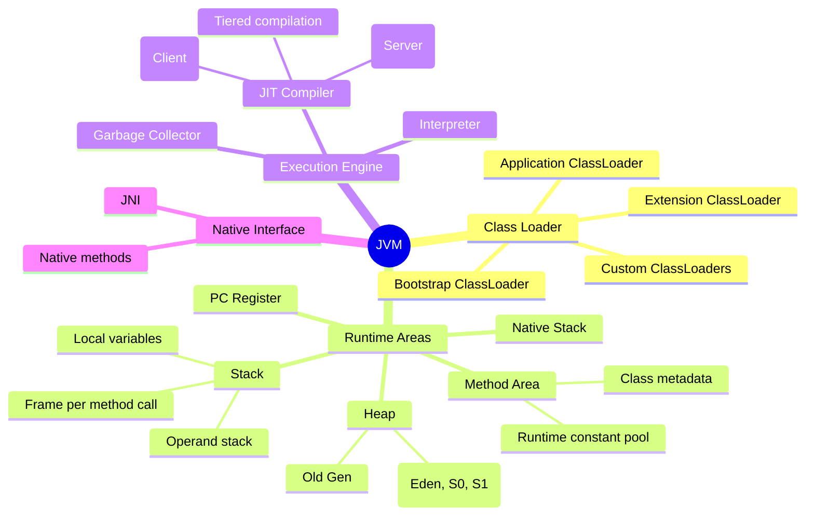
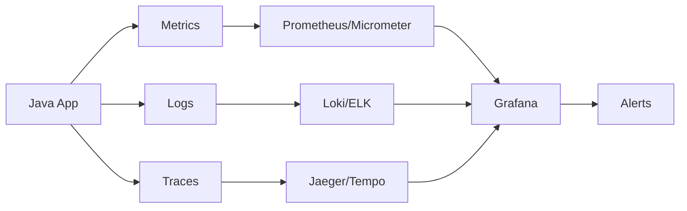

# ⚙️ JVM Architecture & Class Loading — Complete Deep Dive

**Related**: [Java Memory Model & GC](06-java-memory-gc.md) · [Multithreading & Concurrency](04-multithreading.md) · [OOP Concepts](01-oop-concepts.md)

---

## Layer 1: Beginner Mental Model

#### Step-by-Step
1. Process input
2. Validate
3. Execute
4. Return result

#### Code Example
```python
# Example implementation
pass
```

#### Real-World Scenario
This pattern is commonly used in production systems.


**Analogy**: JVM is like a theater. Script (bytecode) is language-agnostic (Java, Kotlin, Scala all compile to same bytecode). Director (JIT compiler) watches the script, recognizes popular scenes, pre-records them (optimizes hot code). Props (objects) stored in warehouse (heap). Actors (threads) read from script.

**Why it matters**:
- **Netflix backend**: 10,000 services in Java. Without JVM optimization (JIT), Netflix wouldn't exist at current scale.
- **Google**: Runs 1M+ JVMs in data centers. JVM GC tuning saves millions in hardware.
- **Trading**: Ultra-low latency requires JIT warmup + GC tuning. Goldman Sachs engineers spend weeks tuning JVMs.
- **Cost**: A well-tuned JVM outperforms Python by 100x on compute-heavy tasks. That's the difference between $100K server and $10M server.

**Core insight**: JVM starts slow (interpreted), learns (profiled), optimizes (JIT compiled). Warm JVM is faster than cold.

---

## Layer 4: Production Reality

#### Step-by-Step
1. Process input
2. Validate
3. Execute
4. Return result

#### Code Example
```python
# Example implementation
pass
```

#### Real-World Scenario
This pattern is commonly used in production systems.


### JVM Failure Modes

#### Step-by-Step
1. Process input
2. Validate
3. Execute
4. Return result

#### Code Example
```python
# Example implementation
pass
```

#### Real-World Scenario
This pattern is commonly used in production systems.


| Failure | Symptoms | Root Cause | Fix |
|---------|----------|-----------|-----|
| **GC Pause Spike** | P99 latency 1-5 seconds | Full GC triggered (heap fragmented), STW pause | Use low-latency GC (ZGC, Shenandoah), tune heap size |
| **Class Unloading Hang** | Metadata space grows forever | Classes loaded but never unloaded (ClassLoader leak) | Use jcmd to dump heap, find ClassLoader references, fix code |
| **JIT Compilation Queue Overflow** | Throughput 50% normal | Compiler threads busy, methods waiting to compile | Increase -XX:CICompilerCount or use tiered compilation |
| **Bytecode Verification Bottleneck** | Startup takes 30s (should be 5s) | Class verification is slow (large classes, deep inheritance) | Use AppCDS (app class data sharing), pre-verify in build |
| **Safepoint Timeout** | Threads hang, never respond | GC waiting for safepoint, some thread stuck in native code | Add -XX:+SafepointTimeout, profile native code |
| **Memory Leak in Heap Dump** | Dump 50GB (heap only 8GB) | External buffers, NIO direct buffers not released | Profile with jcmd, find allocation sites, fix |
| **Stack Overflow in Recursion** | Sudden crash, no OutOfMemoryError | Recursive call goes too deep (missed base case) | Fix recursion depth, use iteration, increase stack (-Xss) |
| **Synchronized Contention** | Lock wait times dominate CPU | Many threads competing for same lock | Use concurrent collections (ConcurrentHashMap), reduce synchronization |

### Production Incident: LinkedIn GC Tuning Crisis (2012)

#### Step-by-Step
1. Process input
2. Validate
3. Execute
4. Return result

#### Code Example
```python
# Example implementation
pass
```

#### Real-World Scenario
This pattern is commonly used in production systems.


**Context**: LinkedIn's search infrastructure used Java. During peak (Thanksgiving week), GC pauses spiked to 5+ seconds. Search latency degraded, user experience terrible.

**What happened**:
- Search service: 100GB heap, default GC (Parallel GC)
- Parallel GC: every 30s, full collection (mark all 100GB objects)
- Mark phase: 5 seconds on 16-core machine (bottleneck)
- Users hitting search → waiting 5s for response → timeout
- Peak traffic + Full GC = cascade failure

**The bug**:
```java
// ❌ Buggy: default GC, large heap
java -Xmx100g -jar search-service.jar
// Uses Parallel GC by default
// Mark phase on 100GB = 5+ seconds
```

**The fix**:
```java
// ✅ Fixed: use low-latency GC, smaller heap + G1GC
java -Xmx50g \
  -XX:+UseG1GC \
  -XX:MaxGCPauseMillis=100 \
  -XX:InitiatingHeapOccupancyPercent=35 \
  -jar search-service.jar

// Alternative: use ZGC (Java 15+, <10ms pauses)
java -XX:+UnlockExperimentalVMOptions -XX:+UseZGC -Xmx100g
```

**Result**: GC pauses reduced from 5000ms → 100ms. User searches responsive again. Incident resolved.

---

## Layer 5: Staff Engineer Perspective

#### Step-by-Step
1. Process input
2. Validate
3. Execute
4. Return result

#### Code Example
```python
# Example implementation
pass
```

#### Real-World Scenario
This pattern is commonly used in production systems.


### GC Algorithm Tradeoffs

#### Step-by-Step
1. Process input
2. Validate
3. Execute
4. Return result

#### Code Example
```python
# Example implementation
pass
```

#### Real-World Scenario
This pattern is commonly used in production systems.


| GC | Pause Time | Throughput | Latency | Cost |
|----|-----------|-----------|---------|------|
| **Parallel** | 0.5-5s | High (95%) | Varies | Low |
| **G1GC** | 10-200ms | Good (90%) | Predictable | Medium |
| **ZGC** | <10ms | Good (90%) | Ultra-low | High (CPU) |
| **Shenandoah** | <10ms | Varies | Ultra-low | High (CPU) |

### Scaling Pattern: Startup → 1000 Services

#### Step-by-Step
1. Process input
2. Validate
3. Execute
4. Return result

#### Code Example
```python
# Example implementation
pass
```

#### Real-World Scenario
This pattern is commonly used in production systems.


**Stage 1**: Single JVM, 4GB heap, default GC
- Pause time: 500ms (acceptable for batch)
- Cost: $50/month

**Stage 2**: 10 JVMs, 16GB heap each, G1GC
- Pause time: <100ms (Web acceptable)
- Monitoring: track GC metrics, alert on >200ms pauses
- Cost: $500/month

**Stage 3**: 100 JVMs, 32GB heap, ZGC (Java 15+)
- Pause time: <10ms (real-time acceptable)
- AppCDS for faster startup
- Cost: $5K/month

**Stage 4 (LinkedIn scale)**: 1000+ JVMs, tiered architecture
- Different GC per workload (batch = Parallel, web = ZGC)
- Custom collector optimizations
- Cost: $50K+/month

---

## Layer 5: Interview Questions

#### Step-by-Step
1. Process input
2. Validate
3. Execute
4. Return result

#### Code Example
```python
# Example implementation
pass
```

#### Real-World Scenario
This pattern is commonly used in production systems.


### Level 1 (Junior)

#### Step-by-Step
1. Process input
2. Validate
3. Execute
4. Return result

#### Code Example
```python
# Example implementation
pass
```

#### Real-World Scenario
This pattern is commonly used in production systems.


**Q1: What's bytecode? Why does Java compile to bytecode?**
A: Bytecode = intermediate representation (JVM's machine code). Platform-independent: one bytecode, runs on any JVM (Windows, Linux, Mac). Interpreter + JIT compiler can optimize at runtime.
- Why asked: Cross-platform benefit
- Expected: Understand write-once-run-anywhere, JIT opportunity

**Q2: What's JIT compilation? How does it speed up Java?**
A: JIT = Just-In-Time compiler. JVM watches which code runs frequently (profiling), compiles to native machine code (much faster than interpreted). Result: Java fast after warmup.
- Why asked: Runtime optimization
- Expected: Profile → compile, understand warmup time

### Level 2 (Mid-Level)

#### Step-by-Step
1. Process input
2. Validate
3. Execute
4. Return result

#### Code Example
```python
# Example implementation
pass
```

#### Real-World Scenario
This pattern is commonly used in production systems.


**Q3: Your service has 2-second GC pauses. How do you investigate?**
A:
- Use `-XX:+PrintGCDetails` to see which GC phase is slow
- Check `-XX:+PrintGCDateStamps` timing
- Profile with JFR (jcmd Recording)
- If mark phase slow: too many objects to scan → reduce heap
- If parallel threads slow: not enough GC threads → tune CICompilerCount
- Solution: switch to low-latency GC (G1GC, ZGC)
- Why asked: Diagnosis
- Expected: Know tools, know solutions

**Q4: Explain class loading. Why are there multiple ClassLoaders?**
A: ClassLoaders load .class files (bytecode). Bootstrap = core JDK, Application = your code. Multiple loaders = isolation (different versions of same library in different parts of app). Delegation: child asks parent before loading.
- Why asked: Modularity, class path
- Expected: Understand hierarchy, delegation model

### Level 3 (Senior)

#### Step-by-Step
1. Process input
2. Validate
3. Execute
4. Return result

#### Code Example
```python
# Example implementation
pass
```

#### Real-World Scenario
This pattern is commonly used in production systems.


**Q5: Design JVM tuning for high-frequency trading (ultra-low latency <1ms).**
A:
- GC: ZGC (pause <10ms), Shenandoah alternative
- Heap: 20-30GB (balance pause time vs memory)
- Warmup: run 30min before trading (JIT warmup, class loading)
- Monitoring: track GC pause distribution (p50/p99)
- Compilation: tiered compilation (C1 fast, C2 optimal)
- Isolation: pin process to CPU cores, disable SMT, avoid GC during market hours
- Testing: chaos test (kill threads, trigger GC, verify latency)
- Why asked: Latency SLA
- Expected: Multiple tuning levers, warmup strategy, monitoring

**Q6: You're debugging an OutOfMemoryError. Describe the approach.**
A:
1. Get heap dump: `jcmd <pid> GC.heap_dump heapdump.hprof`
2. Analyze: use Eclipse MAT or Netbeans to find largest objects
3. Check: are objects leaking (unreferenced but not GC'd)?
4. Find: which ClassLoader / thread / object references prevent GC?
5. Fix: remove strong references, use WeakReference if needed
6. Validate: reproduce scenario, verify no leak
7. Monitor: set up continuous heap monitoring (jcmd periodic dumps)
- Why asked: Troubleshooting skillz
- Expected: Know heap dump tools, analysis process

### Level 4 (Staff)

#### Step-by-Step
1. Process input
2. Validate
3. Execute
4. Return result

#### Code Example
```python
# Example implementation
pass
```

#### Real-World Scenario
This pattern is commonly used in production systems.


**Q7: Migrate 500 Java services from OpenJDK 8 to Java 21. Plan.**
A:
- Phase 1 (4 weeks): Compatibility testing (Java 21 LTS vs 8)
- Phase 2 (2 weeks): Parallel run (Java 8 + Java 21 on same hardware) → compare latency
- Phase 3 (4 weeks): Rollout by service: dev → staging → prod, 25% → 50% → 100%
- Benefits: GC improvements (ZGC available), performance (JIT improvements), new APIs
- Risks: incompatible libs, deprecated APIs, behavioral changes
- Rollback: keep Java 8 containers, revert if issues found
- Cost: testing overhead, but future payoff (better GC, performance)
- Timeline: 3 months total, ongoing monitoring for 1 month
- Why asked: Large migration, risk management
- Expected: Phased approach, testing, rollback plan

**Q8: Compare Java vs Go for backend service (100K req/sec, <50ms p99 latency).**
A:
- Java: startup slow (JVM boot), warm JVM = 100K+ req/sec possible, p99 = 30ms (with GC tuning)
- Go: startup instant, throughput limited (single-threaded GC), p99 = 20ms (no STW)
- Java: more tooling, easier debugging (jcmd, jvisualvm)
- Go: simpler deployment, fewer knobs to tune
- Choice: Java for existing ecosystem (Spring, already optimized), Go for new ultra-high-concurrency services
- Cost: Java = more ops tuning, Go = simpler ops but different language
- For Stripe scale: Java + ZGC (low-latency GC) competitive with Go
- Why asked: Language tradeoff, production considerations
- Expected: Understand strengths (Java GC ecosystem, Go simplicity), cost/benefit

---

## Table of Contents

#### Step-by-Step
1. Process input
2. Validate
3. Execute
4. Return result

#### Code Example
```python
# Example implementation
pass
```

#### Real-World Scenario
This pattern is commonly used in production systems.


- [JVM Architecture Overview](#-jvm-architecture-overview)
- [1. Class Loader Subsystem](#1-class-loader-subsystem)
- [2. Runtime Data Areas](#2-runtime-data-areas)
- [3. Execution Engine](#3-execution-engine)
- [4. Java Bytecode Basics](#4-java-bytecode-basics)
- [5. Just-In-Time (JIT) Compilation](#5-just-in-time-jit-compilation)
- [6. Class Loading Deep Dive](#6-class-loading-deep-dive)
- [7. Method Area & Constant Pool](#7-method-area--constant-pool)
- [8. Stack & Stack Frames](#8-stack--stack-frames)
- [9. JVM Tuning](#9-jvm-tuning)
- [Common Pitfalls](#-common-pitfalls)
- [Simplest Mental Model](#-simplest-mental-model)

---

## 🧭 JVM Architecture Overview

#### Step-by-Step
1. Process input
2. Validate
3. Execute
4. Return result

#### Code Example
```python
# Example implementation
pass
```

#### Real-World Scenario
This pattern is commonly used in production systems.


```text
                    ┌──────────────────────────────────────────────┐
                    │           JVM Architecture                   │
                    ├──────────────────────────────────────────────┤
                    │  ┌────────────────────────────────────────┐  │
                    │  │     Class Loader Subsystem              │  │
                    │  │  Loading → Linking → Initialization    │  │
                    │  └────────────────────────────────────────┘  │
                    │                     │                         │
                    │                     ▼                         │
                    │  ┌────────────────────────────────────────┐  │
                    │  │        Runtime Data Areas              │  │
                    │  ├──────────────┬───────────┬────────────┤  │
                    │  │  Method Area │   Heap    │ Stack      │  │
                    │  │  (Class data)│ (Objects) │ (Frames)   │  │
                    │  ├──────────────┴───────────┴────────────┤  │
                    │  │  PC Registers   │ Native Method Stack │  │
                    │  └───────────────────────────────────────┘  │
                    │                     │                         │
                    │                     ▼                         │
                    │  ┌────────────────────────────────────────┐  │
                    │  │         Execution Engine                │  │
                    │  ├────────────────┬───────────────────────┤  │
                    │  │  Interpreter   │  JIT Compiler (C1/C2) │  │
                    │  ├────────────────┴───────────────────────┤  │
                    │  │  Garbage Collector                      │  │
                    │  └────────────────────────────────────────┘  │
                    │                     │                         │
                    │                     ▼                         │
                    │  ┌────────────────────────────────────────┐  │
                    │  │      Native Interface (JNI)            │  │
                    │  └────────────────────────────────────────┘  │
                    └──────────────────────────────────────────────┘
```



---

## 1. Class Loader Subsystem

#### Step-by-Step
1. Process input
2. Validate
3. Execute
4. Return result

#### Code Example
```python
# Example implementation
pass
```

#### Real-World Scenario
This pattern is commonly used in production systems.


### Three Built-in ClassLoaders

#### Step-by-Step
1. Process input
2. Validate
3. Execute
4. Return result

#### Code Example
```python
# Example implementation
pass
```

#### Real-World Scenario
This pattern is commonly used in production systems.


```text
                    ┌─────────────────────────────────────────────┐
                    │       ClassLoader Hierarchy                 │
                    ├─────────────────────────────────────────────┤
                    │                                             │
                    │  ┌─────────────────────────────────────┐   │
                    │  │   Bootstrap ClassLoader (C++)       │   │
                    │  │   loads: rt.jar, java.*, javax.*   │   │
                    │  │   parent: null                      │   │
                    │  └──────────────┬──────────────────────┘   │
                    │                 │                           │
                    │  ┌──────────────┴──────────────────────┐   │
                    │  │   Extension (Platform) ClassLoader  │   │
                    │  │   loads: jre/lib/ext/*.jar          │   │
                    │  │   parent: Bootstrap                 │   │
                    │  └──────────────┬──────────────────────┘   │
                    │                 │                           │
                    │  ┌──────────────┴──────────────────────┐   │
                    │  │   Application (System) ClassLoader  │   │
                    │  │   loads: classpath, -cp             │   │
                    │  │   parent: Extension                 │   │
                    │  └─────────────────────────────────────┘   │
                    │                                             │
                    │  ┌─────────────────────────────────────┐   │
                    │  │   Custom ClassLoader (user-defined) │   │
                    │  │   parent: Application               │   │
                    │  └─────────────────────────────────────┘   │
                    └─────────────────────────────────────────────┘
```

### Class Loading Phases

#### Step-by-Step
1. Process input
2. Validate
3. Execute
4. Return result

#### Code Example
```python
# Example implementation
pass
```

#### Real-World Scenario
This pattern is commonly used in production systems.


```text
┌─────────────────────────────────────────────────────────────────┐
│                    Class Loading Process                        │
├─────────────────────────────────────────────────────────────────┤
│                                                                 │
│  1. LOADING                                                     │
│     ┌──────────────────────────────────────────────────────┐    │
│     │ Find .class bytecode → Read → Create Class<Name>    │    │
│     │ object in Method Area                                │    │
│     └──────────────────────────────────────────────────────┘    │
│                              │                                   │
│                              ▼                                   │
│  2. LINKING                                                      │
│     a. VERIFY                                                   │
│        ┌──────────────────────────────────────────────────────┐  │
│        │ Check bytecode validity: format, sema ntics,         │  │
│        │ bytecode verifier ensures no stack overflow/         │  │
│        │ underflow, types correct, etc.                       │  │
│        └──────────────────────────────────────────────────────┘  │
│                              │                                   │
│     b. PREPARE                                                   │
│        ┌──────────────────────────────────────────────────────┐  │
│        │ Allocate static fields with default values           │  │
│        │ (0, null, false). NOT executing initializers yet.    │  │
│        └──────────────────────────────────────────────────────┘  │
│                              │                                   │
│     c. RESOLVE                                                  │
│        ┌──────────────────────────────────────────────────────┐  │
│        │ Symbolic references → direct references              │  │
│        │ (Optional: can be deferred until first use)          │  │
│        └──────────────────────────────────────────────────────┘  │
│                              │                                   │
│                              ▼                                   │
│  3. INITIALIZATION                                               │
│     ┌──────────────────────────────────────────────────────┐    │
│     │ Execute static initializers:                         │    │
│     │ - static variable assignments                        │    │
│     │ - static { } blocks                                  │    │
│     │ - JVM guarantees single-threaded init per class      │    │
│     └──────────────────────────────────────────────────────┘    │
│                                                                 │
└─────────────────────────────────────────────────────────────────┘
```

### Parent Delegation Model

#### Step-by-Step
1. Process input
2. Validate
3. Execute
4. Return result

#### Code Example
```python
# Example implementation
pass
```

#### Real-World Scenario
This pattern is commonly used in production systems.


```java
// How ClassLoader.loadClass() works:
protected Class<?> loadClass(String name, boolean resolve)
        throws ClassNotFoundException {
    // 1. Check if already loaded
    Class<?> c = findLoadedClass(name);
    if (c == null) {
        try {
            // 2. Delegate to parent first
            if (parent != null) {
                c = parent.loadClass(name, false);
            } else {
                // 3. Bootstrap ClassLoader (null parent)
                c = findBootstrapClassOrNull(name);
            }
        } catch (ClassNotFoundException e) {
            // 4. Parent didn't find it → try own
            c = findClass(name);
        }
    }
    if (resolve) {
        resolveClass(c);
    }
    return c;
}
```

### Custom ClassLoader

#### Step-by-Step
1. Process input
2. Validate
3. Execute
4. Return result

#### Code Example
```python
# Example implementation
pass
```

#### Real-World Scenario
This pattern is commonly used in production systems.


```java
public class FileClassLoader extends ClassLoader {
    private final String directory;

    public FileClassLoader(String directory, ClassLoader parent) {
        super(parent);
        this.directory = directory;
    }

    @Override
    protected Class<?> findClass(String name) throws ClassNotFoundException {
        String path = directory + File.separator
            + name.replace('.', File.separatorChar) + ".class";
        try {
            byte[] bytes = Files.readAllBytes(Paths.get(path));
            // defineClass creates the Class object from bytecode
            return defineClass(name, bytes, 0, bytes.length);
        } catch (IOException e) {
            throw new ClassNotFoundException(name, e);
        }
    }

    // Break parent delegation (for specific packages)
    @Override
    protected Class<?> loadClass(String name, boolean resolve)
            throws ClassNotFoundException {
        // Load our classes ourselves, delegate everything else
        if (name.startsWith("com.myapp.")) {
            Class<?> c = findLoadedClass(name);
            if (c == null) {
                c = findClass(name);
            }
            if (resolve) resolveClass(c);
            return c;
        }
        return super.loadClass(name, resolve);
    }
}
```

### Why Parent Delegation?

#### Step-by-Step
1. Process input
2. Validate
3. Execute
4. Return result

#### Code Example
```python
# Example implementation
pass
```

#### Real-World Scenario
This pattern is commonly used in production systems.


| Benefit | Explanation |
|---------|-------------|
| Security | Core java.* classes never replaced by malicious code |
| Uniqueness | Each class loaded once by same loader |
| Hierarchy | Clear visibility rules |
| Sandbox | Custom loaders can't tamper with platform classes |

---

## 2. Runtime Data Areas

#### Step-by-Step
1. Process input
2. Validate
3. Execute
4. Return result

#### Code Example
```python
# Example implementation
pass
```

#### Real-World Scenario
This pattern is commonly used in production systems.


### Memory Layout

#### Step-by-Step
1. Process input
2. Validate
3. Execute
4. Return result

#### Code Example
```python
# Example implementation
pass
```

#### Real-World Scenario
This pattern is commonly used in production systems.


```text
                    ┌──────────────────────────────────────┐
                    │       JVM Memory Model                │
                    ├──────────────────────────────────────┤
                    │                                       │
                    │  ┌─────────────┐  THREAD 1           │
                    │  │   Stack     │  ┌──────────────┐   │
                    │  │  Frame 1    │  │  PC Register │   │
                    │  │  Frame 2    │  └──────────────┘   │
                    │  │  ...        │                      │
                    │  └─────────────┘                      │
                    │  ┌─────────────┐  THREAD 2           │
                    │  │   Stack     │  ┌──────────────┐   │
                    │  │  Frame 1    │  │  PC Register │   │
                    │  │  ...        │  └──────────────┘   │
                    │  └─────────────┘                      │
                    │                                       │
                    │  ┌──────────────────────────────────┐ │
                    │  │          HEAP                    │ │
                    │  │  ┌───────────┬────────┬────────┐ │ │
                    │  │  │  Eden     │  S0    │  S1    │ │ │
                    │  │  ├───────────┴────────┴────────┤ │ │
                    │  │  │        Old Generation        │ │ │
                    │  │  ├─────────────────────────────┤ │ │
                    │  │  │      Metaspace (native)     │ │ │
                    │  │  └─────────────────────────────┘ │ │
                    │  └──────────────────────────────────┘ │
                    │                                       │
                    │  ┌──────────────────────────────────┐ │
                    │  │      Method Area                  │ │
                    │  │  (Class data, Constant Pool)      │ │
                    │  └──────────────────────────────────┘ │
                    │                                       │
                    └──────────────────────────────────────┘
```

### Area Breakdown

#### Step-by-Step
1. Process input
2. Validate
3. Execute
4. Return result

#### Code Example
```python
# Example implementation
pass
```

#### Real-World Scenario
This pattern is commonly used in production systems.


| Area | Shared? | What it contains | Size Control |
|------|---------|-----------------|--------------|
| Heap | ✅ All threads | Objects, arrays, String pool | `-Xms`, `-Xmx` |
| Stack | ❌ Per thread | Frames, locals, partial results | `-Xss` |
| Method Area | ✅ All threads | Class metadata, constant pool, static vars | `-XX:MaxMetaspaceSize` |
| PC Register | ❌ Per thread | Address of current instruction | Fixed |
| Native Stack | ❌ Per thread | Native method calls | `-Xss` |

### Heap Structure (Generational)

#### Step-by-Step
1. Process input
2. Validate
3. Execute
4. Return result

#### Code Example
```python
# Example implementation
pass
```

#### Real-World Scenario
This pattern is commonly used in production systems.


```text
                    ┌─────────────────────────────────────────────┐
                    │              HEAP                           │
                    ├─────────────────────────────────────────────┤
                    │                                             │
                    │  YOUNG GENERATION (1/3 of heap)            │
                    │  ┌─────────────────────────────────────────┐│
                    │  │  Eden (80%)                             ││
                    │  │  New objects allocated here             ││
                    │  │  Minor GC: survive → S0/S1, else die   ││
                    │  ├──────────────────┬──────────────────────┤│
                    │  │  S0 (10%)       │  S1 (10%)            ││
                    │  │  From survivor   │  To survivor         ││
                    │  │  (swap on GC)   │                      ││
                    │  └──────────────────┴──────────────────────┘│
                    │                                             │
                    │  OLD GENERATION (2/3 of heap)               │
                    │  ┌─────────────────────────────────────────┐│
                    │  │  Tenured                                ││
                    │  │  Objects surviving many Minor GC cycles││
                    │  │  Major GC collects here                 ││
                    │  └─────────────────────────────────────────┘│
                    │                                             │
                    │  METASPACE (Native Memory)                   │
                    │  ┌─────────────────────────────────────────┐│
                    │  │  Class metadata, method bytecode        ││
                    │  │  Constants, static variables            ││
                    │  │  Auto-grows (no MaxMetaspaceSize limit) ││
                    │  └─────────────────────────────────────────┘│
                    │                                             │
                    └─────────────────────────────────────────────┘
```

### Stack Frame Structure

#### Step-by-Step
1. Process input
2. Validate
3. Execute
4. Return result

#### Code Example
```python
# Example implementation
pass
```

#### Real-World Scenario
This pattern is commonly used in production systems.


```text
Each method call creates a Stack Frame:

┌───────────────────────────────────────────────┐
│               Stack Frame                      │
├───────────────────────────────────────────────┤
│  Local Variable Array                          │
│  ┌───┬───┬───┬───┬───┬───┬───┬───┬────────┐  │
│  │this│arg1│arg2│var1│var2│...│    │        │  │
│  │  0 │  1 │  2 │  3 │  4 │   │  8 │  15   │  │
│  ├───┴───┴───┴───┴───┴───┴───┴───┴────────┤  │
│  │  - Index 0 = 'this' (non-static methods) │  │
│  │  - primitives stored directly            │  │
│  │  - references stored as pointers         │  │
│  ├───────────────────────────────────────────┤  │
│  │  Operand Stack                            │  │
│  │  ┌─────────────────────────┐              │  │
│  │  │  Push/pop operations    │              │  │
│  │  │  Intermediate results   │              │  │
│  │  │  Method call arguments  │              │  │
│  │  └─────────────────────────┘              │  │
│  ├───────────────────────────────────────────┤  │
│  │  Reference to Runtime Constant Pool       │  │
│  ├───────────────────────────────────────────┤  │
│  │  Return Address (where to continue after) │  │
│  └───────────────────────────────────────────┘  │
└───────────────────────────────────────────────┘
```

---

## 3. Execution Engine

#### Step-by-Step
1. Process input
2. Validate
3. Execute
4. Return result

#### Code Example
```python
# Example implementation
pass
```

#### Real-World Scenario
This pattern is commonly used in production systems.


### Interpreter + JIT Workflow

#### Step-by-Step
1. Process input
2. Validate
3. Execute
4. Return result

#### Code Example
```python
# Example implementation
pass
```

#### Real-World Scenario
This pattern is commonly used in production systems.


```text
                    ┌─────────────────────────┐
                    │   Bytecode Stream       │
                    └────────────┬────────────┘
                                 │
                    ┌────────────┴────────────┐
                    │                         │
                    ▼                         ▼
        ┌──────────────────┐       ┌──────────────────┐
        │   Interpreter    │       │   JIT Compiler   │
        │                  │       │                  │
        │ Reads bytecode   │       │ Compiles hot     │
        │ one instruction  │──────►│ methods to       │
        │ at a time        │       │ native machine   │
        │ Executes slowly  │       │ code             │
        │ but starts fast  │       │ Fast execution   │
        └──────────────────┘       └────────┬─────────┘
                 │                           │
                 ▼                           ▼
        ┌─────────────────────────────────────────┐
        │       Execution to Hardware              │
        │       (CPU executes native code)         │
        └──────────────────────────────────────────┘
```

### JIT Compilation Tiers (Java 8+ Tiered Compilation)

#### Step-by-Step
1. Process input
2. Validate
3. Execute
4. Return result

#### Code Example
```python
# Example implementation
pass
```

#### Real-World Scenario
This pattern is commonly used in production systems.


```text
Level 0: Interpreted       — No compilation. Gather profiling data.
Level 1: Simple C1 (C1)    — No profiling, full optimization.
Level 2: Limited C1        — Light profiling.
Level 3: Full C1           — Full profiling (method entry, back branches, etc.)
Level 4: C2 (Server)       — Aggressive optimization from profiling data.

Common path:
  ┌──────────────────┐
  │  0: Interpreted  │──── slow start, gather profiling data
  └────────┬─────────┘
           │
           ▼
  ┌──────────────────┐
  │  3: Full C1      │──── fuller profiling
  └────────┬─────────┘
           │
           ▼
  ┌──────────────────┐
  │  4: C2 (Server)  │──── highly optimized native code
  └──────────────────┘

JIT Thresholds:
  -XX:Tier3CompileThreshold  = 2000 (method invocations before C1)
  -XX:Tier4CompileThreshold  = 15000 (method invocations before C2)
  -XX:CompileThreshold       = 10000 (when tiered compilation off)
```

### JIT Optimizations

#### Step-by-Step
1. Process input
2. Validate
3. Execute
4. Return result

#### Code Example
```python
# Example implementation
pass
```

#### Real-World Scenario
This pattern is commonly used in production systems.


| Optimization | Description |
|-------------|-------------|
| Method Inlining | Replace method call with method body |
| Loop Unrolling | Duplicate loop body to reduce branches |
| Escape Analysis | Allocate objects on stack if they don't escape |
| Lock Coarsening | Merge adjacent synchronized blocks |
| Lock Elision | Remove locks on objects only accessed by one thread |
| Dead Code Elimination | Remove unused computations |
| Constant Folding | Pre-compute constant expressions |
| Intrinsics | Replace known methods with native CPU instructions |
| Null Check Elimination | Remove redundant null checks |
| Type Specialization | Devirtualize interface calls at monomorphic sites |

### Escape Analysis Example

#### Step-by-Step
1. Process input
2. Validate
3. Execute
4. Return result

#### Code Example
```python
# Example implementation
pass
```

#### Real-World Scenario
This pattern is commonly used in production systems.


```java
// Without escape analysis — allocates on heap
public String concat(String a, String b) {
    StringBuilder sb = new StringBuilder();  // heap allocation
    sb.append(a);
    sb.append(b);
    return sb.toString();
}

// JIT with escape analysis:
// sb never escapes → stack allocation (or scalar replacement)
// Allocate fields on stack directly instead of object
// Equivalent to:
public String concat(String a, String b) {
    char[] buffer = stackAlloc();  // conceptually
    // operations on buffer directly
    return new String(buffer);
}
```

---

## 4. Java Bytecode Basics

#### Step-by-Step
1. Process input
2. Validate
3. Execute
4. Return result

#### Code Example
```python
# Example implementation
pass
```

#### Real-World Scenario
This pattern is commonly used in production systems.


### Example: Simple Method → Bytecode

#### Step-by-Step
1. Process input
2. Validate
3. Execute
4. Return result

#### Code Example
```python
# Example implementation
pass
```

#### Real-World Scenario
This pattern is commonly used in production systems.


```java
// Source code
public int add(int a, int b) {
    return a + b;
}

// Bytecode (javap -c output)
// 0: iload_1       // push local variable 1 (a) onto operand stack
// 1: iload_2       // push local variable 2 (b) onto operand stack
// 2: iadd          // pop two ints, add them, push result
// 3: ireturn       // return int value
```

### Example: Object Creation

#### Step-by-Step
1. Process input
2. Validate
3. Execute
4. Return result

#### Code Example
```python
# Example implementation
pass
```

#### Real-World Scenario
This pattern is commonly used in production systems.


```java
// Source code
public String createMessage() {
    return new String("Hello");
}

// Bytecode
// 0: new           #7   // class java/lang/String
// 3: dup                // duplicate reference
// 4: ldc           #9   // String "Hello"
// 6: invokespecial #10  // Method "<init>":(Ljava/lang/String;)V
// 9: areturn            // return reference
```

### Common JVM Instructions

#### Step-by-Step
1. Process input
2. Validate
3. Execute
4. Return result

#### Code Example
```python
# Example implementation
pass
```

#### Real-World Scenario
This pattern is commonly used in production systems.


| Category | Instructions |
|----------|-------------|
| Load/Store | `aload`, `iload`, `lload`, `fload`, `dload`, `astore`, `istore` |
| Arithmetic | `iadd`, `isub`, `imul`, `idiv`, `irem`, `ineg` |
| Object | `new`, `getfield`, `putfield`, `getstatic`, `putstatic` |
| Array | `newarray`, `aaload`, `aastore`, `arraylength` |
| Stack | `dup`, `pop`, `swap`, `dup_x1` |
| Conversion | `i2l`, `l2f`, `f2d`, `i2b`, `i2c`, `i2s` |
| Comparison | `if_icmpeq`, `if_icmpne`, `if_icmplt`, `if_icmpgt`, `lcmp` |
| Control | `goto`, `ifeq`, `ifne`, `tableswitch`, `lookupswitch` |
| Invocation | `invokevirtual`, `invokespecial`, `invokestatic`, `invokeinterface`, `invokedynamic` |
| Return | `ireturn`, `lreturn`, `freturn`, `dreturn`, `areturn`, `return` |

### Method Invocation Instructions

#### Step-by-Step
1. Process input
2. Validate
3. Execute
4. Return result

#### Code Example
```python
# Example implementation
pass
```

#### Real-World Scenario
This pattern is commonly used in production systems.


| Instruction | Used For | Resolution |
|-------------|----------|------------|
| `invokevirtual` | Instance method call (virtual dispatch) | Vtable lookup at runtime |
| `invokespecial` | Constructor `<init>`, `super`, `private` | Compile-time (no virtual dispatch) |
| `invokestatic` | Static method | Compile-time |
| `invokeinterface` | Interface method call | Itable lookup at runtime |
| `invokedynamic` | Lambda, dynamic languages (Java 7+) | Bootstrap method at runtime |

---

## 5. Just-In-Time (JIT) Compilation

#### Step-by-Step
1. Process input
2. Validate
3. Execute
4. Return result

#### Code Example
```python
# Example implementation
pass
```

#### Real-World Scenario
This pattern is commonly used in production systems.


### Compilation Flow

#### Step-by-Step
1. Process input
2. Validate
3. Execute
4. Return result

#### Code Example
```python
# Example implementation
pass
```

#### Real-World Scenario
This pattern is commonly used in production systems.


```text
HotSpot Detection:
    Method invoked repeatedly → reaches threshold → JIT compiles

                    ┌─────────────────────┐
                    │ Method Invocations  │
                    │ Counter increments  │
                    └──────────┬──────────┘
                               │
                    threshold reached?
                               │
                    ┌──────────┴──────────┐
                    │                     │
                    YES                   NO
                    │                     │
                    ▼                     ▼
          ┌─────────────────┐   ┌─────────────────┐
          │ Queued for JIT  │   │ Keep interpreting│
          │ (compiler thread)│   └─────────────────┘
          └────────┬────────┘
                   │
                   ▼
          ┌─────────────────┐
          │ Compile to      │
          │ native code     │
          └────────┬────────┘
                   │
                   ▼
          ┌─────────────────┐
          │ Install in      │
          │ Code Cache      │
          │ Replace method  │
          │ entry point    │
          └─────────────────┘
                   │
                   ▼
          ┌─────────────────┐
          │ On-Stack        │
          │ Replacement (OSR)│
          │ Switch from     │
          │ interpreted to  │
          │ compiled code   │
          │ (even mid-loop!)│
          └─────────────────┘
```

### Code Cache

#### Step-by-Step
1. Process input
2. Validate
3. Execute
4. Return result

#### Code Example
```python
# Example implementation
pass
```

#### Real-World Scenario
This pattern is commonly used in production systems.


```text
-XX:InitialCodeCacheSize  = 255KB (typical)
-XX:ReservedCodeCacheSize = 240MB (Java 8+)

┌──────────────────────────────────┐
│         Code Cache               │
├──────────────────────────────────┤
│  ┌────────────────────────┐     │
│  │ Compiled native code   │     │
│  │ for Hot Methods        │     │
│  │ (C1 + C2 compiled)     │     │
│  ├────────────────────────┤     │
│  │ VM internal code       │     │
│  │ (Interpreter adapters) │     │
│  ├────────────────────────┤     │
│  │ Profiling data         │     │
│  │ (for C1/C2 decisions)  │     │
│  └────────────────────────┘     │
└──────────────────────────────────┘
```

### Deoptimization

#### Step-by-Step
1. Process input
2. Validate
3. Execute
4. Return result

#### Code Example
```python
# Example implementation
pass
```

#### Real-World Scenario
This pattern is commonly used in production systems.


```java
// When assumptions change, JIT must deoptimize back to interpreter
// Example: class hierarchy changes
class A { void foo() { /* compiled assuming no override */ } }

// Later: class B extends A { @Override void foo() { ... } }
// JIT detects change → deoptimizes call sites
// Falls back to interpreted execution or recompiles
```

---

## 6. Class Loading Deep Dive

#### Step-by-Step
1. Process input
2. Validate
3. Execute
4. Return result

#### Code Example
```python
# Example implementation
pass
```

#### Real-World Scenario
This pattern is commonly used in production systems.


### Loading a Class: Step by Step

#### Step-by-Step
1. Process input
2. Validate
3. Execute
4. Return result

#### Code Example
```python
# Example implementation
pass
```

#### Real-World Scenario
This pattern is commonly used in production systems.


```java
public class ClassLoadingDemo {
    public static void main(String[] args) throws Exception {
        // Triggers loading of ChildClass
        ChildClass child = new ChildClass();
    }
}

class ParentClass {
    static final int CONSTANT = 100;  // compile-time constant → inlined
    static int staticField = initStatic();

    static {
        System.out.println("ParentClass static init");
    }

    ParentClass() {
        System.out.println("ParentClass constructor");
    }

    static int initStatic() {
        System.out.println("ParentClass static field init");
        return 42;
    }
}

class ChildClass extends ParentClass {
    static int childStatic = 5;

    static {
        System.out.println("ChildClass static init");
    }

    ChildClass() {
        System.out.println("ChildClass constructor");
    }
}

// Output (when new ChildClass() runs):
// ParentClass static field init
// ParentClass static init
// ChildClass static init
// ParentClass constructor
// ChildClass constructor
```

### When Does Class Loading Happen?

#### Step-by-Step
1. Process input
2. Validate
3. Execute
4. Return result

#### Code Example
```python
# Example implementation
pass
```

#### Real-World Scenario
This pattern is commonly used in production systems.


```java
// Triggers class loading (initialization):
// 1. new, newarray, getstatic, putstatic, invokestatic
// 2. Class.forName(), Class.forName("...", true, loader)
// 3. java.lang.reflect.Method.invoke() on a static method
// 4. Subclass initialization
// 5. Default method in interface implemented by initialized class
// 6. Main class when JVM starts

// Does NOT trigger initialization:
// 1. Reference to compile-time constant field
// 2. Class literal (.class)
// 3. forName with initialize=false
// 4. Loading array of ClassName[]

public class LazyInitDemo {
    static final int CONST = 123;           // compile-time constant
    static final String HELLO = "hello";    // compile-time string

    public static void main(String[] args) {
        System.out.println(MyClass.CONST);  // doesn't load MyClass!
        MyClass[] arr = new MyClass[10];    // doesn't load MyClass!
        Class<?> c = MyClass.class;         // doesn't load MyClass!
    }
}
```

### Class Loader Breakage: ClassCastException

#### Step-by-Step
1. Process input
2. Validate
3. Execute
4. Return result

#### Code Example
```python
# Example implementation
pass
```

#### Real-World Scenario
This pattern is commonly used in production systems.


```java
// Two different ClassLoaders load the same class name
// → They are DIFFERENT types!

URL url1 = new URL("file:///path1/");
URL url2 = new URL("file:///path2/");

URLClassLoader loader1 = new URLClassLoader(new URL[]{url1});
URLClassLoader loader2 = new URLClassLoader(new URL[]{url2});

Class<?> class1 = loader1.loadClass("com.example.MyClass");
Class<?> class2 = loader2.loadClass("com.example.MyClass");

Object obj1 = class1.getDeclaredConstructor().newInstance();
Object obj2 = class2.getDeclaredConstructor().newInstance();

// class1 != class2  (different Class objects)
// obj1 instanceof com.example.MyClass → true (using class1)
// obj2 instanceof com.example.MyClass → false (loaded by loader2)

class1.cast(obj2);  // ClassCastException!
```

---

## 7. Method Area & Constant Pool

#### Step-by-Step
1. Process input
2. Validate
3. Execute
4. Return result

#### Code Example
```python
# Example implementation
pass
```

#### Real-World Scenario
This pattern is commonly used in production systems.


### Runtime Constant Pool

#### Step-by-Step
1. Process input
2. Validate
3. Execute
4. Return result

#### Code Example
```python
# Example implementation
pass
```

#### Real-World Scenario
This pattern is commonly used in production systems.


```java
// Each class has a constant pool in Method Area
public class ConstantPoolDemo {
    private int value = 42;
    private String name = "Hello";
    private final double PI = 3.14159;

    public int square(int x) {
        return x * x;
    }
}

// Constant pool entries (conceptual):
// #1  Class     ConstantPoolDemo
// #2  MethodRef java.lang.Object."<init>"
// #3  FieldRef  value : int
// #4  String    "Hello"
// #5  Integer   42
// #6  Double    3.14159
// #7  MethodRef square : (I)I
// #8  Utf8      x
```

### String Pool (Interned Strings)

#### Step-by-Step
1. Process input
2. Validate
3. Execute
4. Return result

#### Code Example
```python
# Example implementation
pass
```

#### Real-World Scenario
This pattern is commonly used in production systems.


```java
String s1 = "hello";                    // String pool (constant pool)
String s2 = "hello";                    // Same reference
String s3 = new String("hello");        // Heap object
String s4 = s3.intern();               // Pool reference

s1 == s2;   // true (both from pool)
s1 == s3;   // false (heap vs pool)
s1 == s4;   // true (intern returns pool reference)

// String pool behavior:
// Until Java 7: String pool in PermGen
// Java 7+: String pool in heap
// Java 8+ -XX:StringTableSize = 60013 (default)
// Can tune: -XX:StringTableSize=100003
```

---

## 8. Stack & Stack Frames

#### Step-by-Step
1. Process input
2. Validate
3. Execute
4. Return result

#### Code Example
```python
# Example implementation
pass
```

#### Real-World Scenario
This pattern is commonly used in production systems.


### Recursive Call Stack

#### Step-by-Step
1. Process input
2. Validate
3. Execute
4. Return result

#### Code Example
```python
# Example implementation
pass
```

#### Real-World Scenario
This pattern is commonly used in production systems.


```java
public int factorial(int n) {
    if (n <= 1) return 1;
    return n * factorial(n - 1);
}

// Call: factorial(4)
// Stack frames (conceptual):

// factorial(4)              ↓
// ┌────────────────────────┐
// │ locals: n=4            │
// │ return: 4 * factorial(3)│
// └────────────────────────┘
// factorial(3)              ↓
// ┌────────────────────────┐
// │ locals: n=3            │
// │ return: 3 * factorial(2)│
// └────────────────────────┘
// factorial(2)              ↓
// ┌────────────────────────┐
// │ locals: n=2            │
// │ return: 2 * factorial(1)│
// └────────────────────────┘
// factorial(1)
// ┌────────────────────────┐
// │ locals: n=1            │
// │ return: 1              │
// └────────────────────────┘

// Unwinding (returns):
// factorial(1) = 1
// factorial(2) = 2 * 1 = 2
// factorial(3) = 3 * 2 = 6
// factorial(4) = 4 * 6 = 24
```

### StackOverflowError

#### Step-by-Step
1. Process input
2. Validate
3. Execute
4. Return result

#### Code Example
```python
# Example implementation
pass
```

#### Real-World Scenario
This pattern is commonly used in production systems.


```java
// Infinite recursion → stack overflow
public void infinite() {
    infinite();
}

// Stack frame size depends on method's local variables
// Default stack size: 1024KB (approximate)
// Each frame ~ 32 bytes (simple) to several KB (complex methods)
// -Xss256k  → smaller stack (more threads)
// -Xss2m    → larger stack (deep recursion)
```

---

## 9. JVM Tuning

#### Step-by-Step
1. Process input
2. Validate
3. Execute
4. Return result

#### Code Example
```python
# Example implementation
pass
```

#### Real-World Scenario
This pattern is commonly used in production systems.


### Common JVM Flags

#### Step-by-Step
1. Process input
2. Validate
3. Execute
4. Return result

#### Code Example
```python
# Example implementation
pass
```

#### Real-World Scenario
This pattern is commonly used in production systems.


```text
Memory:
  -Xms2g            Initial heap size
  -Xmx4g            Maximum heap size
  -Xss256k          Thread stack size
  -XX:MaxMetaspaceSize=256m   Max metaspace
  -XX:+UseCompressedOops       Compress object references (default)

GC Selection:
  -XX:+UseG1GC                G1 Garbage Collector (default)
  -XX:+UseParallelGC          Parallel collector
  -XX:+UseConcMarkSweepGC     CMS (deprecated in Java 9)
  -XX:+UseZGC                 ZGC (Java 11+)

GC Tuning:
  -XX:NewRatio=2       Young:Old ratio (1:2)
  -XX:SurvivorRatio=8  Eden:Survivor ratio (8:1:1)
  -XX:MaxGCPauseMillis=200  Target pause time
  -XX:G1HeapRegionSize=4m   G1 region size

Diagnostics:
  -verbose:gc          GC logging
  -XX:+PrintGCDetails  Detailed GC info
  -XX:+HeapDumpOnOutOfMemoryError
  -XX:HeapDumpPath=/path/to/dump
  -XX:+PrintCompilation  JIT compilation log
  -XX:+UnlockDiagnosticVMOptions
```

### Typical Production Configuration

#### Step-by-Step
1. Process input
2. Validate
3. Execute
4. Return result

#### Code Example
```python
# Example implementation
pass
```

#### Real-World Scenario
This pattern is commonly used in production systems.


```bash
java -Xms4g -Xmx4g \
     -Xss512k \
     -XX:+UseG1GC \
     -XX:MaxGCPauseMillis=200 \
     -XX:ParallelGCThreads=4 \
     -XX:ConcGCThreads=2 \
     -XX:+HeapDumpOnOutOfMemoryError \
     -XX:HeapDumpPath=/var/log/app/heapdump.hprof \
     -XX:+PrintGCDetails \
     -XX:+PrintGCTimeStamps \
     -Xloggc:/var/log/app/gc.log \
     -jar application.jar
```

---

## ⚠️ Common Pitfalls

#### Step-by-Step
1. Process input
2. Validate
3. Execute
4. Return result

#### Code Example
```python
# Example implementation
pass
```

#### Real-World Scenario
This pattern is commonly used in production systems.


| Pitfall | Issue | Fix |
|---------|-------|-----|
| ClassNotFoundException | Class not on classpath | Check classpath, module visibility |
| NoClassDefFoundError | Class existed at compile time, missing at runtime | Verify dependency availability |
| UnsupportedClassVersionError | Compiled with newer JDK, running on older | Match JDK versions |
| OutOfMemoryError: Java heap space | Objects not GC'd / leak | Increase heap, find leak |
| OutOfMemoryError: Metaspace | Too many classes loaded | Increase MetaspaceSize, check ClassLoader leaks |
| StackOverflowError | Infinite recursion / deep recursion | Fix recursion, increase stack size |
| PermGen / Metaspace leak | ClassLoader not GC'd (redeploy) | Remove ClassLoader references |
| String pool leak | Too many `intern()` calls | Increase StringTableSize |

---

## 🧠 Simplest Mental Model

#### Step-by-Step
1. Process input
2. Validate
3. Execute
4. Return result

#### Code Example
```python
# Example implementation
pass
```

#### Real-World Scenario
This pattern is commonly used in production systems.


```text
JVM              =  A computer inside your computer. It runs Java programs.

CLASS LOADING    =  Librarian fetching books from storage (hard drive)
                   and placing them on reading tables (Method Area).

HEAP             =  A giant warehouse. All objects live here.
                   When full, garbage collector cleans it out.

STACK            =  A whiteboard for each worker (thread).
                   Current method writes here, erases when done.

FRAME            =  A sticky note on the whiteboard for each method call.
                   Contains: variables (locals), scratch paper (operand stack).

JIT COMPILER     =  A translator who watches which code you run frequently.
                   After enough repetitions, writes a custom-optimized
                   native version that runs much faster.

INTERPRETER      =  Reading a recipe one line at a time, executing each.
                   JIT = Memorizing the recipe and cooking it from memory.

CLASSLOADER      =  A librarian who follows the chain of command:
                   "Let me ask my boss first, if they don't have it, I'll get it."
```

---

**Next**: [Java Memory Model & GC](06-java-memory-gc.md) — Memory model, garbage collection algorithms, profilers


## Observability

#### Step-by-Step
1. Process input
2. Validate
3. Execute
4. Return result

#### Code Example
```python
# Example implementation
pass
```

#### Real-World Scenario
This pattern is commonly used in production systems.




### Key Metrics

#### Step-by-Step
1. Process input
2. Validate
3. Execute
4. Return result

#### Code Example
```python
# Example implementation
pass
```

#### Real-World Scenario
This pattern is commonly used in production systems.


| Metric | Unit | Threshold | Indicates |
|--------|------|-----------|-----------|
| JVM heap used | % | < 75% | Memory pressure |
| GC pause (p99) | ms | < 100ms | GC tuning needed |
| Young GC frequency | /min | < 10 | Object allocation rate |
| Full GC frequency | /min | 0 (ideally) | Memory leak or metaspace |
| Thread count | count | < 500 | Thread pool exhaustion |
| Connection pool usage | % | < 80% | Database pool saturation |
| Class loading rate | classes/s | < 100 | Dynamic class generation |
| File descriptor count | count | < 70% of ulimit | FD leak |

### Logs

#### Step-by-Step
1. Process input
2. Validate
3. Execute
4. Return result

#### Code Example
```python
# Example implementation
pass
```

#### Real-World Scenario
This pattern is commonly used in production systems.


- **ERROR**: Uncaught exceptions, OOM, stack traces, connection pool exhaustion, thread starvation
- **WARN**: Slow queries, long GC pauses, retry attempts, deprecated API usage
- **INFO**: Server start/stop, context initialization, config loaded, scheduled tasks
- **DEBUG**: SQL queries with params, request/response headers, method entry/exit timing

### Traces

#### Step-by-Step
1. Process input
2. Validate
3. Execute
4. Return result

#### Code Example
```python
# Example implementation
pass
```

#### Real-World Scenario
This pattern is commonly used in production systems.


Use Micrometer Tracing (formerly Spring Cloud Sleuth) or OpenTelemetry Java SDK. Propagate trace context via MDC for log correlation.

### Alerts

#### Step-by-Step
1. Process input
2. Validate
3. Execute
4. Return result

#### Code Example
```python
# Example implementation
pass
```

#### Real-World Scenario
This pattern is commonly used in production systems.


| Severity | Condition | Response |
|----------|-----------|----------|
| P0 | Full GC > 1 in 5min | Heap dump, identify leak |
| P0 | Error rate > 5% | Rollback, check heap |
| P1 | GC pause > 1s | Tune GC, reduce heap pressure |
| P1 | Thread starvation | Increase pool, check deadlocks |
| P2 | Heap > 85% for 10min | Schedule capacity increase |

### Dashboards

#### Step-by-Step
1. Process input
2. Validate
3. Execute
4. Return result

#### Code Example
```python
# Example implementation
pass
```

#### Real-World Scenario
This pattern is commonly used in production systems.


**JVM Dashboard**: heap usage (young/old/metaspace), GC pause (count, duration per generation), thread states (runnable/blocked/waiting), class loading, JIT compilation time, file descriptor count.
