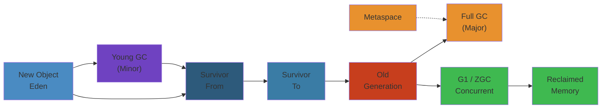
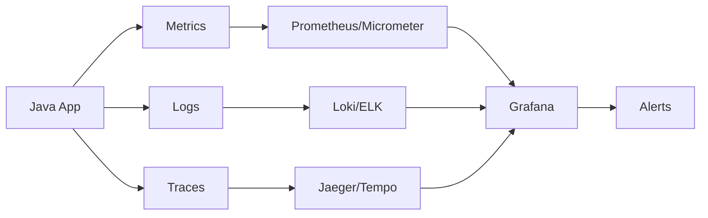

# 🗑️ Java Memory Model & Garbage Collection — Complete Deep Dive

**Related**: [JVM Architecture](05-jvm-architecture.md) · [Multithreading](04-multithreading.md) · [Collections](02-collections-framework.md)

---




## Table of Contents

- [Java Memory Model (JMM)](#-java-memory-model-jmm)
- [1. Happens-Before Rules](#1-happens-before-rules)
- [2. Garbage Collection Overview](#2-garbage-collection-overview)
- [3. GC Algorithms](#3-gc-algorithms)
- [4. Generational GC Flow](#4-generational-gc-flow)
- [5. Garbage Collector Types](#5-garbage-collector-types)
- [6. Object Allocation & TLABs](#6-object-allocation--tlabs)
- [7. GC Logging & Analysis](#7-gc-logging--analysis)
- [8. Memory Leak Detection](#8-memory-leak-detection)
- [9. Reference Types (Soft, Weak, Phantom)](#9-reference-types)
- [Common Pitfalls](#-common-pitfalls)
- [Simplest Mental Model](#-simplest-mental-model)

---

## 🧭 Java Memory Model (JMM)

### What JMM Defines

```text
JMM defines:
  ✓ When one thread's writes become visible to another
  ✓ Ordering of operations (what can be reordered)
  ✓ When synchronization guarantees happen-before

JMM does NOT define:
  ✗ How objects are laid out in memory (JVM-specific)
  ✗ Stack vs heap implementation details
  ✗ Garbage collection timing
```

### Memory Hierarchy Visibility

```text
Thread A                           Thread B
┌──────────────┐                  ┌──────────────┐
│   CPU Cache  │                  │   CPU Cache   │
│   (L1/L2/L3) │                  │   (L1/L2/L3)  │
└──────┬───────┘                  └──────┬────────┘
       │                                 │
       │  Write buffered                  │  Read may see stale data
       │  (not flushed to main            │  (cache not synced)
       │   memory yet)                    │
       │                                 │
       ▼                                 ▼
┌──────────────────────────────────────────────┐
│              Main Memory (RAM)                │
│  ┌──────────────┬──────────────┬────────────┐ │
│  │  shared var  │  shared var  │ shared var │ │
│  │  x = 5      │  flag = true │  ...       │ │
│  └──────────────┴──────────────┴────────────┘ │
└──────────────────────────────────────────────┘

Without synchronization → Thread B may see:
  - flag = true  but x = 0 (stale)
  - Or see operations in different order (reordering)
```

---

## 1. Happens-Before Rules

### The Rules

```text
If A happens-before B, then everything A did (writes, etc.)
is visible to B.

1. Program Order Rule
   ──────────────────
   Within a single thread, each action happens-before the next
   in program order.

2. Monitor Lock Rule
   ─────────────────
   An unlock on a monitor happens-before every subsequent lock
   on the same monitor.

3. volatile Rule
   ─────────────
   A write to a volatile field happens-before every subsequent
   read of the same field.

4. Thread start Rule
   ─────────────────
   Thread.start() happens-before any action in the started thread.

5. Thread join Rule
   ─────────────────
   All actions in a thread happen-before any thread successfully
   returns from join() on that thread.

6. Transitivity
   ─────────────
   If A happens-before B and B happens-before C, then
   A happens-before C.

7. Interruption Rule
   ─────────────────
   Calling interrupt() on a thread happens-before the interrupted
   thread detects it (via isInterrupted() or InterruptedException).

8. Finalizer Rule
   ──────────────
   End of object constructor happens-before start of finalizer.
```

### Visualizing Happens-Before

```text
Thread A:                        Thread B:
    │                                │
    ├── x = 5                        │
    ├── flag = true  (volatile)      │
    └───────────────┬────────────────┘
                    │ happens-before
                    ▼
               ┌────────────┐
               │  Memory    │
               │  Barrier   │
               │  (flush)   │
               └────────────┘
                    │
                    ├────  Thread B reads flag (volatile) = true
                    ├────  Guaranteed: x == 5 (not stale!)
                    └────  Guaranteed: no reordering visible
```

### volatile Memory Barrier

```text
volatile write:
  ┌─────────────────────────────────────────┐
  │  StoreStore Barrier  (prevents prior writes │
  │                      from passing this) │
  │  volatile store                          │
  │  StoreLoad Barrier   (flushes cache)    │
  └─────────────────────────────────────────┘

volatile read:
  ┌─────────────────────────────────────────┐
  │  LoadLoad Barrier   (prevents subsequent │
  │                      loads from passing)│
  │  volatile read                           │
  │  LoadStore Barrier                       │
  └─────────────────────────────────────────┘
```

### JMM in Practice: Double-Checked Locking

```java
// ✅ CORRECT — using volatile
class Singleton {
    private static volatile Singleton instance;
    // volatile is KEY — prevents instruction reordering

    private Singleton() {}

    public static Singleton getInstance() {
        if (instance == null) {  // first check (no lock)
            synchronized (Singleton.class) {
                if (instance == null) {  // second check (with lock)
                    instance = new Singleton();
                    // Without volatile, JIT could reorder:
                    // 1. allocate memory
                    // 2. store reference (before init!)
                    // 3. invoke constructor
                    // → another thread sees non-null but uninitialized!
                }
            }
        }
        return instance;
    }
}
```

---

## 2. Garbage Collection Overview

### What is GC?

```text
Automatic memory management:
  ✓ Allocates objects in heap
  ✓ Identifies objects no longer reachable
  ✓ Reclaims memory for reuse
  ✓ May compact memory to avoid fragmentation
```

### Reachability

```text
GC Roots (always reachable):
  ├── Active thread stacks (local variables)
  ├── Static fields (classes)
  ├── JNI references (native code)
  ├── Thread objects
  └── System class references

Reachability states:
  ┌─────────────────────────────────────────────────────┐
  │                                                     │
  │   Strongly Reachable   ──── Has path from roots    │
  │   Softly Reachable     ──── Only via SoftReference │
  │   Weakly Reachable     ──── Only via WeakReference │
  │   Phantom Reachable    ──── Only via PhantomRef    │
  │   Unreachable          ──── No references at all   │
  │                                                     │
  └─────────────────────────────────────────────────────┘

Example:
  Object obj = new Object();    // Strong reference
  WeakReference<Object> weak = new WeakReference<>(obj);
  obj = null;                   // Now weakly reachable
  System.gc();                  // GC clears WeakReference
  weak.get();                   // null
```

---

## 3. GC Algorithms

### 1. Mark-Sweep

```text
Phase 1: MARK
  ┌─────────────────────────────────────────────┐
  │ Traverse object graph from roots            │
  │ Mark every reachable object (bit in header) │
  │ Time: O(live objects)                       │
  └─────────────────────────────────────────────┘

Phase 2: SWEEP
  ┌─────────────────────────────────────────────┐
  │ Scan entire heap                            │
  │ Free unmarked objects                       │
  │ Add free blocks to free list                │
  │ Time: O(heap size)                          │
  └─────────────────────────────────────────────┘

Problem: Fragmentation (free blocks interspersed)
  [Object A][FREE][Object B][FREE][FREE][Object C]
  Cannot allocate large object even if total free is enough
```

### 2. Mark-Compact

```text
Phase 1: MARK (same as Mark-Sweep)

Phase 2: COMPACT
  ┌─────────────────────────────────────────────┐
  │ Shift live objects to one end of heap       │
  │ No fragmentation!                           │
  │ Time: O(live objects)                       │
  │                                            │
  │ Before: [A][FREE][B][FREE][FREE][C]        │
  │ After:  [A][B][C][FREE][FREE][FREE]        │
  └─────────────────────────────────────────────┘

Used by: Serial GC, Parallel GC (old gen)
```

### 3. Copying (Scavenge)

```text
Phase 1: Copy live objects from FROM to TO space
  ┌─────────────────────────────────────────────┐
  │ FROM space (fully occupied)                 │
  │ ┌────┬────┬────┬────┬────┬────┬────┬────┐  │
  │ │ A  │ B  │ C  │ D  │    │    │    │    │  │
  │ └────┴────┴────┴────┴────┴────┴────┴────┘  │
  │                                            │
  │ Copy live: B and D survive                 │
  │                                            │
  │ TO space (empty → occupied)                │
  │ ┌────┬────┬────────────────────────────────┐│
  │ │ B  │ D  │  (free)                       ││
  │ └────┴────┴────────────────────────────────┘│
  │                                            │
  │ FROM space → wiped (all dead)              │
  │ Swap: FROM ↔ TO for next GC               │
  └─────────────────────────────────────────────┘

Used by: Young Gen collectors (Copying is fast, but wastes half space)
```

### Algorithm Comparison

| Algorithm | Speed | Fragmentation | Space Overhead | Used By |
|-----------|-------|---------------|----------------|---------|
| Mark-Sweep | Medium | High | None | CMS (old gen) |
| Mark-Compact | Slow | None | None | Serial, Parallel old gen |
| Copying (Scavenge) | Fast | None | 50% wasted | Young gen collectors |

---

## 4. Generational GC Flow

### Object Age & Promotion

```text
                    ┌─────────────────────────────────────────────┐
                    │         Generational Hypothesis             │
                    │   "Most objects die young"                  │
                    │                                             │
                    │   ~90% of objects live < 1 GC cycle         │
                    │   Optimize young gen for fast death         │
                    └─────────────────────────────────────────────┘

Object Lifetime Flow:

  new Object()
       │
       ▼
  ┌────────────┐   Minor GC (Eden full)
  │   Eden     │──────────────────────┐
  │            │                      │
  │  Most die  │    survive?          │
  └────────────┘         │            │
                    NO   │   YES      │
                     │   │            │
                     ▼   ▼            │
                 (Dead) ┌────────────┐│
                        │ S0 (From)  ││
                        │ Survivor   ││
                        └────────────┘│
                              │       │
                         Next Minor GC│
                              │       │
                         survive?    │
                         NO   │ YES  │
                          │   │      │
                          ▼   ▼      │
                      (Dead) ┌───────┴──────┐
                             │ S1 (To)      │
                             │ Survivor     │
                             └──────────────┘
                                   │
                              maxTenuringThreshold?
                                   │
                              reached threshold?
                              NO          YES
                               │           │
                               ▼           ▼
                          continue      ┌────────────┐
                          survivor      │ Old Gen    │
                                        │ (Tenured)  │
                                        └────────────┘
```

### Full GC Flow

```text
┌─────────────────────────────────────────────────────────────┐
│                    Full GC Triggers                          │
├─────────────────────────────────────────────────────────────┤
│  • Old gen full (promotion failed)                          │
│  • Metaspace full                                           │
│  • System.gc() or jcmd GC.run                               │
│  • Allocation failure in old gen (CMS)                      │
│  • GC ergonomics decides concurrent cycle failed            │
└─────────────────────────────────────────────────────────────┘

                                  │
                                  ▼
┌─────────────────────────────────────────────────────────────┐
│                    Full GC (Stop-The-World)                  │
├─────────────────────────────────────────────────────────────┤
│                                                             │
│  1. MARK (STW)                                              │
│     ┌─────────────────────────────────────────────────┐     │
│     │ Mark all live objects from roots                │     │
│     │ (all threads stopped at safe point)             │     │
│     └─────────────────────────────────────────────────┘     │
│                                                             │
│  2. SWEEP / COMPACT (STW)                                   │
│     ┌─────────────────────────────────────────────────┐     │
│     │ Sweep dead objects OR compact live to one end   │     │
│     └─────────────────────────────────────────────────┘     │
│                                                             │
│  3. RESIZE                                                 │
│     ┌─────────────────────────────────────────────────┐     │
│     │ Adjust heap size if -XX:+UseAdaptiveSizePolicy │     │
│     └─────────────────────────────────────────────────┘     │
│                                                             │
└─────────────────────────────────────────────────────────────┘
```

### GC: Young vs Old vs Full

| Type | What | STW? | Frequency |
|------|------|------|-----------|
| Minor GC | Young gen only | Yes (fast) | Frequent (seconds) |
| Major GC | Old gen only | Depends | Less frequent |
| Full GC | Both young + old + metaspace | Yes (slow) | Rare (hours/days) |

---

## 5. Garbage Collector Types

### Serial GC (-XX:+UseSerialGC)

```text
┌─────────────────────────────────────────────────────────────┐
│  Serial GC                                                  │
│  Single-threaded collector                                   │
│  Best for: single-core, small heaps (< 100MB), client apps  │
├─────────────────────────────────────────────────────────────┤
│  Young Gen: Copying (single thread, STW)                    │
│  Old Gen:  Mark-Compact (single thread, STW)                │
│                                                             │
│  "Stop all threads, collect, resume."                       │
└─────────────────────────────────────────────────────────────┘
```

### Parallel GC (-XX:+UseParallelGC) — Default in Java 8

```text
┌─────────────────────────────────────────────────────────────┐
│  Parallel (Throughput) GC                                   │
│  Multi-threaded, high throughput                             │
│  Best for: batch jobs, large heaps, background processing   │
├─────────────────────────────────────────────────────────────┤
│  Young Gen: Copying (N threads, STW)                        │
│  Old Gen:  Mark-Compact (N threads, STW)                    │
│                                                             │
│  -XX:ParallelGCThreads=N  (default: CPU cores)              │
│  -XX:MaxGCPauseMillis=N   (hint for ergonomics)             │
│  -XX:GCTimeRatio=N        (throughput target, default 99)   │
│                                                             │
│  Ergonomics: adapts sizes to meet pause time goals          │
└─────────────────────────────────────────────────────────────┘
```

### G1 GC (-XX:+UseG1GC) — Default since Java 9

```text
┌─────────────────────────────────────────────────────────────┐
│  G1 (Garbage First) GC                                      │
│  Region-based, low-pause, predictable                        │
│  Replaces CMS as the "mostly concurrent" collector          │
├─────────────────────────────────────────────────────────────┤
│  Heap divided into 2048 regions (1MB - 32MB each)           │
│                                                             │
│  ┌────┬────┬────┬────┬────┬────┬────┬────┬────┬────┬────┐  │
│  │ E  │ E  │ S  │ E  │ H  │ O  │ O  │ E  │ E  │ S  │ O  │  │
│  │den │den │urv │den │um  │ld  │ld  │den │den │urv │ld  │  │
│  └────┴────┴────┴────┴────┴────┴────┴────┴────┴────┴────┘  │
│                                                             │
│  E = Eden, S = Survivor, O = Old, H = Humongous (>50%)     │
│                                                             │
│  Phases:                                                    │
│  1. Young GC (STW, fast): copy live to survivor regions     │
│  2. Concurrent Mark (no STW): find live in old gen          │
│  3. Mixed GC (STW): collect young + most garbage old regions│
│  4. Full GC (STW, fallback): if concurrent fails            │
│                                                             │
│  -XX:MaxGCPauseMillis=200  (default target)                 │
│  -XX:G1HeapRegionSize=4m   (region size)                    │
│  -XX:InitiatingHeapOccupancyPercent=45 (start concurrent)   │
└─────────────────────────────────────────────────────────────┘
```

### ZGC (-XX:+UseZGC) — Java 11+ (Experimental → Production)

```text
┌─────────────────────────────────────────────────────────────┐
│  ZGC                                                        │
│  Low-latency, sub-millisecond pauses, no matter heap size   │
│  Best for: large heaps (multi-TB), low-latency services     │
├─────────────────────────────────────────────────────────────┤
│  Key features:                                              │
│  ✓ Colored pointers (metadata in unused address bits)        │
│  ✓ Load barriers (on pointer read, not object read)         │
│  ✓ Concurrent everything (relocation, marking)              │
│  ✓ No generations (yet)                                     │
│                                                             │
│  Pause times: < 1ms (regardless of heap size!)              │
│  Throughput: slightly lower than G1 (~15% overhead)         │
│                                                             │
│  Heap: -Xms4g -Xmx4g (can grow/shrink)                     │
│  Regions: dynamic, can be compacted concurrently            │
└─────────────────────────────────────────────────────────────┘
```

### GC Comparison

| GC | Pause Time | Throughput | CPU Overhead | Best For |
|----|-----------|------------|--------------|----------|
| Serial | Long | Low | Low | Small apps, single core |
| Parallel | Longer | Highest | Low-Med | Batch, throughput-critical |
| G1 | Short (target) | High | Medium | Most server apps |
| ZGC | Very short (<1ms) | High | Medium | Large heaps, low-latency |
| Shenandoah | Very short | High | Medium | Large heaps, low-latency |

---

## 6. Object Allocation & TLABs

### TLAB (Thread-Local Allocation Buffer)

```text
Each thread gets a private region in Eden for allocation:

Thread 1                        Thread 2
┌────────────────────┐         ┌────────────────────┐
│ TLAB               │         │ TLAB               │
│ ┌──┬──┬──┬──┬──┬──┤         │ ┌──┬──┬──┬──┬──┬──┤
│ │A │B │  │  │  │  │         │ │C │D │E │  │  │  │
│ └──┴──┴──┴──┴──┴──┘         │ └──┴──┴──┴──┴──┴──┘
└────────────────────┘         └────────────────────┘

          │                             │
          ▼                             ▼
┌──────────────────────────────────────────────────────┐
│              Eden (Shared)                            │
│  ┌────────────────┬─────────────────┬────────────┐    │
│  │ Thread 1 TLAB  │ Thread 2 TLAB   │ Unused     │    │
│  └────────────────┴─────────────────┴────────────┘    │
└──────────────────────────────────────────────────────┘

Benefits:
  • No synchronization for most allocations
  • ~95% of allocations happen in TLAB
  • When TLAB full → new TLAB from Eden
  • If object too large → allocate directly in Eden (not TLAB)

Size control:
  -XX:TLABSize=256k        (default: adaptive)
  -XX:-ResizeTLAB          (disable adaptive sizing)
```

### Object Layout in Memory

```text
Object header (12 bytes on 64-bit, with compressed OOPs):
  ┌──────────────────────────────────────────┐
  │ Mark Word (8 bytes)                      │
  │  ├── Identity hashcode (lazy, 25 bits)  │
  │  ├── GC age (4 bits)                     │
  │  ├── Lock info (biased, light, heavy)    │
  │  └── Thread ID (biased locking)          │
  ├──────────────────────────────────────────┤
  │ Klass Pointer (4 bytes, compressed)      │
  │  → Points to Class metadata in method area│
  ├──────────────────────────────────────────┤
  │ Instance fields (size varies)            │
  │  ┌───┬───┬───┬───┬───┬───┬───┬────────┐ │
  │  │ f1│ f2│ f3│ f4│ ..│   │   │        │ │
  │  └───┴───┴───┴───┴───┴───┴───┴────────┘ │
  ├──────────────────────────────────────────┤
  │ Padding (to 8-byte alignment)            │
  └──────────────────────────────────────────┘
```

---

## 7. GC Logging & Analysis

### Enabling GC Logs

```bash
# Java 8 style
-XX:+PrintGCDetails
-XX:+PrintGCDateStamps
-XX:+PrintGCTimeStamps
-XX:+PrintTenuringDistribution
-XX:+PrintHeapAtGC
-Xloggc:/path/to/gc.log

# Java 9+ unified logging
-Xlog:gc*:file=/path/to/gc.log:time,uptime,level,tags
-Xlog:gc+heap=debug
-Xlog:gc+age=trace
-Xlog:gc+phases=debug
```

### Reading GC Logs

```text
Example (Parallel GC):

2024-01-15T10:30:45.123+0000: 2.456:
[GC (Allocation Failure)
  [PSYoungGen: 1024K->512K(3072K)]
  2048K->1536K(7168K),
  0.0034567 secs]
  [Times: user=0.01 sys=0.00, real=0.00 secs]

Breakdown:
  Timestamp: 2024-01-15T10:30:45.123  (wall clock)
  Uptime:    2.456 seconds since JVM start
  Event:     GC (Allocation Failure) — triggered by failed alloc
  Young Gen: 1024K → 512K (used → used after), 3072K total
  Heap:      2048K → 1536K (used → used after), 7168K total
  Duration:  0.0034567 seconds
  Times:     user=0.01 (CPU), sys=0.00 (kernel), real=0.00 (wall)

Example (Full GC):

2024-01-15T10:35:12.456+0000: 187.234:
[Full GC (Metadata GC Threshold)
  [PSYoungGen: 1024K->0K(3072K)]
  [ParOldGen: 4096K->2048K(4096K)]
  5120K->2048K(7168K),
  [Metaspace: 10240K->10240K(1056768K)],
  0.1234567 secs]
  [Times: user=0.45 sys=0.02, real=0.12 secs]
```

### GC Analysis Tools

| Tool | Purpose |
|------|---------|
| `jstat -gcutil <pid> 1s` | Real-time GC stats every second |
| `jstat -gccause <pid>` | Reason for last GC |
| GCeasy (web) | Upload GC log → visual analysis |
| GCViewer | Desktop GC log visualizer |
| HPJMeter | GC log parser → metrics |
| VisualVM + VisualGC | Real-time GC monitoring |

---

## 8. Memory Leak Detection

### Types of Memory Leaks

```java
// 1. Forgotten references in collections
class Leak1 {
    static Map<String, Data> cache = new HashMap<>();

    void process(String key, Data data) {
        cache.put(key, data);  // never removed!
    }
}

// 2. Inner class / anonymous class holding outer reference
class Leak2 {
    class Inner {
        void doSomething() {
            // holds reference to outer Leak2 instance
        }
    }

    List<Inner> items = new ArrayList<>();
    void addInner() { items.add(new Inner()); }
    // Each Inner → outer Leak2 stays alive
}

// 3. ThreadLocal not cleaned up
class Leak3 {
    static ThreadLocal<byte[]> threadLocal = new ThreadLocal<>();

    static void process() {
        threadLocal.set(new byte[1024 * 1024]);  // 1MB
        // threadLocal.remove() never called!
        // In thread pool → data stays forever
    }
}

// 4. Unclosed resources
class Leak4 {
    void readFile(String path) throws IOException {
        FileInputStream fis = new FileInputStream(path);
        // never closed → finalizer queue grows
        // Use try-with-resources!
    }
}

// 5. Static collections growing forever
class Leak5 {
    static final List<String> ALL_REQUESTS = new ArrayList<>();
    void handleRequest(String req) { ALL_REQUESTS.add(req); }
    // never clears → OOM eventually
}
```

### Detecting Leaks with Heap Dumps

```bash
# Trigger heap dump on OOM
-XX:+HeapDumpOnOutOfMemoryError
-XX:HeapDumpPath=/path/to/dump.hprof

# Manual heap dump
jmap -dump:live,format=b,file=dump.hprof <pid>
jcmd <pid> GC.heap_dump /path/to/dump.hprof

# Analyze with:
# jhat (basic, built-in)
# Eclipse MAT (Memory Analyzer Tool) — best
# VisualVM
# IntelliJ Profiler
```

### Using Eclipse MAT

```text
1. Open .hprof file in MAT
2. Run "Leak Suspects Report"
   → Shows biggest objects and GC root paths
3. "Dominator Tree"
   → Shows which objects retain most memory
4. "Path to GC Roots"
   → Shows WHY an object is still alive
5. "Top Consumers"
   → Classes with largest retained heap

Key metrics:
  Shallow heap: memory used by object alone
  Retained heap: memory freed if object is GC'd
```

### Using jcmd for Diagnostics

```bash
# Thread dump
jcmd <pid> Thread.print

# System properties
jcmd <pid> VM.system_properties

# JVM flags
jcmd <pid> VM.flags

# GC class histogram
jcmd <pid> GC.class_histogram

# GC heap info
jcmd <pid> GC.heap_info

# Running diagnostic commands
jcmd <pid> help
```

---

## 9. Reference Types

### SoftReference — Memory-Sensitive Cache

```java
// GC clears SoftReferences only when memory is low
// Good for: caches that can be rebuilt

public class SoftCache<K, V> {
    private final Map<K, SoftReference<V>> cache = new HashMap<>();

    public void put(K key, V value) {
        cache.put(key, new SoftReference<>(value));
    }

    public V get(K key) {
        SoftReference<V> ref = cache.get(key);
        if (ref == null) return null;
        V value = ref.get();  // null if GC cleared it
        if (value == null) {
            cache.remove(key);  // clean up cleared reference
        }
        return value;
    }
}
```

### WeakReference — No Memory Pressure

```java
// GC clears WeakReference as soon as no strong refs exist
// Good for: canonical mappings, avoid memory leaks

// WeakHashMap — keys are weak references
WeakHashMap<UniqueKey, BigData> map = new WeakHashMap<>();
// When key has no strong refs → entry removed automatically

// Example: keeping metadata about objects
public class WeakListener<T> {
    private final WeakReference<T> target;

    public WeakListener(T target) {
        this.target = new WeakReference<>(target);
    }

    public void fire() {
        T t = target.get();
        if (t != null) {
            // Notify target
        }
        // If target is GC'd, we skip — no memory leak!
    }
}
```

### PhantomReference — Post-Mortem Cleanup

```java
// get() always returns null!
// Only useful for knowing when an object is FINALIZED
// Good for: pre-mortem cleanup, direct buffer deallocation

public class ResourceCleaner {
    private static final ReferenceQueue<Object> QUEUE = new ReferenceQueue<>();
    private static final List<PhantomReference<?>> REFS = new ArrayList<>();

    static {
        // Background thread watching for cleanup
        Thread cleaner = new Thread(() -> {
            while (true) {
                try {
                    Reference<?> ref = QUEUE.remove();  // blocks
                    // Object has been finalized
                    // Clean up associated native resources
                    System.out.println("Cleaned up: " + ref);
                    REFS.remove(ref);
                } catch (InterruptedException e) {
                    Thread.currentThread().interrupt();
                    break;
                }
            }
        });
        cleaner.setDaemon(true);
        cleaner.start();
    }

    public static void register(Object obj, Runnable cleanup) {
        REFS.add(new PhantomReference<>(obj, QUEUE) {
            // Custom cleanup logic via ReferenceQueue
        });
    }
}
```

### Reference Type Comparison

| Aspect | SoftReference | WeakReference | PhantomReference |
|--------|--------------|---------------|------------------|
| get() returns | Object (maybe null) | Object (maybe null) | Always null |
| Cleared when | Memory low (before OOM) | Next GC (no strong ref) | After finalization |
| Purpose | Cache | Canonical mapping, prevent leaks | Pre-mortem cleanup |
| Common use | Image cache, large data cache | WeakHashMap, listener lists | NIO direct buffer cleanup |

---

## ⚠️ Common Pitfalls

| Pitfall | Cause | Detection |
|---------|-------|-----------|
| GC overhead limit | >98% time in GC, <2% heap recovered | JVM throws OutOfMemoryError |
| Promotion failed | Old gen too fragmented for large object | Full GC |
| Concurrent mode failure | CMS can't finish before old gen fills | Full GC (STW) |
| Humongous allocation | Object > 50% G1 region | Full GC |
| String dedup overhead | Too many duplicate strings | Enable -XX:+UseStringDeduplication |
| System.gc() misuse | Explicit GC calls | -XX:+DisableExplicitGC |
| Finalizer backlog | Objects with finalize() not GC'd | Avoid finalizers (use Cleaner) |
| Metaspace leak | ClassLoader not discarded | -XX:TraceClassLoading, TraceClassUnloading |

---

## 🧠 Simplest Mental Model

```text
MARK            =  A janitor marking chairs that are still in use with
                   sticky notes. Unmarked = garbage.

SWEEP           =  Throwing away all unmarked items.

COMPACT         =  Pushing all remaining furniture together to make
                   room. No gaps between items.

COPY            =  Moving all valuable items to a new, clean room.
                   Old room is now entirely empty and reusable.

YOUNG GEN       =  A waiting room. Most people leave quickly (die young).
                   Those who stay get moved to a nicer waiting area (survivor),
                   then eventually to the long-stay lounge (old gen).

OLD GEN         =  Long-term parking. Objects that have been around
                   for a while. Collected less often, but takes longer.

THREAD-LOCAL    =  Each worker has their own workbench (TLAB).
BUFFER (TLAB)      They don't need to ask permission for small items.
                   Only for big items do they go to the shared storage.

SOFT REFERENCE  =  A reserve bookshelf. Books kept until you REALLY
                   need space (memory pressure).

WEAK REFERENCE  =  A self-destructing note. Gone as soon as no one
                   is looking at it (strongly referencing).

FULL GC         =  Complete warehouse cleanup. Everyone must stop
                   working. You want this to happen rarely.

HAPPENS-BEFORE  =  If I text you "I put the keys on the table" before
                   you check the table, you're guaranteed to find them.
                   Without this rule, you might look before my text arrives.
```

---

**Next**: [Streams & Lambda](07-streams-lambda.md) — Functional programming in Java


## Observability



### Key Metrics

| Metric | Unit | Threshold | Indicates |
|--------|------|-----------|-----------|
| JVM heap used | % | < 75% | Memory pressure |
| GC pause (p99) | ms | < 100ms | GC tuning needed |
| Young GC frequency | /min | < 10 | Object allocation rate |
| Full GC frequency | /min | 0 (ideally) | Memory leak or metaspace |
| Thread count | count | < 500 | Thread pool exhaustion |
| Connection pool usage | % | < 80% | Database pool saturation |
| Class loading rate | classes/s | < 100 | Dynamic class generation |
| File descriptor count | count | < 70% of ulimit | FD leak |

### Logs

- **ERROR**: Uncaught exceptions, OOM, stack traces, connection pool exhaustion, thread starvation
- **WARN**: Slow queries, long GC pauses, retry attempts, deprecated API usage
- **INFO**: Server start/stop, context initialization, config loaded, scheduled tasks
- **DEBUG**: SQL queries with params, request/response headers, method entry/exit timing

### Traces

Use Micrometer Tracing (formerly Spring Cloud Sleuth) or OpenTelemetry Java SDK. Propagate trace context via MDC for log correlation.

### Alerts

| Severity | Condition | Response |
|----------|-----------|----------|
| P0 | Full GC > 1 in 5min | Heap dump, identify leak |
| P0 | Error rate > 5% | Rollback, check heap |
| P1 | GC pause > 1s | Tune GC, reduce heap pressure |
| P1 | Thread starvation | Increase pool, check deadlocks |
| P2 | Heap > 85% for 10min | Schedule capacity increase |

### Dashboards

**JVM Dashboard**: heap usage (young/old/metaspace), GC pause (count, duration per generation), thread states (runnable/blocked/waiting), class loading, JIT compilation time, file descriptor count.


## Common Failures

### Failure: OutOfMemoryError

- **Symptoms**: Application crashes with `java.lang.OutOfMemoryError`. Heap dump on exit. 503s from load balancer.
- **Root Cause**: Memory leak (unclosed streams, collections growing unbounded, ThreadLocal not cleaned). Heap too small for workload. Metaspace leak from dynamic class loading.
- **Detection**: `jstat -gcutil <pid> 1s` shows Old Gen filling. `jmap -histo:live <pid>` shows leaking class count. GC logs show Full GC repeatedly.
- **Recovery**: 1) Increase heap with `-Xmx`. 2) Enable `-XX:+HeapDumpOnOutOfMemoryError`. 3) Analyze heap dump with Eclipse MAT. 4) Restart with increased resources.
- **Prevention**: Profile with `jprofiler`/`async-profiler`. Set `-Xmx` high enough. Use `-XX:+ExitOnOutOfMemoryError` for fail-fast. Implement proper resource cleanup in `finally`/`try-with-resources`.

### Failure: Full GC Storm

- **Symptoms**: Latency spikes, CPU high, throughput drops. GC log shows Full GC events in quick succession.
- **Root Cause**: Old Gen fills up faster than concurrent GC can clear. Large object allocation (direct to Old Gen). GC fragmentation. Too many concurrent GC threads competing.
- **Detection**: GC logs show Full GC events. `jstat -gcutil` shows Old Gen at > 90% after GC. `jmap -histo` shows large byte arrays.
- **Recovery**: 1) Increase heap size. 2) Switch to G1GC or ZGC. 3) Reduce allocation rate. 4) Enable `-XX:+UseStringDeduplication`.
- **Prevention**: Use G1GC with `-XX:MaxGCPauseMillis=200`. Set `-XX:G1HeapRegionSize=16m`. Monitor allocation rate with async-profiler.

### Failure: Thread Pool Exhaustion

- **Symptoms**: "RejectedExecutionException" in logs. Tasks queue up and time out. Deadlock between thread pools.
- **Root Cause**: Task submitted faster than thread pool can process. Thread pool queue bounded. Deadlock where pool A waits for pool B, pool B waits for pool A.
- **Detection**: `jstack` shows threads in `parking to await` or `locked`. `ThreadPoolExecutor` metrics show queue size growing. Active count = pool size.
- **Recovery**: 1) `jstack` dump for deadlock analysis. 2) Emergency increase pool size. 3) Reduce task submission rate. 4) Restart.
- **Prevention**: Use separate thread pools for different workloads. Set appropriate queue capacity and rejection policy. Monitor pool active count and queue depth. Use `ThreadPoolExecutor` with `CallerRunsPolicy` as safety net.

### Failure: ClassLoader Leak

- **Symptoms**: Metaspace grows unbounded, Full GC on Metaspace, eventually OOM: Metaspace.
- **Root Cause**: Application redeploy (Tomcat) creates new ClassLoader each time. Old ClassLoader not garbage collected because some reference (often from a library thread) holds it alive. Common with thread pools initialized at deploy time.
- **Detection**: `jstat -gcutil` shows Metaspace usage climbing. Heap dump shows many `ClassLoader` instances. PermGen/Metaspace GC before OOM.
- **Recovery**: 1) Restart application server. 2) Increase Metaspace size. 3) Patch library holding ClassLoader reference.
- **Prevention**: Always use `ThreadFactory` that sets daemon threads. Use `Thread.setContextClassLoader(null)` for library threads. Test redeploy with `Profiler` to verify ClassLoader cleanup.

### Failure: Deadlock

- **Symptoms**: Threads stuck, no progress, application partially frozen. Thread dump shows threads in BLOCKED state all holding locks others need.
- **Root Cause**: Circular lock dependency. Two+ threads each hold a lock and wait for another thread's lock. Classic dining philosophers.
- **Detection**: `jstack` shows deadlock detection: "Found one Java-level deadlock". Thread state: BLOCKED on a lock held by another thread that's waiting on this thread's lock.
- **Recovery**: 1) Kill the stuck threads or restart JVM. 2) `jstack -l <pid>` to identify deadlocked threads. 3) Fix locking order in code.
- **Prevention**: Always acquire locks in consistent order. Use `tryLock` with timeout instead of `synchronized`. Use `java.util.concurrent` classes. Enable `-XX:+PrintConcurrentLocks`.
