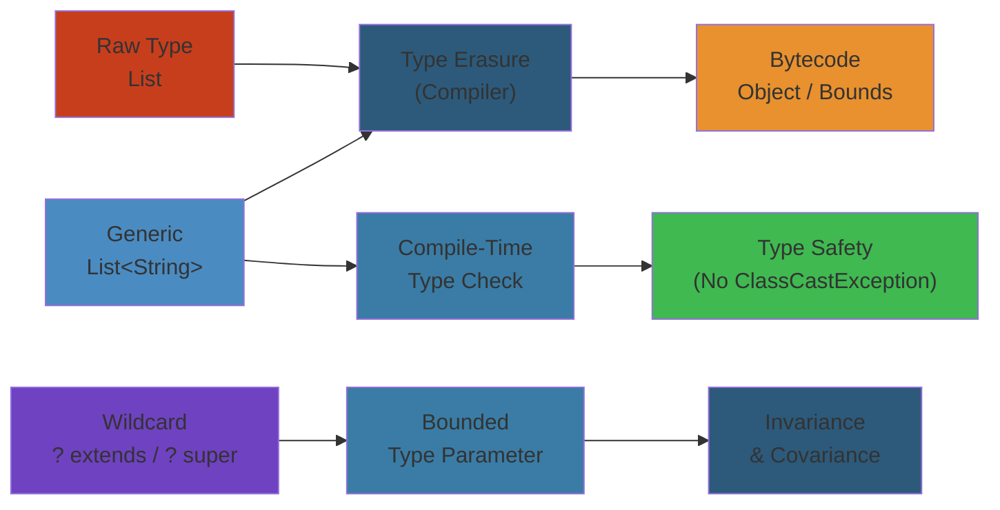
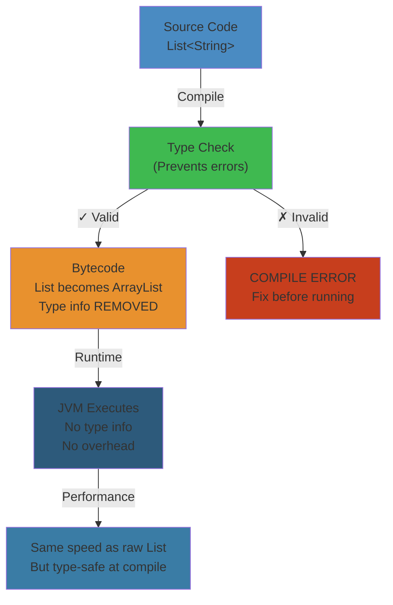

# 📦 Java Generics — Complete Deep Dive

**Related**: [Collections Framework](/03-backend/java/02-collections-framework.md) · [Streams & Lambda](/03-backend/java/07-streams-lambda.md) · [OOP Concepts](/03-backend/java/01-oop-concepts.md)

---




## Table of Contents


- [What Are Generics?](#-what-are-generics)
- [1. Generic Classes](#1-generic-classes)
- [2. Generic Methods](#2-generic-methods)
- [3. Bounded Type Parameters](#3-bounded-type-parameters)
- [4. Wildcards](#4-wildcards)
- [5. Type Erasure](#5-type-erasure)
- [6. Generic Inheritance](#6-generic-inheritance)
- [7. Raw Types & Legacy Code](#7-raw-types--legacy-code)
- [8. Common Patterns](#8-common-patterns)
- [Common Pitfalls](#-common-pitfalls)
- [Simplest Mental Model](#-simplest-mental-model)

---

## 🧭 What Are Generics?


**Definition**: Generics enable types (classes and interfaces) to be parameters when defining classes, interfaces, and methods.

### Before Generics


```java
// ❌ BAD — no type safety
List list = new ArrayList();
list.add("hello");
list.add(123);

String s = (String) list.get(0);  // need cast
String t = (String) list.get(1);  // ClassCastException at RUNTIME!
```

### With Generics


```java
// ✅ GOOD — compile-time type safety
List<String> list = new ArrayList<>();
list.add("hello");
// list.add(123);  // COMPILE ERROR!

String s = list.get(0);  // no cast needed
```

---

## 1. Generic Classes


### Basic Generic Class


```java
public class Box<T> {
    private T content;

    public Box(T content) {
        this.content = content;
    }

    public T getContent() {
        return content;
    }

    public void setContent(T content) {
        this.content = content;
    }

    public boolean isEmpty() {
        return content == null;
    }
}

// Usage
Box<String> stringBox = new Box<>("hello");  // diamond operator <>
Box<Integer> intBox = new Box<>(42);
Box<Box<String>> nestedBox = new Box<>(stringBox);

String content = stringBox.getContent();  // no cast
```

### Multiple Type Parameters


```java
public class Pair<K, V> {
    private final K key;
    private final V value;

    public Pair(K key, V value) {
        this.key = key;
        this.value = value;
    }

    public K getKey() { return key; }
    public V getValue() { return value; }

    public static <K, V> Pair<K, V> of(K key, V value) {
        return new Pair<>(key, value);
    }
}

// Usage
Pair<String, Integer> pair = new Pair<>("age", 30);
Pair<String, String> entry = Pair.of("key", "value");
```

### Generic Interface


```java
public interface Repository<T, ID> {
    T findById(ID id);
    List<T> findAll();
    void save(T entity);
    void delete(T entity);
    boolean existsById(ID id);
}

// Implementation
public class UserRepository implements Repository<User, Long> {
    @Override
    public User findById(Long id) {
        // query DB
        return new User(id);
    }

    @Override
    public List<User> findAll() {
        return new ArrayList<>();
    }

    @Override
    public void save(User entity) {
        // persist
    }

    @Override
    public void delete(User entity) {
        // remove
    }

    @Override
    public boolean existsById(Long id) {
        return false;
    }
}
```

### Type Parameter Naming Conventions


| Letter | Meaning | Example |
|--------|---------|---------|
| E | Element | `List<E>`, `Set<E>` |
| K | Key | `Map<K, V>` |
| V | Value | `Map<K, V>` |
| N | Number | `Box<N>` |
| T | Type | `Box<T>` |
| S, U, V | 2nd, 3rd, 4th types | `Transformer<T, U>` |
| R | Return type | `Function<T, R>` |

---

## 2. Generic Methods


### Basic Generic Method


```java
public class Utilities {
    // Generic method — type parameter before return type
    public static <T> T getMiddle(T... array) {
        return array[array.length / 2];
    }

    public static <T> T getFirst(List<T> list) {
        if (list.isEmpty()) {
            throw new NoSuchElementException();
        }
        return list.get(0);
    }

    public static <T> void swap(T[] array, int i, int j) {
        T temp = array[i];
        array[i] = array[j];
        array[j] = temp;
    }
}

// Usage
String mid = Utilities.getMiddle("a", "b", "c");     // "b"
Integer midNum = Utilities.getMiddle(1, 2, 3, 4, 5); // 3

// Type inference
String first = Utilities.getFirst(List.of("a", "b"));
```

### Generic Method in Non-Generic Class


```java
public class Collections {
    // Generic static method
    @SuppressWarnings("unchecked")
    public static <T> List<T> emptyList() {
        return (List<T>) EMPTY_LIST;
    }

    // Generic method with type bounds
    public static <T extends Comparable<? super T>> void sort(List<T> list) {
        list.sort(null);
    }

    // Multiple bounds on method
    public static <T extends Serializable & Comparable<T>> T max(List<T> list) {
        T max = list.get(0);
        for (T item : list) {
            if (item.compareTo(max) > 0) {
                max = item;
            }
        }
        return max;
    }
}
```

### Type Inference


```java
// Java 7: explicit type argument
List<String> list = Collections.<String>emptyList();

// Java 8+: compiler infers from context
List<String> list = Collections.emptyList();

// Method arguments
processPair(Pair.<String, Integer>of("age", 30));  // explicit
processPair(Pair.of("age", 30));                    // inferred (Java 8+)
```

---

## 3. Bounded Type Parameters


### Upper Bounded


```java
// T must extend Number (or Number itself)
public class NumericBox<T extends Number> {
    private final T value;

    public NumericBox(T value) {
        this.value = value;
    }

    public double doubleValue() {
        return value.doubleValue();
    }

    public int intValue() {
        return value.intValue();
    }
}

// Usage
NumericBox<Integer> intBox = new NumericBox<>(42);
NumericBox<Double> dblBox = new NumericBox<>(3.14);
NumericBox<BigDecimal> bigBox = new NumericBox<>(BigDecimal.TEN);
// NumericBox<String> strBox = new NumericBox<>("hello");  // COMPILE ERROR!

// Bounded generic method
public static <T extends Comparable<T>> T max(T a, T b) {
    return a.compareTo(b) > 0 ? a : b;
}
```

### Multiple Bounds


```java
// T must extend A AND implement B and C
// Class first, then interfaces (separated by &)
public class MultiBound<T extends Comparable<T> & Serializable> {
    private final T value;

    public MultiBound(T value) {
        this.value = value;
    }

    public int compareTo(T other) {
        return value.compareTo(other);
    }

    public byte[] serialize() throws IOException {
        try (ByteArrayOutputStream bos = new ByteArrayOutputStream();
             ObjectOutputStream oos = new ObjectOutputStream(bos)) {
            oos.writeObject(value);
            return bos.toByteArray();
        }
    }
}
```

### Lower Bounded (for wildcards only)


```java
// Cannot use lower bound on type parameter (only wildcard)
// ❌ public class Box<T super Number> — COMPILE ERROR
// ✅ Use wildcard instead: Box<? super Number>
```

---

## 4. Wildcards


### Unbounded Wildcard (?)


```java
// ? means "any type"
public class WildcardExamples {
    // Accept any List
    public static void printList(List<?> list) {
        for (Object elem : list) {
            System.out.print(elem + " ");
        }
        System.out.println();

        // Can read as Object
        Object first = list.get(0);

        // CANNOT add (except null)
        // list.add("hello");     // COMPILE ERROR
        // list.add(42);          // COMPILE ERROR
        list.add(null);            // OK (null is valid for any type)
    }
}

// Usage
printList(List.of(1, 2, 3));
printList(List.of("a", "b", "c"));
printList(new ArrayList<Integer>());
```

### Upper Bounded Wildcard (? extends T)


```java
// ? extends Number — can be Number or any subclass
public static double sumOfList(List<? extends Number> list) {
    double sum = 0.0;
    for (Number num : list) {  // read as Number
        sum += num.doubleValue();
    }
    return sum;
}

// Usage
sumOfList(List.of(1, 2, 3));          // Integer → OK
sumOfList(List.of(1.5, 2.5, 3.5));    // Double → OK
sumOfList(List.of(BigDecimal.ONE));    // BigDecimal → OK

// CAN read (as the upper bound)
// CANNOT write (except null)
List<? extends Number> nums = new ArrayList<Integer>();
// nums.add(42);       // COMPILE ERROR — could be List<Double>!
// nums.add(3.14);     // COMPILE ERROR
Number n = nums.get(0);  // OK — read as Number
```

### Lower Bounded Wildcard (? super T)


```java
// ? super Integer — can be Integer or any superclass
public static void addNumbers(List<? super Integer> list) {
    // CAN write (Integer or subtypes)
    list.add(1);
    list.add(2);
    list.add(3);

    // CANNOT read as specific type (only Object)
    Object obj = list.get(0);
    // Integer i = list.get(0);   // COMPILE ERROR!
}

// Usage
List<Number> numbers = new ArrayList<>();
addNumbers(numbers);  // OK — Number is super of Integer

List<Object> objects = new ArrayList<>();
addNumbers(objects);  // OK — Object is super of Integer

List<Integer> integers = new ArrayList<>();
addNumbers(integers);  // OK — Integer is same
```

### PECS (Producer Extends, Consumer Super)


```java
// PECS — Producer Extends, Consumer Super
// If you READ items → use ? extends T (producer)
// If you WRITE items → use ? super T (consumer)

public class PECSExample {
    // Producer: copy from src (we READ from src)
    public static <T> void copy(
            List<? extends T> src,   // producer
            List<? super T> dest) {  // consumer
        for (T item : src) {
            dest.add(item);
        }
    }

    // Producer: we only READ from collection
    public static double sum(Collection<? extends Number> producer) {
        double total = 0;
        for (Number n : producer) {
            total += n.doubleValue();
        }
        return total;
    }

    // Consumer: we only WRITE to collection
    public static <T> void fill(Collection<? super T> consumer, T item) {
        for (int i = 0; i < 10; i++) {
            consumer.add(item);
        }
    }
}

// Usage
List<Integer> src = List.of(1, 2, 3);
List<Number> dest = new ArrayList<>();
copy(src, dest);  // src produces, dest consumes
```

### Wildcard vs Type Parameter


| Aspect | Wildcard (`?`) | Type Parameter (`<T>`) |
|--------|---------------|----------------------|
| Syntax | `List<?>` | `<T> List<T>` |
| Multiple bounds | Not directly | `<T extends A & B>` |
| Used in method signature | `void process(List<?> list)` | `<T> void process(List<T> list)` |
| Relate multiple params | Cannot | `<T> void copy(List<T> src, List<T> dest)` |
| Lower bound | ✅ `? super T` | ❌ |
| When to use | Simple, single-use | Need to relate multiple args |

---

## 5. Type Erasure


### What is Type Erasure?


```java
// Generics exist ONLY at compile time for type checking.
// At runtime, generic type information is ERASED.

// Source code:
List<String> strings = new ArrayList<>();
List<Integer> integers = new ArrayList<>();
strings.add("hello");
String s = strings.get(0);

// After erasure (at runtime):
List strings = new ArrayList();         // raw type
List integers = new ArrayList();        // raw type
strings.add("hello");
String s = (String) strings.get(0);    // added cast

// Both strings and integers are just ArrayList at runtime!
strings.getClass() == integers.getClass();  // true!
```

### How Erasure Works


```java
// Unbounded type parameter → erased to Object
public class Box<T> {
    private T value;               // → Object value
    public T get() { return value; } // → Object get()
    public void set(T v) {         // → void set(Object v)
        this.value = v;
    }
}

// Bounded type parameter → erased to bound
public class Box<T extends Comparable<T>> {
    private T value;               // → Comparable value
    public T get() { return value; } // → Comparable get()
}

// Multiple bounds → erased to first bound
public class Box<T extends Comparable<T> & Serializable> {
    // → erased to Comparable (first bound)
    // Compiler adds cast to Serializable where needed
}
```

### Bridge Methods


```java
// Compiler generates bridge methods for polymorphism with generics

// Source:
public class Parent<T> {
    public T get(T value) {
        return value;
    }
}

public class Child extends Parent<String> {
    @Override
    public String get(String value) {
        return value.toUpperCase();
    }
}

// After erasure, Child has TWO get methods:
// 1. Bridge method (synthetic):
//    public Object get(Object value) {
//        return (String) get((String) value);  // calls typed version
//    }
// 2. Typed method:
//    public String get(String value) {
//        return value.toUpperCase();
//    }

// The bridge method ensures polymorphism still works:
// Parent p = new Child();
// p.get("hello");  // calls bridge → typed version
```

### Runtime Type Information Limitations


```java
// ❌ Cannot use instanceof with generic types
public static <T> boolean isInstance(Object obj) {
    // return obj instanceof T;  // COMPILE ERROR — T erased
    return false;
}

// ❌ Cannot create generic arrays
// T[] array = new T[10];  // COMPILE ERROR

// ✅ Workaround: use Array.newInstance
@SuppressWarnings("unchecked")
public static <T> T[] createArray(Class<T> clazz, int size) {
    return (T[]) Array.newInstance(clazz, size);
}

// ❌ Cannot use new T()
// T value = new T();  // COMPILE ERROR

// ✅ Workaround: use Supplier
public static <T> T create(Supplier<T> factory) {
    return factory.get();
}
```

### Reifiable Types


```java
// Reifiable = type information fully available at runtime
// These ARE reifiable:
// 1. Primitive types: int, long, double
// 2. Non-generic types: String, Integer
// 3. Raw types: List, Map
// 4. Unbounded wildcard: List<?>, Map<?, ?>

// These are NOT reifiable (heap pollution risk):
// 1. Parameterized types: List<String>
// 2. Bounded wildcards: List<? extends Number>

// Heap pollution:
List<String>[] array = new List[10];  // OK (raw type array)
Object[] objArray = array;
objArray[0] = List.of(1, 2, 3);      // Heap pollution!
String s = array[0].get(0);          // ClassCastException!
```

---

## 6. Generic Inheritance


### Subtypes with Generics


```java
// List<Integer> is NOT a subtype of List<Number>!
// (Invariance — even though Integer is subtype of Number)

List<Integer> ints = new ArrayList<>();
// List<Number> nums = ints;  // COMPILE ERROR!

// Why? If allowed:
// nums.add(3.14);          // would corrupt ints!
// Integer i = ints.get(0); // ClassCastException!

// Arrays ARE covariant (dangerous):
Integer[] intArray = new Integer[10];
Number[] numArray = intArray;  // OK (arrays are covariant)
numArray[0] = 3.14;            // ArrayStoreException at runtime!
```

### Covariance and Contravariance


```java
// COVARIANCE — read-only access
// ? extends → can read, cannot write
List<? extends Number> covariant = new ArrayList<Integer>();
Number n = covariant.get(0);     // OK
// covariant.add(42);             // COMPILE ERROR

// CONTRAVARIANCE — write-only (mostly)
// ? super → can write, limited read
List<? super Integer> contravariant = new ArrayList<Number>();
contravariant.add(42);           // OK
Object obj = contravariant.get(0); // OK (as Object)
// Integer i = contravariant.get(0); // COMPILE ERROR

// INVARIANCE — neither direction
// List<T> is invariant — only exactly T
List<Integer> invariant = new ArrayList<>();
// invariant = new ArrayList<Number>();  // COMPILE ERROR
```

### Subclassing Generic Classes


```java
public class Entity<K extends Comparable<K>> {
    protected K id;

    public Entity(K id) {
        this.id = id;
    }

    public K getId() { return id; }
}

// Subclass — must specify type arguments
public class User extends Entity<Long> {
    private String name;

    public User(Long id, String name) {
        super(id);
        this.name = name;
    }
}

// Generic subclass
public class OrderedEntity<K extends Comparable<K>>
        extends Entity<K> {
    private int order;

    public OrderedEntity(K id, int order) {
        super(id);
        this.order = order;
    }
}
```

---

## 7. Raw Types & Legacy Code


### What Are Raw Types?


```java
// Raw type = generic class used without type arguments
// EXIST ONLY for backward compatibility with pre-Java 5 code

// Generic version:
List<String> strings = new ArrayList<>();  // proper

// Raw type:
List rawList = new ArrayList();  // raw type — DON'T USE!

// Raw types disable all generic type checking:
List<String> strings = new ArrayList<>();
List raw = strings;              // OK (raw → generic)
raw.add(42);                     // No compile error!
String s = strings.get(0);       // ClassCastException!
```

### Rules for Raw Types


```java
// 1. Raw type assignment
List<String> generic = new ArrayList<>();
List raw = generic;  // OK — raw assigned from generic

// 2. Generic assignment from raw
List<String> strings = raw;  // Unchecked warning (compiler warns)

// 3. Raw types disable type checking
raw.add("hello");
raw.add(42);  // No warning!
raw.add(new Object());  // No warning!

// 4. Using raw type parameters in methods
public static void processRaw(List raw) {
    // All type safety lost!
}
```

### Unchecked Warnings


```java
// Compiler warning: unchecked operation
// Can suppress with @SuppressWarnings("unchecked")

@SuppressWarnings("unchecked")
public <T> List<T> unsafeCast(List<?> list) {
    return (List<T>) list;  // unchecked cast — but we control it
}

// Better: avoid raw types entirely
@SuppressWarnings("unchecked")
public <T> T[] toArray(List<T> list, IntFunction<T[]> arrayFactory) {
    T[] array = arrayFactory.apply(list.size());
    return list.toArray(array);  // type-safe
}
```

### Why We Don't Use Raw Types


```java
// 1. Type safety violations
List raw = new ArrayList();
raw.add("string");
raw.add(42);
for (Object o : raw) {
    // Must check instanceof for every element
}

// 2. Autoboxing doesn't work
List<Integer> ints = new ArrayList<>();
List rawInts = ints;
rawInts.add(42);          // OK (autoboxing to Integer)
int val = (Integer) rawInts.get(0);  // Explicit cast needed

// 3. Performance — no hidden casts
// Generics: compiler inserts casts automatically
```

---

## 8. Common Patterns


### Type Token Pattern


```java
// Passing Class<T> as runtime type token
public class JSONParser {
    public static <T> T parse(String json, Class<T> type) {
        // Jackson/gson serialization uses this pattern
        ObjectMapper mapper = new ObjectMapper();
        try {
            return mapper.readValue(json, type);
        } catch (Exception e) {
            throw new RuntimeException("Parse failed", e);
        }
    }
}

// Usage
User user = JSONParser.parse(jsonString, User.class);
List<User> users = mapper.readValue(
    jsonArray,
    new TypeReference<List<User>>() {}
);
```

### Generic Builder Pattern


```java
public class GenericBuilder<T> {
    private final T instance;

    private GenericBuilder(Supplier<T> factory) {
        this.instance = factory.get();
    }

    public static <T> GenericBuilder<T> of(Supplier<T> factory) {
        return new GenericBuilder<>(factory);
    }

    public <V> GenericBuilder<T> with(
            BiConsumer<T, V> setter, V value) {
        setter.accept(instance, value);
        return this;
    }

    public T build() {
        return instance;
    }
}

// Usage
User user = GenericBuilder.of(User::new)
    .with(User::setName, "Alice")
    .with(User::setAge, 30)
    .build();
```

### Type-Safe Heterogeneous Container


```java
// Store values of arbitrary types in a type-safe way
public class TypeSafeMap {
    private final Map<Class<?>, Object> map = new HashMap<>();

    public <T> void put(Class<T> type, T value) {
        map.put(Objects.requireNonNull(type), type.cast(value));
    }

    @SuppressWarnings("unchecked")
    public <T> T get(Class<T> type) {
        return type.cast(map.get(type));
    }
}

// Usage
TypeSafeMap container = new TypeSafeMap();
container.put(String.class, "hello");
container.put(Integer.class, 42);
container.put(List.class, List.of(1, 2, 3));

String s = container.get(String.class);   // "hello" — no cast!
Integer i = container.get(Integer.class); // 42 — no cast!
```

### Generic DAO Pattern


```java
public abstract class AbstractDAO<T, ID> {
    private final Class<T> entityType;

    protected AbstractDAO(Class<T> entityType) {
        this.entityType = entityType;
    }

    public T findById(ID id) {
        // em.find(entityType, id);
        return null;
    }

    public List<T> findAll() {
        // return em.createQuery("FROM " + entityType.getName(), entityType)
        //     .getResultList();
        return new ArrayList<>();
    }

    public void save(T entity) {
        // em.persist(entity);
    }
}

// Concrete DAO
public class UserDAO extends AbstractDAO<User, Long> {
    public UserDAO() {
        super(User.class);
    }

    // Additional User-specific methods
    public User findByEmail(String email) {
        // custom query
        return null;
    }
}
```

---

## ⚠️ Common Pitfalls


| Pitfall | Issue | Fix |
|---------|-------|-----|
| Cannot create `new T()` | Type erasure removes T | Pass `Class<T>` or `Supplier<T>` |
| Cannot create `new T[size]` | Reifiable type needed | `(T[]) Array.newInstance(clazz, size)` |
| Cannot `instanceof T` | Type erased at runtime | `clazz.isInstance(obj)` |
| Cannot `instanceof List<String>` | Not reifiable | Check raw `instanceof List` |
| Raw type usage | Type safety lost | Always use parameterized types |
| Generic array creation | `new List<String>[10]` | Use `List<List<String>>` or `ArrayList` |
| Static field of type param | `static T field` — not allowed | Different for each instance |
| Overloading with erasure | `process(List<String>)` and `process(List<Integer>)` same after erasure | Different method names |
| ClassCastException on bridge | Confusing stack trace | Understand bridge methods |
| Wildcard capture | `T` in `List<?>` not recognized | Helper method with `<T>` |

---

---

# 🎓 Multi-Level Learning Progression

## Level 1: Beginner (Fresh Graduate Understanding)


Think of generics like a **smart label system**. Instead of a generic box that holds "anything", you label it as "box of strings" or "box of numbers".

**Before Generics = Dangerous:**
```
Box box = new Box();
box.put("hello");
box.put(123);      // No one stops you!
String item = (String) box.get(0);  // Crash! It's actually 123
```

**With Generics = Safe:**
```
Box<String> box = new Box<>();
box.put("hello");
box.put(123);      // ❌ Compiler says NO before you even run!
String item = box.get(0);  // 100% safe, no cast
```

The compiler is your friend — it catches type errors BEFORE deployment.

---

## Level 2: Intermediate (Professional Developer Understanding)


### Compile-Time Type Checking Pipeline


```
Source Code                 Compilation              Runtime
│                           │                        │
List<String> list           │  Type parameters       │
list.add("hello")  ------>  │  Checked & bound       │
list.add(123)               │  Errors found HERE     │  Type erasure:
                            │  (compile fails)       │  Parameters removed
String s = list.get(0)      │                        │  Bounds remain
                            │  Type info erased      │  List → ArrayList
                            │  List<String> becomes  │  becomes ArrayList
                            └──> ArrayList (raw) ----└──> Pure ArrayList
```

### Variance Rules (Production Impact)


```java
// INVARIANT — must be exact type
List<Number> nums = new ArrayList<Integer>();  // ❌ Compile error!

// COVARIANT — can read (? extends)
List<? extends Number> producer = new ArrayList<Integer>();
Number n = producer.get(0);  // Safe to read

// CONTRAVARIANT — can write (? super)
List<? super Integer> consumer = new ArrayList<Number>();
consumer.add(42);  // Safe to write
```

**Production Impact:** Wrong variance = type safety holes OR unnecessarily restrictive APIs.

---

## Level 3: Advanced (Senior Engineer Understanding)


### JVM Bytecode & Type Erasure Mechanics


Type erasure happens in **3 phases**:

```
Phase 1: Compilation
         Source: List<String> list = new ArrayList<>();
         Bytecode: astore_1 (raw type reference)

Phase 2: Erasure
         Type param <String> → erased to Object
         Bounds <T extends Comparable> → erased to Comparable
         
Phase 3: Bridging
         For polymorphism with generics:
         Generate synthetic bridge methods
```

**Exact Bytecode Changes:**

```java
// Source:
public class Box<T> {
    private T value;
    public T get() { return value; }
    public void set(T v) { value = v; }
}

// Bytecode after erasure:
public class Box {
    private Object value;          // T → Object
    public Object get();            // Returns Object
    public void set(Object v);      // Accepts Object
}

// But when you subclass:
public class StringBox extends Box<String> {
    public String get() { return (String) super.get(); }  // override
    public String get();  // ← Compiler adds bridge method
    public Object get();  // ← This bridges to erased parent
}
```

### Memory Layout & Performance


```
Generic vs Raw Type Memory Overhead:

List<String> list = new ArrayList<>();
    ↓
ArrayList object layout:
┌─────────────────────────────────┐
│ Object Header (16 bytes)        │
│   Mark Word (8 bytes)           │
│   Klass Pointer (8 bytes)       │
├─────────────────────────────────┤
│ elementData (Object[])          │
│ size (int)                      │
│ modCount (int)                  │
├─────────────────────────────────┤
│ NO extra space for <String>!    │  ← Type parameter erased
│ ALL ArrayList<T> are SAME size  │
└─────────────────────────────────┘

Performance: No runtime overhead!
Cost: Lose type info at runtime
```

### Bridge Method Generation Example


```java
// Scenario: Polymorphic generic inheritance
interface Producer<T> {
    T produce();
}

class StringProducer implements Producer<String> {
    @Override
    public String produce() {        // Concrete
        return "hello";
    }
}

// After compilation & erasure:
// StringProducer has TWO produce() methods:

1. public String produce() {         // Original
       return "hello";
   }

2. public Object produce() {         // Bridge (synthetic)
       return produce();              // Calls typed version
   }

// Reason: Calling code may use:
Producer p = new StringProducer();
p.produce();  // Needs Object-returning version for polymorphism
```

### Heap Pollution


```java
// Dangerous: mixing generics with raw types
List<String> strings = new ArrayList<>();
List raw = strings;
raw.add(123);  // Heap pollution!

// At runtime:
strings.get(0);  // Returns Integer, not String
                 // ClassCastException when accessing like String

// Compiler can't catch this because raw types bypass checking
// Result: runtime crash in production!
```

---

## Level 4: Production Engineering (Staff Engineer Understanding)


### Debugging Type Erasure Issues


```bash
# Scenario: ClassCastException in production with generics

# Step 1: Get heap dump
jmap -dump:live,format=b,file=heap.bin <pid>

# Step 2: Analyze in MAT
# Search for ClassCastException in exception history

# Step 3: Enable detailed GC logging
java -Xlog:gc+tags=time,level,tid:file=gc.log ...

# Step 4: Check javac warnings
javac -Xlint:unchecked MyClass.java

# Output might show:
# warning: [unchecked] unchecked cast
#   List<String> list = (List<String>) raw;
#                                       ^^^
```

### Production Incident: Type Safety Violation


```
Timeline: Friday 2 PM
Service: User API
Issue: Random ClassCastException on user lookups

Root Cause:
  Code had: List<User> users = getUserList();
  Later changed to: List raw = getUsers();  // Someone removed generics!
  Stored: List<Admin> admins = (List<Admin>) raw;
  
  When cached List<User> was reused:
  ClassCastException when casting User to Admin

Symptoms in Monitoring:
  - Error rate spike to 15%
  - No pattern (random users fail)
  - Only in certain code paths
  - Heap usage normal (not OOM)

Debug Process:
  1. Stack trace showed cast failure in serialization
  2. Checked recent changes → found unsafe cast
  3. Enabled @SuppressWarnings("unchecked") check
  4. Found 23 unsafe casts in codebase
  5. Added strict compiler warnings to CI/CD

Prevention:
  - Enable: -Xlint:unchecked,rawtypes
  - Fail build on warnings
  - Never suppress without justification
  - Code review must check all casts
```

### Performance Characteristics


```
Generic vs Raw Type Operations:

Micro-benchmark: 1M operations

List<Integer> generic = new ArrayList<>();
List raw = new ArrayList();

generic.get(0);        // ~2ns
raw.get(0);            // ~2ns (identical!)

Integer i = generic.get(0);   // ~5ns (auto-unbox)
Object o = raw.get(0);        // ~5ns (no overhead)

Integer i = (Integer) raw.get(0);  // ~7ns (explicit cast)

Findings:
  ✓ Type parameters: zero runtime cost (erased)
  ✓ Casts: minimal cost (1-2ns per cast)
  ✓ Wildcard bounds checking: compile-time only
  ✓ Memory: identical layout for all List<T> variants
  
Result: Use generics liberally — no performance penalty!
```

### JVM Optimizations for Generics


```
HotSpot JIT Optimizations:

1. Specialization Analysis
   List<String> ints = new ArrayList<>();
   ints.get(0);  // JIT can specialize this path

2. Escape Analysis
   List<String> local = new ArrayList<>();  // Never escapes
   JIT: allocate on stack, not heap!
   
3. Inlining with Generics
   list.get(0) → inlined directly
   No method call overhead at hot path

4. Type Assumption
   JIT assumes List<String> stays String
   If violated → deoptimization!

Trade-off: JIT compiles assuming type discipline
          If code violates it → deoptimization hit
```

---

## Level 5: Distributed Systems & Architecture (Staff+ Understanding)


### Generics Across Service Boundaries


```
Microservice Architecture:

Service A (Java)          Service B (Go)          Service C (Node)
┌──────────────┐         ┌──────────┐           ┌──────────┐
│List<User>    │         │[]user    │           │User[]    │
└──────┬───────┘         └────┬─────┘           └────┬─────┘
       │                      │                      │
       │ JSON Serialization   │                      │
       └──────────────────────┼──────────────────────┘
                              │
                    [
                      {id: 1, name: "Alice"},
                      {id: 2, name: "Bob"}
                    ]

Challenge:
  Java generics ← → JSON (no generics)
  Must serialize <User> as plain JSON
  Other services don't know about <User> type

Solution: Use TypeReference or TypeToken
  
  TypeReference<List<User>> ref = new TypeReference<List<User>>() {};
  List<User> users = mapper.readValue(json, ref);
```

### Generic Repository Pattern in Enterprise Systems


```java
// Base repository interface
public interface Repository<T, ID> {
    T save(T entity);
    Optional<T> findById(ID id);
    List<T> findAll();
    void delete(T entity);
}

// Concrete implementations scale across 100s of entities
public class UserRepository implements Repository<User, Long> { }
public class OrderRepository implements Repository<Order, Long> { }
public class ProductRepository implements Repository<Product, UUID> { }

Architecture Benefits:
  ✓ Single implementation handles 100+ entities
  ✓ Type safety across DAO layer
  ✓ Testability (mock Repository<T, ID>)
  ✓ Consistency (all repos follow same contract)

Enterprise Impact:
  - 50k lines → 5k lines of boilerplate
  - 100% type safety for all queries
  - Enabling infrastructure (caching, auditing) for all entities
```

---

# 🔴 Production Failure Scenarios & Debugging

## Scenario 1: Raw Type Contamination


```java
// Legacy system integration

// New code (safe):
List<String> names = new ArrayList<>();
names.add("Alice");
names.add("Bob");

// Legacy code (unsafe):
public void processNames(List raw) {
    raw.add(123);  // Type safety violated!
}

processNames(names);  // Passes reference

// Result:
String name = names.get(names.size() - 1);  // ClassCastException!
```

**Debug Steps:**
```bash
# 1. Run with strict checking
javac -Xlint:unchecked,rawtypes MyClass.java

# Output:
# MyClass.java:10: warning: [unchecked] unchecked method invocation
#     processNames(names);
#     ^

# 2. Add breakpoint in ClassCastException handler
jdb -attach <process-id>

# 3. Inspect the actual type at runtime
names.forEach(item -> 
    System.out.println(item.getClass())
);

# 4. Check git history for type removal
git log -p -- MyClass.java | grep "List<"
```

## Scenario 2: Wildcard Unboundedness


```java
// Dangerous pattern:
public void addToList(List<?> list, Object item) {
    list.add(item);  // ❌ COMPILE ERROR! But why?
}

// Reason: ? could be List<String>, List<Integer>, etc.
// If you add Object, it might violate the type!

// Result: Compiler prevents runtime explosion

// Fix: Use type parameter
public <T> void addToList(List<T> list, T item) {
    list.add(item);  // ✓ Safe now
}
```

---

# 🛠️ Debugging Walkthroughs

## Using Javap for Bytecode Analysis


```bash
# Compile with generics
javac Box.java

# Decompile to see erasure:
javap -c Box.class

# Output excerpt:
public class Box
  public T get();  // Note: bytecode shows Object
    descriptor: ()Ljava/lang/Object;
    ...

# Full output shows:
#   0: aload_0
#   1: getfield  Box.value
#   4: areturn
#   (no <T> type information!)
```

## JShell Interactive Debugging


```java
jshell> List<String> list = new ArrayList<>();
jshell> list.add("hello");
jshell> list.getClass()
$4 ==> class java.util.ArrayList

// Note: No mention of <String> in class info!

jshell> List raw = list;
jshell> raw.add(123);

jshell> list.get(0)
|  Exception java.lang.ClassCastException: class java.lang.Integer cannot be cast to class java.lang.String

jshell> list.forEach(item -> System.out.println(item.getClass()))
class java.lang.Integer  // ← Shows pollution occurred
```

---

# ❓ Interview Questions (Comprehensive)

## Beginner Level


**Q1: What's the difference between `List` and `List<String>`?**
```
A: List (raw type) has no type checking, any type allowed.
   List<String> enforces compile-time type safety.
   
   List raw = new ArrayList();
   raw.add("hello");
   raw.add(123);  // No error!
   
   List<String> safe = new ArrayList<>();
   safe.add("hello");
   safe.add(123);  // COMPILE ERROR!
```

**Q2: Why can't you do `new List<String>[10]`?**
```
A: Type parameters are erased at runtime.
   Arrays need runtime type information for ArrayStoreException.
   
   Array<String>[] won't work because at runtime:
   - Array stores just "Array"
   - Loses <String> info
   - Can't enforce element type safety
   
   Solution: List<String>[] → List<List<String>>
```

**Q3: What does `<T extends Number>` mean?**
```
A: T must be Number or any subclass of Number.
   
   NumericBox<Integer> ok;      // Integer extends Number
   NumericBox<Double> ok;        // Double extends Number
   NumericBox<String> error;     // String not Number
   
   Benefit: Inside the class, can call Number methods on T
           T.doubleValue(), T.intValue(), etc.
```

## Intermediate Level


**Q4: Explain PECS (Producer Extends, Consumer Super)**
```
A: Mnemonic for wildcard usage:

   Producer Extends: Reading from collection
   List<? extends T> source;
   T item = source.get(0);  // Can read as T
   source.add(item);         // Cannot write (could be subtype)
   
   Consumer Super: Writing to collection
   List<? super T> sink;
   sink.add(item);           // Can write T or subtype
   T item = sink.get(0);     // Cannot read specifically (might be supertype)
   
   Example: Collections.copy(List<? super T> dest, List<? extends T> src)
```

**Q5: What's the difference between `List<? extends T>` and `List<T>`?**
```
A: List<T>: ONLY exactly T
   List<Integer> myList = ...;
   List<? extends Number> nums = myList;  // OK
   List<Number> nums2 = myList;           // COMPILE ERROR!
   
   List<? extends T>: T or any subclass
   Can read safely (as T or parent)
   Cannot write (unknown exact type)
   
   List<T>: Exact type, can read AND write
```

**Q6: Describe type erasure and its implications**
```
A: Erasure = removal of generic type information at runtime

   List<String> list → ArrayList (no <String> info)
   
   Implications:
   1. Cannot do instanceof List<String> (not reifiable)
   2. Cannot create new T[] (don't know T at runtime)
   3. Cannot create new T() (don't know constructor)
   4. Bridge methods needed for polymorphism
   5. Heap pollution possible with raw types
   6. No runtime type checking for generic types
   
   Trade-off: Type safety at compile-time, zero runtime cost
```

## Senior Level


**Q7: How do bridge methods work with generics?**
```
A: When generic class/interface is subclassed with concrete type,
   compiler generates synthetic bridge methods to maintain polymorphism.
   
   Example:
   interface Converter<T, U> { U convert(T t); }
   
   class StringToInt implements Converter<String, Integer> {
       public Integer convert(String s) { return Integer.parseInt(s); }
   }
   
   After erasure, Converter interface expects:
       Object convert(Object obj)
   
   StringToInt needs BOTH methods:
   1. Integer convert(String) — actual implementation
   2. Object convert(Object) — bridge, calls #1
   
   Compiler generates bridge automatically.
   
   Why: Ensures Converter converter = new StringToInt();
       converter.convert(...) works through bridge
```

**Q8: Explain type token pattern and when to use it**
```
A: Type token = passing Class<T> to capture erased type info

   public <T> T parse(String json, Class<T> type) {
       return mapper.readValue(json, type);
   }
   
   User user = parse(json, User.class);
   
   For complex types, use TypeReference:
   new TypeReference<List<User>>() { }
   
   Why needed: Generics erased → need runtime type capture
   
   When to use:
   - Deserialization (JSON/XML)
   - Reflection-based framework (JPA, Spring)
   - Generic factory patterns
   - Type-safe heterogeneous containers
```

**Q9: What happens with covariance/contravariance in generics?**
```
A: Covariance (? extends T): Can read, not write
   Supports "reading from a producer"
   List<? extends Number> nums = new ArrayList<Integer>();
   Number n = nums.get(0);  // OK
   nums.add(1);             // ERROR
   
   Contravariance (? super T): Can write, not read specifically
   Supports "writing to a consumer"
   List<? super Integer> ints = new ArrayList<Number>();
   ints.add(1);             // OK
   Integer i = ints.get(0); // ERROR (returns Object)
   
   Invariance (T): Can do both
   List<Integer> only accepts List<Integer>
   
   Language choice: Java chose invariance for collections
                   (safer, but less flexible)
```

**Q10: Real production scenario: You see `@SuppressWarnings("unchecked")` everywhere. What's wrong?**
```
A: Indicates unchecked casts, which bypass type safety.

   Problem: @SuppressWarnings hides real issues
   
   Example (BAD):
   @SuppressWarnings("unchecked")
   List<User> users = (List<User>) legacyMethod();
   
   Problems:
   - Compiler can't warn if legacyMethod changes
   - Future developer doesn't know why it's there
   - Could be hiding heap pollution bugs
   - Makes codebase fragile
   
   Solutions:
   1. Use TypeReference instead of cast
   2. Wrap legacy in adapter with proper types
   3. Gradually remove raw types
   4. Only suppress with comment explaining WHY
   
   @SuppressWarnings("unchecked")  // API returns List, we know it's User
   List<User> users = (List<User>) legacyMethod();
```

## Staff-Level Questions


**Q11: You're designing a distributed system API. How do you handle generics across language boundaries?**
```
A: Generics don't cross language boundaries (Java-specific feature).

   Design:
   1. Use JSON Schema / Protocol Buffers for contracts
   2. In Java: TypeReference for deserialization
   3. In other languages: no generic equivalent
   
   Example: User Service API
   
   Java Client:
   TypeReference<PagedResponse<User>> ref = 
       new TypeReference<PagedResponse<User>>() {};
   PagedResponse<User> response = 
       mapper.readValue(responseBody, ref);
   
   Go Client:
   type PagedResponse struct {
       Data []User
       Total int
   }
   
   Lesson: Generics are compile-time only
           Don't rely on generics for contracts
           Use schema/spec instead
```

**Q12: Performance implications: When do generics matter? When don't they?**
```
A: Generics have ZERO runtime cost (type erasure).

   Memory: Same for List<T> regardless of T
   Speed: Identical bytecode paths
   
   However:
   1. Casts add tiny cost
      obj instanceof T  vs  clazz.isInstance(obj)
      (List<T>) raw     vs  safe construction
      
   2. Type assumptions enable JIT optimizations
      List<String> list in hot path:
      JIT assumes String type throughout
      If violated → deoptimization (expensive)
      
   3. Wildcard checking is compile-time only
      No runtime cost for variance checking
   
   Implication: Use generics liberally
               Enable JIT optimizations
               Let compiler catch errors
               
   When generics DO matter (performance):
   1. Avoiding unsafe casts → avoid deoptimization
   2. Helping JIT specialize hot paths
   3. Enabling escape analysis (local generics)
```

---

# ⚠️ Edge Cases & Gotchas

## 1. Type Erasure Surprises


```java
// Gotcha 1: Can't overload based on generic types
public void process(List<String> strings) { }
public void process(List<Integer> ints) { }
// COMPILE ERROR: both erase to process(List)

// Gotcha 2: Can't check generic type at runtime
List<String> strings = new ArrayList<>();
strings instanceof List<String>  // COMPILE ERROR!
strings instanceof List          // OK (raw type)

// Gotcha 3: Can't store generic type info
T[] array = new T[10];  // COMPILE ERROR
// Workaround:
@SuppressWarnings("unchecked")
T[] array = (T[]) Array.newInstance(componentType, 10);

// Gotcha 4: Static fields can't use type parameters
static T defaultValue;  // COMPILE ERROR! T not defined for static
// Reason: static shared across all instances
```

## 2. Wildcard Capture


```java
// Problem: Can't capture wildcard type
List<?> list = new ArrayList<String>();
? item = list.get(0);  // COMPILE ERROR: ? not a real type

// Solution: Helper method captures type
public static <T> T getFirst(List<T> list) {
    return list.isEmpty() ? null : list.get(0);
}

// Usage:
List<?> list = new ArrayList<String>();
Object item = getFirst(list);  // Works!
```

## 3. Self-Referential Bounds


```java
// Tricky pattern: self-referential generic
public interface Comparable<T> {
    int compareTo(T o);
}

// Proper use: compare same type
class User implements Comparable<User> {
    public int compareTo(User other) { ... }
}

// Dangerous pattern:
class BadUser implements Comparable<String> {
    public int compareTo(String other) { ... }
}
// Can create: Comparable<User> bad = new BadUser();
//             bad.compareTo(new User());  // ClassCastException!
```

## 4. Reification Gap


```java
// Erasure means: Can't get T.class at runtime

public class Box<T> {
    private final Class<T> type;
    
    public Box(Class<T> type) {
        this.type = type;  // Must pass explicitly
    }
    
    public T createNew() throws Exception {
        return type.getDeclaredConstructor().newInstance();
    }
}

// Usage:
Box<User> box = new Box<>(User.class);
User user = box.createNew();  // Now we know type!
```

---

# 📊 Comparison Tables

## Wildcard vs Type Parameter


| Feature | `List<?>` | `<T> List<T>` | `List<T>` |
|---------|-----------|---------------|-----------|
| Single-use method | ✅ Cleaner | ⚠️ Verbose | ❌ Class-level |
| Multiple params | ❌ Can't relate | ✅ Can relate | ✅ Can relate |
| Return type constraint | ❌ No | ✅ Yes | ✅ Yes |
| Lower bound | ✅ `? super T` | ❌ No | ❌ No |
| Variance control | ✅ Yes | ⚠️ Limited | ❌ Invariant |

## Variance Modes


| Mode | Syntax | Can Read | Can Write | Example |
|------|--------|----------|-----------|---------|
| **Covariant** | `? extends T` | ✅ as T | ❌ | Producer |
| **Contravariant** | `? super T` | ❌ (as Object) | ✅ | Consumer |
| **Invariant** | `T` | ✅ | ✅ | Source and sink |

## Type Bounds Comparison


| Bound | Syntax | Meaning | Use Case |
|-------|--------|---------|----------|
| **Unbounded** | `<T>` | Any type | Generic utility |
| **Upper bound** | `<T extends Comparable>` | T or subclass | Requires methods |
| **Multiple bounds** | `<T extends A & B & C>` | All constraints | Complex requirements |
| **Lower bound** | `? super Integer` | Integer or superclass | Consumer wildcard |

---

# 🧠 Simplest Mental Model



### Core Insight


**Generics = Type Safety at Compile Time, Zero Cost at Runtime**

- Compiler does heavy lifting
- Bytecode is optimized (no runtime checking)
- Type erasure removes all type parameters
- You get best of both worlds: safety + performance

---

**Next**: [Java I/O & NIO](/03-backend/java/09-io-nio.md) — File I/O, streams, channels, buffers

## Related

- [Jvm Performance](/18-performance-engineering/jvm-tuning/01-jvm-performance.md)
- [Cap Consistency](/09-distributed-systems/01-cap-consistency.md)
- [Consensus Replication](/09-distributed-systems/01-consensus-replication.md)
- [Consensus Raft](/09-distributed-systems/02-consensus-raft.md)
- [Distributed Transactions](/09-distributed-systems/02-distributed-transactions.md)
- [Distributed Caching](/09-distributed-systems/03-distributed-caching.md)
