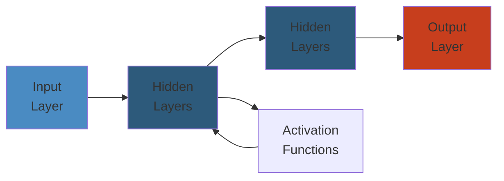

# 📦 Java Generics — Complete Deep Dive

**Related**: [Collections Framework](02-collections-framework.md) · [Streams & Lambda](07-streams-lambda.md) · [OOP Concepts](01-oop-concepts.md)

---




## Table of Contents

- [What Are Generics?](#-what-are-generics)
- [1. Generic Classes](#1-generic-classes)
- [2. Generic Methods](#2-generic-methods)
- [3. Bounded Type Parameters](#3-bounded-type-parameters)
- [4. Wildcards](#4-wildcards)
- [5. Type Erasure](#5-type-erasure)
- [6. Generic Inheritance](#6-generic-inheritance)
- [7. Raw Types & Legacy Code](#7-raw-types--legacy-code)
- [8. Common Patterns](#8-common-patterns)
- [Common Pitfalls](#-common-pitfalls)
- [Simplest Mental Model](#-simplest-mental-model)

---

## 🧭 What Are Generics?

**Definition**: Generics enable types (classes and interfaces) to be parameters when defining classes, interfaces, and methods.

### Before Generics

```java
// ❌ BAD — no type safety
List list = new ArrayList();
list.add("hello");
list.add(123);

String s = (String) list.get(0);  // need cast
String t = (String) list.get(1);  // ClassCastException at RUNTIME!
```

### With Generics

```java
// ✅ GOOD — compile-time type safety
List<String> list = new ArrayList<>();
list.add("hello");
// list.add(123);  // COMPILE ERROR!

String s = list.get(0);  // no cast needed
```

---

## 1. Generic Classes

### Basic Generic Class

```java
public class Box<T> {
    private T content;

    public Box(T content) {
        this.content = content;
    }

    public T getContent() {
        return content;
    }

    public void setContent(T content) {
        this.content = content;
    }

    public boolean isEmpty() {
        return content == null;
    }
}

// Usage
Box<String> stringBox = new Box<>("hello");  // diamond operator <>
Box<Integer> intBox = new Box<>(42);
Box<Box<String>> nestedBox = new Box<>(stringBox);

String content = stringBox.getContent();  // no cast
```

### Multiple Type Parameters

```java
public class Pair<K, V> {
    private final K key;
    private final V value;

    public Pair(K key, V value) {
        this.key = key;
        this.value = value;
    }

    public K getKey() { return key; }
    public V getValue() { return value; }

    public static <K, V> Pair<K, V> of(K key, V value) {
        return new Pair<>(key, value);
    }
}

// Usage
Pair<String, Integer> pair = new Pair<>("age", 30);
Pair<String, String> entry = Pair.of("key", "value");
```

### Generic Interface

```java
public interface Repository<T, ID> {
    T findById(ID id);
    List<T> findAll();
    void save(T entity);
    void delete(T entity);
    boolean existsById(ID id);
}

// Implementation
public class UserRepository implements Repository<User, Long> {
    @Override
    public User findById(Long id) {
        // query DB
        return new User(id);
    }

    @Override
    public List<User> findAll() {
        return new ArrayList<>();
    }

    @Override
    public void save(User entity) {
        // persist
    }

    @Override
    public void delete(User entity) {
        // remove
    }

    @Override
    public boolean existsById(Long id) {
        return false;
    }
}
```

### Type Parameter Naming Conventions

| Letter | Meaning | Example |
|--------|---------|---------|
| E | Element | `List<E>`, `Set<E>` |
| K | Key | `Map<K, V>` |
| V | Value | `Map<K, V>` |
| N | Number | `Box<N>` |
| T | Type | `Box<T>` |
| S, U, V | 2nd, 3rd, 4th types | `Transformer<T, U>` |
| R | Return type | `Function<T, R>` |

---

## 2. Generic Methods

### Basic Generic Method

```java
public class Utilities {
    // Generic method — type parameter before return type
    public static <T> T getMiddle(T... array) {
        return array[array.length / 2];
    }

    public static <T> T getFirst(List<T> list) {
        if (list.isEmpty()) {
            throw new NoSuchElementException();
        }
        return list.get(0);
    }

    public static <T> void swap(T[] array, int i, int j) {
        T temp = array[i];
        array[i] = array[j];
        array[j] = temp;
    }
}

// Usage
String mid = Utilities.getMiddle("a", "b", "c");     // "b"
Integer midNum = Utilities.getMiddle(1, 2, 3, 4, 5); // 3

// Type inference
String first = Utilities.getFirst(List.of("a", "b"));
```

### Generic Method in Non-Generic Class

```java
public class Collections {
    // Generic static method
    @SuppressWarnings("unchecked")
    public static <T> List<T> emptyList() {
        return (List<T>) EMPTY_LIST;
    }

    // Generic method with type bounds
    public static <T extends Comparable<? super T>> void sort(List<T> list) {
        list.sort(null);
    }

    // Multiple bounds on method
    public static <T extends Serializable & Comparable<T>> T max(List<T> list) {
        T max = list.get(0);
        for (T item : list) {
            if (item.compareTo(max) > 0) {
                max = item;
            }
        }
        return max;
    }
}
```

### Type Inference

```java
// Java 7: explicit type argument
List<String> list = Collections.<String>emptyList();

// Java 8+: compiler infers from context
List<String> list = Collections.emptyList();

// Method arguments
processPair(Pair.<String, Integer>of("age", 30));  // explicit
processPair(Pair.of("age", 30));                    // inferred (Java 8+)
```

---

## 3. Bounded Type Parameters

### Upper Bounded

```java
// T must extend Number (or Number itself)
public class NumericBox<T extends Number> {
    private final T value;

    public NumericBox(T value) {
        this.value = value;
    }

    public double doubleValue() {
        return value.doubleValue();
    }

    public int intValue() {
        return value.intValue();
    }
}

// Usage
NumericBox<Integer> intBox = new NumericBox<>(42);
NumericBox<Double> dblBox = new NumericBox<>(3.14);
NumericBox<BigDecimal> bigBox = new NumericBox<>(BigDecimal.TEN);
// NumericBox<String> strBox = new NumericBox<>("hello");  // COMPILE ERROR!

// Bounded generic method
public static <T extends Comparable<T>> T max(T a, T b) {
    return a.compareTo(b) > 0 ? a : b;
}
```

### Multiple Bounds

```java
// T must extend A AND implement B and C
// Class first, then interfaces (separated by &)
public class MultiBound<T extends Comparable<T> & Serializable> {
    private final T value;

    public MultiBound(T value) {
        this.value = value;
    }

    public int compareTo(T other) {
        return value.compareTo(other);
    }

    public byte[] serialize() throws IOException {
        try (ByteArrayOutputStream bos = new ByteArrayOutputStream();
             ObjectOutputStream oos = new ObjectOutputStream(bos)) {
            oos.writeObject(value);
            return bos.toByteArray();
        }
    }
}
```

### Lower Bounded (for wildcards only)

```java
// Cannot use lower bound on type parameter (only wildcard)
// ❌ public class Box<T super Number> — COMPILE ERROR
// ✅ Use wildcard instead: Box<? super Number>
```

---

## 4. Wildcards

### Unbounded Wildcard (?)

```java
// ? means "any type"
public class WildcardExamples {
    // Accept any List
    public static void printList(List<?> list) {
        for (Object elem : list) {
            System.out.print(elem + " ");
        }
        System.out.println();

        // Can read as Object
        Object first = list.get(0);

        // CANNOT add (except null)
        // list.add("hello");     // COMPILE ERROR
        // list.add(42);          // COMPILE ERROR
        list.add(null);            // OK (null is valid for any type)
    }
}

// Usage
printList(List.of(1, 2, 3));
printList(List.of("a", "b", "c"));
printList(new ArrayList<Integer>());
```

### Upper Bounded Wildcard (? extends T)

```java
// ? extends Number — can be Number or any subclass
public static double sumOfList(List<? extends Number> list) {
    double sum = 0.0;
    for (Number num : list) {  // read as Number
        sum += num.doubleValue();
    }
    return sum;
}

// Usage
sumOfList(List.of(1, 2, 3));          // Integer → OK
sumOfList(List.of(1.5, 2.5, 3.5));    // Double → OK
sumOfList(List.of(BigDecimal.ONE));    // BigDecimal → OK

// CAN read (as the upper bound)
// CANNOT write (except null)
List<? extends Number> nums = new ArrayList<Integer>();
// nums.add(42);       // COMPILE ERROR — could be List<Double>!
// nums.add(3.14);     // COMPILE ERROR
Number n = nums.get(0);  // OK — read as Number
```

### Lower Bounded Wildcard (? super T)

```java
// ? super Integer — can be Integer or any superclass
public static void addNumbers(List<? super Integer> list) {
    // CAN write (Integer or subtypes)
    list.add(1);
    list.add(2);
    list.add(3);

    // CANNOT read as specific type (only Object)
    Object obj = list.get(0);
    // Integer i = list.get(0);   // COMPILE ERROR!
}

// Usage
List<Number> numbers = new ArrayList<>();
addNumbers(numbers);  // OK — Number is super of Integer

List<Object> objects = new ArrayList<>();
addNumbers(objects);  // OK — Object is super of Integer

List<Integer> integers = new ArrayList<>();
addNumbers(integers);  // OK — Integer is same
```

### PECS (Producer Extends, Consumer Super)

```java
// PECS — Producer Extends, Consumer Super
// If you READ items → use ? extends T (producer)
// If you WRITE items → use ? super T (consumer)

public class PECSExample {
    // Producer: copy from src (we READ from src)
    public static <T> void copy(
            List<? extends T> src,   // producer
            List<? super T> dest) {  // consumer
        for (T item : src) {
            dest.add(item);
        }
    }

    // Producer: we only READ from collection
    public static double sum(Collection<? extends Number> producer) {
        double total = 0;
        for (Number n : producer) {
            total += n.doubleValue();
        }
        return total;
    }

    // Consumer: we only WRITE to collection
    public static <T> void fill(Collection<? super T> consumer, T item) {
        for (int i = 0; i < 10; i++) {
            consumer.add(item);
        }
    }
}

// Usage
List<Integer> src = List.of(1, 2, 3);
List<Number> dest = new ArrayList<>();
copy(src, dest);  // src produces, dest consumes
```

### Wildcard vs Type Parameter

| Aspect | Wildcard (`?`) | Type Parameter (`<T>`) |
|--------|---------------|----------------------|
| Syntax | `List<?>` | `<T> List<T>` |
| Multiple bounds | Not directly | `<T extends A & B>` |
| Used in method signature | `void process(List<?> list)` | `<T> void process(List<T> list)` |
| Relate multiple params | Cannot | `<T> void copy(List<T> src, List<T> dest)` |
| Lower bound | ✅ `? super T` | ❌ |
| When to use | Simple, single-use | Need to relate multiple args |

---

## 5. Type Erasure

### What is Type Erasure?

```java
// Generics exist ONLY at compile time for type checking.
// At runtime, generic type information is ERASED.

// Source code:
List<String> strings = new ArrayList<>();
List<Integer> integers = new ArrayList<>();
strings.add("hello");
String s = strings.get(0);

// After erasure (at runtime):
List strings = new ArrayList();         // raw type
List integers = new ArrayList();        // raw type
strings.add("hello");
String s = (String) strings.get(0);    // added cast

// Both strings and integers are just ArrayList at runtime!
strings.getClass() == integers.getClass();  // true!
```

### How Erasure Works

```java
// Unbounded type parameter → erased to Object
public class Box<T> {
    private T value;               // → Object value
    public T get() { return value; } // → Object get()
    public void set(T v) {         // → void set(Object v)
        this.value = v;
    }
}

// Bounded type parameter → erased to bound
public class Box<T extends Comparable<T>> {
    private T value;               // → Comparable value
    public T get() { return value; } // → Comparable get()
}

// Multiple bounds → erased to first bound
public class Box<T extends Comparable<T> & Serializable> {
    // → erased to Comparable (first bound)
    // Compiler adds cast to Serializable where needed
}
```

### Bridge Methods

```java
// Compiler generates bridge methods for polymorphism with generics

// Source:
public class Parent<T> {
    public T get(T value) {
        return value;
    }
}

public class Child extends Parent<String> {
    @Override
    public String get(String value) {
        return value.toUpperCase();
    }
}

// After erasure, Child has TWO get methods:
// 1. Bridge method (synthetic):
//    public Object get(Object value) {
//        return (String) get((String) value);  // calls typed version
//    }
// 2. Typed method:
//    public String get(String value) {
//        return value.toUpperCase();
//    }

// The bridge method ensures polymorphism still works:
// Parent p = new Child();
// p.get("hello");  // calls bridge → typed version
```

### Runtime Type Information Limitations

```java
// ❌ Cannot use instanceof with generic types
public static <T> boolean isInstance(Object obj) {
    // return obj instanceof T;  // COMPILE ERROR — T erased
    return false;
}

// ❌ Cannot create generic arrays
// T[] array = new T[10];  // COMPILE ERROR

// ✅ Workaround: use Array.newInstance
@SuppressWarnings("unchecked")
public static <T> T[] createArray(Class<T> clazz, int size) {
    return (T[]) Array.newInstance(clazz, size);
}

// ❌ Cannot use new T()
// T value = new T();  // COMPILE ERROR

// ✅ Workaround: use Supplier
public static <T> T create(Supplier<T> factory) {
    return factory.get();
}
```

### Reifiable Types

```java
// Reifiable = type information fully available at runtime
// These ARE reifiable:
// 1. Primitive types: int, long, double
// 2. Non-generic types: String, Integer
// 3. Raw types: List, Map
// 4. Unbounded wildcard: List<?>, Map<?, ?>

// These are NOT reifiable (heap pollution risk):
// 1. Parameterized types: List<String>
// 2. Bounded wildcards: List<? extends Number>

// Heap pollution:
List<String>[] array = new List[10];  // OK (raw type array)
Object[] objArray = array;
objArray[0] = List.of(1, 2, 3);      // Heap pollution!
String s = array[0].get(0);          // ClassCastException!
```

---

## 6. Generic Inheritance

### Subtypes with Generics

```java
// List<Integer> is NOT a subtype of List<Number>!
// (Invariance — even though Integer is subtype of Number)

List<Integer> ints = new ArrayList<>();
// List<Number> nums = ints;  // COMPILE ERROR!

// Why? If allowed:
// nums.add(3.14);          // would corrupt ints!
// Integer i = ints.get(0); // ClassCastException!

// Arrays ARE covariant (dangerous):
Integer[] intArray = new Integer[10];
Number[] numArray = intArray;  // OK (arrays are covariant)
numArray[0] = 3.14;            // ArrayStoreException at runtime!
```

### Covariance and Contravariance

```java
// COVARIANCE — read-only access
// ? extends → can read, cannot write
List<? extends Number> covariant = new ArrayList<Integer>();
Number n = covariant.get(0);     // OK
// covariant.add(42);             // COMPILE ERROR

// CONTRAVARIANCE — write-only (mostly)
// ? super → can write, limited read
List<? super Integer> contravariant = new ArrayList<Number>();
contravariant.add(42);           // OK
Object obj = contravariant.get(0); // OK (as Object)
// Integer i = contravariant.get(0); // COMPILE ERROR

// INVARIANCE — neither direction
// List<T> is invariant — only exactly T
List<Integer> invariant = new ArrayList<>();
// invariant = new ArrayList<Number>();  // COMPILE ERROR
```

### Subclassing Generic Classes

```java
public class Entity<K extends Comparable<K>> {
    protected K id;

    public Entity(K id) {
        this.id = id;
    }

    public K getId() { return id; }
}

// Subclass — must specify type arguments
public class User extends Entity<Long> {
    private String name;

    public User(Long id, String name) {
        super(id);
        this.name = name;
    }
}

// Generic subclass
public class OrderedEntity<K extends Comparable<K>>
        extends Entity<K> {
    private int order;

    public OrderedEntity(K id, int order) {
        super(id);
        this.order = order;
    }
}
```

---

## 7. Raw Types & Legacy Code

### What Are Raw Types?

```java
// Raw type = generic class used without type arguments
// EXIST ONLY for backward compatibility with pre-Java 5 code

// Generic version:
List<String> strings = new ArrayList<>();  // proper

// Raw type:
List rawList = new ArrayList();  // raw type — DON'T USE!

// Raw types disable all generic type checking:
List<String> strings = new ArrayList<>();
List raw = strings;              // OK (raw → generic)
raw.add(42);                     // No compile error!
String s = strings.get(0);       // ClassCastException!
```

### Rules for Raw Types

```java
// 1. Raw type assignment
List<String> generic = new ArrayList<>();
List raw = generic;  // OK — raw assigned from generic

// 2. Generic assignment from raw
List<String> strings = raw;  // Unchecked warning (compiler warns)

// 3. Raw types disable type checking
raw.add("hello");
raw.add(42);  // No warning!
raw.add(new Object());  // No warning!

// 4. Using raw type parameters in methods
public static void processRaw(List raw) {
    // All type safety lost!
}
```

### Unchecked Warnings

```java
// Compiler warning: unchecked operation
// Can suppress with @SuppressWarnings("unchecked")

@SuppressWarnings("unchecked")
public <T> List<T> unsafeCast(List<?> list) {
    return (List<T>) list;  // unchecked cast — but we control it
}

// Better: avoid raw types entirely
@SuppressWarnings("unchecked")
public <T> T[] toArray(List<T> list, IntFunction<T[]> arrayFactory) {
    T[] array = arrayFactory.apply(list.size());
    return list.toArray(array);  // type-safe
}
```

### Why We Don't Use Raw Types

```java
// 1. Type safety violations
List raw = new ArrayList();
raw.add("string");
raw.add(42);
for (Object o : raw) {
    // Must check instanceof for every element
}

// 2. Autoboxing doesn't work
List<Integer> ints = new ArrayList<>();
List rawInts = ints;
rawInts.add(42);          // OK (autoboxing to Integer)
int val = (Integer) rawInts.get(0);  // Explicit cast needed

// 3. Performance — no hidden casts
// Generics: compiler inserts casts automatically
```

---

## 8. Common Patterns

### Type Token Pattern

```java
// Passing Class<T> as runtime type token
public class JSONParser {
    public static <T> T parse(String json, Class<T> type) {
        // Jackson/gson serialization uses this pattern
        ObjectMapper mapper = new ObjectMapper();
        try {
            return mapper.readValue(json, type);
        } catch (Exception e) {
            throw new RuntimeException("Parse failed", e);
        }
    }
}

// Usage
User user = JSONParser.parse(jsonString, User.class);
List<User> users = mapper.readValue(
    jsonArray,
    new TypeReference<List<User>>() {}
);
```

### Generic Builder Pattern

```java
public class GenericBuilder<T> {
    private final T instance;

    private GenericBuilder(Supplier<T> factory) {
        this.instance = factory.get();
    }

    public static <T> GenericBuilder<T> of(Supplier<T> factory) {
        return new GenericBuilder<>(factory);
    }

    public <V> GenericBuilder<T> with(
            BiConsumer<T, V> setter, V value) {
        setter.accept(instance, value);
        return this;
    }

    public T build() {
        return instance;
    }
}

// Usage
User user = GenericBuilder.of(User::new)
    .with(User::setName, "Alice")
    .with(User::setAge, 30)
    .build();
```

### Type-Safe Heterogeneous Container

```java
// Store values of arbitrary types in a type-safe way
public class TypeSafeMap {
    private final Map<Class<?>, Object> map = new HashMap<>();

    public <T> void put(Class<T> type, T value) {
        map.put(Objects.requireNonNull(type), type.cast(value));
    }

    @SuppressWarnings("unchecked")
    public <T> T get(Class<T> type) {
        return type.cast(map.get(type));
    }
}

// Usage
TypeSafeMap container = new TypeSafeMap();
container.put(String.class, "hello");
container.put(Integer.class, 42);
container.put(List.class, List.of(1, 2, 3));

String s = container.get(String.class);   // "hello" — no cast!
Integer i = container.get(Integer.class); // 42 — no cast!
```

### Generic DAO Pattern

```java
public abstract class AbstractDAO<T, ID> {
    private final Class<T> entityType;

    protected AbstractDAO(Class<T> entityType) {
        this.entityType = entityType;
    }

    public T findById(ID id) {
        // em.find(entityType, id);
        return null;
    }

    public List<T> findAll() {
        // return em.createQuery("FROM " + entityType.getName(), entityType)
        //     .getResultList();
        return new ArrayList<>();
    }

    public void save(T entity) {
        // em.persist(entity);
    }
}

// Concrete DAO
public class UserDAO extends AbstractDAO<User, Long> {
    public UserDAO() {
        super(User.class);
    }

    // Additional User-specific methods
    public User findByEmail(String email) {
        // custom query
        return null;
    }
}
```

---

## ⚠️ Common Pitfalls

| Pitfall | Issue | Fix |
|---------|-------|-----|
| Cannot create `new T()` | Type erasure removes T | Pass `Class<T>` or `Supplier<T>` |
| Cannot create `new T[size]` | Reifiable type needed | `(T[]) Array.newInstance(clazz, size)` |
| Cannot `instanceof T` | Type erased at runtime | `clazz.isInstance(obj)` |
| Cannot `instanceof List<String>` | Not reifiable | Check raw `instanceof List` |
| Raw type usage | Type safety lost | Always use parameterized types |
| Generic array creation | `new List<String>[10]` | Use `List<List<String>>` or `ArrayList` |
| Static field of type param | `static T field` — not allowed | Different for each instance |
| Overloading with erasure | `process(List<String>)` and `process(List<Integer>)` same after erasure | Different method names |
| ClassCastException on bridge | Confusing stack trace | Understand bridge methods |
| Wildcard capture | `T` in `List<?>` not recognized | Helper method with `<T>` |

---

## 🧠 Simplest Mental Model

```text
GENERICS       =  A template for a cookie cutter. You specify the shape
                  (type) when you use it, not when you make it.

TYPE PARAMETER =  A blank on a form. You fill "String" or "Integer"
                  when you use the form.

TYPE ERASURE   =  After the form is processed, the blanks are erased.
                  At runtime, only the raw form exists.
                  The compiler added invisible casts where needed.

WILDCARD (? extends) = A "read-only" label. "You can look at items
                       as Numbers, but don't put anything in."

WILDCARD (? super)   = A "write-only" label. "You can put Integers,
                       but when you read, you only know it's an Object."

PECS           =  Producer Extends, Consumer Super.
                  If the collection GIVES you items → extends.
                  If the collection TAKES your items → super.

INVARIANCE     =  A box labeled "Apples" can only hold Apples.
                  You can't put it where "Fruit" box is expected,
                  because someone might put an Orange in.

COVARIANCE     =  A read-only box of Apples can be treated as
                  read-only box of Fruit. You can only look.

CONTRAVARIANCE =  A write-only box of Fruit can accept Apples.
                  You can only put things in.

BRIDGE METHOD  =  A translator that makes old code (without generics)
                  work with new code (with generics) seamlessly.
```

---

**Next**: [Java I/O & NIO](09-io-nio.md) — File I/O, streams, channels, buffers
