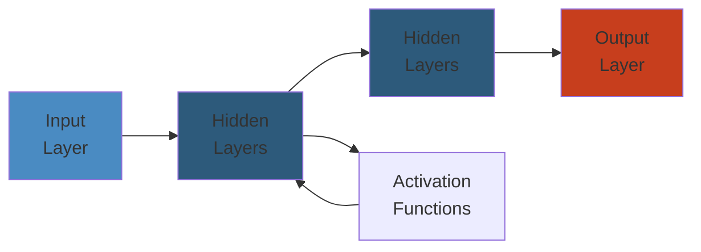

# @ Java Annotations & Reflection — Complete Deep Dive

**Related**: [JVM Architecture](05-jvm-architecture.md) · [Generics](08-generics.md) · [Java 8+ Features](11-java-8-features.md) · [Spring Boot](12-spring-boot.md)

---




## Table of Contents

- [What Are Annotations?](#-what-are-annotations)
- [1. Built-in Annotations](#1-built-in-annotations)
- [2. Creating Custom Annotations](#2-creating-custom-annotations)
- [3. Meta-Annotations](#3-meta-annotations)
- [4. Annotation Processing](#4-annotation-processing)
- [5. Reflection API](#5-reflection-api)
- [6. Reflection in Practice](#6-reflection-in-practice)
- [7. Runtime Annotation Processing](#7-runtime-annotation-processing)
- [8. Compile-Time Annotation Processing](#8-compile-time-annotation-processing)
- [9. Performance & Security](#9-performance--security)
- [Common Pitfalls](#-common-pitfalls)
- [Simplest Mental Model](#-simplest-mental-model)

---

## 🧭 What Are Annotations?

**Definition**: Metadata added to Java code (classes, methods, fields, etc.) that can be processed at compile-time or runtime.

```text
                    ┌─────────────────────────────┐
                    │     Java Annotations        │
                    ├─────────────────────────────┤
                    │                             │
                    │  @Override                  │
                    │  public void myMethod() {   │ ← annotation
                    │      // code                │   adds metadata
                    │  }                          │
                    │                             │
                    └─────────────────────────────┘
                              │
            ┌─────────────────┼─────────────────┐
            ▼                 ▼                  ▼
    ┌──────────────┐  ┌──────────────┐  ┌──────────────┐
    │ Compiler     │  │ Code Gen     │  │ Runtime      │
    │ Checks       │  │ Lombok,      │  │ Reflection,  │
    │ @Override,   │  │ MapStruct,   │  │ @Test,       │
    │ @SuppressWarnings│ AutoValue │  │ Spring, JPA  │
    └──────────────┘  └──────────────┘  └──────────────┘
```

---

## 1. Built-in Annotations

### Compile-Time Checks

```java
public class BuiltInDemo {
    // @Override — compiler checks parent has this method
    @Override
    public String toString() {
        return "BuiltInDemo instance";
    }

    // @Deprecated — marks method as outdated
    @Deprecated
    public void oldMethod() {
        // still works but shouldn't be used
    }

    // @SuppressWarnings — hide specific warnings
    @SuppressWarnings("unchecked")
    public <T> T unsafeCast(Object obj) {
        return (T) obj;  // unchecked cast — warning suppressed
    }

    // @SafeVarargs — suppresses heap pollution warning on varargs
    @SafeVarargs
    public final <T> List<T> flatten(List<T>... lists) {
        List<T> result = new ArrayList<>();
        for (List<T> list : lists) {
            result.addAll(list);
        }
        return result;
    }

    // @FunctionalInterface — must have exactly one abstract method
    @FunctionalInterface
    interface MyFunction {
        void execute();
        // default methods are OK
        default void log() { System.out.println("Executing..."); }
        // static methods are OK
        static MyFunction noop() { return () -> {}; }
    }
}
```

### @FunctionalInterface Contract

```java
@FunctionalInterface
interface Converter<F, T> {
    T convert(F from);  // single abstract method

    // ✓ default method
    default Converter<F, T> andThen(Converter<T, T> after) {
        return f -> after.convert(this.convert(f));
    }

    // ✓ static method
    static <T> Converter<T, T> identity() {
        return t -> t;
    }

    // equals is NOT counted (from Object)
    boolean equals(Object obj);
}
```

---

## 2. Creating Custom Annotations

### Annotation Declaration

```java
import java.lang.annotation.*;

@Retention(RetentionPolicy.RUNTIME)  // available at runtime
@Target(ElementType.METHOD)          // only on methods
public @interface LogExecution {
    // Elements (look like methods)
    String value() default "";               // special — can use shorthand
    LogLevel level() default LogLevel.INFO;
    boolean includeArgs() default false;
    boolean includeResult() default true;
}

enum LogLevel { DEBUG, INFO, WARN, ERROR }
```

### Using Custom Annotations

```java
public class MyService {
    // Full syntax
    @LogExecution(
        value = "processOrder",
        level = LogLevel.INFO,
        includeArgs = true
    )
    public void processOrder(Order order) { /* ... */ }

    // Shorthand (if element named 'value')
    @LogExecution("quickMethod")
    public void quickMethod() { /* ... */ }

    // Defaults
    @LogExecution
    public void defaultMethod() { /* ... */ }
}
```

### Annotation Element Types

```java
// Allowed types for annotation elements:
// 1. Primitive types: int, long, double, boolean, etc.
// 2. String
// 3. Class (including generics: Class<?>)
// 4. Enum
// 5. Annotation
// 6. Arrays of the above

@Retention(RetentionPolicy.RUNTIME)
@Target(ElementType.TYPE)
public @interface EntityConfig {
    String tableName();
    String schema() default "public";
    boolean cacheable() default false;
    int cacheSize() default 100;
    Class<?> validator() default DefaultValidator.class;
    LogLevel logLevel() default LogLevel.WARN;
    String[] aliases() default {};
    Class<? extends Exception>[] retryOn() default {};
}

// DefaultValidator example
class DefaultValidator {
    public boolean isValid(Object entity) { return true; }
}
```

---

## 3. Meta-Annotations

### @Retention

```text
@Retention(RetentionPolicy.SOURCE)
  └── Discarded by compiler. NOT in .class file.
  └── Examples: @Override, @SuppressWarnings

@Retention(RetentionPolicy.CLASS)
  └── Stored in .class file but NOT available at runtime.
  └── Default if not specified.
  └── Examples: Lombok @Getter, @Setter

@Retention(RetentionPolicy.RUNTIME)
  └── Stored in .class AND available via reflection.
  └── Examples: @Test, @SpringBootApplication, @Entity
```

### @Target

```java
// Where the annotation can be applied

@Target(ElementType.TYPE)           // class, interface, enum
@Target(ElementType.FIELD)          // field (including enum constants)
@Target(ElementType.METHOD)         // method
@Target(ElementType.PARAMETER)      // method/constructor parameter
@Target(ElementType.CONSTRUCTOR)    // constructor
@Target(ElementType.LOCAL_VARIABLE) // local variable
@Target(ElementType.ANNOTATION_TYPE)// annotation type
@Target(ElementType.PACKAGE)        // package
@Target(ElementType.TYPE_PARAMETER) // type parameter <T> (Java 8+)
@Target(ElementType.TYPE_USE)       // type use: List<@NonNull String> (Java 8+)
@Target(ElementType.MODULE)         // module (Java 9+)

// Multiple targets
@Target({ElementType.TYPE, ElementType.METHOD})
```

### @Inherited

```java
// If annotation is on a class, subclasses inherit it
@Inherited
@Retention(RetentionPolicy.RUNTIME)
@Target(ElementType.TYPE)
public @interface MyAnnotation { }

@MyAnnotation
class Parent { }

class Child extends Parent { }
// Child also has @MyAnnotation!
```

### @Repeatable (Java 8+)

```java
// Container annotation
@Retention(RetentionPolicy.RUNTIME)
@Target(ElementType.METHOD)
public @interface Schedules {
    Schedule[] value();
}

// Repeatable annotation
@Repeatable(Schedules.class)
@Retention(RetentionPolicy.RUNTIME)
@Target(ElementType.METHOD)
public @interface Schedule {
    String dayOfWeek() default "Mon";
    String time() default "12:00";
}

// Usage
public class Scheduler {
    @Schedule(dayOfWeek = "Mon", time = "09:00")
    @Schedule(dayOfWeek = "Wed", time = "14:00")
    @Schedule(dayOfWeek = "Fri", time = "11:00")
    public void weeklyMeeting() { }
}
```

---

## 4. Annotation Processing

### Compile-Time Processing (Annotation Processor)

```text
                    ┌─────────────────────────────┐
                    │     Java Source Code        │
                    │  @Builder                   │
                    │  class Person { ... }       │
                    └────────────┬────────────────┘
                                 │
                                 ▼
                    ┌─────────────────────────────┐
                    │   Annotation Processor       │
                    │   (AbstractProcessor)        │
                    │   Round 1: Person found     │
                    │   Generate PersonBuilder.java│
                    └────────────┬────────────────┘
                                 │
                                 ▼
                    ┌─────────────────────────────┐
                    │   Generated Source File      │
                    │   PersonBuilder.java         │
                    │   (writes to build/generated)│
                    └─────────────────────────────┘
```

### Runtime Processing (Reflection)

```text
                    ┌─────────────────────────────┐
                    │      Class loaded            │
                    │  @Entity                     │
                    │  class User { ... }         │
                    └────────────┬────────────────┘
                                 │
                                 ▼
                    ┌─────────────────────────────┐
                    │   Reflection API              │
                    │   cls.getAnnotation(Entity)  │
                    │   cls.getDeclaredMethods()   │
                    │   method.getAnnotation(...)  │
                    └────────────┬────────────────┘
                                 │
                                 ▼
                    ┌─────────────────────────────┐
                    │      Runtime Action           │
                    │  ORM: generate SQL           │
                    │  DI: inject dependencies     │
                    │  Test: discover & run tests  │
                    └─────────────────────────────┘
```

---

## 5. Reflection API

### Core Reflection Classes

```java
// java.lang.reflect package
Class<?>          // represents a class/interface
Constructor<?>    // a constructor
Method            // a method
Field             // a field
Parameter         // a method parameter
Modifier          // access modifiers (public, static, etc.)
Array             // dynamic array creation
Proxy             // dynamic proxy creation
```

### Getting Class Objects

```java
// Method 1: .class literal
Class<String> c1 = String.class;

// Method 2: getClass() on instance
String s = "hello";
Class<? extends String> c2 = s.getClass();

// Method 3: Class.forName()
Class<?> c3 = Class.forName("java.lang.String");

// Method 4: primitive wrappers
Class<Integer> c4 = Integer.TYPE;  // int.class
Class<Integer> c5 = Integer.class; // Integer.class (different!)
```

### Inspecting Classes

```java
public class ReflectionInspector {
    public static void inspectClass(String className) throws Exception {
        Class<?> clazz = Class.forName(className);

        System.out.println("Class: " + clazz.getName());
        System.out.println("Simple: " + clazz.getSimpleName());
        System.out.println("Package: " + clazz.getPackageName());
        System.out.println("Modifiers: " + Modifier.toString(clazz.getModifiers()));
        System.out.println("Superclass: " + clazz.getSuperclass());
        System.out.println("Interfaces: " + Arrays.toString(clazz.getInterfaces()));

        System.out.println("\nConstructors:");
        for (Constructor<?> c : clazz.getDeclaredConstructors()) {
            System.out.println("  " + c);
        }

        System.out.println("\nMethods:");
        for (Method m : clazz.getDeclaredMethods()) {
            System.out.println("  " + m.getName() + " → " + m.getReturnType());
        }

        System.out.println("\nFields:");
        for (Field f : clazz.getDeclaredFields()) {
            System.out.println("  " + f.getName() + " : " + f.getType());
        }
    }
}
```

### Accessing Fields

```java
class Person {
    private String name = "Unknown";
    public int age = 0;
}

public class FieldAccessDemo {
    public static void main(String[] args) throws Exception {
        Person p = new Person();
        Class<?> clazz = p.getClass();

        // Get public field
        Field ageField = clazz.getField("age");
        System.out.println(ageField.get(p));  // 0
        ageField.set(p, 25);
        System.out.println(p.age);  // 25

        // Get private field (need setAccessible)
        Field nameField = clazz.getDeclaredField("name");
        nameField.setAccessible(true);  // bypass private
        System.out.println(nameField.get(p));  // "Unknown"
        nameField.set(p, "Alice");
        System.out.println(nameField.get(p));  // "Alice"

        // Static field
        Field staticField = clazz.getDeclaredField("DEFAULT_NAME");
        System.out.println(staticField.get(null));  // pass null for static
    }
}
```

### Invoking Methods

```java
public class MethodInvocationDemo {
    public static void main(String[] args) throws Exception {
        Method[] methods = String.class.getDeclaredMethods();

        // Find method by name and parameter types
        Method lengthMethod = String.class.getMethod("length");
        String str = "hello";

        // Invoke
        int length = (int) lengthMethod.invoke(str);
        System.out.println(length);  // 5

        // Method with parameters
        Method substringMethod = String.class.getMethod("substring", int.class, int.class);
        String result = (String) substringMethod.invoke(str, 1, 4);
        System.out.println(result);  // "ell"

        // Private method
        Method privateMethod = String.class.getDeclaredMethod("somePrivateMethod");
        privateMethod.setAccessible(true);
        privateMethod.invoke(str);
    }
}
```

### Creating Instances via Reflection

```java
public class ReflectionCreationDemo {
    public static void main(String[] args) throws Exception {
        // Old way: Class.newInstance() (deprecated in Java 9)
        String s1 = String.class.newInstance();  // deprecated!

        // Modern way: Constructor.newInstance()
        Constructor<String> constructor = String.class.getConstructor(String.class);
        String s2 = constructor.newInstance("hello");

        // Or with no-arg
        Constructor<String> noArg = String.class.getConstructor();
        String s3 = noArg.newInstance();

        // Array creation
        int[] intArray = (int[]) Array.newInstance(int.class, 10);
        Array.set(intArray, 0, 42);
        System.out.println(Array.get(intArray, 0));  // 42

        // Generic array
        String[] strArray = (String[]) Array.newInstance(String.class, 5);
    }
}
```

### Retrieving Annotations at Runtime

```java
@Retention(RetentionPolicy.RUNTIME)
@Target(ElementType.METHOD)
@interface TestInfo {
    String author() default "unknown";
    String date();
    int version() default 1;
}

public class AnnotationReader {
    public static void main(String[] args) throws Exception {
        for (Method method : AnnotationReader.class.getDeclaredMethods()) {
            TestInfo info = method.getAnnotation(TestInfo.class);
            if (info != null) {
                System.out.println("Method: " + method.getName());
                System.out.println("  Author: " + info.author());
                System.out.println("  Date: " + info.date());
                System.out.println("  Version: " + info.version());
            }
        }
    }

    @TestInfo(author = "Alice", date = "2024-01-15")
    public void testMethod1() { }

    @TestInfo(date = "2024-02-20", version = 2)
    public void testMethod2() { }
}
```

---

## 6. Reflection in Practice

### Dynamic Proxy

```java
// Create proxy instances at runtime that implement given interfaces

interface Service {
    void doWork(String param);
    String getData(int id);
}

public class LoggingProxy {
    @SuppressWarnings("unchecked")
    public static <T> T createProxy(T target) {
        return (T) Proxy.newProxyInstance(
            target.getClass().getClassLoader(),
            target.getClass().getInterfaces(),
            (proxy, method, args) -> {
                System.out.println("Before: " + method.getName());
                Object result = method.invoke(target, args);
                System.out.println("After: " + method.getName());
                return result;
            }
        );
    }

    public static void main(String[] args) {
        Service realService = new Service() {
            public void doWork(String param) {
                System.out.println("Working with: " + param);
            }
            public String getData(int id) {
                return "Data for " + id;
            }
        };

        Service proxy = createProxy(realService);
        proxy.doWork("test");     // logs before/after
        String data = proxy.getData(42);
    }
}
```

### Dependency Injection (Mini Framework)

```java
// Simple DI framework using reflection

@Retention(RetentionPolicy.RUNTIME)
@Target(ElementType.FIELD)
@interface Inject { }

class Container {
    private final Map<Class<?>, Object> instances = new HashMap<>();

    public <T> void register(Class<T> type, T instance) {
        instances.put(type, instance);
    }

    public <T> T resolve(Class<T> type) {
        return type.cast(instances.get(type));
    }

    public void injectDependencies(Object target) throws Exception {
        Class<?> clazz = target.getClass();
        for (Field field : clazz.getDeclaredFields()) {
            if (field.isAnnotationPresent(Inject.class)) {
                field.setAccessible(true);
                Object dependency = resolve(field.getType());
                field.set(target, dependency);
            }
        }
    }
}

// Usage
class DatabaseService {
    public void save(String data) {
        System.out.println("Saved: " + data);
    }
}

class UserService {
    @Inject
    private DatabaseService db;

    public void createUser(String name) {
        db.save("User: " + name);
    }
}

public class Demo {
    public static void main(String[] args) throws Exception {
        Container container = new Container();
        container.register(DatabaseService.class, new DatabaseService());

        UserService userService = new UserService();
        container.injectDependencies(userService);
        userService.createUser("Alice");  // "Saved: User: Alice"
    }
}
```

### ORM Mapping

```java
@Retention(RetentionPolicy.RUNTIME)
@Target(ElementType.TYPE)
@interface Table {
    String name();
}

@Retention(RetentionPolicy.RUNTIME)
@Target(ElementType.FIELD)
@interface Column {
    String name();
    boolean primaryKey() default false;
}

@Table(name = "users")
class User {
    @Column(name = "id", primaryKey = true)
    private Long id;

    @Column(name = "username")
    private String username;

    @Column(name = "email")
    private String email;
}

public class SimpleORM {
    public String generateSelect(Class<?> entityClass, Object id) throws Exception {
        Table table = entityClass.getAnnotation(Table.class);
        if (table == null) throw new IllegalArgumentException("No @Table");

        StringBuilder sql = new StringBuilder("SELECT * FROM ");
        sql.append(table.name()).append(" WHERE ");

        for (Field field : entityClass.getDeclaredFields()) {
            Column col = field.getAnnotation(Column.class);
            if (col != null && col.primaryKey()) {
                sql.append(col.name()).append(" = ").append(id);
                break;
            }
        }

        return sql.toString();
        // → "SELECT * FROM users WHERE id = 42"
    }
}
```

---

## 7. Runtime Annotation Processing

### Complete Example: @LogExecution Processor

```java
import java.lang.reflect.Method;

@Retention(RetentionPolicy.RUNTIME)
@Target(ElementType.METHOD)
@interface LogExecution {
    String message() default "";
}

public class LogProcessor {
    public static Object process(Object target, String methodName, Object... args)
            throws Exception {
        Method method = target.getClass().getMethod(methodName,
            Arrays.stream(args).map(Object::getClass).toArray(Class[]::new));

        LogExecution logExec = method.getAnnotation(LogExecution.class);
        if (logExec != null) {
            String msg = logExec.message().isEmpty()
                ? "Executing " + methodName
                : logExec.message();
            System.out.println("[LOG] " + msg);
        }

        return method.invoke(target, args);
    }

    // Usage
    public static void main(String[] args) throws Exception {
        MyService service = new MyService();
        process(service, "doWork", "test data");
    }
}

class MyService {
    @LogExecution(message = "Processing order")
    public void doWork(String data) {
        System.out.println("Working on: " + data);
    }
}
```

---

## 8. Compile-Time Annotation Processing

### AbstractProcessor

```java
import javax.annotation.processing.*;
import javax.lang.model.SourceVersion;
import javax.lang.model.element.*;
import javax.tools.Diagnostic;
import java.util.Set;

@SupportedAnnotationTypes("com.example.Builder")
@SupportedSourceVersion(SourceVersion.RELEASE_11)
public class BuilderProcessor extends AbstractProcessor {

    @Override
    public boolean process(Set<? extends TypeElement> annotations,
                           RoundEnvironment roundEnv) {
        for (Element annotated : roundEnv.getElementsAnnotatedWith(Builder.class)) {
            if (annotated.getKind() != ElementKind.CLASS) {
                processingEnv.getMessager().printMessage(
                    Diagnostic.Kind.ERROR,
                    "@Builder only valid on classes",
                    annotated
                );
                continue;
            }

            TypeElement typeElement = (TypeElement) annotated;
            String className = typeElement.getSimpleName() + "Builder";
            String packageName = processingEnv.getElementUtils()
                .getPackageOf(typeElement).toString();

            // Generate source code
            try {
                JavaFileObject builderFile = processingEnv.getFiler()
                    .createSourceFile(packageName + "." + className);

                try (PrintWriter out = new PrintWriter(builderFile.openWriter())) {
                    out.println("package " + packageName + ";");
                    out.println("public class " + className + " {");
                    // ... generate builder fields and methods
                    out.println("}");
                }
            } catch (IOException e) {
                processingEnv.getMessager().printMessage(
                    Diagnostic.Kind.ERROR, e.toString(), annotated);
            }
        }
        return true;
    }
}
```

### ServiceLoader Registration

```text
To register an annotation processor:
1. Create file:
   META-INF/services/javax.annotation.processing.Processor
2. Content:
   com.example.BuilderProcessor
3. Or use google/auto-service:
   @AutoService(Processor.class)
   public class BuilderProcessor extends AbstractProcessor { ... }
```

---

## 9. Performance & Security

### Reflection Performance

```java
// Reflection is SLOWER than direct calls:
// 1. Method lookup by name (string comparison)
// 2. Boxing/unboxing of primitives
// 3. Array allocation for varargs
// 4. Security checks
// 5. JIT can't inline reflective calls

public class PerfComparison {
    public void directCall() {
        // ~2 ns
        obj.method();
    }

    public void reflectiveCall() throws Exception {
        // ~50-500 ns (first call slower, cached Method helps)
        Method m = obj.getClass().getMethod("method");
        m.invoke(obj);
    }

    // Caching improves performance significantly
    private static final Map<Class<?>, Map<String, Method>> METHOD_CACHE
        = new ConcurrentHashMap<>();

    public void cachedReflectiveCall(Object obj, String methodName) throws Exception {
        Method m = METHOD_CACHE
            .computeIfAbsent(obj.getClass(), c -> new ConcurrentHashMap<>())
            .computeIfAbsent(methodName, n -> {
                try { return obj.getClass().getMethod(n); }
                catch (NoSuchMethodException e) { throw new RuntimeException(e); }
            });
        m.invoke(obj);
    }
}
```

### setAccessible Security

```java
// setAccessible(true) bypasses Java access controls
// SecurityManager can restrict this:

// In security policy file:
// grant {
//     permission java.lang.reflect.ReflectPermission "suppressAccessChecks";
// };

// Without permission:
public class SecureClass {
    private void secretMethod() { /* ... */ }
}

// SecurityManager sm = System.getSecurityManager();
// if (sm != null) {
//     sm.checkPermission(new ReflectPermission("suppressAccessChecks"));
// }
// field.setAccessible(true);  // throws AccessControlException if not allowed

// Java 17+ modules: reflection on non-exported packages requires:
// --add-opens module/package=ALL-UNNAMED
```

---

## ⚠️ Common Pitfalls

| Pitfall | Issue | Fix |
|---------|-------|-----|
| No @Retention(RUNTIME) | Annotation not visible at runtime | Add `@Retention(RUNTIME)` |
| Primitive in annotation | null not allowed | Use default values |
| Reflection on lambda | InaccessibleMethod | Use method reference |
| setAccessible in Java 17+ | InaccessibleObjectException | Use --add-opens |
| Cached Method from different class | Wrong target type | Check declaring class |
| Forgetting to check retention | Runtime annotation not found | Verify annotation retention |
| Proxy only works on interfaces | Class-based proxy fails | Use CGLIB/ByteBuddy for classes |
| Performance overhead | Reflection in hot loops | Cache Method/Field objects |
| Array creation via reflection | Primitive arrays need special handling | Use Array.newInstance() |

---

## 🧠 Simplest Mental Model

```text
ANNOTATION     =  A sticky note stuck to your code. "This method is
                   a test", "This field is the ID", "This class is
                   a web controller."

@OVERRIDE      =  "Double-check that this method really does exist
                   in the parent class."

@DEPRECATED    =  "Warning: this is old and might go away. Don't use it."

@SUPPRESSWARNINGS = "I know this code is questionable. Don't warn me."

RETENTION      =  How long the sticky note stays:
                   SOURCE  → thrown away after compile (note on draft)
                   CLASS   → stays in .class but not usable at runtime
                   RUNTIME → stays forever, examinable at runtime

REFLECTION     =  A self-examination mirror. Your code can look at
                   itself, see its own fields, methods, and annotations.

setAccessible  =  "I know this is private/secret, but I need access
                   anyway." Like a skeleton key — powerful but dangerous.

PROXY          =  A body double. When someone calls methods on the proxy,
                   it can intercept, log, check permissions, then pass
                   the call to the real object.

ANNOTATION     =  Instead of editing 100 files to add logging,
PROCESSOR         you write @LogExecution, and a program generates
                   all the boilerplate for you.
```

---

**Next**: [Java 8+ Features](11-java-8-features.md) — Language and API improvements over versions
