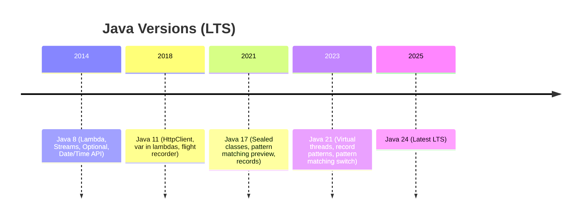

# 🔄 Java 8+ Features — What Changed in Each Version

**Related**: [Streams & Lambda](07-streams-lambda.md) · [Collections Framework](02-collections-framework.md) · [Generics](08-generics.md) · [Spring Boot](12-spring-boot.md)

---

## Table of Contents

- [Version Overview](#-version-overview)
- [Java 8 (2014) — The Big One](#java-8-2014--the-big-one)
- [Java 9 (2017) — Modules & More](#java-9-2017--modules--more)
- [Java 10 (2018) — Local-Variable Type Inference](#java-10-2018--local-variable-type-inference)
- [Java 11 (2018) — LTS](#java-11-2018--lts)
- [Java 12-13 (2019) — Preview Features](#java-12-13-2019--preview-features)
- [Java 14 (2020) — Records & Pattern Matching](#java-14-2020--records--pattern-matching)
- [Java 15-16 (2020-2021) — Sealed Classes, Records](#java-15-16-2020-2021--sealed-classes--records)
- [Java 17 (2021) — LTS](#java-17-2021--lts)
- [Java 18-20 (2022-2023)](#java-18-20-2022-2023)
- [Java 21 (2023) — LTS](#java-21-2023--lts)
- [Simplest Mental Model](#-simplest-mental-model)

---

## 🧭 Version Overview

```text
Java Version Timeline (LTS versions highlighted):

  Java 8  ●━━━━━━━━━━━━━━━━━━━━━━━━━━━━━━━━━━ LTS (2014)
  Java 9  ─── (2017)
  Java 10 ─── (2018)
  Java 11 ●━━━━━━━━━━━━━━━━━━━━━━━━━━━━━━━━━━ LTS (2018)
  Java 12 ─── (2019)
  Java 13 ─── (2019)
  Java 14 ─── (2020)
  Java 15 ─── (2020)
  Java 16 ─── (2021)
  Java 17 ●━━━━━━━━━━━━━━━━━━━━━━━━━━━━━━━━━━ LTS (2021)
  Java 18 ─── (2022)
  Java 19 ─── (2022)
  Java 20 ─── (2023)
  Java 21 ●━━━━━━━━━━━━━━━━━━━━━━━━━━━━━━━━━━ LTS (2023)
  Java 22 ─── (2024)
  Java 23 ─── (2024)
  Java 24 ●━━━━━━━━━━━━━━━━━━━━━━━━━━━━━━━━━━ LTS (2025)
```



---

## Java 8 (2014) — The Big One

### Lambda Expressions

```java
// Before Java 8 — anonymous class
button.addActionListener(new ActionListener() {
    @Override
    public void actionPerformed(ActionEvent e) {
        System.out.println("Clicked!");
    }
});

// Java 8 — lambda
button.addActionListener(e -> System.out.println("Clicked!"));
```

### Streams API

```java
List<Integer> numbers = Arrays.asList(1, 2, 3, 4, 5, 6);

// Filter, map, collect pipeline
List<Integer> result = numbers.stream()
    .filter(n -> n % 2 == 0)
    .map(n -> n * n)
    .collect(Collectors.toList());  // [4, 16, 36]

// Parallel processing
long sum = numbers.parallelStream()
    .filter(n -> n > 3)
    .mapToLong(Integer::longValue)
    .sum();
```

### Optional

```java
// Before — prone to NPE
public String getCity(User user) {
    if (user != null) {
        Address addr = user.getAddress();
        if (addr != null) {
            return addr.getCity();
        }
    }
    return "Unknown";
}

// Java 8 — Optional chain
public String getCity(User user) {
    return Optional.ofNullable(user)
        .map(User::getAddress)
        .map(Address::getCity)
        .orElse("Unknown");
}
```

### Default & Static Methods in Interfaces

```java
interface Vehicle {
    // abstract
    void move();

    // default — implementation in interface
    default void honk() {
        System.out.println("Beep!");
    }

    // static — utility method
    static Vehicle createCar() {
        return new Car();
    }
}
```

### New Date/Time API (java.time)

```java
// LocalDate — no time, no timezone
LocalDate today = LocalDate.now();
LocalDate christmas = LocalDate.of(2024, Month.DECEMBER, 25);
Period untilChristmas = Period.between(today, christmas);

// LocalTime — no date
LocalTime now = LocalTime.now();
LocalTime meeting = LocalTime.of(14, 30);
Duration untilMeeting = Duration.between(now, meeting);

// LocalDateTime — date + time
LocalDateTime current = LocalDateTime.now();

// ZonedDateTime — with timezone
ZonedDateTime zoned = ZonedDateTime.now(ZoneId.of("America/New_York"));

// Formatting
DateTimeFormatter formatter = DateTimeFormatter.ofPattern("yyyy-MM-dd HH:mm");
String formatted = current.format(formatter);

// Parsing
LocalDate parsed = LocalDate.parse("2024-01-15");

// TemporalAdjusters
LocalDate nextMonday = today.with(TemporalAdjusters.next(DayOfWeek.MONDAY));
```

### CompletableFuture

```java
CompletableFuture.supplyAsync(() -> fetchData())
    .thenApply(data -> transform(data))
    .thenAccept(result -> System.out.println(result))
    .exceptionally(ex -> {
        System.err.println("Error: " + ex);
        return null;
    });
```

### Key Java 8 Additions

| Feature | Package | Impact |
|---------|---------|--------|
| Lambda expressions | `java.lang` | Language change |
| Streams API | `java.util.stream` | Collection processing |
| Optional | `java.util` | Null-safe programming |
| Default/static methods | `java.lang` | Interface evolution |
| Date/Time API | `java.time` | Replaces Date, Calendar |
| CompletableFuture | `java.util.concurrent` | Async programming |
| Nashorn JS engine | `javax.script` | JavaScript in JVM |
| Method references | `java.lang` | :: operator |
| Collectors | `java.util.stream` | Terminal operations |

---

## Java 9 (2017) — Modules & More

### Module System (Project Jigsaw)

```java
// module-info.java
module com.example.myapp {
    requires java.sql;                    // depends on java.sql module
    requires transitive java.logging;     // also available to consumers
    exports com.example.myapp.api;        // packages to expose
    exports com.example.myapp.spi to      // expose only to specific modules
        com.example.consumer;
    uses com.example.myapp.spi.Service;   // service loader interface
    provides com.example.myapp.spi.Service
        with com.example.myapp.impl.ServiceImpl;  // service implementation
    opens com.example.myapp.internal to   // open for reflection
        com.example.framework;
}
```

### Private Interface Methods

```java
interface Calculator {
    default int add(int a, int b) { return doAdd(a, b); }
    default int addThree(int a, int b, int c) { return doAdd(a, b) + c; }

    // private helper — shared between defaults
    private int doAdd(int a, int b) { return a + b; }
}
```

### Collection Factory Methods

```java
// Immutable collections — concise
List<String> list = List.of("a", "b", "c");
Set<Integer> set = Set.of(1, 2, 3);
Map<String, Integer> map = Map.of("a", 1, "b", 2);
Map<String, Integer> map2 = Map.ofEntries(
    Map.entry("a", 1),
    Map.entry("b", 2)
);
```

### try-with-resources Enhancement

```java
// Before Java 9 — must declare in try
try (BufferedReader br = new BufferedReader(new FileReader("file.txt"))) {
    // use br
}

// Java 9+ — effectively-final variables
BufferedReader br = new BufferedReader(new FileReader("file.txt"));
try (br) {  // br is effectively final
    // use br
}
```

### Stream API Additions

```java
// takeWhile, dropWhile
Stream.of(1, 2, 3, 4, 5, 6)
    .takeWhile(n -> n < 4)   // [1, 2, 3]
    .forEach(System.out::println);

Stream.of(1, 2, 3, 4, 5, 6)
    .dropWhile(n -> n < 4)   // [4, 5, 6]
    .forEach(System.out::println);

// ofNullable
Stream<String> stream = Stream.ofNullable(getValue());  // empty stream if null

// iterate with predicate
Stream.iterate(0, n -> n < 100, n -> n + 2)
    .forEach(System.out::println);
```

### Optional Additions

```java
// ifPresentOrElse
Optional.ofNullable(user)
    .ifPresentOrElse(
        u -> System.out.println("User: " + u),
        () -> System.out.println("No user found")
    );

// or (returns Optional, not value)
Optional<String> result = Optional.empty()
    .or(() -> Optional.of("default"));

// stream() — convert to stream
Optional.of("hello").stream()
    .map(String::toUpperCase)
    .forEach(System.out::println);
```

### Other Java 9 Features

| Feature | Description |
|---------|-------------|
| Reactive Streams | `java.util.concurrent.Flow` — Publisher, Subscriber |
| Process API | `ProcessHandle` — manage OS processes |
| HTTP/2 Client (incubator) | Replaced in Java 11 |
| Compact Strings | String uses `byte[]` not `char[]` |
| Multi-Release JARs | Single JAR for multiple Java versions |
| JShell | REPL for Java |

---

## Java 10 (2018) — Local-Variable Type Inference

### var (Local Variable Type Inference)

```java
// Before — verbose type declarations
Map<String, List<String>> map = new HashMap<>();
List<String> list = new ArrayList<>();
String message = "Hello";
BufferedReader reader = new BufferedReader(new FileReader("file.txt"));

// Java 10+
var map = new HashMap<String, List<String>>();  // inferred
var list = new ArrayList<String>();              // inferred
var message = "Hello";                           // inferred as String
var reader = new BufferedReader(new FileReader("file.txt"));

// var in loops
for (var i = 0; i < 10; i++) { /* ... */ }
for (var entry : map.entrySet()) { /* ... */ }

// var with Stream
var result = list.stream()
    .filter(s -> s.length() > 3)
    .collect(Collectors.toList());
```

### var Restrictions

```java
// ❌ NOT ALLOWED
// var x;                    // must initialize
// var x = null;             // can't infer null
// var f = () -> {};         // lambda needs explicit type
// public var field = 42;    // only local variables
// var[] array = new int[5]; // can't use with array
// (var x) -> x + 1          // can't use in lambda params (Java 10)

// ✅ ALLOWED
var x = 42;
var y = "string";
var map = new HashMap<String, Integer>();
var obj = new Object() { void method() {} };  // anonymous type
```

---

## Java 11 (2018) — LTS

### HTTP Client (Standard)

```java
// Java 11 — HttpClient is no longer incubating
var client = HttpClient.newHttpClient();

// Sync request
var request = HttpRequest.newBuilder()
    .uri(URI.create("https://api.example.com/users"))
    .GET()
    .build();

HttpResponse<String> response = client.send(request,
    HttpResponse.BodyHandlers.ofString());
System.out.println(response.body());

// Async request
client.sendAsync(request, HttpResponse.BodyHandlers.ofString())
    .thenApply(HttpResponse::body)
    .thenAccept(System.out::println);

// POST with body
var postRequest = HttpRequest.newBuilder()
    .uri(URI.create("https://api.example.com/users"))
    .header("Content-Type", "application/json")
    .POST(HttpRequest.BodyPublishers.ofString("{\"name\":\"Alice\"}"))
    .build();
```

### String Methods

```java
// isBlank
"  ".isBlank();              // true
"hello".isBlank();           // false

// lines
"line1\nline2\nline3".lines()
    .map(String::toUpperCase)
    .forEach(System.out::println);

// strip (vs trim — handles Unicode whitespace)
"  hello  ".strip();         // "hello"
"  hello  ".stripLeading();  // "hello  "
"  hello  ".stripTrailing(); // "  hello"

// repeat
"ha".repeat(3);              // "hahaha"

// indent
"line1\nline2".indent(4);    // "    line1\n    line2\n"
```

### File readString / writeString

```java
// Read entire file into String
String content = Files.readString(Path.of("file.txt"));

// Write String to file
Files.writeString(Path.of("output.txt"), "Hello, World!");

// Same but with charset
Files.readString(Path.of("file.txt"), StandardCharsets.UTF_8);
```

### Collection.toArray(IntFunction)

```java
// Before
String[] arr = list.toArray(new String[0]);

// Java 11
String[] arr = list.toArray(String[]::new);
```

### Other Java 11 Features

| Feature | Description |
|---------|-------------|
| Nest-based access | Bridge methods no longer needed for nested classes |
| Epsilon GC | No-op GC for testing |
| Flight Recorder | Commercial feature → Open source |
| Launch single source | `java HelloWorld.java` (no compile step) |
| TLS 1.3 | Default |

---

## Java 12-13 (2019) — Preview Features

### Switch Expressions (Preview → Standard in Java 14)

```java
// Java 12 — preview
// Java 14 — standard

// Before — old switch (statement)
String result;
switch (day) {
    case MONDAY:
    case FRIDAY:
        result = "Work day";
        break;
    case SATURDAY:
    case SUNDAY:
        result = "Weekend";
        break;
    default:
        result = "Midweek";
}

// Java 14+ — switch expression
String result = switch (day) {
    case MONDAY, FRIDAY -> "Work day";
    case SATURDAY, SUNDAY -> "Weekend";
    default -> "Midweek";
};

// With block body (yield keyword)
String result = switch (day) {
    case MONDAY -> {
        System.out.println("Start of week");
        yield "Work day";
    }
    default -> "Other";
};

// Switch as expression, exhaustive
enum Status { ACTIVE, INACTIVE, PENDING }

int code = switch (status) {
    case ACTIVE -> 1;
    case INACTIVE -> 0;
    case PENDING -> -1;
    // no default needed — all cases covered
};
```

### Text Blocks (Preview → Standard in Java 15)

```java
// Java 13 — preview
// Java 15 — standard

// Before — messy string concatenation
String json = "{\n" +
    "  \"name\": \"Alice\",\n" +
    "  \"age\": 30,\n" +
    "  \"email\": \"alice@example.com\"\n" +
    "}";

// Java 15+ — text block
String json = """
    {
      "name": "Alice",
      "age": 30,
      "email": "alice@example.com"
    }
    """;

// SQL queries
String query = """
    SELECT u.name, u.email
    FROM users u
    WHERE u.active = true
      AND u.created_at > ?
    ORDER BY u.name
    """;

// HTML templates
String html = """
    <html>
      <body>
        <h1>Hello, %s!</h1>
      </body>
    </html>
    """.formatted(username);

// Trailing white space handling
// stripIndent() removes common leading white space
// translateEscapes() converts \n, \t etc.
```

---

## Java 14 (2020) — Records & Pattern Matching

### Records (Preview → Standard in Java 16)

```java
// Before — lots of boilerplate
public class Point {
    private final int x;
    private final int y;

    public Point(int x, int y) {
        this.x = x;
        this.y = y;
    }

    public int x() { return x; }
    public int y() { return y; }

    @Override public boolean equals(Object o) { /* ... */ }
    @Override public int hashCode() { /* ... */ }
    @Override public String toString() { /* ... */ }
}

// Java 16+ — record (all of the above in one line!)
public record Point(int x, int y) { }

// Usage
var p = new Point(3, 4);
p.x();           // 3
p.y();           // 4
p.toString();    // "Point[x=3, y=4]"
p.equals(new Point(3, 4));  // true

// Records can have custom constructors, methods
public record Person(String name, int age) {
    // Compact constructor (no params needed)
    public Person {
        if (age < 0) throw new IllegalArgumentException("Age can't be negative");
        name = name.trim();  // can modify parameters before assignment
    }

    // Additional methods
    public String greeting() {
        return "Hi, I'm " + name;
    }

    // Static factory
    public static Person of(String name, int age) {
        return new Person(name, age);
    }
}
```

### Pattern Matching for instanceof (Preview → Standard in Java 16)

```java
// Before
if (obj instanceof String) {
    String s = (String) obj;  // explicit cast
    System.out.println(s.length());
}

// Java 16+
if (obj instanceof String s) {  // pattern variable
    System.out.println(s.length());  // no cast needed
}

// With && (not with ||)
if (obj instanceof String s && s.length() > 5) {
    System.out.println("Long string: " + s);
}

// Scoping — pattern variable only in scope if match succeeded
```

---

## Java 15-16 (2020-2021) — Sealed Classes, Records

### Sealed Classes (Preview in 15, Standard in 17)

```java
// Java 17+ — sealed class hierarchy

public sealed class Shape
    permits Circle, Rectangle, Triangle {
    // common shape methods
}

final class Circle extends Shape {
    private final double radius;
    // Subclass must be: final, sealed, or non-sealed
}

final class Rectangle extends Shape { /* ... */ }

non-sealed class Triangle extends Shape { /* ... */ }
// non-sealed = open for subclassing again

// Sealed interface
sealed interface Vehicle permits Car, Truck { }

record Car(String model) implements Vehicle { }
record Truck(int capacity) implements Vehicle { }

// Exhaustive switch (works with sealed types!)
double area = switch (shape) {
    case Circle c -> Math.PI * c.radius() * c.radius();
    case Rectangle r -> r.width() * r.height();
    // no default needed — all types covered
};
```

---

## Java 17 (2021) — LTS

### Pattern Matching for switch (Preview)

```java
// Java 17 preview → Java 21 standard
String formatted = switch (obj) {
    case Integer i -> "Integer: " + i;
    case Long l -> "Long: " + l;
    case Double d -> "Double: " + d;
    case String s -> "String: " + s;
    case null -> "null value";  // null case
    default -> "Unknown: " + obj;
};
```

### Enhanced Random Generators

```java
// New interface hierarchy
RandomGenerator generator = RandomGenerator.of("L64X128MixRandom");
int randomInt = generator.nextInt(100);
var ints = generator.ints(10, 0, 100).toArray();
```

### Other Java 17 Features

| Feature | Description |
|---------|-------------|
| Sealed classes | Standard (was preview) |
| Pattern matching for instanceof | Standard (was preview) |
| Records | Standard (was preview) |
| Text blocks | Standard (was preview) |
| Switch expressions | Standard (was preview) |
| Deprecated Applet API | For removal |
| Strong encapsulation | JDK internals no longer accessible by default |

---

## Java 18-20 (2022-2023)

### UTF-8 by Default (Java 18)

```java
// Java 18+: default charset is UTF-8 (previously platform-dependent)
// This makes cross-platform behavior consistent
```

### Simple Web Server (Java 18)

```bash
# Start a file server in current directory
jwebserver -p 8080

# API in java.net package
var server = SimpleFileServer.createFileServer(
    new InetSocketAddress(8080),
    Path.of("."),
    SimpleFileServer.OutputLevel.VERBOSE
);
server.start();
```

### Record Patterns (Java 19-20 Preview)

```java
// Java 21 standard
record Point(int x, int y) { }
record Line(Point start, Point end) { }

// Destructure records in pattern matching
if (obj instanceof Line(Point(var x1, var y1), Point(var x2, var y2))) {
    System.out.println("Line from (" + x1 + "," + y1 + ") to (" + x2 + "," + y2 + ")");
}
```

### Virtual Threads (Preview in Java 19-20)

```java
// Java 21 standard
// Lightweight threads — millions of threads on a single OS thread

// Before — platform thread (heavy, limited to thousands)
Thread thread = new Thread(() -> {
    // handle request
});
thread.start();

// Java 21+ — virtual thread (lightweight, millions)
Thread vThread = Thread.startVirtualThread(() -> {
    // handle request
});

// Or via Executors
try (var executor = Executors.newVirtualThreadPerTaskExecutor()) {
    executor.submit(() -> System.out.println("In virtual thread"));
}

// Scoped values (replaces ThreadLocal for virtual threads)
final static ScopedValue<String> REQUEST_ID = ScopedValue.newInstance();

ScopedValue.where(REQUEST_ID, "req-123")
    .run(() -> {
        // Inside this lambda, REQUEST_ID.get() returns "req-123"
        handleRequest();
    });
```

---

## Java 21 (2023) — LTS

### Virtual Threads (Standard)

```java
// Standard — stable in Java 21
public class VirtualThreadDemo {
    public static void main(String[] args) throws Exception {
        // Create 100K virtual threads — no problem!
        var tasks = IntStream.range(0, 100_000)
            .mapToObj(i -> Thread.ofVirtual().unstarted(() -> {
                try {
                    Thread.sleep(1000);
                } catch (InterruptedException e) {
                    Thread.currentThread().interrupt();
                }
            }))
            .toList();

        tasks.forEach(Thread::start);
        for (var t : tasks) t.join();
    }
}
```

### Record Patterns (Standard)

```java
record Point(int x, int y) { }
record Line(Point start, Point end) { }

public static void printLine(Object obj) {
    if (obj instanceof Line(Point(var x1, var y1), Point(var x2, var y2))) {
        System.out.printf("Line from (%d,%d) to (%d,%d)%n", x1, y1, x2, y2);
    }
}

// Also works in switch
String describe(Object obj) {
    return switch (obj) {
        case Point(var x, var y) -> "Point(" + x + "," + y + ")";
        case Line(Point p1, Point p2) -> "Line from " + p1 + " to " + p2;
        default -> "Unknown";
    };
}
```

### Pattern Matching for switch (Standard)

```java
// Full pattern matching — standard in Java 21
String process(Object obj) {
    return switch (obj) {
        case null -> "null";
        case String s when s.length() > 10 -> "Long string: " + s;
        case String s -> "Short string: " + s;
        case Integer i -> "Integer: " + i;
        case Long l -> "Long: " + l;
        case double[] arr -> "Double array of length " + arr.length;
        case Point(int x, int y) -> "Point: " + x + "," + y;
        default -> "Other: " + obj.getClass().getSimpleName();
    };
}
```

### Sequenced Collections (Standard)

```java
// New interfaces: SequencedCollection, SequencedSet, SequencedMap
// Methods: addFirst, addLast, getFirst, getLast, reversed, etc.

// Before — different APIs for different collections
var first = list.get(0);          // List
var first = deque.getFirst();     // Deque
var first = set.iterator().next(); // Set (first—but which?)

// Java 21+ — unified API
SequencedCollection<String> seq = new ArrayList<>();
seq.addFirst("first");
seq.addLast("last");
seq.getFirst();   // "first"
seq.getLast();    // "last"
seq.reversed();   // reverse-order view

// SequencedMap
SequencedMap<String, Integer> seqMap = new LinkedHashMap<>();
seqMap.putFirst("a", 1);
seqMap.putLast("z", 26);
seqMap.firstEntry();   // Map.entry("a", 1)
seqMap.lastEntry();    // Map.entry("z", 26)
```

### Key Java 21 Features

| Feature | Status | Use Case |
|---------|--------|----------|
| Virtual Threads | Standard | High-concurrency servers |
| Record Patterns | Standard | Destructuring records |
| Pattern Matching for switch | Standard | Clean type-based dispatch |
| Sequenced Collections | Standard | First/last access |
| String Templates | Preview | Safe string interpolation |
| Unnamed Patterns | Preview | `case _ ->` |
| Scoped Values | Incubator | ThreadLocal alternative |

---

## 🧠 Simplest Mental Model

```text
JAVA 8   =  The revolution. Lambda + Streams changed everything.
            Like switching from horse carriages to cars.

JAVA 9   =  Modules. Like adding walls between rooms in a house.
            Cleaner, but harder to move between rooms.

JAVA 10  =  "var" keyword. "Let the compiler figure out the type."
            Less typing, same safety.

JAVA 11  =  HttpClient built-in. No more Apache/OkHttp for simple requests.
            LTS — the safe choice for production.

JAVA 14  =  Records. "Say what you mean, not how to build it."
            Point(int x, int y) — done.

JAVA 17  =  Sealed classes + Pattern matching. "I know all my children."
            Exhaustive switch on types.

JAVA 21  =  Virtual threads. "Threads without the cost."
            Handle a million concurrent users on one machine.
            LTS — the modern standard.
```

---

**Next**: [Spring Boot](12-spring-boot.md) — Production-grade Spring applications
