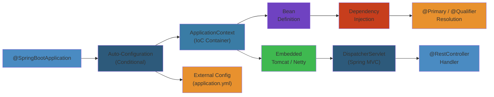

# 🍃 Spring Boot — Complete Deep Dive

**Related**: [Annotations & Reflection](10-annotations-reflection.md) · [Java 8+ Features](11-java-8-features.md) · [Multithreading](04-multithreading.md) · [Hibernate/JPA](13-hibernate-jpa.md)

---




## Table of Contents


- [Spring Ecosystem Overview](#-spring-ecosystem-overview)
- [1. Spring Boot Basics](#1-spring-boot-basics)
- [2. Dependency Injection & IoC](#2-dependency-injection--ioc)
- [3. Auto-Configuration](#3-auto-configuration)
- [4. REST API Development](#4-rest-api-development)
- [5. Data Access](#5-data-access)
- [6. Security](#6-security)
- [7. Testing](#7-testing)
- [8. Actuator & Monitoring](#8-actuator--monitoring)
- [9. Spring Boot Internal Flow](#9-spring-boot-internal-flow)
- [Common Pitfalls](#-common-pitfalls)
- [Simplest Mental Model](#-simplest-mental-model)

---

## 🧭 Spring Ecosystem Overview


```text
                    ┌──────────────────────────────────────┐
                    │        Spring Ecosystem              │
                    ├──────────────────────────────────────┤
                    │                                      │
                    │  ┌────────────────────────────────┐  │
                    │  │   Spring Boot                  │  │
                    │  │   (Auto-config, starters,      │  │
                    │  │    actuators, embedded server)  │  │
                    │  └───────────────┬────────────────┘  │
                    │                  │                    │
                    │  ┌───────────────┴────────────────┐  │
                    │  │   Spring Framework Core         │  │
                    │  │   (IoC, DI, AOP, Events,       │  │
                    │  │    Resource, Validation)        │  │
                    │  └───────────────┬────────────────┘  │
                    │                  │                    │
                    │  ┌───────┬───────┼───────┬────────┐ │
                    │  │       │       │       │        │ │
                    │  ▼       ▼       ▼       ▼        ▼ │
                    │ ┌────┐ ┌────┐ ┌────┐ ┌────┐ ┌────┐ │
                    │ │Web │ │Data│ │Sec │ │Clou│ │Inte│ │
                    │ │MVC │ │/JPA│ │urity│ │d   │ │gra-│ │
                    │ │    │ │    │ │     │ │    │ │tion│ │
                    │ └────┘ └────┘ └────┘ └────┘ └────┘ │
                    └──────────────────────────────────────┘
```

---

## 1. Spring Boot Basics


### Project Structure


```text
src/
├── main/
│   ├── java/com/example/app/
│   │   ├── Application.java          @SpringBootApplication
│   │   ├── controller/               REST endpoints
│   │   ├── service/                  Business logic
│   │   ├── repository/               Data access layer
│   │   ├── model/                    Entities, DTOs
│   │   ├── config/                   Configuration classes
│   │   └── exception/                Custom exceptions
│   └── resources/
│       ├── application.yml           Configuration
│       ├── application-dev.yml       Profile-specific
│       └── static/                   Static resources
├── test/
│   └── java/com/example/app/
└── pom.xml / build.gradle
```

### Main Application Class


```java
@SpringBootApplication  // same as @Configuration + @EnableAutoConfig + @ComponentScan
public class Application {
    public static void main(String[] args) {
        SpringApplication app = new SpringApplication(Application.class);
        app.setBannerMode(Banner.Mode.OFF);
        app.run(args);
    }
}
```

### application.yml


```yaml
server:
  port: 8080
  servlet:
    context-path: /api

spring:
  datasource:
    url: jdbc:postgresql://localhost:5432/mydb
    username: user
    password: pass
    hikari:
      maximum-pool-size: 10
      minimum-idle: 5
  jpa:
    hibernate:
      ddl-auto: validate
    show-sql: false
    properties:
      hibernate:
        format_sql: true
        jdbc.batch_size: 20

logging:
  level:
    com.example: DEBUG
    org.springframework: INFO
```

---

## 2. Dependency Injection & IoC


### Bean Definitions


```java
// Method 1: @Component (scanning)
@Component
public class EmailService { ... }

// Method 2: @Bean in @Configuration
@Configuration
public class AppConfig {
    @Bean
    public RestTemplate restTemplate() {
        return new RestTemplateBuilder()
            .connectTimeout(Duration.ofSeconds(5))
            .build();
    }
}

// Method 3: @Service, @Repository, @Controller (specialized)
@Service
public class UserService { ... }

@Repository
public class UserRepository { ... }

@RestController
@RequestMapping("/api/users")
public class UserController { ... }
```

### Injection Types


```java
// Field injection (not recommended for production)
@RestController
public class UserController {
    @Autowired  // Field injection
    private UserService userService;
}

// Constructor injection (PREFERRED)
@RestController
public class UserController {
    private final UserService userService;
    private final EmailService emailService;

    // Spring auto-wires via constructor
    public UserController(UserService userService, EmailService emailService) {
        this.userService = userService;
        this.emailService = emailService;
    }
}

// Setter injection (for optional dependencies)
@RestController
public class UserController {
    private UserService userService;

    @Autowired(required = false)
    public void setUserService(UserService userService) {
        this.userService = userService;
    }
}
```

### Bean Scopes


```java
@Component
@Scope("singleton")  // Default — one instance per Spring context
public class SingletonBean { }

@Component
@Scope("prototype")  // New instance every injection
@Scope(value = "prototype", proxyMode = ScopedProxyMode.TARGET_CLASS)
public class PrototypeBean { }

@Component
@Scope("request")    // One instance per HTTP request
@Scope("session")    // One instance per HTTP session
@Scope("application") // One instance per ServletContext
```

### Qualifier & Primary


```java
// Disambiguate when multiple beans of same type exist
@Component
@Primary  // Default when no @Qualifier specified
public class MySQLDatabase implements Database { }

@Component
@Qualifier("postgres")
public class PostgreSQLDatabase implements Database { }

@Component
public class DatabaseService {
    private final Database database;

    public DatabaseService(@Qualifier("postgres") Database database) {
        this.database = database;
    }
}
```

---

## 3. Auto-Configuration


### How Auto-Configuration Works


```text
@SpringBootApplication
        │
        ▼
@EnableAutoConfiguration
        │
        ▼
META-INF/spring.factories  (or spring/org.springframework.boot.autoconfigure.AutoConfiguration.imports)
        │
        ▼
List<AutoConfiguration> classes loaded
        │
        ▼
For each @Configuration class:
    │
    ▼
@ConditionalOnClass, @ConditionalOnMissingBean, @ConditionalOnProperty, etc.
    │
    ▼
Condition matches? → YES → Apply configuration (create beans)
Condition matches? → NO  → Skip
```

### Conditionals


```java
@Configuration
@ConditionalOnClass(DataSource.class)           // Only if class on classpath
@ConditionalOnMissingBean(DataSource.class)     // Only if no existing bean
@ConditionalOnProperty(name = "app.feature.x", havingValue = "true")
@ConditionalOnWebApplication                    // Only in web context
@ConditionalOnExpression("${app.feature:false}") // SpEL expression
public class DatabaseAutoConfiguration {
    @Bean
    @ConditionalOnMissingBean
    public DataSource dataSource() {
        return DataSourceBuilder.create()
            .url("jdbc:h2:mem:testdb")
            .build();
    }
}
```

### Custom Auto-Configuration


```java
// 1. Create configuration class
@Configuration
@ConditionalOnClass(MyService.class)
@ConditionalOnProperty(prefix = "myapp", name = "enabled", havingValue = "true")
public class MyAutoConfiguration {

    @Bean
    @ConditionalOnMissingBean
    public MyService myService() {
        return new MyService();
    }
}

// 2. Register in:
// resources/META-INF/spring/org.springframework.boot.autoconfigure.AutoConfiguration.imports
// Content: com.example.config.MyAutoConfiguration
```

### Common Auto-Configurations


| Auto-Configuration | What it sets up |
|--------------------|----------------|
| DataSourceAutoConfiguration | Embedded DB (H2, HSQL) or pool (HikariCP) |
| JpaRepositoriesAutoConfiguration | Spring Data JPA repositories |
| TransactionAutoConfiguration | @Transactional support |
| WebMvcAutoConfiguration | DispatcherServlet, static resources |
| SecurityAutoConfiguration | Default security chain |
| JacksonAutoConfiguration | ObjectMapper with Spring config |
| HttpClientAutoConfiguration | RestTemplate builder |

---

## 4. REST API Development


### Basic REST Controller


```java
@RestController
@RequestMapping("/api/users")
public class UserController {

    private final UserService userService;

    public UserController(UserService userService) {
        this.userService = userService;
    }

    @GetMapping
    public ResponseEntity<List<UserResponse>> getAllUsers(
            @RequestParam(defaultValue = "0") int page,
            @RequestParam(defaultValue = "20") int size) {
        var users = userService.findAll(page, size);
        return ResponseEntity.ok(users);
    }

    @GetMapping("/{id}")
    public ResponseEntity<UserResponse> getUser(@PathVariable Long id) {
        return userService.findById(id)
            .map(ResponseEntity::ok)
            .orElse(ResponseEntity.notFound().build());
    }

    @PostMapping
    public ResponseEntity<UserResponse> createUser(
            @Valid @RequestBody CreateUserRequest request) {
        var user = userService.create(request);
        return ResponseEntity
            .created(URI.create("/api/users/" + user.id()))
            .body(user);
    }

    @PutMapping("/{id}")
    public ResponseEntity<UserResponse> updateUser(
            @PathVariable Long id,
            @Valid @RequestBody UpdateUserRequest request) {
        var user = userService.update(id, request);
        return ResponseEntity.ok(user);
    }

    @DeleteMapping("/{id}")
    public ResponseEntity<Void> deleteUser(@PathVariable Long id) {
        userService.delete(id);
        return ResponseEntity.noContent().build();
    }
}
```

### Request Flow


```text
HTTP Request
     │
     ▼
┌─────────────────────────────┐
│  Tomcat / Jetty / Netty     │
│  (Embedded container)       │
└────────────┬────────────────┘
             │
             ▼
┌─────────────────────────────┐
│  Filter Chain                │
│  CharacterEncodingFilter    │
│  SecurityFilterChain        │
│  RequestContextFilter       │
└────────────┬────────────────┘
             │
             ▼
┌─────────────────────────────┐
│  DispatcherServlet          │
│  (Front Controller)         │
└────────────┬────────────────┘
             │
             ▼
┌─────────────────────────────┐
│  HandlerMapping              │
│  (Find controller method)   │
└────────────┬────────────────┘
             │
             ▼
┌─────────────────────────────┐
│  Interceptors                │
└────────────┬────────────────┘
             │
             ▼
┌─────────────────────────────┐
│  HandlerAdapter              │
│  (Invoke controller)        │
└────────────┬────────────────┘
             │
             ▼
┌─────────────────────────────┐
│  ArgumentResolvers           │
│  (@PathVariable, @RequestBody│
│   @RequestParam, etc.)      │
└────────────┬────────────────┘
             │
             ▼
┌─────────────────────────────┐
│  Controller Method           │
│  (Business logic)           │
└────────────┬────────────────┘
             │
             ▼
┌─────────────────────────────┐
│  ReturnValueHandlers         │
│  (@ResponseBody, ResponseEntity)│
└────────────┬────────────────┘
             │
             ▼
┌─────────────────────────────┐
│  HttpMessageConverters       │
│  Jackson (JSON), JAXB (XML) │
└────────────┬────────────────┘
             │
             ▼
┌─────────────────────────────┐
│  HTTP Response               │
└─────────────────────────────┘
```

### Exception Handling


```java
@RestControllerAdvice
public class GlobalExceptionHandler {

    @ExceptionHandler(ResourceNotFoundException.class)
    @ResponseStatus(HttpStatus.NOT_FOUND)
    public ErrorResponse handleNotFound(ResourceNotFoundException ex) {
        return new ErrorResponse("NOT_FOUND", ex.getMessage());
    }

    @ExceptionHandler(MethodArgumentNotValidException.class)
    @ResponseStatus(HttpStatus.BAD_REQUEST)
    public ErrorResponse handleValidation(MethodArgumentNotValidException ex) {
        var errors = ex.getBindingResult().getFieldErrors().stream()
            .map(e -> new FieldError(e.getField(), e.getDefaultMessage()))
            .toList();
        return new ErrorResponse("VALIDATION_ERROR", "Validation failed", errors);
    }

    @ExceptionHandler(Exception.class)
    @ResponseStatus(HttpStatus.INTERNAL_SERVER_ERROR)
    public ErrorResponse handleGeneral(Exception ex) {
        log.error("Unexpected error", ex);
        return new ErrorResponse("INTERNAL_ERROR", "An unexpected error occurred");
    }
}
```

---

## 5. Data Access


### Spring Data JPA Repository


```java
@Entity
@Table(name = "users")
public class User {
    @Id
    @GeneratedValue(strategy = GenerationType.IDENTITY)
    private Long id;

    @Column(nullable = false, unique = true)
    private String email;

    @Column(nullable = false)
    private String name;

    @Enumerated(EnumType.STRING)
    private UserStatus status;

    @CreatedDate
    private LocalDateTime createdAt;

    @LastModifiedDate
    private LocalDateTime updatedAt;
}

// Repository
public interface UserRepository extends JpaRepository<User, Long> {
    Optional<User> findByEmail(String email);
    List<User> findByStatus(UserStatus status);
    boolean existsByEmail(String email);

    @Query("SELECT u FROM User u WHERE u.name LIKE %:keyword%")
    List<User> searchByName(@Param("keyword") String keyword);

    @Modifying
    @Query("UPDATE User u SET u.status = :status WHERE u.lastLogin < :date")
    int deactivateOldUsers(@Param("date") LocalDateTime date,
                           @Param("status") UserStatus status);
}
```

### Transaction Management


```java
@Service
@Transactional  // All methods transactional by default
public class UserService {

    private final UserRepository userRepository;
    private final AuditLogRepository auditLogRepository;

    public UserService(UserRepository userRepository,
                       AuditLogRepository auditLogRepository) {
        this.userRepository = userRepository;
        this.auditLogRepository = auditLogRepository;
    }

    @Transactional(readOnly = true)  // Optimize for reads
    public Optional<UserResponse> findById(Long id) {
        return userRepository.findById(id)
            .map(this::toResponse);
    }

    // Creates transaction boundary — both save OR neither
    public UserResponse create(CreateUserRequest request) {
        if (userRepository.existsByEmail(request.email())) {
            throw new DuplicateEmailException(request.email());
        }

        var user = new User();
        user.setEmail(request.email());
        user.setName(request.name());
        user.setStatus(UserStatus.ACTIVE);

        var saved = userRepository.save(user);

        auditLogRepository.log("User created: " + saved.getId());

        return toResponse(saved);
    }

    @Transactional(rollbackFor = BusinessException.class,
                   noRollbackFor = OptimisticLockException.class)
    public void updateWithCustomRollback(Long id, UpdateUserRequest request) {
        // rollback on BusinessException, not on OptimisticLockException
    }
}
```

### Transaction Propagation


```text
┌─────────────────────────────────────────────────────────┐
│              Transaction Propagation                     │
├─────────────────────────────────────────────────────────┤
│                                                         │
│ REQUIRED      = Join existing TX or create new          │
│                (Default — most common)                  │
│                                                         │
│ REQUIRES_NEW  = Always create new TX, suspend existing  │
│                (Independent — audit logs, async tasks)  │
│                                                         │
│ NESTED        = Savepoint within existing TX            │
│                (Partial rollback possible)              │
│                                                         │
│ MANDATORY     = Must have existing TX, throw if not     │
│                                                         │
│ SUPPORTS      = If TX exists, join; if not, no TX       │
│                (Read queries in service)                │
│                                                         │
│ NOT_SUPPORTED = Suspend TX, execute without             │
│                                                         │
│ NEVER         = Throw if TX exists                      │
│                                                         │
└─────────────────────────────────────────────────────────┘
```

---

## 6. Security


### Spring Security Configuration


```java
@Configuration
@EnableWebSecurity
public class SecurityConfig {

    @Bean
    public SecurityFilterChain filterChain(HttpSecurity http) throws Exception {
        http
            .csrf(AbstractHttpConfigurer::disable)
            .sessionManagement(session ->
                session.sessionCreationPolicy(SessionCreationPolicy.STATELESS))
            .authorizeHttpRequests(auth -> auth
                .requestMatchers("/api/public/**").permitAll()
                .requestMatchers("/api/admin/**").hasRole("ADMIN")
                .requestMatchers("/api/users/**").hasAnyRole("USER", "ADMIN")
                .anyRequest().authenticated()
            )
            .addFilterBefore(jwtFilter(), UsernamePasswordAuthenticationFilter.class);

        return http.build();
    }

    @Bean
    public PasswordEncoder passwordEncoder() {
        return new BCryptPasswordEncoder();
    }

    @Bean
    public AuthenticationManager authenticationManager(
            AuthenticationConfiguration config) throws Exception {
        return config.getAuthenticationManager();
    }
}
```

### JWT Filter


```java
@Component
public class JwtFilter extends OncePerRequestFilter {

    private final JwtService jwtService;
    private final UserDetailsService userDetailsService;

    public JwtFilter(JwtService jwtService, UserDetailsService userDetailsService) {
        this.jwtService = jwtService;
        this.userDetailsService = userDetailsService;
    }

    @Override
    protected void doFilterInternal(HttpServletRequest request,
                                     HttpServletResponse response,
                                     FilterChain chain)
            throws ServletException, IOException {
        var header = request.getHeader("Authorization");

        if (header != null && header.startsWith("Bearer ")) {
            var token = header.substring(7);

            if (jwtService.isValid(token)) {
                var username = jwtService.extractUsername(token);
                var userDetails = userDetailsService.loadUserByUsername(username);

                var authentication = new UsernamePasswordAuthenticationToken(
                    userDetails, null, userDetails.getAuthorities());

                SecurityContextHolder.getContext().setAuthentication(authentication);
            }
        }

        chain.doFilter(request, response);
    }
}
```

---

## 7. Testing


### Unit Tests


```java
@ExtendWith(MockitoExtension.class)
class UserServiceTest {

    @Mock
    private UserRepository userRepository;

    @InjectMocks
    private UserService userService;

    @Test
    void shouldFindUserById() {
        var user = new User();
        user.setId(1L);
        user.setEmail("alice@example.com");

        when(userRepository.findById(1L)).thenReturn(Optional.of(user));

        var result = userService.findById(1L);

        assertThat(result).isPresent();
        assertThat(result.get().email()).isEqualTo("alice@example.com");
        verify(userRepository).findById(1L);
    }

    @Test
    void shouldReturnEmptyWhenUserNotFound() {
        when(userRepository.findById(99L)).thenReturn(Optional.empty());

        var result = userService.findById(99L);

        assertThat(result).isEmpty();
    }
}
```

### Integration Tests


```java
@SpringBootTest(webEnvironment = WebEnvironment.RANDOM_PORT)
@AutoConfigureMockMvc
class UserControllerIntegrationTest {

    @Autowired
    private MockMvc mockMvc;

    @Autowired
    private UserRepository userRepository;

    @BeforeEach
    void setUp() {
        userRepository.deleteAll();
    }

    @Test
    void shouldCreateUser() throws Exception {
        var request = """
            {
                "email": "alice@example.com",
                "name": "Alice"
            }
            """;

        mockMvc.perform(post("/api/users")
                .contentType(MediaType.APPLICATION_JSON)
                .content(request))
            .andExpect(status().isCreated())
            .andExpect(jsonPath("$.email").value("alice@example.com"));
    }

    @Test
    void shouldReturn404ForUnknownUser() throws Exception {
        mockMvc.perform(get("/api/users/999"))
            .andExpect(status().isNotFound());
    }
}
```

### TestContainers (Database Tests)


```java
@SpringBootTest
@Testcontainers
class UserRepositoryIntegrationTest {

    @Container
    static PostgreSQLContainer<?> postgres = new PostgreSQLContainer<>("postgres:15")
        .withDatabaseName("testdb");

    @Autowired
    private UserRepository userRepository;

    @DynamicPropertySource
    static void configureProperties(DynamicPropertyRegistry registry) {
        registry.add("spring.datasource.url", postgres::getJdbcUrl);
        registry.add("spring.datasource.username", postgres::getUsername);
        registry.add("spring.datasource.password", postgres::getPassword);
    }

    @Test
    void shouldSaveAndFindUser() {
        var user = new User();
        user.setEmail("test@example.com");
        user.setName("Test");
        userRepository.save(user);

        var found = userRepository.findByEmail("test@example.com");

        assertThat(found).isPresent();
    }
}
```

---

## 8. Actuator & Monitoring


### Configuration


```yaml
management:
  endpoints:
    web:
      exposure:
        include: health,info,metrics,prometheus
  endpoint:
    health:
      show-details: always
      probes:
        enabled: true
  metrics:
    tags:
      application: myapp
    export:
      prometheus:
        enabled: true
```

### Custom Health Indicator


```java
@Component
public class DatabaseHealthIndicator implements HealthIndicator {

    private final DataSource dataSource;

    public DatabaseHealthIndicator(DataSource dataSource) {
        this.dataSource = dataSource;
    }

    @Override
    public Health health() {
        try (var conn = dataSource.getConnection()) {
            if (conn.isValid(5)) {
                return Health.up()
                    .withDetail("database", "PostgreSQL")
                    .withDetail("validation", "valid")
                    .build();
            }
            return Health.down()
                .withDetail("validation", "timeout")
                .build();
        } catch (Exception e) {
            return Health.down(e).build();
        }
    }
}
```

### Key Actuator Endpoints


| Endpoint | Purpose |
|----------|---------|
| `/actuator/health` | Application health (liveness + readiness) |
| `/actuator/info` | Custom application info |
| `/actuator/metrics` | JVM, CPU, memory, GC metrics |
| `/actuator/prometheus` | Prometheus scrape endpoint |
| `/actuator/loggers` | View/change log levels at runtime |
| `/actuator/env` | Environment properties |
| `/actuator/threaddump` | Thread dump |
| `/actuator/heapdump` | Heap dump (triggers GC) |
| `/actuator/httptrace` | Recent HTTP request/response traces |

---

## 9. Spring Boot Internal Flow


### Application Startup


```text
SpringApplication.run()
    │
    ▼
┌─────────────────────────────┐
│ 1. Determine Application   │
│    Type (WebFlux vs MVC)   │
└────────────┬────────────────┘
             │
             ▼
┌─────────────────────────────┐
│ 2. Load ApplicationContext │
│    Initialize SpringApplication│
│    Run Listeners            │
└────────────┬────────────────┘
             │
             ▼
┌─────────────────────────────┐
│ 3. Prepare Environment     │
│    Load application.yml    │
│    Activate profiles       │
└────────────┬────────────────┘
             │
             ▼
┌─────────────────────────────┐
│ 4. Print Banner             │
└────────────┬────────────────┘
             │
             ▼
┌─────────────────────────────┐
│ 5. Create ApplicationContext│
│    AnnotationConfigApplication│
│    Register @Configuration  │
└────────────┬────────────────┘
             │
             ▼
┌─────────────────────────────┐
│ 6. Refresh Context          │
│    Load bean definitions    │
│    Post-process bean factory│
│    Initialize singletons    │
└────────────┬────────────────┘
             │
             ▼
┌─────────────────────────────┐
│ 7. Auto-Configuration       │
│    Load spring.factories    │
│    Evaluate @Conditional   │
│    Create auto-config beans │
└────────────┬────────────────┘
             │
             ▼
┌─────────────────────────────┐
│ 8. Start Embedded Server    │
│    Tomcat/Jetty/Netty      │
│    Bind to port             │
└────────────┬────────────────┘
             │
             ▼
┌─────────────────────────────┐
│ 9. Run CommandLineRunners   │
│    and ApplicationRunners  │
└────────────┬────────────────┘
             │
             ▼
┌─────────────────────────────┐
│ 10. Application Started    │
│     Ready for requests!    │
└─────────────────────────────┘
```

---

## ⚠️ Common Pitfalls


| Pitfall | Issue | Fix |
|---------|-------|-----|
| Field injection | Hard to test, circular deps | Constructor injection |
| Lazy init not lazy | @Lazy on @Bean | Verify usage |
| @Transactional not working | Self-invocation bypasses proxy | Inject self or use AopContext |
| Session in REST | Stateful by accident | STATELESS session policy |
| N+1 queries | Lazy loading in view | @EntityGraph, JOIN FETCH |
| Unvalidated @RequestBody | Malicious input | @Valid + @Validated |
| Security filter order | Wrong ordering | Add @Order or Ordered interface |
| CORS not configured | Browser rejects requests | @CrossOrigin or CorsConfiguration |
| Default profile issues | Production uses dev settings | Profile-specific configs |

---

## 🧠 Simplest Mental Model


```text
SPRING BOOT    =  A car that drives itself. You just say where you want
                   to go (dependencies), and it configures everything:
                   engine (Tomcat), dashboard (Actuator), navigation
                   (auto-configuration).

AUTO-           =  The car detects the road (H2 vs PostgreSQL), weather
CONFIGURATION      (dev vs prod profile), and adjusts itself accordingly.
                   You don't need to manually configure the spark plugs.

DEPENDENCY      =  Instead of building each part yourself, you say
INJECTION          "I need an engine" and it's provided. If you need
                   a different engine, just ask for it.

STEREOTYPE      =  Labels on parts:
ANNOTATIONS        @Service = "I do business logic"
                   @Repository = "I handle data"
                   @Controller = "I handle HTTP requests"
                   @Component = "I'm a general part"

SPRING DATA JPA =  "SELECT * FROM users WHERE email = ?" becomes
                   just: findByEmail(email). The framework writes
                   the SQL for you.

TRANSACTION     =  "All or nothing." If the second DB operation fails,
                   the first is rolled back. Like an atomic operation.

ACTUATOR        =  Dashboard telling you: speed (request rate),
                   fuel (memory), temperature (CPU), engine health
                   (DB connection), and whether to pull over (health check).

SECURITY        =  Bouncers at different club doors (endpoints).
                   Some doors open to anyone (/api/public),
                   some to members only (/api/users),
                   some to VIPs only (/api/admin).
```

---

**Next**: [Hibernate & JPA](13-hibernate-jpa.md) — ORM, caching, relationships

## Related

- [Jvm Performance](18-performance-engineering/jvm-tuning/01-jvm-performance.md)
- [Cap Consistency](09-distributed-systems/01-cap-consistency.md)
- [Consensus Replication](09-distributed-systems/01-consensus-replication.md)
- [Consensus Raft](09-distributed-systems/02-consensus-raft.md)
- [Distributed Transactions](09-distributed-systems/02-distributed-transactions.md)
- [Distributed Caching](09-distributed-systems/03-distributed-caching.md)
