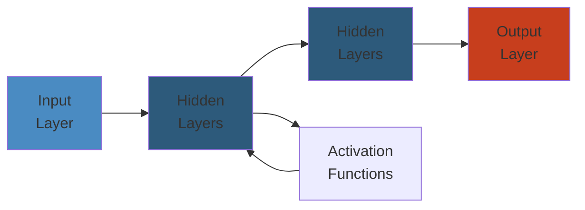

# 🗄️ Hibernate & JPA — Complete Deep Dive

**Related**: [Spring Boot](12-spring-boot.md) · [Annotations & Reflection](10-annotations-reflection.md) · [JDBC](09-io-nio.md) · [Collections Framework](02-collections-framework.md)

---




## Table of Contents

- [JPA vs Hibernate vs JDBC](#-jpa-vs-hibernate-vs-jdbc)
- [1. Entity Mapping](#1-entity-mapping)
- [2. Relationships](#2-relationships)
- [3. Entity Lifecycle](#3-entity-lifecycle)
- [4. Primary Keys](#4-primary-keys)
- [5. JPQL & Criteria API](#5-jpql--criteria-api)
- [6. Caching](#6-caching)
- [7. Performance Tuning](#7-performance-tuning)
- [8. Inheritance Strategies](#8-inheritance-strategies)
- [9. Concurrency & Locking](#9-concurrency--locking)
- [Hibernate Internal Flow](#-hibernate-internal-flow)
- [Common Pitfalls](#-common-pitfalls)
- [Simplest Mental Model](#-simplest-mental-model)

---

## 🧭 JPA vs Hibernate vs JDBC

```text
                    ┌──────────────────────────────┐
                    │     Your Application         │
                    │     (Business Logic)         │
                    └────────────┬─────────────────┘
                                 │
                    ┌────────────┴─────────────────┐
                    │     JPA (Jakarta Persistence)│
                    │     Standard specification   │
                    │  @Entity, EntityManager, JPQL│
                    └────────────┬─────────────────┘
                                 │
                    ┌────────────┴─────────────────┐
                    │     Hibernate (Implementation)│
                    │  Session, SessionFactory,    │
                    │  1st/2nd level cache, batch  │
                    └────────────┬─────────────────┘
                                 │
                    ┌────────────┴─────────────────┐
                    │     JDBC (java.sql)          │
                    │  Connection, PreparedStatement│
                    │  ResultSet                    │
                    └────────────┬─────────────────┘
                                 │
                                 ▼
                    ┌──────────────────────────────┐
                    │     Database (PostgreSQL,    │
                    │     MySQL, Oracle, etc.)    │
                    └──────────────────────────────┘
```

### Level of Abstraction

| Layer | Abstraction | You Write | Speed |
|-------|-------------|-----------|-------|
| JDBC | Raw SQL | `PreparedStatement.executeQuery()` | Fastest |
| JPA + Hibernate | ORM | `entityManager.find(User.class, id)` | Slower |
| Spring Data JPA | Repository | `userRepository.findById(id)` | Convenient |

---

## 1. Entity Mapping

### Basic Entity

```java
@Entity
@Table(name = "users")
public class User {

    @Id
    @GeneratedValue(strategy = GenerationType.IDENTITY)
    private Long id;

    @Column(name = "full_name", nullable = false, length = 100)
    private String name;

    @Column(unique = true, nullable = false)
    private String email;

    @Column(nullable = false)
    private Integer age;

    @Temporal(TemporalType.TIMESTAMP)
    private Date createdAt;  // old style

    private LocalDateTime updatedAt;  // Java 8+ style

    @Enumerated(EnumType.STRING)   // Store as "ACTIVE" not ordinal
    private Status status;

    @Lob
    private String description;    // Large text (CLOB)

    @Lob
    private byte[] avatar;         // Binary data (BLOB)

    @Transient                    // Not persisted to DB
    private String computedField;

    @Version                       // Optimistic locking
    private Integer version;
}
```

### Column Types Mapping

```java
@Entity
public class Product {

    @Id private Long id;

    // Temporal types
    @Temporal(TemporalType.DATE)       // java.sql.Date
    private LocalDate dateOnly;

    @Temporal(TemporalType.TIME)       // java.sql.Time
    private LocalTime timeOnly;

    @Temporal(TemporalType.TIMESTAMP)  // java.sql.Timestamp
    private LocalDateTime dateTime;

    // Numbers
    @Column(precision = 10, scale = 2) // DECIMAL(10,2)
    private BigDecimal price;

    @Column(columnDefinition = "TEXT")
    private String longText;

    // Enums
    @Enumerated(EnumType.ORDINAL)      // 0, 1, 2... (DEFAULT — fragile!)
    @Enumerated(EnumType.STRING)       // "ACTIVE", "INACTIVE" (safe)
    private Status status;

    // UUID
    @GeneratedValue(strategy = GenerationType.UUID)
    private UUID externalId;
}
```

---

## 2. Relationships

### @OneToOne

```java
@Entity
public class User {
    @Id private Long id;

    // Owning side (has the FK)
    @OneToOne(cascade = CascadeType.ALL, fetch = FetchType.LAZY)
    @JoinColumn(name = "profile_id")
    private Profile profile;
}

@Entity
public class Profile {
    @Id private Long id;
    private String bio;
    private String avatarUrl;

    // Inverse side (mappedBy)
    @OneToOne(mappedBy = "profile")
    private User user;
}
```

### @OneToMany / @ManyToOne

```java
@Entity
public class User {
    @Id private Long id;

    // Owning side (FK in order table)
    @OneToMany(mappedBy = "user", cascade = CascadeType.ALL,
               orphanRemoval = true, fetch = FetchType.LAZY)
    private List<Order> orders = new ArrayList<>();

    // Helper methods
    public void addOrder(Order order) {
        orders.add(order);
        order.setUser(this);
    }

    public void removeOrder(Order order) {
        orders.remove(order);
        order.setUser(null);
    }
}

@Entity
@Table(name = "orders")
public class Order {
    @Id private Long id;
    private LocalDateTime orderDate;
    private BigDecimal total;

    @ManyToOne(fetch = FetchType.LAZY)
    @JoinColumn(name = "user_id")
    private User user;
}
```

### @ManyToMany

```java
@Entity
public class Student {
    @Id private Long id;
    private String name;

    @ManyToMany(cascade = {CascadeType.PERSIST, CascadeType.MERGE})
    @JoinTable(
        name = "student_courses",                 // join table
        joinColumns = @JoinColumn(name = "student_id"),
        inverseJoinColumns = @JoinColumn(name = "course_id")
    )
    private Set<Course> courses = new HashSet<>();
}

@Entity
public class Course {
    @Id private Long id;
    private String title;

    @ManyToMany(mappedBy = "courses")
    private Set<Student> students = new HashSet<>();
}
```

### Relationship Fetch Types

```text
FetchType.LAZY:
    ┌──────────────────────────────┐
    │ User (loaded immediately)    │
    │  - id: 1                     │
    │  - name: "Alice"             │
    │  - orders: [PROXY] ◄───────── Proxy object
    │    (only loaded when         │  (no SQL yet)
    │     orders.get() called)     │
    └──────────────────────────────┘

FetchType.EAGER:
    ┌──────────────────────────────┐
    │ User (loaded immediately)    │
    │  - id: 1                     │
    │  - name: "Alice"             │
    │  - orders: [Order1, Order2]  │
    │    (loaded via JOIN or       │
    │     separate query)          │
    └──────────────────────────────┘

IMPORTANT: EAGER on collections = N+1 problem risk!
           Default: @*ToOne = EAGER, @*ToMany = LAZY
           Always set @*ToOne to LAZY explicitly!
```

---

## 3. Entity Lifecycle

### States

```text
                    ┌──────────────────────┐
                    │        NEW           │
                    │ (not persisted,      │
                    │  no ID assigned)     │
                    └──────────┬───────────┘
                               │ persist()
                               ▼
                    ┌──────────────────────┐
                    │     MANAGED          │
                    │ (in PersistenceContext│
                    │  tracked by Hibernate │
                    │  changes auto-flushed)│
                    └──────────┬───────────┘
                              / \
                    ┌─────────   ─────────┐
                    ▼                     ▼
        ┌──────────────────┐  ┌──────────────────┐
        │   DETACHED       │  │   REMOVED        │
        │ (session closed, │  │ (marked for      │
        │  not tracked)    │  │  deletion)       │
        └──────────────────┘  └──────────────────┘
```

### Lifecycle Methods

```java
@Entity
public class Product {

    // Callbacks — annotation on methods
    @PrePersist
    public void beforePersist() {
        this.createdAt = LocalDateTime.now();
    }

    @PostPersist
    public void afterPersist() {
        System.out.println("Product saved with ID: " + this.id);
    }

    @PreUpdate
    public void beforeUpdate() {
        this.updatedAt = LocalDateTime.now();
    }

    @PostUpdate
    public void afterUpdate() { }

    @PreRemove
    public void beforeRemove() { }

    @PostRemove
    public void afterRemove() { }

    @PostLoad
    public void afterLoad() {
        // Called after entity is loaded from DB
        this.computedField = computeSomething();
    }
}
```

### EntityManager Operations

```java
@Repository
public class ProductRepository {

    @PersistenceContext
    private EntityManager em;

    // Persist — NEW → MANAGED
    public Product save(Product product) {
        em.persist(product);
        return product;  // now has generated ID
    }

    // Find — load from DB or cache
    public Product findById(Long id) {
        return em.find(Product.class, id);
    }

    // Merge — DETACHED → MANAGED (or create)
    public Product update(Product product) {
        return em.merge(product);
    }

    // Remove — MANAGED → REMOVED
    public void delete(Product product) {
        em.remove(em.contains(product)
            ? product
            : em.merge(product));  // merge if detached
    }

    // Refresh — reload from DB (discard changes)
    public void refresh(Product product) {
        em.refresh(product);
    }

    // Detach — MANAGED → DETACHED
    public void detach(Product product) {
        em.detach(product);
    }

    // Flush — force sync to DB
    public void flush() {
        em.flush();
    }

    // Clear — detach all managed entities
    public void clear() {
        em.clear();
    }
}
```

---

## 4. Primary Keys

### ID Generation Strategies

```java
// 1. IDENTITY — DB auto-increment (PostgreSQL SERIAL, MySQL AUTO_INCREMENT)
//    Best for: Simple, single-row inserts
//    Downside: Batch inserts disabled (needs ID to persist)
@Id
@GeneratedValue(strategy = GenerationType.IDENTITY)
private Long id;

// 2. SEQUENCE — DB sequence (PostgreSQL SEQUENCE, Oracle SEQUENCE)
//    Best for: Batch inserts, performance
//    Hibernate pre-allocates IDs via allocationSize
@Id
@GeneratedValue(strategy = GenerationType.SEQUENCE, generator = "user_seq")
@SequenceGenerator(name = "user_seq", sequenceName = "user_sequence",
                   allocationSize = 50)  // pre-allocate 50 IDs
private Long id;

// 3. TABLE — Simulate sequence via table (portable, but slow)
@Id
@GeneratedValue(strategy = GenerationType.TABLE, generator = "user_gen")
@TableGenerator(name = "user_gen", table = "id_gen",
                pkColumnName = "gen_name", valueColumnName = "gen_val",
                allocationSize = 100)
private Long id;

// 4. UUID — Universally unique
@Id
@GeneratedValue(strategy = GenerationType.UUID)
private UUID id;

// 5. Custom (no @GeneratedValue)
@Id
private String id;  // assign manually

// 6. AUTO — Let Hibernate choose (default)
@Id
@GeneratedValue(strategy = GenerationType.AUTO)
private Long id;
```

### Composite Primary Key

```java
// Method 1: @IdClass
public class OrderId implements Serializable {
    private Long productId;
    private Long customerId;
    // equals() and hashCode() required!
}

@Entity
@IdClass(OrderId.class)
public class Order {
    @Id private Long productId;
    @Id private Long customerId;
    private int quantity;
}

// Method 2: @EmbeddedId
@Embeddable
public class OrderId implements Serializable {
    private Long productId;
    private Long customerId;
    // equals() and hashCode() required!
}

@Entity
public class Order {
    @EmbeddedId
    private OrderId id;
    private int quantity;
}
```

---

## 5. JPQL & Criteria API

### JPQL (Java Persistence Query Language)

```java
@Repository
public class UserRepository {

    @PersistenceContext
    private EntityManager em;

    // Basic JPQL
    public List<User> findActiveUsers() {
        return em.createQuery(
            "SELECT u FROM User u WHERE u.status = :status ORDER BY u.name",
            User.class)
            .setParameter("status", Status.ACTIVE)
            .setFirstResult(0)
            .setMaxResults(20)
            .getResultList();
    }

    // Join fetch (solve N+1)
    public List<User> findAllWithOrders() {
        return em.createQuery(
            "SELECT DISTINCT u FROM User u LEFT JOIN FETCH u.orders",
            User.class)
            .getResultList();
    }

    // Aggregation
    public List<Object[]> getStats() {
        return em.createQuery(
            "SELECT u.status, COUNT(u), AVG(u.age) " +
            "FROM User u GROUP BY u.status",
            Object[].class)
            .getResultList();
    }

    // Update
    public int activateUsers(LocalDateTime since) {
        return em.createQuery(
            "UPDATE User u SET u.status = :status " +
            "WHERE u.createdAt >= :since")
            .setParameter("status", Status.ACTIVE)
            .setParameter("since", since)
            .executeUpdate();
    }

    // Delete
    public int deleteInactiveUsers() {
        return em.createQuery(
            "DELETE FROM User u WHERE u.status = :status")
            .setParameter("status", Status.INACTIVE)
            .executeUpdate();
    }

    // Native SQL (fallback)
    public List<User> nativeSearch(String keyword) {
        return em.createNativeQuery(
            "SELECT * FROM users WHERE full_name ILIKE ?1",
            User.class)
            .setParameter(1, "%" + keyword + "%")
            .getResultList();
    }
}
```

### Criteria API — Type-Safe Queries

```java
public List<User> searchUsers(String name, Status status, Integer minAge) {
    CriteriaBuilder cb = em.getCriteriaBuilder();
    CriteriaQuery<User> cq = cb.createQuery(User.class);
    Root<User> root = cq.from(User.class);

    List<Predicate> predicates = new ArrayList<>();

    if (name != null) {
        predicates.add(cb.like(root.get("name"), "%" + name + "%"));
    }
    if (status != null) {
        predicates.add(cb.equal(root.get("status"), status));
    }
    if (minAge != null) {
        predicates.add(cb.greaterThanOrEqualTo(root.get("age"), minAge));
    }

    cq.select(root)
      .where(predicates.toArray(new Predicate[0]))
      .orderBy(cb.asc(root.get("name")));

    return em.createQuery(cq)
        .setFirstResult(0)
        .setMaxResults(100)
        .getResultList();
}
```

---

## 6. Caching

### First-Level Cache (Persistence Context)

```text
┌──────────────────────────────────────────────┐
│              Persistence Context              │
│          (First-Level Cache, per Session)     │
├──────────────────────────────────────────────┤
│                                              │
│  em.find(User.class, 1L)                     │
│       │                                      │
│       ├── First-Level Cache?                 │
│       │   YES → Return cached                │
│       │   NO  → SELECT from DB + store cache │
│       │                                      │
│  em.find(User.class, 1L)  (again)            │
│       │                                      │
│       └── First-Level Cache? YES!            │
│           → NO SQL executed!                 │
│                                              │
│  Session closes → cache cleared              │
│                                              │
└──────────────────────────────────────────────┘
```

### Second-Level Cache (Shared)

```java
// 1. Enable in application.yml
spring:
  jpa:
    properties:
      hibernate:
        cache:
          use_second_level_cache: true
          region:
            factory_class: org.hibernate.cache.jcache.JCacheRegionFactory

// 2. Add dependency (e.g., Ehcache, Caffeine, Redis)
// implementation 'org.hibernate.orm:hibernate-jcache'
// implementation 'org.ehcache:ehcache'

// 3. Mark entities as cacheable
@Entity
@Cacheable
@Cache(usage = CacheConcurrencyStrategy.READ_WRITE)
public class User {
    // fields
}

// 4. Configure regions
// ehcache.xml or application.yml
```

### Cache Concurrency Strategies

| Strategy | Reads | Writes | Use Case |
|----------|-------|--------|----------|
| READ_ONLY | ✅ Fast | ❌ Not allowed | Reference data (countries, statuses) |
| READ_WRITE | ✅ | ✅ (with locks) | Frequently read, rarely updated data |
| NONSTRICT_READ_WRITE | ✅ | ✅ (async) | Rarely updated, eventual consistency OK |
| TRANSACTIONAL | ✅ | ✅ (XA) | JTA transactions, highest consistency |

---

## 7. Performance Tuning

### N+1 Query Problem

```java
// ❌ N+1 — for each user, 1 extra query for orders
List<User> users = em.createQuery("SELECT u FROM User u", User.class)
    .getResultList();

for (User user : users) {
    // Trigger LAZY load → N extra SELECTs
    System.out.println(user.getOrders().size());
}
// SQL: 1 SELECT for users + N SELECTs for orders

// ✅ FIX 1: JOIN FETCH in JPQL
List<User> users = em.createQuery(
    "SELECT DISTINCT u FROM User u LEFT JOIN FETCH u.orders", User.class)
    .getResultList();

// ✅ FIX 2: @EntityGraph
@Entity
@NamedEntityGraph(name = "User.orders", attributeNodes = @NamedAttributeNode("orders"))
public class User { ... }

// Then in repository:
@Query("SELECT u FROM User u")
@EntityGraph("User.orders")
List<User> findAllWithOrders();

// ✅ FIX 3: Batch fetching
// application.yml:
// spring.jpa.properties.hibernate.default_batch_fetch_size: 20
```

### Batch Operations

```java
// Batch inserts — much faster
// In application.yml:
// spring.jpa.properties.hibernate.jdbc.batch_size: 50
// spring.jpa.properties.hibernate.order_inserts: true
// spring.jpa.properties.hibernate.order_updates: true

@Transactional
public void batchInsert(List<Product> products) {
    for (int i = 0; i < products.size(); i++) {
        em.persist(products.get(i));

        // Flush and clear every 50 to avoid OutOfMemory
        if (i % 50 == 0) {
            em.flush();
            em.clear();
        }
    }
}
```

### Hibernate Statistics

```yaml
# Enable statistics (dev only!)
spring:
  jpa:
    properties:
      hibernate:
        generate_statistics: true
        session:
          events:
            log: true
```

### Performance Tips

| Tip | Impact |
|-----|--------|
| Use `@BatchSize` on collections | Reduces N+1 to N/20+1 |
| Always specify `FetchType.LAZY` on `@*ToOne` | Prevents unnecessary joins |
| Use `@DynamicUpdate` | Updates only changed columns |
| Use projection DTOs instead of entities | Avoids loading full entity graph |
| Use `StatelessSession` for batch operations | No 1st-level cache overhead |
| Prefer sequences over identity for batch inserts | Identity disables batch |

---

## 8. Inheritance Strategies

### Inheritance Mapping

```java
// STRATEGY 1: SINGLE TABLE (default)
// All classes in one table. Discriminator column.
@Entity
@Inheritance(strategy = InheritanceType.SINGLE_TABLE)
@DiscriminatorColumn(name = "payment_type")
@DiscriminatorValue("PAYMENT")
public abstract class Payment {
    @Id private Long id;
    private BigDecimal amount;
}

@Entity
@DiscriminatorValue("CC")
public class CreditCardPayment extends Payment {
    private String cardNumber;
    private String cardHolder;
}

@Entity
@DiscriminatorValue("PP")
public class PayPalPayment extends Payment {
    private String paypalEmail;
}
// Table: payment (id, amount, payment_type, cardNumber, cardHolder, paypalEmail)

// STRATEGY 2: JOINED (normalized)
@Entity
@Inheritance(strategy = InheritanceType.JOINED)
public abstract class Payment { ... }
// Tables: payment (base fields), credit_card_payment (extended),
//         paypal_payment (extended). JOIN needed for reads.

// STRATEGY 3: TABLE_PER_CLASS (complete separate tables)
@Entity
@Inheritance(strategy = InheritanceType.TABLE_PER_CLASS)
public abstract class Payment { ... }
// Each concrete class has ALL fields in own table.
// Polymorphic queries use UNION. Not recommended.
```

### Mapped Superclass

```java
// Not an entity itself, just provides mapping for subclasses
@MappedSuperclass
public abstract class BaseEntity {
    @Id
    @GeneratedValue(strategy = GenerationType.IDENTITY)
    private Long id;

    @CreatedDate
    private LocalDateTime createdAt;

    @LastModifiedDate
    private LocalDateTime updatedAt;
}

@Entity
public class User extends BaseEntity {
    private String name;
    // inherits id, createdAt, updatedAt
}
```

---

## 9. Concurrency & Locking

### Optimistic Locking

```java
// Version field — automatically incremented on update
@Entity
public class Product {
    @Id private Long id;

    private int stock;

    @Version
    private int version;  // starts at 0, incremented each update
}

// When two users update same product:
// User 1: UPDATE product SET stock=9, version=1 WHERE id=5 AND version=0
// User 2: UPDATE product SET stock=9, version=1 WHERE id=5 AND version=0
// User 1 succeeds (row affected=1)
// User 2 fails (row affected=0 → OptimisticLockException)

// Handling:
@Transactional
public void purchase(Long productId, int quantity) {
    try {
        Product product = productRepository.findById(productId).orElseThrow();
        product.setStock(product.getStock() - quantity);
    } catch (OptimisticLockException e) {
        // Retry or inform user
        log.warn("Concurrent update for product {}", productId);
        throw new RetryableException("Try again");
    }
}
```

### Pessimistic Locking

```java
// Locks the database row — prevents concurrent access

@Repository
public class ProductRepository {

    @PersistenceContext
    private EntityManager em;

    // PESSIMISTIC_READ — shared lock (others can read, not write)
    public Product findWithReadLock(Long id) {
        return em.find(Product.class, id, LockModeType.PESSIMISTIC_READ);
    }

    // PESSIMISTIC_WRITE — exclusive lock (others can't read or write)
    public Product findWithWriteLock(Long id) {
        return em.find(Product.class, id, LockModeType.PESSIMISTIC_WRITE);
    }

    // JPQL with lock
    public Optional<Product> findWithLock(Long id) {
        return em.createQuery("SELECT p FROM Product p WHERE p.id = :id", Product.class)
            .setParameter("id", id)
            .setLockMode(LockModeType.PESSIMISTIC_WRITE)
            .getResultList()
            .stream()
            .findFirst();
    }

    // Lock timeout
    public void setLockTimeout() {
        em.createNativeQuery("SET lock_timeout = '5s'").executeUpdate();
    }
}
```

### Lock Mode Comparison

| Lock Mode | Read | Write | Timeout? | Deadlock? |
|-----------|------|-------|----------|-----------|
| NONE | ✅ | ✅ | — | Low |
| OPTIMISTIC | ✅ | ✅ | No | Low |
| OPTIMISTIC_FORCE_INCREMENT | ✅ | ✅ | No | Low |
| PESSIMISTIC_READ | ✅ | Blocked | Yes | Possible |
| PESSIMISTIC_WRITE | Blocked | Blocked | Yes | Possible |
| PESSIMISTIC_FORCE_INCREMENT | Blocked | Blocked | Yes | Possible |

---

## 🔄 Hibernate Internal Flow

### Query Execution

```text
EntityManager.find(User.class, 1L)
    │
    ▼
┌─────────────────────────────┐
│ 1. Check First-Level Cache  │
│    (PersistenceContext)     │
│    Hit? → Return cached     │
│    Miss? → Continue         │
└────────────┬────────────────┘
             │
             ▼
┌─────────────────────────────┐
│ 2. Check Second-Level Cache │
│    (if configured)          │
│    Hit? → Return from L2    │
│    Miss? → Continue         │
└────────────┬────────────────┘
             │
             ▼
┌─────────────────────────────┐
│ 3. Generate SQL             │
│    "SELECT id, name, email  │
│     FROM users WHERE id=?"  │
└────────────┬────────────────┘
             │
             ▼
┌─────────────────────────────┐
│ 4. Create PreparedStatement │
│    Bind parameters          │
│    Execute query            │
└────────────┬────────────────┘
             │
             ▼
┌─────────────────────────────┐
│ 5. Build ResultSet          │
│    Iterate rows             │
└────────────┬────────────────┘
             │
             ▼
┌─────────────────────────────┐
│ 6. Create Entity Instance   │
│    via constructor          │
│    (no-arg)                 │
└────────────┬────────────────┘
             │
             ▼
┌─────────────────────────────┐
│ 7. Hydrate Entity           │
│    Set fields from ResultSet│
│    Handle type conversions  │
└────────────┬────────────────┘
             │
             ▼
┌─────────────────────────────┐
│ 8. Store in L1 Cache        │
│    (PersistenceContext)     │
└────────────┬────────────────┘
             │
             ▼
┌─────────────────────────────┐
│ 9. Store in L2 Cache        │
│    (if cacheable)           │
└────────────┬────────────────┘
             │
             ▼
┌─────────────────────────────┐
│ 10. Return Entity           │
│    (managed state)          │
└─────────────────────────────┘
```

### Flush Process

```text
em.flush() or transaction commit
    │
    ▼
┌─────────────────────────────┐
│ 1. Dirty Checking           │
│    Compare snapshot with    │
│    current entity state     │
│    (Hibernate tracks        │
│     original values)        │
└────────────┬────────────────┘
             │
             ▼
┌─────────────────────────────┐
│ 2. Generate SQL from changes│
│    INSERT for new entities  │
│    UPDATE for dirty entities│
│    DELETE for removed       │
│    ORDER: insert, update,   │
│           delete            │
└────────────┬────────────────┘
             │
             ▼
┌─────────────────────────────┐
│ 3. Execute SQL              │
│    (batched if batch_size>1)│
│    @PreUpdate callbacks     │
└─────────────────────────────┘
```

---

## ⚠️ Common Pitfalls

| Pitfall | Issue | Fix |
|---------|-------|-----|
| N+1 queries | Extra queries for lazy collections | JOIN FETCH, @EntityGraph, @BatchSize |
| LazyInitializationException | Access lazy collection outside transaction | Join fetch, Open Session in View (careful) |
| Creating many entities one by one | Slow, high memory | Batch inserts (flush/clear) |
| equals/hashCode on mutable fields | HashSet/Map breakage | Use immutable business key |
| Forgetting @Transactional | Lazy load fails, detached entity errors | Ensure @Transactional on service layer |
| CascadeType.ALL on ManyToMany | Unintended cascade deletes | Use CascadeType.PERSIST, MERGE only |
| FetchType.EAGER on collections | Always loads, N+1, Cartesian product | Use LAZY, load explicitly when needed |
| IDENTITY with batch inserts | Hibernate disables batch | Use SEQUENCE strategy |
| Not setting allocationSize | Sequence exhaustion (default 50 → DB seq gaps) | Match allocationSize to DB increment |
| `select p from Product p where p.price > :p` vs `p.price > :price` | Wrong parameter name | Match exactly |

---

## 🧠 Simplest Mental Model

```text
JPA         =  A language translator. You speak Java (@Entity, @Column),
               it speaks SQL (CREATE TABLE, SELECT). You never need to
               learn SQL syntax.

HIBERNATE   =  The actual translator person. JPA defines what translators
               should do; Hibernate is the one who does it.

ENTITY      =  A row in a database represented as a Java object.
               Like a post-it note for each database record.

PERSISTENCE =  A clipboard. While you're working with entities (in
CONTEXT       a transaction), Hibernate keeps track of what changes.
               When you say "save", it knows exactly what changed.

1ST LEVEL   =  Your working memory. You read User #5 once, it's in
CACHE         your head. Read it again, no need to check the database.

2ND LEVEL   =  A shared whiteboard everyone can see. If someone else
CACHE         already read User #5, you can use their result.

DIRTY        =  Hibernate watches every entity like a hawk. If you
CHECKING      change a field, it knows. Like a teacher who can tell
              if you've changed anything on your desk.

LAZY         =  "I'll only open that box if you really need it."
               Don't load 1000 orders just because you loaded the user.

N+1          =  You ask "Who are my 100 users?" (1 query). Then for each
               user you ask "What are their orders?" (N=100 queries).
               Total: 101 queries when 2 would do (1 for users + 1 for
               all orders with WHERE user_id IN (...)).
```

---

**Next**: [Design Patterns in Java](14-design-patterns-in-java.md) — Common patterns with Java-specific examples
