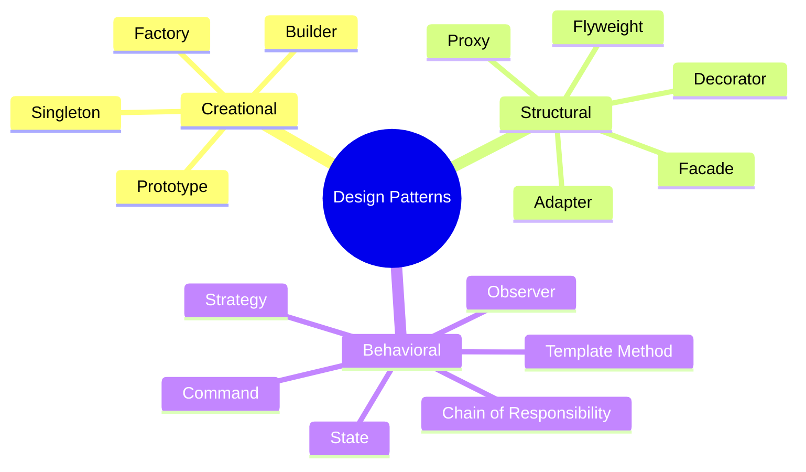

# 🏗️ Design Patterns in Java — Complete Deep Dive

**Related**: [OOP Concepts](01-oop-concepts.md) · [Collections Framework](02-collections-framework.md) · [Spring Boot](12-spring-boot.md) · [Hibernate/JPA](13-hibernate-jpa.md)

---

## Table of Contents


- [Patterns Overview](#-patterns-overview)
- [1. Singleton](#1-singleton)
- [2. Factory Method](#2-factory-method)
- [3. Builder](#3-builder)
- [4. Prototype](#4-prototype)
- [5. Adapter](#5-adapter)
- [6. Decorator](#6-decorator)
- [7. Proxy](#7-proxy)
- [8. Observer](#8-observer)
- [9. Strategy](#9-strategy)
- [10. Template Method](#10-template-method)
- [11. Chain of Responsibility](#11-chain-of-responsibility)
- [Pattern Selection Guide](#-pattern-selection-guide)
- [Simplest Mental Model](#-simplest-mental-model)

---

## 🧭 Patterns Overview




---

## 1. Singleton


**Purpose**: Ensure a class has exactly one instance.

### Classic (Thread-Safe)


```java
public class DatabaseConnectionPool {
    private static volatile DatabaseConnectionPool instance;
    private final int maxConnections;

    private DatabaseConnectionPool() {
        this.maxConnections = 10;
        // Private constructor — prevents instantiation
    }

    public static DatabaseConnectionPool getInstance() {
        if (instance == null) {  // First check (no lock)
            synchronized (DatabaseConnectionPool.class) {
                if (instance == null) {  // Second check (with lock)
                    instance = new DatabaseConnectionPool();
                }
            }
        }
        return instance;
    }
}
```

### Holder Pattern (Best)


```java
public class ConfigManager {
    private ConfigManager() { }

    // Inner class loader — thread-safe without synchronized
    private static class Holder {
        static final ConfigManager INSTANCE = new ConfigManager();
    }

    public static ConfigManager getInstance() {
        return Holder.INSTANCE;  // Loaded on first access
    }

    public String get(String key) {
        return System.getProperty(key, "default");
    }
}
```

### Enum Singleton


```java
public enum Logger {
    INSTANCE;  // JVM guarantees single instance

    public void log(String message) {
        System.out.println("[LOG] " + message);
    }

    public void error(String message) {
        System.err.println("[ERROR] " + message);
    }
}

// Usage
Logger.INSTANCE.log("Application started");
```

---

## 2. Factory Method


**Purpose**: Delegate object creation to subclasses.

### Simple Factory


```java
interface Payment {
    void pay(BigDecimal amount);
}

class CreditCardPayment implements Payment {
    public void pay(BigDecimal amount) {
        System.out.println("Paid " + amount + " via credit card");
    }
}

class PayPalPayment implements Payment {
    public void pay(BigDecimal amount) {
        System.out.println("Paid " + amount + " via PayPal");
    }
}

class CryptoPayment implements Payment {
    public void pay(BigDecimal amount) {
        System.out.println("Paid " + amount + " via Crypto");
    }
}

class PaymentFactory {
    public static Payment create(String type) {
        return switch (type.toUpperCase()) {
            case "CREDIT_CARD" -> new CreditCardPayment();
            case "PAYPAL" -> new PayPalPayment();
            case "CRYPTO" -> new CryptoPayment();
            default -> throw new IllegalArgumentException("Unknown: " + type);
        };
    }
}

// Usage
Payment payment = PaymentFactory.create("PAYPAL");
payment.pay(new BigDecimal("99.99"));
```

### Factory Method (GoF)


```java
abstract class DocumentGenerator {
    // Factory method — subclasses define implementation
    protected abstract Document createDocument();

    public void generate() {
        Document doc = createDocument();
        doc.open();
        doc.write();
        doc.close();
    }
}

class PDFGenerator extends DocumentGenerator {
    @Override
    protected Document createDocument() {
        return new PDFDocument();
    }
}

class HTMLGenerator extends DocumentGenerator {
    @Override
    protected Document createDocument() {
        return new HTMLDocument();
    }
}
```

---

## 3. Builder


**Purpose**: Construct complex objects step by step.

### Classic Builder


```java
public class HttpRequest {
    private final String url;
    private final String method;
    private final Map<String, String> headers;
    private final String body;
    private final int timeout;

    private HttpRequest(Builder builder) {
        this.url = builder.url;
        this.method = builder.method;
        this.headers = Collections.unmodifiableMap(builder.headers);
        this.body = builder.body;
        this.timeout = builder.timeout;
    }

    public static class Builder {
        private final String url;         // required
        private String method = "GET";    // optional — defaults
        private Map<String, String> headers = new HashMap<>();
        private String body;
        private int timeout = 30_000;

        public Builder(String url) {
            this.url = url;
        }

        public Builder method(String method) {
            this.method = method;
            return this;
        }

        public Builder header(String key, String value) {
            this.headers.put(key, value);
            return this;
        }

        public Builder body(String body) {
            this.body = body;
            return this;
        }

        public Builder timeout(int timeout) {
            this.timeout = timeout;
            return this;
        }

        public HttpRequest build() {
            return new HttpRequest(this);
        }
    }
}

// Usage
HttpRequest request = new HttpRequest.Builder("https://api.example.com")
    .method("POST")
    .header("Content-Type", "application/json")
    .body("{\"name\":\"test\"}")
    .timeout(10_000)
    .build();
```

### Java 8+ Functional Builder


```java
public class Person {
    private String name;
    private int age;
    private String email;

    private Person() { }

    public static Builder<?> builder() {
        return new Builder<>();
    }

    public static class Builder<T extends Builder<T>> {
        private Person person = new Person();

        public T name(String name) {
            person.name = name;
            return self();
        }

        public T age(int age) {
            person.age = age;
            return self();
        }

        public T email(String email) {
            person.email = email;
            return self();
        }

        public Person build() {
            return person;
        }

        @SuppressWarnings("unchecked")
        protected T self() { return (T) this; }
    }
}

// Usage with Lombok-style
Person person = Person.builder()
    .name("Alice")
    .age(30)
    .email("alice@example.com")
    .build();
```

---

## 4. Prototype


**Purpose**: Create new objects by cloning existing ones.

```java
public class Shape implements Cloneable {
    private String type;
    private int x, y;
    private Map<String, String> properties = new HashMap<>();

    public Shape(String type) {
        this.type = type;
    }

    // Deep copy — override clone
    @Override
    public Shape clone() {
        try {
            Shape cloned = (Shape) super.clone();  // shallow copy
            cloned.properties = new HashMap<>(this.properties);  // deep copy map
            return cloned;
        } catch (CloneNotSupportedException e) {
            throw new AssertionError();
        }
    }

    // Getters/setters...
}

// Usage
Shape circlePrototype = new Shape("circle");
circlePrototype.setX(10);
circlePrototype.setY(10);
circlePrototype.setProperty("radius", "5");

Shape newCircle = circlePrototype.clone();  // no new keyword
newCircle.setX(20);  // modify copy independently
```

### Prototype Registry


```java
public class ShapeRegistry {
    private final Map<String, Shape> prototypes = new HashMap<>();

    public ShapeRegistry() {
        Shape circle = new Shape("circle");
        circle.setProperty("radius", "10");
        prototypes.put("big_circle", circle);

        Shape square = new Shape("square");
        square.setProperty("size", "10");
        prototypes.put("square", square);
    }

    public Shape createShape(String key) {
        Shape prototype = prototypes.get(key);
        if (prototype == null) {
            throw new IllegalArgumentException("Unknown: " + key);
        }
        return prototype.clone();
    }
}
```

---

## 5. Adapter


**Purpose**: Make incompatible interfaces work together.

### Class Adapter (extends)


```java
// Existing interface (old system)
interface OldLogger {
    void logMessage(String severity, String message);
}

// New interface (target)
interface Logger {
    void info(String message);
    void warn(String message);
    void error(String message);
}

// Adapter — adapts OldLogger to Logger interface
class LoggerAdapter extends OldLoggerImpl implements Logger {
    @Override
    public void info(String message) {
        logMessage("INFO", message);
    }

    @Override
    public void warn(String message) {
        logMessage("WARN", message);
    }

    @Override
    public void error(String message) {
        logMessage("ERROR", message);
    }
}
```

### Object Adapter (composition)


```java
// Third-party payment gateway (incompatible)
class StripeGateway {
    public StripeCharge createCharge(double amount, String currency) {
        System.out.println("Stripe: charging " + amount + " " + currency);
        return new StripeCharge();
    }
}

// Our application interface
interface PaymentProcessor {
    void pay(String amount, String currency);
}

// Adapter using composition
class StripeAdapter implements PaymentProcessor {
    private final StripeGateway gateway;

    public StripeAdapter(StripeGateway gateway) {
        this.gateway = gateway;
    }

    @Override
    public void pay(String amount, String currency) {
        double numericAmount = Double.parseDouble(amount);
        gateway.createCharge(numericAmount, currency);
    }
}

// Usage
PaymentProcessor processor = new StripeAdapter(new StripeGateway());
processor.pay("99.99", "USD");  // Same interface for any gateway
```

### Adapter in Java Standard Library


```java
// Arrays.asList — adapts array to List interface
String[] array = {"a", "b", "c"};
List<String> list = Arrays.asList(array);

// InputStreamReader — adapts InputStream to Reader
InputStream input = new FileInputStream("file.txt");
Reader reader = new InputStreamReader(input, StandardCharsets.UTF_8);
```

---

## 6. Decorator


**Purpose**: Add responsibilities to objects dynamically.

### Coffee Example


```java
interface Coffee {
    String getDescription();
    double getCost();
}

class SimpleCoffee implements Coffee {
    @Override
    public String getDescription() { return "Simple coffee"; }

    @Override
    public double getCost() { return 2.0; }
}

// Abstract decorator
abstract class CoffeeDecorator implements Coffee {
    protected final Coffee coffee;

    public CoffeeDecorator(Coffee coffee) {
        this.coffee = coffee;
    }
}

class MilkDecorator extends CoffeeDecorator {
    public MilkDecorator(Coffee coffee) { super(coffee); }

    @Override
    public String getDescription() {
        return coffee.getDescription() + ", milk";
    }

    @Override
    public double getCost() {
        return coffee.getCost() + 0.5;
    }
}

class SugarDecorator extends CoffeeDecorator {
    public SugarDecorator(Coffee coffee) { super(coffee); }

    @Override
    public String getDescription() {
        return coffee.getDescription() + ", sugar";
    }

    @Override
    public double getCost() {
        return coffee.getCost() + 0.25;
    }
}

class WhippedCreamDecorator extends CoffeeDecorator {
    public WhippedCreamDecorator(Coffee coffee) { super(coffee); }

    @Override
    public String getDescription() {
        return coffee.getDescription() + ", whipped cream";
    }

    @Override
    public double getCost() {
        return coffee.getCost() + 0.75;
    }
}

// Usage
Coffee coffee = new SimpleCoffee();
coffee = new MilkDecorator(coffee);
coffee = new SugarDecorator(coffee);
coffee = new WhippedCreamDecorator(coffee);

System.out.println(coffee.getDescription());  // "Simple coffee, milk, sugar, whipped cream"
System.out.println(coffee.getCost());         // 3.5
```

### Decorator in Java I/O


```java
// Decorator pattern in Java's I/O classes
InputStream input = new FileInputStream("file.txt");       // core
InputStream buffered = new BufferedInputStream(input);     // decorator
InputStream zipped = new GZIPInputStream(buffered);        // decorator
Reader reader = new InputStreamReader(zipped);             // decorator
BufferedReader br = new BufferedReader(reader);             // decorator
```

---

## 7. Proxy


**Purpose**: Provide a surrogate or placeholder for another object.

### Virtual Proxy (Lazy Loading)


```java
interface Image {
    void display();
}

class RealImage implements Image {
    private final String filename;

    public RealImage(String filename) {
        this.filename = filename;
        loadFromDisk();  // expensive
    }

    private void loadFromDisk() {
        System.out.println("Loading image: " + filename);
        // Simulate slow I/O
        try { Thread.sleep(2000); } catch (InterruptedException e) { }
    }

    @Override
    public void display() {
        System.out.println("Displaying: " + filename);
    }
}

class ProxyImage implements Image {
    private final String filename;
    private RealImage realImage;

    public ProxyImage(String filename) {
        this.filename = filename;
    }

    @Override
    public void display() {
        if (realImage == null) {
            realImage = new RealImage(filename);  // lazy load
        }
        realImage.display();
    }
}

// Usage
Image image = new ProxyImage("photo.jpg");
// No loading yet
image.display();  // Loads and displays
image.display();  // Only displays (already loaded)
```

### Protection Proxy


```java
interface BankAccount {
    void withdraw(double amount);
    double getBalance();
}

class RealBankAccount implements BankAccount {
    private double balance;

    public RealBankAccount(double balance) {
        this.balance = balance;
    }

    @Override
    public void withdraw(double amount) {
        if (amount <= balance) {
            balance -= amount;
            System.out.println("Withdrew: " + amount);
        }
    }

    @Override
    public double getBalance() { return balance; }
}

class ProtectionProxy implements BankAccount {
    private final RealBankAccount account;
    private final String userRole;

    public ProtectionProxy(double balance, String userRole) {
        this.account = new RealBankAccount(balance);
        this.userRole = userRole;
    }

    @Override
    public void withdraw(double amount) {
        if (!"ADMIN".equals(userRole)) {
            throw new SecurityException("Only admins can withdraw");
        }
        account.withdraw(amount);
    }

    @Override
    public double getBalance() {
        return account.getBalance();  // anyone can check balance
    }
}
```

### Proxy in Spring (AOP)


```java
@Aspect
@Component
public class LoggingAspect {
    @Around("@annotation(LogExecution)")
    public Object logExecution(ProceedingJoinPoint joinPoint) throws Throwable {
        long start = System.currentTimeMillis();
        Object result = joinPoint.proceed();
        long duration = System.currentTimeMillis() - start;

        System.out.println(joinPoint.getSignature() + " took " + duration + "ms");
        return result;
    }
}
// Spring creates a proxy around the target bean
```

---

## 8. Observer


**Purpose**: Define a one-to-many dependency between objects.

### Java's Observer Pattern (Built-in)


```java
// Subject — produces events
class NewsAgency {
    private final List<NewsChannel> channels = new ArrayList<>();

    public void addObserver(NewsChannel channel) {
        channels.add(channel);
    }

    public void removeObserver(NewsChannel channel) {
        channels.remove(channel);
    }

    public void publishNews(String news) {
        System.out.println("Breaking: " + news);
        for (NewsChannel channel : channels) {
            channel.update(news);  // notify all
        }
    }
}

// Observer interface
interface NewsChannel {
    void update(String news);
}

class TVChannel implements NewsChannel {
    private final String name;

    public TVChannel(String name) { this.name = name; }

    @Override
    public void update(String news) {
        System.out.println(name + " TV: " + news);
    }
}

class RadioStation implements NewsChannel {
    @Override
    public void update(String news) {
        System.out.println("Radio: " + news);
    }
}

// Usage
NewsAgency agency = new NewsAgency();
agency.addObserver(new TVChannel("CNN"));
agency.addObserver(new TVChannel("BBC"));
agency.addObserver(new RadioStation());

agency.publishNews("Stock market hits record high!");
// All observers receive the update
```

### PropertyChangeListener (Standard Java)


```java
import java.beans.PropertyChangeListener;
import java.beans.PropertyChangeSupport;

class Stock {
    private final PropertyChangeSupport pcs = new PropertyChangeSupport(this);
    private String symbol;
    private double price;

    public Stock(String symbol, double price) {
        this.symbol = symbol;
        this.price = price;
    }

    public void setPrice(double newPrice) {
        double oldPrice = this.price;
        this.price = newPrice;
        pcs.firePropertyChange("price", oldPrice, newPrice);
    }

    public void addListener(PropertyChangeListener listener) {
        pcs.addPropertyChangeListener(listener);
    }
}

// Usage
Stock apple = new Stock("AAPL", 150.0);
apple.addListener(e -> System.out.printf(
    "Stock %s changed from %.2f to %.2f%n",
    apple, e.getOldValue(), e.getNewValue()));
apple.setPrice(155.0);  // triggers notification
```

### Observer in Java Standard Library


```java
// Swing/AWT event listeners
button.addActionListener(e -> System.out.println("Clicked"));

// JDBC RowSet listeners
rowSet.addRowSetListener(new RowSetAdapter() {
    @Override public void rowChanged(RowSetEvent e) { }
});

// JMX notifications
```

---

## 9. Strategy


**Purpose**: Define a family of algorithms, make them interchangeable.

### Sorting Strategy Example


```java
interface SortStrategy {
    <T extends Comparable<T>> void sort(List<T> items);
}

class BubbleSortStrategy implements SortStrategy {
    @Override
    public <T extends Comparable<T>> void sort(List<T> items) {
        System.out.println("Using bubble sort");
        int n = items.size();
        for (int i = 0; i < n - 1; i++)
            for (int j = 0; j < n - i - 1; j++)
                if (items.get(j).compareTo(items.get(j + 1)) > 0)
                    Collections.swap(items, j, j + 1);
    }
}

class QuickSortStrategy implements SortStrategy {
    @Override
    public <T extends Comparable<T>> void sort(List<T> items) {
        System.out.println("Using quick sort");
        Collections.sort(items); // Java's optimized sort
    }
}

class Context {
    private SortStrategy strategy;

    public Context(SortStrategy strategy) {
        this.strategy = strategy;
    }

    public void setStrategy(SortStrategy strategy) {
        this.strategy = strategy;
    }

    public <T extends Comparable<T>> void executeSort(List<T> items) {
        strategy.sort(items);
    }
}

// Usage
List<Integer> numbers = new ArrayList<>(List.of(3, 1, 4, 1, 5, 9));

Context context = new Context(new BubbleSortStrategy());
context.executeSort(numbers);  // Using bubble sort

context.setStrategy(new QuickSortStrategy());
context.executeSort(numbers);  // Using quick sort
```

### Strategy with Lambdas (Java 8+)


```java
// Instead of defining class for each strategy, use lambda/method reference

// Strategy type
@FunctionalInterface
interface DiscountStrategy {
    double applyDiscount(double price);
}

class ShoppingCart {
    private DiscountStrategy strategy;

    public ShoppingCart(DiscountStrategy strategy) {
        this.strategy = strategy;
    }

    public double calculateTotal(double price) {
        return strategy.applyDiscount(price);
    }
}

// Usage — no need for strategy classes!
var cart = new ShoppingCart(price -> price * 0.9);           // 10% off
var holiday = new ShoppingCart(price -> price - 50);         // $50 off
var blackFriday = new ShoppingCart(price -> price * 0.5);   // 50% off
var noDiscount = new ShoppingCart(price -> price);           // no discount

// Or use method references
var fixedDiscount = new ShoppingCart(this::employeeDiscount);
```

### Strategy in Java Standard Library


```java
// Comparator is a Strategy pattern
Comparator<String> byLength = (a, b) -> Integer.compare(a.length(), b.length());
Comparator<String> reverse = Comparator.reverseOrder();

Collections.sort(list, byLength);   // different sorting strategy
Collections.sort(list, reverse);    // different strategy

// ThreadPoolExecutor's RejectedExecutionHandler
ThreadPoolExecutor executor = new ThreadPoolExecutor(
    2, 4, 60, TimeUnit.SECONDS,
    new ArrayBlockingQueue<>(100),
    new ThreadPoolExecutor.CallerRunsPolicy()  // rejection strategy
);
```

---

## 10. Template Method


**Purpose**: Define skeleton of an algorithm, let subclasses fill in steps.

### Data Exporter Example


```java
abstract class DataExporter {
    // Template method — defines the algorithm
    public final void export(String data) {
        openFile();
        writeHeader();
        writeBody(data);
        writeFooter();
        closeFile();
    }

    // Abstract steps — subclasses implement
    protected abstract void openFile();
    protected abstract void writeHeader();
    protected abstract void writeBody(String data);
    protected abstract void writeFooter();
    protected abstract void closeFile();
}

class CSVExporter extends DataExporter {
    @Override
    protected void openFile() {
        System.out.println("Opening CSV file");
    }

    @Override
    protected void writeHeader() {
        System.out.println("id,name,email");
    }

    @Override
    protected void writeBody(String data) {
        System.out.println("1,Alice,alice@example.com");
        System.out.println("2,Bob,bob@example.com");
    }

    @Override
    protected void writeFooter() {
        System.out.println("Total rows: 2");
    }

    @Override
    protected void closeFile() {
        System.out.println("Closing CSV file");
    }
}

class JSONExporter extends DataExporter {
    @Override
    protected void openFile() {
        System.out.println("Opening JSON file");
    }

    @Override
    protected void writeHeader() { System.out.println("{"); }

    @Override
    protected void writeBody(String data) {
        System.out.println("  \"users\": [{\"name\":\"Alice\"}]");
    }

    @Override
    protected void writeFooter() { System.out.println("}"); }

    @Override
    protected void closeFile() {
        System.out.println("Closing JSON file");
    }
}
```

### Hook Methods


```java
abstract class Game {
    // Template method
    public final void play() {
        initialize();
        startPlay();
        if (isGameOver()) {  // hook — can be overridden
            endPlay();
        }
        showResult();
        cleanup();
    }

    protected abstract void initialize();
    protected abstract void startPlay();
    protected abstract void endPlay();
    protected abstract void showResult();

    // Hook — default implementation, subclasses may override
    protected boolean isGameOver() { return true; }

    protected void cleanup() {
        // Optional — subclasses can override
    }
}
```

### Template Method in Java Standard Library


```java
// java.io.InputStream.read(byte[], int, int)
// Subclass implements read() — template handles buffering

// java.util.AbstractList
// Subclass implements get() + size() — template provides subList(), etc.

// javax.servlet.http.HttpServlet
// Template: service() calls doGet(), doPost(), etc.
```

---

## 11. Chain of Responsibility


**Purpose**: Pass request along a chain of handlers.

### Logging Framework Example


```java
abstract class LogHandler {
    protected LogHandler next;
    protected final LogLevel level;

    public LogHandler(LogLevel level) {
        this.level = level;
    }

    public LogHandler setNext(LogHandler next) {
        this.next = next;
        return next;  // fluent API
    }

    public void handle(LogLevel requestLevel, String message) {
        if (this.level.ordinal() <= requestLevel.ordinal()) {
            write(message);
        }
        if (next != null) {
            next.handle(requestLevel, message);  // pass to next
        }
    }

    protected abstract void write(String message);
}

enum LogLevel {
    DEBUG, INFO, WARN, ERROR, FATAL
}

class ConsoleHandler extends LogHandler {
    public ConsoleHandler(LogLevel level) { super(level); }

    @Override
    protected void write(String message) {
        System.out.println("[Console] " + message);
    }
}

class FileHandler extends LogHandler {
    public FileHandler(LogLevel level) { super(level); }

    @Override
    protected void write(String message) {
        System.out.println("[File] " + message);  // would write to file
    }
}

class EmailHandler extends LogHandler {
    public EmailHandler(LogLevel level) { super(level); }

    @Override
    protected void write(String message) {
        System.out.println("[Email] " + message);  // would send email
    }
}

// Build chain
LogHandler chain = new ConsoleHandler(LogLevel.DEBUG);
chain.setNext(new FileHandler(LogLevel.INFO))
     .setNext(new EmailHandler(LogLevel.ERROR));

// Usage
chain.handle(LogLevel.DEBUG, "Starting application");  // Console only
chain.handle(LogLevel.INFO, "User logged in");           // Console + File
chain.handle(LogLevel.ERROR, "Database connection lost"); // Console + File + Email
```

### Chain in Java Standard Library


```java
// Servlet filters
@WebFilter("/api/*")
public class AuthFilter implements Filter {
    private FilterConfig config;

    @Override
    public void doFilter(ServletRequest request, ServletResponse response,
                         FilterChain chain) throws IOException, ServletException {
        // Pre-processing
        if (isAuthorized(request)) {
            chain.doFilter(request, response);  // pass to next filter
        } else {
            ((HttpServletResponse) response).sendError(401);
        }
        // Post-processing
    }
}

// java.util.logging.Logger — log records propagate to parent handlers
```

---

## 🎯 Pattern Selection Guide


### When to Use Which Pattern


```text
Creational:
  ┌──────────────┬────────────────────────────────────┐
  │ Problem      │ Pattern                            │
  ├──────────────┼────────────────────────────────────┤
  │ Need 1 instance│ Singleton                        │
  │ Object creation│ Factory Method / Abstract Factory │
  │  is complex  │                                    │
  │ Complex object│ Builder                           │
  │  construction│                                    │
  │ Cloning objects│ Prototype                        │
  └──────────────┴────────────────────────────────────┘

Structural:
  ┌──────────────┬────────────────────────────────────┐
  │ Problem      │ Pattern                            │
  ├──────────────┼────────────────────────────────────┤
  │ Incompatible │ Adapter                            │
  │  interfaces  │                                    │
  │ Add behavior │ Decorator                          │
  │  dynamically │                                    │
  │ Control access│ Proxy                             │
  │ Simplify system│ Facade                           │
  └──────────────┴────────────────────────────────────┘

Behavioral:
  ┌──────────────┬────────────────────────────────────┐
  │ Problem      │ Pattern                            │
  ├──────────────┼────────────────────────────────────┤
  │ Interchangeable│ Strategy                         │
  │  algorithms  │                                    │
  │ 1-to-many    │ Observer                           │
  │  notification│                                    │
  │ Algorithm     │ Template Method                   │
  │  skeleton    │                                    │
  │ Request chain │ Chain of Responsibility            │
  └──────────────┴────────────────────────────────────┘
```

---

## 🧠 Simplest Mental Model


```text
SINGLETON      =  The single coffee machine in the office. One instance,
                   shared by everyone.

FACTORY        =  A vending machine. You press a button (type),
                   machine gives you the product. You don't know
                   how it's made.

BUILDER        =  Building a custom pizza. You add toppings step by step,
                   then "build" (cook) it. Each step returns the builder
                   so you can chain.

ADAPTER        =  A plug converter when traveling abroad.
                   Different shape, same electricity.

DECORATOR      =  Adding toppings to ice cream. Base + chocolate + nuts + cherry.
                   Each wrapper adds something.

PROXY          =  A personal assistant. They answer calls and decide
                   if the CEO should be disturbed.

OBSERVER       =  YouTube subscriptions. A creator posts video → all
                   subscribers get notified.

STRATEGY       =  GPS navigation. Same destination, different route
                   strategies: fastest, shortest, avoid tolls.

TEMPLATE       =  A recipe card with blanks. "Bake at __° for __ min."
METHOD             Steps are fixed, but temperatures fill in differently.

CHAIN OF       =  Help desk escalation. Level 1 tries, then Level 2,
RESPONSIBILITY    then Level 3. If one can't solve it, it passes up.
```

---

**Next**: [Index](index.md) — Back to main index


## Comparison Table


| Aspect | Option A | Option B | Trade-off |
| ---- | ---- | ---- | ---- |
| Performance | High | Medium | Speed vs Simplicity |
| Complexity | High | Low | Features vs Ease of Use |
| Scalability | Excellent | Good | Horizontal vs Vertical |
| Cost | High | Low | Features vs Budget |