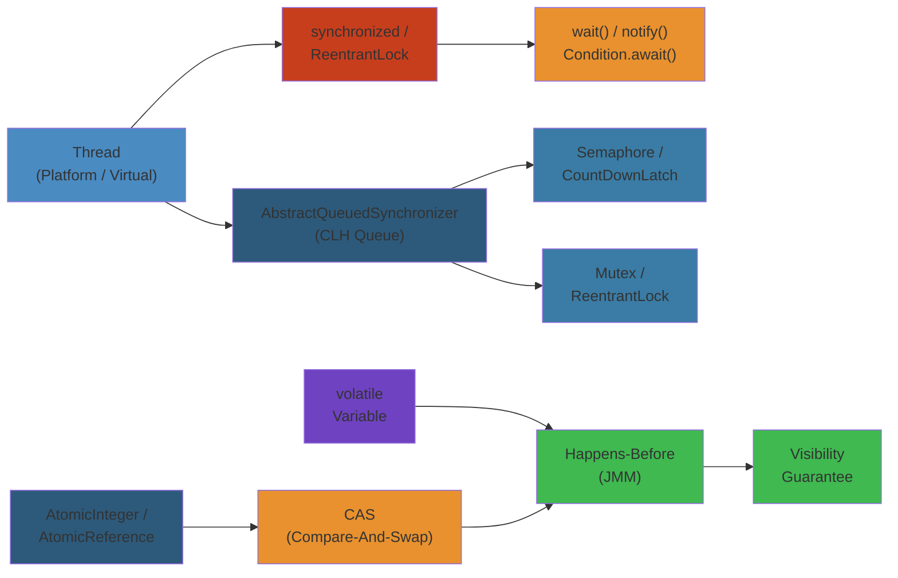
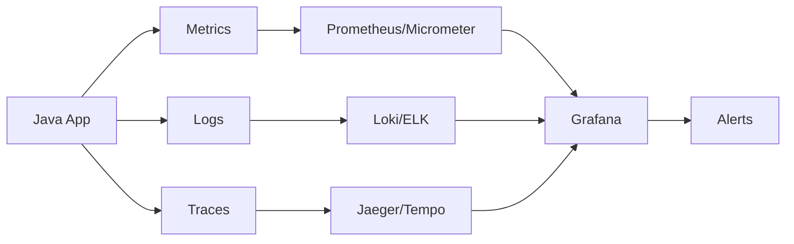

# 🧵 Java Concurrency Deep Dive — Complete Deep Dive




## Table of Contents

#### Step-by-Step
1. Process input
2. Validate
3. Execute
4. Return result

#### Code Example
```python
# Example implementation
pass
```

#### Real-World Scenario
This pattern is commonly used in production systems.

- [Java Memory Model](#java-memory-model)
- [Thread Lifecycle](#thread-lifecycle)
- [Thread Safety](#thread-safety)
- [java.util.concurrent Collections](#javautilconcurrent-collections)
- [Executors & Thread Pools](#executors--thread-pools)
- [Virtual Threads](#virtual-threads)
- [Synchronizers](#synchronizers)
- [Locks & AQS](#locks--aqs)
- [Atomic Variables & Striped64](#atomic-variables--striped64)
- [False Sharing](#false-sharing)
- [ThreadLocal](#threadlocal)
- [CompletableFuture](#completablefuture)

---

## Java Memory Model

#### Step-by-Step
1. Process input
2. Validate
3. Execute
4. Return result

#### Code Example
```python
# Example implementation
pass
```

#### Real-World Scenario
This pattern is commonly used in production systems.


```text
┌─────────────────────────────────────────────────────┐
│                  Java Memory Model                    │
├───────────────┬─────────────────────┬───────────────┤
│   Thread 1    │     Shared Heap     │   Thread 2    │
│   ┌───────┐   │  ┌───────────────┐  │   ┌───────┐   │
│   │ L1 $  │   │  │   Object X    │  │   │ L1 $  │   │
│   └───────┘   │  │  field = 42   │  │   └───────┘   │
│   ┌───────┐   │  └───────────────┘  │   ┌───────┐   │
│   │Local $│   │                     │   │Local $│   │
│   └───────┘   └─────────────────────┘   └───────┘   │
└─────────────────────────────────────────────────────┘
```

**Happens-Before Rules**: volatile write → volatile read, synchronized unlock → lock, thread.start() → any action in thread, thread.join() → subsequent actions, transitive.

```java
// volatile: guarantees visibility, prevents reordering
private volatile boolean running = true;

public void stop() { running = false; }  // write: flush to main memory
public void runLoop() {
    while (running) {}  // read: fetch from main memory, not cache
}

// final fields: guaranteed visible after constructor completes
class SafePublication {
    private final int x;
    private final int[] arr;  // final ref, but array contents NOT final

    SafePublication(int x, int[] arr) {
        this.x = x;
        this.arr = arr.clone();  // defensive copy
    }
}
```

## Thread Lifecycle

#### Step-by-Step
1. Process input
2. Validate
3. Execute
4. Return result

#### Code Example
```python
# Example implementation
pass
```

#### Real-World Scenario
This pattern is commonly used in production systems.


```text
┌──────────┐  start()  ┌──────────┐  acquire lock  ┌──────────┐
│  NEW     │ ────────→ │ RUNNABLE │ ─────────────→ │ BLOCKED  │
└──────────┘           └──────────┘                 └──────────┘
                          │                               │
                          │ wait()/park()                 │ notify()/unlock
                          ↓                               ↓
                     ┌──────────┐                   ┌──────────┐
                     │ WAITING  │                   │ RUNNABLE │
                     └──────────┘                   └──────────┘
                          │                               │
                          │ sleep(ms)/wait(timeout)        │ run() completes
                          ↓                               ↓
                     ┌──────────────┐               ┌──────────┐
                     │TIMED_WAITING │               │TERMINATED│
                     └──────────────┘               └──────────┘
```

```java
Thread t = new Thread(() -> System.out.println("Work"));
System.out.println(t.getState()); // NEW
t.start();
System.out.println(t.getState()); // RUNNABLE
t.join();
System.out.println(t.getState()); // TERMINATED
```

## Thread Safety

#### Step-by-Step
1. Process input
2. Validate
3. Execute
4. Return result

#### Code Example
```python
# Example implementation
pass
```

#### Real-World Scenario
This pattern is commonly used in production systems.


| Strategy | Mechanism | Use Case |
|----------|-----------|----------|
| Immutability | final fields, no setters | Value objects |
| Defensive copies | copy before returning | Internal state protection |
| Synchronized | intrinsic lock | Coarse-grained locking |
| Concurrent collections | Lock-free/CAS | High-throughput |

```java
// Immutability
record Point(double x, double y) {}  // all fields final, no mutators

// Defensive copies
public class Person {
    private final Date birthDate;
    public Person(Date birthDate) {
        this.birthDate = new Date(birthDate.getTime()); // defensive copy in
    }
    public Date getBirthDate() {
        return (Date) birthDate.clone(); // defensive copy out
    }
}

// Synchronized collections (poor scaling under contention)
Map<String, String> syncMap = Collections.synchronizedMap(new HashMap<>());
// Concurrent collections (better)
ConcurrentHashMap<String, String> chm = new ConcurrentHashMap<>();
```

## java.util.concurrent Collections

#### Step-by-Step
1. Process input
2. Validate
3. Execute
4. Return result

#### Code Example
```python
# Example implementation
pass
```

#### Real-World Scenario
This pattern is commonly used in production systems.


```text
ConcurrentHashMap Evolution:
┌─────────────────────────────────────────────────────┐
│ Java 7: Segmented Lock                               │
│ ┌──────┐ ┌──────┐ ┌──────┐         ┌──────┐        │
│ │Seg 0 │ │Seg 1 │ │Seg 2 │   ...   │Seg 15│        │
│ │Lock  │ │Lock  │ │Lock  │         │Lock  │        │
│ └──────┘ └──────┘ └──────┘         └──────┘        │
│                                                      │
│ Java 8+: CAS + synchronized for collisions           │
│ ┌─────────────────────────────────────────────────┐ │
│ │ Node[] table: CAS for first insert per bucket   │ │
│ │ synchronized on head node for collisions         │ │
│ │ Tree bins for high-collision buckets (TREEIFY)  │ │
│ └─────────────────────────────────────────────────┘ │
└─────────────────────────────────────────────────────┘
```

```java
// BlockingQueue implementations
BlockingQueue<Runnable> queue1 = new ArrayBlockingQueue<>(100); // bounded, fair
BlockingQueue<Runnable> queue2 = new LinkedBlockingQueue<>();   // optionally bounded
BlockingQueue<Runnable> queue3 = new PriorityBlockingQueue<>(); // priority order
BlockingQueue<Delayed> queue4 = new DelayQueue<>();             // delayed elements
BlockingQueue<Runnable> queue5 = new SynchronousQueue<>();      // handoff, no capacity
TransferQueue<Runnable> queue6 = new LinkedTransferQueue<>();   // transfer + queue
BlockingDeque<Runnable> queue7 = new LinkedBlockingDeque<>();   // double-ended

// CopyOnWriteArrayList: snapshot iterator, no ConcurrentModificationException
CopyOnWriteArrayList<String> cowList = new CopyOnWriteArrayList<>();
cowList.add("a");  // copies entire array
for (String s : cowList) {  // safe even if other thread modifies
    cowList.add("b");       // iterator sees snapshot
}
```

## Executors & Thread Pools

#### Step-by-Step
1. Process input
2. Validate
3. Execute
4. Return result

#### Code Example
```python
# Example implementation
pass
```

#### Real-World Scenario
This pattern is commonly used in production systems.


```text
ThreadPoolExecutor Anatomy:
┌───────────────────────────────────────────────────────┐
│  ThreadPoolExecutor                                    │
│  ┌─────────────┐  submits   ┌──────────────────────┐ │
│  │   Caller    │ ─────────→│  WorkQueue (Runnable) │ │
│  └─────────────┘            └──────────┬───────────┘ │
│                                        │              │
│  ┌─────────────────────────────────────┴──────────┐  │
│  │     Worker Threads                              │  │
│  │  ┌──────┐ ┌──────┐ ┌──────┐  ┌──────┐          │  │
│  │  │ T1   │ │ T2   │ │ T3   │  │ T4   │          │  │
│  │  └──────┘ └──────┘ └──────┘  └──────┘          │  │
│  └─────────────────────────────────────────────────┘  │
│  corePoolSize=4 maxPoolSize=8 keepAliveTime=60s      │
│  RejectedExecutionHandler: AbortPolicy(default)      │
└───────────────────────────────────────────────────────┘
```

```java
ThreadPoolExecutor executor = new ThreadPoolExecutor(
    4,                          // corePoolSize
    8,                          // maxPoolSize
    60, TimeUnit.SECONDS,       // keepAliveTime
    new LinkedBlockingQueue<>(100), // workQueue
    Executors.defaultThreadFactory(),
    new ThreadPoolExecutor.CallerRunsPolicy() // rejection handler
);

// ForkJoinPool: work-stealing
ForkJoinPool pool = ForkJoinPool.commonPool();

RecursiveTask<Long> task = new RecursiveTask<>() {
    private final long[] arr; private final int lo, hi;
    static final int THRESHOLD = 10_000;

    @Override protected Long compute() {
        if (hi - lo <= THRESHOLD) {
            long sum = 0;
            for (int i = lo; i < hi; i++) sum += arr[i];
            return sum;
        }
        int mid = (lo + hi) >>> 1;
        RecursiveTask<Long> left = new RecursiveTask(arr, lo, mid);
        RecursiveTask<Long> right = new RecursiveTask(arr, mid, hi);
        left.fork();           // push to local deque
        long rightRes = right.compute();
        long leftRes = left.join();  // steal if empty
        return leftRes + rightRes;
    }
};
pool.invoke(task);
```

## Virtual Threads

#### Step-by-Step
1. Process input
2. Validate
3. Execute
4. Return result

#### Code Example
```python
# Example implementation
pass
```

#### Real-World Scenario
This pattern is commonly used in production systems.


```java
// Virtual threads (Project Loom, Java 21+)
Thread vThread = Thread.startVirtualThread(() -> {
    System.out.println("Running on: " + Thread.currentThread());
});

// ExecutorService that uses virtual threads
try (var executor = Executors.newVirtualThreadPerTaskExecutor()) {
    executor.submit(() -> doWork());
}

// Structured concurrency (Java 21 preview → 22 finalized)
try (var scope = new StructuredTaskScope.ShutdownOnFailure()) {
    Future<String> user = scope.fork(() -> fetchUser());
    Future<Integer> orders = scope.fork(() -> fetchOrders());
    scope.join();               // wait for all
    scope.throwIfFailed();      // propagate failure
    String result = user.resultNow() + orders.resultNow();
}

// ScopedValue (replacement for ThreadLocal with virtual threads)
private static final ScopedValue<String> REQUEST_ID = ScopedValue.newInstance();

void handle(HttpRequest req) {
    ScopedValue.where(REQUEST_ID, req.requestId())
               .run(() -> processRequest());
}

void processRequest() {
    String rid = REQUEST_ID.get();  // inherited by virtual threads
}

// Pinning: virtual thread pinned to carrier thread
// synchronized blocks cause pinning → prefer ReentrantLock
```

## Synchronizers

#### Step-by-Step
1. Process input
2. Validate
3. Execute
4. Return result

#### Code Example
```python
# Example implementation
pass
```

#### Real-World Scenario
This pattern is commonly used in production systems.


```java
// CountDownLatch: one-time barrier
CountDownLatch latch = new CountDownLatch(3);
// worker threads: latch.countDown();
latch.await(); // blocks until count reaches 0

// CyclicBarrier: reusable barrier with optional action
CyclicBarrier barrier = new CyclicBarrier(3, () -> System.out.println("All arrived"));
// worker threads: barrier.await(); barrier.reset();

// Semaphore: permits
Semaphore semaphore = new Semaphore(10); // 10 concurrent permits
semaphore.acquire();
semaphore.release();

// Exchanger: pair-wise exchange
Exchanger<String> exchanger = new Exchanger<>();
// Thread A: String received = exchanger.exchange("from A");
// Thread B: String received = exchanger.exchange("from B");

// Phaser: flexible multi-phase barrier
Phaser phaser = new Phaser(); // party count 0
phaser.bulkRegister(5);       // register 5 parties
phaser.arriveAndAwaitAdvance(); // phase advancement
phaser.arriveAndDeregister();
```

## Locks & AQS

#### Step-by-Step
1. Process input
2. Validate
3. Execute
4. Return result

#### Code Example
```python
# Example implementation
pass
```

#### Real-World Scenario
This pattern is commonly used in production systems.


```text
AQS (AbstractQueuedSynchronizer):
┌─────────────────────────────────────────────┐
│  AbstractQueuedSynchronizer (AQS)            │
│  state: int (volatile)                       │
│  ┌───┐ ┌───┐ ┌───┐ ┌───┐                   │
│  │ T1│→│ T2│→│ T3│→│ T4│   CLH Queue      │
│  └───┘ └───┘ └───┘ └───┘                   │
│  tryAcquire() → CAS on state                │
│  tryRelease() → CAS decrement state         │
│  acquireShared() / releaseShared()          │
└─────────────────────────────────────────────┘
```

```java
// ReentrantLock: replacement for synchronized
ReentrantLock lock = new ReentrantLock(true); // fair
lock.lock();
try {
    // critical section
} finally {
    lock.unlock();
}

// Condition: per-lock wait/notify
Condition notFull = lock.newCondition();
Condition notEmpty = lock.newCondition();
notEmpty.await();
notFull.signal();

// ReentrantReadWriteLock: readers share, writer exclusive
ReentrantReadWriteLock rwLock = new ReentrantReadWriteLock();
Lock readLock = rwLock.readLock();
Lock writeLock = rwLock.writeLock();

// StampedLock: optimistic reads (better throughput)
StampedLock stampedLock = new StampedLock();
long stamp = stampedLock.tryOptimisticRead();
int x = state; // read without lock
if (!stampedLock.validate(stamp)) { // conflicted?
    stamp = stampedLock.readLock();  // fall back to pessimistic
    try { x = state; } finally { stampedLock.unlockRead(stamp); }
}
```

## Atomic Variables & Striped64

#### Step-by-Step
1. Process input
2. Validate
3. Execute
4. Return result

#### Code Example
```python
# Example implementation
pass
```

#### Real-World Scenario
This pattern is commonly used in production systems.


```java
// Basic atomics
AtomicInteger count = new AtomicInteger(0);
count.incrementAndGet();   // CAS-based
count.getAndSet(10);
count.compareAndSet(10, 20);

AtomicReference<String> ref = new AtomicReference<>("initial");
ref.updateAndGet(s -> s + "_updated");

// LongAdder: Striped64-based, better for high-contention counters
LongAdder adder = new LongAdder();
adder.increment();   // striped across CPU caches
adder.add(5);
long sum = adder.sum(); // sum then reset

// LongAccumulator: custom reduction
LongAccumulator max = new LongAccumulator(Long::max, 0L);
max.accumulate(42);
max.accumulate(7);
max.get(); // 42

// Striped64: internally uses Cell[] array, one per contended CPU core
```

## False Sharing

#### Step-by-Step
1. Process input
2. Validate
3. Execute
4. Return result

#### Code Example
```python
# Example implementation
pass
```

#### Real-World Scenario
This pattern is commonly used in production systems.


```text
┌─────────────────────────────────────┐
│           Cache Line (64 bytes)      │
│  ┌──────┐┌──────┐┌──────┐┌──────┐  │
│  │T1 var││ padding││T2 var││     │  │
│  └──────┘└──────┘└──────┘└──────┘  │
│  Core1 write ─→ invalidation ─→ Core2│
└─────────────────────────────────────┘
```

```java
// @Contended: prevent false sharing (needs JVM flag -XX:-RestrictContended)
@jdk.internal.vm.annotation.Contended
class CounterCell {
    volatile long value;
}

// Manual padding (pre-Java 8)
class PaddedLong {
    volatile long value;
    long p1, p2, p3, p4, p5, p6; // padding fields
}
```

## ThreadLocal

#### Step-by-Step
1. Process input
2. Validate
3. Execute
4. Return result

#### Code Example
```python
# Example implementation
pass
```

#### Real-World Scenario
This pattern is commonly used in production systems.


```java
// ThreadLocal: per-thread value
private static final ThreadLocal<SimpleDateFormat> dateFormat =
    ThreadLocal.withInitial(() -> new SimpleDateFormat("yyyy-MM-dd"));

String formatted = dateFormat.get().format(new Date());
dateFormat.remove(); // prevent memory leak in thread pools

// InheritableThreadLocal: inherited by child threads
private static final InheritableThreadLocal<String> context =
    new InheritableThreadLocal<>();
context.set("parent-value");
// new Thread(...) inherits parent's value

// WARNING: in thread pools, threads are reused → stale values
// always call remove() in finally block
```

## CompletableFuture

#### Step-by-Step
1. Process input
2. Validate
3. Execute
4. Return result

#### Code Example
```python
# Example implementation
pass
```

#### Real-World Scenario
This pattern is commonly used in production systems.


```java
CompletableFuture<String> future = CompletableFuture
    .supplyAsync(() -> fetchData())           // async in ForkJoinPool
    .thenApply(s -> s + " processed")         // thenApply: sync transform
    .thenCompose(s -> asyncTransform(s))      // thenCompose: flatMap
    .thenAccept(System.out::println)          // thenAccept: consumer
    .exceptionally(ex -> "fallback")           // recover from error
    .handle((res, ex) -> ex != null ? "recovered" : res); // always called

// Combine multiple futures
CompletableFuture<String> combined = CompletableFuture
    .allOf(f1, f2, f3)
    .thenApply(v -> Stream.of(f1, f2, f3)
        .map(CompletableFuture::join)
        .collect(Collectors.joining()));

// Timeouts
future.orTimeout(5, TimeUnit.SECONDS);        // TimeoutException
future.completeOnTimeout("default", 5, TimeUnit.SECONDS);

// Delayed execution
CompletableFuture<String> delayed = new CompletableFuture<>();
ScheduledExecutorService scheduler = Executors.newScheduledThreadPool(1);
scheduler.schedule(() -> delayed.complete("delayed"), 1, TimeUnit.SECONDS);
```

## Simplest Mental Model

#### Step-by-Step
1. Process input
2. Validate
3. Execute
4. Return result

#### Code Example
```python
# Example implementation
pass
```

#### Real-World Scenario
This pattern is commonly used in production systems.


> **Java concurrency = happens-before + CAS + queues + structured concurrency**
>
> - **JMM**: volatile writes publish to all threads; synchronized provides mutual exclusion + visibility
> - **Locks**: built on AQS (CAS + CLH queue); StampedLock has optimistic reads
> - **Collections**: ConcurrentHashMap uses CAS for writes (Java 8+)
> - **Thread pools**: ForkJoinPool steals; virtual threads multiplex onto carrier threads
> - **CompletableFuture**: async pipeline with error recovery
> - **False sharing**: avoid multiple hot fields on same cache line
> - **ThreadLocal**: per-thread, but clean up in pools (remove on shutdown)


## Practical Example

#### Step-by-Step
1. Process input
2. Validate
3. Execute
4. Return result

#### Code Example
```python
# Example implementation
pass
```

#### Real-World Scenario
This pattern is commonly used in production systems.


See code examples above for practical usage patterns.

## Observability

#### Step-by-Step
1. Process input
2. Validate
3. Execute
4. Return result

#### Code Example
```python
# Example implementation
pass
```

#### Real-World Scenario
This pattern is commonly used in production systems.




### Key Metrics

#### Step-by-Step
1. Process input
2. Validate
3. Execute
4. Return result

#### Code Example
```python
# Example implementation
pass
```

#### Real-World Scenario
This pattern is commonly used in production systems.


| Metric | Unit | Threshold | Indicates |
|--------|------|-----------|-----------|
| JVM heap used | % | < 75% | Memory pressure |
| GC pause (p99) | ms | < 100ms | GC tuning needed |
| Young GC frequency | /min | < 10 | Object allocation rate |
| Full GC frequency | /min | 0 (ideally) | Memory leak or metaspace |
| Thread count | count | < 500 | Thread pool exhaustion |
| Connection pool usage | % | < 80% | Database pool saturation |
| Class loading rate | classes/s | < 100 | Dynamic class generation |
| File descriptor count | count | < 70% of ulimit | FD leak |

### Logs

#### Step-by-Step
1. Process input
2. Validate
3. Execute
4. Return result

#### Code Example
```python
# Example implementation
pass
```

#### Real-World Scenario
This pattern is commonly used in production systems.


- **ERROR**: Uncaught exceptions, OOM, stack traces, connection pool exhaustion, thread starvation
- **WARN**: Slow queries, long GC pauses, retry attempts, deprecated API usage
- **INFO**: Server start/stop, context initialization, config loaded, scheduled tasks
- **DEBUG**: SQL queries with params, request/response headers, method entry/exit timing

### Traces

#### Step-by-Step
1. Process input
2. Validate
3. Execute
4. Return result

#### Code Example
```python
# Example implementation
pass
```

#### Real-World Scenario
This pattern is commonly used in production systems.


Use Micrometer Tracing (formerly Spring Cloud Sleuth) or OpenTelemetry Java SDK. Propagate trace context via MDC for log correlation.

### Alerts

#### Step-by-Step
1. Process input
2. Validate
3. Execute
4. Return result

#### Code Example
```python
# Example implementation
pass
```

#### Real-World Scenario
This pattern is commonly used in production systems.


| Severity | Condition | Response |
|----------|-----------|----------|
| P0 | Full GC > 1 in 5min | Heap dump, identify leak |
| P0 | Error rate > 5% | Rollback, check heap |
| P1 | GC pause > 1s | Tune GC, reduce heap pressure |
| P1 | Thread starvation | Increase pool, check deadlocks |
| P2 | Heap > 85% for 10min | Schedule capacity increase |

### Dashboards

#### Step-by-Step
1. Process input
2. Validate
3. Execute
4. Return result

#### Code Example
```python
# Example implementation
pass
```

#### Real-World Scenario
This pattern is commonly used in production systems.


**JVM Dashboard**: heap usage (young/old/metaspace), GC pause (count, duration per generation), thread states (runnable/blocked/waiting), class loading, JIT compilation time, file descriptor count.


## Common Failures

#### Step-by-Step
1. Process input
2. Validate
3. Execute
4. Return result

#### Code Example
```python
# Example implementation
pass
```

#### Real-World Scenario
This pattern is commonly used in production systems.


### Failure: OutOfMemoryError

#### Step-by-Step
1. Process input
2. Validate
3. Execute
4. Return result

#### Code Example
```python
# Example implementation
pass
```

#### Real-World Scenario
This pattern is commonly used in production systems.


- **Symptoms**: Application crashes with `java.lang.OutOfMemoryError`. Heap dump on exit. 503s from load balancer.
- **Root Cause**: Memory leak (unclosed streams, collections growing unbounded, ThreadLocal not cleaned). Heap too small for workload. Metaspace leak from dynamic class loading.
- **Detection**: `jstat -gcutil <pid> 1s` shows Old Gen filling. `jmap -histo:live <pid>` shows leaking class count. GC logs show Full GC repeatedly.
- **Recovery**: 1) Increase heap with `-Xmx`. 2) Enable `-XX:+HeapDumpOnOutOfMemoryError`. 3) Analyze heap dump with Eclipse MAT. 4) Restart with increased resources.
- **Prevention**: Profile with `jprofiler`/`async-profiler`. Set `-Xmx` high enough. Use `-XX:+ExitOnOutOfMemoryError` for fail-fast. Implement proper resource cleanup in `finally`/`try-with-resources`.

### Failure: Full GC Storm

#### Step-by-Step
1. Process input
2. Validate
3. Execute
4. Return result

#### Code Example
```python
# Example implementation
pass
```

#### Real-World Scenario
This pattern is commonly used in production systems.


- **Symptoms**: Latency spikes, CPU high, throughput drops. GC log shows Full GC events in quick succession.
- **Root Cause**: Old Gen fills up faster than concurrent GC can clear. Large object allocation (direct to Old Gen). GC fragmentation. Too many concurrent GC threads competing.
- **Detection**: GC logs show Full GC events. `jstat -gcutil` shows Old Gen at > 90% after GC. `jmap -histo` shows large byte arrays.
- **Recovery**: 1) Increase heap size. 2) Switch to G1GC or ZGC. 3) Reduce allocation rate. 4) Enable `-XX:+UseStringDeduplication`.
- **Prevention**: Use G1GC with `-XX:MaxGCPauseMillis=200`. Set `-XX:G1HeapRegionSize=16m`. Monitor allocation rate with async-profiler.

### Failure: Thread Pool Exhaustion

#### Step-by-Step
1. Process input
2. Validate
3. Execute
4. Return result

#### Code Example
```python
# Example implementation
pass
```

#### Real-World Scenario
This pattern is commonly used in production systems.


- **Symptoms**: "RejectedExecutionException" in logs. Tasks queue up and time out. Deadlock between thread pools.
- **Root Cause**: Task submitted faster than thread pool can process. Thread pool queue bounded. Deadlock where pool A waits for pool B, pool B waits for pool A.
- **Detection**: `jstack` shows threads in `parking to await` or `locked`. `ThreadPoolExecutor` metrics show queue size growing. Active count = pool size.
- **Recovery**: 1) `jstack` dump for deadlock analysis. 2) Emergency increase pool size. 3) Reduce task submission rate. 4) Restart.
- **Prevention**: Use separate thread pools for different workloads. Set appropriate queue capacity and rejection policy. Monitor pool active count and queue depth. Use `ThreadPoolExecutor` with `CallerRunsPolicy` as safety net.

### Failure: ClassLoader Leak

#### Step-by-Step
1. Process input
2. Validate
3. Execute
4. Return result

#### Code Example
```python
# Example implementation
pass
```

#### Real-World Scenario
This pattern is commonly used in production systems.


- **Symptoms**: Metaspace grows unbounded, Full GC on Metaspace, eventually OOM: Metaspace.
- **Root Cause**: Application redeploy (Tomcat) creates new ClassLoader each time. Old ClassLoader not garbage collected because some reference (often from a library thread) holds it alive. Common with thread pools initialized at deploy time.
- **Detection**: `jstat -gcutil` shows Metaspace usage climbing. Heap dump shows many `ClassLoader` instances. PermGen/Metaspace GC before OOM.
- **Recovery**: 1) Restart application server. 2) Increase Metaspace size. 3) Patch library holding ClassLoader reference.
- **Prevention**: Always use `ThreadFactory` that sets daemon threads. Use `Thread.setContextClassLoader(null)` for library threads. Test redeploy with `Profiler` to verify ClassLoader cleanup.

### Failure: Deadlock

#### Step-by-Step
1. Process input
2. Validate
3. Execute
4. Return result

#### Code Example
```python
# Example implementation
pass
```

#### Real-World Scenario
This pattern is commonly used in production systems.


- **Symptoms**: Threads stuck, no progress, application partially frozen. Thread dump shows threads in BLOCKED state all holding locks others need.
- **Root Cause**: Circular lock dependency. Two+ threads each hold a lock and wait for another thread's lock. Classic dining philosophers.
- **Detection**: `jstack` shows deadlock detection: "Found one Java-level deadlock". Thread state: BLOCKED on a lock held by another thread that's waiting on this thread's lock.
- **Recovery**: 1) Kill the stuck threads or restart JVM. 2) `jstack -l <pid>` to identify deadlocked threads. 3) Fix locking order in code.
- **Prevention**: Always acquire locks in consistent order. Use `tryLock` with timeout instead of `synchronized`. Use `java.util.concurrent` classes. Enable `-XX:+PrintConcurrentLocks`.
