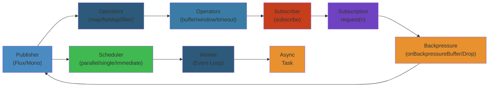

# ⚡ Java Reactive Programming — Complete Deep Dive




## Table of Contents


- [Reactive Manifesto](#reactive-manifesto)
- [Reactive Streams Spec](#reactive-streams-spec)
- [Project Reactor: Core Types](#project-reactor-core-types)
- [Reactor Operators by Category](#reactor-operators-by-category)
- [Reactor Context](#reactor-context)
- [Reactor Backpressure](#reactor-backpressure)
- [Schedulers](#schedulers)
- [Reactor Testing](#reactor-testing)
- [Reactor Debugging](#reactor-debugging)
- [RxJava3 vs Reactor](#rxjava3-vs-reactor)
- [Reactor Ecosystem](#reactor-ecosystem)
- [WebFlux](#webflux)

---

## Reactive Manifesto


```text
┌─────────────────────────────────────────────────────┐
│              Reactive Manifesto                       │
│                                                       │
│  ┌──────────┐    ┌──────────┐    ┌──────────┐       │
│  │Responsive│◄──►│ Resilient│    │          │       │
│  │(fast resp│    │(self-heal)─┐──►│ Message  │       │
│  └────┬─────┘    └──────────┘ │  │ Driven   │       │
│       │                       │  │(async    │       │
│  ┌────▼─────┐    ┌──────────┐ │  │ comm)    │       │
│  │  Elastic │◄──►│Scalable  │◄┘  └──────────┘       │
│  │(adapt    │    │(up/down) │                        │
│  └──────────┘    └──────────┘                        │
└─────────────────────────────────────────────────────┘
```

Message-driven → loose coupling + isolation → resilience + elasticity → responsiveness.

## Reactive Streams Spec


```text
┌─────────────────────────────────────────────────────┐
│  Reactive Streams Contract                           │
│                                                       │
│  Publisher          ──subscribe──→   Subscriber      │
│  ┌────────┐                        ┌────────────┐   │
│  │        │  onSubscribe(Subscription)│           │   │
│  │        │◄─────────────────────────│           │   │
│  │        │      request(n)          │           │   │
│  │        │◄─────────────────────────│           │   │
│  │        │  onNext(T) (×n)          │           │   │
│  │        │ ────────────────────────→│           │   │
│  │        │  onError(Throwable) /    │           │   │
│  │        │  onComplete()            │           │   │
│  │        │ ────────────────────────→│           │   │
│  └────────┘                        └────────────┘   │
└─────────────────────────────────────────────────────┘
```

```java
// Reactive Streams interfaces
public interface Publisher<T> {
    void subscribe(Subscriber<? super T> subscriber);
}

public interface Subscriber<T> {
    void onSubscribe(Subscription subscription);
    void onNext(T item);
    void onError(Throwable throwable);
    void onComplete();
}

public interface Subscription {
    void request(long n);       // backpressure: ask for n items
    void cancel();              // stop receiving
}

public interface Processor<T, R> extends Publisher<R>, Subscriber<T> {}
```

## Project Reactor: Core Types


```text
┌─────────────────────────────────────────────────────┐
│  Reactor Types                                       │
│                                                       │
│  ┌──────────────────────────┐                        │
│  │  Mono<T>                  │  0 or 1 item         │
│  │  async, lazy, cold       │                        │
│  └──────────────────────────┘                        │
│                                                       │
│  ┌──────────────────────────┐                        │
│  │  Flux<T>                  │  0..N items           │
│  │  async, lazy, cold/hot   │                        │
│  └──────────────────────────┘                        │
└─────────────────────────────────────────────────────┘
```

```java
// Creating sequences
Mono<String> mono = Mono.just("hello");
Mono<String> empty = Mono.empty();
Mono<String> error = Mono.error(new RuntimeException("fail"));
Mono<String> deferred = Mono.defer(() -> Mono.just(expensiveBuild()));

Flux<Integer> range = Flux.range(1, 10);
Flux<Long> interval = Flux.interval(Duration.ofSeconds(1));
Flux<String> fromArray = Flux.just("a", "b", "c");

// Subscribe
flux.subscribe(
    value -> System.out.println("Next: " + value),
    error -> System.err.println("Error: " + error),
    () -> System.out.println("Complete"),
    subscription -> subscription.request(5) // manual backpressure
);
```

## Reactor Operators by Category


```java
// === TRANSFORMATION ===
flux.map(String::toUpperCase);                          // 1:1 sync
flux.flatMap(v -> asyncService.call(v));                // 1:N async, interleaved
flux.concatMap(v -> asyncService.call(v));              // 1:N async, ordered
flux.switchMap(v -> timeoutBasedStream(v));             // cancel prev, use latest
flux.flatMapMany(mono -> mono.flatMapMany(v -> ...));   // Mono → Flux

// === FILTERING ===
flux.filter(v -> v > 10);
flux.take(5).takeLast(3).takeUntil(v -> v > 100);
flux.skip(3).skipLast(2).skipUntil(v -> v > 50);
flux.distinct().distinctUntilChanged();
flux.elementAt(5).single().singleOrEmpty();

// === COMBINING ===
Flux.zip(fluxA, fluxB, (a, b) -> a + b);           // combine pairwise
Flux.merge(fluxA, fluxB);                           // interleaved
Flux.mergeSequential(fluxA, fluxB);                 // all A then all B
Flux.concat(fluxA, fluxB);                          // subscribe sequentially
Flux.combineLatest(fluxA, fluxB, (a, b) -> a + b); // latest from each

// === ERROR HANDLING ===
flux.onErrorResume(ex -> Flux.just("fallback"));
flux.onErrorContinue((ex, val) -> log.warn("Skipping {}", val));
flux.onErrorReturn("default");
flux.retry(3);
flux.retryWhen(Retry.max(3).filter(IOException.class::isInstance));
flux.retryBackoff(3, Duration.ofSeconds(1));

// === SIDE EFFECTS ===
flux.doOnNext(v -> log.info("Processing: {}", v));
flux.doOnError(ex -> log.error("Error", ex));
flux.doOnSubscribe(s -> log.info("Subscribed"));
flux.doFinally(type -> log.info("Terminated: {}", type));
flux.doOnCancel(() -> log.info("Cancelled"));
```

## Reactor Context


```java
// Context: per-subscriber state (like ThreadLocal but reactive)
Flux<String> flux = Flux.deferContextual(ctx ->
    Mono.just("User: " + ctx.get("user"))
);

flux.contextWrite(ctx -> ctx.put("user", "alice"))
    .subscribe(System.out::println); // User: alice

// Context is immutable, propagated downstream→upstream
// Each transform creates a new Context
```

## Reactor Backpressure


```text
Backpressure Strategies:
┌─────────────────────────────────────────────────────┐
│  unbounded()   ─── incoming ──────→ ┌────────────┐ │
│  (no limit)              drops      │ queue       │ │
│                                       └────────────┘ │
│  onBackpressureBuffer(size=1000)                    │
│    ┌───────────────────────────────────────────────┐ │
│    │  Bounded queue; overflow → error              │ │
│    └───────────────────────────────────────────────┘ │
│  onBackpressureDrop(v -> logDropped(v))             │
│  onBackpressureLatest()                             │
│  onBackpressureError()                              │
└─────────────────────────────────────────────────────┘
```

```java
// Limit incoming request rate
flux.limitRate(10);         // request(10) then replenish
flux.limitRequest(100);     // never request more than 100 total

// Backpressure strategies
flux.onBackpressureBuffer(100);            // bounded buffer
flux.onBackpressureDrop(v -> log.info("dropped {}", v));
flux.onBackpressureLatest();               // keep latest, drop intermediate
flux.onBackpressureError();                // error if downstream can't keep up
```

## Schedulers


```text
subscribeOn vs publishOn:
┌─────────────────────────────────────────────────────┐
│  subscribeOn(Scheduler X)                            │
│    Affects the ENTIRE chain (where subscribe happens)│
│                                                       │
│  publishOn(Scheduler Y)                              │
│    Affects DOWNSTREAM operators (where they execute) │
│                                                       │
│  Example:                                             │
│  source ──subscribeOn(Sched.A)──→ map ──publishOn→ map ──→ sub│
│           (A thread)        (A thread)  (B thread)        │
└─────────────────────────────────────────────────────┘
```

```java
// Built-in schedulers
Scheduler parallel = Schedulers.parallel();         // for CPU-bound work
Scheduler elastic = Schedulers.boundedElastic();    // for I/O, default
Scheduler immediate = Schedulers.immediate();       // current thread
Scheduler single = Schedulers.single();             // single reusable thread

// Custom
Scheduler custom = Schedulers.fromExecutorService(Executors.newFixedThreadPool(4));

// Where work runs
flux.subscribeOn(Schedulers.boundedElastic())   // subscription on elastic
    .publishOn(Schedulers.parallel())            // downstream on parallel
    .subscribe();
```

## Reactor Testing


```java
// StepVerifier
StepVerifier.create(Flux.just("a", "b", "c"))
    .expectNext("a")
    .expectNextCount(2)
    .verifyComplete();

// Virtual time (for interval/delay)
StepVerifier.withVirtualTime(() -> Flux.interval(Duration.ofHours(1)).take(2))
    .expectSubscription()
    .thenAwait(Duration.ofHours(2))
    .expectNext(0L, 1L)
    .verifyComplete();

// TestPublisher: control emission
TestPublisher<String> publisher = TestPublisher.create();
StepVerifier.create(publisher.flux())
    .then(() -> publisher.emit("a", "b", "c"))
    .expectNext("a", "b", "c")
    .then(publisher::complete)
    .verifyComplete();
```

## Reactor Debugging


```java
// Enable global operator stack traces
Hooks.onOperatorDebug();  // costly, only for dev

// Checkpoint: lightweight debugging
flux.checkpoint("after map", true); // description + stack trace

// Tags for observability
flux.tag("http.method", "GET")
    .tag("endpoint", "/api/users");
```

## RxJava3 vs Reactor


| Concept | Reactor | RxJava3 |
|---------|---------|---------|
| 0..N stream | Flux | Flowable (w/ backpressure) / Observable (w/o) |
| 0..1 stream | Mono | Single / Maybe / Completable |
| Backpressure | Built-in (request) | Flowable only |
| Context | `Context` | Not built-in |
| Schedulers | `Schedulers.*` | `Schedulers.*` |
| Android | No | Yes (RxAndroid) |
| Kotlin | Reactor Kotlin Ext | RxKotlin |

```java
// RxJava3
Observable.fromIterable(list)
    .map(String::toUpperCase)
    .subscribe(System.out::println);

Flowable.just("a", "b")
    .subscribeOn(Schedulers.io())
    .observeOn(Schedulers.computation())
    .subscribe();
```

## Reactor Ecosystem


```java
// Reactor Kafka
ReceiverOptions<Integer, String> opts = ReceiverOptions.create(props);
KafkaReceiver.create(opts.onPartitionsAssigned(assigner))
    .receive()
    .doOnNext(record -> process(record.value()))
    .subscribe();

// Reactor Netty (TCP/UDP/HTTP client-server)
HttpClient.create()
    .get()
    .uri("http://example.com")
    .responseContent()
    .aggregate()
    .asString();

// RSocket: 4 interaction models
RSocketConnector.create()
    .connect(TcpClientTransport.create("localhost", 7000))
    .flatMap(rsocket ->
        rsocket.requestResponse(Mono.just(DefaultPayload.create("ping")))
    );
```

## WebFlux


```java
// Functional endpoints
RouterFunction<ServerResponse> routes = route()
    .GET("/users/{id}", request -> {
        String id = request.pathVariable("id");
        return ok().body(userService.findById(id), User.class);
    })
    .POST("/users", request ->
        request.bodyToMono(User.class)
            .flatMap(userService::save)
            .flatMap(u -> created(URI.create("/users/" + u.id())).build())
    )
    .build();

// WebClient (replacement for RestTemplate)
WebClient client = WebClient.create("http://api.example.com");

client.get()
    .uri("/users/{id}", 1)
    .retrieve()
    .bodyToMono(User.class);

client.post()
    .uri("/users")
    .body(Mono.just(new User("alice")), User.class)
    .retrieve()
    .bodyToMono(User.class);

// SSE (Server-Sent Events)
client.get()
    .uri("/events")
    .accept(MediaType.TEXT_EVENT_STREAM)
    .retrieve()
    .bodyToFlux(Event.class)
    .subscribe(event -> handleEvent(event));
```

## Simplest Mental Model


> **Reactive = async data pipelines with backpressure**
>
> - **Publisher → Operator → Subscriber**: data flows downstream, demand flows upstream
> - **Mono** (0-1), **Flux** (0-N): lazy sequence operators (map, flatMap, filter)
> - **Backpressure**: subscriber controls rate via `request(n)`
> - **Schedulers**: `subscribeOn` (where subscribe runs), `publishOn` (where downstream runs)
> - **Context**: scoped state (like ThreadLocal) that works across async boundaries
> - **WebFlux**: non-blocking HTTP on Netty, functional routing, WebClient for downstream calls


## Production Failure Modes


### Failure 1: Backpressure Mismanagement — Publisher Overwhelms Subscriber


| Aspect | Detail |
|--------|--------|
| **Symptoms** | Subscriber OOM. Request timeout. Downstream database connection pool exhausted. Publisher buffers grow unbounded |
| **Root Cause** | Subscriber requests `Long.MAX_VALUE` (effectively unbounded) demand. Publisher sends all data at once. No backpressure strategy: buffer overflow, memory exhaustion. Default request strategy in Project Reactor: `Flux.range(1, 1000000)` subscribed without `limitRate()` sends all 1M elements immediately |
| **Detection** | Memory heap dump shows large `FluxArray` or `UnicastProcessor` data buffers. Subscriber logs: `reactor.core.Exceptions$OverflowException`. Prometheus: `reactor_request_amount` shows unbounded demand |
| **Recovery** | Add `limitRate(N)` to slow down publisher to N elements per request. Use `onBackpressureBuffer(N)` with bounded buffer + drop policy. Immediate: restart subscriber with `limitRate(256)` |
| **Prevention** | Always use `limitRate()` or `prefetch` on hot publishers. Set `onBackpressureBuffer(maxSize, BufferOverflowStrategy.DROP_LATEST/DROP_OLDEST/ERROR)`. Test with backpressure test harness: `StepVerifier.create(flux).thenRequest(10).expectNextCount(10).thenCancel()` |

### Failure 2: Blocking Code in Reactive Pipeline — Thread Starvation


| Aspect | Detail |
|--------|--------|
| **Symptoms** | All reactor threads blocked. Application unresponsive. No requests processed. Other reactive endpoints time out |
| **Root Cause** | `block()`, `Thread.sleep()`, or synchronous JDBC call inside a reactive operator. Reactor uses a fixed thread pool (typically number-of-CPU-cores). One blocking call ties up that thread. With 4 CPU cores, 4 blocking calls stall all reactor threads. No threads available for other requests |
| **Detection** | Thread dump: all `reactor-http-nio-*` threads in `RUNNABLE` or `BLOCKED` state waiting on DB connection. `BlockHound` detects blocking calls at runtime. Prometheus: `reactor_scheduler_queue_size` grows indefinitely |
| **Recovery** | Move blocking call to dedicated `Schedulers.boundedElastic()` thread pool: `.subscribeOn(Schedulers.boundedElastic())`. Replace `block()` with reactive alternative: `Mono.fromCallable(() -> jdbcTemplate.query(...)).subscribeOn(Schedulers.boundedElastic())` |
| **Prevention** | Use `BlockHound.install()` in tests to detect blocking calls. Never use `block()` in reactive pipeline. Use reactive drivers (R2DBC, MongoDB Reactive Streams, Reactive Redis). Use `subscribeOn(Schedulers.boundedElastic())` for any unavoidable blocking operation. Configure `spring-boot-starter-webflux` instead of webmvc |

### Failure 3: Error Handling Gap — Exception in Stream Causes Silent Data Loss


| Aspect | Detail |
|--------|--------|
| **Symptoms** | Some events processed, some silently dropped. No error logs. Downstream data incomplete. Monitoring shows no errors |
| **Root Cause** | An exception in `map()` or `flatMap()` causes the stream to cancel. Reactive streams spec: `onError` signal terminates the stream. No error handler → subscriber sees `onError`, stops processing. Remaining items in the stream are lost |
| **Detection** | Logs have a single `onError` message but no details. Metrics show subscriber cancelled with no error count. Downstream expected 1000 records but received only 234 |
| **Recovery** | Add `.onErrorContinue()` to log failed elements and continue processing. Add `.onErrorResume()` for fallback values. Add `.doOnError()` for error logging |
| **Prevention** | Always add error handling per operator: `.onErrorContinue((throwable, element) -> log.error("Failed element: {}", element, throwable))` for batch processing. Use `.retryWhen(Retry.backoff(3, Duration.ofSeconds(1)))` for transient failures. Never let `onError` propagate without handling in production streams |

### Failure 4: Reactive Context Loss Across Thread Boundaries


| Aspect | Detail |
|--------|--------|
| **Symptoms** | MDC logging context missing correlation IDs. Security context lost. Tenant ID null in downstream processing |
| **Root Cause** | Reactive Context (`reactor.util.context.Context`) is scoped per subscriber, not per thread. When `publishOn()` or `subscribeOn()` switches threads, the original thread's context (ThreadLocal) is lost. Standard SLF4J MDC uses ThreadLocal, which doesn't work in reactive pipelines |
| **Detection** | Log entries show `trace_id=null` for reactive processing steps. Security checks fail with "unauthorized" mid-pipeline. Thread name changes but MDC context doesn't follow |
| **Recovery** | Use `Hooks.enableAutomaticContextPropagation()` (Reactor 3.5.3+) to copy Context to ThreadLocal MDC. Add `.tap(SignalListener)` to propagate context. Use `ContextSnapshotFactory` to capture and restore ThreadLocal values |
| **Prevention** | Use `Mono.deferContextual(ctx -> ...)` to access context reactively. For MDC: configure `spring-boot-starter-webflux` with `spring.webflux.mdc-propagation=ENABLED`. Use Kotlin Coroutines for simpler context propagation with `MDCContext` |

### Failure 5: WebClient Connection Pool Exhaustion


| Aspect | Detail |
|--------|--------|
| **Symptoms** | HTTP requests to downstream services timeout. `Connection pool exhausted` errors. All reactor threads waiting for connections |
| **Root Cause** | WebClient uses connection pool (default max 500 connections, 45s max idle time). If downstream is slow or has high latency, connections are held open. New requests wait for a connection. Under high concurrency, all connections in use, new requests queue |
| **Detection** | Metrics: `reactor_netty_http_client_connections_acquire_errors`. Logs: `reactor.netty.resources.ConnectionProvider — [id: 0x...] ChannelPoolMap [...]. Pool [#/500] exhausted` |
| **Recovery** | Increase `maxConnections`. Reduce `maxIdleTime`. Add `.responseTimeout(Duration.ofSeconds(30))`. Immediate: restart WebClient, downstream may recover |
| **Prevention** | Configure `ConnectionProvider.builder("my-pool").maxConnections(1000).maxIdleTime(Duration.ofSeconds(30)).pendingAcquireTimeout(Duration.ofSeconds(60)).build()`. Set `.responseTimeout()` and `.readTimeout()` on each request. Add circuit breaker (Resilience4j) around WebClient calls |

## Edge Cases


| Scenario | Challenge | Solution |
|----------|-----------|----------|
| **Hot vs Cold publisher** | Subscriber gets different data depending on when they subscribe | Cold: each subscriber gets all data (HTTP request). Hot: subscribers share data (WebSocket, Kafka). Use `.share()` or `.publish().autoConnect()` for hot |
| **Scheduler starvation with virtual threads** | Virtual threads don't yield to reactor scheduler | Use `Schedulers.boundedElastic()` for blocking operations. Virtual threads work best outside reactive pipelines |
| **Flux.interval() drift** | Timer drifts over time due to processing delays | Use `Flux.interval(duration, Schedulers.parallel())`. Adjust for drift with `.takeUntilOther()` or external clock |
| **ConcatMap vs FlatMap ordering** | flatMap doesn't preserve ordering | Use `concatMap()` for ordered processing. Use `flatMapSequential()` for ordered results with concurrent processing |
| **Reactive stream to JDBC bridge** | JDBC is blocking, can't be reactive | Use R2DBC. Or wrap JDBC in `Mono.fromCallable()` with `Schedulers.boundedElastic()`. Never use `block()` |

## Interview Questions


### Q1 (Beginner): What is reactive programming and when should you use it?


**Answer**: Reactive programming is a declarative programming paradigm where data flows through asynchronous pipelines. Key ideas: (1) Asynchronous — no blocking threads. (2) Event-driven — reacts to data/events as they arrive. (3) Backpressure — subscriber controls how much data it receives. (4) Composable — operators chain together (map, filter, flatMap). Use reactive programming for: I/O-bound workloads (HTTP calls, DB queries, file reads), high-concurrency services (10K+ concurrent requests), streaming data (WebSocket, Kafka, real-time events). Don't use for: CPU-bound computations (use virtual threads or parallel streams), simple CRUD APIs with low concurrency, applications where team doesn't know reactive (learning curve is steep).

### Q2 (Mid-Level): How does Project Reactor's backpressure work internally?


**Answer**: Reactive Streams spec defines backpressure via `Subscription.request(N)`. Subscriber calls `request(N)` to demand N elements. Publisher produces at most N elements. When subscriber is ready for more, it calls `request(N)` again. Publisher's internal buffer limits how many elements can be in-flight. Flux operators: `limitRate(N)` splits demand into smaller batches (request N, then request N/2 when 75% consumed). `onBackpressureBuffer(N)` buffers up to N elements. When buffer full: `DROP_LATEST` (drop newest), `DROP_OLDEST` (drop oldest), `ERROR` (throw OverflowException). The core idea: slow consumer never forces fast producer to buffer unbounded data — the producer must slow down or drop data.

### Q3 (Senior): Design a reactive API gateway that proxies to 10 downstream microservices with circuit breaking.


**Answer**: Architecture: Spring Cloud Gateway with WebClient for downstream calls. Each route: (1) Parse request → extract auth token, rate limit key. (2) Auth: reactive call to auth service (OIDC token validation). (3) Rate limit: Redis-based token bucket via reactive Redis (Lettuce). (4) Route: WebClient call to downstream service with timeout (5s) + retry (1 attempt) + circuit breaker. (5) Circuit breaker: Resilience4j reactive. States: CLOSED (pass through), OPEN (fail fast), HALF_OPEN (allow probe request). (6) Aggregate response: merge multiple downstream calls with `Mono.zip()` (parallel). Example: `/user-profile` calls `user-service`, `preferences-service`, `notification-service` in parallel. Error handling: on circuit breaker OPEN → return cached response (from Redis) or degraded response (partial data). Backpressure: limit incoming requests with `requestRate(1000 req/s)` and buffer overflow `DROP_OLDEST`. Threading: event loop handles all I/O, no blocking threads. Monitoring: metrics per route: latency, errors, circuit breaker state. Tracing: propagate trace ID via reactive context.

### Q4 (Staff): Compare Reactive Streams (Project Reactor), Kotlin Coroutines, and Java Virtual Threads for building high-throughput services.


**Answer**: Reactive Streams (Project Reactor): mature, battle-tested at Netflix/Pivotal. Full backpressure protocol. Rich operator library (flatMap, concatMap, window, buffer, groupBy). Downside: complex, hard to debug, thread-local context loss, steep learning curve. Kotlin Coroutines: structured concurrency, sequential-looking code. `suspend` functions are simpler than reactive operators. Channel provides backpressure. Flow is lazy, cold stream. Better error handling (try/catch works). Integration: Spring WebFlux supports Coroutines. Downside: Kotlin-only, smaller ecosystem, backpressure is manual (buffer, conflate, collect). Java Virtual Threads (Project Loom): simplest mental model — write blocking code, thousands of threads are cheap. Works with existing ThreadLocal, synchronized, and blocking APIs. Downside: no backpressure protocol (you just spin up another thread), pool exhaustion (thread-per-request doesn't limit concurrency), no streaming operators. Recommendation: use Virtual Threads for simple microservices with JDBC + HTTP (95% of services). Use Reactive Streams for streaming data pipelines, WebSocket services, and gateways with complex operator chains. Use Coroutines if already using Kotlin and want better readability than reactive.

### Q5 (Principal): Design a reactive system for a stock exchange order matching engine that must handle 1M orders/second with p99 < 100µs.


**Answer**: Requirements: 1M orders/sec, p99 < 100µs end-to-end (from order receipt to confirmation). No GC pauses > 1ms. Zero tolerance for data loss. Architecture: (1) Network: io_uring (Linux) or DPDK for kernel bypass. Netty transport with io_uring for event loop. (2) Disruptor (LMAX) pattern for inter-thread communication: ring buffer with sequence numbers, no locks, no contention. Reactive wrapping: Project Reactor's Scheduler backed by Disruptor. (3) Order validation: in-memory, no I/O. Reactive pipeline: validate → enrich → match → publish. (4) Matching engine: purely in-memory (price-time priority order book). Data structure: skip list for price levels, HashMap for order-by-ID. (5) Persistence: reactive Kafka producer (non-blocking) for transaction log. Orders written to Kafka with acks=1 (leader only, no fsync). (6) State: fully in-memory, no DB reads during matching. Snapshot to disk every 1M orders (async, non-blocking). (7) GC: use ZGC with < 1ms pause target. Pre-allocate objects. Use off-heap memory (Netty ByteBuf, memory-mapped files). No object allocation in hot path. (8) Backpressure: if Kafka can't keep up, stall order intake (apply backpressure to the network layer). (9) Circuit breaker: if matching engine latency > 200µs, reject new orders with 503. (10) Testing: JHWasm (Java Hardware Performance Counter) for nanosecond measurements. We must prove p99 < 100µs before production. This is extreme low-latency design where practical: only essential services (HFT exchanges, ad exchanges, game servers) need this.

## Cross-References


- [Java Testing Advanced](../18-testing-advanced.md) — Reactive streams testing with StepVerifier, TestPublisher
- [Kafka Streams](../../10-messaging/kafka/02-kafka-patterns.md) — Reactive Kafka, backpressure between Kafka partitions
- [Distributed Transactions](../../09-distributed-systems/02-distributed-transactions.md) — Reactive Sagas, WebClient for compensation
- [Kubernetes Observability](../../07-kubernetes/06-kubernetes-observability.md) — Reactive metrics with Micrometer, tracing with Brave
- [Microservices Security](../../16-microservices/08-security-identity.md) — Reactive security context propagation, JWT validation in reactive pipeline

## Related

- [Jvm Performance](18-performance-engineering/jvm-tuning/01-jvm-performance.md)
- [Cap Consistency](09-distributed-systems/01-cap-consistency.md)
- [Consensus Replication](09-distributed-systems/01-consensus-replication.md)
- [Consensus Raft](09-distributed-systems/02-consensus-raft.md)
- [Distributed Transactions](09-distributed-systems/02-distributed-transactions.md)
- [Distributed Caching](09-distributed-systems/03-distributed-caching.md)
