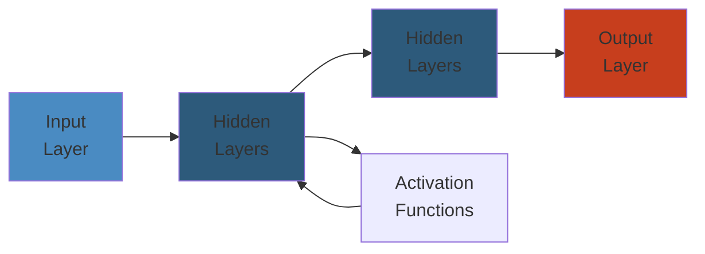

# 🌱 Spring Boot Advanced — Complete Deep Dive




## Table of Contents
- [Auto-Configuration](#auto-configuration)
- [Actuator](#actuator)
- [Testing](#testing)
- [Externalized Configuration](#externalized-configuration)
- [Spring Data](#spring-data)
- [Security](#security)
- [Resilience](#resilience)
- [Cloud](#cloud)

---

## Auto-Configuration

```text
Spring Boot Auto-Configuration Loading:
┌─────────────────────────────────────────────────────┐
│  META-INF/spring/org.springframework.boot           │
│  .autoconfigure.AutoConfiguration.imports           │
│  ───────────────────────────────────────────        │
│  org.springframework.boot.autoconfigure.web.       │
│    servlet.WebMvcAutoConfiguration                  │
│  org.springframework.boot.autoconfigure.jdbc.      │
│    DataSourceAutoConfiguration                      │
│  ...                                                │
├─────────────────────────────────────────────────────┤
│  Loading Phase:                                     │
│  1. Scan imports file → candidate classes          │
│  2. Evaluate @Conditional* annotations              │
│  3. Apply ordering (@AutoConfigureOrder,            │
│     @AutoConfigureBefore, @AutoConfigureAfter)       │
│  4. Register matching beans                         │
└─────────────────────────────────────────────────────┘
```

```java
// @Conditional annotations
@ConditionalOnClass(name = "com.zaxxer.hikari.HikariDataSource")
@ConditionalOnMissingBean(DataSource.class)
@ConditionalOnProperty(name = "app.feature.enabled", havingValue = "true", matchIfMissing = false)
@ConditionalOnResource(resources = "classpath:config.properties")
@ConditionalOnWebApplication(type = ConditionalOnWebApplication.Type.SERVLET)
@ConditionalOnExpression("${app.advanced:false} and ${app.feature.enabled:true}")

// Custom auto-configuration
@AutoConfiguration
@EnableConfigurationProperties(MyProperties.class)
public class MyAutoConfiguration {

    @Bean
    @ConditionalOnMissingBean
    public MyService myService(MyProperties props) {
        return new MyService(props.getUrl());
    }
}
```

## Actuator

```text
Actuator Endpoints:
┌─────────────────────────────────────────────────────┐
│  Endpoint          Path             Sensitive        │
│  ────────────────────────────────────────────────   │
│  health            /actuator/health  false          │
│  info              /actuator/info    false          │
│  metrics           /actuator/metrics  true          │
│  env               /actuator/env      true          │
│  configprops       /actuator/configprops true       │
│  loggers           /actuator/loggers  true          │
│  heapdump          /actuator/heapdump true          │
│  threaddump        /actuator/threaddump true        │
│  mappings          /actuator/mappings true          │
│  scheduledtasks    /actuator/scheduledtasks true    │
│  shutdown          /actuator/shutdown  POST-only    │
└─────────────────────────────────────────────────────┘
```

```java
// Custom health indicator
@Component
public class DatabaseHealthIndicator implements HealthIndicator {
    @Override
    public Health health() {
        try {
            jdbcTemplate.queryForObject("SELECT 1", Integer.class);
            return Health.up()
                .withDetail("database", "PostgreSQL")
                .withDetail("pool", "active: " + activeConnections())
                .build();
        } catch (Exception e) {
            return Health.down(e).build();
        }
    }
}

// Custom endpoint
@Endpoint(id = "cache")
public class CacheEndpoint {
    @ReadOperation
    public Map<String, Object> cacheStats() {
        return Map.of("hits", hitCount, "misses", missCount);
    }

    @WriteOperation
    public void clearCache() { cacheManager.getCache("default").clear(); }
}
```

## Testing

```java
// @SpringBootTest: full context
@SpringBootTest(webEnvironment = WebEnvironment.RANDOM_PORT)
class ApplicationIntegrationTest {
    @Autowired
    private TestRestTemplate restTemplate;

    @Test
    void fullIntegration() {
        ResponseEntity<String> resp = restTemplate.getForEntity("/api/users", String.class);
        assertThat(resp.getStatusCode()).is2xxSuccessful();
    }
}

// @WebMvcTest: only web layer
@WebMvcTest(UserController.class)
class UserControllerTest {
    @Autowired
    private MockMvc mockMvc;

    @MockBean
    private UserService userService;

    @Test
    void testGetUser() throws Exception {
        given(userService.findById(1L)).willReturn(new User("alice"));
        mockMvc.perform(get("/users/1"))
            .andExpect(status().isOk())
            .andExpect(jsonPath("$.name").value("alice"));
    }
}

// @DataJpaTest: only JPA layer
@DataJpaTest
@AutoConfigureTestDatabase(replace = AutoConfigureTestDatabase.Replace.NONE)
class UserRepositoryTest {
    @Autowired
    private UserRepository userRepository;

    @Test
    void testSaveAndFind() {
        userRepository.save(new User("bob"));
        assertThat(userRepository.findByName("bob")).isPresent();
    }
}

// Testcontainers
@SpringBootTest
@Testcontainers
class DatabaseTest {
    @Container
    static PostgreSQLContainer<?> postgres = new PostgreSQLContainer<>("postgres:15");

    @DynamicPropertySource
    static void properties(DynamicPropertyRegistry registry) {
        registry.add("spring.datasource.url", postgres::getJdbcUrl);
        registry.add("spring.datasource.username", postgres::getUsername);
        registry.add("spring.datasource.password", postgres::getPassword);
    }
}
```

## Externalized Configuration

```text
Property Source Ordering (highest priority first):
┌─────────────────────────────────────────────────────┐
│  1. Devtools global settings                         │
│  2. @TestPropertySource on tests                     │
│  3. @SpringBootTest properties                       │
│  4. Command line arguments (--server.port=9090)     │
│  5. SPRING_APPLICATION_JSON                          │
│  6. ServletConfig init parameters                    │
│  7. JNDI attributes                                  │
│  8. System properties (-Dkey=value)                  │
│  9. OS environment variables                         │
│  10. application-{profile}.properties                │
│  11. application.properties                          │
│  12. @PropertySource on config classes               │
│  13. Default properties (SpringApplication.setDef)   │
└─────────────────────────────────────────────────────┘
```

```java
// @ConfigurationProperties
@ConfigurationProperties(prefix = "app.datasource")
@Validated
public class DataSourceProperties {
    @NotEmpty
    private String url;
    private String username;
    @Min(1) @Max(100)
    private int maxPoolSize = 10;

    // getters & setters
}

// Custom converter for property binding
@ConfigurationPropertiesBinding
@Component
public class DurationConverter implements Converter<String, Duration> {
    @Override
    public Duration convert(String source) {
        return Duration.parse("PT" + source);
    }
}

// profile-conditional
// application-dev.yaml:
// app:
//   feature:
//     enabled: true
```

## Spring Data

```java
// Spring Data JPA Repository with advanced features
public interface UserRepository extends JpaRepository<User, Long>,
    JpaSpecificationExecutor<User>, QuerydslPredicateExecutor<User> {

    // derived query
    @Query("SELECT u FROM User u JOIN FETCH u.orders WHERE u.email = :email")
    Optional<User> findByEmail(@Param("email") String email);

    // Specifications: dynamic queries
    static Specification<User> hasName(String name) {
        return (root, query, cb) ->
            name == null ? null : cb.equal(root.get("name"), name);
    }

    static Specification<User> olderThan(int age) {
        return (root, query, cb) ->
            cb.greaterThan(root.get("age"), age);
    }
}

// Auditing
@EntityListeners(AuditingEntityListener.class)
public class BaseEntity {
    @CreatedDate
    private LocalDateTime createdAt;
    @LastModifiedDate
    private LocalDateTime updatedAt;
    @CreatedBy
    private String createdBy;
}

// Multi-tenancy
@Component
public class TenantInterceptor implements HandlerInterceptor {
    @Override
    public boolean preHandle(HttpServletRequest req, HttpServletResponse resp, Object h) {
        String tenantId = req.getHeader("X-Tenant-Id");
        TenantContext.setCurrentTenant(tenantId);
        return true;
    }
}
```

## Security

```java
@Configuration
@EnableWebSecurity
@EnableMethodSecurity  // enables @PreAuthorize etc.
public class SecurityConfig {

    @Bean
    SecurityFilterChain filterChain(HttpSecurity http) throws Exception {
        return http
            .authorizeHttpRequests(auth -> auth
                .requestMatchers("/api/public/**").permitAll()
                .requestMatchers("/api/admin/**").hasRole("ADMIN")
                .anyRequest().authenticated()
            )
            .oauth2ResourceServer(OAuth2ResourceServerConfigurer::jwt)
            .csrf(csrf -> csrf.disable()) // for REST API
            .sessionManagement(sm -> sm.sessionCreationPolicy(STATELESS))
            .build();
    }

    @Bean
    JwtDecoder jwtDecoder() {
        return NimbusJwtDecoder.withJwkSetUri("https://auth.example.com/.well-known/jwks.json")
            .build();
    }
}

// Method-level security
@RestController
public class AdminController {
    @GetMapping("/admin/users")
    @PreAuthorize("hasRole('ADMIN')")
    public List<User> listUsers(@AuthenticationPrincipal Jwt jwt) {
        return userService.findAll();
    }

    @PostMapping("/api/orders")
    @PreAuthorize("@orderSecurity.canCreate(#request.userId)")
    public Order create(@RequestBody OrderRequest request) {
        return orderService.create(request);
    }
}
```

## Resilience

```java
@Configuration
public class ResilienceConfig {

    @Bean
    public CircuitBreaker circuitBreaker() {
        return CircuitBreaker.ofDefaults("orderService");
    }

    @Bean
    public Customizer<Resilience4JCircuitBreakerFactory> factoryCustomizer() {
        return factory -> factory.configure(
            builder -> builder
                .slidingWindowSize(100)
                .minimumNumberOfCalls(10)
                .failureRateThreshold(50)
                .waitDurationInOpenState(Duration.ofSeconds(10))
                .permittedNumberOfCallsInHalfOpenState(5),
            "orderService"
        );
    }
}

// @CircuitBreaker annotation
@Service
public class OrderService {
    @CircuitBreaker(name = "orderService", fallbackMethod = "fallbackOrder")
    public Order getOrder(Long id) {
        return orderClient.fetchOrder(id);
    }

    private Order fallbackOrder(Long id, Throwable t) {
        log.warn("Circuit open for order {}, returning cached", id);
        return cache.get(id);
    }

    @Retry(name = "paymentService", maxAttempts = 3, backoff = @Backoff(delay = 500))
    public Payment processPayment(PaymentRequest req) {
        return paymentClient.charge(req);
    }

    @RateLimiter(name = "apiLimiter", fallbackMethod = "rateLimited")
    public ApiResponse callExternalApi(Request req) {
        return externalClient.call(req);
    }
}
```

## Cloud

```java
// Service Discovery (Consul/Eureka)
@LoadBalanced
@Bean
public WebClient.Builder loadBalancedWebClient() {
    return WebClient.builder();
}

// API Gateway with Spring Cloud Gateway
@Bean
public RouteLocator customRoutes(RouteLocatorBuilder builder) {
    return builder.routes()
        .route("user-service", r -> r
            .path("/api/users/**")
            .filters(f -> f
                .circuitBreaker(c -> c
                    .setName("userServiceCB")
                    .setFallbackUri("forward:/fallback/users"))
                .retry(3)
                .prefixPath("/internal"))
            .uri("lb://user-service"))
        .route("order-service", r -> r
            .path("/api/orders/**")
            .filters(f -> f
                .addRequestHeader("X-Gateway", "true"))
            .uri("lb://order-service"))
        .build();
}

// Distributed tracing (Spring Cloud Sleuth / Micrometer Tracing)
// Just add dependency; Sleuth adds traceId/spanId to MDC
// Zipkin: send spans via HTTP or Kafka
//
// application.properties:
// management.zipkin.tracing.endpoint=http://zipkin:9411/api/v2/spans
// management.tracing.sampling.probability=1.0

// Spring Cloud Function / Stream
@Bean
public Function<String, String> uppercase() {
    return value -> value.toUpperCase();
}

// Cloud Bus (propagate config changes)
// POST /actuator/busrefresh
```

## Simplest Mental Model

> **Spring Boot = auto-configuration + starters + externalized config + actuator**
>
> - **Auto-configuration**: conditionally register beans based on classpath, properties, missing beans
> - **Actuator**: production-ready endpoints (health, metrics, env, loggers)
> - **Testing**: slice tests (`@WebMvcTest`, `@DataJpaTest`) + full `@SpringBootTest` + Testcontainers
> - **Config**: property source ordering, `@ConfigurationProperties` with validation, relaxed binding
> - **Security**: OAuth2 resource server + JWT decoder + method security with SpEL
> - **Resilience**: CircuitBreaker + Retry + RateLimiter with fallbacks
> - **Cloud**: service discovery + load-balanced WebClient + API gateway + distributed tracing


## Comparison Table

| Aspect | Option A | Option B | Trade-off |
| ---- | ---- | ---- | ---- |
| Performance | High | Medium | Speed vs Simplicity |
| Complexity | High | Low | Features vs Ease of Use |
| Scalability | Excellent | Good | Horizontal vs Vertical |
| Cost | High | Low | Features vs Budget |