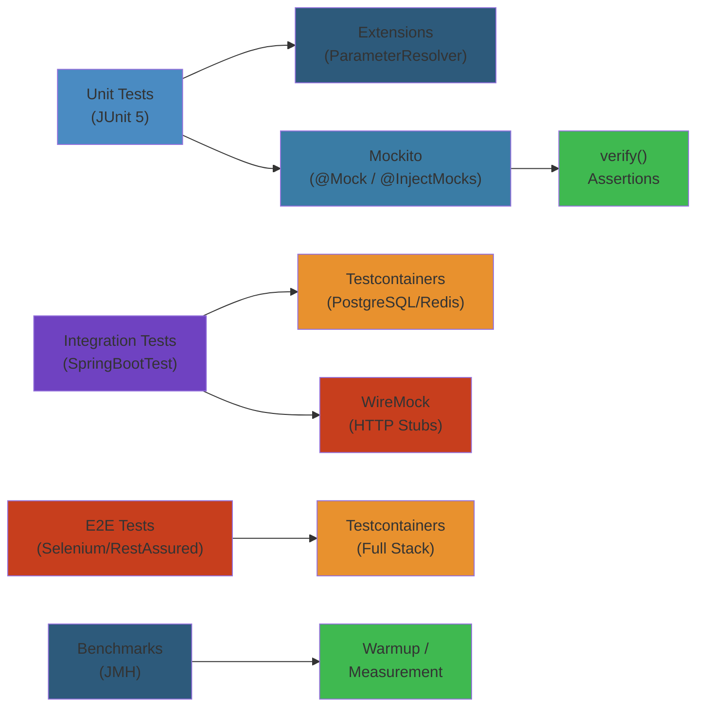

# 🧪 Java Testing Advanced — Complete Deep Dive




## Table of Contents


- [1. JUnit 5 Platform](#1-junit-5-platform)
- [2. Extensions](#2-extensions)
- [3. Parameterized Tests](#3-parameterized-tests)
- [4. Dynamic Tests](#4-dynamic-tests)
- [5. Mockito](#5-mockito)
- [6. AssertJ](#6-assertj)
- [7. Testcontainers](#7-testcontainers)
- [8. WireMock](#8-wiremock)
- [9. JMH Benchmarks](#9-jmh-benchmarks)
- [10. Pitest](#10-pitest)
- [11. Contract Testing](#11-contract-testing)
- [12. BDD](#12-bdd)
- [Simplest Mental Model](#simplest-mental-model)

---

## 1. JUnit 5 Platform


```text
┌──────────────────────────────────────────┐
│          JUnit 5 Platform                │
│  (Launcher, TestEngine Discovery)       │
├────────────────┬────────────────────────┤
│ Jupiter Engine │ Vintage Engine         │
│ (JUnit 5)      │ (JUnit 3/4 backward)  │
├────────────────┴────────────────────────┤
│       IDE / Build Tool Integration       │
└──────────────────────────────────────────┘
```

- **Platform**: foundation for `TestEngine` API
- **Jupiter**: modern annotations + extensions
- **Vintage**: legacy JUnit 3/4 on JUnit 5 platform

## 2. Extensions


Extensions hook into lifecycle: `BeforeAllCallback`, `ParameterResolver`, `TestWatcher`, `InvocationInterceptor`.

```java
public class DatabaseExtension implements BeforeAllCallback, AfterAllCallback {
  private EmbeddedDatabase db;
  @Override public void beforeAll(ExtensionContext ctx) {
    db = new EmbeddedDatabaseBuilder().setType(EmbeddedDatabaseType.H2).build();
  }
  @Override public void afterAll(ExtensionContext ctx) { if (db != null) db.shutdown(); }
}

public class RandomResolver implements ParameterResolver {
  @Override public boolean supportsParameter(ParameterContext pc, ExtensionContext ec) {
    return pc.getParameter().getType() == Random.class;
  }
  @Override public Object resolveParameter(ParameterContext pc, ExtensionContext ec) {
    return new SecureRandom();
  }
}

public class LoggingWatcher implements TestWatcher {
  @Override public void testSuccessful(ExtensionContext ctx) { /* log pass */ }
  @Override public void testFailed(ExtensionContext ctx, Throwable c) { /* log fail */ }
}

@ExtendWith({MockitoExtension.class, DatabaseExtension.class})
class MyTest { }
```

## 3. Parameterized Tests


```java
@ParameterizedTest
@ValueSource(strings = {"racecar", "radar"})
void palindromes(String s) { assertTrue(isPalindrome(s)); }

@ParameterizedTest
@CsvSource({"apple, 1.99, true", "banana, 0.59, false"})
void csv(String name, double p, boolean t) { assertEquals(t, new Product(name, p).isTaxable()); }

@ParameterizedTest
@MethodSource("fruitProvider")
void methodSource(String f) { assertNotNull(f); }
static Stream<String> fruitProvider() { return Stream.of("apple", "banana"); }

@ParameterizedTest
@EnumSource(Month.class)
void enumTest(Month m) { assertTrue(m.getValue() >= 1); }
```

## 4. Dynamic Tests


```java
@TestFactory
Stream<DynamicNode> dynamicTests() {
  return Stream.of("apple", "banana")
    .map(f -> DynamicTest.dynamicTest("Test " + f,
      () -> assertTrue(f.length() > 2)));
}
```

## 5. Mockito


```text
Mock Creation:    mock(), @Mock, spy(), @Spy, @InjectMocks, @Captor
Stubbing:         when().thenReturn(), doThrow().when(), doAnswer(), given() (BDD)
Verification:     verify(), times(), never(), InOrder, verifyNoInteractions
```

```java
@ExtendWith(MockitoExtension.class)
class UserServiceTest {
  @Mock UserRepository userRepo;
  @Mock EmailService emailService;
  @InjectMocks UserService userService;

  @Test void testFind() {
    when(userRepo.findById(42L)).thenReturn(Optional.of(user));
    assertThat(userService.findById(42L)).isPresent();
    verify(userRepo).findById(42L);
  }

  @Test void bddStyle() {
    given(userRepo.findById(42L)).willReturn(Optional.of(user));
    assertThat(userService.findById(42L)).isPresent();
  }

  @Captor ArgumentCaptor<Email> captor;
  @Test void testEmail() {
    userService.registerUser("alice@test.com");
    verify(emailService).send(captor.capture());
    assertEquals("Welcome!", captor.getValue().getSubject());
  }
}
```

## 6. AssertJ


```java
assertThat("Hello").startsWith("H").hasSize(5).contains("ell");
assertThat(42).isGreaterThan(10).isBetween(0, 100).isEven();
assertThat(List.of("a", "b", "c")).hasSize(3).containsExactly("a", "b", "c");
assertThat(Map.of("k1", "v1")).containsKey("k1").containsEntry("k1", "v1");
assertThat(Optional.of("hi")).isPresent().contains("hi");

assertThat(actual).usingRecursiveComparison()
  .ignoringFields("id", "createdAt").isEqualTo(expected);

assertSoftly(softly -> {
  softly.assertThat(name).isEqualTo("Alice");
  softly.assertThat(age).isEqualTo(30);
});

assertThatThrownBy(() -> parse("bad"))
  .isInstanceOf(ParseException.class).hasMessageContaining("invalid");
```

## 7. Testcontainers


```text
@Container + @Testcontainers
GenericContainer | PostgresContainer | KafkaContainer | MongoDBContainer
Wait strategies: Wait.forHttp / forLogMessage
Reusable: withReuse(true)
```

```java
@Testcontainers
class IntegrationTest {
  @Container static PostgreSQLContainer<?> pg = new PostgreSQLContainer<>("postgres:15")
    .withDatabaseName("testdb").withUsername("test").withPassword("test");

  @Container static KafkaContainer kafka = new KafkaContainer(
    DockerImageName.parse("confluentinc/cp-kafka:7.5.0"));

  @DynamicPropertySource
  static void props(DynamicPropertyRegistry r) {
    r.add("spring.datasource.url", pg::getJdbcUrl);
    r.add("spring.kafka.bootstrap-servers", kafka::getBootstrapServers);
  }

  @Container static GenericContainer<?> redis = new GenericContainer<>("redis:7-alpine")
    .withExposedPorts(6379)
    .waitingFor(Wait.forLogMessage(".*Ready.*\n", 1));
}
```

## 8. WireMock


```java
@WireMockTest(httpPort = 8089)
class PaymentTest {
  @Test void testSuccess() {
    stubFor(post(urlPathEqualTo("/api/payments"))
      .withRequestBody(matchingJsonPath("$.amount"))
      .willReturn(aResponse().withStatus(200)
        .withBody("""
          { "status": "success", "transactionId": "txn_123" }
        """)));

    assertThat(client.processPayment(new Payment(5000)).status()).isEqualTo("success");
    verify(postRequestedFor(urlPathEqualTo("/api/payments")));
  }

  @Test void testTimeout() {
    stubFor(get("/api/slow").willReturn(aResponse().withFixedDelay(10000)));
    assertThatThrownBy(() -> client.callSlow()).isInstanceOf(TimeoutException.class);
  }
}
```

## 9. JMH Benchmarks


```text
@BenchmarkMode(Mode.AverageTime)     // time/operation
@Warmup(iterations=5)                // JVM warmup
@Measurement(iterations=10)          // real measurement
@Fork(3)                             // fork JVM for isolation
@Param({"10","100"})                 // parameterized input
@State(Scope.Thread)                 // shared state
Blackhole → consume results (prevent dead-code elimination)
```

```java
@BenchmarkMode(Mode.AverageTime) @OutputTimeUnit(TimeUnit.NANOSECONDS)
@Warmup(iterations=5) @Measurement(iterations=10) @Fork(3) @State(Scope.Thread)
public class StrBenchmark {
  @Param({"10", "100"}) private int len;
  private String data;
  @Setup public void setup() { data = "a".repeat(len); }
  @Benchmark public String concat() { return data + data; }
  @Benchmark public String builder() { return new StringBuilder(data).append(data).toString(); }
}
// Profilers: -prof gc, -prof stack, -prof async
```

## 10. Pitest


```text
Original code → Mutant (modified bytecode) → Run tests
  Tests FAIL → Mutant KILLED ✓
  Tests PASS → Mutant SURVIVED ✗ (test gap)
```

```xml
<plugin>
  <groupId>org.pitest</groupId><artifactId>pitest-maven</artifactId>
  <configuration>
    <targetClasses><param>com.example.service.*</param></targetClasses>
    <mutationThreshold>85</mutationThreshold>
    <incrementalAnalysis>true</incrementalAnalysis>
  </configuration>
</plugin>
```

Surviving mutation example: `age >= 18` mutated to `age > 18` — kill with boundary test `age == 18`.

## 11. Contract Testing


```text
Consumer                              Provider
 ┌──────────┐    ┌────────────┐    ┌──────────┐
 │ Defines  │───▶│ Verifier   │───▶│ Must     │
 │ contract │    │ generates  │    │ pass     │
 │          │    │ tests      │    │          │
 └──────────┘    └────────────┘    └──────────┘
```

```groovy
// Spring Cloud Contract
Contract.make {
  request { method GET(); url "/api/users/42" }
  response { status OK(); body([id: 42, name: "Alice", email: "alice@ex.com"]) }
}
```

```java
// Pact
@Pact(consumer="OrderService", provider="PaymentService")
public V4Pact createPact(PactDslWithProvider builder) {
  return builder.given("payment 5000 EUR").uponReceiving("payment request")
    .path("/api/payments").method("POST")
    .willRespondWith().status(200)
    .body(new PactDslJsonBody().stringType("status", "success"))
    .toPact(V4Pact.class);
}
```

## 12. BDD


```gherkin
Feature: Registration
  Scenario: Success
    Given a user with email "alice@test.com"
    When the user registers
    Then a welcome email is sent
```

```java
@SpringBootTest @AutoConfigureMockMvc @CucumberContextConfiguration
public class CucumberConfig { }

public class Steps {
  @When("the user registers") public void register() { }
  @Then("a welcome email is sent") public void emailSent() { verify(emailService).send(any()); }
}
```

---

## Simplest Mental Model


**Testing is insurance — policies that pay out when something breaks.**

- **JUnit 5**: Courtroom where trials happen. Extensions are bailiffs setting up.
- **Parameterized Tests**: Same script, different evidence (data).
- **Mockito**: Stunt doubles for real actors when you can't use the real database.
- **AssertJ**: The judge's gavel — clear, readable verdicts.
- **Testcontainers**: Full crime scene replica (real Redis/Postgres) in disposable boxes.
- **WireMock**: A witness who always says what you script.
- **JMH**: Nanosecond stopwatch with scientific rigor.
- **Pitest**: Evil twin that breaks code to see if tests catch it.
- **Contract**: Signed API agreement between consumer and provider.
- **Cucumber**: Plain English scenarios everyone can read.


## Production Failure Modes


### Failure 1: Flaky Integration Tests — 5% of Testcontainers Tests Fail Randomly


| Aspect | Detail |
|--------|--------|
| **Symptoms** | CI pipeline fails intermittently. Tests pass locally but fail on CI. `testOrderProcessing` fails with connection refused to PostgreSQL |
| **Root Cause** | Testcontainers container not fully ready before test starts. Default wait strategy (port check) doesn't guarantee DB is accepting connections. Resource contention on CI (multiple containers compete for memory/CPU, causing slow startup) |
| **Detection** | `container.getLogs()` shows "ready for connections" after the test already failed. `container.wait()` timeout logs. CPU/memory metrics on CI runner show 90%+ utilization when tests fail |
| **Recovery** | Add explicit `waitingFor(Wait.forLogMessage(".*database system is ready.*\n", 2))` for PostgreSQL. Increase `startupTimeout` to 120 seconds. Use `withReuse(true)` for local development |
| **Prevention** | Pin container image digests (not tags like `postgres:15`). Set Docker memory limits on CI. Use `@Testcontainers(parallel = false)` for flaky tests. Run flaky tests 3x in CI with `@RetryingTest` |

### Failure 2: Mockito Verification Oversight — Mock Returns Null in Production


| Aspect | Detail |
|--------|--------|
| **Symptoms** | All unit tests pass. In production, `NullPointerException` surfaces after deployment. Feature works in staging but fails in prod |
| **Root Cause** | Mockito returns default values for unstubbed methods (null for objects, 0 for ints). Test passes because it doesn't verify the real interaction pattern. The real implementation of `UserService.find()` calls `userRepo.findById()` but the test stubs `userRepo.findByName()` instead |
| **Detection** | `verify(userRepo, times(0)).findById(any())` — the method was never called. Test coverage shows green but assertion fails in production |
| **Recovery** | Add `verifyNoMoreInteractions()` after each test. Use `Mockito.validateMockitoUsage()` in `@AfterEach`. Add `@CheckReturnValue` annotation. Run mutation testing (Pitest) to catch missed interactions |
| **Prevention** | Always use `verify()` for every stubbed method. Use `lenient()` annotation only when explicitly needed. Enable `@ExtendWith(MockitoExtension.class)` which validates strict stubbing. Run Pitest with `mutationThreshold=85` |

### Failure 3: JMH Benchmark Misleads — Microbenchmark Does Not Predict Production Performance


| Aspect | Detail |
|--------|--------|
| **Symptoms** | Benchmarks show 50% improvement, but production latency increases. Code change merged based on benchmark data causes regression |
| **Root Cause** | JMH ran in isolation with warmup but production has: cache contention, thread scheduling, GC pauses, CPU frequency scaling, JIT compilation state differences. Benchmark measured throughput of a single object, real workload has millions |
| **Detection** | Compare benchmark conditions vs production: `-Djmh.executor=CUSTOM` thread configuration may differ. Production `-XX:+UseG1GC` vs benchmark default. Benchmark data size ('@Param({"10"})') is 1000x smaller than real |
| **Recovery** | Add production profiler data (async-profiler, JFR) to validate benchmark findings. Use `-prof gc`, `-prof perfnorm`, `-prof stack` profilers. Create realistic datasets matching production distribution |
| **Prevention** | Match benchmark setup to production: same GC, same heap (-Xms/-Xmx), same thread pool size, same data distribution. Use `@State(Scope.Thread)` for per-thread state. Never extrapolate single-thread microbenchmarks to multi-threaded production |

### Failure 4: Contract Test Stale — Consumer Tests Pass but Provider Changed API


| Aspect | Detail |
|--------|--------|
| **Symptoms** | Consumer expects response field `email`, provider renamed to `emailAddress`. Consumer tests pass because contract test wasn't regenerated. Production integration fails |
| **Root Cause** | Contract tests are generated at test time and cached. When provider changes API, CI pipeline doesn't fail because the contract was verified in the provider's pipeline but the consumer still uses the old contract. Stale contracts mask breaking changes |
| **Detection** | Pact `canDeploy()` checks consumer before production. `pact-broker can-i-deploy` returns success for old version. Provider logs show contract not re-verified during deploy |
| **Recovery** | `pact-broker can-i-deploy --pacticipant PaymentService --latest` to check. Regenerate contracts with `pact-verifier --include-wip=pactsSince=1d`. Re-run provider verification with latest consumer contracts |
| **Prevention** | Use PactFlow or Pact Broker with webhook triggers: provider deploy → re-verify all consumer contracts. Set `pact.provider.branch` and `pact.consumer.branch` to match. Use `can-i-deploy` as gating step in CI/CD |

### Failure 5: Cucumber Test Maintenance Nightmare


| Aspect | Detail |
|--------|--------|
| **Symptoms** | 500+ Gherkin scenarios. Test suite takes 2 hours. Step definitions are duplicated across features. Changing one UI element breaks 50 scenarios |
| **Root Cause** | Overuse of E2E tests (Cucumber) for scenarios that should be unit or integration tests. Step definitions use CSS selectors directly. No abstraction layer for page objects |
| **Detection** | `grep -r "click.*button" step_definitions/ | wc -l` shows 200+ duplicate selectors. Feature files contain test logic, not business behavior |
| **Recovery** | Extract page objects (Page Object Model). Move business logic tests to unit tests. Keep only end-to-end user journeys in Cucumber (<30 scenarios). Use parameterized types in Gherkin to reduce scenario count |
| **Prevention** | Limit Cucumber to critical user journeys only (login, purchase, signup). All other testing uses JUnit 5 + AssertJ. Use `@CucumberContextConfiguration` with Spring Boot for faster feedback. Set `CucumberExecutionContext: parallel execution` |

## Edge Cases


| Scenario | Challenge | Solution |
|----------|-----------|----------|
| **Testcontainers OOM on CI** | Docker containers use too much memory | Set `.withCreateContainerCmdModifier(cmd -> cmd.withMemory(512*1024*1024L))`. Use Ryuk resource cleaner |
| **Mockito @InjectMocks with constructor injection** | Ambiguous constructor resolution | Use explicit `@Mock` + constructor call instead of @InjectMocks. Prefer constructor injection in production code |
| **Parameterized test @MethodSource not static** | JUnit 5 requires static factory methods | In JUnit 5, @MethodSource must be static. Workaround: use `@TestInstance(Lifecycle.PER_CLASS)` to allow non-static |
| **WireMock stub matching too broad** | Stub matches unexpected requests, returns wrong response | Add request matching: `withHeader("X-Id", matching(".*"))`, `withRequestBody(matchingJsonPath("$.type"))` |
| **Pitest mutant timeout** | Infinite loop mutated code never terminates tests | Set `<timeoutConstant>10000</timeoutConstant>` in Pitest config. Add `<timeoutFactor>1.2</timeoutFactor>` |

## Cross-References


- [Reactive Programming](../16-reactive-programming.md) — Virtual threads, reactive streams, Project Reactor testing
- [PostgreSQL Architecture](../../../08-databases/02-postgresql-architecture.md) — Testcontainers with real PostgreSQL replication
- [Distributed Transactions](../../../09-distributed-systems/02-distributed-transactions.md) — Sagas testing with Testcontainers + Kafka
- [ECS Deployment Patterns](../../../05-cloud/aws/ecs/02-ecs-deployment-patterns.md) — CI/CD pipeline integration tests