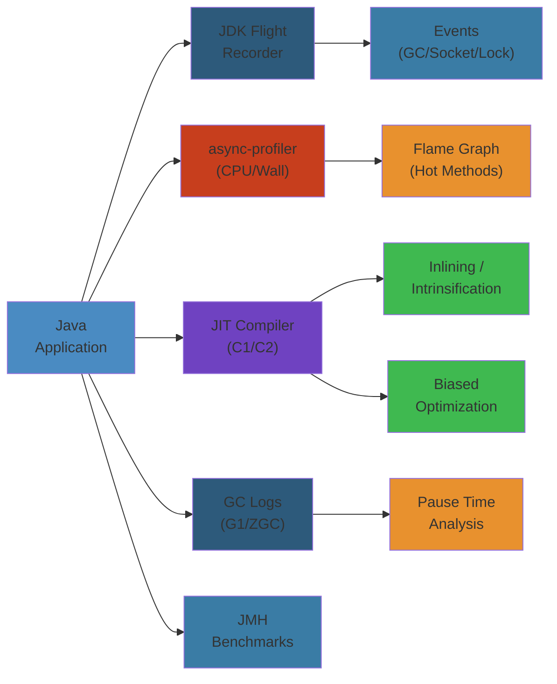
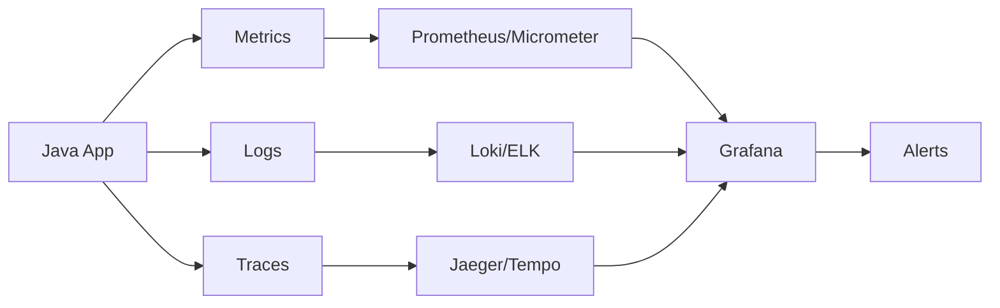

# ⚡ Java Performance Tuning — Complete Deep Dive




## Scope

#### Step-by-Step
1. Process input
2. Validate
3. Execute
4. Return result

#### Code Example
```python
# Example implementation
pass
```

#### Real-World Scenario
This pattern is commonly used in production systems.


Production-grade reference covering JVM profiling, JIT compiler internals, GC tuning, memory management, benchmarking with JMH, async-profiler, JFR, and operational runbooks for high-throughput Java services.

## Table of Contents

#### Step-by-Step
1. Process input
2. Validate
3. Execute
4. Return result

#### Code Example
```python
# Example implementation
pass
```

#### Real-World Scenario
This pattern is commonly used in production systems.


- [Profiling Toolchain](#profiling-toolchain)
- [JIT Compiler Deep Dive](#jit-compiler-deep-dive)
- [GC Tuning](#gc-tuning)
- [Memory Management](#memory-management)
- [JMH Benchmarking](#jmh-benchmarking)
- [async-profiler Usage](#async-profiler-usage)
- [Production Tuning Checklist](#production-tuning-checklist)
- [Failure Analysis](#failure-analysis)

---

## Profiling Toolchain

#### Step-by-Step
1. Process input
2. Validate
3. Execute
4. Return result

#### Code Example
```python
# Example implementation
pass
```

#### Real-World Scenario
This pattern is commonly used in production systems.


```
                    ┌─────────────────────────────┐
                    │      Production JVM          │
                    │   -XX:+UnlockDiagnosticVMOpts │
                    └──────────┬──────────────────┘
                               │
              ┌────────────────┼────────────────┐
              ▼                ▼                ▼
      ┌───────────────┐ ┌───────────┐ ┌──────────────┐
      │ async-profiler│ │   JFR     │ │   JMH        │
      │  perf_events  │ │ events    │ │ microbench   │
      │  cpu/alloc/   │ │ jfr cmd   │ │ @Benchmark   │
      │  lock/wall    │ │ JMC parse │ │ Blackhole    │
      └───────┬───────┘ └─────┬─────┘ └──────┬───────┘
              │               │               │
              ▼               ▼               ▼
      ┌───────────────────────────────────────────┐
      │         Analysis & Visualization          │
      │  FlameGraph / Icicle / Heatmap / JMC GUI  │
      └───────────────────────────────────────────┘
```

### async-profiler (perf_events based)

#### Step-by-Step
1. Process input
2. Validate
3. Execute
4. Return result

#### Code Example
```python
# Example implementation
pass
```

#### Real-World Scenario
This pattern is commonly used in production systems.


```bash
# CPU profiling — sampling event-based, low overhead (~1-2%)
profiler.sh -e cpu -f cpu_flamegraph.html $PID

# Allocation profiling — captures allocation sites
profiler.sh -e alloc -f alloc_flamegraph.html $PID

# Lock profiling — contended monitor events
profiler.sh -e lock -f lock_flamegraph.html $PID

# Wall-clock profiling — includes idle/blocked time
profiler.sh -e wall -t -f wall_stacks.html $PID

# Live memory profiling — tracks objects on heap
profiler.sh -e lock --lock 1ms -f live_objects.html $PID

# Differential profiling — compare two profiles
profiler.sh -e cpu -f before.html $PID
# ... after change
profiler.sh -e cpu -f after.html $PID
# Then diff with: profiler.sh --diff before.html after.html
```

### JFR (JDK Flight Recorder)

#### Step-by-Step
1. Process input
2. Validate
3. Execute
4. Return result

#### Code Example
```python
# Example implementation
pass
```

#### Real-World Scenario
This pattern is commonly used in production systems.


```bash
# Start recording with 60s duration, dump on exit
jfr record --name myrecording --duration 60s \
  --settings profile \
  --filename /tmp/recording.jfr \
  $PID

# Streaming API — continuous monitoring
jfr monitoring --name continuous \
  --events "jdk.GCPhase,jdk.GarbageCollection,jdk.AllocationRequiringGC" \
  --interval 1s \
  $PID

# Parse with jfr tool
jfr print --events "jdk.GarbageCollection" /tmp/recording.jfr

# JMC (JDK Mission Control) — GUI analysis
jmc -open /tmp/recording.jfr
```

### JMX — Standard Management Beans

#### Step-by-Step
1. Process input
2. Validate
3. Execute
4. Return result

#### Code Example
```python
# Example implementation
pass
```

#### Real-World Scenario
This pattern is commonly used in production systems.


```java
// Accessing JMX MBeans programmatically
MBeanServerConnection mbs = ManagementFactory.getPlatformMBeanServer();
ObjectName gc = new ObjectName("java.lang:type=GarbageCollector,name=G1 Young Generation");
long collectionCount = (Long) mbs.getAttribute(gc, "CollectionCount");
long collectionTime = (Long) mbs.getAttribute(gc, "CollectionTime");

// MemoryPoolMXBean — per-pool usage
for (MemoryPoolMXBean pool : ManagementFactory.getMemoryPoolMXBeans()) {
    MemoryUsage usage = pool.getUsage();
    if (pool.getName().contains("G1")) {
        System.out.printf("%s: used=%dMB max=%dMB%n",
            pool.getName(), usage.getUsed() / 1_000_000, usage.getMax() / 1_000_000);
    }
}
```

---

## JIT Compiler Deep Dive

#### Step-by-Step
1. Process input
2. Validate
3. Execute
4. Return result

#### Code Example
```python
# Example implementation
pass
```

#### Real-World Scenario
This pattern is commonly used in production systems.


### Tiered Compilation

#### Step-by-Step
1. Process input
2. Validate
3. Execute
4. Return result

#### Code Example
```python
# Example implementation
pass
```

#### Real-World Scenario
This pattern is commonly used in production systems.


```
  Interpretation       C1 (client)       C2 (server)
  ─────────────       ────────────       ────────────
  Level 0             Level 1-3          Level 4
  (bytecode)          (profiled)         (fully opt)

  Method execution flow:
  ┌────────┐    L0    ┌──────────┐   L1-3  ┌──────────┐
  │  Start  │ ───────►│  C1 opt  │ ───────►│  C2 opt  │
  └────────┘          └──────────┘         └──────────┘
       │                    │                    │
       │ cold methods       │ warm methods       │ hot methods
       │ < CompileThreshold │ 2-3x threshold     │ > threshold
       └──────────────────────────────────────────┘
```

### Inlining — The Most Important JIT Optimization

#### Step-by-Step
1. Process input
2. Validate
3. Execute
4. Return result

#### Code Example
```python
# Example implementation
pass
```

#### Real-World Scenario
This pattern is commonly used in production systems.


```java
// Inline limits (JDK 17+ defaults)
// -XX:MaxInlineSize=325      — max bytecodes of method to inline
// -XX:FreqInlineSize=1500    — max bytecodes for frequently called
// -XX:InlineSmallCode=2500   — max native code for inlined methods
// -XX:MaxInlineLevel=9       — max inlining depth

// Tipping can be inspected:
// -XX:+PrintInlining
// -XX:+UnlockDiagnosticVMOptions -XX:+LogCompilation

public class InliningExample {
    private int result;

    // This will NOT inline if key > max level or exceeds size budget
    public void process(int value) {
        result = compute(value) + transform(value);
    }

    // Candidate for inlining (small, hot)
    private int compute(int v) {
        return v * 2 + 1;  // ~5 bytecodes, easily inlined
    }

    // Candidate if hot enough
    private int transform(int v) {
        return (int) Math.pow(v, 2); // intrinsified + inlined
    }
}
```

### On-Stack Replacement (OSR)

#### Step-by-Step
1. Process input
2. Validate
3. Execute
4. Return result

#### Code Example
```python
# Example implementation
pass
```

#### Real-World Scenario
This pattern is commonly used in production systems.


```java
// OSR: when a long-running loop is compiled while executing
// The JVM replaces the interpreted frame mid-execution
// Threshold: -XX:CompileThreshold=10000 (default tier4)
// OSR uses a special entry point at the loop back branch

public class OSRExample {
    public void longLoop() {
        // After ~10000 iterations, C2 compiles this loop
        // JVM OSR-replaces the interpreted frame with compiled
        for (int i = 0; i < 1_000_000; i++) {
            compute(i);
        }
    }

    private void compute(int i) {
        Math.sin(i) * Math.cos(i); // intrinsified
    }
}
```

### Escape Analysis & Lock Optimizations

#### Step-by-Step
1. Process input
2. Validate
3. Execute
4. Return result

#### Code Example
```python
# Example implementation
pass
```

#### Real-World Scenario
This pattern is commonly used in production systems.


```java
public class EscapeAnalysis {

    // Object does NOT escape: allocated on stack (scalar replace)
    // No heap allocation → no GC pressure
    public long aggregate() {
        Point p = new Point(10, 20);  // stack-allocated, fields tracked
        return p.x * p.y;
    }

    // Lock elision: lock on non-escaping object is removed
    public String concat(String a, String b) {
        return a + b;  // StringBuilder allocated, lock elided
    }

    // Lock coarsening: adjacent synchronized blocks merged
    public void coarsen() {
        synchronized (this) { count++; }  // merged into one lock
        synchronized (this) { count++; }
    }

    static class Point {
        final int x, y;
        Point(int x, int y) { this.x = x; this.y = y; }
    }
}
```

### JIT Compiler Flags

#### Step-by-Step
1. Process input
2. Validate
3. Execute
4. Return result

#### Code Example
```python
# Example implementation
pass
```

#### Real-World Scenario
This pattern is commonly used in production systems.


```bash
# Print compilation events
-XX:+PrintCompilation
# Output: 308  1 %       org.example.Main::main @ 27 (45 bytes)
# Fields: timestamp, compile_id, % = OSR, method, bci, size

# Print inlining decisions
-XX:+PrintInlining
# Output: org.example.Main::compute (5 bytes)
#         \-> @ 0   java.lang.Math::sin (9 bytes)   (intrinsic)

# Log compilation to file (XML format)
-XX:+UnlockDiagnosticVMOptions -XX:+LogCompilation -XX:LogFile=hotspot.log

# Code cache sizing
-XX:ReservedCodeCacheSize=512M     # default 240M, increase for large apps
-XX:InitialCodeCacheSize=256M

# Compilation thresholds
-XX:CompileThreshold=10000          # tier4 threshold
-XX:Tier4MinInvocationThreshold=500 # min invocations before C2
-XX:Tier4CompileThreshold=5000      # C2 threshold after profiling
```

---

## GC Tuning

#### Step-by-Step
1. Process input
2. Validate
3. Execute
4. Return result

#### Code Example
```python
# Example implementation
pass
```

#### Real-World Scenario
This pattern is commonly used in production systems.


### G1 GC — Default Since JDK 9

#### Step-by-Step
1. Process input
2. Validate
3. Execute
4. Return result

#### Code Example
```python
# Example implementation
pass
```

#### Real-World Scenario
This pattern is commonly used in production systems.


```bash
# G1 GC: default collector, region-based, low pause target
-XX:+UseG1GC
-XX:MaxGCPauseMillis=200            # soft pause target (default 200ms)
-XX:G1NewSizePercent=5              # initial young gen % of heap
-XX:G1MaxNewSizePercent=60          # max young gen %
-XX:G1HeapRegionSize=4m             # region size (1-512MB, auto)
-XX:G1ReservePercent=10             # reserve for "to-space" overflow
-XX:G1HeapWastePercent=5            # heap waste % allowed for mixed GC
-XX:G1MixedGCCountTarget=8          # target mixed GC count per cycle
-XX:G1MixedGCLiveThresholdPercent=85 # live threshold for inclusion
-XX:+UnlockExperimentalVMOptions -XX:G1NewSizePercent=10

# Adaptive IHOP — controls when concurrent marking starts
-XX:InitiatingHeapOccupancyPercent=45 # default 45% heap occupancy
```

### G1 GC Pause Distribution

#### Step-by-Step
1. Process input
2. Validate
3. Execute
4. Return result

#### Code Example
```python
# Example implementation
pass
```

#### Real-World Scenario
This pattern is commonly used in production systems.


```
                G1 Young GC Pause Times (ms)
                     Target: 200ms
                        
 Count │
 3500  │          ████
 3000  │       ██████████
 2500  │     ██████████████
 2000  │   ██████████████████
 1500  │ ████████████████████████
 1000  │████████████████████████████
  500  │██████████████████████████████
       └──────────────────────────────────►
       50  100  150  200  250  300   350  ms
               ^
               |
          Target: 200ms

  Observations:
  - Most pauses under 200ms ✓
  - Tail latency 250-300ms needs investigation
  - Reduce MaxGCPauseMillis to 150ms or increase heap
```

### G1 GC Log Parsing

#### Step-by-Step
1. Process input
2. Validate
3. Execute
4. Return result

#### Code Example
```python
# Example implementation
pass
```

#### Real-World Scenario
This pattern is commonly used in production systems.


```bash
# Enable GC logging
-XX:+PrintGCDetails
-XX:+PrintGCDateStamps
-Xlog:gc*:file=/var/log/jvm/gc.log:time,uptime,pid

# Sample GC log line
# 2025-12-01T10:30:00.123+0000: 45.678: [GC pause (G1 Evacuation Pause)
#   (young) 4096M->2048M(8192M), 0.089s]

# Key metrics from log:
# - Heap before/after size
# - Pause time (target < 200ms)
# - Regions: young = 256, survivors = 64
# - IHOP: 45% occupancy triggered concurrent cycle
```

### GC Tuning Decision Tree

#### Step-by-Step
1. Process input
2. Validate
3. Execute
4. Return result

#### Code Example
```python
# Example implementation
pass
```

#### Real-World Scenario
This pattern is commonly used in production systems.


```
  Pause too long (>200ms)?
  │
  ├── Is it young GC?
  │   ├── Yes → Increase heap (-Xmx) or reduce G1NewSizePercent
  │   │         Increase G1HeapRegionSize for large heaps
  │   │
  │   └── No → Is it mixed GC (concurrent)?
  │       ├── Concurrent marking slow → increase -XX:ConcGCThreads
  │       └── Many old region candidates → lower G1MixedGCLiveThresholdPercent
  │
  ├── Is it Full GC (stop-the-world)?
  │   ├── Concurrent mode failure → increase heap or earlier IHOP
  │   └── Humongous allocation → ensure G1HeapRegionSize fits objects
  │
  └── Throughput poor (>5% GC time)?
      ├── Increase heap to reduce GC frequency
      └── Switch to Parallel GC if latency not critical
```

---

## Memory Management

#### Step-by-Step
1. Process input
2. Validate
3. Execute
4. Return result

#### Code Example
```python
# Example implementation
pass
```

#### Real-World Scenario
This pattern is commonly used in production systems.


### Heap Sizing

#### Step-by-Step
1. Process input
2. Validate
3. Execute
4. Return result

#### Code Example
```python
# Example implementation
pass
```

#### Real-World Scenario
This pattern is commonly used in production systems.


```bash
# Production heap sizing
-Xms8g -Xmx8g                   # Equal min/max to avoid resizing
-Xmn3g                          # Young gen (37.5% of heap typically)
-XX:NewRatio=2                  # old:young = 2:1 (young=1/3 of heap)
-XX:SurvivorRatio=8             # eden:survivor = 8:1 (2 survivors)
-XX:+AlwaysPreTouch             # commit pages at startup, avoid runtime fault-in
                                # Cost: ~2s slower startup, benefit: stable latency

# 64-bit pointer compression (default on < 32GB heaps)
-XX:+UseCompressedOops          # 8-byte -> 4-byte references, less cache pressure
-XX:+UseCompressedClassPointers # class metadata pointers compressed
```

### Off-Heap & Metaspace

#### Step-by-Step
1. Process input
2. Validate
3. Execute
4. Return result

#### Code Example
```python
# Example implementation
pass
```

#### Real-World Scenario
This pattern is commonly used in production systems.


```bash
# Non-heap memory limits
-XX:MaxMetaspaceSize=512M       # class metadata (unbounded default)
-XX:MaxDirectMemorySize=2g      # NIO direct buffer cap
-XX:ReservedCodeCacheSize=512M  # JIT code cache
-Xss1m                          # thread stack (reduce for many threads)

# Large pages — reduce TLB misses
-XX:+UseLargePages              # requires OS config
-XX:+UseTransparentHugePages    # THP (Linux)
-XX:LargePageSizeInBytes=2m
```

### Direct (Off-Heap) Memory

#### Step-by-Step
1. Process input
2. Validate
3. Execute
4. Return result

#### Code Example
```python
# Example implementation
pass
```

#### Real-World Scenario
This pattern is commonly used in production systems.


```java
import java.nio.ByteBuffer;
import java.lang.reflect.Field;
import sun.misc.Unsafe;

public class OffHeapPatterns {

    // 1. Direct ByteBuffer — safe, GC-tracked
    ByteBuffer direct = ByteBuffer.allocateDirect(1024 * 1024); // 1MB
    // Cleanup: ((DirectBuffer) buffer).cleaner().clean();

    // 2. Unsafe — maximal control, dangerous
    private static final Unsafe UNSAFE = getUnsafe();
    long address = UNSAFE.allocateMemory(1024 * 1024);
    UNSAFE.putLong(address, 42L);
    long val = UNSAFE.getLong(address);
    UNSAFE.freeMemory(address); // MUST free or leak

    private static Unsafe getUnsafe() {
        try {
            Field f = Unsafe.class.getDeclaredField("theUnsafe");
            f.setAccessible(true);
            return (Unsafe) f.get(null);
        } catch (Exception e) {
            throw new RuntimeException(e);
        }
    }

    // 3. Chronicle Map — off-heap key-value
    // ChronicleMap<CharSequence, CharSequence> map =
    //     ChronicleMap.of(CharSequence.class, CharSequence.class)
    //         .averageValueSize(100).entries(1_000_000).create();
}
```

### Thread-Local Allocation Buffers (TLAB)

#### Step-by-Step
1. Process input
2. Validate
3. Execute
4. Return result

#### Code Example
```python
# Example implementation
pass
```

#### Real-World Scenario
This pattern is commonly used in production systems.


```bash
# TLAB — per-thread Eden allocation area, avoids synchronization
# Each thread gets ~1% of Eden as initial TLAB
# When TLAB is full, thread allocates a new one from shared Eden

-XX:+UseTLAB                    # enabled by default
-XX:TLABSize=2m                 # initial TLAB size
-XX:+ResizeTLAB                 # dynamically resize based allocation rate
-XX:TLABRefillWasteFraction=64  # waste ratio before allocating new TLAB
-XX:+PrintTLAB                  # verbose TLAB stats
```

### ClassLoader & ThreadLocal Leaks

#### Step-by-Step
1. Process input
2. Validate
3. Execute
4. Return result

#### Code Example
```python
# Example implementation
pass
```

#### Real-World Scenario
This pattern is commonly used in production systems.


```java
// ClassLoader Leak — common in app servers
// Fixed classes reference webapp ClassLoader → prevents GC

public class ClassLoaderLeak {
    // PROBLEM: Static collection holds ClassLoader reference
    // private static final List<Class<?>> CACHE = new ArrayList<>();
    // public void register(Class<?> clazz) { CACHE.add(clazz); }

    // SOLUTION: Use WeakHashMap or avoid static references
    private static final Map<ClassLoader, List<Class<?>>> CACHE =
        new WeakHashMap<>();
}

// ThreadLocal Memory Leak
public class ThreadLocalLeak {
    // PROBLEM: ThreadLocal value lives as long as thread
    // private static final ThreadLocal<byte[]> TL = ThreadLocal.withInitial(
    //     () -> new byte[100 * 1024 * 1024]); // 100MB per thread

    // SOLUTION: Always remove after use
    // try {
    //     TL.set(data);
    //     process();
    // } finally {
    //     TL.remove(); // critical in thread pools!
    // }
}
```

---

## JMH Benchmarking

#### Step-by-Step
1. Process input
2. Validate
3. Execute
4. Return result

#### Code Example
```python
# Example implementation
pass
```

#### Real-World Scenario
This pattern is commonly used in production systems.


### Correct JMH Benchmark

#### Step-by-Step
1. Process input
2. Validate
3. Execute
4. Return result

#### Code Example
```python
# Example implementation
pass
```

#### Real-World Scenario
This pattern is commonly used in production systems.


```java
import org.openjdk.jmh.annotations.*;
import org.openjdk.jmh.infra.Blackhole;
import java.util.concurrent.TimeUnit;

@BenchmarkMode(Mode.Throughput)
@OutputTimeUnit(TimeUnit.SECONDS)
@State(Scope.Thread)
@Fork(value = 2, warmups = 1)
@Warmup(iterations = 5, time = 3)
@Measurement(iterations = 10, time = 5)
public class StringConcatBenchmark {

    private String a = "hello";
    private String b = "world";

    @Benchmark
    public String concatPlus() {
        return a + ", " + b;  // JIT may invert to StringBuilder
    }

    @Benchmark
    public String concatBuilder(Blackhole bh) {
        // Blackhole prevents dead code elimination
        return new StringBuilder(a).append(", ").append(b).toString();
    }

    @Benchmark
    @CompilerControl(CompilerControl.Mode.DONT_INLINE)
    public String noInlineConcat() {
        return a + ", " + b;
    }

    @Benchmark
    @CompilerControl(CompilerControl.Mode.EXCLUDE)
    public String excludedFromJIT() {
        return a + ", " + b;  // runs in interpreter only
    }
}
```

### JMH Execution Flow

#### Step-by-Step
1. Process input
2. Validate
3. Execute
4. Return result

#### Code Example
```python
# Example implementation
pass
```

#### Real-World Scenario
This pattern is commonly used in production systems.


```
  ┌─────────────────────────────────────────────────────────┐
  │                     JMH Runner                            │
  │  mvn verify  OR  java -jar benchmarks.jar -f 3 -wi 10    │
  └────────────────────────┬────────────────────────────────┘
                           │
              ┌────────────▼────────────┐
              │   Fork 1 (new JVM)      │
              │  -XX:+PrintCompilation  │
              └────────────┬────────────┘
                           │
              ┌────────────▼────────────┐
              │  Warmup iterations       │
              │  (5 x 3s = 15s)          │
              │  JIT compiles methods    │
              │  Profile accumulates     │
              └────────────┬────────────┘
                           │
              ┌────────────▼────────────┐
              │  Measurement iterations  │
              │  (10 x 5s = 50s)         │
              │  Data collected          │
              └────────────┬────────────┘
                           │
              ┌────────────▼────────────┐
              │  Results aggregation     │
              │  mean ± error, p-Value   │
              │  Score out: ops/sec      │
              └─────────────────────────┘

  Command-line:
  java -jar benchmarks.jar -f 3 -wi 10 -i 10 \
    -prof gc -prof async -jvmArgs "-Xms4g -Xmx4g"
```

### Common JMH Pitfalls

#### Step-by-Step
1. Process input
2. Validate
3. Execute
4. Return result

#### Code Example
```python
# Example implementation
pass
```

#### Real-World Scenario
This pattern is commonly used in production systems.


```java
@State(Scope.Benchmark)
public class JMHPitfalls {

    // PITFALL 1: Constant folding — JIT evaluates at compile time
    // int x = 1 + 2;  // always 3, JIT folds
    @Param({"100", "1000", "10000"})
    public int size;

    // PITFALL 2: Dead code elimination — result never used
    @Benchmark
    public void deadCode() {
        Math.sin(1.0); // JIT eliminates — no observable effect
    }

    // CORRECT: consume with Blackhole
    @Benchmark
    public double blackholeCorrect(Blackhole bh) {
        double d = Math.sin(1.0);
        bh.consume(d); // prevents elimination
        return d;
    }

    // PITFALL 3: Loop optimization — JIT unrolls/hoists
    @Benchmark
    public int loopHoist() {
        int sum = 0;
        int len = array.length; // hoisted out of loop
        for (int i = 0; i < len; i++) {
            sum += array[i];
        }
        return sum;
    }

    private int[] array = new int[1000];
}
```

---

## async-profiler Usage

#### Step-by-Step
1. Process input
2. Validate
3. Execute
4. Return result

#### Code Example
```python
# Example implementation
pass
```

#### Real-World Scenario
This pattern is commonly used in production systems.


### Profile Strategies by Problem

#### Step-by-Step
1. Process input
2. Validate
3. Execute
4. Return result

#### Code Example
```python
# Example implementation
pass
```

#### Real-World Scenario
This pattern is commonly used in production systems.


```bash
# Problem: CPU high, which methods are hot?
profiler.sh -e cpu -f cpu_flamegraph.html -d 60 $PID

# Problem: Memory allocation rate high, where?
profiler.sh -e alloc -f alloc.html -d 120 $PID

# Problem: Thread contention, who holds locks?
profiler.sh -e lock -f lock.html -d 60 $PID

# Problem: Slow response time, where does time go?
profiler.sh -e wall -t -f wall.html -d 300 $PID

# Problem: Live object histogram (like jmap -histo:live)
profiler.sh -e alloc --alloc 500m -f live.html -d 30 $PID
```

### Flame Graph Interpretation

#### Step-by-Step
1. Process input
2. Validate
3. Execute
4. Return result

#### Code Example
```python
# Example implementation
pass
```

#### Real-World Scenario
This pattern is commonly used in production systems.


```
               ┌──────────────────────────────────────────────┐
               │               Flame Graph                      │
               │     (CPU sample, width proportional to time)   │
               └──────────────────────────────────────────────┘

    main ──────────────────────────────────────────────────
    ├─ processRequest ─────────────────────────────────────────
    │  ├─ parseBody ────────────── 20%  ← hot method
    │  │  ├─ JSON.parse ──── 15%  ← can we optimize?
    │  │  └─ validate ──────  5%
    │  ├─ businessLogic ────────── 50%
    │  │  ├─ compute ─────── 35%
    │  │  │  └─ Math.sin ── 20%  ← intrinsic
    │  │  └─ transform ──── 15%
    │  └─ serializeResponse ───── 30%
    │     └─ JsonMapper.write ── 25%
    └─ gc ────────────────────────  3%  ← low overhead ✓

  Y-axis: stack depth (top = leaf method)
  X-axis: width proportional to sample count
  Color: random per package (or use icicle for inverse)
```

### Differential Profiling

#### Step-by-Step
1. Process input
2. Validate
3. Execute
4. Return result

#### Code Example
```python
# Example implementation
pass
```

#### Real-World Scenario
This pattern is commonly used in production systems.


```bash
# After deploying code change, compare CPU profiles
profiler.sh -e cpu -f /tmp/before.html -d 60 $PID

# Deploy new version

profiler.sh -e cpu -f /tmp/after.html -d 60 $PID

# Generate diff (red = more samples in new, blue = less)
profiler.sh --diff before.html after.html -f diff.html
```

---

## Production Tuning Checklist

#### Step-by-Step
1. Process input
2. Validate
3. Execute
4. Return result

#### Code Example
```python
# Example implementation
pass
```

#### Real-World Scenario
This pattern is commonly used in production systems.


### Capacity Thresholds

#### Step-by-Step
1. Process input
2. Validate
3. Execute
4. Return result

#### Code Example
```python
# Example implementation
pass
```

#### Real-World Scenario
This pattern is commonly used in production systems.


```yaml
CPU:
  threshold: 70%                # Average utilization target
  action: scale out or optimize hot methods
  measurement: top -H -p $PID, async-profiler

GC Overhead:
  threshold: < 5% of CPU time   # Acceptable range
  action: increase heap, tune generation sizing
  measurement: GC logs, JMX GarbageCollectorMXBean

GC Pause:
  threshold: < 100ms p99        # Latency-sensitive apps
  action: reduce MaxGCPauseMillis, increase region count
  measurement: GC logs -XX:+PrintGCDetails

Heap Usage:
  threshold: < 75% after GC     # Post-GC occupancy
  action: increase -Xmx, check for memory leak
  measurement: jstat -gcutil, JFR, JMX MemoryMXBean

Code Cache:
  threshold: < 80% filled       # Full code cache = deoptimization
  action: increase -XX:ReservedCodeCacheSize
  measurement: -XX:+PrintCodeCache

Metaspace:
  threshold: steady growth      # ClassLoader leak indicator
  action: investigate class loading
  measurement: jstat -gc, JMX

File Descriptors:
  threshold: stable < 80% limit
  action: check for socket leaks
  measurement: lsof -p $PID | wc -l

Thread Count:
  threshold: stable pattern     # Growing → thread leak
  action: review thread pool management
  measurement: jstack, ThreadMXBean

Direct Memory:
  threshold: stable < 80% MaxDirectMemorySize
  action: ByteBuffer allocation leak check
  measurement: JMX BufferPoolMXBean
```

### Quick Health Check Commands

#### Step-by-Step
1. Process input
2. Validate
3. Execute
4. Return result

#### Code Example
```python
# Example implementation
pass
```

#### Real-World Scenario
This pattern is commonly used in production systems.


```bash
# GC activity
jstat -gcutil $PID 2s 10
#   S0  S1  E   O   M   YGC  YGCT  FGC  FGCT
#   0.00 0.00 40.0 60.0 95.0 1200 45.6 2 0.5

# Thread dump on high CPU
jstack $PID > /tmp/threads_$(date +%s).txt

# Heap dump (live objects only)
jmap -dump:live,format=b,file=/tmp/heap_$(date +%s).hprof $PID

# Native memory tracking
-XX:NativeMemoryTracking=summary
jcmd $PID VM.native_memory summary scale=MB

# Print all VM flags
jcmd $PID VM.flags -all

# JFR recording on demand
jcmd $PID JFR.start duration=60s filename=/tmp/recording.jfr
```

---

## Failure Analysis

#### Step-by-Step
1. Process input
2. Validate
3. Execute
4. Return result

#### Code Example
```python
# Example implementation
pass
```

#### Real-World Scenario
This pattern is commonly used in production systems.


### 1. GC Pause Storm

#### Step-by-Step
1. Process input
2. Validate
3. Execute
4. Return result

#### Code Example
```python
# Example implementation
pass
```

#### Real-World Scenario
This pattern is commonly used in production systems.


```
Symptoms:
  - Thread dumps show all threads at safepoint
  - Prometheus: jvm_gc_pause_seconds > 500ms per event
  - Application: request timeout spike, P99 latency 10x

Root Causes:
  1. Heap too small for allocation rate
  2. Humongous allocations (regions > 50% of G1HeapRegionSize)
  3. G1 Mixed GC triggering too aggressively
  4. External fragmentation in CMS

Diagnosis:
  jstat -gcutil $PID 1s
  Check: E (Eden) 100% before each young GC
  Check: O (Old) > 70% after mixed GC
  Check: YGCT / FGC high

Resolution:
  - Increase heap: -Xms16g -Xmx16g
  - Increase region count: -XX:G1HeapRegionSize=2m (smaller regions)
  - Delay mixed GC: -XX:G1MixedGCCountTarget=16
  - Raise IHOP: -XX:InitiatingHeapOccupancyPercent=65
```

### 2. Code Cache Full → Deoptimization

#### Step-by-Step
1. Process input
2. Validate
3. Execute
4. Return result

#### Code Example
```python
# Example implementation
pass
```

#### Real-World Scenario
This pattern is commonly used in production systems.


```
Symptoms:
  - JIT ceases compilation
  - Methods deoptimized → interpreted mode
  - CPU usage drops, throughput drops 50%+
  - Log: "CodeCache is full. Compiler has been disabled."

Diagnosis:
  -XX:+PrintCodeCache output:
    start end size freelist max_used
    CodeHeap 'non-nmethods': 4MB (100% full)
  - Methods compiled at level 0 instead of 4

Resolution:
  - Increase: -XX:ReservedCodeCacheSize=512M
  - Check for excessive dynamic code generation (lambdas, proxies)
  - Use -XX:-UseCodeCacheFlushing as temporary mitigation
```

### 3. Memory Leak — Heap Dump Analysis

#### Step-by-Step
1. Process input
2. Validate
3. Execute
4. Return result

#### Code Example
```python
# Example implementation
pass
```

#### Real-World Scenario
This pattern is commonly used in production systems.


```java
// Classical leak pattern: accumulator map
public class LeakPattern {
    // PROBLEM: Map grows unbounded
    private static final Map<String, Session> SESSIONS = new HashMap<>();

    public void onRequest(String sessionId, Session session) {
        SESSIONS.put(sessionId, session); // never removed
    }
}

// MAT OQL queries to find suspects:
//
// 1. "SELECT * FROM java.util.HashMap$Node" — find largest maps
// 2. "SELECT * FROM byte[]" — largest byte arrays
// 3. "SELECT * FROM INSTANCEOF com.example.Session" — instance count
//
// MAT Leak Suspect Report workflow:
// 1. Open heap dump in MAT
// 2. Run "Leak Suspects Report" (automated)
// 3. Check "Biggest Objects by Retained Size"
// 4. Path to GC Roots → find what holds reference
// 5. Dominator Tree → identify dominator chains
```

### 4. Safepoint Storms

#### Step-by-Step
1. Process input
2. Validate
3. Execute
4. Return result

#### Code Example
```python
# Example implementation
pass
```

#### Real-World Scenario
This pattern is commonly used in production systems.


```bash
# Diagnose safepoint issues
-XX:+PrintSafepointStatistics
-XX:PrintSafepointStatisticsCount=1
-XX:+SafepointTimeout -XX:SafepointTimeoutDelay=1000

# Common causes:
# 1. Thread dump requested (jstack) — high overhead
# 2. Biased locking revocation (disable: -XX:-UseBiasedLocking)
# 3. GC safepoint — all threads must stop
# 4. Debugging JVMTI agents

# Check safepoint time in GC logs:
# Total time for which application threads were stopped: 0.089s
# SafepointSyncTime: 0.040s  ← time waiting for threads
```

### 5. Resource Leak — File Descriptor Exhaustion

#### Step-by-Step
1. Process input
2. Validate
3. Execute
4. Return result

#### Code Example
```python
# Example implementation
pass
```

#### Real-World Scenario
This pattern is commonly used in production systems.


```java
// Java 7+ try-with-resources prevents this
// BAD: manual close error-prone
public void badIo() throws IOException {
    java.io.InputStream is = new java.io.FileInputStream("/tmp/data");
    // if exception thrown here, is never closed
    is.read();
    is.close();
}

// GOOD: try-with-resources guarantees cleanup
public void goodIo() throws IOException {
    try (java.io.InputStream is = new java.io.FileInputStream("/tmp/data")) {
        is.read();
    } // auto-close even on exception
}

// Monitor:
// lsof -p $PID | wc -l
// /proc/$PID/fd — count file descriptors
// Config: -XX:+TraceClassLoading
```


## Observability

#### Step-by-Step
1. Process input
2. Validate
3. Execute
4. Return result

#### Code Example
```python
# Example implementation
pass
```

#### Real-World Scenario
This pattern is commonly used in production systems.




### Key Metrics

#### Step-by-Step
1. Process input
2. Validate
3. Execute
4. Return result

#### Code Example
```python
# Example implementation
pass
```

#### Real-World Scenario
This pattern is commonly used in production systems.


| Metric | Unit | Threshold | Indicates |
|--------|------|-----------|-----------|
| JVM heap used | % | < 75% | Memory pressure |
| GC pause (p99) | ms | < 100ms | GC tuning needed |
| Young GC frequency | /min | < 10 | Object allocation rate |
| Full GC frequency | /min | 0 (ideally) | Memory leak or metaspace |
| Thread count | count | < 500 | Thread pool exhaustion |
| Connection pool usage | % | < 80% | Database pool saturation |
| Class loading rate | classes/s | < 100 | Dynamic class generation |
| File descriptor count | count | < 70% of ulimit | FD leak |

### Logs

#### Step-by-Step
1. Process input
2. Validate
3. Execute
4. Return result

#### Code Example
```python
# Example implementation
pass
```

#### Real-World Scenario
This pattern is commonly used in production systems.


- **ERROR**: Uncaught exceptions, OOM, stack traces, connection pool exhaustion, thread starvation
- **WARN**: Slow queries, long GC pauses, retry attempts, deprecated API usage
- **INFO**: Server start/stop, context initialization, config loaded, scheduled tasks
- **DEBUG**: SQL queries with params, request/response headers, method entry/exit timing

### Traces

#### Step-by-Step
1. Process input
2. Validate
3. Execute
4. Return result

#### Code Example
```python
# Example implementation
pass
```

#### Real-World Scenario
This pattern is commonly used in production systems.


Use Micrometer Tracing (formerly Spring Cloud Sleuth) or OpenTelemetry Java SDK. Propagate trace context via MDC for log correlation.

### Alerts

#### Step-by-Step
1. Process input
2. Validate
3. Execute
4. Return result

#### Code Example
```python
# Example implementation
pass
```

#### Real-World Scenario
This pattern is commonly used in production systems.


| Severity | Condition | Response |
|----------|-----------|----------|
| P0 | Full GC > 1 in 5min | Heap dump, identify leak |
| P0 | Error rate > 5% | Rollback, check heap |
| P1 | GC pause > 1s | Tune GC, reduce heap pressure |
| P1 | Thread starvation | Increase pool, check deadlocks |
| P2 | Heap > 85% for 10min | Schedule capacity increase |

### Dashboards

#### Step-by-Step
1. Process input
2. Validate
3. Execute
4. Return result

#### Code Example
```python
# Example implementation
pass
```

#### Real-World Scenario
This pattern is commonly used in production systems.


**JVM Dashboard**: heap usage (young/old/metaspace), GC pause (count, duration per generation), thread states (runnable/blocked/waiting), class loading, JIT compilation time, file descriptor count.


## Common Failures

#### Step-by-Step
1. Process input
2. Validate
3. Execute
4. Return result

#### Code Example
```python
# Example implementation
pass
```

#### Real-World Scenario
This pattern is commonly used in production systems.


### Failure: OutOfMemoryError

#### Step-by-Step
1. Process input
2. Validate
3. Execute
4. Return result

#### Code Example
```python
# Example implementation
pass
```

#### Real-World Scenario
This pattern is commonly used in production systems.


- **Symptoms**: Application crashes with `java.lang.OutOfMemoryError`. Heap dump on exit. 503s from load balancer.
- **Root Cause**: Memory leak (unclosed streams, collections growing unbounded, ThreadLocal not cleaned). Heap too small for workload. Metaspace leak from dynamic class loading.
- **Detection**: `jstat -gcutil <pid> 1s` shows Old Gen filling. `jmap -histo:live <pid>` shows leaking class count. GC logs show Full GC repeatedly.
- **Recovery**: 1) Increase heap with `-Xmx`. 2) Enable `-XX:+HeapDumpOnOutOfMemoryError`. 3) Analyze heap dump with Eclipse MAT. 4) Restart with increased resources.
- **Prevention**: Profile with `jprofiler`/`async-profiler`. Set `-Xmx` high enough. Use `-XX:+ExitOnOutOfMemoryError` for fail-fast. Implement proper resource cleanup in `finally`/`try-with-resources`.

### Failure: Full GC Storm

#### Step-by-Step
1. Process input
2. Validate
3. Execute
4. Return result

#### Code Example
```python
# Example implementation
pass
```

#### Real-World Scenario
This pattern is commonly used in production systems.


- **Symptoms**: Latency spikes, CPU high, throughput drops. GC log shows Full GC events in quick succession.
- **Root Cause**: Old Gen fills up faster than concurrent GC can clear. Large object allocation (direct to Old Gen). GC fragmentation. Too many concurrent GC threads competing.
- **Detection**: GC logs show Full GC events. `jstat -gcutil` shows Old Gen at > 90% after GC. `jmap -histo` shows large byte arrays.
- **Recovery**: 1) Increase heap size. 2) Switch to G1GC or ZGC. 3) Reduce allocation rate. 4) Enable `-XX:+UseStringDeduplication`.
- **Prevention**: Use G1GC with `-XX:MaxGCPauseMillis=200`. Set `-XX:G1HeapRegionSize=16m`. Monitor allocation rate with async-profiler.

### Failure: Thread Pool Exhaustion

#### Step-by-Step
1. Process input
2. Validate
3. Execute
4. Return result

#### Code Example
```python
# Example implementation
pass
```

#### Real-World Scenario
This pattern is commonly used in production systems.


- **Symptoms**: "RejectedExecutionException" in logs. Tasks queue up and time out. Deadlock between thread pools.
- **Root Cause**: Task submitted faster than thread pool can process. Thread pool queue bounded. Deadlock where pool A waits for pool B, pool B waits for pool A.
- **Detection**: `jstack` shows threads in `parking to await` or `locked`. `ThreadPoolExecutor` metrics show queue size growing. Active count = pool size.
- **Recovery**: 1) `jstack` dump for deadlock analysis. 2) Emergency increase pool size. 3) Reduce task submission rate. 4) Restart.
- **Prevention**: Use separate thread pools for different workloads. Set appropriate queue capacity and rejection policy. Monitor pool active count and queue depth. Use `ThreadPoolExecutor` with `CallerRunsPolicy` as safety net.

### Failure: ClassLoader Leak

#### Step-by-Step
1. Process input
2. Validate
3. Execute
4. Return result

#### Code Example
```python
# Example implementation
pass
```

#### Real-World Scenario
This pattern is commonly used in production systems.


- **Symptoms**: Metaspace grows unbounded, Full GC on Metaspace, eventually OOM: Metaspace.
- **Root Cause**: Application redeploy (Tomcat) creates new ClassLoader each time. Old ClassLoader not garbage collected because some reference (often from a library thread) holds it alive. Common with thread pools initialized at deploy time.
- **Detection**: `jstat -gcutil` shows Metaspace usage climbing. Heap dump shows many `ClassLoader` instances. PermGen/Metaspace GC before OOM.
- **Recovery**: 1) Restart application server. 2) Increase Metaspace size. 3) Patch library holding ClassLoader reference.
- **Prevention**: Always use `ThreadFactory` that sets daemon threads. Use `Thread.setContextClassLoader(null)` for library threads. Test redeploy with `Profiler` to verify ClassLoader cleanup.

### Failure: Deadlock

#### Step-by-Step
1. Process input
2. Validate
3. Execute
4. Return result

#### Code Example
```python
# Example implementation
pass
```

#### Real-World Scenario
This pattern is commonly used in production systems.


- **Symptoms**: Threads stuck, no progress, application partially frozen. Thread dump shows threads in BLOCKED state all holding locks others need.
- **Root Cause**: Circular lock dependency. Two+ threads each hold a lock and wait for another thread's lock. Classic dining philosophers.
- **Detection**: `jstack` shows deadlock detection: "Found one Java-level deadlock". Thread state: BLOCKED on a lock held by another thread that's waiting on this thread's lock.
- **Recovery**: 1) Kill the stuck threads or restart JVM. 2) `jstack -l <pid>` to identify deadlocked threads. 3) Fix locking order in code.
- **Prevention**: Always acquire locks in consistent order. Use `tryLock` with timeout instead of `synchronized`. Use `java.util.concurrent` classes. Enable `-XX:+PrintConcurrentLocks`.
