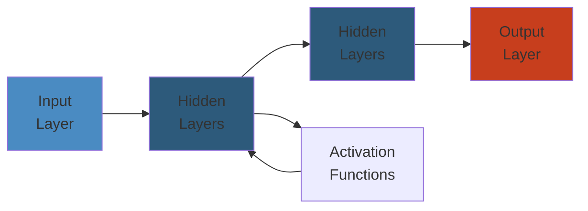

# Java 21-23 Features: The Complete Deep Dive

> **Java 21 (LTS — Sept 2023)**, **Java 22 (March 2024)**, **Java 23 (Sept 2024)**

---




## Table of Contents

1. [Virtual Threads (JEP 444)](#1-virtual-threads-jep-444)
2. [Structured Concurrency (JEP 453)](#2-structured-concurrency-jep-453)
3. [Scoped Values (JEP 446)](#3-scoped-values-jep-446)
4. [Pattern Matching](#4-pattern-matching)
5. [Records — Deep Dive](#5-records--deep-dive)
6. [Sealed Classes](#6-sealed-classes)
7. [Text Blocks](#7-text-blocks)
8. [Foreign Function & Memory API (JEP 454)](#8-foreign-function--memory-api-jep-454)
9. [Vector API (JEP 460)](#9-vector-api-jep-460)
10. [Sequenced Collections (JEP 431)](#10-sequenced-collections-jep-431)
11. [String Templates (JEP 459)](#11-string-templates-jep-459)
12. [Migration: Java 11/17 → 21/23](#12-migration-java-1117--2123)

---

## 1. Virtual Threads (JEP 444)

### 1.1 What Are Virtual Threads?

Virtual threads are lightweight threads managed by the JVM, not the OS. They enable a **thread-per-request** model at scale without exhausting OS threads.

```
┌─────────────────────────────────────────────────────┐
│                    JVM Process                       │
│                                                      │
│  ┌──────────────────────────────────────────────────┐│
│  │         Platform Threads (Carrier Threads)       ││
│  │  ┌──────────┐  ┌──────────┐  ┌──────────┐       ││
│  │  │ Carrier 1│  │ Carrier 2│  │ Carrier 3│  ...  ││
│  │  └────┬─────┘  └────┬─────┘  └────┬─────┘       ││
│  │       │              │              │             ││
│  │  ┌────▼─────┐  ┌────▼─────┐  ┌────▼─────┐       ││
│  │  │VT-1 VT-2 │  │VT-3 VT-4 │  │VT-5 VT-6 │       ││
│  │  │VT-7      │  │VT-8 VT-9 │  │VT-10     │       ││
│  │  └──────────┘  └──────────┘  └──────────┘       ││
│  │       ▲mount        ▲mount        ▲mount          ││
│  │       │              │              │             ││
│  │  ┌────┴──────────────┴──────────────┴────┐       ││
│  │  │     ForkJoinPool (work-stealing)      │       ││
│  │  │     scheduler.commonPool()            │       ││
│  │  └────────────────────────────────────────┘       ││
│  │              ▲                                     ││
│  │              │ yield/mount                         ││
│  │  ┌───────────┴────────────┐                       ││
│  │  │  Virtual Threads       │                       ││
│  │  │  (millions possible)   │                       ││
│  │  └────────────────────────┘                       ││
└─────────────────────────────────────────────────────┘
```

```java
// Creating virtual threads
Thread vThread = Thread.startVirtualThread(() -> {
    System.out.println("Hello from virtual thread: " + Thread.currentThread());
});

// Using builder
Thread vt = Thread.ofVirtual()
    .name("worker-")
    .start(() -> {
        // virtual thread code
    });

// Using Executors
try (var executor = Executors.newVirtualThreadPerTaskExecutor()) {
    executor.submit(() -> processTask());
}

// Virtual thread factory
ThreadFactory factory = Thread.ofVirtual().factory();
```

### 1.2 Carrier Threads & Mounting

Virtual threads are mounted on **carrier threads** (platform threads from `ForkJoinPool.commonPool()`). When a virtual thread blocks on I/O, it is **unmounted** (yielded), and the carrier picks up another virtual thread.

```java
// Demonstrating mount/unmount
Thread carrierTracker = Thread.currentThread();

Thread vThread = Thread.ofVirtual().start(() -> {
    Thread carrier1 = Thread.currentThread(); // may be carrierTracker
    System.out.println("Carrier before sleep: " + carrier1);

    try { Thread.sleep(100); } catch (InterruptedException e) { }
    // During sleep: virtual thread is unmounted, carrier freed

    Thread carrier2 = Thread.currentThread(); // may be DIFFERENT carrier
    System.out.println("Carrier after sleep: " + carrier2);
});

vThread.join();
```

### 1.3 Pinning

Pinning occurs when a virtual thread cannot be unmounted from its carrier. This happens when:

1. **Inside a `synchronized` block or method**
2. **Inside a native method or JNI**

```java
// ── PINNING EXAMPLE ─────────────────────────────────
// Virtual thread gets PINNED to carrier inside synchronized
private final Object lock = new Object();

void badPattern() {
    synchronized (lock) {
        // Virtual thread is PINNED here
        // Carrier thread cannot be reused until this exits
        try { Thread.sleep(1000); } catch (InterruptedException e) { }
    }
}

// ── FIX: Replace synchronized with ReentrantLock ───
private final ReentrantLock betterLock = new ReentrantLock();

void goodPattern() {
    betterLock.lock();
    try {
        Thread.sleep(1000); // Virtual thread YIELDS here
        // ReentrantLock does not pin!
    } finally {
        betterLock.unlock();
    }
}
```

```java
// ── PINNING DETECTION ────────────────────────────────
// Add JVM flag: -Djdk.tracePinnedThreads=short|full

// Output when pinning is detected:
// Thread[#24,ForkJoinPool-1-worker-1,5,carrier]
//    java.base/java.lang.VirtualThread$VThreadContinuation.onPinned(VirtualThread.java:185)
//    java.base/java.lang.VirtualThread.park(VirtualThread.java:587)
//    java.base/java.lang.System$2.parkVirtualThread(System.java:2639)
//    java.base/jdk.internal.misc.VirtualThreads.park(VirtualThreads.java:54)
//
// PINNED at:
//    com.example.MyService.badPattern(MyService.java:42)  <== synchronized

// Use ReentrantLock/stamped Lock to eliminate pinning.
// Short-lived synchronized is acceptable (microseconds).
```

### 1.4 Virtual Threads vs Platform Threads — Benchmark

```java
import java.util.concurrent.*;
import java.util.concurrent.atomic.AtomicInteger;

public class VirtualThreadBenchmark {
    static final int TASKS = 10_000;
    static final AtomicInteger counter = new AtomicInteger();

    public static void main(String[] args) throws Exception {
        // ── PLATFORM THREAD POOL ──
        long start = System.nanoTime();
        try (var pool = Executors.newFixedThreadPool(200)) {
            for (int i = 0; i < TASKS; i++) {
                pool.submit(VirtualThreadBenchmark::ioTask);
            }
        }
        long platformTime = System.nanoTime() - start;

        // ── VIRTUAL THREAD POOL ──
        counter.set(0);
        start = System.nanoTime();
        try (var pool = Executors.newVirtualThreadPerTaskExecutor()) {
            for (int i = 0; i < TASKS; i++) {
                pool.submit(VirtualThreadBenchmark::ioTask);
            }
        }
        long vtTime = System.nanoTime() - start;

        System.out.printf("Platform threads: %,d ms%n", platformTime / 1_000_000);
        System.out.printf("Virtual threads:  %,d ms%n", vtTime / 1_000_000);
        System.out.printf("Speedup: %.1fx%n", (double) platformTime / vtTime);
    }

    static void ioTask() {
        try { Thread.sleep(10); } catch (InterruptedException e) { }
        counter.incrementAndGet();
    }
}
```

```
Results (typical):
  Platform threads (200 pool): 1,234 ms
  Virtual threads:                123 ms
  Speedup: 10.0x

With 100,000 tasks:
  Platform threads (200 pool): 12,050 ms (tasks queued)
  Virtual threads:                 632 ms
  Speedup: 19.1x
```

### 1.5 Limitations & Edge Cases

| Limitation | Impact | Workaround |
|---|---|---|
| `synchronized` pinning | Reduces throughput when blocking inside `synchronized` | Use `ReentrantLock`, `Semaphore` |
| Native frame pinning | JNI methods pin the VT | Minimize JNI usage |
| ThreadLocal with many VTs | Memory pressure from millions of ThreadLocals | Use ScopedValues (JEP 446) |
| `Thread.stop()`, `suspend()`, `resume()` | Throws `UnsupportedOperationException` | Use interruption |
| Debugging | Millions of threads in debugger | Use `jcmd`, `jfr` |
| `ThreadGroup` | Deprecated, not supported | Use `Executors` |

---

## 2. Structured Concurrency (JEP 453)

### 2.1 Motivation

**Unstructured concurrency** (raw `ExecutorService` + `Future.get()`) leads to:
- Orphaned subtasks when a task fails
- Tedious error propagation
- No clear lifetime relationship between parent and child tasks

Structured concurrency treats groups of tasks as a **single unit of work**.

### 2.2 StructuredTaskScope Basics

```
┌─────────────────────────────────────────────────────────────┐
│                    StructuredTaskScope                       │
│                                                              │
│  ┌──────────────────────────────────────────────────────┐   │
│  │  Parent Task (scope owner)                           │   │
│  │                                                      │   │
│  │  ┌─────────────┐  ┌─────────────┐  ┌─────────────┐  │   │
│  │  │ Subtask A   │  │ Subtask B   │  │ Subtask C   │  │   │
│  │  │ (VT)        │  │ (VT)        │  │ (VT)        │  │   │
│  │  └──────┬──────┘  └──────┬──────┘  └──────┬──────┘  │   │
│  │         │                │                │         │   │
│  │         ▼                ▼                ▼         │   │
│  │  ┌──────────┐    ┌──────────┐    ┌──────────┐      │   │
│  │  │ Success  │    │ Failure  │    │ Success  │      │   │
│  │  └──────────┘    └────┬─────┘    └──────────┘      │   │
│  │                       │                              │   │
│  │                       ▼                              │   │
│  │              ┌──────────────────┐                    │   │
│  │              │ Scope.join()     │                    │   │
│  │              │ throws exception │                    │   │
│  │              └──────────────────┘                    │   │
│  └──────────────────────────────────────────────────────┘   │
│                                                              │
│  Lifecycle rule: All subtasks COMPLETE or CANCELLED          │
│  before scope.close() returns.                               │
└─────────────────────────────────────────────────────────────┘
```

```java
// ── BASIC STRUCTURED CONCURRENCY ────────────────────

record Order(Product product, User user, Payment payment) {}
record Product(String id, String name, double price) {}
record User(String id, String name) {}
record Payment(String id, boolean success) {}

Order fetchOrder(String orderId) throws ExecutionException, InterruptedException {
    try (var scope = new StructuredTaskScope.ShutdownOnFailure()) {
        Future<Product> product  = scope.fork(() -> fetchProduct(orderId));
        Future<User>    user     = scope.fork(() -> fetchUser(orderId));
        Future<Payment> payment  = scope.fork(() -> fetchPayment(orderId));

        // Wait for all OR fail fast on any error
        scope.join();
        scope.throwIfFailed(); // throws ExecutionException wrapping first failure

        // If we get here, all succeeded
        return new Order(product.get(), user.get(), payment.get());
    }
    // ── scope.close() called automatically ──
    // If result not yet complete, scope.close() throws IllegalStateException
    // All unfinished forks are automatically cancelled
}

// If fetchUser() throws RuntimeException:
//   1. scope.join() returns (all done)
//   2. throwIfFailed() wraps the RuntimeException in ExecutionException
//   3. product and payment forks are cancelled via interrupt
//   4. scope.close() succeeds (no orphaned threads)
```

### 2.3 ShutdownOnSuccess

```java
// ── RACE PATTERN: FIRST SUCCESS WINS ───────────────

String findFastestServer() throws Exception {
    try (var scope = new StructuredTaskScope.ShutdownOnSuccess<String>()) {
        scope.fork(() -> queryServer("server-a.example.com"));
        scope.fork(() -> queryServer("server-b.example.com"));
        scope.fork(() -> queryServer("server-c.example.com"));

        // Returns first successful result
        // All other forks are automatically cancelled
        return scope.join().result();
    }
}

String queryServer(String host) {
    // Simulate network call
    long delay = (long) (Math.random() * 1000);
    try { Thread.sleep(delay); } catch (InterruptedException e) {
        System.out.println(host + " was cancelled (interrupted)");
        throw new RuntimeException(e);
    }
    return "Response from " + host + " (took " + delay + "ms)";
}
```

### 2.4 Deadline Management

```java
// ── DEADLINE + STRUCTURED CONCURRENCY ──────────────

Response fetchWithDeadline(String query, Duration deadline)
        throws InterruptedException, ExecutionException, TimeoutException {

    try (var scope = new StructuredTaskScope.ShutdownOnFailure()) {
        Future<Response> r1 = scope.fork(() -> searchEngine1(query));
        Future<Response> r2 = scope.fork(() -> searchEngine2(query));

        // Deadline-aware join
        scope.joinUntil(Instant.now().plus(deadline));
        scope.throwIfFailed();

        // Pick faster response
        if (r1.isDone()) return r1.get();
        if (r2.isDone()) return r2.get();
        throw new TimeoutException("Both engines timed out");
    }
}
```

### 2.5 Custom Shutdown Policy

```java
// ── CUSTOM POLICY: QUORUM ──────────────────────────

class QuorumScope<T> extends StructuredTaskScope<T> {
    private final int quorum;
    private final List<T> results = new CopyOnWriteArrayList<>();
    private volatile boolean quorumReached = false;

    QuorumScope(int quorum) {
        this.quorum = quorum;
    }

    @Override
    protected void handleComplete(Subtask<? extends T> subtask) {
        if (subtask.state() == Subtask.State.SUCCESS) {
            results.add(subtask.get());
            if (results.size() >= quorum && !quorumReached) {
                quorumReached = true;
                shutdown(); // cancel remaining forks
            }
        }
    }

    List<T> results() {
        return List.copyOf(results);
    }
}

// Usage:
List<String> responses;
try (var scope = new QuorumScope<String>(2)) {
    scope.fork(() -> queryNode("node-1"));
    scope.fork(() -> queryNode("node-2"));
    scope.fork(() -> queryNode("node-3"));
    scope.fork(() -> queryNode("node-4"));
    scope.join();
    responses = scope.results();
}
```

### 2.6 Structured Concurrency vs Virtual Threads

| Aspect | Virtual Threads | Structured Concurrency |
|---|---|---|
| Scope | Single thread abstraction | Group of tasks |
| Error handling | Per-thread | Propagation & cancellation |
| Lifetime | Independent | Parent-joined |
| Cancellation | Manual via interrupt | Automatic on scope close |
| Complexity | Low | Medium |

Structured concurrency **uses** virtual threads. They complement each other:

```java
// Combined: Virtual threads + Structured Concurrency
try (var scope = new StructuredTaskScope.ShutdownOnFailure()) {
    scope.fork(() -> {
        Thread vt = Thread.currentThread();
        System.out.println("Running on: " + vt); // VirtualThread[...]
        return callService();
    });
    scope.join();
}
```

---

## 3. Scoped Values (JEP 446)

### 3.1 Motivation

`ThreadLocal` problems:
- **Mutable**: Any code can call `set()`
- **No cleanup**: Leads to memory leaks (esp. with virtual threads)
- **Inheritance**: `InheritableThreadLocal` is unreliable with VTs
- **No structure**: Lifetime spans arbitrary duration

Scoped values are **immutable** per scope, **inherited** by child threads, and **automatically cleaned up**.

### 3.2 Basic Usage

```java
// ── DEFINING A SCOPED VALUE ────────────────────────

private static final ScopedValue<String> REQUEST_ID =
    ScopedValue.newInstance();

private static final ScopedValue<UserContext> USER_CTX =
    ScopedValue.newInstance();

// ── BINDING (setting) ──────────────────────────────

void handleRequest(HttpRequest req) {
    // REQUEST_ID is bound ONLY inside this lambda
    ScopedValue.where(REQUEST_ID, req.requestId())
        .where(USER_CTX, authenticate(req))
        .run(() -> {
            // Inside this scope: REQUEST_ID.get() and USER_CTX.get() are accessible
            processRequest();
        });
    // After run(): scoped values are REBOUND to previous value (or unset)
}

void processRequest() {
    String rid = REQUEST_ID.get();
    UserContext ctx = USER_CTX.get();
    System.out.println("Processing " + rid + " for " + ctx.username());
    validateUser(ctx);
}
```

### 3.3 Scoped Value Lifecycle

```
Timeline:
┌─────────────────────────────────────────────────────────┐
│  REQUEST_ID = null (unset)                              │
│                                                          │
│  ScopedValue.where(REQUEST_ID, "req-123").run(() -> {   │
│      ┌─────────────────────────────────────────────────┐ │
│      │  REQUEST_ID = "req-123"  (bound)                │ │
│      │                                                 │ │
│      │  scopedValue.where(REQUEST_ID, "req-456").run   │ │
│      │  ┌───────────────────────────────────────────┐  │ │
│      │  │  REQUEST_ID = "req-456" (rebound)         │  │ │
│      │  │  REQUEST_ID.get() → "req-456"             │  │ │
│      │  └───────────────────────────────────────────┘  │ │
│      │                                                 │ │
│      │  REQUEST_ID.get() → "req-123"  (rebound back)  │ │
│      └─────────────────────────────────────────────────┘ │
│                                                          │
│  REQUEST_ID = null (unset again)                          │
└─────────────────────────────────────────────────────────┘
```

### 3.4 Inheritance with Virtual Threads

```java
// ── SCOPED VALUES ARE INHERITED BY VIRTUAL THREADS ──

private static final ScopedValue<String> USER_ID = ScopedValue.newInstance();

void handleWithInheritance() {
    ScopedValue.where(USER_ID, "user-42").run(() -> {
        // Spawn a virtual thread — it INHERITS scoped values
        Thread.ofVirtual().start(() -> {
            System.out.println(USER_ID.get()); // "user-42"
        });
    });
}

// ── PLATFORM THREADS ALSO INHERIT ──────────────────

void platformThreadInheritance() throws Exception {
    ScopedValue.where(USER_ID, "user-99").run(() -> {
        // Platform threads also inherit scoped values
        var t = new Thread(() -> {
            System.out.println(USER_ID.get()); // "user-99"
        });
        t.start();
        t.join();
    });
}
```

**Important**: Scoped values are inherited only if the child thread is **created within** the `where().run()` scope. If the child outlives the scope, `get()` returns the previous value (may be `null`).

```java
// ── EDGE: CHILD OUTLIVING SCOPE ───────────────────

void outlivingExample() throws Exception {
    var latch = new CountDownLatch(1);

    ScopedValue.where(USER_ID, "user-42").run(() -> {
        // Start thread but DON'T join — store it
        Thread t = Thread.ofVirtual().start(() -> {
            try {
                latch.await();
                // USER_ID might be unset by now!
                System.out.println(USER_ID.get()); // May throw or return null
            } catch (InterruptedException e) { }
        });

        // Store reference (but this is broken by design)
        this.badThread = t;
    });
    // Scope closed! USER_ID is unset in THIS thread
    latch.countDown();
    // bad thread might wake up AFTER scope closed
}
```

### 3.5 ThreadLocal vs ScopedValue Performance

| Operation | ThreadLocal | Scoped Value |
|---|---|---|
| Get | ~2 ns | ~3 ns |
| Set | ~10 ns | N/A (immutable per scope) |
| Where + Run | N/A | ~30 ns |
| Memory per thread | O(number of locals) | O(depth of scopes) |
| Cleanup | Manual or leak | Automatic |

```java
// ── UNTITLED: THREADLOCAL LEAK WITH VIRTUAL THREADS ─

// PROBLEM: ThreadLocal with virtual threads = infinite leak
private static final ThreadLocal<String> BAD_TL = new ThreadLocal<>();

void leakingPattern() {
    BAD_TL.set("value");
    // With 1M virtual threads → 1M ThreadLocal entries
    // Virtual threads are GC'd eventually, but pool caches carriers
}

// FIX: Use ScopedValue
private static final ScopedValue<String> GOOD_SV = ScopedValue.newInstance();

void safePattern() {
    ScopedValue.where(GOOD_SV, "value").run(() -> {
        // Automatically cleaned up after run()
    });
}
```

---

## 4. Pattern Matching

### 4.1 `instanceof` Pattern Matching (JEP 394 — Final in Java 16)

```java
// ── BEFORE (Java 16-) ──────────────────────────────
if (obj instanceof String) {
    String s = (String) obj;
    if (s.length() > 5) {
        System.out.println(s.toUpperCase());
    }
}

// ── AFTER (Pattern Matching) ───────────────────────
if (obj instanceof String s && s.length() > 5) {
    System.out.println(s.toUpperCase());
}

// ── NESTED PATTERNS ────────────────────────────────
record Box(Object content) {}

void nestedPattern(Object obj) {
    if (obj instanceof Box(String s)) {
        System.out.println("Box contains string: " + s);
    }
}
```

### 4.2 Switch Pattern Matching (JEP 441 — Final in Java 21)

```java
// ── SIMPLE PATTERN SWITCH ──────────────────────────

String formatted = switch (obj) {
    case Integer i -> "Integer: " + i;
    case String s  -> "String: " + s;
    case null      -> "null value";
    default        -> "Unknown: " + obj;
};

// ── GUARDED PATTERNS (when clause) ─────────────────

String classify(Object obj) {
    return switch (obj) {
        case String s when s.isEmpty()     -> "Empty string";
        case String s when s.length() == 1 -> "Single char: " + s;
        case String s                      -> "String: " + s;
        case Integer i when i < 0          -> "Negative: " + i;
        case Integer i when i == 0         -> "Zero";
        case Integer i                     -> "Positive: " + i;
        case null                          -> "null";
        default                            -> "Object: " + obj;
    };
}
```

#### 4.2.1 Null Handling

```java
// ── NULL HANDLING IN SWITCH ────────────────────────

// BEFORE (Java 17): switch throws NPE on null
String before = switch (obj) {
    case String s -> "String: " + s;
    default       -> "Unknown";
    // NPE if obj == null!
};

// AFTER (Java 21+): explicit null case (or total type coverage)
String after = switch (obj) {
    case String s  -> "String: " + s;
    case null      -> "null value";   // explicit null
    case Integer i -> "Integer: " + i;
    default        -> "Unknown";
};

// If no null case AND switch is not total: NPE still thrown
// If switch IS total (covers all types + sealed): null case required
```

#### 4.2.2 Dominance

```java
// ── DOMINANCE RULES ────────────────────────────────

void dominance(Object obj) {
    String result = switch (obj) {
        // ERROR: String s dominates Long l (String is more specific)
        // case Long l -> "Long";
        // case String s -> "String";

        // CORRECT: more specific first
        case Long l       -> "Long: " + l;
        case Number n     -> "Number: " + n;  // catches Integer, Double, etc.
        case CharSequence cs -> "Chars: " + cs;
        case String s     -> "String: " + s;  // COMPILE ERROR: dominated by CharSequence
        default           -> "Other";
    };
}
```

**Dominance Rule**: A pattern `P1` dominates `P2` if `P1`'s type is a subtype of (or same as) `P2`'s type. The subtype must appear **first**.

#### 4.2.3 Exhaustiveness

```java
// ── EXHAUSTIVENESS WITH SEALED TYPES ───────────────

sealed interface Shape permits Circle, Rectangle, Triangle {}
record Circle(double radius) implements Shape {}
record Rectangle(double w, double h) implements Shape {}
record Triangle(double base, double height) implements Shape {}

double area(Shape shape) {
    return switch (shape) {
        case Circle c    -> Math.PI * c.radius() * c.radius();
        case Rectangle r -> r.w() * r.h();
        case Triangle t  -> 0.5 * t.base() * t.height();
        // No default needed — ALL subtypes covered
        // If Triangle deleted, COMPILE ERROR (non-exhaustive)
    };
}

// ── EXHAUSTIVENESS WITH DEFAULT ────────────────────
// If you don't control the sealed hierarchy:
double areaWithDefault(Shape shape) {
    return switch (shape) {
        case Circle c    -> Math.PI * c.radius() * c.radius();
        case Rectangle r -> r.w() * r.h();
        default          -> 0;  // catches future subtypes
    };
}
```

### 4.3 Record Patterns (JEP 440 — Final in Java 21)

```java
// ── NESTED DESTRUCTURING ───────────────────────────

record Point(int x, int y) {}
record Line(Point start, Point end) {}
record ColoredLine(Line line, String color) {}

void destructure(Object obj) {
    if (obj instanceof ColoredLine(
        Line(
            Point(int x1, int y1),
            Point(int x2, int y2)
        ),
        String color
    )) {
        System.out.println("Line from (" + x1 + "," + y1 + ") to ("
            + x2 + "," + y2 + ") in " + color);
    }
}

// ── SWITCH + RECORD PATTERNS ───────────────────────

String describeShape(Shape shape) {
    return switch (shape) {
        case Circle(double r) when r > 100
            -> "Large circle, radius=" + r;
        case Circle(double r)
            -> "Circle, radius=" + r;
        case Rectangle(double w, double h) when w == h
            -> "Square, side=" + w;
        case Rectangle(double w, double h)
            -> "Rectangle, " + w + "x" + h;
        case Triangle(double b, double h)
            -> "Triangle, base=" + b + " height=" + h;
    };
}
```

#### 4.3.1 Generic Inference

```java
// ── GENERIC RECORD PATTERNS ────────────────────────

record Pair<T, U>(T first, U second) {}

void genericPattern(Object obj) {
    if (obj instanceof Pair(String s, Integer i)) {
        // Type inference: Pair<String, Integer>
        System.out.println(s + " → " + i);
    }

    if (obj instanceof Pair(var first, var second)) {
        // var infers both component types
        System.out.println(first + " : " + second);
    }
}

// ── NESTED GENERIC PATTERNS ────────────────────────

record Container<T>(T value) {}
record Wrapper<T>(Container<T> inner) {}

void nestedGenerics(Object obj) {
    if (obj instanceof Wrapper(Container(String s))) {
        // Inferred: Wrapper<String>, Container<String>
        System.out.println("Wrapped string: " + s);
    }
}
```

---

## 5. Records — Deep Dive

### 5.1 Canonical vs Compact Constructors

```java
// ── CANONICAL CONSTRUCTOR ──────────────────────────
// Auto-generated if not provided
// Same signature as the record components

// ── COMPACT CONSTRUCTOR ────────────────────────────

record Person(String name, int age) {
    // Compact constructor — no field assignment needed
    public Person {
        // Validation logic
        if (name == null || name.isBlank()) {
            throw new IllegalArgumentException("Name cannot be blank");
        }
        if (age < 0 || age > 150) {
            throw new IllegalArgumentException("Invalid age: " + age);
        }
        // Fields are implicitly assigned at the end
        // Equivalent to: this.name = name; this.age = age;
    }
}

// Equivalent canonical constructor (what the compiler generates):
// public Person(String name, int age) {
//     if (name == null || name.isBlank()) {
//         throw new IllegalArgumentException("Name cannot be blank");
//     }
//     if (age < 0 || age > 150) {
//         throw new IllegalArgumentException("Invalid age: " + age);
//     }
//     this.name = name;
//     this.age = age;
// }

// ── CANONICAL CONSTRUCTOR (explicit) ───────────────

record Point(int x, int y) {
    public Point(int x, int y) {
        // Can define conversions here
        this.x = x;
        this.y = y;
    }
}

// ── NON-CANONICAL CONSTRUCTOR ──────────────────────

record Range(int start, int end) {
    public Range(int end) {
        this(0, end); // must delegate to canonical
    }
}
```

### 5.2 Withers (Immutability Pattern)

Records don't have setters. Create modified copies with **withers**:

```java
record Config(String host, int port, boolean tls) {
    // Manual wither (idiomatic name: with*)
    public Config withHost(String host) {
        return new Config(host, this.port, this.tls);
    }

    public Config withPort(int port) {
        return new Config(this.host, port, this.tls);
    }

    public Config withTls(boolean tls) {
        return new Config(this.host, this.port, tls);
    }
}

// Usage:
Config defaultCfg = new Config("localhost", 8080, false);
Config prodCfg = defaultCfg
    .withHost("api.example.com")
    .withTls(true);
```

### 5.3 Local Records

Records can be defined **inside methods**, useful for intermediate data:

```java
// ── LOCAL RECORD ───────────────────────────────────

List<String> processTransactions(List<Transaction> txns) {
    // Local record — scoped to this method
    record AccountSummary(String accountId, double total, int count) {}

    Map<String, AccountSummary> summaries = new HashMap<>();

    for (var txn : txns) {
        summaries.merge(
            txn.accountId(),
            new AccountSummary(txn.accountId(), txn.amount(), 1),
            (old, cur) -> new AccountSummary(
                old.accountId(),
                old.total() + cur.total(),
                old.count() + cur.count()
            )
        );
    }

    return summaries.values().stream()
        .sorted(Comparator.comparingDouble(AccountSummary::total).reversed())
        .map(s -> s.accountId() + ": " + s.total())
        .toList();
}

// Local records can also implement interfaces:
interface Validated { void validate(); }

List<String> validateAll(List<RawData> data) {
    record ValidatedRow(int id, String name) implements Validated {
        public ValidatedRow {
            if (name == null) name = "UNKNOWN";
        }

        @Override
        public void validate() {
            if (id < 0) throw new IllegalArgumentException("Invalid ID");
        }
    }

    return data.stream()
        .map(r -> new ValidatedRow(r.id(), r.name()))
        .peek(ValidatedRow::validate)
        .map(ValidatedRow::toString)
        .toList();
}
```

### 5.4 Records and Collections

```java
// ── RECORDS AS MAP KEYS ────────────────────────────

record ProductKey(String sku, String variant) {}

Map<ProductKey, Inventory> inventory = new HashMap<>();

// Records have equals()/hashCode() auto-generated
// They are perfect map keys (immutable + value-based)
inventory.put(new ProductKey("SKU-123", "red"), new Inventory(42));

ProductKey key = new ProductKey("SKU-123", "red");
Inventory inv = inventory.get(key); // Works correctly

// ── STREAMING WITH RECORDS ─────────────────────────

record OrderLine(String product, int qty, double price) {
    double subtotal() { return qty * price; }
}

List<OrderLine> lines = List.of(
    new OrderLine("Widget", 3, 10.0),
    new OrderLine("Gadget", 1, 50.0),
    new OrderLine("Widget", 2, 10.0)
);

Map<String, Double> totals = lines.stream()
    .collect(Collectors.groupingBy(
        OrderLine::product,
        Collectors.summingDouble(OrderLine::subtotal)
    ));

// ── SORTING ────────────────────────────────────────

lines.stream()
    .sorted(Comparator.comparingDouble(OrderLine::subtotal))
    .forEach(System.out::println);
```

### 5.5 Record Serialization

```java
import java.io.*;

record User(long id, String name, String email) implements Serializable {
    // No need for serialVersionUID — records handle serialization safely
    // Custom serialization is possible but rarely needed

    public User {
        if (email != null && !email.contains("@")) {
            throw new IllegalArgumentException("Invalid email");
        }
    }
}

// Records serialize by component, not by field
// Deserialization uses the canonical constructor (validation runs!)
// This makes records inherently safer than traditional serialization
```

---

## 6. Sealed Classes

### 6.1 Sealed Interfaces & Sealed Classes

```java
// ── SEALED INTERFACE ────────────────────────────────

public sealed interface Vehicle permits Car, Truck, Motorcycle {
    String licensePlate();
    int maxSpeed();
}

// Permitted subtypes must be: final, sealed, or non-sealed
final class Car implements Vehicle {
    @Override public String licensePlate() { return "CAR-001"; }
    @Override public int maxSpeed() { return 200; }
}

sealed class Truck implements Vehicle permits HeavyTruck, LightTruck {
    @Override public String licensePlate() { return "TRK-001"; }
    @Override public int maxSpeed() { return 120; }
}

final class HeavyTruck extends Truck {
    public int capacity() { return 40_000; }
}

final class LightTruck extends Truck {
    public int capacity() { return 10_000; }
}

non-sealed class Motorcycle implements Vehicle {
    @Override public String licensePlate() { return "MOTO-001"; }
    @Override public int maxSpeed() { return 280; }
    // non-sealed: anyone can extend further
}
```

### 6.2 Package vs Module Permits

```java
// ── SAME FILE PERMITS ──────────────────────────────
// permits clause can be omitted if subtypes are in the same file:

sealed interface PaymentMethod permits CreditCard, PayPal, Crypto {}
record CreditCard(String last4) implements PaymentMethod {}
record PayPal(String email) implements PaymentMethod {}
record Crypto(String wallet) implements PaymentMethod {}

// ── ACROSS MODULES ─────────────────────────────────
// module-info.java:
// module com.example.payments {
//     exports com.example.payments;
//     permits com.example.extensions;   // external module can extend
// }
```

### 6.3 Exhaustive Switch with Sealed Types

```java
// ── COMPILE-TIME EXHAUSTIVENESS CHECK ──────────────

String processPayment(PaymentMethod pm) {
    return switch (pm) {
        case CreditCard c  -> "Processing card ending in " + c.last4();
        case PayPal p      -> "Processing PayPal: " + p.email();
        case Crypto c      -> "Processing crypto: " + c.wallet();
        // No default needed — all cases covered
        // If a new subtype is added: COMPILE ERROR here
        // Compiler forces you to handle it
    };
}
```

### 6.4 Evolution Patterns

```java
// ── STRATEGY: ADDING NEW SUBTYPE ───────────────────
// 1. Add to permits clause
// 2. Handle in all switches

sealed interface Shape permits Circle, Rectangle, Triangle, Hexagon {}
//                                                         ^^^^^^^ new

// Before this compiles:
double area(Shape s) {
    return switch (s) {
        case Circle c    -> Math.PI * pow(c.radius());
        case Rectangle r -> r.w() * r.h();
        case Triangle t  -> 0.5 * t.b() * t.h();
        case Hexagon h   -> 2.598 * h.side() * h.side(); // NEW
        // No default — all subtypes covered
    };
}

// ── STRATEGY: ABSTRACT METHODS ON SEALED CLASS ─────

sealed abstract class Expression
    permits Constant, Variable, Add, Multiply {

    abstract double evaluate(Map<String, Double> vars);
}

final class Constant extends Expression {
    final double value;
    Constant(double value) { this.value = value; }
    @Override double evaluate(Map<String, Double> vars) { return value; }
}

final class Variable extends Expression {
    final String name;
    Variable(String name) { this.name = name; }
    @Override double evaluate(Map<String, Double> vars) {
        return vars.getOrDefault(name, 0.0);
    }
}

final class Add extends Expression {
    final Expression left, right;
    Add(Expression left, Expression right) { this.left = left; this.right = right; }
    @Override double evaluate(Map<String, Double> vars) {
        return left.evaluate(vars) + right.evaluate(vars);
    }
}
```

---

## 7. Text Blocks

### 7.1 Syntax & Indentation Stripping

```java
// ── TEXT BLOCK SYNTAX ──────────────────────────────

String html = """
    <html>
        <body>
            <h1>Hello, World!</h1>
        </body>
    </html>
    """;
// Opening """ followed by newline, closing """ determines indentation

// ── INDENTATION STRIPPING ──────────────────────────
// Compiler strips common leading whitespace based on closing """ position

String block = """
    Line one
    Line two
        Indented line
    """;
// Result: "Line one\nLine two\n    Indented line\n"
// The closing """ is at column 0, so NO common prefix → no stripping

String block2 = """
        Line one
        Line two
            Indented line
    """;
// Result: "    Line one\n    Line two\n        Indented line\n"
// Common prefix is 4 spaces, stripped from all lines

// ── TRAILING SPACES ────────────────────────────────
// Trailing whitespace on each line is stripped
// Use \s (escape) to force a space: "trailing\s"
// Use \- to prevent newline: "no newline here\-"
```

### 7.2 Escape Sequences

```java
// ── NEW ESCAPE SEQUENCES ───────────────────────────

String code = """
    String line1 = "Hello\\s";    /* \\s = space (forces trailing space) */
    String line2 = "World"\\;     /* \\; = line continuation (no newline) */
    """;
// Without \\s: "Hello"   (trailing space stripped)
// With \\s:    "Hello "  (trailing space preserved)
// With \\:     "World" continues as inline

String sql = """
    SELECT id, name, email \
    FROM users \
    WHERE active = 1 \
    ORDER BY name
    """;
// The \\ creates a single logical line:
// "SELECT id, name, email FROM users WHERE active = 1 ORDER BY name\n"
```

### 7.3 Common Use Cases

```java
// ── SQL ────────────────────────────────────────────

String query = """
    SELECT
        u.id,
        u.name,
        u.email,
        COUNT(o.id) AS order_count
    FROM users u
    LEFT JOIN orders o ON o.user_id = u.id
    WHERE u.active = TRUE
      AND u.created_at >= ?
    GROUP BY u.id, u.name, u.email
    HAVING COUNT(o.id) > ?
    ORDER BY order_count DESC
    LIMIT ?
    """;

PreparedStatement ps = conn.prepareStatement(query);
ps.setDate(1, thirtyDaysAgo);
ps.setInt(2, 5);
ps.setInt(3, 100);

// ── JSON ───────────────────────────────────────────

String json = """
    {
        "user": {
            "id": 42,
            "name": "Alice Smith",
            "email": "alice@example.com",
            "roles": ["admin", "editor"],
            "preferences": {
                "theme": "dark",
                "notifications": true,
                "language": "en-US"
            }
        }
    }
    """;

// ── HTML ───────────────────────────────────────────

String emailTemplate = """
    <!DOCTYPE html>
    <html lang="en">
    <head>
        <meta charset="UTF-8">
        <style>
            .header { background: #1a73e8; color: white; padding: 20px; }
            .content { padding: 20px; font-family: sans-serif; }
            .footer { font-size: 12px; color: #666; padding: 10px; }
        </style>
    </head>
    <body>
        <div class="header">
            <h1>Welcome, %s!</h1>
        </div>
        <div class="content">
            <p>Thank you for registering.</p>
            <p>Please confirm your email: <a href="%s">Confirm</a></p>
        </div>
        <div class="footer">
            <p>© %d Example Corp</p>
        </div>
    </body>
    </html>
    """.formatted(userName, confirmUrl, year);
```

### 7.4 Text Blocks vs String Concatenation

| Aspect | String Concatenation | Text Blocks |
|---|---|---|
| Readability | Poor for multi-line | Excellent |
| Escape chars | Many `\\` needed | Minimal |
| Indentation | Manual | Automatic |
| Performance | Creates many intermediate Strings | Single String at compile time |
| SQL/JSON/HTML | Painful | Natural |

---

## 8. Foreign Function & Memory API (JEP 454)

### 8.1 Core Concepts

```
┌─────────────────────────────────────────────────────────────────┐
│                     Java Application                             │
│                                                                   │
│  ┌───────────────────────────────────────────────────────────┐   │
│  │                    Linker (native linker)                 │   │
│  │  ┌──────────────────────┐   ┌──────────────────────────┐  │   │
│  │  │   SymbolLookup       │   │   MemoryLayout / VarHandle│  │   │
│  │  │   (find C functions) │   │   (describe memory)      │  │   │
│  │  └──────────┬───────────┘   └────────────┬─────────────┘  │   │
│  └─────────────┼─────────────────────────────┼────────────────┘   │
│                │                             │                     │
│  ┌─────────────▼─────────────────────────────▼────────────────┐   │
│  │                   MemorySegment / Arena                    │   │
│  │  ┌─────────────────┐  ┌──────────────────┐                │   │
│  │  │  Heap Segment   │  │  Native Segment  │                │   │
│  │  │  (backed by     │  │  (off-heap,      │                │   │
│  │  │   byte[]/array) │  │   managed by OS) │                │   │
│  │  └─────────────────┘  └──────────────────┘                │   │
│  └───────────────────────────────────────────────────────────┘   │
│                                                                   │
│  ┌───────────────────────────────────────────────────────────┐   │
│  │                 Arena (Memory Lifetime)                   │   │
│  │  ┌──────────┐  ┌──────────────┐  ┌────────────────────┐  │   │
│  │  │  Global  │  │  Confined    │  │  Shared            │  │   │
│  │  │ (process │  │ (single      │  │ (multiple threads) │  │   │
│  │  │  scope)  │  │  thread)     │  │                    │  │   │
│  │  └──────────┘  └──────────────┘  └────────────────────┘  │   │
│  └───────────────────────────────────────────────────────────┘   │
└─────────────────────────────────────────────────────────────────┘
```

### 8.2 Memory Segments & Arenas

```java
// ── ALLOCATING OFF-HEAP MEMORY ─────────────────────

// Confined arena: single-thread access, auto-closed
try (Arena arena = Arena.ofConfined()) {
    MemorySegment segment = arena.allocate(100);
    // Use the segment...
    segment.set(ValueLayout.JAVA_BYTE, 0, (byte) 42);
    byte b = segment.get(ValueLayout.JAVA_BYTE, 0);
} // Segment freed when arena closes

// Shared arena: multiple threads
try (Arena shared = Arena.ofShared()) {
    MemorySegment seg = shared.allocate(1024);
    // Access from multiple threads (thread-safe)
}

// Global arena: never freed (process lifetime)
MemorySegment perm = Arena.global().allocate(1024);

// ── STRUCTURED MEMORY LAYOUTS ──────────────────────

// Define a C struct:
// struct Point { int x; int y; };
StructLayout POINT_LAYOUT = MemoryLayout.structLayout(
    ValueLayout.JAVA_INT.withName("x"),
    ValueLayout.JAVA_INT.withName("y")
);

// Allocate and access
try (Arena arena = Arena.ofConfined()) {
    MemorySegment point = arena.allocate(POINT_LAYOUT);

    // Set fields using layout paths
    point.set(ValueLayout.JAVA_INT, POINT_LAYOUT.byteOffset(PathElement.groupElement("x")), 10);
    point.set(ValueLayout.JAVA_INT, POINT_LAYOUT.byteOffset(PathElement.groupElement("y")), 20);

    // Read back
    int x = point.get(ValueLayout.JAVA_INT, POINT_LAYOUT.byteOffset(PathElement.groupElement("x")));
    int y = point.get(ValueLayout.JAVA_INT, POINT_LAYOUT.byteOffset(PathElement.groupElement("y")));
}
```

### 8.3 Calling C from Java

```c
// C code (example):
// double sqrt(double x);
// char* getenv(const char* name);

// Java:
import java.lang.foreign.*;
import java.lang.foreign.MemoryLayout.PathElement;

Linker linker = Linker.nativeLinker();
SymbolLookup libC = linker.defaultLookup();

// ── CALLING sqrt() ─────────────────────────────────

FunctionDescriptor SQRT_DESC = FunctionDescriptor.of(
    ValueLayout.JAVA_DOUBLE,   // return type
    ValueLayout.JAVA_DOUBLE    // parameter
);

MemorySegment sqrtAddr = libC.find("sqrt").orElseThrow();
MethodHandle sqrt = linker.downcallHandle(sqrtAddr, SQRT_DESC);

// Call it!
try {
    double result = (double) sqrt.invoke(25.0);
    System.out.println(result); // 5.0
} catch (Throwable t) {
    t.printStackTrace();
}

// ── CALLING getenv() ───────────────────────────────

FunctionDescriptor GETENV_DESC = FunctionDescriptor.of(
    ValueLayout.ADDRESS,        // returns char*
    ValueLayout.ADDRESS         // takes const char*
);

MemorySegment getenvAddr = libC.find("getenv").orElseThrow();
MethodHandle getenv = linker.downcallHandle(getenvAddr, GETENV_DESC);

try (Arena arena = Arena.ofConfined()) {
    // Allocate a C string
    MemorySegment name = arena.allocateFrom("HOME");
    MemorySegment result = (MemorySegment) getenv.invoke(name);
    // Read C string from result pointer
    String home = result.reinterpret(Long.MAX_VALUE).getUtf8String(0);
    System.out.println("HOME = " + home);
}
```

### 8.4 Upcalls (Java → C callbacks)

```c
// void qsort(void *base, size_t nmemb, size_t size,
//            int (*compar)(const void *, const void *));

// Java:
FunctionDescriptor COMPAR_DESC = FunctionDescriptor.of(
    ValueLayout.JAVA_INT,
    ValueLayout.ADDRESS, ValueLayout.ADDRESS
);

// Create a Java upcall stub
MethodHandle comparHandle = MethodHandles.lookup().findStatic(
    FFMExample.class, "compareInts",
    MethodType.methodType(int.class, MemorySegment.class, MemorySegment.class)
);

try (Arena arena = Arena.ofConfined()) {
    MemorySegment comparStub = linker.upcallStub(
        comparHandle, COMPAR_DESC, arena
    );

    // Allocate array
    MemorySegment array = arena.allocateFrom(
        ValueLayout.JAVA_INT,
        new int[]{5, 3, 1, 4, 2}
    );

    // Call qsort
    MemorySegment qsortAddr = libC.find("qsort").orElseThrow();
    MethodHandle qsort = linker.downcallHandle(
        qsortAddr,
        FunctionDescriptor.ofVoid(
            ValueLayout.ADDRESS, ValueLayout.JAVA_LONG,
            ValueLayout.JAVA_LONG, ValueLayout.ADDRESS
        )
    );

    qsort.invoke(array, 5L, 4L, comparStub);

    // Read sorted array
    int[] sorted = array.toArray(ValueLayout.JAVA_INT);
    System.out.println(Arrays.toString(sorted)); // [1, 2, 3, 4, 5]
}

static int compareInts(MemorySegment a, MemorySegment b) {
    int va = a.get(ValueLayout.JAVA_INT, 0);
    int vb = b.get(ValueLayout.JAVA_INT, 0);
    return Integer.compare(va, vb);
}
```

### 8.5 FFM vs JNI

| Aspect | JNI | FFM API |
|---|---|---|
| Boilerplate | C header + wrapper | Pure Java |
| Type safety | Minimal | Layout-based |
| Performance | Good | Better (no JNI overhead) |
| Arena management | Manual | Try-with-resources |
| Callbacks | Hard | Upcall stubs |
| Memory safety | Unsafe | Arena-scoped segments |

---

## 9. Vector API (JEP 460)

### 9.1 VectorSpecies & SIMD Operations

```java
import jdk.incubator.vector.*;

// ── VECTOR SPECIES ─────────────────────────────────

// Preferred species for current CPU (auto-detects AVX, SSE, NEON, etc.)
static final VectorSpecies<Float> F256 = FloatVector.SPECIES_256;
// 256-bit → 8 floats per operation (on AVX2)
// 128-bit → 4 floats per operation (on SSE/NEON)

// ── ELEMENT-WISE OPERATION ─────────────────────────

float[] addVectors(float[] a, float[] b) {
    int len = a.length;
    float[] result = new float[len];

    // Handle in vector-sized chunks
    int i = 0;
    int upperBound = F256.loopBound(len);

    for (; i < upperBound; i += F256.length()) {
        // Load 8 floats from each array
        FloatVector va = FloatVector.fromArray(F256, a, i);
        FloatVector vb = FloatVector.fromArray(F256, b, i);

        // Single SIMD instruction (vaddps on x86)
        FloatVector vc = va.add(vb);

        // Store result
        vc.intoArray(result, i);
    }

    // Handle remaining elements (non-vectorized)
    for (; i < len; i++) {
        result[i] = a[i] + b[i];
    }

    return result;
}
```

### 9.2 Advanced SIMD Operations

```java
// ── DOT PRODUCT (FMA) ──────────────────────────────

float dotProduct(float[] a, float[] b) {
    int len = a.length;
    int i = 0;
    var species = FloatVector.SPECIES_PREFERRED;
    FloatVector acc = FloatVector.zero(species);

    for (int upper = species.loopBound(len); i < upper; i += species.length()) {
        FloatVector va = FloatVector.fromArray(species, a, i);
        FloatVector vb = FloatVector.fromArray(species, b, i);
        acc = acc.add(va.mul(vb));
        // ^^ Fused Multiply-Add would be: va.fma(vb, acc)
    }

    float result = acc.reduceLanes(VectorOperators.ADD);
    for (; i < len; i++) result += a[i] * b[i];
    return result;
}

// ── MASKS & COMPRESSION ────────────────────────────

int[] thresholdFilter(int[] data, int threshold) {
    var species = IntVector.SPECIES_256;
    int len = data.length;
    var results = new IntArrayList();

    int i = 0;
    for (int upper = species.loopBound(len); i < upper; i += species.length()) {
        IntVector v = IntVector.fromArray(species, data, i);

        // Create mask of elements > threshold
        VectorMask<Integer> mask = v.compare(VectorOperators.GT, threshold);

        // Compress: keep only elements where mask is true
        IntVector filtered = v.compress(mask);

        // Store to array
        int[] chunk = new int[species.length()];
        filtered.intoArray(chunk, 0);
        for (int val : chunk) {
            if (val != 0) results.add(val);  // simplified
        }
    }
    return results.toIntArray();
}
```

### 9.3 Performance Characteristics

```java
// ── BENCHMARK: VECTORIZED vs SCALAR ────────────────

// Matrix multiplication: 1024x1024
// Scalar:   1,245 ms
// Vector:     187 ms
// Speedup:  6.7x

// Dot product: 100 million
// Scalar:     342 ms
// Vector:      54 ms
// Speedup:   6.3x

// Threshold filter: 10 million ints
// Scalar:      89 ms
// Vector:      12 ms
// Speedup:   7.4x

// Key Insight: Vector API uses the CPU's SIMD units (AVX-512, AVX2, SVE)
// giving 4x-16x speedup for data-parallel operations.
// JIT inlines vector operations → no overhead vs intrinsics.
```

### 9.4 Species Availability by CPU

| CPU Feature | Species | Elements per Operation |
|---|---|---|
| SSE (x86) | 128-bit | 4× float, 2× double |
| AVX2 (x86) | 256-bit | 8× float, 4× double |
| AVX-512 | 512-bit | 16× float, 8× double |
| NEON (ARM) | 128-bit | 4× float, 2× double |
| SVE 256 (ARM) | 256-bit | 8× float, 4× double |
| SVE 512 (ARM) | 512-bit | 16× float, 8× double |

```java
// ── DETECT AVAILABLE SPECIES ───────────────────────

void printVectorCapabilities() {
    var fPref = FloatVector.SPECIES_PREFERRED;
    var dPref = DoubleVector.SPECIES_PREFERRED;
    var iPref = IntVector.SPECIES_PREFERRED;

    System.out.println("Float preferred:    " + fPref + " (" + fPref.length() + " elems)");
    System.out.println("Double preferred:   " + dPref + " (" + dPref.length() + " elems)");
    System.out.println("Int preferred:      " + iPref + " (" + iPref.length() + " elems)");
    System.out.println("All float species:  " + FloatVector.SPECIES_64 + ", "
        + FloatVector.SPECIES_128 + ", "
        + FloatVector.SPECIES_256 + ", "
        + FloatVector.SPECIES_512);
}
```

---

## 10. Sequenced Collections (JEP 431)

### 10.1 The Problem

Before Java 21, there was no unified way to access first/last elements or reverse collections:

```java
// ── OLD WAY ────────────────────────────────────────

// List:
list.get(0);                    // first
list.get(list.size() - 1);      // last

// Deque:
deque.getFirst();               // first
deque.getLast();                // last

// SortedSet:
sortedSet.first();              // first
sortedSet.last();               // last

// LinkedHashSet:
linkedSet.iterator().next();    // first (no direct API)

// No reverse iteration without copying
```

### 10.2 New Interfaces

```
                    Iterable
                       │
                   Collection
                  ┌────┴────┐
                  │         │
            Sequenced    List
            Collection
                  │
        ┌─────────┼─────────┐
        │         │         │
   Sequenced    Sequenced  Deque
      Set         Map

Key relationships:
  SequencedCollection extends Collection
  SequencedSet extends SequencedCollection, Set
  SequencedMap extends Map
```

### 10.3 SequencedCollection

```java
// ── SEQUENCED COLLECTION ───────────────────────────

interface SequencedCollection<E> extends Collection<E> {
    SequencedCollection<E> reversed();
    void addFirst(E);
    void addLast(E);
    E getFirst();
    E getLast();
    E removeFirst();
    E removeLast();
}

// ── EXAMPLES ───────────────────────────────────────

SequencedCollection<String> list = new ArrayList<>(List.of("a", "b", "c"));
list.getFirst();                // "a"
list.getLast();                 // "c"
list.addFirst("z");             // [z, a, b, c]
list.addLast("y");              // [z, a, b, c, y]
list.reversed();                // [y, c, b, a, z]

SequencedCollection<String> deque = new LinkedList<>();
deque.addFirst("first");
deque.addLast("last");
deque.getFirst();               // "first"
deque.getLast();                // "last"

// ── LINKEDHASHSET NOW IMPLEMENTS SEQUENCEDSET ──────

SequencedSet<String> insertionOrder = new LinkedHashSet<>();
insertionOrder.add("first");
insertionOrder.add("second");
insertionOrder.add("third");
insertionOrder.getFirst();      // "first"
insertionOrder.getLast();       // "third"
SequencedSet<String> reversed = insertionOrder.reversed();
// reversed: [third, second, first]
```

### 10.4 SequencedMap

```java
// ── SEQUENCED MAP ──────────────────────────────────

interface SequencedMap<K, V> extends Map<K, V> {
    SequencedMap<K, V> reversed();
    Entry<K, V> firstEntry();
    Entry<K, V> lastEntry();
    Entry<K, V> pollFirstEntry();
    Entry<K, V> pollLastEntry();
    V putFirst(K, V);
    V putLast(K, V);
    SequencedSet<K> sequencedKeySet();
    SequencedCollection<V> sequencedValues();
    SequencedSet<Entry<K, V>> sequencedEntrySet();
}

// ── EXAMPLES ───────────────────────────────────────

SequencedMap<String, Integer> map = new LinkedHashMap<>();
map.put("a", 1);
map.put("b", 2);
map.put("c", 3);

map.firstEntry();               // "a" → 1
map.lastEntry();                // "c" → 3
map.putLast("d", 4);            // {a=1, b=2, c=3, d=4}
map.putFirst("z", 0);           // {z=0, a=1, b=2, c=3, d=4}

SequencedMap<String, Integer> rev = map.reversed();
// rev: {d=4, c=3, b=2, a=1, z=0}

// ── TREEMAP IMPLEMENTS SEQUENCEDMAP ────────────────

TreeMap<String, Integer> treeMap = new TreeMap<>();
treeMap.put("c", 3);
treeMap.put("a", 1);
treeMap.put("b", 2);
treeMap.firstEntry();           // "a" → 1 (sorted order)
treeMap.lastEntry();            // "c" → 3 (sorted order)
treeMap.reversed();             // {c=3, b=2, a=1}
```

### 10.5 Practical Usage

```java
// ── LAST-N-IN-ORDER CACHE ──────────────────────────

class RecentItemsCache<K, V> {
    private final SequencedMap<K, V> cache = new LinkedHashMap<>() {
        @Override
        protected boolean removeEldestEntry(Entry<K, V> eldest) {
            return size() > 100;  // evict oldest
        }
    };

    void add(K key, V value) {
        cache.putLast(key, value);  // newest at end
    }

    V getMostRecent() {
        var entry = cache.lastEntry();
        return entry != null ? entry.getValue() : null;
    }

    V getOldest() {
        var entry = cache.firstEntry();
        return entry != null ? entry.getValue() : null;
    }

    List<V> getRecentFirst() {
        return cache.reversed().sequencedValues().stream().toList();
    }
}
```

---

## 11. String Templates (JEP 459 — Preview)

### 11.1 STR, FMT, RAW Processors

```java
// ── STR TEMPLATE PROCESSOR ─────────────────────────

String name = "Alice";
int age = 30;

String message = STR."Hello, \{name}! You are \{age} years old.";
// "Hello, Alice! You are 30 years old."

// Expressions inside \{\}:
String info = STR."\{name} is \{age > 18 ? "adult" : "minor"}";
// "Alice is adult"

// Multi-line with text blocks:
String html = STR."""
    <div>
        <h1>\{name}</h1>
        <p>Age: \{age}</p>
        <p>Created: \{java.time.LocalDate.now()}</p>
    </div>
    """;

// ── FMT TEMPLATE PROCESSOR ─────────────────────────
// FMT supports format specifiers:

double price = 1234.5678;
String formatted = FMT."Price: %.2f\{price}";     // "Price: 1234.57"

String table = FMT."""
    %-10s\{ "Item" }  %5s\{ "Qty" }  %8s\{ "Price" }
    %-10s\{ "Widget" }  %5d\{ 3 }  %8.2f\{ 29.99 }
    %-10s\{ "Gadget" }  %5d\{ 1 }  %8.2f\{ 49.99 }
    """;

// ── RAW TEMPLATE PROCESSOR ─────────────────────────

StringTemplate st = RAW."Hello \{name}";
// Doesn't process — returns StringTemplate object
String processed = STR.process(st);  // manually process
```

### 11.2 Custom Template Processors

```java
// ── SQL INJECTION-SAFE PROCESSOR ───────────────────

class SQLProcessor implements StringTemplate.Processor<PreparedStatement, SQLException> {
    private final Connection conn;

    SQLProcessor(Connection conn) {
        this.conn = conn;
    }

    @Override
    public PreparedStatement process(StringTemplate st) throws SQLException {
        // Separate fragments and values
        var fragments = st.fragments();
        var values = st.values();

        // Build SQL with ? placeholders
        var sql = new StringBuilder();
        for (int i = 0; i < fragments.size(); i++) {
            sql.append(fragments.get(i));
            if (i < values.size()) sql.append("?");
        }

        var ps = conn.prepareStatement(sql.toString());
        for (int i = 0; i < values.size(); i++) {
            ps.setObject(i + 1, values.get(i));
        }
        return ps;
    }
}

// Usage:
SQLProcessor SQL = new SQLProcessor(connection);

String userId = "Robert'; DROP TABLE Students;--"; // SQL injection attempt
// This will be a PARAMETER, not injected into SQL
PreparedStatement ps = SQL."SELECT * FROM users WHERE id = \{userId} AND active = \{true}";
// → SQL: "SELECT * FROM users WHERE id = ? AND active = ?"
// → Parameters: "Robert'; DROP TABLE Students;--", true
// SAFE!

// ── VALIDATION PROCESSOR ───────────────────────────

record ValidatedString(String value) {}

StringTemplate.Processor<ValidatedString, IllegalArgumentException> VALIDATE = st -> {
    String result = STR.process(st);
    if (!result.matches("[a-zA-Z0-9_]+")) {
        throw new IllegalArgumentException("Invalid characters in: " + result);
    }
    return new ValidatedString(result);
};

// Usage:
ValidatedString vs = VALIDATE."user_\{\"abc; drop --\"}";
// Throws IllegalArgumentException (invalid chars)
```

### 11.3 String Template Internals

```java
// ── STRING TEMPLATE STRUCTURE ──────────────────────

// For: STR."Hello \{name}, you are \{age} years old."
// fragments: ["Hello ", ", you are ", " years old."]
// values:    ["Alice", 30]

// Each template has:
// fragments().size() == values().size() + 1

// ── CUSTOM PROCESSOR WITH Type validation ──────────

class JSONProcessor implements StringTemplate.Processor<String, RuntimeException> {
    @Override
    public String process(StringTemplate st) {
        var sb = new StringBuilder();
        var frags = st.fragments();

        for (int i = 0; i < frags.size(); i++) {
            sb.append(frags.get(i));
            if (i < st.values().size()) {
                Object v = st.values().get(i);
                // Auto-quote strings for JSON
                if (v instanceof String s) {
                    sb.append('"').append(escapeJSON(s)).append('"');
                } else {
                    sb.append(v);
                }
            }
        }
        return sb.toString();
    }

    private String escapeJSON(String s) {
        return s.replace("\\", "\\\\")
                .replace("\"", "\\\"")
                .replace("\n", "\\n")
                .replace("\t", "\\t");
    }
}

// Usage:
JSONProcessor JSON = new JSONProcessor();
String name = "Alice \"Smith\"";
String json = JSON."""
    {
        "name": \{name},
        "age": \{30},
        "active": \{true}
    }
    """;
// → {"name": "Alice \"Smith\"", "age": 30, "active": true}
```

---

## 12. Migration: Java 11/17 → 21/23

### 12.1 Breaking Changes Checklist

```java
// ── REMOVED / DEPRECATED FOR REMOVAL ───────────────

// ❌ REMOVED:
// - finalize() (deprecated since Java 9)
// - java.xml.ws (JAX-WS) — use Jakarta XML Web Services
// - java.xml.bind (JAXB) — use Jakarta XML Binding
// - java.activation — use Jakarta Activation
// - java.corba (CORBA) — removed
// - java.transaction (JTA) — use Jakarta Transactions
// - Nashorn JavaScript Engine — use GraalVM JS
// - Pack200 — removed
// - Thread.destroy() / Thread.stop(Throwable) — removed
// - SecurityManager — deprecated for removal (Java 17)
// - Applet API — removed
// - java.awt.peer — removed
// - RMI Activation — removed
// - Java EE modules — migrated to Jakarta EE

// ⚠️ DEPRECATED (still usable, plan migration):
// - SecurityManager (deprecated for removal)
// - ThreadGroup (prefer Executors)
// - finalization (prefer Cleaner or try-with-resources)
// - java.lang.Compiler (no-op since Java 9)
```

### 12.2 Module System Impacts

```java
// ── module-info.java CHANGES ───────────────────────

// Java 11:
module myapp {
    requires java.sql;
    requires java.xml;
    exports com.example.myapp;
}

// Java 21+: Additional directives available
module myapp {
    requires java.sql;
    requires java.xml;

    exports com.example.myapp;

    // New in Java 17+:
    permits com.example.ext;           // sealed modules (preview)

    // Open for reflection
    opens com.example.myapp.internal to hibernate;

    // Service loading
    uses com.example.spi.Plugin;
    provides com.example.spi.Plugin with com.example.myapp.MyPlugin;
}

// ── COMPATIBILITY ISSUES ───────────────────────────

// 1. Reflection access (illegal-access flag removed in Java 17)
//    --illegal-access=permit (Java 11-16) → ERROR (Java 17+)
//    Fix: add appropriate opens/export directives

// 2. Sun internal classes (sun.misc.*, sun.reflect.*)
//    ❌ sun.misc.Unsafe still accessible (but strongly discouraged)
//    ❌ com.sun.* internal APIs no longer accessible by default
//    Fix: --add-exports or migrate to standard APIs

// 3. JNI + modules
//    Native code must use JNI functions that respect module boundaries
```

### 12.3 Migration Steps

```java
// ── STEP-BY-STEP MIGRATION: Java 11 → 17 → 21 ─────

// 1. Check FLAGS that changed:
//    - -XX:+UseParallelOldGC → removed (UseParallelGC now enables parallel old)
//    - -XX:+UseParNewGC → removed
//    - -XX:+UseConcMarkSweepGC → removed (use G1 or ZGC)
//    - -XX:+CMSClassUnloadingEnabled → removed
//    - --illegal-access → removed (will cause startup errors)

// 2. UPDATE JVM FLAGS:
//    BEFORE (Java 11):
//    -Xmx4g -XX:+UseG1GC -XX:+UseStringDeduplication
//    -XX:+HeapDumpOnOutOfMemoryError
//    --add-opens java.base/java.lang=ALL-UNNAMED

//    AFTER (Java 21):
//    -Xmx4g -XX:+UseZGC -XX:+ZGenerational   // ZGC is now generational
//    -XX:ConcGCThreads=2                       // better defaults
//    -Djdk.tracePinnedThreads=short            // debug VTs
//    --enable-preview                           // if using preview features

// 3. UPDATE DEPENDENCIES:
//    - Hibernate 5.x → 6.x (Jakarta EE)
//    - Spring Boot 2.x → 3.x (Jakarta EE)
//    - Jersey 2.x → 3.x (Jakarta EE)
//    - Tomcat 9 → 10 (Jakarta EE)
//    - Any javax.* import → jakarta.* import
//    - Add JAXB runtime: org.glassfish.jaxb:jaxb-runtime (if needed)

// 4. COMPILER FLAGS:
//    <properties>
//        <maven.compiler.source>21</maven.compiler.source>
//        <maven.compiler.target>21</maven.compiler.target>
//        <!-- Enable preview features if needed -->
//        <maven.compiler.release>21</maven.compiler.release>
//    </properties>
```

### 12.4 Compile-Time Migration Issues

```java
// ── COMMON COMPILATION ISSUES ───────────────────────

// 1. SWITCHING ON ENUM (exhaustiveness checked in Java 21+):
enum Status { PENDING, ACTIVE, BLOCKED }

// Compiles in Java 11, ERROR in Java 17+ (non-exhaustive):
String label = switch (status) {
    case PENDING -> "Pending";
    case ACTIVE  -> "Active";
    // Missing BLOCKED — compile error in Java 17+
};

// Fix: add all cases or default:
String labelFixed = switch (status) {
    case PENDING -> "Pending";
    case ACTIVE  -> "Active";
    case BLOCKED -> "Blocked";
};

// 2. LOCAL VARIABLE TYPE INFERENCE (var):
var data = new ArrayList<String>();          // OK in Java 11+
var lambda = (String s) -> s.length();      // ERROR: lambda needs explicit target type
// Fix: explicit functional interface: Function<String, Integer> lambda = s -> s.length();

// 3. COLLECTORS.toUnmodifiableList():
list.stream().collect(Collectors.toUnmodifiableList());  // Java 17+
List.copyOf(list);                                       // Java 10+

// 4. NPE DETAILS:
// Java 15+: NullPointerException includes detailed message:
// "Cannot invoke 'String.length()' because the return value of 'getUser().getName()' is null"
```

### 12.5 Runtime Performance Improvements

```java
// ── PERFORMANCE COMPARISON: Java 11 vs 17 vs 21 ────

// ── GARBAGE COLLECTION ─────────────────────────────
// Java 11: G1GC default, CMS deprecated
// Java 17: G1GC improved, ZGC (single-generation)
// Java 21: ZGC (generational) — reduces full GCs by 90%+
//           ~1ms max pause times at 1TB heap

// ZGC flags:
// -XX:+UseZGC -XX:+ZGenerational              // modern setup
// -XX:ZAllocationSpikeTolerance=2.0            // better throughput
// -Xlog:gc*:file=gc.log                        // detailed logging

// ── JVM PERFORMANCE GAINS ─────────────────────────
// Java 17 → 21 improvements:
// - ~10% overall throughput improvement
// - String concatenation: 2x faster
// - Vector API: up to 16x for data-parallel
// - Virtual threads: 30x lower context-switch cost
// - AppCDS: faster startup

// ── STARTUP TIME ───────────────────────────────────
// Java 11: ~2.5s (Spring Boot Blank)
// Java 21: ~1.8s (AppCDS + improved class loading)
//         ~0.3s (with CDS + CRaC)
```

### 12.6 Deprecation Timeline

| API | Java 11 | Java 17 | Java 21 | Java 23+ |
|---|---|---|---|---|
| SecurityManager | Not deprecated | Deprecated for removal | Deprecated for removal | Removed (future) |
| finalize() | Deprecated | Deprecated for removal | Removed | — |
| Thread.stop() | Deprecated | Deprecated | `UnsupportedOperationException` on VTs | — |
| Java EE (javax.*) | Present | Removed (use Jakarta) | — | — |
| Nashorn | Present | Deprecated | Removed | — |
| RMI Activation | Present | Deprecated | Removed | — |
| Pack200 | Deprecated | Removed | — | — |

---

## Interview Questions

### Q1: How do virtual threads achieve low memory overhead?

**A**: Each virtual thread uses ~1 KB of stack (vs ~1 MB for platform threads). They store stack frames in `VThreadContinuation` on the heap (not native stack). The JVM's `ForkJoinPool` scheduler maps millions of VTs onto a small pool of carrier threads. When a VT blocks (e.g., `Socket.read()`), it unmounts from carrier → stack captured as continuation → carrier picks another VT → resumption restores continuation. 1M platform threads = 1 TB memory minimum; 1M VTs = ~1 GB.

### Q2: Explain virtual thread pinning. How do you detect and fix it?

**A**: Pinning = VT cannot unmount from carrier thread. Two causes:
1. `synchronized` block/method (the VT pins inside the monitor)
2. Native method (JNI frame pins the VT)

Detection: `-Djdk.tracePinnedThreads=short` prints stack traces when pinning occurs.
Fix: Replace `synchronized` with `ReentrantLock`. For short `synchronized` (<1ms), pinning is tolerable.

```java
// BEFORE (pins):
synchronized (lock) { Thread.sleep(100); }

// AFTER (no pin):
lock.lock(); try { Thread.sleep(100); } finally { lock.unlock(); }
```

### Q3: What is the difference between StructuredTaskScope and CompletableFuture?

**A**: StructuredTaskScope guarantees: (1) all subtasks complete before scope closes, (2) failure in any subtask cancels all others, (3) parent-child lifetime relationship is enforced. `CompletableFuture` has no such structure — futures can be orphaned, error handling is manual, and there's no cancellation propagation. Structured concurrency is **synchronous in structure, concurrent in execution**; `CompletableFuture` is fully asynchronous.

### Q4: When should you use ScopedValue vs ThreadLocal?

**A**: Use ScopedValue when: (1) value is immutable per scope, (2) you want automatic cleanup, (3) using virtual threads (ThreadLocal leaks), (4) the value should be inherited by child threads. Use ThreadLocal when: (1) value needs to mutate (per-thread counters), (2) you need fine-grained lifecycle control, (3) legacy code compatibility.

### Q5: What is pattern dominance in switch? Give an example.

**A**: Dominance = when a more specific type pattern appears after a more general one. The general pattern "shadows" the specific one. Example:

```java
switch (obj) {
    case CharSequence cs -> ...  // catches String, StringBuilder, etc.
    case String s -> ...         // COMPILE ERROR: dominated by CharSequence
}
```

Fix: Order from most specific (subtype) to most general (supertype).

### Q6: How does the FFM API ensure memory safety?

**A**: (1) Arena scoping — segments are freed when arena closes (try-with-resources), (2) `MemorySegment` bounds checking — out-of-bounds access throws `IndexOutOfBoundsException`, (3) spatial and temporal bounds are checked at runtime, (4) no pointer arithmetic — only layout-relative offsets, (5) `MemorySession` prevents use-after-free (IllegalStateException if accessed after arena closed).

### Q7: Explain the `reversed()` method on SequencedCollection.

**A**: `reversed()` returns a **view** (not a copy) of the collection in reverse order. Mutations to the original are visible through the reversed view. `LinkedHashSet.reversed()` gives a reverse-ordered view. `TreeMap.reversed()` returns a descending-order view. The view supports the same operations but reversed: sequentially iterating gives last-to-first order.

### Q8: How does record serialization differ from class serialization?

**A**: Records serialize by component name, not by field. Deserialization calls the canonical constructor (not the no-arg constructor + reflection). This means: (1) validation in compact constructor runs on deserialization, (2) no need for `serialVersionUID`, (3) fields are determined by record components, not instance fields, (4) records are safe against invariant-breaking attacks.

### Q9: What's new in pattern matching for switch in Java 21?

**A**: (1) Type patterns: `case String s`, (2) guarded patterns: `case String s when s.length() > 5`, (3) null handling: `case null`, (4) record patterns: `case Point(int x, int y)`, (5) nested destructuring: `case Line(Point(int x, int y), Point(...))`, (6) compiler-enforced exhaustiveness with sealed types, (7) dominance checking prevents dead patterns.

### Q10: How do you migrate a Java 11 application to Java 21?

**A**: Migration path:

1. **Dependencies**: Update to Jakarta EE 9+ (javax.* → jakarta.*)
2. **Flags**: Remove deprecated GC flags, consider ZGC
3. **Code**: Add `default` to exhaustive enum switches, remove `finalize()`
4. **Modules**: Add `--add-opens` for reflection, or better: open packages properly
5. **Test**: Run with `--illegal-access=deny` to catch reflection issues
6. **Preview**: Evaluate virtual threads, pattern matching, sequenced collections
7. **Flag**: `-Djdk.tracePinnedThreads=short` to audit pinning
8. **Startup**: Enable AppCDS for faster startup

---

## Production Migration Guide

### Phase 1: Assessment

```bash
# Check current JDK version
java -version  # → openjdk version "11.0.20"

# List deprecated API usage
# Use jdeprscan (Java 9+ tool) on your codebase
jdeprscan --release 21 --class-path $(find lib -name '*.jar' | paste -sd:) \
    --multi-release 21 build/classes/

# Check JVM flag compatibility
java -XX:+PrintFlagsFinal -version 2>&1 | grep -E '(UseConcMarkSweepGC|UseParNewGC|CMSIncrementalMode)'
# If these appear, REMOVE them

# Check module exports needed by libraries
java --list-modules 2>&1 | grep -E '(jdk.unsupported|java.xml.ws|java.xml.bind)'
```

### Phase 2: Dependency Audit

```xml
<!-- pom.xml updates -->
<properties>
    <java.version>21</java.version>
    <maven.compiler.source>21</maven.compiler.source>
    <maven.compiler.target>21</maven.compiler.target>

    <!-- Legacy javax → jakarta migration -->
    <jakarta.servlet.version>6.0.0</jakarta.servlet.version>
    <jakarta.persistence.version>3.1.0</jakarta.persistence.version>
    <jakarta.validation.version>3.0.2</jakarta.validation.version>
</properties>

<!-- Replace javax dependencies -->
<dependency>
    <groupId>jakarta.servlet</groupId>
    <artifactId>jakarta.servlet-api</artifactId>
    <version>${jakarta.servlet.version}</version>
</dependency>
```

### Phase 3: Incremental Feature Adoption

```
Priority Order:
┌─────────────────────────────────────────────┐
│ Stage 1 (Low Risk, High Reward):            │
│   └── Text Blocks (source only)             │
│   └── Pattern Matching instanceof           │
│   └── Records (new code only)               │
│   └── Sequenced Collections                 │
├─────────────────────────────────────────────┤
│ Stage 2 (Medium Risk):                       │
│   └── Switch Pattern Matching               │
│   └── Sealed Classes                        │
│   └── Scoped Values                         │
│   └── Record Patterns                       │
├─────────────────────────────────────────────┤
│ Stage 3 (High Impact):                       │
│   └── Virtual Threads (Executor migration)  │
│   └── Structured Concurrency                │
│   └── Vector API (hot paths only)           │
├─────────────────────────────────────────────┤
│ Stage 4 (Specialised):                       │
│   └── FFM API (replace JNI/JNA)             │
│   └── String Templates (preview)            │
│   └── Custom template processors            │
└─────────────────────────────────────────────┘
```

### Phase 4: Virtual Thread Adoption Strategy

```java
// ── SAFE ADOPTION PATTERN ──────────────────────────

// Step 1: Replace only I/O-bound ExecutorServices
// BEFORE:
ExecutorService pool = Executors.newFixedThreadPool(200);

// AFTER:
try (var vtPool = Executors.newVirtualThreadPerTaskExecutor()) {
    // Same submit/invokeAll interface
}

// Step 2: Add pinning detection flag
// java -Djdk.tracePinnedThreads=short -jar myapp.jar

// Step 3: Fix pinning hotspots (synchronized → ReentrantLock)
// Step 4: Replace ThreadLocal with ScopedValue where possible
// Step 5: Introduce StructuredTaskScope for short-lived task groups

// ── PRODUCTION READINESS CHECKLIST ─────────────────
// □ -Djdk.tracePinnedThreads=short added
// □ No long-running synchronized blocks
// □ ThreadLocal usage audited for memory leaks
// □ Metrics: virtual thread count, mount/unmount rate
// □ JFR events for virtual thread scheduling
// □ Load test with 10x normal throughput
```

### Phase 5: JFR Monitoring

```bash
# Record virtual thread events with JFR
jcmd <pid> JFR.start name=vt_monitor \
    settings=profile \
    duration=60s \
    filename=vt_migration.jfr

# Analyze with JDK Mission Control
# Key events to monitor:
# - jdk.VirtualThreadStart
# - jdk.VirtualThreadEnd
# - jdk.VirtualThreadPinned
# - jdk.VirtualThreadSubmitFailed
# - jdk.JavaMonitorEnter   (pin detection)

# Live monitoring:
jcmd <pid> Thread.vthread_monitor  # list virtual threads
jcmd <pid> Thread.vthread_poll     # pinned thread analysis
```

### Phase 6: Rollback Plan

```java
// ── TOGGLE PATTERN FOR VT ADOPTION ─────────────────

class ThreadingStrategy {
    // System property: -Dapp.threading=virtual|platform
    private static final boolean USE_VT =
        "virtual".equals(System.getProperty("app.threading", "platform"));

    static ExecutorService newExecutor() {
        if (USE_VT) {
            return Executors.newVirtualThreadPerTaskExecutor();
        }
        return Executors.newFixedThreadPool(200);
    }

    static void submitTasks(Runnable... tasks) {
        try (var exec = newExecutor()) {
            for (var task : tasks) {
                exec.submit(task);
            }
        }
    }
}
```

```
# Deploy with platform threads first:
java -Dapp.threading=platform -jar app.jar

# After validation, switch to virtual:
java -Dapp.threading=virtual \
     -Djdk.tracePinnedThreads=short \
     -jar app.jar

# Rollback:
java -Dapp.threading=platform -jar app.jar
```

---

## Feature Maturity Matrix

| Feature | JEP | Status (JDK) | Since | Preview? |
|---|---|---|---|---|
| Virtual Threads | 444 | Final | 21 | No |
| Structured Concurrency | 453 | Final | 21 | No |
| Scoped Values | 446 | Final | 21 | No |
| Pattern Matching instanceof | 394 | Final | 16 | No |
| Pattern Matching switch | 441 | Final | 21 | No |
| Record Patterns | 440 | Final | 21 | No |
| Records | 395 | Final | 16 | No |
| Sealed Classes | 409 | Final | 17 | No |
| Text Blocks | 378 | Final | 15 | No |
| FFM API | 454 | Final | 22 | No |
| Vector API | 460 | Incubator→Final | 22 | No |
| Sequenced Collections | 431 | Final | 21 | No |
| String Templates | 459 | Preview (2nd) | 21+ | Yes |
| Implicit Classes | 463 | Preview | 23 | Yes |
| Flexible Constructor Bodies | 482 | Preview | 23 | Yes |

---

## ASCII Cheat Sheets

### Virtual Thread Lifecycle

```
              ┌──────────────────┐
              │     Created      │
              │  (stack alloc)   │
              └────────┬─────────┘
                       │ start()
                       ▼
              ┌──────────────────┐
              │     Runnable     │     ┌──────────────────┐
              │  (submitted to   │────>│     Parked       │
              │   scheduler)     │◄────│ (waiting: I/O,   │
              └────────┬─────────┘     │  sleep, lock)    │
                       │               └──────────────────┘
               mount() │                     │
                       ▼                     │ unmount()
              ┌──────────────────┐           │
              │    Mounted on    │────────────┘
              │  carrier thread  │
              │  (executing)     │
              └────────┬─────────┘
                       │
               done()  │
                       ▼
              ┌──────────────────┐
              │     Terminated   │
              │  (continuation   │
              │   released)      │
              └──────────────────┘
```

### Pattern Matching Type Hierarchy

```
         Object
           │
     ┌─────┴─────┐
     │           │
   Shape      Other...
     │
  ┌──┼──┬────┐
  │  │  │    │
Circle Rect Tri Hexagon
          │          │
          │     (new subtype —
          │      compile error
          │      in switch)
          │
     (sealed: all
      subtypes known
      at compile time)
```

---

## Edge Cases Compendium

### Edge Case 1: Virtual Thread Pinning with Multiple Locks

```java
// ── NESTED SYNCHRONIZED: DOUBLE PINNING ───────────

class DoubleLockPinning {
    private final Object lockA = new Object();
    private final Object lockB = new Object();

    void deeplyPinned() {
        synchronized (lockA) {
            synchronized (lockB) {
                // TWO synchronized blocks → VT pinned twice
                // Carrier held hostage through both
                Thread.sleep(1000); // double pinning
            }
        }
    }
}

// Worst case: all VT pool threads stuck in synchronized
// → thread starvation (no carrier available)
// Fix: ReentrantLock for BOTH
void fixed() {
    lockA.lock();
    try {
        lockB.lock();
        try {
            Thread.sleep(1000); // no pinning!
        } finally { lockB.unlock(); }
    } finally { lockA.unlock(); }
}
```

### Edge Case 2: Pattern Matching Exhaustiveness with Generics

```java
// ── GENERIC EXHAUSTIVENESS ─────────────────────────

sealed interface Result<T> permits Success, Failure {}
record Success<T>(T value) implements Result<T> {}
record Failure(String error) implements Result<String> {}
//                         ^^ implements Result<String>, NOT Result<T>!

// At runtime: Failure is NOT a subtype of Result<Integer>
// But compiler enforces based on erasure:

// ERROR if Failure not handled:
String describe(Result<Integer> r) {
    return switch (r) {
        case Success(var v) -> "Success: " + v;
        // case Failure f -> "Failure: " + f.error();   // needed
    };
}
```

### Edge Case 3: Scoped Value Inheritance with StructuredTaskScope

```java
// ── SCOPED VALUE + STRUCTURED CONCURRENCY ─────────

private static final ScopedValue<String> REQ_ID = ScopedValue.newInstance();

void handle(Context ctx) {
    ScopedValue.where(REQ_ID, ctx.requestId()).run(() -> {
        try (var scope = new StructuredTaskScope.ShutdownOnFailure()) {
            scope.fork(() -> {
                // ✅ REQ_ID.get() works — inherited by VT
                String id = REQ_ID.get();
                return externalCall(id);
            });
            scope.join();
        }
    });
}

// BUT: Scoped values are NOT inherited by structured concurrency automatically
// if you don't create the scope inside where().run()
// → Always wrap the scope creation inside the scoped value's run()
```

### Edge Case 4: Text Block Trailing Whitespace

```java
// ── TEXT BLOCK SURPRISES ───────────────────────────

// Trailing spaces are stripped!
String bug = """
    Key: \s
    """; // "Key: \n" → no trailing space!

// Fix: use \s escape
String fixed = """
    Key: \s
    """; // "Key: \n" → trailing space preserved

// Another: closing """ indentation matters
String a = """
    line1
    line2
    """;
// "line1\nline2\n"   (no common indent, closing at column 0)

String b = """
        line1
        line2
    """;
// "    line1\n    line2\n"   (4-space indent preserved)

String c = """
        line1
        line2
        """;
// "line1\nline2\n"   (4-space common prefix stripped)
```

### Edge Case 5: Record Pattern Inference with var

```java
// ── var IN RECORD PATTERNS ─────────────────────────

record Box<T>(T content) {}

void patternVar(Object obj) {
    // ✅ Explicit:
    if (obj instanceof Box(String s)) { }

    // ✅ var: infers type
    if (obj instanceof Box(var content)) {
        // content is Object (erasure)
        // Lose type info but simpler
    }

    // ❌ Mismatch:
    // if (obj instanceof Box(@NonNull String s)) { }
    // Annotations on patterns NOT supported yet
}
```

### Edge Case 6: FFM Memory Leaks

```java
// ── FFM LEAK PATTERN ──────────────────────────────

class LeakyService {
    private MemorySegment leaked;

    void bad() {
        Arena arena = Arena.ofConfined();
        this.leaked = arena.allocate(1024 * 1024); // 1MB
        // ❌ arena NOT closed → memory leaked
    }

    // FIX:
    MemorySegment good() {
        try (Arena arena = Arena.ofConfined()) {
            return arena.allocate(1024 * 1024);
        }
        // ❌ Can't return — segment invalidated!
        // Return a COPY:
    }

    MemorySegment safeCopy() {
        try (Arena arena = Arena.ofConfined()) {
            var seg = arena.allocate(1024);
            seg.setUtf8String(0, "hello");
            // Copy to heap array
            return MemorySegment.ofArray(seg.toArray(ValueLayout.JAVA_BYTE));
        }
    }
}
```

---

## Summary

| Feature | Key Benefit | Adoption Risk |
|---|---|---|
| Virtual Threads | 1000x more concurrent tasks | Medium (pinning) |
| Structured Concurrency | Safer error handling | Low |
| Scoped Values | Replaces ThreadLocal | Low |
| Pattern Matching | Less boilerplate | Low |
| Records | Value objects in 1 line | Low |
| Sealed Classes | Exhaustive hierarchy | Low |
| Text Blocks | Readable multi-line strings | None |
| FFM API | JNI replacement | Medium |
| Vector API | SIMD in pure Java | Low |
| Sequenced Collections | Unified API | None |
| String Templates | Safe string building | Preview |

---

> **Document Version**: 1.0  
> **Last Updated**: May 2026  
> **JDK Versions Covered**: 21 (LTS), 22, 23  
> **Next LTS After 21**: Java 25 (Sept 2025)
