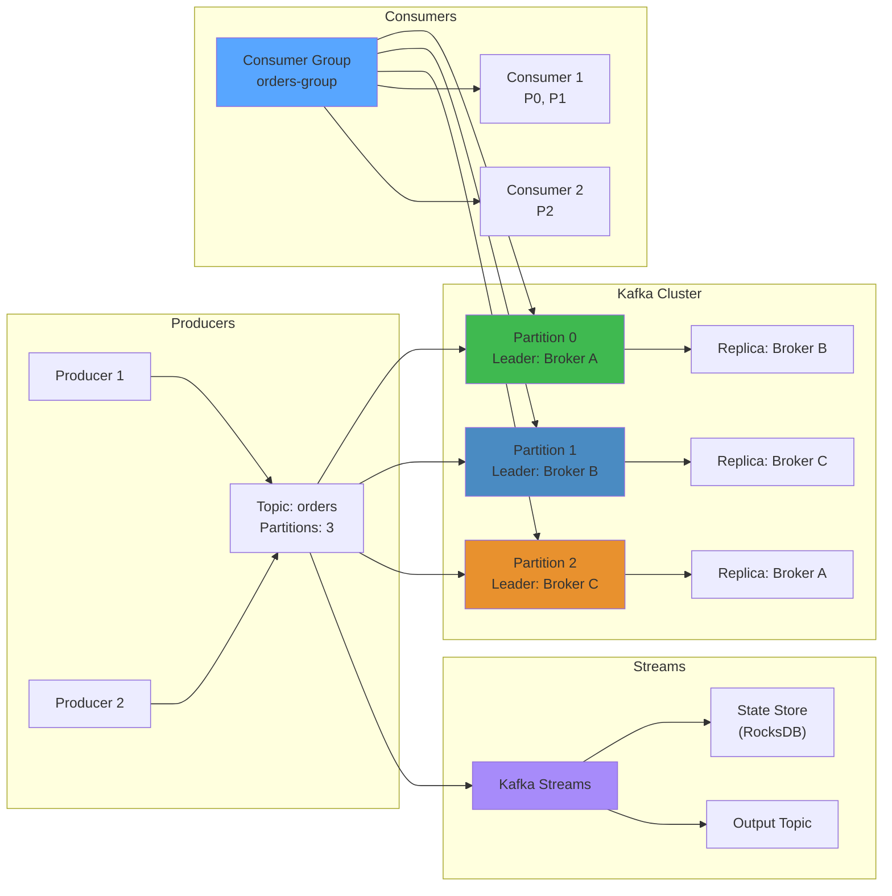

# 🚀 Kafka & Distributed Streaming in Java — Production Engineering




**Related**: [Multithreading](04-multithreading.md) · [Java Memory Model](06-java-memory-gc.md) · [Performance Tuning](19-performance-tuning.md)

---

## Table of Contents


- [Core Concepts](#core-concepts)
- [1. Kafka Architecture](#1-kafka-architecture)
- [2. Consumer Groups & Rebalancing](#2-consumer-groups--rebalancing)
- [3. Exactly-Once Processing](#3-exactly-once-processing)
- [4. Kafka Streams Application](#4-kafka-streams-application)
- [5. Production Patterns](#5-production-patterns)
- [6. Performance Tuning](#6-performance-tuning)
- [7. Failure Scenarios](#7-failure-scenarios)
- [8. Debugging & Monitoring](#8-debugging--monitoring)

---

## 🧭 Core Concepts


### Kafka: Distributed Event Store


```
Think of Kafka as an airline reservation system:

Traditional approach:
┌─────────────┐        ┌─────────────┐
│ Reservation │──────→ │   Payment   │  If fails → lost!
│   Service   │        │   Service   │
└─────────────┘        └─────────────┘

With Kafka (event log):
┌──────────────┐     ┌──────────────────────────┐
│ Reservation  │────→│  Kafka Event Log         │
│  Service     │     │  ┌──────────────────────┐│
└──────────────┘     │  │ ReservationMade {... }││
                     │  │ ReservationMade {... }││
                     │  │ PaymentProcessed {.. }││
                     │  │ ...                   ││
                     │  └──────────────────────┘│
                     └──────────────────────────┘
                             │
              ┌──────────────┼──────────────┐
              ▼              ▼              ▼
        ┌──────────┐  ┌──────────┐  ┌──────────┐
        │ Payment  │  │Analytics │  │Notif     │
        │ Service  │  │ Service  │  │ Service  │
        └──────────┘  └──────────┘  └──────────┘

Benefits:
✓ Each service reads at own pace
✓ Service can replay history
✓ No direct coupling
✓ Fault-tolerant (events persisted)
```

### Mental Model: Kafka Topics


```
Topic = Append-only log file (distributed)

┌─────────────────────────────────────────┐
│ Topic: user-events                      │
├─────────────────────────────────────────┤
│ Offset 0: UserSignedUp {id: 1, ...}    │
│ Offset 1: UserSignedUp {id: 2, ...}    │
│ Offset 2: UserEmailVerified {id: 1}    │
│ Offset 3: UserLoggedIn {id: 2}         │
│ Offset 4: UserSignedUp {id: 3, ...}    │
│ Offset 5: UserLoggedIn {id: 1}         │
│           ↑                             │
│      (newest message)                  │
└─────────────────────────────────────────┘

Partitions distribute load:

Topic: user-events (3 partitions)
┌──────────────────┐
│ Partition 0      │  Offset 0, 3, 6, 9...
│ [msg0][msg3][msg6]│
└──────────────────┘
┌──────────────────┐
│ Partition 1      │  Offset 1, 4, 7, 10...
│ [msg1][msg4][msg7]│
└──────────────────┘
┌──────────────────┐
│ Partition 2      │  Offset 2, 5, 8, 11...
│ [msg2][msg5][msg8]│
└──────────────────┘

Consumer groups:
┌─────────────────────────────────────┐
│ Consumer Group: analytics-service   │
├─────────────────────────────────────┤
│ Consumer-1 → Partition 0            │
│ Consumer-2 → Partition 1            │
│ Consumer-3 → Partition 2            │
└─────────────────────────────────────┘
(each consumer gets exclusive partition)
```

---

## 1. Kafka Architecture


### Cluster Components


```
┌─────────────────────────────────────────────┐
│         Kafka Broker Cluster                │
│  (replicated, fault-tolerant, distributed)  │
├─────────────────────────────────────────────┤
│                                             │
│  ┌──────────────┐   ┌──────────────┐      │
│  │ Broker 1     │   │ Broker 2     │      │
│  │  ┌────────┐  │   │  ┌────────┐  │      │
│  │  │ Part-0 │  │   │  │ Part-0 │  │      │
│  │  │(leader)│  │   │  │(replica)   │      │
│  │  └────────┘  │   │  └────────┘  │      │
│  │  ┌────────┐  │   │  ┌────────┐  │      │
│  │  │ Part-1 │  │   │  │ Part-1 │  │      │
│  │  │(replica)  │   │  │(leader)│  │      │
│  │  └────────┘  │   │  └────────┘  │      │
│  └──────────────┘   └──────────────┘      │
│                                             │
│  ┌──────────────┐                          │
│  │ Broker 3     │                          │
│  │  ┌────────┐  │                          │
│  │  │ Part-0 │  │ (replica)                │
│  │  └────────┘  │                          │
│  │  ┌────────┐  │                          │
│  │  │ Part-1 │  │ (replica)                │
│  │  └────────┘  │                          │
│  └──────────────┘                          │
└─────────────────────────────────────────────┘
         │
         │ (coordinates)
         ▼
┌─────────────────────┐
│   ZooKeeper/Kraft   │
│  Metadata, Leader   │
│  Election, Config   │
└─────────────────────┘

Write flow (replication):
1. Producer sends message to broker
2. Leader partition persists (WAL)
3. Replicas fetch and replicate
4. After replica quorum acknowledges
5. Producer gets ACK (if acks=all)

Durability: Write to disk (fsync)
Replication: Multiple copies
Consistency: All in-sync replicas must have message
```

### Topic Partition Concept


```
Why partitions? Parallelism!

Single partition (sequential):
Producer → ┌──────────────┐     Consumer (1 only)
           │ Partition    │  → reads sequentially
           │ (sequential) │     O(1) latency
           └──────────────┘

Multiple partitions (parallel):
Producer 1 → ┌──────────────┐  
             │ Partition 0  │ → Consumer 1 (parallel)
Producer 2 → ├──────────────┤
             │ Partition 1  │ → Consumer 2 (parallel)
Producer 3 → ├──────────────┤
             │ Partition 2  │ → Consumer 3 (parallel)
             └──────────────┘

Result: 3 consumers processing in parallel
        Throughput = sum of all consumer throughput

Partitioning key decides which partition:
partition = hash(key) % num_partitions

Key = "user:123"
hash(key) % 3 = partition 1
All events for user:123 go to partition 1
(preserves ordering per key)
```

---

## 2. Consumer Groups & Rebalancing


### Consumer Group Coordination


```
Group membership: managed by broker

Consumer Group: order-fulfillment
┌──────────────────────────────┐
│ Group Coordinator (broker)   │
│ Maintains membership list    │
│ Detects failures            │
│ Triggers rebalancing        │
└──────────────────────────────┘

Members:
Consumer-1 → ┌─────────────────┐
             │ Member metadata │
             │ subscribed topics
             │ instance_id     │
             └─────────────────┘

Consumer-2 → ┌─────────────────┐
             │ Member metadata │
             │ subscribed topics
             │ instance_id     │
             └─────────────────┘
```

### Rebalancing Trigger & Process


```
Trigger: Consumer added/removed

Timeline: order-fulfillment group

T0: Active state
    Consumer-1 → Partition 0
    Consumer-2 → Partition 1
    Consumer-3 → Partition 2

T1: Consumer-2 crashes!
    Coordinator detects (heartbeat timeout)
    Group state → REBALANCING

T2: Rebalance protocol (GEN2)
    1. Revoke: Each consumer stops, commits offset
    2. Join: Remaining consumers rejoin
    3. Assign: Leader assigns partitions
    4. Sync: Consumers get new assignments

T3: New state (2 consumers, 3 partitions)
    Consumer-1 → Partition 0, 1
    Consumer-3 → Partition 2
    (Consumer-1 processes 2x messages)

Duration: ~few seconds
Impact: Pause processing, messages not consumed
Cost: Network, CPU, latency impact
```

**Stop-the-World Rebalancing:**

```java
// Problem: Rebalancing = all consumers pause!

ProducerThread:
  kafka.produce() → fast (< 1ms)

ConsumerThread (normal):
  T0: poll() → 100 messages (normal)
  T1: [REBALANCING - waiting...]
  T2: poll() → 0 messages (waiting...)
  T3: [REBALANCING - complete]
  T4: poll() → 100 messages (normal)

Impact on service:
- Fetch latency spikes (1000x)
- Throughput drops to 0
- If timeout → cascading crashes

Solution (Kafka 2.4+): Cooperative rebalancing
- Incremental partition movement
- Some consumers keep processing
- Faster rebalance (< 1sec vs 5sec)

Configuration:
properties.setProperty(ConsumerConfig.PARTITION_ASSIGNMENT_STRATEGY_CONFIG,
    "org.apache.kafka.clients.consumer.CooperativeStickyAssignor");
```

---

## 3. Exactly-Once Processing


### Semantics Spectrum


```
At-Most-Once: Can lose messages
  - Fast (no acks needed)
  - Use: non-critical logs
  
Example:
  1. Consume message
  2. Commit offset
  3. Process message
  4. If crash between 2-3: message lost!

At-Least-Once: Can duplicate
  - Slower (acks + retry)
  - Use: most services
  
Example:
  1. Consume message
  2. Process message
  3. Commit offset
  4. If crash between 2-3: message reprocessed!
  
Exactly-Once: No loss, no dupe (hard!)
  - Complex (transactions + idempotency)
  - Use: financial transactions
  
Example (Two-Phase Commit):
  1. Consume message (remember offset)
  2. Atomically:
     - Process message
     - Commit offset to kafka
     - Write to sink
  3. All succeed or all fail (no partial)
```

### Implementing Exactly-Once


```java
// Producer: idempotent writes

KafkaProducer<String, String> producer = 
    new KafkaProducer<>(properties);
    
// Idempotent producer prevents duplication
// (KIP-98)
properties.setProperty("enable.idempotence", "true");
// Kafka deduplicates at broker level
// Producer retries transparently

// Consumer: transactional consumption

Consumer<String, String> consumer = 
    new KafkaConsumer<>(properties);

String transactionId = "order-" + instanceId;
producer.initTransactions();

while (true) {
    ConsumerRecords<String, String> records = 
        consumer.poll(Duration.ofSeconds(1));
    
    try {
        producer.beginTransaction();
        
        for (ConsumerRecord<String, String> record : records) {
            String processedValue = process(record.value());
            
            // Write output back to kafka
            // in same transaction
            producer.send(new ProducerRecord<>(
                outputTopic,
                record.key(),
                processedValue
            ));
        }
        
        // Commit both:
        // 1. Output writes
        // 2. Consumed offset
        producer.commitTransaction();
        
    } catch (Exception e) {
        producer.abortTransaction();
        // On next poll: same messages reprocessed
    }
}
```

**Idempotency Requirements:**

```
Sink must handle duplicates!

✅ Idempotent operations:
   UPDATE user SET balance = 1000 WHERE id = 123
   (same value, no harm)
   
❌ Non-idempotent operations:
   UPDATE user SET balance = balance + 100 WHERE id = 123
   (duplicate run = 200 instead of 100!)
   
Solution: Idempotency key

public void processOrder(Order order) {
    String idempotencyKey = order.getOrderId();
    
    // Check if already processed
    if (alreadyProcessed(idempotencyKey)) {
        return;  // Skip reprocessing
    }
    
    processTheOrder(order);
    markAsProcessed(idempotencyKey);
}
```

---

## 4. Kafka Streams Application


### Topology Pattern


```
Stream topology = DAG of processors

Source → Filter → Map → Aggregate → Sink
         (Partition 0, 1, 2, ...)


public class OrderAnalyticsApp {
    public static void main(String[] args) {
        Properties props = new Properties();
        props.put(StreamsConfig.APPLICATION_ID_CONFIG, "order-analytics");
        props.put(StreamsConfig.BOOTSTRAP_SERVERS_CONFIG, "localhost:9092");
        
        StreamsBuilder builder = new StreamsBuilder();
        
        // Source: read from Kafka topic
        KStream<String, Order> orders = builder.stream(
            "orders",
            Consumed.with(Serdes.String(), orderSerde)
        );
        
        // Process: filter expensive orders
        KStream<String, Order> expensive = orders
            .filter((key, order) -> order.getTotal() > 1000);
        
        // Transform: extract key info
        KStream<String, OrderEvent> events = expensive
            .mapValues(order -> new OrderEvent(
                order.getId(),
                order.getCustomerId(),
                order.getTotal()
            ));
        
        // Aggregate: count by customer
        KTable<String, Long> orderCounts = events
            .groupByKey()
            .count(Materialized.as("order-counts"));
        
        // Sink: write results
        expensive.to("expensive-orders",
            Produced.with(Serdes.String(), orderSerde)
        );
        
        // Sink: write aggregation
        orderCounts.toStream()
            .to("customer-order-counts",
                Produced.with(Serdes.String(), Serdes.Long())
            );
        
        // Run the topology
        KafkaStreams streams = new KafkaStreams(
            builder.build(), props
        );
        
        streams.start();
        
        Runtime.getRuntime().addShutdownHook(
            new Thread(streams::close)
        );
    }
}
```

### Stateful Operations


```
Types of state:

1. Stateless: filter, map, flatMap
   (no memory between events)
   
2. Stateful: aggregate, reduce, join
   (remembers past events)

State store = local cache

order-fulfillment-state-store
┌──────────────────────────────┐
│ Customer: 123                │
│ ├─ Total Orders: 5          │
│ ├─ Lifetime Value: $5000    │
│ └─ Last Order: 2024-01-15   │
├──────────────────────────────┤
│ Customer: 456                │
│ ├─ Total Orders: 2          │
│ ├─ Lifetime Value: $800     │
│ └─ Last Order: 2024-01-10   │
└──────────────────────────────┘

Backing store: RocksDB (embedded)
Memory: In-heap + disk
Changelog topic: Replicates state changes
Recovery: Replay changelog on restart
```

---

## 5. Production Patterns


### Pattern: Event Sourcing


```
Store only immutable events, derive state

┌──────────────────────────────────┐
│ Kafka Event Log (source of truth)│
├──────────────────────────────────┤
│ OrderCreated {id:1, amount:100} │
│ PaymentProcessed {id:1}         │
│ OrderShipped {id:1}             │
│ OrderDelivered {id:1}           │
└──────────────────────────────────┘

Derived views (recreate from events):

Snapshot 1: SQL database
OrderStatus table:
│ id │ status      │ amount │
│ 1  │ DELIVERED   │ 100    │

Snapshot 2: Elasticsearch
Index: orders
{
  "_id": "1",
  "status": "DELIVERED",
  "amount": 100,
  "events": [...]
}

Snapshot 3: Cache (Redis)
order:1 = {status: "DELIVERED", amount: 100}

All derived from same event log!
```

### Pattern: CQRS (Command Query Responsibility Segregation)


```
Separation: Write model vs Read model

Write path (Command):
┌─────────┐     ┌───────────┐     ┌──────────┐
│ Client  │────→│ Write API │────→│ Kafka    │
│ (order) │     │ (atomic)  │     │ (events) │
└─────────┘     └───────────┘     └──────────┘

Read path (Query):
┌─────────┐     ┌───────────┐     ┌──────────┐
│ Client  │────→│ Read API  │────→│ Cache    │
│ (view)  │     │ (fast)    │     │ (Redis)  │
└─────────┘     └───────────┘     └──────────┘
                                    (populated
                                     from Kafka
                                     changelog)

Benefits:
- Write model optimized for consistency
- Read model optimized for query speed
- Eventual consistency between them
```

---

## 6. Performance Tuning


### Throughput Optimization


```
Goals: Maximize messages/second

Bottleneck #1: Partition count
┌──────────────────────────────────┐
│ Topic config                     │
│ partitions = 3                   │
│ replication_factor = 3           │
└──────────────────────────────────┘

Consumer group: 3 consumers
Each consumer → 1 partition
Total parallelism = 3 consumers

Add 6 more partitions:
Now: 9 consumers can work in parallel!
Result: 3x throughput

General rule: partitions ≥ max consumers needed

Bottleneck #2: Batch size
KafkaConsumer poll():
┌──────────────────────┐
│ fetch.max.bytes      │ Default: 52MB
│ fetch.min.bytes      │ Default: 1 byte
│ fetch.max.wait.ms    │ Default: 500ms
└──────────────────────┘

Small batches (1KB): High latency, low throughput
Large batches (1MB): Low latency, high throughput
Trade-off: Batch size vs latency

Tuning:
consumer.properties.put("fetch.max.bytes", "10485760"); // 10MB
consumer.properties.put("fetch.min.bytes", "1024");     // 1KB min
consumer.properties.put("fetch.max.wait.ms", "1000");   // 1sec wait

Bottleneck #3: Compression
┌─────────────────────────────────┐
│ compression.type = snappy       │ Default: none
│ (or lz4, gzip, zstd)           │
└─────────────────────────────────┘

Before: 100 messages, 1MB each = 100MB payload
After (snappy): ~10MB (10x compression!)
Network: 100MB → 10MB (faster!)
CPU: +10% for compression

Usually worth it if network is bottleneck.
```

---

## 7. Failure Scenarios


### Scenario: Consumer Lag Explosion


```
Symptom: Consumer lag growing unbounded
 
Monitoring shows:
consumer_lag_sum = 10M messages (increasing!)
consumer_lag_max_offset_lag = 20M

Root cause investigation:

1. Check consumer throughput
   ./kafka-consumer-groups.sh --describe --group my-group
   
   Output:
   GROUP       TOPIC       PARTITION  LAG
   my-group    orders      0          5M
   my-group    orders      1          3M
   my-group    orders      2          2M

2. Identify slow partition (partition 0)

3. Check consumer logs
   2024-01-15 14:32:01 Slow processing: 100ms per message
   (usually caused by: blocking I/O, external API call, GC pause)

4. Profile CPU/Memory
   jstack shows: processing thread blocked on HTTP request
   
   Code:
   for (ConsumerRecord record : records) {
       String result = callSlowAPI();  // 100ms!
       save(result);
   }

5. Fix: Make async
   for (ConsumerRecord record : records) {
       callSlowAPIAsync()  // Non-blocking
           .thenAccept(result -> save(result));
   }
   
   Now: 10 concurrent requests instead of 1 at a time!
   Throughput: 10x improvement
```

### Scenario: Rebalance Storm


```
Symptom: Repeated rebalancing, service unavailable

Logs:
[main] Revoked TopicPartition(topic=orders, partition=0)
[main] Revoked TopicPartition(topic=orders, partition=1)
...
[main] Assigned TopicPartition(topic=orders, partition=0)
[main] Assigned TopicPartition(topic=orders, partition=1)
[main] Revoked TopicPartition(topic=orders, partition=0)
[main] Revoked TopicPartition(topic=orders, partition=1)

(This repeats every 30 seconds!)

Root cause: Consumer crashing during rebalance

Timeline:
1. Rebalance starts
2. Consumer threads pause processing
3. But slow processor takes 60+ seconds
4. Heartbeat timeout (default 30sec)
5. Consumer marked dead
6. Rebalance starts again (goto 1)

Fix: Increase heartbeat timeout
consumer.properties.put(
    "session.timeout.ms", "60000"  // 60 seconds
);
consumer.properties.put(
    "heartbeat.interval.ms", "10000"  // 10 seconds
);

Or: Fix slow processing (async, parallelize)
```

---

## 8. Debugging & Monitoring


### Essential Metrics


```
Key metrics for each consumer group:

1. Consumer Lag
   current_offset = 100 (consumer read up to here)
   log_end_offset = 150 (latest message in topic)
   lag = 150 - 100 = 50
   
   Healthy: lag < 1000
   Warning: lag > 10000
   Critical: lag > 100000

2. Throughput
   messages_processed_per_second
   
   Healthy: > 1000 msg/sec
   Check: if lag is growing + throughput low

3. Processing Latency
   time_from_produce_to_consume
   
   Healthy: < 1 second
   Target: < 100ms

4. Rebalance Frequency
   rebalances_per_hour
   
   Healthy: 0 (never)
   If > 1: consumer crashing
```

### Debug Commands


```bash
# List consumer groups
kafka-consumer-groups.sh --bootstrap-server localhost:9092 --list

# Describe group lag
kafka-consumer-groups.sh \
  --bootstrap-server localhost:9092 \
  --group order-fulfillment \
  --describe

# Reset consumer offset (dangerous!)
kafka-consumer-groups.sh \
  --bootstrap-server localhost:9092 \
  --group order-fulfillment \
  --reset-offsets --to-earliest --execute

# Monitor in real-time
watch 'kafka-consumer-groups.sh --bootstrap-server localhost:9092 --group order-fulfillment --describe'

# Check broker leadership
kafka-topics.sh \
  --bootstrap-server localhost:9092 \
  --topic orders \
  --describe
```

---

**Next**: [Redis Caching & Distributed Patterns](22-redis-caching.md) — Caching strategies, distributed locking, eventual consistency

## Related

- [Jvm Performance](18-performance-engineering/jvm-tuning/01-jvm-performance.md)
- [Cap Consistency](09-distributed-systems/01-cap-consistency.md)
- [Consensus Replication](09-distributed-systems/01-consensus-replication.md)
- [Consensus Raft](09-distributed-systems/02-consensus-raft.md)
- [Distributed Transactions](09-distributed-systems/02-distributed-transactions.md)
- [Distributed Caching](09-distributed-systems/03-distributed-caching.md)
