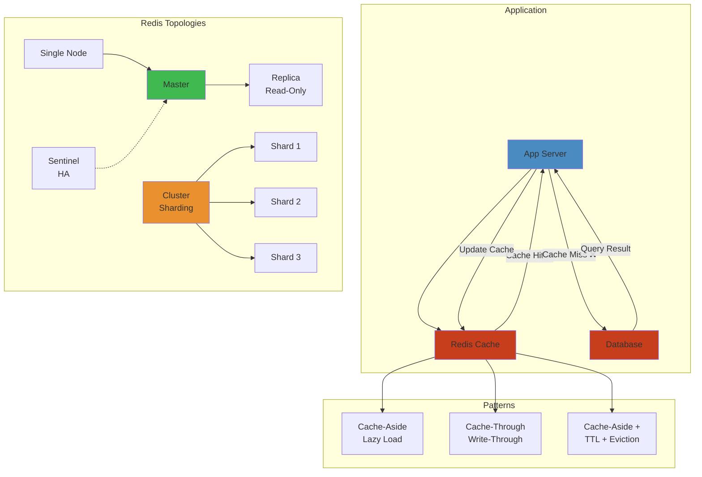

# 🔴 Redis Caching & Distributed Patterns — Production Engineering




**Related**: [Collections Framework](/03-backend/java/02-collections-framework.md) · [Spring Boot](/03-backend/java/12-spring-boot.md) · [Performance Tuning](/03-backend/java/19-performance-tuning.md)

---

## Table of Contents


- [Core Concepts](#core-concepts)
- [1. Caching Patterns](#1-caching-patterns)
- [2. Cache Invalidation](#2-cache-invalidation)
- [3. Distributed Locking](#3-distributed-locking)
- [4. Session Management](#4-session-management)
- [5. Rate Limiting](#5-rate-limiting)
- [6. Production Patterns](#6-production-patterns)
- [7. Failure Scenarios](#7-failure-scenarios)
- [8. Performance Tuning](#8-performance-tuning)

---

## 🧭 Core Concepts


### Why Cache?


```
Database query latency breakdown:

Without cache:
┌──────────────────────────────┐
│ API Request                  │
├──────────────────────────────┤
│ 1. Network latency   1ms     │
│ 2. Query parse       1ms     │
│ 3. Index lookup      2ms     │
│ 4. Row fetch         5ms     │
│ 5. Serialization     1ms     │
│ 6. Network return    1ms     │
├──────────────────────────────┤
│ Total: 11ms                  │
└──────────────────────────────┘

With cache:
┌──────────────────────────────┐
│ API Request                  │
├──────────────────────────────┤
│ 1. Network latency   0.5ms   │
│ 2. Redis GET         0.5ms   │
│ 3. Serialization     0.5ms   │
│ 4. Network return    0.5ms   │
├──────────────────────────────┤
│ Total: 2ms (5.5x faster!)    │
└──────────────────────────────┘

Added benefit:
- Reduces database load
- Enables horizontal scaling
- Smoother response times
```

### Cache Hierarchy


```
Response Time vs Size Trade-off:

L1: Local JVM Memory
    ┌─────────────────────┐
    │ HashMap (50MB)      │  Latency: < 1µs
    │ Thread-safe wrapper │  Access: In-process
    └─────────────────────┘
    
L2: Redis (in-memory distributed)
    ┌─────────────────────┐
    │ Redis node (5GB)    │  Latency: 0.5-2ms
    │ Network involved    │  Access: TCP/IP
    └─────────────────────┘
    
L3: Database (persistent)
    ┌─────────────────────┐
    │ PostgreSQL (100GB)  │  Latency: 5-50ms
    │ Disk I/O            │  Access: SQL query
    └─────────────────────┘

Multi-tier strategy:
Request → L1 (fast) → L2 (faster than L3) → L3 (source)

Hit rate impact:
L1 hit: 10µs response
L2 hit: 2ms response (200x slower)
L3 hit: 20ms response (10x slower than L2)

Typical hit rates:
L1 (JVM): 80-90% (local data)
L2 (Redis): 95-99% (after L1 miss)
L3 (DB): 1-5% (cold cache, new data)
```

---

## 1. Caching Patterns


### Cache-Aside (Lazy Loading)


```
Pattern: Application manages cache

Request flow:
1. Check cache
2. If miss: query database
3. Populate cache
4. Return to client

Code pattern:
public User getUser(Long userId) {
    // Try cache first
    User cached = cache.get("user:" + userId);
    if (cached != null) {
        return cached;  // Cache hit!
    }
    
    // Cache miss: query database
    User user = database.findById(userId);
    
    // Store in cache for future requests
    cache.put("user:" + userId, user, 1, TimeUnit.HOURS);
    
    return user;
}

Pros:
✓ Simple implementation
✓ Only caches accessed data
✓ Graceful degradation (cache failure = still works)

Cons:
✗ Cache misses cause latency spike (must query DB)
✗ Stale data possible (until expiration)
✗ Cache-miss thundering herd problem
```

### Write-Through


```
Pattern: Synchronous cache update

Write flow:
1. Write to cache
2. Write to database
3. Return to client

Code pattern:
public void updateUser(Long userId, User user) {
    // Update cache first
    cache.put("user:" + userId, user);
    
    // Then update database
    database.save(user);
}

Pros:
✓ Cache always consistent with database
✓ No stale data
✓ Read cache-hits are instant

Cons:
✗ Slower writes (2 operations)
✗ Both must succeed (complex error handling)
✗ Cache failure = write failure
```

### Write-Behind (Write-Back)


```
Pattern: Asynchronous cache update

Write flow:
1. Write to cache → return immediately
2. Background job → write to database
3. (async)

Code pattern:
public void updateUser(Long userId, User user) {
    // Write to cache (fast)
    cache.put("user:" + userId, user);
    
    // Queue for async write
    asyncQueue.add(() -> database.save(user));
    
    // Return immediately (before DB write!)
}

// Background thread:
while (true) {
    Task task = asyncQueue.take();
    task.execute();
}

Pros:
✓ Fast writes (cache only)
✓ Batch database writes (throughput)
✓ Decouple cache from database

Cons:
✗ Eventual consistency (lag)
✗ If cache crashes: data loss (before DB write)
✗ Complex error handling (retries, dead letters)

Trade-off: Risk vs Performance
Use when: Write latency is critical
        Data loss is acceptable (events, metrics)
Avoid when: Transactions matter (payments)
```

---

## 2. Cache Invalidation


### Strategies


```
Challenge: Keep cache fresh without being wrong

Strategy 1: Time-based expiration
┌──────────────────────────────┐
│ cache.put(key, value, 1h)    │
├──────────────────────────────┤
│ T=0min: value cached         │
│ T=30min: still cached        │
│ T=59min: still cached        │
│ T=60min: EXPIRED             │
│ T=60min: next access misses  │
└──────────────────────────────┘

Simple but: max 1 hour stale data!

Strategy 2: Event-based invalidation
Update user → publish UserUpdated event
Subscriber receives → invalidates cache
```

### TTL (Time To Live) Tuning


```
Factors:

1. Data mutability
   Rarely changes: 24 hours
   Sometimes changes: 1 hour
   Frequently changes: 5 minutes

2. Consistency requirements
   Financial data: 1 minute
   User profile: 1 hour
   Leaderboard: 1 second

3. Database update frequency
   If DB updated 10x/sec: 100ms TTL
   If DB updated 1x/hour: 30min TTL

Example tuning:
User profile (rarely changes):
  TTL = 1 hour
  ~60k users × 1MB = 60GB memory (fits)
  Hit rate: 95%+ (user logs in, reads profile many times)

Order status (frequently changes):
  TTL = 5 minutes
  ~100k active orders × 1KB = 100MB (fits)
  Hit rate: 80% (some checks miss updates)

Search results (varies):
  TTL = 1 minute
  Popular searches cached well
  Rare searches expire
```

### Cache Stampede Prevention


```
Problem: Multiple threads hammering DB on cache miss

Cache-Aside pattern:
┌─────────┐
│ Request │
└────┬────┘
     ├─→ Cache miss? (user:100)
     │
     ├─ Thread A: Query DB (50ms)
     ├─ Thread B: Query DB (50ms)
     ├─ Thread C: Query DB (50ms)
     └─ Thread D: Query DB (50ms)

Result: 4 simultaneous queries for same data!
(Thundering herd = DB load spike)

Solution 1: Lock during populate
public User getUser(Long id) {
    String key = "user:" + id;
    User cached = cache.get(key);
    if (cached != null) return cached;
    
    synchronized (lock(id)) {  // Per-key lock
        cached = cache.get(key);  // Double check
        if (cached != null) return cached;
        
        User user = database.findById(id);
        cache.put(key, user, 1, HOURS);
        return user;
    }
}

Only first thread queries DB, others wait for lock.

Solution 2: Probabilistic early refresh
if (expirationTime - now < 5minutes) {
    // Refresh in background before expiration
    executor.submit(() -> {
        User fresh = database.findById(id);
        cache.put(key, fresh);
    });
}

Return stale value while background refreshes.
Next request gets fresh value.

Result: No cache misses after warm-up!
```

---

## 3. Distributed Locking


### Use Case: Prevent Duplicate Processing


```
Scenario: Job runs on multiple servers, but must run once

Without lock:
┌──────────┐     ┌──────────┐
│ Server 1 │     │ Server 2 │
├──────────┤     ├──────────┤
│ Job fired│────→│ Job fired│
└──────────┘     └──────────┘
        │                │
        └────────┬───────┘
                 ▼
        ┌──────────────────┐
        │ DUPLICATED WORK! │
        │ Both processed   │
        │ same batch       │
        └──────────────────┘

With Redis lock:
Server 1:
  SET lock:batch-123 "server-1" NX EX 60
  → OK (acquired lock!)
  → Process batch

Server 2:
  SET lock:batch-123 "server-2" NX EX 60
  → NIL (lock held by server-1)
  → Wait/skip
```

### Redlock Implementation


```java
// Using Redisson library (recommended)

public class JobService {
    private final RedissonClient redissonClient;
    
    public void processJob() {
        RLock lock = redissonClient.getLock("job:daily-aggregate");
        
        try {
            // Wait up to 10 seconds to acquire lock
            if (lock.tryLock(10, TimeUnit.SECONDS)) {
                try {
                    // Lock acquired, do work
                    aggregateDailyMetrics();
                    
                } finally {
                    lock.unlock();  // Release lock
                }
            } else {
                // Another instance locked it, skip
                System.out.println("Job already running elsewhere");
            }
        } catch (InterruptedException e) {
            Thread.currentThread().interrupt();
        }
    }
}

// Or manual implementation:
public void processWithLock() {
    String lockKey = "job:process";
    String lockValue = UUID.randomUUID().toString();
    
    // Try to acquire
    Boolean acquired = redisTemplate.opsForValue()
        .setIfAbsent(lockKey, lockValue, Duration.ofSeconds(30));
    
    if (Boolean.TRUE.equals(acquired)) {
        try {
            // Lock acquired
            doWork();
        } finally {
            // Safe delete (only if we own the lock)
            if (lockValue.equals(redisTemplate.opsForValue().get(lockKey))) {
                redisTemplate.delete(lockKey);
            }
        }
    }
}
```

---

## 4. Session Management


### Sticky Sessions vs Shared Sessions


```
Traditional: Sticky sessions (in-memory on server)

Request 1 → ┌─────────────┐  Session stored
            │  Server A   │  in-memory
            │ (session)   │
            └─────────────┘

Request 2 → ┌─────────────┐  SAME session
            │  Server A   │  on same server
            │ (session)   │
            └─────────────┘

Problem: If Server A dies → session lost!
Fix required: Session replication (slow)

Modern: Shared sessions (Redis)

Request 1 → ┌─────────────┐     ┌────────────┐
            │  Server A   │────→│   Redis    │
            │             │     │ (session)  │
            └─────────────┘     └────────────┘

Request 2 → ┌─────────────┐     ┌────────────┐
            │  Server B   │────→│   Redis    │
            │             │     │ (session)  │
            └─────────────┘     └────────────┘

Benefits:
✓ Load balancer can route to any server
✓ Server failure = session survives
✓ Horizontal scaling (add servers)
```

### Spring Session Configuration


```java
@Configuration
@EnableSpringHttpSession(maxInactiveIntervalInSeconds = 1800)  // 30 minutes
public class SessionConfig {
    
    @Bean
    public LettuceConnectionFactory connectionFactory() {
        return new LettuceConnectionFactory();
    }
}

// Usage:
@RestController
public class LoginController {
    
    @PostMapping("/login")
    public String login(HttpSession session, String username) {
        // Automatically stored in Redis
        session.setAttribute("user", username);
        return "logged in";
    }
    
    @GetMapping("/profile")
    public String profile(HttpSession session) {
        // Retrieved from Redis across servers
        String user = (String) session.getAttribute("user");
        return "Welcome " + user;
    }
}

Behind the scenes:
1. @EnableSpringHttpSession creates SessionRepository
2. Each request updates session in Redis
3. TTL = maxInactiveInterval
4. Expired sessions auto-deleted
5. All servers see same session (transparent)
```

---

## 5. Rate Limiting


### Token Bucket Algorithm


```
Visual concept:

Bucket capacity: 100 tokens
Refill rate: 10 tokens/second

State over time:
T=0s:   ⊙⊙⊙⊙⊙⊙⊙⊙⊙⊙ (100 tokens)

Request 50 units:
T=0s:   ⊙⊙⊙⊙⊙ (50 tokens left)

Wait 1 second (10 tokens refilled):
T=1s:   ⊙⊙⊙⊙⊙⊙⊙⊙⊙⊙⊙⊙⊙⊙⊙⊙ (60 tokens)

Request 100 units:
T=1s:   DENIED (only 60 available)

Wait 4 seconds (40 tokens refilled):
T=5s:   ⊙⊙⊙⊙⊙⊙⊙⊙⊙⊙ (100 tokens, full bucket)

Request 100 units:
T=5s:   ⊙ (ACCEPTED, 0 tokens left)
```

### Redis Implementation


```java
// Using Guava (local) OR Bucket4j (distributed)

// Local rate limit (single server):
public class RateLimiter {
    private final Bucket bucket;
    
    public RateLimiter() {
        Bandwidth limit = Bandwidth.classic(100, Refill.intervally(10, Duration.ofSeconds(1)));
        bucket = Bucket4j.builder()
            .addLimit(limit)
            .build();
    }
    
    public boolean allowRequest() {
        return bucket.tryConsume(1);
    }
}

// Distributed rate limit (Redis):
@Component
public class DistributedRateLimiter {
    
    private final RedisTemplate<String, String> redis;
    
    public boolean allowRequest(String userId) {
        String key = "rate-limit:" + userId;
        long limit = 100;  // 100 requests
        long window = 60;  // per 60 seconds
        
        Long current = redis.opsForValue()
            .increment(key);
        
        if (current == 1) {
            // First request in window
            redis.expire(key, window, TimeUnit.SECONDS);
        }
        
        return current <= limit;
    }
}

// Sliding window approach:
// More accurate but slightly more overhead
public boolean allowSlidingWindow(String userId) {
    String key = "requests:" + userId;
    long now = System.currentTimeMillis();
    long window = 60000;  // 60 seconds
    
    // Remove old entries (> 1 minute ago)
    redis.opsForZSet()
        .removeRangeByScore(key, 0, now - window);
    
    // Count requests in window
    long count = redis.opsForZSet()
        .size(key);
    
    if (count < 100) {
        // Add current request
        redis.opsForZSet()
            .add(key, now, now);
        return true;
    }
    
    return false;
}
```

---

## 6. Production Patterns


### Circuit Breaker (Fault Tolerance)


```
Pattern: Prevent cascading failures

States:
┌────────────────────────────────────────┐
│ CLOSED (normal)                        │
│ ✓ Requests pass through                │
│ ✗ If failure rate > threshold:         │
│    → Transition to OPEN                │
└────────────────────────────────────────┘
         │
         │ (failure threshold exceeded)
         ▼
┌────────────────────────────────────────┐
│ OPEN (broken)                          │
│ ✗ Fast-fail (no requests sent)        │
│ ✓ Periodically try recovery            │
│    → Transition to HALF-OPEN           │
└────────────────────────────────────────┘
         │
         │ (timeout)
         ▼
┌────────────────────────────────────────┐
│ HALF-OPEN (recovering)                 │
│ ✓ Limited requests attempt             │
│ ✓ If successful:                       │
│    → Transition to CLOSED              │
│ ✗ If fails:                            │
│    → Transition back to OPEN           │
└────────────────────────────────────────┘

Example: Redis failure handling

@Service
public class UserService {
    private final RedisTemplate<String, User> redis;
    
    @CircuitBreaker(name="redis", fallbackMethod="fallback")
    public User getUser(Long id) {
        try {
            return redis.opsForValue().get("user:" + id);
        } catch (RedisConnectionException e) {
            // Circuit opens after X failures
            // Fast-fail other requests
            throw e;
        }
    }
    
    public User fallback(Long id, Exception e) {
        // Fallback: query database directly (slow)
        return database.findById(id);
    }
}
```

---

## 7. Failure Scenarios


### Scenario: Cache Corruption


```
Symptom: Users report wrong data, cache has stale/corrupt values

Root cause investigation:

1. Check cache hit rate
   redis-cli INFO stats | grep hits
   
   If hit rate: 99.9% → stale data is being served!

2. Check for serialization issues
   Old code:
   User u = jsonMapper.readValue(cached, User.class);
   
   Issue: Field renamed in new version
          Old cache has old field names
          Deserialization fails → null fields!

3. Check for partial updates
   cache.put("user:1", user);  // Entire user
   but if only email changed:
   cache.hset("user:1", "email", newEmail);  // Partial!
   
   Later read:
   user = cache.get("user:1");  // Gets old data!
   (Hash vs String operations mixed!)

Fix:
- Invalidate cache on schema changes
- Use versioning: "user:1:v2"
- Validate deserialized objects
- Clear cache on deployment
```

### Scenario: Memory Exhaustion


```
Symptom: Redis memory grows to max, evicts data

Monitoring:
redis-cli INFO memory
memory_usage: 12GB (max: 12GB)
evicted_keys: 1000000 (growing)

Root cause:
1. No TTL on keys
   cache.put("user:" + id, user);  // No expiration!
   
2. Memory leak (garbage data)
   cache.putIfAbsent("temp:" + sessionId, large_data);
   // Session ends but cache key never deleted!

Fix:
Always set TTL:
cache.put("user:" + id, user, 1, HOURS);

Use eviction policy:
maxmemory-policy = allkeys-lru
(Delete least-recently-used when full)

Monitor keys:
redis-cli --scan | wc -l  (total keys)
redis-cli memory doctor  (memory usage analysis)
```

---

## 8. Performance Tuning


### Connection Pooling


```
Default: 1 connection per client

Thread pool overhead:
┌────────┬────────┬────────┐
│ Thread │ Thread │ Thread │  Each thread
│   (1)  │   (2)  │   (3)  │  needs connection
└──┬─────┴──┬─────┴──┬─────┘
   │        │        │
   └────┬───┴────┬───┘
        ▼        ▼
    ┌─────────────┐
    │ Redis (1ms) │  Bottleneck!
    └─────────────┘

With pooling:
┌────────┬────────┬────────┐
│ Thread │ Thread │ Thread │
│   (1)  │   (2)  │   (3)  │
└──┬─────┴──┬─────┴──┬─────┘
   │        │        │
   └────┬───┴────┬───┘
        ▼        ▼
    ┌──────────────────┐
    │ Pool (10 conns)  │
    │ └─────────────┐  │
    │ └─────────────┘  │
    │ └─────────────┐  │
    └──────────────────┘
        │
        ▼
    ┌─────────────┐
    │ Redis (1ms) │  Parallel!
    └─────────────┘

Configuration:
spring.redis.lettuce.pool.max-active=20
spring.redis.lettuce.pool.max-idle=10
spring.redis.lettuce.pool.min-idle=5
spring.redis.timeout=2000
```

### Pipelining (Batch Commands)


```
Without pipelining (N round trips):

Command 1: GET user:1 → wait 1ms → response
Command 2: GET user:2 → wait 1ms → response
Command 3: GET user:3 → wait 1ms → response
Total: 3ms (serial)

With pipelining (1 round trip):

Send batch:
  GET user:1
  GET user:2
  GET user:3
  (all in one request)

Wait 1ms → all 3 responses
Total: 1ms (parallel!)

Implementation:
SessionCallback<List<Object>> result = redisTemplate.executePipelined(
    (RedisCallback<Object>) connection -> {
        connection.get("user:1".getBytes());
        connection.get("user:2".getBytes());
        connection.get("user:3".getBytes());
        return null;
    }
);
```

---

**Next**: [Distributed Systems Patterns](/03-backend/java/23-distributed-systems.md) — Consensus, CAP theorem, eventual consistency

## Related

- [Jvm Performance](/18-performance-engineering/jvm-tuning/01-jvm-performance.md)
- [Cap Consistency](/09-distributed-systems/01-cap-consistency.md)
- [Consensus Replication](/09-distributed-systems/01-consensus-replication.md)
- [Consensus Raft](/09-distributed-systems/02-consensus-raft.md)
- [Distributed Transactions](/09-distributed-systems/02-distributed-transactions.md)
- [Distributed Caching](/09-distributed-systems/03-distributed-caching.md)
