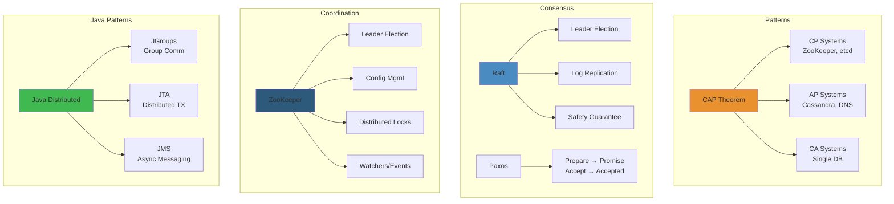

# 🌐 Distributed Systems Engineering — Java Production Patterns




**Related**: [Kafka Streaming](/03-backend/java/21-kafka-streaming.md) · [Redis Caching](/03-backend/java/22-redis-caching.md) · [Concurrency Deep Dive](/03-backend/java/15-concurrency-deep-dive.md)

---

## Table of Contents


- [Foundational Concepts](#foundational-concepts)
- [1. CAP Theorem](#1-cap-theorem)
- [2. Consistency Models](#2-consistency-models)
- [3. Consensus Algorithms](#3-consensus-algorithms)
- [4. Distributed Transactions](#4-distributed-transactions)
- [5. Failure Modes](#5-failure-modes)
- [6. Architecture Patterns](#6-architecture-patterns)
- [7. Production Strategies](#7-production-strategies)

---

## 🧭 Foundational Concepts


### The Two Generals Problem


```
Problem: How to coordinate across unreliable network?

General A wants to attack at 9 AM
General B must attack at exact same time
(Network between them is unreliable)

Scenario 1:
A: sends "attack at 9 AM"
   → packet lost!
   → B never receives
   → A attacks, B doesn't → FAIL

Scenario 2:
A: sends "attack at 9 AM"
   → B receives, sends ACK
   → ACK lost!
   → B thinks A didn't commit
   → B doesn't attack → FAIL

Scenario 3:
A: sends "attack at 9 AM"
   → B receives, sends ACK
   → A gets ACK, attacks
   → B never received original! (network hiccup)
   → B doesn't attack → FAIL

Conclusion: Impossible to guarantee coordination
           over unreliable network!

Practical solution: Accept eventual consistency
                    Use Byzantine Fault Tolerance
                    Or accept asymmetric failure modes
```

### Types of Network Failures


```
1. Packet loss (some messages never arrive)
   Timeout: How long to wait before retrying?
   Risk: Retry too soon → duplicate work
         Retry too late → cascading failures

2. Network partition (complete isolation)
   ┌─────────────┐         ┌─────────────┐
   │  Cluster A  │ ════════ │  Cluster B  │
   │  (3 nodes)  │         │  (2 nodes)  │
   └─────────────┘         └─────────────┘
   
   Both clusters think other is dead!
   → Split brain (contradiction!)

3. Byzantine failure (nodes lie/contradict)
   ┌─────────────────────────────────┐
   │ Node 1: "x = 5"                 │
   │ Node 2: "x = 10"                │
   │ Node 3: "x = 15"                │
   └─────────────────────────────────┘
   
   Which is correct?
   Need quorum + voting
```

---

## 1. CAP Theorem


### The Triangle Trade-off


```
You can have ANY TWO of:

        ┌─────────────┐
        │ Consistency │  All nodes see same data
        │     (C)     │  (no stale reads)
        └──────┬──────┘
               │
      ┌────────┴────────┐
      ▼                 ▼
┌──────────────┐  ┌──────────────┐
│Availability  │  │ Partition    │
│    (A)       │  │ Tolerance(P) │
│All ops work  │  │ Survive      │
│no timeouts   │  │ network split│
└──────────────┘  └──────────────┘

Theorem: Can't have all 3!
Must choose: CA, CP, or AP

Example systems:

CA (Consistency + Availability):
- Traditional SQL databases
- Single data center
- If network fails → entire system down
- Example: MySQL

CP (Consistency + Partition Tolerance):
- MongoDB (strong consistency)
- Can survive network split
- But: some nodes become unavailable
- Example: If network split → minority cluster fails

AP (Availability + Partition Tolerance):
- Eventual Consistency (Cassandra, DynamoDB)
- All nodes stay available
- But: stale reads possible
- Example: Cache, CDN
```

### Real-World Example: Amazon DynamoDB (AP)


```
Configuration: 3 regions, eventual consistency

Normal operation (no network split):
Region US-EAST:    customer:1 = {name: "Alice"}
Region EU-WEST:    customer:1 = {name: "Alice"}
Region ASIA-PACIFIC: customer:1 = {name: "Alice"}

Update in US-EAST:
customer:1.name = "Alice→Alison"

US-EAST:    {name: "Alison"} ← updated
EU-WEST:    {name: "Alice"}  ← stale
ASIA:       {name: "Alice"}  ← stale

30ms later:
US-EAST:    {name: "Alison"} ← updated
EU-WEST:    {name: "Alison"} ← synced
ASIA:       {name: "Alison"} ← synced

Choice: Accept eventual consistency → Get high availability!

Java code:
DynamoDbClient client = DynamoDbClient.builder().build();

// Write (local)
PutItemRequest request = PutItemRequest.builder()
    .tableName("customers")
    .item(Map.of("id", AttributeValue.builder().s("1").build(),
                  "name", AttributeValue.builder().s("Alison").build()))
    .build();

client.putItem(request);  // Returns immediately
                          // Replication happens in background

// Read (may be stale)
GetItemRequest get = GetItemRequest.builder()
    .tableName("customers")
    .key(Map.of("id", AttributeValue.builder().s("1").build()))
    .consistentRead(false)  // Eventual consistency (AP)
    .build();

Map<String, AttributeValue> result = client.getItem(get).item();
// Might see "Alice" even though we just wrote "Alison"!
```

---

## 2. Consistency Models


### Read-Your-Own-Writes (RYOW)


```
Guarantee: After you write, you always read your writes

Scenario: Update user email

┌──────────────┐
│ User Service │
├──────────────┤
│ Write:       │
│ user.email = │
│ "new@..."    │
└──────┬───────┘
       │
       ├──→ Primary (US-EAST)
       │    ┌──────────────────┐
       │    │ email="new@..." │ ← written
       │    └──────────────────┘
       │
       └──→ Replica (EU-WEST)
           ┌──────────────────┐
           │ email="old@..." │ ← still syncing
           └──────────────────┘

User immediately reads:
  If reads from US-EAST: sees "new@..." ✓
  If reads from EU-WEST: sees "old@..." ✗

RYOW solution: sticky session
  - Route all user's requests to primary
  - Or wait for replication before returning

Java implementation:
@Service
public class UserService {
    
    public void updateEmail(Long userId, String newEmail) {
        // Write to primary
        userRepository.updateEmail(userId, newEmail);
        
        // Store in cache that we updated it
        sessionCache.put("user:" + userId + ":email", newEmail);
    }
    
    public String getEmail(Long userId) {
        // Check cache first (our recent write)
        String cached = sessionCache.get("user:" + userId + ":email");
        if (cached != null) return cached;
        
        // Fallback to database
        return userRepository.getEmail(userId);
    }
}
```

### Monotonic Read Consistency


```
Guarantee: Time always moves forward (no rollbacks)

Scenario: Reading user balance

T0: Read from replica → balance = $100
T1: Read from different replica → balance = $50 ✗ ROLLBACK!

User sees: $100 → $50 (went backwards!)

Solution: Sticky replica
  - Once read from replica A, always read from A
  - Or read from primary (most current)

Vector clocks track causality:
┌──────────────┬──────────────┬──────────────┐
│ Node A: [1]  │ Node B: [1]  │ Node C: [0]  │
│ balance=$100 │ balance=$100 │ balance=?    │
└──────────────┴──────────────┴──────────────┘

Update on Node A:
┌──────────────┐
│ Node A: [2]  │
│ balance=$50  │
└──────────────┘

When other nodes hear:
┌──────────────┬──────────────┬──────────────┐
│ Node A: [2]  │ Node B: [1]  │ Node C: [0]  │
│ (updated)    │ (stale)      │ (unknown)    │
└──────────────┴──────────────┴──────────────┘

Read from B then A:
B:[1]→A:[2]: progressing (monotonic) ✓
A:[2]→B:[1]: would require rollback ✗ REJECT
```

---

## 3. Consensus Algorithms


### Raft: Leader-Based Consensus


```
Goal: Cluster agrees on state changes despite failures

Leader Election:
┌──────────┐
│  Leader  │  ← heartbeats every 150ms
│ (Node 1) │
└──────┬───┘
       │
   ┌───┴────┐
   ▼        ▼
┌──────┐ ┌──────┐
│Foll-2│ │Foll-3│  ← followers
└──────┘ └──────┘

If leader fails:
Follower 2: no heartbeat for > 150ms
  → election timeout
  → become candidate
  → request votes
  → other followers vote
  → new leader elected

Log replication:
┌──────────────┐
│ Leader: [1,2]│  ← commit 1, 2
├──────────────┤
│ Follower-2:  │
│ [1,2]        │  ← replicated
├──────────────┤
│ Follower-3:  │
│ [1]          │  ← behind
└──────────────┘

Leader waits for quorum:
  1. Replicate to follower-2 ✓
  2. Replicate to follower-3 ✓
  3. Get ACK from both → commit

Guarantees:
- Safety: no data loss (committed data survives)
- Liveness: always has leader (except brief election)
- No Byzantine: honest nodes, unreliable network
```

### Practical: etcd (Go, but same principles)


```
Java client usage:

@Component
public class ConfigurationService {
    private final Client etcdClient;
    
    public void registerService(String serviceName, String address) {
        etcdClient.getLeaseClient().grant(Duration.ofSeconds(30)).get();
        
        // Use Raft-replicated store
        etcdClient.getKVClient().put(
            ByteSequence.from(serviceName, StandardCharsets.UTF_8),
            ByteSequence.from(address, StandardCharsets.UTF_8)
        ).get();
        
        // Guaranteed: written to leader + quorum
        // Survives node failures
    }
    
    public String discoverService(String serviceName) {
        GetResponse response = etcdClient.getKVClient().get(
            ByteSequence.from(serviceName, StandardCharsets.UTF_8)
        ).get();
        
        // Consistent read from leader
        return response.getKvs().get(0).getValue().toString();
    }
}
```

---

## 4. Distributed Transactions


### Two-Phase Commit (2PC)


```
Goal: Atomic transaction across multiple databases

Scenario: Transfer money (A→B)
- Debit account A (DB1)
- Credit account B (DB2)
Both must succeed or both fail!

Phase 1: Prepare (can you commit?)
┌─────────────────────────────────────────┐
│ Coordinator                              │
│ Requests: "prepare to debit $100 on A"  │
│           "prepare to credit $100 on B" │
└──────┬──────────────────────────┬───────┘
       │                          │
       ▼                          ▼
  ┌────────┐                ┌────────┐
  │ Bank A │ → ACK or ABORT │ Bank B │
  │ Locks  │ (hold lock)    │ Locks  │
  └────────┘                └────────┘

If any says NO: abort all

Phase 2: Commit (do it!)
Coordinator: "all said yes, commit!"
┌──────────────────────┐
│ Bank A: debit $100   │
│ Bank B: credit $100  │
│ Release locks        │
└──────────────────────┘

Guarantees:
✓ Atomic: all succeed or all fail
✓ Consistent: money neither created nor lost

Cost:
✗ Slow (2 round trips + locks)
✗ Deadlock prone
✗ Blocking (locks held during prepare)
✗ Doesn't work across data centers well
```

### Saga Pattern (Alternative)


```
Instead of 2PC: compensating transactions

Transfer $100 (A→B):

Step 1: Debit account A
  Status: pending
  A.balance -= 100
  
Step 2: Credit account B
  Status: pending
  B.balance += 100
  
Step 3: Mark as complete
  Status: completed

If Step 2 fails:
Step 4: Compensate (undo step 1)
  A.balance += 100 (refund)
  Status: compensated

Guarantees:
✓ Eventually consistent
✓ No locks (non-blocking)
✓ Works across systems/data centers
✗ Complex: need compensating logic
✗ Eventual: not immediately atomic

Java implementation:

@Service
public class TransferService {
    
    public void transfer(Long fromId, Long toId, BigDecimal amount) {
        try {
            // Step 1
            accountService.debit(fromId, amount);
            
            // Step 2
            try {
                accountService.credit(toId, amount);
            } catch (Exception e) {
                // Compensate step 1
                accountService.credit(fromId, amount);
                throw e;
            }
            
            // Step 3
            transactionLog.markComplete(fromId, toId, amount);
            
        } catch (Exception e) {
            transactionLog.markFailed(fromId, toId, amount);
            throw e;
        }
    }
}
```

---

## 5. Failure Modes


### Byzantine Generals Problem


```
System must work even when nodes lie

Scenario: 4 nodes voting on decision

Node 1: "YES"
Node 2: "YES"
Node 3: "YES"
Node 4: "NO" ← Byzantine (lying or broken)

Majority voting: 3/4 = YES (correct!)

But with 4 Byzantine nodes attacking 7 node cluster:
Node 1: "YES"
Node 2: "MAYBE"
Node 3: "YES"
Node 4: "NO"  ← Byzantine
Node 5: "NO"  ← Byzantine
Node 6: "YES"
Node 7: "NO"  ← Byzantine

Result: Contradiction! (4 vs 3)

Solution: Need 2f+1 nodes to tolerate f Byzantine
  f=1 (1 liar): need 3 nodes
  f=2 (2 liars): need 5 nodes
  f=4 (4 liars): need 9 nodes

Practical: Blockchain uses Byzantine Fault Tolerance
          Regular distributed systems assume honest nodes
```

### Network Partition Handling


```
System with 3 data centers (A, B, C)

Normal:
A ←→ B ← → C (all connected)

Network partition:
A ←→ B        C (isolated)
    └─────X

Partition healing: Who wins?

Strong consistency approach:
Quorum = 2/3 nodes

If A+B alive:
- Quorum has majority
- Can serve requests
- C is isolated, goes silent

If only C alive:
- Quorum requires 2 nodes
- C alone (1 node) < 2
- C cannot serve (fail-safe!)

Java example: Hazelcast cluster

@Configuration
public class HazelcastConfig {
    
    @Bean
    public Config hazelcastConfig() {
        Config config = new Config();
        config.setNetworkConfig(new NetworkConfig()
            .addAddress("node1:5701", "node2:5701", "node3:5701")
        );
        
        config.setPartitionGroupConfig(
            new PartitionGroupConfig()
                .setEnabled(true)  // Partition tolerance
                .setGroupType(PartitionGroupConfig.MemberGroupType.ZONE_AWARE)
        );
        
        return config;
    }
}
```

---

## 6. Architecture Patterns


### Bulkhead Pattern (Isolation)


```
Problem: One component failure crashes entire system

Without bulkheads:
┌─────────────────────────────────────┐
│ API Server                          │
├─────────────────────────────────────┤
│ Orders    │ Users    │ Payments     │
│ (fast)    │ (slow!)  │ (fast)       │
│ 10ms      │ 100ms    │ 10ms         │
└─────────────────────────────────────┘

If Users service is slow:
- All threads pile up waiting
- Orders requests also slow (share same threads)
- Server becomes sluggish for everything

With bulkheads (separate thread pools):
┌──────────────────────────────────────────┐
│ API Server                               │
├────────┬────────────┬────────────────────┤
│Orders  │Users      │Payments            │
│ThreadPool│ThreadPool│ThreadPool          │
│5 threads│10 threads│5 threads           │
│(isolated)│(isolated)│(isolated)          │
└────────┴────────────┴────────────────────┘

Users slow:
- Users queue: 10 threads busy
- Orders queue: still fast (separate pool)
- Payments queue: still fast (separate pool)

Java implementation:

@Service
public class UserService {
    
    // Separate thread pool for user operations
    private final ExecutorService userPool = 
        Executors.newFixedThreadPool(10);
    
    public CompletableFuture<User> getUser(Long id) {
        return CompletableFuture.supplyAsync(
            () -> database.findUser(id),
            userPool  // Isolated executor
        );
    }
}

@Service
public class OrderService {
    
    // Separate thread pool for order operations
    private final ExecutorService orderPool = 
        Executors.newFixedThreadPool(5);
    
    public CompletableFuture<Order> getOrder(Long id) {
        return CompletableFuture.supplyAsync(
            () -> database.findOrder(id),
            orderPool  // Isolated executor
        );
    }
}
```

### Retry with Exponential Backoff


```
Problem: Transient failures (network hiccup)

Naive retry: immediate retry
┌──────────┐
│ Request  │
└────┬─────┘
     │ fails
     ├──→ retry (immediately)
     │    fails again
     ├──→ retry (immediately)
     │    fails again
     └──→ retry

Result: Hammering server, cascading failure!

Exponential backoff: increase wait time

Attempt 1: fail
Attempt 2: wait 100ms → retry
Attempt 3: wait 200ms → retry
Attempt 4: wait 400ms → retry
Attempt 5: wait 800ms → retry

Result: Server recovers, succeeds!

Java implementation (Resilience4j):

@Service
public class ApiService {
    
    @Retry(name = "external-api",
           fallbackMethod = "fallback")
    @CircuitBreaker(name = "external-api")
    public String callExternalAPI(String url) {
        return httpClient.get(url);
    }
    
    public String fallback(String url, Exception e) {
        return "fallback response";
    }
}

// Configuration:
// resilience4j.retry.instances.external-api.maxAttempts=3
// resilience4j.retry.instances.external-api.waitDuration=100
// resilience4j.retry.instances.external-api.multiplier=2
```

---

## 7. Production Strategies


### Health Checks & Readiness


```
Three types of health:

1. Liveness: "Is process alive?"
   ✓ Process running
   ✓ JVM not crashed
   
   If not live → Kubernetes restart

2. Readiness: "Can I handle requests?"
   ✓ Dependencies available
   ✓ Warmed up
   ✓ Not overloaded
   
   If not ready → remove from load balancer

3. Startup: "Is initialization complete?"
   ✓ Database schema migrated
   ✓ Caches warmed
   ✓ Connections established
   
   Used for rolling deployments

Java implementation:

@Component
public class HealthIndicator extends AbstractHealthIndicator {
    
    private final DataSource dataSource;
    
    @Override
    protected void doHealthCheck(Health.Builder builder) {
        try {
            // Check database connection
            dataSource.getConnection().isValid(1);
            
            // Check cache availability
            cacheService.ping();
            
            builder.up()
                .withDetail("database", "connected")
                .withDetail("cache", "available");
        } catch (Exception e) {
            builder.down()
                .withException(e);
        }
    }
}
```

---

**Related Resources**:
- Martin Kleppmann: "Designing Data-Intensive Applications"
- MIT 6.824: Distributed Systems course
- The Phoenix Project: DevOps culture
- Release It!: Production architecture

## Related

- [Jvm Performance](/18-performance-engineering/jvm-tuning/01-jvm-performance.md)
- [Cap Consistency](/09-distributed-systems/01-cap-consistency.md)
- [Consensus Replication](/09-distributed-systems/01-consensus-replication.md)
- [Consensus Raft](/09-distributed-systems/02-consensus-raft.md)
- [Distributed Transactions](/09-distributed-systems/02-distributed-transactions.md)
- [Distributed Caching](/09-distributed-systems/03-distributed-caching.md)
