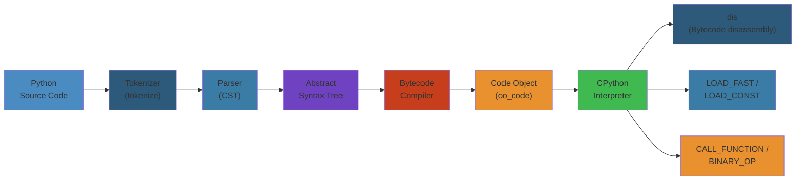

# Python Internals Deep Dive




## CPython Internals


### Bytecode Compilation


Python source code is compiled to bytecode before execution. The compilation pipeline:

```
Source Code -> Tokenizer -> Parser -> AST -> Compiler -> Bytecode -> Interpreter
```

```python
import dis
import sys

def fibonacci(n):
    if n <= 1:
        return n
    return fibonacci(n - 1) + fibonacci(n - 2)

dis.dis(fibonacci)
# Output shows bytecode instructions:
#   0 LOAD_FAST                0 (n)
#   2 LOAD_CONST               1 (1)
#   4 COMPARE_OP               1 (<=)
#   6 POP_JUMP_IF_FALSE       12
#   8 LOAD_FAST                0 (n)
#  10 RETURN_VALUE
#  12 LOAD_GLOBAL              0 (fibonacci)
#  14 LOAD_FAST                0 (n)
#  16 LOAD_CONST               1 (1)
#  18 BINARY_SUBTRACT
#  20 CALL_FUNCTION            1
#  22 LOAD_GLOBAL              0 (fibonacci)
#  24 LOAD_FAST                0 (n)
#  26 LOAD_CONST               2 (2)
#  28 BINARY_SUBTRACT
#  30 CALL_FUNCTION            1
#  32 BINARY_ADD
#  34 RETURN_VALUE
```

### Code Objects


Every code block in Python (function, module, class body) compiles to a code object:

```python
def make_adder(x):
    def add(y):
        return x + y
    return add

adder = make_adder(10)
code = adder.__code__

print(f"co_argcount: {code.co_argcount}")
print(f"co_nlocals: {code.co_nlocals}")
print(f"co_varnames: {code.co_varnames}")
print(f"co_consts: {code.co_consts}")
print(f"co_code: {code.co_code.hex()}")
print(f"co_names: {code.co_names}")
print(f"co_filename: {code.co_filename}")
print(f"co_name: {code.co_name}")
print(f"co_stacksize: {code.co_stacksize}")
print(f"co_flags: {code.co_flags}")
```

### Frame Objects


Frames represent execution state on the call stack:

```python
import sys

def inspect_frame():
    frame = sys._getframe()
    print(f"Current function: {frame.f_code.co_name}")
    print(f"File: {frame.f_code.co_filename}")
    print(f"Line: {frame.f_lineno}")

    # Walk the call stack
    f = frame
    depth = 0
    while f:
        print(f"  [{depth}] {f.f_code.co_name} at line {f.f_lineno}")
        f = f.f_back
        depth += 1

def outer():
    def inner():
        inspect_frame()
    inner()

outer()
```

### Interpreter Loop


The CPython main loop (`_PyEval_EvalFrameDefault`) is a massive switch statement that processes bytecode:

```c
// Simplified conceptual view of the interpreter loop
PyObject* _PyEval_EvalFrameDefault(PyThreadState *tstate, PyFrameObject *f, int throwflag) {
    for (;;) {
        opcode = *next_instr++;
        switch (opcode) {
            case LOAD_FAST:
                value = GETLOCAL(oparg);
                Py_INCREF(value);
                PUSH(value);
                break;
            case LOAD_CONST:
                value = GETITEM(consts, oparg);
                Py_INCREF(value);
                PUSH(value);
                break;
            case BINARY_ADD:
                right = POP();
                left = POP();
                result = PyNumber_Add(left, right);
                Py_DECREF(left);
                Py_DECREF(right);
                PUSH(result);
                break;
            // ... hundreds more opcodes
        }
    }
}
```

### Specialized Bytecode


CPython 3.11+ includes adaptive bytecode specialization:

```python
import dis

def add(a, b):
    return a + b

# First call: generic BINARY_OP
add(1, 2)
# After warmup: specialized BINARY_OP_ADD_FLOAT or BINARY_OP_ADD_INT
add(1.0, 2.0)

# Check for specialization bytecodes
dis.dis(add, adaptive=True)
```

---

## Memory Management


### Reference Counting


Every Python object has an `ob_refcnt` field. `Py_INCREF` and `Py_DECREF` manage it:

```python
import sys

class Tracked:
    pass

obj = Tracked()
print(f"Refcount after creation: {sys.getrefcount(obj) - 1}")

other = obj
print(f"Refcount after assignment: {sys.getrefcount(obj) - 1}")

lst = [obj]
print(f"Refcount after list append: {sys.getrefcount(obj) - 1}")

del other
print(f"Refcount after del: {sys.getrefcount(obj) - 1}")

del lst
print(f"Refcount after list delete: {sys.getrefcount(obj) - 1}")
```

### The `__del__` Method and Reference Cycles


```python
import gc

class Circular:
    def __init__(self, name):
        self.name = name

    def __del__(self):
        print(f"__del__ called for {self.name}")

a = Circular("A")
b = Circular("B")
a.ref = b
b.ref = a

# Circular reference! __del__ won't be called by refcounting alone
del a
del b

gc.collect()  # Cycle collector handles this
```

### Generational GC


CPython uses three generations. Objects are promoted after surviving collection:

```python
import gc

print(f"Generations: {gc.get_threshold()}")
# Output: (700, 10, 10)
# Gen 0 collected after 700 allocations
# Gen 1 collected after 10 gen0 collections
# Gen 2 collected after 10 gen1 collections

gc.set_threshold(1000, 15, 10)
print(f"New thresholds: {gc.get_threshold()}")

# Monitor GC collections
import collections

_gc_log = collections.Counter()

def gc_callback(phase, info):
    if phase == "start":
        _gc_log["collections"] += 1
        gen = info["generation"]
        _gc_log[f"gen{gen}"] += 1

gc.callbacks.append(gc_callback)
```

### GC Debugging


```python
import gc
gc.set_debug(gc.DEBUG_LEAK | gc.DEBUG_STATS | gc.DEBUG_OBJECTS)

# Force collection with debug output
unreachable = gc.collect()
print(f"Collected {unreachable} objects")

# Find objects that reference a given object
obj = []
refs = gc.get_referrers(obj)
print(f"Referrers of obj: {len(refs)}")

gc.set_debug(0)  # Disable debug
```

### Memory Pools and Arenas


CPython uses a three-level allocator: arena (256KB) -> pool (4KB) -> block (8B-512B):

```python
import sys

# Small objects use PyMalloc pools
small = 42
print(f"Size of int: {sys.getsizeof(small)}")

# Large objects use raw malloc
large = bytearray(1024 * 1024)
print(f"Size of large: {sys.getsizeof(large)}")

# Object size breakdown
objects = {
    "int": sys.getsizeof(0),
    "float": sys.getsizeof(0.0),
    "complex": sys.getsizeof(1+2j),
    "str_empty": sys.getsizeof(""),
    "str_small": sys.getsizeof("hello"),
    "tuple_empty": sys.getsizeof(()),
    "tuple_3": sys.getsizeof((1, 2, 3)),
    "list_empty": sys.getsizeof([]),
    "list_3": sys.getsizeof([1, 2, 3]),
    "dict_empty": sys.getsizeof({}),
    "dict_3": sys.getsizeof({"a": 1, "b": 2, "c": 3}),
    "set_empty": sys.getsizeof(set()),
    "set_3": sys.getsizeof({1, 2, 3}),
}

for name, size in objects.items():
    print(f"  {name:20s}: {size:4d} bytes")
```

---

## GIL Deep Dive


### What the GIL Protects


The Global Interpreter Lock prevents multiple threads from executing Python bytecode simultaneously:

```python
import threading
import time

counter = 0

def cpu_bound(n):
    global counter
    for _ in range(n):
        counter += 1

threads = []
start = time.perf_counter()
for _ in range(4):
    t = threading.Thread(target=cpu_bound, args=(10_000_000,))
    threads.append(t)
    t.start()

for t in threads:
    t.join()

elapsed = time.perf_counter() - start
print(f"counter={counter}, time={elapsed:.2f}s")
# No speedup due to GIL
```

### I/O vs CPU Bound


```python
import threading
import time
import requests

def io_bound(urls):
    for url in urls:
        requests.get(url)

def cpu_bound(n):
    result = 0
    for i in range(n):
        result += i ** 0.5
    return result

urls = ["https://httpbin.org/delay/1"] * 8

# I/O bound benefits from threading despite GIL
t = time.perf_counter()
io_bound(urls)
print(f"Sequential I/O: {time.perf_counter() - t:.2f}s")

# GIL is released during I/O wait
threads = []
t = time.perf_counter()
for _ in range(8):
    threads.append(threading.Thread(target=io_bound, args=(urls,)))
[t.start() for t in threads]
[t.join() for t in threads]
print(f"Threaded I/O: {time.perf_counter() - t:.2f}s")
```

### GIL Internals


The GIL is released every 5ms (sys.getswitchinterval()) via `PyThread_release_lock`:

```python
import sys
import threading

print(f"GIL switch interval: {sys.getswitchinterval()}")

# Adjust for latency/throughput tradeoff
sys.setswitchinterval(0.100)  # 100ms for CPU-heavy workloads

# Check if GIL exists (always True in CPython)
def is_cpython_with_gil():
    try:
        sys._is_gil_enabled()
        return True
    except AttributeError:
        return False

print(f"CPython with GIL: {is_cpython_with_gil()}")
```

### GIL Removal: free-threaded Python (nogil)


Python 3.13 introduced an experimental free-threaded build:

```python
# Requires Python 3.13+ compiled with --disable-gil
import sys

try:
    gil_enabled = sys._is_gil_enabled()
    print(f"GIL enabled: {gil_enabled}")
except AttributeError:
    print("Standard CPython with GIL")

# In free-threaded mode, use threading for CPU-bound work
import threading
import time

def work(n):
    result = 0
    for i in range(n):
        result += i ** 2
    return result

# This actually parallelizes in free-threaded Python
threads = [threading.Thread(target=work, args=(10_000_000,)) for _ in range(4)]
t = time.perf_counter()
[t.start() for t in threads]
[t.join() for t in threads]
print(f"Time: {time.perf_counter() - t:.2f}s")
```

### Subinterpreters


Python 3.12+ has subinterpreters (each has its own GIL):

```python
import _xxsubinterpreters as interpreters
import threading

def run_in_subinterpreter(code):
    interp = interpreters.create()
    interpreters.run_string(interp, code)
    interpreters.destroy(interp)

# Subinterpreters can run in parallel
code = """
result = sum(i ** 2 for i in range(1_000_000))
print(f"Result: {result}")
"""

threads = [
    threading.Thread(target=run_in_subinterpreter, args=(code,))
    for _ in range(4)
]

[t.start() for t in threads]
[t.join() for t in threads]
```

---

## Python Object Model


### Type Objects and Metaclasses


Everything in Python is an object, including types themselves:

```python
class Meta(type):
    def __new__(mcs, name, bases, namespace):
        print(f"Creating class {name} with metaclass {mcs}")
        namespace["created_by"] = mcs
        return super().__new__(mcs, name, bases, namespace)

    def __call__(cls, *args, **kwargs):
        print(f"Instantiating {cls.__name__}")
        instance = super().__call__(*args, **kwargs)
        return instance

class MyClass(metaclass=Meta):
    def __init__(self, value):
        self.value = value

obj = MyClass(42)
print(f"type of obj: {type(obj)}")
print(f"type of MyClass: {type(MyClass)}")
print(f"type of type: {type(type)}")
```

### Slots and Descriptors


```python
class SlottedClass:
    __slots__ = ("x", "y")

    def __init__(self, x, y):
        self.x = x
        self.y = y

class RegularClass:
    def __init__(self, x, y):
        self.x = x
        self.y = y

s = SlottedClass(1, 2)
r = RegularClass(1, 2)

print(f"Slotted __dict__: {hasattr(s, '__dict__')}")
print(f"Regular __dict__: {hasattr(r, '__dict__')}")
print(f"Slotted size: {sys.getsizeof(s)}")
print(f"Regular size: {sys.getsizeof(r)}")

# Descriptor protocol in action
class ValidatedAttribute:
    def __init__(self, validator):
        self.validator = validator
        self.data = {}

    def __get__(self, obj, objtype=None):
        if obj is None:
            return self
        return self.data.get(id(obj), None)

    def __set__(self, obj, value):
        self.validator(value)
        self.data[id(obj)] = value

    def __delete__(self, obj):
        del self.data[id(obj)]

def positive(value):
    if value <= 0:
        raise ValueError("Must be positive")

class Product:
    price = ValidatedAttribute(positive)

    def __init__(self, price):
        self.price = price

p = Product(100)
print(f"Price: {p.price}")
try:
    p.price = -5
except ValueError as e:
    print(f"Validation error: {e}")
```

### MRO (Method Resolution Order)


```python
class A:
    def method(self):
        return "A"

class B(A):
    def method(self):
        return "B"

class C(A):
    def method(self):
        return "C"

class D(B, C):
    pass

d = D()
print(f"Method result: {d.method()}")
print(f"MRO: {[cls.__name__ for cls in D.__mro__]}")
# D -> B -> C -> A -> object (C3 linearization)

# Diamond inheritance with super()
class X:
    def method(self):
        print("X")
        return super().method()  # Goes up MRO chain

class Y(X):
    def method(self):
        print("Y")
        return super().method()

class Z(X):
    def method(self):
        print("Z")
        return super().method()

class W(Y, Z):
    def method(self):
        print("W")
        return super().method()

print(f"\nMRO: {[c.__name__ for c in W.__mro__]}")
print("Call chain:")
W().method()
```

---

## Performance Optimization


### Profiling with cProfile


```python
import cProfile
import pstats
import io

def expensive():
    result = 0
    for i in range(10_000_000):
        result += i ** 2
    return result

profiler = cProfile.Profile()
profiler.enable()
result = expensive()
profiler.disable()

stream = io.StringIO()
stats = pstats.Stats(profiler, stream=stream)
stats.sort_stats("cumulative")
stats.print_stats(20)
print(stream.getvalue())
```

### py-spy (Sampling Profiler)


```python
# Command-line usage (run in another terminal):
# py-spy record -o profile.svg -- python my_script.py
# py-spy top -- python my_script.py

# Programmatic usage with py-spy (requires root)
import subprocess
import sys

def start_profiling(pid, output="profile.svg"):
    return subprocess.Popen(
        ["py-spy", "record", "-o", output, "-p", str(pid), "--duration", "30"],
        stdout=subprocess.DEVNULL,
        stderr=subprocess.DEVNULL,
    )

def print_stack(pid):
    result = subprocess.run(
        ["py-spy", "dump", "-p", str(pid)],
        capture_output=True, text=True
    )
    print(result.stdout)

# Example: profile current process
# print_stack(os.getpid())
```

### Cython Extension


```cython
# fib.pyx
def fibonacci(int n):
    cdef int i
    cdef unsigned long long a = 0, b = 1, c
    if n == 0:
        return a
    for i in range(2, n + 1):
        c = a + b
        a = b
        b = c
    return b

# setup.py
from setuptools import setup
from Cython.Build import cythonize

setup(
    ext_modules=cythonize("fib.pyx", language_level="3"),
)
```

### Numba JIT


```python
from numba import jit, prange
import numpy as np
import time

@jit(nopython=True, parallel=True)
def monte_carlo_pi(n):
    count = 0
    for i in prange(n):
        x = np.random.random()
        y = np.random.random()
        if x ** 2 + y ** 2 <= 1.0:
            count += 1
    return 4.0 * count / n

@jit(nopython=True)
def black_scholes(S, K, T, r, sigma, option_type="call"):
    """Vectorized Black-Scholes with Numba."""
    import math
    d1 = (math.log(S / K) + (r + 0.5 * sigma ** 2) * T) / (sigma * math.sqrt(T))
    d2 = d1 - sigma * math.sqrt(T)

    if option_type == "call":
        return S * _normal_cdf(d1) - K * math.exp(-r * T) * _normal_cdf(d2)
    else:
        return K * math.exp(-r * T) * _normal_cdf(-d2) - S * _normal_cdf(-d1)

@jit(nopython=True)
def _normal_cdf(x):
    return 0.5 * (1 + _erf(x / math.sqrt(2)))

@jit(nopython=True)
def _erf(x):
    # Approximation of error function
    a1 = 0.254829592
    a2 = -0.284496736
    a3 = 1.421413741
    a4 = -1.453152027
    a5 = 1.061405429
    p = 0.3275911
    sign = 1 if x >= 0 else -1
    x = abs(x)
    t = 1.0 / (1.0 + p * x)
    y = 1.0 - (((((a5 * t + a4) * t) + a3) * t + a2) * t + a1) * t * math.exp(-x * x)
    return sign * y

# Warmup JIT
black_scholes(100.0, 100.0, 1.0, 0.05, 0.2, "call")

# Benchmark
start = time.perf_counter()
for _ in range(10000):
    black_scholes(100.0, 100.0, 1.0, 0.05, 0.2, "call")
print(f"Numba: {time.perf_counter() - start:.3f}s")
```

### C Extensions


```c
// md5sum.c - CPython C extension
#define PY_SSIZE_T_CLEAN
#include <Python.h>
#include <openssl/md5.h>

static PyObject* fast_md5(PyObject *self, PyObject *args) {
    const char *input;
    Py_ssize_t length;

    if (!PyArg_ParseTuple(args, "s#", &input, &length))
        return NULL;

    unsigned char digest[MD5_DIGEST_LENGTH];
    MD5_CTX ctx;
    MD5_Init(&ctx);
    MD5_Update(&ctx, input, length);
    MD5_Final(digest, &ctx);

    char hex[MD5_DIGEST_LENGTH * 2 + 1];
    for (int i = 0; i < MD5_DIGEST_LENGTH; i++) {
        sprintf(hex + i * 2, "%02x", digest[i]);
    }

    return PyUnicode_FromString(hex);
}

static PyMethodDef Methods[] = {
    {"fast_md5", fast_md5, METH_VARARGS, "Compute MD5 hash"},
    {NULL, NULL, 0, NULL}
};

static struct PyModuleDef module = {
    PyModuleDef_HEAD_INIT,
    "crypto",
    NULL,
    -1,
    Methods
};

PyMODINIT_FUNC PyInit_crypto(void) {
    return PyModule_Create(&module);
}
```

---

## Import System


### Finders and Loaders


```python
import sys
import importlib
from importlib.abc import Finder, Loader
from importlib.machinery import ModuleSpec

class DebugFinder(Finder):
    def find_spec(self, fullname, path, target=None):
        print(f"[Finder] Looking for: {fullname}")
        print(f"  path={path}")
        print(f"  target={target}")

        # Delegate to default finders
        spec = None
        for finder in sys.meta_path:
            if finder is self:
                continue
            try:
                spec = finder.find_spec(fullname, path, target)
                if spec:
                    break
            except Exception:
                continue

        if spec:
            print(f"  Found: {spec.origin}")
            # Wrap the loader for debug
            original_loader = spec.loader
            if original_loader and hasattr(original_loader, 'exec_module'):
                spec.loader = DebugLoader(original_loader, fullname)

        return spec

class DebugLoader(Loader):
    def __init__(self, loader, name):
        self._loader = loader
        self._name = name

    def create_module(self, spec):
        print(f"[Loader] create_module for {self._name}")
        return self._loader.create_module(spec)

    def exec_module(self, module):
        print(f"[Loader] exec_module for {self._name}")
        return self._loader.exec_module(module)

sys.meta_path.insert(0, DebugFinder())

import json
print(f"JSON loaded: {json.__name__}")
```

### Module Caching


```python
import sys

def module_cache_status():
    print(f"Cached modules: {len(sys.modules)}")
    print(f"Modules starting with 'a': {[k for k in sys.modules if k.startswith('a')][:5]}")

module_cache_status()

# Removing a cached module forces reimport
if "json" in sys.modules:
    module = sys.modules["json"]
    del sys.modules["json"]
    import json  # Fresh import
    print(f"Reimported json: {id(json) == id(module)}")
```

### Frozen Modules


```python
import sys
import _frozen_importlib

# List frozen modules
try:
    frozen = sys.stdlib_module_names
    print(f"Stdlib modules: {len(frozen)}")
except AttributeError:
    frozen = []
    print("Attribute not available")

# Importlib is frozen for early bootstrap
print(f"_frozen_importlib loaded: {_frozen_importlib}")
```

### Custom Importer


```python
import sys
from importlib.abc import Loader, MetaPathFinder
from importlib.machinery import ModuleSpec
import types

class LazyLoader(Loader):
    def __init__(self, origin, module_code):
        self.origin = origin
        self.module_code = module_code

    def create_module(self, spec):
        return None  # Use default semantics

    def exec_module(self, module):
        exec(self.module_code, module.__dict__)

class RemoteModuleFinder(MetaPathFinder):
    def find_spec(self, fullname, path, target=None):
        if not fullname.startswith("remote_"):
            return None

        # Simulate loading from remote source
        code = f'''
{fullname}_data = {{"name": "{fullname}", "source": "remote"}}

def get_data():
    return {fullname}_data
'''
        loader = LazyLoader(f"remote://{fullname}", code)
        return ModuleSpec(fullname, loader, origin=f"remote://{fullname}")

sys.meta_path.append(RemoteModuleFinder())

import remote_hello
print(remote_hello.get_data())
```

---

## Async Internals


### Coroutines and Awaitables


```python
import asyncio
import types

@types.coroutine
def simple_coroutine():
    yield 1
    yield 2
    return 3

async def native_coroutine():
    result = await simple_coroutine()
    return result * 2

# Inspect coroutine
coro = native_coroutine()
print(f"Type: {type(coro)}")
print(f"CR_FROZEN: {coro.cr_running}")
print(f"CR_CODE: {coro.cr_code.co_name}")

# Manually drive the coroutine
try:
    coro.send(None)
    while True:
        coro.send(42)
except StopIteration as e:
    print(f"Final value: {e.value}")
```

### Event Loop Implementation


```python
import asyncio
import selectors
import time
from collections import deque

class MinimalEventLoop:
    """Educational minimal event loop."""

    def __init__(self):
        self._ready = deque()
        self._selector = selectors.DefaultSelector()
        self._running = False

    def create_task(self, coro):
        task = asyncio.Task(coro, loop=self)
        self._ready.append(task)
        return task

    def run_forever(self):
        self._running = True
        while self._running and (self._ready or self._selector.get_map()):
            # Run ready tasks
            while self._ready:
                task = self._ready.popleft()
                if not task.done():
                    try:
                        task.step()
                    except Exception as e:
                        print(f"Task error: {e}")

            # Poll for I/O events (non-blocking)
            events = self._selector.select(timeout=0)
            for key, mask in events:
                callback = key.data
                callback(key.fileobj, mask)

    def stop(self):
        self._running = False

    def call_soon(self, callback, *args):
        self._ready.append(lambda: callback(*args))

    def sock_sendall(self, sock, data):
        """Register write interest."""
        fut = asyncio.Future(loop=self)
        def on_writeable(fd, mask):
            self._selector.unregister(fd)
            try:
                sent = sock.send(data)
                fut.set_result(sent)
            except Exception as e:
                fut.set_exception(e)
        self._selector.register(sock, selectors.EVENT_WRITE, on_writeable)
        return fut

    def sock_connect(self, sock, addr):
        """Register connect interest."""
        fut = asyncio.Future(loop=self)
        def on_connectable(fd, mask):
            self._selector.unregister(fd)
            try:
                sock.connect(addr)
                fut.set_result(None)
            except Exception as e:
                fut.set_exception(e)
        self._selector.register(sock, selectors.EVENT_WRITE, on_connectable)
        return fut

    def sock_recv(self, sock, n):
        """Register read interest."""
        fut = asyncio.Future(loop=self)
        def on_readable(fd, mask):
            self._selector.unregister(fd)
            try:
                data = sock.recv(n)
                fut.set_result(data)
            except Exception as e:
                fut.set_exception(e)
        self._selector.register(sock, selectors.EVENT_READ, on_readable)
        return fut
```

### Async Generators


```python
import asyncio
import sys

async def async_range(n):
    """Async generator that yields numbers 0..n-1."""
    for i in range(n):
        await asyncio.sleep(0.01)
        yield i

async def async_filter_even(numbers):
    async for num in numbers:
        if num % 2 == 0:
            yield num

async def async_map_square(numbers):
    async for num in numbers:
        yield num * num

async def main():
    async for result in async_map_square(async_filter_even(async_range(10))):
        print(f"Async pipeline result: {result}")

asyncio.run(main())

# Async generator internals
async def simple_async_gen():
    yield 1
    await asyncio.sleep(0)
    yield 2

agen = simple_async_gen()
print(f"Type: {type(agen)}")
print(f"AG code: {agen.aclose}")

# Manual iteration
async def manual():
    agen = simple_async_gen()
    print(f"Manual iteration: {await agen.__anext__()}")
    print(f"Manual iteration: {await agen.__anext__()}")
    try:
        await agen.__anext__()
    except StopAsyncIteration:
        print("Done")
```

### Async Context Managers


```python
import asyncio

class AsyncResource:
    async def __aenter__(self):
        print("Acquiring resource")
        await asyncio.sleep(0.1)
        return self

    async def __aexit__(self, exc_type, exc, tb):
        print("Releasing resource")
        await asyncio.sleep(0.1)

    async def process(self, data):
        await asyncio.sleep(0.1)
        return f"Processed: {data}"

async def main():
    async with AsyncResource() as resource:
        result = await resource.process("test")
        print(result)

asyncio.run(main())
```

### Futures and Tasks


```python
import asyncio

async def future_example():
    loop = asyncio.get_running_loop()
    fut = loop.create_future()

    async def set_future():
        await asyncio.sleep(1)
        fut.set_result("Future value")

    asyncio.create_task(set_future())
    result = await fut
    print(f"Future result: {result}")
    return result

async def task_lifecycle():
    async def worker(name, delay):
        print(f"Task {name} starting")
        await asyncio.sleep(delay)
        print(f"Task {name} done")
        return f"{name}-result"

    task1 = asyncio.create_task(worker("A", 1))
    task2 = asyncio.create_task(worker("B", 2))

    print(f"Task1 name: {task1.get_name()}")
    print(f"Task1 done: {task1.done()}")

    results = await asyncio.gather(task1, task2)
    print(f"Results: {results}")

asyncio.run(future_example())
asyncio.run(task_lifecycle())
```

### Synchronization Primitives Internals


```python
import asyncio

async def async_lock_demo():
    lock = asyncio.Lock()

    async def critical_section(id):
        async with lock:
            print(f"Task {id} acquired lock")
            await asyncio.sleep(1)
            print(f"Task {id} released lock")

    await asyncio.gather(critical_section(1), critical_section(2), critical_section(3))

async def async_queue_demo():
    queue = asyncio.Queue(maxsize=3)

    async def producer():
        for i in range(10):
            await queue.put(i)
            print(f"Produced {i}, queue size: {queue.qsize()}")

    async def consumer():
        results = []
        while len(results) < 10:
            item = await queue.get()
            results.append(item)
            print(f"Consumed {item}")
            queue.task_done()
        return results

    results = await asyncio.gather(producer(), consumer())
    print(f"Finished: {results[1]}")

asyncio.run(async_lock_demo())
asyncio.run(async_queue_demo())
```

### Signal Handling and Shutdown


```python
import asyncio
import signal

async def graceful_shutdown():
    loop = asyncio.get_running_loop()
    stop_event = asyncio.Event()

    def handle_signal():
        print("\nShutdown requested...")
        stop_event.set()

    for sig in (signal.SIGTERM, signal.SIGINT):
        loop.add_signal_handler(sig, handle_signal)

    async def worker():
        while not stop_event.is_set():
            print("Working...")
            try:
                await asyncio.wait_for(stop_event.wait(), timeout=1)
            except asyncio.TimeoutError:
                continue

    try:
        await worker()
    finally:
        print("Cleanup complete")
```

### uvloop (Faster Event Loop)


```python
import asyncio
import time

try:
    import uvloop
    asyncio.set_event_loop_policy(uvloop.EventLoopPolicy())
    print("Using uvloop (libuv-based)")
except ImportError:
    print("Using default selectors event loop")

async def benchmark():
    start = time.perf_counter()
    await asyncio.gather(*[asyncio.sleep(0.1) for _ in range(1000)])
    return time.perf_counter() - start

elapsed = asyncio.run(benchmark())
print(f"1000 sleeps in: {elapsed:.3f}s")
```

### Coroutine Internals (send, throw, close)


```python
import asyncio

async def interactive_coro():
    try:
        received = await asyncio.sleep(0, result="initial")
        while True:
            received = await asyncio.sleep(0, result=f"got: {received}")
    except asyncio.CancelledError:
        return "cancelled"
    except Exception as e:
        return f"error: {e}"

async def coroutine_control():
    coro = interactive_coro()
    await coro  # Runs until first await
    # Manual control via coro.send(), coro.throw(), coro.close()
```

# Advanced Topics

## Operator Overloading Protocol


```python
import sys

class Vector:
    def __init__(self, x, y):
        self.x = x
        self.y = y

    def __repr__(self):
        return f"Vector({self.x}, {self.y})"

    def __add__(self, other):
        if isinstance(other, Vector):
            return Vector(self.x + other.x, self.y + other.y)
        return NotImplemented

    def __radd__(self, other):
        if isinstance(other, (int, float)):
            return Vector(self.x + other, self.y + other)
        return NotImplemented

    def __iadd__(self, other):
        if isinstance(other, Vector):
            self.x += other.x
            self.y += other.y
            return self
        return NotImplemented

    def __neg__(self):
        return Vector(-self.x, -self.y)

    def __abs__(self):
        return (self.x ** 2 + self.y ** 2) ** 0.5

    def __matmul__(self, other):
        """Matrix multiplication (dot product)."""
        if isinstance(other, Vector):
            return self.x * other.x + self.y * other.y
        return NotImplemented

    def __eq__(self, other):
        if isinstance(other, Vector):
            return self.x == other.x and self.y == other.y
        return NotImplemented

    def __hash__(self):
        return hash((self.x, self.y))

    def __getnewargs_ex__(self):
        return ((self.x, self.y), {})

v1 = Vector(1, 2)
v2 = Vector(3, 4)
print(f"v1 + v2 = {v1 + v2}")
print(f"v1 @ v2 = {v1 @ v2}")
print(f"abs(v1) = {abs(v1)}")
print(f"-v1 = {-v1}")
print(f"v1 == v2 = {v1 == v2}")
```

## Weak References


```python
import weakref

class Expensive:
    def __init__(self, data):
        self.data = data
        print(f"Creating Expensive({data})")

    def __del__(self):
        print(f"Deleting Expensive({self.data})")

class Cache:
    def __init__(self):
        self._cache = weakref.WeakValueDictionary()

    def get(self, key):
        return self._cache.get(key)

    def set(self, key, value):
        self._cache[key] = weakref.ref(value) if hasattr(weakref, 'ref') else value

cache = Cache()
obj = Expensive("data")
cache.set("key", obj)
print(f"Cached: {cache.get('key')}")
del obj
print(f"After delete: {cache.get('key')}")

# Finalization
class Resource:
    def __init__(self):
        self._finalizer = weakref.finalize(self, self._cleanup)

    @staticmethod
    def _cleanup():
        print("Resource cleaned up")

    def close(self):
        self._finalizer()
```

## Pickle Protocol


```python
import pickle
import io

class CustomPickle:
    def __init__(self, value):
        self.value = value
        self._internal = value * 2

    def __getstate__(self):
        state = self.__dict__.copy()
        state.pop("_internal", None)
        return state

    def __setstate__(self, state):
        self.__dict__.update(state)
        self._internal = self.value * 2

    def __reduce_ex__(self, protocol):
        return (self.__class__, (self.value,))

obj = CustomPickle(42)
data = pickle.dumps(obj, protocol=pickle.HIGHEST_PROTOCOL)
print(f"Pickle size: {len(data)} bytes")
restored = pickle.loads(data)
print(f"Restored: {restored.value}, {restored._internal}")
```

## Related

- [Readme](02-data-engineering/README.md)
- [Data Governance](02-data-engineering/data-quality-governance/01-data-governance.md)
- [Airflow Dagster](02-data-engineering/orchestration/01-airflow-dagster.md)
- [Apache Spark](02-data-engineering/processing/01-apache-spark.md)
- [Apache Flink](02-data-engineering/processing/02-apache-flink.md)
- [Columnar Storage](02-data-engineering/storage-formats/01-columnar-storage.md)
