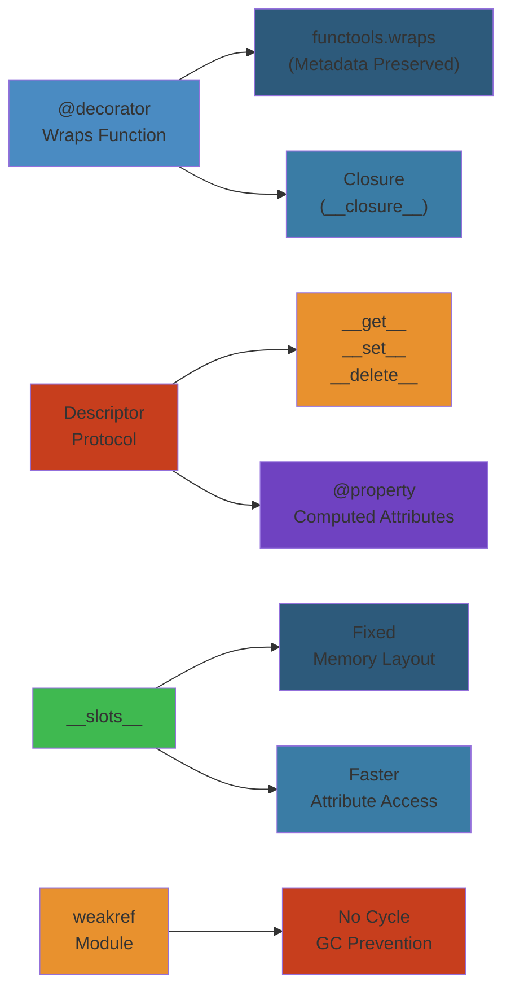

# 🐍 Advanced Python — Complete Deep Dive

**Related**: [Python Basics](01-python-basics.md) · [Python Docs](https://docs.python.org/3/) · [CPython Source](https://github.com/python/cpython)

---




## Table of Contents

- [Decorators with Arguments](#-decorators-with-arguments)
- [Descriptors Deep Dive](#-descriptors-deep-dive)
- [`__getattr__` vs `__getattribute__`](#-__getattr__-vs-__getattribute__)
- [`__slots__` Advanced](#-__slots__-advanced)
- [Weak References](#-weak-references)
- [`functools` Deep Dive](#-functools-deep-dive)
- [`itertools`](#-itertools)
- [`collections`](#-collections)
- [`pathlib`](#-pathlib)
- [`re` Module](#-re-module)
- [Coroutine Pipelines with `yield from`](#-coroutine-pipelines-with-yield-from)
- [Async Context Managers & Generators](#-async-context-managers--generators)
- [asyncio Concurrency Primitives](#-asyncio-concurrency-primitives)
- [Subprocess Management](#-subprocess-management)
- [C Extensions with ctypes / Cython](#-c-extensions-with-ctypes--cython)
- [Profiling and Optimization](#-profiling-and-optimization)
- [Simplest Mental Model](#-simplest-mental-model)

---

## 🧭 Decorators with Arguments

```python
import functools

def retry(max_attempts=3, delay=1):
    def decorator(func):
        @functools.wraps(func)
        def wrapper(*args, **kwargs):
            for attempt in range(max_attempts):
                try:
                    return func(*args, **kwargs)
                except Exception as e:
                    if attempt == max_attempts - 1:
                        raise
                    time.sleep(delay)
            return wrapper
        return decorator

@retry(max_attempts=5, delay=2)
def fetch_data(url):
    return requests.get(url).json()

# Class decorator
def singleton(cls):
    instances = {}
    @functools.wraps(cls)
    def get_instance(*args, **kwargs):
        if cls not in instances:
            instances[cls] = cls(*args, **kwargs)
        return instances[cls]
    return get_instance

@singleton
class Database:
    pass
```

### Decorator stacking order

```python
@decorator_a  # applied last (outermost)
@decorator_b  # applied first (innermost)
def func():
    pass
# Equivalent: func = decorator_a(decorator_b(func))
```

---

## 🧭 Descriptors Deep Dive

```python
# Descriptor protocol: __get__, __set__, __delete__
class Validator:
    def __set_name__(self, owner, name):
        self.name = f"_{name}"

    def __get__(self, obj, objtype=None):
        if obj is None:
            return self  # class access
        return getattr(obj, self.name)

    def __set__(self, obj, value):
        self.validate(value)
        setattr(obj, self.name, value)

class Email(Validator):
    def validate(self, value):
        if "@" not in value:
            raise ValueError("Invalid email")

class User:
    email = Email()

# Property vs Descriptor
# property() is implemented USING the descriptor protocol
# property(fget, fset, fdel, doc) creates a descriptor
```

### Types of descriptors

```text
┌──────────────────────────────────────────────────────┐
│  Data descriptor:  defines __set__ or __delete__      │
│  Non-data descriptor: defines only __get__            │
│                                                       │
│  Precedence in attribute lookup:                      │
│  1. Data descriptors (class level)                    │
│  2. Instance __dict__                                 │
│  3. Non-data descriptors (class level)                │
│                                                       │
│  Python methods are non-data descriptors!             │
│  That's why obj.method() works with instance methods  │
└──────────────────────────────────────────────────────┘
```

---

## 🧭 `__getattr__` vs `__getattribute__`

```python
class Proxy:
    def __init__(self, wrapped):
        self._wrapped = wrapped

    # Called when normal lookup fails (AttributeError)
    def __getattr__(self, name):
        print(f"getattr: {name}")
        return getattr(self._wrapped, name)

    # Called for EVERY attribute access (use with care)
    def __getattribute__(self, name):
        print(f"getattribute: {name}")
        if name.startswith("_"):
            raise AttributeError("private")
        return super().__getattribute__(name)

    # __setattr__ — intercept all attribute setting
    def __setattr__(self, name, value):
        if name == "immutable":
            raise AttributeError("read-only")
        super().__setattr__(name, value)
```

```text
┌──────────────────────────────────────────────────────┐
│  attribute lookup: obj.x                              │
│                                                       │
│  1. type(obj).__getattribute__(obj, "x")              │
│     ├── data descriptor (class)? → its __get__        │
│     ├── obj.__dict__? → return it                     │
│     ├── non-data descriptor (class)? → its __get__    │
│     └── class __dict__? → return it                   │
│                                                       │
│  2. If AttributeError → __getattr__(obj, "x")         │
│     (if defined)                                      │
└──────────────────────────────────────────────────────┘
```

---

## 🧭 `__slots__` Advanced

```python
from sys import getsizeof

class WithDict:
    pass

class WithSlots:
    __slots__ = ("x", "y")

# Memory comparison
d = WithDict()
d.x = 1; d.y = 2
# getsizeof(d) → ~56 bytes + __dict__ (~112 bytes) = ~168 bytes

s = WithSlots()
s.x = 1; s.y = 2
# getsizeof(s) → ~56 bytes (no __dict__)

# Inheritance with slots
class Base:
    __slots__ = ("a",)

class Derived(Base):
    __slots__ = ("b",)  # must repeat parent slots to avoid __dict__

# Adding __dict__ to slots
class FlexibleSlots:
    __slots__ = ("x", "__dict__")  # slots + dynamic attributes
```

---

## 🧭 Weak References

```python
import weakref

class ExpensiveObject:
    def __del__(self):
        print("Destroyed")

obj = ExpensiveObject()
ref = weakref.ref(obj)
print(ref())  # returns obj
del obj
print(ref())  # None (object collected)

# WeakValueDictionary — auto-cleanup cache
cache = weakref.WeakValueDictionary()

class Data:
    def __init__(self, key):
        self.key = key

d = Data("config")
cache["config"] = d
del d
# cache is now empty — no memory leak

# WeakSet
seen = weakref.WeakSet()

# Finalize — callback on object destruction
def cleanup(obj):
    print(f"Cleaning {obj}")

finalizer = weakref.finalize(obj, cleanup, obj)
```

---

## 🧭 `functools` Deep Dive

```python
import functools

# lru_cache — memoization
@functools.lru_cache(maxsize=128)
def fibonacci(n):
    if n < 2:
        return n
    return fibonacci(n - 1) + fibonacci(n - 2)

# partial — fix arguments
base_two = functools.partial(int, base=2)
base_two("1001")  # 9

# wraps — preserve metadata
def decorator(func):
    @functools.wraps(func)
    def wrapper(*args, **kwargs):
        return func(*args, **kwargs)
    return wrapper

# singledispatch — function overloading
@functools.singledispatch
def serialize(obj):
    raise NotImplementedError("unsupported type")

@serialize.register
def _(obj: dict) -> str:
    return json.dumps(obj)

@serialize.register
def _(obj: list) -> str:
    return "[" + ", ".join(map(str, obj)) + "]"

# cached_property (3.8+)
class DataLoader:
    @functools.cached_property
    def heavy_data(self):
        return self._load_from_db()

# reduce
from functools import reduce
product = reduce(lambda a, b: a * b, [1, 2, 3, 4, 5])  # 120
```

---

## 🧭 `itertools`

```python
import itertools

# Infinite iterators
count = itertools.count(start=0, step=2)     # 0, 2, 4, ...
cycle = itertools.cycle("ABC")                # A, B, C, A, ...
repeat = itertools.repeat(10, times=3)        # 10, 10, 10

# Finite iterators
chain = itertools.chain("ABC", "DEF")         # A, B, C, D, E, F
compress = itertools.compress("ABCD", [1,0,1,0])  # A, C
dropwhile = itertools.dropwhile(lambda x: x < 3, [1,4,2])  # 4, 2
takewhile = itertools.takewhile(lambda x: x < 3, [1,4,2])  # 1
filterfalse = itertools.filterfalse(None, [0,1,0,2])  # 0, 0
starmap = itertools.starmap(pow, [(2,5), (3,2)])  # 32, 9

# Combinatoric
product = itertools.product("AB", repeat=2)   # AA, AB, BA, BB
permutations = itertools.permutations("ABC", 2)  # AB, AC, BA, BC, CA, CB
combinations = itertools.combinations("ABC", 2)  # AB, AC, BC
combinations_with_replacement("ABC", 2)  # AA, AB, AC, BB, BC, CC

# Grouping
groups = itertools.groupby("AAABBC", lambda x: x)
# A → ['A', 'A', 'A'], B → ['B', 'B'], C → ['C']

# Batched (3.12+)
batches = itertools.batched("ABCDEFG", 3)  # ('A','B','C'), ('D','E','F'), ('G',)

# Tee — multiple iterators from one
a, b = itertools.tee(range(5), 2)
```

---

## 🧭 `collections`

```python
from collections import defaultdict, Counter, deque, namedtuple, ChainMap, OrderedDict

# defaultdict — auto-default on missing key
counter = defaultdict(int)
counter["a"] += 1  # no KeyError

# Counter — count hashable items
cnt = Counter("abracadabra")
cnt.most_common(3)  # [('a', 5), ('b', 2), ('r', 2)]

# deque — double-ended queue
d = deque(maxlen=100)
d.append(1)
d.appendleft(2)
d.pop()
d.popleft()

# namedtuple — lightweight class
Point = namedtuple("Point", ["x", "y"])
p = Point(1, 2)
p.x       # 1
x, y = p  # unpacking

# ChainMap — combined view of multiple dicts
defaults = {"theme": "dark", "lang": "en"}
overrides = {"theme": "light"}
config = ChainMap(overrides, defaults)
config["theme"]  # "light"
config["lang"]   # "en" (from defaults)

# OrderedDict — remembers insertion order (regular dict does too in 3.7+)
# Differences: OrderedDict has move_to_end(), equality is order-sensitive
od = OrderedDict()
od["a"] = 1
od["b"] = 2
od.move_to_end("a")  # now b, a
```

---

## 🧭 `pathlib`

```python
from pathlib import Path

# Construction
p = Path("/tmp/data/file.txt")
home = Path.home()
cwd = Path.cwd()

# Properties
p.name       # "file.txt"
p.stem       # "file"
p.suffix     # ".txt"
p.parent     # /tmp/data
p.parents    # [Path('/tmp/data'), Path('/tmp'), Path('/')]
p.parts      # ('/', 'tmp', 'data', 'file.txt')

# Querying
p.exists()
p.is_file()
p.is_dir()
p.stat().st_size
p.stat().st_mtime

# Operations
p.read_text()           # read entire file
p.read_bytes()
p.write_text("hello")   # write entire file
p.write_bytes(b"data")
p.mkdir(parents=True, exist_ok=True)
p.rename("new.txt")
p.unlink(missing_ok=True)   # delete file
p.rmdir()                   # delete empty dir

# Globbing
list(Path("src").glob("**/*.py"))
list(Path("src").rglob("*.py"))  # recursive

# Path joining
p / "subdir" / "file.txt"  # operator /
p.joinpath("a", "b", "c")

# Cross-platform paths
# Uses / or \ automatically based on OS
```

---

## 🧭 `re` Module

```python
import re

# Compile for performance
pattern = re.compile(r"\d{3}-\d{4}")

# Match (from beginning)
m = pattern.match("555-1234")
m.group()    # "555-1234"
m.start()    # 0
m.end()      # 8

# Search (anywhere)
m = pattern.search("Call 555-1234 today")
m.group()  # "555-1234"

# Find all
pattern.findall("555-1234, 555-5678")  # ['555-1234', '555-5678']

# Finditer (lazy)
for m in pattern.finditer("555-1234"):
    print(m.group())

# Substitution
re.sub(r"\d{3}", "XXX", "Call 555-1234")  # "Call XXX-1234"

# Groups
pattern = re.compile(r"(?P<area>\d{3})-(?P<num>\d{4})")
m = pattern.match("555-1234")
m.group("area")  # "555"
m.groupdict()    # {"area": "555", "num": "1234"}

# Split
re.split(r"\s+", "a b   c")  # ['a', 'b', 'c']

# Flags
re.IGNORECASE
re.MULTILINE    # ^ and $ match line boundaries
re.DOTALL       # . matches newlines
re.VERBOSE      # readable patterns with whitespace
```

---

## 🧭 Coroutine Pipelines with `yield from`

```python
# Coroutine pipeline using yield from
def reader(filename):
    with open(filename) as f:
        for line in f:
            yield line.strip()

def filter_pattern(pattern, source):
    for item in source:
        if pattern in item:
            yield item

def uppercase(source):
    for item in source:
        yield item.upper()

def take(n, source):
    for i, item in enumerate(source):
        if i >= n:
            break
        yield item

# Pipeline
pipeline = take(3, uppercase(filter_pattern("error", reader("log.txt"))))
for line in pipeline:
    print(line)

# yield from delegates to subgenerator
def flatten(iterables):
    for it in iterables:
        yield from it

def pipeline_v2(files):
    lines = yield from reader(files[0])
    for f in files[1:]:
        lines = yield from reader(f)
    return lines

# Two-way communication with send()
def grep(pattern):
    print(f"Looking for {pattern}")
    while True:
        line = yield
        if pattern in line:
            print(f"Found: {line}")

g = grep("python")
next(g)   # prime the coroutine
g.send("I love python")  # Found: I love python
g.send("I love java")    # (no output)
g.close()
```

---

## 🧭 Async Context Managers & Generators

```python
import asyncio

# Async context manager
class AsyncResource:
    async def __aenter__(self):
        self.conn = await connect()
        return self.conn

    async def __aexit__(self, exc_type, exc_val, exc_tb):
        await self.conn.close()

    # @contextmanager async version
    @contextlib.asynccontextmanager
    async def transaction(conn):
        async with conn.transaction():
            yield conn

# Async generator (PEP 525)
async def ticker(interval, to):
    for i in range(to):
        await asyncio.sleep(interval)
        yield i

async def main():
    async for value in ticker(0.5, 5):
        print(value)

# Async generator with cleanup
async def managed_resource():
    try:
        resource = await acquire()
        yield resource
    finally:
        await resource.release()
```

---

## 🧭 asyncio Concurrency Primitives

```python
import asyncio

# Semaphore — limit concurrent access
sem = asyncio.Semaphore(10)

async def bounded_task(url):
    async with sem:
        return await fetch(url)

# Lock — mutual exclusion
lock = asyncio.Lock()

async def critical_section():
    async with lock:
        data = await read_shared()
        data.modify()
        await write_shared(data)

# Event — signal between tasks
event = asyncio.Event()

async def waiter():
    await event.wait()
    print("Proceed!")

async def setter():
    await asyncio.sleep(1)
    event.set()

# Queue
queue = asyncio.Queue(maxsize=100)

async def producer():
    for i in range(10):
        await queue.put(i)
    await queue.join()  # wait until all processed

async def consumer():
    while True:
        item = await queue.get()
        process(item)
        queue.task_done()

# gather vs wait
async def demo_gather():
    results = await asyncio.gather(
        task1(),
        task2(),
        return_exceptions=True,  # don't raise, return exceptions
    )
    for r in results:
        if isinstance(r, Exception):
            handle_error(r)

async def demo_wait():
    done, pending = await asyncio.wait(
        {task1(), task2()},
        timeout=5.0,
        return_when=asyncio.FIRST_COMPLETED,
        # ALL_COMPLETED, FIRST_EXCEPTION
    )
    for t in done:
        result = t.result()
```

---

## 🧭 Subprocess Management

```python
import subprocess
import asyncio

# Synchronous
result = subprocess.run(
    ["ls", "-l", "/tmp"],
    capture_output=True,
    text=True,
    check=True,  # raise CalledProcessError on non-zero
)
print(result.stdout)
print(result.stderr)
print(result.returncode)

# Run with input
result = subprocess.run(
    ["sort"],
    input="c\na\nb",
    capture_output=True,
    text=True,
)
# result.stdout = "a\nb\nc\n"

# Popen — fine-grained control
proc = subprocess.Popen(
    ["tail", "-f", "/var/log/system.log"],
    stdout=subprocess.PIPE,
    stderr=subprocess.PIPE,
)
stdout, stderr = proc.communicate(timeout=10)

# Async subprocess (asyncio)
async def run_cmd():
    proc = await asyncio.create_subprocess_exec(
        "ffmpeg", "-i", "input.mp4", "output.mp3",
        stdout=asyncio.subprocess.PIPE,
        stderr=asyncio.subprocess.PIPE,
    )
    stdout, stderr = await proc.communicate()
    return proc.returncode
```

---

## 🧭 C Extensions with ctypes / Cython

```python
# ctypes — call C libraries directly
import ctypes

# Load shared library
lib = ctypes.CDLL("./mylib.so")

# Define function signature
lib.add.argtypes = [ctypes.c_int, ctypes.c_int]
lib.add.restype = ctypes.c_int

result = lib.add(3, 4)  # 7

# Complex types
class Point(ctypes.Structure):
    _fields_ = [("x", ctypes.c_double), ("y", ctypes.c_double)]

lib.distance.argtypes = [Point, Point]
lib.distance.restype = ctypes.c_double

# Cython — Python-like syntax, compiles to C
# File: fib.pyx
# def fib(int n):
#     cdef int a = 0, b = 1, i
#     for i in range(n):
#         a, b = a + b, a
#     return a
#
# Build with: cythonize -i fib.pyx
```

```text
┌──────────────────────────────────────────────────────┐
│  Extension Method    │ Speed   │  Complexity          │
├──────────────────────┼─────────┼──────────────────────┤
│ Pure Python          │ 1x      │ Low                  │
│ ctypes               │ 2-5x    │ Medium               │
│ CFFI                 │ 2-5x    │ Medium               │
│ Cython               │ 10-100x │ Medium-High          │
│ C Extension (C API)  │ 10-100x │ High                 │
│ mypyc                │ 2-4x    │ Low                  │
└──────────────────────────────────────────────────────┘
```

---

## 🧭 Profiling and Optimization

```python
# timeit — micro-benchmarks
import timeit

timeit.timeit('"-".join(str(n) for n in range(100))', number=10000)
# or in IPython: %timeit [x**2 for x in range(1000)]

# cProfile — function-level profiler
import cProfile
import pstats

profiler = cProfile.Profile()
profiler.enable()
slow_function()
profiler.disable()

stats = pstats.Stats(profiler)
stats.sort_stats("cumtime")  # cumulative time
stats.print_stats(20)        # top 20

# Memory profiling
# pip install memory-profiler
# @profile decorator
# python -m memory_profiler script.py

# Line profiler
# pip install line-profiler
# @profile decorator
# kernprof -l -v script.py

# Common optimizations
# 1. Use local variables (avoid global lookups)
# 2. List comprehensions > for loops
# 3. set / dict for membership tests (O(1) vs O(n) for list)
# 4. deque for queue operations
# 5. Use __slots__ for many small objects
# 6. Profiling before optimization is MANDATORY
```

### Optimization checklist

```text
┌──────────────────────────────────────────────────────┐
│  1. Profile first — don't guess                       │
│  2. Algorithm change > micro-optimization              │
│  3. Use built-in functions (map, filter, reduce)       │
│  4. Avoid attribute lookup in loops                    │
│  5. Use local variable bindings                        │
│  6. Pre-allocate collections                          │
│  7. Use __slots__ for memory-heavy objects            │
│  8. Consider PyPy for CPU-bound pure Python            │
│  9. Use Cython/numba for hot loops                    │
│ 10. asyncio for I/O-bound, multiprocessing for CPU    │
└──────────────────────────────────────────────────────┘
```

---

## 🧭 Simplest Mental Model

```text
Advanced Python = Python + C + Memory + Concurrency

┌──────────────────────────────────────────────────────┐
│  Performance Pyramid                                 │
│                                                       │
│         ┌──────────────────┐                          │
│         │  Algorithm       │ ← biggest impact         │
│         ├──────────────────┤                          │
│         │  Data Structures │ ← choose wisely          │
│         ├──────────────────┤                          │
│         │  C Extensions    │ ← ctypes, Cython         │
│         ├──────────────────┤                          │
│         │  Concurrency     │ ← asyncio, threads, mp   │
│         ├──────────────────┤                          │
│         │  Python idioms   │ ← comprehensions, locals │
│         └──────────────────┘ ← smallest impact        │
│                                                       │
│  The magic of Python is that you can go from          │
│  prototype (prototype.py) to production (cython +     │
│  asyncio + cProfile) WITHOUT leaving the language.    │
└──────────────────────────────────────────────────────┘
```


## Practical Example

```python
# Basic usage
result = function()
print(result)
```