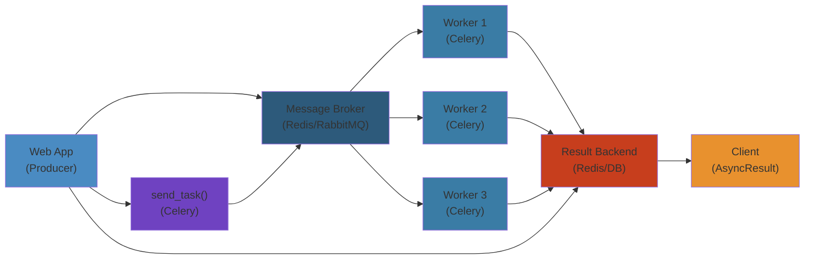

# Distributed Python Deep Dive




## Celery Architecture

### Broker, Worker, Result Backend

Celery's core architecture consists of three components: broker (message transport), worker (task execution), and result backend (state storage):

```python
from celery import Celery
from kombu import Queue, Exchange

app = Celery(
    "tasks",
    broker="redis://localhost:6379/0",
    backend="redis://localhost:6379/1",
)

# Advanced configuration
app.conf.update(
    task_serializer="json",
    accept_content=["json"],
    result_serializer="json",
    timezone="UTC",
    enable_utc=True,
    task_track_started=True,
    task_acks_late=True,
    worker_prefetch_multiplier=1,
    task_soft_time_limit=300,
    task_time_limit=360,
    broker_connection_retry_on_startup=True,
    result_expires=3600 * 24 * 7,
)

# Queue definitions
app.conf.task_queues = (
    Queue("default", Exchange("default"), routing_key="default"),
    Queue("high_priority", Exchange("high_priority"), routing_key="high"),
    Queue("low_priority", Exchange("low_priority"), routing_key="low"),
)

app.conf.task_routes = {
    "tasks.process_payment": {"queue": "high_priority"},
    "tasks.send_email": {"queue": "low_priority"},
    "tasks.*": {"queue": "default"},
}

@app.task(bind=True, max_retries=3, default_retry_delay=60)
def process_payment(self, user_id: int, amount: float):
    try:
        print(f"Processing payment for user {user_id}: ${amount}")
        return {"status": "success", "transaction_id": "txn_123"}
    except Exception as exc:
        raise self.retry(exc=exc)

@app.task(bind=True, rate_limit="10/m")
def send_email(self, to: str, subject: str, body: str):
    print(f"Sending email to {to}: {subject}")
    return {"status": "sent", "recipient": to}
```

### Task Routing

```python
# Dynamic routing based on task arguments
def route_task(name, args, kwargs, **options):
    if name == "tasks.process_payment":
        return {"queue": "high_priority"}
    if len(str(args)) > 1000:
        return {"queue": "high_priority"}
    return {"queue": "default"}

app.conf.task_routes = route_task

# Manual routing
from tasks import process_payment, send_email

process_payment.apply_async(
    args=[1, 99.99],
    queue="high_priority",
    routing_key="high",
    priority=10,
)

send_email.apply_async(
    args=["user@example.com", "Hello", "Body"],
    queue="low_priority",
    priority=1,
)
```

### Canvas: Chains, Groups, and Chords

```python
from celery import chain, group, chord, signature

# Chain: sequential execution
result = chain(
    process_payment.s(1, 100.0),
    send_email.s("Receipt", "Payment processed"),
)()
# Equivalent: process_payment.s(1, 100.0) | send_email.s("Receipt", ...)

# Group: parallel execution
group_result = group(
    process_payment.s(i, 50.0)
    for i in range(10)
)()

# Chord: group with callback
callback = send_email.s("admin@example.com", "Batch complete", "All payments processed")
chord_result = chord(
    [process_payment.s(i, 50.0) for i in range(10)],
    callback,
)()

# Chaining complex workflows
workflow = (
    group(process_payment.s(i, 100.0) for i in [1, 2, 3])
    | send_email.s("admin@example.com", "Group Done", "")
    | group(send_email.s(f"user{i}@example.com", "Thanks", "") for i in [1, 2, 3])
)

# Canvas primitives
from celery.canvas import Signature

task_sig = signature("tasks.process_payment", args=[1, 50.0], countdown=10)
task_sig2 = process_payment.s(1, 50.0).set(countdown=10, priority=5)

# Immutable signatures
no_result = process_payment.si(1, 50.0)  # .si() = immutable (doesn't pass previous result)

# Map/Starmap
results = process_payment.map([(1, 50.0), (2, 75.0), (3, 100.0)])
results2 = process_payment.starmap([(1, 50.0), (2, 75.0)])
```

### Periodic Tasks with Celery Beat

```python
from celery import Celery
from celery.schedules import crontab, solar, timedelta

app.conf.beat_schedule = {
    "daily_report": {
        "task": "tasks.generate_daily_report",
        "schedule": crontab(hour=0, minute=0),
        "args": (),
        "kwargs": {"format": "pdf"},
        "options": {"queue": "low_priority"},
    },
    "health_check": {
        "task": "tasks.health_check",
        "schedule": timedelta(seconds=30),
        "options": {"expires": 25},
    },
    "cleanup_expired": {
        "task": "tasks.cleanup_expired_sessions",
        "schedule": crontab(hour="*/6", minute=0),
    },
    "weekly_backup": {
        "task": "tasks.backup_database",
        "schedule": crontab(
            hour_of_day=3,
            minute_of_hour=0,
            day_of_week="sunday",
        ),
    },
    "solar_event": {
        "task": "tasks.solar_triggered",
        "schedule": solar("sunset", 37.7749, -122.4194),
    },
}

@app.task
def generate_daily_report():
    print("Generating daily report...")
    return {"report": "daily_report.pdf"}

@app.task
def health_check():
    print("Health check OK")
    return {"status": "healthy"}

@app.task
def cleanup_expired_sessions():
    print("Cleaning up expired sessions")
    return {"cleaned": 100}
```

### Task ETA and Countdown

```python
from datetime import datetime, timedelta, timezone

# Countdown (relative)
result = process_payment.apply_async(
    args=[1, 50.0],
    countdown=60,          # Execute in 60 seconds
    expires=300,           # Discard if not started within 5 minutes
)

# ETA (absolute time)
eta = datetime.now(timezone.utc) + timedelta(hours=1)
result = process_payment.apply_async(
    args=[1, 50.0],
    eta=eta,
    expires=eta + timedelta(hours=2),
)

# Task expiration
result = process_payment.apply_async(
    args=[1, 50.0],
    expires=60,  # Seconds from now
)

# Soft and hard time limits
@app.task(
    bind=True,
    soft_time_limit=30,  # SoftLimit exception raised
    time_limit=35,       # Hard kill
)
def long_running_task(self):
    import time
    try:
        time.sleep(40)
    except Exception as e:
        print(f"Task soft time limit exceeded: {e}")
        raise
```

---

## Celery Production

### Worker Concurrency

```python
# Worker types and configuration

# Prefork (default, multiprocessing)
# celery -A tasks worker --concurrency=4 --pool=prefork --prefetch-multiplier=1

# Gevent (green threads)
# pip install gevent
# celery -A tasks worker --pool=gevent --concurrency=100

# Eventlet (green threads)
# pip install eventlet
# celery -A tasks worker --pool=eventlet --concurrency=100

# Threads (native threads)
# celery -A tasks worker --pool=threads --concurrency=10

# Solo (no concurrency, for debugging)
# celery -A tasks worker --pool=solo

# Programmatic configuration
app.conf.worker_concurrency = 4
app.conf.worker_pool = "prefork"
app.conf.worker_prefetch_multiplier = 1
app.conf.worker_max_tasks_per_child = 1000  # Restart worker every 1000 tasks (memory leak defense)

# Autoscaling
app.conf.worker_autoscaler = "celery.worker.autoscale:Autoscaler"
# celery -A tasks worker --autoscale=10,3  (max=10, min=3)
```

### Task Deduplication

```python
import hashlib
from celery import Task
import redis

redis_client = redis.Redis(host="localhost", port=6379, db=2)

class DedupTask(Task):
    """Task with built-in deduplication."""

    abstract = True
    dedup_key_prefix = "task:dedup:"
    dedup_ttl = 3600  # 1 hour

    def apply_async(self, args=None, kwargs=None, task_id=None, **options):
        # Generate dedup key from task name + args
        dedup_key = self._generate_dedup_key(args, kwargs)

        # Check if already scheduled
        if redis_client.setnx(dedup_key, task_id or "scheduled"):
            redis_client.expire(dedup_key, self.dedup_ttl)
            return super().apply_async(
                args=args, kwargs=kwargs, task_id=task_id, **options
            )
        else:
            print(f"Duplicate task skipped: {dedup_key}")
            return None

    def _generate_dedup_key(self, args, kwargs):
        content = f"{self.name}:{args}:{sorted(kwargs.items())}"
        hash_val = hashlib.sha256(content.encode()).hexdigest()[:16]
        return f"{self.dedup_key_prefix}{hash_val}"

@app.task(base=DedupTask, bind=True)
def non_duplicating_task(self, user_id: int):
    print(f"Processing user {user_id}")

# Even if called multiple times, only one task is queued
non_duplicating_task.delay(1)
non_duplicating_task.delay(1)  # Skipped
non_duplicating_task.delay(1)  # Skipped
```

### Task Tracking and Monitoring

```python
from celery import Task
from celery.result import AsyncResult
from datetime import datetime, timezone

class TrackingTask(Task):
    abstract = True

    def on_success(self, retval, task_id, args, kwargs):
        print(f"[{datetime.now(timezone.utc)}] Task {task_id} succeeded: {retval}")

    def on_failure(self, exc, task_id, args, kwargs, einfo):
        print(f"[{datetime.now(timezone.utc)}] Task {task_id} failed: {exc}")
        # Alert monitoring system
        notify_ops_team(f"Task {task_id} failed: {exc}")

    def on_retry(self, exc, task_id, args, kwargs, einfo):
        print(f"[{datetime.now(timezone.utc)}] Task {task_id} retrying: {exc}")

    def after_return(self, status, retval, task_id, args, kwargs, einfo):
        print(f"Task {task_id} finished with status {status}")

@app.task(base=TrackingTask, bind=True)
def tracked_task(self):
    import random
    if random.random() < 0.2:
        raise ValueError("Random failure")
    return "success"

# Query task state
def get_task_status(task_id: str) -> dict:
    result = AsyncResult(task_id, app=app)
    return {
        "task_id": task_id,
        "status": result.status,
        "result": result.result,
        "traceback": result.traceback,
        "failed": result.failed(),
        "successful": result.successful(),
        "ready": result.ready(),
    }

# Revoke tasks
result = tracked_task.delay()
result.revoke(terminate=True)  # Kill if running
result.revoke(terminate=False)  # Don't start if pending
```

### Flower Monitoring

```python
# Start Flower:
# celery -A tasks flower --port=5555 --basic-auth=user:pass

# Programmatic Flower integration
from flower.utils.template import humanize

@app.task(bind=True)
def monitored_task(self):
    self.update_state(
        state="PROGRESS",
        meta={"current": 50, "total": 100, "percent": 50},
    )
    return {"status": "done"}

# Custom events
from celery import Celery
from celery.events import Event
from celery.events.state import State
from celery.events.snapshot import Polaroid

class CustomSnapshot(Polaroid):
    def on_shutter(self, state):
        if not state:
            return
        print(f"Workers: {len(state.workers)}")
        print(f"Tasks: {len(state.tasks)}")
        for worker in state.workers.values():
            print(f"  Worker {worker.hostname}: {worker.status}")

snapshot = CustomSnapshot(app=app)
snapshot.start()  # Starts periodic snapshots
```

---

## Ray Architecture

### Raylet and Object Store

```python
import ray
import numpy as np
import time

# Initialize Ray
ray.init(
    address="auto",  # Connect to existing cluster, or "local" for single-node
    num_cpus=8,
    num_gpus=0,
    object_store_memory=4 * 1024 * 1024 * 1024,  # 4GB
    _system_config={
        "object_spilling_config": json.dumps({
            "type": "filesystem",
            "params": {"directory_path": "/tmp/ray_spill"},
        }),
    },
)

@ray.remote
def compute_intensive(data: np.ndarray) -> float:
    return np.sum(data ** 2)

# Object store usage
large_array = np.random.rand(1000000)
ref = ray.put(large_array)  # Store in shared memory

@ray.remote
def process_array(ref):
    data = ray.get(ref)  # Zero-copy read from shared memory
    return np.mean(data)

# Reference counting and eviction
print(f"Object in store: {ray.get(ref)}")
del ref  # Reference goes out of scope, object can be evicted
```

### Remote Functions and Tasks

```python
import ray
import time

@ray.remote
def fibonacci(n: int) -> int:
    if n <= 1:
        return n
    return fibonacci.remote(n - 1) + fibonacci.remote(n - 2)

# Recursive remote calls
result = fibonacci.remote(30)
print(f"fib(30) = {ray.get(result)}")

# Task dependencies
@ray.remote
def add(a: float, b: float) -> float:
    return a + b

@ray.remote
def multiply(a: float, b: float) -> float:
    return a * b

# Pipeline: (1 + 2) * (3 + 4)
x1 = add.remote(1, 2)
x2 = add.remote(3, 4)
result = multiply.remote(x1, x2)
print(f"Result: {ray.get(result)}")

# Task with resources
@ray.remote(num_cpus=2, num_gpus=0, memory=500 * 1024 * 1024)
def memory_intensive_task(size_mb: int):
    data = bytearray(size_mb * 1024 * 1024)
    return len(data)
```

### Actors

```python
import ray
from typing import Dict, List

@ray.remote
class Counter:
    def __init__(self):
        self.value = 0

    def increment(self):
        self.value += 1
        return self.value

    def get_value(self):
        return self.value

# Create and use actors
counter = Counter.remote()
results = ray.get([counter.increment.remote() for _ in range(10)])
print(f"Final count: {ray.get(counter.get_value.remote())}")

# Stateful actor for model serving
@ray.remote
class ModelActor:
    def __init__(self, model_path: str):
        import joblib
        self.model = joblib.load(model_path)
        self.cache = {}

    async def predict(self, features: List[float]):
        key = tuple(features)
        if key in self.cache:
            return self.cache[key]

        import numpy as np
        X = np.array(features).reshape(1, -1)
        result = self.model.predict(X)[0]
        self.cache[key] = result
        return result

    def get_cache_size(self):
        return len(self.cache)

# Actor pools for load balancing
@ray.remote
class Worker:
    def __init__(self, worker_id: int):
        self.worker_id = worker_id

    def process(self, task_id: int) -> Dict:
        import time, random
        time.sleep(random.uniform(0.1, 0.5))
        return {
            "worker_id": self.worker_id,
            "task_id": task_id,
            "result": task_id ** 2,
        }

# Create worker pool
workers = [Worker.remote(i) for i in range(4)]
tasks = [worker.process.remote(i) for i, worker in enumerate(workers * 10)]
results = ray.get(tasks)
print(f"Processed {len(results)} tasks with 4 workers")
```

### Placement Groups

```python
import ray
from ray.util.placement_group import placement_group
from ray.util.scheduling_strategies import PlacementGroupSchedulingStrategy

# Pack tasks together for data locality
pg = placement_group(
    name="training_group",
    strategy="PACK",  # PACK, SPREAD, STRICT_PACK, STRICT_SPREAD
    bundles=[
        {"CPU": 4, "GPU": 1},  # Driver
        {"CPU": 8, "GPU": 4},  # Workers (per bundle)
        {"CPU": 8, "GPU": 4},
    ],
)

ray.get(pg.ready())

@ray.remote(num_cpus=4, num_gpus=1)
def trainer():
    return "training"

@ray.remote(num_cpus=8, num_gpus=4)
def worker():
    return "working"

trainer_task = trainer.options(
    scheduling_strategy=PlacementGroupSchedulingStrategy(
        placement_group=pg,
        placement_group_bundle_index=0,
    )
).remote()

worker_tasks = [
    worker.options(
        scheduling_strategy=PlacementGroupSchedulingStrategy(
            placement_group=pg,
            placement_group_bundle_index=i + 1,
        )
    ).remote()
    for i in range(2)
]

# Clean up
ray.util.remove_placement_group(pg)
```

### Distributed Scheduling

```python
import ray

@ray.remote
def slow_task(delay: float):
    import time
    time.sleep(delay)
    return delay

# Ray's scheduler handles load balancing
tasks = [slow_task.remote(0.1 * i) for i in range(100)]
results = ray.get(tasks)

# Dynamic task generation
@ray.remote
def worker(item: int) -> int:
    return item * item

@ray.remote
def coordinator(items: list[int]):
    # Spawn tasks dynamically
    tasks = [worker.remote(i) for i in items if i % 2 == 0]
    results = ray.get(tasks)
    return results

# Work stealing: Ray automatically rebalances tasks
@ray.remote
def unbalanced_task(n: int):
    import time, random
    delay = random.uniform(0.1, 1.0)
    time.sleep(delay)
    return f"Task {n} took {delay:.2f}s"
```

### Autoscaling

```python
import ray

# Autoscaling configuration (for Ray clusters)
# ray start --head --autoscaling-config=autoscaling_config.yaml

ray.init(
    address="auto",
    runtime_env={
        "working_dir": "./",
        "excludes": ["tests/", "*.pyc", ".git"],
    },
)

# Autoscaling config in YAML:
"""
max_workers: 10
min_workers: 2
target_num_workers: 8
idle_timeout_minutes: 5
upscaling_speed: 1.0  # Fraction of missing nodes per step
downscale_delay_s: 300
provider:
  type: aws
  region: us-west-2
  availability_zone: us-west-2a
  cache_stopped_nodes: True
"""

# Ray Serve for autoscaling deployments
from ray import serve

@serve.deployment(
    num_replicas=2,
    min_replicas=2,
    max_replicas=10,
    autoscaling_config={
        "target_num_ongoing_requests_per_replica": 5,
        "downscale_delay_s": 300,
        "upscale_delay_s": 10,
    },
)
class PredictDeployment:
    def __call__(self, request):
        return {"prediction": "ok"}
```

---

## Dask

### Distributed Scheduler

```python
from dask.distributed import Client, LocalCluster, as_completed
import dask

# Local cluster
cluster = LocalCluster(
    n_workers=4,
    threads_per_worker=2,
    memory_limit="4GB",
    processes=True,
)
client = Client(cluster)
print(f"Dashboard: {client.dashboard_link}")

# Remote cluster
# client = Client("scheduler-address:8786")

# Low-level task submission
def my_task(x, y):
    import time
    time.sleep(0.1)
    return x ** y

futures = client.submit(my_task, i, 2, pure=False) for i in range(100)
results = client.gather(futures)

# Task dependencies
a = client.submit(lambda x: x + 1, 10)
b = client.submit(lambda x: x * 2, a)
c = client.submit(lambda x: x ** 2, b)
result = c.result()
print(f"Chain result: {result}")

# As completed for streaming
futures = [client.submit(my_task, i, i) for i in range(100)]
for future in as_completed(futures):
    result = future.result()
    print(f"Got: {result}")
```

### Dask Task Graph

```python
import dask
from dask import delayed
import numpy as np

@delayed
def load_data(path: str) -> np.ndarray:
    return np.load(path)

@delayed
def preprocess(data: np.ndarray) -> np.ndarray:
    return data / data.max()

@delayed
def compute_statistics(data: np.ndarray) -> dict:
    return {
        "mean": float(data.mean()),
        "std": float(data.std()),
        "max": float(data.max()),
        "min": float(data.min()),
    }

@delayed
def aggregate(results: list[dict]) -> dict:
    return {
        "mean": np.mean([r["mean"] for r in results]),
        "std": np.mean([r["std"] for r in results]),
    }

# Build compute graph
files = [f"data_{i}.npy" for i in range(10)]
loaded = [load_data(f) for f in files]
processed = [preprocess(data) for data in loaded]
stats = [compute_statistics(data) for data in processed]
final = aggregate(stats)

# Visualize the task graph
final.visualize("task_graph.png")

# Compute with the distributed scheduler
result = final.compute(scheduler="distributed")
print(f"Aggregated stats: {result}")
```

### Dask Collections

```python
import dask.array as da
import dask.dataframe as dd
import dask.bag as db
import numpy as np
import pandas as pd

# Dask Array (parallel NumPy)
x = da.random.random((10000, 10000), chunks=(1000, 1000))
y = da.random.random((10000, 10000), chunks=(1000, 1000))

# Operations are lazy
z = (x + y).mean(axis=0)
print(f"Type: {type(z)}")
print(f"Computation graph: {z.dask}")

# Trigger computation
result = z.compute()
print(f"Result shape: {result.shape}")

# Dask DataFrame
df = dd.read_csv("data/*.csv", blocksize="100MB")
print(f"Partitions: {df.npartitions}")

# Lazy operations
result = (
    df.groupby("category")
    .agg({"value": ["mean", "std", "count"]})
    .compute()
)

# Dask Bag (parallel iterators)
bag = db.read_text("logs/*.json").map(json.loads)
errors = bag.filter(lambda x: x["level"] == "ERROR")
count = errors.count().compute()
```

### Distributed DataFrames

```python
import dask.dataframe as dd
import pandas as pd

# Shuffling and repartitioning
df = dd.read_csv("large_data/*.csv", blocksize="100MB")

# Repartition for better parallelism
df = df.repartition(npartitions=20)

# Shuffle operations (expensive)
grouped = df.groupby("user_id").value.mean()

# Index-based operations
df = df.set_index("user_id")  # Shuffles data
user_data = df.loc[42].compute()  # Fast lookup after indexing

# Join between distributed dataframes
users = dd.read_csv("users/*.csv")
orders = dd.read_csv("orders/*.csv")

# Broadcast join (small table fits in memory)
joined = users.merge(orders, how="inner", on="user_id", broadcast=True)

# Shuffle join (both large)
joined_shuffle = users.merge(orders, how="inner", on="user_id")

# Persisting intermediate results
processed = df[df.value > 0].persist()  # Keep in memory across operations
```

---

## Ray vs Celery vs Dask

### Comparison Matrix

```python
# When to use each:

# Celery: Task queues, scheduled jobs, simple distributed execution
# Best for: Background jobs, periodic tasks, web app async processing
# Not best for: ML training, real-time streaming, complex DAGs

# Ray: Distributed computing, ML/AI, stateful actors
# Best for: ML training, reinforcement learning, distributed serving
# Not best for: Simple task queues, periodic jobs

# Dask: Data analytics, parallel NumPy/Pandas, ML preprocessing
# Best for: Large-scale data processing, parallel arrays/dataframes
# Not best for: Real-time serving, stateful applications

# Performance comparison benchmark
import time
import numpy as np

def benchmark_compute(n: int):
    """Matrix multiplication benchmark."""
    a = np.random.rand(n, n)
    b = np.random.rand(n, n)
    return a @ b

# Celery-style (subprocess)
import multiprocessing
def celery_style(n: int, workers: int = 4):
    with multiprocessing.Pool(workers) as pool:
        results = pool.map(benchmark_compute, [n] * workers)
    return results

# Ray-style
import ray
@ray.remote
def ray_compute(n):
    return benchmark_compute(n)

def ray_style(n: int):
    refs = [ray_compute.remote(n) for _ in range(4)]
    return ray.get(refs)

# Dask-style
from dask import delayed
@delayed
def dask_compute(n):
    return benchmark_compute(n)

def dask_style(n: int):
    tasks = [dask_compute(n) for _ in range(4)]
    return dask.compute(*tasks)
```

### Choosing the Right Tool

```python
# Decision tree:
# 1. Background tasks, cron jobs, web app -> Celery
# 2. ML training, RL, distributed Python objects -> Ray
# 3. Data analysis, large arrays/dataframes -> Dask
# 4. Real-time streaming, low latency -> Ray (or custom)
# 5. Simple task queue, no dependencies -> Celery
# 6. Complex DAG, ML pipelines -> Ray or Dask
# 7. GPU computing, model serving -> Ray

# Hybrid approach: Celery + Ray
from celery import Celery
import ray

app = Celery("tasks")

@app.task(bind=True)
def ray_compute_wrapper(self, func_name: str, args: list):
    """Celery task that submits work to a Ray cluster."""
    @ray.remote
    def remote_func():
        import importlib
        module = importlib.import_module("compute_functions")
        func = getattr(module, func_name)
        return func(*args)

    ray.init(address="auto", ignore_reinit_error=True)
    result = ray.get(remote_func.remote())
    return result
```

---

## Distributed Patterns

### Task Queue Pattern

```python
import asyncio
from typing import Any, Callable, Coroutine
from collections import deque
import json
import redis

class DistributedTaskQueue:
    def __init__(self, redis_client: redis.Redis, queue_name: str = "tasks"):
        self.redis = redis_client
        self.queue_name = queue_name
        self.handlers: dict[str, Callable] = {}

    def register(self, task_type: str):
        def decorator(func: Callable):
            self.handlers[task_type] = func
            return func
        return decorator

    def enqueue(self, task_type: str, *args, **kwargs):
        task = {
            "type": task_type,
            "args": args,
            "kwargs": kwargs,
        }
        self.redis.lpush(self.queue_name, json.dumps(task))

    def enqueue_with_priority(self, priority: int, task_type: str, *args, **kwargs):
        task = {
            "type": task_type,
            "args": args,
            "kwargs": kwargs,
            "priority": priority,
        }
        self.redis.zadd(f"{self.queue_name}:priority", {json.dumps(task): priority})

    def process_next(self) -> bool:
        task_data = self.redis.rpop(self.queue_name)
        if not task_data:
            return False

        task = json.loads(task_data)
        handler = self.handlers.get(task["type"])
        if handler:
            handler(*task["args"], **task["kwargs"])
        return True

    def process_all(self):
        while self.process_next():
            pass

queue = DistributedTaskQueue(redis.Redis())

@queue.register("send_email")
def handle_email(to: str, subject: str):
    print(f"Sending email to {to}: {subject}")

@queue.register("process_payment")
def handle_payment(user_id: int, amount: float):
    print(f"Processing payment: user={user_id}, amount={amount}")

queue.enqueue("send_email", "user@example.com", "Hello")
queue.enqueue("process_payment", 42, 99.99)
queue.process_all()
```

### Map-Reduce Pattern

```python
import ray
from typing import Any, Callable, List
from collections import defaultdict
import math

@ray.remote
class MapReduce:
    def __init__(self, num_reducers: int = 4):
        self.num_reducers = num_reducers

    def map(self, mapper: Callable, data: List[Any]) -> List[tuple]:
        return mapper(data)

    def partition(self, mapped: List[tuple], key_fn: Callable) -> dict:
        partitions = defaultdict(list)
        for key, value in mapped:
            partition_id = hash(key_fn(key)) % self.num_reducers
            partitions[partition_id].append((key, value))
        return dict(partitions)

    def reduce(self, reducer: Callable, partition: List[tuple]) -> dict:
        grouped = defaultdict(list)
        for key, value in partition:
            grouped[key].append(value)
        result = {}
        for key, values in grouped.items():
            result[key] = reducer(key, values)
        return result

    def execute(self, mapper: Callable, reducer: Callable, data: List[Any], key_fn: Callable = lambda x: x[0]):
        # Map phase
        mapped = ray.get(self.map.remote(mapper, data))
        # Partition
        partitions = self.partition(mapped, key_fn)
        # Reduce phase (parallel)
        reducers = [self.reduce.remote(reducer, partitions[i]) for i in partitions]
        results = ray.get(reducers)
        # Merge
        final = {}
        for r in results:
            final.update(r)
        return final

# Word count example
def word_count_mapper(text: str) -> List[tuple]:
    words = text.lower().split()
    return [(word, 1) for word in words]

def word_count_reducer(key: str, values: List[int]) -> int:
    return sum(values)

# Execute
mr = MapReduce.remote()
texts = ["hello world", "hello python", "python distributed", "world of python"]
result = ray.get(mr.execute.remote(word_count_mapper, word_count_reducer, texts))
print(f"Word counts: {result}")
```

### Scatter-Gather Pattern

```python
import asyncio
from typing import Any, Callable, List
import aiohttp
import httpx

class ScatterGather:
    def __init__(self, workers: List[str]):
        self.workers = workers

    async def scatter(self, func: Callable, items: List[Any]) -> List[Any]:
        tasks = []
        for i, item in enumerate(items):
            worker = self.workers[i % len(self.workers)]
            tasks.append(func(worker, item))
        return await asyncio.gather(*tasks, return_exceptions=True)

    async def gather(self, results: List[Any], timeout: float = 5.0) -> List[Any]:
        successful = []
        for result in results:
            if isinstance(result, Exception):
                print(f"Worker failed: {result}")
                continue
            successful.append(result)
        return successful

    async def execute(self, func: Callable, items: List[Any]) -> List[Any]:
        results = await self.scatter(func, items)
        return await self.gather(results)

# HTTP-based scatter-gather
async def http_worker(worker_url: str, item: Any) -> dict:
    async with httpx.AsyncClient() as client:
        response = await client.post(
            f"{worker_url}/process",
            json={"data": item},
            timeout=10.0,
        )
        response.raise_for_status()
        return response.json()

workers = ["http://worker1:8000", "http://worker2:8000", "http://worker3:8000"]
sg = ScatterGather(workers)
items = list(range(30))
# results = await sg.execute(http_worker, items)
```

### Streaming Pattern

```python
import asyncio
from typing import AsyncGenerator, Any
from dataclasses import dataclass
from datetime import datetime

@dataclass
class StreamEvent:
    timestamp: datetime
    key: str
    value: Any
    partition: int = 0

class StreamProcessor:
    def __init__(self):
        self.handlers: dict[str, Callable] = {}
        self.watermark = datetime.min

    def register(self, event_type: str):
        def decorator(func):
            self.handlers[event_type] = func
            return func
        return decorator

    async def process_stream(self, stream: AsyncGenerator[StreamEvent, None]):
        async for event in stream:
            self.watermark = max(self.watermark, event.timestamp)
            handler = self.handlers.get(event.key)
            if handler:
                await handler(event)
            else:
                print(f"No handler for event type: {event.key}")

    async def windowed_aggregate(self, stream: AsyncGenerator[StreamEvent, None], window_seconds: int = 60):
        from collections import defaultdict
        buffer = defaultdict(list)
        last_window = datetime.min

        async for event in stream:
            window_start = event.timestamp.replace(
                second=(event.timestamp.second // window_seconds) * window_seconds,
                microsecond=0,
            )

            if window_start != last_window and buffer:
                yield dict(buffer)
                buffer = defaultdict(list)
                last_window = window_start

            buffer[event.key].append(event.value)

# Kafka-style consumer group
class ConsumerGroup:
    def __init__(self, group_id: str, members: List[str]):
        self.group_id = group_id
        self.members = members
        self.assignments = {}

    def assign_partitions(self, partitions: List[int]):
        for i, partition in enumerate(partitions):
            member = self.members[i % len(self.members)]
            self.assignments[partition] = member

    def get_consumer(self, partition: int) -> str:
        return self.assignments.get(partition)
```

### Microservices Pattern

```python
import asyncio
from typing import Dict, Any, Optional
import json
import httpx
import redis.asyncio as redis

class ServiceRegistry:
    def __init__(self, redis_client: redis.Redis):
        self.redis = redis_client
        self.service_ttl = 30  # seconds

    async def register(self, service_name: str, instance_id: str, endpoint: str):
        key = f"service:{service_name}:{instance_id}"
        await self.redis.setex(key, self.service_ttl, endpoint)

    async def discover(self, service_name: str) -> list[str]:
        pattern = f"service:{service_name}:*"
        keys = await self.redis.keys(pattern)
        endpoints = []
        for key in keys:
            endpoint = await self.redis.get(key)
            if endpoint:
                endpoints.append(endpoint.decode())
        return endpoints

    async def get_healthy(self, service_name: str) -> Optional[str]:
        endpoints = await self.discover(service_name)
        if not endpoints:
            return None
        # Simple round-robin
        return endpoints[0]

class ServiceClient:
    def __init__(self, registry: ServiceRegistry):
        self.registry = registry

    async def call_service(self, service_name: str, method: str, path: str, **kwargs) -> dict:
        endpoint = await self.registry.get_healthy(service_name)
        if not endpoint:
            raise Exception(f"No healthy instances of {service_name}")

        url = f"{endpoint}{path}"
        async with httpx.AsyncClient() as client:
            response = await client.request(method, url, **kwargs)
            response.raise_for_status()
            return response.json()

    async def broadcast(self, service_name: str, method: str, path: str, **kwargs) -> list[dict]:
        endpoints = await self.registry.discover(service_name)
        tasks = []
        async with httpx.AsyncClient() as client:
            for endpoint in endpoints:
                url = f"{endpoint}{path}"
                tasks.append(client.request(method, url, **kwargs))
            responses = await asyncio.gather(*tasks, return_exceptions=True)
            return [r.json() for r in responses if not isinstance(r, Exception)]

# Circuit breaker pattern
class CircuitBreaker:
    def __init__(self, failure_threshold: int = 5, recovery_timeout: float = 30.0):
        self.failure_threshold = failure_threshold
        self.recovery_timeout = recovery_timeout
        self.failure_count = 0
        self.last_failure_time = 0.0
        self.state = "closed"  # closed, open, half-open

    async def call(self, func: Callable, *args, **kwargs):
        if self.state == "open":
            if time.time() - self.last_failure_time > self.recovery_timeout:
                self.state = "half-open"
            else:
                raise Exception("Circuit breaker is open")

        try:
            result = await func(*args, **kwargs)
            if self.state == "half-open":
                self.state = "closed"
                self.failure_count = 0
            return result
        except Exception as e:
            self.failure_count += 1
            self.last_failure_time = time.time()
            if self.failure_count >= self.failure_threshold:
                self.state = "open"
            raise e
```

### Distributed Lock Pattern

```python
import redis
import asyncio
import uuid
from contextlib import asynccontextmanager
import time

class DistributedLock:
    def __init__(self, redis_client: redis.Redis, lock_key: str, ttl: int = 30):
        self.redis = redis_client
        self.lock_key = f"lock:{lock_key}"
        self.lock_value = str(uuid.uuid4())
        self.ttl = ttl

    async def acquire(self, blocking: bool = True, timeout: float = 10.0) -> bool:
        start = time.time()
        while True:
            acquired = await self.redis.setnx(self.lock_key, self.lock_value)
            if acquired:
                await self.redis.expire(self.lock_key, self.ttl)
                return True

            if not blocking:
                return False

            if time.time() - start > timeout:
                return False

            await asyncio.sleep(0.1)

    async def release(self):
        # Lua script for safe release (only if we own the lock)
        script = """
        if redis.call("get", KEYS[1]) == ARGV[1] then
            return redis.call("del", KEYS[1])
        else
            return 0
        end
        """
        await self.redis.eval(script, 1, self.lock_key, self.lock_value)

    async def extend(self, extra_ttl: int = 30):
        await self.redis.expire(self.lock_key, extra_ttl)

@asynccontextmanager
async def distributed_lock(redis_client, lock_key: str, ttl: int = 30):
    lock = DistributedLock(redis_client, lock_key, ttl)
    try:
        await lock.acquire()
        yield
    finally:
        await lock.release()

async def critical_section(worker_id: str):
    redis_client = redis.Redis()
    async with distributed_lock(redis_client, "resource:critical"):
        print(f"Worker {worker_id} in critical section")
        await asyncio.sleep(1)
        print(f"Worker {worker_id} leaving critical section")
```

### Distributed Event Bus

```python
import asyncio
from typing import Callable, Dict, List, Any
from dataclasses import dataclass, asdict
import json
import redis.asyncio as redis
from datetime import datetime

@dataclass
class DistributedEvent:
    event_id: str
    event_type: str
    data: dict
    source: str
    timestamp: float
    correlation_id: str = None

class EventBus:
    def __init__(self, redis_client: redis.Redis, service_name: str):
        self.redis = redis_client
        self.service_name = service_name
        self.subscribers: Dict[str, List[Callable]] = {}
        self.pubsub = None

    async def publish(self, event_type: str, data: dict, correlation_id: str = None):
        event = DistributedEvent(
            event_id=str(uuid.uuid4()),
            event_type=event_type,
            data=data,
            source=self.service_name,
            timestamp=time.time(),
            correlation_id=correlation_id,
        )
        channel = f"events:{event_type}"
        await self.redis.publish(channel, json.dumps(asdict(event)))

    async def subscribe(self, event_type: str, handler: Callable):
        if event_type not in self.subscribers:
            self.subscribers[event_type] = []
        self.subscribers[event_type].append(handler)

    async def start_listening(self):
        self.pubsub = self.redis.pubsub()
        channels = [f"events:{t}" for t in self.subscribers.keys()]
        await self.pubsub.subscribe(*channels)

        async for message in self.pubsub.listen():
            if message["type"] == "message":
                event = DistributedEvent(**json.loads(message["data"]))
                if event.source != self.service_name:
                    handlers = self.subscribers.get(event.event_type, [])
                    for handler in handlers:
                        asyncio.create_task(handler(event))

    async def stop_listening(self):
        if self.pubsub:
            await self.pubsub.unsubscribe()
            await self.pubsub.close()
```
