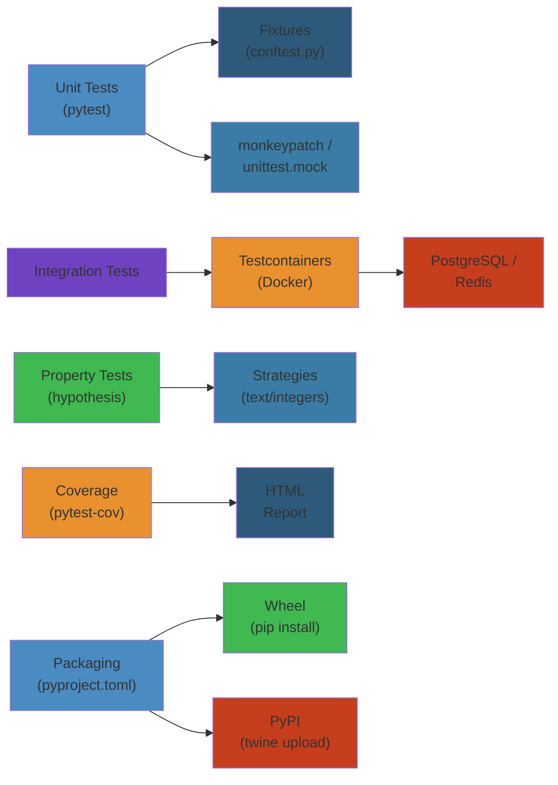

# 🧪 Python Testing & Packaging — Complete Deep Dive

> **Scope**: Testing pyramid, pytest ecosystem, unittest, hypothesis, integration testing, packaging tools, versioning, environment isolation, linting/formatting, CI/CD patterns, coverage, mocking best practices

---




## 📑 Table of Contents

1. [Testing Pyramid](#1-testing-pyramid)
2. [pytest — The Modern Standard](#2-pytest--the-modern-standard)
3. [pytest Advanced Features](#3-pytest-advanced-features)
4. [unittest — Built-in Framework](#4-unittest--built-in-framework)
5. [Hypothesis — Property-Based Testing](#5-hypothesis--property-based-testing)
6. [Integration Testing](#6-integration-testing)
7. [Packaging Ecosystem](#7-packaging-ecosystem)
8. [Versioning & Environment Isolation](#8-versioning--environment-isolation)
9. [Linting, Formatting & Pre-commit](#9-linting-formatting--pre-commit)
10. [CI/CD Patterns](#10-cicd-patterns)
11. [Coverage](#11-coverage)
12. [Mocking Best Practices](#12-mocking-best-practices)
13. [Simplest Mental Model](#13-simplest-mental-model)

---

## 1. Testing Pyramid

```
         ╱╲
        ╱  ╲          E2E (few — slow, brittle)
       ╱    ╲
      ╱──────╲
     ╱        ╲       Integration (some — medium speed)
    ╱          ╲
   ╱────────────╲
  ╱              ╲   Unit (many — fast, isolated)
 ╱                ╲
╱──────────────────╲
```

| Layer | Speed | Brittleness | Count | What it tests |
|-------|-------|-------------|-------|---------------|
| Unit | ms | Low | 100s-1000s | Single function/class |
| Integration | seconds | Medium | 10s-100s | Module boundaries, DB, API |
| E2E | minutes | High | 1-10 | Full user flow, browser |

---

## 2. pytest — The Modern Standard

```python
import pytest

# Fixture — dependency injection
@pytest.fixture
def db_connection():
    conn = create_database()
    yield conn          # teardown runs after test
    conn.close()

# Fixture scopes
@pytest.fixture(scope="session")   # once per session
@pytest.fixture(scope="module")    # once per module
@pytest.fixture(scope="class")     # once per class
@pytest.fixture(scope="function")  # once per test (default)

# Using fixtures
def test_query(db_connection):
    result = db_connection.query("SELECT 1")
    assert result == 1

# conftest.py — shared fixtures auto-discovered by pytest
# Place in any directory; fixtures available to all tests under that dir

# Parametrize — test multiple inputs
@pytest.mark.parametrize("a,b,expected", [
    (1, 2, 3),
    (0, 0, 0),
    (-1, 1, 0),
    (2**63, 1, 2**63 + 1),
])
def test_add(a, b, expected):
    assert a + b == expected

# Markers — tags for filtering
@pytest.mark.slow
def test_heavy_computation():
    ...

# Run: pytest -m slow
```

### Built-in Fixtures

```python
# monkeypatch — mock attributes, env vars, etc.
def test_env(monkeypatch):
    monkeypatch.setenv("API_KEY", "test-key")
    monkeypatch.setattr("os.getcwd", lambda: "/tmp")
    assert os.environ["API_KEY"] == "test-key"

# tmp_path — temporary directory (pathlib.Path)
def test_file_io(tmp_path):
    f = tmp_path / "test.txt"
    f.write_text("hello")
    assert f.read_text() == "hello"

# capsys — capture stdout/stderr
def test_output(capsys):
    print("Hello, World!")
    captured = capsys.readouterr()
    assert captured.out == "Hello, World!\n"

# caplog — capture log output
def test_logging(caplog):
    import logging
    logging.getLogger().info("test message")
    assert "test message" in caplog.text

# mocker — pytest-mock plugin (thin wrapper over unittest.mock)
def test_api_call(mocker):
    mock_get = mocker.patch("requests.get")
    mock_get.return_value.json.return_value = {"key": "val"}
    result = my_api_function()
    assert result["key"] == "val"
```

---

## 3. pytest Advanced Features

### Plugin Architecture

```python
# conftest.py — hook into pytest lifecycle
def pytest_runtest_setup(item):
    """Called before each test."""
    if "slow" in item.keywords:
        print(f"Running slow test: {item.name}")

def pytest_addoption(parser):
    parser.addoption("--db-url", action="store", default="localhost")

def pytest_configure(config):
    config.addinivalue_line("markers", "slow: mark test as slow")
```

### Useful Plugins

```bash
pip install pytest-xdist    # parallel: pytest -n auto
pip install pytest-cov      # coverage
pip install pytest-timeout  # timeout: @pytest.mark.timeout(5)
pip install pytest-rerunfailures  # rerun: @pytest.mark.flaky(reruns=3)
pip install pytest-mock     # mocker fixture
pip install pytest-split    # split tests across CI jobs
pip install pytest-tap      # TAP output
pip install pytest-sugar    # better UI
```

### Advanced Markers

```python
@pytest.mark.skip(reason="Not implemented yet")
def test_future():
    ...

@pytest.mark.skipif(sys.version_info < (3, 10), reason="3.10+ only")
def test_new_feature():
    ...

@pytest.mark.xfail(reason="Known bug #123", strict=True)
def test_known_bug():
    ...

# Custom markers
pytest.mark.slow
pytest.mark.integration
pytest.mark.api
```

### Factories & Fakers

```python
import factory
from faker import Faker

fake = Faker()

class UserFactory(factory.Factory):
    class Meta:
        model = User

    name = factory.LazyFunction(lambda: fake.name())
    email = factory.LazyFunction(lambda: fake.email())
    age = factory.LazyAttribute(lambda o: hash(o.name) % 100)

# Usage
def test_user_creation(db_session):
    user = UserFactory.create()
    db_session.add(user)
    db_session.commit()
    assert user.id is not None
```

---

## 4. unittest — Built-in Framework

```python
import unittest
from unittest.mock import Mock, MagicMock, patch, PropertyMock, call

class TestMathOperations(unittest.TestCase):
    def setUp(self):
        """Runs before each test."""
        self.data = [1, 2, 3]

    def tearDown(self):
        """Runs after each test."""
        self.data = None

    def test_sum(self):
        self.assertEqual(sum(self.data), 6)

    def test_types(self):
        self.assertIsInstance(self.data, list)
        self.assertIn(2, self.data)
        self.assertGreater(len(self.data), 0)

# Mock library
class TestExternalAPI(unittest.TestCase):
    @patch("requests.get")
    def test_fetch_data(self, mock_get):
        mock_get.return_value = MagicMock(status_code=200)
        mock_get.return_value.json.return_value = {"key": "value"}

        result = fetch_data("/api")
        self.assertEqual(result["key"], "value")
        mock_get.assert_called_once()

    # PropertyMock — mock a property
    @patch("myapp.Config.api_key", new_callable=PropertyMock)
    def test_config(self, mock_key):
        mock_key.return_value = "test-key"
        # ...

    # side_effect — raise exception or return different values
    def test_retry(self):
        mock = Mock()
        mock.side_effect = [ConnectionError, ConnectionError, {"ok": True}]
        # First two calls raise, third succeeds

    # spec — restrict mock to actual class interface
    mock = MagicMock(spec=MyClass)  # accessing undefined attr raises
```

---

## 5. Hypothesis — Property-Based Testing

```python
from hypothesis import given, strategies as st, assume, settings, HealthCheck

# Define properties, not specific outputs
@given(st.integers(), st.integers())
def test_commutative_add(a, b):
    assert a + b == b + a

@given(st.lists(st.integers()))
def test_sort_invariant(lst):
    result = sorted(lst)
    assert len(result) == len(lst)
    assert all(result[i] <= result[i+1] for i in range(len(result)-1))

# Custom strategies
email_strategy = st.emails()
date_strategy = st.dates()
json_strategy = st.recursive(
    st.none() | st.booleans() | st.floats() | st.text(),
    lambda children: st.lists(children) | st.dictionaries(st.text(), children),
)

# Composite strategy
@st.composite
def user_strategy(draw):
    name = draw(st.text(min_size=1, max_size=50))
    age = draw(st.integers(min_value=0, max_value=150))
    email = draw(st.emails())
    return {"name": name, "age": age, "email": email}

@given(user_strategy())
def test_user(user):
    assert 0 <= user["age"] <= 150

# assume — filter invalid inputs
@given(st.lists(st.integers()))
def test_non_empty_lists(lst):
    assume(len(lst) > 0)  # skip empty lists
    assert max(lst) >= min(lst)

# settings — control test execution
@settings(max_examples=1000, suppress_health_check=[HealthCheck.too_slow])
@given(st.lists(st.integers()))
def test_large_sample(lst):
    ...
```

---

## 6. Integration Testing

```python
# testcontainers — throwaway Docker services
from testcontainers.postgres import PostgresContainer

def test_with_postgres():
    with PostgresContainer("postgres:15") as pg:
        conn = psycopg2.connect(
            host=pg.get_container_host_ip(),
            port=pg.get_exposed_port(5432),
            user=pg.USER, password=pg.PASSWORD, dbname=pg.DBNAME,
        )
        cur = conn.cursor()
        cur.execute("SELECT 1")
        assert cur.fetchone() == (1,)

# moto — mock AWS services
import moto
import boto3

@moto.mock_s3
def test_s3_upload():
    client = boto3.client("s3", region_name="us-east-1")
    client.create_bucket(Bucket="test-bucket")
    client.put_object(Bucket="test-bucket", Key="file.txt", Body=b"data")
    resp = client.get_object(Bucket="test-bucket", Key="file.txt")
    assert resp["Body"].read() == b"data"
```

---

## 7. Packaging Ecosystem

```
┌─────────────────────────────────────────────────────┐
│               Python Packaging Flow                  │
│                                                      │
│  pyproject.toml ──▶ build backend ──▶ sdist/wheel   │
│       │               │                              │
│       │         ┌─────┴──────┐                       │
│       │         │setuptools  │                       │
│       │         │hatchling   │                       │
│       │         │flit_core   │                       │
│       │         │pdm-backend │                       │
│       │         │mesonpy     │                       │
│       │         └────────────┘                       │
│       │                                              │
│       └──▶ published to PyPI / private index         │
└─────────────────────────────────────────────────────┘
```

### pyproject.toml (modern standard, PEP 621)

```toml
[build-system]
requires = ["hatchling"]
build-backend = "hatchling.build"

[project]
name = "my-package"
version = "0.1.0"
description = "My awesome package"
requires-python = ">=3.10"
dependencies = [
    "requests>=2.28",
    "pydantic>=2",
]

[project.optional-dependencies]
dev = ["pytest", "ruff", "mypy"]
test = ["pytest", "pytest-cov"]

[tool.ruff]
line-length = 100

[tool.pytest.ini_options]
testpaths = ["tests"]
```

### Tools Comparison

| Tool | Build Backend | Lock File | Workflow |
|------|--------------|-----------|----------|
| **pip + setuptools** | setuptools | No | `python -m build` |
| **hatch** | hatchling | No | `hatch build` |
| **poetry** | poetry-core | poetry.lock | `poetry build` |
| **flit** | flit-core | No | `flit build` |
| **pdm** | pdm-backend | pdm.lock | `pdm build` |
| **uv** | — | uv.lock | `uv build` |

---

## 8. Versioning & Environment Isolation

### Versioning (PEP 440)

```
N.N.N[abcN][.postN][.devN]
 1.2.3         — final release
 1.2.3a1       — alpha
 1.2.3b2       — beta
 1.2.3rc3      — release candidate
 1.2.3.post1   — post-release (docs, etc.)
 1.2.3.dev4    — development snapshot
```

```python
# Modern: importlib.metadata
from importlib.metadata import version, packages_distributions

__version__ = version("my-package")
print(packages_distributions())  # all installed packages

# Legacy: __version__ string
__version__ = "0.1.0"
```

### Environment Isolation Tools

| Tool | Creates | Lock File | Speed |
|------|---------|-----------|-------|
| **venv** (stdlib) | `.venv/` | — | Fast |
| **virtualenv** | `.venv/` | — | Fast |
| **pipenv** | Pipfile | Pipfile.lock | Medium |
| **conda** | env dir | environment.yml | Slow (binary) |
| **poetry** | — | poetry.lock | Medium |
| **rye** | — | requirements.lock | Fast |
| **uv** | — | uv.lock | Fastest |

```bash
# uv — fastest Python package manager (Rust)
uv venv .venv
uv pip install -r requirements.txt
uv sync        # install from lockfile
uv add requests  # add + lock
```

---

## 9. Linting, Formatting & Pre-commit

```
Code Quality Pipeline:
  ┌────────┐  ┌────────┐  ┌────────┐  ┌────────┐  ┌────────┐
  │  ruff  │  │ isort  │  │ black  │  │ mypy   │  │ pre-   │
  │ (lint) │─▶│(import)│─▶│(format)│─▶│(types) │─▶│ commit │
  └────────┘  └────────┘  └────────┘  └────────┘  └────────┘
```

```toml
# pyproject.toml
[tool.ruff]
target-version = "py310"
line-length = 100
select = ["E", "F", "I", "N", "W", "UP", "B", "SIM", "ARG"]
ignore = ["E501"]

[tool.ruff.lint.per-file-ignores]
"tests/*" = ["ARG"]

[tool.isort]
profile = "black"
line_length = 100

[tool.black]
line-length = 100
target-version = ["py310"]

[tool.mypy]
python_version = "3.10"
strict = true
ignore_missing_imports = true
```

### .pre-commit-config.yaml

```yaml
repos:
  - repo: https://github.com/astral-sh/ruff-pre-commit
    rev: v0.3.0
    hooks:
      - id: ruff
        args: [--fix]
  - repo: https://github.com/psf/black
    rev: 24.2.0
    hooks:
      - id: black
  - repo: https://github.com/pre-commit/mirrors-mypy
    rev: v1.8.0
    hooks:
      - id: mypy
```

---

## 10. CI/CD Patterns

```yaml
# .github/workflows/test.yml — GitHub Actions matrix testing
name: Test
on: [push, pull_request]

jobs:
  test:
    strategy:
      matrix:
        python-version: ["3.10", "3.11", "3.12", "3.13"]
        os: [ubuntu-latest, macos-latest]

    steps:
      - uses: actions/checkout@v4
      - uses: actions/setup-python@v5
        with:
          python-version: ${{ matrix.python-version }}
          cache: "pip"

      - run: pip install -e ".[dev,test]"
      - run: pytest tests/ -n auto --cov=src --cov-report=xml
      - run: ruff check src/
      - run: mypy src/

      - uses: codecov/codecov-action@v3
```

### tox — Test Across Python Versions

```ini
# tox.ini
[tox]
envlist = py310, py311, py312, lint

[testenv]
deps = pytest, pytest-cov
commands = pytest tests/ --cov=src {posargs}

[testenv:lint]
deps = ruff
commands = ruff check src/
```

```bash
tox run-parallel  # run all envs in parallel
tox -e py311      # run specific env
```

---

## 11. Coverage

```python
# .coveragerc or pyproject.toml
[tool.coverage.run]
source = ["src"]
branch = true           # branch coverage (if/else both executed?)
omit = ["*/tests/*"]

[tool.coverage.report]
exclude_lines = [
    "pragma: no cover",
    "def __repr__",
    "if __name__ == .__main__.:",
    "raise NotImplementedError",
    "if False:",
]

# Run
# pytest --cov=src --cov-report=html --cov-report=term-missing
```

```
Coverage Report:
Name             Stmts   Miss  Branch BrPart  Cover   Missing
───────────────────────────────────────────────────────────────
src/module.py       50      5     10      2     88%   12-15, 30
───────────────────────────────────────────────────────────────
TOTAL              320     28     60      8     90%
```

---

## 12. Mocking Best Practices

```
When to Mock:
  ✅ External services (HTTP, DB, queue, S3)
  ✅ Slow operations (ML model inference)
  ✅ Non-deterministic code (random, time, network)
  ✅ Hard to reproduce (error conditions, race conditions)

When NOT to Mock:
  ❌ Internal function calls in the same module
  ❌ Pure functions with no side effects
  ❌ Simple data transformations
  ❌ Tests become brittle or overspecified
```

### Golden Rules

1. **Mock at the integration boundary**, not the implementation detail
2. **Use `spec`** to avoid mock API drift from real API
3. **Use `autospec`** for callables to match signature
4. **Don't mock what you don't own** — instead, create adapters
5. **Verify calls** with `assert_called_once_with`, but don't over-verify
6. **Use realistic return values** — empty dicts hide bugs

```python
# Good — mock at boundary
@patch("myapp.services.stripe_service.StripeClient")
def test_create_charge(mock_stripe):
    mock_stripe.return_value.create_charge.return_value = {"id": "ch_123"}
    result = create_payment(amount=1000)
    assert result["id"] == "ch_123"

# Bad — mock internal implementation detail
@patch("myapp.services.stripe_service.requests.post")
def test_create_charge_bad(mock_post):
    ...
```

---

## 13. Simplest Mental Model

```
┌──────────────────────────────────────────────────────────────┐
│            PYTHON TESTING & PACKAGING — MENTAL MODEL         │
├──────────────────────────────────────────────────────────────┤
│                                                              │
│  🧪 TESTING = prove code works + prevent regressions        │
│                                                              │
│  ┌──────────────────────────────────────────────────────┐    │
│  │  pytest = default choice                              │    │
│  │  Fixtures = dependency injection                      │    │
│  │  Parametrize = test 100 inputs, not 1                │    │
│  │  Mock = fake external boundary                        │    │
│  │  Hypothesis = let computer find edge cases            │    │
│  └──────────────────────────────────────────────────────┘    │
│                                                              │
│  📦 PACKAGING = ship code to others                         │
│                                                              │
│  ┌──────────────────────────────────────────────────────┐    │
│  │  pyproject.toml = single source of truth              │    │
│  │  hatch/poetry/uv = pick one, be consistent           │    │
│  │  venv = isolate per project dependencies             │    │
│  │  ruff+black+mypy = automate quality gates            │    │
│  └──────────────────────────────────────────────────────┘    │
│                                                              │
│  🔄 CI = run tests + quality gates on every commit          │
│                                                              │
└──────────────────────────────────────────────────────────────┘
```
