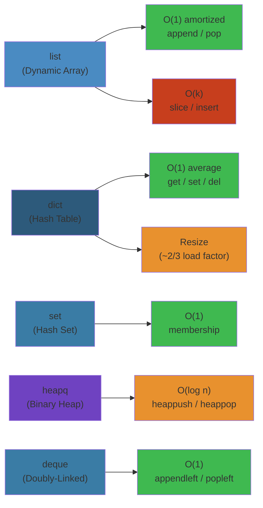

# 🧮 Python Data Structures & Algorithms — Complete Deep Dive




## Table of Contents
- [1. Big O Reference](#1-big-o-reference)
- [2. List Internals](#2-list-internals)
- [3. Dict Internals](#3-dict-internals)
- [4. Set](#4-set)
- [5. Tuple & Namedtuple](#5-tuple--namedtuple)
- [6. Deque](#6-deque)
- [7. Heapq](#7-heapq)
- [8. Collections](#8-collections)
- [9. Bisect](#9-bisect)
- [10. Functools](#10-functools)
- [11. Itertools](#11-itertools)
- [12. String Algorithms](#12-string-algorithms)
- [13. Sorting](#13-sorting)
- [14. Graphs](#14-graphs)
- [15. Trees](#15-trees)
- [16. DP](#16-dp)
- [17. Bit Manipulation](#17-bit-manipulation)
- [Simplest Mental Model](#simplest-mental-model)

---

## 1. Big O Reference

```text
Structure   Access  Search  Insert  Delete  Space
────────────────────────────────────────────────────
list        O(1)    O(n)    O(n)*   O(n)*   O(n)
dict        N/A     O(1)†   O(1)†   O(1)†   O(n)
set         N/A     O(1)†   O(1)†   O(1)†   O(n)
deque       O(1)‡   O(n)    O(1)§   O(1)§   O(n)
heap        O(1)‡   O(n)    O(logn) O(logn) O(n)
* amortized, † avg, ‡ ends, § at ends
```

## 2. List Internals

Dynamic array of `PyObject*` pointers with over-allocation: `size + (size>>3) + 3/6`.

```text
list: [a][b][c][d][_][_][_]  ← len=4, alloc=7
```

```python
l.append(4)      # O(1) amortized (capacity doubles on resize)
l.insert(0, 0)   # O(n) shifts elements
l[1:3]           # O(k) slice copy
l[::-1]          # O(n) reversal
```

## 3. Dict Internals

Hash table with open addressing. Python 3.7+ preserves insertion order. Load factor ~2/3, resizes when full.

```text
indices: [─][─][ 0][─][ 2][ 1]   (sparse, 2^n size)
entries: [a:1][b:2][c:3]         (dense, insertion order)
```

```python
d = {"a": 1, "b": 2}
d.get("c", 0); d.setdefault("c", 3); d | {"d": 4}
```

## 4. Set

Hash set using same HashTable as dict (values=None).

```python
s = {1, 2, 3}; s.add(4); s.remove(1); s.discard(99)
a | b  # union — O(len(a)+len(b))
a & b  # intersection — O(min(len(a), len(b)))
a - b  # difference — O(len(a))
fs = frozenset([1, 2, 3])  # immutable, hashable
```

## 5. Tuple & Namedtuple

```python
t = (1, "hello", 3.14)  # immutable, smaller than list
sys.getsizeof((1,2,3)) < sys.getsizeof([1,2,3])
from collections import namedtuple
Point = namedtuple("Point", ["x", "y"])
p = Point(10, 20); p.x  # → 10
```

## 6. Deque

Double-ended queue (fixed-size blocks in linked list).

```python
from collections import deque
d = deque(maxlen=5)       # fixed circular buffer
d.append(1); d.appendleft(2)  # both O(1)
d.pop(); d.popleft()          # both O(1)
d.rotate(2)                   # rotate right
```

## 7. Heapq

Array-based binary min-heap.

```python
import heapq
heap = [5, 3, 8, 1, 2]
heapq.heapify(heap)            # O(n) in-place
heapq.heappush(heap, 0)        # O(log n)
heapq.heappop(heap)            # O(log n) returns min
heapq.nlargest(3, data)        # O(n log k)
heapq.nsmallest(2, data)
# Max-heap: negate priorities → push(-p, item)
```

## 8. Collections

```python
from collections import Counter, defaultdict, OrderedDict, ChainMap

c = Counter("abracadabra")  # {a:5, b:2, r:2, c:1, d:1}
c.most_common(2); c.total()  # 3.10+

dd = defaultdict(list); dd["key"].append(1)  # auto-creates list

od = OrderedDict(); od.move_to_end("k"); od.popitem(last=True)

cm = ChainMap({"a": 1}, {"b": 2}); cm["a"]  # → 1 (first match wins)
```

## 9. Bisect

Binary search on sorted lists.

```python
import bisect
data = [1, 3, 5, 7, 9]
bisect.bisect_left(data, 5)   # → 2 (first >= 5)
bisect.bisect_right(data, 5)  # → 3 (first > 5)
bisect.insort(data, 4)        # insert maintaining order
```

## 10. Functools

```python
from functools import lru_cache, cache, partial, singledispatch, reduce

@lru_cache(maxsize=128)
def fib(n): return n if n < 2 else fib(n-1) + fib(n-2)

@cache  # 3.9+, unbounded memoization
def f(x): return x ** x

square = partial(pow, exp=2)  # square(5) → 25

@singledispatch
def serialize(obj): raise NotImplementedError
@serialize.register(str)
def _(obj): return f'"{obj}"'
@serialize.register(int)
def _(obj): return str(obj)

reduce(lambda a, x: a + x, [1, 2, 3], 0)  # → 6
```

## 11. Itertools

```python
import itertools as it

# Infinite: it.count(10,2); it.cycle("ABC"); it.repeat(42,3)

# Combinatorics
it.permutations("ABC", 2)   # AB, AC, BA, BC, CA, CB
it.combinations("ABC", 2)   # AB, AC, BC
it.product("AB", "12")      # A1, A2, B1, B2

# Accumulate
it.accumulate([1,2,3,4])                 # 1,3,6,10
it.accumulate([1,2,3], lambda a,x: a*x)  # 1,2,6

# Filter
it.compress("ABCD", [1,0,1,0])           # A, C
it.dropwhile(lambda x: x<3, [1,2,3,4])   # 3,4
it.takewhile(lambda x: x<3, [1,2,3,4])   # 1,2

# Group & chunk
it.groupby("AAABBBCC")                    # (A,iter), (B,iter)
it.pairwise("ABCD")                       # (A,B),(B,C),(C,D) — 3.10+
it.batched("ABCDEF", 3)                   # (A,B,C),(D,E,F) — 3.12+
it.zip_longest("AB", "123", fillvalue="?")
it.starmap(pow, [(2,3),(3,2)])            # 8, 9
it.chain("AB", "CD")                      # A, B, C, D
it.tee(range(3), 2)                       # 2 independent iterators
```

## 12. String Algorithms

**KMP** O(n+m) — precomputes LPS (longest prefix suffix) array, avoids backtracking.
**Rabin-Karp** O(n+m) avg — rolling hash with modulo, O(nm) worst.
**Z-Algorithm** O(n) — Z[i] = longest prefix match starting at i.
**Manacher** O(n) — longest palindrome via mirrored radii.

## 13. Sorting

```text
Timsort: hybrid merge + insertion sort. O(n log n) worst, O(n) best. Stable.
```

```python
sorted(words, key=len)                         # by length
sorted(words, key=str.lower)                    # case-insensitive
sorted(people, key=lambda p: (-p.age, p.name))  # multi-key
```

## 14. Graphs

Adjacency list: `{0: [1,2], 1: [2], 2: [3], 3: []}` — O(V+E) space.

### DFS / BFS

```python
def dfs(g, s, v=None):
    if v is None: v = set()
    v.add(s)
    for n in g[s]:
        if n not in v: dfs(g, n, v)
    return v

def bfs(g, s):
    v, q = {s}, [s]
    while q:
        n = q.pop(0)
        for nb in g[n]:
            if nb not in v: v.add(nb); q.append(nb)
    return v
```

### Dijkstra

```python
import heapq
def dijkstra(g, s):
    dist = {n: float('inf') for n in g}; dist[s] = 0
    pq = [(0, s)]
    while pq:
        d, u = heapq.heappop(pq)
        if d > dist[u]: continue
        for v, w in g[u]:
            if dist[u] + w < dist[v]:
                dist[v] = dist[u] + w
                heapq.heappush(pq, (dist[v], v))
    return dist
```

### Topological Sort (Kahn's)

```python
from collections import deque
def topo(g):
    in_deg = {u: 0 for u in g}
    for u in g:
        for v in g[u]: in_deg[v] = in_deg.get(v, 0) + 1
    q = deque([u for u,d in in_deg.items() if d == 0])
    res = []
    while q:
        u = q.popleft(); res.append(u)
        for v in g[u]:
            in_deg[v] -= 1
            if in_deg[v] == 0: q.append(v)
    return res if len(res) == len(g) else []
```

## 15. Trees

### Trie

```python
class Trie:
    def __init__(self): self.root = {}
    def insert(self, w):
        n = self.root
        for c in w: n = n.setdefault(c, {})
        n['#'] = True
    def search(self, w):
        n = self.root
        for c in w:
            if c not in n: return False
            n = n[c]
        return '#' in n
    def starts_with(self, p):
        n = self.root
        for c in p:
            if c not in n: return False
            n = n[c]
        return True
```

### Segment Tree (range sum) / Fenwick Tree (BIT)

```python
class SegTree:  # O(log n) range query/update
    def __init__(self, d):
        self.n = len(d); self.t = [0]*(4*self.n)
        self._build(d, 0, 0, self.n-1)
    def _build(self, d, i, l, r):
        if l == r: self.t[i] = d[l]; return
        m = (l+r)//2
        self._build(d, i*2+1, l, m); self._build(d, i*2+2, m+1, r)
        self.t[i] = self.t[i*2+1] + self.t[i*2+2]
    def query(self, ql, qr): return self._q(0, 0, self.n-1, ql, qr)
    def _q(self, i, l, r, ql, qr):
        if ql > r or qr < l: return 0
        if ql <= l and r <= qr: return self.t[i]
        m = (l+r)//2
        return self._q(i*2+1, l, m, ql, qr) + self._q(i*2+2, m+1, r, ql, qr)

class BIT:  # Fenwick, point update O(log n), prefix sum O(log n)
    def __init__(self, n): self.n = n; self.b = [0]*(n+1)
    def update(self, i, d):
        i += 1
        while i <= self.n: self.b[i] += d; i += i & -i
    def query(self, i):
        i += 1; r = 0
        while i > 0: r += self.b[i]; i -= i & -i
        return r
    def range(self, l, r): return self.query(r) - (self.query(l-1) if l > 0 else 0)
```

## 16. DP

### Fibonacci

```python
@cache
def fib(n): return n if n < 2 else fib(n-1) + fib(n-2)
def fib_iter(n):
    a, b = 0, 1
    for _ in range(n): a, b = b, a + b
    return a
```

### 0/1 Knapsack — O(n·W)
```python
def knapsack(w, v, cap):
    dp = [0]*(cap+1)
    for wi, vi in zip(w, v):
        for c in range(cap, wi-1, -1):
            dp[c] = max(dp[c], dp[c-wi] + vi)
    return dp[cap]
```

### LCS — O(m·n), LIS — O(n log n) patience sorting
```python
def lcs(a, b):
    dp = [[0]*(len(b)+1) for _ in range(len(a)+1)]
    for i in range(1, len(a)+1):
        for j in range(1, len(b)+1):
            dp[i][j] = 1+dp[i-1][j-1] if a[i-1]==b[j-1] else max(dp[i-1][j], dp[i][j-1])
    return dp[-1][-1]

def lis(nums):
    tails = []
    for x in nums:
        i = bisect.bisect_left(tails, x)
        (tails.append(x) if i == len(tails) else tails.__setitem__(i, x))
    return len(tails)
```

---

## Simplest Mental Model

**Data structures are toolboxes; algorithms are assembly instructions.**

- **list**: Row of lockers — grab any (O(1)), slow to add at front (O(n)).
- **dict**: Phone book — lookup by exact name instantly (O(1)).
- **set**: Bouncer checking if you're on the list (no dupes).
- **deque**: Deli line — join back, leave front (O(1) both).
- **heapq**: Priority boarding — smallest goes first.
- **Counter**: Tally counter for a crowd.
- **bisect**: Finding page in a sorted dictionary — split, repeat.
- **itertools**: LEGO connectors — chain, zip, combine, repeat.
- **DFS/BFS**: Maze — DFS follows one wall (deep), BFS paints outward (wide).
- **DP**: Don't climb same stairs twice — remember what you computed.
- **Trie**: Autocorrect — follow letters like tree branches.
- **Segment Tree**: Tournament bracket answering range sums.
- **Bit ops**: Flipping light switches in parallel.


## Practical Example

```python
# Basic usage
result = function()
print(result)
```