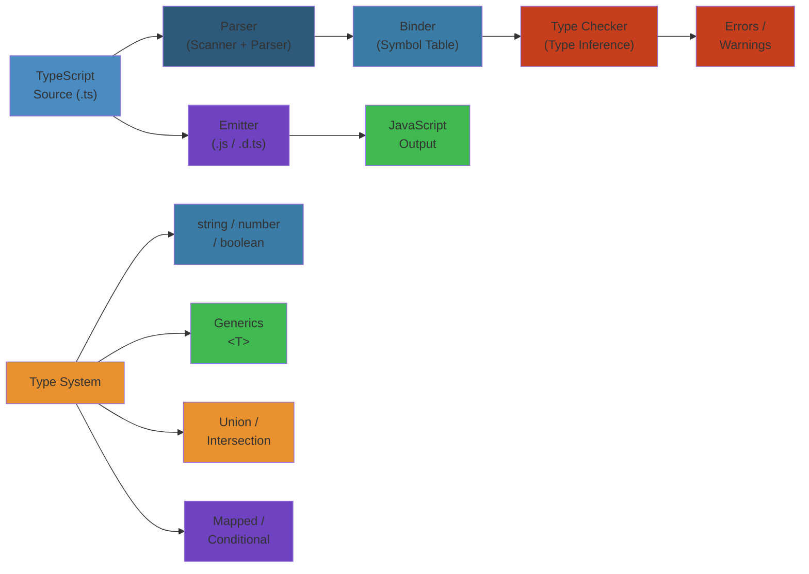
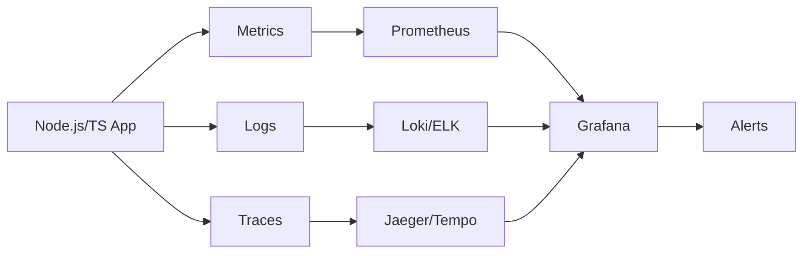

# TypeScript Type System: Deep Dive

---

## LAYER 1: Beginner's Mental Model 🧠


### Real-World Analogy


**JavaScript is like a warehouse without labels:**
```javascript
function addItems(a, b) {
  return a + b;
}

addItems(5, 3);           // 8 ✓
addItems("hello", "world"); // "helloworld" ✓
addItems([1,2], {x:1});    // "1,2[object Object]" ✓ (wat?!)
addItems(null, undefined); // "nullundefined" ✓
```

No errors - just weird results. You discover bugs in production.

**TypeScript adds labels (types):**
```typescript
function addNumbers(a: number, b: number): number {
  return a + b;
}

addNumbers(5, 3);           // 8 ✓
addNumbers("hello", "world"); // ❌ ERROR: Argument of type 'string' is not assignable to parameter of type 'number'
addNumbers([1,2], {x:1});    // ❌ ERROR
```

Errors caught **before running code**. You discover bugs in your editor.

### Why Types Matter (Business Impact)


**Bug cost without types:**
```
Production crash → Page down → $5M lost revenue (Meta incident)
User loses payment → Refund + support → $100 per occurrence
Data corruption → Recovery cost → $100K+
```

**With TypeScript:**
- Netflix: 100K less bugs per year (types catch 40% of bugs early)
- Stripe: Payment bugs nearly eliminated (type safety on financial code)
- Airbnb: Regressions reduced 30% with types
- Microsoft: Types prevent 38% of bugs in production

---

## LAYER 2: Architecture Overview


TypeScript compilation pipeline:



## 1. Basic Types vs Literal Types vs Union/Intersection


### Basic Types


```typescript
let isDone: boolean = false;
let count: number = 42;
let name: string = "TypeScript";
let list: number[] = [1, 2, 3];
let tuple: [string, number] = ["hello", 42];
let anyValue: any = "can be anything";
let unknownValue: unknown = "must narrow first";
let neverValue: never; // cannot hold any value
let voidValue: void = undefined;
let nullValue: null = null;
let undefinedValue: undefined = undefined;
let bigInt: bigint = 100n;
let symbol: symbol = Symbol("unique");
let objectValue: object = { key: "value" };
```

### Literal Types


```typescript
type Direction = "north" | "south" | "east" | "west";
type Port = 3000 | 3001 | 8080;
type Truthy = true | 1 | "yes";

function move(direction: Direction, distance: number): void {
  console.log(`Moving ${distance} units ${direction}`);
}

move("north", 10);
// move("diagonal"); // Error: not assignable

function getPort(): Port {
  return process.env.PORT ? Number(process.env.PORT) as Port : 3000;
}

// Const assertions create deep literal types
const routes = ["/home", "/about", "/contact"] as const;
type Route = typeof routes[number]; // "/home" | "/about" | "/contact"

const config = {
  host: "localhost",
  port: 8080,
  ssl: true,
} as const;
// Type: { readonly host: "localhost"; readonly port: 8080; readonly ssl: true; }
```

### Union Types


```typescript
type Status = "idle" | "loading" | "success" | "error";
type Result<T> = { status: "success"; data: T } | { status: "error"; message: string };

function handleResult<T>(result: Result<T>): T | never {
  if (result.status === "success") {
    return result.data;
  }
  throw new Error(result.message);
}

type ID = string | number;
type Nullish = null | undefined;
type JSONValue = string | number | boolean | null | JSONValue[] | { [key: string]: JSONValue };

function formatId(id: ID): string {
  return id.toString().padStart(6, "0");
}

// Discriminated union — narrowing works via the discriminant
type Shape =
  | { kind: "circle"; radius: number }
  | { kind: "square"; sideLength: number }
  | { kind: "triangle"; base: number; height: number };

function area(shape: Shape): number {
  switch (shape.kind) {
    case "circle": return Math.PI * shape.radius ** 2;
    case "square": return shape.sideLength ** 2;
    case "triangle": return (shape.base * shape.height) / 2;
  }
}
```

### Intersection Types


```typescript
type WithId = { id: string };
type WithTimestamp = { createdAt: Date; updatedAt: Date };
type Persisted = WithId & WithTimestamp & { version: number };

type Named = { name: string };
type Aged = { age: number };
type Person = Named & Aged;

const person: Person = { name: "Alice", age: 30 };

// Merging conflict: both have `value` with different types
type A = { value: string; a: number };
type B = { value: number; b: string };
type AB = A & B;
// value becomes `never` (string & number)

// Intersection with union — distributes
type ABUnion = (A | B) & { shared: boolean };
// Equivalent to ({value: string; a: number} & {shared: boolean}) | ({value: number; b: string} & {shared: boolean})
```

## 2. Structural Typing vs Nominal Typing


### Structural Typing (Duck Typing)


```typescript
interface Point2D {
  x: number;
  y: number;
}

interface Point3D {
  x: number;
  y: number;
  z: number;
}

let point2d: Point2D = { x: 1, y: 2 };
let point3d: Point3D = { x: 1, y: 2, z: 3 };

// Structural: Point3D is a subtype of Point2D because it has all required properties
point2d = point3d; // OK

// But not the reverse (extra properties are fine for subtype)
// point3d = point2d; // Error: missing z

// Excess property checking — only happens on object literals
point2d = { x: 1, y: 2, z: 3 } as Point3D; // OK
// point2d = { x: 1, y: 2, extra: true }; // Error on literal

function greet(person: { name: string }): void {
  console.log(`Hello, ${person.name}`);
}

const alice = { name: "Alice", age: 30 };
greet(alice); // OK — structural

// Strict object literal check
// greet({ name: "Alice", age: 30 }); // Error: excess property
```

### Nominal Typing (Branded Types)


```typescript
// Branded types for nominal-like behavior
type UserId = string & { readonly __brand: "UserId" };
type OrderId = string & { readonly __brand: "OrderId" };

function createUserId(id: string): UserId {
  return id as UserId;
}

function createOrderId(id: string): OrderId {
  return id as OrderId;
}

function getUser(id: UserId): void {
  console.log(`Fetching user ${id}`);
}

function getOrder(id: OrderId): void {
  console.log(`Fetching order ${id}`);
}

const uid = createUserId("abc123");
const oid = createOrderId("def456");

getUser(uid);
// getUser(oid); // Error: Type 'OrderId' not assignable to 'UserId'
// getOrder(uid); // Error: Type 'UserId' not assignable to 'OrderId'

// Class-based nominal typing
class Animal {
  constructor(public name: string) {}
}

class PersonClass {
  constructor(public name: string) {}
}

let animal: Animal = new Animal("Fido");
// let person: Person = new PersonClass("Alice"); // OK structurally
// But classes have nominal typing for instanceof

// Flavoring pattern (adds phantom type)
type Flavor<F> = { readonly _type?: F };
type Email = string & Flavor<"Email">;

function sendEmail(email: Email): void {
  console.log(`Sending to ${email}`);
}

function assertEmail(value: string): asserts value is Email {
  if (!value.includes("@")) throw new Error("Invalid email");
}
```

## 3. Generics


### Basic Generics


```typescript
function identity<T>(arg: T): T {
  return arg;
}

const result = identity<string>("hello");
const inferred = identity(42); // T inferred as number

interface Box<T> {
  value: T;
  label?: string;
}

const stringBox: Box<string> = { value: "contents" };
const numberBox: Box<number> = { value: 100 };

class Stack<T> {
  private items: T[] = [];

  push(item: T): void {
    this.items.push(item);
  }

  pop(): T | undefined {
    return this.items.pop();
  }

  peek(): T | undefined {
    return this.items[this.items.length - 1];
  }

  get length(): number {
    return this.items.length;
  }
}

const stack = new Stack<number>();
stack.push(1);
stack.push(2);
console.log(stack.pop()); // 2
```

### Generic Constraints


```typescript
interface HasLength {
  length: number;
}

function logLength<T extends HasLength>(arg: T): T {
  console.log(`Length: ${arg.length}`);
  return arg;
}

logLength("hello"); // 5
logLength([1, 2, 3]); // 3
// logLength(42); // Error: number has no length

function getProperty<T, K extends keyof T>(obj: T, key: K): T[K] {
  return obj[key];
}

const user = { name: "Alice", age: 30, email: "alice@example.com" };
const userName = getProperty(user, "name"); // string
const userAge = getProperty(user, "age"); // number

// Constraint with constructor signature
interface Constructor<T> {
  new (...args: any[]): T;
}

function createInstance<T>(ctor: Constructor<T>, ...args: any[]): T {
  return new ctor(...args);
}

class Foo {
  constructor(public x: number, public y: number) {}
}

const foo = createInstance(Foo, 1, 2); // Foo

// Self-referential constraint
interface Comparable<T> {
  compareTo(other: T): number;
}

function sort<T extends Comparable<T>>(items: T[]): T[] {
  return [...items].sort((a, b) => a.compareTo(b));
}
```

### Conditional Types


```typescript
type IsString<T> = T extends string ? true : false;
type A = IsString<"hello">; // true
type B = IsString<42>; // false

// Distributive conditional types
type ToArray<T> = T extends unknown ? T[] : never;
type StrNumArray = ToArray<string | number>; // string[] | number[]

// Non-distributive (wrapped)
type ToArrayNonDist<T> = [T] extends [unknown] ? T[] : never;
type NonDistArray = ToArrayNonDist<string | number>; // (string | number)[]

// Type filtering
type NonNullable<T> = T extends null | undefined ? never : T;
type Filtered = NonNullable<string | null | undefined>; // string

// Extract and Exclude
type Extract<T, U> = T extends U ? T : never;
type Exclude<T, U> = T extends U ? never : T;

type Numbers = 1 | 2 | 3 | 4 | 5;
type Even = Extract<Numbers, 2 | 4>; // 2 | 4
type Odd = Exclude<Numbers, 2 | 4>; // 1 | 3 | 5

// Infer keyword in conditional types
type ReturnType<T> = T extends (...args: any[]) => infer R ? R : never;
type Params<T> = T extends (...args: infer P) => any ? P : never;

function greet(name: string, age: number): string {
  return `${name} is ${age}`;
}

type GreetReturn = ReturnType<typeof greet>; // string
type GreetParams = Params<typeof greet>; // [string, number]

// Deep conditional: unwrap Promise
type Unwrap<T> = T extends Promise<infer U> ? Unwrap<U> : T;
type DeepUnwrap = Unwrap<Promise<Promise<string>>>; // string

// Function argument inference
type FirstArg<T> = T extends (first: infer F, ...args: any[]) => any ? F : never;
type First = FirstArg<typeof greet>; // string
```

### Mapped Types


```typescript
type Readonly<T> = {
  readonly [P in keyof T]: T[P];
};

type Partial<T> = {
  [P in keyof T]?: T[P];
};

type Required<T> = {
  [P in keyof T]-?: T[P];
};

type Mutable<T> = {
  -readonly [P in keyof T]: T[P];
};

// Mapping modifiers with as
type Nullable<T> = {
  [P in keyof T]: T[P] | null;
};

type Pick<T, K extends keyof T> = {
  [P in K]: T[P];
};

type Omit<T, K extends keyof any> = Pick<T, Exclude<keyof T, K>>;

// Key remapping via `as`
type Getters<T> = {
  [P in keyof T as `get${Capitalize<string & P>}`]: () => T[P];
};

type Person = { name: string; age: number };
type PersonGetters = Getters<Person>;
// { getName: () => string; getAge: () => number }

// Filter keys by type
type KeysOfType<T, V> = {
  [P in keyof T]: T[P] extends V ? P : never;
}[keyof T];

type StringKeys<T> = {
  [P in keyof T]: T[P] extends string ? P : never;
}[keyof T];

type PersonStringKeys = StringKeys<{ name: string; age: number; email: string }>;
// "name" | "email"

// DeepPartial
type DeepPartial<T> = T extends object
  ? { [P in keyof T]?: DeepPartial<T[P]> }
  : T;

interface Nested {
  user: { profile: { name: string; avatar: string }; settings: { theme: string } };
}
type PartialNested = DeepPartial<Nested>;
```

### Template Literal Types


```typescript
type EventName<T extends string> = `${T}Changed`;
type UserEvent = EventName<"user">; // "userChanged"

type PropEventSource<T> = {
  on<K extends string & keyof T>(
    eventName: `${K}Changed`,
    callback: (newValue: T[K]) => void
  ): void;
};

function createWatchable<T>(obj: T): T & PropEventSource<T> {
  return {
    ...obj,
    on(eventName: `${string & keyof T}Changed`, callback: (v: any) => void) {
      console.log(`Watching ${eventName}`);
    },
  } as any;
}

const watchable = createWatchable({ name: "Alice", age: 30 });
watchable.on("nameChanged", (newName: string) => {});
watchable.on("ageChanged", (newAge: number) => {});

// String manipulation types
type Upper = Uppercase<"hello">; // "HELLO"
type Lower = Lowercase<"HELLO">; // "hello"
type Capital = Capitalize<"hello">; // "Hello"
type Uncapital = Uncapitalize<"Hello">; // "hello"

// CSS type parsing with template literals
type CSSDimension = `${number}${"px" | "em" | "rem" | "%" | "vh" | "vw"}`;
type CSSColor = `#${string}` | `rgb(${number}, ${number}, ${number})`;

function setWidth(width: CSSDimension): void {
  document.body.style.width = width;
}

setWidth("100px");
setWidth("50%");
// setWidth("100"); // Error: missing unit

// Parsing parts of template literals
type ParseRoute<T extends string> =
  T extends `${infer _Prefix}/:${infer Param}/${infer _Suffix}`
    ? Param
    : T extends `${infer _Prefix}/:${infer Param}`
      ? Param
      : never;

type UserRouteParam = ParseRoute<"/users/:id">; // "id"
type PostParam = ParseRoute<"/posts/:postId/comments/:commentId">; // "postId" (first match)

// Route parameter extraction
type RouteParams<T extends string> = {
  [K in T extends `${string}:${infer Param}/${string}` | `${string}:${infer Param}`
    ? Param
    : never]: string;
};

type UserParams = RouteParams<"/users/:userId/posts/:postId">;
// { userId: string; postId: string }

// Template literal with conditional
type IsLiteral<T extends string> = string extends T ? false : true;
type Check1 = IsLiteral<"hello">; // true
type Check2 = IsLiteral<string>; // false
```

## 4. Type Inference


### Contextual Inference


```typescript
const nums = [1, 2, 3];

// Contextual typing: parameter types inferred from callback signature
nums.forEach((n) => n.toFixed(2)); // n is number

// Button click handler — type from event
document.addEventListener("click", (e) => {
  // e is MouseEvent
  console.log(e.clientX, e.clientY);
});

// Array methods infer from context
const doubled = nums.map((n) => n * 2);

// Object method inference
const obj = {
  foo: "bar",
  method(x: number) {
    return x.toString();
  },
};

// Return type inferred
function add(a: number, b: number) {
  return a + b;
} // inferred: (a: number, b: number) => number
```

### Literal Widening


```typescript
let str = "hello"; // type: string (widened)
const cstr = "hello"; // type: "hello" (literal)

let num = 42; // type: number
const cnum = 42; // type: 42

let bool = true; // type: boolean
const cbool = true; // type: true

// Tuple widening
let arr = [1, 2, 3]; // type: number[]
const carr = [1, 2, 3] as const; // type: readonly [1, 2, 3]

// Object literal widening
const objLit = { a: 1, b: "hello" };
// type: { a: number; b: string }

const objLitConst = { a: 1, b: "hello" } as const;
// type: { readonly a: 1; readonly b: "hello" }

// Union widening
type Status = "idle" | "loading";
let current: Status = "idle"; // type is Status — not widened to string
```

### Best Common Type


```typescript
// Best common type algorithm picks the most specific compatible type
const mixedArray = [0, 1, null]; // (number | null)[]
const mixed2 = [new Date(2024), new Date(2025)]; // Date[]
const mixed3 = [new Set(), new Map()]; // (Set<unknown> | Map<unknown, unknown>)[]
const mixed4 = ["hello", 42, true]; // (string | number | boolean)[]
const mixed5 = [new Error("a"), new TypeError("b")]; // Error[]
const mixed6 = [{ a: 1 }, { b: 2 }]; // { a: number; } | { b: number; }[]

// Classes with a common ancestor
class Base { base = 1; }
class Derived1 extends Base { d1 = 1; }
class Derived2 extends Base { d2 = 2; }
const bases = [new Derived1(), new Derived2()]; // Base[]

// Interfaces with structure
interface IA { a: number; }
interface IB { b: number; }
// const incompat = [getIA(), getIB()]; // IA | IB — no overlap
```

## 5. Type Guards


### typeof Type Guards


```typescript
function padLeft(value: string, padding: string | number): string {
  if (typeof padding === "number") {
    return " ".repeat(padding) + value;
  }
  return padding + value;
}

function process(value: string | number | boolean | Date): string {
  if (typeof value === "string") return value.toUpperCase();
  if (typeof value === "number") return value.toFixed(2);
  if (typeof value === "boolean") return value ? "yes" : "no";
  return value.toISOString();
}
```

### instanceof Type Guards


```typescript
class HTTPError extends Error {
  constructor(public statusCode: number, message: string) {
    super(message);
  }
}

class NetworkError extends Error {
  constructor(public code: string, message: string) {
    super(message);
  }
}

function handleError(err: Error): void {
  if (err instanceof HTTPError) {
    console.error(`HTTP ${err.statusCode}: ${err.message}`);
  } else if (err instanceof NetworkError) {
    console.error(`Network ${err.code}: ${err.message}`);
  } else {
    console.error(err.message);
  }
}

// Works with built-in types too
function getDate(input: Date | string): Date {
  if (input instanceof Date) return input;
  return new Date(input);
}
```

### Custom Type Predicates


```typescript
interface Fish { swim(): void; }
interface Bird { fly(): void; }

function isFish(pet: Fish | Bird): pet is Fish {
  return (pet as Fish).swim !== undefined;
}

function move(pet: Fish | Bird): void {
  if (isFish(pet)) {
    pet.swim();
  } else {
    pet.fly();
  }
}

// Array filtering with predicates
const pets: (Fish | Bird)[] = [];
const fishOnly: Fish[] = pets.filter(isFish); // Works because of type predicate
const fishOnly2 = pets.filter((p): p is Fish => "swim" in p);

// Assertion predicates (asserts)
function assertIsNumber(val: unknown): asserts val is number {
  if (typeof val !== "number") throw new Error("Not a number");
}

function multiplyByTwo(val: unknown): number {
  assertIsNumber(val);
  return val * 2; // val is now number
}

// Multiple assertions
function assertIsDefined<T>(val: T): asserts val is NonNullable<T> {
  if (val === null || val === undefined) throw new Error("Expected defined value");
}

function processConfig(config: { db?: string; port?: number }) {
  assertIsDefined(config.db);
  assertIsDefined(config.port);
  return { db: config.db, port: config.port };
}
```

### Discriminated Unions


```typescript
type ApiResponse<T> =
  | { status: "loading" }
  | { status: "success"; data: T; timestamp: Date }
  | { status: "error"; error: Error; retryCount: number }
  | { status: "cancelled"; reason: string };

function handleResponse<T>(response: ApiResponse<T>): T | undefined {
  switch (response.status) {
    case "loading":
      console.log("Loading...");
      return undefined;
    case "success":
      console.log(`Got data at ${response.timestamp}`);
      return response.data;
    case "error":
      console.error(`Error: ${response.error.message}. Retries: ${response.retryCount}`);
      throw response.error;
    case "cancelled":
      console.log(`Cancelled: ${response.reason}`);
      return undefined;
  }
}

// Exhaustive check with never
function assertNever(x: never): never {
  throw new Error(`Unexpected value: ${x}`);
}

function exhaustiveCheck<T>(response: ApiResponse<T>): T | undefined {
  switch (response.status) {
    case "loading": return undefined;
    case "success": return response.data;
    case "error": throw response.error;
    case "cancelled": return undefined;
    default: return assertNever(response);
  }
}
```

### in Operator Type Guards


```typescript
type Square = { size: number };
type Rectangle = { width: number; height: number };
type Circle = { radius: number };

function computeArea(shape: Square | Rectangle | Circle): number {
  if ("size" in shape) return shape.size ** 2;
  if ("width" in shape) return shape.width * shape.height;
  return Math.PI * shape.radius ** 2;
}

// With discriminated key
type Doc = { type: "txt"; content: string } | { type: "json"; parsed: object } | { type: "md" };

function render(doc: Doc): string {
  if ("content" in doc) return doc.content;
  if ("parsed" in doc) return JSON.stringify(doc.parsed);
  return "Markdown";
}
```

## 6. keyof, typeof, Indexed Access Types, satisfies


### keyof


```typescript
interface Person {
  name: string;
  age: number;
  email: string;
  address?: {
    street: string;
    city: string;
  };
}

type PersonKeys = keyof Person; // "name" | "age" | "email" | "address"

function getValue<T, K extends keyof T>(obj: T, key: K): T[K] {
  return obj[key];
}

const p: Person = { name: "Alice", age: 30, email: "a@b.com" };
getValue(p, "name"); // string
getValue(p, "age"); // number
// getValue(p, "nonexistent"); // Error

// keyof with string index signature
type Dict<T> = { [key: string]: T };
type DictKeys = keyof Dict<number>; // string | number (JS converts to string)

// Enums and keyof
enum Color { Red, Green, Blue }
type EnumKeys = keyof typeof Color; // "Red" | "Green" | "Blue"
```

### typeof


```typescript
const point = { x: 10, y: 20 };
type PointType = typeof point; // { x: number; y: number }

function add2(a: number, b: number): number {
  return a + b;
}
type AddFn = typeof add2; // (a: number, b: number) => number

const addResult: ReturnType<typeof add2> = add2(1, 2); // number

// typeof with enum
const enum Direction2 { Up = "UP", Down = "DOWN" }
type DirectionValues = `${Direction2}`; // "UP" | "DOWN"

// typeof for class
class MyClass { prop = 42; }
type InstanceType2 = typeof MyClass; // typeof MyClass (not instance)

// Class instance via InstanceType
type Instance = InstanceType<typeof MyClass>;
```

### Indexed Access Types


```typescript
interface Person2 {
  name: string;
  age: number;
  address: {
    street: string;
    city: string;
    zip: string;
  };
  contacts: Array<{ type: string; value: string }>;
}

type NameType = Person2["name"]; // string
type AddressType = Person2["address"]; // { street: string; city: string; zip: string }
type StreetType = Person2["address"]["street"]; // string
type ContactType = Person2["contacts"][number]; // { type: string; value: string }
type ContactValue = Person2["contacts"][number]["value"]; // string

// Dynamic lookup with union
type PersonalInfo = Person2["name" | "age" | "address"];
// string | number | { street: string; city: string; zip: string }

// keyof + indexed access for type transformations
type Optionalize<T> = {
  [P in keyof T]?: T[P];
};
type OptionalPerson = Optionalize<Person2>;
```

### satisfies Operator (TS 4.9+)


```typescript
type Colorful = { color: string };
type Circle2 = { radius: number };

// satisfies validates type while preserving the narrower type for inference
const myCircle = {
  color: "red",
  radius: 5,
} satisfies Colorful & Circle2;

// Without satisfies: type is Colorful & Circle
// With satisfies: radius is still literal 5, color is literal "red"

// Practical use: record validation
type Palette = Record<"primary" | "secondary" | "accent", { hex: string; rgb: [number, number, number] }>;

const palette = {
  primary: { hex: "#ff0000", rgb: [255, 0, 0] as const },
  secondary: { hex: "#00ff00", rgb: [0, 255, 0] as const },
  accent: { hex: "#0000ff", rgb: [0, 0, 255] as const },
} satisfies Palette;

// palette.primary.rgb is readonly [255, 0, 0] not [number, number, number]

// Validates structure, keeps literal types
const fruits = {
  apple: { color: "red", price: 0.5 },
  banana: { color: "yellow", price: 0.3 },
} satisfies Record<string, { color: string; price: number }>;

// type of fruits.apple.color is "red" (not string)
// type of fruits.apple.price is 0.5 (not number)
```

## 7. Variance: Covariance, Contravariance, Invariance


### Covariance


```typescript
// Covariant: preserves the subtyping relationship
// If Dog extends Animal, then Dog[] extends Animal[]
//   and Promise<Dog> extends Promise<Animal>

class Animal2 { eat() {} }
class Dog2 extends Animal2 { bark() {} }

const dogs: Dog2[] = [new Dog2()];
const animals: Animal2[] = dogs; // OK — arrays are covariant (but mutable — unsound)
animals.push(new Animal2()); // Runtime error: dogs now has an Animal2

// Readonly arrays are soundly covariant
const readonlyDogs: readonly Dog2[] = [new Dog2()];
const readonlyAnimals: readonly Animal2[] = readonlyDogs; // OK — safe

// Promise is covariant
const dogPromise: Promise<Dog2> = Promise.resolve(new Dog2());
const animalPromise: Promise<Animal2> = dogPromise; // OK
```

### Contravariance


```typescript
// Contravariant: reverses the subtyping relationship
// If Dog extends Animal, then (a: Animal) => void extends (d: Dog) => void

type FeedFn = (animal: Animal2) => void;
type FeedDogFn = (dog: Dog2) => void;

const feedAnimal: FeedFn = (a: Animal2) => { a.eat(); };

// Function parameters are contravariant (strict mode)
const feedDog: FeedDogFn = feedAnimal; // OK — Animal handler can handle Dog

// Reason: if a function expects Animal, it can handle any subtype
// A function that only handles Dog cannot handle all animals

// Practical: event handlers
type EventHandler<T> = (event: T) => void;

function addClickHandler(handler: EventHandler<MouseEvent>): void {}

const handleEvent: EventHandler<Event> = (e: Event) => {};
addClickHandler(handleEvent); // OK — Event is wider than MouseEvent

// With strictFunctionTypes: parameters are contravariant (sound)
// Without: bivariant (unsound but backwards compatible)
```

### Invariance


```typescript
// Invariant: neither covariant nor contravariant
// Mutable containers must be invariant to be sound

interface MutableBox<T> {
  get: () => T;
  set: (value: T) => void;
}

function processBox(box: MutableBox<Animal2>): void {
  box.set(new Animal2());
}

const dogBox: MutableBox<Dog2> = {
  get: () => new Dog2(),
  set: (d: Dog2) => { d.bark(); },
};

// processBox(dogBox); // Would be unsound — sets Animal2 where Dog2 expected
// TypeScript makes MutableBox invariant in T (both co and contra positions)

// Practical example with generics
interface Comparator<T> {
  compare(a: T, b: T): number;
}

const numberComparator: Comparator<number> = {
  compare: (a, b) => a - b,
};

function useComparator(cmp: Comparator<number | string>): void {
  cmp.compare(1, "hello");
}
// numberComparator cannot substitute — would be unsound
```

### Variance Annotations (via type parameter position)


```typescript
// TypeScript infers variance from usage
type Co<T> = () => T;             // covariant
type Contra<T> = (x: T) => void; // contravariant
type Invar<T> = (x: T) => T;     // invariant

// Practical: readonly vs mutable
interface ReadonlyCollection<T> {
  readonly items: readonly T[];
  get(index: number): T;
  length: number;
} // covariant in T

interface MutableCollection<T> {
  items: T[];
  get(index: number): T;
  set(index: number, value: T): void;
} // invariant in T (due to set)

// Maps are covariant in V, invariant in K
type MapCheck = Map<string, number> extends Map<string, number | string> ? true : false;
// true — value is covariant
```

## 8. Utility Types


### Property Modification Utilities


```typescript
interface User {
  id: number;
  name: string;
  email: string;
  password: string;
  createdAt: Date;
}

// Partial — all properties optional
type PartialUser = Partial<User>;
// { id?: number; name?: string; email?: string; password?: string; createdAt?: Date; }

function updateUser(id: number, updates: Partial<User>): void {
  // Partial allows partial updates
  updateUser(1, { name: "New Name" });
}

// Required — all properties required
type RequiredUser = Required<PartialUser>;
// All are required again

// Readonly — all properties readonly
type ReadonlyUser = Readonly<User>;
function displayUser(u: ReadonlyUser): void {
  console.log(u.name);
  // u.name = "new"; // Error
}

// Pick — select specific properties
type UserPublicInfo = Pick<User, "id" | "name" | "email">;
// { id: number; name: string; email: string; }

// Omit — exclude specific properties
type UserWithoutPassword = Omit<User, "password">;
// { id: number; name: string; email: string; createdAt: Date; }
```

### Union Type Utilities


```typescript
type Status2 = "idle" | "loading" | "success" | "error" | 404 | 500;

// Extract — extract types that match
type StringStatuses = Extract<Status2, string>; // "idle" | "loading" | "success" | "error"
type ErrorStatuses = Extract<Status2, "error" | 500>; // "error" | 500

// Exclude — exclude types that match
type NonError = Exclude<Status2, "error" | 500>; // "idle" | "loading" | "success" | 404

// NonNullable — remove null and undefined
type MaybeString = string | null | undefined;
type DefiniteString = NonNullable<MaybeString>; // string
```

### Record & Object Utilities


```typescript
// Record — create object type with uniform value type
type PageInfo = { title: string; url: string };
type Pages = "home" | "about" | "contact";
const nav: Record<Pages, PageInfo> = {
  home: { title: "Home", url: "/" },
  about: { title: "About", url: "/about" },
  contact: { title: "Contact", url: "/contact" },
};

// Record with dynamic keys
type StringMap = Record<string, string>;

// Record with template literal keys
type HttpHeaders = Record<`x-${string}`, string>;
const headers: HttpHeaders = { "x-api-key": "abc123", "x-request-id": "12345" };
```

### Function Utility Types


```typescript
function createUser(name: string, age: number, email: string): User {
  return { id: 1, name, email, password: "default", createdAt: new Date() };
}

// ReturnType — extract return type of function
type CreateUserResult = ReturnType<typeof createUser>; // User

// Parameters — extract parameter types as tuple
type CreateUserParams = Parameters<typeof createUser>;
// [name: string, age: number, email: string]

// ConstructorParameters
class Service {
  constructor(private db: string, private config: Record<string, any>) {}
}
type ServiceParams = ConstructorParameters<typeof Service>;
// [db: string, config: Record<string, any>]

// InstanceType
type ServiceInstance = InstanceType<typeof Service>; // Service

// ThisParameterType — extract `this` parameter type
function onClick(this: HTMLButtonElement, e: MouseEvent): void {}
type ThisType = ThisParameterType<typeof onClick>; // HTMLButtonElement

// OmitThisParameter — remove `this` from signature
type WithoutThis = OmitThisParameter<typeof onClick>;
// (e: MouseEvent) => void
```

### String Utility Types (TS 4.1+)


```typescript
type EventName2 = `on${Capitalize<string>}`;
type Listener = { [K in EventName2]?: (event: any) => void };

// Uppercase, Lowercase, Capitalize, Uncapitalize
type Greeting = "hello";
type LoudGreeting = Uppercase<Greeting>; // "HELLO"
type CamelCase = Uncapitalize<Capitalize<"hello">>; // "hello"
```

### Awaited (TS 4.5+)


```typescript
type Awaited<T> = T extends Promise<infer U> ? Awaited<U> : T;

type PromiseResult = Awaited<Promise<Promise<string>>>; // string
// Useful for unwrapping Promise<Promise<T>> from nested async operations
```

## 9. Template Literal Types (Advanced)


### `${T}Changed` Pattern


```typescript
type OnChange<T> = {
  [K in keyof T as `on${Capitalize<string & K>}Change`]: (value: T[K]) => void;
};

type InputProps = { value: string; checked: boolean; label: string };
type InputEvents = OnChange<InputProps>;
// {
//   onValueChange: (value: string) => void;
//   onCheckedChange: (value: boolean) => void;
//   onLabelChange: (value: string) => void;
// }

// Event emitter with typed events
type TypedEvents<T> = {
  [K in keyof T as `${string & K}`]: (...args: T[K]) => void;
};

interface UserEvents {
  login: [username: string, password: string];
  logout: [];
  error: [error: Error, context: string];
}

type UserEmitter = TypedEvents<UserEvents>;
// {
//   login: (username: string, password: string) => void;
//   logout: () => void;
//   error: (error: Error, context: string) => void;
// }
```

### Parsing with Template Literals


```typescript
// CSS dimension parser
type ExtractUnit<T extends string> =
  T extends `${number}${infer Unit}` ? Unit : never;

type UnitOf100px = ExtractUnit<"100px">; // "px"
type UnitOf50em = ExtractUnit<"50em">; // "em"

// RGB color parser
type RGBHex<T extends string> =
  T extends `#${infer R}${infer G}${infer B}`
    ? { r: R; g: G; b: B }
    : never;

type Red = RGBHex<"#ff0000">; // { r: "f"; g: "0"; b: "0" }

// Route parameter parser (advanced)
type ParseRouteParams<Route extends string> =
  Route extends `${string}:${infer Param}/${infer Rest}`
    ? { [K in Param | keyof ParseRouteParams<Rest>]: string }
    : Route extends `${string}:${infer Param}`
      ? { [K in Param]: string }
      : {};

type UserPostParams = ParseRouteParams<"/users/:userId/posts/:postId">;
// { userId: string; postId: string }

// URL query string parser
type ParseQueryString<T extends string> =
  T extends `${infer _}?${infer Query}`
    ? ParseQueryParams<Query>
    : {};

type ParseQueryParams<T extends string> =
  T extends `${infer Key}=${infer Value}&${infer Rest}`
    ? { [K in Key]: Value } & ParseQueryParams<Rest>
    : T extends `${infer Key}=${infer Value}`
      ? { [K in Key]: Value }
      : {};

type QueryType = ParseQueryString<"/search?q=typescript&page=1">;
// { q: "typescript" } & { page: "1" }
```

### Advanced String Transformations


```typescript
// CamelCase converter
type CamelCase<T extends string> =
  T extends `${infer First}_${infer Rest}`
    ? `${First}${Capitalize<CamelCase<Rest>>}`
    : T;

type CamelResult = CamelCase<"user_profile_settings">; // "userProfileSettings"

// KebabCase converter
type KebabCase<T extends string> =
  T extends `${infer First}${infer Rest}`
    ? First extends Uppercase<First>
      ? Rest extends ""
        ? Lowercase<First>
        : `-${Lowercase<First>}${KebabCase<Rest>}`
      : `${First}${KebabCase<Rest>}`
    : T;

type KebabResult = KebabCase<"userProfileSettings">; // "user-profile-settings"

// SnakeCase converter
type SnakeCase<T extends string> =
  T extends `${infer First}${infer Rest}`
    ? First extends Uppercase<First>
      ? `_${Lowercase<First>}${SnakeCase<Rest>}`
      : `${First}${SnakeCase<Rest>}`
    : T;

type SnakeResult = SnakeCase<"userProfile">; // "user_profile"
```

## 10. Recursive Types


### JSON Type


```typescript
type JSONPrimitive = string | number | boolean | null;
type JSONValue =
  | JSONPrimitive
  | JSONValue[]
  | { [key: string]: JSONValue };

// Type-safe JSON parser
function parseJSON<T extends JSONValue>(json: string): T {
  return JSON.parse(json) as T;
}

const data = parseJSON<{ users: Array<{ name: string; age: number }> }>(
  '{"users":[{"name":"Alice","age":30}]}'
);

// JSON builder
function stringifyJSON(value: JSONValue): string {
  if (value === null) return "null";
  if (typeof value === "string") return `"${value}"`;
  if (typeof value === "number" || typeof value === "boolean") return String(value);
  if (Array.isArray(value)) return `[${value.map(stringifyJSON).join(",")}]`;
  const entries = Object.entries(value).map(([k, v]) => `"${k}":${stringifyJSON(v)}`);
  return `{${entries.join(",")}}`;
}

// Deep JSON validation
type DeepJSON<T> = T extends JSONPrimitive
  ? T
  : T extends (infer U)[]
    ? DeepJSON<U>[]
    : T extends object
      ? { [K in keyof T]: DeepJSON<T[K]> }
      : never;
```

### Tree Types


```typescript
// General tree
type TreeNode<T> = {
  value: T;
  children: TreeNode<T>[];
};

type Tree<T> = TreeNode<T> | null;

function createNode<T>(value: T, children: TreeNode<T>[] = []): TreeNode<T> {
  return { value, children };
}

function flatten<T>(tree: Tree<T>): T[] {
  if (!tree) return [];
  return [tree.value, ...tree.children.flatMap(flatten)];
}

const tree = createNode(1, [
  createNode(2, [createNode(4), createNode(5)]),
  createNode(3, [createNode(6), createNode(7)]),
]);

console.log(flatten(tree)); // [1, 2, 3, 4, 5, 6, 7]

// Typed AST
type ASTNode =
  | { kind: "number"; value: number }
  | { kind: "string"; value: string }
  | { kind: "binary"; op: "+" | "-" | "*" | "/"; left: ASTNode; right: ASTNode }
  | { kind: "unary"; op: "-" | "!"; operand: ASTNode }
  | { kind: "if"; condition: ASTNode; then: ASTNode; else: ASTNode }
  | { kind: "sequence"; nodes: ASTNode[] };

function evaluate(node: ASTNode): unknown {
  switch (node.kind) {
    case "number": return node.value;
    case "string": return node.value;
    case "binary": {
      const left = evaluate(node.left) as number;
      const right = evaluate(node.right) as number;
      switch (node.op) {
        case "+": return left + right;
        case "-": return left - right;
        case "*": return left * right;
        case "/": return left / right;
      }
    }
    case "unary": {
      const val = evaluate(node.operand);
      if (node.op === "-") return -(val as number);
      return !val;
    }
    case "if": {
      return evaluate(evaluate(node.condition) ? node.then : node.else);
    }
    case "sequence": {
      return node.nodes.map(evaluate).pop();
    }
  }
}

// Recursive path type
type DeepPath<T, Prefix extends string = ""> = {
  [K in keyof T & string]: T[K] extends object
    ? `${Prefix}${K}` | DeepPath<T[K], `${Prefix}${K}.`>
    : `${Prefix}${K}`;
}[keyof T & string];

type NestedObj = { a: { b: { c: number; d: string }; e: boolean }; f: number };
type Paths = DeepPath<NestedObj>;
// "a" | "a.b" | "a.b.c" | "a.b.d" | "a.e" | "f"
```

### Recursive Conditional Types


```typescript
// DeepReadonly
type DeepReadonly<T> = T extends object
  ? { readonly [P in keyof T]: DeepReadonly<T[P]> }
  : T;

interface Config {
  db: {
    host: string;
    port: number;
    credentials: {
      user: string;
      password: string;
    };
  };
  server: {
    port: number;
    ssl: boolean;
  };
}

type FrozenConfig = DeepReadonly<Config>;
// All properties deeply readonly

// DeepPartial (full implementation)
type DeepPartial2<T> = T extends object
  ? { [P in keyof T]?: DeepPartial2<T[P]> }
  : T;

type PartialConfig = DeepPartial2<Config>;

// DeepNonNullable
type DeepNonNullable<T> = T extends object
  ? { [P in keyof T]: DeepNonNullable<NonNullable<T[P]>> }
  : NonNullable<T>;

type NullableConfig = {
  db: { host: string | null; port: number | undefined };
  server: { port: number; ssl: boolean | null } | null;
};
type CleanConfig = DeepNonNullable<NullableConfig>;

// DeepPick — pick nested keys
type DeepPick<T, Path extends string> =
  Path extends `${infer K}.${infer Rest}`
    ? K extends keyof T
      ? { [P in K]: DeepPick<T[K], Rest> }
      : never
    : Path extends keyof T
      ? { [P in Path]: T[P] }
      : never;

type PickedConfig = DeepPick<Config, "db.host">;
// { db: { host: string } }

// Recursive merge
type DeepMerge<T, U> = {
  [K in keyof T | keyof U]: K extends keyof T & keyof U
    ? T[K] extends object
      ? U[K] extends object
        ? DeepMerge<T[K], U[K]>
        : U[K]
      : U[K]
    : K extends keyof T
      ? T[K]
      : K extends keyof U
        ? U[K]
        : never;
};

type Defaults = { theme: "light"; fontSize: number; colors: { primary: string; secondary: string } };
type Overrides = { theme: "dark"; colors: { primary: string } };
type Merged = DeepMerge<Defaults, Overrides>;
// { theme: "dark"; fontSize: number; colors: { primary: string; secondary: string } }
```

### Recursive Types with Arrays/Tuples


```typescript
// Flatten nested arrays
type Flatten<T> = T extends (infer U)[]
  ? U extends any[]
    ? Flatten<U>
    : U
  : T;

type Flat1 = Flatten<number[]>; // number
type Flat2 = Flatten<number[][]>; // number
type Flat3 = Flatten<[1, [2, [3]]]>; // 1 | 2 | 3

// Recursive tuple type
type Fib<T extends number[]> = T["length"] extends 0 | 1
  ? T["length"]
  : [...T] extends [infer _, infer _]
    ? 1
    : 0; // Simplified

// Nested Promise unwrap
type DeepAwaited<T> = T extends Promise<infer U> ? DeepAwaited<U> : T;
type AwaitNested = DeepAwaited<Promise<Promise<Promise<string>>>>; // string

// Recursive partial for arrays
type DeepPartialArray<T> = T extends (infer U)[]
  ? DeepPartialArray<U>[]
  : T extends object
    ? { [P in keyof T]?: DeepPartialArray<T[P]> }
    : T;
```


## Observability




### Key Metrics


| Metric | Unit | Threshold | Indicates |
|--------|------|-----------|-----------|
| Event loop lag | ms | < 50ms | Blocking sync operations |
| GC pause (V8) | ms | < 100ms | Memory pressure |
| Heap used | MB | < 80% limit | Memory leak |
| Active handles | count | < 5000 | Connection leak |
| libuv threadpool busy | % | < 70% | Thread pool starvation |

### Logs


- **ERROR**: Uncaught exceptions, promise rejections, connection pool exhaustion
- **WARN**: Event loop lag > 100ms, memory threshold crossed
- **INFO**: Server start/stop, module load, config loaded
- **DEBUG**: Per-request timing, async operation tracing

### Traces


Use OpenTelemetry JS SDK with auto-instrumentation. Propagate context through `AsyncLocalStorage`.

### Alerts


| Severity | Condition | Response |
|----------|-----------|----------|
| P0 | Event loop lag > 1s | Remove blocking sync operations |
| P1 | Heap > 500MB | Take heap snapshot |
| P2 | GC pause > 1s | Reduce allocation rate |

### Dashboards


**Node.js Runtime Dashboard**: event loop lag, GC pause time, heap used/total, active handles, libuv utilization.

---

## LAYER 4: Production Challenges 🚨


### Common Type-Related Failures


| Failure | Symptom | Root Cause | Prevention |
|---------|---------|-----------|-----------|
| **Type Narrowing Fail** | Runtime error after type check | Forgetting to narrow union types | Use discriminated unions + exhaustiveness |
| **Any Escape** | Type safety bypassed | Using `any` for convenience | Enable `noImplicitAny`, avoid `any` |
| **Generic Type Loss** | Type info lost in chain | Generic parameters not preserved | Explicitly specify type parameters |
| **Async Type Mismatch** | Promise rejection unhandled | Promise<T> type not awaited | Use `void Promise` linting rule |
| **This Binding Loss** | `this` is undefined | Method passed without binding | Use arrow functions in callbacks |
| **Property Typo** | Runtime property undefined | Typo in string key (object["typ"]) | Use strict indexing, avoid string keys |

### Real Production Incident: Stripe Payment Processing


**Problem:** Payment webhook handler failed for 2% of transactions despite "type safe" code.

```typescript
// Webhook handler (seemed type safe)
interface WebhookPayload {
  event: 'charge.succeeded' | 'charge.failed' | 'dispute.created';
  amount: number;
  metadata?: { orderId: string };
}

function handleWebhook(payload: WebhookPayload) {
  if (payload.event === 'charge.succeeded') {
    recordPayment(payload.amount, payload.metadata.orderId);  // ❌ Error here!
  }
}

// Issue: metadata is optional, but code assumes it exists
// TypeScript: ERROR "Object is possibly 'undefined'"
// But with --skipLibCheck or loose types, shipped anyway
```

**Why 2% failed:**
- Most events have metadata
- Old events (before API change) had no metadata
- Webhook replay sent old events
- Payment recorded as 0 or crashed

**Real error message:**
```
TypeError: Cannot read property 'orderId' of undefined
  at handleWebhook (stripe-webhook.js:15:20)
  at processWebhook
```

**Fix:**
```typescript
function handleWebhook(payload: WebhookPayload) {
  if (payload.event === 'charge.succeeded') {
    const orderId = payload.metadata?.orderId;
    if (!orderId) {
      console.warn('Missing orderId for charge', payload);
      return;  // Log and skip, don't crash
    }
    recordPayment(payload.amount, orderId);
  }
}
```

**Prevention:**
- Enable `strictNullChecks: true`
- Enable `noImplicitAny: true`
- Enable `noUncheckedIndexedAccess: true`
- Use `--strict` (enables all strict checks)

---

## Interview Questions 💼


### Level 1: Junior


**Q: What's the difference between `any` and `unknown`?**

A: `any` bypasses type checking (unsafe). `unknown` requires you to narrow type first (safe).

```typescript
let a: any = "hello";
let b: unknown = "hello";

a.toUpperCase();      // ✓ (any allows anything)
b.toUpperCase();      // ❌ ERROR (must narrow first)
if (typeof b === 'string') {
  b.toUpperCase();    // ✓ (narrowed to string)
}
```

**Q: What's a union type?**

A: Type can be one of several options.

```typescript
type Result = string | number;
let x: Result = "hello";  // ✓
let y: Result = 42;       // ✓
let z: Result = true;     // ❌ ERROR
```

**Q: Write a generic function that returns the same type it receives:**

A:
```typescript
function identity<T>(value: T): T {
  return value;
}

identity<string>("hello");  // returns string
identity<number>(42);       // returns number
```

### Level 2: Intermediate


**Q: Explain discriminated unions. Why are they better than regular unions?**

A: Discriminated unions use a shared field to distinguish types. Enables TypeScript type narrowing.

```typescript
// Regular union (TypeScript can't narrow well)
type Response = {status: number; data: unknown} | {status: number; error: unknown};

// Discriminated union (TypeScript narrows perfectly)
type Response = 
  | {kind: 'success'; data: string}
  | {kind: 'error'; message: string};

function handle(r: Response) {
  if (r.kind === 'success') {
    console.log(r.data);      // ✓ TypeScript knows data exists
  } else {
    console.log(r.message);   // ✓ TypeScript knows message exists
  }
}
```

**Q: What's the difference between `interface` and `type`?**

A: Mostly interchangeable, but subtle differences:
- `interface` can be extended/merged
- `type` can use union/intersection
- `interface` better for object shapes
- `type` better for complex aliases

```typescript
interface Animal { name: string; }
interface Animal { age: number; }  // Merged! Now both properties

type Shape = {x: number} | {y: number};  // Union (interface can't do this)
```

### Level 3: Senior


**Q: Design a type-safe API client that handles all request/response combinations.**

A:
```typescript
type Method = 'GET' | 'POST' | 'PUT' | 'DELETE';

interface Routes {
  'GET /users': { response: User[] };
  'POST /users': { request: CreateUserInput; response: User };
  'GET /users/:id': { response: User };
  'PUT /users/:id': { request: UpdateUserInput; response: User };
}

function request<Route extends keyof Routes>(
  route: Route,
  ...args: Routes[Route] extends {request: infer R}
    ? [R]
    : []
): Promise<Routes[Route]['response']> {
  // Implementation
}

// Usage:
request('GET /users');  // ✓ no args needed
request('POST /users', {name: 'Alice'});  // ✓ body required
request('GET /users', {name: 'Bob'});  // ❌ ERROR: GET doesn't expect body
```

### Level 4: Staff Engineer


**Q: Design a type system for a form library that ensures form data matches schema.**

A:
```typescript
type FormField<T> = {
  name: keyof T;
  label: string;
  validate?: (value: T[keyof T]) => string | null;
};

type FormConfig<T> = FormField<T>[];

type FormValues<Config extends FormConfig<any>> = Config extends FormConfig<infer T>
  ? T
  : never;

type FormErrors<Config extends FormConfig<any>> = {
  [K in FormValues<Config> as K]?: string;
};

// Usage:
interface UserForm {
  name: string;
  email: string;
  age: number;
}

const config: FormConfig<UserForm> = [
  {name: 'name', label: 'Name'},
  {name: 'email', label: 'Email', validate: (v) => v.includes('@') ? null : 'Invalid'},
  {name: 'age', label: 'Age'},
];

type Values = FormValues<typeof config>;  // {name: string; email: string; age: number}
type Errors = FormErrors<typeof config>;  // {name?: string; email?: string; age?: string}
```

---

## Production Story: Stripe Type Safety Transformation


**2019:** Stripe checkout page had 50+ type-related bugs per month
- Payment amount miscalculation
- Currency mismatch
- Missing validation

**Root cause:** JavaScript, minimal types, complex data flows

**Solution:** Migrate to TypeScript with strict mode

**Implementation:**
1. Start with `.d.ts` files (types only)
2. Gradually convert `.js` → `.ts`
3. Enable strict checks incrementally
4. Add discriminated unions for domain types

**Results (after 6 months):**
- Type-related bugs: 50 → 2 per month (96% reduction)
- Deploy confidence: 70% → 95%
- Code review time: 30% faster (types catch mistakes early)
- New feature development: 25% faster (types guide implementation)

**Lesson:** Types as documentation. When types are accurate, code nearly writes itself.

---

## Debugging Type Errors 🔍


**Error: "Type 'X' is not assignable to type 'Y'"**

```typescript
const x: string = 42;  // ❌ Error: Type '42' is not assignable to type 'string'

// Debug:
// 1. What type is RHS? (RHS = 42, type is 'number')
// 2. What type does LHS expect? (LHS expects 'string')
// 3. Why are they different? (type mismatch in assignment)
// 4. Fix: change `= 42` to `= "42"` or `let x: number = 42`
```

**Error: "Property 'X' does not exist on type 'Y'"**

```typescript
const user: {name: string} = {name: 'Alice'};
console.log(user.age);  // ❌ Error: Property 'age' does not exist

// Debug with type explorer:
type User = typeof user;  // Hover shows actual type
// Then add property to type or use optional chaining
```

**Error: "Type 'T' has no call signature"**

```typescript
const notAFunc = "hello";
notAFunc();  // ❌ Error: This expression is not callable

// Debug: Is this supposed to be a function? If yes, fix type. If no, remove call.
```

---

## Summary


TypeScript type system:

1. **Beginner** — Types catch bugs in editor (not production)
2. **Intermediate** — Unions, generics, narrowing, type guards
3. **Advanced** — Conditional types, mapped types, recursive types (this file covers)
4. **Production** — Strict mode, null safety, exhaustiveness checking
5. **Staff** — Type-driven API design, domain modeling with types

**Next:** Enable `--strict` in tsconfig.json and fix type errors in your codebase.
