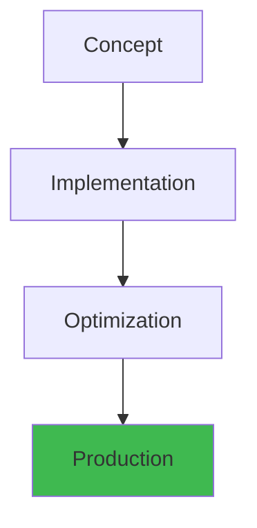
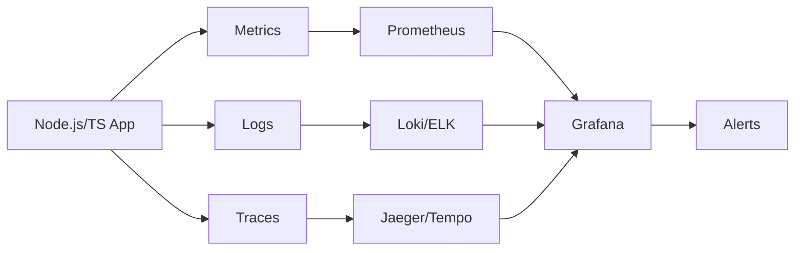

# Advanced TypeScript Types and Patterns


## Overview




## Table of Contents

1. [1. Branded Types for Type Safety](#1-branded-types-for-type-safety)
2. [2. Builder Pattern with Types](#2-builder-pattern-with-types)
3. [3. Fluent API Design with Generics](#3-fluent-api-design-with-generics)
4. [4. Type-Safe Event Emitters](#4-type-safe-event-emitters)
5. [5. Type-Safe State Machines](#5-type-safe-state-machines)
6. [6. Higher-Order Types (HKT Simulation)](#6-higher-order-types-hkt-simulation)
7. [7. Overloads, this Parameters, Assertion Functions](#7-overloads-this-parameters-assertion-functions)
8. [8. Nullish Operators](#8-nullish-operators)
9. [9. Symbol Types, Unique Symbols, Branded Primitives](#9-symbol-types-unique-symbols-branded-primitives)
10. [10. Declaration Merging, Module Augmentation, Global Augmentation](#10-declaration-merging-module-augmentation-global-augmentation)
11. [11. Path Mapping and Exports Maps](#11-path-mapping-and-exports-maps)


---

## 1. Branded Types for Type Safety

### Basic Branded Types
```typescript
declare const brand: unique symbol;

type Brand<T, B extends string> = T & { readonly [brand]: B };

type Email = Brand<string, "Email">;
type PhoneNumber = Brand<string, "Phone">;
type UserId2 = Brand<string, "UserId">;
type ProductId = Brand<string, "ProductId">;
type ProductIdNum = Brand<number, "ProductId">;

function createEmail(value: string): Email {
  if (!value.includes("@")) throw new Error("Invalid email");
  return value as Email;
}

function createUserId(value: string): UserId2 {
  if (!value) throw new Error("Invalid user ID");
  return value as UserId2;
}

function sendEmail(email: Email, subject: string): void {
  console.log(`Sending "${subject}" to ${email}`);
}

const email = createEmail("user@example.com");
const userId = createUserId("abc-123");

sendEmail(email, "Hello");
// sendEmail(userId, "Hello"); // Error: not assignable to Email

// Type-safe database IDs
type EntityId<T extends string> = Brand<string, T>;
type OrderId2 = EntityId<"Order">;
type CustomerId = EntityId<"Customer">;

function findOrder(id: OrderId2): void {}
function findCustomer(id: CustomerId): void {}

const orderId = "ord_123" as OrderId2;
const customerId = "cus_456" as CustomerId;

findOrder(orderId);
// findOrder(customerId); // Error
```

### Nominal Types with Classes
```typescript
// Nominal via class (classes are nominally typed)
class Nominal<T> {
  // eslint-disable-next-line @typescript-eslint/no-unused-vars, no-useless-constructor
  constructor(public readonly value: T) {}
}

class Meters extends Nominal<number> {}
class Seconds extends Nominal<number> {}
class Kilograms extends Nominal<number> {}

function calculateSpeed(distance: Meters, time: Seconds): Meters {
  return new Meters(distance.value / time.value);
}

const distance = new Meters(100);
const time = new Seconds(9.58);
const speed = calculateSpeed(distance, time);
// calculateSpeed(time, distance); // Error: type mismatch

// Type-safe units
interface Unit<T extends string> {
  readonly _unit: T;
  readonly value: number;
}

function createUnit<T extends string>(value: number, unit: T): Unit<T> {
  return { value, _unit: unit } as Unit<T>;
}

type Pixels = Unit<"px">;
type Percentages = Unit<"%">;

function addPixels(a: Pixels, b: Pixels): Pixels {
  return createUnit(a.value + b.value, "px");
}

const width = createUnit(100, "px");
const height = createUnit(200, "px");
const total = addPixels(width, height);
// addPixels(width, createUnit(50, "%")); // Error
```

### Branded Types with Intersections
```typescript
// Flavor pattern (lighter weight)
type Flavor2<F extends string> = { __type?: F };
type FlavorEmail = string & Flavor2<"Email">;
type FlavorUserId = string & Flavor2<"UserId">;

function sendEmail2(to: FlavorEmail, message: string): void {
  console.log(`To ${to}: ${message}`);
}

const userEmail = "alice@example.com" as FlavorEmail;
sendEmail2(userEmail, "Hi!");

// Multi-brand
type Sanitized = Brand<string, "Sanitized">;
type Escaped = Brand<string, "Escaped">;

function sanitize(input: string): Sanitized {
  return input.replace(/<[^>]*>/g, "") as Sanitized;
}

function escape(input: Sanitized): Escaped {
  return input.replace(/&/g, "&amp;") as Escaped;
}

function render(input: Escaped): void {
  document.body.innerHTML = input;
}

const raw = "<script>alert('xss')</script>";
const safe = render(escape(sanitize(raw)));
// render(sanitize(raw)); // Error: missing Escaped brand
```

## 2. Builder Pattern with Types

### Simple Builder
```typescript
class PizzaBuilder {
  private size: number = 12;
  private toppings: string[] = [];
  private crust: string = "regular";
  private cheese: boolean = true;
  private sauce: string = "tomato";

  setSize(size: number): this {
    this.size = size;
    return this;
  }

  addTopping(topping: string): this {
    this.toppings.push(topping);
    return this;
  }

  setCrust(crust: string): this {
    this.crust = crust;
    return this;
  }

  withoutCheese(): this {
    this.cheese = false;
    return this;
  }

  build(): Pizza {
    return new Pizza(this.size, this.toppings, this.crust, this.cheese, this.sauce);
  }
}

class Pizza {
  constructor(
    public readonly size: number,
    public readonly toppings: string[],
    public readonly crust: string,
    public readonly cheese: boolean,
    public readonly sauce: string
  ) {}
}

const pizza = new PizzaBuilder()
  .setSize(16)
  .addTopping("pepperoni")
  .addTopping("mushrooms")
  .setCrust("thin")
  .withoutCheese()
  .build();
```

### Type-Safe Builder (Prevents Invalid States)
```typescript
// Builder with type state — enforces method calling order at compile time
class RequestBuilder<HasUrl extends boolean = false, HasMethod extends boolean = false> {
  private _url: string = "";
  private _method: string = "GET";
  private _headers: Record<string, string> = {};
  private _body?: unknown;

  setUrl(url: string): RequestBuilder<true, HasMethod> {
    this._url = url;
    return this as unknown as RequestBuilder<true, HasMethod>;
  }

  setMethod(method: "GET" | "POST" | "PUT" | "DELETE"): RequestBuilder<HasUrl, true> {
    this._method = method;
    return this as unknown as RequestBuilder<HasUrl, true>;
  }

  setHeader(key: string, value: string): this {
    this._headers[key] = value;
    return this;
  }

  setBody(body: unknown): RequestBuilder<HasUrl, HasMethod> {
    this._body = body;
    return this;
  }

  build(): (HasUrl extends true ? { url: string } : { url?: undefined }) &
    (HasMethod extends true ? { method: string } : { method?: undefined }) {
    return this as any;
  }
}

// Enforces calling setUrl and setMethod before build
// new RequestBuilder().build(); // Error: both false
// new RequestBuilder().setUrl("/api").build(); // Error: method missing
new RequestBuilder()
  .setUrl("/api")
  .setMethod("GET")
  .build(); // OK

// Staged builder pattern
interface UserBuilderState {
  name?: string;
  email?: string;
  age?: number;
}

class UserBuilder<S extends UserBuilderState = {}> {
  private state: S;

  constructor(state: S = {} as S) {
    this.state = state;
  }

  setName<N extends string>(name: N): UserBuilder<S & { name: N }> {
    return new UserBuilder({ ...this.state, name });
  }

  setEmail<E extends string>(email: E): UserBuilder<S & { email: E }> {
    return new UserBuilder({ ...this.state, email });
  }

  setAge<A extends number>(age: A): UserBuilder<S & { age: A }> {
    return new UserBuilder({ ...this.state, age });
  }

  build(): S extends { name: string; email: string; age: number } ? S : never {
    if (!this.state.name || !this.state.email || !this.state.age) {
      throw new Error("Missing required fields");
    }
    return this.state as any;
  }
}

const user = new UserBuilder()
  .setName("Alice")
  .setEmail("alice@example.com")
  .setAge(30)
  .build();
```

## 3. Fluent API Design with Generics

### Generic Fluent API
```typescript
interface Queryable<T> {
  where<K extends keyof T>(key: K, value: T[K]): Queryable<T>;
  select<K extends keyof T>(...keys: K[]): Queryable<Pick<T, K>>;
  orderBy<K extends keyof T>(key: K, direction: "asc" | "desc"): Queryable<T>;
  limit(n: number): Queryable<T>;
  execute(): Promise<T[]>;
}

class DatabaseQuery<T extends Record<string, unknown>> implements Queryable<T> {
  private filters: Array<(item: T) => boolean> = [];
  private selectedKeys?: (keyof T)[];
  private sortKey?: keyof T;
  private sortDir: "asc" | "desc" = "asc";
  private limitCount?: number;

  where<K extends keyof T>(key: K, value: T[K]): this {
    this.filters.push((item) => item[key] === value);
    return this;
  }

  select<K extends keyof T>(...keys: K[]): Queryable<Pick<T, K>> {
    this.selectedKeys = keys;
    return this as unknown as Queryable<Pick<T, K>>;
  }

  orderBy<K extends keyof T>(key: K, direction: "asc" | "desc" = "asc"): this {
    this.sortKey = key;
    this.sortDir = direction;
    return this;
  }

  limit(n: number): this {
    this.limitCount = n;
    return this;
  }

  async execute(): Promise<T[]> {
    // Simulated query execution
    return [] as T[];
  }
}

// Generic pipeline
type Pipeline<T, R> = {
  pipe: <U>(fn: (value: T) => U) => Pipeline<U, R>;
  map: <U>(fn: (value: T) => U) => Pipeline<U, R>;
  filter: (fn: (value: T) => boolean) => Pipeline<T, R>;
  reduce: <U>(fn: (acc: U, value: T) => U, initial: U) => Pipeline<U, R>;
  value: () => T;
};

function createPipeline<T>(initial: T): Pipeline<T, T> {
  let current: T = initial;

  return {
    pipe<U>(fn: (value: T) => U): Pipeline<U, R> {
      current = fn(current) as any;
      return this as any;
    },
    map<U>(fn: (value: T) => U): Pipeline<U, R> {
      return createPipeline(fn(current)) as any;
    },
    filter(fn: (value: T) => boolean): Pipeline<T, R> {
      if (!fn(current)) throw new Error("Filtered out");
      return this as any;
    },
    reduce<U>(fn: (acc: U, value: T) => U, initial: U): Pipeline<U, R> {
      return createPipeline(fn(initial, current)) as any;
    },
    value: () => current,
  };
}
```

### Fluent Validation API
```typescript
class Validator<T, P extends keyof T = keyof T> {
  private rules: Array<(value: T) => string | null> = [];
  private property?: P;

  for<K extends keyof T>(property: K): Validator<T, K> {
    const v = new Validator<T, K>();
    v.property = property;
    return v;
  }

  isRequired(): this {
    this.rules.push((obj) => {
      const val = this.property ? obj[this.property] : obj;
      return val == null ? "Required" : null;
    });
    return this;
  }

  isEmail(): this {
    this.rules.push((obj) => {
      const val = String(this.property ? obj[this.property] : obj);
      return val.includes("@") ? null : "Invalid email";
    });
    return this;
  }

  minLength(len: number): Validator<T, P> {
    this.rules.push((obj) => {
      const val = String(this.property ? obj[this.property] : obj);
      return val.length < len ? `Min ${len} chars` : null;
    });
    return this;
  }

  matches(regex: RegExp): this {
    this.rules.push((obj) => {
      const val = String(this.property ? obj[this.property] : obj);
      return regex.test(val) ? null : "No match";
    });
    return this;
  }

  validate(obj: T): string[] {
    if (!this.property) {
      return this.rules.map((r) => r(obj)).filter(Boolean) as string[];
    }
    return this.rules.map((r) => r(obj)).filter(Boolean) as string[];
  }
}

interface UserInput {
  name: string;
  email: string;
  password: string;
  age: number;
}

const userValidator = new Validator<UserInput>()
  .for("name").isRequired().minLength(2)
  .for("email").isRequired().isEmail()
  .for("password").isRequired().minLength(8).matches(/[A-Z]/);
```

## 4. Type-Safe Event Emitters

### Generic Event Emitter
```typescript
type EventMap = Record<string, unknown[]>;

class TypedEventEmitter<T extends EventMap> {
  private listeners: Map<keyof T, Set<(...args: any[]) => void>> = new Map();

  on<K extends keyof T>(event: K, listener: (...args: T[K]) => void): this {
    if (!this.listeners.has(event)) {
      this.listeners.set(event, new Set());
    }
    this.listeners.get(event)!.add(listener);
    return this;
  }

  off<K extends keyof T>(event: K, listener: (...args: T[K]) => void): this {
    this.listeners.get(event)?.delete(listener);
    return this;
  }

  once<K extends keyof T>(event: K, listener: (...args: T[K]) => void): this {
    const wrapper = (...args: T[K]) => {
      listener(...args);
      this.off(event, wrapper);
    };
    return this.on(event, wrapper as typeof listener);
  }

  emit<K extends keyof T>(event: K, ...args: T[K]): boolean {
    const set = this.listeners.get(event);
    if (!set) return false;
    set.forEach((listener) => listener(...args));
    return true;
  }

  removeAllListeners(): void {
    this.listeners.clear();
  }

  listenerCount<K extends keyof T>(event: K): number {
    return this.listeners.get(event)?.size ?? 0;
  }
}

// Usage
interface AppEvents {
  userLogin: [userId: string, timestamp: Date];
  dataLoaded: [data: unknown, durationMs: number];
  error: [error: Error, context?: string];
  stateChange: [prev: string, next: string];
}

const emitter = new TypedEventEmitter<AppEvents>();

emitter.on("userLogin", (userId, timestamp) => {
  console.log(`User ${userId} logged in at ${timestamp}`);
});

emitter.on("error", (error, context) => {
  console.error(`Error${context ? ` in ${context}` : ""}:`, error);
});

emitter.emit("userLogin", "user_123", new Date());
emitter.emit("error", new Error("Something went wrong"), "App startup");
```

### Extended: Async Event Emitter
```typescript
class AsyncEventEmitter<T extends EventMap> extends TypedEventEmitter<T> {
  async emitAsync<K extends keyof T>(event: K, ...args: T[K]): Promise<boolean> {
    const set = this.listeners.get(event);
    if (!set) return false;
    const promises = Array.from(set).map((listener) => {
      const result = listener(...args);
      return result instanceof Promise ? result : Promise.resolve(result);
    });
    await Promise.all(promises);
    return true;
  }

  // Emit serially (in order)
  async emitSerial<K extends keyof T>(event: K, ...args: T[K]): Promise<boolean> {
    const set = this.listeners.get(event);
    if (!set) return false;
    for (const listener of set) {
      const result = listener(...args);
      if (result instanceof Promise) await result;
    }
    return true;
  }
}

// Middleware-style event processing
interface MiddlewareEvent<T> {
  data: T;
  next: () => Promise<void>;
  abort: () => void;
}

class MiddlewareEmitter<T extends EventMap> extends TypedEventEmitter<T> {
  private middleware: Map<keyof T, Array<(args: any[]) => boolean | Promise<boolean>>> = new Map();

  use<K extends keyof T>(event: K, fn: (args: T[K]) => boolean | Promise<boolean>): void {
    if (!this.middleware.has(event)) {
      this.middleware.set(event, []);
    }
    this.middleware.get(event)!.push(fn);
  }

  emit<K extends keyof T>(event: K, ...args: T[K]): boolean {
    const handlers = this.middleware.get(event);
    if (handlers) {
      for (const handler of handlers) {
        if (!handler(args)) return false; // Blocked by middleware
      }
    }
    return super.emit(event, ...args);
  }
}
```

## 5. Type-Safe State Machines

### Simple State Machine
```typescript
type StateMachine<State extends string, Event extends string> = {
  initial: State;
  states: Record<State, Partial<Record<Event, State>>>;
};

type MachineState<T> = {
  value: T;
  transitions: Record<string, any>;
};

function createMachine<S extends string, E extends string>(
  config: StateMachine<S, E>
): MachineState<S> {
  return {
    value: config.initial,
    transitions: config.states,
  };
}

// Typed state machine
interface TrafficLightState {
  readonly value: "green" | "yellow" | "red";
  readonly canProceed: boolean;
  readonly transition: (event: "tick" | "emergency") => TrafficLightState;
}

function createTrafficLight(): TrafficLightState {
  const transitions: Record<string, Record<string, string>> = {
    green: { tick: "yellow", emergency: "red" },
    yellow: { tick: "red", emergency: "red" },
    red: { tick: "green", emergency: "red" },
  };

  let current: "green" | "yellow" | "red" = "green";

  return {
    get value() { return current; },
    get canProceed() { return current === "green"; },
    transition(event: "tick" | "emergency"): TrafficLightState {
      const next = transitions[current]?.[event];
      if (next) {
        current = next as typeof current;
      }
      return this;
    },
  };
}
```

### Full Type-Safe State Machine with Guards
```typescript
type EventHandler<TContext, TEvent> = {
  guard?: (context: TContext, event: TEvent) => boolean;
  action?: (context: TContext, event: TEvent) => TContext;
  target: string;
};

type StateConfig<TContext, TState extends string, TEvent extends string> = {
  initial: TState;
  context: TContext;
  states: Record<TState, {
    on: Partial<Record<TEvent, EventHandler<TContext, TEvent> | string>>;
    entry?: (context: TContext) => void;
    exit?: (context: TContext) => void;
  }>;
};

class FiniteStateMachine<TContext, TState extends string, TEvent extends string> {
  private state: TState;
  private context: TContext;
  private readonly config: StateConfig<TContext, TState, TEvent>;

  constructor(config: StateConfig<TContext, TState, TEvent>) {
    this.config = config;
    this.state = config.initial;
    this.context = { ...config.context };
    this.runEntry(this.state);
  }

  get currentState(): TState { return this.state; }
  get currentContext(): TContext { return this.context; }

  private runEntry(state: TState): void {
    this.config.states[state]?.entry?.(this.context);
  }

  private runExit(state: TState): void {
    this.config.states[state]?.exit?.(this.context);
  }

  transition(event: TEvent): this {
    const stateConfig = this.config.states[this.state];
    const handler = stateConfig.on[event];

    if (!handler) {
      console.warn(`Event "${event}" not handled in state "${this.state}"`);
      return this;
    }

    const resolved: EventHandler<TContext, TEvent> =
      typeof handler === "string" ? { target: handler } : handler;

    if (resolved.guard && !resolved.guard(this.context, event as any)) {
      console.warn(`Guard prevented transition from "${this.state}" via "${event}"`);
      return this;
    }

    this.runExit(this.state);
    this.state = resolved.target as TState;
    if (resolved.action) {
      this.context = resolved.action(this.context, event as any);
    }
    this.runEntry(this.state);
    return this;
  }

  can(event: TEvent): boolean {
    return !!this.config.states[this.state]?.on[event];
  }
}

// Example: Order state machine
interface OrderContext {
  items: string[];
  total: number;
  paid: boolean;
  shipped: boolean;
}

type OrderState = "cart" | "checkout" | "paid" | "shipped" | "delivered" | "cancelled";
type OrderEvent = "checkout" | "pay" | "ship" | "deliver" | "cancel" | "refund";

const orderMachine = new FiniteStateMachine<OrderContext, OrderState, OrderEvent>({
  initial: "cart",
  context: { items: [], total: 0, paid: false, shipped: false },
  states: {
    cart: {
      on: {
        checkout: { target: "checkout", guard: (ctx) => ctx.items.length > 0 },
        cancel: { target: "cancelled" },
      },
    },
    checkout: {
      entry: (ctx) => console.log("Entering checkout"),
      on: {
        pay: { target: "paid", action: (ctx) => ({ ...ctx, paid: true }) },
        cancel: { target: "cancelled" },
      },
      exit: (ctx) => console.log("Leaving checkout"),
    },
    paid: {
      on: {
        ship: { target: "shipped", guard: (ctx) => ctx.paid },
        refund: { target: "cancelled" },
      },
    },
    shipped: {
      entry: (ctx) => console.log("Order shipped!"),
      on: {
        deliver: { target: "delivered", action: (ctx) => ({ ...ctx, shipped: true }) },
      },
    },
    delivered: { on: {} },
    cancelled: { on: {} },
  },
});

orderMachine.transition("checkout"); // Guard: no items — blocked
orderMachine.currentContext.items.push("Widget");
orderMachine.transition("checkout"); // OK
orderMachine.transition("pay");
orderMachine.transition("ship");
orderMachine.transition("deliver");
console.log(orderMachine.currentState); // "delivered"
```

## 6. Higher-Order Types (HKT Simulation)

### Simulating Higher-Kinded Types
```typescript
// TypeScript doesn't have native HKTs, but we can simulate them
interface HKT<F extends string, A> {
  _F: F;
  _A: A;
}

// Type-level function registry
interface FunctorFns {
  Option: <A>(x: A | null) => Option<A>;
  List: <A>(x: A[]) => List<A>;
  Promise: <A>(x: Promise<A>) => Promise<A>;
}

// Concrete type constructors
type Option<A> = A | null;
type List<A> = A[];

// Apply a type constructor
type Apply<F extends string, A> =
  F extends "Option" ? Option<A> :
  F extends "List" ? List<A> :
  F extends "Promise" ? Promise<A> :
  never;

// map for any functor
type Map<F extends string, A, B> = (f: (a: A) => B) => (fa: Apply<F, A>) => Apply<F, B>;

const optionMap: Map<"Option", number, string> = (f) => (fa) =>
  fa === null ? null : f(fa);

const listMap: Map<"List", number, string> = (f) => (fa) =>
  fa.map(f);

// HKT interface pattern
interface TypeClass<F extends string> {
  map: <A, B>(f: (a: A) => B) => (fa: Apply<F, A>) => Apply<F, B>;
}

function createTypeClass<F extends string>(impl: TypeClass<F>): TypeClass<F> {
  return impl;
}

const optionClass = createTypeClass<"Option">({
  map: (f) => (fa) => fa === null ? null : f(fa),
});

// Generic operation over any type class
function incrementAll<F extends string>(tc: TypeClass<F>, values: Apply<F, number>): Apply<F, number> {
  return tc.map((n) => n + 1)(values);
}

console.log(incrementAll(optionClass, 5)); // 6
console.log(incrementAll(optionClass, null)); // null
```

### Type-Level Programming
```typescript
// Type-level natural numbers (Peano)
type Zero = { tag: "zero" };
type Succ<N> = { tag: "succ"; prev: N };

type One = Succ<Zero>;
type Two = Succ<One>;
type Three = Succ<Two>;

// Type-level addition
type Add<A, B> =
  A extends Zero ? B :
  A extends Succ<infer APrev> ? Succ<Add<APrev, B>> :
  never;

type TwoPlusThree = Add<Two, Three>; // Succ<Succ<Succ<Succ<Succ<Zero>>>>>

// Type-level comparison
type IsZero<N> = N extends Zero ? true : false;
type IsOne<N> = N extends Succ<Zero> ? true : false;

// Type-level Fibonacci
type Fib<N> =
  N extends Zero ? Zero :
  N extends Succ<Zero> ? Succ<Zero> :
  N extends Succ<Succ<infer N2>> ? Add<Fib<N2>, Fib<Succ<N2>>> :
  never;

// Type-level lists
type TypeList<A extends unknown[]> = A;
type Head<L extends unknown[]> = L extends [infer H, ...unknown[]] ? H : never;
type Tail<L extends unknown[]> = L extends [unknown, ...infer T] ? T : never;
type Cons<H, L extends unknown[]> = [H, ...L];

type NumList = [1, 2, 3, 4, 5];
type NumHead = Head<NumList>; // 1
type NumTail = Tail<NumList>; // [2, 3, 4, 5]
type Prepended = Cons<0, NumList>; // [0, 1, 2, 3, 4, 5]

// Type-level map over a tuple
type TupleMap<F extends string, T extends unknown[]> =
  T extends [infer H, ...infer R]
    ? [Apply<F, H>, ...TupleMap<F, R>]
    : [];

type MaybeNumbers = TupleMap<"Option", [1, 2, 3]>;
// [Option<1>, Option<2>, Option<3>] => [1 | null, 2 | null, 3 | null]
```

## 7. Overloads, this Parameters, Assertion Functions

### Function Overloads
```typescript
// Overloaded function signatures
function parse(input: string): Record<string, unknown>;
function parse(input: string[]): Record<string, unknown>[];
function parse(input: string | string[]): Record<string, unknown> | Record<string, unknown>[] {
  if (Array.isArray(input)) {
    return input.map((s) => JSON.parse(s));
  }
  return JSON.parse(input);
}

// HTML element overloads
function createElement(tag: "div"): HTMLDivElement;
function createElement(tag: "span"): HTMLSpanElement;
function createElement(tag: "a"): HTMLAnchorElement;
function createElement(tag: "input"): HTMLInputElement;
function createElement(tag: string): HTMLElement {
  return document.createElement(tag);
}

const div = createElement("div"); // HTMLDivElement
const input = createElement("input"); // HTMLInputElement

// Overloads with different arities
function join(delimiter: string, ...items: string[]): string;
function join(...items: string[]): string;
function join(firstOrDelim: string, ...rest: string[]): string {
  if (rest.length === 0) return firstOrDelim;
  return rest.join(firstOrDelim);
}

join(", ", "a", "b", "c"); // "a, b, c"
join("a", "b", "c"); // "abc"

// Overloads with different return types
class DataFetcher {
  fetch(url: string): Promise<Response>;
  fetch<T>(url: string, parser: (data: unknown) => T): Promise<T>;
  fetch<T>(url: string, parser?: (data: unknown) => T): Promise<Response | T> {
    return fetch(url).then((res) => {
      if (parser) return res.json().then(parser);
      return res;
    });
  }
}
```

### this Parameters
```typescript
// Typing the 'this' context
interface Clickable {
  click(): void;
  disabled: boolean;
}

function handleClick(this: Clickable, event: MouseEvent): void {
  if (this.disabled) return;
  this.click();
}

const button: Clickable = {
  disabled: false,
  click() { console.log("Clicked!"); },
};

button.click = handleClick; // OK

// 'this' parameter for method chaining
class Chainable<T> {
  constructor(private value: T) {}

  map<U>(fn: (value: T) => U): Chainable<U> {
    return new Chainable(fn(this.value));
  }

  tap(fn: (value: T) => void): this {
    fn(this.value);
    return this;
  }

  valueOf(): T {
    return this.value;
  }
}

// 'this' in callback type safety
interface DOMEventHandler<T extends HTMLElement> {
  (this: T, event: Event): void;
}

function addListener<T extends HTMLElement>(
  element: T,
  event: string,
  handler: DOMEventHandler<T>
): void {
  element.addEventListener(event, handler as EventListener);
}

// 'this' type in generic functions
function getPropertyDescriptor<T, K extends keyof T>(
  this: T,
  key: K
): PropertyDescriptor | undefined {
  return Object.getOwnPropertyDescriptor(this, key);
}
```

### Assertion Functions
```typescript
// Custom assertion functions
function assertIsString(value: unknown): asserts value is string {
  if (typeof value !== "string") {
    throw new Error("Expected string");
  }
}

function assertIsNumber(value: unknown): asserts value is number {
  if (typeof value !== "number") {
    throw new Error("Expected number");
  }
}

function processValue(value: unknown): string {
  assertIsString(value);
  return value.toUpperCase(); // value is string here
}

// Assert with custom error
class ValidationError extends Error {
  constructor(message: string, public readonly field: string) {
    super(message);
  }
}

function assertDefined<T>(value: T, name: string): asserts value is NonNullable<T> {
  if (value == null) {
    throw new ValidationError(`${name} is required`, name);
  }
}

function createConfig(options: { host?: string; port?: number }): { host: string; port: number } {
  assertDefined(options.host, "host");
  assertDefined(options.port, "port");
  return { host: options.host, port: options.port };
}

// Assertion function for invariants
function assert(condition: boolean, message?: string): asserts condition {
  if (!condition) throw new Error(message ?? "Assertion failed");
}

function divide(a: number, b: number): number {
  assert(b !== 0, "Division by zero");
  return a / b;
}

// Type narrowing with assertion
interface SuccessResponse {
  ok: true;
  data: unknown;
}

interface ErrorResponse {
  ok: false;
  error: string;
}

type APIResponse = SuccessResponse | ErrorResponse;

function assertSuccess(response: APIResponse): asserts response is SuccessResponse {
  if (!response.ok) throw new Error(response.error);
}

function handleResponse(response: APIResponse): unknown {
  assertSuccess(response);
  return response.data; // narrowed to SuccessResponse
}
```

## 8. Nullish Operators

### Nullish Coalescing (??)
```typescript
// ?? vs ||
const value1 = 0;
const result1 = value1 || "default"; // "default" (0 is falsy)
const result2 = value1 ?? "default"; // 0 (only null/undefined)

const value2 = "";
const result3 = value2 || "fallback"; // "fallback"
const result4 = value2 ?? "fallback"; // ""

const value3 = false;
const result5 = value3 || true; // true
const result6 = value3 ?? true; // false

// Common use case: configuration defaults
interface Config2 {
  host?: string;
  port?: number;
  timeout?: number;
  retries?: number;
}

function createConfig2(userConfig: Config2): Required<Config2> {
  return {
    host: userConfig.host ?? "localhost",
    port: userConfig.port ?? 3000,
    timeout: userConfig.timeout ?? 5000,
    retries: userConfig.retries ?? 3,
  };
}

// Nested ?? with short-circuit
const a = null;
const b = undefined;
const c = "actual";
const result = a ?? b ?? c ?? "never"; // "actual"

// ?? with optional chaining
type UserConfig = { db?: { host?: string; port?: number } };
const config3: UserConfig = { db: { host: "prod-db.example.com" } };
const dbHost = config3.db?.host ?? "localhost";
const dbPort = config3.db?.port ?? 5432;
```

### Optional Chaining (?.)
```typescript
interface User2 {
  name: string;
  address?: {
    street: string;
    city: string;
    zip?: string;
  };
  getPermissions?: () => string[];
}

function getCity(user: User2): string | undefined {
  return user.address?.city;
}

function getFirstPermission(user: User2): string | undefined {
  return user.getPermissions?.()?.[0];
}

// Deeply nested optional chaining
interface AppConfig {
  features?: {
    dashboard?: {
      enabled?: boolean;
      widgets?: Array<{ type: string; config?: Record<string, unknown> }>;
    };
  };
}

function isDashboardEnabled(config: AppConfig): boolean {
  return config.features?.dashboard?.enabled ?? false;
}

function getFirstWidgetType(config: AppConfig): string | undefined {
  return config.features?.dashboard?.widgets?.[0]?.type;
}

// Optional chaining with bracket notation
const data2: Record<string, any> = {};
const result7 = data2.users?.[0]?.profile?.name;

// Optional chaining in expressions
const length = config3.db?.host?.length; // number | undefined

// Array method optional chaining
const arr: number[] | null = Math.random() > 0.5 ? [1, 2, 3] : null;
const first = arr?.[0]; // number | undefined
const mapped = arr?.map((x) => x * 2); // number[] | undefined
```

### Nullish Assignment (??=)
```typescript
// Logical nullish assignment
let x: string | null | undefined = null;
x ??= "default"; // x = "default"

// Useful for lazy initialization
class Cache {
  private data: Map<string, unknown> | null = null;

  get(key: string): unknown | undefined {
    this.data ??= new Map();
    return this.data.get(key);
  }

  set(key: string, value: unknown): void {
    this.data ??= new Map();
    this.data.set(key, value);
  }
}

// With object properties
interface Options {
  timeout?: number;
  retries?: number;
}

function processOptions(opts: Options): void {
  opts.timeout ??= 5000;
  opts.retries ??= 3;
}

// Pattern: default values with ??=
function ensureConfig(config: Partial<Config2>): void {
  config.host ??= "localhost";
  config.port ??= 3000;
  config.timeout ??= 5000;
  config.retries ??= 3;
}
```

## 9. Symbol Types, Unique Symbols, Branded Primitives

### Unique Symbols
```typescript
// Unique symbols — always have literal type
const uniqueSym: unique symbol = Symbol("unique");
const anotherSym: unique symbol = Symbol("another");

// Declared unique symbols for module exports
declare const SESSION_KEY: unique symbol;
declare const API_KEY: unique symbol;

interface Session {
  [SESSION_KEY]: string;
  userId: string;
  expires: Date;
}

function createSession(userId: string): Session {
  return {
    [SESSION_KEY]: crypto.randomUUID(),
    userId,
    expires: new Date(Date.now() + 3600000),
  };
}

// Using unique symbols as branded keys
type SymBrand<T extends symbol> = { readonly _brand: T };

function createBrand<T extends symbol>(sym: T): <V>(value: V) => V & SymBrand<T> {
  return (value) => value as V & SymBrand<T>;
}

const userNameBrand = Symbol("userName");
const createUserName = createBrand(userNameBrand);

const name2 = createUserName("Alice");
// Type: string & SymBrand<typeof userNameBrand>
```

### Well-Known Symbols
```typescript
// Symbol.iterator for custom iteration
class Range {
  constructor(private start: number, private end: number) {}

  *[Symbol.iterator](): Iterator<number> {
    for (let i = this.start; i <= this.end; i++) {
      yield i;
    }
  }

  [Symbol.toPrimitive](hint: string): number | string {
    if (hint === "number") return this.start;
    return `Range(${this.start}-${this.end})`;
  }

  [Symbol.hasInstance](instance: number): boolean {
    return instance >= this.start && instance <= this.end;
  }
}

for (const n of new Range(1, 5)) {
  console.log(n); // 1, 2, 3, 4, 5
}

// Symbol.toStringTag for custom string tag
class Vector {
  constructor(public x: number, public y: number) {}
  get [Symbol.toStringTag](): string {
    return "Vector";
  }
}
console.log(Object.prototype.toString.call(new Vector(1, 2))); // [object Vector]

// Symbol.species for custom constructor
class MyArray<T> extends Array<T> {
  static get [Symbol.species](): ArrayConstructor {
    return Array;
  }

  first(): T | undefined {
    return this[0];
  }
}

const myArr = new MyArray(1, 2, 3);
const mapped = myArr.map((x) => x * 2); // Array, not MyArray (due to species)
```

### Branded Primitives with Symbols
```typescript
// Using symbols for stronger branding
namespace Brand {
  export const UserId = Symbol("UserId");
  export const Email = Symbol("Email");
  export const HashedPassword = Symbol("HashedPassword");
}

type BrandedUserId = string & { [Brand.UserId]: true };
type BrandedEmail = string & { [Brand.Email]: true };
type BrandedPassword = string & { [Brand.HashedPassword]: true };

function hashPassword(password: string): BrandedPassword {
  return crypto.createHash("sha256").update(password).digest("hex") as BrandedPassword;
}

function createUser(name: string, email: BrandedEmail): { id: BrandedUserId; name: string; email: BrandedEmail } {
  return { id: crypto.randomUUID() as BrandedUserId, name, email };
}

// Type-safe event symbols
const Events = {
  UserCreated: Symbol("UserCreated") as unique symbol,
  UserDeleted: Symbol("UserDeleted") as unique symbol,
  UserUpdated: Symbol("UserUpdated") as unique symbol,
} as const;

type EventSymbol = typeof Events[keyof typeof Events];

interface EventPayload {
  [Events.UserCreated]: { id: string; name: string; email: string };
  [Events.UserDeleted]: { id: string; reason?: string };
  [Events.UserUpdated]: { id: string; changes: Record<string, unknown> };
}

class EventBus2 {
  private listeners = new Map<symbol, Set<(...args: any[]) => void>>();

  on<E extends EventSymbol>(event: E, handler: (payload: EventPayload[E]) => void): void {
    if (!this.listeners.has(event)) this.listeners.set(event, new Set());
    this.listeners.get(event)!.add(handler);
  }

  emit<E extends EventSymbol>(event: E, payload: EventPayload[E]): void {
    this.listeners.get(event)?.forEach((h) => h(payload));
  }
}
```

## 10. Declaration Merging, Module Augmentation, Global Augmentation

### Declaration Merging
```typescript
// Interface merging
interface Box2 {
  width: number;
  height: number;
}

interface Box2 {
  depth: number;
  label?: string;
}

const box: Box2 = { width: 10, height: 20, depth: 30 };

// Namespace merging with class
class Car {
  constructor(public make: string, public model: string) {}
}

namespace Car {
  export function fromVIN(vin: string): Car {
    // Parse VIN logic
    return new Car("Toyota", "Camry");
  }

  export type CarType = "sedan" | "suv" | "truck";
}

const myCar = Car.fromVIN("1234567890");
const type: Car.CarType = "sedan";

// Namespace merging with function
function createUUID(): string {
  return crypto.randomUUID();
}

namespace createUUID {
  export const NIL = "00000000-0000-0000-0000-000000000000";
  export function validate(uuid: string): boolean {
    return /^[0-9a-f]{8}-[0-9a-f]{4}-[1-5][0-9a-f]{3}-[89ab][0-9a-f]{3}-[0-9a-f]{12}$/i.test(uuid);
  }
}

// Enum merging (not allowed)
// enum Color { Red = 1 }
// enum Color { Blue = 2 } // Error
```

### Module Augmentation
```typescript
// augments.d.ts (module augmentation)
import "express";

declare module "express" {
  interface Request {
    user?: {
      id: number;
      name: string;
      email: string;
      roles: string[];
    };
    startTime: number;
  }

  interface Response {
    sendJson(data: unknown, statusCode?: number): void;
  }
}

// Implementation after augmentation
import express from "express";

const app = express();
app.use((req, res, next) => {
  req.startTime = Date.now();
  res.sendJson = (data, statusCode = 200) => {
    res.status(statusCode).json({
      data,
      meta: { responseTime: Date.now() - req.startTime },
    });
  };
  next();
});

// Augment third-party module types
import "lodash";

declare module "lodash" {
  interface LoDashStatic {
    // Add type-safe deep clone
    deepClone<T>(obj: T): T;
    // Add partition by predicate
    partitionBy<T>(arr: T[], predicate: (item: T) => boolean): [T[], T[]];
  }
}

// Augment built-in types
interface Array<T> {
  shuffle(): T[];
  groupBy<K extends string | number | symbol>(keyFn: (item: T) => K): Record<K, T[]>;
}

Array.prototype.shuffle = function<T>(this: T[]): T[] {
  const arr = [...this];
  for (let i = arr.length - 1; i > 0; i--) {
    const j = Math.floor(Math.random() * (i + 1));
    [arr[i], arr[j]] = [arr[j], arr[i]];
  }
  return arr;
};

Array.prototype.groupBy = function<T, K extends string | number | symbol>(
  this: T[],
  keyFn: (item: T) => K
): Record<K, T[]> {
  return this.reduce((acc, item) => {
    const key = keyFn(item);
    (acc[key] ??= []).push(item);
    return acc;
  }, {} as Record<K, T[]>);
};
```

### Global Augmentation
```typescript
// global.d.ts
declare global {
  interface Window {
    __APP_VERSION__: string;
    __ENV__: "development" | "staging" | "production";
    analytics: {
      track(event: string, properties?: Record<string, unknown>): void;
      identify(userId: string, traits?: Record<string, unknown>): void;
    };
  }

  interface StringConstructor {
    random(length?: number, charset?: string): string;
    capitalize<T extends string>(str: T): Capitalize<T>;
  }

  interface Console {
    success(message: string, ...args: unknown[]): void;
  }
}

// Implementation
String.random = (length = 16, charset = "abcdefghijklmnopqrstuvwxyz0123456789") => {
  let result = "";
  for (let i = 0; i < length; i++) {
    result += charset.charAt(Math.floor(Math.random() * charset.length));
  }
  return result;
};

String.capitalize = <T extends string>(str: T): Capitalize<T> => {
  return (str.charAt(0).toUpperCase() + str.slice(1)) as Capitalize<T>;
};

console.success = (message, ...args) => {
  console.log(`%c✓ ${message}`, "color: green; font-weight: bold", ...args);
};

// Usage
window.__APP_VERSION__ = "1.0.0";
window.analytics.track("page_view", { page: "/home" });

const randomId = String.random();
const capitalized = String.capitalize("hello"); // "Hello"
console.success("App initialized");
```

## 11. Path Mapping and Exports Maps

### tsconfig Path Mapping
```typescript
// tsconfig.json
// {
//   "compilerOptions": {
//     "baseUrl": ".",
//     "paths": {
//       "@/*": ["src/*"],
//       "@components/*": ["src/components/*"],
//       "@utils/*": ["src/utils/*"],
//       "@shared/*": ["../shared/*"],
//       "@types": ["src/types/index.ts"]
//     }
//   }
// }

// Usage in code
import { Button } from "@components/Button";
import { formatDate } from "@utils/date";
import { User } from "@types";

// Paths with wildcards
// "@shared/*": ["../packages/shared/src/*"]

// Multiple fallback locations
// "@config": ["src/config/production.ts", "src/config/development.ts", "src/config/local.ts"]
```

### Package Exports Map (package.json)
```typescript
// package.json
// {
//   "exports": {
//     ".": {
//       "types": "./dist/index.d.ts",
//       "import": "./dist/index.mjs",
//       "require": "./dist/index.cjs"
//     },
//     "./utils": {
//       "types": "./dist/utils/index.d.ts",
//       "import": "./dist/utils/index.mjs",
//       "require": "./dist/utils/index.cjs"
//     },
//     "./react": {
//       "types": "./dist/react/index.d.ts",
//       "import": "./dist/react/index.mjs",
//       "require": "./dist/react/index.cjs"
//     },
//     "./package.json": "./package.json"
//   }
// }

// Conditional exports with development/production
// {
//   "exports": {
//     "./features": {
//       "development": "./src/features/index.ts",
//       "production": "./dist/features/index.js",
//       "default": "./dist/features/index.js"
//     }
//   }
// }

// Subpath exports with TypeScript
// {
//   "exports": {
//     ".": "./dist/index.js",
//     "./internal": null, // Prevent importing
//     "./internal/*": null // Block entire directory
//   }
// }
```

### Barrel File Best Practices
```typescript
// Bad barrel — re-exports everything
// export { Button } from "./Button";
// export { Input } from "./Input";
// export { Modal } from "./Modal";
// ...

// Better — selective exports with types
export type { ButtonProps } from "./Button";
export { Button } from "./Button";

// With path aliases
// Re-export with renaming for disambiguation
export { Button as UIButton } from "./Button";
export type { ButtonProps as UIButtonProps } from "./Button";

// Dynamic barrel avoidance — import directly instead
// Prefer:
import { specificUtil } from "@utils/specificUtil";
// Over:
import { specificUtil } from "@utils"; // (barrel file that re-exports everything)
```


## Observability



### Key Metrics

| Metric | Unit | Threshold | Indicates |
|--------|------|-----------|-----------|
| Event loop lag | ms | < 50ms | Blocking sync operations |
| GC pause (V8) | ms | < 100ms | Memory pressure |
| Heap used | MB | < 80% limit | Memory leak |
| Active handles | count | < 5000 | Connection leak |
| libuv threadpool busy | % | < 70% | Thread pool starvation |

### Logs

- **ERROR**: Uncaught exceptions, promise rejections, connection pool exhaustion
- **WARN**: Event loop lag > 100ms, memory threshold crossed
- **INFO**: Server start/stop, module load, config loaded
- **DEBUG**: Per-request timing, async operation tracing

### Traces

Use OpenTelemetry JS SDK with auto-instrumentation. Propagate context through `AsyncLocalStorage`.

### Alerts

| Severity | Condition | Response |
|----------|-----------|----------|
| P0 | Event loop lag > 1s | Remove blocking sync operations |
| P1 | Heap > 500MB | Take heap snapshot |
| P2 | GC pause > 1s | Reduce allocation rate |

### Dashboards

**Node.js Runtime Dashboard**: event loop lag, GC pause time, heap used/total, active handles, libuv utilization.
