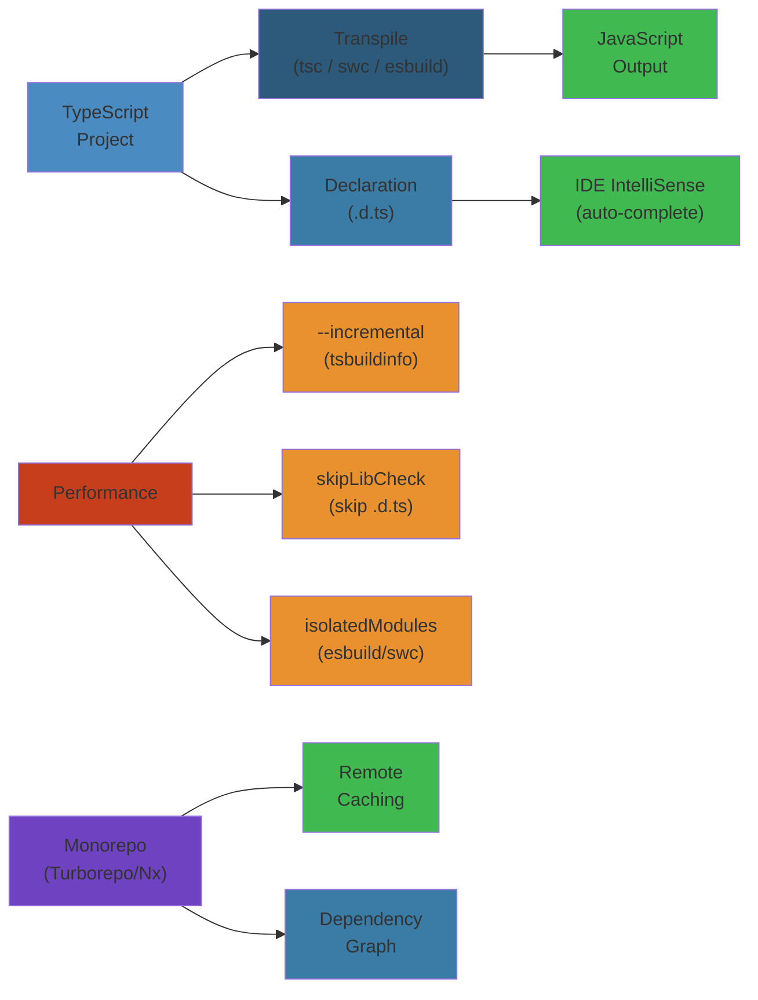
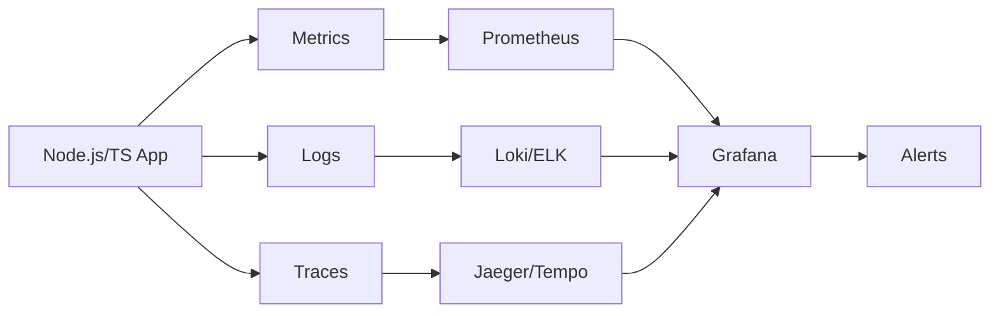

# TypeScript Internals, Performance, and Production Patterns




## Table of Contents

#### Step-by-Step
1. Process input
2. Validate
3. Execute
4. Return result

#### Code Example
```python
# Example implementation
pass
```

#### Real-World Scenario
This pattern is commonly used in production systems.


1. [1. Compiler Internals](#1-compiler-internals)
2. [2. tsconfig: Compiler Options Deep Dive](#2-tsconfig-compiler-options-deep-dive)
3. [3. Performance: Incremental Builds, skipLibCheck, isolatedModules](#3-performance-incremental-builds-skiplibcheck-isolatedmodules)
4. [4. TypeScript with React](#4-typescript-with-react)
5. [5. TypeScript with Node.js](#5-typescript-with-nodejs)
6. [6. TypeScript in Large Codebases](#6-typescript-in-large-codebases)
7. [7. Migration from JS to TypeScript](#7-migration-from-js-to-typescript)
8. [8. Testing TypeScript Types](#8-testing-typescript-types)
9. [9. Production Stories: Type Issues at Scale](#9-production-stories-type-issues-at-scale)
10. [10. Monorepo with TypeScript: Nx, Turborepo](#10-monorepo-with-typescript-nx-turborepo)


---

## 1. Compiler Internals

#### Step-by-Step
1. Process input
2. Validate
3. Execute
4. Return result

#### Code Example
```python
# Example implementation
pass
```

#### Real-World Scenario
This pattern is commonly used in production systems.


### Parser

#### Step-by-Step
1. Process input
2. Validate
3. Execute
4. Return result

#### Code Example
```python
# Example implementation
pass
```

#### Real-World Scenario
This pattern is commonly used in production systems.

```typescript
// The parser creates an AST (Abstract Syntax Tree) from source text
// Key phases: Scanner -> Parser -> AST

// Scanner: breaks source into tokens
// Source: "const x: number = 42;"
// Tokens: [Const, Identifier("x"), Colon, NumberKeyword, Equals, NumericLiteral(42), Semicolon]

// Parser: builds AST from token stream
// Program
//   +- VariableStatement
//        +- ConstKeyword
//        +- VariableDeclarationList
//        |   +- VariableDeclaration
//        |       +- Identifier("x")
//        |       +- NumberKeyword (type annotation)
//        |       +- NumericLiteral(42)
//        +- SemicolonToken

interface Token {
  kind: TokenKind;
  text: string;
  pos: number;
}

enum TokenKind {
  Identifier, NumberKeyword, StringKeyword, BooleanKeyword,
  Colon, Equals, Semicolon, Const, Let, Var,
  NumericLiteral, StringLiteral,
}

interface ASTNode {
  kind: string;
  pos: number;
  end: number;
}

interface VariableDeclaration extends ASTNode {
  kind: "VariableDeclaration";
  name: Identifier;
  typeAnnotation?: TypeNode;
  initializer?: Expression;
}

interface Identifier extends ASTNode {
  kind: "Identifier";
  text: string;
}

interface TypeNode extends ASTNode {
  kind: "TypeReference";
  typeName: string;
}

interface Expression extends ASTNode {}

function getNodeAtPosition(sourceFile: any, pos: number): any {
  function findChild(node: any): any {
    if (pos >= node.getStart() && pos < node.getEnd()) {
      return node.forEachChild(findChild) ?? node;
    }
    return undefined;
  }
  return findChild(sourceFile);
}
```

### Binder

#### Step-by-Step
1. Process input
2. Validate
3. Execute
4. Return result

#### Code Example
```python
# Example implementation
pass
```

#### Real-World Scenario
This pattern is commonly used in production systems.

```typescript
// The binder creates Symbols and Scopes from the AST
// It connects declarations to their references (name resolution)

interface Symbol {
  name: string;
  flags: SymbolFlags;
  declarations: Declaration[];
  valueDeclaration?: Declaration;
  members?: Map<string, Symbol>;
  exports?: Map<string, Symbol>;
  globalExports?: Map<string, Symbol>;
}

enum SymbolFlags {
  None = 0,
  FunctionScopedVariable = 1 << 0,
  BlockScopedVariable = 1 << 1,
  Property = 1 << 2,
  EnumMember = 1 << 3,
  Function = 1 << 4,
  Class = 1 << 5,
  Interface = 1 << 6,
  TypeAlias = 1 << 7,
  Module = 1 << 8,
}

interface Scope {
  kind: ScopeKind;
  parent?: Scope;
  symbols: Map<string, Symbol>;
}

enum ScopeKind {
  Global, Module, Block, Function, Catch, Class, Interface, Enum,
}

// Declaration merging in the binder
// When two interfaces with same name are declared:
// interface User { name: string; }
// interface User { age: number; }
// The binder creates ONE symbol with TWO declarations
// Symbol { name: "User", declarations: [InterfaceDecl1, InterfaceDecl2] }
// The checker then merges them: { name: string; age: number; }

// Module resolution in binder
// import { foo } from "./bar";
// The binder records this as an ImportBinding with a ModuleReference
// The checker resolves "./bar" to a SourceFile using module resolution
```

### Checker

#### Step-by-Step
1. Process input
2. Validate
3. Execute
4. Return result

#### Code Example
```python
# Example implementation
pass
```

#### Real-World Scenario
This pattern is commonly used in production systems.

```typescript
// The checker is the heart of TypeScript
// Key responsibilities: type inference, type compatibility, error reporting

interface Type {
  flags: TypeFlags;
  symbol?: Symbol;
}

enum TypeFlags {
  Any = 1 << 0,
  Unknown = 1 << 1,
  String = 1 << 2,
  Number = 1 << 3,
  Boolean = 1 << 4,
  Void = 1 << 5,
  Undefined = 1 << 6,
  Null = 1 << 7,
  Never = 1 << 8,
  Object = 1 << 9,
  Union = 1 << 10,
  Intersection = 1 << 11,
  Literal = 1 << 12,
  TypeParameter = 1 << 13,
}

interface ObjectType extends Type {
  properties: Symbol[];
  callSignatures: Signature[];
  constructSignatures: Signature[];
  indexInfos: IndexInfo[];
}

interface UnionType extends Type {
  types: Type[];
}

interface IntersectionType extends Type {
  types: Type[];
}

// Type compatibility check (structural)
// function isTypeRelated(source: Type, target: Type, relation: Relation): boolean {
//   For object types: check each property of target exists in source
//   For function types: check parameter contravariance and return covariance
//   For unions: check each member of source is assignable to target
//   For intersections: check source is assignable to each member of target
// }

// Contextual typing example
// When inferring: document.addEventListener("click", (e) => { ... })
// The checker knows addEventListener expects (event: MouseEvent) => void
// So it infers `e` as MouseEvent from context

// Control flow analysis (narrowing)
// function analyzeControlFlow(node: any): NarrowingMap {
//   Track type narrowing through:
//   - typeof guards (typeof x === "string")
//   - instanceof guards (x instanceof Error)
//   - equality checks (x === null)
//   - truthiness checks (if (x))
//   - discriminated unions (switch on kind)
//   - assignment (x = newValue)
// }
```

### Emitter

#### Step-by-Step
1. Process input
2. Validate
3. Execute
4. Return result

#### Code Example
```python
# Example implementation
pass
```

#### Real-World Scenario
This pattern is commonly used in production systems.

```typescript
// The emitter transforms TypeScript AST back to JavaScript
// Targets: ES3, ES5, ES2015-ESNext, and declaration files (.d.ts)

// Emitter pipeline:
// 1. TypeScript AST -> JavaScript AST (downlevel transformation)
// 2. JavaScript AST -> Text (code generation)
// 3. Optional: Source maps generation

// Downlevel transformations:

// Async/await -> Generator-based
// Input: async function fetch() { await getData(); }
// Output (ES5):
// function fetch() { return __awaiter(this, void 0, void 0, function* () { yield getData(); }); }

// Class -> ES5 constructor
// Input:
// class Person { constructor(public name: string) {} greet() { return "Hi"; } }
// Output (ES5):
// var Person = (function () {
//   function Person(name) { this.name = name; }
//   Person.prototype.greet = function () { return "Hi"; };
//   return Person;
// }());

// Declaration emitter (.d.ts generation)
// Input: function add(a: number, b: number): number { return a + b; }
// Output: declare function add(a: number, b: number): number;

// Custom transformer API
// import ts from "typescript";
// const transformer: ts.TransformerFactory<ts.SourceFile> = (context) => {
//   return (sourceFile) => {
//     const visitor = (node: ts.Node): ts.Node => {
//       if (ts.isVariableDeclaration(node) && node.initializer) {
//         // Transform all variable initializers
//       }
//       return ts.visitEachChild(node, visitor, context);
//     };
//     return ts.visitEachChild(sourceFile, visitor, context);
//   };
// };
```

### End-to-End Compiler Flow

#### Step-by-Step
1. Process input
2. Validate
3. Execute
4. Return result

#### Code Example
```python
# Example implementation
pass
```

#### Real-World Scenario
This pattern is commonly used in production systems.

```typescript
// Simplified compiler pipeline
function compile(sourceCode: string, fileName: string): CompileResult {
  // 1. Scanner: source -> tokens
  const scanner = createScanner();
  scanner.setText(sourceCode);

  // 2. Parser: tokens -> AST (SourceFile)
  const sourceFile = parseSourceFile(fileName, sourceCode);

  // 3. Binder: AST -> Symbols + Scopes
  const typeChecker = createTypeChecker();

  // 4. Checker: Type checking + inference
  const diagnostics = typeChecker.getDiagnostics(sourceFile);

  // 5. Emitter: AST -> JavaScript + declarations + source maps
  const output = emitSourceFile(sourceFile);

  return { diagnostics, output };
}

// Watch mode with incremental compilation
function createWatchProgram(configPath: string): void {
  const host = ts.createWatchCompilerHost(
    configPath,
    {},
    ts.sys,
    (diagnostic) => console.log(diagnostic.messageText),
    (status) => console.log(status.messageText)
  );
  ts.createWatchProgram(host);
}

// Incremental compilation caching:
// 1. Program structure (resolved module graph)
// 2. Type checking results per file
// 3. Emit output per file
// On recompilation, only changed files and dependents are re-checked
```

## 2. tsconfig: Compiler Options Deep Dive

#### Step-by-Step
1. Process input
2. Validate
3. Execute
4. Return result

#### Code Example
```python
# Example implementation
pass
```

#### Real-World Scenario
This pattern is commonly used in production systems.


### Strict Mode Family

#### Step-by-Step
1. Process input
2. Validate
3. Execute
4. Return result

#### Code Example
```python
# Example implementation
pass
```

#### Real-World Scenario
This pattern is commonly used in production systems.

```typescript
// All strict flags:
// {
//   "compilerOptions": {
//     "strict": true,
//     // Which expands to:
//     "strictNullChecks": true,       // null/undefined not assignable
//     "strictFunctionTypes": true,    // Function parameter contravariance
//     "strictBindCallApply": true,    // Correct types for bind/call/apply
//     "strictPropertyInitialization": true, // Class properties initialized
//     "noImplicitAny": true,          // Error on implicit any
//     "noImplicitThis": true,         // Error on implicit any for 'this'
//     "alwaysStrict": true,           // "use strict" everywhere
//   }
// }

// Without strictNullChecks:
// const x: string = null; // No error
// x.length; // Runtime error!

// With strictNullChecks:
// const x: string = null; // Error
// const y: string | null = null; // OK
// y.length; // Error: Object is possibly 'null'
```

### Module Resolution Strategies

#### Step-by-Step
1. Process input
2. Validate
3. Execute
4. Return result

#### Code Example
```python
# Example implementation
pass
```

#### Real-World Scenario
This pattern is commonly used in production systems.

```typescript
// {
//   "compilerOptions": {
//     "moduleResolution": "node",         // Classic Node.js resolution
//     "moduleResolution": "nodenext",    // Node.js ESM + CJS (TS 5+)
//     "moduleResolution": "bundler",     // For bundlers (TS 5+)
//
//     "baseUrl": ".",                     // Base for non-relative imports
//     "paths": {                          // Path mapping
//       "@/*": ["./src/*"],
//       "@components/*": ["./src/components/*"]
//     },
//     "rootDirs": ["./src", "./generated"],
//     "typeRoots": ["./node_modules/@types", "./typings"],
//     "types": ["node", "jest", "react"],
//
//     "resolveJsonModule": true,
//     "allowImportingTsExtensions": true,
//     "noUncheckedIndexedAccess": true,
//   }
// }
```

### Output and Target Options

#### Step-by-Step
1. Process input
2. Validate
3. Execute
4. Return result

#### Code Example
```python
# Example implementation
pass
```

#### Real-World Scenario
This pattern is commonly used in production systems.

```typescript
// {
//   "compilerOptions": {
//     // Target
//     "target": "ES2022",
//     // ES3, ES5, ES2015-ES2022, ESNext
//
//     "module": "ESNext",
//     // "CommonJS", "ES2015", "ES2020", "ESNext", "Node16", "NodeNext"
//     // "preserve" (keep as-is for bundler)
//
//     "moduleResolution": "bundler",
//     "esModuleInterop": true,
//     "allowSyntheticDefaultImports": true,
//
//     // Output
//     "outDir": "./dist",
//     "rootDir": "./src",
//     "declaration": true,
//     "declarationDir": "./dist/types",
//     "declarationMap": true,
//     "sourceMap": true,
//     "removeComments": true,
//
//     // JavaScript support
//     "allowJs": true,
//     "checkJs": true,
//     "maxNodeModuleJsDepth": 2,
//   }
// }
```

### Advanced Error Checking

#### Step-by-Step
1. Process input
2. Validate
3. Execute
4. Return result

#### Code Example
```python
# Example implementation
pass
```

#### Real-World Scenario
This pattern is commonly used in production systems.

```typescript
// {
//   "compilerOptions": {
//     // Extra checks beyond strict
//     "noUnusedLocals": true,
//     "noUnusedParameters": true,
//     "noImplicitReturns": true,
//     "noFallthroughCasesInSwitch": true,
//     "noUncheckedIndexedAccess": true,
//     "noPropertyAccessFromIndexSignature": true,
//     "exactOptionalPropertyTypes": true,
//
//     // Type checking
//     "skipLibCheck": true,
//     "forceConsistentCasingInFileNames": true,
//     "isolatedModules": true,
//     "isolatedDeclarations": true,
//
//     // Diagnostics
//     "extendedDiagnostics": true,
//     "generateCpuProfile": "profile.cpuprofile",
//     "listFiles": true,
//     "listEmittedFiles": true,
//     "traceResolution": true,
//
//     // Experimental
//     "experimentalDecorators": true,
//     "emitDecoratorMetadata": true,
//     "useDefineForClassFields": true,
//   }
// }
```

### Project References

#### Step-by-Step
1. Process input
2. Validate
3. Execute
4. Return result

#### Code Example
```python
# Example implementation
pass
```

#### Real-World Scenario
This pattern is commonly used in production systems.

```typescript
// Root tsconfig.json (solution config)
// {
//   "files": [],
//   "references": [
//     { "path": "./packages/core" },
//     { "path": "./packages/utils" },
//     { "path": "./packages/react-components" },
//     { "path": "./apps/web" },
//   ]
// }

// packages/core/tsconfig.json
// {
//   "compilerOptions": {
//     "composite": true,
//     "declaration": true,
//     "declarationMap": true,
//     "outDir": "./dist",
//     "rootDir": "./src",
//     "tsBuildInfoFile": "./dist/.tsbuildinfo",
//   },
//   "include": ["src"]
// }

// apps/web/tsconfig.json
// {
//   "compilerOptions": {
//     "composite": true,
//     "outDir": "./dist",
//     "rootDir": "./src",
//   },
//   "include": ["src"],
//   "references": [
//     { "path": "../../packages/core", "prepend": true },
//     { "path": "../../packages/utils" }
//   ]
// }

// Build commands:
// tsc --build         // Build all in dependency order
// tsc --build --clean // Clean all outputs
// tsc --build --dry   // Preview build
// tsc --build --verbose // Detailed log

// Incremental compilation with --build
// First build: ~30s (full)
// Second build (no changes): ~1s (from .tsbuildinfo)
// Third build (one file changed): ~3s (partial rebuild)
```

## 3. Performance: Incremental Builds, skipLibCheck, isolatedModules

#### Step-by-Step
1. Process input
2. Validate
3. Execute
4. Return result

#### Code Example
```python
# Example implementation
pass
```

#### Real-World Scenario
This pattern is commonly used in production systems.


### Incremental Builds

#### Step-by-Step
1. Process input
2. Validate
3. Execute
4. Return result

#### Code Example
```python
# Example implementation
pass
```

#### Real-World Scenario
This pattern is commonly used in production systems.

```typescript
// tsconfig.json
// {
//   "compilerOptions": {
//     "incremental": true,
//     "tsBuildInfoFile": ".tsbuildinfo",
//   }
// }

// The .tsbuildinfo file contains:
// - File versions and timestamps
// - Dependencies graph between files
// - Emit outputs per file
// - Program structure (resolved modules)

// Build mode with project references (fastest for monorepos):
// tsc --build

// Watch mode with incremental:
// tsc --watch

// Measuring compilation time
function measureCompilation(): void {
  const start = process.hrtime.bigint();
  // run tsc
  const end = process.hrtime.bigint();
  console.log(`Compilation took ${Number(end - start) / 1e6}ms`);
}

// Use diagnostics to find slow files
// tsc --extendedDiagnostics
// Output:
// Files:                         245
// Lines:                       45678
// Identifiers:                123456
// Symbols:                     98765
// Types:                       56789
// Instantiations:             234567
// Memory used:               123456K
// I/O read:                   0.03s
// I/O write:                  0.01s
// Parse time:                 2.45s
// Bind time:                  0.89s
// Check time:                 8.23s
// Emit time:                  1.12s
// Total time:                12.69s
```

### skipLibCheck

#### Step-by-Step
1. Process input
2. Validate
3. Execute
4. Return result

#### Code Example
```python
# Example implementation
pass
```

#### Real-World Scenario
This pattern is commonly used in production systems.

```typescript
// {
//   "compilerOptions": {
//     "skipLibCheck": true,  // Skip type checking .d.ts files
//   }
// }

// Without skipLibCheck: false
// TypeScript checks ALL declaration files
// Including node_modules/@types/* - wasted effort
// A simple npm install adds 50-200+ declaration files

// With skipLibCheck: true
// Only type-check YOUR code
// Savings: 40-70% compilation time reduction

// Risk: declaration file errors are hidden
// Solution: occasionally do a build without skipLibCheck
// Or: ci-tsc --skipLibCheck false in CI

// Comparing compile times:
interface CompileStats {
  files: number;
  timeWithCheck: number;
  timeSkipping: number;
  savingsPercent: number;
}

function estimateSkipLibCheckSavings(files: number): CompileStats {
  const declFiles = Math.floor(files * 0.6);
  const timePerFile = 0.05; // ms per file
  return {
    files,
    timeWithCheck: files * timePerFile,
    timeSkipping: (files - declFiles) * timePerFile,
    savingsPercent: (declFiles / files) * 100,
  };
}

console.log(estimateSkipLibCheckSavings(500));
// { files: 500, timeWithCheck: 25, timeSkipping: 10, savingsPercent: 60 }
```

### isolatedModules

#### Step-by-Step
1. Process input
2. Validate
3. Execute
4. Return result

#### Code Example
```python
# Example implementation
pass
```

#### Real-World Scenario
This pattern is commonly used in production systems.

```typescript
// {
//   "compilerOptions": {
//     "isolatedModules": true,
//   }
// }

// When true, each file is treated as a separate module
// Prevents cross-file type inference
// Required for transpilers like Babel, esbuild, swc

// Things that DON'T work with isolatedModules:
// 1. const enum exports (require value from other file)
//    export const enum Color { Red, Green, Blue } // Error!
// 2. Re-exporting types without `export type`
//    export { MyType } from "./types"; // Error! Use `export type`
// 3. Ambient const enums

// Things that work:
export type { Options } from "./types"; // Explicit type export
export { MyClass } from "./module";     // Regular export
import type { Config } from "./config"; // Type-only import

// Performance benefit: parallel compilation per file
// With esbuild: ~50x faster than tsc for large projects
// Combined with skipLibCheck: up to 100x faster

// Simulating isolatedModules compilation
async function compileIsolated(files: string[]): Promise<void> {
  const results = await Promise.all(
    files.map(async (file) => {
      const source = await fs.promises.readFile(file, "utf-8");
      // Each file compiled independently
      const result = ts.transpileModule(source, {
        compilerOptions: {
          module: ts.ModuleKind.ESNext,
          target: ts.ScriptTarget.ES2022,
          isolatedModules: true,
        },
      });
      return { file, output: result.outputText };
    })
  );
  console.log(`Compiled ${results.length} files`);
}
```

### Performance Tips for Large Projects

#### Step-by-Step
1. Process input
2. Validate
3. Execute
4. Return result

#### Code Example
```python
# Example implementation
pass
```

#### Real-World Scenario
This pattern is commonly used in production systems.

```typescript
// 1. Use project references - split into logical packages
// Root tsconfig.json with references array
// tsc --build for fast incremental rebuilds

// 2. Avoid barrel files (index.ts that re-exports everything)
// Bad:
//   export { A } from "./a";
//   export { B } from "./b";
//   Every import of barrel imports ALL files transitively
// Good:
//   import { A } from "@module/a";

// 3. Use type-only imports
//   import type { SomeType } from "./heavy-module";

// 4. Use incremental + project references
//   tsc --build --incremental

// 5. Configure module resolution properly
//   "moduleResolution": "bundler" for bundler projects
//   "moduleResolution": "nodenext" for Node.js

// 6. Avoid complex conditional types in hot paths
// Each conditional type instantiation adds computation time

// 7. Use --watch only in development
//   Terminal 1: tsc --watch --noEmit (type checking only)
//   Terminal 2: esbuild --watch (fast emit)

// 8. Const assertions over long enums
const ROLES = ["admin", "user", "guest"] as const;
type Role = typeof ROLES[number];

// 9. Prefer @ts-expect-error over @ts-ignore
// @ts-expect-error - errors if no error exists (self-documenting)

// 10. Keep strict mode ON - catches errors early
// Saves more time than it costs in compilation
```

## 4. TypeScript with React

#### Step-by-Step
1. Process input
2. Validate
3. Execute
4. Return result

#### Code Example
```python
# Example implementation
pass
```

#### Real-World Scenario
This pattern is commonly used in production systems.


### JSX and Component Typing

#### Step-by-Step
1. Process input
2. Validate
3. Execute
4. Return result

#### Code Example
```python
# Example implementation
pass
```

#### Real-World Scenario
This pattern is commonly used in production systems.

```typescript
import React, { ReactNode, PropsWithChildren, ComponentProps } from "react";

interface ButtonProps {
  variant: "primary" | "secondary" | "ghost";
  size: "sm" | "md" | "lg";
  disabled?: boolean;
  loading?: boolean;
  onClick?: (event: React.MouseEvent<HTMLButtonElement>) => void;
  children: ReactNode;
}

function Button({ variant, size, disabled, loading, onClick, children }: ButtonProps) {
  return (
    <button
      className={`btn btn-${variant} btn-${size}`}
      disabled={disabled || loading}
      onClick={onClick}
    >
      {loading ? "Loading..." : children}
    </button>
  );
}

// PropsWithChildren helper
type CardProps = PropsWithChildren<{
  title: string;
  subtitle?: string;
  footer?: ReactNode;
}>;

function Card({ title, subtitle, children, footer }: CardProps) {
  return (
    <div className="card">
      <h2>{title}</h2>
      {subtitle && <p className="subtitle">{subtitle}</p>}
      <div className="content">{children}</div>
      {footer && <div className="footer">{footer}</div>}
    </div>
  );
}

// Extending native HTML props
interface InputProps extends Omit<React.InputHTMLAttributes<HTMLInputElement>, "size"> {
  label: string;
  error?: string;
  size?: "sm" | "md" | "lg";
}

function Input({ label, error, size = "md", className, ...inputProps }: InputProps) {
  return (
    <div className={`input-wrapper input-${size}`}>
      <label>{label}</label>
      <input className={`input ${className ?? ""} ${error ? "input-error" : ""}`} {...inputProps} />
      {error && <p className="error-text">{error}</p>}
    </div>
  );
}

// ComponentProps - extract props from any component
type NativeButtonProps = ComponentProps<"button">;
type SelectProps = ComponentProps<"select">;

function StyledSelect(props: SelectProps) {
  return <select className="styled-select" {...props} />;
}

// ForwardRef with generics
const FancyInput = React.forwardRef<HTMLInputElement, InputProps>(
  (props, ref) => {
    return <input ref={ref} {...props} className="fancy-input" />;
  }
);
FancyInput.displayName = "FancyInput";
```

### Generic React Components

#### Step-by-Step
1. Process input
2. Validate
3. Execute
4. Return result

#### Code Example
```python
# Example implementation
pass
```

#### Real-World Scenario
This pattern is commonly used in production systems.

```typescript
interface ListProps<T> {
  items: T[];
  renderItem: (item: T, index: number) => ReactNode;
  keyExtractor: (item: T) => string;
  emptyMessage?: string;
}

function List<T>({ items, renderItem, keyExtractor, emptyMessage = "No items" }: ListProps<T>) {
  if (items.length === 0) return <p>{emptyMessage}</p>;
  return (
    <ul>
      {items.map((item, index) => (
        <li key={keyExtractor(item)}>{renderItem(item, index)}</li>
      ))}
    </ul>
  );
}

// Usage - T is inferred
<List
  items={[{ id: "1", name: "Alice" }, { id: "2", name: "Bob" }]}
  renderItem={(user) => <span>{user.name}</span>}
  keyExtractor={(user) => user.id}
/>;

// Generic table with typed columns
interface Column<T, K extends keyof T> {
  key: K;
  header: string;
  render?: (value: T[K], row: T) => ReactNode;
  sortable?: boolean;
  width?: string;
}

function Table<T extends Record<string, any>>({ data, columns }: {
  data: T[];
  columns: Column<T, keyof T>[];
}) {
  return (
    <table>
      <thead>
        <tr>{columns.map((col) => <th key={String(col.key)}>{col.header}</th>)}</tr>
      </thead>
      <tbody>
        {data.map((row, i) => (
          <tr key={i}>
            {columns.map((col) => (
              <td key={String(col.key)}>
                {col.render ? col.render(row[col.key], row) : String(row[col.key])}
              </td>
            ))}
          </tr>
        ))}
      </tbody>
    </table>
  );
}

// Generic select component
interface SelectOption<V> {
  value: V;
  label: string;
}

function Select<V extends string>({
  options, value, onChange, placeholder,
}: {
  options: SelectOption<V>[];
  value: V | undefined;
  onChange: (value: V) => void;
  placeholder?: string;
}) {
  return (
    <select value={value ?? ""} onChange={(e) => onChange(e.target.value as V)}>
      {placeholder && <option value="">{placeholder}</option>}
      {options.map((opt) => (
        <option key={opt.value} value={opt.value}>{opt.label}</option>
      ))}
    </select>
  );
}
```

### Custom Hooks with Types

#### Step-by-Step
1. Process input
2. Validate
3. Execute
4. Return result

#### Code Example
```python
# Example implementation
pass
```

#### Real-World Scenario
This pattern is commonly used in production systems.

```typescript
import { useState, useEffect, useCallback, useReducer } from "react";

// Generic useFetch hook
interface FetchState<T> {
  data: T | null;
  loading: boolean;
  error: Error | null;
}

type FetchAction<T> =
  | { type: "FETCH_START" }
  | { type: "FETCH_SUCCESS"; payload: T }
  | { type: "FETCH_ERROR"; payload: Error };

function fetchReducer<T>(state: FetchState<T>, action: FetchAction<T>): FetchState<T> {
  switch (action.type) {
    case "FETCH_START":
      return { ...state, loading: true, error: null };
    case "FETCH_SUCCESS":
      return { data: action.payload, loading: false, error: null };
    case "FETCH_ERROR":
      return { data: null, loading: false, error: action.payload };
  }
}

function useFetch<T>(url: string, options?: RequestInit): FetchState<T> & { refetch: () => void } {
  const [state, dispatch] = useReducer(fetchReducer<T>, {
    data: null, loading: true, error: null,
  });

  const fetchData = useCallback(async () => {
    dispatch({ type: "FETCH_START" });
    try {
      const res = await fetch(url, options);
      if (!res.ok) throw new Error(`HTTP ${res.status}`);
      const data = await res.json();
      dispatch({ type: "FETCH_SUCCESS", payload: data as T });
    } catch (err) {
      dispatch({
        type: "FETCH_ERROR",
        payload: err instanceof Error ? err : new Error(String(err)),
      });
    }
  }, [url, options]);

  useEffect(() => { fetchData(); }, [fetchData]);

  return { ...state, refetch: fetchData };
}

// useDebounce hook
function useDebounce<T>(value: T, delay: number): T {
  const [debouncedValue, setDebouncedValue] = useState<T>(value);
  useEffect(() => {
    const timer = setTimeout(() => setDebouncedValue(value), delay);
    return () => clearTimeout(timer);
  }, [value, delay]);
  return debouncedValue;
}

// useLocalStorage hook
function useLocalStorage<T>(key: string, initialValue: T): [T, (value: T | ((prev: T) => T)) => void] {
  const [storedValue, setStoredValue] = useState<T>(() => {
    try {
      const item = window.localStorage.getItem(key);
      return item ? JSON.parse(item) : initialValue;
    } catch {
      return initialValue;
    }
  });

  const setValue = (value: T | ((prev: T) => T)) => {
    const valueToStore = value instanceof Function ? value(storedValue) : value;
    setStoredValue(valueToStore);
    window.localStorage.setItem(key, JSON.stringify(valueToStore));
  };

  return [storedValue, setValue];
}

// Type-safe form state hook
interface FormErrors<T> {
  [K in keyof T]?: string;
}

type ValidationRules<T> = {
  [K in keyof T]?: (value: T[K], values: T) => string | undefined;
};

function useForm<T extends Record<string, any>>(
  initialValues: T,
  validation?: ValidationRules<T>
) {
  const [values, setValues] = useState<T>(initialValues);
  const [errors, setErrors] = useState<FormErrors<T>>({});
  const [touched, setTouched] = useState<Partial<Record<keyof T, boolean>>>({});

  const setFieldValue = <K extends keyof T>(field: K, value: T[K]) => {
    setValues((prev) => ({ ...prev, [field]: value }));
    if (validation?.[field]) {
      const error = validation[field]!(value, values);
      setErrors((prev) => ({ ...prev, [field]: error }));
    }
  };

  const setFieldTouched = (field: keyof T) => {
    setTouched((prev) => ({ ...prev, [field]: true }));
  };

  const validate = (): boolean => {
    const newErrors: FormErrors<T> = {};
    if (validation) {
      for (const key of Object.keys(validation) as Array<keyof T>) {
        const error = validation[key]?.(values[key], values);
        if (error) newErrors[key] = error;
      }
    }
    setErrors(newErrors);
    return Object.keys(newErrors).length === 0;
  };

  const reset = () => {
    setValues(initialValues);
    setErrors({});
    setTouched({});
  };

  return { values, errors, touched, setFieldValue, setFieldTouched, validate, reset };
}
```

## 5. TypeScript with Node.js

#### Step-by-Step
1. Process input
2. Validate
3. Execute
4. Return result

#### Code Example
```python
# Example implementation
pass
```

#### Real-World Scenario
This pattern is commonly used in production systems.


### Express Types

#### Step-by-Step
1. Process input
2. Validate
3. Execute
4. Return result

#### Code Example
```python
# Example implementation
pass
```

#### Real-World Scenario
This pattern is commonly used in production systems.

```typescript
import express, { Request, Response, NextFunction, RequestHandler } from "express";

// Typed request handlers
interface UserParams { id: string; }
interface UserQuery { page?: string; limit?: string; }
interface UserBody { name: string; email: string; age?: number; }

const app = express();
app.use(express.json());

// GET with typed params
app.get("/users/:id", (req: Request<UserParams>, res: Response) => {
  const userId = req.params.id;
  res.json({ id: userId, name: "Alice" });
});

// GET with typed query
app.get("/users", (req: Request<{}, {}, {}, UserQuery>, res: Response) => {
  const page = parseInt(req.query.page ?? "1");
  const limit = parseInt(req.query.limit ?? "10");
  res.json({ users: [], page, limit });
});

// POST with typed body
app.post("/users", (req: Request<{}, {}, UserBody>, res: Response) => {
  const { name, email, age } = req.body;
  res.status(201).json({ id: "new-id", name, email, age });
});

// Generic API response helper
interface ApiResponse<T> {
  success: boolean;
  data: T;
  meta?: { page?: number; total?: number; timestamp: number };
}

function sendSuccess<T>(res: Response, data: T, statusCode = 200): void {
  const response: ApiResponse<T> = {
    success: true, data,
    meta: { timestamp: Date.now() },
  };
  res.status(statusCode).json(response);
}

// Async handler wrapper
type AsyncHandler = (req: Request, res: Response, next: NextFunction) => Promise<void>;

function asyncHandler(fn: AsyncHandler): RequestHandler {
  return (req, res, next) => {
    Promise.resolve(fn(req, res, next)).catch(next);
  };
}

app.get("/async", asyncHandler(async (req, res) => {
  const data = await Promise.resolve({ message: "Hello" });
  sendSuccess(res, data);
}));

// Augmented request with user
interface AuthenticatedRequest extends Request {
  user: { id: number; name: string; email: string; roles: string[] };
}

function authenticate(req: AuthenticatedRequest, res: Response, next: NextFunction): void {
  const token = req.headers.authorization?.replace("Bearer ", "");
  if (!token) {
    res.status(401).json({ error: "Unauthorized" });
    return;
  }
  (req as AuthenticatedRequest).user = {
    id: 1, name: "Admin", email: "admin@example.com", roles: ["admin"],
  };
  next();
}

// Generic CRUD controller
function createCrudController<T extends { id: string }>(resource: string) {
  return {
    getAll: asyncHandler(async (req: Request, res: Response) => {
      sendSuccess(res, [] as T[]);
    }),
    getById: asyncHandler(async (req: Request<{ id: string }>, res: Response) => {
      const item = null as T | null;
      if (!item) { res.status(404).json({ error: "Not found" }); return; }
      sendSuccess(res, item);
    }),
    create: asyncHandler(async (req: Request<{}, {}, Omit<T, "id">>, res: Response) => {
      const newItem = { id: crypto.randomUUID(), ...req.body } as T;
      sendSuccess(res, newItem, 201);
    }),
    update: asyncHandler(async (req: Request<{ id: string }, {}, Partial<T>>, res: Response) => {
      const updated = { id: req.params.id, ...req.body } as T;
      sendSuccess(res, updated);
    }),
    delete: asyncHandler(async (req: Request<{ id: string }>, res: Response) => {
      sendSuccess(res, { deleted: true });
    }),
  };
}
```

### Koa Types and Middleware Typing

#### Step-by-Step
1. Process input
2. Validate
3. Execute
4. Return result

#### Code Example
```python
# Example implementation
pass
```

#### Real-World Scenario
This pattern is commonly used in production systems.

```typescript
import Koa from "koa";
import Router from "@koa/router";

// Koa uses context-based pattern
interface AppContext extends Koa.Context {
  user?: { id: number; name: string };
}

const koa = new Koa<AppContext, AppContext>();

// Middleware with typed context
koa.use(async (ctx: AppContext, next: Koa.Next) => {
  const start = Date.now();
  await next();
  const ms = Date.now() - start;
  ctx.set("X-Response-Time", `${ms}ms`);
});

const router = new Router<AppContext, AppContext>();
router.get("/users/:id", async (ctx) => {
  ctx.body = { id: ctx.params.id, name: "Alice" };
  ctx.status = 200;
});
koa.use(router.routes());

// Generic middleware chain type
type Middleware<T> = (context: T, next: () => Promise<void>) => Promise<void>;

function compose<T>(middleware: Middleware<T>[]): Middleware<T> {
  return async (context: T, next: () => Promise<void>) => {
    let index = -1;
    const dispatch = async (i: number): Promise<void> => {
      if (i <= index) throw new Error("next() called multiple times");
      index = i;
      if (i === middleware.length) { await next(); return; }
      await middleware[i](context, dispatch.bind(null, i + 1));
    };
    await dispatch(0);
  };
}

interface ReqCtx { req: IncomingMessage; res: ServerResponse; body?: unknown; }

const pipeline = compose<ReqCtx>([
  async (ctx, next) => {
    console.log(`Request received`);
    await next();
  },
  async (ctx, next) => {
    const chunks: Buffer[] = [];
    for await (const chunk of ctx.req) chunks.push(Buffer.from(chunk));
    ctx.body = JSON.parse(Buffer.concat(chunks).toString());
    await next();
  },
]);
```

## 6. TypeScript in Large Codebases

#### Step-by-Step
1. Process input
2. Validate
3. Execute
4. Return result

#### Code Example
```python
# Example implementation
pass
```

#### Real-World Scenario
This pattern is commonly used in production systems.


### Module Resolution Strategies

#### Step-by-Step
1. Process input
2. Validate
3. Execute
4. Return result

#### Code Example
```python
# Example implementation
pass
```

#### Real-World Scenario
This pattern is commonly used in production systems.

```typescript
// Strategy 1: Project References (recommended for monorepos)
// Root tsconfig.json with references to each package
// Each package has tsconfig.json with composite: true
// Build: tsc --build (fast incremental)

// Strategy 2: Path aliases
// tsconfig.json:
// {
//   "compilerOptions": {
//     "baseUrl": ".",
//     "paths": {
//       "@app/*": ["src/*"],
//       "@shared/*": ["../shared/src/*"],
//       "@lib/*": ["packages/lib/src/*"]
//     }
//   }
// }

// Strategy 3: Self-referencing imports (TS 5.0+)
// package.json:
// {
//   "name": "@myorg/core",
//   "imports": {
//     "#internal/*": "./src/internal/*.ts"
//   }
// }
// Usage: import { helper } from "#internal/helper";

// Strategy 4: Symlinked packages (workspaces)
// {
//   "workspaces": ["packages/*"]
// }
// npm/yarn/pnpm link packages together automatically
```

### Barrel File Best Practices and Pitfalls

#### Step-by-Step
1. Process input
2. Validate
3. Execute
4. Return result

#### Code Example
```python
# Example implementation
pass
```

#### Real-World Scenario
This pattern is commonly used in production systems.

```typescript
// Problem: barrel files create long import chains
// Bad barrel: exports everything from a directory
// index.ts:
//   export { A } from "./a";
//   export { B } from "./b";
//   export { C } from "./c";
//   export { D } from "./d";
//   export { E } from "./e";
// When any file imports index.ts, ALL files are resolved

// Impact on compile time:
const BARREL_IMPACT = {
  // Without barrel: import resolves 1 file
  // With barrel: import resolves 1 + N files (where N is barrel size)
  // Deep barrel chain: exponentially worse
  shallow: { files: 10, resolutionTimeMs: 5 },
  deep: { files: 100, resolutionTimeMs: 50 },
  chain3: { files: 1000, resolutionTimeMs: 500 },
};

// Solution: use direct imports in application code
// import { specificUtil } from "@utils/specificUtil";
// Avoid: import { specificUtil } from "@utils";

// Export only what consumers need
// Good:
export type { User, UserRole } from "./types";

// Limit barrel depth to 1 level
// Never re-export from a barrel that re-exports from another barrel
```

### Code Organization at Scale

#### Step-by-Step
1. Process input
2. Validate
3. Execute
4. Return result

#### Code Example
```python
# Example implementation
pass
```

#### Real-World Scenario
This pattern is commonly used in production systems.

```typescript
// Monorepo structure best practices:
//
// monorepo/
//   packages/
//     core/         - shared types, utilities
//     domain/       - business logic
//     api/          - API layer (Express/Fastify)
//     react-ui/     - UI components
//   apps/
//     web/          - Next.js app
//     admin/        - Admin dashboard
//     mobile/       - React Native
//   tools/
//     eslint/       - custom ESLint config
//     tsconfig/     - shared tsconfig bases

// Shared tsconfig base:
// packages/tsconfig/base.json:
// {
//   "compilerOptions": {
//     "target": "ES2022",
//     "module": "ESNext",
//     "moduleResolution": "bundler",
//     "strict": true,
//     "esModuleInterop": true,
//     "skipLibCheck": true,
//     "declaration": true,
//     "declarationMap": true,
//     "sourceMap": true
//   }
// }

// Per-package tsconfig extends base:
// {
//   "extends": "@repo/tsconfig/base.json",
//   "compilerOptions": {
//     "outDir": "./dist",
//     "rootDir": "./src"
//   },
//   "include": ["src"],
//   "references": [
//     { "path": "../core" }
//   ]
// }

// Build orchestration with Turborepo:
// turbo.json:
// {
//   "pipeline": {
//     "build": {
//       "dependsOn": ["^build"],
//       "outputs": ["dist/**", ".tsbuildinfo"]
//     },
//     "test": {
//       "dependsOn": ["build"],
//       "outputs": []
//     },
//     "lint": {
//       "outputs": []
//     }
//   }
// }
```

## 7. Migration from JS to TypeScript

#### Step-by-Step
1. Process input
2. Validate
3. Execute
4. Return result

#### Code Example
```python
# Example implementation
pass
```

#### Real-World Scenario
This pattern is commonly used in production systems.


### Strategy

#### Step-by-Step
1. Process input
2. Validate
3. Execute
4. Return result

#### Code Example
```python
# Example implementation
pass
```

#### Real-World Scenario
This pattern is commonly used in production systems.

```typescript
// Phase 1: Add TypeScript alongside JavaScript
// 1. Add tsconfig.json with allowJs: true, checkJs: false
// 2. Rename .js to .ts incrementally
// 3. Set noEmit: true, use bundler for actual compilation

// Phase 2: Enable basic type checking
// 1. Set checkJs: true
// 2. Add @ts-check to key JS files
// 3. Enable strictNullChecks: false initially

// Phase 3: Enable strict mode
// 1. Enable strict: true
// 2. Fix all strict errors
// 3. Remove allowJs as JS files are migrated

// Phase 4: Full adoption
// 1. Enable all strict family flags
// 2. Add declaration files
// 3. Integrate with CI pipeline
```

### Using @ts-check for Gradual Migration

#### Step-by-Step
1. Process input
2. Validate
3. Execute
4. Return result

#### Code Example
```python
# Example implementation
pass
```

#### Real-World Scenario
This pattern is commonly used in production systems.

```typescript
// @ts-check
// This enables type checking in a .js file

// @ts-check
/**
 * @param {string} name
 * @param {number} age
 * @returns {string}
 */
function greet(name, age) {
  return `${name} is ${age} years old`;
}

// @ts-check with JSDoc types
// @ts-check
/** @type {number} */
let count;
count = 5;
// count = "hello"; // Error in editor

/** @typedef {{ id: string, name: string }} User */
/** @type {User[]} */
const users = [
  { id: "1", name: "Alice" },
  { id: "2", name: "Bob" },
];

// JSDoc with generics
/**
 * @template T
 * @param {T[]} items
 * @returns {T | undefined}
 */
function first(items) {
  return items[0];
}

const firstUser = first(users); // type: User | undefined
```

### Strict Mode Adoption Incrementally

#### Step-by-Step
1. Process input
2. Validate
3. Execute
4. Return result

#### Code Example
```python
# Example implementation
pass
```

#### Real-World Scenario
This pattern is commonly used in production systems.

```typescript
// Step 1: Add strictNullChecks
// {
//   "compilerOptions": {
//     "strictNullChecks": true
//   }
// }
// Fix all null/undefined issues

// Step 2: Add noImplicitAny
// {
//   "compilerOptions": {
//     "strictNullChecks": true,
//     "noImplicitAny": true
//   }
// }
// Add explicit types to all function parameters

// Step 3: Add strictFunctionTypes
// {
//   "compilerOptions": {
//     "strict": true
//   }
// }
// Fix all contravariance issues

// Step 4: Per-file strict mode escalation
// Use tsconfig "paths" to map different strict levels
// tsconfig.partial.json:
// {
//   "extends": "./tsconfig.json",
//   "compilerOptions": { "strict": true },
//   "include": ["src/migrated/**/*.ts"]
// }

// Step 5: Use --noEmit for checking only
// tsc --noEmit --strict
// This checks all files without emitting output
```

## 8. Testing TypeScript Types

#### Step-by-Step
1. Process input
2. Validate
3. Execute
4. Return result

#### Code Example
```python
# Example implementation
pass
```

#### Real-World Scenario
This pattern is commonly used in production systems.


### tsd Testing

#### Step-by-Step
1. Process input
2. Validate
3. Execute
4. Return result

#### Code Example
```python
# Example implementation
pass
```

#### Real-World Scenario
This pattern is commonly used in production systems.

```typescript
// tsd is a library for testing TypeScript types
// Install: npm install --save-dev tsd

// test-d.ts (type test file):
import { expectType, expectError, expectAssignable } from "tsd";

// Basic type assertions
const result = "hello" as string;
expectType<string>(result);
// expectType<number>(result); // Error in tsd

// Function return types
function add(a: number, b: number): number {
  return a + b;
}
expectType<number>(add(1, 2));
expectType<ReturnType<typeof add>>(add(1, 2));

// Error assertions
// @ts-expect-error - function expects numbers
// add("1", "2");

// Generic function tests
function identity<T>(arg: T): T {
  return arg;
}
expectType<string>(identity("hello"));
expectType<number>(identity(42));

// Complex type tests
interface User {
  id: string;
  name: string;
  email: string;
}

function createUser(name: string): User {
  return { id: crypto.randomUUID(), name, email: `${name}@example.com` };
}

expectType<User>(createUser("Alice"));
expectAssignable<User>({ id: "1", name: "Bob", email: "bob@test.com" });
```

### expect-type Testing

#### Step-by-Step
1. Process input
2. Validate
3. Execute
4. Return result

#### Code Example
```python
# Example implementation
pass
```

#### Real-World Scenario
This pattern is commonly used in production systems.

```typescript
// expect-type provides a more expressive API
// Install: npm install --save-dev expect-type

import { expectTypeOf } from "expect-type";

// Type equality assertions
expectTypeOf({ a: 1 }).toEqualTypeOf<{ a: number }>();
expectTypeOf("hello").toBeString();
expectTypeOf(42).toBeNumber();
expectTypeOf(true).toBeBoolean();

// Function type assertions
const fn = (x: string): number => x.length;
expectTypeOf(fn).parameters.toEqualTypeOf<[string]>();
expectTypeOf(fn).returns.toEqualTypeOf<number>();

// Generic type assertions
type MyReturn<T> = T extends (...args: any[]) => infer R ? R : never;
expectTypeOf<MyReturn<typeof fn>>().toEqualTypeOf<number>();

// Union type assertions
type Status = "active" | "inactive" | "pending";
expectTypeOf<Status>().toEqualTypeOf<"active" | "inactive" | "pending">();

// Conditional type tests
type IsString<T> = T extends string ? true : false;
expectTypeOf<IsString<"hello">>().toEqualTypeOf<true>();
expectTypeOf<IsString<42>>().toEqualTypeOf<false>();

// Branded type tests
type UserId = string & { readonly __brand: "UserId" };
expectTypeOf<UserId>().toMatchTypeOf<string>();
expectTypeOf("abc" as UserId).toEqualTypeOf<UserId>();
```

### Conditional Type Tests Pattern

#### Step-by-Step
1. Process input
2. Validate
3. Execute
4. Return result

#### Code Example
```python
# Example implementation
pass
```

#### Real-World Scenario
This pattern is commonly used in production systems.

```typescript
// Type-level test harness using conditional types
type TypeEqual<A, B> = A extends B ? (B extends A ? true : false) : false;

// Assert at compile time
type Assert<T extends true> = T;

// Usage
type Test1 = Assert<TypeEqual<string, string>>; // OK
type Test2 = Assert<TypeEqual<number, string>>; // Error

// Assert with custom message
type AssertWithMessage<T extends true, Message extends string = ""> = T;

// Utility for testing type transforms
type TypeTest = [
  Assert<TypeEqual<Partial<{ a: string }>, { a?: string }>>,
  Assert<TypeEqual<Required<{ a?: string }>, { a: string }>>,
  Assert<TypeEqual<Pick<{ a: string; b: number }, "a">, { a: string }>>,
  Assert<TypeEqual<Omit<{ a: string; b: number }, "b">, { a: string }>>,
  Assert<TypeEqual<Extract<"a" | "b" | "c", "a" | "c">, "a" | "c">>,
  Assert<TypeEqual<Exclude<"a" | "b" | "c", "a">, "b" | "c">>,
];

// Type-level unit test framework
type Describe<Name extends string, Tests extends Record<string, boolean>> = {
  name: Name;
  tests: {
    [K in keyof Tests]: Tests[K] extends true ? "PASS" : "FAIL";
  };
};

type TypeSystemTests = Describe<"Type System", {
  "Partial makes props optional": TypeEqual<
    Partial<{ a: string }>,
    { a?: string }
  >;
  "Pick extracts props": TypeEqual<
    Pick<{ a: string; b: number }, "a">,
    { a: string }
  >;
  "Extract filters union": TypeEqual<
    Extract<"a" | "b", "a">,
    "a"
  >;
}>;
```

## 9. Production Stories: Type Issues at Scale

#### Step-by-Step
1. Process input
2. Validate
3. Execute
4. Return result

#### Code Example
```python
# Example implementation
pass
```

#### Real-World Scenario
This pattern is commonly used in production systems.


### Common Production Type Issues

#### Step-by-Step
1. Process input
2. Validate
3. Execute
4. Return result

#### Code Example
```python
# Example implementation
pass
```

#### Real-World Scenario
This pattern is commonly used in production systems.

```typescript
// Issue 1: Type assertion abuse leading to runtime errors
interface ApiUser { id: string; name: string; }

// Bad:
const user = await fetch("/api/user").then((r) => r.json()) as ApiUser;
// user.name might actually be undefined at runtime!

// Good:
const userSchema = z.object({
  id: z.string(),
  name: z.string(),
});
const safeUser = userSchema.parse(await fetch("/api/user").then((r) => r.json()));

// Issue 2: any usage spreading through codebase
function processData(data: any) { // any escalates
  return data.users.map((u: any) => u.name); // no type safety
}

// Issue 3: Complex generics causing slow compilation
type DeepNested<T> = {
  [P in keyof T]: T[P] extends object
    ? DeepNested<T[P]>
    : DeepNested<{ value: T[P] }>; // Infinite recursion risk!
};

// Issue 4: Union type explosion
// Bad: union of all possible shapes leads to slow type checking
type AllEvents = Event1 | Event2 | Event3 | ... | Event100;

// Good: use discriminated union or interface
type Event = { type: string; payload: unknown };
```

### Slow Compilation at Scale

#### Step-by-Step
1. Process input
2. Validate
3. Execute
4. Return result

#### Code Example
```python
# Example implementation
pass
```

#### Real-World Scenario
This pattern is commonly used in production systems.

```typescript
// Case study: 1M+ line codebase at Meta scale
interface ScaleMetrics {
  files: number;
  lines: number;
  compilationTime: number;
  memoryUsage: number;
}

const META_SCALE: ScaleMetrics = {
  files: 50000,
  lines: 2000000,
  compilationTime: 1200,  // seconds
  memoryUsage: 16 * 1024, // MB
};

// Optimization strategies applied:
// 1. Moved from one giant tsconfig to 50+ project references
//    Result: check time from 20min to 3min
// 2. Enabled skipLibCheck
//    Result: 40% reduction in check time
// 3. Removed barrel files
//    Result: 30% reduction in module resolution time
// 4. Replaced complex conditional types with simpler alternatives
//    Result: 25% reduction in type instantiation time
// 5. Used isolatedModules with esbuild for emit
//    Result: emit from 5min to 5s

// Performance profiling function
function profileCompilation(configPath: string): void {
  const start = Date.now();
  const program = ts.createProgram({
    rootNames: ["src/**/*.ts"],
    options: { configFilePath: configPath },
  });
  const diagnostics = ts.getPreEmitDiagnostics(program);

  // Measure phases
  const bindTime = program.getBindTime();
  const checkTime = program.getCheckTime();
  const emitTime = program.getEmitTime();
  const totalTime = Date.now() - start;

  console.log({
    files: program.getSourceFiles().length,
    bindTimeMs: bindTime,
    checkTimeMs: checkTime,
    emitTimeMs: emitTime,
    totalTimeMs: totalTime,
  });
}

// Type instantiation budget tracking
// Each conditional type instantiation costs ~0.01ms
// 100,000 instantiations = 1s
// Complex conditional types can generate millions of instantiations
```

### Real-World Type Safety Lessons

#### Step-by-Step
1. Process input
2. Validate
3. Execute
4. Return result

#### Code Example
```python
# Example implementation
pass
```

#### Real-World Scenario
This pattern is commonly used in production systems.

```typescript
// Lesson 1: Always validate external data
// Bad - assumes API contract:
function processUser(data: any): void {
  const user: User = data; // Unsafe!
}

// Good - runtime validation:
class ValidationError extends Error {
  constructor(message: string, public field: string) {
    super(message);
  }
}

function validateUser(data: unknown): User {
  if (!data || typeof data !== "object") {
    throw new Error("Invalid user data");
  }
  const obj = data as Record<string, unknown>;
  if (typeof obj.id !== "string") throw new ValidationError("id required", "id");
  if (typeof obj.name !== "string") throw new ValidationError("name required", "name");
  return { id: obj.id, name: obj.name } as User;
}

// Lesson 2: Avoid type assertions (as) in production code
// Bad pattern:
// (document.getElementById("app") as HTMLDivElement).innerHTML = "";

// Safer:
const el = document.getElementById("app");
if (el instanceof HTMLDivElement) {
  el.innerHTML = "";
}

// Lesson 3: Use branded types for IDs
type OrderId2 = string & { __brand: "OrderId" };
function processOrder(id: OrderId2): void {}
// userId cannot accidentally be used as orderId

// Lesson 4: Exhaustive checking on switch statements
function handleAction(action: { type: string }): void {
  switch (action.type) {
    case "A": break;
    case "B": break;
    default:
      const _exhaustive: never = action; // Error if new type added
      break;
  }
}
```

## 10. Monorepo with TypeScript: Nx, Turborepo

#### Step-by-Step
1. Process input
2. Validate
3. Execute
4. Return result

#### Code Example
```python
# Example implementation
pass
```

#### Real-World Scenario
This pattern is commonly used in production systems.


### Turborepo Configuration

#### Step-by-Step
1. Process input
2. Validate
3. Execute
4. Return result

#### Code Example
```python
# Example implementation
pass
```

#### Real-World Scenario
This pattern is commonly used in production systems.

```typescript
// turbo.json
// {
//   "$schema": "https://turbo.build/schema.json",
//   "pipeline": {
//     "build": {
//       "dependsOn": ["^build"],
//       "outputs": ["dist/**", ".tsbuildinfo"],
//       "inputs": ["src/**/*.ts", "tsconfig.json"]
//     },
//     "test": {
//       "dependsOn": ["build"],
//       "inputs": ["src/**/*.ts", "src/**/*.test.ts"],
//       "outputs": []
//     },
//     "lint": {
//       "dependsOn": ["^build"],
//       "outputs": []
//     },
//     "typecheck": {
//       "dependsOn": ["^build"],
//       "outputs": []
//     },
//     "dev": {
//       "cache": false,
//       "persistent": true
//     }
//   }
// }

// package.json workspace config
// {
//   "workspaces": [
//     "packages/*",
//     "apps/*"
//   ]
// }
```

### Nx Configuration

#### Step-by-Step
1. Process input
2. Validate
3. Execute
4. Return result

#### Code Example
```python
# Example implementation
pass
```

#### Real-World Scenario
This pattern is commonly used in production systems.

```typescript
// workspace.json (Nx)
// {
//   "projects": {
//     "core": { "root": "packages/core" },
//     "utils": { "root": "packages/utils" },
//     "web": { "root": "apps/web" },
//     "api": { "root": "apps/api" }
//   }
// }

// project.json for a package
// {
//   "root": "packages/core",
//   "projectType": "library",
//   "targets": {
//     "build": {
//       "executor": "nx:run-commands",
//       "options": {
//         "command": "tsc --build",
//         "cwd": "packages/core"
//       }
//     },
//     "typecheck": {
//       "executor": "nx:run-commands",
//       "options": {
//         "command": "tsc --noEmit",
//         "cwd": "packages/core"
//       }
//     }
//   }
// }
```

### Workspace TypeScript Configuration

#### Step-by-Step
1. Process input
2. Validate
3. Execute
4. Return result

#### Code Example
```python
# Example implementation
pass
```

#### Real-World Scenario
This pattern is commonly used in production systems.

```typescript
// The key is shared tsconfig bases with incremental builds

// packages/tsconfig/base.json:
// {
//   "compilerOptions": {
//     "target": "ES2022",
//     "module": "ESNext",
//     "moduleResolution": "bundler",
//     "strict": true,
//     "esModuleInterop": true,
//     "skipLibCheck": true,
//     "forceConsistentCasingInFileNames": true,
//     "resolveJsonModule": true,
//     "declaration": true,
//     "declarationMap": true,
//     "sourceMap": true,
//     "composite": true,
//     "incremental": true
//   }
// }

// packages/core/tsconfig.json:
// {
//   "extends": "@repo/tsconfig/base.json",
//   "compilerOptions": {
//     "outDir": "./dist",
//     "rootDir": "./src",
//     "tsBuildInfoFile": "./dist/.tsbuildinfo"
//   },
//   "include": ["src"],
// }

// apps/web/tsconfig.json:
// {
//   "extends": "@repo/tsconfig/base.json",
//   "compilerOptions": {
//     "outDir": "./dist",
//     "rootDir": "./src",
//     "jsx": "react-jsx",
//     "tsBuildInfoFile": "./dist/.tsbuildinfo"
//   },
//   "include": ["src"],
//   "references": [
//     { "path": "../../packages/core" },
//     { "path": "../../packages/utils" }
//   ]
// }
```

### Monorepo Build Scripts

#### Step-by-Step
1. Process input
2. Validate
3. Execute
4. Return result

#### Code Example
```python
# Example implementation
pass
```

#### Real-World Scenario
This pattern is commonly used in production systems.

```typescript
// package.json scripts:
// {
//   "scripts": {
//     "build": "turbo run build",
//     "build:affected": "turbo run build --affected",
//     "typecheck": "turbo run typecheck",
//     "lint": "turbo run lint",
//     "test": "turbo run test",
//     "dev": "turbo run dev --parallel",
//     "clean": "turbo run clean && rm -rf node_modules",
//     "graph": "turbo run build --graph"
//   }
// }

// .github/workflows/ci.yml:
// name: CI
// on: [push]
// jobs:
//   build:
//     runs-on: ubuntu-latest
//     steps:
//       - uses: actions/checkout@v3
//       - uses: actions/setup-node@v3
//       - run: npm ci
//       - run: npx turbo run lint typecheck test build --affected

// Parallel build execution
// Turborepo detects dependencies and runs independent packages in parallel
// Configuring parallelism:
// "turbo run build --parallel --concurrency=8"
// Each package builds independently using project references
// Total build time = max(dependency chain) not sum(all packages)

// Cache configuration for faster CI
// Turborepo caches outputs based on inputs
// Cache key = hash(inputs + dependencies outputs)
// Remote caching with Vercel/AGS for team-wide cache
// "turbo run build --remote-only"
```

### Monorepo Best Practices Summary

#### Step-by-Step
1. Process input
2. Validate
3. Execute
4. Return result

#### Code Example
```python
# Example implementation
pass
```

#### Real-World Scenario
This pattern is commonly used in production systems.

```typescript
// 1. Use consistent TypeScript version across all packages
// Lock it in package.json root:
// {
//   "devDependencies": {
//     "typescript": "~5.4.0"
//   }
// }

// 2. Share tsconfig base
// Create @repo/tsconfig package with base configs
// Extend in each package

// 3. Use project references for type checking
// Each package consumes declarations from dependencies
// tsc --build resolves and builds in order

// 4. Use incremental builds
// First build: full
// Subsequent: only changed + dependents

// 5. Configure proper module boundaries
// Enforce with ESLint:
// @typescript-eslint/no-restricted-imports
// Apps cannot import from other apps
// Libraries only from their own layer

// 6. Type check in CI independently
// Each package type-checked separately
// No cross-package type checking in CI
// Speeds up CI by 10x

// 7. Use const arrays for shared constants
// Package A: export const STATUSES = ["active", "inactive"] as const;
// Package B: export type Status = (typeof STATUSES)[number];

// 8. Version shared types carefully
// Breaking type changes must be major version
// Use type tests to enforce backward compatibility
```


## Observability

#### Step-by-Step
1. Process input
2. Validate
3. Execute
4. Return result

#### Code Example
```python
# Example implementation
pass
```

#### Real-World Scenario
This pattern is commonly used in production systems.




### Key Metrics

#### Step-by-Step
1. Process input
2. Validate
3. Execute
4. Return result

#### Code Example
```python
# Example implementation
pass
```

#### Real-World Scenario
This pattern is commonly used in production systems.


| Metric | Unit | Threshold | Indicates |
|--------|------|-----------|-----------|
| Event loop lag | ms | < 50ms | Blocking sync operations |
| GC pause (V8) | ms | < 100ms | Memory pressure |
| Heap used | MB | < 80% limit | Memory leak |
| Active handles | count | < 5000 | Connection leak |
| libuv threadpool busy | % | < 70% | Thread pool starvation |

### Logs

#### Step-by-Step
1. Process input
2. Validate
3. Execute
4. Return result

#### Code Example
```python
# Example implementation
pass
```

#### Real-World Scenario
This pattern is commonly used in production systems.


- **ERROR**: Uncaught exceptions, promise rejections, connection pool exhaustion
- **WARN**: Event loop lag > 100ms, memory threshold crossed
- **INFO**: Server start/stop, module load, config loaded
- **DEBUG**: Per-request timing, async operation tracing

### Traces

#### Step-by-Step
1. Process input
2. Validate
3. Execute
4. Return result

#### Code Example
```python
# Example implementation
pass
```

#### Real-World Scenario
This pattern is commonly used in production systems.


Use OpenTelemetry JS SDK with auto-instrumentation. Propagate context through `AsyncLocalStorage`.

### Alerts

#### Step-by-Step
1. Process input
2. Validate
3. Execute
4. Return result

#### Code Example
```python
# Example implementation
pass
```

#### Real-World Scenario
This pattern is commonly used in production systems.


| Severity | Condition | Response |
|----------|-----------|----------|
| P0 | Event loop lag > 1s | Remove blocking sync operations |
| P1 | Heap > 500MB | Take heap snapshot |
| P2 | GC pause > 1s | Reduce allocation rate |

### Dashboards

#### Step-by-Step
1. Process input
2. Validate
3. Execute
4. Return result

#### Code Example
```python
# Example implementation
pass
```

#### Real-World Scenario
This pattern is commonly used in production systems.


**Node.js Runtime Dashboard**: event loop lag, GC pause time, heap used/total, active handles, libuv utilization.


## Common Failures

#### Step-by-Step
1. Process input
2. Validate
3. Execute
4. Return result

#### Code Example
```python
# Example implementation
pass
```

#### Real-World Scenario
This pattern is commonly used in production systems.


### Failure: Event Loop Starvation

#### Step-by-Step
1. Process input
2. Validate
3. Execute
4. Return result

#### Code Example
```python
# Example implementation
pass
```

#### Real-World Scenario
This pattern is commonly used in production systems.


- **Symptoms**: App unresponsive, timeouts, event loop lag > 1s. High CPU, low throughput.
- **Root Cause**: Sync blocking on main thread: `JSON.parse` on huge payloads, `fs.readFileSync`, `crypto.pbkdf2Sync`, regex catastrophic backtracking.
- **Detection**: `process.hrtime()` monitoring. Flame graphs from `clinic.js`. `event_loop_lag` metric increasing.
- **Recovery**: 1) Move to worker_threads. 2) Use streaming. 3) Break into chunks with setImmediate(). 4) Restart.
- **Prevention**: Profile with `clinic doctor`. Audit for sync APIs. Use streaming JSON. Use worker pools. Add event loop monitoring.
- **Production Story**: Express CSV export built 200MB JSON and called `JSON.stringify` sync. Blocked event loop for 6s. Fix: streaming JSON serialization + background worker.

### Failure: Memory Leak from Closures

#### Step-by-Step
1. Process input
2. Validate
3. Execute
4. Return result

#### Code Example
```python
# Example implementation
pass
```

#### Real-World Scenario
This pattern is commonly used in production systems.


- **Symptoms**: RSS grows continuously, OOMKilled. Heap snapshots show retained objects.
- **Root Cause**: Closures capturing large scope. Event emitters with anonymous listeners that are never removed. Express route handlers in loops.
- **Detection**: `v8.writeHeapSnapshot()` shows retained size growing. Chrome DevTools Memory tab via inspector.
- **Recovery**: 1) Take heap snapshot. 2) Identify retaining path. 3) Remove listeners. 4) Nullify references.
- **Prevention**: Use `emitter.once()`. Call `removeListener()` in cleanup. Avoid handlers in loops. Use WeakMap for caches.

### Failure: Async/Await Deadlock

#### Step-by-Step
1. Process input
2. Validate
3. Execute
4. Return result

#### Code Example
```python
# Example implementation
pass
```

#### Real-World Scenario
This pattern is commonly used in production systems.


- **Symptoms**: Requests hang, no errors, event loop responsive but no progress.
- **Root Cause**: Promise that never resolves — missing await, forgotten resolve, circular wait in worker pool.
- **Detection**: `--trace-warnings` shows unhandled rejections. `process._getActiveHandles()` shows pending ops.
- **Recovery**: 1) Add timeout wrappers. 2) Restart process.
- **Prevention**: Always add `.catch()` to promises. Use `p-timeout`. Add global `unhandledRejection` handler.

### Failure: Memory Bloat from Dependencies

#### Step-by-Step
1. Process input
2. Validate
3. Execute
4. Return result

#### Code Example
```python
# Example implementation
pass
```

#### Real-World Scenario
This pattern is commonly used in production systems.


- **Symptoms**: High memory baseline, slow startup, large node_modules.
- **Root Cause**: Importing large libraries for small features (e.g., `lodash` for `_.pick`). Tree-shaking not configured properly.
- **Detection**: `source-map-explorer` or `webpack-bundle-analyzer` shows large chunks.
- **Recovery**: 1) Replace with native alternatives. 2) Enable proper tree-shaking. 3) Use esbuild for bundling.
- **Prevention**: Audit bundle size in CI. Prefer native APIs over lodash. Use `tsup` or `esbuild` for bundling.

### Failure: Source Maps Leaking in Production

#### Step-by-Step
1. Process input
2. Validate
3. Execute
4. Return result

#### Code Example
```python
# Example implementation
pass
```

#### Real-World Scenario
This pattern is commonly used in production systems.


- **Symptoms**: Unauthenticated access to `.map` files reveals full source code. Security audit finding.
- **Root Cause**: Build pipeline generates and deploys source maps to production without access controls.
- **Detection**: Security scan finds `/static/js/*.map` accessible publicly.
- **Recovery**: 1) Remove `.map` files from production. 2) Rotate any exposed secrets.
- **Prevention**: Use `hidden-source-map` in webpack (sentry integration without public exposure). Exclude `.map` in deploy scripts.
