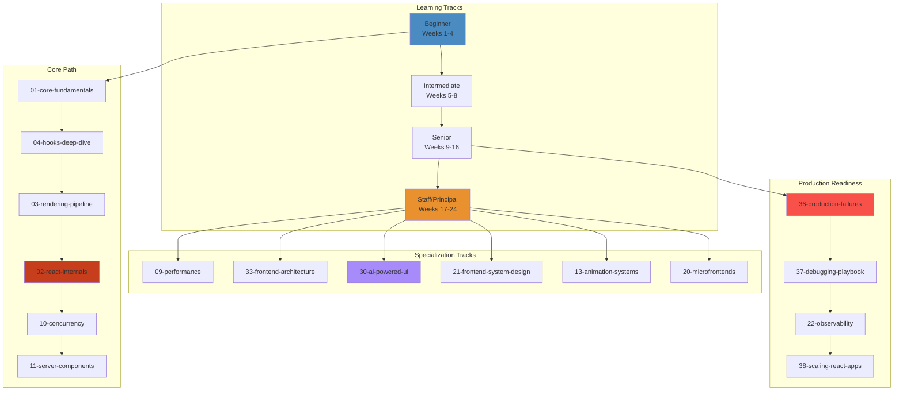

# React Engineering Knowledge System 🚀



## The 40-Domain Architecture

| Domain | Focus | Level | Files |
|---|---|---|---|---|
| `00-roadmap` | Navigation, learning paths | All | 1 |
| `01-core-fundamentals` | JSX, components, props, events | Beginner | 1 |
| `02-react-internals` | Fiber, scheduler, lanes, hydration | Staff | 2 |
| `03-rendering-pipeline` | Virtual DOM, reconciliation, commit | Senior | 1 |
| `04-hooks-deep-dive` | useState, useEffect, useRef, custom | Intermediate | 2 |
| `05-state-management` | Redux, Zustand, Jotai, Context | Senior | 1 |
| `06-component-architecture` | Composition, HOCs, render props, patterns | Intermediate | 2 |
| `07-routing` | React Router, deep linking | Intermediate | 1 |
| `08-forms` | Controlled/uncontrolled, validation | Intermediate | 1 |
| `09-performance` | Memoization, virtualization, profiling | Senior | 1 |
| `10-concurrency` | Transitions, Suspense, concurrent mode | Staff | 2 |
| `11-server-components` | RSC, streaming, serialization, boundaries | Staff | 1 |
| `12-nextjs` | App Router, SSR, ISR, middleware | Senior | 2 |
| `13-animation-systems` | Framer Motion, GSAP, WebGL | Senior | 1 |
| `14-design-systems` | Component libraries, tokens, theming | Senior | 2 |
| `15-testing` | RTL, Playwright, e2e | Intermediate | 2 |
| `16-accessibility` | ARIA, a11y tree, keyboard nav | Senior | 2 |
| `17-security` | XSS, CSRF, CSP, token storage | Senior | 2 |
| `18-performance-engineering` | Profiling, Flame graphs, optimization | Staff | 1 |
| `18-realtime-systems` | SSE, WebSocket, CRDT, collaboration | Staff | 2 |
| `19-websockets` | Socket architecture, reconnection, scaling | Senior | 2 |
| `20-microfrontends` | Module federation, isolation, teams | Staff | 2 |
| `21-frontend-system-design` | YouTube, Figma, ChatGPT design | Staff | 2 |
| `22-observability` | RUM, Web Vitals, tracing, Sentry | Senior | 2 |
| `23-build-tools` | Vite, webpack, esbuild, SWC, Turbopack | Senior | 2 |
| `24-bundlers` | Tree shaking, code splitting, chunking | Staff | 2 |
| `25-browser-internals` | Event loop, rendering, compositing | Staff | 2 |
| `26-javascript-engine` | V8, JIT, GC, hidden classes, IC | Staff | 2 |
| `27-networking` | HTTP/2, HTTP/3, CDN, caching | Senior | 2 |
| `28-pwa` | Service workers, manifest, push | Intermediate | 2 |
| `29-offline-first` | IndexedDB, sync, conflict resolution | Senior | 2 |
| `30-ai-powered-ui` | Streaming LLM, Vercel AI SDK, tokens | Staff | 1 |
| `31-agentic-ui` | Agent workflows, MCP, autonomous UI | Staff | 2 |
| `32-frontend-ml` | TensorFlow.js, ONNX, client inference | Staff | 2 |
| `33-frontend-architecture-patterns` | Monorepo, federation, design systems | Staff | 2 |
| `34-case-studies` | Meta, Netflix, Vercel, Google | All | 2 |
| `35-interview-prep` | → moved to 40-interview-prep | All | - |
| `36-production-failures` | Hydration mismatch, memory leaks, traces | Senior | 2 |
| `37-debugging-playbook` | DevTools, profiling, crash analysis | Senior | 1 |
| `38-scaling-react-apps` | Multi-team, CI/CD, budgets, deployment | Staff | 2 |
| `39-visual-simulations` | Interactive HTML simulators | All | 1 |
| `40-interview-prep` | FAANG questions, system design, coding | All | 1 |
| `40-projects` | ChatGPT, YouTube, Figma, Slack clones | All | 2 |

## Learning Paths

### 🟦 Beginner Track (Weeks 1-4)
```
01-core-fundamentals → 04-hooks-deep-dive → 06-component-architecture → 08-forms → 07-routing
```

### 🟩 Intermediate Track (Weeks 5-8)
```
05-state-management → 15-testing → 16-accessibility → 12-nextjs → 28-pwa
```

### 🟧 Senior Track (Weeks 9-16)
```
03-rendering-pipeline → 09-performance → 13-animation-systems → 14-design-systems → 17-security → 18-realtime → 23-build-tools
```

### 🟥 Staff/Principal Track (Weeks 17-24)
```
02-react-internals → 10-concurrency → 11-server-components → 20-microfrontends → 21-frontend-system-design → 30-ai-powered-ui → 33-architecture-patterns
```

## 📊 Session Status - ALL 40 FOLDERS FILLED ✅

- ✅ **06-component-architecture** — Compound components, slots, render props, HOCs with full code
- ✅ **10-concurrency** — `startTransition`, `useDeferredValue`, `useTransition`, Suspense data fetching, edge cases
- ✅ **12-nextjs** — App Router file conventions, layout persistence, data fetching, error handling
- ✅ **14-design-systems** — Token system, Radix primitives, variant/size system, Storybook + Chromatic
- ✅ **15-testing** — RTL component tests, hook tests, Playwright e2e, what not to test
- ✅ **16-accessibility** — a11y tree, semantic HTML, focus management, ARIA roles, axe-core testing
- ✅ **17-security** — XSS vectors, `dangerouslySetInnerHTML`, CSP headers, token storage, dependency risks
- ✅ **18-realtime-systems** — SSE vs WebSocket vs CRDT decision guide, presence tracking with `useSyncExternalStore`
- ✅ **19-websockets** — Production hook with exponential backoff, heartbeat, Zustand integration, scaling with Redis Pub/Sub
- ✅ **20-microfrontends** — Module Federation config, dynamic remote loading, cross-app auth/navigation, trade-offs
- ✅ **21-frontend-system-design** — 7-step framework, YouTube/ChatGPT/Figma/Netflix/Google Docs deep dives
- ✅ **22-observability** — RUM pipeline, Core Web Vitals, error boundaries, OpenTelemetry tracing
- ✅ **23-build-tools** — Vite vs webpack vs Turbopack, ESM dev server, HMR internals
- ✅ **24-bundlers** — Tree shaking, splitChunks, bundle analysis, CI budgets, CSS extraction
- ✅ **25-browser-internals** — Rendering pipeline, event loop, layout thrashing, compositing, frame budgets
- ✅ **26-javascript-engine** — V8 pipeline, hidden classes, inline caching, GC, React optimization patterns
- ✅ **27-networking** — HTTP/2 vs HTTP/3, CDN caching, SW strategies, resource hints
- ✅ **28-pwa** — SW lifecycle, cache strategies, manifest, push notifications
- ✅ **29-offline-first** — IndexedDB, Background Sync, conflict resolution, optimistic updates
- ✅ **31-agentic-ui** — MCP protocol, tool registry, action queue, guardrails, confirmation dialogs
- ✅ **32-frontend-ml** — TensorFlow.js, ONNX Runtime Web, Web Worker offloading, model optimization
- ✅ **33-frontend-architecture-patterns** — Monorepo (Turborepo/Nx), federation contracts, design token sync
- ✅ **34-case-studies** — Meta/Netflix/Vercel/Google architectures compared
- ✅ **38-scaling-react-apps** — Team scaling, CI/CD pipeline, feature flags, deployment strategies
- ✅ **40-projects** — ChatGPT, YouTube, Figma Lite, Slack clone with architecture diagrams

## Interactive Simulators

Explore React's reconciliation algorithm visually:
[Fiber Tree Visualizer](/04-frontend/react/39-visual-simulations/fiber-reconciliation.html)
— step through beginWork/completeWork/commit phases on sample trees

## Every File Contains

| Section | Purpose |
|---|---|
| `# WHAT` | Concept definition in one sentence |
| `# WHY` | Production pain that created this concept |
| `# HOW` | Practical usage patterns |
| `# INTERNALS` | Deep architecture and implementation |
| `# RENDER FLOW` | Step-by-step through React's rendering |
| `# RECONCILIATION FLOW` | How React diffs and commits |
| `# EDGE CASES` | Boundary conditions and gotchas |
| `# PERFORMANCE` | Runtime cost, optimization strategies |
| `# FAILURES` | Production failure scenarios |
| `# DEBUGGING` | Tools and techniques to diagnose |
| `# PRODUCTION USAGE` | Real-world patterns from top companies |
| `# INTERVIEW QUESTIONS` | Per-level: beginner → staff |
