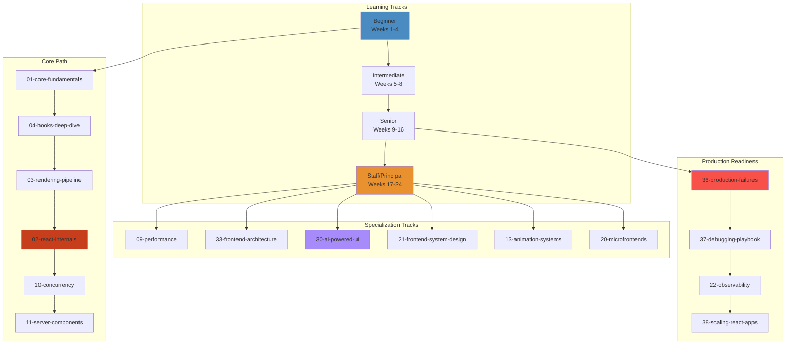

# React Engineering Knowledge System 🚀



## The 40-Domain Architecture

| Domain | Focus | Level | Est. Files |
|---|---|---|---|
| `00-roadmap` | Navigation, learning paths, prerequisites | All | 2 |
| `01-core-fundamentals` | JSX, components, props, events, lifecycle | Beginner | 4 |
| `02-react-internals` | Fiber, reconciler, scheduler, lanes, hydration | Staff | 6 |
| `03-rendering-pipeline` | Virtual DOM, reconciliation, commit, paint | Senior | 5 |
| `04-hooks-deep-dive` | useState, useEffect, useRef, custom hooks | Intermediate | 5 |
| `05-state-management` | Redux, Zustand, Jotai, Context, signals | Senior | 4 |
| `06-component-architecture` | Composition, patterns, HOCs, render props | Intermediate | 3 |
| `07-routing` | React Router, Next.js routing, deep linking | Intermediate | 3 |
| `08-forms` | Controlled/uncontrolled, validation, libraries | Intermediate | 3 |
| `09-performance` | Memoization, virtualization, profiling, bundles | Senior | 5 |
| `10-concurrency` | Concurrent mode, transitions, Suspense | Staff | 4 |
| `11-server-components` | RSC, streaming, serialization, boundaries | Staff | 3 |
| `12-nextjs` | SSR, ISR, App Router, middleware | Senior | 4 |
| `13-animation-systems` | Framer Motion, GSAP, Three.js, WebGL | Senior | 5 |
| `14-design-systems` | Component libraries, theming, tokens | Senior | 3 |
| `15-testing` | RTL, Cypress, Playwright, e2e | Intermediate | 3 |
| `16-accessibility` | ARIA, a11y tree, keyboard nav, screen readers | Senior | 3 |
| `17-security` | XSS, CSRF, CSP, OAuth, iframe security | Senior | 3 |
| `18-realtime-systems` | SSE, WebSocket, CRDT, conflict resolution | Staff | 4 |
| `19-websockets` | Socket architecture, reconnection, scaling | Senior | 3 |
| `20-microfrontends` | Module federation, isolation, shared deps | Staff | 3 |
| `21-frontend-system-design` | YouTube, Figma, Netflix, ChatGPT frontends | Staff | 10 |
| `22-observability` | RUM, tracing, error tracking, Web Vitals | Senior | 3 |
| `23-build-tools` | Vite, webpack, esbuild, SWC, Turbopack | Senior | 4 |
| `24-bundlers` | Tree shaking, code splitting, chunking | Staff | 3 |
| `25-browser-internals` | Event loop, rendering pipeline, compositing | Staff | 4 |
| `26-javascript-engine` | V8, JIT, GC, hidden classes, inline caching | Staff | 3 |
| `27-networking` | HTTP/2, HTTP/3, CDN, edge, cache invalidation | Senior | 3 |
| `28-pwa` | Service workers, manifest, offline, push | Intermediate | 3 |
| `29-offline-first` | IndexedDB, sync, conflict resolution | Senior | 3 |
| `30-ai-powered-ui` | Streaming LLM, Vercel AI SDK, token rendering | Staff | 5 |
| `31-agentic-ui` | Agent workflows, MCP, autonomous UI | Staff | 4 |
| `32-frontend-ml` | TensorFlow.js, ONNX, client-side inference | Staff | 3 |
| `33-frontend-architecture-patterns` | Microfrontends, monorepo, federation | Staff | 5 |
| `34-case-studies` | Meta, Netflix, Vercel, Google frontend | All | 6 |
| `35-interview-prep` | FAANG questions, system design, coding | All | 5 |
| `36-production-failures` | Hydration mismatch, memory leaks, race conditions | Senior | 4 |
| `37-debugging-playbook` | DevTools, profiling, tracing, crash analysis | Senior | 4 |
| `38-scaling-react-apps` | Multi-team, monorepo, CI/CD, performance budgets | Staff | 3 |
| `39-visual-simulations` | Interactive HTML simulators | All | 5 |
| `40-projects` | ChatGPT clone, YouTube, Figma, Slack | All | 6 |

## Learning Paths

### 🟦 Beginner Track (Weeks 1-4)
```
01-core-fundamentals → 04-hooks-deep-dive → 06-component-architecture → 08-forms → 07-routing
```

### 🟩 Intermediate Track (Weeks 5-8)
```
05-state-management → 15-testing → 16-accessibility → 12-nextjs → 28-pwa
```

### 🟧 Senior Track (Weeks 9-16)
```
03-rendering-pipeline → 09-performance → 13-animation-systems → 14-design-systems → 17-security → 18-realtime → 23-build-tools
```

### 🟥 Staff/Principal Track (Weeks 17-24)
```
02-react-internals → 10-concurrency → 11-server-components → 20-microfrontends → 21-frontend-system-design → 30-ai-powered-ui → 33-architecture-patterns
```

## Every File Contains

| Section | Purpose |
|---|---|
| `# WHAT` | Concept definition in one sentence |
| `# WHY` | Production pain that created this concept |
| `# HOW` | Practical usage patterns |
| `# INTERNALS` | Deep architecture and implementation |
| `# RENDER FLOW` | Step-by-step through React's rendering |
| `# RECONCILIATION FLOW` | How React diffs and commits |
| `# EDGE CASES` | Boundary conditions and gotchas |
| `# PERFORMANCE` | Runtime cost, optimization strategies |
| `# FAILURES` | Production failure scenarios |
| `# DEBUGGING` | Tools and techniques to diagnose |
| `# PRODUCTION USAGE` | Real-world patterns from top companies |
| `# INTERVIEW QUESTIONS` | Per-level: beginner → staff |
