# 03: Rendering & Performance — Deep Reference

> 🎮 **Interactive Simulators**: [VDOM Diff](/04-frontend/react/39-visual-simulations/vdom-diff.html) · [State Batching](/04-frontend/react/39-visual-simulations/state-batching.html) · [Re-render Tree](/04-frontend/react/39-visual-simulations/rerender-tree.html)

> **Scope**: Virtual DOM diffing, reconciliation, Fiber architecture, render phases, batching, concurrent mode, lanes, transitions, Suspense, lazy loading, code splitting, memo, PureComponent, shouldComponentUpdate, key optimization, list virtualization, profiling, flame graphs, wasted renders, bailout heuristics, commit waterfalls, passive effects, layout effects, N+1 render problem, state update batching, automatic batching in React 18, flushSync.

---


## Rendering Pipeline


```mermaid
graph LR
    A["State/Props<br/>Change"] --> B["Render<br/>Reconcile"]
    B --> C["VDOM<br/>tree"]
    C --> D["Diff<br/>algorithm"]
    D --> E["Calculate<br/>edits"]
    E --> F["Commit<br/>Phase"]
    F --> G["DOM<br/>Update"]
    G --> H["Browser<br/>Paint"]
    
    I["useMemo<br/>useCallback<br/>React.memo"] -.->|Optimize| B
    
    style A fill:#c73e1d
    style B fill:#2d5a7b
    style F fill:#1a5d3a
    style H fill:#1a3a52
```


## 1. Virtual DOM — What It Actually Is


The Virtual DOM is a lightweight JavaScript object tree representing the real DOM. It is **not** a virtual copy of the DOM — it's a tree of React element objects.

```javascript
// Real DOM
<div class="container">
  <p>Hello</p>
</div>

// Virtual DOM (React element)
{
  type: 'div',
  props: { className: 'container' },
  children: [{
    type: 'p',
    props: {},
    children: ['Hello']
  }]
}
```

**Why Virtual DOM exists**:
1. **Abstraction**: Decouples UI code from browser DOM API
2. **Batching**: Groups multiple DOM updates into one
3. **Cross-platform**: Same abstraction for React Native, Canvas, etc.
4. **Declarative**: You describe what UI should look like, React handles how to update

**Java comparison**: Virtual DOM is like a DOM builder pattern — you construct a tree of elements in memory, then flush changes to the real DOM in one operation. This is analogous to `StringBuilder` vs string concatenation: batch operations are faster.

### Virtual DOM ≠ Shadow DOM


Shadow DOM is a browser specification for style/component encapsulation. Virtual DOM is a JavaScript pattern for efficient DOM updates. They are unrelated.

### Step-by-Step


1. **JSX to element objects**: Components return JSX which compiles to `React.createElement()` calls, producing plain JS objects
2. **Tree construction**: React builds a tree of these objects in memory (not touching DOM)
3. **Diff comparison**: React compares new VDOM tree to previous VDOM tree to find differences
4. **Patch calculation**: React calculates minimal DOM operations needed (add node, update property, remove node)
5. **Batching**: Multiple updates are grouped together before applying to real DOM
6. **Commit**: All DOM mutations are applied in a single batch, then browser paints

### Code Example


```javascript
import React, { useState } from 'react';

function Dashboard() {
  const [count, setCount] = useState(0);
  const [theme, setTheme] = useState('light');

  // Multiple state updates trigger ONE re-render and ONE DOM batch
  const handleMultipleUpdates = () => {
    setCount(c => c + 1);
    setTheme(theme === 'light' ? 'dark' : 'light');
    // In React 18+, both setState calls are automatically batched
    // Only ONE render pass, ONE VDOM diff, ONE DOM update
  };

  return (
    <div className={`container ${theme}`}>
      {/* Only the necessary DOM nodes are updated */}
      <p>Count: {count}</p>
      <button onClick={handleMultipleUpdates}>Update</button>
    </div>
  );
}

// WITHOUT Virtual DOM (imperative):
// const div = document.querySelector('.container');
// div.classList.remove('light', 'dark');
// div.classList.add('dark');
// div.querySelector('p').textContent = 'Count: 1';
// // Multiple DOM operations, no automatic batching

// WITH Virtual DOM (declarative):
// React calculates all changes, batches them, applies once
```

### Real-World Scenario


A dashboard component updates 20 different state values in response to a WebSocket message. Without batching, each `setState` would trigger a re-render and DOM update (20 repaints). With React 18's automatic batching, all 20 updates are grouped into one re-render. Frame time dropped from 150ms (20 separate renders) to 16ms (one batched render), preventing jank and improving UX responsiveness.

### Diagram


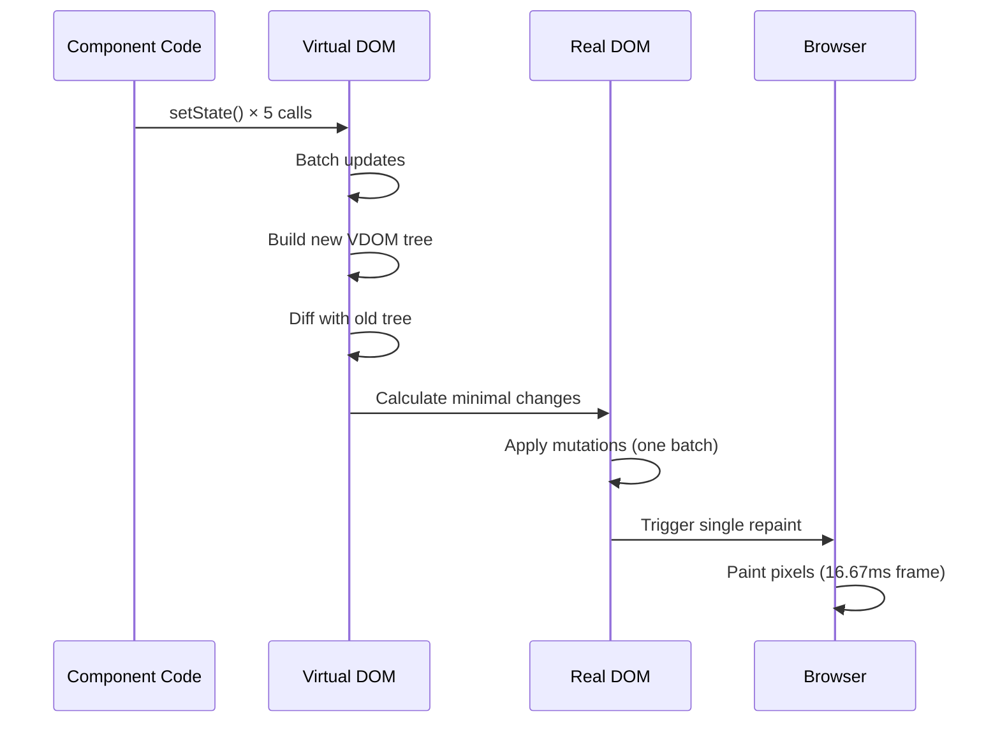

---

## 2. Reconciliation Algorithm


Reconciliation is the process of comparing two trees to determine what changed.

### The Two Assumptions (O(n) instead of O(n³))


React's diff algorithm makes two assumptions:
1. **Different type → different tree**: If elements have different types (`div` → `span`), React tears down the old tree and builds a new one
2. **Key stability**: Children with the same key maintain identity across renders

Without these assumptions, tree diffing is O(n³) — infeasible.

### Reconciliation Steps


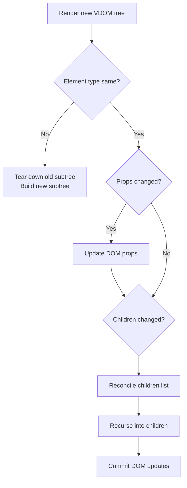

### Type Change = Full Remount


```jsx
// React sees: 'div' → 'span' → teardown + rebuild entire subtree
function MyComponent({ isSpecial }) {
  if (isSpecial) {
    return <div className="special">...</div>;   // Tree 1
  }
  return <span>...</span>;   // Tree 2
}
```

This means you should NOT wrap/unwrap components conditionally — use the same element type with conditional props:

```jsx
// ✅ Better: same element type, conditional class
function MyComponent({ isSpecial }) {
  return <div className={isSpecial ? 'special' : ''}>...</div>;
}
```

---

## 2b. Virtual DOM Diffing Algorithm — Deep Dive


React's diff algorithm is the core of reconciliation — it determines what changed between two VDOM trees with O(n) complexity (down from O(n³) by using two key heuristics).

### The Two Fundamental Heuristics


1. **Different element types produce different trees**: If `<div>` becomes `<span>`, React destroys the entire subtree and rebuilds
2. **Keys identify children across renders**: Stable keys let React match children from the old tree to the new tree

Without these assumptions, the general tree diff problem is O(n³) — three nested loops comparing every node to every other node at every tree level.

### How List Diffing Works (The `reconcileChildrenArray` Algorithm)


When diffing two lists of children, React uses a **double-index** approach:

```javascript
// Simplified reconcileChildrenArray algorithm
function reconcileChildrenArray(returnFiber, currentChildren, newChildren) {
  let oldIdx = 0;      // Index into old children
  let newIdx = 0;      // Index into new children
  let oldEnd = currentChildren.length - 1;
  let newEnd = newChildren.length - 1;
  let oldFiber = currentChildren[0];

  // Phase 1: Head match — skip identical items from the start
  while (oldIdx <= oldEnd && newIdx <= newEnd) {
    if (sameNode(oldFiber, newChildren[newIdx])) {
      updateNode(oldFiber, newChildren[newIdx]);
      oldIdx++; newIdx++;
      oldFiber = currentChildren[oldIdx];
    } else break;
  }

  // Phase 2: Tail match — skip identical items from the end
  // Phase 3: If only new items remain → placement
  // Phase 4: If only old items remain → deletion
  // Phase 5: Remaining items → use keyed map for moves
}
```

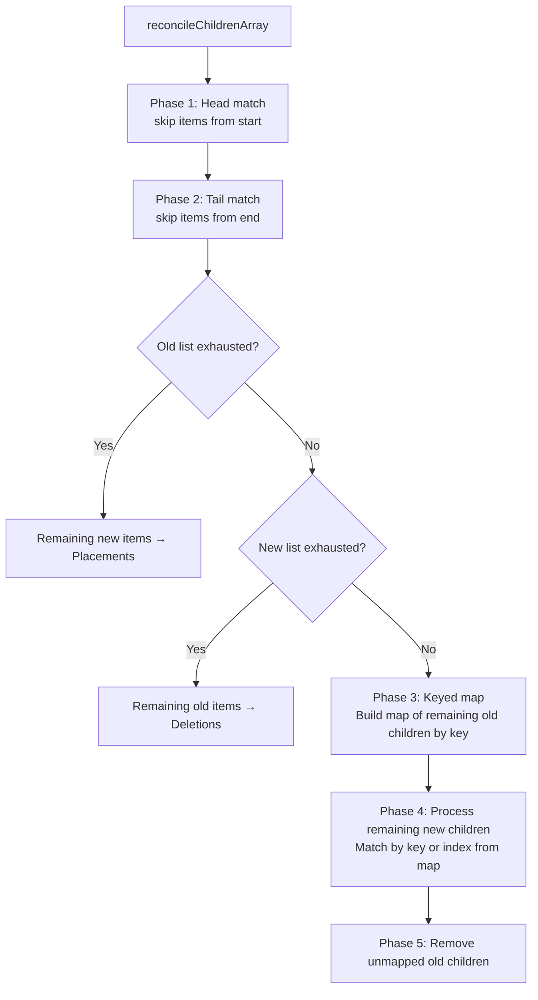

### Key-Based Matching


When keys are present, React builds a key→fiber map from the remaining old children:

```javascript
// Keyed map lookup — O(1) per child
const remainingOldFibers = new Map();
oldChildren.forEach(child => {
  remainingOldFibers.set(child.key, child);
});

// For each new child, look up by key
newChildren.forEach(newChild => {
  const oldFiber = remainingOldFibers.get(newChild.key);
  if (oldFiber) {
    // Found by key — reuse fiber, mark as moved if position changed
    remainingOldFibers.delete(newChild.key);
    if (oldFiber.index !== newIndex) {
      // Mark as MOVE (placement with different position)
    }
  } else {
    // New key — create new fiber (placement)
  }
});
```

### The O(n²) Trap with Index Keys


When prepending to a list with index keys:

```javascript
// Initial render: keys [0:A, 1:B, 2:C]
// After prepend: keys [0:NEW, 1:A, 2:B, 3:C]
// React runs these phases:
// Phase 1: key 0 → A vs NEW, different → break (0 matches)
// Phase 2: key 2 → C vs C, same → matched (1 match)
// Phase 3-4: remaining [1:A, 2:B] vs [1:A, 2:B, 3:C]
//   key 1 → A matches A (updated in place)
//   key 2 → B matches B (updated in place)
//   key 3 → C not found → placement
// Result: A updated, B updated, C created — NO DOM reuse!
```

Every existing item's DOM node gets **updated with new content** instead of simply shifting position. With 1000 items, that's 999 unnecessary DOM mutations.

### Reconciliation Heuristics Summary


| Scenario | React Behavior | Cost |
|---|---|---|
| Same type, same key | Update existing instance | O(1) per node |
| Same type, different key | Unmount old, mount new | O(1) per node |
| Different type | Destroy subtree, build new | O(subtree size) |
| Same key, different position | Move (reorder) | O(1) per move |
| List with stable keys | Keyed reconciliation | O(n) |
| List with index keys | Position-based (wrong) | O(n) + unnecessary DOM |

**Cross-reference**: This diffing algorithm is analogous to the `git diff` algorithm — both match common prefix/suffix, then use a heuristic for the middle section. See [OS](/12-operating-systems/README.md) for scheduling algorithm comparisons.

---

## 3. Fiber Architecture — React 16+


Fiber is a complete rewrite of React's reconciliation engine. Each component instance gets a "fiber node" — a JavaScript object that holds component state, props, and work to be done. The fiber tree is a **linked list** — not a recursive tree — enabling incremental (interruptible) rendering.

### Fiber Node Structure (simplified)


```javascript
{
  tag: HostComponent,     // Type of fiber (class, function, host, etc.)
  key: null,              // Key for reconciliation
  type: 'div',            // Element type
  stateNode: domElement,   // Actual DOM node
  child: fiber,           // First child
  sibling: fiber,         // Next sibling
  return: fiber,          // Parent
  pendingProps: {},       // New props (to apply)
  memoizedProps: {},      // Previously rendered props
  memoizedState: null,    // Component state
  effectTag: 'UPDATE',    // What to do in commit phase
  alternate: fiber,       // Work-in-progress (double buffering)
  lanes: 1,               // Priority lanes
}
```

### Why Fiber Was Created


Before Fiber (React ≤15), reconciliation was synchronous and recursive. Deep component trees blocked the main thread for hundreds of milliseconds:

```javascript
// Old: recursive, cannot interrupt
function reconcile(dom, vnode) {
  if (vnode is component) reconcile(dom, vnode.render());
  if (vnode is element) updateDOM(dom, vnode);
  vnode.children.forEach(child => reconcile(dom.childNodes[i], child));
}
```

Fiber breaks work into units that can be **interrupted, paused, resumed, or abandoned**.

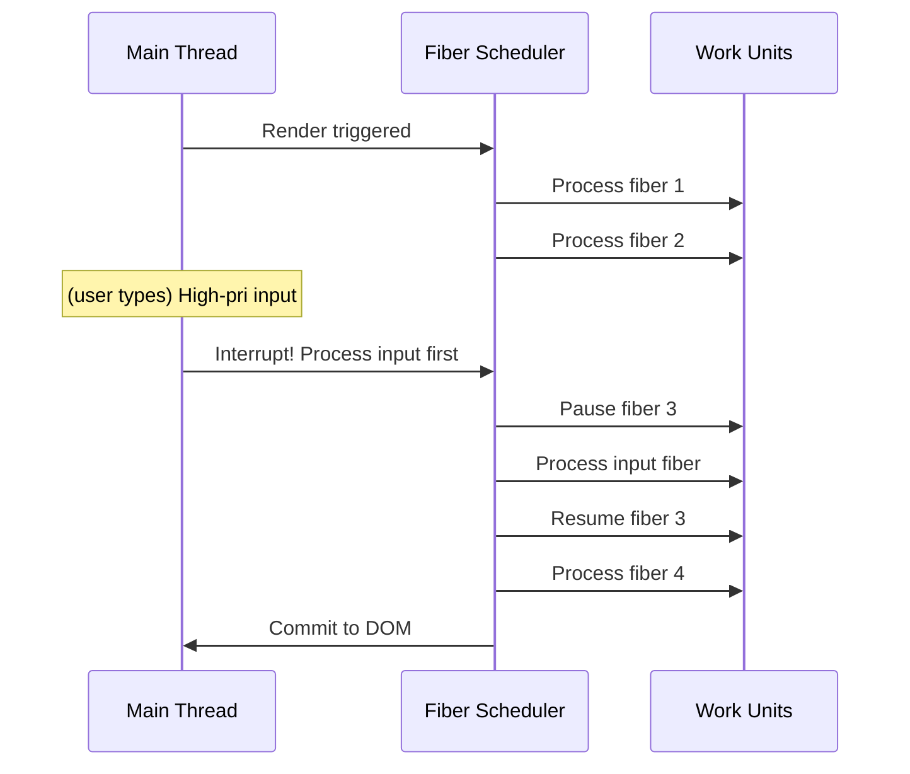

### Double Buffering (Work-in-Progress Tree)


React maintains two fiber trees:
- **Current**: The tree currently displayed in DOM
- **Work-in-progress (WIP)**: The tree being built during render

When render is complete, the WIP tree becomes the current tree (pointer swap). This avoids tearing (user seeing incomplete UI).

```javascript
// Internal: pointer swap
root.current = finishedWork;
```

**Java analogy**: Double buffering in Swing graphics — you draw on an off-screen buffer, then swap it to visible in one operation.

---

## 3b. Fiber Work Loop — Deep Dive


The work loop processes fiber nodes one at a time, yielding control back to the browser after each unit. This is what makes concurrent rendering possible.

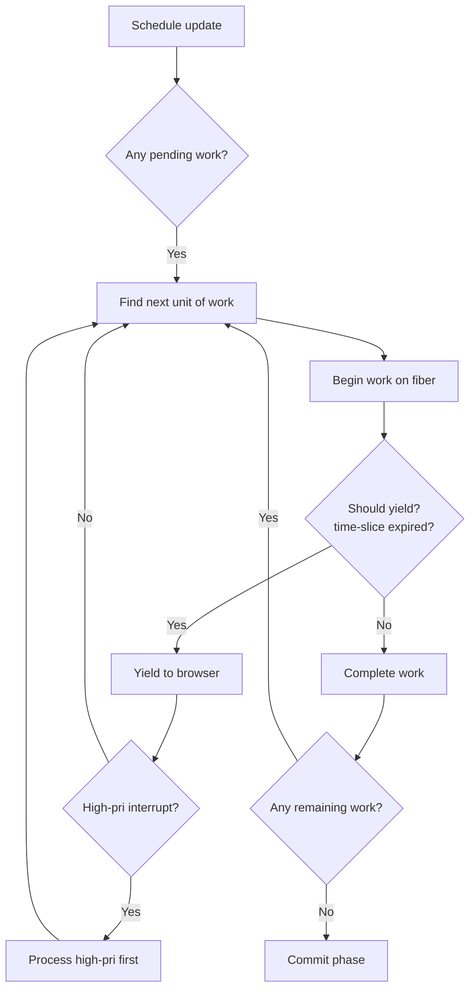

```javascript
// Simplified scheduler work loop — runs inside requestIdleCallback
function workLoopConcurrent(deadline) {
  let shouldYield = false;
  while (nextUnitOfWork && !shouldYield) {
    nextUnitOfWork = performUnitOfWork(nextUnitOfWork);
    shouldYield = deadline.timeRemaining() < 5; // 5ms time slice
  }
  if (nextUnitOfWork) {
    // More work remains → schedule continuation
    scheduleCallback(NormalPriority, workLoopConcurrent);
  } else {
    // All work complete → commit
    commitRoot(root);
  }
}
```

**Cross-reference**: This is the same cooperative multitasking model used in OS kernel schedulers. See [Operating Systems](/12-operating-systems/README.md) for preemption and time-slicing concepts.

### Lane Priorities (Bitmask System)


React 18 assigns each update a **lane** — a bitmask that encodes priority. Multiple updates can be batched by OR-ing their lanes.

```javascript
// Internal lane constants (simplified from actual React source)
const SyncLane =              0b0000000000000000001; // Highest
const InputContinuousLane =   0b0000000000000000100; // Scroll, hover
const DefaultLane =           0b0000000000000010000; // Normal setState
const TransitionShortLane =   0b0000000010000000000; // startTransition (fast)
const TransitionLongLane =    0b0001000000000000000; // startTransition (slow)
const IdleLane =              0b0100000000000000000; // Pre-rendering
const OffscreenLane =         0b1000000000000000000; // Hidden content
```

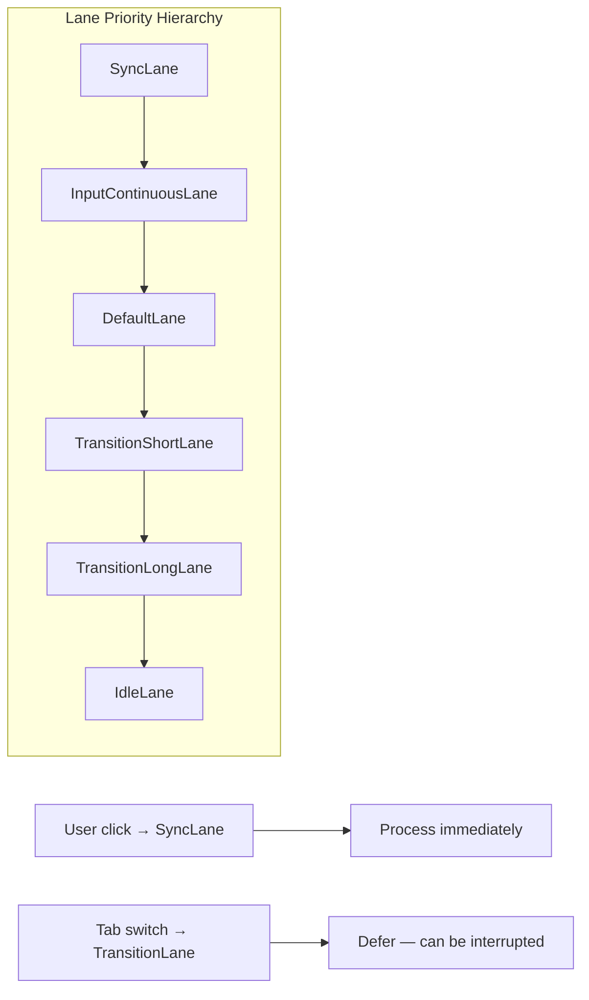

**How lanes work in the scheduler**:

```javascript
// 1. An update is created with a specific lane
const update = { lane: SyncLane, action: { type: 'increment' } };

// 2. The lane is merged into the fiber's lane set
fiber.lanes = fiber.lanes | update.lane;

// 3. Scheduler picks the highest-priority lane among all pending work
function getHighestPriorityLane(lanes) {
  // Bit scan: find the rightmost set bit (highest priority)
  return lanes & -lanes;
}

// 4. During render, if higher-priority work arrives, current work is interrupted
function ensureRootIsScheduled(root) {
  const newLanes = getNextLanes(root);
  const existingLanes = root.pendingLanes;

  if (newLanes.higherThan(existingLanes)) {
    // Higher priority work — interrupt current render
    interruptWork(root);
    scheduleCallback(newLanes, performConcurrentWorkOnRoot);
  }
}
```

**Java analogy**: Java's `Thread` priorities (1–10) serve the same purpose — the scheduler always runs the highest-priority runnable thread. React's lanes add bitmask batching: multiple updates can be in-flight simultaneously, and the scheduler resolves conflicts at lane granularity.

### Effect List (Commit Phase Input)


During the "complete" phase of each fiber, React builds an effect list — a linked list of fibers that need DOM mutations, refs, or lifecycle methods during commit:

```javascript
// Effect tags — binary flags OR-ed together
const Placement =            0b000000000000010; // New DOM node
const Update =               0b000000000000100; // Updated props/state
const Deletion =             0b000000000001000; // Remove DOM node
const PlacementAndUpdate =   0b000000000000110; // Both
const Passive =              0b000000001000000; // useEffect
const Ref =                  0b000000010000000; // Ref attachment
const Visibility =           0b000100000000000; // Suspense visibility

// Effect list traversal during commit
let nextEffect = finishedWork.firstEffect;
while (nextEffect) {
  try {
    const flags = nextEffect.flags;
    if (flags & Placement) { commitPlacement(nextEffect); }
    if (flags & Update) { commitWork(nextEffect); }
    if (flags & Deletion) { commitDeletion(nextEffect); }
    if (flags & Passive) { schedulePassiveEffect(nextEffect); }
    if (flags & Ref) { commitAttachRef(nextEffect); }
    nextEffect = nextEffect.nextEffect;
  } catch (error) {
    captureCommitPhaseError(nextEffect, nextEffect.return, error);
  }
}
```

**Key insight**: The effect list is built during the render phase (interruptible) and consumed during the commit phase (synchronous). This split ensures DOM mutations are never partially applied — either all effects commit, or none do.

---

## 3c. Browser Rendering Pipeline


React's VDOM updates eventually reach the browser's rendering pipeline. Understanding this pipeline is essential for diagnosing layout thrashing, jank, and paint storms.

### The Critical Rendering Path


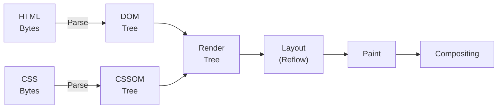

1. **DOM Tree**: HTML parsed into DOM nodes (blocking: `<script>` without `defer`/`async` pauses parsing)
2. **CSSOM Tree**: CSS parsed into CSS Object Model (render-blocking: all CSS is render-blocking by default)
3. **Render Tree**: DOM + CSSOM combined — only visible nodes (hidden nodes, `<head>` excluded)
4. **Layout (Reflow)**: Calculate positions and sizes — most expensive phase
5. **Paint**: Fill pixels for each node (text, colors, images, borders)
6. **Compositing**: Layer separation and GPU compositing

### Reflows vs Repaints


| Operation | What Changes | Cost | Triggered By |
|---|---|---|---|
| **Reflow** | Layout (position, size) | Highest | DOM mutations, style changes, font load, window resize |
| **Repaint** | Visual (color, visibility) | Medium | Color change, background change |
| **Composite only** | Layer position (transform) | Lowest (GPU) | `transform`, `opacity` |

```javascript
// ❌ Forces reflow — reads layout property after DOM mutation
el.style.width = '100px';           // Schedules reflow
const w = el.offsetWidth;           // Forces immediate reflow (layout thrashing)

// ✅ Groups reads before writes
const w = el.offsetWidth;           // Read
const h = el.offsetHeight;          // Read
el.style.width = `${w + 10}px`;     // Write
el.style.height = `${h + 10}px`;    // Write (batched reflow)
```

### React's Impact on the Pipeline


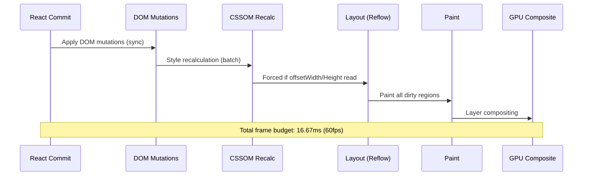

### Production Scenario: Layout Thrashing from useLayoutEffect


```jsx
function AnimatedChart() {
  const containerRef = useRef(null);

  useLayoutEffect(() => {
    // ❌ Forces multiple reflows per frame
    for (const bar of bars) {
      bar.element.style.height = `${bar.value * 2}px`;
      const offset = bar.element.offsetTop; // Forces reflow!
    }
  }, [data]);

  return <div ref={containerRef}>{bars.map(renderBar)}</div>;
}
```

**Fix**: Batch reads, then batch writes:
```jsx
useLayoutEffect(() => {
  // Phase 1: Read all measurements
  const measurements = bars.map(bar => ({
    element: bar.element,
    height: bar.value * 2,
  }));

  // Phase 2: Write all updates (one reflow)
  measurements.forEach(m => {
    m.element.style.height = `${m.height}px`;
  });
}, [data]);
```

**Cross-reference**: See [Performance Engineering](/18-performance-engineering/) for detailed browser rendering pipeline profiling with Chrome DevTools. See [Networking](/11-networking/) for critical rendering path optimization (CSS/JS delivery).

### Production Optimizations Summary


| Technique | What It Prevents | Cost |
|---|---|---|
| `will-change: transform` | Creates compositor layer | GPU memory |
| `transform` instead of `top/left` | Avoids reflow (composite only) | None |
| `requestAnimationFrame` batching | Layout thrashing | Slight delay |
| `contain: layout style paint` | Limits reflow scope | Browser support varies |
| CSS `content-visibility: auto` | Skips off-screen layout | Newer browsers |

---

## 4. Render Phases


React's render cycle has two major phases:

### Phase 1: Render (Reconciliation) — Can Be Interrupted


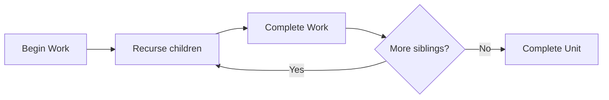

- **Begin work**: Create fiber, diff props, determine effect flags
- **Complete work**: Build up effect list, handle refs
- This phase can be paused by higher-priority work

### Phase 2: Commit — Cannot Be Interrupted


1. **Before mutation**: `getSnapshotBeforeUpdate` runs
2. **Mutation**: DOM updates, refs attached/detached
3. **Layout**: `useLayoutEffect` runs
4. **Passive**: `useEffect` scheduled

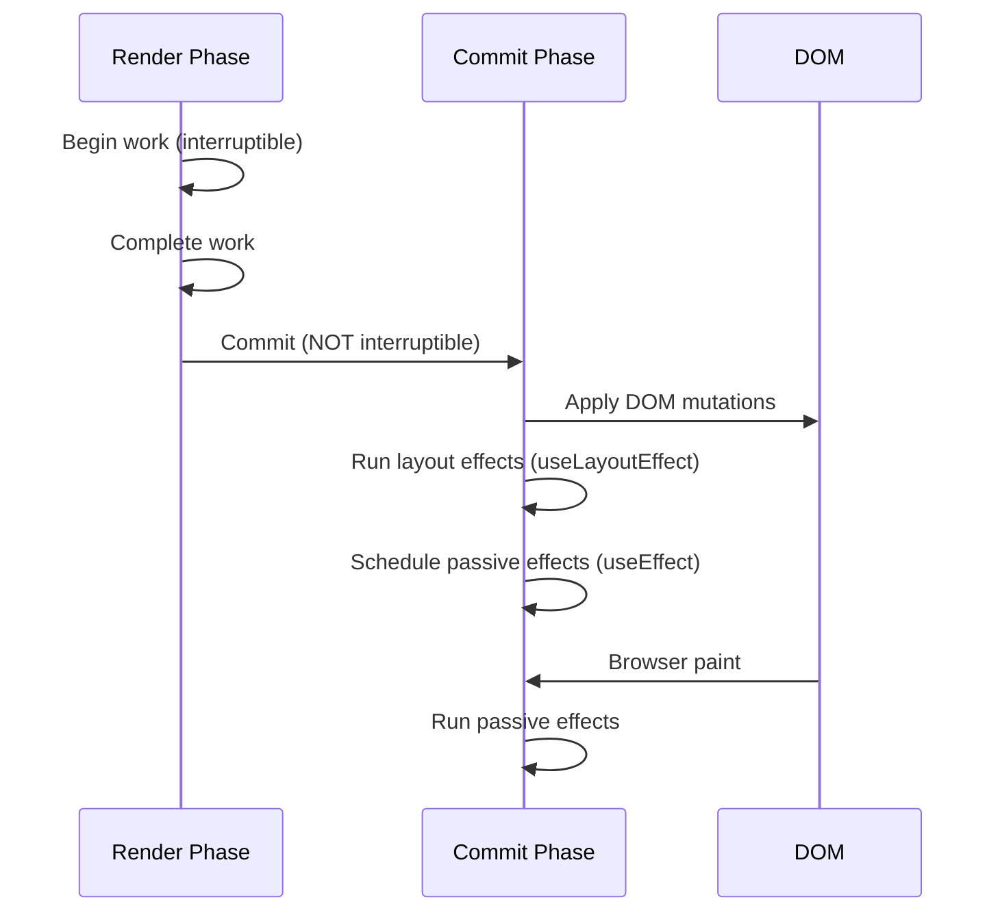

---

## 5. Batching


React groups multiple state updates into a single re-render.

```jsx
function BatchingDemo() {
  const [a, setA] = useState(0);
  const [b, setB] = useState(0);

  function handleClick() {
    setA(a + 1);  // Queued
    setB(b + 1);  // Queued (batched with above)
    // Only ONE re-render
  }
}
```

### Automatic Batching in React 18


React 18 batches ALL updates by default, including:
- Inside setTimeout, Promises, native event handlers

```jsx
// React 17: TWO re-renders
setTimeout(() => {
  setCount(c => c + 1); // Re-render 1
  setFlag(f => !f);     // Re-render 2
}, 100);

// React 18: ONE re-render (automatic batching)
setTimeout(() => {
  setCount(c => c + 1); // Queued
  setFlag(f => !f);     // Queued (batched)
}, 100);
```

### flushSync — Opt out of batching


```jsx
import { flushSync } from 'react-dom';

function handleClick() {
  flushSync(() => { setCount(c => c + 1); }); // Immediate re-render
  flushSync(() => { setFlag(f => !f); });      // Another immediate re-render
}
// TWO re-renders
```

**Use case**: When you need to read DOM measurements after a specific update.

---

## 6. Concurrent Mode


React 18 concurrent mode enables **interruptible rendering**.

```jsx
import { startTransition } from 'react';

function SearchPage() {
  const [query, setQuery] = useState('');
  const [results, setResults] = useState([]);

  function handleChange(e) {
    setQuery(e.target.value); // Urgent: update input immediately

    startTransition(() => {
      setResults(search(e.target.value)); // Non-urgent: can be interrupted
    });
  }
}
```

**Priority lanes**:

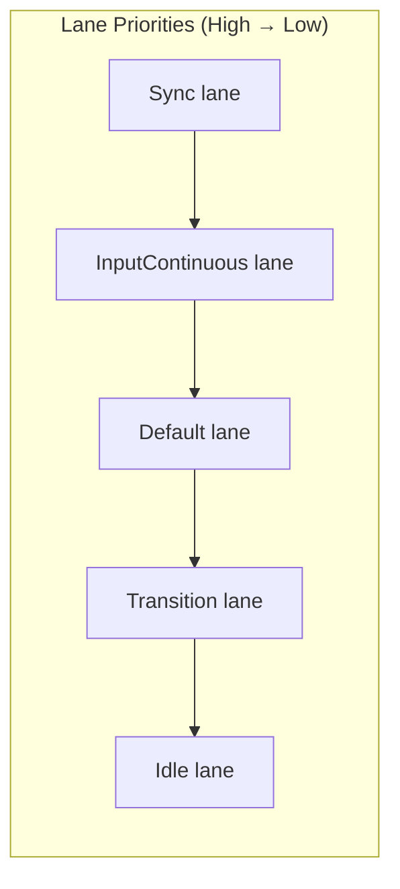

- **Sync lane**: DOM events, visibility change
- **InputContinuous lane**: Scroll, mouse hover
- **Default lane**: Normal state updates
- **Transition lane**: Wrapped in startTransition
- **Idle lane**: Offscreen pre-rendering

---

## 7. Transitions


```jsx
const [isPending, startTransition] = useTransition();

function switchTab(tab) {
  startTransition(() => {
    setTab(tab);
  });
}
```

**What transitions do**:
1. Mark the update as low priority
2. If a higher-priority update (like typing) comes in, suspend the transition
3. Show `isPending` indicator while transition is in progress
4. React discards outdated transitions (if a newer one starts)

**Production use case**: Tab switching in a complex dashboard. Without transition, clicking a tab freezes the UI for 500ms. With transition, the UI stays responsive and the new tab renders when ready.

---

## 8. Suspense + Lazy Loading


### React.lazy


```jsx
const Dashboard = lazy(() => import('./Dashboard'));
const Settings = lazy(() => import('./Settings'));

function App() {
  return (
    <Suspense fallback={<BigSpinner />}>
      <Routes>
        <Route path="/dashboard" element={<Dashboard />} />
        <Route path="/settings" element={<Settings />} />
      </Routes>
    </Suspense>
  );
}
```

### Code Splitting Strategy


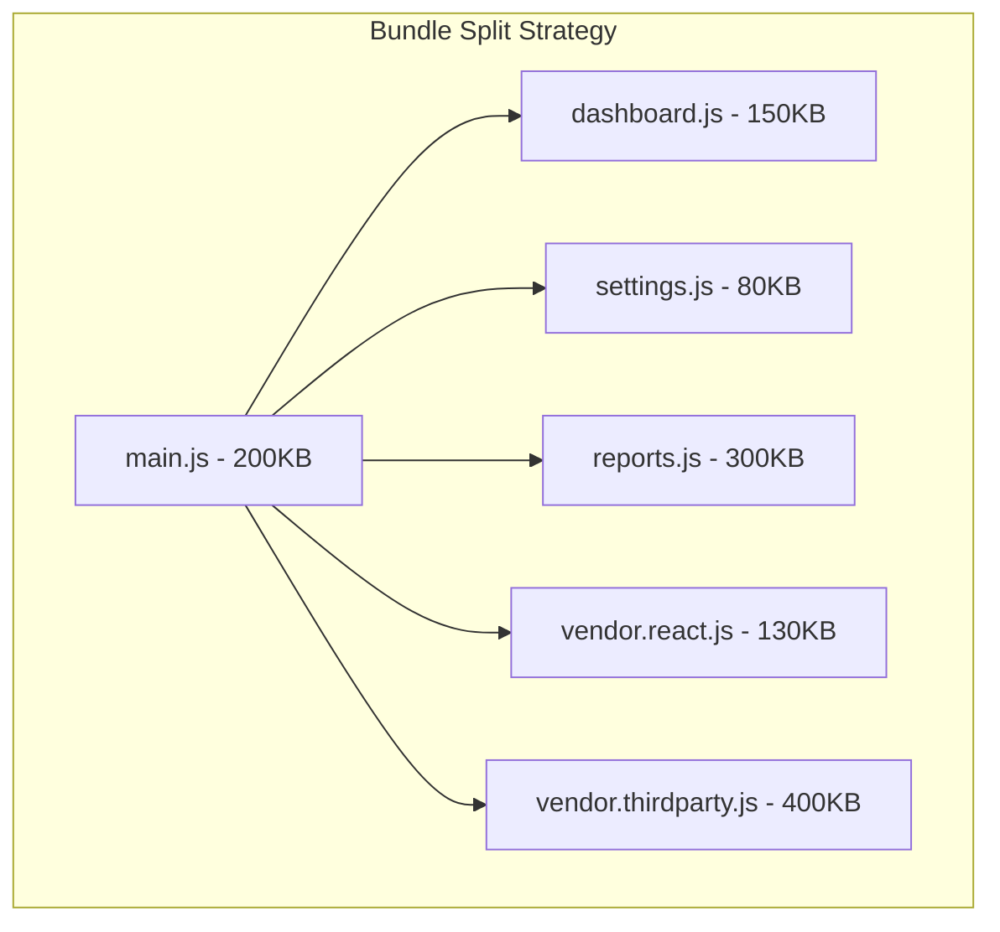

**Optimal split points**:
- Route boundaries (each route gets its own chunk)
- Heavy third-party libraries (chart, PDF, video)
- Feature flags / A/B test variants
- Legacy code paths

### Suspense + Data Fetching (React 18)


```jsx
function ProfilePage() {
  return (
    <Suspense fallback={<ProfileSkeleton />}>
      <ProfileDetails />
      <Suspense fallback={<PostsSkeleton />}>
        <ProfilePosts />
      </Suspense>
    </Suspense>
  );
}

function ProfileDetails() {
  const user = use(fetchUser()); // 'use' hook — suspends if data not ready
  return <h1>{user.name}</h1>;
}
```

---

## 9. React.memo


```jsx
const ExpensiveList = memo(function ExpensiveList({ items, onSelect }) {
  console.log('ExpensiveList rendered');
  return items.map(item => <ListItem key={item.id} item={item} onSelect={onSelect} />);
});
```

### What memo Does


Shallow compares `prevProps` vs `nextProps`. If all props are equal (via `Object.is`), skip re-render.

### Custom Comparison


```jsx
const List = memo(ListComponent, (prevProps, nextProps) => {
  // Return true if props are equal (skip render)
  return prevProps.items.length === nextProps.items.length
    && prevProps.filter === nextProps.filter;
});
```

### When memo Is Useless


```jsx
// ❌ memo doesn't help because onClick reference changes every render
function Parent() {
  return (
    <ExpensiveChild onClick={(id) => handleClick(id)} />
  );
}
```

**Fix**: `useCallback` for the prop.

```jsx
// ✅ memo now prevents re-render
function Parent() {
  const handleClick = useCallback((id) => { handleClick(id); }, []);
  return <ExpensiveChild onClick={handleClick} />;
}
```

---

## 10. PureComponent


```jsx
class PureList extends React.PureComponent {
  render() {
    return this.props.items.map(item => <div key={item.id}>{item.name}</div>);
  }
}
```

`PureComponent` implements `shouldComponentUpdate` with shallow prop + state comparison. Equivalent to `React.memo` for class components.

---

## 11. shouldComponentUpdate


```jsx
class List extends React.Component {
  shouldComponentUpdate(nextProps) {
    // Deep comparison (expensive, use sparingly)
    return JSON.stringify(this.props) !== JSON.stringify(nextProps);
    // Or use immutable data structures for O(1) reference check
  }

  render() {
    return this.props.items.map(item => <div key={item.id}>{item.name}</div>);
  }
}
```

**Never do `JSON.stringify` comparison in production** — it serializes the entire props tree every render.

---

## 12. Key Optimization


### Index as Key — The O(n²) Problem


```jsx
// ❌ Index as key with prepend
const [items, setItems] = useState(['A', 'B', 'C', 'D', 'E']);
const prepend = () => setItems([`${Date.now()}`, ...items]);

return (
  <ul>
    {items.map((item, idx) => (
      <li key={idx}>
        <ExpensiveNode data={item} />
      </li>
    ))}
  </ul>
);
```

**O(n²) explanation with prepend**:

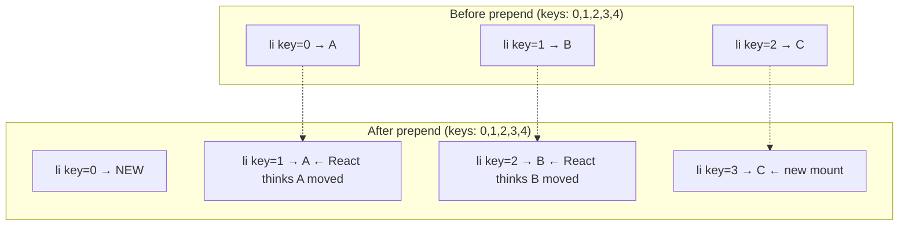

**Every item gets re-rendered because React thinks items moved to new indices.** With `key={item.id}`:
- `NEW` key not found → mount
- `A`, `B`, `C` keys found at same positions → no re-render

**O(n²) with nested sub-lists**: If each item contains a sub-list rendered with index keys, prepending triggers O(n²) reconciliation at each level → exponential blowup.

---

## 13. List Virtualization (react-window)


```jsx
import { FixedSizeList } from 'react-window';

function VirtualizedList({ items }) {
  const Row = ({ index, style }) => (
    <div style={style}>
      {items[index].name}
    </div>
  );

  return (
    <FixedSizeList
      height={600}
      itemCount={items.length}
      itemSize={50}
      width="100%"
    >
      {Row}
    </FixedSizeList>
  );
}
```

**Performance**: 10,000 items → DOM has only ~14 nodes (visible + overscan). Render time: 2ms vs 200ms for full list.

### Window vs Viewport


- **Window**: The scrollable container
- **Overscan**: Extra rows rendered above/below viewport (prevents white flash during fast scroll)

```jsx
<FixedSizeList overscanCount={5} ...>
```

---

## 14. Profiling with React DevTools


### Flame Graph Interpretation


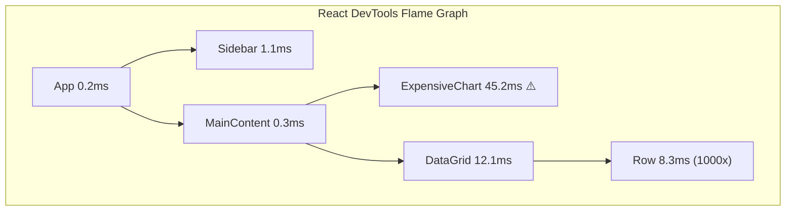

**What to look for**:
- **Tall bars**: Components taking too long to render
- **Re-renders**: Components that render despite unchanged props
- **Commit duration**: Total time for all renders + DOM mutations

### Wasted Render Detection


React DevTools > Components > Highlight updates when components render. Components that flash unnecessarily are wasting cycles.

---

## 15. Bailout Heuristics


React can skip rendering a component in several ways. Understanding these is critical for performance debugging.

### Bailout 1: Same Element Reference


If render returns the exact same element reference, React bails out:

```jsx
function Parent() {
  const children = useMemo(() => <Child />, []);
  return <div>{children}</div>;
}
```

When `Parent` re-renders, if `children` reference hasn't changed, React skips the subtree.

### Bailout 2: Same State (Object.is)


If `setState(newState)` receives a value equal to current state (via `Object.is`), React skips rendering:

```jsx
setCount(prev => prev); // Same value → bailout
setCount(5); // If count is already 5 → bailout
```

### Bailout 3: Same Props (memo/PureComponent)


```jsx
const MemoChild = memo(Child);

function Parent({ items }) {
  return <MemoChild items={items} />;
}
```

If `items` reference is unchanged (same array), `MemoChild` skips rendering.

### Bailout 4: Same Key


If a component's key hasn't changed AND its parent renders the same type at the same position, React reuses the existing instance.

### Bailout 5: Same Element Type


If `render()` returns the same element type at the same position, React updates the existing DOM node instead of creating a new one.

---

## 16. Commit Phase Waterfalls


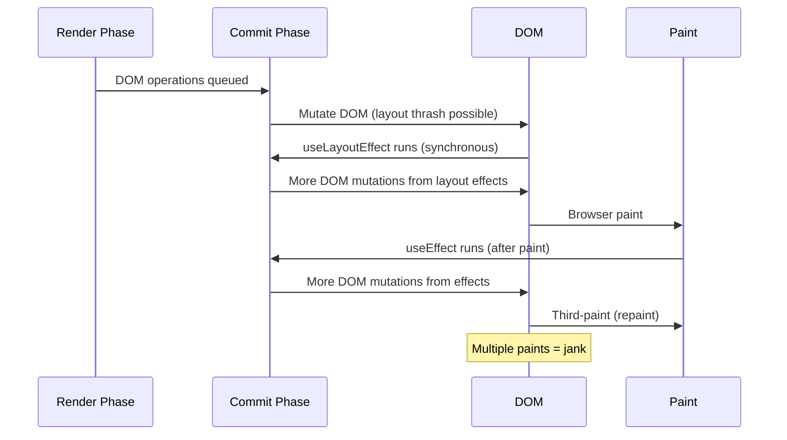

**How to avoid commit waterfalls**:
- Minimize `useLayoutEffect` that triggers state updates
- Batch state updates in effects
- Use `useEffect` (not `useLayoutEffect`) when you don't need synchronous DOM

---

## 17. Passive Effects (useEffect) vs Layout Effects (useLayoutEffect)


| | useEffect | useLayoutEffect |
|---|---|---|
| Runs | After paint (deferred) | Before paint (synchronous) |
| Blocks paint | No | Yes |
| DOM measurements | ⚠️ Flash possible | ✅ Before user sees |
| Animation | ✅ Recommended | ❌ Can cause jank |
| Performance | ✅ Better | ❌ Slower |

**Rule of thumb**: Start with `useEffect`. Switch to `useLayoutEffect` ONLY if you see visual flicker (DOM measure + setState in same cycle).

---

## 18. N+1 Render Problem


**Pattern**: Multiple sequential state updates that should be batched but aren't.

```jsx
// In React 17: N+1 re-renders
function UserProfile({ userId }) {
  const [user, setUser] = useState(null);
  const [posts, setPosts] = useState([]);
  const [loading, setLoading] = useState(true);

  useEffect(() => {
    fetchUser(userId).then(u => {
      setUser(u);     // Re-render 1
      setLoading(false); // Re-render 2 (in React 17)
    });
    fetchPosts(userId).then(p => setPosts(p)); // Re-render 3
  }, [userId]);
}
```

**React 18 Fix**: Automatic batching handles all three — ONE render.

```jsx
// React 18: ONE render (automatic batching)
fetchUser(userId).then(u => {
  setUser(u);
  setLoading(false); // Batched with above
});
fetchPosts(userId).then(p => setPosts(p)); // Also batched
```

---

## 19. Automatic Batching in React 18 — Deep Dive


React 18 batches by default inside:
- Event handlers
- `useEffect` callbacks
- `setTimeout` / `setInterval`
- Native Promise `.then()`
- `requestAnimationFrame`
- Microtasks (queueMicrotask)
- Any async callback

```jsx
// React 18: All batched → 1 render
fetch('/api/data').then(() => {
  setState1(x);
  setState2(y);
  setState3(z);
});
```

**Behind the scenes**: React wraps callbacks in `batchUpdates()` which defers state updates until the callback completes.

---

## 20. flushSync — Opting Out


```jsx
import { flushSync } from 'react-dom';

function handleClick() {
  flushSync(() => setCount(c => c + 1)); // Forced synchronous render
  // DOM is updated here
  flushSync(() => setFlag(f => !f));     // Second synchronous render
}
```

**When you need it**:
- Reading `offsetHeight` after a state update
- Syncing scroll position with new content
- Integrating with non-React libraries that read DOM
- Printing (window.print after DOM update)

**Performance cost**: Each `flushSync` creates a separate commit phase. Multiple `flushSync` calls cause multiple synchronous DOM updates → layout thrashing.

---

## 21. Production Failure: Missing memo — 500ms Frame Drops


**Scenario**: A financial dashboard renders a table with 10,000 rows. Each row has 10 cells. Parent component re-renders every 5 seconds (data refresh).

```jsx
function DataTable({ rows }) {
  return (
    <table>
      <tbody>
        {rows.map(row => (
          <TableRow key={row.id} row={row} />
        ))}
      </tbody>
    </table>
  );
}

function TableRow({ row }) {
  // Re-renders ALL 10,000 rows every 5 seconds
  return (
    <tr>
      <td>{row.date}</td>
      <td>{row.symbol}</td>
      <td>{row.price}</td>
      {/* ... 7 more cells */}
    </tr>
  );
}
```

**Impact**:
- 10,000 rows × 10 cells = 100,000 React elements diffed every refresh
- Render time: ~450ms
- Commit phase: ~80ms
- Total frame drop: 530ms (33 frames at 60fps)
- User types in search input → frozen for 530ms

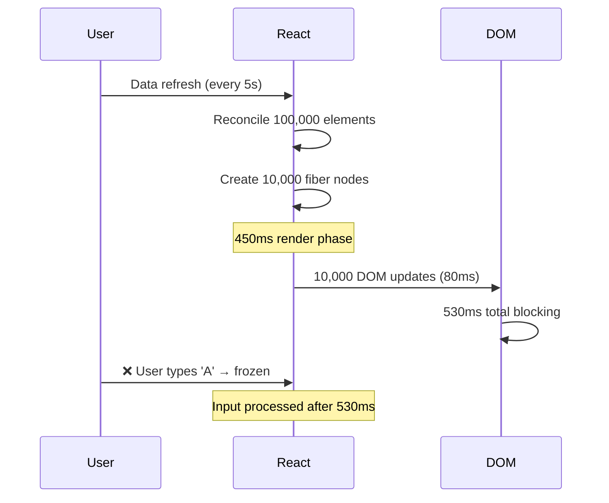

**Fix**: `React.memo` on `TableRow` + stable callback for event handlers.

```jsx
const TableRow = memo(function TableRow({ row }) {
  return (
    <tr>
      <td>{row.date}</td>
      <td>{row.symbol}</td>
      <td>{row.price}</td>
    </tr>
  );
});

// With memo and stable data references, only changed rows re-render
// Typical case: 10–50 rows changed per refresh → 5ms instead of 530ms
```

---

## 22. Backpressure: Synchronous Renders Blocking User Input


**Scenario**: A search input that renders 500 results synchronously on every keystroke.

```jsx
function Search() {
  const [query, setQuery] = useState('');
  const results = searchData(query); // Synchronous, O(n) filter

  return (
    <div>
      <input value={query} onChange={e => setQuery(e.target.value)} />
      <ResultsList results={results} />
    </div>
  );
}
```

**Backpressure chain**:
1. User types 'h' → render starts
2. `searchData` filters 50,000 items synchronously → 80ms
3. React reconciles 500 results → 60ms
4. Total: 140ms blocking → user perceives lag
5. User types 'he' while still processing 'h' → queued
6. Repeat for each keystroke → input feels sluggish
7. On slow devices (3-year-old Android), each keystroke takes 400ms+ → user frustration

**Solutions**:
```jsx
function Search() {
  const [query, setQuery] = useState('');
  const [isPending, startTransition] = useTransition();

  // Option 1: useDeferredValue
  const deferredQuery = useDeferredValue(query);
  const results = useMemo(
    () => searchData(deferredQuery),
    [deferredQuery]
  );

  // Option 2: Debounce
  const debouncedQuery = useDebounce(query, 150);
  const results = useMemo(
    () => searchData(debouncedQuery),
    [debouncedQuery]
  );

  return (
    <div style={{ opacity: isPending ? 0.8 : 1 }}>
      <input value={query} onChange={e => setQuery(e.target.value)} />
      <ResultsList results={results} />
    </div>
  );
}
```

---

## 23. Profiling with Chrome DevTools


### Performance Tab Analysis


1. Record interaction
2. Look for **long tasks** (>50ms in the "Main" thread)
3. Identify "Function Call" entries that are React reconciling
4. Check "Summary" -> "Rendering" -> "Scripting" time

### React DevTools Profiler


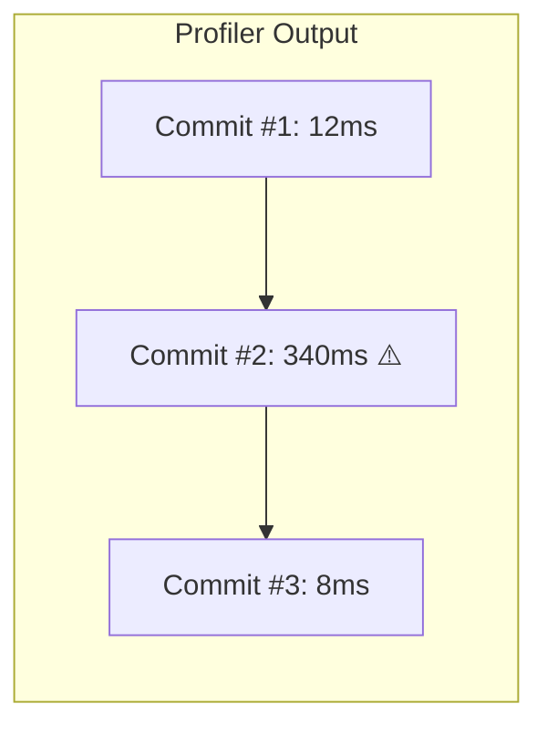

- **Commit #2**: What caused it? Click on it → see flame graph
- **Look for**: Components with long render time (red bars) or many renders (grayed)

---

## 24. Wasted Render Detection Patterns


```javascript
// Add to component to detect unnecessary re-renders
function useWhyDidYouUpdate(name, props) {
  const previousProps = useRef(props);

  useEffect(() => {
    const allKeys = Object.keys({ ...previousProps.current, ...props });
    const changes = {};

    allKeys.forEach(key => {
      if (previousProps.current[key] !== props[key]) {
        changes[key] = {
          from: previousProps.current[key],
          to: props[key],
        };
      }
    });

    if (Object.keys(changes).length) {
      console.log(`[why-did-you-update] ${name}`, changes);
    }

    previousProps.current = props;
  });
}
```

**Usage**: Identify which props are changing unnecessarily and stabilize them.

---

## 25. Rendering Patterns Comparison


| Pattern | Re-render scope | Setup complexity | Performance |
|---|---|---|---|
| No optimization | Everything | None | Poor for large trees |
| `React.memo` | Only changed props | Low | Good |
| `PureComponent` | Shallow compare | Low | Good |
| `useMemo` + `useCallback` | Deps-controlled | Medium | Very good |
| Virtualization | Visible only | Medium | Excellent (10k+) |
| Concurrent mode | Interruptible | Medium | Excellent |
| Web Workers (off-main) | None on main thread | High | Best for heavy CPU |

---

## 26. Mermaid: Full Render Pipeline


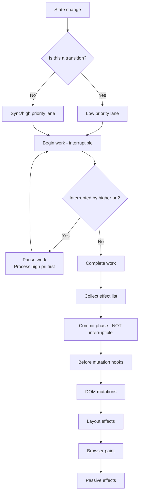

---

## 27. Large List Rendering — Optimization Matrix


| Technique | Time (10k items) | Time (100k items) | Scroll perf |
|---|---|---|---|
| Naive render | 250ms | OOM | ❌ |
| `React.memo` per row | 150ms | 1.5s | ❌ |
| Virtualization (react-window) | 2ms | 2ms | ✅ |
| Virtualization + memo | 2ms | 2ms | ✅ |
| Concurrent mode + virtualization | 1ms | 1ms | ✅ |

---

## 28. Production Failure: Index Key with List Prepending


**Real story**: A collaborative document editor (like Google Docs) renders a list of sections. Sections can be inserted at any position.

```jsx
// Bug: index as key
{sections.map((section, idx) => (
  <SectionEditor key={idx} section={section} />
))}
```

**Symptom**: When user inserts a section at position 0, every section below loses its cursor position. User types in section 5 → text appears in section 6. Chaos.

**Root cause**: 
- Insert at position 0 → all keys shift by 1
- React matches `key=0` (was old section A) → now is new section NEW
- React reuses the same DOM node and component instance
- `SectionEditor` keeps its internal state (cursor position, text selection)
- But now it renders different data → confusion

**Production impact**: User data corruption. Text entered in one section saves to another. 300 support tickets in 24 hours.

**Fix**: Stable IDs as keys. Editor instances are properly mapped to data.

---

## 29. React.memo with Deep Props


```jsx
// ❌ memo doesn't help if parent creates new objects
function Parent() {
  const config = { theme: 'dark', locale: 'en' }; // New object every render!
  return <Child config={config} />;
}

const Child = memo(({ config }) => {
  // Re-renders every time because config reference changes
});

// ✅ useMemo to stabilize
function Parent() {
  const config = useMemo(() => ({ theme: 'dark', locale: 'en' }), []);
  return <Child config={config} />;
}
```

---

## 30. Element Type Optimization


```jsx
// ❌ Causes full teardown/rebuild every toggle
function Toggle({ active }) {
  return active ? <div>On</div> : <span>Off</span>;
}

// ✅ Same element type, conditionally change props
function Toggle({ active }) {
  return <div className={active ? 'on' : 'off'}>{active ? 'On' : 'Off'}</div>;
}
```

Type change = React destroys entire DOM subtree and rebuilds. Always use same element type when possible.

---

## 31. Mermaid: React.memo Decision Flow


```mermaid
flowchart TD
    A[Parent re-renders] --> B{Is child memo'd?}
    B -->|No| C[Child re-renders ALWAYS]
    B -->|Yes| D{Are props equal?<br/>(shallow compare)}
    D -->|Yes| E[Child SKIPS re-render]
    D -->|No| F[Child re-renders]
    F --> G{Props changed<br/>or new references?}
    G -->|New reference same value| H[UNNECESSARY re-render]
    G -->|Different value| I[NECESSARY re-render]
```

---

## 32. Interview: Index Key O(n²) — Full Analysis


**Question**: "Explain in detail why index as key causes O(n²) behavior with list prepend."

**Answer**: 

1. **Identity confusion**: After prepending `NEW` at index 0, React maps:
   - `key=0` → was 'A', now 'NEW' (React updates DOM)
   - `key=1` → was 'B', now 'A' (React updates DOM — but could have reused 'A's DOM)
   - `key=2` → was 'C', now 'B' (React updates DOM — but could have reused 'B's DOM)
   - `key=3` → was nothing, now 'C' (React creates DOM — but could have reused 'C's DOM)

2. **No DOM reuse**: Every existing DOM node is updated with new content instead of being shifted. DOM is mutated N times instead of 1 new insertion + 0 mutations.

3. **Component state loss**: If each item has internal state (input values, scroll position, animation state), all state is wrong because instances are mismatched.

4. **Sub-tree re-render cascade**: If each item has children that are also indexed-keyed, every child reconciliation has the same problem → O(n²) across all levels.

5. **Real cost**: For a list of 1000 items:
   - With stable keys: 1 new mount + 999 diff-without-mutation = O(1) actual work
   - With index keys: 1000 DOM mutations + 1000 component updates = O(n) DOM work

**The "²" in O(n²)**: Comes from nested reconciliation. If each item contains a sub-list of 100 items:
- Index keys at both levels → prepending 1 item requires reconciling ALL 1000 parent items × ALL 100 child items = 100,000 checks instead of 100 normal.

---

## 33. Performance Debugging Checklist


- [ ] Profiled with React DevTools — identified slow components
- [ ] `React.memo` applied to leaf components with stable props
- [ ] `useCallback` for callbacks passed to memo'd children
- [ ] `useMemo` for expensive computed values
- [ ] Stable keys (not index) for all lists
- [ ] Virtualized large lists (>500 items in viewport)
- [ ] Code-split at route boundaries
- [ ] Images lazy-loaded (loading="lazy")
- [ ] No unnecessary re-renders in component tree
- [ ] Automatic batching in React 18 utilized
- [ ] `startTransition` for non-urgent updates
- [ ] Bundle size analyzed and optimized

---

## 34. Simplest Mental Model — Rendering


> **Render = running all component functions to produce the new VDOM tree. Reconciliation = diffing old tree vs new tree. Fiber = the work list for reconciliation, split into interruptible units. Commit = actually poking the DOM. Memo = skip rendering if inputs look the same. Virtualization = only render what's on screen.**

---

## 35. Quick Reference Table


| Technique | Problem Solved | Cost |
|---|---|---|
| `React.memo` | Unnecessary re-renders | Shallow compare overhead |
| `useMemo` | Expensive recomputation | Memory for cached value |
| `useCallback` | Function identity change | Dep comparison |
| Key (stable) | Misidentified list items | Just a string |
| Virtualization | Too many DOM nodes | Scroll handler + layout calc |
| Code splitting | Large initial bundle | Async loading latency |
| Concurrent mode | Blocking renders | Scheduler overhead |
| Batching | Multiple sync renders | None (strict improvement) |
| `flushSync` | Force synchronous render | Blocks batching |

---

## 36. Mermaid: Fiber Tree Walk


```mermaid
graph TD
    subgraph "Fiber Tree (linked list)"
        A["App fiber<br/>child=null"]
        B["Nav fiber<br/>return=App<br/>sibling=null"]
        C["Main fiber<br/>return=App<br/>child=Sidebar"]
        D["Sidebar fiber<br/>return=Main<br/>sibling=Content"]
        E["Content fiber<br/>return=Main<br/>child=null"]
        
        A -.->|alternate| A2["App (WIP)"]
        C -.->|alternate| C2["Main (WIP)"]
    end
```

**Traversal order**: App → Nav → Main → Sidebar → Content (depth-first, child-first, then sibling, then return).

---

## 37. When Not to Optimize


- Component renders in <1ms
- Less than 50 instances on screen
- Re-renders happen less than once per second
- Parent re-renders are rare
- Memo comparison cost > render cost (rare but possible)

**Measure first, optimize second**. Premature optimization adds complexity without measurable benefit.

---

## 38. Production Checklist


- [ ] Bundle size < 250KB (gzipped) for initial load
- [ ] No render-blocking synchronous effects
- [ ] All lists > 100 items use virtualization
- [ ] All event handlers in lists are stable (useCallback)
- [ ] No setState inside render body
- [ ] No inline functions/objects passed to children without memo
- [ ] Error boundaries don't cause cascading re-renders
- [ ] React.memo wrapped on exported components in shared library

## Interactive Component 1: Render Lifecycle State

```html-live
<div style="padding:16px;background:#0b0e14;border:1px solid #1e2a3a;border-radius:8px">
  <style>.state-machine-title{color:#00d4ff;font-family:monospace;font-size:14px;font-weight:bold;margin-bottom:16px;letter-spacing:1px}.state-demo{text-align:center}.state-display{font-size:18px;font-family:monospace;padding:16px;border-radius:4px;margin:16px 0;color:#0b0e14;font-weight:bold;min-height:50px;display:flex;align-items:center;justify-content:center;border:2px solid currentColor}.state-mount{background:#60a5fa;border-color:#3b82f6}.state-update{background:#fbbf24;border-color:#f59e0b}.state-unmount{background:#ef4444;border-color:#dc2626}.state-buttons{display:flex;gap:8px;justify-content:center;flex-wrap:wrap;margin-top:16px}.state-button{padding:8px 16px;border:1px solid #00d4ff;background:#1e3a5f;color:#00d4ff;border-radius:4px;cursor:pointer;font-family:monospace;font-size:12px;transition:all 0.2s}.state-button:hover{background:#2a5a8f;box-shadow:0 0 8px #00d4ff}</style>
  <div class="state-machine-title">Component Render Lifecycle</div>
  <div class="state-demo">
    <div class="state-display state-mount" id="lc-display">MOUNT</div>
    <div class="state-buttons">
      <button class="state-button" onclick="setLcState('MOUNT', lcMap)">Mount</button>
      <button class="state-button" onclick="setLcState('UPDATE', lcMap)">Update</button>
      <button class="state-button" onclick="setLcState('UNMOUNT', lcMap)">Unmount</button>
    </div>
  </div>
  <script>
    const lcMap = {
      'MOUNT': { label: 'MOUNT', class: 'state-mount' },
      'UPDATE': { label: 'UPDATE', class: 'state-update' },
      'UNMOUNT': { label: 'UNMOUNT', class: 'state-unmount' }
    };
    function setLcState(state, sm) {
      const display = document.getElementById('lc-display');
      const info = sm[state];
      display.textContent = info.label;
      display.className = 'state-display ' + info.class;
    }
  </script>
</div>
```

## Interactive Component 2: Web Vitals Metrics

```html-live
<div style="padding:16px;background:#0b0e14;border:1px solid #1e2a3a;border-radius:8px">
  <style>.obs-title{color:#00d4ff;font-family:monospace;font-size:14px;font-weight:bold;margin-bottom:16px;letter-spacing:1px}.obs-grid{display:grid;grid-template-columns:repeat(auto-fit, minmax(150px, 1fr));gap:12px}.obs-card{padding:12px;background:#1a2332;border:1px solid #1e3a5f;border-radius:4px;display:flex;flex-direction:column;align-items:center;transition:all 0.3s}.obs-card:hover{border-color:#00d4ff;box-shadow:0 0 8px rgba(0, 212, 255, 0.3)}.obs-label{color:#a3aab8;font-family:monospace;font-size:11px;text-transform:uppercase;letter-spacing:0.5px;margin-bottom:8px}.obs-value{font-family:monospace;font-size:20px;font-weight:bold;margin-bottom:4px;letter-spacing:0.5px}.obs-unit{color:#a3aab8;font-family:monospace;font-size:10px;text-transform:uppercase}.metric-healthy{color:#34d399}.metric-warning{color:#fbbf24}.metric-critical{color:#ef4444}</style>
  <div class="obs-title">Web Vitals Metrics</div>
  <div class="obs-grid">
    <div class="obs-card"><div class="obs-label">FCP</div><div class="obs-value metric-healthy">1.2</div><div class="obs-unit">sec</div></div>
    <div class="obs-card"><div class="obs-label">LCP</div><div class="obs-value metric-healthy">2.1</div><div class="obs-unit">sec</div></div>
    <div class="obs-card"><div class="obs-label">CLS</div><div class="obs-value metric-healthy">0.08</div><div class="obs-unit">score</div></div>
    <div class="obs-card"><div class="obs-label">TTI</div><div class="obs-value metric-healthy">3.4</div><div class="obs-unit">sec</div></div>
  </div>
</div>
```

## Interactive Component 3: Render Batch Size Control

```html-live
<div style="padding:16px;background:#0b0e14;border:1px solid #1e2a3a;border-radius:8px">
  <style>.slider-title{color:#00d4ff;font-family:monospace;font-size:14px;font-weight:bold;margin-bottom:12px;letter-spacing:1px}.slider-container{display:flex;flex-direction:column;gap:12px}.slider-label{color:#e3eaf0;font-family:monospace;font-size:12px}.slider-wrapper{display:flex;align-items:center;gap:12px}.slider-input{flex:1;height:6px;border-radius:3px;background:#1e3a5f;outline:none;-webkit-appearance:none;appearance:none}.slider-input::-webkit-slider-thumb{-webkit-appearance:none;appearance:none;width:18px;height:18px;border-radius:50%;background:#00d4ff;cursor:pointer;box-shadow:0 0 8px #00d4ff;border:2px solid #0b0e14}.slider-input::-moz-range-thumb{width:18px;height:18px;border-radius:50%;background:#00d4ff;cursor:pointer;box-shadow:0 0 8px #00d4ff;border:2px solid #0b0e14}.slider-value{font-family:monospace;color:#34d399;min-width:80px;text-align:right;font-size:12px;font-weight:bold}</style>
  <div class="slider-title">Render Batch Configuration</div>
  <div class="slider-container">
    <label class="slider-label">Items per batch:</label>
    <div class="slider-wrapper">
      <input type="range" min="1" max="100" value="10" class="slider-input" id="batch-slider">
      <span class="slider-value" id="batch-value">10 items</span>
    </div>
  </div>
  <script>
    const slider = document.getElementById('batch-slider');
    const value = document.getElementById('batch-value');
    slider.addEventListener('input', (e) => { value.textContent = e.target.value + ' items'; });
  </script>
</div>
```

---

## Related


- [Networking](/11-networking/) — HTTP, performance, optimization
- [Security](/13-security/) — CORS, authentication, XSS prevention
- [Backend](/03-backend/) — API design and contracts
- [Performance Engineering](/18-performance-engineering/) — Browser rendering
- [Testing](/19-testing/) — E2E and component testing
