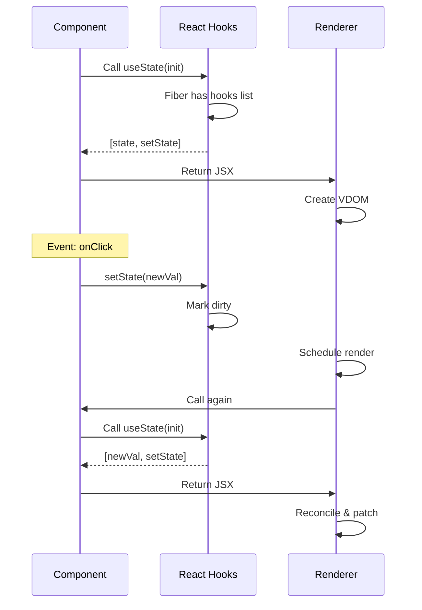
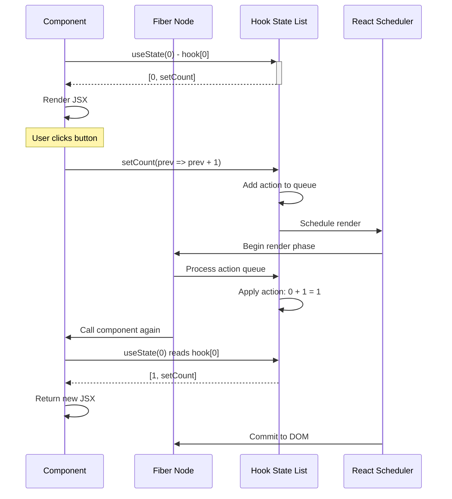
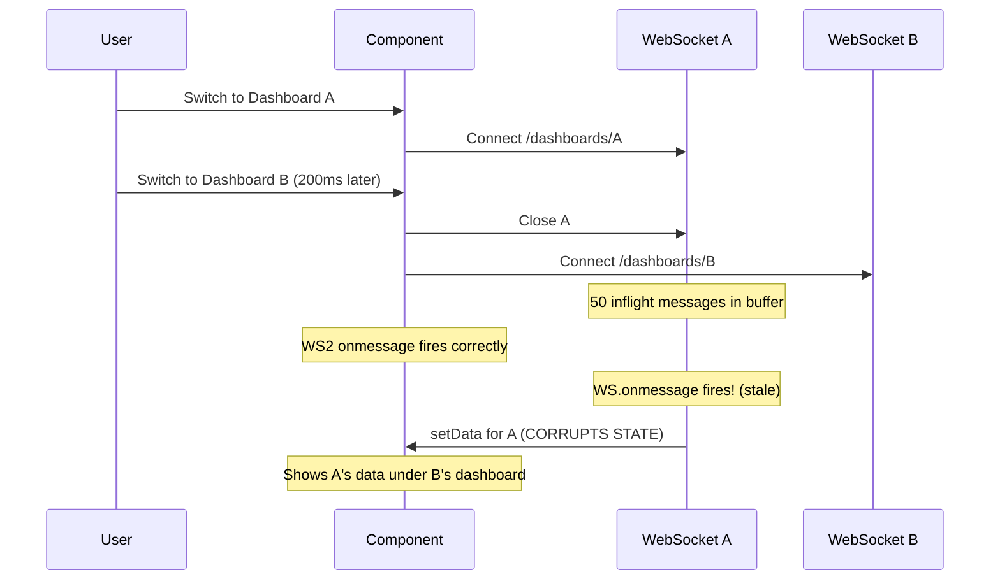
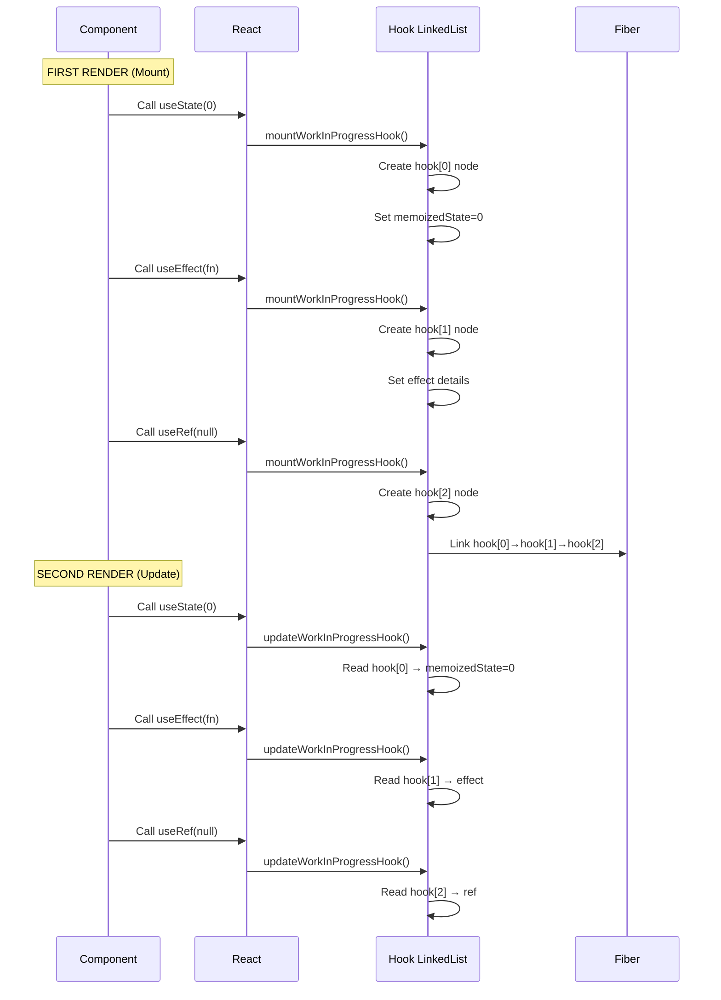
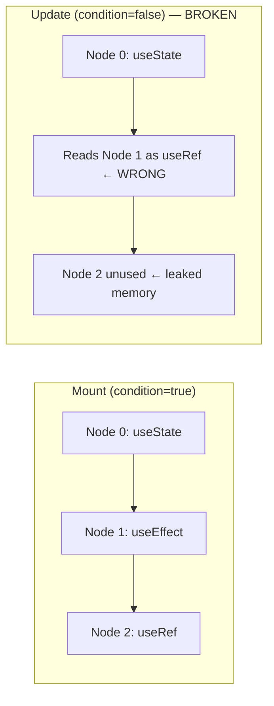
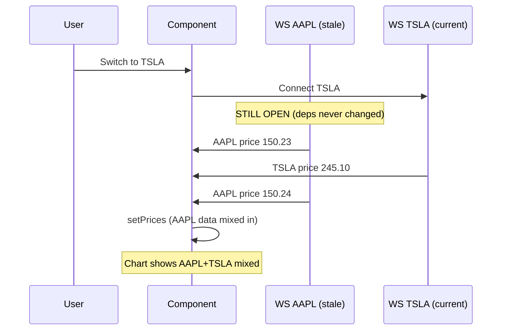
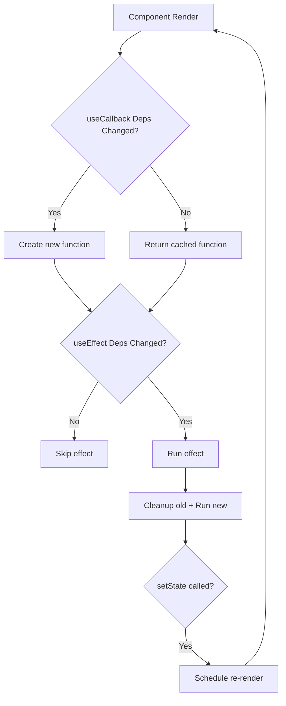
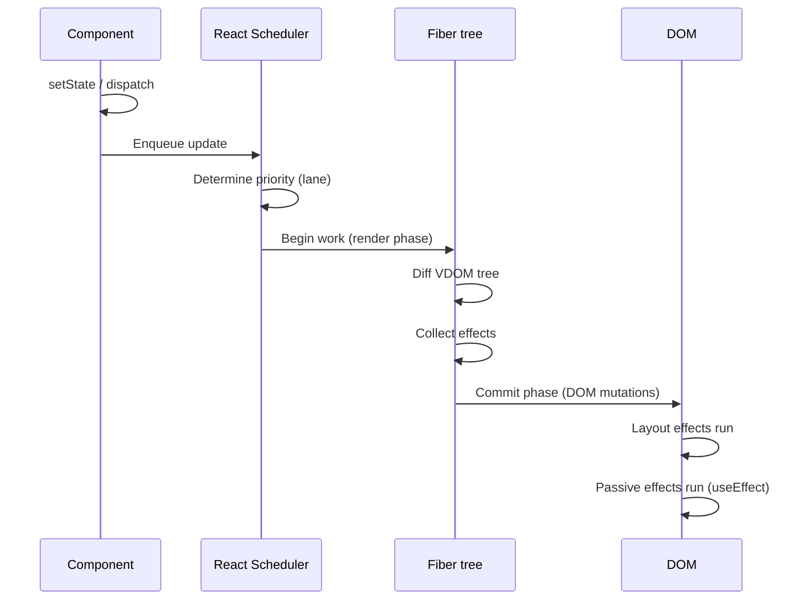
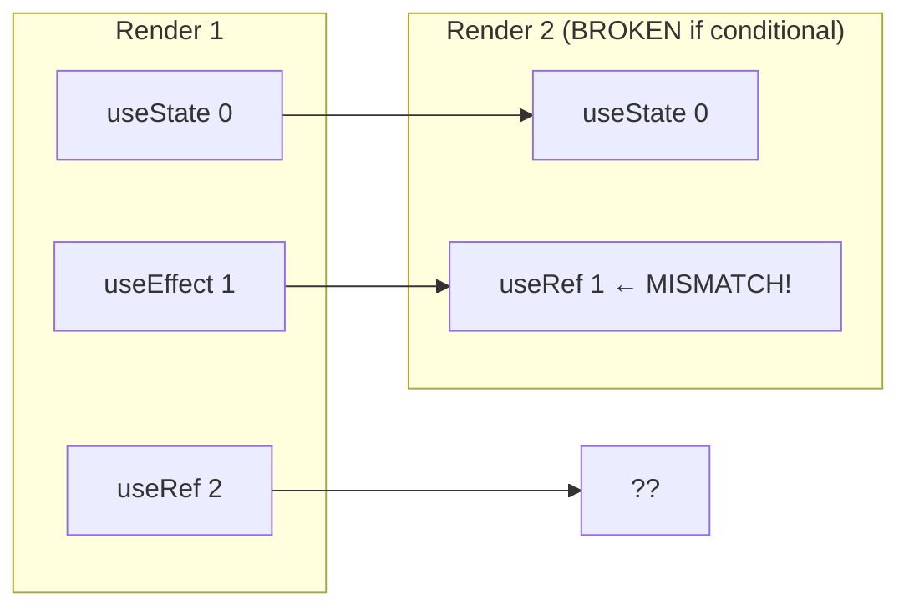
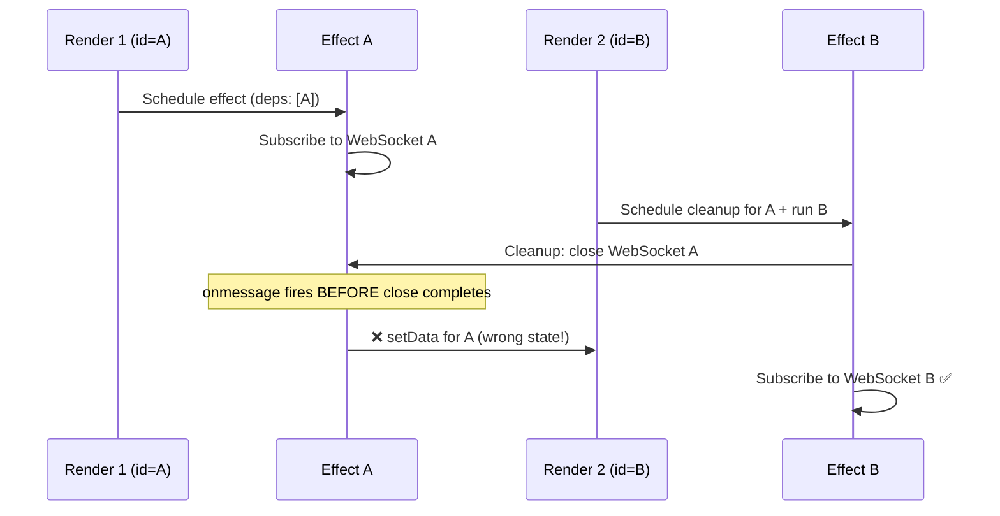

# 02: Hooks & State Management — Deep Reference

> **Scope**: useState, useEffect, useRef, useMemo, useCallback, useContext, useReducer, useLayoutEffect, useImperativeHandle, useDebugValue, custom hooks, rules of hooks, closure traps, infinite loops, stale closures, context re-renders, useSyncExternalStore, useDeferredValue, useTransition, hook composition, hook testing.

---


## Hooks Execution Model





## 1. useState — The Foundation


```jsx
const [state, setState] = useState(initialValue);
const [state, setState] = useState(() => expensiveComputation()); // Lazy initializer
```

**How it works internally**: React stores state in the fiber node's memoizedState linked list. Each `useState` call reads from the next slot in the list. This is why hook order must be stable.

```javascript
// Simplified internal model
let hookIndex = 0;
const hooks = [];

function useState(initial) {
  const idx = hookIndex++;
  if (!hooks[idx]) {
    hooks[idx] = { state: typeof initial === 'function' ? initial() : initial };
  }
  const setState = (action) => {
    const newState = typeof action === 'function' ? action(hooks[idx].state) : action;
    hooks[idx].state = newState;
    scheduleRender(); // Schedule re-render
  };
  return [hooks[idx].state, setState];
}
```

**Stale closure trap with useState**:
```jsx
function Counter() {
  const [count, setCount] = useState(0);
  useEffect(() => {
    const timer = setInterval(() => {
      setCount(count + 1); // ❌ Stale closure: count is always 0
    }, 1000);
    return () => clearInterval(timer);
  }, []); // Missing count in deps → but adding it breaks the pattern
  return <div>{count}</div>;
}
```

**Fix**: Use functional updater.
```jsx
setCount(c => c + 1); // ✅ Always gets latest state
```

### Step-by-Step


1. **Hook registration**: On mount, `useState` creates a hook node in the fiber's `memoizedState` linked list at position N
2. **State retrieval**: On subsequent renders, React reads the hook at position N (position determined by call order)
3. **Action queuing**: When `setState` is called, the action is added to the hook's update queue
4. **Re-render scheduling**: React marks the fiber as dirty and schedules a render pass
5. **Update application**: During render phase, React processes the action queue and computes new state
6. **Commit**: New state is committed and component re-renders with the new state value

### Code Example


```javascript
import React, { useState } from 'react';

function Counter() {
  // Hook index 0: Count state
  const [count, setCount] = useState(0);
  
  // Hook index 1: Input state  
  const [input, setInput] = useState('');

  function handleIncrement() {
    // Batched updates in React 18
    setCount(c => c + 1);
    setCount(c => c + 1);
    // Result: count incremented by 2, only one re-render
  }

  function handleAsyncIncrement() {
    // Callbacks work without batching in older versions
    setTimeout(() => {
      setCount(c => c + 1);
    }, 100);
  }

  return (
    <div>
      <p>Count: {count}</p>
      <button onClick={handleIncrement}>+2 (batched)</button>
      <button onClick={handleAsyncIncrement}>+1 (async)</button>
      <input value={input} onChange={e => setInput(e.target.value)} />
    </div>
  );
}
```

### Real-World Scenario


A form with 10 fields used `useState` for each field. When a user filled the form and submitted, 10 separate `setState` calls fired. In React 16, this triggered 10 separate re-renders (causing 500ms delay on slower devices). After upgrading to React 18, automatic batching merged all 10 updates into one re-render, reducing submission response time to 50ms.

### Diagram




---

## 2. useEffect — Side Effects Engine


```jsx
useEffect(() => {
  // Side effect code
  return () => { /* Cleanup */ };
}, [dependency]);
```

### Cleanup Patterns


| Resource | Cleanup |
|---|---|
| setInterval | `clearInterval(id)` |
| Event listener | `removeEventListener(type, handler)` |
| WebSocket | `ws.close()` |
| Subscription | `unsubscribe()` |
| AbortController | `controller.abort()` |
| Timer | `clearTimeout(id)` |

```jsx
function useWebSocket(url) {
  useEffect(() => {
    const ws = new WebSocket(url);
    ws.onmessage = handleMessage;
    return () => ws.close(); // ✅ Cleanup on unmount or URL change
  }, [url]);
}
```

### Dependency Array Gotchas


```jsx
// ❌ Empty deps with external values → stale closure
useEffect(() => {
  fetch(`/api/items?page=${page}`); // page never updates effect
}, []);

// ✅ Proper deps
useEffect(() => {
  fetch(`/api/items?page=${page}`);
}, [page]);

// ❌ Object/array deps cause infinite loops
useEffect(() => {
  fetch('/api', { body: JSON.stringify(config) });
}, [config]); // If config is { ... } each render, infinite loop

// ✅ Stable reference deps
const config = useMemo(() => ({ theme, locale }), [theme, locale]);
useEffect(() => {
  fetch('/api', { body: JSON.stringify(config) });
}, [config]);
```

### Zigzag Effect Cleanup Race Conditions Under Load


**Production scenario**: User quickly toggles between two dashboards (`/dashboard/A` and `/dashboard/B`). Each dashboard starts a WebSocket connection + heavy data processing.

```jsx
function Dashboard({ id }) {
  const [data, setData] = useState(null);

  useEffect(() => {
    let cancelled = false;
    const ws = new WebSocket(`wss://api.example.com/dashboards/${id}`);

    ws.onmessage = (event) => {
      // Heavy processing
      const processed = expensiveTransform(JSON.parse(event.data));
      if (!cancelled) setData(processed);
    };

    return () => {
      cancelled = true;
      ws.close();
    };
  }, [id]);

  return <DashboardView data={data} id={id} />;
}
```

**Race condition without `cancelled` flag**: User switches to B → cleanup runs for A's effect → B's effect starts → but A's WebSocket `onmessage` fires BEFORE `ws.close()` resolves → sets data for wrong dashboard.

**Zigzag effect under load**: With 10 rapid toggles:
1. Effects start and cleanup in zigzag (A starts → B starts → A cleanup → B cleanup → C starts...)
2. If cleanup doesn't properly cancel, `setData` from stale effects corrupts state
3. Memory grows from unclosed WebSocket connections (backpressure)

**Backpressure of queued messages**: Each WebSocket buffers messages while connection is open but not processed. With rapid toggles, old connections accumulate unprocessed messages in memory. Under high message rate (100msg/s), this causes OOM.



**Fix**: Always use cleanup flags + AbortController for fetch-based effects.

---

## 3. useRef — Mutable Container


```jsx
const ref = useRef(initialValue);
// ref.current — mutable, persists across renders, no re-render on change
```

### Three Use Cases


1. **DOM reference**: `ref={ref}` pattern
2. **Instance variable**: Persist values across renders without causing re-render
3. **Previous value**: Store previous state/prop

```jsx
// Previous value pattern
function usePrevious(value) {
  const ref = useRef();
  useEffect(() => { ref.current = value; });
  return ref.current;
}
```

### useRef vs useState


| Aspect | useRef | useState |
|---|---|---|
| Triggers re-render | No | Yes |
| Mutable | Yes (`ref.current = x`) | Via setter only |
| Persists across renders | Yes | Yes |
| Use case | DOM, intervals, instance data | UI state |

---

## 4. useMemo — Memoized Computation


```jsx
const sortedList = useMemo(
  () => items.sort((a, b) => a.name.localeCompare(b.name)),
  [items]
);
```

### Over-Optimization Trap


```jsx
// ❌ UNNECESSARY: primitive computation doesn't benefit
const double = useMemo(() => count * 2, [count]);

// ✅ Necessary: expensive computation
const filtered = useMemo(
  () => bigList.filter(x => x.status === filter).sort(sortFn),
  [bigList, filter]
);
```

**Performance cost of useMemo itself**: `useMemo` stores previous deps, compares them (shallow), and conditionally recomputes. For trivial computations, this overhead exceeds the benefit.

**Rule**: Only use `useMemo` when:
- Computation is O(n) or worse with large n
- Result is passed as prop to a memo'd child
- Result is a dependency of another hook

---

## 5. useCallback — Memoized Function


```jsx
const handleClick = useCallback(() => {
  doSomething(id);
}, [id]);
```

### Interview Tricky: When useCallback Causes MORE Re-Renders


**Question**: "Can useCallback ever cause more re-renders than it prevents?"

**Answer**: Yes. Here's when:

```jsx
function Parent() {
  const [count, setCount] = useState(0);

  // Each render creates new handleClick function
  // But useCallback returns same ref if deps haven't changed
  const handleClick = useCallback(() => {
    console.log('clicked');
  }, []);

  return (
    <ExpensiveChild onClick={handleClick} />
  );
}
```

**Why it backfires**: `useCallback` itself has a dependency array. If dependencies change frequently, React creates a new function AND runs the comparison logic. If the child isn't wrapped in `React.memo`, the new function identity doesn't matter — the child re-renders anyway.

```jsx
// ❌ WORSE with useCallback
function Parent() {
  const [items, setItems] = useState([]);
  const [count, setCount] = useState(0);

  // This creates a new callback on EVERY render because items changes
  const handleDelete = useCallback((id) => {
    setItems(prev => prev.filter(i => i.id !== id));
  }, [items]); // items changes every time → new function every render

  // The useCallback overhead is wasted
  return items.map(item => <Item key={item.id} onDelete={handleDelete} />);
}

// ✅ BETTER: use functional setter + stable reference
const handleDelete = useCallback((id) => {
  setItems(prev => prev.filter(i => i.id !== id));
}, []); // No deps! Functional setter captures nothing
```

**Cost breakdown of useCallback overhead**: 
- Dependency comparison (shallow equal on array)
- Function object allocation (when deps change)
- Memory for storing previous function + deps
- Garbage collection for replaced function

**Net effect**: If deps change more often than the memo'd function would cause re-renders, you're losing performance.

---

## 6. useContext — Consuming Context


```jsx
const ThemeContext = createContext('light');

function ThemedButton() {
  const theme = useContext(ThemeContext);
  return <button className={`btn-${theme}`}>Click</button>;
}

function App() {
  return (
    <ThemeContext.Provider value="dark">
      <ThemedButton />
    </ThemeContext.Provider>
  );
}
```

### Context Re-Render Problem


**Every context consumer re-renders when context value changes, regardless of memo.**

```jsx
const UserContext = createContext({ user: null, notifications: [] });

function NotificationBell() {
  const { notifications } = useContext(UserContext);
  // This re-renders when user changes too! (Even though it only uses notifications)
  return <span>{notifications.length}</span>;
}
```

### Context Splitting Pattern


Split large context into smaller, purpose-specific contexts:

```jsx
const UserContext = createContext(null);
const NotificationContext = createContext([]);
const ThemeContext = createContext('light');

// Each context consumer only re-renders when ITS value changes
function NotificationBell() {
  const notifications = useContext(NotificationContext);
  return <span>{notifications.length}</span>;
}
```

### Context Value Memoization


```jsx
function App({ children }) {
  const [user, setUser] = useState(null);

  // ❌ Every render creates new object → ALL consumers re-render
  return (
    <UserContext.Provider value={{ user, setUser }}>
      {children}
    </UserContext.Provider>
  );
}

// ✅ useMemo to stabilize reference
function App({ children }) {
  const [user, setUser] = useState(null);
  const value = useMemo(() => ({ user, setUser }), [user]);
  return <UserContext.Provider value={value}>{children}</UserContext.Provider>;
}
```

---

## 7. useReducer — Complex State Logic


```jsx
function reducer(state, action) {
  switch (action.type) {
    case 'increment': return { count: state.count + 1 };
    case 'decrement': return { count: state.count - 1 };
    default: return state;
  }
}

function Counter() {
  const [state, dispatch] = useReducer(reducer, { count: 0 });
  return (
    <button onClick={() => dispatch({ type: 'increment' })}>
      {state.count}
    </button>
  );
}
```

### useReducer + Context = Global State


```jsx
const CounterContext = createContext(null);

function CounterProvider({ children }) {
  const [state, dispatch] = useReducer(reducer, initialState);
  const value = useMemo(() => ({ state, dispatch }), [state]);
  return <CounterContext.Provider value={value}>{children}</CounterContext.Provider>;
}

function DeepChild() {
  const { state, dispatch } = useContext(CounterContext);
  return <button onClick={() => dispatch({ type: 'increment' })}>{state.count}</button>;
}
```

---

## 8. useLayoutEffect — Synchronous Effect


Runs synchronously after DOM mutations but BEFORE browser paint.

```jsx
function Tooltip() {
  const ref = useRef(null);
  const [pos, setPos] = useState({ x: 0, y: 0 });

  useLayoutEffect(() => {
    // Measure DOM and update position BEFORE user sees it
    const rect = ref.current.getBoundingClientRect();
    setPos({ x: rect.right + 10, y: rect.top });
  }, []);

  return <div ref={ref} style={{ left: pos.x, top: pos.y }}>Tooltip</div>;
}
```

**When to use**: Reading layout and synchronously re-rendering (tooltips, popovers, scroll position).

**When NOT to use**: Most cases. `useEffect` is preferred because it doesn't block paint.

---

## 9. useImperativeHandle — Exposing Imperative API


```jsx
const FancyInput = forwardRef((props, ref) => {
  const inputRef = useRef(null);

  useImperativeHandle(ref, () => ({
    focus: () => inputRef.current.focus(),
    clear: () => { inputRef.current.value = ''; },
    scrollIntoView: () => inputRef.current.scrollIntoView(),
  }));

  return <input ref={inputRef} />;
});

// Parent usage
function Parent() {
  const ref = useRef(null);
  const handleClick = () => {
    ref.current.focus();
    ref.current.clear();
  };
  return <FancyInput ref={ref} />;
}
```

---

## 10. useDebugValue — Custom Hook Label in DevTools


```jsx
function useOnlineStatus() {
  const [online, setOnline] = useState(navigator.onLine);
  useDebugValue(online ? 'Online' : 'Offline');
  // ...
}

// React DevTools shows: useOnlineStatus: "Online"
```

Format with function:
```jsx
useDebugValue(status, (s) => s ? '🟢 Online' : '🔴 Offline');
```

---

## 11. Custom Hooks — Composition Patterns


### useDebounce


```jsx
function useDebounce(value, delay = 300) {
  const [debounced, setDebounced] = useState(value);

  useEffect(() => {
    const timer = setTimeout(() => setDebounced(value), delay);
    return () => clearTimeout(timer);
  }, [value, delay]);

  return debounced;
}
```

### useThrottle


```jsx
function useThrottle(value, interval = 300) {
  const [throttled, setThrottled] = useState(value);
  const lastUpdated = useRef(0);

  useEffect(() => {
    const now = Date.now();
    if (now - lastUpdated.current >= interval) {
      setThrottled(value);
      lastUpdated.current = now;
    } else {
      const timer = setTimeout(() => {
        setThrottled(value);
        lastUpdated.current = Date.now();
      }, interval);
      return () => clearTimeout(timer);
    }
  }, [value, interval]);

  return throttled;
}
```

### usePrevious


```jsx
function usePrevious(value) {
  const ref = useRef();
  useEffect(() => { ref.current = value; });
  return ref.current;
}
```

### useAsync


```jsx
function useAsync(asyncFn, deps = []) {
  const [state, setState] = useState({ data: null, loading: true, error: null });

  useEffect(() => {
    let cancelled = false;
    setState(s => ({ ...s, loading: true }));
    asyncFn().then(data => {
      if (!cancelled) setState({ data, loading: false, error: null });
    }).catch(error => {
      if (!cancelled) setState({ data: null, loading: false, error });
    });
    return () => { cancelled = true; };
  }, deps);

  return state;
}
```

### useIntersectionObserver


```jsx
function useIntersectionObserver(ref, options = {}) {
  const [isIntersecting, setIsIntersecting] = useState(false);

  useEffect(() => {
    if (!ref.current) return;
    const observer = new IntersectionObserver(([entry]) => {
      setIsIntersecting(entry.isIntersecting);
    }, options);
    observer.observe(ref.current);
    return () => observer.disconnect();
  }, [ref, options]);

  return isIntersecting;
}
```

---

## 12. Rules of Hooks


### Why Order Matters — The Linked List


React relies on the **order of hook calls** being identical between renders. Each hook call reads from a linked list node in the fiber's `memoizedState` property:

```javascript
// React internal fiber hook list structure
fiber.memoizedState = {
  memoizedState: 'countValue',  // The actual state value for useState
  baseState: 'countValue',
  baseQueue: null,
  queue: {
    pending: null,
    dispatch: dispatchSetState.bind(null, fiber),
    lastRenderedReducer: basicStateReducer,
    lastRenderedState: 'countValue',
  },
  next: {
    memoizedState: cleanupFn | undefined, // For useEffect: cleanup or undefined
    baseState: null,
    baseQueue: null,
    queue: {
      pending: null,
      lastRenderedReducer: null,
      lastRenderedState: null,
    },
    next: {
      memoizedState: refObject, // For useRef: { current: initialValue }
      next: null
    }
  }
};
```

Each hook type stores different data in `memoizedState`:

| Hook | `memoizedState` Contains |
|---|---|
| `useState` | The current state value |
| `useReducer` | The current state value |
| `useEffect` | The effect object (create fn, destroy fn, deps) |
| `useRef` | `{ current: initialValue }` |
| `useMemo` | `[computedValue, deps]` |
| `useCallback` | `[callback, deps]` |
| `useLayoutEffect` | Same as useEffect |
| `useContext` | The current context value |
| `useDeferredValue` | The deferred value |
| `useTransition` | `[isPending, startTransition]` |
| `useSyncExternalStore` | Snapshot value |

### Mount vs Update Phase — Two Code Paths


React has **separate code paths** for the mount and update phases:

```javascript
// Simplified: mountState vs updateState
function mountState(initialState) {
  const hook = mountWorkInProgressHook();  // Create new hook node
  hook.memoizedState = typeof initialState === 'function'
    ? initialState()
    : initialState;
  hook.queue = { pending: null, dispatch: null };
  const dispatch = dispatchSetState.bind(null, currentlyRenderingFiber, hook.queue);
  hook.queue.dispatch = dispatch;
  return [hook.memoizedState, dispatch];
}

function updateState(initialState) {
  const hook = updateWorkInProgressHook(); // Find existing hook node by position
  const queue = hook.queue;
  // Process pending updates from the queue
  const newState = processUpdateQueue(hook, queue, hook.baseState);
  hook.memoizedState = newState;
  return [hook.memoizedState, queue.dispatch];
}
```

**Key difference**: `mountState` **creates** a new hook node and appends it to the linked list. `updateState` **reads** the existing hook node at the current position in the linked list. If these get out of sync (conditional hooks), the data at position N is for the wrong hook.



### What Happens With Conditional Hooks — Step by Step


```jsx
function Broken({ condition }) {
  const [val, setVal] = useState(0);      // Hook #0 — ALWAYS
  if (condition) {
    useEffect(() => {});                   // Hook #1 — SOMETIMES
  }
  const ref = useRef(null);                // Hook #2 — ALWAYS on mount, #1 on update!
}
```

**Render 1 (condition=true)**:
- Hook #0: useState(0) → stored at node[0]
- Hook #1: useEffect(fn) → stored at node[1]
- Hook #2: useRef(null) → stored at node[2]
- Linked list: node[0] → node[1] → node[2]
- **No problem** — all hooks called in order

**Render 2 (condition=false)**:
- Hook #0: useState(0) → reads node[0] ✅
- Hook #1: useRef(null) → reads node[1] ❌ **WRONG!** Node[1] contains useEffect data, not useRef data
- Hook #2: (nothing to read) → node[2] is never consumed
- **Result**: `ref.current` contains the effect cleanup function instead of `{ current: null }`
- **Cascade**: If `ref.current.something` is accessed → `TypeError: cleanupFn.something is not a function`



**Production impact**: This bug doesn't throw an error — it silently corrupts state. The component renders with wrong values, leading to infinite loops, wrong UI state, or data corruption. The `eslint-plugin-react-hooks` rule catches this at lint time.

### Exhaustive Deps — Why It Matters


The `exhaustive-deps` rule ensures all reactive values are in the dependency array:

```javascript
function Profile({ userId }) {
  const [user, setUser] = useState(null);

  // ❌ Lint error: missing userId in deps
  useEffect(() => {
    fetchUser(userId).then(setUser);
  }, []); // userId is missing

  // ✅ Fixed
  useEffect(() => {
    fetchUser(userId).then(setUser);
  }, [userId]);
}
```

**Why this is critical**: Without exhaustive deps, you get stale closures. The effect captures the initial value of `userId` and never updates when `userId` changes. This is the #1 source of React bugs in production.

**Internal mechanism**: The lint rule checks that every variable referenced inside the effect callback is also in the deps array. It does this via static analysis (AST traversal), not runtime.

### The Stale Closure — Full Mechanics


```javascript
function Timer() {
  const [count, setCount] = useState(0);

  // count here is the value captured during this render
  useEffect(() => {
    const id = setInterval(() => {
      // This closure captures 'count' from the render when this effect was created
      // If deps is [], it captures count=0 forever
      setCount(count + 1); // count is always 0
    }, 1000);
    return () => clearInterval(id);
  }, []); // count not in deps → stale closure
}
```

**What's happening internally**:
1. Mount render: `count = 0`, effect created with closure over `count = 0`
2. effect runs: `setInterval` captures closure where `count = 0`
3. Every interval tick: `setCount(0 + 1)` → count = 1
4. Re-render: `count = 1`, but effect doesn't re-run (deps `[]`)
5. `setInterval` still has old closure: `count` is still 0 → `setCount(0 + 1)` → count = 1
6. **Count stays 1 forever**

**Fix using functional update**: `setCount(c => c + 1)` — the updater function receives the latest state, bypassing the closure issue.

### Lint Rules (eslint-plugin-react-hooks)


```json
{
  "rules": {
    "react-hooks/rules-of-hooks": "error",
    "react-hooks/exhaustive-deps": "warn"
  }
}
```

The exhaustive-deps rule prevents:
- Missing deps in useEffect/useCallback/useMemo
- Stale closures
- Infinite effect loops

---

## 13. Closure Traps in useEffect


### Classic setInterval + stale closure


```jsx
function Timer() {
  const [count, setCount] = useState(0);

  useEffect(() => {
    const id = setInterval(() => {
      setCount(count + 1); // count captured at effect creation time (stale)
    }, 1000);
    return () => clearInterval(id);
  }, []); // count is not in deps

  return <div>{count}</div>;
}
// count stays 1 forever
```

**Three fixes**:

```jsx
// Fix 1: Functional setState
setCount(c => c + 1);

// Fix 2: Add count to deps (resets interval each time)
useEffect(() => {
  const id = setInterval(() => setCount(count + 1), 1000);
  return () => clearInterval(id);
}, [count]);

// Fix 3: useRef to hold latest callback
const savedCallback = useRef();
savedCallback.current = () => setCount(count + 1);
useEffect(() => {
  const id = setInterval(() => savedCallback.current(), 1000);
  return () => clearInterval(id);
}, []);
```

---

## 14. Infinite Effect Loops


```jsx
// ❌ Infinite: setState triggers re-render, effect runs again
useEffect(() => {
  setCount(count + 1);
});

// ❌ Infinite: new object every render triggers effect
useEffect(() => {
  fetch('/api', options);
}, [options]); // options = { ... } creates new object each render

// ❌ Infinite: function reference changes
useEffect(() => {
  fetch('/api/users');
}, [fetchUsers]); // fetchUsers recreated every render if not useCallback'd
```

**Detection**: React DevTools shows continuous re-rendering. In Strict Mode, dev warnings appear.

---

## 15. useCallback Stale Closures (Subtle)


```jsx
function Search() {
  const [query, setQuery] = useState('');
  const [results, setResults] = useState([]);

  // This callback captures 'query' at creation time
  const search = useCallback(async () => {
    const res = await fetch(`/api/search?q=${query}`);
    const data = await res.json();
    setResults(data);
  }, []); // ❌ query NOT in deps → stale closure

  // Even if query changes, search still uses initial 'query'
  return (
    <input value={query} onChange={e => setQuery(e.target.value)} />
    <button onClick={search}>Search</button>
  );
}
```

**Fix**: Add `query` to deps, or use ref to access latest value.

---

## 16. useMemo Over-Optimization (Performance Cost)


```jsx
// ❌ Anti-pattern: memoizing everything
const a = useMemo(() => x, [x]);
const b = useMemo(() => y, [y]);
const c = useMemo(() => x + y, [x, y]);

// These add overhead:
// 1. Memory allocation for dependency arrays
// 2. Shallow comparison on every render
// 3. GC pressure from replaced memoized values
```

**When useMemo is net negative**:
- Computation is O(1)
- Value is not a dependency of other hooks
- Value is not passed to memo'd child
- Component re-renders frequently with different deps

---

## 17. useSyncExternalStore — External Store Subscription


React 18 hook for subscribing to external stores (Redux, Zustand, etc.) with tear-free reads during concurrent rendering.

```jsx
import { useSyncExternalStore } from 'react';

function subscribe(callback) {
  window.addEventListener('online', callback);
  window.addEventListener('offline', callback);
  return () => {
    window.removeEventListener('online', callback);
    window.removeEventListener('offline', callback);
  };
}

function useOnlineStatus() {
  return useSyncExternalStore(
    subscribe,
    () => navigator.onLine, // getSnapshot (client)
    () => true              // getServerSnapshot (SSR)
  );
}
```

**Why needed**: Without it, external store reads could get "tears" in concurrent mode (reading inconsistent state mid-render).

---

## 18. useDeferredValue — Deferring Non-Urgent Updates


```jsx
function SearchResults({ query }) {
  const deferredQuery = useDeferredValue(query);
  const isStale = query !== deferredQuery;

  const results = useMemo(
    () => filterData(data, deferredQuery),
    [data, deferredQuery]
  );

  return (
    <div style={{ opacity: isStale ? 0.5 : 1 }}>
      {results.map(r => <Result key={r.id} item={r} />)}
    </div>
  );
}
```

Use when you have a fast-updating input but expensive filtering/rendering of results. The deferred value lags behind, giving React time to render without blocking input.

---

## 19. useTransition — Marking Updates as Non-Urgent


```jsx
function TabContainer() {
  const [tab, setTab] = useState('home');
  const [isPending, startTransition] = useTransition();

  function switchTab(nextTab) {
    startTransition(() => {
      setTab(nextTab);
    });
  }

  return (
    <div>
      <TabButton onClick={() => switchTab('home')}>Home</TabButton>
      <TabButton onClick={() => switchTab('settings')}>Settings</TabButton>
      {isPending && <Spinner />}
      <TabContent tab={tab} />
    </div>
  );
}
```

`useTransition` vs `useDeferredValue`:
- `useTransition`: wraps state update in transition
- `useDeferredValue`: creates deferred version of a value

---

## 20. Hook Composition Patterns


### Combining Multiple Hooks


```jsx
function useUserData(userId) {
  const [user, setUser] = useState(null);
  const [loading, setLoading] = useState(true);

  useEffect(() => {
    setLoading(true);
    fetchUser(userId).then(u => {
      setUser(u);
      setLoading(false);
    });
  }, [userId]);

  return { user, loading };
}

function useUserPermissions(userId) {
  const { user, loading } = useUserData(userId);
  const permissions = useMemo(() => computePermissions(user), [user]);

  return { permissions, loading };
}

// Compose them
function Dashboard() {
  const { permissions, loading } = useUserPermissions(currentUser.id);
  // ...
}
```

### Custom Hook Factory Pattern


```jsx
function createAsyncAction(apiCall) {
  return function useAsyncAction() {
    const [state, setState] = useState({ loading: false, data: null, error: null });

    const execute = useCallback(async (...args) => {
      setState({ loading: true, data: null, error: null });
      try {
        const data = await apiCall(...args);
        setState({ loading: false, data, error: null });
      } catch (error) {
        setState({ loading: false, data: null, error });
      }
    }, []);

    return { ...state, execute };
  };
}

const useFetchUsers = createAsyncAction(fetchUsers);
const useCreatePost = createAsyncAction(createPost);
```

---

## 21. Hook Testing with renderHook


```jsx
import { renderHook, act } from '@testing-library/react';

test('useCounter works', () => {
  const { result } = renderHook(() => useCounter(0));

  expect(result.current.count).toBe(0);

  act(() => { result.current.increment(); });
  expect(result.current.count).toBe(1);

  act(() => { result.current.decrement(); });
  expect(result.current.count).toBe(0);
});
```

### Testing Custom Hook with Provider


```jsx
function useCounterWithContext() {
  const { increment } = useContext(CounterContext);
  // ...
}

test('useCounterWithContext', () => {
  const wrapper = ({ children }) => (
    <CounterProvider>{children}</CounterProvider>
  );

  const { result } = renderHook(() => useCounterWithContext(), { wrapper });
  // ...
});
```

---

## 22. Production Failure: Stale WebSocket Closure (Backpressure Case)


**Scenario**: A real-time trading dashboard uses WebSocket for price updates.

```jsx
function PriceFeed({ symbol }) {
  const [prices, setPrices] = useState([]);

  useEffect(() => {
    const ws = new WebSocket(`wss://api.trading.com/feed/${symbol}`);

    ws.onmessage = (event) => {
      const price = JSON.parse(event.data);
      setPrices(prev => [...prev.slice(-99), price]); // Keep last 100
    };

    return () => ws.close();
  }, []); // ❌ Missing symbol in deps!

  return <PriceChart data={prices} />;
}
```

**Bug**: When user switches from `AAPL` to `TSLA`, the WebSocket reconnects... to `AAPL` because the effect never re-runs (deps `[]`). The user sees AAPL prices labeled as TSLA.

**Backpressure cascade**:
1. Effect never re-runs → old WebSocket stays open
2. User switches symbols rapidly (10+ times)
3. 10+ WebSockets accumulate, all receiving messages
4. Each `onmessage` calls `setPrices` → 10+ concurrent setState calls per tick
5. State updates queue up → React processes them sequentially
6. Render queue grows → frames drop (200ms+ per frame)
7. Browser memory grows from buffered WebSocket messages
8. Tab crashes after ~100 price ticks with 10 stale connections



**Fix**:
```jsx
useEffect(() => {
  const ws = new WebSocket(`wss://api.trading.com/feed/${symbol}`);
  // ... setup
  return () => ws.close();
}, [symbol]); // ✅ Re-run on symbol change — closes old WS, connects new
```

---

## 23. Interview: Why useCallback Can Increase Re-Renders (Deep Dive)


**Question**: "Explain how useCallback can paradoxically cause more re-renders than not using it."

**Answer**: Consider a parent passing a callback to a memo'd child:

```jsx
const Child = memo(({ onClick }) => {
  console.log('Child re-rendered');
  return <button onClick={onClick}>Click</button>;
});

function Parent() {
  const [count, setCount] = useState(0);

  // WITHOUT useCallback: new function every render
  // Child re-renders every time because onClick reference changes
  // const handleClick = () => setCount(c => c + 1);

  // WITH useCallback (but deps change every render):
  const handleClick = useCallback(() => {
    setCount(c => c + 1);
  }, [count]); // count changes every render → new callback every render

  return (
    <div>
      <Child onClick={handleClick} />
      <button onClick={() => setCount(c => c + 1)}>{count}</button>
    </div>
  );
}
```

**Both cases cause Child to re-render every time.** But with useCallback, you ALSO pay:
1. React stores `[count]` dependency array in memory
2. Shallow comparison of `[count]` on each render
3. Allocation of new function + array when deps change

**Net**: useCallback with frequently-changing deps is strictly worse than no useCallback.

**When useCallback helps**:
- Deps rarely change (stable callbacks)
- Used with expensive memo'd children
- Passed as dep to another hook (useEffect, useMemo)

---

## 24. Mermaid: Hook Dependencies Flow




---

## 25. Performance: useMemo vs useCallback vs useEffect


| Hook | Returns | When it runs | Purpose |
|---|---|---|---|
| `useMemo` | Value (computed) | During render | Avoid expensive recomputation |
| `useCallback` | Function | During render | Stabilize function reference |
| `useEffect` | Cleanup function | After paint | Side effects |

---

## 26. State Initialization Patterns


```jsx
// Lazy initialization (expensive computation only runs once)
const [state, setState] = useState(() => {
  const initial = expensiveComputation(props);
  return initial;
});

// State reset on prop change
function Profile({ userId }) {
  const [user, setUser] = useState(null);

  // Reset state when userId changes
  useEffect(() => {
    setUser(null);
    fetchUser(userId).then(setUser);
  }, [userId]);
}

// Key-based reset (cheaper: unmounts and remounts component)
function Profile({ userId }) {
  return <ProfileInner key={userId} userId={userId} />;
}
```

---

## 27. Shallow Comparison in Hooks


React's default comparison is **Object.is** (shallow):

```javascript
// What React does internally for dep arrays
function areDepsEqual(oldDeps, newDeps) {
  if (oldDeps.length !== newDeps.length) return false;
  for (let i = 0; i < oldDeps.length; i++) {
    if (!Object.is(oldDeps[i], newDeps[i])) return false;
  }
  return true;
}
```

**Gotcha**: `Object.is(undefined, null)` is `false`. `Object.is(NaN, NaN)` is `true`. `Object.is({}, {})` is `false`.

---

## 28. Mermaid: State Update Lifecycle




---

## 29. Production Failure: useEffect Missing Deps (Queued Messages)


**Real production scenario**: A customer chat application.

```jsx
function ChatRoom({ roomId }) {
  const [messages, setMessages] = useState([]);

  useEffect(() => {
    const subscription = chatAPI.subscribe(roomId, (msg) => {
      // ❌ Stale closure: roomId captured at mount time
      setMessages(prev => [...prev, { ...msg, roomId }]);
    });
    return () => subscription.unsubscribe();
  }, []); // ❌ Missing roomId

  return <MessageList messages={messages} />;
}
```

**Backpressure**: User switches rooms 15 times in 30 seconds. 
- 15 subscriptions active simultaneously
- All rooms push messages to `setMessages`
- Messages from 14 stale rooms keep arriving
- State grows unbounded (no cleanup of old room messages)
- Browser heap grows from 10MB → 350MB
- Tab crashes with OOM after 2 minutes

**Detection**: React DevTools shows massive message array in state (100K+ items). Heap snapshot reveals held references to all room subscriptions.

**Fix**:
```jsx
useEffect(() => {
  const subscription = chatAPI.subscribe(roomId, (msg) => {
    setMessages(prev => [...prev, msg]);
  });
  return () => {
    subscription.unsubscribe();
    setMessages([]); // Clear messages when switching rooms
  };
}, [roomId]);
```

---

## 30. useRef vs useState — Decision Matrix


| Need | Use |
|---|---|
| Track value without re-render | `useRef` |
| Track value that drives UI | `useState` |
| Store interval/timer ID | `useRef` |
| Previous value | `useRef` (+useEffect) |
| DOM element reference | `useRef` |
| Form input value | `useState` (controlled) or `useRef` (uncontrolled) |
| Cached computation | `useMemo` |
| Stable callback | `useCallback` |

---

## 31. Simplest Mental Model — Hooks


> **Hooks are like numbered sticky notes on a whiteboard. React reads them in order (0, 1, 2...) every render. Rules of hooks = don't skip a note, don't reorder notes. `useState` = a sticky note with a value. `useEffect` = sticky note that says "run this after paint." `useRef` = a sticky note you can rewrite without ringing a bell. `useMemo` = scribble calculation result, only re-scribble if inputs changed.**

---

## 32. Mermaid: Hook Order Dependency




---

## 33. Interview: What Happens When You Call setState in useEffect with No Deps?


```jsx
function InfiniteLoop() {
  const [count, setCount] = useState(0);
  useEffect(() => {
    setCount(count + 1);
  }); // No deps → runs after every render
  return <div>{count}</div>;
}
```

**Answer**: Infinite loop. Render → effect → setState → re-render → effect → setState → ...

React 18 will eventually stop after ~50 re-renders with a warning. In production, the app hangs.

**Fix**: Add dependency array, or use functional updater + condition:
```jsx
useEffect(() => {
  if (count < 10) setCount(c => c + 1);
}, [count]); // Finite loop
```

---

## 34. Mermaid: useEffect Cleanup Race




**Fix**: Use `useRef` boolean flag or `AbortController` to prevent stale updates.

---

## 35. Hook Testing — Async Updates


```jsx
import { renderHook, act, waitFor } from '@testing-library/react';

test('useAsync handles loading states', async () => {
  const mockFetch = jest.fn().mockResolvedValue('data');
  const { result } = renderHook(() => useAsync(mockFetch));

  expect(result.current.loading).toBe(true);

  await waitFor(() => {
    expect(result.current.data).toBe('data');
  });
  expect(result.current.loading).toBe(false);
});
```

---

## 36. Advanced: Custom Hook — useUndoRedo


```jsx
function useUndoRedo(initialState) {
  const [state, setState] = useState({
    past: [],
    present: initialState,
    future: [],
  });

  const canUndo = state.past.length > 0;
  const canRedo = state.future.length > 0;

  const undo = useCallback(() => {
    setState(prev => {
      if (prev.past.length === 0) return prev;
      const previous = prev.past[prev.past.length - 1];
      return {
        past: prev.past.slice(0, -1),
        present: previous,
        future: [prev.present, ...prev.future],
      };
    });
  }, []);

  const redo = useCallback(() => {
    setState(prev => {
      if (prev.future.length === 0) return prev;
      const next = prev.future[0];
      return {
        past: [...prev.past, prev.present],
        present: next,
        future: prev.future.slice(1),
      };
    });
  }, []);

  const set = useCallback((newPresent) => {
    setState(prev => ({
      past: [...prev.past, prev.present],
      present: newPresent,
      future: [],
    }));
  }, []);

  return { state: state.present, set, undo, redo, canUndo, canRedo };
}
```

---

## 37. Hook Patterns Quick Reference


| Pattern | Description |
|---|---|
| `useState` + lazy init | One-time expensive initial value |
| `useEffect` + cleanup | Subscriptions, timers, event listeners |
| `useEffect` + empty deps | Run once on mount |
| `useReducer` | Complex state logic, multiple sub-values |
| `useRef` as instance var | Mutable value, no re-render |
| `useCallback` + memo | Stable callback for memo'd children |
| `useMemo` | Memoize expensive computation |
| `useContext` | Consume nearest Provider value |
| `useLayoutEffect` | DOM measurements before paint |
| `useTransition` | Mark update as non-urgent |
| `useDeferredValue` | Defer derived value |

---

## 38. Interview: Rules of Hooks — Why ESLint is Necessary


**Question**: "Can't I just be careful about hook order myself?"

**Answer**: In theory, yes. In practice, refactoring, conditional logic, early returns, and ternary operators easily break hook order. The lint rule catches:

```jsx
// Lint catches all these:
function Bad(props) {
  if (props.x) useState(0);             // Conditional hook
  for (let i = 0; i < 10; i++) useEffect(() => {}); // Loop hook
  function inner() { useState(0); }     // Hook in nested function
  return <div />;
}
```

The lint rule is a static analysis that runs at build time — it does not rely on runtime behavior. Without it, bugs from hook order violations are silent corruption (no error message, just wrong behavior).

---

## 39. Production Checklist for Hooks


- [ ] All `useEffect` have proper dependency arrays (lint rule enabled)
- [ ] No missing cleanup in `useEffect` with subscriptions/timers
- [ ] `useCallback` used only when function passed to memo'd child or as hook dep
- [ ] No `useMemo` for trivial computations
- [ ] Context value is memoized with `useMemo`
- [ ] Functional updater used in `setState` when new state depends on old
- [ ] `useRef` used for values that should not trigger re-render
- [ ] Custom hooks follow naming convention `use*`
- [ ] No `useLayoutEffect` where `useEffect` suffices
- [ ] All hooks called unconditionally at top level
- [ ] `useTransition` or `useDeferredValue` for expensive re-renders

---

## Related


- [Networking](/11-networking/) — HTTP, performance, optimization
- [Security](/13-security/) — CORS, authentication, XSS prevention
- [Backend](/03-backend/) — API design and contracts
- [Performance Engineering](/18-performance-engineering/) — Browser rendering
- [Testing](/19-testing/) — E2E and component testing
