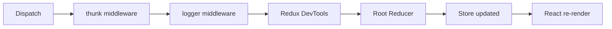
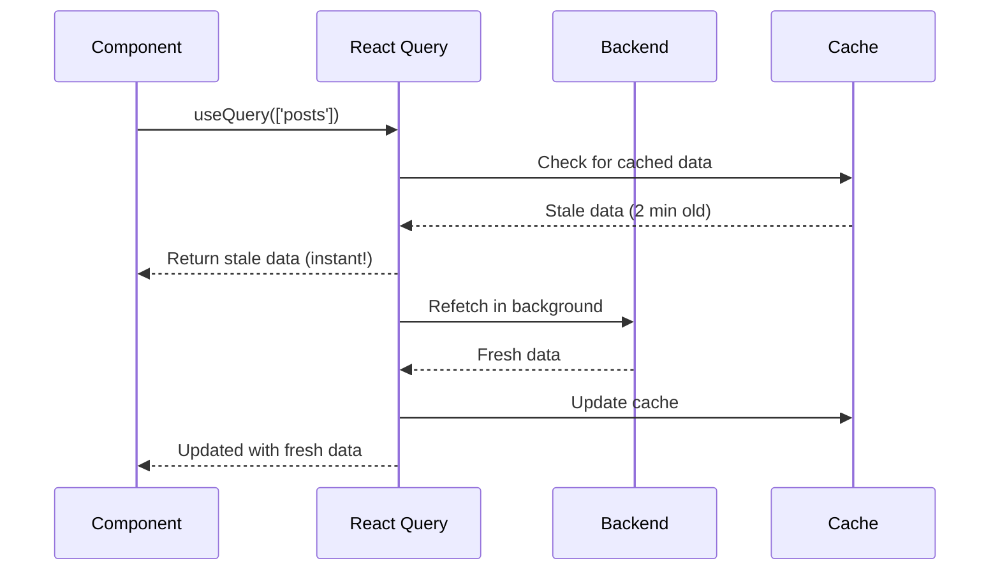
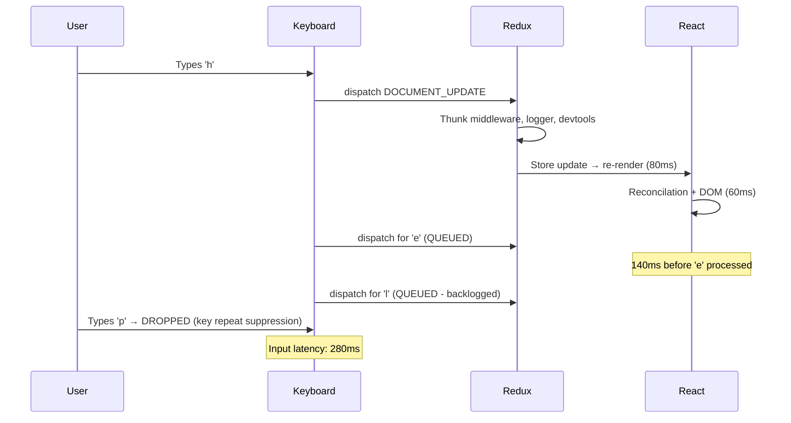
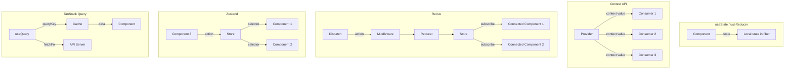
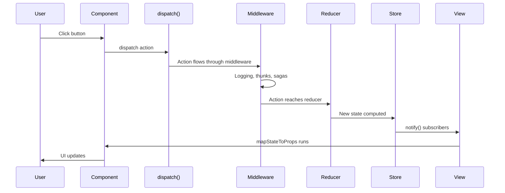

# 04: State Management — Deep Reference

> **Scope**: Local state, lifted state, Context API, useReducer, Redux, Zustand, Jotai, XState, URL state, server state (TanStack Query), state persistence, undo/redo, optimistic vs pessimistic updates.

---


## State Management Strategies Comparison

```mermaid
graph TB
    subgraph L["📦 Local State"]
        LS["useState<br/>Component level<br/>Not shared"]
    end
    
    subgraph C["🔗 Context API"]
        CA["createContext<br/>Tree level<br/>Provider wraps"]
    end
    
    subgraph G["🏢 Redux/Zustand"]
        ST["Global Store<br/>Centralized<br/>Predictable"]
    end
    
    COMP["Component"] -.-> LS
    COMP -.-> CA
    COMP -.-> ST
    
    style LS fill:#4a8bc2
    style CA fill:#2d5a7b
    style ST fill:#c73e1d
    style COMP fill:#1a3a52
```





## 1. Local State (useState)


The simplest form — state belongs to a single component.

```jsx
function Counter() {
  const [count, setCount] = useState(0);
  return <button onClick={() => setCount(c => c + 1)}>{count}</button>;
}
```

**When to use**: State that only this component (and its immediate children via props) needs.

---

## 2. Lifted State (Lifting State Up)


When multiple components share state, move it to their nearest common ancestor.

```jsx
function Parent() {
  const [selectedId, setSelectedId] = useState(null);
  return (
    <>
      <ItemList onSelect={setSelectedId} selectedId={selectedId} />
      <DetailPanel id={selectedId} />
    </>
  );
}
```

**Java analogy**: Shared state hoisted to parent is like moving a shared variable from inner classes into the enclosing class. All children reference the parent's state via callback/props.

**Problem**: Deep prop drilling. If `DetailPanel` is 5 levels deep, you pass `id` through 5 components that don't use it.

---

## 3. Context API


### Provider Pattern


```jsx
const AuthContext = createContext(null);

function AuthProvider({ children }) {
  const [user, setUser] = useState(null);
  const login = async (email, pw) => {
    const u = await api.login(email, pw);
    setUser(u);
  };
  const logout = () => setUser(null);

  const value = useMemo(() => ({ user, login, logout }), [user]);

  return <AuthContext.Provider value={value}>{children}</AuthContext.Provider>;
}
```

### Consumer Patterns


```jsx
// Hook (modern)
function Profile() {
  const { user } = useContext(AuthContext);
  return <h1>{user.name}</h1>;
}

// Consumer (class component or legacy)
function Profile() {
  return (
    <AuthContext.Consumer>
      {({ user }) => <h1>{user.name}</h1>}
    </AuthContext.Consumer>
  );
}
```

### Context Value Memoization


**Critical**: Without `useMemo`, every re-render of the provider creates a new context value → all consumers re-render.

```jsx
// ❌ Every render creates new object → ALL consumers re-render
function AuthProvider({ children }) {
  const [user, setUser] = useState(null);
  return (
    <AuthContext.Provider value={{ user, setUser }}>
      {children}
    </AuthContext.Provider>
  );
}

// ✅ useMemo stabilizes reference
function AuthProvider({ children }) {
  const [user, setUser] = useState(null);
  const value = useMemo(() => ({ user, setUser }), [user]);
  return <AuthContext.Provider value={value}>{children}</AuthContext.Provider>;
}
```

### Context Splitting


**Problem**: A single context with many values causes all consumers to re-render when any value changes.

```jsx
// ❌ Monolithic context
const AppContext = createContext({ user, theme, notifications, locale });

// ✅ Split contexts
const UserContext = createContext(null);
const ThemeContext = createContext('light');
const NotificationContext = createContext([]);
const LocaleContext = createContext('en');
```

**Each consumer only re-renders when its specific context changes.**

### Provider Nesting Hell


```jsx
// ❌ Deeply nested providers
<ThemeProvider>
  <UserProvider>
    <NotificationProvider>
      <LocaleProvider>
        <App />
      </LocaleProvider>
    </NotificationProvider>
  </UserProvider>
</ThemeProvider>
```

**Mitigation**: Combine into a single provider component:

```jsx
function AppProviders({ children }) {
  return (
    <ThemeProvider>
      <UserProvider>
        <NotificationProvider>
          <LocaleProvider>
            {children}
          </LocaleProvider>
        </NotificationProvider>
      </UserProvider>
    </ThemeProvider>
  );
}
```

### Re-render Optimization with useMemo


```jsx
function ExpensiveConsumer() {
  const { user } = useContext(UserContext);
  // This component re-renders when UserContext value changes
  // even if only `setUser` changed and `user` is still the same
}
```

**Fix**: Split context into value + setter contexts:

```jsx
const UserValueContext = createContext(null);
const UserActionsContext = createContext(null);

function UserProvider({ children }) {
  const [user, setUser] = useState(null);
  const actions = useMemo(() => ({ setUser, login, logout }), []);

  return (
    <UserValueContext.Provider value={user}>
      <UserActionsContext.Provider value={actions}>
        {children}
      </UserActionsContext.Provider>
    </UserValueContext.Provider>
  );
}

// Consumers choose: only re-render when user changes
function ProfileName() {
  const user = useContext(UserValueContext); // Re-renders only when user value changes
  return <h1>{user?.name}</h1>;
}

// OR consume actions without re-rendering
function LoginButton() {
  const { login } = useContext(UserActionsContext); // Never re-renders
  return <button onClick={login}>Login</button>;
}
```

---

## 4. useReducer Pattern


```jsx
const initialState = { count: 0, step: 1 };

function reducer(state, action) {
  switch (action.type) {
    case 'increment': return { ...state, count: state.count + state.step };
    case 'decrement': return { ...state, count: state.count - state.step };
    case 'setStep': return { ...state, step: action.payload };
    default: return state;
  }
}

function Counter() {
  const [state, dispatch] = useReducer(reducer, initialState);
  return (
    <>
      Count: {state.count}
      <button onClick={() => dispatch({ type: 'increment' })}>+</button>
      <button onClick={() => dispatch({ type: 'decrement' })}>-</button>
    </>
  );
}
```

**When to prefer useReducer over useState**:
- Complex state with multiple sub-values
- State transitions depend on other state
- Deep update paths (nested objects)
- State logic is hard to unit test inline

---

## 5. Redux


### Core Concepts


```javascript
// Store
const store = configureStore({
  reducer: {
    todos: todosReducer,
    user: userReducer,
  },
  middleware: (getDefaultMiddleware) =>
    getDefaultMiddleware().concat(thunk, logger),
});

// Action
const addTodo = (text) => ({ type: 'todos/addTodo', payload: text });

// Reducer
function todosReducer(state = [], action) {
  switch (action.type) {
    case 'todos/addTodo':
      return [...state, { id: nanoid(), text: action.payload, completed: false }];
    default:
      return state;
  }
}

// Dispatch
dispatch(addTodo('Learn Redux'));
```

### Middleware Pipeline




### Thunk (async logic)


```javascript
const fetchUser = (id) => async (dispatch) => {
  dispatch({ type: 'user/fetch/pending' });
  try {
    const user = await api.fetchUser(id);
    dispatch({ type: 'user/fetch/fulfilled', payload: user });
  } catch (err) {
    dispatch({ type: 'user/fetch/rejected', payload: err.message });
  }
};
```

### Saga (generator-based side effects)


```javascript
function* fetchUserSaga(action) {
  try {
    const user = yield call(api.fetchUser, action.payload);
    yield put({ type: 'user/fetch/fulfilled', payload: user });
  } catch (err) {
    yield put({ type: 'user/fetch/rejected', payload: err.message });
  }
}

function* watchFetchUser() {
  yield takeEvery('user/fetch', fetchUserSaga);
}
```

### Observable (RxJS-based)


```javascript
const fetchUserEpic = (action$) =>
  action$.pipe(
    filter(match('user/fetch')),
    mergeMap((action) =>
      from(api.fetchUser(action.payload)).pipe(
        map((user) => ({ type: 'user/fetch/fulfilled', payload: user })),
        catchError((err) => of({ type: 'user/fetch/rejected', payload: err.message }))
      )
    )
  );
```

### Thunk vs Saga vs Observable Comparison


| | Thunk | Saga | Observable |
|---|---|---|---|
| Complexity | Low | High | High |
| Testing | Easy | Medium | Medium |
| Concurrency | Manual | Built-in (takeLatest, fork) | Built-in (switchMap, mergeMap) |
| Cancelation | Manual (AbortController) | Built-in (cancel) | Built-in (unsubscribe) |
| Learning curve | Low | Steep | Steep |
| Debugging | Easy | Hard | Medium |

### Normalized State


```javascript
// Denormalized (nested) — problematic
{
  post: {
    id: 1,
    title: '...',
    author: { id: 1, name: 'Alice', posts: [1, 2, 3] },
    comments: [
      { id: 1, text: 'Great!', author: { name: 'Bob' } }
    ]
  }
}

// Normalized (flat)
{
  posts: {
    1: { id: 1, title: '...', authorId: 1, commentIds: [1] }
  },
  users: {
    1: { id: 1, name: 'Alice' },
    2: { id: 2, name: 'Bob' }
  },
  comments: {
    1: { id: 1, text: 'Great!', authorId: 2 }
  }
}
```

**Benefits**: No duplicate data, O(1) lookup by ID, easier updates, smaller state updates.

### Reselect — Memoized Selectors


```javascript
import { createSelector } from '@reduxjs/toolkit';

const selectTodos = (state) => state.todos;
const selectFilter = (state) => state.filter;

const selectVisibleTodos = createSelector(
  [selectTodos, selectFilter],
  (todos, filter) => {
    switch (filter) {
      case 'active': return todos.filter(t => !t.completed);
      case 'completed': return todos.filter(t => t.completed);
      default: return todos;
    }
  }
);
```

### createSlice (RTK)


```javascript
const todosSlice = createSlice({
  name: 'todos',
  initialState: [],
  reducers: {
    addTodo: (state, action) => {
      state.push({ id: nanoid(), text: action.payload, completed: false });
    },
    toggleTodo: (state, action) => {
      const todo = state.find(t => t.id === action.payload);
      if (todo) todo.completed = !todo.completed;
    },
    removeTodo: (state, action) => {
      return state.filter(t => t.id !== action.payload);
    },
  },
});

export const { addTodo, toggleTodo, removeTodo } = todosSlice.actions;
export default todosSlice.reducer;
```

### RTK Query


```javascript
import { createApi, fetchBaseQuery } from '@reduxjs/toolkit/query/react';

const api = createApi({
  reducerPath: 'api',
  baseQuery: fetchBaseQuery({ baseUrl: '/api' }),
  endpoints: (builder) => ({
    getPosts: builder.query({
      query: () => '/posts',
      providesTags: ['Post'],
    }),
    addPost: builder.mutation({
      query: (body) => ({ url: '/posts', method: 'POST', body }),
      invalidatesTags: ['Post'],
    }),
  }),
});

export const { useGetPostsQuery, useAddPostMutation } = api;
```

---

## 6. Zustand


```javascript
import { create } from 'zustand';

const useStore = create((set, get) => ({
  count: 0,
  increment: () => set((state) => ({ count: state.count + 1 })),
  decrement: () => set((state) => ({ count: state.count - 1 })),
  reset: () => set({ count: 0 }),
  // Async action
  fetchData: async (id) => {
    set({ loading: true });
    const data = await api.fetch(id);
    set({ data, loading: false });
  },
}));

function Counter() {
  const count = useStore((state) => state.count);
  const increment = useStore((state) => state.increment);
  return <button onClick={increment}>{count}</button>;
}
```

### Selector Optimization


```javascript
// ❌ Re-renders on ANY state change (no selector)
const state = useStore();

// ✅ Re-renders only when count changes
const count = useStore((state) => state.count);

// ✅ Multiple values with shallow equality
import { shallow } from 'zustand/shallow';
const { count, increment } = useStore(
  (state) => ({ count: state.count, increment: state.increment }),
  shallow
);
```

### Interview Trick: Zustand Selector vs Redux connect


**Question**: "Why might Zustand cause extra re-renders compared to Redux connect?"

**Answer**: 

```javascript
// Zustand: selector runs on every store change
const items = useStore(state => state.items);

// Redux connect: mapStateToProps runs on every dispatch, 
// but connect implements shouldComponentUpdate check
@connect(mapStateToProps)(Component)
```

**Key difference**: 
1. **Zustand selector** runs on EVERY state change, even unrelated ones. It checks if the selected value changed via `Object.is`. If the selector returns a new object each time (`state => ({ items: state.items, filter: state.filter })`), it creates a new reference → re-render every time.

2. **Redux connect** does the same selector check but also has a `pure: true` default that bails out if `mapStateToProps` result is the same. However, the same pitfall applies — returning new object each time.

**Zustand typically wins on simplicity but can lose on selector overhead if**:
- Store is large (100+ keys)
- Component selects a small slice but store updates frequently on unrelated keys
- Selector returns derived data without memoization

**Fix for Zustand**:
```javascript
const items = useStore(state => state.items); // Primitive/stable reference
// OR memoize derived data
const visibleItems = useStore(state => {
  const { items, filter } = state;
  return useMemo(() => items.filter(i => i.status === filter), [items, filter]);
});
```

---

## 7. Jotai (Atomic State)


```javascript
import { atom, useAtom } from 'jotai';

// Primitive atom
const countAtom = atom(0);

// Derived atom (computed)
const doubleCountAtom = atom((get) => get(countAtom) * 2);

// Async atom
const userAtom = atom(async () => {
  const response = await fetch('/api/user');
  return response.json();
});

function Counter() {
  const [count, setCount] = useAtom(countAtom);
  const [double] = useAtom(doubleCountAtom);
  return <div onClick={() => setCount(c => c + 1)}>{count} x2 = {double}</div>;
}
```

**How Jotai avoids unnecessary re-renders**: Each atom is a separate subscription. Only components that `useAtom` the changed atom re-render. No provider nesting needed.

---

## 8. XState (State Machines)


```javascript
import { createMachine, interpret } from 'xstate';
import { useMachine } from '@xstate/react';

const toggleMachine = createMachine({
  id: 'toggle',
  initial: 'inactive',
  states: {
    inactive: { on: { TOGGLE: 'active' } },
    active: { on: { TOGGLE: 'inactive' } },
  },
});

function Toggle() {
  const [state, send] = useMachine(toggleMachine);
  return (
    <button onClick={() => send('TOGGLE')}>
      {state.matches('inactive') ? 'Off' : 'On'}
    </button>
  );
}
```

**When XState shines**:
- Complex workflows (multi-step forms, checkout)
- Finite states with guarded transitions
- Visualizing state machines (xstate-viz)
- Testing state transitions independently of UI

---

## 9. URL State


```jsx
import { useSearchParams } from 'react-router-dom';

function ProductList() {
  const [searchParams, setSearchParams] = useSearchParams();
  const category = searchParams.get('category') || 'all';
  const page = parseInt(searchParams.get('page') || '1');

  return (
    <select
      value={category}
      onChange={(e) => setSearchParams({ category: e.target.value, page: '1' })}
    >
      <option value="all">All</option>
      <option value="electronics">Electronics</option>
    </select>
  );
}
```

**Benefits**:
- Shareable/bookmarkable URLs
- Back/forward browser navigation
- Server-side rendering support
- No state management library needed for this concern

---

## 10. Server State (TanStack Query / React Query)


### Core Concepts


```javascript
import { useQuery, useMutation, useQueryClient } from '@tanstack/react-query';

function Posts() {
  const { data, isLoading, error } = useQuery({
    queryKey: ['posts'],
    queryFn: () => fetch('/api/posts').then(r => r.json()),
    staleTime: 5 * 60 * 1000, // 5 min before refetch
    cacheTime: 30 * 60 * 1000, // 30 min in cache
  });
}
```

### Stale-While-Revalidate


1. Return cached data immediately if exists
2. Re-fetch in background
3. Update cache with fresh data



### Optimistic Updates


```javascript
const mutation = useMutation({
  mutationFn: (newTodo) => fetch('/api/todos', { method: 'POST', body: JSON.stringify(newTodo) }),
  onMutate: async (newTodo) => {
    await queryClient.cancelQueries(['todos']);
    const previousTodos = queryClient.getQueryData(['todos']);
    queryClient.setQueryData(['todos'], (old) => [...old, newTodo]);
    return { previousTodos };
  },
  onError: (err, newTodo, context) => {
    queryClient.setQueryData(['todos'], context.previousTodos);
  },
  onSettled: () => {
    queryClient.invalidateQueries(['todos']);
  },
});
```

### Pagination & Infinite Queries


```javascript
function Todos() {
  const {
    data,
    fetchNextPage,
    hasNextPage,
    isFetchingNextPage,
  } = useInfiniteQuery({
    queryKey: ['todos'],
    queryFn: ({ pageParam = 0 }) => fetch(`/api/todos?page=${pageParam}`).then(r => r.json()),
    getNextPageParam: (lastPage) => lastPage.nextPage ?? undefined,
  });
}
```

---

## 11. State Persistence


```javascript
// Zustand persist middleware
import { persist } from 'zustand/middleware';

const useStore = create(
  persist(
    (set) => ({
      user: null,
      token: null,
      setUser: (user) => set({ user }),
    }),
    {
      name: 'auth-storage',
      storage: localStorage,
      partialize: (state) => ({ token: state.token }), // Only persist token
    }
  )
);

// Redux persist
import { persistStore, persistReducer } from 'redux-persist';
import storage from 'redux-persist/lib/storage';

const persistedReducer = persistReducer(
  { key: 'root', storage, whitelist: ['auth'] },
  rootReducer
);
```

---

## 12. Undo/Redo Patterns


```javascript
function useUndoRedo(initialState) {
  const [state, setState] = useState({
    past: [],
    present: initialState,
    future: [],
  });

  const set = useCallback((newPresent) => {
    setState(prev => ({
      past: [...prev.past, prev.present],
      present: newPresent,
      future: [],
    }));
  }, []);

  const undo = useCallback(() => {
    setState(prev => {
      if (prev.past.length === 0) return prev;
      const previous = prev.past[prev.past.length - 1];
      return {
        past: prev.past.slice(0, -1),
        present: previous,
        future: [prev.present, ...prev.future],
      };
    });
  }, []);

  const redo = useCallback(() => {
    setState(prev => {
      if (prev.future.length === 0) return prev;
      const next = prev.future[0];
      return {
        past: [...prev.past, prev.present],
        present: next,
        future: prev.future.slice(1),
      };
    });
  }, []);

  return { state: state.present, set, undo, redo };
}
```

---

## 13. Optimistic vs Pessimistic Updates


| Strategy | UX | Risk | Implementation |
|---|---|---|---|
| Optimistic | Instant (no loading) | Showing wrong data if failed | Update UI first, revert on error |
| Pessimistic | Wait for server | Always correct | Wait for response before updating UI |

```javascript
// Optimistic: update immediately, revert on error
const updateTodo = useMutation({
  mutationFn: (todo) => api.updateTodo(todo),
  onMutate: async (optimisticTodo) => {
    await queryClient.cancelQueries(['todos']);
    const previous = queryClient.getQueryData(['todos']);
    queryClient.setQueryData(['todos'], (old) =>
      old.map(t => t.id === optimisticTodo.id ? { ...t, ...optimisticTodo } : t)
    );
    return { previous };
  },
  onError: (err, todo, context) => {
    queryClient.setQueryData(['todos'], context.previous); // Rollback
    toast.error('Failed to update');
  },
});

// Pessimistic: wait for server
const updateTodoPessimistic = useMutation({
  mutationFn: (todo) => api.updateTodo(todo),
  onSuccess: () => {
    queryClient.invalidateQueries(['todos']);
    toast.success('Updated!');
  },
  onError: () => toast.error('Failed'),
});
```

---

## 14. Production Failure: Redux Store 500MB+ OOM


**Scenario**: A real-time analytics dashboard stores ALL events in Redux state.

```javascript
// Redux store filled with unbounded arrays
const reducer = (state = { events: [] }, action) => {
  switch (action.type) {
    case 'ADD_EVENT':
      return { ...state, events: [...state.events, action.payload] };
    default:
      return state;
  }
};
```

**Timeline**:
1. App starts fresh: 100 events per minute → 10KB
2. After 1 hour: 6,000 events → 3MB
3. After 24 hours: 144,000 events → 72MB
4. After 7 days: 1,000,000 events → 500MB+
5. Browser tab crashes with OOM. User sees blank page.
6. Each Redux dispatch spreads the entire 500MB array → freezes for 500ms

**Root cause**: No retention policy. Events should be bounded (max 500) or stored in IndexedDB, not Redux.

**Fix**:
```javascript
case 'ADD_EVENT':
  const events = [...state.events, action.payload].slice(-500); // Keep last 500
  return { ...state, events };
```

---

## 15. Backpressure: Too Many Dispatches in Rapid Succession


**Scenario**: A collaborative document editor dispatches on every keystroke.

```javascript
// On every keystroke:
dispatch({ type: 'DOCUMENT_UPDATE', payload: { text, cursor } });
```

**Backpressure chain**:
1. User types at 10 chars/second
2. Each char → Redux dispatch → middleware chain → reducer → store update → React re-render
3. Redux DevTools records every action
4. 10 renders/second for the entire editor component
5. On slower devices, renders queue up
6. Keyboard input lags behind by 200-500ms
7. User experiences frustrating input delay



**Mitigations**:
1. **Debounce**: Batch keystrokes with 50ms debounce
2. **Local state**: Use local `useState` for input, sync to Redux on blur
3. **useTransition**: Mark Redux sync as low priority
4. **RequestAnimationFrame**: Sync at most every frame (16ms)

---

## 16. State Management Decision Matrix


| Feature | useState | useReducer | Context | Redux | Zustand | Jotai | TanStack Query |
|---|---|---|---|---|---|---|---|
| Local state | ✅ | ✅ | ❌ | ❌ | ✅ | ✅ | ❌ |
| Shared state | ⬆️ lift | ⬆️ lift | ✅ | ✅ | ✅ | ✅ | ✅ |
| Server state | ❌ | ❌ | ❌ | ✅ | ❌ | ❌ | ✅ |
| Async | ❌ | ❌ | ❌ | ✅ (thunk) | ✅ | ✅ | ✅ |
| DevTools | ❌ | ❌ | ❌ | ✅ | ✅ | ✅ | ✅ |
| Bundle size | 0 | 0 | 0 | 11KB | 2KB | 4KB | 12KB |
| Boilerplate | Low | Medium | Medium | High | Low | Low | Low |
| Learning curve | Low | Medium | Low | High | Low | Medium | Medium |

---

## 17. Mermaid: State Management Architecture Comparison




---

## 18. Interview: Zustand Selector Extra Re-renders (Deep Dive)


**Question**: "Compare Zustand and Redux connect for re-render behavior."

**Detailed answer**:

**Redux `connect()`**:
- Wraps component in a `PureComponent`
- `mapStateToProps` runs on every dispatch
- If returned props are shallow-equal to previous → no re-render
- Only the connected component re-renders (not ancestors)
- Built-in `shouldComponentUpdate` check

**Zustand `useStore(selector)`**:
- Selector runs on every state change (every `set()` call)
- Compares selector result via `Object.is`
- If same → no re-render
- Parent components DO re-render (no built-in memo on hooks)
- Each `useStore` call creates a separate subscription

**The extra re-render scenario**:

```javascript
// Zustand: parent + child both subscribe
function Parent() {
  const theme = useStore(s => s.theme);
  return <Child />; // Parent re-renders → Child re-renders (even if Child doesn't use theme)
}

const Child = () => {
  const count = useStore(s => s.count);
  return <div>{count}</div>;
};
```

With Redux connect:
```javascript
// Redux: only connected components re-render
const Parent = ({ theme, children }) => <div className={theme}>{children}</div>;
export default connect(s => ({ theme: s.theme }))(Parent);

// Child only re-renders when count changes
const Child = ({ count }) => <div>{count}</div>;
export default connect(s => ({ count: s.count }))(Child);
```

**Zustand fix**: Using memo on parent:
```javascript
const Parent = memo(function Parent() {
  const theme = useStore(s => s.theme);
  return <Child />;
});
```

---

## 19. Mermaid: Redux Data Flow




---

## 20. Persistence Patterns


| Strategy | Pros | Cons | Use case |
|---|---|---|---|
| localStorage | Simple, synchronous | 5MB limit, synchronous reads | Small state (theme, prefs) |
| sessionStorage | Cleared on tab close | Not shared across tabs | Form draft |
| IndexedDB | Large (GBs), async | Complex API | Offline data, cache |
| URL params | Shareable, bookmarkable | Limited size | Filter, sort, page |
| Cookie | Server access | Sent with every request | Auth token |
| Service Worker | Full control | Complex | PWA offline |

---

## 21. Anti-Patterns


### Putting Everything in Redux


```javascript
// ❌ Over-engineering
const nameSlice = createSlice({
  name: 'inputName',
  initialState: '',
  reducers: { setName: (state, action) => action.payload },
});
const emailSlice = createSlice({ /* same pattern */ });
// etc. for 50 form fields

// ✅ Local state is fine for form inputs
function Form() {
  const [name, setName] = useState('');
  const [email, setEmail] = useState('');
}
```

### Mutating State (Redux)


```javascript
// ❌ Mutates state directly — breaks time-travel debugging
reducer: {
  addTodo: (state, action) => {
    state.push(action.payload); // RTK uses Immer, so this is OK in createSlice
  }
}
```

**Note**: RTK's `createSlice` wraps with Immer, so mutations ARE safe there. But in raw Redux, mutation breaks everything.

### Over-Normalization


Normalizing a todo app with 10 todos is unnecessary. Normalization starts paying off at 10,000+ items with many-to-many relationships.

---

## 22. Server State vs Client State


| | Server State | Client State |
|---|---|---|
| Source | Backend/database | User interaction |
| Persistence | Server | Browser memory |
| Freshness | Unknown (may be stale) | Always current |
| Sync required | Yes (polling, websocket) | No |
| Loading/error | Common | Rare |
| Examples | Posts, users, products | Theme, form input, UI state |

**Key insight**: Most "state management" problems are actually server state caching problems. TanStack Query solves these better than Redux.

---

## 23. Simplest Mental Model


> **State management = deciding WHERE state lives and HOW it flows.** useState = in the component. Context = in a provider above. Redux/Zustand = in a central store. TanStack Query = synced with server. URL = in the address bar. Pick the LEAST powerful tool that works. If two siblings need the same data, lift state up. If data comes from server, don't put it in Redux — use TanStack Query.

---

## 24. Production Checklist


- [ ] Context value memoized with `useMemo`
- [ ] Context split by concern (separate contexts for unrelated data)
- [ ] Redux store size monitored — no unbounded arrays
- [ ] Selectors are memoized (Reselect for Redux, `shallow` for Zustand)
- [ ] Server state managed by TanStack Query or similar, not Redux
- [ ] Optimistic updates have rollback logic
- [ ] State persistence doesn't include large blobs (cache, binary)
- [ ] No state management library for simple form state
- [ ] Redux DevTools disabled in production middleware
- [ ] URL state used for shareable/app-state (search, filters, page)

---

## Related


- [Networking](../../11-networking/) — HTTP, performance, optimization
- [Security](../../13-security/) — CORS, authentication, XSS prevention
- [Backend](../../03-backend/) — API design and contracts
- [Performance Engineering](../../18-performance-engineering/) — Browser rendering
- [Testing](../../19-testing/) — E2E and component testing
