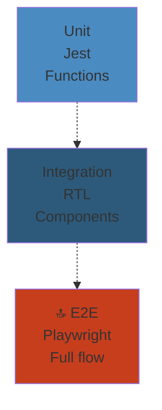
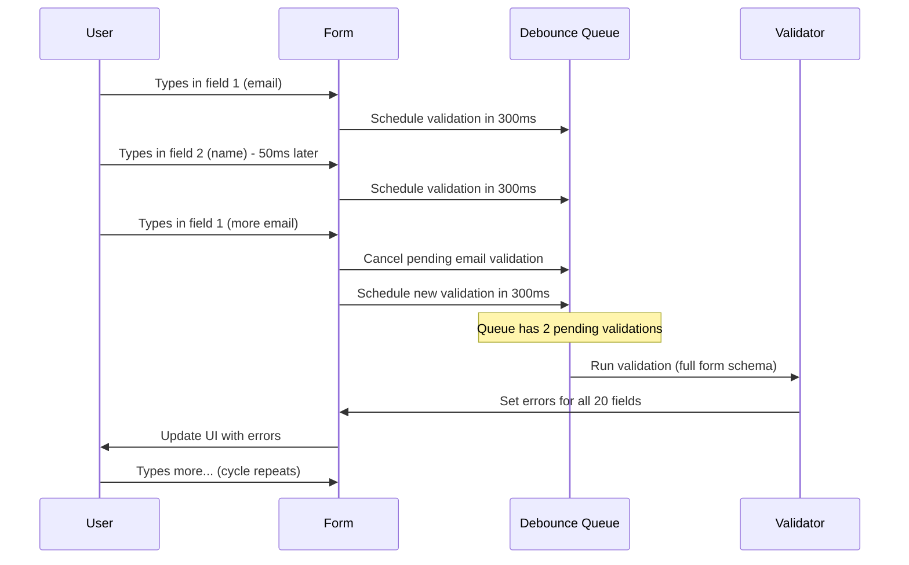
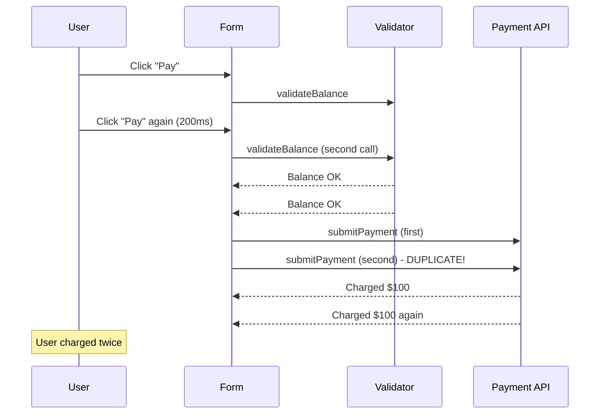
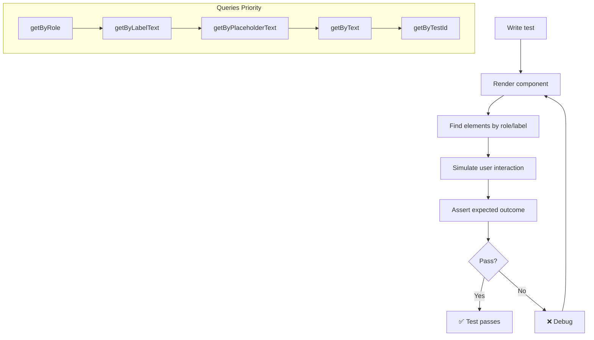

# 06: Testing, Forms & Validation — Deep Reference

> **Scope**: React Testing Library, Jest, snapshot testing, MSW, integration tests, unit tests, E2E with Playwright/Cypress, component test patterns, form libraries (React Hook Form, Formik, Final Form), controlled/uncontrolled inputs, validation schemas (Zod, Yup, Joi), custom validators, async validation, debounced validation, form state, nested forms, dynamic fields, file uploads, multi-step forms, form security, accessibility testing, coverage thresholds.

---


## React Testing Strategy




## 1. React Testing Library Philosophy

**Core principle**: Test components the way users use them. Don't test implementation details.

```jsx
// ❌ Testing implementation detail
expect(wrapper.find('.btn-primary').props().disabled).toBe(true);

// ✅ Testing from user perspective
expect(screen.getByRole('button', { name: /submit/i })).toBeDisabled();
```

### Query Priority

| Priority | Query | Example |
|---|---|---|
| 1 (best) | `getByRole` | `getByRole('button', { name: /submit/i })` |
| 2 | `getByLabelText` | `getByLabelText(/email/i)` |
| 3 | `getByPlaceholderText` | `getByPlaceholderText(/enter email/i)` |
| 4 | `getByText` | `getByText(/welcome/i)` |
| 5 | `getByDisplayValue` | `getByDisplayValue('John')` |
| 6 | `getByAltText` | `getByAltText(/logo/i)` |
| 7 | `getByTitle` | `getByTitle(/close/i)` |
| 8 | `getByTestId` | `getByTestId('submit-button')` |

---

## 2. fireEvent vs userEvent

```jsx
import { fireEvent, screen } from '@testing-library/react';
import userEvent from '@testing-library/user-event';

// fireEvent — low-level, fires one event
fireEvent.click(button); // Just fires 'click'
fireEvent.change(input, { target: { value: 'hello' } }); // Fires 'change'

// userEvent — simulates full user interaction
await userEvent.click(button);      // mousedown → mouseup → click
await userEvent.type(input, 'hello'); // focus → keydown → keypress → input → keyup
await userEvent.keyboard('{Enter}'); // Full keyboard simulation
await userEvent.tab();               // Tab navigation
await userEvent.hover(element);      // mouseEnter + mouseOver
```

**Always prefer `userEvent`** — it fires events in the correct order and tests actual user behavior.

```jsx
// ❌ fireEvent misses key events
fireEvent.change(input, { target: { value: 'test' } });
// onChange fires, but onKeyDown/onKeyUp don't

// ✅ userEvent fires complete sequence
await userEvent.type(input, 'test');
// focus → keydown('t') → keypress('t') → input → keyup('t')
// (repeated for each character)
```

---

## 3. Async Utilities

```jsx
import { waitFor, findByText, findAllByRole } from '@testing-library/react';

// waitFor — wait for assertion to pass
await waitFor(() => {
  expect(screen.getByText(/loaded/i)).toBeInTheDocument();
});

// findBy* — returns promise, waits up to timeout (default 1000ms)
const element = await screen.findByText(/loaded/i);

// waitForElementToBeRemoved
await waitForElementToBeRemoved(() => screen.queryByText(/loading/i));
```

---

## 4. act Wrapper

```jsx
import { act } from '@testing-library/react';

// act ensures all state updates and effects are processed
act(() => {
  render(<MyComponent />);
});

// Wait for async effects
await act(async () => {
  render(<AsyncComponent />);
  await fetchMock.resolve();
});
```

### Interview Tricky: Why `act()` Warnings Appear

**Question**: "Why do I get 'An update to Component inside a test was not wrapped in act()' warnings?"

**Answer**: The warning means a state update happened outside React's test environment's tracking. Common causes:

```jsx
// Cause 1: Async effect
test('fetch data', () => {
  render(<DataFetcher />);
  // ⚠️ Warning: fetch resolves, calls setState
  // Solution: await findByText or waitFor
});

// Cause 2: setTimeout/interval
test('timer', () => {
  render(<Timer />);
  // ⚠️ Warning: setInterval triggers setState
  // Solution: jest.useFakeTimers()
});

// Cause 3: uncontrolled subscriptions
test('subscription', () => {
  render(<WebSocketListener />);
  // ⚠️ Warning: WebSocket onmessage triggers setState
  // Solution: mock WebSocket, assert after waitFor
});
```

**Fixes**:

```jsx
// Fix 1: waitFor for async
test('fetch data', async () => {
  render(<DataFetcher />);
  await waitFor(() => {
    expect(screen.getByText(/data/i)).toBeInTheDocument();
  });
});

// Fix 2: Fake timers
jest.useFakeTimers();
test('timer', () => {
  render(<Timer />);
  act(() => { jest.advanceTimersByTime(1000); });
});

// Fix 3: flush promises
test('subscription', async () => {
  render(<WebSocketListener />);
  await act(async () => {
    mockWebSocket.emit('message', { data: 'test' });
  });
});
```

**Why act matters**: Without `act`, React can't guarantee that all state updates have been applied. Your assertions might check intermediate (incorrect) state. Tests become flaky.

---

## 5. Jest Configuration with React

```javascript
// jest.config.js
module.exports = {
  testEnvironment: 'jsdom',
  setupFilesAfterSetup: ['@testing-library/jest-dom'],
  moduleNameMapper: {
    '\\.css$': 'identity-obj-proxy',
    '\\.svg$': '<rootDir>/__mocks__/svgMock.js',
  },
  transform: {
    '^.+\\.(js|jsx|ts|tsx)$': ['babel-jest', { presets: ['next/babel'] }],
  },
  collectCoverageFrom: [
    'src/**/*.{js,jsx,ts,tsx}',
    '!src/**/*.stories.*',
    '!src/pages/_app.*',
  ],
  coverageThreshold: {
    global: {
      statements: 80,
      branches: 75,
      functions: 80,
      lines: 80,
    },
  },
};
```

---

## 6. Snapshot Testing

```jsx
test('Button renders correctly', () => {
  const { container } = render(<Button variant="primary">Click</Button>);
  expect(container.firstChild).toMatchSnapshot();
});
```

### Pitfalls

1. **Large snapshots** (>50 lines) — hide real changes
2. **Fragile snapshots** — break on trivial formatting changes
3. **No intent checking** — snapshot shows output but doesn't verify behavior
4. **Overuse** — snapshotting every component leads to low-value updates

### When to Use Snapshots

- Small, stable presentational components
- Error state UI (hard to trigger in tests)
- CSS-in-JS class name changes (catch unexpected style shifts)

### When NOT to Use Snapshots

- Components with generated class names (CSS modules)
- Components with dates/timestamps (use mock date)
- Large component trees (>20 lines of output)

---

## 7. MSW — Mock Service Worker

```javascript
import { rest } from 'msw';
import { setupServer } from 'msw/node';

const server = setupServer(
  rest.get('/api/users', (req, res, ctx) => {
    return res(ctx.json([{ id: 1, name: 'John' }]));
  }),
  rest.post('/api/users', (req, res, ctx) => {
    return res(ctx.status(201), ctx.json({ id: 2, ...req.body }));
  }),
);

beforeAll(() => server.listen());
afterEach(() => server.resetHandlers());
afterAll(() => server.close());

test('loads users', async () => {
  render(<UserList />);
  await screen.findByText('John');
  expect(screen.getByRole('listitem')).toHaveTextContent('John');
});

// Test error state
test('shows error on API failure', async () => {
  server.use(
    rest.get('/api/users', (req, res, ctx) => {
      return res(ctx.status(500));
    })
  );
  render(<UserList />);
  await screen.findByText(/error/i);
});
```

**MSW vs mocking fetch directly**: MSW intercepts at the network level (service worker in browser, `https` module in Node). Your app code doesn't know it's mocked — same code path as production.

---

## 8. Integration Tests

```jsx
// Testing a complete feature flow
test('user can add a todo', async () => {
  const user = userEvent.setup();

  render(<TodoApp />);

  // Type in input
  const input = screen.getByPlaceholderText(/add todo/i);
  await user.type(input, 'Buy milk{Enter}');

  // Verify todo appears
  expect(screen.getByText('Buy milk')).toBeInTheDocument();

  // Toggle completion
  const checkbox = screen.getByRole('checkbox', { name: /buy milk/i });
  await user.click(checkbox);
  expect(checkbox).toBeChecked();

  // Delete
  await user.click(screen.getByRole('button', { name: /delete/i }));
  expect(screen.queryByText('Buy milk')).not.toBeInTheDocument();
});
```

### What to test in integration tests:
- User flows (login → dashboard → logout)
- Form submission → API call → UI update
- Navigation between pages
- Error + loading states

---

## 9. Unit Tests

Test isolated functions and hooks:

```javascript
// Utility function
test('formatCurrency formats correctly', () => {
  expect(formatCurrency(1000)).toBe('$1,000.00');
  expect(formatCurrency(0)).toBe('$0.00');
  expect(formatCurrency(-500)).toBe('-$500.00');
});

// Custom hook
test('useDebounce delays value', async () => {
  jest.useFakeTimers();
  const { result, rerender } = renderHook(
    ({ value }) => useDebounce(value, 500),
    { initialProps: { value: 'a' } }
  );
  expect(result.current).toBe('a'); // Initial value immediate
  rerender({ value: 'b' });
  expect(result.current).toBe('a'); // Not yet debounced
  act(() => { jest.advanceTimersByTime(500); });
  expect(result.current).toBe('b'); // Debounced after 500ms
});
```

---

## 10. E2E Testing

### Playwright

```javascript
// playwright.config.js
module.exports = {
  testDir: './e2e',
  use: { baseURL: 'http://localhost:3000' },
};

// e2e/login.spec.js
test('user can login and see dashboard', async ({ page }) => {
  await page.goto('/login');
  await page.fill('[name="email"]', 'test@example.com');
  await page.fill('[name="password"]', 'password123');
  await page.click('button[type="submit"]');
  await expect(page).toHaveURL(/dashboard/);
  await expect(page.locator('h1')).toHaveText('Welcome');
});
```

### Cypress

```javascript
describe('Login Flow', () => {
  it('logs in successfully', () => {
    cy.visit('/login');
    cy.get('[name="email"]').type('test@example.com');
    cy.get('[name="password"]').type('password123');
    cy.get('button[type="submit"]').click();
    cy.url().should('include', '/dashboard');
    cy.contains('Welcome').should('be.visible');
  });
});
```

---

## 11. Component Test Patterns

### Testing Controlled Input

```jsx
test('input updates on change', async () => {
  const handleChange = jest.fn();
  const user = userEvent.setup();

  render(<input onChange={handleChange} />);

  await user.type(screen.getByRole('textbox'), 'hello');
  expect(handleChange).toHaveBeenCalledTimes(5);
  expect(screen.getByRole('textbox')).toHaveValue('hello');
});
```

### Testing Component with API Call

```jsx
test('loads and displays user', async () => {
  server.use(
    rest.get('/api/user/1', (req, res, ctx) => {
      return res(ctx.json({ name: 'Alice' }));
    })
  );

  render(<UserProfile userId={1} />);
  expect(screen.getByText(/loading/i)).toBeInTheDocument();

  await screen.findByText('Alice');
  expect(screen.queryByText(/loading/i)).not.toBeInTheDocument();
});
```

### Testing Error Boundary

```jsx
function ErrorComponent() {
  throw new Error('Test error');
}

test('error boundary catches error', () => {
  const spy = jest.spyOn(console, 'error').mockImplementation(() => {});
  render(
    <ErrorBoundary fallback={<div>Error occurred</div>}>
      <ErrorComponent />
    </ErrorBoundary>
  );
  expect(screen.getByText('Error occurred')).toBeInTheDocument();
  spy.mockRestore();
});
```

---

## 12. Form Libraries

### React Hook Form

```jsx
import { useForm } from 'react-hook-form';
import { zodResolver } from '@hookform/resolvers/zod';
import { z } from 'zod';

const schema = z.object({
  email: z.string().email('Invalid email'),
  password: z.string().min(8, 'Min 8 chars'),
});

function LoginForm() {
  const { register, handleSubmit, formState: { errors } } = useForm({
    resolver: zodResolver(schema),
  });

  return (
    <form onSubmit={handleSubmit(data => api.login(data))}>
      <input {...register('email')} />
      {errors.email && <span>{errors.email.message}</span>}

      <input type="password" {...register('password')} />
      {errors.password && <span>{errors.password.message}</span>}

      <button type="submit">Login</button>
    </form>
  );
}
```

### Formik

```jsx
import { Formik, Form, Field, ErrorMessage } from 'formik';
import * as Yup from 'yup';

const schema = Yup.object({
  email: Yup.string().email().required(),
  password: Yup.string().min(8).required(),
});

function LoginForm() {
  return (
    <Formik
      initialValues={{ email: '', password: '' }}
      validationSchema={schema}
      onSubmit={(values) => api.login(values)}
    >
      <Form>
        <Field name="email" type="email" />
        <ErrorMessage name="email" component="span" />

        <Field name="password" type="password" />
        <ErrorMessage name="password" component="span" />

        <button type="submit">Login</button>
      </Form>
    </Formik>
  );
}
```

### Final Form

```jsx
import { Form, Field } from 'react-final-form';

function LoginForm() {
  return (
    <Form
      onSubmit={(values) => api.login(values)}
      validate={(values) => {
        const errors = {};
        if (!values.email) errors.email = 'Required';
        if (!values.password) errors.password = 'Required';
        return errors;
      }}
      render={({ handleSubmit }) => (
        <form onSubmit={handleSubmit}>
          <Field name="email">
            {({ input, meta }) => (
              <div>
                <input {...input} />
                {meta.error && meta.touched && <span>{meta.error}</span>}
              </div>
            )}
          </Field>
          <button type="submit">Login</button>
        </form>
      )}
    />
  );
}
```

### Form Library Comparison

| | React Hook Form | Formik | Final Form |
|---|---|---|---|
| Bundle size | 9KB | 13KB | 8KB |
| Re-renders | Minimal (ref-based) | On every keystroke | On every keystroke |
| Performance | ✅ Best | ❌ Worst for large forms | ✅ Good |
| Validation | Zod, Yup, custom | Yup built-in | Custom |
| Nested fields | ✅ | ❌ (complex) | ✅ |
| Dynamic fields | ✅ | ✅ (FieldArray) | ✅ (FieldArray) |
| TypeScript | ✅ | ✅ | ✅ |

---

## 13. Controlled Form Inputs

```jsx
function ControlledForm() {
  const [values, setValues] = useState({ email: '', password: '' });

  const handleChange = (e) => {
    setValues(prev => ({ ...prev, [e.target.name]: e.target.value }));
  };

  return (
    <form>
      <input name="email" value={values.email} onChange={handleChange} />
      <input name="password" value={values.password} onChange={handleChange} />
    </form>
  );
}
```

### Uncontrolled with Refs

```jsx
function UncontrolledForm({ onSubmit }) {
  const formRef = useRef(null);

  const handleSubmit = (e) => {
    e.preventDefault();
    const data = new FormData(formRef.current);
    onSubmit(Object.fromEntries(data));
  };

  return (
    <form ref={formRef} onSubmit={handleSubmit}>
      <input name="email" defaultValue="" />
      <input name="password" type="password" defaultValue="" />
      <button type="submit">Submit</button>
    </form>
  );
}
```

---

## 14. Validation Schemas

### Zod

```javascript
import { z } from 'zod';

const userSchema = z.object({
  name: z.string().min(2, 'Name must be at least 2 characters'),
  age: z.number().min(18, 'Must be 18+'),
  email: z.string().email('Invalid email'),
  role: z.enum(['admin', 'user', 'viewer']),
  metadata: z.record(z.string()).optional(),
});

// Type inference
type User = z.infer<typeof userSchema>;

// Validation
const result = userSchema.safeParse(input);
if (!result.success) {
  console.log(result.error.issues);
}
```

### Yup

```javascript
import * as Yup from 'yup';

const userSchema = Yup.object({
  name: Yup.string().min(2).required(),
  age: Yup.number().min(18).required(),
  email: Yup.string().email().required(),
  role: Yup.string().oneOf(['admin', 'user', 'viewer']),
});
```

### Joi

```javascript
import Joi from 'joi';

const userSchema = Joi.object({
  name: Joi.string().min(2).required(),
  age: Joi.number().min(18).required(),
  email: Joi.string().email().required(),
});
```

---

## 15. Custom Validators

```javascript
function useFormValidation() {
  const validatePassword = (value) => {
    if (!value) return 'Required';
    if (value.length < 8) return 'At least 8 chars';
    if (!/[A-Z]/.test(value)) return 'Need uppercase';
    if (!/[0-9]/.test(value)) return 'Need number';
    if (!/[!@#$%]/.test(value)) return 'Need special char';
    return null;
  };

  const validateEmail = (value) => {
    if (!value) return 'Required';
    if (!/^[^\s@]+@[^\s@]+\.[^\s@]+$/.test(value)) return 'Invalid email';
    return null;
  };

  return { validatePassword, validateEmail };
}
```

---

## 16. Async Validation

```jsx
function EmailField() {
  const { register, setError, clearErrors, formState: { errors } } = useForm();

  const validateEmail = async (email) => {
    if (!email) return 'Required';
    clearErrors('email');

    // Debounced API check
    try {
      const taken = await api.checkEmail(email);
      if (taken) return 'Email already in use';
    } catch {
      return 'Could not validate email';
    }
  };

  return (
    <input {...register('email', { validate: validateEmail })} />
  );
}
```

**Backpressure**: Rapid email input → 10 API calls in 2 seconds → server rate-limits → validation fails for all.

**Fix**: Debounce async validation:

```jsx
const validateEmail = useCallback(
  debounce(async (email) => {
    if (!email) return 'Required';
    const taken = await api.checkEmail(email);
    return taken ? 'Email taken' : undefined;
  }, 500),
  []
);
```

---

## 17. Debounced Validation

```jsx
import { useDebouncedCallback } from 'use-debounce';

function DebouncedValidation() {
  const [errors, setErrors] = useState({});

  const validate = useDebouncedCallback(async (values) => {
    const result = schema.safeParse(values);
    if (!result.success) {
      const fieldErrors = {};
      result.error.issues.forEach(issue => {
        fieldErrors[issue.path[0]] = issue.message;
      });
      setErrors(fieldErrors);
    } else {
      setErrors({});
    }
  }, 300);

  return (
    <input onChange={e => {
      validate({ email: e.target.value });
    }} />
  );
}
```

### Backpressure from Debounced Validation Queue Overflow

**Scenario**: Form with 20 fields, each with debounced validation. User types rapidly across fields.

1. Each keystroke schedules a debounced validation
2. 20 fields × 10 chars/second = 200 debounced validations queued
3. Each validation runs schema parse against full form data
4. After 5 seconds, 200 validations execute sequentially
5. Browser freezes for 2 seconds processing all queued validations
6. User sees visual lag between typing and error appearance



**Mitigation**:
1. Field-level validation (not full form validate on every keystroke)
2. `requestAnimationFrame` sync
3. Abort previous validation when new one arrives
4. Limit queue depth to 1 per field

---

## 18. Nested Forms

```jsx
function AddressForm() {
  return (
    <div>
      <h3>Address</h3>
      <input {...register('address.street')} placeholder="Street" />
      <input {...register('address.city')} placeholder="City" />
      <input {...register('address.zip')} placeholder="ZIP" />
    </div>
  );
}

// In parent
function CheckoutForm() {
  const { register, handleSubmit } = useForm();
  return (
    <form onSubmit={handleSubmit(console.log)}>
      <h2>Shipping</h2>
      <AddressForm />
      <h2>Billing</h2>
      <AddressForm />
    </form>
  );
}
```

**React Hook Form approach**: Use `useFormContext`:

```jsx
import { useFormContext } from 'react-hook-form';

function AddressForm({ prefix }) {
  const { register } = useFormContext();
  return (
    <>
      <input {...register(`${prefix}.street`)} />
      <input {...register(`${prefix}.city`)} />
    </>
  );
}

function CheckoutForm() {
  const methods = useForm();
  return (
    <FormProvider {...methods}>
      <form onSubmit={methods.handleSubmit(console.log)}>
        <AddressForm prefix="shipping" />
        <AddressForm prefix="billing" />
      </form>
    </FormProvider>
  );
}
```

---

## 19. Dynamic Form Fields

```jsx
function DynamicForm() {
  const { register, handleSubmit, formState: { errors } } = useForm();

  return (
    <form onSubmit={handleSubmit(console.log)}>
      <FieldArray name="items">
        {({ fields, append, remove }) => (
          <>
            {fields.map((field, index) => (
              <div key={field.id}>
                <input {...register(`items.${index}.name`)} />
                <input type="number" {...register(`items.${index}.quantity`)} />
                <button type="button" onClick={() => remove(index)}>Remove</button>
              </div>
            ))}
            <button type="button" onClick={() => append({ name: '', quantity: 1 })}>
              Add Item
            </button>
          </>
        )}
      </FieldArray>
      <button type="submit">Submit</button>
    </form>
  );
}
```

**Performance**: 100+ dynamic fields → constant re-renders as array grows. RHF is best here (ref-based, minimal renders).

---

## 20. Form Performance with Large Forms

**Scenario**: A job application form with 100+ fields.

| Approach | Render time | Keystroke latency |
|---|---|---|
| Controlled (useState) | 50ms initial + 15ms per keystroke | 15ms |
| Formik | 30ms initial + 10ms per keystroke | 10ms |
| React Hook Form | 20ms initial + 0.3ms per keystroke | 0.3ms |

**RHF's advantage**: Uses uncontrolled inputs internally (refs). React doesn't re-render on every keystroke — it reads values from the DOM on submit.

---

## 21. File Uploads

```jsx
function FileUpload() {
  const { register, handleSubmit } = useForm();

  const onSubmit = async (data) => {
    const formData = new FormData();
    formData.append('file', data.file[0]);
    await fetch('/api/upload', { method: 'POST', body: formData });
  };

  return (
    <form onSubmit={handleSubmit(onSubmit)}>
      <input type="file" {...register('file')} />
      <button type="submit">Upload</button>
    </form>
  );
}
```

### Multi-File Upload with Preview

```jsx
function MultiFileUpload() {
  const [files, setFiles] = useState([]);

  const handleFileChange = (e) => {
    const newFiles = Array.from(e.target.files);
    setFiles(prev => [...prev, ...newFiles]);
  };

  return (
    <div>
      <input type="file" multiple onChange={handleFileChange} />
      {files.map((file, i) => (
        <div key={i}>
          
          <span>{file.name}</span>
        </div>
      ))}
    </div>
  );
}
```

---

## 22. Multi-Step Forms

```jsx
function MultiStepForm() {
  const [step, setStep] = useState(1);
  const form = useForm();

  const onSubmit = async (data) => {
    if (step < 3) {
      setStep(s => s + 1);
    } else {
      await api.submit(data);
    }
  };

  return (
    <FormProvider {...form}>
      <form onSubmit={form.handleSubmit(onSubmit)}>
        {step === 1 && <PersonalInfo />}
        {step === 2 && <AddressInfo />}
        {step === 3 && <Review />}
        <button type="submit">{step < 3 ? 'Next' : 'Submit'}</button>
      </form>
    </FormProvider>
  );
}
```

---

## 23. Form Security

### XSS Prevention

```jsx
// ❌ Vulnerable: rendering raw user input
<div>{userInput}</div> // React auto-escapes — actually this IS safe

// ❌ UNSAFE: dangerouslySetInnerHTML with unsanitized input
<div dangerouslySetInnerHTML={{ __html: userInput }} />

// ✅ Safe: sanitize before dangerouslySetInnerHTML
import DOMPurify from 'dompurify';
<div dangerouslySetInnerHTML={{ __html: DOMPurify.sanitize(userInput) }} />
```

### CSRF Protection

```jsx
// Include CSRF token in form submission
function SecureForm() {
  const csrfToken = useContext(CSRFTokenContext);

  const onSubmit = async (data) => {
    await fetch('/api/submit', {
      method: 'POST',
      headers: {
        'X-CSRF-Token': csrfToken,
        'Content-Type': 'application/json',
      },
      body: JSON.stringify(data),
    });
  };
}
```

---

## 24. Accessibility Testing (jest-axe)

```jsx
import { axe, toHaveNoViolations } from 'jest-axe';
expect.extend(toHaveNoViolations);

test('form has no accessibility violations', async () => {
  const { container } = render(<LoginForm />);
  const results = await axe(container);
  expect(results).toHaveNoViolations();
});
```

**Common violations**:
- Missing form label associations
- Insufficient color contrast
- Keyboard navigation broken
- Missing ARIA attributes
- Focus management issues

---

## 25. Test Coverage Thresholds

```javascript
// jest.config.js
module.exports = {
  coverageThreshold: {
    global: {
      statements: 80,
      branches: 75,
      functions: 80,
      lines: 80,
    },
    './src/components/': {
      statements: 90,
      lines: 90,
    },
    './src/utils/': {
      statements: 95,
    },
  },
};
```

**What to cover**:
- Critical user flows (login, checkout, data entry)
- Edge cases (empty state, error state, boundary values)
- Form validation (valid, invalid, edge cases)
- Async behavior (loading, success, error, timeout)

---

## 26. Production Failure: Validation Race Condition — Duplicate Submission

**Scenario**: Payment form with async validation checks account balance before submission.

```jsx
function PaymentForm() {
  const { handleSubmit } = useForm();

  const onSubmit = async (data) => {
    const isValid = await validateBalance(data.amount);
    if (!isValid) return setError('amount', { message: 'Insufficient funds' });

    await api.submitPayment(data); // User double-clicks
  };

  return (
    <form onSubmit={handleSubmit(onSubmit)}>
      <input {...register('amount')} />
      <button type="submit">Pay</button>
    </form>
  );
}
```

**Race condition**:
1. User clicks "Pay" twice in 200ms
2. Both clicks call `onSubmit`
3. Both calls pass `validateBalance` (balance check completed before either reaches `submitPayment`)
4. Both calls reach `api.submitPayment`
5. **User charged TWICE**



**Fixes**:

```jsx
// Fix 1: Disable button on submit
function PaymentForm() {
  const [submitting, setSubmitting] = useState(false);
  const onSubmit = async (data) => {
    if (submitting) return; // Guard
    setSubmitting(true);
    try {
      await api.submitPayment(data);
    } finally {
      setSubmitting(false);
    }
  };
  return <button disabled={submitting}>Pay</button>;
}

// Fix 2: useRef guard
const submittedRef = useRef(false);
const onSubmit = async (data) => {
  if (submittedRef.current) return;
  submittedRef.current = true;
  await api.submitPayment(data);
};

// Fix 3: useTransition
const [isPending, startTransition] = useTransition();
const onSubmit = (data) => {
  startTransition(async () => {
    await api.submitPayment(data);
  });
};
```

---

## 27. Testing Filled Form States

```jsx
import { render, screen } from '@testing-library/react';
import userEvent from '@testing-library/user-event';

test('fill and submit form', async () => {
  const user = userEvent.setup();
  const onSubmit = jest.fn();

  render(<ProfileForm onSubmit={onSubmit} />);

  await user.type(screen.getByLabelText(/name/i), 'John Doe');
  await user.type(screen.getByLabelText(/email/i), 'john@example.com');
  await user.selectOptions(screen.getByLabelText(/country/i), 'US');
  await user.click(screen.getByRole('checkbox', { name: /agree/i }));
  await user.click(screen.getByRole('button', { name: /submit/i }));

  expect(onSubmit).toHaveBeenCalledWith({
    name: 'John Doe',
    email: 'john@example.com',
    country: 'US',
    agreed: true,
  });
});
```

---

## 28. Testing Form Validation

```jsx
test('shows validation errors for empty form', async () => {
  const user = userEvent.setup();
  render(<LoginForm />);

  await user.click(screen.getByRole('button', { name: /submit/i }));

  expect(screen.getByText(/email is required/i)).toBeInTheDocument();
  expect(screen.getByText(/password is required/i)).toBeInTheDocument();
});

test('shows specific error for invalid email', async () => {
  const user = userEvent.setup();
  render(<LoginForm />);

  await user.type(screen.getByLabelText(/email/i), 'not-an-email');
  await user.click(screen.getByRole('button', { name: /submit/i }));

  expect(screen.getByText(/invalid email/i)).toBeInTheDocument();
});
```

---

## 29. Testing Async Submission

```jsx
test('shows loading state during submission', async () => {
  const user = userEvent.setup();
  let resolveSubmit;
  const submitPromise = new Promise(r => { resolveSubmit = r; });

  server.use(
    rest.post('/api/login', (req, res, ctx) => {
      return res(ctx.delay(100), ctx.json({ success: true }));
    })
  );

  render(<LoginForm />);

  await user.type(screen.getByLabelText(/email/i), 'test@test.com');
  await user.type(screen.getByLabelText(/password/i), 'password123');
  await user.click(screen.getByRole('button', { name: /login/i }));

  expect(screen.getByRole('button', { name: /logging/i })).toBeDisabled();
  // OR: expect(screen.getByTestId('spinner')).toBeVisible();

  await waitFor(() => {
    expect(screen.getByText(/welcome/i)).toBeInTheDocument();
  });
});
```

---

## 30. Testing Accessibility

```jsx
import { axe, toHaveNoViolations } from 'jest-axe';
expect.extend(toHaveNoViolations);

test('form is accessible', async () => {
  const { container } = render(<RegistrationForm />);

  // Run axe on the rendered form
  const results = await axe(container);
  expect(results).toHaveNoViolations();
});

// Focus management
test('focus moves to error on invalid submit', async () => {
  const user = userEvent.setup();
  render(<RegistrationForm />);

  await user.click(screen.getByRole('button', { name: /submit/i }));

  // First invalid field should receive focus
  expect(screen.getByLabelText(/email/i)).toHaveFocus();
});

// Keyboard navigation
test('can navigate form with keyboard', async () => {
  const user = userEvent.setup();
  render(<RegistrationForm />);

  await user.tab();
  expect(screen.getByLabelText(/name/i)).toHaveFocus();

  await user.tab();
  expect(screen.getByLabelText(/email/i)).toHaveFocus();

  await user.tab();
  expect(screen.getByLabelText(/password/i)).toHaveFocus();
});
```

---

## 31. Simplest Mental Model

> **Testing = simulating what a user does and checking what they see. React Testing Library gives you queries (like a user would read the screen). userEvent simulates mouse/keyboard (like a user would interact). Forms = collecting input + validating + submitting. RHF is best for performance (no re-renders per keystroke). Validation = schema + custom rules + async checks. Always test behavior, not implementation.**

---

## 32. Mermaid: Testing Flow



---

## 33. Interview: act() Warnings Deep Dive

**Question**: "You have a component that fetches data on mount. Your test renders it and immediately asserts. Why do you get an act warning?"

**Answer**:

```jsx
function DataComponent() {
  const [data, setData] = useState(null);
  useEffect(() => {
    fetch('/api/data').then(r => r.json()).then(setData);
  }, []);
  return <div>{data ? data.name : 'Loading'}</div>;
}

test('loads data', () => {
  render(<DataComponent />);
  // ⚠️ act warning appears because:
  // 1. Render triggers useEffect
  // 2. fetch resolves asynchronously
  // 3. setData is called outside act()
  expect(screen.getByText('Loading')).toBeInTheDocument(); // This passes
});
```

**Why act warning matters**: After `render()` completes, the fetch is still pending. When it resolves, `setData` fires. React checks if this update is wrapped in `act()` — it's not. The warning says "hey, your test finished but there were pending state updates."

**Fix**: 

```jsx
test('loads data', async () => {
  render(<DataComponent />);
  expect(screen.getByText('Loading')).toBeInTheDocument();

  // Wait for data
  await screen.findByText('Alice'); // Uses waitFor internally
  // No act warning because findByText wraps in act
});
```

**Also fix (flush promises manually)**:
```jsx
const flushPromises = () => new Promise(jest.requireActual('timers').setImmediate);

test('loads data', async () => {
  render(<DataComponent />);
  await act(async () => {
    await flushPromises();
  });
  expect(screen.getByText('Alice')).toBeInTheDocument();
});
```

---

## 34. Test Configuration Quick Reference

```json
{
  "scripts": {
    "test": "jest",
    "test:watch": "jest --watch",
    "test:coverage": "jest --coverage",
    "test:ci": "jest --ci --coverage --maxWorkers=2"
  }
}
```

---

## 35. Production Checklist

- [ ] All critical user flows covered by integration tests
- [ ] Form validation tested (valid, invalid, edge cases)
- [ ] Error states tested (API failure, network error, timeout)
- [ ] Loading states visually verified
- [ ] Accessibility tested with axe
- [ ] Form double-submit prevention (disabled button, ref guard)
- [ ] CSRF tokens included in form submissions
- [ ] XSS prevention via input sanitization
- [ ] File uploads have size/type validation (client + server)
- [ ] Dynamic field add/remove works correctly
- [ ] Multi-step form state persists between steps
- [ ] Debounced validation has proper cleanup on unmount
- [ ] Coverage thresholds enforced in CI
- [ ] Snapshot tests reviewed regularly (not just updated blindly)

---

## Related

- [Networking](../../11-networking/) — HTTP, performance, optimization
- [Security](../../13-security/) — CORS, authentication, XSS prevention
- [Backend](../../03-backend/) — API design and contracts
- [Performance Engineering](../../18-performance-engineering/) — Browser rendering
- [Testing](../../19-testing/) — E2E and component testing
