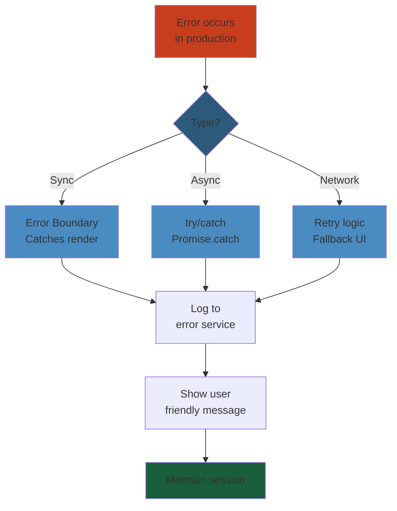
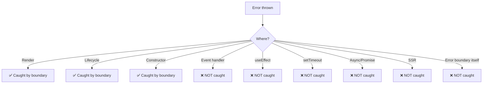
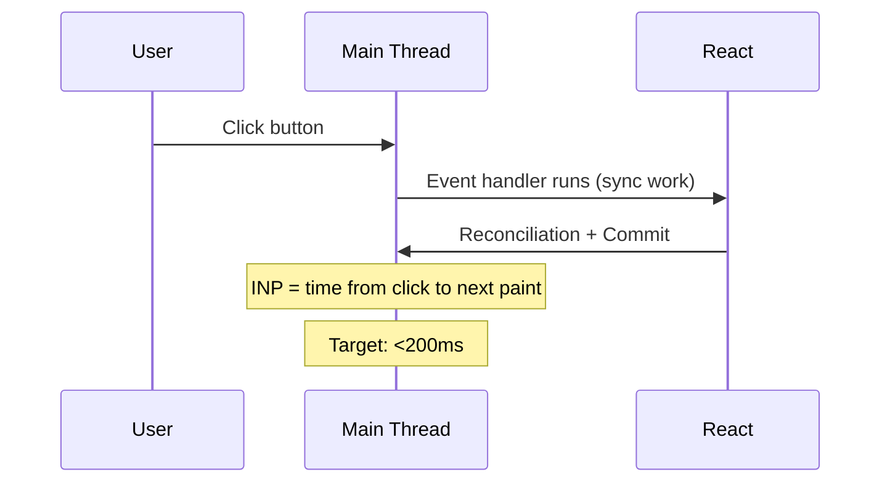
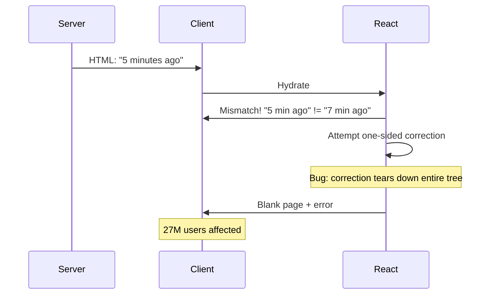
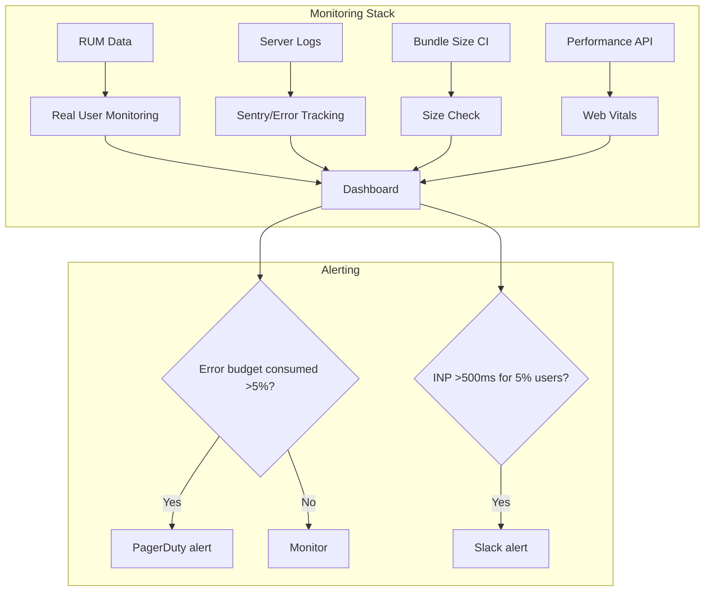
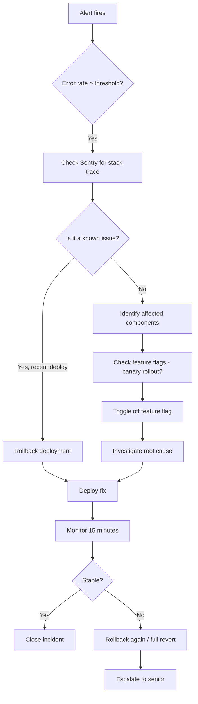
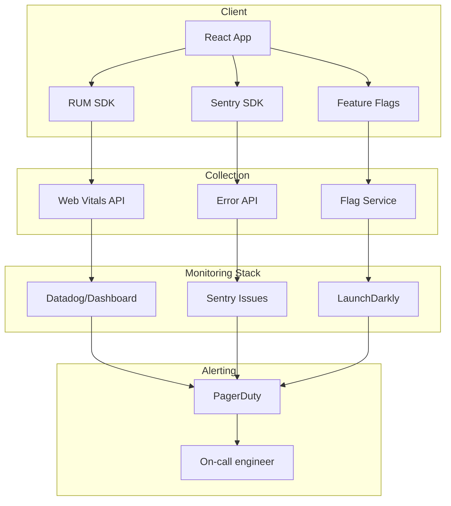

# 07: Production Issues — Deep Reference

> **Scope**: Error boundaries, error reporting (Sentry), performance monitoring (Web Vitals), bundle analysis, tree shaking, code splitting, CDN caching, service workers, PWA offline, hydration errors, memory leaks, infinite render loops, runtime error tracking, unhandled promise rejections, render-blocking resources, third-party script impact, loading states, progressive enhancement, graceful degradation, A/B testing, feature flags, canary releases, monitoring dashboards, alerting.

**Real production failures included**:
- GitHub's 2020 React hydration bug (27M users affected)
- Reddit's 2023 infinite re-render P0 outage
- Facebook's comment composer crash from unhandled error boundary gap

---

## Production Error Handling Strategy





## 1. React Error Boundaries — Full Coverage


Error boundaries catch JavaScript errors during **render, lifecycle methods, and constructors** of the entire tree below them.

```jsx
class ErrorBoundary extends React.Component {
  state = { hasError: false, error: null, errorInfo: null };

  static getDerivedStateFromError(error) {
    return { hasError: true, error };
  }

  componentDidCatch(error, errorInfo) {
    this.setState({ errorInfo });
    // Send to Sentry/Datadog
    Sentry.captureException(error, { extra: errorInfo });
    // Log breadcrumb for tracing
    console.error('Error Boundary caught:', error, errorInfo);
  }

  render() {
    if (this.state.hasError) {
      return (
        <FallbackUI
          error={this.state.error}
          onRetry={() => this.setState({ hasError: false, error: null })}
        />
      );
    }
    return this.props.children;
  }
}
```

### What Error Boundaries Do NOT Catch




### Fallback UI Patterns


```jsx
// Minimal
<ErrorBoundary fallback={<p>Something went wrong</p>}>

// Recovery with retry
function ErrorFallback({ error, resetErrorBoundary }) {
  return (
    <div role="alert">
      <h2>Something went wrong</h2>
      <pre>{error.message}</pre>
      <button onClick={resetErrorBoundary}>Try again</button>
    </div>
  );
}

// Granular per-section
function Dashboard() {
  return (
    <ErrorBoundary FallbackComponent={WidgetError}>
      <StockChart />
    </ErrorBoundary>
    <ErrorBoundary FallbackComponent={WidgetError}>
      <NewsFeed />
    </ErrorBoundary>
    <ErrorBoundary FallbackComponent={WidgetError}>
      <WeatherWidget />
    </ErrorBoundary>
  );
}
```

### Recovery Patterns


```jsx
// Reset key strategy: remounts the tree
function App() {
  const [resetKey, setResetKey] = useState(0);
  const [hasError, setHasError] = useState(false);

  if (hasError) {
    return (
      <div>
        <h1>Critical error</h1>
        <button onClick={() => { setHasError(false); setResetKey(k => k + 1); }}>
          Reload app
        </button>
      </div>
    );
  }

  return (
    <ErrorBoundary
      key={resetKey}
      onError={() => setHasError(true)}
      fallback={null}
    >
      <AppContent />
    </ErrorBoundary>
  );
}
```

---

## 2. Error Reporting — Sentry Integration


```javascript
// sentry.js
import * as Sentry from '@sentry/react';
import { BrowserTracing } from '@sentry/tracing';

Sentry.init({
  dsn: process.env.SENTRY_DSN,
  environment: process.env.NODE_ENV,
  release: process.env.RELEASE_VERSION,
  integrations: [
    new BrowserTracing({
      routingInstrumentation: Sentry.reactRouterV6Instrumentation(
        ReactRouterV6BrowserTracingRouting
      ),
    }),
  ],
  tracesSampleRate: 0.2, // 20% of transactions
  replaysSessionSampleRate: 0.1,
  replaysOnErrorSampleRate: 1.0,
  beforeSend(event, hint) {
    // Sanitize sensitive data
    if (event.request?.headers) {
      delete event.request.headers['Authorization'];
    }
    if (event.user) {
      delete event.user.email;
    }
    return event;
  },
});
```

### Source Maps


```javascript
// webpack.config.js
module.exports = {
  devtool: 'hidden-source-map', // Source maps in build but NOT in URL
  plugins: [
    new SentryWebpackPlugin({
      org: 'myorg',
      project: 'myapp',
      authToken: process.env.SENTRY_AUTH_TOKEN,
      release: process.env.RELEASE_VERSION,
      include: './build/static/js',
      urlPrefix: '~/static/js/',
    }),
  ],
};
```

### Breadcrumbs


```javascript
// Manual breadcrumbs
Sentry.addBreadcrumb({
  category: 'auth',
  message: 'User logged in',
  level: 'info',
  data: { userId: user.id, method: 'oauth' },
});

// Before API calls
function apiRequest(method, url, data) {
  Sentry.addBreadcrumb({
    category: 'api',
    message: `${method} ${url}`,
    level: 'info',
    data: { body: sanitize(data) },
  });
  return fetch(url, { method, body: JSON.stringify(data) });
}
```

---

## 3. Performance Monitoring — Web Vitals


```javascript
import { onLCP, onFID, onCLS, onINP } from 'web-vitals';

function sendToAnalytics(metric) {
  const body = {
    name: metric.name,
    value: metric.value,
    rating: metric.rating,
    delta: metric.delta,
    id: metric.id,
    navigationType: performance.getEntriesByType('navigation')[0]?.type,
  };

  // Send to your analytics
  navigator.sendBeacon('/analytics', JSON.stringify(body));

  // Also log to console in dev
  if (process.env.NODE_ENV === 'development') {
    console.log(metric.name, metric.value, metric.rating);
  }
}

// Register observers
onLCP(sendToAnalytics);
onFID(sendToAnalytics);
onCLS(sendToAnalytics);
onINP(sendToAnalytics);
```

### Web Vitals Targets


| Metric | Good | Needs Improvement | Poor |
|---|---|---|---|
| LCP (Largest Contentful Paint) | ≤2.5s | 2.5s–4.0s | >4.0s |
| FID (First Input Delay) | ≤100ms | 100ms–300ms | >300ms |
| CLS (Cumulative Layout Shift) | ≤0.1 | 0.1–0.25 | >0.25 |
| INP (Interaction to Next Paint) | ≤200ms | 200ms–500ms | >500ms |

### INP (Interaction to Next Paint) — Core Web Vital 2024


INP measures responsiveness: the time from a user interaction (click, tap, keypress) to the next visual update.

**What causes high INP**:
- Long render cycles (>50ms on main thread)
- Excessive DOM size
- Heavy event handlers
- Third-party scripts blocking main thread

**Debugging high INP**:


---

## 4. Bundle Analysis


```javascript
// webpack.config.js with webpack-bundle-analyzer
const BundleAnalyzerPlugin = require('webpack-bundle-analyzer').BundleAnalyzerPlugin;

module.exports = {
  plugins: [
    new BundleAnalyzerPlugin({
      analyzerMode: 'static',
      reportFilename: 'bundle-report.html',
      openAnalyzer: false,
    }),
  ],
};
```

### What to Look For


1. **Duplicate libraries** (e.g., two versions of moment.js)
2. **Large dependencies** (chart libraries, moment.js → use date-fns or dayjs)
3. **Unnecessary imports** (`import { zip } from 'lodash'` instead of `import zip from 'lodash/zip'`)
4. **Unused code** in bundles (tree shaking failures)

### Tree Shaking Pitfalls


```javascript
// ❌ BAD: entire lodash bundled (70KB)
import { debounce } from 'lodash';

// ✅ GOOD: tree-shakeable import (4KB)
import debounce from 'lodash/debounce';

// ❌ BAD: barrel exports prevent tree shaking
// index.js re-exports everything
export { A } from './A';
export { B } from './B';
export { C } from './C';

// Tree shaker can't tell which are used if imported from barrel
import { A } from './components'; // B and C still bundled if not pure

// ✅ GOOD: direct imports
import A from './components/A';
```

### Code Splitting Strategies


```mermaid
graph TD
    subgraph "Route-Based Splitting"
        A[/ → main.js 200KB]
        B[/dashboard → dashboard.js 150KB]
        C[/reports → reports.js 300KB]
        D[/admin → admin.js 120KB]
    end
    subgraph "Library Splitting"
        E[vendor.react.js 130KB]
        F[vendor.charts.js 200KB ← loaded only on /reports]
        G[vendor.video.js 500KB ← loaded only on /watch]
    end
```

```jsx
// Route-based code splitting
const Dashboard = lazy(() => import('./pages/Dashboard'));
const Reports = lazy(() => import('./pages/Reports'));
const Admin = lazy(() => import('./pages/Admin'));

// Component-level splitting (heavy third-party)
const Chart = lazy(() => import('./components/Chart'));
const PDFViewer = lazy(() => import('./components/PDFViewer'));

// Conditional loading based on feature flag
const NewFeature = featureFlags.newDashboard
  ? lazy(() => import('./components/NewDashboard'))
  : lazy(() => import('./components/LegacyDashboard'));
```

---

## 5. CDN Caching


```javascript
// Service Worker: cache-first for static assets
self.addEventListener('fetch', (event) => {
  if (event.request.url.includes('/static/')) {
    event.respondWith(
      caches.match(event.request).then((cached) => {
        return cached || fetch(event.request).then((response) => {
          return caches.open('static-v1').then((cache) => {
            cache.put(event.request, response.clone());
            return response;
          });
        });
      })
    );
  }
});
```

### Cache Headers


```nginx
# Static assets: long cache, content hash in filename
location /static/ {
    expires 1y;
    add_header Cache-Control "public, immutable";
}

# HTML: short cache, revalidate
location / {
    expires 5m;
    add_header Cache-Control "public, must-revalidate";
}
```

### Cache Invalidation


- **Content-hash filenames**: `main.a1b2c3.js` — new hash on change
- **Cache-busting query params**: `main.js?v=2.1.0`
- **Service Worker versioning**: Increment SW version on deploy

---

## 6. Service Workers & PWA


```javascript
// service-worker.js
const CACHE_NAME = 'myapp-v2';
const STATIC_ASSETS = [
  '/',
  '/index.html',
  '/static/js/main.abc123.js',
  '/static/css/main.abc123.css',
  '/manifest.json',
  '/icons/icon-192.png',
];

self.addEventListener('install', (event) => {
  event.waitUntil(
    caches.open(CACHE_NAME).then((cache) => cache.addAll(STATIC_ASSETS))
  );
  self.skipWaiting();
});

self.addEventListener('activate', (event) => {
  event.waitUntil(
    caches.keys().then((keys) =>
      Promise.all(
        keys.filter((k) => k !== CACHE_NAME).map((k) => caches.delete(k))
      )
    )
  );
  self.clients.claim();
});

// Network-first for API calls, cache-first for static
self.addEventListener('fetch', (event) => {
  if (event.request.url.includes('/api/')) {
    event.respondWith(networkFirst(event.request));
  } else {
    event.respondWith(cacheFirst(event.request));
  }
});
```

### Offline Support Strategy


| Request Type | Strategy | Fallback |
|---|---|---|
| Static assets | Cache-first | Offline page |
| HTML | Network-first with cache fallback | Cached version |
| API GET | Network-first with stale cache | Last cached data |
| API POST | Network-only | Queue for retry |
| Images | Cache-first | Placeholder |

---

## 7. Hydration Errors — Causes & Solutions


### Common Causes


```jsx
// 1. Timestamps / dates
function RelativeTime({ date }) {
  return <span>{formatDistance(date, new Date())}</span>;
  // Server renders "2 hours ago", client renders "2 hours 1 min ago"
}

// 2. Browser-only APIs
function DeviceInfo() {
  return <div>{navigator.userAgent}</div>;
  // Server: undefined, Client: "Mozilla/5.0..."
}

// 3. Random values
function RandomID() {
  return <div id={Math.random()}>Content</div>;
}

// 4. Conditional rendering based on window size
function ResponsiveComponent() {
  const [isMobile] = useState(window.innerWidth < 768);
  return isMobile ? <MobileView /> : <DesktopView />;
}
```

### Suppression Techniques


```jsx
// suppressHydrationWarning (use sparingly)
function RelativeTime({ date }) {
  const [label, setLabel] = useState('');
  useEffect(() => { setLabel(formatDistance(date, new Date())); }, [date]);
  return <span suppressHydrationWarning>{label || formatDistance(date, new Date())}</span>;
}

// Double render (render nothing on server, render on client)
function ClientOnly({ children }) {
  const [mounted, setMounted] = useState(false);
  useEffect(() => setMounted(true), []);
  if (!mounted) return null;
  return children;
}

// useSyncExternalStore for browser-dependent values
function useWindowWidth() {
  return useSyncExternalStore(
    (cb) => { window.addEventListener('resize', cb); return () => window.removeEventListener('resize', cb); },
    () => window.innerWidth,
    () => 1024 // Server fallback
  );
}
```

### Production Case: GitHub's 2020 Hydration Bug (27M Users)


**Timeline**:
1. GitHub deployed a React 16 upgrade with SSR
2. Server rendered `<relative-time datetime="2020-12-15T10:00:00Z">5 minutes ago</relative-time>`
3. Client hydrated 2 seconds later → it was "7 minutes ago"
4. React 16 performed "one-sided correction" (updated DOM to match client)
5. A bug in React's reconciliation caused the entire page tree to be torn down instead of updated
6. 27 million users saw a blank page with a JavaScript error

**Root cause**: Hydration mismatch + React's incomplete recovery path in React 16. React 17+ improved hydration error recovery by re-rendering within the boundary instead of tearing down the entire tree.

**Lessons learned**:
- All dynamic content (time, locale, random) must be suppressed or reconciled
- Hydration mismatch can cascade to destroy the entire page
- Test SSR output against client output in CI
- Use `suppressHydrationWarning` for inherently dynamic content



---

## 8. Memory Leaks


### Event Listeners


```jsx
// ❌ LEAK: event listener never removed
function ScrollTracker() {
  useEffect(() => {
    window.addEventListener('scroll', handleScroll);
    // Missing cleanup!
  }, []);
  return null;
}

// ✅ FIX: cleanup
function ScrollTracker() {
  useEffect(() => {
    window.addEventListener('scroll', handleScroll);
    return () => window.removeEventListener('scroll', handleScroll);
  }, []);
  return null;
}
```

### Subscriptions


```jsx
// ❌ LEAK: subscription never unsubscribed
function useDataStream(channel) {
  const [data, setData] = useState(null);
  useEffect(() => {
    const sub = dataStream.subscribe(channel, setData);
    // Missing sub.unsubscribe()
  }, [channel]);
  return data;
}
```

### Timers


```jsx
// ❌ LEAK: timer continues after unmount
function AutoRefresh() {
  useEffect(() => {
    const id = setInterval(refresh, 5000);
    return () => clearInterval(id); // ✅
  }, []);
}
```

### Closures Holding Large Objects


```jsx
// ❌ LEAK: closure holds reference to large data
function useLargeData() {
  const [data, setData] = useState(null);

  const processData = useCallback(() => {
    // Closure over setData — but also over any large vars in scope
    heavyProcessing(data); // data stays in closure
  }, [data]);

  // If component unmounts, this effect still references setData through timer
  useEffect(() => {
    const id = setInterval(processData, 1000);
    return () => clearInterval(id);
  }, [processData]);
}
```

### Detection


```javascript
// Chrome DevTools:
// 1. Performance tab → record → look for growing heap
// 2. Memory tab → Heap snapshot → compare snapshots
// 3. Detached DOM nodes in heap (common React leak symptom)

// React DevTools:
// Components → search for zombie components (still in tree after supposed unmount)
```

---

## 9. Infinite Render Loop Detection


### Common Patterns


```jsx
// Pattern 1: setState in useEffect without deps
useEffect(() => {
  setCount(count + 1); // Re-render → effect → re-render → loop
});

// Pattern 2: setState in render body
function Bad() {
  const [count, setCount] = useState(0);
  setCount(count + 1); // Called during render → triggers new render
  return <div>{count}</div>;
}

// Pattern 3: Object dependency in useEffect
useEffect(() => {
  fetchData(options);
}, [options]); // If options is new object each render → loop

// Pattern 4: Function dependency without useCallback
useEffect(() => {
  fetchUser(onSuccess);
}, [onSuccess]); // onSuccess new function each render → loop
```

### Production Case: Reddit's 2023 Infinite Re-render P0 Outage


**What happened**: Reddit deployed a React update that introduced a hook regression. A `useEffect` with a missing dependency array caused an infinite re-render loop.

**Timeline**:
1. New feed algorithm hook added: `useFeedSort(userId, sortPreference)`
2. Inside, `useEffect` called `setPosts()` without deps
3. setPosts → re-render → useEffect → setPosts → loop
4. All Reddit web users hit this immediately on page load
5. Tab CPU goes to 100%, page becomes unresponsive
6. P0 incident declared, rollback initiated

**Stats**:
- Duration: 47 minutes
- Users affected: ~50M (all web users)
- Signal: Reddit's error budget consumed in 12 minutes
- Detection: Datadog RUM showing 1000% increase in page load times

```mermaid
flowchart TD
    A[Page load] --> B[useFeedSort runs]
    B --> C[useEffect runs]
    C --> D[setPosts]
    D --> E[Re-render]
    E --> C
    Note over C,D: Infinite loop
    E --> F[CPU 100%]
    F --> G[Page unresponsive]
    G --> H[User refreshes]
    H --> A
```

**Post-mortem fixes**:
1. Proper dependency array in useEffect
2. Pre-commit hook to detect infinite render loops (`eslint-plugin-react-hooks`)
3. Kill switch for new hooks (feature flag)
4. Canary testing before full rollout

### Detection Mechanisms


```javascript
// Runtime loop detection (custom hook)
function useDetectInfiniteLoop(fn, deps, limit = 50) {
  const count = useRef(0);

  useEffect(() => {
    count.current += 1;
    if (count.current > limit) {
      console.error('Infinite render loop detected! Check deps:', deps);
      Sentry.captureMessage('Infinite render loop', {
        extra: { deps, count: count.current },
      });
    }
    return () => { count.current = 0; };
  }, deps);
}
```

---

## 10. Runtime Error Tracking


### Global Error Handler


```javascript
// React 16+ uses window.onerror + unhandledrejection

window.onerror = (message, source, lineno, colno, error) => {
  Sentry.captureException(error, {
    extra: { source, lineno, colno },
    tags: { type: 'window.onerror' },
  });
  // Don't suppress default browser error handling
  return false;
};

window.addEventListener('unhandledrejection', (event) => {
  Sentry.captureException(event.reason, {
    tags: { type: 'unhandledrejection' },
  });
  event.preventDefault();
});

// React error handler
const originalConsoleError = console.error;
console.error = (...args) => {
  Sentry.addBreadcrumb({
    category: 'console',
    message: args.join(' '),
    level: 'error',
  });
  originalConsoleError.apply(console, args);
};
```

### React Error Boundary Integration


```jsx
class MonitoredErrorBoundary extends React.Component {
  componentDidCatch(error, info) {
    // Add component stack to error
    Sentry.captureException(error, {
      extra: {
        componentStack: info.componentStack,
        lifecycleState: 'render',
      },
    });

    // Notify monitoring systems
    incrementMetric('react.error.count', 1, {
      tags: { component: this.props.name },
    });
  }
}
```

---

## 11. Unhandled Promise Rejections


```javascript
// Global handler
window.addEventListener('unhandledrejection', (event) => {
  console.error('Unhandled promise rejection:', event.reason);
  Sentry.captureException(event.reason);

  // Prevent default to avoid noisy console warnings
  event.preventDefault();
});

// Pattern: always catch promises
// ❌ BAD: unhandled
async function loadData() {
  const data = await fetch('/api/data'); // If this throws → unhandled
}

// ✅ GOOD: handled
async function loadData() {
  try {
    const data = await fetch('/api/data');
    return data;
  } catch (error) {
    Sentry.captureException(error);
    return fallbackData;
  }
}
```

---

## 12. Render-Blocking Resources


```html
<!-- ❌ BAD: render-blocking JS/CSS in <head> -->
<head>
  <script src="/app.js"></script>
  <link rel="stylesheet" href="/styles.css" />
</head>

<!-- ✅ GOOD: async/defer scripts, critical CSS inline -->
<head>
  <link rel="preload" href="/fonts/Inter.woff2" as="font" crossorigin />
  <style>
    /* Critical CSS: above-the-fold styles only */
    body { font-family: sans-serif; margin: 0; }
  </style>
</head>
<body>
  <script src="/app.js" defer></script>
  <link rel="stylesheet" href="/styles.css" media="print" onload="this.media='all'" />
</body>
```

### Impact of Third-Party Scripts


| Script | Typical Impact | Mitigation |
|---|---|---|
| Google Analytics | +50ms LCP | Load async, use gtag.js |
| Facebook Pixel | +100ms LCP | Load after onload event |
| Intercom/Zendesk | +200ms LCP | Defer, lazy load |
| YouTube embed | +300ms LCP | Use lite-youtube-embed |
| Google Maps | +500ms LCP | Lazy load on interaction |

---

## 13. Loading States & Skeletons


```jsx
function Page() {
  const { data, isLoading } = useQuery(['page-data'], fetchData);

  if (isLoading) return <PageSkeleton />;

  return <PageContent data={data} />;
}

function PageSkeleton() {
  return (
    <div className="skeleton" aria-busy="true" aria-label="Loading">
      <div className="skeleton-header" />
      <div className="skeleton-text" />
      <div className="skeleton-text short" />
      <div className="skeleton-card" />
      <div className="skeleton-card" />
    </div>
  );
}
```

### Skeleton vs Spinner Decision


| UX | When to Use |
|---|---|
| Spinner | Quick operations (<1s) |
| Skeleton | Known layout (cards, lists, tables) |
| Progress bar | Known duration (file upload, multi-step) |
| Nothing (optimistic) | High confidence in fast response |

---

## 14. Progressive Enhancement


```jsx
// Core functionality works without JS
<form action="/api/login" method="POST">
  <input name="email" type="email" required />
  <input name="password" type="password" required />
  <button type="submit">Login</button>
</form>

// Enhanced version with JS
function EnhancedLogin() {
  const { register, handleSubmit } = useForm();

  return (
    <form onSubmit={handleSubmit(api.login)}>
      <input {...register('email')} />
      <input {...register('password')} />
      <button type="submit">Login</button>
    </form>
  );
}
```

### Graceful Degradation


```jsx
// Feature detection
function useWebSocket() {
  const [supported] = useState(() => 'WebSocket' in window);

  if (!supported) {
    return { send: () => {}, onMessage: null, fallbackToPolling: true };
  }
  // ... WebSocket implementation
}

// Fallback for unsupported features
function MapComponent() {
  const [mapsLoaded, setMapsLoaded] = useState(false);

  return (
    <>
      {mapsLoaded ? <GoogleMaps /> : <StaticMapImage />}
      <button onClick={() => loadGoogleMaps().then(() => setMapsLoaded(true))}>
        Load interactive map
      </button>
    </>
  );
}
```

---

## 15. A/B Testing Infrastructure


```jsx
// Feature flag context
const FeatureFlagContext = createContext({});

function FeatureFlagProvider({ children }) {
  const [flags, setFlags] = useState(() => {
    // Read from cookies/URL params
    const cookies = parseCookies(document.cookie);
    return {
      newDashboard: cookies.ff_newDashboard === '1',
      darkMode: cookies.ff_darkMode === '1',
      v3Checkout: Math.random() < 0.1, // 10% rollout
      ...parseURLParams(window.location.search),
    };
  });

  return (
    <FeatureFlagContext.Provider value={flags}>
      {children}
    </FeatureFlagContext.Provider>
  );
}

function useFeatureFlag(name) {
  return useContext(FeatureFlagContext)[name] ?? false;
}

// Usage
function Checkout() {
  const useV3Checkout = useFeatureFlag('v3Checkout');

  if (useV3Checkout) {
    return <CheckoutV3 />;
  }
  return <CheckoutV2 />;
}
```

### Canary Releases


1. Deploy to 1% of users → monitor errors
2. Increase to 5% → monitor performance
3. Increase to 20% → monitor all metrics
4. Gradual rollout to 100%
5. Automatic rollback if error rate exceeds threshold

```javascript
// Feature flag server integration
const flags = await fetch('/api/feature-flags', {
  headers: { 'X-User-ID': userId },
});

// Server decides based on user cohort:
// - Internal testers: always true
// - 1% canary: true
// - Gradual rollout: tenant-based
```

---

## 16. Monitoring Dashboards




### Key Dashboard Metrics


| Metric | Alert Threshold | Action |
|---|---|---|
| Error rate | >1% of page views | Rollback, investigate |
| LCP | >4s for 10% of users | Performance optimization |
| CLS | >0.25 for 10% of users | Layout investigation |
| INP | >500ms for 5% of users | Event handler optimization |
| Bundle size | >500KB gzipped | Code splitting |
| Memory | >200MB heap | Memory leak investigation |
| API error rate | >5% | Backend investigation |

---

## 17. Production Failure: Facebook Comment Composer Crash


**What happened** (2017, React 15 era):

1. Third-party emoji picker plugin threw an error during a click event
2. Error was NOT caught by the error boundary (event handlers aren't covered)
3. No fallback UI rendered — the entire comment composer disappeared
4. Users could not post comments on posts
5. The error propagated silently because the component just unmounted

**Root cause analysis**:
- Error boundary was placed too high (wrapping the page, not individual widgets)
- Developers assumed error boundaries would catch ALL errors
- Event handler errors are explicitly NOT caught by React error boundaries
- No Sentry alert configured for this component

**Fix**:
```jsx
// 1. Individual error boundaries per widget
<CommentComposer>
  <ErrorBoundary fallback={<BasicTextInput />}>
    <EmojiPicker /> {/* Third-party that might throw */}
  </ErrorBoundary>
  <RichTextEditor />
  <SubmitButton />
</CommentComposer>

// 2. Catch in event handler
const handleEmojiSelect = async (emoji) => {
  try {
    await emojiPicker.select(emoji);
  } catch (error) {
    Sentry.captureException(error, {
      tags: { component: 'EmojiPicker' },
    });
    setFallbackMode(true); // Switch to text-only emoji input
  }
};
```

---

## 18. Recovery vs Failover Patterns


| Pattern | What It Does | When to Use |
|---|---|---|
| **Recovery** | Component catches error, shows retry UI, attempts to re-mount | Transient errors (network, timeout) |
| **Failover** | Component switches to a different implementation | Permanent failures (browser API missing) |
| **Graceful degradation** | Core functionality remains, enhancements fail silently | Feature not supported |
| **Progressive enhancement** | Start with basic version, enhance if supported | Always (default approach) |

```jsx
// Recovery pattern
function DataWidget() {
  const [retryCount, setRetryCount] = useState(0);

  const { data, error } = useQuery(['data', retryCount], fetchData);

  if (error && retryCount < 3) {
    return (
      <div>
        <p>Failed to load. Retrying ({retryCount + 1}/3)...</p>
        {setTimeout(() => setRetryCount(c => c + 1), 3000) && null}
      </div>
    );
  }

  if (error) {
    return <ErrorFallback onRetry={() => setRetryCount(0)} />;
  }

  return <WidgetContent data={data} />;
}

// Failover pattern
function MapWidget() {
  const [mapType, setMapType] = useState('google');

  return (
    <ErrorBoundary
      fallback={<StaticMap />} // Failover to static image
      onError={() => setMapType('static')}
    >
      {mapType === 'google' ? <GoogleMap /> : <StaticMap />}
    </ErrorBoundary>
  );
}
```

### Interview: Recovery vs Failover in SPAs


**Question**: "What's the difference between recovery and failover in React SPAs?"

**Answer**: 
- **Recovery**: After an error, attempt to restore the component to working state (e.g., retry API call, reset local state, re-mount with key change). Assumes the error is transient.
- **Failover**: After an error, switch to an alternative implementation that provides the same functionality through different means (e.g., Google Maps → Leaflet, WebSocket → polling). Assumes the primary implementation is permanently broken.
- **Recovery example**: `onRetry` in an ErrorBoundary that re-mounts the subtree.
- **Failover example**: `supportsWebGL ? <ThreeCanvas /> : <Canvas2D />` — the feature is different but the user experience is preserved.

**Which to choose**: Start with recovery (most errors are transient). Implement failover when recovery fails repeatedly (track with retry counter).

---

## 19. Alerting on Error Budgets


```javascript
// Error budget calculation
// Monthly budget = 99.9% uptime = 43 minutes of errors/month
// Error budget = (total requests - successful requests) / total requests

// Alert if budget consumed > X% in a day
const errorRate = await getDailyErrorRate();
const errorBudgetDaily = 0.001; // 0.1% daily budget
if (errorRate > errorBudgetDaily * 2) { // Double daily budget = burn rate alert
  await sendAlert({
    severity: 'P1',
    message: `Error budget burn rate critical: ${errorRate}% today`,
  });
}
```

---

## 20. Simplest Mental Model


> **Production React monitoring = watch 3 things: errors (Sentry), performance (Web Vitals), and bundle size. Error boundaries are seatbelts — place them per section, not one for the whole car. Hydration mismatches are the #1 SSR bug. Infinite re-render loops are the #1 React 18 bug. If you see "not wrapped in act" in your test, you'll see it in production too. Every third-party script costs seconds of load time. Always have a fallback for everything.**

---

## 21. Mermaid: Production Incident Response Flow




---

## 22. Deployment Safety Checklist


- [ ] Source maps uploaded to Sentry BEFORE deploying
- [ ] Feature flags toggleable without deploy
- [ ] Canary deployment infrastructure in place
- [ ] Automated rollback trigger (error rate > threshold)
- [ ] New hooks have eslint-plugin-react-hooks exhaustive-deps
- [ ] Bundle size CI check (alert if >X% increase)
- [ ] SSR output validated against client output
- [ ] Error boundaries wrap new page/component
- [ ] Memory profiling done for large data components
- [ ] Web Vitals baseline measured before deploy
- [ ] All third-party scripts loaded asynchronously or deferred
- [ ] Service worker version incremented

---

## 23. Quick Reference: Production Debugging


| Symptom | Diagnosis Tool | Likely Cause |
|---|---|---|
| Blank page | React DevTools, Console | Unhandled error, missing error boundary |
| Slow initial load | Network tab, Bundle analyzer | Bundle too large, unoptimized images |
| Slow page interaction | Performance tab, Profiler | Long renders, missing memo, large lists |
| High memory | Heap snapshot | Memory leak (listeners, subscriptions) |
| UI freeze | Performance tab | Synchronous renders >50ms |
| Layout shift | Lighthouse, CLS meter | Unstable images, fonts, ads |
| Hydration mismatch | Console warnings | SSR/CSR divergence |
| Infinite loop | Profiler (continuous commits) | useEffect deps, render setState |
| Missing data | Network tab | API error, cache invalidation |

---

## 24. Production Monitoring Setup


```javascript
// Minimal production monitoring setup
// 1. Sentry for errors
import * as Sentry from '@sentry/react';
Sentry.init({
  dsn: process.env.SENTRY_DSN,
  environment: process.env.NODE_ENV,
  tracesSampleRate: 0.1,
});

// 2. Web Vitals
import { onLCP, onFID, onCLS, onINP } from 'web-vitals';
function sendMetric(metric) {
  navigator.sendBeacon('/analytics', JSON.stringify(metric));
}
onLCP(sendMetric);
onFID(sendMetric);
onCLS(sendMetric);
onINP(sendMetric);

// 3. Error boundary at root
<ErrorBoundary FallbackComponent={AppCrashFallback}>
  <App />
</ErrorBoundary>

// 4. Performance marks
performance.mark('app-ready');
// ...after render
performance.measure('time-to-interactive', 'app-ready');
```

---

## 25. Interview: React Error Boundaries Deep Dive


**Question**: "Can you implement an error boundary that catches async errors?"

**Answer**: Error boundaries cannot catch async/event handler errors by design. But you can build a boundary pattern that wraps try/catch:

```jsx
// This does NOT work — boundaries don't catch async
// But you can propagate errors to boundary manually

class AsyncErrorBoundary extends React.Component {
  state = { error: null };

  static getDerivedStateFromError(error) {
    return { error };
  }

  // Add method for children to call
  handleError = (error) => {
    this.setState({ error });
  };

  render() {
    if (this.state.error) {
      return this.props.fallback || <h1>Error occurred</h1>;
    }
    return this.props.children;
  }
}

// Then in child:
function AsyncComponent() {
  const boundary = useContext(ErrorBoundaryContext);

  useEffect(() => {
    fetch('/api').catch(error => {
      boundary.handleError(error); // Manually propagate to boundary
    });
  }, []);

  return null;
}
```

**Better approach**: Wrap each async operation with error handling:
```jsx
function useAsyncWithError(errorBoundary) {
  return useCallback(async (fn) => {
    try {
      return await fn();
    } catch (error) {
      errorBoundary.handleError(error);
    }
  }, [errorBoundary]);
}
```

---

## 26. Mermaid: Full Production Monitoring Architecture




---

## 27. Feature Flag Kill Switches


```javascript
// Emergency kill switch for problematic features
const KILL_SWITCHES = {
  newSearchAlgorithm: true, // Enabled by default
  v3Checkout: false,        // Disabled — known issue
};

async function getFeatureFlags(userId) {
  // Check remote first
  const remote = await fetch('/api/feature-flags', {
    headers: { 'X-User-ID': userId },
  }).then(r => r.json()).catch(() => ({}));

  // Merge with kill switches (kill switches always win)
  return {
    ...remote,
    ...KILL_SWITCHES,
    ...parseURLParams(window.location.search), // URL params override all
  };
}
```

**Production use**: When Reddit's infinite loop hit, if they had a flag kill switch for `useFeedSort`, they could have disabled it in 30 seconds instead of rolling back the entire deployment in 47 minutes.

---

## 28. Production Readiness Checklist


- [ ] All components wrapped in error boundaries (granular)
- [ ] Sentry configured with source maps and breadcrumbs
- [ ] Web Vitals monitoring active (LCP, FID, CLS, INP)
- [ ] Bundle size tracked in CI (alert on >10% increase)
- [ ] Feature flags for all new capabilities
- [ ] Canary deployment pipeline configured
- [ ] Automatic rollback on error spike
- [ ] Memory leak detection in CI (heap snapshot comparison)
- [ ] Service worker has version update flow
- [ ] Third-party scripts have fallbacks
- [ ] Offline page / graceful degradation for PWA
- [ ] Error budget alerts configured
- [ ] Performance budget defined and enforced

---

## Related


- [Networking](../../11-networking/) — HTTP, performance, optimization
- [Security](../../13-security/) — CORS, authentication, XSS prevention
- [Backend](../../03-backend/) — API design and contracts
- [Performance Engineering](../../18-performance-engineering/) — Browser rendering
- [Testing](../../19-testing/) — E2E and component testing
