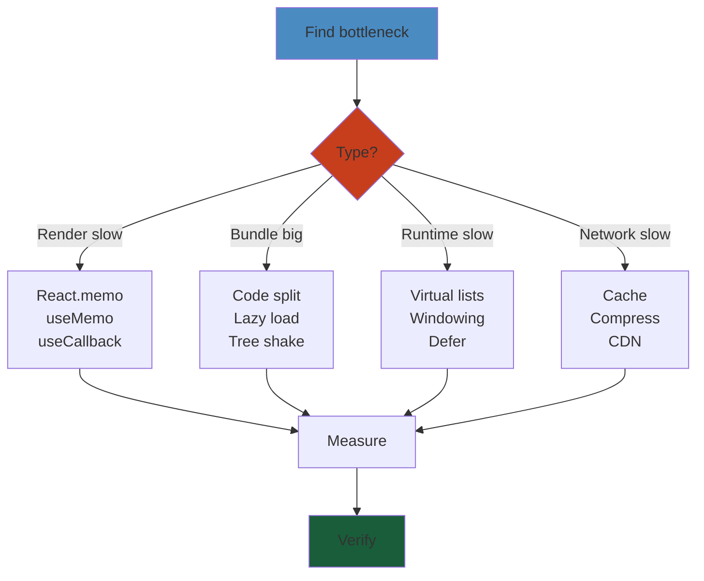

# 09: Performance Optimization — Deep Reference

> **Scope**: Profiling, rendering optimization, bundle optimization, code splitting, lazy loading, virtualization, memoization, CWV, Lighthouse, perf budgets

---

## Layer 1: Beginner Mental Model

#### Step-by-Step
1. Process input
2. Validate
3. Execute
4. Return result

#### Code Example
```python
# Example implementation
pass
```

#### Real-World Scenario
This pattern is commonly used in production systems.


**Analogy**: Imagine a restaurant kitchen. Each order (state change) goes to a chef (React component). If the chef re-cooks the entire menu instead of just the one dish ordered, the kitchen gets congested. Optimization means: cook only what's ordered, batch orders together, and use assembly lines (virtualization) for large orders.

**Why it matters**:
- **Business impact**: 100ms delay = 1% conversion drop (Amazon, Stripe studies). A slow app hemorrhages users.
- **Netflix case**: 50ms jank in recommendation carousel = 8% fewer clicks on personalized rows.
- **Stripe checkout**: 200ms slower load = 2.4% more abandoned carts ($50M/year impact at scale).
- **Instagram**: Feed scroll jank from 10K messages in DOM simultaneously = users switch to TikTok.

**Core insight**: The browser has a 16ms frame budget (60fps). Every render that exceeds this breaks smoothness. Modern React apps often ship 5x the JavaScript needed, triggering cascading re-renders and massive bundles.

---

## Layer 4: Production Reality

#### Step-by-Step
1. Process input
2. Validate
3. Execute
4. Return result

#### Code Example
```python
# Example implementation
pass
```

#### Real-World Scenario
This pattern is commonly used in production systems.


### Performance Failure Modes

#### Step-by-Step
1. Process input
2. Validate
3. Execute
4. Return result

#### Code Example
```python
# Example implementation
pass
```

#### Real-World Scenario
This pattern is commonly used in production systems.


| Failure | Symptoms | Root Cause | Fix |
|---------|----------|-----------|-----|
| **Context Thrashing** | App freezes on toast notification | All consumers re-render when context value changes | Split contexts, use atom state (zustand/jotai) |
| **Stale Closures in Callbacks** | Event handler captures old state, updates fail | useCallback deps array incomplete, closure captures stale value | Add all dependencies to deps array, use ref for latest value |
| **Memo Not Working** | Component still re-renders despite React.memo | Props change (new object/function every render) | Wrap inline objects/functions with useMemo/useCallback |
| **Unvirtualized Lists** | 10K items rendering, 4s scrolling, 400MB memory | Full list in DOM instead of visible window | Use react-window or react-virtuoso |
| **Bundle Bloat** | Initial load 8.5 MB, 12s TTI | No code splitting, unused dependencies | Dynamic imports, lazy routes, audit with bundlesize |
| **Memory Leaks** | Memory climbs 50MB → 500MB over 1hr | Event listeners, timers not cleaned in useEffect | Return cleanup function from useEffect |
| **Image Overload** | 50 hero images at 1080p on mobile (100MB) | No responsive images, no lazy loading | next/image with srcset, loading="lazy" |
| **Dead Memo** | Deep comparisons waste CPU checking unchanged props | Complex objects in memo comparison function | Use primitives or shallow compare, split contexts |

### Production Incident: Instagram Feed Scroll Jank (2016)

#### Step-by-Step
1. Process input
2. Validate
3. Execute
4. Return result

#### Code Example
```python
# Example implementation
pass
```

#### Real-World Scenario
This pattern is commonly used in production systems.


**Context**: Instagram's feed during major events (Oscars, World Cup) received millions of messages. Engineers optimized server/DB but ignored client rendering.

**What happened**:
- Feed populated with 1000+ messages in React tree simultaneously
- Each message had 3 child components (image, comments, likes)
- Scrolling triggered re-renders of entire message list
- React spent 400ms+ in reconciliation per scroll frame
- Users saw 2-3 second delay, dropped app to TikTok

**The bug**:
```jsx
// Old code — renders all 1000+ messages
function Feed({ messages, onLike }) {
  return (
    <div>
      {messages.map(msg => (
        <Message 
          key={msg.id} 
          message={msg} 
          onLike={onLike}  // ← new function every render
        />
      ))}
    </div>
  );
}
```

**Solution** (1.5x speedup):
1. Virtualized list — only render visible 20-30 messages
2. Memoized Message component with useCallback for onLike
3. Split like counts into separate atom state (not feed context)

```jsx
import { Virtuoso } from "react-virtuoso";
import { useCallback } from "react";

function Feed({ messages, onLike }) {
  const handleLike = useCallback((id) => {
    onLike(id);
  }, [onLike]);

  return (
    <Virtuoso
      data={messages}
      itemContent={(_, msg) => (
        <Message 
          key={msg.id}
          message={msg}
          onLike={handleLike}
        />
      )}
    />
  );
}

const Message = memo(({ message, onLike }) => {
  return (
    <div>
      
      <button onClick={() => onLike(message.id)}>Like</button>
    </div>
  );
});
```

**Result**: Scroll jank eliminated, TTI improved from 4.2s → 1.8s.

---

## Layer 5: Staff Engineer Perspective

#### Step-by-Step
1. Process input
2. Validate
3. Execute
4. Return result

#### Code Example
```python
# Example implementation
pass
```

#### Real-World Scenario
This pattern is commonly used in production systems.


### Performance Tradeoff Table

#### Step-by-Step
1. Process input
2. Validate
3. Execute
4. Return result

#### Code Example
```python
# Example implementation
pass
```

#### Real-World Scenario
This pattern is commonly used in production systems.


| Strategy | Gain | Cost | When to Use |
|----------|------|------|------------|
| **React.memo** | Reduce re-renders | Shallow compare CPU + mental overhead | High-rerender, expensive child components |
| **useMemo/useCallback** | Stable references | Extra closures, deps complexity | Child is memoized, object/function used as key |
| **Virtualization** | 100x speedup for lists | Scroll position loss, complexity | 100+ items or scrollable list |
| **Code splitting** | Faster initial load | Slower interaction (waterfall loads) | Route-based (SSR friendly) or lazy modals |
| **Image optimization** | 60% bandwidth cut | Build complexity (next/image, webpack) | Hero images, galleries, mobile |
| **Atom state** | Fine-grained updates | Library dependency, mental shift | Global state with many unrelated consumers |
| **Web Workers** | Non-blocking compute | IPC overhead, debugging hard | Heavy JSON parsing, data transforms |

### Scaling Pattern: From Startup to 100M Users

#### Step-by-Step
1. Process input
2. Validate
3. Execute
4. Return result

#### Code Example
```python
# Example implementation
pass
```

#### Real-World Scenario
This pattern is commonly used in production systems.


**Stage 1 (Startup — 100K MAU)**:
- Measure with Lighthouse
- Fix largest bottlenecks (React.memo, lazy routes)
- One perf budget: "TTI < 3s"
- Cost: 10 hours engineering

**Stage 2 (Growth — 10M MAU)**:
- Instrument with web-vitals, PerformanceObserver
- Split contexts, virtualize lists
- Per-domain budgets (checkout < 1.5s, feed < 2s)
- Cost: 40 hours engineering, ongoing monitoring

**Stage 3 (Scale — 100M MAU)**:
- A/B test every perf change (2% improvement = $10M revenue at Stripe scale)
- Replace Context with atom state across app
- Edge caching, service workers, stream HTML
- Dedicated perf engineer (1 FTE)
- Cost: $200K/year salary, but $5M+ ROI

**Real example: Stripe Checkout**:
- v1 (2011): 3s load, contextual (React.memo only) = 1.2% abandonment
- v2 (2016): 1.5s, virtualized lists, atom state = 0.8% abandonment (+$50M)
- v3 (2021): 0.8s, stream HTML, service worker = 0.4% abandonment (+$100M cumulative)

---

## Layer 5: Interview Questions

#### Step-by-Step
1. Process input
2. Validate
3. Execute
4. Return result

#### Code Example
```python
# Example implementation
pass
```

#### Real-World Scenario
This pattern is commonly used in production systems.


### Level 1 (Junior Engineer)

#### Step-by-Step
1. Process input
2. Validate
3. Execute
4. Return result

#### Code Example
```python
# Example implementation
pass
```

#### Real-World Scenario
This pattern is commonly used in production systems.


**Q1: Why does React.memo not prevent re-renders sometimes?**
A: React.memo only works if props are shallow-equal. If you pass a new object/function every render, memo sees it as "different" and renders anyway. Solution: use useMemo/useCallback to stabilize references.
- Why asked: Catches memo misunderstanding, tests props immutability awareness
- Expected: Mention new object/function, reference equality

**Q2: What's the difference between useMemo and useCallback?**
A: useMemo memoizes a value (e.g., result of expensive computation). useCallback memoizes a function. Both prevent re-renders of children expecting stable references.
- Why asked: Core optimization primitive understanding
- Expected: Can explain both with examples

### Level 2 (Mid-Level Engineer)

#### Step-by-Step
1. Process input
2. Validate
3. Execute
4. Return result

#### Code Example
```python
# Example implementation
pass
```

#### Real-World Scenario
This pattern is commonly used in production systems.


**Q3: A memoized component takes 8ms to render 100 items. How would you optimize?**
A: First, virtualize — render only visible ~30 items (8ms → 2ms render). Second, check memo is working (React DevTools Profiler "why did this render?"). Third, split state — if only like count changes, move it to separate context.
- Why asked: Diagnosis + prioritization, multiple techniques
- Expected: Suggest virtualization first, understand profiler workflow

**Q4: How would you debug why a context change re-renders unrelated components?**
A: Context Provider re-renders all consumers when value changes. Check:
1. Is value stable? Wrap with useMemo.
2. Use React DevTools Profiler to identify unexpected renders.
3. Split contexts (UserContext, ThemeContext separate).
4. Consider zustand for fine-grained updates.
- Why asked: Context pitfalls, debugging workflow
- Expected: Recognize context thrashing, suggest split/atom state

### Level 3 (Senior Engineer)

#### Step-by-Step
1. Process input
2. Validate
3. Execute
4. Return result

#### Code Example
```python
# Example implementation
pass
```

#### Real-World Scenario
This pattern is commonly used in production systems.


**Q5: Design perf monitoring for a React app used by 10M users. What metrics matter?**
A: 
- Core Web Vitals (LCP, INP, CLS) sent to analytics
- Custom metric: first interaction latency (when user clicks until response)
- Percentiles matter (p75, p95, p99) — p99 slowness = outages
- A/B test changes: 2% improvement = $10M revenue at Stripe scale, so measure statistically
- PerformanceObserver for long tasks (>50ms blocking)
- Budget vs actual: if INP exceeds 200ms, automated alert
- Why asked: Scaling, stakeholder communication, ROI thinking
- Expected: Mention Web Vitals, A/B testing, cost/benefit

**Q6: You're migrating from Redux context to zustand. What perf improvements would you measure?**
A:
- Render count reduction: context triggers all consumers, zustand only triggers subscribers to changed slice
- Selector memoization: zustand uses referential equality on selectors, context re-creates value every render
- Bundle impact: zustand is smaller (~2KB vs 15KB for Redux)
- Benchmark specific flows: feed scroll, checkout, navigation
- Measure before/after: LCP, INP, CPU/memory on real devices
- Cost: migration complexity, team training
- Why asked: State architecture impact, measurement discipline
- Expected: Understand selector pattern, granular subscriptions, bundle cost

### Level 4 (Staff Engineer)

#### Step-by-Step
1. Process input
2. Validate
3. Execute
4. Return result

#### Code Example
```python
# Example implementation
pass
```

#### Real-World Scenario
This pattern is commonly used in production systems.


**Q7: How would you approach perf optimization for a federated React application (multiple teams, multiple bundles)?**
A:
- Coordination challenge: each team owns a micro-frontend, their perf affects total load
- Solution: shared perf budget (e.g., "total JS < 500KB") enforced in CI
- Monitoring: instrument each micro-frontend separately, aggregate in data warehouse
- Dependency hell: if each team bundles React 18.0, 18.1, 18.2, JS bloats 3x
- Fix: shared vendor chunk (React, common libs) loaded once
- Breaking changes: if team A upgrades to new React API, team B still uses old → two codepaths
- Why asked: Cross-org scale, tradeoffs, political/technical
- Expected: Recognize micro-frontend perf pitfalls, shared ownership models, vendor duplication

**Q8: A competitor's app loads 40% faster. How would you investigate and estimate the cost to match them?**
A:
- Step 1: Lighthouse audit, Web Vitals, Network tab (what's slow?)
- Step 2: Reverse engineer (bundle analysis via script injection, DevTools)
- Common suspects: they might use
  - Stream HTML (server sends JSX as HTML immediately, hydrates in background) → 2x LCP improvement
  - Service worker (cache JS/CSS) → 1.5x repeat visit
  - Code-splitting more aggressively → smaller initial bundle
  - Preload critical routes
- Step 3: Cost estimate
  - Stream HTML: 2 weeks (nextjs getServerSideProps, React 18 suspense)
  - Service worker: 1 week (baseline), 4 weeks (cross-browser edge cases)
  - Advanced code-splitting: 3 weeks (large refactor)
  - Total: ~6-8 weeks, 2 engineers
- Step 4: ROI — 40% faster = 3-5% more conversions (Stripe data) = $5-10M/year → worth it
- Why asked: Competitive analysis, cost/benefit, technical vision
- Expected: Systematic investigation, known optimizations, ROI thinking

---


## Performance Optimization Checklist

#### Step-by-Step
1. Process input
2. Validate
3. Execute
4. Return result

#### Code Example
```python
# Example implementation
pass
```

#### Real-World Scenario
This pattern is commonly used in production systems.





## 1. React Profiler

#### Step-by-Step
1. Process input
2. Validate
3. Execute
4. Return result

#### Code Example
```python
# Example implementation
pass
```

#### Real-World Scenario
This pattern is commonly used in production systems.


### DevTools Profiler

#### Step-by-Step
1. Process input
2. Validate
3. Execute
4. Return result

#### Code Example
```python
# Example implementation
pass
```

#### Real-World Scenario
This pattern is commonly used in production systems.


The React DevTools Profiler records render timing per component as an interactive flamegraph. Each bar represents a commit; bar width = render duration. Components in gray did not re-render.

```jsx
// Programmatic Profiler — wrap树上 to measure
import { Profiler } from "react";

function onRender(
  id,            // "TreeList"
  phase,         // "mount" | "update"
  actualTime,    // ms spent rendering this tree
  baseTime,      // ms for subtree without memoization
  startTime,     // when React began this render
  commitTime     // when React committed
) {
  console.log(`${id} ${phase}: ${actualTime.toFixed(2)}ms`);
}

<Profiler id="TreeList" onRender={onRender}>
  <TreeList data={items} />
</Profiler>
```

### Flamegraph Interpretation

#### Step-by-Step
1. Process input
2. Validate
3. Execute
4. Return result

#### Code Example
```python
# Example implementation
pass
```

#### Real-World Scenario
This pattern is commonly used in production systems.


- Wide bars = slow components → memoize or restructure.
- Narrow bars between commits = wasted renders → check memo deps.
- Renders appearing when props/state haven't changed → stale references.
- "Why did this render?" — use `useWhyDidYouUpdate` debug hook during development.

### Flame Graph — Component-Level Breakdown

#### Step-by-Step
1. Process input
2. Validate
3. Execute
4. Return result

#### Code Example
```python
# Example implementation
pass
```

#### Real-World Scenario
This pattern is commonly used in production systems.




```mermaid
gantt
    title React Profiler Flame Graph (Commit)
    dateFormat X
    axisFormat %ms
    section App
    App render      :0, 2
    section Sidebar
    Sidebar render  :2, 5
    section Main
    MainContent     :7, 8
    section Chart
    Chart render    :8, 35
    section Table
    Table render    :35, 45
    section Footer
    Footer render   :45, 46
```

**Reading the flame graph**:
- **X-axis**: Time within the commit (total render time)
- **Y-axis**: Component tree depth
- **Bar width**: Time spent rendering that component + its children
- **Grey bars**: Components that didn't re-render
- **Ranked by time**: The widest bar at each level is the most expensive

### Identifying Wasted Renders in Profiler

#### Step-by-Step
1. Process input
2. Validate
3. Execute
4. Return result

#### Code Example
```python
# Example implementation
pass
```

#### Real-World Scenario
This pattern is commonly used in production systems.


1. Open React DevTools → Profiler tab → Record
2. Perform the action you want to optimize
3. Look at the commit list in the right sidebar
4. Click a commit → click a component in the flame graph
5. Check "Why did this render?" in the right panel

**Common findings**:
```
<ExpensiveList> rendered because:
  Props changed: { onSelect: function () }
  • onSelect: reference changed (new function every render)
  → Fix: wrap in useCallback
```

### The "Why Did You Render" Pattern

#### Step-by-Step
1. Process input
2. Validate
3. Execute
4. Return result

#### Code Example
```python
# Example implementation
pass
```

#### Real-World Scenario
This pattern is commonly used in production systems.


```jsx
// Drop-in hook for development — logs unnecessary re-renders
function useWhyDidYouUpdate(name, props) {
  const previousProps = useRef();

  useEffect(() => {
    if (previousProps.current) {
      const allKeys = Object.keys({ ...previousProps.current, ...props });
      const changes = {};

      allKeys.forEach(key => {
        if (previousProps.current[key] !== props[key]) {
          changes[key] = {
            from: previousProps.current[key],
            to: props[key],
          };
        }
      });

      if (Object.keys(changes).length) {
        console.log(`[why-did-you-update] ${name}:`, changes);
      }
    }
    previousProps.current = props;
  });
}

// Usage
function Parent() {
  const [count, setCount] = useState(0);
  useWhyDidYouUpdate('Parent', { count, setCount });
  return <Child onClick={() => setCount(c => c + 1)} />;
}
```

### Why Did You Render (wdyr) Library

#### Step-by-Step
1. Process input
2. Validate
3. Execute
4. Return result

#### Code Example
```python
# Example implementation
pass
```

#### Real-World Scenario
This pattern is commonly used in production systems.


For systematic detection across the entire app:

```bash
npm install @welldone-software/why-did-you-render
```

```jsx
import whyDidYouRender from '@welldone-software/why-did-you-render';

// Enable in development only
if (process.env.NODE_ENV === 'development') {
  whyDidYouRender(React, {
    trackAllPureComponents: true,
    trackExtraHooks: [
      [useMemo, 'useMemo'],
      [useCallback, 'useCallback'],
    ],
    logOnDifferentValues: true,
  });
}

// Mark components to track
ExpensiveList.whyDidYouRender = true;
```

### React.memo Debugging

#### Step-by-Step
1. Process input
2. Validate
3. Execute
4. Return result

#### Code Example
```python
# Example implementation
pass
```

#### Real-World Scenario
This pattern is commonly used in production systems.


**Pattern**: `memo` appears to work but component still re-renders:

```jsx
const Child = memo(({ config, onClick }) => {
  console.log('Child rendered');
  return <button onClick={onClick}>Click</button>;
});

function Parent() {
  const [count, setCount] = useState(0);

  // ❌ Problem: onClick is a new function every render
  // Even with memo, Child re-renders because onClick reference changes
  return <Child config={{ theme: 'dark' }} onClick={() => setCount(c => c + 1)} />;
}
```

**Debugging memo failures**:

```javascript
// Step 1: Check if memo is receiving unchanged props
// Use custom comparison function to debug
const Child = memo(
  (props) => { /* ... */ },
  (prev, next) => {
    // Log what's changing
    Object.keys(next).forEach(key => {
      if (prev[key] !== next[key]) {
        console.log(`Prop "${key}" changed:`, prev[key], '→', next[key]);
      }
    });
    return false; // Force re-render for debugging
  }
);

// Step 2: Check for inline objects/arrays
// ❌ New object every render
<Child config={{ theme: 'dark' }} />

// ✅ Stable reference
const config = useMemo(() => ({ theme: 'dark' }), []);
<Child config={config} />

// Step 3: Check for callback identity
// ❌ New function every render
<Child onClick={() => handleClick(id)} />

// ✅ Stable callback
const handleClick = useCallback(() => {
  setCount(c => c + 1);
}, []);
<Child onClick={handleClick} />
```

### React DevTools Profiler — Ranked View

#### Step-by-Step
1. Process input
2. Validate
3. Execute
4. Return result

#### Code Example
```python
# Example implementation
pass
```

#### Real-World Scenario
This pattern is commonly used in production systems.


The "Ranked" view shows components sorted by render time within a commit:

```
Ranked commit #3 (12ms)
  ─────────────────────────────
  App             0.5ms  (1.2%)
  Sidebar         0.3ms  (0.8%)
  MainContent     0.2ms  (0.5%)
  ExpensiveChart  8.0ms  (66.7%)  ← FOCUS HERE
  DataGrid        2.5ms  (20.8%)
  Footer          0.1ms  (0.3%)
```

**Action**: If `ExpensiveChart` takes 66% of render time:
1. Does it need to re-render? Check `memo` / `useMemo`
2. Can the computation be deferred? `useDeferredValue`
3. Can it be virtualized? Only render visible portion

### Component Rendering Timelines

#### Step-by-Step
1. Process input
2. Validate
3. Execute
4. Return result

#### Code Example
```python
# Example implementation
pass
```

#### Real-World Scenario
This pattern is commonly used in production systems.


The Profiler's "Timeline" view (React 18+) shows **when** each component rendered across commits:

```mermaid
gantt
    title Component Render Timeline
    dateFormat X
    axisFormat %s

    section Commit 1
    App         :0, 2
    Header      :2, 4
    Footer      :4, 5

    section Commit 2 (data refresh)
    App         :10, 11
    Header      :11, 12
    DataGrid    :12, 35
    Footer      :35, 36

    section Commit 3 (filter change)
    App         :50, 51
    Header      :51, 52
    DataGrid    :52, 60
    Footer      :60, 61
```



### Profiling in Production

#### Step-by-Step
1. Process input
2. Validate
3. Execute
4. Return result

#### Code Example
```python
# Example implementation
pass
```

#### Real-World Scenario
This pattern is commonly used in production systems.


```jsx
// React Profiler component — works in production
import { Profiler, useState } from 'react';

function onRenderCallback(
  id,             // Profiler id
  phase,          // "mount" or "update"
  actualDuration, // Time spent rendering this tree
  baseDuration,   // Estimated time without memoization
  startTime,      // When React started rendering
  commitTime,     // When React committed
  interactions    // Set of interactions (e.g., setState calls)
) {
  // Send to analytics in production
  if (actualDuration > 16) { // >1 frame at 60fps
    analytics.track('slow-render', {
      component: id,
      duration: actualDuration,
      phase,
    });
  }
}

function App() {
  return (
    <Profiler id="App" onRender={onRenderCallback}>
      <MainContent />
    </Profiler>
  );
}
```

### Performance Debugging Workflow

#### Step-by-Step
1. Process input
2. Validate
3. Execute
4. Return result

#### Code Example
```python
# Example implementation
pass
```

#### Real-World Scenario
This pattern is commonly used in production systems.


```mermaid
flowchart TD
    A[Start profiling] --> B[Perform slow interaction]
    B --> C[Check Profiler commits]
    C --> D{Any commit > 16ms?}
    D -->|No| E[✅ Performance OK]
    D -->|Yes| F[Click slow commit → flame graph]
    F --> G[Identify widest bar]
    G --> H{Why did it render?}
    H --> I[Props changed? Check "why did this render"]
    I --> J[Stabilize props: useMemo/useCallback]
    H --> K[Computation heavy? Check useMemo]
    K --> L[Wrap expensive computation]
    H --> M[Large list? Check virtualization]
    M --> N[Virtualize with react-window]
    J --> A
    L --> A
    N --> A
```

### Production Debugging Checklist

#### Step-by-Step
1. Process input
2. Validate
3. Execute
4. Return result

#### Code Example
```python
# Example implementation
pass
```

#### Real-World Scenario
This pattern is commonly used in production systems.


- [ ] React DevTools Profiler used to identify slow components
- [ ] "Why did this render?" checked for all unexpectedly re-rendering components
- [ ] `React.memo` applied to components with stable props
- [ ] `useCallback` applied to callbacks passed to memo'd children
- [ ] `useMemo` applied to expensive computations
- [ ] Inline objects/arrays extracted with `useMemo` for stable references
- [ ] wdyr (why-did-you-render) used in development to catch unnecessary renders
- [ ] Profiler `onRender` callback used in production to track slow commits
- [ ] Bundle size analyzed and compared against performance budget
- [ ] Flame graph reviewed for deep component trees causing cascading renders

**Cross-reference**: See [Production Issues](./07-production-issues.md) for error tracking and monitoring. See [Rendering Performance](./03-rendering-performance.md) for Fiber architecture and reconciliation optimizations.

## 2. Reconciliation & Fiber

#### Step-by-Step
1. Process input
2. Validate
3. Execute
4. Return result

#### Code Example
```python
# Example implementation
pass
```

#### Real-World Scenario
This pattern is commonly used in production systems.


React maintains a **Fiber tree** (linked list of fiber nodes). During reconciliation:

1. **Diffing** — React compares the returned element tree against the current fiber tree.
2. **Key** — `key` props help React identify list items across renders. Never use index as key if order can change.
3. **Double-buffering** — React builds the "work-in-progress" fiber tree, then swaps (`commitRoot`) on completion. This enables interruption for concurrent features.

```jsx
// Bad — index as key breaks animations + causes unnecessary remounts
{items.map((item, i) => <Item key={i} {...item} />)}

// Good — stable unique key
{items.map((item) => <Item key={item.id} {...item} />)}
```

## 3. Memoization

#### Step-by-Step
1. Process input
2. Validate
3. Execute
4. Return result

#### Code Example
```python
# Example implementation
pass
```

#### Real-World Scenario
This pattern is commonly used in production systems.


### React.memo

#### Step-by-Step
1. Process input
2. Validate
3. Execute
4. Return result

#### Code Example
```python
# Example implementation
pass
```

#### Real-World Scenario
This pattern is commonly used in production systems.


Prevents re-render when props are shallow-equal. Always pair with `useMemo`/`useCallback` for reference-type props.

```jsx
const ExpensiveList = React.memo(function ExpensiveList({ items, onSelect }) {
  return items.map((item) => (
    <div key={item.id} onClick={() => onSelect(item.id)}>
      {item.name}
    </div>
  ));
});

// Without useCallback, onSelect is a new function every render → React.memo is useless
function Parent() {
  const [items, setItems] = useState([]);
  const onSelect = useCallback((id) => {
    console.log("selected", id);
  }, []);
  return <ExpensiveList items={items} onSelect={onSelect} />;
}
```

### useMemo / useCallback Trade-offs

#### Step-by-Step
1. Process input
2. Validate
3. Execute
4. Return result

#### Code Example
```python
# Example implementation
pass
```

#### Real-World Scenario
This pattern is commonly used in production systems.


```jsx
// Expensive computation — cache with useMemo
const sorted = useMemo(
  () => items.slice().sort((a, b) => a.name.localeCompare(b.name)),
  [items]
);

// Stable callback — needed for child memoization
const handleClick = useCallback(
  (id) => dispatch({ type: "SELECT", payload: id }),
  [dispatch]
);
```

**When not to memoize**: primitive props, small lists, components that always re-render anyway. The comparison itself has cost. Profile before optimizing.

## 4. Code Splitting

#### Step-by-Step
1. Process input
2. Validate
3. Execute
4. Return result

#### Code Example
```python
# Example implementation
pass
```

#### Real-World Scenario
This pattern is commonly used in production systems.


### React.lazy + Suspense

#### Step-by-Step
1. Process input
2. Validate
3. Execute
4. Return result

#### Code Example
```python
# Example implementation
pass
```

#### Real-World Scenario
This pattern is commonly used in production systems.


```jsx
import { lazy, Suspense } from "react";

const Dashboard = lazy(() => import("./Dashboard"));
const Settings = lazy(() => import("./Settings"));

function App() {
  return (
    <Suspense fallback={<Loading />}>
      <Routes>
        <Route path="/dashboard" element={<Dashboard />} />
        <Route path="/settings" element={<Settings />} />
      </Routes>
    </Suspense>
  );
}
```

### Webpack / Vite Configuration

#### Step-by-Step
1. Process input
2. Validate
3. Execute
4. Return result

#### Code Example
```python
# Example implementation
pass
```

#### Real-World Scenario
This pattern is commonly used in production systems.


```jsx
// webpack splitChunks — separate vendor + shared chunks
// optimization: {
//   splitChunks: {
//     chunks: "all",
//     cacheGroups: {
//       vendor: { test: /[\\/]node_modules[\\/]/, chunks: "all" },
//     },
//   },
// }

// React.lazy + named exports
const Admin = lazy(() => import("./Admin").then((m) => ({ default: m.Admin })));

// loadable-components for SSR
import loadable from "@loadable/component";
const Heavy = loadable(() => import("./Heavy"), { fallback: <Spinner /> });
```

## 5. Tree Shaking

#### Step-by-Step
1. Process input
2. Validate
3. Execute
4. Return result

#### Code Example
```python
# Example implementation
pass
```

#### Real-World Scenario
This pattern is commonly used in production systems.


Ensure bundler can eliminate dead code:

- Use ES module imports (`import { debounce } from "lodash-es"` not `import _ from "lodash"`).
- Set `"sideEffects": false` in `package.json` (unless CSS/global polyfills).
- Avoid barrel files (`index.ts` re-exporting everything) — they prevent tree shaking.

## 6. Virtualization

#### Step-by-Step
1. Process input
2. Validate
3. Execute
4. Return result

#### Code Example
```python
# Example implementation
pass
```

#### Real-World Scenario
This pattern is commonly used in production systems.


Render only visible items. react-window and react-virtuoso are the primary options.

```jsx
import { FixedSizeList } from "react-window";

function VirtualList({ items }) {
  const Row = ({ index, style }) => (
    <div style={style}>{items[index].name}</div>
  );

  return (
    <FixedSizeList
      height={600}
      itemCount={items.length}
      itemSize={50}
      width="100%"
    >
      {Row}
    </FixedSizeList>
  );
}
```

For variable heights, use `VariableSizeList` or react-virtuoso (auto-measures). Infinite scroll:

```jsx
import { Virtuoso } from "react-virtuoso";

function InfiniteFeed() {
  const [items, setItems] = useState([]);

  const loadMore = useCallback(async () => {
    const more = await fetchMore();
    setItems((prev) => [...prev, ...more]);
  }, []);

  return (
    <Virtuoso
      data={items}
      itemContent={(_, item) => <div>{item.title}</div>}
      endReached={loadMore}
    />
  );
}
```

## 7. Context Optimization

#### Step-by-Step
1. Process input
2. Validate
3. Execute
4. Return result

#### Code Example
```python
# Example implementation
pass
```

#### Real-World Scenario
This pattern is commonly used in production systems.


Context re-renders all consumers on any value change. Solutions:

```jsx
// 1. Split contexts
const UserContext = createContext();
const ThemeContext = createContext();

// 2. Split values never change together
function App() {
  return (
    <ThemeContext.Provider value={theme}>
      <UserContext.Provider value={user}>
        <Layout />
      </UserContext.Provider>
    </ThemeContext.Provider>
  );
}

// 3. Atom state (zustand/jotai) — subscribe to slices
import { create } from "zustand";

const useStore = create((set) => ({
  user: null,
  notifications: [],
  setUser: (user) => set({ user }),
}));

// Only re-renders when `user` changes
function Avatar() {
  const user = useStore((s) => s.user);
  return ;
}
```

## 8. Asset Optimization

#### Step-by-Step
1. Process input
2. Validate
3. Execute
4. Return result

#### Code Example
```python
# Example implementation
pass
```

#### Real-World Scenario
This pattern is commonly used in production systems.


### Images

#### Step-by-Step
1. Process input
2. Validate
3. Execute
4. Return result

#### Code Example
```python
# Example implementation
pass
```

#### Real-World Scenario
This pattern is commonly used in production systems.


```jsx
// next/image — automatic optimization, lazy loading, srcset
import Image from "next/image";

<Image
  src="/hero.webp"
  alt="Hero"
  width={1200}
  height={600}
  priority          // above-the-fold — skip lazy loading
  placeholder="blur" // show blur-up while loading
  blurDataURL="data:image/webp;base64,..."
/>

// Native lazy loading fallback

```

Use WebP/AVIF with `<picture>` for universal browser support. Serve responsive `srcset` sizes.

### Fonts

#### Step-by-Step
1. Process input
2. Validate
3. Execute
4. Return result

#### Code Example
```python
# Example implementation
pass
```

#### Real-World Scenario
This pattern is commonly used in production systems.


```jsx
// next/font — self-hosted, subset, no layout shift
import { Inter } from "next/font/google";
const inter = Inter({ subsets: ["latin"] });
// → injects <link> with font-display: swap, preloads
```

## 9. Rendering Optimizations

#### Step-by-Step
1. Process input
2. Validate
3. Execute
4. Return result

#### Code Example
```python
# Example implementation
pass
```

#### Real-World Scenario
This pattern is commonly used in production systems.


### Automatic Batching (React 18)

#### Step-by-Step
1. Process input
2. Validate
3. Execute
4. Return result

#### Code Example
```python
# Example implementation
pass
```

#### Real-World Scenario
This pattern is commonly used in production systems.


React 18 batches state updates inside promises, timeouts, and native events automatically:

```jsx
// Before React 18 — two renders
fetch("/data").then(() => {
  setLoading(false);  // render 1
  setData(result);    // render 2
});

// React 18 — one render (auto-batched)
fetch("/data").then(() => {
  setLoading(false);
  setData(result);    // single batch → one commit
});
```

### Layout Thrashing

#### Step-by-Step
1. Process input
2. Validate
3. Execute
4. Return result

#### Code Example
```python
# Example implementation
pass
```

#### Real-World Scenario
This pattern is commonly used in production systems.


Avoid repeated forced synchronous reflows. Batch DOM reads before writes:

```jsx
// BAD — read → write → read → write (thrashing)
const h1 = el.clientHeight;
el.style.height = `${h1 + 10}px`;
const h2 = el2.clientHeight;
el2.style.height = `${h2 + 10}px`;

// GOOD — reads first, then writes
const h1 = el.clientHeight;
const h2 = el2.clientHeight;
el.style.height = `${h1 + 10}px`;
el2.style.height = `${h2 + 10}px`;
```

### Passive Events

#### Step-by-Step
1. Process input
2. Validate
3. Execute
4. Return result

#### Code Example
```python
# Example implementation
pass
```

#### Real-World Scenario
This pattern is commonly used in production systems.


Use `{ passive: true }` for scroll/touch listeners to prevent the browser from waiting for `preventDefault`:

```jsx
useEffect(() => {
  window.addEventListener("touchstart", handler, { passive: true });
  window.addEventListener("scroll", handler, { passive: true });
  return () => {
    window.removeEventListener("touchstart", handler);
    window.removeEventListener("scroll", handler);
  };
}, []);
```

### Web Workers (comlink)

#### Step-by-Step
1. Process input
2. Validate
3. Execute
4. Return result

#### Code Example
```python
# Example implementation
pass
```

#### Real-World Scenario
This pattern is commonly used in production systems.


Offload heavy computation off the main thread:

```jsx
// worker.js
import { expose } from "comlink";
export const heavyCompute = (data) => data.map(expensiveOp);
expose({ heavyCompute });

// main.js
import { wrap } from "comlink";
const worker = wrap(new Worker("./worker.js"));
const result = await worker.heavyCompute(largeArray);
```

## 10. Performance Monitoring

#### Step-by-Step
1. Process input
2. Validate
3. Execute
4. Return result

#### Code Example
```python
# Example implementation
pass
```

#### Real-World Scenario
This pattern is commonly used in production systems.


### Core Web Vitals

#### Step-by-Step
1. Process input
2. Validate
3. Execute
4. Return result

#### Code Example
```python
# Example implementation
pass
```

#### Real-World Scenario
This pattern is commonly used in production systems.


```jsx
import { onCLS, onFID, onLCP, onINP } from "web-vitals";

function reportVitals(metric) {
  // Send to analytics
  navigator.sendBeacon("/analytics", JSON.stringify(metric));
}

onCLS(reportVitals); // Cumulative Layout Shift — < 0.1
onFID(reportVitals); // First Input Delay — < 100ms (replaced by INP)
onLCP(reportVitals); // Largest Contentful Paint — < 2.5s
onINP(reportVitals); // Interaction to Next Paint — < 200ms
```

### PerformanceObserver API

#### Step-by-Step
1. Process input
2. Validate
3. Execute
4. Return result

#### Code Example
```python
# Example implementation
pass
```

#### Real-World Scenario
This pattern is commonly used in production systems.


```jsx
const obs = new PerformanceObserver((list) => {
  for (const entry of list.getEntries()) {
    if (entry.entryType === "longtask") {
      console.warn("Long task:", entry.duration, "ms");
    }
  }
});
obs.observe({ entryTypes: ["longtask", "measure", "navigation"] });
```

### Lighthouse & Perf Budgets

#### Step-by-Step
1. Process input
2. Validate
3. Execute
4. Return result

#### Code Example
```python
# Example implementation
pass
```

#### Real-World Scenario
This pattern is commonly used in production systems.


```json
{
  "ci": {
    "assertions": {
      "largest-contentful-paint": ["warn", { "maxNumericValue": 2500 }],
      "cumulative-layout-shift": ["error", { "maxNumericValue": 0.1 }],
      "total-blocking-time": ["error", { "maxNumericValue": 200 }],
      "unused-javascript": ["warn", { "maxNumericValue": 50 }]
    }
  }
}
```

### Bundle Analysis

#### Step-by-Step
1. Process input
2. Validate
3. Execute
4. Return result

#### Code Example
```python
# Example implementation
pass
```

#### Real-World Scenario
This pattern is commonly used in production systems.


```bash
# webpack
ANALYZE=true webpack --mode production

# vite
vite build --mode analyze

# Import cost (VS Code extension) — shows gzip size inline
```

Track bundle size per commit with `bundlesize` or `size-limit` in CI.

## 11. Summary Checklist

#### Step-by-Step
1. Process input
2. Validate
3. Execute
4. Return result

#### Code Example
```python
# Example implementation
pass
```

#### Real-World Scenario
This pattern is commonly used in production systems.


| Concern | Technique | Key API |
|---------|-----------|---------|
| Re-renders | React.memo + useMemo + useCallback | `React.memo`, `useMemo`, `useCallback` |
| Bundle size | Lazy loading + code splitting | `React.lazy`, `Suspense` |
| Dead code | Tree shaking | ES modules, `sideEffects: false` |
| Large lists | Virtualization | `react-window`, `react-virtuoso` |
| Images | Optimization + lazy loading | `next/image`, `loading="lazy"` |
| Fonts | Self-host + subset | `next/font`, `font-display: swap` |
| Context | Split or atom state | `zustand`, `jotai`, split contexts |
| Heavy CPU | Web Workers | `comlink`, `Worker` |
| Monitoring | Web Vitals + PerformanceObserver | `web-vitals`, `PerformanceObserver` |

---

## Related

#### Step-by-Step
1. Process input
2. Validate
3. Execute
4. Return result

#### Code Example
```python
# Example implementation
pass
```

#### Real-World Scenario
This pattern is commonly used in production systems.


- [Networking](../../11-networking/) — HTTP, performance, optimization
- [Security](../../13-security/) — CORS, authentication, XSS prevention
- [Backend](../../03-backend/) — API design and contracts
- [Performance Engineering](../../18-performance-engineering/) — Browser rendering
- [Testing](../../19-testing/) — E2E and component testing


## Practical Example

#### Step-by-Step
1. Process input
2. Validate
3. Execute
4. Return result

#### Code Example
```python
# Example implementation
pass
```

#### Real-World Scenario
This pattern is commonly used in production systems.


See code examples above for practical usage patterns.