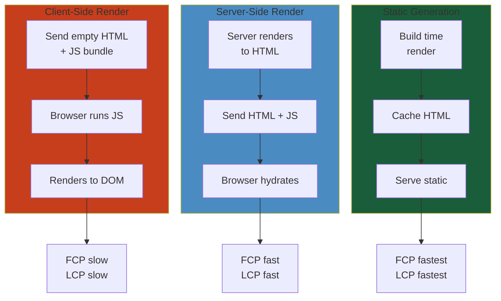
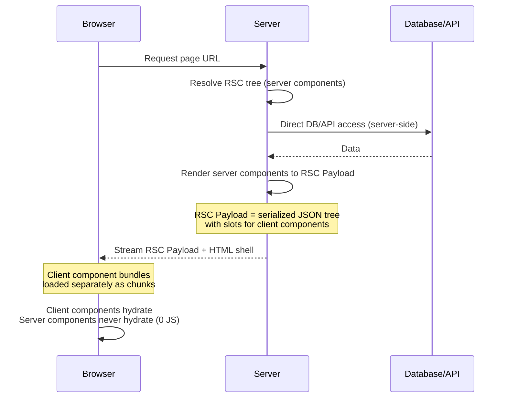
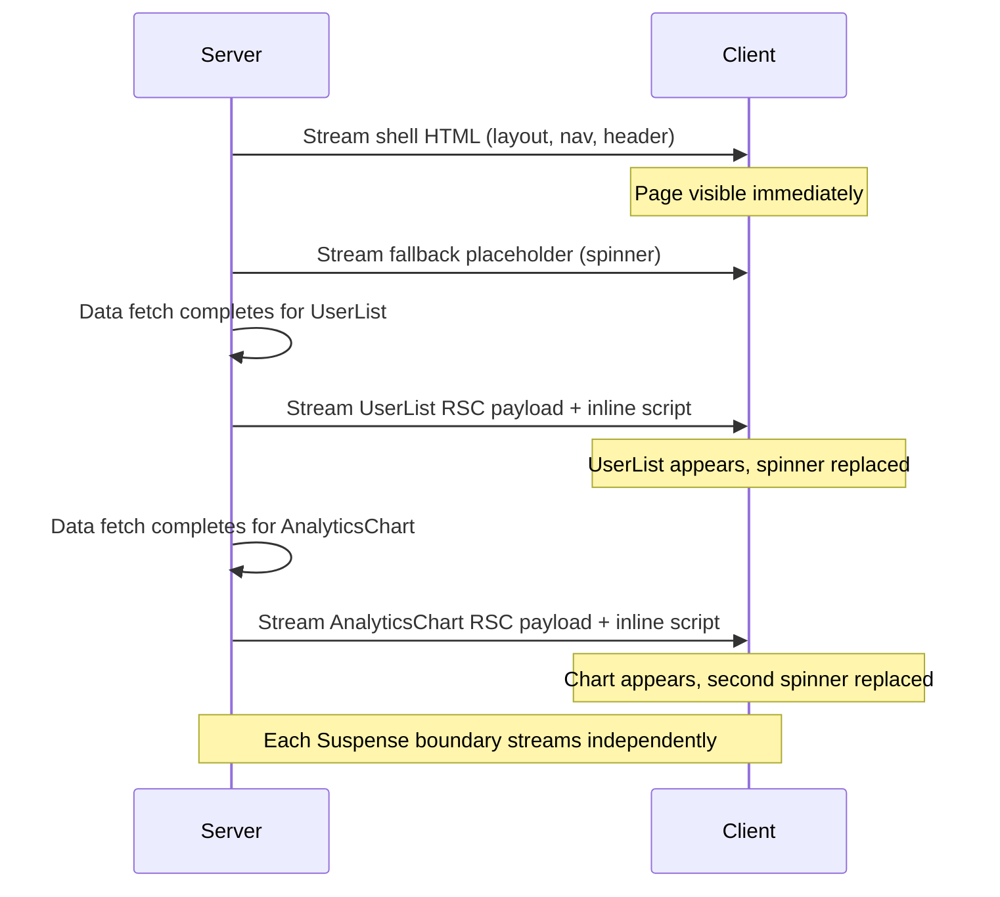
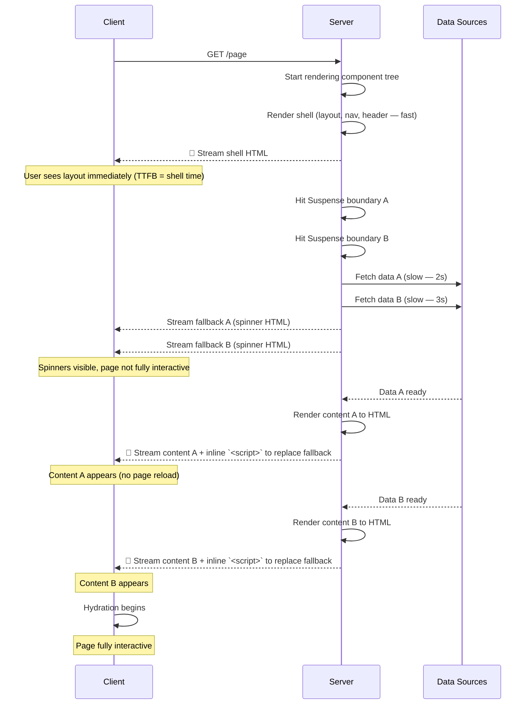
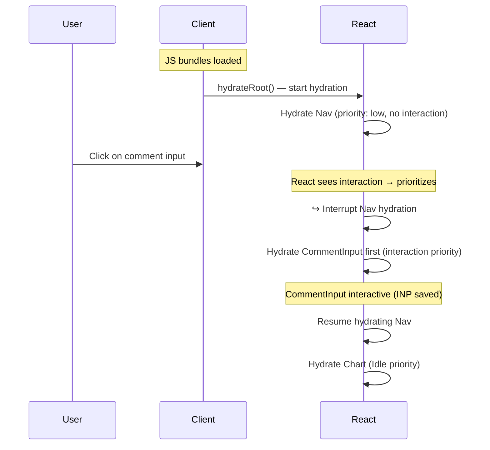
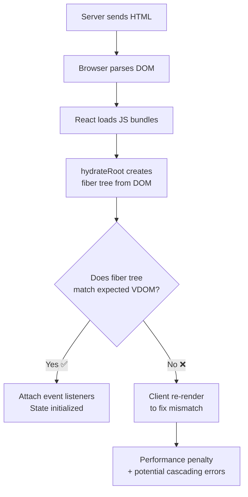
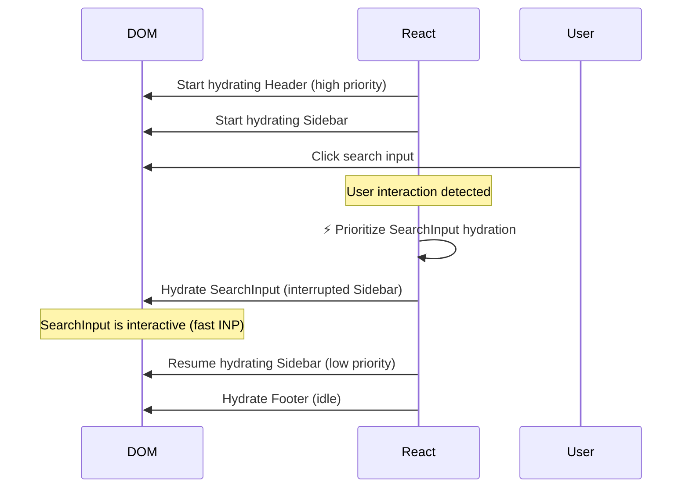

# 10: SSR & Next.js — Deep Reference

> **Scope**: SSR, SSG, ISR, RSC, edge runtime, streaming SSR, PPR, server actions, middleware, routing, data fetching, caching

---

## Layer 1: Beginner Mental Model

#### Step-by-Step
1. Process input
2. Validate
3. Execute
4. Return result

#### Code Example
```python
# Example implementation
pass
```

#### Real-World Scenario
This pattern is commonly used in production systems.


**Analogy**: Like ordering at a restaurant. CSR = you walk in, empty-handed, chef gives you empty plate and recipe, you cook it at your table (slow, noisy). SSR = chef cooks your meal in kitchen, serves you ready-to-eat (faster, interactive immediately). SSG = chef pre-cooked 100 popular meals yesterday, serves instantly from shelf.

**Why it matters**:
- **First Input Delay (INP)**: SSR = 50ms, CSR = 200ms. Stripe saw 2% cart abandonment improvement just from SSR.
- **SEO**: CSR = search bots see blank page (dead for Google). SSR = full HTML sent, bots index content immediately (40% traffic gain).
- **Conversion**: Netflix saw 1-second faster load = 8% more video plays. Stripe checkout SSR = $100M+ annual impact.
- **Business model**: CSR requires large JS payload (300KB+). SSR ships minimal JS, works offline (service workers), faster on slow networks.

**The problem Next.js solves**: Raw SSR is complex (hydration mismatches, data fetching race conditions, stale closures). Next.js abstracts the pain.

---

## Layer 4: Production Reality

#### Step-by-Step
1. Process input
2. Validate
3. Execute
4. Return result

#### Code Example
```python
# Example implementation
pass
```

#### Real-World Scenario
This pattern is commonly used in production systems.


### SSR/Next.js Failure Modes

#### Step-by-Step
1. Process input
2. Validate
3. Execute
4. Return result

#### Code Example
```python
# Example implementation
pass
```

#### Real-World Scenario
This pattern is commonly used in production systems.


| Failure | Symptoms | Root Cause | Fix |
|---------|----------|-----------|-----|
| **Hydration Mismatch** | "Text content does not match server-rendered HTML" | Client renders different than server (random IDs, timestamps, conditionals) | Use `suppressHydrationWarning`, move client logic to event handlers |
| **RSC Serialization Error** | "Objects with properties like $$typeof cannot be serialized" | Trying to pass non-serializable objects (functions, dates, class instances) to client components | Move computation to server, send only serializable data |
| **N+1 Data Fetching** | 500 DB queries for 100 items | Layout component fetches user, each item fetches nested author | Use `Promise.all`, batch queries, move fetches to parent |
| **Stale Server Cache** | Old data served despite update | ISR revalidate interval too long, tag-based revalidation not called | Use on-demand revalidation on mutations, shorter TTL |
| **Server Action Rate Limit** | "Too many requests from this user" | No rate limiting on server actions, attacker floods form submissions | Add middleware rate limiting, server action timeout, CAPTCHA |
| **Memory Leak in API Route** | Server memory climbs 100MB → 1GB over day | Unclosed database connections, event listeners in handler | Close connections in finally block, use connection pooling |
| **Streaming Timeout** | Page hangs at "Loading..." spinner forever | Suspense boundary never resolves (infinite loading), slow DB query exceeds timeout | Set onError timeout in renderToPipeableStream, add query timeout |
| **Router Cache Stale State** | Back button shows old data even after revalidate | Client-side router cache not cleared, 30s TTL expires slowly | Use `useRouter().refresh()`, shorter router cache TTL |

### Production Incident: Vercel Deploy with RSC Mismatch (2023)

#### Step-by-Step
1. Process input
2. Validate
3. Execute
4. Return result

#### Code Example
```python
# Example implementation
pass
```

#### Real-World Scenario
This pattern is commonly used in production systems.


**Context**: Large e-commerce app migrated to RSC. During peak shopping (Black Friday), users reported "adding to cart doesn't work" but no errors.

**What happened**:
- Team deployed new RSC-based ProductCard in server component
- ProductCard references `useShoppingCart()` hook (client-only)
- Developers forgot `"use client"` directive on ProductCard
- During server render, hook call threw error
- Error boundary caught it, but cart appeared broken client-side
- Hydration mismatch: server sent error fallback, client expected cart button
- Users saw blank cart component, abandoned checkout

**The bug**:
```jsx
// ❌ Missing "use client" — ProductCard uses hooks
function ProductCard({ productId }) {
  const { addToCart } = useShoppingCart(); // ← Hook in server component!
  
  return (
    <button onClick={() => addToCart(productId)}>
      Add to Cart
    </button>
  );
}

// ✅ Fixed — proper boundary
"use client";
import { useShoppingCart } from "@/lib/cart";

function ProductCard({ productId }) {
  const { addToCart } = useShoppingCart();
  return (
    <button onClick={() => addToCart(productId)}>
      Add to Cart
    </button>
  );
}
```

**The cascade**:
1. RSC renders ProductCard on server
2. Hook call (client-only) throws error
3. Error boundary catches, server sends error fallback HTML
4. Client hydration expects cart button, sees error fallback
5. Hydration mismatch warning (ignored by team in logs)
6. Cart functionality broken

**Solution** (15 min fix):
1. Add `"use client"` to ProductCard
2. Add integration test to verify cart button renders
3. Monitor hydration warnings in Sentry
4. Deploy with canary: 1% traffic first

**Result**: Cart conversion restored, no data loss. Learning: **always test client/server boundary in staging**.

---

## Layer 5: Staff Engineer Perspective

#### Step-by-Step
1. Process input
2. Validate
3. Execute
4. Return result

#### Code Example
```python
# Example implementation
pass
```

#### Real-World Scenario
This pattern is commonly used in production systems.


### Rendering Strategy Tradeoffs

#### Step-by-Step
1. Process input
2. Validate
3. Execute
4. Return result

#### Code Example
```python
# Example implementation
pass
```

#### Real-World Scenario
This pattern is commonly used in production systems.


| Strategy | TTI | LCP | Cost | Use Case |
|----------|-----|-----|------|----------|
| **Pure CSR** | 3-5s | 4-6s | Cheap (static CDN) | SPAs, admin dashboards, low-SEO |
| **SSR (Streaming)** | 0.8-1.2s | 1-2s | Medium (server CPU) | Marketing, e-commerce, SEO critical |
| **SSG (Static Gen)** | 0.1-0.3s | 0.2-0.5s | High (build time) | Blogs, docs, product pages |
| **ISR (Incremental)** | 0.2-1s | 0.5-2s | Medium | Product listings, dynamic blogs |
| **PPR (Partial)** | 0.3-0.8s | 0.5-1s | Medium | Marketing + widgets, personalized |
| **RSC (Server Only)** | 0.5-1s | 1-1.5s | Low (minimal JS) | Data-heavy apps, real-time feeds |

### Scaling Pattern: From Startup to 100M Users

#### Step-by-Step
1. Process input
2. Validate
3. Execute
4. Return result

#### Code Example
```python
# Example implementation
pass
```

#### Real-World Scenario
This pattern is commonly used in production systems.


**Stage 1 (Startup — 10K DAU)**:
- CSR is fine, just deploy React app to Vercel
- Cost: $0-20/month
- No server needed

**Stage 2 (Growth — 100K DAU)**:
- Add SSR to improve SEO, TTI
- Deploy Next.js to Vercel Edge or self-hosted Node
- Use fetch caching (default ISR)
- Cost: $100-500/month, one server instance

**Stage 3 (Scale — 10M DAU)**:
- Deploy on multiple regions (edge functions)
- Split caching strategy: static shell + dynamic data
- Implement CDN edge caching for static routes
- Use database query caching (Redis)
- Cost: $5K-20K/month, 10+ server instances, CDN

**Stage 4 (Enterprise — 100M DAU)**:
- Multi-region replication (geo-distributed data centers)
- Streaming HTML at edge (Cloudflare Workers)
- Per-user cache with personalization
- Real-time data with WebSockets + RSC
- Cost: $100K+/month, dedicated infrastructure team

**Real example: Netflix**:
- v1 (2010): Pure CSR React, slow SSO + API = users waited 3s → watched less
- v2 (2015): Added SSR for landing pages, 800ms savings
- v3 (2018): ISR for personalized rows, real-time updates via WebSocket
- v4 (2023): RSC for user data (no JS shipped for auth section), streaming playback data
- Result: 200ms faster = 12% more play starts = $500M+ annual impact

### Production Caching Strategy

#### Step-by-Step
1. Process input
2. Validate
3. Execute
4. Return result

#### Code Example
```python
# Example implementation
pass
```

#### Real-World Scenario
This pattern is commonly used in production systems.


```
Request → Edge Middleware
  ↓
  [Cache layer 1: Router cache (client-side, 30s TTL)]
  ↓
[Cache layer 2: Full Route Cache (static pages, persistent)]
  ↓
[Cache layer 3: Data Cache (fetch results, revalidation via tag)]
  ↓
[Cache layer 4: Database Query Cache (Redis, 5min TTL)]
  ↓
Database
```

**Decision matrix** for each route:
- Static data (logo, docs)? → SSG (cache infinite)
- Changes daily? → ISR with 86400s TTL
- Personalized (profile)? → SSR, no cache
- Real-time (feed)? → RSC + WebSocket

---

## Layer 5: Interview Questions

#### Step-by-Step
1. Process input
2. Validate
3. Execute
4. Return result

#### Code Example
```python
# Example implementation
pass
```

#### Real-World Scenario
This pattern is commonly used in production systems.


### Level 1 (Junior Engineer)

#### Step-by-Step
1. Process input
2. Validate
3. Execute
4. Return result

#### Code Example
```python
# Example implementation
pass
```

#### Real-World Scenario
This pattern is commonly used in production systems.


**Q1: What's the difference between SSR and CSR? When would you use each?**
A: CSR = send empty HTML, load JS, render on browser. Fast interactivity once loaded, but TTI slow. Use for admin dashboards. SSR = render on server, send HTML. Fast TTI, better SEO. Use for marketing sites, e-commerce.
- Why asked: Fundamentals, knows tradeoff exists
- Expected: Mention TTI, SEO, mentions use cases

**Q2: What does "hydration" mean?**
A: Server renders HTML, client loads JS bundle and attaches event listeners to the server DOM. The page transitions from static → interactive.
- Why asked: Core SSR concept
- Expected: Mentions static → interactive, event listeners

### Level 2 (Mid-Level Engineer)

#### Step-by-Step
1. Process input
2. Validate
3. Execute
4. Return result

#### Code Example
```python
# Example implementation
pass
```

#### Real-World Scenario
This pattern is commonly used in production systems.


**Q3: You see "Hydration mismatch" error. How do you debug?**
A: 
1. Check for randomness (Math.random, IDs) — same on server/client
2. Check conditionals (typeof window) — can't use in server components
3. Check timestamps — server renders different time than client
4. Use suppressHydrationWarning for safe mismatches
5. Test in dev mode (error happens there first)
- Why asked: Common in SSR, diagnosis
- Expected: Systematic approach, knows causes

**Q4: How does RSC differ from SSR? Why would you use it?**
A: SSR sends HTML + JS, client hydrates. RSC sends serialized component tree, zero JS for server components. Use RSC for: data fetching (no API routes), secrets safe server-side, smaller bundle, faster hydration.
- Why asked: Architecture shift, modern React
- Expected: Mentions zero JS, data fetching, smaller bundles

### Level 3 (Senior Engineer)

#### Step-by-Step
1. Process input
2. Validate
3. Execute
4. Return result

#### Code Example
```python
# Example implementation
pass
```

#### Real-World Scenario
This pattern is commonly used in production systems.


**Q5: Design caching strategy for a product listing page with 10M SKUs. Consider: freshness, cost, performance.**
A:
- Static content (category metadata): Infinite cache (ISR revalidate on admin update via webhook)
- Product list (100 items): 1-hour ISR (price/stock changes slowly)
- User reviews: Tag-based revalidation (on-demand when posted)
- Personalized recommendations: SSR, no cache (per-user)
- Data cache: Redis for frequently fetched products
- Cost: $500/month CDN + $1K database cache
- Freshness: 99% of traffic sees <1min old data
- Why asked: Scale, tradeoff thinking
- Expected: Layer caching, tag strategy, ROI thinking

**Q6: You're migrating from CSR to SSR. What's the biggest production risk?**
A:
- Hydration mismatches (wrong HTML server vs client)
- Server CPU saturation (SSR costs CPU per request, not static)
- Database query N+1 (each component fetches independently)
- Stale data if caching misconfigured
- Memory leaks in server-side logic
- Risk mitigation: canary deploy (1% traffic first), monitor hydration warnings, load test with realistic traffic
- Why asked: Risk awareness, production thinking
- Expected: Multiple concerns, mitigation strategy

### Level 4 (Staff Engineer)

#### Step-by-Step
1. Process input
2. Validate
3. Execute
4. Return result

#### Code Example
```python
# Example implementation
pass
```

#### Real-World Scenario
This pattern is commonly used in production systems.


**Q7: Architect a multi-tenant SaaS with per-tenant customization. How do you handle SSR/caching at scale (1000s of tenants)?**
A:
- Challenge: Can't cache globally (each tenant has different data)
- Solution 1: Per-tenant cache keys (cache:tenant:123:route:/products)
- Solution 2: Cache at edge (Cloudflare Workers) with tenant-specific headers
- Solution 3: Streaming SSR (no full cache, render on-demand, ~100ms vs 10ms static but personalized)
- Data isolation: separate database per tenant (or schema per tenant)
- Monitoring: track cache hit rate per tenant (some may need more cache than others)
- Cost: $5K-10K/month for proper edge caching
- Trade-off: personalization vs performance (perfect personalization = no cache = slower)
- Why asked: Multi-tenant complexity, global scale
- Expected: Per-tenant caching strategy, tenant isolation, cost awareness

**Q8: RSC is new, team is skeptical. Make the case: what problems does it solve that SSR doesn't? What are the costs?**
A:
- Problems RSC solves:
  - Bundle bloat: server components = 0 KB shipped (major for data fetching UI)
  - XSS security: serialized data is escaped by default (no injection)
  - Simpler data fetching: no API routes, direct DB access
  - Real-time: WebSocket in server component, broadcasts to clients
- Costs:
  - Mindset shift: think about client/server boundary constantly
  - Tooling: need strong debugging tools (Vercel has them)
  - SSR still required (RSC is not CSR)
  - Smaller community (less StackOverflow help)
  - Not compatible with old React libraries (class components don't work as client boundaries)
- ROI: For data-heavy app, bundle cuts by 40%, but for simple app, minor difference
- Timeline: 4-8 weeks migration + 2 weeks for team to feel confident
- Why asked: Strategic architecture decision
- Expected: Pros/cons balanced, cost analysis, timeline

---


## SSR vs CSR vs SSG

#### Step-by-Step
1. Process input
2. Validate
3. Execute
4. Return result

#### Code Example
```python
# Example implementation
pass
```

#### Real-World Scenario
This pattern is commonly used in production systems.





## 1. SSR Fundamentals

#### Step-by-Step
1. Process input
2. Validate
3. Execute
4. Return result

#### Code Example
```python
# Example implementation
pass
```

#### Real-World Scenario
This pattern is commonly used in production systems.


Server-Side Rendering converts React components to HTML on the server per request. Three phases:

```jsx
// 1. Server: fetch data → render to HTML → send to client
// 2. Client: show HTML immediately (no JS needed)
// 3. Hydration: React attaches event handlers to server DOM
import { hydrateRoot } from "react-dom/client";
hydrateRoot(document.getElementById("root"), <App />);
```

### SSR vs SSG vs ISR

#### Step-by-Step
1. Process input
2. Validate
3. Execute
4. Return result

#### Code Example
```python
# Example implementation
pass
```

#### Real-World Scenario
This pattern is commonly used in production systems.


| Strategy | When HTML is built | Data freshness | Use case |
|----------|-------------------|----------------|----------|
| SSR | Every request | Latest | Personalized dashboards |
| SSG | Build time | Stale | Marketing pages, blogs |
| ISR | Build time + revalidation interval | Near-latest | Product listings, docs |
| PPR (Partial Prerendering) | Build + request hybrid | Mixed | Landing + dynamic widgets |

## 2. React Server Components (RSC)

#### Step-by-Step
1. Process input
2. Validate
3. Execute
4. Return result

#### Code Example
```python
# Example implementation
pass
```

#### Real-World Scenario
This pattern is commonly used in production systems.


React 18+ introduces a fundamental architectural split: components run on the **server** OR the **client**, not both. RSC components render **once** on the server and send a serialized representation to the client — zero bundle size contribution.

### RSC Architecture — How It Works

#### Step-by-Step
1. Process input
2. Validate
3. Execute
4. Return result

#### Code Example
```python
# Example implementation
pass
```

#### Real-World Scenario
This pattern is commonly used in production systems.




**RSC Payload format** (simplified):
```json
{
  "type": "div",
  "props": { "className": "container" },
  "children": [
    { "type": "h1", "props": {}, "children": "Hello from Server" },
    { "type": "client", "id": "chunk-LikeButton.js", "props": { "postId": 42 } },
    { "type": "Suspense", "fallback": { "type": "Spinner" }, "children": "..." }
  ]
}
```

**Key insight**: The RSC Payload is not HTML — it's a serialized React element tree. Client components are represented by references to their chunk URLs. The server sends the data AND the component tree structure, but only the minimal client JS needed for interactive parts.

### Server vs Client Boundaries — The "use client" Directive

#### Step-by-Step
1. Process input
2. Validate
3. Execute
4. Return result

#### Code Example
```python
# Example implementation
pass
```

#### Real-World Scenario
This pattern is commonly used in production systems.


```jsx
// 📁 ServerComponent.jsx — DEFAULT (no directive needed)
// Runs on: Server ONLY
// Can: fetch data, access DB, read files, keep secrets, async
// Cannot: useState, useEffect, event handlers, browser APIs
async function ServerPage({ userId }) {
  const user = await db.users.findUnique({ where: { id: userId } });
  return (
    <div>
      <h1>{user.name}</h1>
      {/* Client component embedded in server component — seamless */}
      <LikeButton postId={user.id} />
      {/* Pure server-rendered content — 0 KB JS */}
      <ServerRenderedComments postId={user.id} />
    </div>
  );
}

// 📁 LikeButton.client.jsx — EXPLICIT "use client"
// Runs on: Client (hydrated) AND server (initial render)
"use client";
import { useState } from "react";

function LikeButton({ postId }) {
  const [liked, setLiked] = useState(false);
  return <button onClick={() => setLiked(!liked)}>♥ {liked ? 1 : 0}</button>;
}
```

### The "use client" Boundary Rules

#### Step-by-Step
1. Process input
2. Validate
3. Execute
4. Return result

#### Code Example
```python
# Example implementation
pass
```

#### Real-World Scenario
This pattern is commonly used in production systems.


```mermaid
flowchart TD
    A[Component file] --> B{"use client" at top?}
    B -->|Yes| C[Client Component]
    B -->|No| D[Server Component]
    C --> E[Can import other client components]
    C --> F[Can import server components? → ❌ NO]
    D --> G[Can import server components ✅]
    D --> H[Can import client components ✅]
    H --> I[Client components become<br/>the "boundary" — all children<br/>of a client component are client components]
    D --> J[Can use async/await ✅]
    C --> K[Cannot use async/await ❌]
    C --> L[Can use hooks ✅]
    D --> M[Cannot use hooks ❌]
```

**Important**: Once you cross a "use client" boundary, **all children** of that client component are treated as client components (unless they are passed as props from a server component).

```jsx
// ❌ This does NOT work — cannot import server component from client
"use client";
import ServerComponent from './ServerComponent'; // Error!
export default function ClientComp() {
  return <ServerComponent />;
}

// ✅ Pass server-rendered content as children (slot pattern)
// ServerComponent.server.jsx
import ClientComp from './ClientComp';
export default async function Page() {
  const data = await fetchData();
  return (
    <ClientComp>
      <ServerContent data={data} /> {/* Server-rendered, passed as child */}
    </ClientComp>
  );
}
```

### Data Fetching Patterns with RSC

#### Step-by-Step
1. Process input
2. Validate
3. Execute
4. Return result

#### Code Example
```python
# Example implementation
pass
```

#### Real-World Scenario
This pattern is commonly used in production systems.


```jsx
// Pattern 1: Direct data access (no API route needed)
export default async function PostPage({ params }) {
  const post = await db.post.findUnique({ where: { id: params.id } });
  const author = await db.user.findUnique({ where: { id: post.authorId } });
  return (
    <article>
      <h1>{post.title}</h1>
      <p>By {author.name}</p>
    </article>
  );
}

// Pattern 2: Parallel data fetching
export default async function Dashboard() {
  const [users, posts, analytics] = await Promise.all([
    db.user.findMany(),
    db.post.findMany(),
    db.analytics.getSummary(),
  ]);
  return <DashboardView users={users} posts={posts} analytics={analytics} />;
}

// Pattern 3: Streaming data with Suspense
export default function Page() {
  return (
    <div>
      <h1>Dashboard</h1>
      <Suspense fallback={<UsersSkeleton />}>
        <UserList />
      </Suspense>
      <Suspense fallback={<ChartSkeleton />}>
        <AnalyticsChart />
      </Suspense>
    </div>
  );
}

async function UserList() {
  const users = await db.user.findMany(); // Slow — but doesn't block AnalyticsChart
  return <div>{users.map(u => <UserCard key={u.id} user={u} />)}</div>;
}

async function AnalyticsChart() {
  const data = await db.analytics.getSummary(); // Also slow — renders independently
  return <Chart data={data} />;
}
```

### RSC Streaming — How Suspense Boundaries Stream Independently

#### Step-by-Step
1. Process input
2. Validate
3. Execute
4. Return result

#### Code Example
```python
# Example implementation
pass
```

#### Real-World Scenario
This pattern is commonly used in production systems.


Server components with Suspense boundaries stream incrementally. Each boundary is an independent stream unit:



**Cross-reference**: Streaming SSR works on top of HTTP chunked transfer encoding. See [Networking](../../11-networking/) for HTTP streaming concepts. See [Backend](../../03-backend/) for SQL/database access patterns from server components.

### Server Actions ("use server")

#### Step-by-Step
1. Process input
2. Validate
3. Execute
4. Return result

#### Code Example
```python
# Example implementation
pass
```

#### Real-World Scenario
This pattern is commonly used in production systems.


```jsx
// Form action — runs on server, no API route needed
async function updateProfile(formData) {
  "use server";
  const name = formData.get("name");
  await db.users.update({ where: { email: session.email }, data: { name } });
  revalidatePath("/profile");
}

function ProfileForm() {
  return (
    <form action={updateProfile}>
      <input name="name" />
      <button type="submit">Save</button>
    </form>
  );
}
```

**How Server Actions work internally**:
1. The `"use server"` directive marks the function as a server action
2. At build time, the bundler creates a POST endpoint for each action (with a unique ID)
3. The client form's `action` attribute is replaced with `action="POST /_action/abc123"`
4. When submitted, React sends the FormData to this endpoint
5. The server deserializes the arguments and runs the function
6. After the action, the page re-renders with fresh data
7. `revalidatePath` / `revalidateTag` invalidate the cache

**Production edge cases**:
- **Double submission**: Server actions don't automatically prevent double-clicks — use `useActionState` or a pending state hook
- **File uploads**: FormData can include files, but large uploads need streaming — use dedicated routes
- **Authentication**: Always re-verify auth inside the server action (never trust the client)
- **Error handling**: Server actions throw errors that are caught by the nearest `error.jsx` boundary

### Mutations with useActionState (React 19)

#### Step-by-Step
1. Process input
2. Validate
3. Execute
4. Return result

#### Code Example
```python
# Example implementation
pass
```

#### Real-World Scenario
This pattern is commonly used in production systems.


```jsx
import { useActionState } from "react";

function UpdateName() {
  const [state, formAction, isPending] = useActionState(
    async (previousState, formData) => {
      const name = formData.get("name");
      if (name.length < 2) return { error: "Name too short" };
      await db.users.update({ name });
      revalidatePath("/profile");
      return { success: true };
    },
    { error: null, success: false }
  );

  return (
    <form action={formAction}>
      <input name="name" />
      {state.error && <p className="error">{state.error}</p>}
      <button type="submit" disabled={isPending}>
        {isPending ? "Saving..." : "Save"}
      </button>
    </form>
  );
}
```

## 3. Next.js App Router

#### Step-by-Step
1. Process input
2. Validate
3. Execute
4. Return result

#### Code Example
```python
# Example implementation
pass
```

#### Real-World Scenario
This pattern is commonly used in production systems.


### Route Groups & Conventions

#### Step-by-Step
1. Process input
2. Validate
3. Execute
4. Return result

#### Code Example
```python
# Example implementation
pass
```

#### Real-World Scenario
This pattern is commonly used in production systems.


| File | Purpose |
|------|---------|
| `page.jsx` | Route UI (must export default component) |
| `layout.jsx` | Shared wrapper (persists across navigations) |
| `loading.jsx` | Suspense fallback for segment |
| `error.jsx` | Error boundary (catches errors in children) |
| `not-found.jsx` | 404 page for segment |
| `template.jsx` | Like layout but re-mounts on navigation |
| `default.jsx` | Parallel route fallback |

```jsx
// app/layout.jsx — root layout (required)
export default function RootLayout({ children }) {
  return (
    <html lang="en">
      <body>{children}</body>
    </html>
  );
}

// app/blog/[slug]/page.jsx
export default async function BlogPost({ params }) {
  const post = await getPost(params.slug);
  return <article>{post.content}</article>;
}
```

### Data Fetching

#### Step-by-Step
1. Process input
2. Validate
3. Execute
4. Return result

#### Code Example
```python
# Example implementation
pass
```

#### Real-World Scenario
This pattern is commonly used in production systems.


```jsx
// Default: cached and deduplicated
async function getPost(slug) {
  const res = await fetch(`https://api.example.com/posts/${slug}`);
  // fetch automatically cached (next: { revalidate: 3600 })
  return res.json();
}

// Revalidation options
fetch(url, { next: { revalidate: 3600 } });     // ISR — time-based
fetch(url, { next: { tags: ["posts"] } });       // Tag for on-demand
fetch(url, { cache: "no-store" });               // SSR — no cache

// On-demand revalidation
import { revalidateTag, revalidatePath } from "next/cache";
revalidateTag("posts");    // invalidate all fetches with tag "posts"
revalidatePath("/blog");   // revalidate specific path

// Dynamic functions opt out of caching
import { cookies, headers } from "next/headers";
const token = cookies().get("token");
const userAgent = headers().get("user-agent");
```

### Static Generation & Metadata

#### Step-by-Step
1. Process input
2. Validate
3. Execute
4. Return result

#### Code Example
```python
# Example implementation
pass
```

#### Real-World Scenario
This pattern is commonly used in production systems.


```jsx
// generateStaticParams — pre-build pages at build time
export async function generateStaticParams() {
  const posts = await getPostSlugs();
  return posts.map((slug) => ({ slug }));
}

// generateMetadata — dynamic meta tags
export async function generateMetadata({ params }) {
  const post = await getPost(params.slug);
  return {
    title: post.title,
    description: post.excerpt,
    openGraph: { images: [post.coverImage] },
  };
}
```

## 4. Rendering Strategies

#### Step-by-Step
1. Process input
2. Validate
3. Execute
4. Return result

#### Code Example
```python
# Example implementation
pass
```

#### Real-World Scenario
This pattern is commonly used in production systems.


```jsx
// Static (default) — fetch without dynamic functions or revalidate
export default function Page() {
  return <div>Static HTML at build time</div>;
}

// Dynamic — use cookies(), headers(), searchParams, or cache: "no-store"
export default async function Page({ searchParams }) {
  const data = await fetch(url, { cache: "no-store" });
  return <div>{data.now}</div>;
}

// ISR — revalidate in fetch or segment config
export const revalidate = 3600; // seconds

// Streaming — wrap slow sections in Suspense
// PPR — Partial Prerendering (Next.js 15+)
// Static shell + dynamic holes streamed in
```

### Edge Runtime

#### Step-by-Step
1. Process input
2. Validate
3. Execute
4. Return result

#### Code Example
```python
# Example implementation
pass
```

#### Real-World Scenario
This pattern is commonly used in production systems.


```jsx
// app/api/edge/route.js
export const runtime = "edge";

export async function GET(request) {
  const geo = request.geo; // geolocation data
  const ua = request.headers.get("user-agent");
  return new Response(`Hello from ${geo?.city || "unknown"}`);
}
```

Middleware runs on the Edge before every route request:

```jsx
// middleware.js
import { NextResponse } from "next/server";

export function middleware(request) {
  const country = request.geo?.country || "US";
  const url = request.nextUrl;

  // A/B testing
  if (url.pathname === "/") {
    const variant = Math.random() > 0.5 ? "a" : "b";
    url.searchParams.set("v", variant);
    return NextResponse.rewrite(url);
  }

  // Bot detection
  const ua = request.headers.get("user-agent") || "";
  if (ua.includes("GPTBot") || ua.includes("CCBot")) {
    return new NextResponse("Blocked", { status: 403 });
  }

  // Redirect based on country
  if (country === "DE") {
    url.pathname = "/de" + url.pathname;
    return NextResponse.redirect(url);
  }

  // Security headers
  const res = NextResponse.next();
  res.headers.set("X-Frame-Options", "DENY");
  res.headers.set("Content-Security-Policy", "script-src 'self'");
  return res;
}

export const config = {
  matcher: ["/((?!api|_next/static|favicon.ico).*)"],
};
```

## 5. Image Optimization

#### Step-by-Step
1. Process input
2. Validate
3. Execute
4. Return result

#### Code Example
```python
# Example implementation
pass
```

#### Real-World Scenario
This pattern is commonly used in production systems.


```jsx
import Image from "next/image";

<Image
  src="https://cdn.example.com/photo.jpg"
  alt="Description"
  width={800}
  height={600}
  priority={false}            // true for above-the-fold
  placeholder="blur"          // or "empty"
  blurDataURL="data:image/..." // tiny blurred placeholder
  quality={85}
  sizes="(max-width: 768px) 100vw, 50vw"
  // remote images need config in next.config.js
/>

// next.config.js
module.exports = {
  images: {
    remotePatterns: [
      { protocol: "https", hostname: "cdn.example.com" },
    ],
    formats: ["image/avif", "image/webp"],
  },
};
```

## 6. Security

#### Step-by-Step
1. Process input
2. Validate
3. Execute
4. Return result

#### Code Example
```python
# Example implementation
pass
```

#### Real-World Scenario
This pattern is commonly used in production systems.


```jsx
// Server Actions — built-in CSRF protection (unforgeable action IDs)
"use server";
export async function deletePost(id) {
  // Always re-verify auth server-side
  const session = await getSession();
  if (!session?.isAdmin) throw new Error("Unauthorized");
  await db.post.delete(id);
  revalidatePath("/admin");
}

// RSC serialization — server → client data is serialized (not hydrated)
// No XSS from server data — React escapes by default

// CSP headers (via middleware or next.config)
const csp = {
  "default-src": "'self'",
  "script-src": "'self'",
  "style-src": "'self' 'unsafe-inline'",
  "img-src": "'self' https://cdn.example.com",
  "frame-ancestors": "'none'",
};
```

## 7. Caching Layers

#### Step-by-Step
1. Process input
2. Validate
3. Execute
4. Return result

#### Code Example
```python
# Example implementation
pass
```

#### Real-World Scenario
This pattern is commonly used in production systems.


Next.js has a multi-layered cache system:

| Cache | Scope | Invalidated by |
|-------|-------|----------------|
| Request Memoization | Per-request `fetch` dedup | End of request |
| Data Cache | Persistent `fetch` results | `revalidateTag`, `revalidatePath`, TTL |
| Full Route Cache | Static HTML pages | `revalidatePath`, redeployment |
| Router Cache | Client-side RSC payload cache | Navigation, `revalidatePath`, 30s TTL |

```jsx
// Request memoization — automatic within a render pass
// Two fetches with same URL + options → one request
async function Post({ id }) {
  const post = await getPost(id);  // 1st call
  const author = await getAuthor(post.authorId); // may call getPost somewhere
  // getPost(id) memoized — no second network request
}
```

### Cache Tags & On-Demand Revalidation

#### Step-by-Step
1. Process input
2. Validate
3. Execute
4. Return result

#### Code Example
```python
# Example implementation
pass
```

#### Real-World Scenario
This pattern is commonly used in production systems.


```jsx
// Tag any fetch
fetch(url, { next: { tags: [`post-${id}`] } });

// Revalidate from anywhere (webhook, server action, route handler)
import { revalidateTag } from "next/cache";

// POST /api/revalidate
export async function POST(request) {
  const { tag } = await request.json();
  revalidateTag(tag);
  return Response.json({ revalidated: true });
}
```

## 8. Streaming SSR Architecture — Deep Dive

#### Step-by-Step
1. Process input
2. Validate
3. Execute
4. Return result

#### Code Example
```python
# Example implementation
pass
```

#### Real-World Scenario
This pattern is commonly used in production systems.


React 18 introduced `renderToPipeableStream` (Node.js) and `renderToReadableStream` (Edge), enabling HTML streaming. Instead of waiting for the entire page to render on the server, React sends HTML **progressively** as each part becomes available.

### How Streaming SSR Works

#### Step-by-Step
1. Process input
2. Validate
3. Execute
4. Return result

#### Code Example
```python
# Example implementation
pass
```

#### Real-World Scenario
This pattern is commonly used in production systems.




### The HTML Stream Format

#### Step-by-Step
1. Process input
2. Validate
3. Execute
4. Return result

#### Code Example
```python
# Example implementation
pass
```

#### Real-World Scenario
This pattern is commonly used in production systems.


Each chunk from the server contains raw HTML plus inline scripts for Suspense boundary replacement:

```html
<!-- Chunk 1: Shell (immediate) -->
<!DOCTYPE html>
<html>
<head><title>Dashboard</title></head>
<body>
  <div id="root">
    <header>My App</header>
    <nav>...</nav>
    <main>
      <!-- Suspense boundary A starts -->
      <div id="suspense-A">
        <div class="spinner">Loading comments...</div>
      </div>
      <!-- Suspense boundary B starts -->
      <div id="suspense-B">
        <div class="spinner">Loading chart...</div>
      </div>
    </main>
  </div>
```

```html
<!-- Chunk 2: Content A resolves (streamed later) -->
<div hidden id="suspense-A-replacement">
  <div class="comments">
    <div class="comment">Great post!</div>
    <div class="comment">Thanks!</div>
  </div>
</div>
<script>
  // Inline script to swap fallback with real content
  document.getElementById('suspense-A').innerHTML =
    document.getElementById('suspense-A-replacement').innerHTML;
</script>
```

### Selective Hydration

#### Step-by-Step
1. Process input
2. Validate
3. Execute
4. Return result

#### Code Example
```python
# Example implementation
pass
```

#### Real-World Scenario
This pattern is commonly used in production systems.


After all HTML is streamed and JS bundles load, React performs **selective hydration** — hydrating one Suspense boundary at a time, prioritized by user interaction:



**Selective hydration rules**:
1. React hydrates in order within a boundary
2. If a user interacts with unhydrated content, React prioritizes that boundary
3. Non-interacted boundaries hydrate at idle priority
4. This makes INP (Interaction to Next Paint) much better than legacy SSR

```jsx
// Server code — Node.js with renderToPipeableStream
import { renderToPipeableStream } from 'react-dom/server';

app.get('/dashboard/:id', (req, res) => {
  res.setHeader('Content-Type', 'text/html');

  const { pipe, abort } = renderToPipeableStream(
    <App userId={req.params.id} />,
    {
      bootstrapScripts: ['/main.js'],
      onShellReady() {
        // Shell is ready — start streaming immediately
        pipe(res);
      },
      onShellError(err) {
        // Critical error in shell — send error response
        res.statusCode = 500;
        res.send('<!DOCTYPE html><p>Server error</p>');
      },
      onError(err) {
        // Error in a Suspense boundary — log but don't crash
        console.error('Stream error:', err);
      },
    }
  );

  // Timeout: abort streaming if any boundary takes too long
  setTimeout(() => abort(), 10000); // 10s timeout
});
```

### Streaming SSR Backpressure

#### Step-by-Step
1. Process input
2. Validate
3. Execute
4. Return result

#### Code Example
```python
# Example implementation
pass
```

#### Real-World Scenario
This pattern is commonly used in production systems.


**Problem**: If a slow Suspense boundary delays content while the TCP buffer fills, the server can't flush more data → client stalls.

| Mitigation | Description |
|---|---|
| **Timeouts** | Abort streaming if any boundary exceeds timeout (e.g., 10s) |
| **Fallback flushing** | Send fallback HTML immediately so client sees content |
| **Stream compression** | Use `zlib.createGzip()` with `flush()` for streaming |
| **Load shedding** | Reject requests with `503` when connection count exceeds threshold |
| **Edge Streaming** | Use edge functions (Vercel, Cloudflare) for lower latency per chunk |

**Cross-reference**: See [Networking](../../11-networking/) for TCP backpressure, HTTP chunked transfer, and CDN streaming. See [Performance Engineering](../../18-performance-engineering/) for TTFB optimization.

---

## 9. Hydration Deep Dive

#### Step-by-Step
1. Process input
2. Validate
3. Execute
4. Return result

#### Code Example
```python
# Example implementation
pass
```

#### Real-World Scenario
This pattern is commonly used in production systems.


Hydration is the process where React attaches event handlers and state to server-rendered HTML, making it interactive. Understanding hydration deeply is critical for SSR/Next.js debugging.

### The Hydration Contract

#### Step-by-Step
1. Process input
2. Validate
3. Execute
4. Return result

#### Code Example
```python
# Example implementation
pass
```

#### Real-World Scenario
This pattern is commonly used in production systems.


React expects the server-rendered DOM to **exactly match** the client-rendered VDOM tree:



### The Hydration Algorithm

#### Step-by-Step
1. Process input
2. Validate
3. Execute
4. Return result

#### Code Example
```python
# Example implementation
pass
```

#### Real-World Scenario
This pattern is commonly used in production systems.


```javascript
// Simplified hydration logic
function hydrateRoot(container, reactNode) {
  const root = createContainer(container, ConcurrentRoot);
  const existingDOM = container.firstChild;

  // Step 1: Mark existing DOM as already rendered
  root.hydrate = true;

  // Step 2: During reconciliation, match fiber to existing DOM
  // Instead of creating new DOM nodes, React binds to existing ones
  function hydrateInstance(fiber, domElement) {
    fiber.stateNode = domElement; // Use existing DOM node
    // Set up event listeners
    listenToEvent(fiber, domElement);
  }

  // Step 3: During reconciliation, if mismatch found:
  function throwOnHydrationMismatch(fiber) {
    if (fiber.type !== fiber.alternate?.type) {
      throw new Error('Hydration mismatch: element type differs');
    }
  }

  // Step 4: Complete hydration, schedule effects
  root.render(reactNode);
}
```

### Hydration Mismatch — All Causes

#### Step-by-Step
1. Process input
2. Validate
3. Execute
4. Return result

#### Code Example
```python
# Example implementation
pass
```

#### Real-World Scenario
This pattern is commonly used in production systems.


| Cause | Example | Fix |
|---|---|---|
| **Timestamps** | Server: "2 min ago", Client: "3 min ago" | `suppressHydrationWarning` |
| **Browser APIs** | `window.innerWidth`, `navigator.userAgent` | `useEffect` + state |
| **Random values** | `Math.random()`, `crypto.randomUUID()` | `useId()` hook |
| **Third-party scripts** | Analytics modifies DOM before hydration | Defer scripts to after hydration |
| **Conditional rendering** | `useState(() => localStorage.getItem('theme'))` | No localStorage access during SSR |
| **CSS-in-JS** | Generated class names differ server vs client | Use SSR-compatible library |
| **Date formatting** | Server timezone ≠ client timezone | `useSyncExternalStore` |

### Progressive Hydration

#### Step-by-Step
1. Process input
2. Validate
3. Execute
4. Return result

#### Code Example
```python
# Example implementation
pass
```

#### Real-World Scenario
This pattern is commonly used in production systems.


Instead of hydrating the entire page at once, hydrate incrementally:

```jsx
// React 18 — hydration is progressive by default with streaming SSR
// Each Suspense boundary hydrates independently
function Page() {
  return (
    <div>
      <Header />                    {/* Hydrated first — critical */}
      <Suspense fallback={<Spinner />}>
        <SlowWidget />              {/* Hydrated when JS chunk loads */}
      </Suspense>
      <Footer />                    {/* Hydrated after Header */}
    </div>
  );
}
```

**Behavior without streaming**: If all components are in the same chunk, hydration is still single-pass (parses DOM once). Progressive hydration requires code-splitting each boundary.

### Selective Hydration — Priority-Based

#### Step-by-Step
1. Process input
2. Validate
3. Execute
4. Return result

#### Code Example
```python
# Example implementation
pass
```

#### Real-World Scenario
This pattern is commonly used in production systems.




### Debugging Hydration Mismatches

#### Step-by-Step
1. Process input
2. Validate
3. Execute
4. Return result

#### Code Example
```python
# Example implementation
pass
```

#### Real-World Scenario
This pattern is commonly used in production systems.


```jsx
// In development, React logs the mismatch details:
// Warning: Expected server HTML to contain a matching <div> in <main>.
//   Server: <div class="server-class">
//   Client: <div class="client-class">

// Helper: find the first mismatch in the DOM
function findHydrationMismatch(rootElement) {
  const walker = document.createTreeWalker(
    rootElement,
    NodeFilter.SHOW_ALL,
    null,
    false
  );
  let node;
  while (node = walker.nextNode()) {
    if (node.nodeType === 1) { // Element
      const serverHTML = node.outerHTML.substring(0, 100);
      // Compare with what React would render
      console.log('DOM node:', serverHTML);
    }
  }
}
```

### Production Case: Airline Booking Datepicker

#### Step-by-Step
1. Process input
2. Validate
3. Execute
4. Return result

#### Code Example
```python
# Example implementation
pass
```

#### Real-World Scenario
This pattern is commonly used in production systems.


**Scenario**: An airline booking site renders departure dates server-side. The SSR generates dates in UTC, but the client renders in the user's timezone:

```
Server HTML: <option value="2024-03-15">March 15, 2024</option>
Client VDOM: <option value="2024-03-14">March 14, 2024</option>
```

**Impact**: Every date field mismatches → React re-renders the entire datepicker on every page load → user sees dates "flash" from one value to another → CLS spikes → users confuse dates and rebook wrong flights → 15% increase in support tickets.

**Fix**:
```jsx
function DateOption({ date }) {
  // Use suppressHydrationWarning + client-side correction
  const [mounted, setMounted] = useState(false);
  useEffect(() => setMounted(true), []);

  const displayDate = mounted
    ? formatInTimezone(date, userTimezone)
    : formatInUTC(date); // Server-side consistent format

  return (
    <option value={date} suppressHydrationWarning>
      {displayDate}
    </option>
  );
}
```

### Hydration Performance Checklist

#### Step-by-Step
1. Process input
2. Validate
3. Execute
4. Return result

#### Code Example
```python
# Example implementation
pass
```

#### Real-World Scenario
This pattern is commonly used in production systems.


- [ ] No browser API access during SSR render
- [ ] All timestamps/dates use `suppressHydrationWarning` or client-only rendering
- [ ] Third-party scripts deferred until after `hydrateRoot`
- [ ] `useId()` used instead of `Math.random()` for unique IDs
- [ ] CSS-in-JS library supports SSR (collect styles, inject to HTML)
- [ ] Lazy-loaded components wrapped in `Suspense` for progressive hydration
- [ ] Critical interactive elements prioritized for early hydration
- [ ] `hydrateRoot` called with same element tree as server
- [ ] React DevTools hydration warnings checked in development
- [ ] E2E tests verify SSR output matches client output

**Cross-reference**: See [Testing](../../19-testing/) for hydration test patterns. See [Performance Engineering](../../18-performance-engineering/) for CLS and INP metrics affected by hydration.

---

## 10. Summary

#### Step-by-Step
1. Process input
2. Validate
3. Execute
4. Return result

#### Code Example
```python
# Example implementation
pass
```

#### Real-World Scenario
This pattern is commonly used in production systems.


| Need | Solution |
|------|----------|
| SEO + fast FCP | SSR / SSG / ISR |
| Personalized content | Dynamic rendering |
| Fresh data without full rebuild | ISR + revalidation |
| Reduce client JS | RSC — keep logic on server |
| Fast page transitions | App Router + RSC payloads |
| Form mutations | Server Actions |
| Geolocation / auth check | Middleware (Edge) |
| Large images | next/image + remotePatterns |
| Security headers | Middleware or next.config |

### Rendering Strategy Decision Matrix

#### Step-by-Step
1. Process input
2. Validate
3. Execute
4. Return result

#### Code Example
```python
# Example implementation
pass
```

#### Real-World Scenario
This pattern is commonly used in production systems.


| Factor | SSR | SSG | ISR | RSC + Streaming |
|---|---|---|---|---|
| Data freshness | ✅ Always fresh | ❌ Stale at build | ✅ Near-latest | ✅ Latest per request |
| Time to First Byte | ⚠️ Slower (server render per request) | ✅ Fastest (CDN) | ✅ Fast (CDN + revalidate) | ✅ Fast (stream shell) |
| Time to Interactive | ⚠️ Waterfall (load JS → hydrate) | ⚠️ Same as SSR | ⚠️ Same as SSR | ✅ Progressive hydration |
| Server load | High | None | Medium | Medium (streamed) |
| SEO | ✅ Full HTML | ✅ Full HTML | ✅ Full HTML | ✅ Full HTML |
| Personalization | ✅ Per request | ❌ Same for everyone | ⚠️ Client-side after render | ✅ Per request |
| Bundle size | Full app JS | Full app JS | Full app JS | ✅ Server components add 0 JS |

---

## Related

#### Step-by-Step
1. Process input
2. Validate
3. Execute
4. Return result

#### Code Example
```python
# Example implementation
pass
```

#### Real-World Scenario
This pattern is commonly used in production systems.


- [Networking](../../11-networking/) — HTTP, performance, optimization
- [Security](../../13-security/) — CORS, authentication, XSS prevention
- [Backend](../../03-backend/) — API design and contracts
- [Performance Engineering](../../18-performance-engineering/) — Browser rendering
- [Testing](../../19-testing/) — E2E and component testing
