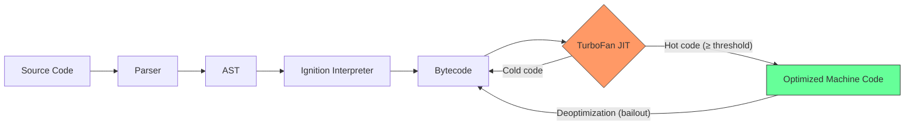
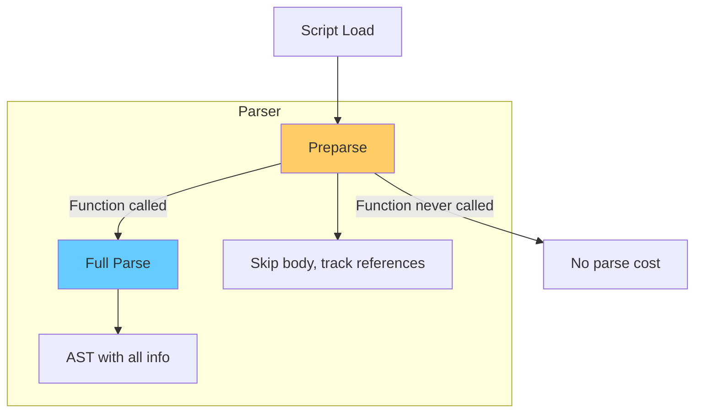
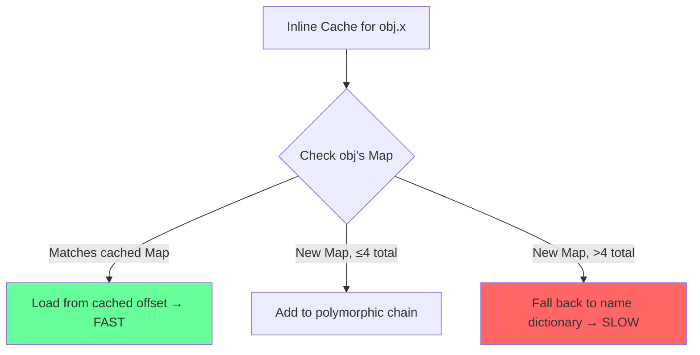
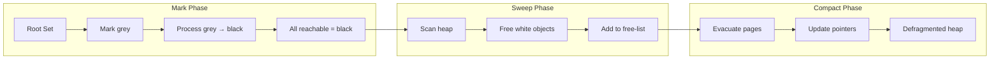

# JavaScript Engine (V8)

## Overview

V8 is Google's open-source JavaScript engine, written in C++, used in Chrome, Node.js, Deno, and Electron. React's runtime performance is fundamentally shaped by how V8 compiles and optimizes JavaScript code.

---

## V8 Compilation Pipeline

```
┌─────────────┐     ┌──────────────┐     ┌──────────────┐     ┌──────────────┐
│   Parser    │ ──▶ │   Ignition   │ ──▶ │  TurboFan    │ ──▶ │    CPU       │
│ (Scanner →  │     │ (Interpreter │     │ (JIT Compiler│     │  Executes    │
│  AST Builder)│     │  → Bytecode) │     │  → Optimized │     │  Machine     │
└─────────────┘     └──────────────┘     │  Machine Code)│     │  Code        │
                                         └──────────────┘     └──────────────┘
                                              │       ▲
                                              │       │ (Deoptimization
                                              ▼       │  on bailout)
                                         ┌──────────────┐
                                         │   Deopt      │
                                         │   Handler    │
                                         └──────────────┘
```



### Pipeline Stages

| Stage | Role | Notes |
|-------|------|-------|
| **Scanner** | Lexes source into tokens | Handles UTF-16, Unicode escapes |
| **Parser** | Builds AST | Preparser skips unused functions (lazy parsing) |
| **Ignition** | Interprets bytecode | Uses register-based VM, generates bytecode ~2× size of source |
| **TurboFan** | JIT compiles hot functions | Uses Sea of Nodes IR, type feedback from Ignition |

**Lazy Parsing**: V8 does not parse all functions eagerly. Functions are preparsed (skipped) until first invocation. This speeds up initial load but causes a parse-time penalty on first call.



---

## Hidden Classes (Maps)

V8 adds a **hidden class** (called `Map` internally, confusingly) to every JavaScript object. This is *not* `Map` from ES6.

### How It Works

```javascript
function Point(x, y) {
  this.x = x;  // → V8 creates Map0, adds property 'x' → Map1
  this.y = y;  // → V8 transitions to Map2, adds property 'y'
}

const p1 = new Point(1, 2);
const p2 = new Point(3, 4);  // Shares Map2 (same shape)
```

```
Map0 (empty) ──transition: x──▶ Map1 ──transition: y──▶ Map2
                                                           │
                                               ┌───────────┴───────────┐
                                               ▼                     ▼
                                           p1 {x, y}             p2 {x, y}
```

V8 stores property offsets directly in the hidden class. Property access becomes a pointer offset + load — as fast as a C struct field access.

### Deoptimization

```javascript
// BAD — creates new hidden class on every delete
function bad(obj) {
  delete obj.x;  // Forces transition to a new Map (no longer shared)
}

// BAD — different insertion order breaks shape
function inconsistent(a, b) {
  a.x = 1; a.y = 2;  // Map: x→y
  b.y = 2; b.x = 1;  // Map: y→x  ← different!
}
```

**Why `delete` is slow**: Deleting a property forces the object into "dictionary mode" (slow path). V8 can no longer use the hidden class to compute offsets. Property lookup falls back to hash table search.

### Fast vs Slow Properties

```
Fast Properties (in-object / properties store)
┌──────────┐   ┌──────────────────────┐
│  Hidden  │──▶│  Property Array      │
│  Class   │   │  [x, y, z]           │
│  (Map)   │   │  (FixedArray, dense) │
└──────────┘   └──────────────────────┘

Slow Properties (dictionary mode)
┌──────────┐   ┌──────────────────────┐
│  Hidden  │──▶│  Hash Table          │
│  Class   │   │  {x: val, y: val}    │
│ (null)   │   │  (slow, sparse)      │
└──────────┘   └──────────────────────┘
```

---

## Inline Caching (IC)

When V8 sees `obj.prop`, it remembers the hidden class of `obj` at that site and stores the property offset. Next time, it checks: "same hidden class? → use cached offset."

### IC States

| State | Meaning | Performance |
|-------|---------|-------------|
| **Monomorphic** | 1 hidden class at site | Fastest — direct offset load |
| **Polymorphic** | 2–4 hidden classes | Medium — linear check chain |
| **Megamorphic** | ≥5 hidden classes | Slow — hash table lookup |

```javascript
// MONOMORPHIC — always the same shape, fastest
function monomorphic(obj) { return obj.x + obj.y; }

const a = new Point(1, 2);
for (let i = 0; i < 10000; i++) {
  monomorphic(a);  // IC hits same Map every time
}

// POLYMORPHIC — 2–3 shapes, medium
function polymorphic(obj) { return obj.x + obj.y; }

polymorphic(new Point(1, 2));
polymorphic({ x: 3, y: 4, z: 5 });  // different shape
polymorphic(new Vector2(6, 7));      // different shape

// MEGAMORPHIC — ≥5 shapes, slowest
function megamorphic(obj) { return obj.x; }

[Shape1, Shape2, Shape3, Shape4, Shape5, Shape6].forEach(s => megamorphic(s));
```



### Performance Demonstration

```javascript
// Run with: node --allow-natives-syntax

function testMonomorphic() {
  const obj = { a: 1, b: 2, c: 3 };
  let sum = 0;
  for (let i = 0; i < 1e6; i++) {
    sum += obj.a + obj.b + obj.c;
  }
  return sum;
}

function testPolymorphic() {
  const objects = [
    { a: 1, b: 2, c: 3 },
    { a: 1, b: 2, c: 3, d: 4 },
    { a: 1, b: 2, c: 3, e: 5 },
  ];
  let sum = 0;
  for (let i = 0; i < 1e6; i++) {
    const obj = objects[i % 3];
    sum += obj.a + obj.b + obj.c;
  }
  return sum;
}

function testMegamorphic() {
  const objects = [
    { a: 1 }, { a: 1, b: 2 }, { a: 1, c: 3 }, { a: 1, d: 4 },
    { a: 1, e: 5 }, { a: 1, f: 6 }, { a: 1, g: 7 }, { a: 1, h: 8 },
  ];
  let sum = 0;
  for (let i = 0; i < 1e6; i++) {
    const obj = objects[i % 8];
    sum += obj.a;
  }
  return sum;
}

console.time('mono'); testMonomorphic(); console.timeEnd('mono');
console.time('poly'); testPolymorphic(); console.timeEnd('poly');
console.time('mega'); testMegamorphic(); console.timeEnd('mega');

// Typical output (Node 20):
// mono: 2.3ms
// poly: 4.1ms
// mega: 12.8ms
```

---

## Memory Management

### Heap Structure

```
┌──────────────────────────────────────────────────┐
│                   V8 Heap                         │
│                                                    │
│  ┌──────────────────────┐  ┌──────────────────┐  │
│  │   Young Generation   │  │  Old Generation  │  │
│  │   (< 8 MB × 2)       │  │  (rest of heap)   │  │
│  │                      │  │                   │  │
│  │  ┌──────┐ ┌──────┐  │  │  Old Pointer      │  │
│  │  │From  │ │  To  │  │  │  Old Data         │  │
│  │  │Space │ │ Space│  │  │  Large Object     │  │
│  │  └──────┘ └──────┘  │  │  Code             │  │
│  └──────────────────────┘  └──────────────────┘  │
└──────────────────────────────────────────────────┘
```

| Generation | Size | Collection Type | Frequency |
|------------|------|----------------|-----------|
| **Young (semi-space)** | ~8–16 MB each | Scavenge (minor GC) | Very frequent (~ms) |
| **Old** | Rest of heap | Mark-Sweep / Mark-Compact (major GC) | Infrequent (~s) |

### Young Generation — Scavenge (Cheney's Algorithm)

1. Allocate in **From-space**
2. When From-space is full → copy live objects to **To-space**
3. Objects surviving ≥2 collections → **promoted** to Old generation
4. Swap From/To roles

```
Before:                    After:
┌──────────┐              ┌──────────┐
│ From     │  live ──▶    │ From     │
│ [A][B][C]│              │ [empty]  │
│ [D][E]   │              │          │
└──────────┘   ┌─────────▶└──────────┘
┌──────────┐   │          ┌──────────┐
│ To       │───┘          │ To       │
│ [ ]      │   garbage    │ [A][C][E]│  ← live objects copied
└──────────┘              └──────────┘
```

### Old Generation — Mark-Sweep-Compact

1. **Mark**: Walk roots → mark reachable objects (tricolour algorithm: white/grey/black)
2. **Sweep**: Free unmarked objects, add to free-list
3. **Compact** (optional): Defragment surviving objects to reduce TLB misses



### Full GC Triggers

- Old generation exceeds dynamic (or `--max-old-space-size`) limit
- `malloc` failure for new memory pages
- `window.gc()` (with `--expose-gc`) or `performance.memory` pressure
- V8's memory reducer detects high allocation rate

---

## Garbage Collection: Orinoco

V8's **Orinoco** project moved GC from stop-the-world to parallel, concurrent, and incremental collection.

### Collection Strategies

| Strategy | When | Effect on Main Thread |
|----------|------|----------------------|
| **Stop-the-world** (old) | Full GC | Paused entirely (~100ms+) |
| **Incremental** | Major GC | Interleaved small pauses (~1ms) |
| **Concurrent** | Marking | Runs on helper threads (zero pause) |
| **Parallel** | Scavenge, compaction | Worker threads + main (short pause) |
| **Concurrent + Parallel** | Sweeping | No main thread involvement |

```mermaid
gantt
    title GC Strategies Timeline
    dateFormat  X
    axisFormat %d

    section Stop-the-World
    Main JS      :a1, 0, 30
    GC Pause     :crit, a2, 30, 60
    Main JS      :after a2, 60, 100

    section Orinoco (Concurrent)
    Main JS      :b1, 0, 100
    Mark (thread):crit, b2, 10, 80
    Sweep (thread):crit, b3, 50, 100
    Short pause  :b4, 80, 85
```



**Key insight for React**: Orinoco means V8 rarely pauses for >1ms during normal React rendering. But large collections of Fiber objects (React 16+) can still trigger major GC that causes jank.

---

## Optimizing for V8

### Do

```javascript
// ✅ Monomorphic: always same shape
function createUser(name, age) {
  return { name, age, role: 'user' };
}

// ✅ Stable constructor
class Vector {
  constructor(x, y) {
    this.x = x;
    this.y = y;
  }
}
// Always {x, y} in same order

// ✅ Initialize all properties in constructor
class Cache {
  constructor() {
    this.data = null;
    this.size = 0;
    this.hits = 0;
  }
}

// ✅ Use arrays consistently (no holes)
const arr = [1, 2, 3];       // ✅ HOLEY_SMI_ELEMENTS (fast)
// arr[10] = 5;              // ❌ Creates holes → becomes HOLEY_ELEMENTS (slow)
arr.push(4);                 // ✅ Stays packed
```

### Don't

```javascript
// ❌ Delete properties
const obj = { a: 1, b: 2, c: 3 };
delete obj.b;  // Dictionary mode — no hidden class

// ❌ Mix types in arrays
const mixed = [1, "two", {}]; // PACKED_SMI → PACKED → GENERAL

// ❌ Vary argument count wildly
function log(...args) { /* ... */ }
log('hello');
log('hello', 'world', '!', 'extra'); // Deoptimizes arguments handling

// ❌ Change [[Prototype]] after creation
const obj = {};
Object.setPrototypeOf(obj, SomeProto); // Deoptimizes
```

### Property Access Performance

```
                 Monomorphic     Polymorphic     Megamorphic
                 hidden class     (2-4 maps)      (≥5 maps)
                    (fast)                         (slow)

Load              ~1-2 cycles     ~4-8 cycles     ~20-50 cycles
Store              ~2-3 cycles     ~5-10 cycles    ~30-60 cycles
Keyed load [x]     ~2-3 cycles     ~3-5 cycles     ~10-20 cycles

(Relative — 1 cycle ≈ 0.25ns at 4GHz)
```

---

## React Patterns and V8

### Fiber Objects — Stable Shapes

React Fiber nodes are created with a fixed set of properties in a fixed order:

```javascript
// Simplified Fiber node
function FiberNode(tag, pendingProps, key, mode) {
  // Instance
  this.tag = tag;
  this.key = key;
  this.elementType = null;
  this.type = null;
  this.stateNode = null;

  // Fiber
  this.return = null;
  this.child = null;
  this.sibling = null;
  this.index = 0;
  this.ref = null;
  this.refCleanup = null;
  this.pendingProps = pendingProps;
  this.memoizedProps = null;
  this.updateQueue = null;
  this.memoizedState = null;
  this.dependencies = null;
  this.mode = mode;
  this.effects = null;
  this.flags = NoFlags;
  this.subtreeFlags = NoFlags;
  this.deletions = null;
  this.lanes = NoLanes;
  this.childLanes = NoLanes;
  this.alternate = null;
}
```

Every Fiber node has the **exact same hidden class** (same properties, same order). This is crucial because React may create thousands of these during render.

- V8's inline caches for `fiber.child`, `fiber.return` are **monomorphic** and extremely fast.
- Property stores in the constructor are all at known offsets — no dictionary lookup.

### Hooks Order — Predictable Property Access

React enforces **hooks must be called in the same order every render**. This isn't just a rule — it enables V8 optimization:

```javascript
// React hooks are stored as a linked list on the Fiber
function mountState(initialState) {
  const hook = {
    memoizedState: initialState,
    queue: null,
    next: null,
  };
  // ... append to fiber.memoizedState linked list
  return [dispatch, () => hook.memoizedState];
}
```

Because the hook structure is **always the same shape**:
- `hook.memoizedState` → monomorphic IC
- `hook.queue` → monomorphic IC
- Iterating the linked list → predictable access patterns → good branch prediction

### Virtual DOM Diffing and V8

```javascript
// React's reconciler (simplified)
function reconcileSingleElement(returnFiber, currentFirstChild, element) {
  let child = currentFirstChild;
  while (child !== null) {
    if (child.key === element.key && child.type === element.type) {
      // Child matched! Monomorphic access at every property:
      deleteRemainingChildren(returnFiber, child.sibling);
      const existing = useFiber(child, element.props);
      existing.return = returnFiber;
      return existing;
    }
    child = child.sibling;  // ← IC: always the same .sibling shape
  }
}
```

React's reconciler walks the Fiber tree accessing `.sibling`, `.child`, `.return`, `.type`, `.key`, `.props` on every node. All are **monomorphic** — V8 compiles these to register-offset loads.

### Performance Impact Table

| React Pattern | V8 Effect | Optimization Level |
|---------------|-----------|-------------------|
| Fiber objects (stable shape) | Monomorphic IC | ✅ Best |
| Hooks called in order | Stable hidden class | ✅ Best |
| Inline functions in render | New Function object each render | ⚠️ GC pressure |
| Spreading unknown props | Polymorphic shape | ⚠️ Medium |
| `Object.assign` on state | Creates new shapes | ⚠️ Medium |
| Dynamic key access `obj[key]` | Megamorphic if key varies | ❌ Worst |

---

## Measuring V8 Performance

```bash
# Trace optimization/deoptimization
node --trace-opt --trace-deopt app.js

# Trace IC states
node --trace-maps app.js

# Trace GC
node --trace-gc app.js

# Detailed GC logging
node --trace-gc-verbose app.js

# Print optimized code
node --print-opt-code app.js

# See hidden class transitions
node --allow-natives-syntax -e "
  const obj = { a: 1 };
  %DebugPrint(obj);
"
```

---

## Summary

| Concept | Takeaway for React |
|---------|-------------------|
| **Hidden classes** | Maintain stable object shapes (React Fiber is designed for this) |
| **Inline caching** | Monomorphic access is ~10× faster than megamorphic |
| **Memory** | Young gen is fast but small; avoid allocating in hot paths |
| **GC** | Orinoco reduces pauses but large object graphs still trigger major GC |
| **Optimization** | Stable shapes, no `delete`, packed arrays, monomorphic calls |
