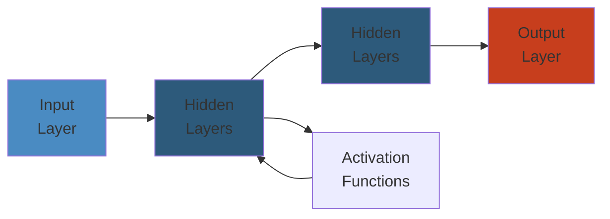

# 05 — Cloud Platforms

The knowledge base for designing, deploying, and operating infrastructure on public cloud providers. Covers AWS (deep), GCP, Azure, multi-cloud strategies, cloud-native design patterns, cost optimization, and migration approaches.

## Table of Contents

- [AWS](#aws)
  - [Compute](#compute)
  - [Storage](#storage)
  - [Networking](#networking)
  - [Databases](#databases)
  - [Security & Identity](#security--identity)
  - [Serverless](#serverless)
  - [Containers & Orchestration](#containers--orchestration)
  - [Analytics & Data](#analytics--data)
  - [Machine Learning](#machine-learning)
  - [Developer Tools](#developer-tools)
- [GCP](#gcp)
  - [Compute](#compute-1)
  - [Storage & Databases](#storage--databases)
  - [Networking](#networking-1)
  - [Big Data & AI](#big-data--ai)
  - [Security](#security)
- [Azure](#azure)
  - [Compute](#compute-2)
  - [Storage & Databases](#storage--databases-1)
  - [Networking](#networking-2)
  - [AI & Data](#ai--data)
- [Multi-Cloud & Hybrid](#multi-cloud--hybrid)
  - [Strategies](#strategies)
  - [Tools & Abstraction Layers](#tools--abstraction-layers)
  - [Data Portability](#data-portability)
- [Cloud-Native Design](#cloud-native-design)
  - [Design Principles](#design-principles)
  - [Architecture Patterns](#architecture-patterns)
  - [Well-Architected Frameworks](#well-architected-frameworks)
- [Cost Optimization](#cost-optimization)
  - [AWS Cost Management](#aws-cost-management)
  - [GCP Cost Management](#gcp-cost-management)
  - [Azure Cost Management](#azure-cost-management)
  - [FinOps Practices](#finops-practices)
- [Migration Patterns](#migration-patterns)
  - [Migration Strategies (6 Rs)](#migration-strategies-6-rs)
  - [Migration Phases](#migration-phases)
  - [Common Pitfalls](#common-pitfalls)
- [Learning Path](#learning-path)
- [Cross-References](#cross-references)

---

## AWS

Amazon Web Services dominates public cloud with the widest service catalog. Deep coverage of compute, storage, networking, databases, and AI.

### Compute

- **EC2** — virtual machines; instance families (general, compute, memory, GPU, storage optimized), purchase options (on-demand, reserved, spot, dedicated), placement groups, user data, instance metadata, Nitro hypervisor, ENA (Elastic Network Adapter), EBS optimization
- **Auto Scaling** — launch templates/tconfigurations, scaling policies (dynamic, scheduled, predictive), lifecycle hooks, warm pools, cooldown periods
- **EC2 Image Builder** — automated AMI creation, hardening, testing pipelines
- **Bare Metal** — i3.metal, m5.metal; no hypervisor, for licensing requirements
- **Spot Instances** — up to 90% discount, interruptions (2-min warning), spot fleet, capacity pools, spot block

### Storage

- **S3** — object storage; buckets, objects, prefix hierarchy, S3 Standard/IA/Glacier/Deep Archive, lifecycle policies, versioning, replication (SRR, CRR), event notifications, S3 Select, S3 Batch Operations, access points, object lambda, bucket policies, ACL, presigned URLs, S3 Transfer Acceleration
- **EBS** — block storage; gp2/gp3, io1/io2 Block Express, st1, sc1; snapshots, encryption, multi-attach, fast snapshot restore, data lifecycle manager
- **EFS** — managed NFS; performance modes, throughput modes, lifecycle management, EFS Replication, EFS Access Points
- **FSx** — managed file systems: FSx for Lustre (HPC), FSx for NetApp ONTAP, FSx for OpenZFS, FSx for Windows File Server

### Networking

- **VPC** — virtual private cloud; subnets (public/private), route tables, IGW, NAT gateway/gateway, VPC peering, transit gateway, VPC endpoints (gateway + interface), VPC flow logs, Network ACLs, security groups (stateful vs stateless)
- **Direct Connect** — dedicated network connection; virtual interfaces (private, public, transit), LAG, MACsec; DX gateway
- **Route 53** — DNS; hosted zones, record types (A, CNAME, ALIAS, MX, TXT, SRV), routing policies (simple, weighted, latency, geolocation, geoproximity, failover, multi-value), health checks, Route 53 Resolver
- **CloudFront** — CDN; distributions, origins, behaviors, edge functions (CloudFront Functions, Lambda@Edge), real-time logs, origin shield, field-level encryption, signed URLs/cookies
- **Elastic Load Balancing** — ALB (Layer 7), NLB (Layer 4, static IP), Gateway LB (transparent appliance); target groups, stickiness, health checks, TLS termination, SNI
- **Global Accelerator** — anycast IP, traffic optimization, failover; TCP/UDP, static IPs

### Databases

- **RDS** — managed relational: MySQL, PostgreSQL, MariaDB, Oracle, SQL Server, Db2; Multi-AZ, read replicas, automated backups, point-in-time recovery, RDS Proxy, Performance Insights, Enhanced Monitoring
- **Aurora** — cloud-native MySQL/PostgreSQL; storage auto-scaling (up to 128TB), Aurora replicas, Global Database, Aurora Serverless v2, parallel query, backtrack, zero-ETL integration
- **DynamoDB** — NoSQL key-value + document; tables, items, attributes, partition key + sort key, secondary indexes (LSI, GSI), DynamoDB Streams, DAX (caching), auto-scaling, on-demand vs provisioned, Time to Live (TTL), transactions, global tables (multi-region active-active)
- **ElastiCache** — managed Redis + Memcached; replication, sharding (cluster mode), backup/restore, auto-failover
- **DocumentDB** — MongoDB-compatible document database
- **Neptune** — graph database (property graph, RDF)
- **Timestream** — time-series database, auto-tiering (memory → magnetic)
- **Keyspaces** — managed Cassandra-compatible
- **Quantum Ledger DB** — immutable, cryptographically verifiable ledger
- **MemoryDB for Redis** — Redis-compatible, durable (multi-AZ), microsecond reads

### Security & Identity

- **IAM** — users, groups, roles, policies (managed, inline, resource-based); trust policies, permissions boundaries, service-linked roles, access analyzer, credential report
- **AWS Organizations** — multi-account management, SCPs (service control policies), OU structure, consolidated billing
- **KMS** — key management; symmetric/asy metric CMKs, automatic rotation, key policies, grants, HSM-backed (CloudHSM)
- **Secrets Manager** — rotate/manage secrets, automatic rotation, integration with RDS
- **Certificate Manager** — public/private TLS certificates, automatic renewal
- **CloudTrail** — API auditing; management + data events, organizational trails, insights
- **GuardDuty** — threat detection (intelligent), anomaly detection, malware scanning
- **WAF & Shield** — web application firewall, DDoS protection (Standard + Advanced)
- **Security Hub** — aggregated security findings, compliance standards (CIS, PCI, SOC2)
- **Config** — resource inventory, configuration history, compliance rules, conformance packs
- **Network Firewall** — managed firewall (stateful inspection, intrusion prevention)
- **Macie** — sensitive data discovery in S3 (PII, financial data)
- **RAM** — resource access manager (share resources across accounts)

### Serverless

- **Lambda** — function-as-a-service; event sources (S3, SQS, SNS, DynamoDB Streams, API Gateway, EventBridge, Kinesis), runtimes, layers, container packaging, snapstart (Java), provisioned concurrency, reserved concurrency, VPC networking, async invocation (DLQ), response streaming (2024)
- **API Gateway** — REST, HTTP, WebSocket APIs; stages, usage plans, API keys, caching, WAF integration, custom domains, mutual TLS, VPC link, request/response transformation
- **Step Functions** — state machines (standard + express); tasks, choices, parallels, maps, error handling, retry, callback patterns; integrations with 200+ services
- **EventBridge** — event bus; schema registry, Pipes (transform/filter/enrich), Scheduler (cron + rate), API destinations
- **SQS** — queue service; standard (at-least-once, best-effort ordering), FIFO (exactly-once, strict ordering); dead-letter queues, delay queues, visibility timeout, polling (short vs long polling)
- **SNS** — pub/sub; topics, subscriptions (SQS, Lambda, HTTP, Email, SMS, mobile push), message filtering, FIFO topics, message archiving
- **SES** — email sending, receiving, deliverability tracking

### Containers & Orchestration

- **ECS** — container orchestration; launch types (EC2, Fargate), task definitions, services, clusters, service auto-scaling, ECS Anywhere, capacity providers, service connect
- **EKS** — managed Kubernetes; control plane (HA, auto-updates), node groups (managed, self-managed, Fargate), cluster autoscaler, Karpenter, EKS add-ons, pod identity, IRSA (IAM roles for service accounts)
- **ECR** — container image registry; scanning, replication (cross-region, cross-account), lifecycle policies, pull-through cache
- **App Runner** — fully managed, source-code to container service; auto-scaling, TLS, custom domains (simpler but less control than ECS/EKS)
- **Copilot** — CLI for build/deploy/manage containers on ECS, App Runner, SNS, SQS, etc.

### Analytics & Data

- **EMR** — managed Hadoop/Spark; EMR on EC2, EMR on EKS, EMR Serverless, EMR Studio
- **Redshift** — data warehouse; RA3 nodes (managed storage), AQUA (advanced query acceleration), Spectrum (query S3), auto-wlm, materialized views, concurrency scaling, zero-ETL
- **Kinesis** — streaming; Data Streams (real-time ingestion), Data Firehose (delivery to S3/Redshift/Elastic), Data Analytics (SQL + Flink), Video Streams
- **Glue** — serverless ETL; Glue Crawlers (schema inference), Glue Studio (visual ETL), Glue DataBrew (data prep), Glue Jobs (Spark + Python shell), Glue Catalog, Glue Schema Registry, Glue Data Quality
- **Athena** — serverless SQL on S3; federated queries, engine version 3, ACID (Apache Iceberg), Athena notebooks, workgroups
- **MSK** — managed Kafka (Kafka Connect, Kafka Streams, MirrorMaker, Cruise Control)
- **DataZone** — data governance and cataloging
- **Lake Formation** — data lake permissions (table/column/row), cell-level security
- **QuickSight** — BI dashboards, SPICE engine, Q (natural language queries)
- **Managed Streaming for Kafka (MSK)** — fully managed Kafka, auto-scaling, IAM auth

### Machine Learning

- **SageMaker** — end-to-end ML: Studio (IDE), Canvas (no-code), Ground Truth (labeling), Autopilot (autoML), Notebooks, Training (distributed, managed spot), Hyperpod (distributed training infra), Model Registry, Inference (serverless, real-time, batch, multi-model endpoints), Clarify (bias, explainability), Feature Store, Pipelines, Projects (MLOps CI/CD)
- **Bedrock** — foundation model access: Anthropic (Claude 3/4), Llama, Mistral, Cohere, Stability AI, Amazon Titan; agents, guardrails, knowledge bases, evaluation, model customization (fine-tuning)
- **Rekognition** — image/video analysis, face detection, content moderation
- **Polly** — text-to-speech (neural, standard, generative)
- **Transcribe** — automatic speech recognition, custom vocabulary, language identification
- **Comprehend** — NLP (entities, sentiment, syntax, topic modeling, custom classification)
- **Lex** — conversational chatbots (voice + text), intent management, slots, Lambda integration
- **Personalize** — real-time recommendations, user segmentation
- **Forecast** — time-series forecasting, deepAR, Prophet integration
- **Textract** — document OCR (forms, tables, handwriting)

### Developer Tools

- **CodeCommit** — Git repositories (managed)
- **CodeBuild** — build service, continuous integration
- **CodeDeploy** — deployment automation (EC2, Lambda, ECS, on-premise)
- **CodePipeline** — CI/CD pipeline orchestration (source → build → deploy → test/approve)
- **CodeStar** — unified project dashboard (CodeCommit + CodeBuild + CodePipeline + CodeDeploy)
- **Cloud9** — browser-based IDE
- **CloudShell** — browser-based CLI
- **CDK** — infrastructure as code (TypeScript, Python, Java, C#, Go); constructs (L1/L2/L3), custom resources, cdk pipelines, cdk watch, cdk migrate
- **Amplify** — full-stack app (frontend + backend) framework; auth, storage, API, hosting, functions

---

## GCP

### Compute

- **Compute Engine** — VMs; machine families (general, compute, memory, accelerator), sole-tenant nodes, shielded VMs (UEFI, vTPM, Integrity Monitoring), confidential VMs, reservations, committed use discounts, preemptible/spot VMs
- **GKE** — Google Kubernetes Engine; standard + autopilot (managed node management), node auto-repair/upgrades, cluster autoscaler + node auto-provisioning, GKE Enterprise (multi-cluster, policy, security)
- **App Engine** — PaaS (standard + flexible); automatic scaling, traffic splitting, cron jobs
- **Cloud Functions** — FaaS (1st gen, 2nd gen based on Cloud Run); eventarc triggers
- **Cloud Run** — serverless container platform; autoscaling to zero, request-based, concurrency, min/max instances, VPC connectors, Cloud Run jobs (batch)
- **Batch** — managed batch processing (jobs, arrays, provisioning models)

### Storage & Databases

- **Cloud Storage** — object storage; buckets, storage classes (Standard, Nearline, Coldline, Archive), object lifecycle, versioning, retention policies, object holds, transfer service, Pub/Sub notifications
- **Persistent Disk** — block storage; zonal, regional (replicated), pd-standard, pd-balanced, pd-ssd, pd-extreme; snapshots, images
- **Filestore** — managed NFS; HDD/SSD tiers, capacity/performance scaling
- **Cloud SQL** — managed MySQL, PostgreSQL, SQL Server; read replicas, cross-region replication, Cloud SQL Proxy, IAM auth
- **Cloud Spanner** — globally distributed SQL; horizontal scaling, strong consistency, interleaved tables, secondary indexes, change streams
- **Bigtable** — wide-column NoSQL (HBase-compatible); low-latency, high-throughput, replication
- **Firestore** — document NoSQL; real-time listeners, offline support, multi-region (strong or eventual)
- **Memorystore** — managed Redis + Memcached; high availability, persistence, VPC-native
- **AlloyDB** — PostgreSQL-compatible (times faster than standard PG); columnar engine, adaptive indexing, cross-region replication
- **Datastream** — CDC (change data capture) from databases to BigQuery, Cloud Storage, etc.

### Networking

- **VPC** — global (routable across regions); subnet (regional), firewall rules (global), Cloud NAT, Private Google Access, VPC Network Peering, Shared VPC, VPC Service Controls
- **Cloud CDN** — content delivery; Cloud Storage + HTTP(S) LB backends, cache modes, signed URLs/cookies, IAM
- **Cloud Load Balancing** — global + regional; HTTP(S) (external), SSL Proxy, TCP Proxy, Network TCP/UDP, internal
- **Cloud DNS** — managed DNS; routing policies (geofencing, latency, weighted, failover)
- **Cloud Interconnect** — dedicated; VLAN attachments, partner interconnect, carrier peering
- **Cloud NAT** — managed NAT gateway, no single point of failure

### Big Data & AI

- **BigQuery** — serverless data warehouse; standard SQL, clustering/partitioning, BI Engine, MVS (materialized views), searching, columns (capacitor), streaming buffer, slot reservations, BigQuery Omni (multi-cloud), BigLake (lakehouse)
- **Dataflow** — stream + batch processing (Apache Beam runner); auto-scaling, exactly-once, ready for streaming
- **Dataproc** — managed Spark/Hadoop; clusters (single, standard), Dataproc on GKE (GDC), Dataproc Serverless (spark batch, pySpark)
- **Pub/Sub** — messaging + event ingestion; topics/subscriptions, push/pull, exactly-once (push), schema registry, retention, message ordering, dead letter queue
- **Data Fusion** — CDAP-based (GUI ETL/ELT), wrangler, pipelines, metadata
- **Vertex AI** — unified ML platform; model garden (foundation models), training (custom, automl, Vizier hyperparameter tuning), prediction (online, batch, private endpoints), Vertex AI Studio (agents, matching engine, feature store, model registry, experiments)
- **Looker** — business intelligence; LookML modeling, embedded analytics, Google Sheets + Looker Studio
- **Dataplex** — data governance; data lake/y management, metadata, quality, catalog (from data catalog), orchestration

### Security

- **IAM** — primitive (roles/basic) + predefined + custom; service accounts, role recommendations, condition-based access
- **Cloud KMS** — key management; symmetric + asymmetric, key rotation, Cloud HSM, external key manager (EKM)
- **Secret Manager** — store API keys, passwords, certificates; versioned, access logging, replication
- **Security Command Center** — threat detection, vulnerability findings, asset inventory, compliance
- **Cloud Armor** — DDoS + WAF; rules (preconfigured + custom rules in CEL), rate limiting, IP allow/deny
- **Binary Authorization** — enforce signed images, attestors; deploy-time policy checks for GKE, Cloud Run
- **Assured Workloads** — compliance (FedRAMP, HIPAA, CCPA, SOC)

---

## Azure

### Compute

- **Virtual Machines** — IaaS VMs (Windows, Linux); availability sets, availability zones, scale sets (VMSS), spot VMs, dedicated hosts, proximity placement groups
- **AKS** — Azure Kubernetes Service; managed control plane, node pools, Azure CNI (advanced), cluster autoscaler, KEDA, Azure Policy for Kubernetes, AKS Hybrid (Arc)
- **App Service** — PaaS web apps; auto-scaling, deployment slots, vnet integration, always on, hybrid connections
- **Azure Functions** — FaaS; consumption, premium, dedicated plans; triggers/ bindings (Event Grid, Service Bus, Cosmos DB, Blob, etc.), Durable Functions (stateful workflows)
- **Container Apps** — serverless containers; KEDA auto-scaling, revisions, ingress, Dapr integration, service-to-service
- **Batch** — managed HPC + batch; pool management (auto-scale), low-priority nodes, job/task scheduling

### Storage & Databases

- **Blob Storage** — object: Hot/Cool/Archive tiers, lifecycle, replication (LRS, ZRS, GRS, RA-GRS), Blob index, immutable storage
- **Azure Files** — SMB + NFS shares, managed (cloud/share), Azure File Sync (hybrid), private endpoints
- **Disk Storage** — managed disks: Ultra, Premium v2 & SSD, Standard HDD/SSD; snapshots, incremental, encryption
- **Azure SQL** — managed SQL Server (single, elastic pool, managed instance); hyperscale tier, SQL Serverless, geo-replication, Azure SQL DB + SQL MI
- **Cosmos DB** — globally distributed NoSQL; API for NoSQL, MongoDB, Cassandra, Gremlin, Table, PostgreSQL; multi-master replication, request units (RUs), consistency levels, analytical store
- **Azure Database for MySQL/PostgreSQL** — managed, flexible server, hyperscale (Citus), read replicas
- **Redis Cache** — managed Redis, enterprise tier (RediSearch, RedisBloom, RedisTimeSeries), Geo-replication, persistence

### Networking

- **Virtual Network** — VNet, subnets, peering, VNet injection, NAT gateway, service endpoints, private link
- **Azure DNS** — hosted DNS, private DNS zones (for VNets), alias records
- **Load Balancer** — Layer 4 (public + internal); basic (free) vs standard (HA); outbound rules
- **Application Gateway** — Layer 7 LB + WAF; URL-based routing, SSL termination, autoscaling (v2)
- **Traffic Manager** — DNS-based traffic routing: performance, failover, geographic, multi-value, subnet
- **Front Door** — global HTTP(S) LB + CDN + WAF; acceleration, rules engine, domain fronting
- **Azure Firewall** — stateful, cloud-native, rules across VNets/hubs (firewall manager)
- **VPN Gateway** — site-to-site, point-to-site (IKEv2, OpenVPN), active-active, VNet-to-VNet

### AI & Data

- **Azure Synapse** — unified analytics; dedicated SQL + serverless SQL pool, Spark pools, pipelines (built on ADF), Synapse Link (CDC to CosmosDB)
- **Azure Databricks** — Apache Spark-based analytics (collaborative), Delta Lake, MLflow
- **Azure Data Factory** — cloud ETL/ELT; integration runtime, data flows, copy activity, mapping data flows
- **Azure Stream Analytics** — real-time analytics (SQL-like queries on streams), event hubs, reference data
- **Azure OpenAI** — GPT-4o, GPT-4-turbo, DALL-E, Whisper; on your data, fine-tuning, content filtering
- **Azure Machine Learning** — ML platform; designer (drag and drop), automated ML, compute targets, pipelines, model registry, responsible AI (error analysis, fairness, interpretability)
- **Cognitive Services** — pre-built APIs (Vision, Speech, Language, Decision, Search); multi-service resource, containers, managed identity

---

## Multi-Cloud & Hybrid

### Strategies

- **Best of Breed** — use each provider's strongest service (e.g., BigQuery + S3 + Azure OpenAI)
- **Vendor Lock-In Avoidance** — use abstractions (Kubernetes, Terraform, standard SQL)
- **Disaster Recovery** — active-passive, active-active across clouds
- **Regulatory** — data residency requirements (sovereign clouds)
- **Edge Computing** — hybrid cloud extending to edge for low latency (AWS Outposts, GDC, Azure Stack)

### Tools & Abstraction Layers

- **Terraform / OpenTofu** — single HCL codebase across providers
- **Pulumi** — infrastructure as code in real languages (TypeScript, Python, Go, C#)
- **Crossplane** — Kubernetes-native multi-cloud control plane
- **Anthos** (GCP) — managed Kubernetes across cloud + on-prem
- **Azure Arc** — management plane for multi-cloud + on-prem (Kubernetes, servers, databases)
- **EKS Anywhere / ECS Anywhere** — run AWS orchestrators on-prem

### Data Portability

- **Flink / Kafka** — portable streaming across clouds
- **Spark / Trino / Presto** — query across clouds (federated)
- **MinIO** — S3-compatible object storage anywhere

---

## Cloud-Native Design

### Design Principles

- **Pay-as-you-go** — align cost with usage; serverless, stop paying for idle
- **Elasticity** — scale resources dynamically (auto-scaling, serverless)
- **Immutable Infrastructure** — never modify running resources; replace
- **Service-Oriented** — decompose into managed services (SQS, RDS, S3) instead of self-managing
- **Automation** — everything as code (infrastructure, config, security, operations)
- **Design for Failure** — assume every component fails; build redundancy, graceful degradation

### Architecture Patterns

- **Microservices** — independent, single-purpose services; API gateways, service discovery, event-driven communication
- **Event-Driven** — producers → event bus → consumers; loose coupling, async, scalable (SNS/SQS, EventBridge, Eventarc, Event Grid)
- **Saga** — distributed transaction via local transactions + compensating actions; choreography vs orchestration
- **Strangler Fig** — incrementally migrate legacy systems to cloud by routing traffic to new services
- **Backends for Frontends** — dedicated API layer per client (web, mobile, IoT)
- **Sidecar Pattern** — deploy helper processes (logging, proxy, monitoring) alongside app containers (service mesh)
- **Ambassador** — proxy-based communication to external services (API gateway pattern)
- **CQRS** — separate read and write models; foundation for event sourcing

### Well-Architected Frameworks

- **AWS Well-Architected** — Operational Excellence, Security, Reliability, Performance Efficiency, Cost Optimization, Sustainability
- **GCP Architecture Framework** — System Design, Security, Privacy & Compliance, Reliability, Cost Optimization, Performance Optimization, Operational Excellence, Data Governance
- **Azure Well-Architected** — Reliability, Security, Cost Optimization, Operational Excellence, Performance Efficiency

---

## Cost Optimization

### AWS Cost Management

- **Cost Explorer** — visualize spend, filter by service/region/tag; cost anomaly detection, RI/SP recommendations
- **Budgets** — budget alerts (cost, usage, RI utilization); SNS/email notifications
- **Reserved Instances** — 1/3-year terms; standard vs convertible; regional vs zonal; EC2, RDS, ElastiCache, Redshift, DynamoDB
- **Savings Plans** — compute (EC2 + Fargate + Lambda) or specific; flexible across instance families/regions
- **Spot Instances** — interruptible compute (90% off); diversify instance types; Spot Fleet
- **S3 Intelligent Tiering** — auto-tier objects between hot/cold; lifecycle policies
- **EBS Snapshots** — incremental, lifecycle policies for cleanup; delete orphaned EBS volumes
- **Trusted Advisor** — cost checks, idle resources, underutilized instances

### GCP Cost Management

- **Committed Use Discounts** — 1/3-year for predictable vCPU + memory; flexible/machine-specific
- **Sustained Use Discounts** — automatic 20-30% for running instances most of month
- **Preemptible + Spot VMs** — 60-91% discount, 24h max; ideal for batch/ML
- **Recommendations** — right-sizing, idle IPs, unattached disks
- **Budget Alerts** — budget thresholds, Pub/Sub notifications
- **Carbon Footprint** — per-project carbon reporting (unique to GCP)

### Azure Cost Management

- **Reserved Instances** — 1/3-year for VMs, SQL, Cosmos DB, App Service, etc.
- **Azure Hybrid Benefit** — use existing on-prem Windows Server/SQL Server licenses
- **Spot VMs** — 90% off, evictions with 30-second notice
- **Advisor Recommendations** — cost optimization, right-sizing
- **Budgets** — cost alerts, action groups

### FinOps Practices

- **Tagging Strategy** — cost center, environment, team, project, automation; enforce tags
- **Resource Isolation via Accounts** — separate dev/staging/prod; AWS Organizations / GCP projects / Azure subscriptions
- **Anomaly Alerts** — percent/spend based, root cause analysis (CloudHealth, Vantage, CloudZero)
- **Showback / Chargeback** — allocate cost back to teams/projects; transparency drives cost ownership
- **Optimization Cycle** — identify underutilized resources (right-sizing), delete orphaned, leverage spot/compute discounts
- **Tools** — Vantage, CloudHealth, CloudZero, AWS Cost Anomaly Detection, Granulate (AI optimization)

---

## Migration Patterns

### Migration Strategies (6 Rs)

| Strategy | Description | Tooling |
|----------|-------------|---------|
| **Rehost (Lift & Shift)** | Move as-is to cloud VMs | AWS SMS/MGN, Azure Migrate, GCP Migrate for Compute |
| **Replatform** | Move with minimal changes (DB to RDS, file to S3) | AWS DMS, Azure DMS |
| **Refactor/Rearchitect** | Rebuild for cloud-native (monolith to microservices) | App modernization with containers |
| **Repurchase** | Move to SaaS (CRM to Salesforce, CMS to WordPress) | SaaS migration |
| **Retire** | Decommission unused applications | Application portfolio assessment |
| **Retain** | Keep on-prem (compliance, latency, hard dependencies) | Hybrid connectivity |

### Migration Phases

1. **Assess** — discovery (inventory, dependencies, performance baselines); tools: AWS Application Discovery Service, Azure Migrate: Discovery & Assess, GCP Stratozone (formerly Magnet)
2. **Plan** — wave planning, migration batches, test strategy, cutover plan; use Migration Portfolio Assessment (MPA)
3. **Migrate** — execute waves, validate, re-test, cutover; automate with CloudEndure/MGN, DMS, DataSync
4. **Operate** — monitor, optimize, automate DR, security compliance; tools: CCoE (Cloud Center of Excellence) practices

### Common Pitfalls

- **Underestimating Network Latency** — test application latency over cloud; consider private connectivity (DX, Interconnect, ExpressRoute)
- **Cost Surprises** — data egress costs, NAT gateway costs, idle resources, storage retrieval fees
- **License Compliance** — SQL Server/Oracle licensing on cloud; bring-your-own-license vs license-included
- **Security Gaps** — unconfigured security groups (wide open), default VPCs, unencrypted storage, missing logging
- **Resilience Gaps** — single-AZ deployments (no HA), no backup testing, RTO/RPO not validated
- **Migration Without Optimization** — lift-and-shift avoids immediate refactoring, but leaves money/in performance on table; plan 2nd phase to modernize

---

## Learning Path

1. **Stage 1** — Pick a primary cloud (recommended: AWS). Learn core services: compute (EC2), storage (S3), networking (VPC), identity (IAM)
2. **Stage 2** — Databases (RDS, DynamoDB), serverless (Lambda, API Gateway), containers (ECS/EKS), DNS (Route 53), CDN (CloudFront)
3. **Stage 3** — Infrastructure as Code (Terraform/CDK), CI/CD, security (KMS, WAF, Shield), auto-scaling, monitoring (CloudWatch)
4. **Stage 4** — Secondary cloud (GCP or Azure); understand similarities and differences; multi-cloud patterns
5. **Stage 5** — Cloud architecture (Well-Architected), cost optimization (FinOps), migration strategies, cloud-native design

---

## Cross-References

| Domain | Connection |
|--------|-----------|
| [01 — AI/ML](../01-ai-ml/) | GPU compute, SageMaker/Vertex/Bedrock, managed ML services, LLM inference on cloud |
| [02 — Data Engineering](../02-data-engineering/) | Object storage (S3/GCS/Blob), warehouses (Redshift/BigQuery/Synapse), data processing (EMR/Dataflow/Databricks) |
| [03 — Backend](../03-backend/) | Cloud compute for backend services, managed databases, load balancers, auto-scaling backend apps |
| [06 — DevOps](../06-devops/) | CI/CD with cloud tooling, IA C (CDK, CloudFormation, Deployment Manager), cloud-native DevOps |
| [07 — Kubernetes](../07-kubernetes/) | EKS/GKE/AKS — managed Kubernetes; cloud-native patterns, service mesh, GitOps on cloud K8s |
| [08 — Databases](../08-databases/) | Cloud-managed databases (RDS, Cloud SQL, Azure SQL), NoSQL (DynamoDB, Firestore, Cosmos DB) |
| [09 — Distributed Systems](../09-distributed-systems/) | Cloud-native distributed systems, global databases (Spanner, Cosmos), consensus at scale |
| [10 — Messaging](../10-messaging/) | SQS/SNS, EventBridge, Pub/Sub, Azure Service Bus — the messaging backbone on each cloud |
| [11 — Networking](../11-networking/) | VPC design, DNS (Route 53, Cloud DNS, Azure DNS), CDN (CloudFront, Cloud CDN, Azure Front Door), Elastic Load Balancing |
| [14 — SRE/Observability](../14-sre-observability/) | CloudWatch, Stackdriver/Cloud Monitoring, Azure Monitor; infrastructure monitoring, alerting on cloud |
