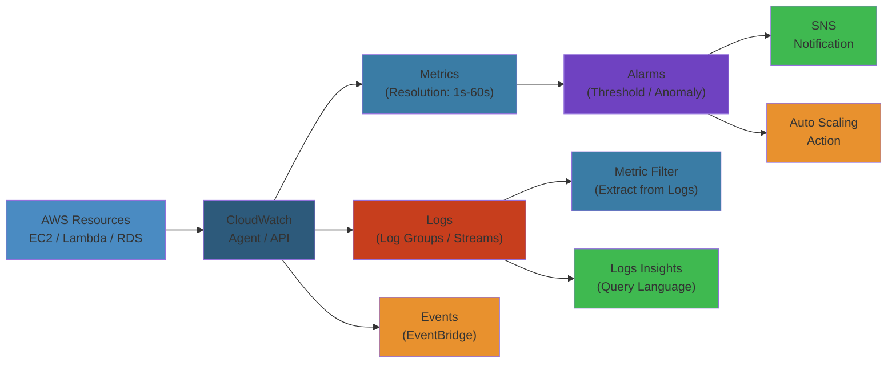

# 📊 Amazon CloudWatch — Complete Deep Dive

**Related**: [Lambda](../lambda/01-lambda-deep-dive.md) · [EC2](../ec2/01-ec2-deep-dive.md) · [RDS](../rds/01-rds-deep-dive.md) · [ECS](../ecs/01-ecs-deep-dive.md)

---




## Table of Contents


- [The Big Picture](#-the-big-picture)
- [1. Metrics](#1-metrics)
- [2. Namespaces](#2-namespaces)
- [3. Dimensions](#3-dimensions)
- [4. Alarms](#4-alarms)
- [5. Logs](#5-logs)
- [6. Log Groups](#6-log-groups)
- [7. Log Streams](#7-log-streams)
- [8. Metric Filters](#8-metric-filters)
- [9. Insights](#9-insights)
- [10. Dashboards](#10-dashboards)
- [11. Synthetics](#11-synthetics)
- [12. ServiceLens](#12-servicelens)
- [13. Contributor Insights](#13-contributor-insights)
- [Simplest Mental Model](#-simplest-mental-model)

---

## 🧭 The Big Picture


```text
                   ┌──────────────────────────────┐
                   │        Amazon CloudWatch      │
                   │  Monitoring & Observability    │
                   ├──────────────────────────────┤
                   │ Collect, access, and act on   │
                   │ data from AWS and on-prem     │
                   └──────────────┬───────────────┘
                                  │
        ┌─────────────────────────┼─────────────────────────┐
        ▼                         ▼                         ▼
┌──────────────┐         ┌──────────────┐         ┌──────────────┐
│   Metrics    │         │     Logs     │         │  Events      │
│ • Namespaces │         │ • Log groups │         │ • Alarms    │
│ • Dimensions │         │ • Log streams│         │ • Synthetics│
│ • Alarms     │         │ • Filters    │         │ • Service   │
│ • Dashboards │         │ • Insights   │         │   Lens      │
└──────────────┘         └──────────────┘         └──────────────┘
```

---

## 1. Metrics


### Metric Structure


```text
┌──────────────────────────────────────────────┐
│             CloudWatch Metric                 │
├──────────────────────────────────────────────┤
│  Namespace  : AWS/EC2                        │
│  Metric Name: CPUUtilization                 │
│  Value      : 45.2 (%)                       │
│  Timestamp  : 2025-01-15T10:30:00Z           │
│  Unit       : Percent                        │
│  Dimensions : [InstanceId=i-abc123]          │
└──────────────────────────────────────────────┘
```

### Common AWS Metrics


| Service | Key Metrics |
|---------|-------------|
| EC2 | CPUUtilization, NetworkIn/Out, DiskReadOps, StatusCheckFailed |
| Lambda | Invocations, Errors, Duration, Throttles, ConcurrentExecutions |
| RDS | CPUUtilization, DatabaseConnections, ReadIOPS, FreeStorageSpace |
| ALB | RequestCount, TargetResponseTime, HTTPCode_ELB_5XX, HealthyHostCount |
| S3 | BucketSizeBytes, NumberOfObjects, AllRequests, 4xxErrors |
| SQS | ApproximateNumberOfMessagesVisible, ApproximateAgeOfOldestMessage |
| DynamoDB | ConsumedReadCapacityUnits, ThrottledRequests, SystemErrors |

### Metric Resolution


| Resolution | Period | Retention | Cost |
|------------|--------|-----------|------|
| Standard (60s) | 1 min | 15 months | Included |
| High-Res (1s) | 1 second | 3 hours | Additional cost |
| High-Res (5s) | 5 seconds | 63 days | Additional cost |
| High-Res (1s)→1min aggregate | 1 min | 15 months | Included after aggregation |

### Putting Custom Metrics


```awscli
# Put custom metric (CLI)
aws cloudwatch put-metric-data \
  --namespace "MyApp" \
  --metric-name "OrderProcessingTime" \
  --value 245 \
  --unit Milliseconds \
  --dimensions "Environment=Production,Service=OrderService"

# Put custom metric with high-resolution
aws cloudwatch put-metric-data \
  --namespace "MyApp" \
  --metric-name "Latency" \
  --value 50.5 \
  --timestamp 2025-01-15T10:30:00.123Z \
  --storage-resolution 1
```

```python
# Put custom metric (Python SDK)
import boto3
import time

cloudwatch = boto3.client("cloudwatch")

while True:
    response_time = measure_api_latency()
    cloudwatch.put_metric_data(
        Namespace="MyApp",
        MetricData=[{
            "MetricName": "APILatency",
            "Value": response_time,
            "Unit": "Milliseconds",
            "Dimensions": [
                {"Name": "Environment", "Value": "production"},
                {"Name": "Endpoint", "Value": "/api/orders"}
            ],
            "Timestamp": time.time(),
            "StorageResolution": 1  # High-resolution
        }]
    )
    time.sleep(5)
```

### Metric Math


```text
Example: Calculate error rate from CloudWatch

ErrorRate = m1 / m2 * 100
  m1 = SUM(Errors)
  m2 = SUM(Invocations)

Result: Percentage of invocations that errored

Other common expressions:
  m1 - m2                     → Difference
  (m1 - m2) / m1 * 100       → % Change
  FILL(m1, 0)                → Fill missing data with 0
  METRICS("m1", "m2")        → Combine multiple metrics
  INSIGHT_RULE_METRIC("rule")→ Get metric from Contributor Insights
```

---

## 2. Namespaces


### Namespace Isolation


```text
┌──────────────────────────────────────────────┐
│           CloudWatch Namespaces               │
│                                                │
│  AWS/EC2        │  AWS/Lambda    │  AWS/S3    │
│  CPUUtilization │  Invocations   │  AllRequests│
│  NetworkIn      │  Duration      │  GetRequests│
│  DiskReadOps    │  Errors       │  PutRequests│
│                 │  ConcurrentEx  │             │
│                 │  Throttles     │             │
├─────────────────┼───────────────┼─────────────┤
│  MyApp          │  Custom/      │  AWS/ELB    │
│  API Latency    │  MyPipeline   │  RequestCount│
│  Order Rate     │  RecordCount  │  TLSTime    │
│  Error Count    │  Failures     │  TargetResp │
└─────────────────┴───────────────┴─────────────┘
```

### Custom Namespace Rules


| Rule | Detail |
|------|--------|
| Max namespaces | Unlimited |
| Naming | Alphanumeric + `/`, `.`, `_`, `-` |
| Reserved | Prefix `AWS/` is reserved for AWS services |
| Case-sensitive | Yes (`MyApp` ≠ `myapp`) |
| Per-account | Namespaces are per-region, per-account |

---

## 3. Dimensions


### Dimension Purpose


```text
Without Dimensions:
  Metric: CPUUtilization = 45% (all instances averaged)

With Dimensions:
  Metric: CPUUtilization
    Dimension: InstanceId=i-abc123  → 45%
    Dimension: InstanceId=i-def456  → 72%
    Dimension: InstanceId=i-ghi789  → 23%

Each instance tracked separately!
```

### Dimension Combinations


```text
AWS/Lambda metric "Errors":
  ┌──────────────────────────────────────────┐
  │ Dimension combinations:                  │
  │                                          │
  │ FunctionName (all versions)              │
  │ FunctionName + Version (specific)        │
  │ FunctionName + Resource (specific alias) │
  │ FunctionName + ExecutedVersion           │
  │                                          │
  │ Query: FUNCTION(Errors) + FILTER         │
  │   FunctionName="order-processor"         │
  │   Resource="prod"                        │
  └──────────────────────────────────────────┘
```

### Dimension Limits


| Limit | Value |
|-------|-------|
| Max dimensions per metric | 30 (recommend ≤10) |
| Dimension name length | 1-255 chars |
| Dimension value length | 1-255 chars |
| Unique dimension combinations | 10,000 per month (free tier) |

---

## 4. Alarms


### Alarm States


```text
Alarm States:

    ┌──────────────────┐
    │     OK           │  ← Metric within threshold
    └────────┬─────────┘
             │ Breach
             ▼
    ┌──────────────────┐
    │     ALARM        │  ← Metric exceeds threshold
    └────────┬─────────┘
             │ Recovery
             │ Update
             ▼
    ┌──────────────────┐
    │ INSUFFICIENT_DATA│  ← Not enough data points
    └──────────────────┘
```

### Alarm Configuration


```json
{
  "AlarmName": "HighCPU",
  "MetricName": "CPUUtilization",
  "Namespace": "AWS/EC2",
  "Statistic": "Average",
  "Period": 300,
  "EvaluationPeriods": 2,
  "DatapointsToAlarm": 2,
  "Threshold": 80.0,
  "ComparisonOperator": "GreaterThanThreshold",
  "TreatMissingData": "breaching",
  "AlarmActions": [
    "arn:aws:sns:us-east-1:123456789012:ops-team"
  ],
  "Dimensions": [
    { "Name": "InstanceId", "Value": "i-abc123" }
  ],
  "Unit": "Percent"
}
```

### Alarm Types


| Type | Description | Use Case |
|------|-------------|----------|
| Static threshold | Compare metric to fixed value | CPU > 80% |
| Anomaly detection | Machine learning band | Detect unusual patterns |
| Composite alarm | Combine multiple alarms | CPU high AND memory high |
| Missing data | Detect missing metrics | Instance stopped reporting |

### Alarm Actions


```text
Alarm State → Action:
┌──────────┐
│ ALARM    │──► SNS Topic → Email/SMS/PagerDuty
│          │──► Auto Scaling action
│          │──► EC2 action (stop/terminate/reboot/recover)
│          │──► Systems Manager action (runbook)
└──────────┘
┌──────────┐
│ OK       │──► SNS Topic → "All clear" notification
└──────────┘
┌──────────────────┐
│ INSUFFICIENT_DATA│──► SNS Topic → "Missing data"
└──────────────────┘
```

---

## 5. Logs


### Log Ingestion


```text
┌──────────────┐     ┌──────────────────┐     ┌──────────────┐
│ EC2 Instance  │────►│ CloudWatch Agent  │────►│ CloudWatch   │
│ /var/log/app  │     │ (put-log-events) │     │ Logs Service │
└──────────────┘     └──────────────────┘     └──────┬───────┘
                                                      │
┌──────────────┐     ┌──────────────────┐             │
│ Lambda       │────►│ Built-in logger  │─────────────┤
│ (stdout)     │     │ (awslogs driver) │             │
└──────────────┘     └──────────────────┘             │
                                                      │
┌──────────────┐     ┌──────────────────┐             │
│ ECS/Fargate  │────►│ awslogs driver   │─────────────┤
│ (container)  │     │ (logConfiguration)│            │
└──────────────┘     └──────────────────┘             │
                                                      │
                                                      ▼
                                               ┌──────────────┐
                                               │  S3 Export   │
                                               │  (via Export  │
                                               │   Task)       │
                                               └──────────────┘
```

### CloudWatch Agent Configuration


```json
{
  "agent": {
    "metrics_collection_interval": 60,
    "logfile": "/opt/aws/amazon-cloudwatch-agent/logs/cw-agent.log"
  },
  "logs": {
    "logs_collected": {
      "files": {
        "collect_list": [
          {
            "file_path": "/var/log/application.log",
            "log_group_name": "/app/production/application",
            "log_stream_name": "{instance_id}",
            "timezone": "UTC",
            "retention_in_days": 30
          },
          {
            "file_path": "/var/log/nginx/access.log",
            "log_group_name": "/app/production/nginx-access",
            "log_stream_name": "{instance_id}-access",
            "timezone": "UTC",
            "retention_in_days": 14
          }
        ]
      }
    }
  }
}
```

---

## 6. Log Groups


### Log Group Structure


```text
┌──────────────────────────────────────────────┐
│          Log Groups                          │
│                                              │
│  /aws/lambda/order-processor                 │
│    ├── 2025/01/15/[$LATEST]abc123           │
│    ├── 2025/01/15/[$LATEST]def456           │
│    └── 2025/01/15/[$LATEST]ghi789           │
│                                              │
│  /aws/ecs/my-app/production                  │
│    ├── app/abc123 (stream per container)    │
│    ├── app/def456                            │
│    └── sidecar/abc123                        │
│                                              │
│  /app/production/application                 │
│    ├── i-abc123                              │
│    ├── i-def456                              │
│    └── i-ghi789                              │
└──────────────────────────────────────────────┘
```

### Log Group Settings


| Setting | Options |
|---------|---------|
| Retention | 1 day - 10 years, or Never Expire |
| Encryption | KMS (AWS managed or CMK) |
| Metric filters | Extract metrics from logs |
| Subscription | Real-time stream to Lambda, Kinesis, OpenSearch |
| Contributor Insights | Analyze top contributors |

### Retention Policies


```awscli
# Set retention policy
aws logs put-retention-policy \
  --log-group-name /aws/lambda/my-function \
  --retention-in-days 30

# List log groups with no retention
aws logs describe-log-groups \
  --query 'logGroups[?retentionInDays==null].[logGroupName]'
```

---

## 7. Log Streams


### Log Stream Patterns


```text
Common log stream patterns by source:

Lambda:
  {timestamp}/[$VERSION]{uuid}
  e.g., 2025/01/15/[$LATEST]a1b2c3d4

ECS (awslogs driver):
  {prefix}/{container-id}
  e.g., app/a1b2c3d4e5f6

EC2 (CloudWatch Agent):
  {instance-id}
  e.g., i-0a1b2c3d4e5f6

Custom:
  Any string (recommend meaningful hierarchy)
  e.g., service/region/instance/hostname
```

### Log Stream Flow


```text
Write to Log Stream:
        │
        ▼
┌───────────────────────┐
│ PutLogEvents API      │
│ • SequenceToken       │
│ • Log events (batch)  │
│ • Max 1MB per batch   │
│ • Max 10,000 events   │
└──────────┬────────────┘
           │
           ▼
┌───────────────────────┐
│ CloudWatch Logs       │
│ stores sequentially  │
│ Timestamp ordering   │
└───────────────────────┘
```

### Log Event Quota


| Limit | Value |
|-------|-------|
| Batch size | 1 MB (max) |
| Events per batch | 10,000 |
| Event size | 256 KB (max) |
| Throughput per stream | 5 req/s (default) |
| Retention after expiry | Immediately deleted |

---

## 8. Metric Filters


### Filter Pattern Syntax


```text
Extract metrics from log events with pattern matching.

Pattern: "ERROR" → Count occurrences of "ERROR"
Pattern: "Failed to process order [orderId=*]" → Extract orderId

Common patterns:
  "ERROR"                    → Simple keyword match
  "[ERROR, WARN]"           → Match any word in list
  "?ERROR ?CRITICAL"        → Match either term
  "orderId=*"               → Wildcard
  "{ $.status >= 400 }"     → JSON filter (JSON logs)
  "[date, time, level, msg]"→ Space-separated columns
```

### Creating a Metric Filter


```awscli
aws logs put-metric-filter \
  --log-group-name /app/production/application \
  --filter-name "ErrorCount" \
  --filter-pattern "ERROR" \
  --metric-transformations \
    metricName=AppErrorCount,metricNamespace=MyApp,metricValue=1
```

### JSON Metric Filter


```text
JSON log event:
{"level": "ERROR", "service": "order-service", "duration": 245, "status": 500}

Filter pattern: { $.level = "ERROR" && $.status >= 500 }
Creates metric: ErrorCount with value 1

Value extraction:
{ $.duration > 200 }
metricValue: $.duration  → Records the duration value as metric

Result: Two metrics from logs:
  • ErrorCount (count of errors)
  • AvgDuration (average of duration values from error logs)
```

---

## 9. Insights


### CloudWatch Logs Insights


```text
┌──────────────────────────────────────────────┐
│ CloudWatch Logs Insights Query Engine         │
│                                                │
│ Query log groups using SQL-like syntax         │
│ Constraints:                                  │
│ • Queries scan up to 50GB per request         │
│ • Time range: 1 min - 15 days (up to 30      │
│   with Data Protection enabled)               │
│ • Results: max 10,000 rows                    │
│ • Run time: max 15 minutes                    │
└──────────────────────────────────────────────┘
```

### Common Queries


```text
# Find top 10 IP addresses making requests
fields @timestamp, @message
| parse @message /(?<ip>\d+\.\d+\.\d+\.\d+) .*/
| stats count() by ip
| sort count desc
| limit 10

# Find ERROR logs in last hour
fields @timestamp, @message
| filter @message like /ERROR/
| sort @timestamp desc
| limit 20

# Find slow Lambda invocations (>5s)
filter @duration > 5000
| fields @requestId, @duration, @message
| sort @duration desc
| limit 50

# Calculate error rate by endpoint
fields @timestamp, @message
| parse @message /(?<method>\w+) (?<endpoint>\/\S+) (?<status>\d+)/
| filter status >= 500
| stats count() by endpoint
```

### Sample Query Output


```text
Query: Top 10 errors by endpoint
──────────────────────────────────────
endpoint                  count
──────────────────────────────────────
/api/orders/payment        1,245
/api/users/profile         892
/api/products/search       567
/api/inventory/sync        234
──────────────────────────────────────
```

### Query Performance Tips


| Tip | Why |
|-----|-----|
| Narrow time range | Less data scanned |
| Use `fields` first | Limit columns early |
| Filter early | Reduce data volume |
| Avoid `sort` on large datasets | Expensive operation |
| Use `parse` over `regexp` | Parse is faster |
| Limit results | 10000 max (use `limit`) |

---

## 10. Dashboards


### Dashboard Widget Types


```text
┌──────────────────────────────────────────────┐
│              CloudWatch Dashboard             │
│                                                │
│  ┌──────────────┐  ┌──────────────────────┐   │
│  │ Line Widget   │  │  Number Widget       │   │
│  │ CPU by AZ     │  │  Total Errors: 12    │   │
│  │ ┌──────────┐  │  │  Avg Latency: 45ms  │   │
│  │ │  ╱╲      │  │  └──────────────────────┘   │
│  │ │ ╱  ╲ ╱╲  │  │                           │
│  │ │╱    ╲╱  ╲│  │  ┌──────────────────────┐   │
│  │ └──────────┘  │  │  Table Widget         │   │
│  └──────────────┘  │  │  Service │ Errors   │   │
│                     │  │ ─────── │ ─────    │   │
│  ┌──────────────┐  │  │ Order   │ 5        │   │
│  │ Stacked Area  │  │  │ Payment │ 12       │   │
│  │ Memory Usage  │  │  └──────────────────────┘   │
│  └──────────────┘  │                           │
└──────────────────────────────────────────────────┘
```

### Dashboard Example


```json
{
  "widgets": [
    {
      "type": "metric",
      "x": 0, "y": 0, "width": 12, "height": 6,
      "properties": {
        "metrics": [
          [ "AWS/EC2", "CPUUtilization", { "stat": "Average" } ]
        ],
        "period": 300,
        "stat": "Average",
        "region": "us-east-1",
        "title": "EC2 CPU Utilization (Average)"
      }
    },
    {
      "type": "log",
      "x": 12, "y": 0, "width": 12, "height": 6,
      "properties": {
        "query": "SOURCE '/aws/lambda/order-processor' | fields @timestamp, @message | filter @message like /ERROR/ | sort @timestamp desc | limit 10",
        "region": "us-east-1",
        "title": "Lambda Errors (Last 10)"
      }
    },
    {
      "type": "text",
      "x": 0, "y": 6, "width": 24, "height": 2,
      "properties": {
        "markdown": "# 🟢 Production Dashboard\nAuto-refresh: 60s\nLast updated: ${time}"
      }
    }
  ]
}
```

### Dashboard Best Practices


| Practice | Why |
|----------|-----|
| Group by service | Focused troubleshooting |
| Include both metrics + logs | Correlation |
| Set appropriate time range | Context (1h, 24h, 1w) |
| Use alarms in dashboard | Quick action |
| Use account-level dashboards | Cross-account visibility |
| Add text annotations | Context for viewers |

---

## 11. Synthetics


### Canary Types


```text
┌──────────────────────────────────────────────┐
│ CloudWatch Synthetics Canaries                │
│                                                │
│  Types:                                       │
│  • Heartbeat Monitor — check endpoint is up   │
│  • API Canary — test API responses/status     │
│  • Visual Canary — take screenshots           │
│  • UI Canary — record and replay browser steps │
│                                                │
│  Schedule: Every 1, 5, 10, 15, 30, or 60 min │
│  Alias: "Automated user checking your app"    │
└────────────────────────────────────────────────┘
```

### Canary Configuration


```javascript
// heartbeat-canary.js
const { URL } = require("url");
const https = require("https");

exports.handler = async () => {
    const response = await new Promise((resolve, reject) => {
        https.get("https://api.myapp.com/health", (res) => {
            let data = "";
            res.on("data", (chunk) => data += chunk);
            res.on("end", () => resolve({
                statusCode: res.statusCode,
                body: data
            }));
        }).on("error", reject);
    });

    if (response.statusCode !== 200) {
        throw new Error(`Health check failed: ${response.statusCode}`);
    }

    return response;
};
```

### Canary Metrics


```text
CloudWatch Synthetics publishes metrics:

  ┌──────────────────────────────────┐
  │ SuccessPercent — % successful    │
  │ Duration — canary runtime (ms)   │
  │ FailureCount — total failures    │
  │ VisualMonitoring — screenshot    │
  │   match/mismatch                 │
  └──────────────────────────────────┘

Alarm: SuccessPercent < 100 for 2 consecutive runs
→ Trigger incident response
```

---

## 12. ServiceLens


### ServiceLens Architecture


```text
┌──────────────────────────────────────────────┐
│ ServiceLens — Unified service map             │
│                                                │
│  Combines:                                    │
│  • X-Ray traces (service graph)               │
│  • CloudWatch metrics                         │
│  • CloudWatch alarms                          │
│  • CloudWatch logs                            │
│                                                │
│  ┌──────────────────────────┐                 │
│  │      Service Map          │                 │
│  │                          │                 │
│  │  ┌──────┐    ┌──────┐   │                 │
│  │  │ API  │───►│Order │   │                 │
│  │  │ GW   │    │Svc   │   │                 │
│  │  └──────┘    └──┬───┘   │                 │
│  │                 │││     │                 │
│  │                 ▼▼▼     │                 │
│  │           ┌──────────┐  │                 │
│  │           │ DynamoDB │  │                 │
│  │           └──────────┘  │                 │
│  └──────────────────────────┘                 │
│                                                │
│  Each node: click → metrics + logs + traces   │
└────────────────────────────────────────────────┘
```

### ServiceLens Features


| Feature | Description |
|---------|-------------|
| Service Map | Visual topology of services and dependencies |
| Health indicators | Color-coded nodes (green/yellow/red) |
| Drill-down | Click node → detailed metrics, logs, traces |
| Trace correlation | See traces from X-Ray alongside metrics |
| Alarm integration | Active alarms shown on service nodes |

---

## 13. Contributor Insights


### Rule Example


```text
Contributor Insights = Analyze top contributors from log data

Rule: Identify top error-causing IPs
  ┌──────────────────────────────────────────┐
  │ Condition: @message like /ERROR/          │
  │ Unique key: $.clientIp (extracted from log)│
  │ Aggregation: count()                      │
  │                                            │
  │ Result:                                    │
  │   IP 203.0.113.5    → 1,245 errors        │
  │   IP 198.51.100.20  → 892 errors          │
  │   IP 192.0.2.100    → 567 errors          │
  └──────────────────────────────────────────┘
```

### Creating a Rule


```awscli
aws logs put-insight-rule \
  --rule-name "TopErrorIPs" \
  --rule-definition file://insight-rule.json
```

```json
{
  "AggregateOn": "Count",
  "Contribution": {
    "Keys": ["$.clientIp"],
    "Filters": [
      {
        "FilterPattern": "{ $.status >= 500 }",
        "MatchType": "ON_MATCH"
      }
    ]
  },
  "LogGroupNames": ["/app/production/application"]
}
```

### Use Cases


| Use Case | Rule | Output |
|----------|------|--------|
| Top errored endpoints | Filter: status>=500, Key: endpoint | /api/payment → 500 errors |
| Slowest database queries | Filter: duration>5000, Key: query, AggregateOn: Sum | SELECT * FROM orders → 30s total |
| Most active users | Filter: type=request, Key: userId | user_1234 → 10k requests |
| Top rejected IPs | Filter: status=403, Key: sourceIp | 10.0.0.5 → 2000 blocks |

---

## 🧠 Simplest Mental Model


```text
CLOUDWATCH      =  The central monitoring room for your
                   entire AWS infrastructure. Like a
                   building security + maintenance center.

METRICS         =  The gauges and dials on the wall.
                   CPU temperature, water pressure,
                   power usage (CPU, memory, latency).

NAMESPACES      =  Different control panels.
                   AWS/EC2 panel, AWS/Lambda panel,
                   MyApp custom panel.

DIMENSIONS      =  Labels on each gauge.
                   "Which server?" "Which environment?"
                   "Which microservice?"

ALARMS          =  Red lights + sirens that go off when
                   a gauge reading is dangerous.
                   "CPU > 80%" → alerts the operations team.

LOGS            =  The security cameras + audio recordings.
                   Every event recorded with timestamp.
                   Review what happened at 3:05 AM.

LOG GROUPS      =  Folders organizing camera feeds by
                   building floor (service).

LOG STREAMS     =  Individual camera feeds within a folder
                   (one per EC2 instance or Lambda execution).

METRIC FILTERS  =  Smart cameras that count how many times
                   people say "ERROR" and report the count.

INSIGHTS        =  A search system that lets you ask:
                   "Show me all errors in the last hour
                   grouped by endpoint, sorted by frequency."

DASHBOARDS      =  A custom wall display showing the most
                   important gauges, logs, and alerts
                   tailored for your team.

SYNTHETICS      =  A robot that clicks through your app
                   every 5 minutes and reports if anything
                   is broken. Like a test user.

SERVICELENS     =  A map of your entire building showing
                   which rooms (services) are connected and
                   which ones have alarms ringing.

CONTRIBUTOR     =  Who's talking the most on the radio?
INSIGHTS         Top 10 IPs by error count, top 5 endpoints
                 by request volume.
```

---

**Next**: [S3 Deep Dive](../s3/01-s3-deep-dive.md) — Object storage
