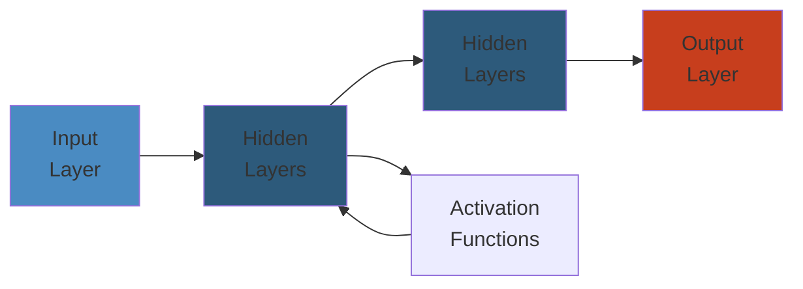

# 📊 CloudWatch Observability — Complete Deep Dive




## Table of Contents
- [CloudWatch Unified Agent](#cloudwatch-unified-agent)
- [Metrics: Resolution, Retention, High-Res, Math](#metrics-resolution-retention-high-res-math)
- [Anomaly Detection & Composite Alarms](#anomaly-detection--composite-alarms)
- [Log Groups, Streams & Metric Filters](#log-groups-streams--metric-filters)
- [Subscription Filters & Live Tail](#subscription-filters--live-tail)
- [Contributor Insights](#contributor-insights)
- [Container Insights & Lambda Insights](#container-insights--lambda-insights)
- [Synthetics (Canaries) & RUM](#synthetics-canaries--rum)
- [ServiceLens & Evidently](#servicelens--evidently)
- [Logs Insights](#logs-insights)
- [Alarms & Dashboards](#alarms--dashboards)
- [Metric Streams & OpenTelemetry](#metric-streams--opentelemetry)
- [Best Practices & Cost Optimization](#best-practices--cost-optimization)
- [Simplest Mental Model](#simplest-mental-model)

---

## CloudWatch Unified Agent

Single agent replacing old awslogs + monitoring scripts. One binary, one config file.

**Data sources**: collectd (CPU, memory, disk, net, swap), statsd (custom app metrics like latency, error rates), procstat (per-process CPU/memory/fds), logs (JSON, CSV, syslog, multi-line with timestamp parsing), X-Ray traces (daemon mode).

**Config**: `/opt/aws/amazon-cloudwatch-agent/etc/amazon-cloudwatch-agent.json`. Generate interactively with `amazon-cloudwatch-agent-config-wizard`. Windows + Linux support.

## Metrics: Resolution, Retention, High-Res, Math

```text
1 sec -> 3 hours (high-res) | 1 min -> 15 days (standard) | 5 min -> 63 days | 1 hour -> 455 days
```

**Standard**: 1-min granularity. Free for AWS services. **High-res**: `--storage-resolution 1` for custom metrics. Stored at 1-sec for 3h then aggregated. For real-time dashboards, SLOs.

**Metric math**: `SUM(m1,m2)`, `RATE(m1)`, `IF(m1>90,m1,0)`, `FILL(m1,0)`. Error rate: `SUM(errors)/SUM(total)*100`.

## Anomaly Detection & Composite Alarms

**Anomaly Detection**: ML band (mean +/- 2 sigma) around expected metric. 2-week training. Auto-adjusts for daily/weekly patterns. Outside band = anomaly. No manual threshold tuning. Works as alarm threshold.

**Composite Alarms**: Combine child alarms with AND/OR. `(CPUAlarm AND MemoryAlarm) OR DiskAlarm`. Reduces alert fatigue.

## Log Groups, Streams & Metric Filters

**Log Group**: Collection per source (`/aws/lambda/my-fn`). Sets retention, encryption, metric filters.
**Log Stream**: Sequence from one source instance (Lambda invocation, ECS container).

**Metric Filters**: Real-time log -> metric.

```text
Pattern: "ERROR" -> Namespace: MyApp, Metric: ErrorCount, Value: 1
JSON: { $.status = "error" } -> Metric: Errors, Dims: {service: $service}
```

$0.50/month per filter. Cheaper than custom metrics.

## Subscription Filters & Live Tail

**Subscription Filters**: Stream logs to Kinesis/Firehose/Lambda in real-time. For processing, analytics, alerting. Cross-account via destination policy.

**Live Tail**: `aws logs tail /aws/lambda/my-function --follow`. Real-time tail. Filter by include/exclude pattern. Watch multiple log groups.

## Contributor Insights

Top-N contributor analysis from log data. **Built-in rules**: VPC Flow Logs (top talkers by bytes), Route53 (top queried domains), API Gateway (top requesters). **Custom**: JSON field + aggregation + sort. Example: `$.userIdentity.arn` as contributor -> count -> top 10.

## Container Insights & Lambda Insights

**Container Insights**: CPU, memory, network, disk per ECS/EKS task/pod/node/cluster. ECS Fargate: enabled by default. ECS EC2: deploy agent as Daemon service. EKS: CloudWatch agent DaemonSet + fluentd log router. Pre-built dashboards for drill-down from cluster to container.

**Lambda Insights**: Per-invocation telemetry for cold starts, init duration, CPU, network I/O, disk I/O. Enable via Lambda extension layer (AWS managed, per-region). Visualizes cold vs warm start patterns. Helps right-size memory allocation.

## Synthetics (Canaries) & RUM

**Synthetics (Canaries)**: Scripted Node.js/Python tests.

```text
HeartbeatMonitor: GET /health -> 200 OK
APICanary: POST /api -> validate response body + timing < 500ms
VisualMonitoring: Screenshot + baseline comparison -> detect visual diffs
```

Schedule: rate(1 min+) or cron. Alarms on failure, duration, visual change.

**RUM (Real User Monitoring)**: Client-side JavaScript SDK. Core Web Vitals (LCP, FID, CLS), page load timing, JS errors, XHR/fetch performance. Real user sessions, no sampling.

## ServiceLens & Evidently

**ServiceLens**: Unified X-Ray + CloudWatch. Service map (ALB -> App -> RDS) with latency, error rate, CPU per node. Click node -> correlating traces + metrics.

**Evidently**: A/B testing + feature flags. Control/treatment variations. Traffic split + metrics analysis. Launch types: feature flag (on/off), A/B experiment (metric-driven), user override. Segment by attributes.

## Logs Insights

SQL-like query engine.

```sql
-- Top errors by hour
fields @timestamp, @message | filter @message like /ERROR/
| stats count() by bin(1h) | sort count desc | limit 10

-- P99 latency by endpoint
fields @duration | stats pct(@duration, 99) by @requestEndpoint

-- Parse JSON logs
parse @message '{ "latency": * }' as latency | stats avg(latency) by bin(5m)

-- Slowest requests
fields @timestamp, @requestId, @duration
| sort @duration desc | limit 20
| display @timestamp, @requestId, @duration
```

**Key functions**: `fields`, `filter`, `stats` (count/sum/avg/pct), `parse`, `sort`, `limit`, `display`, `bin`. 10 GB/query limit. 15-min timeout.

## Alarms & Dashboards

**Alarms**: OK/ALARM/INSUFFICIENT_DATA. Period 60-600s. N of M datapoints. Actions: SNS, Auto Scaling, SSM. Missing data: breaching/notBreaching/ignore. Use composite alarms to reduce noise.

**Dashboards**: Line, stacked, number, gauge, heatmap, log table. Export/import JSON. Permissions: `cloudwatch:GetDashboard`. Automate with CloudFormation/CDK.

## Metric Streams & OpenTelemetry

**Metric Streams**: Real-time to Kinesis Firehose. Destinations: OpenSearch, S3, Datadog, New Relic, Splunk, Lambda. Filter by namespace + metric. OTel JSON format. $0.003/1000 updates.

**OTel vs CW Agent**: OTel = CNCF standard, multi-exporter (AWS, Datadog, Prometheus), YAML pipelines. CW Agent = AWS-only, JSON. Use OTel for multi-cloud. CW Agent for AWS-only.

## Best Practices & Cost Optimization

**Log strategy**: Structured JSON logging. 30d retention dev, 90d prod. Archive older to S3.

**Metric strategy**: High-res only for SLOs. Metric math + anomaly detection over static thresholds. Metric filters cheaper than custom metrics for log-derived data.

**Alarm strategy**: Composite alarms to reduce noise. OK actions for resolution notification. Test in non-production.

| Optimization | Impact |
|----------|--------|
| Log retention: 1mo dev, 3mo prod, archive to S3 | Lower storage cost |
| 60s resolution unless high-res needed | Fewer data points |
| Aggregate custom metrics before sending | Fewer metric data points |
| Filter DEBUG log streams | Less ingestion cost |
| Composite alarms instead of individual | Fewer SNS notifications |
| Dashboard refresh 300s for steady state | Lower API cost |
| Metric streams instead of polling for 3rd party | Cheaper integration |

## Cross-Account Observability

**CloudWatch Cross-Account**: Central monitoring account views metrics/logs from many source accounts. Requires resource policies on source log groups/metrics. Use `aws:SourceAccount` condition. Accounts register with PutMetricData permissions.

**Setup**: Enable sharing in monitoring account. Configure source account resource policies. Monitoring account creates cross-account dashboards.

**Multi-account alarms**: Monitoring account sets alarms on source account metrics. SNS topic in monitoring account. Source account can't see monitoring account alarms.

**Telemetry API / Lambda Extensions**: Lambda extensions plugin telemetry data. `Telemetry API` receives info from Lambda runtime. Extensions process: CloudWatch Logs extension, Lambda Insights extension, custom extensions (OTel, Datadog, New Relic). Extension lifecycle: INIT (register), INVOKE (receive), SHUTDOWN (cleanup). Use `OPENTELEMETRY_COLLECTOR_CONFIG_FILE` env var.

## CloudTrail Integration

CloudWatch Logs can ingest CloudTrail event logs. Create CloudTrail trail -> send events to CloudWatch Logs. Metric filters on CloudTrail logs: Console login failures, unauthorized API calls, root activity. Filter pattern examples:

```text
{ ($.eventName = "ConsoleLogin") && ($.responseElements.ConsoleLogin = "Failure") }
{ ($.errorCode = "AccessDenied" || $.errorCode = "UnauthorizedOperation") }
{ ($.userIdentity.type = "Root") && ($.eventSource = "ec2.amazonaws.com") }
```

Set alarms: ConsoleLogin failure alarm, root usage alarm. Security monitoring without third-party SIEM.

## Lambda Advanced Monitoring

**Cold start tracking**: Lambda Insights shows cold start frequency by version/alias. Memory allocation determines CPU allocation (linearly scales with memory). Provisioned Concurrency eliminates cold starts but costs.

**Async invocation monitoring**: DLQ for failed async invocations. Destination on success/failure -> EventBridge. Dead-letter queue (SQS/SNS). Monitor `DeadLetterErrors` metric.

**Stream-based invocation**: DynamoDB/Kinesis streams. IteratorAge metric shows processing lag. > 10 minutes = scale shard processing. Report BatchItemFailures for partial failure.

**Error monitoring**: `Errors` metric. `Throttles` for concurrent invocation limits. `ConcurrentExecutions` should not exceed regional limit (1000). `UnreservedConcurrentExecutions`.

## VPC Flow Logs with CloudWatch

Publish VPC Flow Logs to CloudWatch Logs. Fields: src/dst IP, src/dst port, protocol, packets, bytes, action (ACCEPT/REJECT), TCP flags, flow direction.

**Security use**: Rejected traffic -> who's probing. Unusual IP ranges -> potential scanning. Port scanning patterns -> security group review.

**Cost use**: Top talkers by bytes -> identify bandwidth hogs. Cross-AZ traffic -> AZ affinity optimizations.

**Contributor Insights**: `$.srcAddr` as contributor, aggregate by `$.bytes`. Top talker table. Scheduled reports.

## EventBridge Integration

CloudWatch alarms trigger EventBridge events -> Lambda, SQS, Step Functions.

**Event pattern**:
```json
{
  "source": ["aws.cloudwatch"],
  "detail-type": ["CloudWatch Alarm State Change"],
  "detail": { "state": { "value": ["ALARM"] }, "alarmName": [{"prefix": "Prod-"}] }
}
```

**Automated remediation**: EventBridge -> Lambda (restart EC2, increase ASG) -> SNS notification. Route to incident management (PagerDuty via SNS). Execute SSM Automation documents.

---

## Simplest Mental Model

> **CloudWatch = mission control room for AWS infrastructure.**
>
> Metrics = gauges on the wall. Logs = paper tapes printing everything. Metric filters = sensors that beep on keywords. Alarms = bells when gauges hit red. Dashboards = configured wall displays. Logs Insights = search box for past events. Contributor Insights = who's talking most on the radio. ServiceLens = big board showing how everything connects. Synthetics = robots pressing buttons to verify things work. RUM = dashcam of real user experience.
>
> **Key rule**: CloudWatch costs can explode. Set log retention, filter unnecessary logs, use composite alarms, prefer metric math + anomaly detection. Observability should inform, not overwhelm.


---

## Code Examples

```python
# Example implementation
# [Add language-specific code demonstrating core concept]
pass
```

---

## Common Failure Modes

**Problem**: [Key issue in production]

**Root cause**: [Why it happens]

**Solution**: [How to fix]

---

## Interview Questions

### Q1: [Core concept question]

**Answer**: [Detailed explanation with trade-offs]

### Q2: [Design/architecture question]

**Answer**: [Best practices and reasoning]

---

## Related

- [Related domain 1](#)
- [Related domain 2](#)
