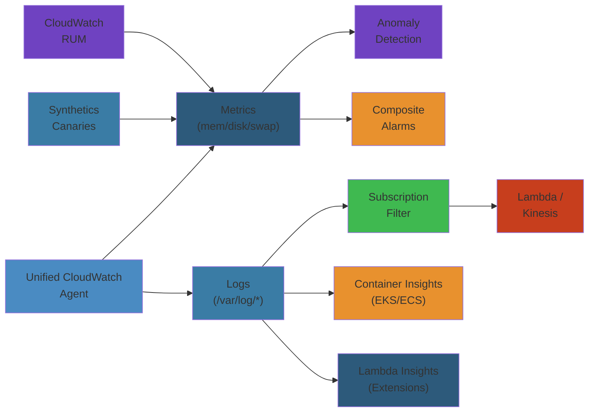

# 📊 CloudWatch Observability — Complete Deep Dive




## Table of Contents
- [CloudWatch Unified Agent](#cloudwatch-unified-agent)
- [Metrics: Resolution, Retention, High-Res, Math](#metrics-resolution-retention-high-res-math)
- [Anomaly Detection & Composite Alarms](#anomaly-detection--composite-alarms)
- [Log Groups, Streams & Metric Filters](#log-groups-streams--metric-filters)
- [Subscription Filters & Live Tail](#subscription-filters--live-tail)
- [Contributor Insights](#contributor-insights)
- [Container Insights & Lambda Insights](#container-insights--lambda-insights)
- [Synthetics (Canaries) & RUM](#synthetics-canaries--rum)
- [ServiceLens & Evidently](#servicelens--evidently)
- [Logs Insights](#logs-insights)
- [Alarms & Dashboards](#alarms--dashboards)
- [Metric Streams & OpenTelemetry](#metric-streams--opentelemetry)
- [Best Practices & Cost Optimization](#best-practices--cost-optimization)
- [Simplest Mental Model](#simplest-mental-model)

---

## CloudWatch Unified Agent

Single agent replacing old awslogs + monitoring scripts. One binary, one config file.

**Data sources**: collectd (CPU, memory, disk, net, swap), statsd (custom app metrics like latency, error rates), procstat (per-process CPU/memory/fds), logs (JSON, CSV, syslog, multi-line with timestamp parsing), X-Ray traces (daemon mode).

**Config**: `/opt/aws/amazon-cloudwatch-agent/etc/amazon-cloudwatch-agent.json`. Generate interactively with `amazon-cloudwatch-agent-config-wizard`. Windows + Linux support.

## Metrics: Resolution, Retention, High-Res, Math

```text
1 sec -> 3 hours (high-res) | 1 min -> 15 days (standard) | 5 min -> 63 days | 1 hour -> 455 days
```

**Standard**: 1-min granularity. Free for AWS services. **High-res**: `--storage-resolution 1` for custom metrics. Stored at 1-sec for 3h then aggregated. For real-time dashboards, SLOs.

**Metric math**: `SUM(m1,m2)`, `RATE(m1)`, `IF(m1>90,m1,0)`, `FILL(m1,0)`. Error rate: `SUM(errors)/SUM(total)*100`.

## Anomaly Detection & Composite Alarms

**Anomaly Detection**: ML band (mean +/- 2 sigma) around expected metric. 2-week training. Auto-adjusts for daily/weekly patterns. Outside band = anomaly. No manual threshold tuning. Works as alarm threshold.

**Composite Alarms**: Combine child alarms with AND/OR. `(CPUAlarm AND MemoryAlarm) OR DiskAlarm`. Reduces alert fatigue.

## Log Groups, Streams & Metric Filters

**Log Group**: Collection per source (`/aws/lambda/my-fn`). Sets retention, encryption, metric filters.
**Log Stream**: Sequence from one source instance (Lambda invocation, ECS container).

**Metric Filters**: Real-time log -> metric.

```text
Pattern: "ERROR" -> Namespace: MyApp, Metric: ErrorCount, Value: 1
JSON: { $.status = "error" } -> Metric: Errors, Dims: {service: $service}
```

$0.50/month per filter. Cheaper than custom metrics.

## Subscription Filters & Live Tail

**Subscription Filters**: Stream logs to Kinesis/Firehose/Lambda in real-time. For processing, analytics, alerting. Cross-account via destination policy.

**Live Tail**: `aws logs tail /aws/lambda/my-function --follow`. Real-time tail. Filter by include/exclude pattern. Watch multiple log groups.

## Contributor Insights

Top-N contributor analysis from log data. **Built-in rules**: VPC Flow Logs (top talkers by bytes), Route53 (top queried domains), API Gateway (top requesters). **Custom**: JSON field + aggregation + sort. Example: `$.userIdentity.arn` as contributor -> count -> top 10.

## Container Insights & Lambda Insights

**Container Insights**: CPU, memory, network, disk per ECS/EKS task/pod/node/cluster. ECS Fargate: enabled by default. ECS EC2: deploy agent as Daemon service. EKS: CloudWatch agent DaemonSet + fluentd log router. Pre-built dashboards for drill-down from cluster to container.

**Lambda Insights**: Per-invocation telemetry for cold starts, init duration, CPU, network I/O, disk I/O. Enable via Lambda extension layer (AWS managed, per-region). Visualizes cold vs warm start patterns. Helps right-size memory allocation.

## Synthetics (Canaries) & RUM

**Synthetics (Canaries)**: Scripted Node.js/Python tests.

```text
HeartbeatMonitor: GET /health -> 200 OK
APICanary: POST /api -> validate response body + timing < 500ms
VisualMonitoring: Screenshot + baseline comparison -> detect visual diffs
```

Schedule: rate(1 min+) or cron. Alarms on failure, duration, visual change.

**RUM (Real User Monitoring)**: Client-side JavaScript SDK. Core Web Vitals (LCP, FID, CLS), page load timing, JS errors, XHR/fetch performance. Real user sessions, no sampling.

## ServiceLens & Evidently

**ServiceLens**: Unified X-Ray + CloudWatch. Service map (ALB -> App -> RDS) with latency, error rate, CPU per node. Click node -> correlating traces + metrics.

**Evidently**: A/B testing + feature flags. Control/treatment variations. Traffic split + metrics analysis. Launch types: feature flag (on/off), A/B experiment (metric-driven), user override. Segment by attributes.

## Logs Insights

SQL-like query engine.

```sql
-- Top errors by hour
fields @timestamp, @message | filter @message like /ERROR/
| stats count() by bin(1h) | sort count desc | limit 10

-- P99 latency by endpoint
fields @duration | stats pct(@duration, 99) by @requestEndpoint

-- Parse JSON logs
parse @message '{ "latency": * }' as latency | stats avg(latency) by bin(5m)

-- Slowest requests
fields @timestamp, @requestId, @duration
| sort @duration desc | limit 20
| display @timestamp, @requestId, @duration
```

**Key functions**: `fields`, `filter`, `stats` (count/sum/avg/pct), `parse`, `sort`, `limit`, `display`, `bin`. 10 GB/query limit. 15-min timeout.

## Alarms & Dashboards

**Alarms**: OK/ALARM/INSUFFICIENT_DATA. Period 60-600s. N of M datapoints. Actions: SNS, Auto Scaling, SSM. Missing data: breaching/notBreaching/ignore. Use composite alarms to reduce noise.

**Dashboards**: Line, stacked, number, gauge, heatmap, log table. Export/import JSON. Permissions: `cloudwatch:GetDashboard`. Automate with CloudFormation/CDK.

## Metric Streams & OpenTelemetry

**Metric Streams**: Real-time to Kinesis Firehose. Destinations: OpenSearch, S3, Datadog, New Relic, Splunk, Lambda. Filter by namespace + metric. OTel JSON format. $0.003/1000 updates.

**OTel vs CW Agent**: OTel = CNCF standard, multi-exporter (AWS, Datadog, Prometheus), YAML pipelines. CW Agent = AWS-only, JSON. Use OTel for multi-cloud. CW Agent for AWS-only.

## Best Practices & Cost Optimization

**Log strategy**: Structured JSON logging. 30d retention dev, 90d prod. Archive older to S3.

**Metric strategy**: High-res only for SLOs. Metric math + anomaly detection over static thresholds. Metric filters cheaper than custom metrics for log-derived data.

**Alarm strategy**: Composite alarms to reduce noise. OK actions for resolution notification. Test in non-production.

| Optimization | Impact |
|----------|--------|
| Log retention: 1mo dev, 3mo prod, archive to S3 | Lower storage cost |
| 60s resolution unless high-res needed | Fewer data points |
| Aggregate custom metrics before sending | Fewer metric data points |
| Filter DEBUG log streams | Less ingestion cost |
| Composite alarms instead of individual | Fewer SNS notifications |
| Dashboard refresh 300s for steady state | Lower API cost |
| Metric streams instead of polling for 3rd party | Cheaper integration |

## Cross-Account Observability

**CloudWatch Cross-Account**: Central monitoring account views metrics/logs from many source accounts. Requires resource policies on source log groups/metrics. Use `aws:SourceAccount` condition. Accounts register with PutMetricData permissions.

**Setup**: Enable sharing in monitoring account. Configure source account resource policies. Monitoring account creates cross-account dashboards.

**Multi-account alarms**: Monitoring account sets alarms on source account metrics. SNS topic in monitoring account. Source account can't see monitoring account alarms.

**Telemetry API / Lambda Extensions**: Lambda extensions plugin telemetry data. `Telemetry API` receives info from Lambda runtime. Extensions process: CloudWatch Logs extension, Lambda Insights extension, custom extensions (OTel, Datadog, New Relic). Extension lifecycle: INIT (register), INVOKE (receive), SHUTDOWN (cleanup). Use `OPENTELEMETRY_COLLECTOR_CONFIG_FILE` env var.

## CloudTrail Integration

CloudWatch Logs can ingest CloudTrail event logs. Create CloudTrail trail -> send events to CloudWatch Logs. Metric filters on CloudTrail logs: Console login failures, unauthorized API calls, root activity. Filter pattern examples:

```text
{ ($.eventName = "ConsoleLogin") && ($.responseElements.ConsoleLogin = "Failure") }
{ ($.errorCode = "AccessDenied" || $.errorCode = "UnauthorizedOperation") }
{ ($.userIdentity.type = "Root") && ($.eventSource = "ec2.amazonaws.com") }
```

Set alarms: ConsoleLogin failure alarm, root usage alarm. Security monitoring without third-party SIEM.

## Lambda Advanced Monitoring

**Cold start tracking**: Lambda Insights shows cold start frequency by version/alias. Memory allocation determines CPU allocation (linearly scales with memory). Provisioned Concurrency eliminates cold starts but costs.

**Async invocation monitoring**: DLQ for failed async invocations. Destination on success/failure -> EventBridge. Dead-letter queue (SQS/SNS). Monitor `DeadLetterErrors` metric.

**Stream-based invocation**: DynamoDB/Kinesis streams. IteratorAge metric shows processing lag. > 10 minutes = scale shard processing. Report BatchItemFailures for partial failure.

**Error monitoring**: `Errors` metric. `Throttles` for concurrent invocation limits. `ConcurrentExecutions` should not exceed regional limit (1000). `UnreservedConcurrentExecutions`.

## VPC Flow Logs with CloudWatch

Publish VPC Flow Logs to CloudWatch Logs. Fields: src/dst IP, src/dst port, protocol, packets, bytes, action (ACCEPT/REJECT), TCP flags, flow direction.

**Security use**: Rejected traffic -> who's probing. Unusual IP ranges -> potential scanning. Port scanning patterns -> security group review.

**Cost use**: Top talkers by bytes -> identify bandwidth hogs. Cross-AZ traffic -> AZ affinity optimizations.

**Contributor Insights**: `$.srcAddr` as contributor, aggregate by `$.bytes`. Top talker table. Scheduled reports.

## EventBridge Integration

CloudWatch alarms trigger EventBridge events -> Lambda, SQS, Step Functions.

**Event pattern**:
```json
{
  "source": ["aws.cloudwatch"],
  "detail-type": ["CloudWatch Alarm State Change"],
  "detail": { "state": { "value": ["ALARM"] }, "alarmName": [{"prefix": "Prod-"}] }
}
```

**Automated remediation**: EventBridge -> Lambda (restart EC2, increase ASG) -> SNS notification. Route to incident management (PagerDuty via SNS). Execute SSM Automation documents.

---

## Simplest Mental Model

> **CloudWatch = mission control room for AWS infrastructure.**
>
> Metrics = gauges on the wall. Logs = paper tapes printing everything. Metric filters = sensors that beep on keywords. Alarms = bells when gauges hit red. Dashboards = configured wall displays. Logs Insights = search box for past events. Contributor Insights = who's talking most on the radio. ServiceLens = big board showing how everything connects. Synthetics = robots pressing buttons to verify things work. RUM = dashcam of real user experience.
>
> **Key rule**: CloudWatch costs can explode. Set log retention, filter unnecessary logs, use composite alarms, prefer metric math + anomaly detection. Observability should inform, not overwhelm.


---

## Code Examples

### Python: CloudWatch Metrics + Alarms Automation

```python
import boto3
import json
import time
from datetime import datetime, timedelta

cw = boto3.client("cloudwatch", region_name="us-east-1")

def put_high_res_metric(namespace, metric_name, value, dimensions, timestamp=None):
    """Emit a high-resolution custom metric."""
    ts = timestamp or datetime.utcnow()
    cw.put_metric_data(
        Namespace=namespace,
        MetricData=[{
            "MetricName": metric_name,
            "Dimensions": [{"Name": k, "Value": v} for k, v in dimensions.items()],
            "Value": value,
            "Unit": "Count",
            "Timestamp": ts,
            "StorageResolution": 1  # high-res
        }]
    )

def create_error_rate_alarm(namespace, metric_name, alarm_name, sns_topic_arn, threshold=5.0):
    """Create an anomaly-detecting alarm using metric math."""
    cw.put_metric_alarm(
        AlarmName=alarm_name,
        AlarmDescription=f"Error rate > {threshold}% for {metric_name}",
        Metrics=[
            {
                "Id": "e1",
                "MetricStat": {
                    "Metric": {"Namespace": namespace, "MetricName": f"{metric_name}_errors"},
                    "Period": 60, "Stat": "Sum"
                },
                "ReturnData": False
            },
            {
                "Id": "t1",
                "MetricStat": {
                    "Metric": {"Namespace": namespace, "MetricName": f"{metric_name}_total"},
                    "Period": 60, "Stat": "Sum"
                },
                "ReturnData": False
            },
            {
                "Id": "error_rate",
                "Expression": "e1 / t1 * 100",
                "Label": "Error Rate %",
                "ReturnData": True
            }
        ],
        EvaluationPeriods=2,
        Threshold=threshold,
        ComparisonOperator="GreaterThanThreshold",
        AlarmActions=[sns_topic_arn],
        OKActions=[sns_topic_arn]
    )

def query_logs_insights(log_groups, query, hours_back=24):
    """Run a CloudWatch Logs Insights query and wait for results."""
    logs = boto3.client("logs")
    start = int((datetime.utcnow() - timedelta(hours=hours_back)).timestamp() * 1000)
    end = int(datetime.utcnow().timestamp() * 1000)

    response = logs.start_query(
        logGroupNames=log_groups,
        startTime=start,
        endTime=end,
        queryString=query
    )
    query_id = response["queryId"]

    # Poll for results
    for _ in range(30):
        result = logs.get_query_results(queryId=query_id)
        if result["status"] == "Complete":
            return result["results"]
        time.sleep(1)
    raise TimeoutError("Logs Insights query timed out")
```

### TypeScript: CDK CloudWatch Dashboard

```typescript
import * as cw from "aws-cdk-lib/aws-cloudwatch";
import * as logs from "aws-cdk-lib/aws-logs";
import { Duration } from "aws-cdk-lib";

export function createServiceDashboard(scope: any, serviceName: string) {
  const dashboard = new cw.Dashboard(scope, `${serviceName}Dashboard`, {
    dashboardName: `${serviceName}-dashboard`,
  });

  const errorMetric = new cw.Metric({
    namespace: serviceName,
    metricName: "Errors",
    statistic: "Sum",
    period: Duration.minutes(1),
  });

  const latencyMetric = new cw.Metric({
    namespace: serviceName,
    metricName: "Latency",
    statistic: "p99",
    period: Duration.minutes(1),
  });

  dashboard.addWidgets(
    new cw.GraphWidget({
      title: "Error Rate (p99)",
      left: [errorMetric],
      right: [latencyMetric],
      statisticSet: [
        { metric: errorMetric, label: "Errors", color: "#ff0000", stat: "Sum" },
      ],
    }),
    new cw.SingleValueWidget({
      title: "Current Status",
      metrics: [errorMetric, latencyMetric],
    }),
    new cw.LogQueryWidget({
      title: "Recent Errors",
      logGroupNames: [`/aws/lambda/${serviceName}`],
      queryString: "fields @timestamp, @message\n| filter @message like /ERROR/\n| sort @timestamp desc\n| limit 20",
    })
  );

  return dashboard;
}
```

## Production Failure Modes

### Failure 1: Log Ingestion Cost Explosion

| Aspect | Detail |
|--------|--------|
| **Symptoms** | Monthly AWS bill 3x higher than expected; CloudWatch Logs cost exceeds EC2 compute cost |
| **Root Cause** | Debug/TRACE log level enabled in production; verbose frameworks (e.g., Django debug toolbar) logging per-request details; no log retention policy set (defaults to Never Expire) |
| **Detection** | Cost Explorer showing Logs cost spike; `aws logs describe-log-groups` returns groups with `retentionInDays: null` |
| **Recovery** | Set retention policy: `aws logs put-retention-policy --log-group-name /aws/lambda/my-fn --retention-in-days 30`. Create export task to S3 for archival |
| **Prevention** | Enforce retention via CloudFormation/CDK/IAM policy: `"Effect": "Deny"` on `logs:CreateLogGroup` without retention. Use subscription filter to drop DEBUG levels. Set budget alarms at 80% forecast |

### Failure 2: Alarm Fatigue from Flapping

| Aspect | Detail |
|--------|--------|
| **Symptoms** | On-call engineers ignore pages; alerts firing every few minutes then clearing; critical alarms marked as spam |
| **Root Cause** | Alarm period too short (e.g., 60s) with 1 evaluation period; metric has natural brief spikes above threshold; no composite alarm logic |
| **Detection** | `aws cloudwatch describe-alarm-history` shows repeated OK-ALARM-OK cycles within minutes. High `AlarmName` count in SNS delivery logs |
| **Recovery** | Increase evaluation periods to 3 of 5 (3 consecutive breaching datapoints). Add `TreatMissingData: notBreaching` |
| **Prevention** | Use composite alarms: `(CPUAlarm AND MemoryAlarm) OR LatencyAlarm`. Use anomaly detection instead of static thresholds. Implement OK actions for resolved notifications |

### Failure 3: Cross-Account Metric Visibility Broken

| Aspect | Detail |
|--------|--------|
| **Symptoms** | Dashboards in central monitoring account show "No data"; CloudWatch cross-account metrics return empty |
| **Root Cause** | Resource policy missing or misconfigured on source account; `aws:SourceAccount` condition uses wrong account ID; IAM role in monitoring account lacks `cloudwatch:GetMetricData` |
| **Detection** | `aws cloudwatch get-metric-data --region us-east-1` returns no results with cross-account ARN. CloudTrail shows `AccessDenied` on `PutMetricData` |
| **Recovery** | Update resource policy: add `AWS:SourceArn` condition with correct monitoring account. Verify `cloudwatch:GetMetricData` on monitoring role |
| **Prevention** | Test cross-account setup with a single test metric first. Use AWS Organizations + `aws:PrincipalOrgID` for scalable multi-account policies |

### Failure 4: Logs Insights Query Timeout on Large Datasets

| Aspect | Detail |
|--------|--------|
| **Symptoms** | Queries consistently time out after 15 min; "Result stream not available" error; partial results returned |
| **Root Cause** | Query scanning 10 GB+ of log data with no time range filter; no index on frequently-queried fields; `stats` operation over unindexed field |
| **Detection** | Query error message includes "Time exceeded". Check `filter` line in query; if no time constraint, that's the cause |
| **Recovery** | Add explicit time boundary: `filter @timestamp > 2025-01-01T00:00:00Z`. Narrow log groups. Limit columns: `fields @timestamp, @message, @duration` |
| **Prevention** | Partition logs by day using Lambda subscription filter. Use `parse` early in query to extract fields before aggregation. Create metric filters for heavily-queried patterns |

### Failure 5: Metric Stream Data Loss

| Aspect | Detail |
|--------|--------|
| **Symptoms** | Third-party monitoring (Datadog/Splunk) shows gaps; CloudWatch Metric Streams Kinesis Firehose delivers incomplete data |
| **Root Cause** | Metric Streams namespace filter too broad causing throttling; Firehose buffer size/interval not tuned; destination S3 bucket lacks proper permissions |
| **Detection** | Check `aws cloudwatch list-metric-streams` for `LastUpdateTimestamp`. CloudWatch Metric Streams `MetricsRejectedCount` > 0. S3 access logs show 403 errors |
| **Recovery** | Narrow namespace filter to specific metrics. Increase Firehose buffer interval to 120s. Verify destination bucket policy includes `s3:PutObject` for Firehose |
| **Prevention** | Monitor `aws firehose describe-delivery-stream --destination-id` for `DeliveryStreamStatus: ACTIVE`. Set alarm on `MetricsRejectedCount` > 0 for 5 min |

## Interview Questions

### Q1 (Beginner): What is the difference between CloudWatch Metrics and CloudWatch Logs?

**Answer**: Metrics store numerical data points with timestamps (e.g., CPU utilization 75% at 12:00:00) and support aggregation, math, and alarm evaluation. Logs store unstructured or semi-structured text data (e.g., application log lines) with timestamp attributes. Metrics have retention based on resolution (1s data retained 3h, 1min data retained 15d, 1h data retained 455d). Logs retention is configurable per log group (1 day to 10 years or Never Expire). Metrics are cheaper for monitoring trends; logs are richer for debugging. Use metric filters to derive metrics from logs for cost efficiency.

### Q2 (Beginner): How do you set up a CloudWatch alarm that triggers when error rate exceeds 5%?

**Answer**: Create a composite alarm or metric math alarm. First, ensure your application emits both error count and total request count as custom metrics. Then define a metric math expression: `(error_count / total_count) * 100`. Set the alarm to evaluate this expression with a threshold of 5. Use 2-3 consecutive evaluation periods to prevent flapping. Set the alarm period to 1 minute for timely detection. Attach an SNS topic as the alarm action. For higher accuracy, use anomaly detection bands instead of static thresholds.

### Q3 (Mid-Level): Explain CloudWatch Contributor Insights and a real use case.

**Answer**: Contributor Insights analyzes log data to identify top-N contributors (e.g., highest-traffic IPs, most-accessed endpoints). It uses a rule defined by a JSON schema specifying the contributor key (e.g., `$.sourceIPAddress`) and an aggregation dimension (e.g., sum of bytes transferred). Built-in rules exist for VPC Flow Logs (top talkers), Route53 (top queried domains), and API Gateway (top requesters). A real use case: detecting a DDoS attack by identifying a single source IP contributing 1000x normal traffic volume via VPC Flow Logs. When the contributor deviates significantly from baseline, trigger an alarm. Cost: charged per log data scanned.

### Q4 (Senior): Design a multi-region observability strategy using CloudWatch for a global SaaS platform.

**Answer**: For a global SaaS, use a central monitoring account in us-east-1 (or a dedicated observability region). Each workload region sends metrics/logs to CloudWatch locally. Use CloudWatch cross-account observability: each source account grants read access to the central account via resource policies. The central account builds unified dashboards showing per-region latency, error rate, and traffic. Use Metric Streams (not polling) to forward key metrics to the central account for near real-time. For logs, use cross-account subscription filters to send a filtered subset (errors, warnings) to a central log group. Set per-region composite alarms in the central account. Use CloudWatch Synthetics canaries in each region to monitor regional endpoint health. Use AWS Transit Gateway + VPC Peering for cross-region metric stream data. For disaster recovery, replicate dashboards via CloudFormation StackSets to a backup region.

### Q5 (Senior): How would you reduce CloudWatch costs in an organization spending $50K/month on observability?

**Answer**: Follow a tiered strategy: (1) **Log retention**: Set development/test log groups to 7 days, production to 30-90 days. Archive older logs to S3 Glacier via export task. (2) **Metric filters**: Derive error counts from logs via metric filters ($0.50/filter/month) instead of emitting custom metrics per invocation. (3) **Resolution**: Use standard 60s resolution for business metrics; restrict high-res (1s) to SLO-critical metrics only. (4) **Log filtering**: Add subscription filters to drop DEBUG/TRACE log streams from ingestion. (5) **Composite alarms**: Replace 10 individual alarms with 1 composite alarm to reduce alarm evaluation cost. (6) **Dashboard refresh**: Set dashboard auto-refresh to 300s for steady-state views. (7) **Metric Streams**: Stream metrics to S3 for long-term storage instead of retaining in CloudWatch. (8) **Contributor Insights**: Limit to VPC Flow Logs and only during incident investigation. Expect 40-60% savings.

### Q6 (Staff): Compare CloudWatch vs OpenTelemetry for a multi-cloud observability strategy.

**Answer**: CloudWatch is deeply integrated with AWS but is a vendor lock-in for multi-cloud. OpenTelemetry (OTel) is a CNCF standard that works across AWS, GCP, Azure, and on-prem. For a multi-cloud strategy: use OTel Collector as the unified agent on all compute (EC2, GKE, AKS, on-prem). Configure OTel pipeline with multiple exporters: send metrics to CloudWatch (via AWS OTel exporter), Prometheus/Grafana, and a secondary SIEM. Use CloudWatch for AWS-native services (Lambda, API Gateway, RDS) via direct integration, and OTel for application-level instrumentation. The OTel Collector can run as a sidecar in EKS/GKE, extracting Kubernetes attributes via the k8sattributes processor. Key tradeoff: OTel requires more configuration and debugging but provides portability and avoids re-instrumentation if you switch clouds. Use CloudWatch Metric Streams to push OTel-collected metrics to third-party tools. For tracing, prefer OTel (W3C trace context) over X-Ray for multi-cloud since X-Ray is AWS-proprietary.

## Edge Cases and Advanced Scenarios

| Scenario | Challenge | Solution |
|----------|-----------|----------|
| **Microburst metrics** | 1-second spikes averaged out in 1-min metrics | Use high-res metrics (StorageResolution=1) for burst detection. Set alarm on `MAX` statistic, not `AVG` |
| **DLQ monitoring** | Lambda DLQ not triggering CloudWatch alarm | Create metric filter on Lambda `DestinationDeliveryFailures` log line. Set alarm on `DeadLetterErrors` metric |
| **Embedded Metric Format** | Log-based metrics have 1-min granularity ceiling | Use EMF (embedded metric format) JSON logs -> automatically extracted as high-res metrics by CloudWatch Lambda extension |
| **Multi-line logs** | Stack traces span multiple log events | Use unified agent with `multi_line_start_pattern` regex. In Logs Insights, `parse` with `@message` |
| **Throttled metric streams** | > 1000 metrics per second per stream | Split into multiple metric streams by namespace. Use SQS DLQ on Firehose for retry |
| **Cross-region dashboards** | Dashboard widget cannot query metrics from another region | Use Metric Streams to centralize metrics. For logs, replicate via subscription filters cross-region |

## Cross-References

- [EC2 Networking & Security](../ec2/02-ec2-networking-security.md) — VPC Flow Logs, instance metadata
- [ECS Deployment Patterns](../ecs/02-ecs-deployment-patterns.md) — Container Insights, ECS Exec
- [EKS Operations](../eks/02-eks-operations.md) — Prometheus, Grafana, kube-state-metrics
- [Kubernetes Observability](../../../07-kubernetes/06-kubernetes-observability.md) — Metrics Server, cAdvisor
- [SRE & Observability](../../../14-sre-observability/) — SLIs, SLOs, error budgets
