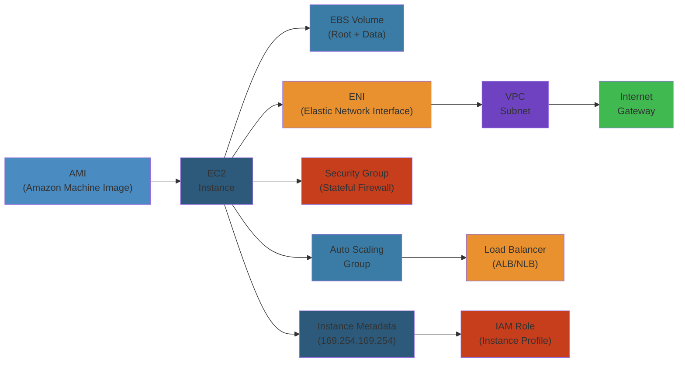

# 🖥️ Amazon EC2 — Complete Deep Dive

**Related**: [S3](../s3/01-s3-deep-dive.md) · [EBS](#ebs-volumes) · [Auto Scaling](#auto-scaling-groups) · [IAM](../iam/01-iam-deep-dive.md)

---




## Table of Contents

#### Step-by-Step
1. Process input
2. Validate
3. Execute
4. Return result

#### Code Example
```python
# Example implementation
pass
```

#### Real-World Scenario
This pattern is commonly used in production systems.


- [The Big Picture](#-the-big-picture)
- [1. Instance Types](#1-instance-types)
- [2. AMIs](#2-amis)
- [3. Security Groups](#3-security-groups)
- [4. Key Pairs](#4-key-pairs)
- [5. EBS Volumes](#5-ebs-volumes)
- [6. Elastic IPs](#6-elastic-ips)
- [7. Placement Groups](#7-placement-groups)
- [8. User Data](#8-user-data)
- [9. Spot Instances](#9-spot-instances)
- [10. Auto Scaling Groups](#10-auto-scaling-groups)
- [11. Launch Templates](#11-launch-templates)
- [12. Instance Metadata](#12-instance-metadata)
- [Simplest Mental Model](#-simplest-mental-model)

---

## 🧭 The Big Picture

#### Step-by-Step
1. Process input
2. Validate
3. Execute
4. Return result

#### Code Example
```python
# Example implementation
pass
```

#### Real-World Scenario
This pattern is commonly used in production systems.


```text
                       ┌─────────────────────────┐
                       │       Amazon EC2         │
                       │ (Elastic Compute Cloud)  │
                       ├─────────────────────────┤
                       │ Virtual Machines on      │
                       │ AWS infrastructure       │
                       └─────────────────────────┘
                                  │
              ┌───────────────────┼───────────────────┐
              ▼                   ▼                   ▼
      ┌──────────────┐   ┌──────────────┐   ┌──────────────┐
      │  Compute     │   │  Storage     │   │  Networking  │
      │  CPU/GPU     │   │  EBS/Instance│   │  VPC/SG/ENI  │
      │  Instance    │   │  Store/EFS   │   │  Elastic IP  │
      │  Families    │   │              │   │              │
      └──────────────┘   └──────────────┘   └──────────────┘
```

---

## 1. Instance Types

#### Step-by-Step
1. Process input
2. Validate
3. Execute
4. Return result

#### Code Example
```python
# Example implementation
pass
```

#### Real-World Scenario
This pattern is commonly used in production systems.


### Naming Convention

#### Step-by-Step
1. Process input
2. Validate
3. Execute
4. Return result

#### Code Example
```python
# Example implementation
pass
```

#### Real-World Scenario
This pattern is commonly used in production systems.


```text
m5.xlarge
││└─ Size (vCPU/memory grade)
│└── Generation (5th gen)
└── Family (general purpose)
```

### Instance Families

#### Step-by-Step
1. Process input
2. Validate
3. Execute
4. Return result

#### Code Example
```python
# Example implementation
pass
```

#### Real-World Scenario
This pattern is commonly used in production systems.


| Family | Names | Use Case |
|--------|-------|----------|
| **General Purpose** | t3, t4g, m5, m6i | Web servers, code repos, dev/test |
| **Compute Optimized** | c5, c6i, c7g | Batch processing, media transcoding, HPC |
| **Memory Optimized** | r5, r6i, x2gd, z1d | In-memory caches, real-time analytics |
| **Storage Optimized** | i3, i4i, d2, h1 | Data warehousing, Elasticsearch, Kafka |
| **Accelerated Computing** | p4, p5, g5, trn1 | ML training, rendering, gaming |

### t3/T4g Burstable Performance

#### Step-by-Step
1. Process input
2. Validate
3. Execute
4. Return result

#### Code Example
```python
# Example implementation
pass
```

#### Real-World Scenario
This pattern is commonly used in production systems.


```text
CPU Credits Model:
      CPU Usage
         ▲
         │   ┌─────────────────────────┐
         │   │     Burst (uses credits)│
  Baseline├───┤─────────────────────────┤
         │   │     Earn credits when    │
         │   │     below baseline       │
         │   └─────────────────────────┘
         └──────────────────────────► Time

  t3.nano    : baseline 5%,  credits 72 (earned/hr)
  t3.micro   : baseline 10%, credits 144
  t3.small   : baseline 20%, credits 288
  t3.medium  : baseline 20%, credits 576
  Unlimited  : can burst beyond credits (surcharge)
```

### Size Options

#### Step-by-Step
1. Process input
2. Validate
3. Execute
4. Return result

#### Code Example
```python
# Example implementation
pass
```

#### Real-World Scenario
This pattern is commonly used in production systems.


| Size | vCPU | Memory (GiB) | EBS Bandwidth |
|------|------|-------------|--------------|
| nano | 1 | 0.5 | Up to 0.5 Gbps |
| micro | 1 | 1 | Up to 1 Gbps |
| small | 1 | 2 | Up to 1 Gbps |
| medium | 1 | 4 | Up to 2 Gbps |
| large | 2 | 8 | Up to 3 Gbps |
| xlarge | 4 | 16 | Up to 5 Gbps |
| 2xlarge | 8 | 32 | Up to 10 Gbps |
| 4xlarge | 16 | 64 | Up to 20 Gbps |
| 8xlarge | 32 | 128 | Up to 40 Gbps |
| 16xlarge | 64 | 256 | Up to 80 Gbps |

---

## 2. AMIs

#### Step-by-Step
1. Process input
2. Validate
3. Execute
4. Return result

#### Code Example
```python
# Example implementation
pass
```

#### Real-World Scenario
This pattern is commonly used in production systems.


### AMI Anatomy

#### Step-by-Step
1. Process input
2. Validate
3. Execute
4. Return result

#### Code Example
```python
# Example implementation
pass
```

#### Real-World Scenario
This pattern is commonly used in production systems.


```text
┌───────────────────────────────────┐
│         Amazon Machine Image       │
├───────────────────────────────────┤
│  • Root volume template (EBS snap) │
│  • Launch permissions (who can use)│
│  • Block device mapping (volumes)  │
│  • Architecture (x86_64, arm64)    │
│  • Virtualization type (HVM, PV)   │
│  • Kernel ID, RAM disk ID          │
└───────────────────────────────────┘
```

### AMI Categories

#### Step-by-Step
1. Process input
2. Validate
3. Execute
4. Return result

#### Code Example
```python
# Example implementation
pass
```

#### Real-World Scenario
This pattern is commonly used in production systems.


| Category | Source | Update Cadence |
|----------|--------|----------------|
| AWS provided | AWS | Daily/Weekly |
| AWS Marketplace | Third party | Vendor managed |
| Community | Open source | Variable |
| Custom (yours) | Built from instance | On demand |

### Creating a Custom AMI

#### Step-by-Step
1. Process input
2. Validate
3. Execute
4. Return result

#### Code Example
```python
# Example implementation
pass
```

#### Real-World Scenario
This pattern is commonly used in production systems.


```text
Launch Instance
      │
      ▼
┌───────────────────┐
│ Configure         │
│ Install software  │
│ Apply patches     │
└─────────┬─────────┘
          │
          ▼
┌───────────────────┐
│ Create AMI from   │
│ EC2 instance      │
│ (reboot optional) │
└─────────┬─────────┘
          │
          ▼
┌───────────────────┐
│ Register AMI      │
│ Set permissions   │
│ Share if needed   │
└─────────┬─────────┘
          │
          ▼
┌───────────────────┐
│ Launch new        │
│ instances from AMI│
└───────────────────┘
```

```awscli
# Create AMI from instance
aws ec2 create-image \
  --instance-id i-1234567890abcdef0 \
  --name "MyApp-v1.0.0" \
  --no-reboot

# List AMIs
aws ec2 describe-images --owners self

# Deregister AMI
aws ec2 deregister-image --image-id ami-abc123

# Copy AMI across regions
aws ec2 copy-image \
  --source-region us-east-1 \
  --source-image-id ami-abc123 \
  --region eu-west-1 \
  --name "MyApp-copy"
```

---

## 3. Security Groups

#### Step-by-Step
1. Process input
2. Validate
3. Execute
4. Return result

#### Code Example
```python
# Example implementation
pass
```

#### Real-World Scenario
This pattern is commonly used in production systems.


### Security Group vs NACL

#### Step-by-Step
1. Process input
2. Validate
3. Execute
4. Return result

#### Code Example
```python
# Example implementation
pass
```

#### Real-World Scenario
This pattern is commonly used in production systems.


```text
Security Group (Instance Level)        NACL (Subnet Level)
┌─────────────────────────┐           ┌──────────────────────┐
│   STATEFUL              │           │   STATELESS           │
│   • Allow rules only    │           │   • Allow + Deny      │
│   • Inbound + Outbound  │           │   • Inbound + Outbound│
│   • Return traffic auto │           │   • Return traffic    │
│     allowed              │           │     must be explicit  │
│   • Evaluated as a whole│           │   • Evaluated by      │
│                         │           │     rule number       │
└─────────────────────────┘           └──────────────────────┘
```

### Security Group Rules

#### Step-by-Step
1. Process input
2. Validate
3. Execute
4. Return result

#### Code Example
```python
# Example implementation
pass
```

#### Real-World Scenario
This pattern is commonly used in production systems.


```json
{
  "IpPermissions": [
    {
      "IpProtocol": "tcp",
      "FromPort": 22,
      "ToPort": 22,
      "IpRanges": [
        { "CidrIp": "203.0.113.0/24", "Description": "Office VPN" }
      ]
    },
    {
      "IpProtocol": "tcp",
      "FromPort": 443,
      "ToPort": 443,
      "UserIdGroupPairs": [
        { "GroupId": "sg-123abc", "Description": "ALB Security Group" }
      ]
    }
  ]
}
```

### Rules Flow

#### Step-by-Step
1. Process input
2. Validate
3. Execute
4. Return result

#### Code Example
```python
# Example implementation
pass
```

#### Real-World Scenario
This pattern is commonly used in production systems.


```text
Inbound Internet Traffic
        │
        ▼
┌─────────────────────────────┐
│ Security Group (stateful)   │
│ Rule 1: Allow 22 from VPN   │  → SSH allowed
│ Rule 2: Allow 443 from sg-X │  → HTTPS from ALB
│ Rule 3: Allow 80 from sg-X  │  → HTTP from ALB
│ Default: Deny all           │  → Everything else blocked
└─────────────────────────────┘
        │
        ▼
┌─────────────────────────────┐
│        EC2 Instance         │
│   (traffic reaches app)    │
└─────────────────────────────┘
```

### Best Practices

#### Step-by-Step
1. Process input
2. Validate
3. Execute
4. Return result

#### Code Example
```python
# Example implementation
pass
```

#### Real-World Scenario
This pattern is commonly used in production systems.


| Practice | Reason |
|----------|--------|
| Use security group references instead of IP | Dynamic, no management |
| Don't use 0.0.0.0/0 for SSH | Security risk |
| Use separate SG per tier | App/Web/DB isolation |
| No default deny all outbound | May break patches |
| Limit to 5 SGs per ENI | AWS limit |

---

## 4. Key Pairs

#### Step-by-Step
1. Process input
2. Validate
3. Execute
4. Return result

#### Code Example
```python
# Example implementation
pass
```

#### Real-World Scenario
This pattern is commonly used in production systems.


### Key Pair Anatomy

#### Step-by-Step
1. Process input
2. Validate
3. Execute
4. Return result

#### Code Example
```python
# Example implementation
pass
```

#### Real-World Scenario
This pattern is commonly used in production systems.


```text
┌──────────────────────────┐
│      Key Pair            │
├───────────┬──────────────┤
│ Public    │ Private      │
│ Key       │ Key          │
│           │              │
│ AWS stores│ You download │
│ .pem in   │ once.        │
│ EC2       │ .pem or .ppk │
└───────────┴──────────────┘
```

### SSH Authentication Flow

#### Step-by-Step
1. Process input
2. Validate
3. Execute
4. Return result

#### Code Example
```python
# Example implementation
pass
```

#### Real-World Scenario
This pattern is commonly used in production systems.


```text
ssh -i my-key.pem ec2-user@<public-ip>
        │
        ▼
┌───────────────────────┐
│ Client sends public   │
│ key fingerprint       │
└──────────┬────────────┘
           │
           ▼
┌───────────────────────┐
│ EC2 checks            │
│ ~/.ssh/authorized_keys│
└──────────┬────────────┘
           │
           ▼
┌───────────────────────┐
│ Server encrypts       │
│ random string with    │
│ stored public key     │
└──────────┬────────────┘
           │
           ▼
┌───────────────────────┐
│ Client decrypts with  │
│ private key, returns  │
│ hash to server        │
└──────────┬────────────┘
           │
           ▼
┌───────────────────────┐
│ Authenticated!        │
└───────────────────────┘
```

---

## 5. EBS Volumes

#### Step-by-Step
1. Process input
2. Validate
3. Execute
4. Return result

#### Code Example
```python
# Example implementation
pass
```

#### Real-World Scenario
This pattern is commonly used in production systems.


### EBS Volume Types

#### Step-by-Step
1. Process input
2. Validate
3. Execute
4. Return result

#### Code Example
```python
# Example implementation
pass
```

#### Real-World Scenario
This pattern is commonly used in production systems.


| Type | Max IOPS | Max Throughput | Use Case |
|------|----------|---------------|----------|
| gp3 (SSD) | 16,000 | 1,000 MB/s | Most workloads |
| gp2 (SSD) | 16,000 | 250 MB/s | Legacy, boot volumes |
| io1 (SSD) | 64,000 | 1,000 MB/s | High-performance DBs |
| io2 Block Express | 256,000 | 4,000 MB/s | Mission-critical DBs |
| st1 (HDD) | 500 | 500 MB/s | Big data, Kafka |
| sc1 (HDD) | 250 | 250 MB/s | Cold data, backups |

### EBS vs Instance Store

#### Step-by-Step
1. Process input
2. Validate
3. Execute
4. Return result

#### Code Example
```python
# Example implementation
pass
```

#### Real-World Scenario
This pattern is commonly used in production systems.


```text
EBS Volume (Persistent)        Instance Store (Ephemeral)
┌──────────────────────┐      ┌──────────────────────┐
│ Network attached     │      │ Physically attached   │
│ Survives termination │      │ Lost on stop/terminate│
│ Replicated in AZ     │      │ Highest IOPS          │
│ Up to 64TB           │      │ Up to 7.5TB NVMe      │
│ Snapshots to S3      │      │ No snapshots          │
│ Encryption supported │      │ Encryption limited    │
└──────────────────────┘      └──────────────────────┘
```

### EBS Snapshots

#### Step-by-Step
1. Process input
2. Validate
3. Execute
4. Return result

#### Code Example
```python
# Example implementation
pass
```

#### Real-World Scenario
This pattern is commonly used in production systems.


```text
Snapshot Flow:
Instance ──Volume──> EBS ──Snapshot──> S3 (incremental)
   │                    │                    │
   │                    │                    │
   ▼                    ▼                    ▼
┌──────────┐     ┌──────────┐        ┌──────────┐
│ Running  │     │ Data in  │        │ Incremental
│ writes to │     │ EBS      │        │ blocks only
│ volume   │     │          │        │ (charged)
└──────────┘     └──────────┘        └──────────┘
```

```awscli
# Create snapshot
aws ec2 create-snapshot \
  --volume-id vol-1234567890abcdef0 \
  --description "Pre-update snapshot"

# Copy snapshot across regions
aws ec2 copy-snapshot \
  --source-region us-east-1 \
  --source-snapshot-id snap-abc123 \
  --region eu-west-1

# Create volume from snapshot
aws ec2 create-volume \
  --snapshot-id snap-abc123 \
  --availability-zone us-east-1a
```

---

## 6. Elastic IPs

#### Step-by-Step
1. Process input
2. Validate
3. Execute
4. Return result

#### Code Example
```python
# Example implementation
pass
```

#### Real-World Scenario
This pattern is commonly used in production systems.


### Elastic IP Flow

#### Step-by-Step
1. Process input
2. Validate
3. Execute
4. Return result

#### Code Example
```python
# Example implementation
pass
```

#### Real-World Scenario
This pattern is commonly used in production systems.


```text
Allocate EIP
    │
    ▼
┌────────────────────┐
│ Elastic IP          │
│ (static IPv4)       │
│                      │
│ 203.0.113.50        │
└────────┬───────────┘
         │
         ▼
┌────────────────────┐
│ Associate with     │
│ EC2 instance / ENI │
│                      │
│ Instance i-abc      │
└────────┬───────────┘
         │
    Instance stops
         │
         ▼
┌────────────────────┐
│ Disassociate       │
│ Reassociate to     │
│ new instance       │
└────────────────────┘
```

### Limits & Pricing

#### Step-by-Step
1. Process input
2. Validate
3. Execute
4. Return result

#### Code Example
```python
# Example implementation
pass
```

#### Real-World Scenario
This pattern is commonly used in production systems.


| Item | Limit | Cost |
|------|-------|------|
| EIPs per region | 5 (default, can increase) | Free when attached to running instance |
| Unattached EIPs | Soft limit | ~$0.005/hour |
| Remapping from stopped instance | Unlimited | Inefficient — use ENI instead |

---

## 7. Placement Groups

#### Step-by-Step
1. Process input
2. Validate
3. Execute
4. Return result

#### Code Example
```python
# Example implementation
pass
```

#### Real-World Scenario
This pattern is commonly used in production systems.


### Placement Group Strategies

#### Step-by-Step
1. Process input
2. Validate
3. Execute
4. Return result

#### Code Example
```python
# Example implementation
pass
```

#### Real-World Scenario
This pattern is commonly used in production systems.


```text
Cluster               Spread                 Partition
┌────────┐           ┌──┐ ┌──┐ ┌──┐        ┌────┐ ┌────┐ ┌────┐
│ ┌──┐   │           │A │ │B │ │C │        │P1 │ │P2 │ │P3 │
│ │A │   │           │  │ │  │ │  │        │ ── │ │ ── │ │ ── │
│ ├──┤   │           └──┘ └──┘ └──┘        │ A  │ │ D  │ │ G  │
│ │B │   │           Same rack?            │ B  │ │ E  │ │ H  │
│ └──┘   │           Different racks       │ C  │ │ F  │ │ I  │
└────────┘                                 └────┘ └────┘ └────┘
Same rack            Individual rack        Separate racks
Low latency           High availability     Fault isolation
```

| Type | Max per Group | Latency | Use Case |
|------|--------------|---------|----------|
| Cluster | 7 instances | Lowest (10 Gbps) | HPC, tightly coupled apps |
| Spread | 7 per AZ | Moderate | Critical small app set |
| Partition | 7 partitions per AZ | Moderate | Large distributed systems |

---

## 8. User Data

#### Step-by-Step
1. Process input
2. Validate
3. Execute
4. Return result

#### Code Example
```python
# Example implementation
pass
```

#### Real-World Scenario
This pattern is commonly used in production systems.


### User Data Script

#### Step-by-Step
1. Process input
2. Validate
3. Execute
4. Return result

#### Code Example
```python
# Example implementation
pass
```

#### Real-World Scenario
This pattern is commonly used in production systems.


```bash
#!/bin/bash
# cloud-init script — runs on first boot

# Update system
dnf update -y

# Install web server
dnf install -y httpd

# Deploy application
aws s3 cp s3://my-app-bucket/app-v1.tar.gz /var/www/html/
tar xzf /var/www/html/app-v1.tar.gz -C /var/www/html/

# Configure service
systemctl enable httpd
systemctl start httpd

# Register with load balancer
INSTANCE_ID=$(curl -s http://169.254.169.254/latest/meta-data/instance-id)
aws elbv2 register-targets \
  --target-group-arn arn:aws:elasticloadbalancing:...:targetgroup/my-tg/abc \
  --targets Id=$INSTANCE_ID
```

### Execution Flow

#### Step-by-Step
1. Process input
2. Validate
3. Execute
4. Return result

#### Code Example
```python
# Example implementation
pass
```

#### Real-World Scenario
This pattern is commonly used in production systems.


```text
Instance Launch
      │
      ▼
┌───────────────────┐
│ Cloud-Init runs   │
│ as root           │
│ /var/lib/cloud/   │
└─────────┬─────────┘
          │
          ▼
┌───────────────────┐
│ Execute user data │
│ (bash/powershell) │
│ /var/log/cloud-   │
│ init-output.log   │
└─────────┬─────────┘
          │
          ▼
┌───────────────────┐
│ Instance ready    │
│ State: running    │
│ Status checks: OK │
└───────────────────┘
```

---

## 9. Spot Instances

#### Step-by-Step
1. Process input
2. Validate
3. Execute
4. Return result

#### Code Example
```python
# Example implementation
pass
```

#### Real-World Scenario
This pattern is commonly used in production systems.


### Spot Pricing Model

#### Step-by-Step
1. Process input
2. Validate
3. Execute
4. Return result

#### Code Example
```python
# Example implementation
pass
```

#### Real-World Scenario
This pattern is commonly used in production systems.


```text
Price per Instance Hour
        ▲
        │   ┌────────────┐
        │   │ Spot       │
        │   │ Price      │─────── On-demand price
        │   └─────┬──────┘
        │         │          Spot price fluctuates
        │   ┌─────▼──────┐
        │   │ Interrupt  │  ← 2-minute warning when
        │   │           │     price exceeds bid
        │   └───────────┘
        └────────────────────────────► Time
```

### Interruption Handling

#### Step-by-Step
1. Process input
2. Validate
3. Execute
4. Return result

#### Code Example
```python
# Example implementation
pass
```

#### Real-World Scenario
This pattern is commonly used in production systems.


```text
Spot Instance receives termination notice
                │
        (2-minute warning via metadata)
                ▼
┌───────────────────────────────┐
│ Handle via:                   │
│                               │
│ Option 1: Graceful shutdown   │
│   • Save checkpoint to S3     │
│   • Drain connections         │
│   • Terminate cleanly         │
│                               │
│ Option 2: Rebalance           │
│   • Launch Spot Fleet to      │
│     replace interrupted       │
│                               │
│ Option 3: Persist (persistent │
│   request)                    │
│   • Auto-launch when price    │
│     drops again               │
└───────────────────────────────┘
```

### Spot vs On-Demand vs Reserved

#### Step-by-Step
1. Process input
2. Validate
3. Execute
4. Return result

#### Code Example
```python
# Example implementation
pass
```

#### Real-World Scenario
This pattern is commonly used in production systems.


| Aspect | On-Demand | Reserved (1yr) | Reserved (3yr) | Spot |
|--------|-----------|----------------|----------------|------|
| Cost vs On-Demand | 100% | ~60% | ~40% | ~70% discount |
| Commitment | None | Upfront optional | Upfront optional | None |
| Interruption | Never | Never | Never | 2-min notice |
| Best for | Short-lived | Predictable loads | Steady state | Fault-tolerant |

---

## 10. Auto Scaling Groups

#### Step-by-Step
1. Process input
2. Validate
3. Execute
4. Return result

#### Code Example
```python
# Example implementation
pass
```

#### Real-World Scenario
This pattern is commonly used in production systems.


### ASG Architecture

#### Step-by-Step
1. Process input
2. Validate
3. Execute
4. Return result

#### Code Example
```python
# Example implementation
pass
```

#### Real-World Scenario
This pattern is commonly used in production systems.


```text
┌──────────────────────────────────────┐
│         Auto Scaling Group           │
│                                      │
│  Min: 2     Desired: 4     Max: 8    │
│                                      │
│  ┌──────────────────────────────┐    │
│  │    EC2 Instances             │    │
│  │  ┌──┐ ┌──┐ ┌──┐ ┌──┐      │    │
│  │  │A │ │B │ │C │ │D │      │    │
│  │  └──┘ └──┘ └──┘ └──┘      │    │
│  │  AZ-a      AZ-b            │    │
│  └──────────────────────────────┘    │
│                                      │
│  Scaling Policies:                   │
│  • CPU > 75% → +2 instances         │
│  • CPU < 25% → -1 instance          │
└──────────────────────────────────────┘
```

### Scaling Policies

#### Step-by-Step
1. Process input
2. Validate
3. Execute
4. Return result

#### Code Example
```python
# Example implementation
pass
```

#### Real-World Scenario
This pattern is commonly used in production systems.


```json
{
  "TargetTrackingScalingPolicyConfiguration": {
    "TargetValue": 60.0,
    "PredefinedMetricSpecification": {
      "PredefinedMetricType": "ASGAverageCPUUtilization"
    },
    "ScaleInCooldown": 60,
    "ScaleOutCooldown": 60
  }
}
```

### Lifecycle Hooks

#### Step-by-Step
1. Process input
2. Validate
3. Execute
4. Return result

#### Code Example
```python
# Example implementation
pass
```

#### Real-World Scenario
This pattern is commonly used in production systems.


```text
┌────────────┐
│ Launch     │
│ Instance   │
└─────┬──────┘
      │
      ▼
┌────────────┐     ┌──────────────┐
│ Pending    │────►│ Hook: Wait   │────► Event to SNS/SQS
│            │     │ for health   │      (install app, join cluster)
└────────────┘     └──────┬───────┘
      ▲                   │ Complete
      │                   ▼
      │            ┌──────────────┐
      │            │ Pending:Wait │
      └────────────│ (timeout or  │
                   │  signal)     │
                   └──────┬───────┘
                          ▼
                   ┌──────────────┐
                   │  InService   │
                   └──────────────┘
```

---

## 11. Launch Templates

#### Step-by-Step
1. Process input
2. Validate
3. Execute
4. Return result

#### Code Example
```python
# Example implementation
pass
```

#### Real-World Scenario
This pattern is commonly used in production systems.


### Launch Template Components

#### Step-by-Step
1. Process input
2. Validate
3. Execute
4. Return result

#### Code Example
```python
# Example implementation
pass
```

#### Real-World Scenario
This pattern is commonly used in production systems.


```json
{
  "LaunchTemplateName": "my-app-v2",
  "VersionDescription": "Production version with AMI v1.2.3",
  "ImageId": "ami-0abcdef1234567890",
  "InstanceType": "t3.large",
  "KeyName": "production-key",
  "SecurityGroupIds": ["sg-123abc", "sg-456def"],
  "UserData": "IyEvYmluL2Jhc2gK... (base64)",
  "IamInstanceProfile": {
    "Arn": "arn:aws:iam::123456789012:instance-profile/my-ec2-role"
  },
  "BlockDeviceMappings": [
    {
      "DeviceName": "/dev/xvda",
      "Ebs": {
        "VolumeSize": 50,
        "VolumeType": "gp3",
        "Encrypted": true
      }
    }
  ],
  "Placement": {
    "GroupName": "my-cluster-pg"
  },
  "TagSpecifications": [
    {
      "ResourceType": "instance",
      "Tags": [
        { "Key": "Environment", "Value": "production" }
      ]
    }
  ]
}
```

### Versioning

#### Step-by-Step
1. Process input
2. Validate
3. Execute
4. Return result

#### Code Example
```python
# Example implementation
pass
```

#### Real-World Scenario
This pattern is commonly used in production systems.


```text
Launch Template: my-app
  Version 1: AMI v1.0, t3.medium, 30GB gp2
  Version 2: AMI v1.1, t3.large, 50GB gp3
  Version 3: AMI v2.0, t3.large, 50GB gp3, new SG
  Version $Default: currently version 3
  Version $Latest: version 3
```

---

## 12. Instance Metadata

#### Step-by-Step
1. Process input
2. Validate
3. Execute
4. Return result

#### Code Example
```python
# Example implementation
pass
```

#### Real-World Scenario
This pattern is commonly used in production systems.


### Metadata Endpoints

#### Step-by-Step
1. Process input
2. Validate
3. Execute
4. Return result

#### Code Example
```python
# Example implementation
pass
```

#### Real-World Scenario
This pattern is commonly used in production systems.


```text
Link-local address: http://169.254.169.254/latest/meta-data/

Available paths:
├── ami-id
├── ami-launch-index
├── ami-manifest-path
├── block-device-mapping/
│   ├── ami
│   └── root
├── hostname
├── iam/
│   ├── info
│   └── security-credentials/<role-name>
├── instance-id
├── instance-type
├── local-hostname
├── local-ipv4
├── mac
├── network/
│   ├── interfaces/
│   │   └── macs/
│   │       ├── device-number
│   │       ├── ipv4-associations
│   │       ├── local-hostname
│   │       ├── local-ipv4s
│   │       ├── mac
│   │       ├── owner-id
│   │       ├── security-group-ids
│   │       ├── security-groups
│   │       ├── subnet-id
│   │       └── vpc-id
│   └── public-keys/
├── placement/
│   ├── availability-zone
│   ├── region
│   └── partition
├── public-hostname
├── public-ipv4
├── reservation-id
├── security-groups
├── services/
│   └── domain
└── tags/
    └── instance/
        └── <tag-name>
```

### Retrieving Metadata

#### Step-by-Step
1. Process input
2. Validate
3. Execute
4. Return result

#### Code Example
```python
# Example implementation
pass
```

#### Real-World Scenario
This pattern is commonly used in production systems.


```bash
# Get instance ID
TOKEN=$(curl -X PUT "http://169.254.169.254/latest/api/token" \
  -H "X-aws-ec2-metadata-token-ttl-seconds: 21600")
curl http://169.254.169.254/latest/meta-data/instance-id \
  -H "X-aws-ec2-metadata-token: $TOKEN"

# Get region
curl http://169.254.169.254/latest/meta-data/placement/region \
  -H "X-aws-ec2-metadata-token: $TOKEN"

# Get IAM role credentials
curl http://169.254.169.254/latest/meta-data/iam/security-credentials/my-role \
  -H "X-aws-ec2-metadata-token: $TOKEN"
```

### IMDSv1 vs IMDSv2

#### Step-by-Step
1. Process input
2. Validate
3. Execute
4. Return result

#### Code Example
```python
# Example implementation
pass
```

#### Real-World Scenario
This pattern is commonly used in production systems.


| Feature | IMDSv1 | IMDSv2 |
|---------|--------|--------|
| Authentication | None | Session token required |
| Method | GET | PUT + GET (token) |
| TTL | N/A | Configured per token |
| Default on new instances | Disabled | Enabled |
| SSRF protection | None | Token routing enforced |

---

## 🧠 Simplest Mental Model

#### Step-by-Step
1. Process input
2. Validate
3. Execute
4. Return result

#### Code Example
```python
# Example implementation
pass
```

#### Real-World Scenario
This pattern is commonly used in production systems.


```text
EC2 INSTANCE     =  A computer you rent by the hour.
                    You pick the CPU, RAM, and OS.

AMI              =  A pre-configured hard drive image.
                    Like buying a laptop with Windows vs macOS.

SECURITY GROUP   =  A firewall — bouncer at the door.
                    "Port 22 only from office IP."

KEY PAIR         =  Your house key. Lose it and you're locked out.
                    (no way to get back in!)

EBS VOLUME       =  An external USB drive (but fast).
                    Survives if you toss the laptop.

ELASTIC IP       =  A permanent mailing address.
                    Even if you move to a new house (instance),
                    mail still reaches you.

SPOT INSTANCE    =  Hotel standby rate. Great price but they
                    can kick you out with 2-min notice.

AUTO SCALING     =  A restaurant that adds more tables when
                    there's a line and removes them at closing.

PLACEMENT GROUP  =  Seating arrangements:
   Cluster       =  All friends at one table (low latency)
   Spread        =  Each at a different table (fault tolerant)
   Partition     =  Separate rooms (rack isolation)
```

---

**Next**: [Lambda](../lambda/01-lambda-deep-dive.md) — Serverless compute
